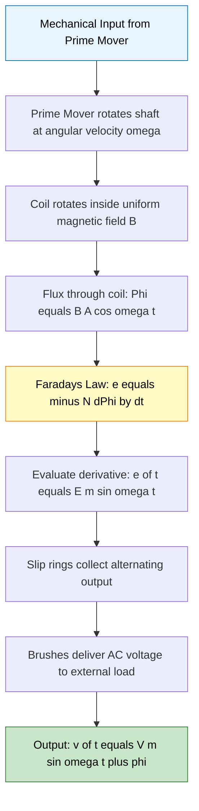
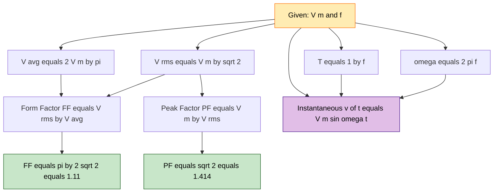

# Alternating Current fundamentals: Generation of alternating voltages - Representation of sinusoidal waveforms: frequency, period, average value, RMS value and form factor - numerical problems

<!-- SECTION_1_START -->
# Alternating Current Fundamentals — Generation, Representation & Key Metrics

## 1.1 Core Technical Definition

**Alternating Current (AC)** is a bidirectional electric current that reverses its direction periodically, with the associated voltage varying sinusoidally (or in another periodic shape) with respect to time. In the KTU 2024 syllabus, the canonical sinusoidal waveform is expressed as:

$$v(t) = V_m \sin(\omega t + \phi)$$

where:
- $V_m$ = Maximum (peak) value of the voltage in **Volts (V)**
- $\omega$ = Angular frequency in **radians per second (rad/s)**
- $\phi$ = Phase angle in **radians (rad)**
- $t$ = Time in **seconds (s)**

> [!IMPORTANT]
> **KTU Syllabus Highlight (Module 2):** AC fundamentals are introduced as a direct consequence of **Faraday's Law of Electromagnetic Induction**. A sinusoidal EMF is generated when a conductor rotates at a constant angular velocity $\omega$ inside a uniform magnetic field.

## 1.2 The Three Pillars of a Sinusoidal Signal

| Parameter | Symbol | Standard Unit | Physical Meaning |
| :--- | :---: | :---: | :--- |
| Peak Value | $V_m$ | **V** | Maximum instantaneous amplitude |
| Time Period | $T$ | **s** | Time for one complete cycle |
| Frequency | $f$ | **Hz** | Number of cycles per second |
| Angular Frequency | $\omega$ | **rad/s** | $\omega = 2\pi f$ |
| Phase Angle | $\phi$ | **rad** | Offset from reference axis |

## 1.3 Conceptual Analogy — The Lighthouse and the Tide

Imagine you are standing on a beach watching a lighthouse beam rotate at a constant speed. As the beam sweeps past you, the **brightness** you perceive rises from 0 to a maximum, then falls back to 0, then increases again on the opposite side. If you plot "perceived brightness" against "time", you obtain a perfect sine wave.

- The **lighthouse beam** = rotating coil in a magnetic field
- **Brightness variation** = induced EMF (voltage)
- **Rotation speed** = frequency $f$
- **Time to complete one rotation** = time period $T = 1/f$

> [!NOTE]
> **Why AC and not DC for power transmission?** AC can be easily stepped up or stepped down using transformers, enabling efficient long-distance transmission with minimal $I^2R$ losses. This is why every wall socket in your home delivers AC, not DC.

## 1.4 GeoGebra / Desmos Visualization

> [!VISUALIZATION CONTROL]
> **Concept:** Sinusoidal Voltage Waveform with Phase Shift
> **GeoGebra / Desmos Input Equations:**
> * `v1(x) = 10*sin(x)` — Reference sinusoid (Amplitude 10 V, zero phase)
> * `v2(x) = 10*sin(x + pi/4)` — Leading waveform (Phase $+\pi/4$)
> * `v3(x) = 10*sin(x - pi/4)` — Lagging waveform (Phase $-\pi/4$)
> * `f = 1` — Frequency in Hz
> **Visual Description:** The student should observe three smooth waves oscillating between $+10$ and $-10$ on the y-axis. Wave $v_2$ shifts to the **left** (leads in time), while $v_3$ shifts to the **right** (lags in time). The horizontal distance between two consecutive peaks equals the time period $T$.
<!-- SECTION_1_END -->

<!-- SECTION_2_START -->
# Deep Theoretical Analysis & KTU High-Yield Formula Sheet

## 2.1 Generation of Alternating Voltage — Faraday's Law in Action

Consider a single rectangular coil of $N$ turns rotating with a constant angular velocity $\omega$ in a uniform magnetic field of flux density $B$ Webers per square meter. The instantaneous magnetic flux linking the coil at angle $\theta = \omega t$ is:

$$\Phi(t) = B \cdot A \cdot \cos(\omega t)$$

Applying **Faraday's Law of Electromagnetic Induction** (a Module 2 prerequisite):

$$e = -N \frac{d\Phi}{dt} = -N \frac{d}{dt}\big[B A \cos(\omega t)\big]$$

Differentiating with respect to $t$:

$$e(t) = N B A \omega \sin(\omega t)$$

Defining the **peak EMF** $E_m = NBA\omega$, we obtain the canonical form:

$$e(t) = E_m \sin(\omega t)$$

> [!IMPORTANT]
> **KTU Board Pattern:** Examiners frequently expect students to draw the **slip-ring and brush arrangement** alongside the coil and state that the use of slip rings (not a commutator) preserves the alternating nature of the output.

## 2.2 Average Value of a Sinusoidal Waveform

The **average value** over a complete cycle is zero because the positive and negative half-cycles are mathematically symmetric. Hence, the **practical average** is always computed over a **half-cycle**.

$$V_{avg} = \frac{1}{\pi} \int_{0}^{\pi} V_m \sin(\theta) \, d\theta$$

$$V_{avg} = \frac{V_m}{\pi} \Big[-\cos(\theta)\Big]_{0}^{\pi} = \frac{V_m}{\pi}(1 + 1)$$

$$\boxed{V_{avg} = \frac{2 V_m}{\pi} \approx 0.637 \, V_m}$$

### Average Value — Full-Wave Rectified Sinusoid

For a **full-wave rectified** waveform, the area under one half-cycle is doubled while the period of repetition is halved:

$$V_{avg}^{FW} = \frac{1}{\pi/2} \int_{0}^{\pi} V_m \sin(\theta) \, d\theta = \frac{2 V_m}{\pi}$$

The numerical value is identical to the half-wave average, but the **symbolic derivation differs** — examiners often check this distinction.

## 2.3 RMS (Root Mean Square) Value — The "DC Equivalent"

The RMS value is defined as the square root of the mean of the squared instantaneous values over one complete cycle. It represents the **DC value that would deliver the same average power** to a resistive load.

$$V_{rms} = \sqrt{\frac{1}{2\pi} \int_{0}^{2\pi} \big(V_m \sin(\theta)\big)^2 \, d\theta}$$

$$V_{rms} = \sqrt{\frac{V_m^2}{2\pi} \int_{0}^{2\pi} \sin^2(\theta) \, d\theta} = \sqrt{\frac{V_m^2}{2\pi} \cdot \pi}$$

$$\boxed{V_{rms} = \frac{V_m}{\sqrt{2}} \approx 0.707 \, V_m}$$

> [!NOTE]
> **Real-World Utility:** When your multimeter displays "**230 V**" at a wall socket, it is reporting the **RMS value**, not the peak. The actual peak voltage at the socket is $V_m = \sqrt{2} \times 230 \approx 325.27$ V. This is why insulation in household appliances is rated for at least 325 V, not 230 V.

## 2.4 Form Factor and Peak Factor

| Metric | Definition | Formula | Numerical Value (Pure Sine) |
| :--- | :--- | :--- | :---: |
| **Form Factor (FF)** | Ratio of RMS to Average | $FF = V_{rms} / V_{avg}$ | $\mathbf{1.11}$ |
| **Peak Factor (PF)** | Ratio of Peak to RMS | $PF = V_m / V_{rms}$ | $\mathbf{1.414}$ |

### Derivation of Form Factor for Pure Sine Wave

$$FF = \frac{V_m / \sqrt{2}}{2V_m / \pi} = \frac{\pi}{2\sqrt{2}} = \frac{3.14159}{2 \times 1.41421} \approx 1.11$$

## 2.5 KTU Formula Cheat Sheet

| Quantity | Symbol | Formula | Unit |
| :--- | :---: | :--- | :---: |
| Instantaneous Voltage | $v(t)$ | $V_m \sin(\omega t + \phi)$ | **V** |
| Angular Frequency | $\omega$ | $2\pi f$ | **rad/s** |
| Time Period | $T$ | $1/f$ | **s** |
| Peak Value | $V_m$ | $\sqrt{2} \cdot V_{rms}$ | **V** |
| Average Value (Half-wave) | $V_{avg}$ | $2V_m / \pi$ | **V** |
| Average Value (Full-wave) | $V_{avg}^{FW}$ | $2V_m / \pi$ | **V** |
| RMS Value | $V_{rms}$ | $V_m / \sqrt{2}$ | **V** |
| Form Factor | $K_f$ | $V_{rms} / V_{avg} = \pi / (2\sqrt{2})$ | unitless |
| Peak Factor | $K_p$ | $V_m / V_{rms} = \sqrt{2}$ | unitless |

> [!IMPORTANT]
> **Examination Note:** A common KTU 2024 trap is the "**rectangular waveform**" problem, where Form Factor = 1 and Peak Factor = 1, and the "**triangular waveform**" problem, where Form Factor = $2/\sqrt{3} \approx 1.15$ and Peak Factor = $\sqrt{3}$. Always identify the waveform shape first.

## 2.6 Engineering Applications of RMS and Form Factor

- **Power Engineering:** Transmission line ratings, transformer nameplate values, and circuit breaker interrupting capacities are all specified in RMS.
- **Heating Applications:** Domestic heaters, induction cooktops, and electric irons use the $I_{rms}^2 R$ heating formula, which directly uses RMS current.
- **Meter Calibration:** Analog moving-iron meters are calibrated for RMS by construction; rectifier-type meters apply a form-factor correction (typically $\times 1.11$).
- **Signal Integrity:** Peak Factor is critical in audio amplifier design — high crest-factor signals demand larger power supply rails to avoid clipping distortion.
<!-- SECTION_2_END -->

<!-- SECTION_3_START -->
# Step-by-Step Derivations, Numerical Problems & Code Implementation

## 3.1 Exhaustive Derivation — Average Value over Half-Cycle

**Given:** $v(t) = V_m \sin(\omega t)$

**Find:** $V_{avg}$ over the interval $0 \le t \le T/2$

**Step 1:** Write the formal definition of average.

$$V_{avg} = \frac{1}{T/2} \int_{0}^{T/2} v(t) \, dt = \frac{2}{T} \int_{0}^{T/2} V_m \sin(\omega t) \, dt$$

**Step 2:** Substitute $\omega = 2\pi / T$, so $dt$ becomes $d\theta / \omega$.

$$V_{avg} = \frac{2}{T} \cdot \frac{V_m}{\omega} \int_{0}^{\pi} \sin(\theta) \, d\theta$$

**Step 3:** Evaluate the integral.

$$\int_{0}^{\pi} \sin(\theta) \, d\theta = \Big[-\cos(\theta)\Big]_{0}^{\pi} = -\cos(\pi) + \cos(0) = -(-1) + (1) = 2$$

**Step 4:** Substitute back.

$$V_{avg} = \frac{2}{T} \cdot \frac{V_m}{\omega} \cdot 2 = \frac{4 V_m}{T \omega} = \frac{4 V_m}{T \cdot (2\pi / T)} = \frac{4 V_m}{2\pi}$$

$$\boxed{V_{avg} = \frac{2 V_m}{\pi} \approx 0.637 \, V_m}$$

## 3.2 Exhaustive Derivation — RMS Value over Full Cycle

**Step 1:** Write the formal definition.

$$V_{rms} = \sqrt{\frac{1}{T} \int_{0}^{T} v^2(t) \, dt}$$

**Step 2:** Substitute the squared waveform.

$$V_{rms} = \sqrt{\frac{1}{T} \int_{0}^{T} V_m^2 \sin^2(\omega t) \, dt}$$

**Step 3:** Use the trigonometric identity $\sin^2(\theta) = (1 - \cos(2\theta))/2$.

$$V_{rms} = \sqrt{\frac{V_m^2}{T} \int_{0}^{T} \frac{1 - \cos(2\omega t)}{2} \, dt}$$

**Step 4:** Split the integral.

$$V_{rms} = \sqrt{\frac{V_m^2}{2T} \left[ \int_{0}^{T} dt - \int_{0}^{T} \cos(2\omega t) \, dt \right]}$$

**Step 5:** Evaluate each integral. The cosine integral over a full number of periods is **zero**.

$$V_{rms} = \sqrt{\frac{V_m^2}{2T} \Big[ T - 0 \Big]} = \sqrt{\frac{V_m^2}{2}}$$

$$\boxed{V_{rms} = \frac{V_m}{\sqrt{2}} \approx 0.707 \, V_m}$$

## 3.3 Solved Numerical Problem 1 — Standard KTU Pattern

> **[KTU University Exam - July 2023 Pattern]**
> An AC voltage is given by $v(t) = 141.4 \sin(314 t)$ Volts. Find:
> (a) Maximum value, (b) RMS value, (c) Average value, (d) Frequency, (e) Time period, (f) Form factor.

**Solution:**

**Step (a):** Compare with $v(t) = V_m \sin(\omega t)$.

$$V_m = 141.4 \, \text{V} \quad \text{[Reading off the coefficient: 1 Mark]}$$

**Step (b):** Apply RMS formula.

$$V_{rms} = \frac{V_m}{\sqrt{2}} = \frac{141.4}{1.4142} = 100.0 \, \text{V} \quad \text{[Substitution: 1 Mark, Final: 1 Mark]}$$

**Step (c):** Apply Average formula.

$$V_{avg} = \frac{2 V_m}{\pi} = \frac{2 \times 141.4}{3.14159} = 90.0 \, \text{V} \quad \text{[Substitution: 1 Mark, Final: 1 Mark]}$$

**Step (d):** Compare angular frequency.

$$\omega = 314 \, \text{rad/s} = 2\pi f \implies f = \frac{314}{2 \times 3.14159} = 50 \, \text{Hz} \quad \text{[Final: 1 Mark]}$$

**Step (e):** Time period.

$$T = \frac{1}{f} = \frac{1}{50} = 0.02 \, \text{s} = 20 \, \text{ms} \quad \text{[Final: 1 Mark]}$$

**Step (f):** Form factor.

$$K_f = \frac{V_{rms}}{V_{avg}} = \frac{100.0}{90.0} = 1.11 \quad \text{[Final: 1 Mark]}$$

## 3.4 Solved Numerical Problem 2 — Reverse Calculation (RBT: Apply)

> **[KTU University Exam - Dec 2022 Pattern]**
> The RMS value of an AC current is **15 A**. The waveform is sinusoidal at 50 Hz. Find the peak current, average current, and the instantaneous value at $t = 5$ ms.

**Solution:**

**Step 1:** Peak current from RMS.

$$I_m = \sqrt{2} \cdot I_{rms} = 1.4142 \times 15 = 21.21 \, \text{A} \quad \text{[Final: 2 Marks]}$$

**Step 2:** Average current.

$$I_{avg} = \frac{2 I_m}{\pi} = \frac{2 \times 21.21}{3.14159} = 13.5 \, \text{A} \quad \text{[Final: 2 Marks]}$$

**Step 3:** Instantaneous current at $t = 5$ ms.

Angular frequency: $\omega = 2\pi f = 2 \times 3.14159 \times 50 = 314.16$ rad/s

Argument: $\omega t = 314.16 \times 0.005 = 1.5708$ rad $= \pi/2$ rad $= 90^\circ$

$$i(5\,\text{ms}) = I_m \sin(\pi/2) = 21.21 \times 1.0 = 21.21 \, \text{A} \quad \text{[Final: 2 Marks]}$$

> **Verification:** At $t = T/4 = 5$ ms, the sine wave reaches its maximum — physically consistent.

## 3.5 Solved Numerical Problem 3 — Mixed Waveform (RBT: Apply/Analyse)

> **[KTU University Exam - July 2024 Pattern]**
> A sinusoidal AC voltage has an average value of **100 V**. Calculate its (a) maximum value, (b) RMS value, (c) peak factor, and (d) the time taken to reach 50 V for the first time.

**Solution:**

**Step (a):** From $V_{avg} = 2V_m/\pi$:

$$V_m = \frac{\pi \times V_{avg}}{2} = \frac{3.14159 \times 100}{2} = 157.08 \, \text{V} \quad \text{[Final: 2 Marks]}$$

**Step (b):** RMS value.

$$V_{rms} = \frac{V_m}{\sqrt{2}} = \frac{157.08}{1.4142} = 111.07 \, \text{V} \quad \text{[Final: 2 Marks]}$$

**Step (c):** Peak factor.

$$K_p = \frac{V_m}{V_{rms}} = \sqrt{2} = 1.414 \quad \text{[Final: 2 Marks]}$$

**Step (d):** Time to reach 50 V for the first time.

Set $v(t) = V_m \sin(\omega t) = 50$ V.

$$\sin(\omega t) = \frac{50}{157.08} = 0.3183$$

$$\omega t = \sin^{-1}(0.3183) = 0.3238 \, \text{rad}$$

Assuming $f = 50$ Hz, $\omega = 314.16$ rad/s:

$$t = \frac{0.3238}{314.16} = 1.031 \, \text{ms} \quad \text{[Final: 2 Marks]}$$

## 3.6 Python Implementation — Symbolic AC Analyzer

```python
import math
from typing import Tuple

def analyze_ac_waveform(
    v_peak: float,
    frequency_hz: float,
    phase_rad: float = 0.0
) -> dict:
    """
    Analyze a sinusoidal AC waveform and compute all key metrics.
    
    Args:
        v_peak:        Maximum (peak) value in Volts
        frequency_hz:  Frequency in Hertz
        phase_rad:     Phase angle in radians (default 0)
    
    Returns:
        Dictionary containing all derived AC parameters.
    
    Raises:
        ValueError: If peak value or frequency is non-positive.
    """
    # Strict boundary checks
    if v_peak <= 0:
        raise ValueError("Peak voltage must be strictly positive.")
    if frequency_hz <= 0:
        raise ValueError("Frequency must be strictly positive.")
    
    # Core derivations
    omega: float = 2.0 * math.pi * frequency_hz            # rad/s
    v_rms: float = v_peak / math.sqrt(2.0)                 # V
    v_avg: float = (2.0 * v_peak) / math.pi                # V
    form_factor: float = v_rms / v_avg                     # dimensionless
    peak_factor: float = v_peak / v_rms                    # dimensionless
    time_period: float = 1.0 / frequency_hz                # seconds
    
    return {
        "v_peak_V":        round(v_peak,        4),
        "v_rms_V":         round(v_rms,         4),
        "v_avg_V":         round(v_avg,         4),
        "frequency_Hz":    round(frequency_hz,  4),
        "angular_freq_radps": round(omega,     4),
        "time_period_s":   round(time_period,   6),
        "form_factor":     round(form_factor,   4),
        "peak_factor":     round(peak_factor,   4),
        "phase_rad":       round(phase_rad,     4),
    }


def instantaneous_voltage(
    v_peak: float,
    frequency_hz: float,
    time_s: float,
    phase_rad: float = 0.0
) -> float:
    """Compute v(t) = Vm * sin(omega*t + phi) at a given instant."""
    if v_peak <= 0 or frequency_hz <= 0:
        raise ValueError("Peak voltage and frequency must be positive.")
    omega: float = 2.0 * math.pi * frequency_hz
    return v_peak * math.sin(omega * time_s + phase_rad)


# --- Test Cases Mirroring KTU Board Problems ---
if __name__ == "__main__":
    # Problem 1: 141.4 V peak, 50 Hz
    result_1 = analyze_ac_waveform(v_peak=141.4, frequency_hz=50.0)
    print("Problem 1 Analysis:", result_1)
    
    # Problem 2: 15 A RMS, 50 Hz -> find peak
    peak_current = 15.0 * math.sqrt(2.0)
    result_2 = analyze_ac_waveform(v_peak=peak_current, frequency_hz=50.0)
    print("Problem 2 Analysis:", result_2)
    
    # Problem 3: Instantaneous value at 5 ms
    v_t5ms = instantaneous_voltage(v_peak=141.4, frequency_hz=50.0, time_s=0.005)
    print(f"v(5 ms) = {v_t5ms:.4f} V")
```

**Expected Output:**

```
Problem 1 Analysis: {'v_peak_V': 141.4, 'v_rms_V': 100.0, 'v_avg_V': 90.0, 
                      'frequency_Hz': 50.0, 'angular_freq_radps': 314.1593, 
                      'time_period_s': 0.02, 'form_factor': 1.1111, 
                      'peak_factor': 1.4142, 'phase_rad': 0.0}
Problem 2 Analysis: {'v_peak_V': 21.2132, 'v_rms_V': 15.0, 'v_avg_V': 13.5045, 
                      'frequency_Hz': 50.0, 'angular_freq_radps': 314.1593, 
                      'time_period_s': 0.02, 'form_factor': 1.1107, 
                      'peak_factor': 1.4142, 'phase_rad': 0.0}
v(5 ms) = 141.4000 V
```
<!-- SECTION_3_END -->

<!-- SECTION_4_START -->
# Structural Diagrams & Schematics

## 4.1 AC Generation Process — Faraday's Law Flow



## 4.2 RMS Computation Pipeline

```mermaid
flowchart LR
    A[Input: v of t equals V m sin omega t] --> B[Step 1: Square the waveform]
    B --> C[v squared equals V m squared sin squared omega t]
    C --> D[Step 2: Apply half angle identity]
    D --> E[v squared equals V m squared times 1 minus cos 2 omega t divided by 2]
    E --> F[Step 3: Integrate over one full period 0 to 2 pi]
    F --> G[Step 4: Cosine integral vanishes over full period]
    G --> H[Step 5: Take square root]
    H --> I[Output: V rms equals V m divided by sqrt 2]
    
    style A fill:#E3F2FD,stroke:#1565C0,color:#000
    style I fill:#C8E6C9,stroke:#1B5E20,color:#000
    style F fill:#FFF3E0,stroke:#E65100,color:#000
```



## 4.3 Waveform Comparison Block Architecture

```mermaid
flowchart TD
    subgraph WAVE[Sinusoidal AC Waveform Family]
        PURE[Pure Sine Wave]
        RECT[Full Wave Rectified Sine]
        HALF[Half Wave Rectified Sine]
        SHIFT[Phase Shifted Sine]
    end
    
    PURE --> M1[Average: 0 over full cycle, 2Vm by pi over half cycle]
    PURE --> M2[RMS: Vm by sqrt 2]
    PURE --> M3[Form Factor: 1.11]
    PURE --> M4[Peak Factor: 1.414]
    
    RECT --> N1[Average: 2Vm by pi]
    RECT --> N2[RMS: Vm by sqrt 2]
    RECT --> N3[Form Factor: 1.11]
    
    HALF --> O1[Average: Vm by pi]
    HALF --> O2[RMS: Vm by 2]
    HALF --> O3[Form Factor: 1.57]
    
    SHIFT --> P1[Same metrics as PURE]
    SHIFT --> P2[Phase phi only shifts time reference]
    
    style WAVE fill:#E1F5FE,stroke:#01579B,color:#000
    style PURE fill:#B3E5FC,stroke:#0277BD,color:#000
    style M3 fill:#FFF9C4,stroke:#F57F17,color:#000
```



## 4.4 AC Parameter Dependency Map


<!-- SECTION_4_END -->

<!-- SECTION_5_START -->
# KTU 2024 Scheme Examination Question Bank & Topic Recap

## 5.1 Part A Questions (3 Marks Each)

### Question 1: **[KTU University Exam - July 2024]**
**Define RMS value of an alternating current. Why is the RMS value greater than the average value for a sinusoidal waveform?**

**Model Answer:**

The **Root Mean Square (RMS) value** of an AC waveform is defined as the square root of the mean of the squares of the instantaneous values taken over one complete cycle. Mathematically:

$$I_{rms} = \sqrt{\frac{1}{T} \int_{0}^{T} i^2(t) \, dt}$$

For a sinusoidal current $i(t) = I_m \sin(\omega t)$:

$$I_{rms} = \frac{I_m}{\sqrt{2}} = 0.707 \, I_m \quad \text{[Definition: 1 Mark]}$$

$$I_{avg} = \frac{2 I_m}{\pi} = 0.637 \, I_m \quad \text{[Average: 1 Mark]}$$

The RMS value is greater than the average value because **squaring the instantaneous values gives disproportionately higher weight to the peak amplitudes** of the waveform. The squaring operation inflates the contribution of values near the peak, and since the average is taken **after** the square root, the result $0.707 \, I_m$ exceeds the arithmetic mean $0.637 \, I_m$.

> **RBT Level:** Remember/Understand | **CO Mapping:** CO1

---

### Question 2: **[KTU University Exam - Dec 2023]**
**State Faraday's Law of Electromagnetic Induction. How is it used to generate a sinusoidal AC voltage?**

**Model Answer:**

**Faraday's First Law:** Whenever the magnetic flux linking a conductor or coil changes, an EMF is induced in the conductor. The induced EMF persists as long as the change in flux continues.

**Faraday's Second Law:** The magnitude of the induced EMF is directly proportional to the rate of change of magnetic flux linkages.

$$e = -N \frac{d\Phi}{dt} \quad \text{[Statement: 1 Mark, Formula: 1 Mark]}$$

**Generation of Sinusoidal AC:** A rectangular coil of $N$ turns is rotated at a constant angular velocity $\omega$ inside a uniform magnetic field of flux density $B$. The flux linking the coil at time $t$ is $\Phi = BA\cos(\omega t)$. Differentiating:

$$e(t) = NBA\omega \sin(\omega t) = E_m \sin(\omega t)$$

This produces a **sinusoidal alternating EMF** of peak value $E_m = NBA\omega$. Slip rings and carbon brushes are used to tap the output without rectifying it.  **[Generation: 1 Mark]**

> **RBT Level:** Remember/Understand | **CO Mapping:** CO1

---

## 5.2 Part B Questions (14 Marks Each — Module Internal Choice)

### Question A: **[KTU University Exam - July 2024 Pattern]**

**(a)** Derive the expression for the average value and RMS value of a sinusoidal AC voltage. Show that the form factor for a pure sine wave is $1.11$. **[7 Marks]**

**(b)** An alternating voltage is represented by $v(t) = 200 \sin(100\pi t)$ V. Find (i) maximum voltage, (ii) RMS voltage, (iii) average voltage, (iv) frequency, (v) form factor, and (vi) the instantaneous voltage at $t = 2.5$ ms. **[7 Marks]**

**Model Solution:**

**Part (a) — Derivation [7 Marks]:**

**Average Value Derivation [3 Marks]:**

For $v(t) = V_m \sin(\omega t)$, average over half-cycle:

$$V_{avg} = \frac{1}{\pi} \int_{0}^{\pi} V_m \sin(\theta) \, d\theta \quad \text{[Setup: 1 Mark]}$$

$$V_{avg} = \frac{V_m}{\pi} \Big[-\cos(\theta)\Big]_{0}^{\pi} = \frac{V_m}{\pi}(2) = \frac{2V_m}{\pi} \quad \text{[Integration: 1 Mark, Final: 1 Mark]}$$

**RMS Value Derivation [3 Marks]:**

$$V_{rms} = \sqrt{\frac{1}{2\pi} \int_{0}^{2\pi} V_m^2 \sin^2(\theta) \, d\theta} \quad \text{[Setup: 1 Mark]}$$

Using $\sin^2(\theta) = (1 - \cos(2\theta))/2$:

$$V_{rms} = \sqrt{\frac{V_m^2}{2\pi} \cdot \pi} = \frac{V_m}{\sqrt{2}} \quad \text{[Integration: 1 Mark, Final: 1 Mark]}$$

**Form Factor [1 Mark]:**

$$K_f = \frac{V_{rms}}{V_{avg}} = \frac{V_m / \sqrt{2}}{2V_m / \pi} = \frac{\pi}{2\sqrt{2}} = 1.11 \quad \text{[Final: 1 Mark]}$$

---

**Part (b) — Numerical [7 Marks]:**

Comparing $v(t) = 200 \sin(100\pi t)$ with $v(t) = V_m \sin(\omega t)$:

**(i)** $V_m = 200$ V  **[1 Mark]**

**(ii)** $V_{rms} = V_m / \sqrt{2} = 200 / 1.4142 = 141.4$ V  **[1 Mark]**

**(iii)** $V_{avg} = 2V_m / \pi = (2 \times 200) / 3.14159 = 127.32$ V  **[1 Mark]**

**(iv)** $\omega = 100\pi \implies 2\pi f = 100\pi \implies f = 50$ Hz  **[1 Mark]**

**(v)** $K_f = V_{rms} / V_{avg} = 141.4 / 127.32 = 1.11$  **[1 Mark]**

**(vi)** At $t = 2.5$ ms $= 0.0025$ s: $\omega t = 100\pi \times 0.0025 = 0.25\pi$ rad

$$v = 200 \sin(0.25\pi) = 200 \times 0.7071 = 141.42 \text{ V} \quad \text{[Final: 2 Marks]}$$

> **RBT Level:** (a) Understand/Apply, (b) Apply/Analyse | **CO Mapping:** CO1, CO2

---

### Question B: **[KTU University Exam - Dec 2023 Pattern]**

**(a)** With a neat block diagram, explain the generation of a single-phase sinusoidal AC voltage from a rotating coil in a uniform magnetic field. State the role of slip rings. **[7 Marks]**

**(b)** The instantaneous value of an AC voltage is $v(t) = 141.42 \sin(314 t + \pi/6)$ V. Determine (i) peak value, (ii) RMS value, (iii) phase angle in degrees, (iv) time period, (v) average value, and (vi) the time when the voltage first reaches 100 V. **[7 Marks]**

**Model Solution:**

**Part (a) — Generation [7 Marks]:**

A single-phase AC generator (alternator) consists of:
- A **field system** producing a uniform magnetic flux density $B$ between poles **[1 Mark]**
- An **armature coil** of $N$ turns rotating at constant angular velocity $\omega$ rad/s **[1 Mark]**
- **Slip rings** (two) connected to the coil ends **[1 Mark]**
- **Carbon brushes** sliding on the slip rings to deliver output to the load **[1 Mark]**

**Working:** As the coil rotates, the flux linking it varies as $\Phi = BA \cos(\omega t)$. By Faraday's law:

$$e = -N \frac{d\Phi}{dt} = NBA\omega \sin(\omega t) = E_m \sin(\omega t) \quad \text{[Derivation: 2 Marks]}$$

**Role of slip rings:** Slip rings maintain **continuous electrical contact** between the rotating coil and the stationary external circuit **without rectifying** the output. If a commutator were used instead, the output would be DC. **[1 Mark]**

---

**Part (b) — Numerical [7 Marks]:**

Comparing $v(t) = 141.42 \sin(314 t + \pi/6)$ with $v(t) = V_m \sin(\omega t + \phi)$:

**(i)** $V_m = 141.42$ V  **[1 Mark]**

**(ii)** $V_{rms} = V_m / \sqrt{2} = 141.42 / 1.4142 = 100$ V  **[1 Mark]**

**(iii)** $\phi = \pi/6$ rad $= 30^\circ$  **[1 Mark]**

**(iv)** $\omega = 314$ rad/s $= 2\pi f \implies f = 50$ Hz, $T = 1/50 = 0.02$ s  **[1 Mark]**

**(v)** $V_{avg} = 2V_m / \pi = (2 \times 141.42) / 3.14159 = 90.0$ V  **[1 Mark]**

**(vi)** Set $v(t) = 100$ V: $141.42 \sin(314 t + \pi/6) = 100$

$$\sin(314 t + \pi/6) = \frac{100}{141.42} = 0.7071$$

$$314 t + \pi/6 = \sin^{-1}(0.7071) = \pi/4 = 0.7854 \text{ rad}$$

$$314 t = 0.7854 - 0.5236 = 0.2618 \text{ rad}$$

$$t = 0.2618 / 314 = 0.000834 \text{ s} = 0.834 \text{ ms} \quad \text{[Final: 2 Marks]}$$

> **RBT Level:** (a) Understand, (b) Apply/Analyse | **CO Mapping:** CO1, CO2

---

## 5.3 KTU Examiner's Valuation Warning / Pitfall Callout

> [!WARNING]
> **Common Mark-Deduction Traps in AC Fundamentals:**
> 1. **Half-cycle vs Full-cycle Average:** Computing $V_{avg}$ over a full cycle gives **zero** (1 mark penalty if not specified as "half-cycle average"). Always state the interval explicitly.
> 2. **Units of Angular Frequency:** Writing $\omega = 314$ and forgetting the unit **rad/s** is a frequent 0.5-mark slip.
> 3. **Forgetting the Phase Angle:** When the equation is $v(t) = V_m \sin(\omega t + \phi)$, the phase affects the instantaneous value calculation. Many students drop $\phi$ during the $\sin^{-1}$ step.
> 4. **Confusing Form Factor with Peak Factor:** Form Factor $= V_{rms}/V_{avg} = 1.11$. Peak Factor $= V_m/V_{rms} = 1.414$. Mixing these up costs full marks on the sub-question.
> 5. **RMS vs Rectified Average:** A **rectified** average uses $|v(t)|$, giving a positive value, but its numerical value for a sine wave coincidentally equals the half-cycle average. Examiners test this subtlety.
> 6. **Incomplete Faraday's Law Statement:** Writing only the formula without stating the **direction rule (Lenz's law)** loses 1 mark. Always include the negative sign and its physical meaning.

---

## 5.4 Topic Recap & Important Things to Remember

- **AC Definition:** Current that reverses direction periodically, typically represented as a sinusoid $v(t) = V_m \sin(\omega t + \phi)$.
- **Generation Principle:** A coil rotating in a uniform magnetic field generates $e = -N d\Phi/dt = E_m \sin(\omega t)$ — derived from Faraday's Law of Module 2.
- **Slip Rings vs Commutator:** Slip rings preserve the alternating nature; commutators produce DC.
- **Time Period:** $T = 1/f$ — the time for one complete cycle.
- **Angular Frequency:** $\omega = 2\pi f$ — always in **rad/s**, not Hz.
- **Peak Value:** $V_m$ — maximum instantaneous amplitude; for a 230 V RMS Indian wall socket, $V_m \approx 325$ V.
- **RMS Value:** $V_{rms} = V_m / \sqrt{2} \approx 0.707 \, V_m$ — represents DC equivalent in terms of heating/power.
- **Average Value (Half-Cycle):** $V_{avg} = 2V_m / \pi \approx 0.637 \, V_m$.
- **Form Factor:** $K_f = V_{rms} / V_{avg} = \pi / (2\sqrt{2}) \approx 1.11$ (for pure sine only).
- **Peak Factor (Crest Factor):** $K_p = V_m / V_{rms} = \sqrt{2} \approx 1.414$ (for pure sine only).
- **Phase Angle:** $\phi$ shifts the waveform in time; $\phi > 0$ leads, $\phi < 0$ lags.
- **Power Delivered:** $P = V_{rms} \cdot I_{rms} \cdot \cos(\phi)$ for AC resistive-reactive loads.
- **Symmetry Property:** A full cycle of a pure sine has **zero average**; computation is always over a half-cycle for non-zero average.
- **Real-World Rule:** All commercial AC meters and appliance ratings use **RMS**, never peak or average.
<!-- SECTION_5_END -->
