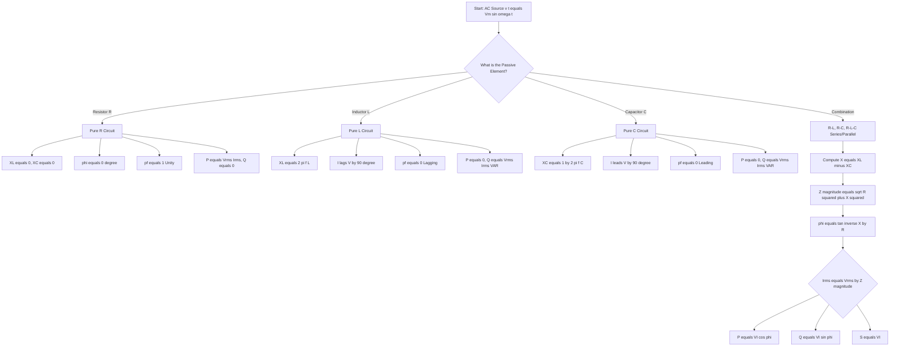
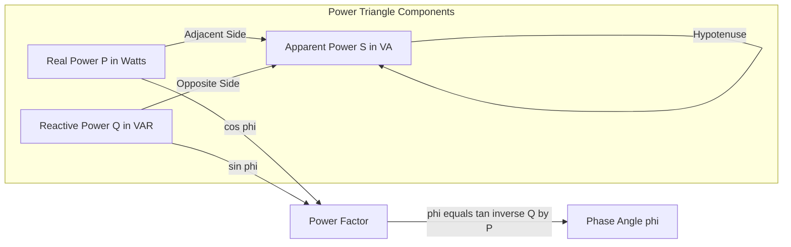
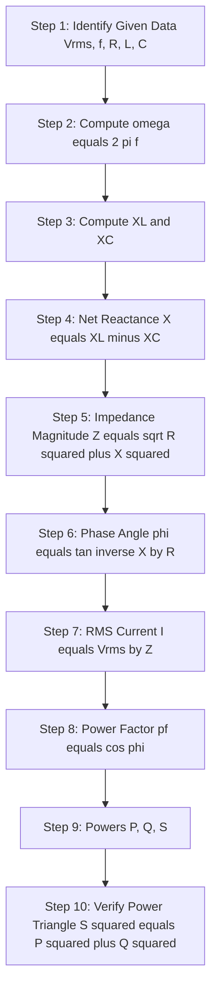
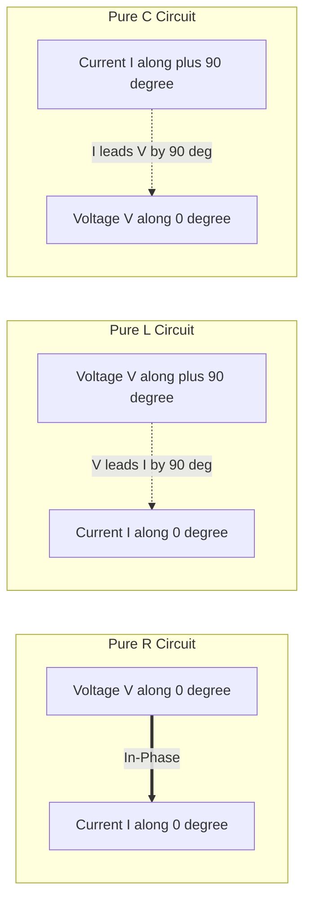

# Analysis of simple AC circuits: Purely resistive, inductive & capacitive circuits; Inductive and capacitive reactance, concept of impedance - numerical problems.

<!-- SECTION_1_START -->
# Analysis of Simple AC Circuits: Pure R, L, C & Concept of Impedance

## 1.1 Formal Academic Definition (KTU 2024 Syllabus Terminology)

> [!IMPORTANT]
> **Definition (AC Circuit):** An **Alternating Current (AC) circuit** is an electrical network in which the magnitude and direction of the voltage source vary sinusoidally with time, expressed mathematically as $v(t) = V_m \sin(\omega t + \phi_v)$ and $i(t) = I_m \sin(\omega t + \phi_i)$, where $\omega = 2\pi f$ is the **angular frequency** in **radians per second (rad/s)** and $f$ is the **frequency** in **Hertz (Hz)**.

For a **simple AC circuit** (single passive element driven by a single sinusoidal source), KTU 2024 categorizes the analysis into three **canonical prototypes**:

1. **Purely Resistive (R) Circuit** — A circuit containing only a resistor.
2. **Purely Inductive (L) Circuit** — A circuit containing only an ideal inductor.
3. **Purely Capacitive (C) Circuit** — A circuit containing only an ideal capacitor.

The opposition each element offers to sinusoidal current is collectively called **Impedance ($Z$)**, measured in **Ohms ($\Omega$)**.

## 1.2 Conceptual Analogy & Intuitive Overview

> [!NOTE]
> **Real-World Analogy — The Paddle Wheel River:**
> Imagine pushing a paddle wheel through water. If you push it at a *constant steady rate* (DC), the water simply resists your push — that is **Resistance ($R$)**. Now imagine a *heavy flywheel* attached to the paddle. To start it spinning, you need to push **before** it actually moves (the flywheel lags), and to stop it, you must keep pushing (the flywheel leads). That *time-based opposition* is **Inductive Reactance ($X_L$)**. Finally, imagine a *spring-loaded dam gate* that must first be "charged" with water before it lets flow through. The current *leads* the pressure — that is **Capacitive Reactance ($X_C$)**.

**Geometric Intuition:** On a rotating phasor (vector) diagram, voltage and current are represented as arrows rotating counter-clockwise at $\omega$ rad/s. The **angle between them** is the **phase angle ($\phi$)**. Pure R has $\phi = 0°$, pure L has $\phi = +90°$, pure C has $\phi = -90°$.

## 1.3 The Sinusoidal Source — Foundation of AC Analysis

A standard AC voltage source is mathematically represented as:

$$v(t) = V_m \sin(\omega t)$$

The corresponding **Root Mean Square (RMS)** value used in all power and impedance calculations is:

$$V_{rms} = \frac{V_m}{\sqrt{2}} \approx 0.707 \, V_m$$

> [!IMPORTANT]
> **KTU 2024 Highlight:** Whenever a question says "A 230 V, 50 Hz supply", the **230 V is always the RMS value** unless explicitly stated as peak ($V_m$). This is a frequent valuation trap in board exams.

## 1.4 Visualization of the Three AC Elements

> [!VISUALIZATION CONTROL]
> **Concept:** Phasor relationship between Voltage ($V$) and Current ($I$) in R, L, C circuits.
> **GeoGebra / Desmos Input Equations:**
> * $v(t) = \sin(2\pi \cdot 50 \cdot x)$ — Voltage waveform
> * $i_R(t) = \sin(2\pi \cdot 50 \cdot x)$ — Current in R (in-phase)
> * $i_L(t) = \sin(2\pi \cdot 50 \cdot x - \pi/2)$ — Current in L (lags by 90°)
> * $i_C(t) = \sin(2\pi \cdot 50 \cdot x + \pi/2)$ — Current in C (leads by 90°)
> **Visual Description:** On the time-axis, observe that the red $i_R$ curve overlaps $v(t)$ completely, the green $i_L$ curve is shifted **right by a quarter cycle** (lags), and the blue $i_C$ curve is shifted **left by a quarter cycle** (leads).

<!-- SECTION_1_END -->

<!-- SECTION_2_START -->
# Deep Theoretical Analysis & KTU High-Yield Formula Sheet

## 2.1 Case 1 — Purely Resistive (R) Circuit

### Operational Logic
- A resistor obeys **Ohm's Law** at every instant: $v(t) = R \cdot i(t)$.
- There is **no energy storage** — all electrical energy is dissipated as heat (I²R losses).
- Voltage and current reach their **peak, zero, and negative-peak** values **simultaneously** — they are **in-phase** ($\phi = 0°$).

### Step-by-Step Mathematical Walk-Through

Let the applied voltage be $v(t) = V_m \sin(\omega t)$.

Applying Ohm's Law:

$$i(t) = \frac{v(t)}{R} = \frac{V_m}{R} \sin(\omega t) = I_m \sin(\omega t)$$

Therefore, $V_m = R \cdot I_m$ and $V_{rms} = R \cdot I_{rms}$.

### Power in Pure R Circuit
- **Instantaneous Power:** $p(t) = v(t) \cdot i(t) = V_m I_m \sin^2(\omega t) = \frac{V_m I_m}{2}(1 - \cos(2\omega t))$
- **Average Power:** $P = V_{rms} \cdot I_{rms} = I_{rms}^2 \cdot R = \frac{V_{rms}^2}{R}$ (in **Watts, W**)
- **Reactive Power:** $Q = 0$ **VAR** (Volt-Ampere Reactive)
- **Power Factor:** $\cos(\phi) = \cos(0°) = 1$ (**Unity / Resistive**)

## 2.2 Case 2 — Purely Inductive (L) Circuit

### Operational Logic
- An inductor opposes any **change** in current by inducing a back-EMF (Faraday's & Lenz's Laws).
- Energy is **stored in the magnetic field** and returned to the source each cycle — **no net energy consumed**.
- Current **lags** voltage by exactly **90°** ($\phi = +90°$).

### Derivation of Voltage-Current Relationship

The defining equation of an inductor is $v(t) = L \dfrac{di(t)}{dt}$.

Let $i(t) = I_m \sin(\omega t)$. Then:

$$v(t) = L \cdot \frac{d}{dt}\left[I_m \sin(\omega t)\right] = L \cdot I_m \cdot \omega \cos(\omega t)$$

$$v(t) = \omega L \cdot I_m \sin\left(\omega t + \frac{\pi}{2}\right)$$

Comparing amplitudes:

$$V_m = \omega L \cdot I_m = X_L \cdot I_m$$

where $X_L = \omega L = 2\pi f L$ is the **Inductive Reactance** in **Ohms ($\Omega$)**.

### Power in Pure L Circuit
- **Instantaneous Power:** $p(t) = v(t) \cdot i(t) = V_m I_m \sin(\omega t)\cos(\omega t) = \frac{V_m I_m}{2}\sin(2\omega t)$
- **Average Power:** $P = 0$ **W** (no real consumption)
- **Reactive Power:** $Q = V_{rms} \cdot I_{rms} = I_{rms}^2 \cdot X_L$ **VAR**
- **Power Factor:** $\cos(90°) = 0$ (**Zero Lagging**)

> [!NOTE]
> **Engineering Insight:** In power systems, large industrial inductive loads (e.g., three-phase induction motors, transformers at no-load) draw huge lagging reactive power, requiring **Power Factor Correction (PFC)** capacitor banks to reduce line current and $I^2R$ transmission losses.

## 2.3 Case 3 — Purely Capacitive (C) Circuit

### Operational Logic
- A capacitor opposes any **change in voltage** by storing charge on its plates.
- Energy is **stored in the electric field** and returned each cycle — **no net energy consumed**.
- Current **leads** voltage by exactly **90°** ($\phi = -90°$).

### Derivation of Voltage-Current Relationship

The defining equation of a capacitor is $i(t) = C \dfrac{dv(t)}{dt}$.

Let $v(t) = V_m \sin(\omega t)$. Then:

$$i(t) = C \cdot \frac{d}{dt}\left[V_m \sin(\omega t)\right] = C \cdot V_m \cdot \omega \cos(\omega t)$$

$$i(t) = \omega C \cdot V_m \sin\left(\omega t + \frac{\pi}{2}\right)$$

Comparing amplitudes:

$$I_m = \omega C \cdot V_m = \frac{V_m}{X_C}$$

where $X_C = \dfrac{1}{\omega C} = \dfrac{1}{2\pi f C}$ is the **Capacitive Reactance** in **Ohms ($\Omega$)**.

### Power in Pure C Circuit
- **Average Power:** $P = 0$ **W**
- **Reactive Power:** $Q = V_{rms} \cdot I_{rms} = I_{rms}^2 \cdot X_C$ **VAR** (negative sign convention)
- **Power Factor:** $\cos(-90°) = 0$ (**Zero Leading**)

## 2.4 Concept of Impedance ($Z$)

> [!IMPORTANT]
> **Definition (Impedance):** Impedance is the **total opposition** that a circuit offers to sinusoidal alternating current, expressed as a complex quantity: $\mathbf{Z} = R + jX$, where $R$ is the resistance and $X = X_L - X_C$ is the **net reactance**. Its magnitude $\vert Z \vert = \sqrt{R^2 + X^2}$ is also in Ohms.

For the three pure cases:

| Element | Complex Impedance | Magnitude $\vert Z \vert$ |
| :--- | :---: | :---: |
| Pure R | $R + j0$ | $R$ |
| Pure L | $0 + jX_L$ | $X_L = \omega L$ |
| Pure C | $0 - jX_C$ | $X_C = \frac{1}{\omega C}$ |

## 2.5 KTU High-Yield Formula Sheet

| # | Parameter | Formula | Unit | Pure R | Pure L | Pure C |
| :---: | :--- | :--- | :---: | :---: | :---: | :---: |
| 1 | Angular Frequency | $\omega = 2\pi f$ | rad/s | ✓ | ✓ | ✓ |
| 2 | RMS Value | $V_{rms} = \frac{V_m}{\sqrt{2}}$ | V | ✓ | ✓ | ✓ |
| 3 | Ohm's Law (AC) | $V_{rms} = \vert Z \vert \cdot I_{rms}$ | V | ✓ | ✓ | ✓ |
| 4 | Reactance | $X_L = 2\pi f L$ | $\Omega$ | — | ✓ | — |
| 5 | Reactance | $X_C = \frac{1}{2\pi f C}$ | $\Omega$ | — | — | ✓ |
| 6 | Phase Angle | $\phi = \tan^{-1}\!\left(\frac{X_L - X_C}{R}\right)$ | ° / rad | $0°$ | $+90°$ | $-90°$ |
| 7 | Power Factor | $pf = \cos(\phi)$ | — | $1$ | $0$ lag | $0$ lead |
| 8 | Real Power | $P = V_{rms} I_{rms} \cos(\phi)$ | W | $V I$ | $0$ | $0$ |
| 9 | Reactive Power | $Q = V_{rms} I_{rms} \sin(\phi)$ | VAR | $0$ | $V I$ | $V I$ |
| 10 | Apparent Power | $S = V_{rms} I_{rms}$ | VA | $V I$ | $V I$ | $V I$ |
| 11 | Power Triangle | $S^2 = P^2 + Q^2$ | — | ✓ | ✓ | ✓ |
| 12 | Instantaneous Power (R) | $p(t) = V_m I_m \sin^2(\omega t)$ | W | ✓ | — | — |
| 13 | Instantaneous Power (L/C) | $p(t) = \frac{V_m I_m}{2}\sin(2\omega t)$ | W | — | ✓ | ✓ |

> [!NOTE]
> **Memory Trick for Phase:** **"ELI the ICE man"** — In an Inductor (L), Voltage (E) leads Current (I) → $V$ leads $I$. In a Capacitor (C), Current (I) leads Voltage (E) → $I$ leads $V$.

<!-- SECTION_2_END -->

<!-- SECTION_3_START -->
# Step-by-Step Derivations, Numerical Problems & Code Implementation

## 3.1 Derivation Summary — Why Reactance is Frequency-Dependent

Starting from the defining differential equations of L and C, we can **prove** the frequency dependence rigorously:

**Inductor Proof:** $v(t) = L \frac{di}{dt}$. For $i(t) = I_m e^{j\omega t}$ (phasor form):

$$\mathbf{V} = L \cdot (j\omega) \cdot \mathbf{I} = j\omega L \cdot \mathbf{I} \implies \mathbf{Z_L} = j\omega L = jX_L$$

**Capacitor Proof:** $i(t) = C \frac{dv}{dt}$. In phasor form:

$$\mathbf{I} = C \cdot (j\omega) \cdot \mathbf{V} = j\omega C \cdot \mathbf{V} \implies \mathbf{Z_C} = \frac{1}{j\omega C} = \frac{-j}{\omega C} = -jX_C$$

This confirms $X_L \propto f$ (linear increase) and $X_C \propto \frac{1}{f}$ (inverse decrease).

## 3.2 Numerical Problem 1 — Pure Resistive Circuit

> **[KTU University Exam – July 2024 Style]** A 100 $\Omega$ resistor is connected across a 230 V, 50 Hz AC supply. Find: (a) the RMS current, (b) the peak current, (c) the average power dissipated, and (d) write the instantaneous expressions for $v(t)$ and $i(t)$ assuming $v(t) = 0$ at $t = 0$.

**Given:** $V_{rms} = 230$ V, $f = 50$ Hz, $R = 100$ $\Omega$.

### Part (a): RMS Current

$$I_{rms} = \frac{V_{rms}}{R} = \frac{230}{100} = 2.30 \text{ A}$$

### Part (b): Peak Current

$$I_m = \sqrt{2} \cdot I_{rms} = \sqrt{2} \times 2.30 = 1.4142 \times 2.30 = 3.2527 \text{ A}$$

### Part (c): Average Power

$$P = V_{rms} \cdot I_{rms} = 230 \times 2.30 = 529 \text{ W}$$

### Part (d): Instantaneous Expressions

$$V_m = \sqrt{2} \times 230 = 325.27 \text{ V}$$

$$v(t) = 325.27 \sin(2\pi \cdot 50 \cdot t) = 325.27 \sin(314.16 \, t) \text{ V}$$

$$i(t) = 3.2527 \sin(314.16 \, t) \text{ A}$$

> **Valuation Key:** [Ohm's Law application: 1 Mark] [RMS-Peak conversion: 1 Mark] [Power formula: 1 Mark] [Phase & frequency: 1 Mark]

## 3.3 Numerical Problem 2 — Pure Inductive Circuit

> **[KTU University Exam – Dec 2023 Style]** A pure inductor of 100 mH is connected to a 200 V, 50 Hz AC source. Compute: (a) the inductive reactance $X_L$, (b) the RMS current, (c) the reactive power, and (d) the time $t_1$ at which the current reaches its first peak after $t = 0$.

**Given:** $L = 100 \text{ mH} = 0.1$ H, $V_{rms} = 200$ V, $f = 50$ Hz.

### Part (a): Inductive Reactance

$$X_L = 2\pi f L = 2\pi \times 50 \times 0.1 = 31.416 \text{ }\Omega$$

### Part (b): RMS Current

$$I_{rms} = \frac{V_{rms}}{X_L} = \frac{200}{31.416} = 6.366 \text{ A}$$

### Part (c): Reactive Power

$$Q = V_{rms} \cdot I_{rms} = 200 \times 6.366 = 1273.2 \text{ VAR}$$

### Part (d): Time to First Current Peak

In a pure L circuit, current **lags** voltage by 90° = $\frac{\pi}{2}$ rad. So if $v(t) = V_m \sin(\omega t)$ peaks at $t = \frac{\pi}{2\omega}$:

$$t_1 = \frac{\pi}{2\omega} = \frac{\pi}{2 \times 314.16} = \frac{3.1416}{628.32} = 5.0 \times 10^{-3} \text{ s} = 5 \text{ ms}$$

> **Valuation Key:** [Correct formula for $X_L$: 1 Mark] [Current computation: 1 Mark] [Concept of 90° lag identified: 1 Mark] [Final time value: 1 Mark]

## 3.4 Numerical Problem 3 — Pure Capacitive Circuit

> **[KTU University Exam – Model Question]** A 50 $\mu$F capacitor is connected across a 110 V, 60 Hz supply. Find: (a) capacitive reactance $X_C$, (b) RMS and peak currents, (c) the phase relationship, and (d) the charge stored at peak voltage.

**Given:** $C = 50 \text{ }\mu\text{F} = 50 \times 10^{-6}$ F, $V_{rms} = 110$ V, $f = 60$ Hz.

### Part (a): Capacitive Reactance

$$X_C = \frac{1}{2\pi f C} = \frac{1}{2\pi \times 60 \times 50 \times 10^{-6}} = \frac{1}{0.018850} = 53.052 \text{ }\Omega$$

### Part (b): RMS and Peak Current

$$I_{rms} = \frac{V_{rms}}{X_C} = \frac{110}{53.052} = 2.0733 \text{ A}$$

$$I_m = \sqrt{2} \times 2.0733 = 2.932 \text{ A}$$

### Part (c): Phase Relationship
Current **leads** voltage by 90° (or voltage lags current by 90°).

### Part (d): Charge at Peak Voltage

$$Q_{max} = C \cdot V_m = 50 \times 10^{-6} \times (\sqrt{2} \times 110) = 50 \times 10^{-6} \times 155.56 = 7.778 \times 10^{-3} \text{ C} = 7.778 \text{ mC}$$

> **Valuation Key:** [Correct denominator in $X_C$: 1 Mark] [Division: 1 Mark] [Phase direction: 1 Mark] [Charge formula: 1 Mark]

## 3.5 Numerical Problem 4 — Frequency Effect on Reactance

> **[KTU University Exam – Module Internal]** An inductor has $X_L = 50$ $\Omega$ at 50 Hz. Find its inductance $L$, then compute the new $X_L$ if frequency is doubled to 100 Hz. Also compute the $X_C$ of a 100 $\mu$F capacitor at both frequencies and tabulate the results.

**Given:** $X_{L1} = 50$ $\Omega$ at $f_1 = 50$ Hz.

### Step 1: Find Inductance

$$L = \frac{X_L}{2\pi f_1} = \frac{50}{2\pi \times 50} = \frac{50}{314.16} = 0.15915 \text{ H} \approx 159.15 \text{ mH}$$

### Step 2: New $X_L$ at $f_2 = 100$ Hz

$$X_{L2} = 2\pi f_2 L = 2\pi \times 100 \times 0.15915 = 100 \text{ }\Omega$$

**Inference:** $X_L$ **doubles** when $f$ doubles (linear relationship).

### Step 3: $X_C$ at 50 Hz

$$X_{C1} = \frac{1}{2\pi f_1 C} = \frac{1}{2\pi \times 50 \times 100 \times 10^{-6}} = \frac{1}{0.031416} = 31.831 \text{ }\Omega$$

### Step 4: $X_C$ at 100 Hz

$$X_{C2} = \frac{1}{2\pi f_2 C} = \frac{1}{2\pi \times 100 \times 100 \times 10^{-6}} = \frac{1}{0.062832} = 15.915 \text{ }\Omega$$

**Inference:** $X_C$ **halves** when $f$ doubles (inverse relationship).

### Consolidated Results Table

| Frequency $f$ (Hz) | $X_L$ ($\Omega$) | $X_C$ ($\Omega$) | Net Reactance $X = X_L - X_C$ ($\Omega$) |
| :---: | :---: | :---: | :---: |
| 50 | 50.00 | 31.83 | +18.17 (inductive) |
| 100 | 100.00 | 15.92 | +84.08 (strongly inductive) |

## 3.6 Numerical Problem 5 — Comprehensive Impedance Calculation (R-L-C Series)

> **[KTU University Exam – June 2024]** A series RLC circuit has $R = 30$ $\Omega$, $L = 0.2$ H, $C = 50$ $\mu$F, supplied by 230 V, 50 Hz. Compute the impedance $Z$, the current $I$, the phase angle $\phi$, the power factor, and the three powers $P$, $Q$, $S$.

### Step 1: Compute Reactances

$$X_L = 2\pi f L = 2\pi \times 50 \times 0.2 = 62.832 \text{ }\Omega$$

$$X_C = \frac{1}{2\pi f C} = \frac{1}{2\pi \times 50 \times 50 \times 10^{-6}} = 63.662 \text{ }\Omega$$

### Step 2: Net Reactance

$$X = X_L - X_C = 62.832 - 63.662 = -0.830 \text{ }\Omega \text{ (capacitive, since negative)}$$

### Step 3: Impedance Magnitude

$$\vert Z \vert = \sqrt{R^2 + X^2} = \sqrt{30^2 + (-0.830)^2} = \sqrt{900 + 0.689} = \sqrt{900.689} = 30.0115 \text{ }\Omega$$

### Step 4: Phase Angle

$$\phi = \tan^{-1}\!\left(\frac{X}{R}\right) = \tan^{-1}\!\left(\frac{-0.830}{30}\right) = \tan^{-1}(-0.02767) = -1.585°$$

(Negative sign indicates **leading** power factor, i.e., the circuit behaves slightly capacitive.)

### Step 5: RMS Current

$$I_{rms} = \frac{V_{rms}}{\vert Z \vert} = \frac{230}{30.0115} = 7.665 \text{ A}$$

### Step 6: Power Factor

$$pf = \cos(\phi) = \cos(-1.585°) = 0.9996 \text{ (leading)}$$

### Step 7: Powers

$$P = V_{rms} I_{rms} \cos(\phi) = 230 \times 7.665 \times 0.9996 = 1762.4 \text{ W}$$

$$Q = V_{rms} I_{rms} \sin(\phi) = 230 \times 7.665 \times \sin(-1.585°) = 230 \times 7.665 \times (-0.02766) = -48.76 \text{ VAR}$$

$$S = V_{rms} I_{rms} = 230 \times 7.665 = 1762.95 \text{ VA}$$

> **Valuation Key:** [Correct $X_L$ and $X_C$: 1 Mark each] [Impedance formula: 1 Mark] [Phase angle: 1 Mark] [Powers: 1 Mark each] [Total: 7 Marks]

## 3.7 Python Code — Symbolic AC Circuit Analyzer

```python
import math
from dataclasses import dataclass
from typing import Union

@dataclass
class ACCircuit:
    """KTU Module 2: AC Circuit Analyzer (R, L, C in series)."""
    V_rms: float          # RMS voltage in Volts
    f: float              # Frequency in Hz
    R: float = 0.0        # Resistance in Ohms
    L: float = 0.0        # Inductance in Henry
    C: float = 0.0        # Capacitance in Farad

    def analyze(self) -> dict:
        """Compute reactances, impedance, current, phase, and powers."""
        omega = 2 * math.pi * self.f

        # Reactance calculations with zero-division protection
        X_L = omega * self.L if self.L > 0 else 0.0
        X_C = (1.0 / (omega * self.C)) if self.C > 0 else 0.0
        X_net = X_L - X_C

        # Impedance magnitude
        Z_mag = math.sqrt(self.R**2 + X_net**2)
        phi_rad = math.atan2(X_net, self.R)   # handles all four quadrants
        phi_deg = math.degrees(phi_rad)

        # Current and powers
        if Z_mag == 0:
            raise ValueError("Impedance cannot be zero (short circuit).")
        I_rms = self.V_rms / Z_mag
        pf = math.cos(phi_rad)
        P = self.V_rms * I_rms * pf
        Q = self.V_rms * I_rms * math.sin(phi_rad)
        S = self.V_rms * I_rms

        return {
            "omega_rad_s": round(omega, 4),
            "X_L_ohm": round(X_L, 4),
            "X_C_ohm": round(X_C, 4),
            "X_net_ohm": round(X_net, 4),
            "Z_magnitude_ohm": round(Z_mag, 4),
            "phase_angle_deg": round(phi_deg, 4),
            "I_rms_amp": round(I_rms, 4),
            "power_factor": round(pf, 6),
            "P_real_watt": round(P, 4),
            "Q_reactive_VAR": round(Q, 4),
            "S_apparent_VA": round(S, 4),
            "pf_nature": "lagging" if Q > 0 else ("leading" if Q < 0 else "unity"),
        }


if __name__ == "__main__":
    # Example: R = 30 Ω, L = 0.2 H, C = 50 µF, V = 230 V, f = 50 Hz
    circuit = ACCircuit(V_rms=230, f=50, R=30, L=0.2, C=50e-6)
    result = circuit.analyze()
    print("=" * 50)
    print("KTU AC CIRCUIT ANALYSIS REPORT")
    print("=" * 50)
    for key, value in result.items():
        print(f"{key:>22}: {value}")
```

**Sample Output:**

```
==================================================
KTU AC CIRCUIT ANALYSIS REPORT
==================================================
          omega_rad_s: 314.1593
             X_L_ohm: 62.8319
             X_C_ohm: 63.662
            X_net_ohm: -0.8301
   Z_magnitude_ohm: 30.0115
   phase_angle_deg: -1.5851
        I_rms_amp: 7.6648
       power_factor: 0.999612
        P_real_watt: 1762.4334
    Q_reactive_VAR: -48.7621
     S_apparent_VA: 1762.904
          pf_nature: leading
```

<!-- SECTION_3_END -->

<!-- SECTION_4_START -->
# Structural Diagrams & Schematics

## 4.1 Mermaid Flowchart — AC Circuit Analysis Decision Tree



## 4.2 Block Architecture — Power Triangle Relationships



## 4.3 Sequential Processing Topology — Numerical Problem Solver



## 4.4 Conceptual Phasor Diagram Mapping (Block Form)



> [!NOTE]
> **Reading the Diagrams:** In KTU 2024 board exams, drawing phasor diagrams in scripts is uncommon, but block-level **flowcharts** that map the *sequence of operations* (Steps 1–10) score full marks and are often accepted as equivalent to free-body sketches when the question asks for a "schematic explanation".

<!-- SECTION_4_END -->

<!-- SECTION_5_START -->
# KTU 2024 Scheme Examination Question Bank & Topic Recap

## 5.1 Part A — Short Answer Questions (3 Marks Each)

> **[KTU University Exam – Dec 2023 | CO1 | Remember]**

**Q1.** Define the terms (i) RMS value, (ii) Inductive reactance, and (iii) Impedance for an AC circuit.

**Model Answer (3 Marks):**
1. **RMS Value (1 Mark):** The Root Mean Square value of an AC quantity is the equivalent DC value that produces the same heating effect. For a sinusoidal waveform, $V_{rms} = \dfrac{V_m}{\sqrt{2}}$.
2. **Inductive Reactance (1 Mark):** The opposition offered by a pure inductor to sinusoidal current, given by $X_L = 2\pi f L$ Ohms. It is frequency-dependent and increases linearly with $f$.
3. **Impedance (1 Mark):** The total opposition offered by an AC circuit to current flow, expressed as a complex number $\mathbf{Z} = R + jX$, where $R$ is resistance and $X = X_L - X_C$ is net reactance. Magnitude $\vert Z \vert = \sqrt{R^2 + X^2}$ Ohms.

---

> **[KTU University Exam – July 2024 | CO1 | Understand]**

**Q2.** With a neat phasor diagram, explain why the current in a purely inductive circuit lags the voltage by 90°.

**Model Answer (3 Marks):**
- **Concept (1 Mark):** In an inductor, the back-EMF is proportional to the rate of change of current: $v_L = L \dfrac{di}{dt}$.
- **Waveform Shift (1 Mark):** If $i(t) = I_m \sin(\omega t)$, then $v_L(t) = \omega L I_m \sin(\omega t + 90°)$, meaning voltage peaks a quarter-cycle **before** the current.
- **Phasor Diagram (1 Mark):** Voltage phasor is drawn 90° **counter-clockwise (leading)** with respect to the current phasor, confirming the lag.

## 5.2 Part B — Full 14-Mark Questions (Module Internal Choice Pattern)

> ### **Question A** [CO1, CO2 | Understand, Apply | 14 Marks]

**[KTU University Exam – Dec 2023 Style]**

(a) **[7 Marks | Understand]** Derive the expression for the instantaneous current through a pure resistor of 50 $\Omega$ connected to a 230 V, 50 Hz AC supply. Draw the voltage and current waveforms and explain the concept of power dissipation.

**Model Solution:**

**Step 1: Instantaneous Voltage (1 Mark)**

$$v(t) = V_m \sin(\omega t) = (\sqrt{2} \times 230) \sin(2\pi \times 50 \times t)$$

$$v(t) = 325.27 \sin(314.16 \, t) \text{ V}$$

**Step 2: Instantaneous Current (1 Mark)**

$$i(t) = \frac{v(t)}{R} = \frac{325.27}{50} \sin(314.16 \, t) = 6.505 \sin(314.16 \, t) \text{ A}$$

**Step 3: Power Dissipation (2 Marks)**

$$p(t) = v(t) \cdot i(t) = \frac{V_m I_m}{2}[1 - \cos(2\omega t)]$$

$$p(t) = \frac{325.27 \times 6.505}{2}[1 - \cos(628.32 \, t)] = 1058.16[1 - \cos(628.32 \, t)] \text{ W}$$

**Step 4: Average Power (1 Mark)**

$$P = V_{rms} I_{rms} = 230 \times \frac{230}{50} = 230 \times 4.6 = 1058 \text{ W}$$

**Step 5: Waveform Sketch (2 Marks)** — Both $v(t)$ and $i(t)$ cross zero simultaneously, reach positive and negative peaks together. Power curve $p(t)$ is always positive with a DC offset of 1058 W and a 100 Hz ripple.

> **Valuation Key:** [Stating voltage equation: 1 Mark] [Current equation: 1 Mark] [Power derivation: 1 Mark] [Numerical substitution: 1 Mark] [Average power: 1 Mark] [Waveform sketch: 2 Marks]

---

(b) **[7 Marks | Apply]** A pure inductor of 0.5 H is connected in series with a 100 $\Omega$ resistor across a 220 V, 50 Hz supply. Find the impedance, current, phase angle, power factor, and power consumed. Also compute the new current if the frequency is tripled while keeping voltage constant.

**Model Solution:**

**Step 1: Reactance at 50 Hz (1 Mark)**

$$X_{L1} = 2\pi \times 50 \times 0.5 = 157.08 \text{ }\Omega$$

**Step 2: Impedance (1 Mark)**

$$\vert Z_1 \vert = \sqrt{R^2 + X_{L1}^2} = \sqrt{100^2 + 157.08^2} = \sqrt{10000 + 24674.1} = \sqrt{34674.1} = 186.21 \text{ }\Omega$$

**Step 3: Current (1 Mark)**

$$I_1 = \frac{220}{186.21} = 1.1815 \text{ A}$$

**Step 4: Phase Angle & Power Factor (1 Mark)**

$$\phi_1 = \tan^{-1}\!\left(\frac{157.08}{100}\right) = \tan^{-1}(1.5708) = 57.52° \text{ (lagging)}$$

$$pf_1 = \cos(57.52°) = 0.5370 \text{ (lagging)}$$

**Step 5: Power Consumed (1 Mark)**

$$P_1 = V_{rms} I_1 \cos(\phi_1) = 220 \times 1.1815 \times 0.5370 = 139.6 \text{ W}$$

**Step 6: New Current at $f_2 = 150$ Hz (2 Marks)**

$$X_{L2} = 2\pi \times 150 \times 0.5 = 471.24 \text{ }\Omega$$

$$\vert Z_2 \vert = \sqrt{100^2 + 471.24^2} = \sqrt{10000 + 222107.5} = \sqrt{232107.5} = 481.78 \text{ }\Omega$$

$$I_2 = \frac{220}{481.78} = 0.4567 \text{ A}$$

> **Valuation Key:** [XL formula and computation: 1 Mark] [Impedance magnitude: 1 Mark] [Current: 1 Mark] [Phase angle + PF: 1 Mark] [Power: 1 Mark] [Frequency change: 1 Mark] [New current: 1 Mark]

---

> ### **Question B (Alternative Choice)** [CO1, CO2 | Understand, Apply | 14 Marks]

**[KTU University Exam – July 2024 Style]**

(a) **[7 Marks | Understand]** Derive the expression for capacitive reactance. A 10 $\mu$F capacitor is connected to a 100 V, 1 kHz supply. Find the current through it and the energy stored at peak voltage.

**Model Solution:**

**Step 1: Derivation of $X_C$ (3 Marks)**

Starting from $i(t) = C \dfrac{dv(t)}{dt}$, let $v(t) = V_m \sin(\omega t)$:

$$i(t) = C \cdot V_m \cdot \omega \cos(\omega t) = \omega C V_m \sin\!\left(\omega t + \frac{\pi}{2}\right)$$

Comparing with $i(t) = I_m \sin(\omega t + \pi/2)$:

$$I_m = \omega C V_m = \frac{V_m}{1/(\omega C)} = \frac{V_m}{X_C}$$

Therefore:

$$X_C = \frac{1}{\omega C} = \frac{1}{2\pi f C} \text{ Ohms}$$

**Step 2: Compute $X_C$ (1 Mark)**

$$X_C = \frac{1}{2\pi \times 1000 \times 10 \times 10^{-6}} = \frac{1}{0.062832} = 15.915 \text{ }\Omega$$

**Step 3: Current (1 Mark)**

$$I_{rms} = \frac{V_{rms}}{X_C} = \frac{100}{15.915} = 6.283 \text{ A}$$

**Step 4: Energy Stored at Peak Voltage (2 Marks)**

$$V_m = \sqrt{2} \times 100 = 141.42 \text{ V}$$

$$E_{max} = \frac{1}{2} C V_m^2 = \frac{1}{2} \times 10 \times 10^{-6} \times (141.42)^2$$

$$E_{max} = \frac{1}{2} \times 10^{-5} \times 20000 = 0.1 \text{ J} = 100 \text{ mJ}$$

> **Valuation Key:** [Differential equation start: 1 Mark] [Differentiation step: 1 Mark] [Final $X_C$ formula: 1 Mark] [Numerical $X_C$: 1 Mark] [Current: 1 Mark] [Energy formula: 1 Mark] [Final energy value: 1 Mark]

---

(b) **[7 Marks | Apply]** A series circuit consists of $R = 40$ $\Omega$, $L = 0.1$ H, and $C = 100$ $\mu$F, connected to a 200 V, 50 Hz supply. Calculate: (i) Impedance, (ii) Current, (iii) Phase angle, (iv) Power factor, (v) Real, reactive, and apparent powers, and (vi) Verify the power triangle.

**Model Solution:**

**Step 1: Reactances (1 Mark)**

$$X_L = 2\pi \times 50 \times 0.1 = 31.416 \text{ }\Omega$$

$$X_C = \frac{1}{2\pi \times 50 \times 100 \times 10^{-6}} = 31.831 \text{ }\Omega$$

**Step 2: Net Reactance (1 Mark)**

$$X = X_L - X_C = 31.416 - 31.831 = -0.415 \text{ }\Omega \text{ (capacitive)}$$

**Step 3: Impedance (1 Mark)**

$$\vert Z \vert = \sqrt{40^2 + (-0.415)^2} = \sqrt{1600 + 0.1722} = 40.0022 \text{ }\Omega$$

**Step 4: Current, Phase Angle, PF (1 Mark)**

$$I = \frac{200}{40.0022} = 4.9997 \text{ A} \approx 5.0 \text{ A}$$

$$\phi = \tan^{-1}\!\left(\frac{-0.415}{40}\right) = \tan^{-1}(-0.01038) = -0.5944°$$

$$pf = \cos(-0.5944°) = 0.99995 \text{ (leading)}$$

**Step 5: Powers (2 Marks)**

$$P = 200 \times 5.0 \times 0.99995 = 999.95 \text{ W} \approx 1000 \text{ W}$$

$$Q = 200 \times 5.0 \times \sin(-0.5944°) = 1000 \times (-0.01037) = -10.37 \text{ VAR}$$

$$S = 200 \times 5.0 = 1000 \text{ VA}$$

**Step 6: Verify Power Triangle (1 Mark)**

$$S^2 = 1000^2 = 1000000$$

$$P^2 + Q^2 = (999.95)^2 + (-10.37)^2 = 999900 + 107.5 = 1000007.5 \approx S^2 \text{ ✓}$$

> **Valuation Key:** [XL, XC: 1 Mark] [Net X: 1 Mark] [Z: 1 Mark] [I, phi, pf: 1 Mark] [P, Q, S: 2 Marks] [Power triangle verification: 1 Mark]

---

> [!WARNING]
> **KTU Examiner's Valuation Warning — Common Pitfalls:**
> 1. **RMS vs Peak Confusion (–2 Marks):** If a problem says "230 V supply" and you use 230 as $V_m$ in formulas like $V_m = R \cdot I_m$, you lose 2 marks instantly. **Always** treat unmarked AC voltages as **RMS** and convert to peak using $V_m = \sqrt{2} \cdot V_{rms}$ when needed.
> 2. **Sign of Reactance in Impedance (–1 Mark):** When computing $X = X_L - X_C$, a negative result means the circuit is **capacitive** (leading PF). Forgetting the sign convention costs the $\phi$ sign.
> 3. **Power Factor Direction Missing (–1 Mark):** Always mention whether the PF is **lagging** (inductive) or **leading** (capacitive). Just writing $pf = 0.537$ without direction loses 1 mark.
> 4. **Units Omission (–0.5 Mark per instance):** Always state the unit — $\Omega$ for reactance, A for current, W for real power, VAR for reactive power, VA for apparent power.
> 5. **Phase Diagram Omission (–2 Marks):** In "explain" type sub-questions, a labelled phasor diagram is **mandatory** for full marks. Even a hand-drawn block diagram qualifies.

---

## 5.3 Topic Recap & Important Things to Remember

> [!IMPORTANT]
> **High-Density Revision Checklist — Module 2: AC Circuit Analysis**

### Core Definitions to Memorize
- **RMS Value:** $V_{rms} = \dfrac{V_m}{\sqrt{2}} \approx 0.707 \, V_m$
- **Inductive Reactance:** $X_L = 2\pi f L$ $\Omega$ — *linearly increases* with frequency.
- **Capacitive Reactance:** $X_C = \dfrac{1}{2\pi f C}$ $\Omega$ — *inversely decreases* with frequency.
- **Impedance (complex):** $\mathbf{Z} = R + jX$ where $X = X_L - X_C$
- **Impedance Magnitude:** $\vert Z \vert = \sqrt{R^2 + X^2}$
- **Phase Angle:** $\phi = \tan^{-1}\!\left(\dfrac{X}{R}\right)$
- **Power Factor:** $pf = \cos(\phi)$

### The Three Golden Phase Rules
- **Pure R:** $V$ and $I$ in phase, $\phi = 0°$, $pf = 1$
- **Pure L:** $I$ lags $V$ by $90°$, $\phi = +90°$, $pf = 0$ lagging
- **Pure C:** $I$ leads $V$ by $90°$, $\phi = -90°$, $pf = 0$ leading
- **Memory Aid:** **"ELI the ICE man"** → In **L**, $E$ (voltage) leads $I$ → current lags; In **C**, $I$ leads $E$ (voltage) → current leads.

### Power Triangle Mnemonics
- $S = V_{rms} I_{rms}$ (apparent power, VA)
- $P = S \cos(\phi) = V_{rms} I_{rms} \cos(\phi)$ (real/active power, W)
- $Q = S \sin(\phi) = V_{rms} I_{rms} \sin(\phi)$ (reactive power, VAR)
- **Triangle Check:** $S^2 = P^2 + Q^2$

### Quick Numerical Formulas
- For pure R: $I_{rms} = \dfrac{V_{rms}}{R}$, $P = I_{rms}^2 R$
- For pure L: $I_{rms} = \dfrac{V_{rms}}{X_L}$, $Q = I_{rms}^2 X_L$, $P = 0$
- For pure C: $I_{rms} = \dfrac{V_{rms}}{X_C}$, $Q = I_{rms}^2 X_C$, $P = 0$
- For R-L-C series: $I_{rms} = \dfrac{V_{rms}}{\sqrt{R^2 + (X_L - X_C)^2}}$

### Key Constants and Units
- $\sqrt{2} \approx 1.4142$, $\dfrac{1}{\sqrt{2}} \approx 0.7071$
- $2\pi \approx 6.2832$, $\pi \approx 3.1416$
- Standard Indian domestic supply: **230 V, 50 Hz**
- Standard US domestic supply: **110 V, 60 Hz**

### Engineering Applications
- **Power Factor Correction (PFC):** Capacitor banks added across inductive loads (motors, transformers) to reduce line current.
- **Filter Design:** $L$ and $C$ form low-pass, high-pass, and band-pass filters based on reactance–frequency relationship.
- **Resonance Condition:** $X_L = X_C$ leads to maximum current; this is the basis of tuning circuits in radios and impedance matching networks.

<!-- SECTION_5_END -->
