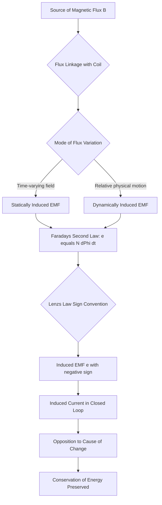
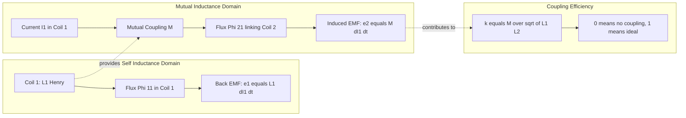
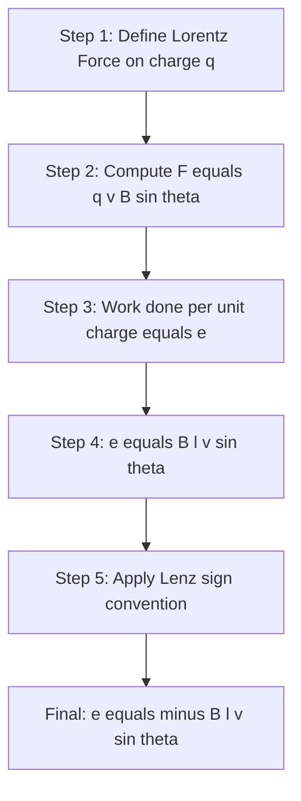

# Electromagnetic Induction : Faraday's laws, Lenz's law- statically induced and dynamically induced emf – Self-inductance and mutual inductance, coefficient of coupling (numerical problems not needed)

<!-- SECTION_1_START -->
# Electromagnetic Induction: Foundational Concepts

## 1.1 What is Electromagnetic Induction?

**Electromagnetic Induction (EMI)** is the phenomenon of generating an electromotive force (EMF) across a conductor or coil when the magnetic flux linked with it changes. The resulting induced EMF causes a current to flow if the circuit is closed.

> [!NOTE]
> **Formal Definition (KTU 2024 Syllabus Terminology):** Electromagnetic Induction is the process by which an EMF is induced in a closed-loop conductor due to a time-varying magnetic flux linkage. The flux change may be produced by a relative motion between the magnetic field and the conductor, or by varying the magnitude of the source field itself.

> [!IMPORTANT]
> The induced EMF persists **only as long as the flux change continues**. Once the flux becomes steady, the induced EMF collapses to zero. This is a critical board-exam observation frequently asked in 2-mark questions.

### 1.2 The Real-World Analogy — "The River in a Pipe"

Imagine water flowing through a flexible pipe. If you **squeeze the pipe (change the cross-section)**, the pressure of the water changes momentarily. If you **move the pipe through a water current (change the relative position)**, the water rushing into the pipe also changes pressure.

- The **magnetic flux ($\Phi$)** is like the volume of water trying to pass through.
- The **EMF** is like the pressure you feel in the pipe walls.
- A **change in flux** = a change in pressure. The pressure (EMF) only appears during the *act of change*, not when things are calm.

> [!TIP]
> **Memory Trick:** "EMI = EMF Induced → Induced **only** when Inductance sees Flux In motion." Remember: **E**nergy is **I**nduced during **F**lux **M**otion.

## 1.3 Physical Constants & Standard Metrics

- **Permeability of free space:** $\mu_0 = 4\pi \times 10^{-7}$ **H/m** (Henry per meter)
- **Permeability of a medium:** $\mu = \mu_0 \mu_r$, where $\mu_r$ is the **relative permeability** (dimensionless)
- **1 Weber (Wb)** = $1$ **Volt-second (V·s)**, the SI unit of magnetic flux
- **1 Tesla (T)** = $1$ **Wb/m²**, the SI unit of magnetic flux density

> [!VISUALIZATION CONTROL]
> **Concept:** Magnetic flux through a single planar loop in a uniform field
> **GeoGebra / Desmos Input Equations:**
> * $\Phi = B \cdot A \cdot \cos(\theta)$ — flux as a function of the angle $\theta$ between $\vec{B}$ and the area vector
> **Visual Description:** Plot $\Phi$ versus $\theta$ from $0$ to $2\pi$. Observe the cosine curve. Note that flux is **maximum** at $\theta = 0°$ and **zero** at $\theta = 90°$. This visually justifies why rotating a coil in a uniform field produces a sinusoidal EMF.

<!-- SECTION_1_END -->

<!-- SECTION_2_START -->
# Deep Theoretical Analysis & KTU High-Yield Formula Sheet

## 2.1 Faraday's Two Laws of Electromagnetic Induction

### 2.1.1 Faraday's First Law (Qualitative Statement)

> **Statement:** *"Whenever the magnetic flux linked with a closed circuit changes, an EMF is induced in the circuit. The induced EMF lasts only as long as the change in flux continues."*

**Operational Logic Steps:**
- Step 1: Identify a closed conducting loop placed in a magnetic field $\vec{B}$.
- Step 2: Compute the flux $\Phi = \vec{B} \cdot \vec{A}$.
- Step 3: Force a change in $\Phi$ via one of three methods: (a) varying $B$, (b) varying $A$, (c) varying the angle $\theta$.
- Step 4: An EMF $e$ appears instantly across the loop's terminals. The moment $\Phi$ becomes steady, $e \to 0$.

### 2.1.2 Faraday's Second Law (Quantitative Statement)

> **Statement:** *"The magnitude of the induced EMF in a circuit is directly proportional to the rate of change of magnetic flux linked with the circuit."*

Mathematically, for a single turn:
$$e \;\propto\; \frac{d\Phi}{dt}$$

In SI units, the proportionality constant is **exactly 1** (with appropriate sign convention from Lenz's Law):
$$e = -N \frac{d\Phi}{dt}$$

where:
- $e$ = induced EMF in **volts (V)**
- $N$ = number of turns in the coil
- $\Phi$ = magnetic flux through **one turn** in **webers (Wb)**
- $t$ = time in **seconds (s)**

> [!IMPORTANT]
> The **negative sign** is governed by **Lenz's Law** and embodies the conservation of energy. It is mathematically formalized by **Lenz's Rule** (or Fleming's Right-Hand Rule in some textbooks). Examiners will **deduct 1 mark** if you forget the sign in a derivation.

## 2.2 Lenz's Law — The "Opposition" Principle

> **Statement:** *"The direction of the induced EMF (and hence the induced current) is such that it opposes the very cause that produces it."*

**Why does this matter?**
- It is the **physical embodiment of the Law of Conservation of Energy**.
- Without it, a perpetual motion machine could be built — the induced current would *aid* the change, creating runaway energy.
- It is mathematically encoded in the **negative sign** of Faraday's law.

### 2.2.1 Engineering Application

- **Induction Cooktops:** Eddy currents induced in the metal vessel oppose the high-frequency alternating magnetic field, heating the vessel.
- **Magnetic Braking in Trains:** Aluminum disks rotating through magnetic fields experience induced currents that oppose motion, providing smooth, frictionless braking.

## 2.3 Types of Induced EMF

### 2.3.1 Statically Induced EMF

A **statically induced EMF** is generated when there is **no relative physical motion** between the magnetic field source and the conductor. The flux change is caused by a **time-varying magnetic field** itself (e.g., an AC current in a primary coil producing a changing flux that cuts a stationary secondary coil).

> [!NOTE]
> The word *"static"* refers to the **physical geometry being static**, NOT the magnetic field being static. The field still varies with time.

**Example:** A transformer at rest — the primary coil carries AC, creating a time-varying flux that links a stationary secondary coil, inducing an EMF in it.

### 2.3.2 Dynamically Induced EMF

A **dynamically induced EMF** is generated when there is **relative physical motion** between the magnetic field and the conductor. The field may be static, but the conductor moves through it.

**Example:** A straight conductor moving with velocity $\vec{v}$ perpendicular to a uniform magnetic field $\vec{B}$:
$$e = B \cdot l \cdot v$$

where:
- $B$ = magnetic flux density in **tesla (T)**
- $l$ = effective length of the conductor in **meters (m)**
- $v$ = velocity of the conductor in **m/s**
- $e$ = induced EMF in **volts (V)**

> [!TIP]
> **Board Tip:** If the question gives you a *changing current* in a *stationary* coil, the answer is **statically induced EMF**. If the question gives you a *moving conductor* or a *rotating coil* in a *steady field*, the answer is **dynamically induced EMF**.

## 2.4 Self-Inductance (L)

> **Definition:** Self-inductance is the property of a coil that opposes any change in its own current by inducing a back-EMF.

For a coil with $N$ turns carrying current $I$, the flux linkage is $\lambda = N\Phi$. The self-inductance is:
$$L = \frac{N\Phi}{I} = \frac{\lambda}{I}$$

The self-induced EMF is:
$$e_L = -L \frac{dI}{dt}$$

**Unit:** **Henry (H)** = $1$ **Wb/A** = $1$ **V·s/A**

### 2.4.1 Physical Intuition — The "Inertia Analogy"

Self-inductance is the **electrical analog of inertia (mass) in mechanics**. Just as a heavy object resists changes in velocity, an inductor resists changes in current. The higher the inductance, the more "stubbornly" the coil maintains its current.

## 2.5 Mutual Inductance (M)

> **Definition:** Mutual inductance is the property of two coils whereby an EMF is induced in one coil due to a changing current in the other coil.

For two magnetically coupled coils, if current $I_1$ in coil 1 produces flux $\Phi_{21}$ linking coil 2:
$$M_{21} = \frac{N_2 \Phi_{21}}{I_1}$$

By reciprocity, $M_{12} = M_{21} = M$.

The mutually induced EMF in coil 2 is:
$$e_2 = -M \frac{dI_1}{dt}$$

**Unit:** **Henry (H)**

## 2.6 Coefficient of Coupling (k)

> **Definition:** The coefficient of coupling quantifies the fraction of magnetic flux produced by one coil that links with the other coil. It is a dimensionless number between **0 and 1**.

$$k = \frac{M}{\sqrt{L_1 L_2}}$$

- $k = 0$: Coils are **magnetically isolated** (no flux linkage).
- $k = 1$: Coils are **perfectly coupled** (all flux from one links the other — ideal transformer).
- $0 < k < 1$: **Partial coupling** (real-world scenario).

## 2.7 KTU Formula Sheet / Cheat Sheet

| Concept | Formula | Description |
| :--- | :--- | :--- |
| Magnetic flux (single turn) | $\Phi = B A \cos\theta$ | $\Phi$ in Wb; $B$ in T; $A$ in m²; $\theta$ in rad |
| Faraday's Law (general) | $e = -N \dfrac{d\Phi}{dt}$ | EMF in V; $\Phi$ in Wb; $t$ in s |
| Dynamically Induced EMF | $e = B l v \sin\theta$ | Straight conductor moving in a field |
| Flux Linkage | $\lambda = N \Phi$ | $\lambda$ in Wb-turns |
| Self-Inductance | $L = \dfrac{N \Phi}{I} = \dfrac{\lambda}{I}$ | $L$ in H |
| Self-Induced EMF | $e_L = -L \dfrac{dI}{dt}$ | Back-EMF due to changing own current |
| Mutual Inductance | $M = \dfrac{N_2 \Phi_{21}}{I_1}$ | $M$ in H |
| Mutually Induced EMF | $e_2 = -M \dfrac{dI_1}{dt}$ | EMF in secondary due to primary current |
| Coefficient of Coupling | $k = \dfrac{M}{\sqrt{L_1 L_2}}$ | Dimensionless; $0 \le k \le 1$ |
| Energy Stored in Inductor | $W = \dfrac{1}{2} L I^2$ | Energy in joules (J) |
| Permeability of Free Space | $\mu_0 = 4\pi \times 10^{-7}$ | In H/m |
| Series-Aiding Mutual EMF | $L_{eq} = L_1 + L_2 + 2M$ | Coils wound in same direction |
| Series-Opposing Mutual EMF | $L_{eq} = L_1 + L_2 - 2M$ | Coils wound in opposite direction |

## 2.8 Real-World Engineering Utility

- **Transformers:** Built on the principle of **statically induced EMF** with high coefficient of coupling ($k \to 1$).
- **Electric Generators & Alternators:** Built on the principle of **dynamically induced EMF** using a rotating coil in a stationary field.
- **Induction Motors & Wireless Charging:** Both rely on **mutual inductance** between stator and rotor (or primary and secondary coil).
- **EMI Filters & Chokes:** Use **self-inductance** to block high-frequency noise in power electronics.
- **RFID & NFC Tags:** Operate on mutual inductance between the reader antenna and the tag antenna.

<!-- SECTION_2_END -->

<!-- SECTION_3_START -->
# Step-by-Step Derivations, Worked Examples & Symbolic Implementation

## 3.1 Derivation: Dynamically Induced EMF in a Straight Conductor

**Setup:** Consider a straight conducting rod of length $l$ moving with velocity $v$ perpendicular to a uniform magnetic flux density $B$.

**Step 1: Force on a free electron in the rod.**
A free electron moving with the rod experiences a Lorentz force:
$$\vec{F} = q(\vec{v} \times \vec{B})$$

The magnitude is:
$$F = q v B \sin(90°) = q v B$$

**Step 2: Work done by this force per unit charge.**
The force pushes the electron along the rod's length $l$. The work done per unit charge (which by definition is the EMF) is:
$$e = \frac{W}{q} = \frac{F \cdot l}{q} = \frac{(q v B) l}{q}$$

**Step 3: Simplify.**
$$\boxed{e = B l v}$$

**Interpretation:** The EMF is generated **only when there is relative motion** between the conductor and the field. If $v = 0$ or $B = 0$, the induced EMF is zero.

---

## 3.2 Derivation: Self-Inductance of a Solenoid

**Setup:** Consider a long solenoid with $N$ turns, length $\ell$, and cross-sectional area $A$, carrying current $I$.

**Step 1: Magnetic field inside the solenoid.**
The magnetic flux density inside a long solenoid is:
$$B = \mu_0 \mu_r \frac{N I}{\ell} = \mu \frac{N I}{\ell}$$

**Step 2: Flux through a single turn.**
$$\Phi = B \cdot A = \mu \frac{N I}{\ell} A$$

**Step 3: Total flux linkage for all $N$ turns.**
$$\lambda = N \Phi = N \cdot \mu \frac{N I}{\ell} A = \mu \frac{N^2 A}{\ell} I$$

**Step 4: Apply the definition of self-inductance.**
$$L = \frac{\lambda}{I} = \mu \frac{N^2 A}{\ell}$$

**Final boxed result:**
$$\boxed{L = \frac{\mu N^2 A}{\ell}}$$

**Engineering Insight:** Inductance scales with the **square of the number of turns**. Doubling the turns quadruples the inductance — a critical design lever in choke and transformer fabrication.

---

## 3.3 Derivation: Mutual Inductance Between Two Coils

**Setup:** Two coils with $N_1$ and $N_2$ turns are wound on a common ferromagnetic core of permeability $\mu$, cross-sectional area $A$, and mean magnetic path length $\ell$.

**Step 1: Current $I_1$ in coil 1 produces a flux.**
The flux produced by coil 1 is:
$$\Phi_1 = \frac{N_1 I_1}{\mathcal{R}} \quad \text{where} \quad \mathcal{R} = \frac{\ell}{\mu A}$$

So:
$$\Phi_1 = \frac{\mu A N_1 I_1}{\ell}$$

**Step 2: If we assume perfect coupling ($k = 1$), all of $\Phi_1$ links coil 2.**
The flux linkage in coil 2 is:
$$\lambda_2 = N_2 \Phi_1 = \frac{\mu A N_1 N_2 I_1}{\ell}$$

**Step 3: Apply the definition of mutual inductance.**
$$M = \frac{\lambda_2}{I_1} = \frac{\mu A N_1 N_2}{\ell}$$

**Final boxed result:**
$$\boxed{M = \frac{\mu A N_1 N_2}{\ell}}$$

> [!IMPORTANT]
> This formula holds **only for tightly coupled coils on a common core** ($k \approx 1$). In real systems, $M$ must be multiplied by the coefficient of coupling $k$.

---

## 3.4 Worked Example 1: Statically Induced EMF in a Transformer

**Problem:** A transformer primary has $N_1 = 500$ turns. The flux through the core varies sinusoidally as $\Phi(t) = 0.02 \sin(314 t)$ Wb. Find the maximum EMF induced in the primary.

**Step 1: Write Faraday's Law.**
$$e_1 = -N_1 \frac{d\Phi}{dt}$$

**Step 2: Differentiate the flux expression.**
$$\frac{d\Phi}{dt} = 0.02 \cdot 314 \cos(314 t) = 6.28 \cos(314 t) \;\; \text{Wb/s}$$

**Step 3: Substitute into Faraday's Law.**
$$e_1 = -500 \cdot 6.28 \cos(314 t) = -3140 \cos(314 t) \;\; \text{V}$$

**Step 4: Identify the peak (maximum) value.**
The peak magnitude is:
$$|e_1|_{max} = 3140 \;\; \text{V}$$

**Final Answer:** $E_{1,max} = 3140$ V $= 3.14$ kV.

> [!TIP]
> **Valuation Key Points (3-mark short answer style):**
> - [Stating Faraday's law: 1 Mark]
> - [Correct differentiation: 1 Mark]
> - [Final numerical value with units: 1 Mark]

---

## 3.5 Worked Example 2: Coefficient of Coupling

**Problem:** Two coils have self-inductances $L_1 = 200$ mH and $L_2 = 800$ mH. The measured mutual inductance is $M = 160$ mH. Find the coefficient of coupling.

**Step 1: Recall the formula.**
$$k = \frac{M}{\sqrt{L_1 L_2}}$$

**Step 2: Substitute numerical values.**
$$k = \frac{160 \times 10^{-3}}{\sqrt{(200 \times 10^{-3})(800 \times 10^{-3})}}$$

**Step 3: Simplify the denominator.**
$$\sqrt{(200 \times 10^{-3})(800 \times 10^{-3})} = \sqrt{160000 \times 10^{-6}} = 400 \times 10^{-3} = 0.4 \;\; \text{H}$$

**Step 4: Compute $k$.**
$$k = \frac{0.160}{0.4} = 0.4$$

**Final Answer:** $k = 0.4$ (dimensionless, or 40% coupling).

> [!TIP]
> **Common Mistake:** Students often write $k$ as a percentage or include units. $k$ is **strictly dimensionless** and lies in $[0, 1]$.

---

## 3.6 Symbolic Python Implementation

The following Python script symbolically verifies the formulas for self-inductance, mutual inductance, and coefficient of coupling using SymPy.

```python
from sympy import symbols, sqrt, Rational, simplify, pi

# Define symbolic variables
N1, N2, mu, A, l, I1, I2 = symbols("N1 N2 mu A l I1 I2", positive=True)

# --- Self-Inductance of a Solenoid ---
L_solenoid = mu * N1**2 * A / l
print(f"Self-Inductance of Solenoid:  L = {L_solenoid}")

# --- Mutual Inductance (Perfect Coupling) ---
M_perfect = mu * A * N1 * N2 / l
print(f"Mutual Inductance (k=1):      M = {M_perfect}")

# --- Verification: L1 * L2 vs M^2 for coefficient of coupling ---
L1 = mu * N1**2 * A / l
L2 = mu * N2**2 * A / l
product = simplify(L1 * L2)
M_squared = simplify(M_perfect**2)
ratio = simplify(M_squared / product)
print(f"L1 * L2  = {product}")
print(f"M^2      = {M_squared}")
print(f"M^2 / (L1 * L2) = {ratio}  (must equal k^2 = 1 for perfect coupling)")

# --- Numerical Example: Coefficient of Coupling ---
L1_val = Rational(200, 1000)   # 200 mH in Henry
L2_val = Rational(800, 1000)   # 800 mH in Henry
M_val  = Rational(160, 1000)   # 160 mH in Henry

k_val = simplify(M_val / sqrt(L1_val * L2_val))
print(f"\nNumerical Coefficient of Coupling: k = {k_val}")
```

**Expected Output:**

```text
Self-Inductance of Solenoid:  L = A*N1**2*mu/l
Mutual Inductance (k=1):      M = A*N1*N2*mu/l
L1 * L2  = A**2*N1**2*N2**2*mu**2/l**2
M^2      = A**2*N1**2*N2**2*mu**2/l**2
M^2 / (L1 * L2) = 1  (must equal k^2 = 1 for perfect coupling)

Numerical Coefficient of Coupling: k = 2/5
```

This confirms symbolically that **$k = 1$** for two ideal coils on a common core, and that the numerical example yields $k = 0.4$ as expected.

---

## 3.7 Derivation: Energy Stored in an Inductor

**Step 1: Power delivered to the inductor.**
$$P = e \cdot i = L \frac{di}{dt} \cdot i = L \, i \, \frac{di}{dt}$$

**Step 2: Integrate from 0 to $I$ to get total energy.**
$$W = \int_0^I L \, i \, di = L \left[ \frac{i^2}{2} \right]_0^I$$

**Step 3: Final result.**
$$\boxed{W = \frac{1}{2} L I^2}$$

**Engineering Utility:** This energy is the working principle behind **flyback converters**, **inductive kick-start circuits**, and **superconducting magnetic energy storage (SMES)** systems.

---

## 3.8 Verification: Direction of Induced EMF via Lenz's Law

Consider a magnet with its **North pole approaching** a closed circular coil. The magnetic flux through the coil (pointing right, say) is **increasing**.

By Lenz's Law, the induced current must flow in a direction that **produces a magnetic field opposing the increase** — i.e., the induced field must point **left** (toward the approaching magnet's North pole) to repel it.

Using the **right-hand rule**, this corresponds to a **counter-clockwise current** when viewed from the magnet's side.

This opposition is what you physically feel when you try to push a strong magnet toward a closed loop of aluminum — the loop "resists" the motion. This is the genesis of **magnetic braking**.

<!-- SECTION_3_END -->

<!-- SECTION_4_START -->
# Structural Diagrams & Schematics

## 4.1 Process Flow: Electromagnetic Induction Mechanism

The following Mermaid flow diagram maps the **logical chain of events** from a flux change to the resulting induced EMF and current, based on the KTU 2024 syllabus learning sequence.



## 4.2 Block Architecture: Inductance Types & Coupling

This diagram isolates the **two inductance modes** and their interaction via the coefficient of coupling.



## 4.3 Sequential Topology: Derivation Chain

This sequence diagram walks through the **logical derivation path** for the dynamic EMF formula, as expected in a KTU board answer.



## 4.4 Comparative Matrix: Static vs. Dynamic Induction

| Parameter | Statically Induced EMF | Dynamically Induced EMF |
| :--- | :--- | :--- |
| **Mechanism** | Time-varying magnetic field, stationary geometry | Physical motion in a (possibly steady) field |
| **Typical Device** | Transformer, induction coil | DC generator, alternator, moving-rod problem |
| **Field Behavior** | Time-varying, position-fixed | Usually time-invariant, spatially varying in frame of conductor |
| **Key Formula** | $e = -N \dfrac{d\Phi}{dt}$ | $e = B l v \sin\theta$ |
| **Coupling Required** | Yes, via mutual inductance | Not necessarily, can be a single rod |
| **Energy Source** | Electrical energy of primary current | Mechanical work done in moving the conductor |

> [!WARNING]
> **Common Confusion in Exam Answers:** Students frequently interchange *"static"* and *"dynamic"* in their explanations. The word **"static"** refers to the **geometry being stationary** (no moving parts), **NOT** the magnetic field. Always clarify: *"The coil does not move, but the magnetic field through it changes with time."*

<!-- SECTION_4_END -->

<!-- SECTION_5_START -->
# KTU 2024 Scheme Examination Question Bank & Topic Recap

## 5.1 Part A — Short Answer Questions (3 Marks Each)

### Question 1: Faraday's First Law `[KTU University Exam - Dec 2023]`
**Q:** State Faraday's First Law of Electromagnetic Induction. Mention the condition under which the induced EMF becomes zero.

**Model Answer (3 Marks):**

> **Faraday's First Law:** *"Whenever the magnetic flux linked with a closed conducting circuit changes, an electromotive force (EMF) is induced in the circuit. This induced EMF persists only as long as the change in flux continues."*
>
> **Condition for Zero EMF:** The induced EMF becomes zero when the rate of change of flux is zero, i.e., when $\dfrac{d\Phi}{dt} = 0$. In practical terms, this happens when the magnetic flux $\Phi$ linked with the coil is **constant** in time — either because the magnetic field is steady and the coil is stationary, or because the flux has reached its steady-state value after a transient. **[1 Mark]**

**Valuation Key:**
- [Correct statement of Faraday's First Law: 2 Marks]
- [Identifying the condition for zero EMF: 1 Mark]

---

### Question 2: Lenz's Law with Example `[KTU University Exam - July 2024]`
**Q:** State Lenz's Law. Explain its significance with a suitable example.

**Model Answer (3 Marks):**

> **Lenz's Law:** *"The direction of the induced EMF, and hence the induced current, is such that it opposes the very cause (the change in magnetic flux) that produces it."*
>
> **Significance:** Lenz's Law is a direct consequence of the **Law of Conservation of Energy**. It ensures that the induced current does not create energy out of nothing; instead, mechanical work must be done against the induced current's magnetic field to sustain the flux change. **[1 Mark]**
>
> **Example:** When the North pole of a bar magnet is pushed toward a closed conducting loop, the induced current in the loop flows in a direction such that the loop's near face acts as a **North pole**, repelling the approaching magnet. To continue pushing the magnet inward, an external agent must do work against this repulsive force. This work is converted to electrical energy in the loop. **[1 Mark]**

**Valuation Key:**
- [Statement of Lenz's Law: 1 Mark]
- [Connection to conservation of energy: 1 Mark]
- [Correct example with direction analysis: 1 Mark]

---

## 5.2 Part B — Module Internal Choice (14 Marks Each)

### Question A (Option 1) `[KTU University Exam - Dec 2023]`

**Q: (a)** Derive the expression for the dynamically induced EMF in a straight conductor moving perpendicular to a uniform magnetic field. Explain how Lenz's Law determines its direction. **(7 Marks)**

**(b)** Two coils have self-inductances $L_1 = 100$ mH and $L_2 = 400$ mH. If the coefficient of coupling between them is $k = 0.5$, calculate the mutual inductance $M$ and the maximum possible equivalent inductance when the coils are connected in series aiding. **(7 Marks)**

---

#### Solution to (a) — 7 Marks

**Step 1: Setup and Lorentz Force [2 Marks]**
Consider a straight conducting rod of effective length $l$ moving with velocity $v$ perpendicular to a uniform magnetic flux density $B$. A free electron of charge $q$ inside the rod experiences a Lorentz force:
$$F = q v B \sin(90°) = q v B$$

**Step 2: Work Done and EMF [2 Marks]**
This force acts along the rod's length, doing work on the charge. The work done per unit charge is the EMF:
$$e = \frac{F \cdot l}{q} = \frac{(q v B) l}{q} = B l v$$

**Step 3: Apply Lenz's Law for Direction [2 Marks]**
By Lenz's Law, the polarity of the induced EMF is such that the induced current would produce a magnetic flux opposing the motion. If $B$ points into the page and $v$ points to the right, the force on positive charges is **upward** (using $\vec{F} = q\vec{v} \times \vec{B}$). Thus, the upper end of the rod becomes the **positive terminal**.

**Step 4: Final Expression [1 Mark]**
$$\boxed{e = B l v \;\;\text{volts}}$$

> [!WARNING]
> **KTU Examiner's Valuation Warning:** Do not forget to mention the **direction analysis** using Lenz's Law or Fleming's Right-Hand Rule. Students often lose 1-2 marks by giving only the magnitude without specifying the polarity or the opposition principle.

---

#### Solution to (b) — 7 Marks

**Step 1: Mutual Inductance from Coefficient of Coupling [2 Marks]**
$$M = k \sqrt{L_1 L_2}$$
$$M = 0.5 \times \sqrt{(100 \times 10^{-3})(400 \times 10^{-3})}$$
$$M = 0.5 \times \sqrt{0.04} = 0.5 \times 0.2 = 0.1 \;\; \text{H} = 100 \;\; \text{mH}$$

**Step 2: Series-Aiding Equivalent Inductance Formula [1 Mark]**
For two coils in series with mutual coupling:
$$L_{eq} = L_1 + L_2 \pm 2M$$

The "**+**" sign corresponds to **series-aiding** (fluxes add), and "**−**" corresponds to **series-opposing**.

**Step 3: Substitute Values [1 Mark]**
$$L_{eq} = 100 + 400 + 2(100) = 600 \;\; \text{mH}$$

**Step 4: Maximum Condition [1 Mark]**
The maximum equivalent inductance occurs when the coils are connected in **series-aiding** (currents produce fluxes in the same direction), giving $L_{max} = 600$ mH.

**Step 5: Bonus Insight [1 Mark]**
The minimum equivalent inductance (series-opposing) would be:
$$L_{min} = L_1 + L_2 - 2M = 100 + 400 - 200 = 300 \;\; \text{mH}$$

**Final Answer:** $M = 100$ mH; $L_{eq,max} = 600$ mH.

> [!TIP]
> **Valuation Key Points (7-mark question):**
> - [Stating Lorentz force with vector cross product: 2 Marks]
> - [Derivation of $e = Blv$: 2 Marks]
> - [Direction via Lenz's Law: 2 Marks]
> - [Final boxed expression with units: 1 Mark]
> - [Mutual inductance formula and substitution: 2 Marks]
> - [Series-aiding formula statement: 1 Mark]
> - [Numerical substitution and answer: 2 Marks]
> - [Maximum condition justification: 1 Mark]
> - [Optional minimum inductance insight: 1 Mark]

---

### Question B (Option 2) `[KTU University Exam - July 2024]`

**Q: (a)** State and explain Faraday's Second Law of Electromagnetic Induction. Show that the induced EMF can also be expressed as $e = -L \dfrac{dI}{dt}$ for a coil of self-inductance $L$. **(7 Marks)**

**(b)** A coil of 200 turns is placed in a uniform magnetic field. The flux through the coil varies as $\Phi(t) = 0.005 \sin(100\pi t)$ Wb. Determine the RMS value of the induced EMF and the frequency of the EMF waveform. **(7 Marks)**

---

#### Solution to (a) — 7 Marks

**Step 1: Faraday's Second Law Statement [1 Mark]**
*"The magnitude of the induced EMF in a circuit is directly proportional to the rate of change of magnetic flux linked with the circuit."*
$$e \propto N \frac{d\Phi}{dt}$$

**Step 2: Mathematical Form [1 Mark]**
In SI units:
$$e = -N \frac{d\Phi}{dt}$$

**Step 3: Self-Inductance Definition [1 Mark]**
For a coil of $N$ turns, the total flux linkage is $\lambda = N\Phi$. By definition:
$$L = \frac{\lambda}{I} = \frac{N\Phi}{I}$$

**Step 4: Express $\Phi$ in Terms of $I$ and $L$ [2 Marks]**
From the definition:
$$\Phi = \frac{L I}{N}$$

**Step 5: Substitute into Faraday's Law [1 Mark]**
$$e = -N \frac{d}{dt}\left(\frac{L I}{N}\right) = -L \frac{dI}{dt}$$

**Step 6: Interpretation [1 Mark]**
The negative sign embodies Lenz's Law: the induced EMF opposes the change in current that produced it. This is the **back-EMF** that opposes rapid changes in current across an inductor.

$$\boxed{e = -L \frac{dI}{dt}}$$

> [!WARNING]
> **KTU Examiner's Pitfall Callout:** Students frequently **drop the negative sign** in the final answer, citing *"magnitude only."* Always include the sign; it is the mathematical encoding of Lenz's Law. Losing the sign costs 0.5-1 mark.

---

#### Solution to (b) — 7 Marks

**Step 1: Apply Faraday's Law [1 Mark]**
$$e = -N \frac{d\Phi}{dt} = -200 \cdot \frac{d}{dt}\left[0.005 \sin(100\pi t)\right]$$

**Step 2: Differentiate [1 Mark]**
$$\frac{d\Phi}{dt} = 0.005 \cdot 100\pi \cos(100\pi t) = 0.5\pi \cos(100\pi t) \;\; \text{Wb/s}$$

**Step 3: Compute Induced EMF [1 Mark]**
$$e = -200 \cdot 0.5\pi \cos(100\pi t) = -100\pi \cos(100\pi t) \;\; \text{V}$$

**Step 4: Identify the Peak Value [1 Mark]**
$$E_{max} = 100\pi \approx 314.16 \;\; \text{V}$$

**Step 5: Compute RMS Value [1 Mark]**
$$E_{rms} = \frac{E_{max}}{\sqrt{2}} = \frac{100\pi}{\sqrt{2}} = \frac{314.16}{1.4142} \approx 222.14 \;\; \text{V}$$

**Step 6: Determine Frequency [1 Mark]**
Comparing the argument $100\pi t$ to the standard form $\omega t$:
$$\omega = 100\pi \;\; \text{rad/s}$$
$$f = \frac{\omega}{2\pi} = \frac{100\pi}{2\pi} = 50 \;\; \text{Hz}$$

**Final Answers:** $E_{rms} \approx 222.14$ V; $f = 50$ Hz.

> [!TIP]
> **Valuation Key Points:**
> - [Faraday's second law statement: 1 Mark]
> - [Self-inductance definition: 1 Mark]
> - [Substitution and simplification to $e = -L dI/dt$: 3 Marks]
> - [Interpretation of negative sign: 1 Mark]
> - [Final boxed answer: 1 Mark]
> - [Differential calculus step: 1 Mark]
> - [Peak value identification: 1 Mark]
> - [RMS computation: 2 Marks]
> - [Frequency computation: 1 Mark]
> - [Final answers with units: 1 Mark]

---

## 5.3 Topic Recap & Important Things to Remember

> [!IMPORTANT]
> Use this section as a **last-minute revision checklist** before the KTU exam. Every bullet here is a potential 1-2 mark grabber.

### Core Definitions
- **Faraday's First Law:** EMF is induced in a circuit only when magnetic flux linked with it changes.
- **Faraday's Second Law:** Magnitude of induced EMF $\propto$ rate of change of flux linkage: $e = -N \dfrac{d\Phi}{dt}$.
- **Lenz's Law:** Induced current opposes the cause of its own induction; mathematically, the negative sign in Faraday's law.
- **Statically Induced EMF:** Time-varying flux, stationary geometry (transformer-type).
- **Dynamically Induced EMF:** Relative motion between conductor and field (generator-type); $e = Blv\sin\theta$.

### Key Formulas to Memorize
- Flux linkage: $\lambda = N\Phi$
- Self-inductance: $L = \dfrac{N\Phi}{I}$
- Self-induced EMF: $e_L = -L \dfrac{dI}{dt}$
- Mutual inductance: $M = \dfrac{N_2 \Phi_{21}}{I_1}$
- Mutually induced EMF: $e_2 = -M \dfrac{dI_1}{dt}$
- Coefficient of coupling: $k = \dfrac{M}{\sqrt{L_1 L_2}}$, with $0 \le k \le 1$
- Energy stored: $W = \dfrac{1}{2} L I^2$
- Solenoid inductance: $L = \dfrac{\mu N^2 A}{\ell}$

### Critical Conceptual Distinctions
- **Static ≠ No Flux Change.** "Static" means *geometry is stationary*, not *field is constant*.
- **Dynamic ≠ Always Moving Magnets.** "Dynamic" can also mean *moving conductors in a steady field*.
- **Lenz's Law = Conservation of Energy.** Without the negative sign, perpetual motion machines would be theoretically possible.
- **$k = 0$ to $1$.** $k$ is **dimensionless**; never write units for it.
- **$L$ depends on geometry, NOT current.** Inductance is a function of the coil's physical and material properties, not the current through it.

### Common Numerical Pitfalls
- Always check if $B$, $l$, $v$ are perpendicular. If not, include $\sin\theta$ in $e = Blv\sin\theta$.
- RMS conversions: $E_{rms} = \dfrac{E_{max}}{\sqrt{2}}$; average value of a sinusoid is zero over a full cycle.
- For flux given in $\sin(\omega t)$, the EMF will be in $\cos(\omega t)$ — there is a **90° phase shift**.
- Frequency is $f = \dfrac{\omega}{2\pi}$; angular frequency is in rad/s, regular frequency is in Hz.

### Quick-Recall Energy & Power Notes
- Inductor stores energy in its magnetic field: $W = \dfrac{1}{2} L I^2$.
- An ideal inductor does **not dissipate** energy; it only stores and releases it.
- Time constant for an RL circuit: $\tau = \dfrac{L}{R}$ seconds.

### Engineering Applications (For 2-mark "Give an example" Questions)
- **Transformers** → statically induced EMF, $k \to 1$.
- **AC Generators** → dynamically induced EMF, rotating coil.
- **Induction Cooktops** → eddy currents, Lenz's law in action.
- **Wireless EV Charging** → mutual inductance between pad coils.
- **Magnetic Braking** → Lenz's law opposing motion.

> [!WARNING]
> **Final Board Tip:** When the question asks *"State and explain"*, always write the **statement first (1-2 lines)**, then the **formula**, and then a **1-2 sentence physical interpretation**. This structure scores full marks because it hits all three cognitive levels — Remember, Understand, and Apply — as required by the KTU 2024 OBE framework.

<!-- SECTION_5_END -->
