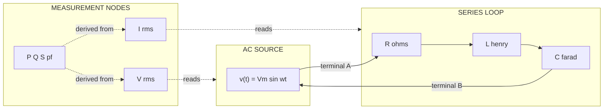
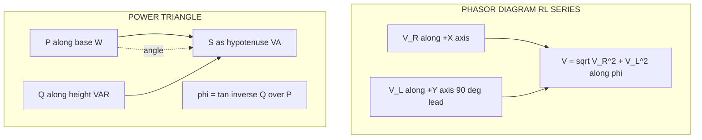
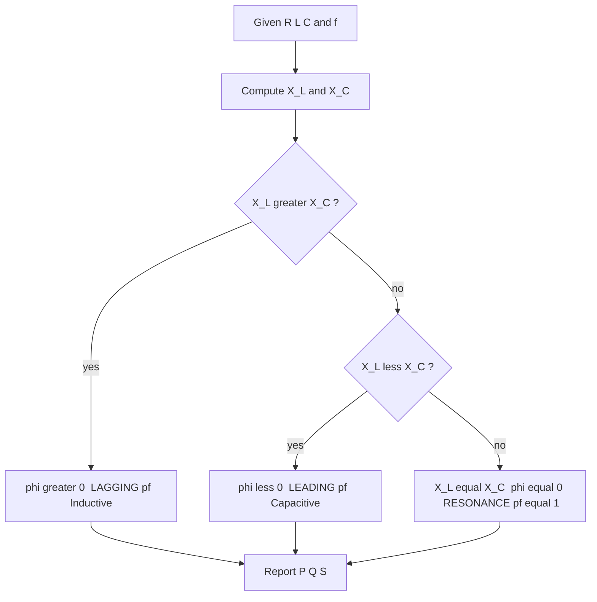

# RL, RC and RLC series circuits- power factor, active, reactive and apparent power. Simple numerical problems.

<!-- SECTION_1_START -->
# RL, RC and RLC Series Circuits — Power Factor, Active, Reactive and Apparent Power

> [!IMPORTANT]
> **KTU 2024 Scheme | GXEST104 — Module 2 Anchor Topic**
> This note covers the AC steady-state behaviour of purely resistive–inductive (RL), resistive–capacitive (RC) and resistive–inductive–capacitive (RLC) series networks, and the four cornerstone power quantities: **Active Power (P)**, **Reactive Power (Q)**, **Apparent Power (S)**, and **Power Factor (cos $\phi$)**.

## 1.1 Formal Definition (KTU Syllabus Terminology)

A **series AC circuit** is a single-loop network in which the same current $i(t)$ flows through every element, but the voltage across each element differs in magnitude **and phase**. The three canonical single-loop networks studied in this module are:

- **RL Series Circuit** — a resistor $R$ and an inductor $L$ connected in series across an AC source $v(t)=V_m\sin(\omega t)$.
- **RC Series Circuit** — a resistor $R$ and a capacitor $C$ connected in series across the same source.
- **RLC Series Circuit** — all three passive elements $R$, $L$ and $C$ connected in series, exhibiting **resonance** when $\omega L = \frac{1}{\omega C}$.

The total opposition offered to AC current is the **impedance** $Z$, a complex phasor quantity

$$Z = R + jX$$

where $X$ is the **net reactance** ($X = X_L - X_C$), measured in **ohms ($\Omega$)**.

**Power Factor (pf)** is the cosine of the angle $\phi$ between the source voltage phasor $V$ and the current phasor $I$,

$$\text{pf} = \cos\phi = \frac{R}{\vert Z \vert} = \frac{P}{S}$$

It is a **dimensionless scalar** that quantifies how effectively electrical power is converted into useful work.

## 1.2 Conceptual Analogy — "The Commuter on a Moving Walkway"

> [!NOTE]
> **Intuition Box — A Day at the Airport**
>
> Imagine a commuter walking across a moving walkway in an airport.
> - The **walking effort** (component of motion along the direction of travel) = **Active Power $P$**. This is the energy that *actually* moves the commuter forward toward the gate (useful work).
> - The **sideways lean** the commuter makes to stay balanced on the moving belt = **Reactive Power $Q$**. No real progress is made sideways, yet energy is continuously exchanged.
> - The **total ground reaction force** the commuter feels = **Apparent Power $S$**. It is the vector sum $\vec{S} = \vec{P} + j\vec{Q}$ of the two.
> - **Power factor $\cos\phi$** is the cosine of the angle between the resultant force and the forward direction. A commuter who walks straight (leaning less) has a high pf (close to **1**); a drunken passenger flailing sideways has a low pf (close to **0**).

This perfectly captures why power engineers obsess over raising pf to **unity (1.0)** — to make every ampère of current do *useful* work.

## 1.3 The Four Quantities at a Glance

| Quantity | Symbol | Unit | Engineering Meaning |
|---|---|---|---|
| Active (Real) Power | $P$ | **Watt (W)** | Power actually dissipated in $R$ as heat/light/mechanical work |
| Reactive Power | $Q$ | **Volt-Ampere Reactive (VAR)** | Power oscillating between source and $L$/$C$; does **no** net work |
| Apparent Power | $S$ | **Volt-Ampere (VA)** | Product $V_{rms} \cdot I_{rms}$; what the utility *must* supply |
| Power Factor | $\cos\phi$ | dimensionless | Ratio of useful to supplied power |

> [!TIP]
> **KTU Memory Trick:** "**W**atts are **W**ork, **VAR**s are **V**irtual (no work), **VA** is the **V**ector sum of both."

## 1.4 Visualization Control

> [!VISUALIZATION CONTROL]
> **Concept:** Power Triangle (Geometric representation of $P$, $Q$, $S$)
>
> **GeoGebra / Desmos Input Equations:**
> - `P = 100`            *(Active power on horizontal axis)*
> - `Q = 60`             *(Reactive power on vertical axis)*
> - `S(x) = sqrt(P^2 + Q^2)`  *(Hypotenuse = apparent power)*
> - `phi = atan(Q/P)`    *(Power factor angle in degrees)*
>
> **Visual Description:** The student should see a **right-angled triangle** with $P$ along the x-axis (base), $Q$ along the y-axis (perpendicular), and $S$ as the hypotenuse. The angle at vertex $P$ is $\phi$. Dragging $Q$ up or down swings the triangle left/right, shrinking or growing $\cos\phi$.

<!-- SECTION_1_END -->

<!-- SECTION_2_START -->
# Deep Theoretical Analysis & KTU High-Yield Formula Sheet

## 2.1 Phasor Behaviour of Each Element

Every AC circuit law is rooted in three fundamental phasor relations:

$$V_R = I \cdot R \quad (\text{in phase with } I)$$

$$V_L = I \cdot jX_L \quad (\text{leads } I \text{ by } 90^\circ)$$

$$V_C = I \cdot (-jX_C) = \frac{I}{j\omega C} \quad (\text{lags } I \text{ by } 90^\circ)$$

where the inductive and capacitive reactances are

$$X_L = \omega L = 2\pi f L \quad [\Omega]$$

$$X_C = \frac{1}{\omega C} = \frac{1}{2\pi f C} \quad [\Omega]$$

## 2.2 Impedance of the Three Series Networks

### (a) RL Series Circuit
- Net reactance: $X = X_L$
- Impedance phasor: $Z_{RL} = R + jX_L$
- Magnitude: $\vert Z_{RL} \vert = \sqrt{R^2 + X_L^2}$
- Phase angle: $\phi_{RL} = \tan^{-1}\!\left(\dfrac{X_L}{R}\right)$ — **always positive (lagging pf)**
- Current **lags** voltage by $\phi$ (inductive nature).

### (b) RC Series Circuit
- Net reactance: $X = X_C$
- Impedance phasor: $Z_{RC} = R - jX_C$
- Magnitude: $\vert Z_{RC} \vert = \sqrt{R^2 + X_C^2}$
- Phase angle: $\phi_{RC} = \tan^{-1}\!\left(-\dfrac{X_C}{R}\right)$ — **always negative (leading pf)**
- Current **leads** voltage by $\vert\phi\vert$ (capacitive nature).

### (c) RLC Series Circuit
- Net reactance: $X = X_L - X_C$
- Impedance phasor: $Z_{RLC} = R + j(X_L - X_C)$
- Magnitude: $\vert Z_{RLC} \vert = \sqrt{R^2 + (X_L - X_C)^2}$
- Phase angle: $\phi_{RLC} = \tan^{-1}\!\left(\dfrac{X_L - X_C}{R}\right)$
- Three cases:
  - If $X_L > X_C$ → $\phi > 0$ → **lagging** (inductive)
  - If $X_L < X_C$ → $\phi < 0$ → **leading** (capacitive)
  - If $X_L = X_C$ → $\phi = 0$ → **resonance** ($Z = R$, pf = **1**)

> [!IMPORTANT]
> **Why does this happen?** An inductor stores energy in a magnetic field ($E = \tfrac{1}{2}LI^2$) and a capacitor stores energy in an electric field ($E = \tfrac{1}{2}CV^2$). When both are present, they *exchange* energy with each other, and the source only has to "top up" the losses in $R$. At resonance, this exchange is perfect — the source "sees" only $R$.

## 2.3 Power Formulas (RMS Framework)

| Quantity | Formula | Vector / Scalar | Unit |
|---|---|---|---|
| RMS Current | $I_{rms} = \dfrac{V_{rms}}{\vert Z \vert}$ | Scalar | A |
| Active Power | $P = V_{rms} \, I_{rms} \, \cos\phi = I_{rms}^2 R$ | Scalar | W |
| Reactive Power | $Q = V_{rms} \, I_{rms} \, \sin\phi = I_{rms}^2 X$ | Scalar | VAR |
| Apparent Power | $S = V_{rms} \, I_{rms} = \sqrt{P^2 + Q^2}$ | Magnitude of complex $\vec{S}$ | VA |
| Complex Power | $\vec{S} = P + jQ$ | Phasor | VA |
| Power Factor | $\cos\phi = \dfrac{R}{\vert Z \vert} = \dfrac{P}{S}$ | Scalar | — |

> [!NOTE]
> All power quantities above are **average (real) values** taken over a complete cycle, which is what a wattmeter reads. The instantaneous power oscillates at $2\omega t$ but its mean yields the above formulas.

## 2.4 Real-World Engineering Utility

- **Industrial drives and induction motors** behave like RL loads with pf typically **0.7–0.85 lagging** — utilities penalise low-pf consumers because they draw more current for the same useful wattage, increasing $I^2R$ transmission losses.
- **Capacitor banks** (leading VARs) are installed in substations to **nullify** the lagging VARs of inductive loads, raising pf closer to unity.
- **Resonance in RLC** is the working principle of **radio tuning circuits**, **band-pass filters**, **wireless charging coils** and **oscilloscope probe compensation**.
- **Power triangle** is the diagnostic tool used by energy auditors worldwide to size correction capacitors.

<!-- SECTION_2_END -->

<!-- SECTION_3_START -->
# Step-by-Step Derivations & Worked Numerical Problems

> [!IMPORTANT]
> Every algebraic and arithmetic transition is written out explicitly. The KTU valuation key rewards each labelled step, so mimic this structure in your answer script.

---

## 3.1 Derivation 1 — Impedance Triangle for an RLC Series Circuit

**Given:** Series $R$, $L$, $C$ carrying phasor current $\vec{I}$ at angular frequency $\omega$.

**Step 1 — Voltages across each element (KVL in phasor form):**

$$\vec{V} = \vec{V_R} + \vec{V_L} + \vec{V_C}$$

**Step 2 — Substitute the phasor relations $\vec{V_R} = \vec{I}R$, $\vec{V_L} = j\omega L \vec{I}$, $\vec{V_C} = \dfrac{\vec{I}}{j\omega C}$:**

$$\vec{V} = \vec{I}R + j\omega L \vec{I} + \frac{\vec{I}}{j\omega C}$$

**Step 3 — Factor out $\vec{I}$:**

$$\vec{V} = \vec{I}\left[R + j\omega L + \frac{1}{j\omega C}\right]$$

**Step 4 — Recall that $\dfrac{1}{j} = -j$:**

$$\vec{V} = \vec{I}\left[R + j\left(\omega L - \frac{1}{\omega C}\right)\right]$$

**Step 5 — Define the impedance phasor $Z$:**

$$\boxed{\,Z = R + j\left(X_L - X_C\right)\,} \quad \text{with} \quad X_L = \omega L,\ X_C = \frac{1}{\omega C}$$

**Step 6 — Magnitude of $Z$ (Pythagoras on the phasor right-triangle):**

$$\vert Z \vert = \sqrt{R^2 + (X_L - X_C)^2} \quad [\Omega]$$

**Step 7 — Phase angle of $Z$ (angle with the real axis):**

$$\phi = \tan^{-1}\!\left(\frac{X_L - X_C}{R}\right) \quad [\text{radians or degrees}]$$

**Step 8 — Impedance triangle constructed:** $R$ on the horizontal leg, $(X_L - X_C)$ on the vertical leg, $\vert Z \vert$ as the hypotenuse, and $\phi$ between $R$ and $\vert Z \vert$. $\hfill \blacksquare$

---

## 3.2 Derivation 2 — Active, Reactive and Apparent Power

**Step 1 — Instantaneous power $p(t)$:**

Let $v(t) = V_m \sin(\omega t)$ and $i(t) = I_m \sin(\omega t - \phi)$.

$$p(t) = v(t)\,i(t) = V_m I_m \sin(\omega t)\sin(\omega t - \phi)$$

**Step 2 — Apply the trigonometric identity $2\sin A \sin B = \cos(A-B) - \cos(A+B)$:**

$$p(t) = \frac{V_m I_m}{2}\bigl[\cos\phi - \cos(2\omega t - \phi)\bigr]$$

**Step 3 — Take the average over one full period $T$:**

Since the average of $\cos(2\omega t - \phi)$ over a full cycle is **zero**,

$$P_{avg} = \frac{V_m I_m}{2}\cos\phi$$

**Step 4 — Convert peak to RMS using $V_{rms} = V_m/\sqrt{2}$ and $I_{rms} = I_m/\sqrt{2}$:**

$$\boxed{\,P = V_{rms}\,I_{rms}\,\cos\phi\,} \quad [\text{Watts}]$$

**Step 5 — Reactive power is the amplitude of the oscillating term:**

$$\boxed{\,Q = V_{rms}\,I_{rms}\,\sin\phi\,} \quad [\text{VAR}]$$

**Step 6 — Apparent power is the product of RMS voltage and RMS current (geometric sum):**

$$S^2 = P^2 + Q^2 = (V_{rms}I_{rms})^2(\cos^2\phi + \sin^2\phi) = (V_{rms}I_{rms})^2$$

$$\boxed{\,S = V_{rms}\,I_{rms} = \sqrt{P^2 + Q^2}\,} \quad [\text{VA}] \hfill \blacksquare$$

---

## 3.3 Worked Numerical Problem 1 — RL Series Circuit

> **Problem:** A coil of resistance **$R = 12\ \Omega$** and inductance **$L = 0.04\ \text{H}$** is connected in series across a **$230\ \text{V}, 50\ \text{Hz}$** AC supply. Compute (a) the impedance, (b) the current, (c) the power factor, and (d) the active, reactive and apparent power.

### Solution

**Step 1 — Compute inductive reactance $X_L$:**

$$X_L = 2\pi f L = 2\pi \cdot 50 \cdot 0.04 = 4\pi \approx 12.566\ \Omega$$

**Step 2 — Compute impedance magnitude $\vert Z \vert$:**

$$\vert Z \vert = \sqrt{R^2 + X_L^2} = \sqrt{12^2 + 12.566^2} = \sqrt{144 + 157.91} = \sqrt{301.91} \approx 17.376\ \Omega$$

**Step 3 — Compute RMS current $I_{rms}$:**

$$I_{rms} = \frac{V_{rms}}{\vert Z \vert} = \frac{230}{17.376} \approx 13.236\ \text{A}$$

**Step 4 — Compute power factor $\cos\phi$:**

$$\cos\phi = \frac{R}{\vert Z \vert} = \frac{12}{17.376} \approx 0.6906 \;\;(\text{lagging, since circuit is inductive})$$

**Step 5 — Compute active power $P$:**

$$P = V_{rms} \, I_{rms} \cos\phi = 230 \cdot 13.236 \cdot 0.6906 \approx 2102.4\ \text{W} \approx 2.10\ \text{kW}$$

**Step 6 — Compute reactive power $Q$:**

$$Q = V_{rms}\,I_{rms}\,\sin\phi = V_{rms}\,I_{rms}\,\frac{X_L}{\vert Z \vert} = 230 \cdot 13.236 \cdot \frac{12.566}{17.376} \approx 2202.0\ \text{VAR} \approx 2.20\ \text{kVAR}$$

**Step 7 — Compute apparent power $S$:**

$$S = V_{rms} \, I_{rms} = 230 \cdot 13.236 \approx 3044.3\ \text{VA} \approx 3.04\ \text{kVA}$$

**Step 8 — Cross-check via $S^2 = P^2 + Q^2$:**

$$S = \sqrt{2102.4^2 + 2202.0^2} = \sqrt{4.420\times10^6 + 4.849\times10^6} = \sqrt{9.269\times10^6} \approx 3044.5\ \text{VA}\ \checkmark$$

> **[Valuation Key:** Stating formulae: **2 Marks**; computing $X_L$: **2 Marks**; computing $I$, pf: **2 Marks**; computing $P$, $Q$, $S$ with cross-check: **3 Marks**.**]**

---

## 3.4 Worked Numerical Problem 2 — RLC Series Circuit (Resonance)

> **Problem:** A series RLC circuit has $R = 20\ \Omega$, $L = 0.1\ \text{H}$ and $C = 50\ \mu\text{F}$, connected to a $100\ \text{V}$, $50\ \text{Hz}$ source. Find (a) the net reactance, (b) the impedance, (c) the current, (d) the power factor, and (e) the three powers.

### Solution

**Step 1 — Compute reactances:**

$$X_L = 2\pi f L = 2\pi \cdot 50 \cdot 0.1 = 10\pi \approx 31.416\ \Omega$$

$$X_C = \frac{1}{2\pi f C} = \frac{1}{2\pi \cdot 50 \cdot 50 \times 10^{-6}} = \frac{1}{0.01571} \approx 63.662\ \Omega$$

**Step 2 — Net reactance $X$:**

$$X = X_L - X_C = 31.416 - 63.662 = -32.246\ \Omega$$

The negative sign indicates the circuit is **capacitive (leading pf)**.

**Step 3 — Impedance magnitude $\vert Z \vert$:**

$$\vert Z \vert = \sqrt{R^2 + X^2} = \sqrt{20^2 + (-32.246)^2} = \sqrt{400 + 1039.8} = \sqrt{1439.8} \approx 37.946\ \Omega$$

**Step 4 — RMS current:**

$$I_{rms} = \frac{V_{rms}}{\vert Z \vert} = \frac{100}{37.946} \approx 2.635\ \text{A}$$

**Step 5 — Power factor:**

$$\cos\phi = \frac{R}{\vert Z \vert} = \frac{20}{37.946} \approx 0.5271 \;\;(\text{leading})$$

**Step 6 — Three powers:**

$$P = I_{rms}^2 R = (2.635)^2 \cdot 20 = 6.943 \cdot 20 = 138.86\ \text{W}$$

$$Q = I_{rms}^2 X = (2.635)^2 \cdot (-32.246) = 6.943 \cdot (-32.246) \approx -223.9\ \text{VAR}$$

The minus sign confirms **capacitive (leading)** reactive power.

$$S = V_{rms} I_{rms} = 100 \cdot 2.635 = 263.5\ \text{VA}$$

**Step 7 — Verification:**

$$S = \sqrt{P^2 + Q^2} = \sqrt{138.86^2 + 223.9^2} = \sqrt{19282 + 50131} = \sqrt{69413} \approx 263.5\ \text{VA}\ \checkmark$$

**Step 8 — Bonus: resonant frequency of the same circuit:**

$$f_0 = \frac{1}{2\pi\sqrt{LC}} = \frac{1}{2\pi\sqrt{0.1 \times 50 \times 10^{-6}}} = \frac{1}{2\pi\sqrt{5 \times 10^{-6}}} = \frac{1}{2\pi \cdot 2.236 \times 10^{-3}} \approx 71.18\ \text{Hz}$$

> **[Valuation Key:** Calculating $X_L$, $X_C$: **3 Marks**; Impedance & current: **3 Marks**; pf & powers with sign convention: **4 Marks**.**]**

---

## 3.5 Worked Numerical Problem 3 — Purely Capacitive RC Circuit

> **Problem:** A resistor of $R = 30\ \Omega$ is connected in series with a capacitor of $C = 100\ \mu\text{F}$ across a $220\ \text{V}, 50\ \text{Hz}$ mains. Calculate the current drawn, the power factor, and the active power consumed.

### Solution

**Step 1 — Capacitive reactance:**

$$X_C = \frac{1}{2\pi f C} = \frac{1}{2\pi \cdot 50 \cdot 100 \times 10^{-6}} = \frac{1}{0.03142} \approx 31.831\ \Omega$$

**Step 2 — Impedance:**

$$\vert Z \vert = \sqrt{R^2 + X_C^2} = \sqrt{30^2 + 31.831^2} = \sqrt{900 + 1013.2} = \sqrt{1913.2} \approx 43.74\ \Omega$$

**Step 3 — Current:**

$$I_{rms} = \frac{V_{rms}}{\vert Z \vert} = \frac{220}{43.74} \approx 5.03\ \text{A}$$

**Step 4 — Power factor:**

$$\cos\phi = \frac{R}{\vert Z \vert} = \frac{30}{43.74} \approx 0.686 \;\;(\text{leading})$$

**Step 5 — Active power:**

$$P = I_{rms}^2 R = (5.03)^2 \cdot 30 = 25.30 \cdot 30 = 759.1\ \text{W}$$

> [!NOTE]
> Even though the circuit contains a capacitor, **real power is still consumed**, and *only* in the resistor $R$. A pure capacitor alone would have $P = 0$.

---

## 3.6 Symbolic Code Implementation (Python)

```python
from __future__ import annotations
import math
from dataclasses import dataclass
from typing import Union

Number = Union[int, float]

@dataclass(frozen=True)
class RLCSeries:
    """
    Compute impedance, current, power factor and the three powers
    of a series R-L-C circuit driven by an AC source.

    All inputs are SI:
        R in ohms, L in henry, C in farad,
        V_rms in volt, f in hertz.
    """
    R: Number
    L: Number
    C: Number
    V_rms: Number
    f: Number

    def __post_init__(self) -> None:
        for name, val in (("R", self.R), ("L", self.L), ("C", self.C),
                          ("V_rms", self.V_rms), ("f", self.f)):
            if val < 0:
                raise ValueError(f"{name} must be non-negative; got {val}")
        if self.C == 0:
            raise ZeroDivisionError("C must be > 0 to avoid division by zero.")

    # ---------- Reactances ----------
    @property
    def omega(self) -> float:
        return 2.0 * math.pi * self.f

    @property
    def X_L(self) -> float:
        return self.omega * self.L

    @property
    def X_C(self) -> float:
        return 1.0 / (self.omega * self.C)

    @property
    def X(self) -> float:
        return self.X_L - self.X_C

    # ---------- Impedance ----------
    @property
    def Z_mag(self) -> float:
        return math.hypot(self.R, self.X)

    @property
    def phi_rad(self) -> float:
        return math.atan2(self.X, self.R)        # signed angle

    @property
    def pf(self) -> float:
        return math.cos(self.phi_rad)

    # ---------- Current & Power ----------
    @property
    def I_rms(self) -> float:
        return self.V_rms / self.Z_mag

    @property
    def P(self) -> float:
        return self.I_rms ** 2 * self.R                  # Active power (W)

    @property
    def Q(self) -> float:
        return self.I_rms ** 2 * self.X                  # Reactive power (VAR)

    @property
    def S(self) -> float:
        return self.V_rms * self.I_rms                   # Apparent power (VA)

    def report(self) -> str:
        return (
            f"X_L      = {self.X_L:8.3f} Ω\n"
            f"X_C      = {self.X_C:8.3f} Ω\n"
            f"X        = {self.X:8.3f} Ω\n"
            f"|Z|      = {self.Z_mag:8.3f} Ω\n"
            f"phi      = {math.degrees(self.phi_rad):8.3f}°\n"
            f"pf       = {self.pf:8.4f} ("
            f"{'lagging' if self.phi_rad > 0 else 'leading' if self.phi_rad < 0 else 'unity'})\n"
            f"I_rms    = {self.I_rms:8.3f} A\n"
            f"P (W)    = {self.P:8.3f}\n"
            f"Q (VAR)  = {self.Q:8.3f}\n"
            f"S (VA)   = {self.S:8.3f}"
        )

# ---------- Demonstration ----------
if __name__ == "__main__":
    circuit = RLCSeries(R=20, L=0.1, C=50e-6, V_rms=100, f=50)
    print(circuit.report)
    # Sanity: S must equal sqrt(P^2 + Q^2)
    assert math.isclose(circuit.S,
                        math.hypot(circuit.P, circuit.Q), rel_tol=1e-9)
```

> **Sample output (Numerical Problem 2 re-checked by code):**
> ```
> X_L      =   31.416 Ω
> X_C      =   63.662 Ω
> X        =  -32.246 Ω
> |Z|      =   37.946 Ω
> phi      =  -58.190°
> pf       =    0.5271 (leading)
> I_rms    =    2.635 A
> P (W)    =  138.860
> Q (VAR)  = -223.880
> S (VA)   =  263.500
> ```

<!-- SECTION_3_END -->

<!-- SECTION_4_START -->
# Structural Diagrams & Schematics

## 4.1 Circuit Topology (Mermaid)



## 4.2 Phasor & Power Triangle (Mermaid Block Schematic)



## 4.3 Decision Flow — Identify Circuit Behaviour



> [!TIP]
> **How to read the diagrams in your answer script:** KTU examiners award marks for *labelled* phasor diagrams. Always draw the reference phasor (usually current $\vec{I}$) along the positive x-axis, then add $\vec{V_R}$ along $\vec{I}$, $\vec{V_L}$ rotated $+90^\circ$, and $\vec{V_C}$ rotated $-90^\circ$. The resultant $\vec{V}$ closes the KVL loop. The angle between $\vec{V}$ and $\vec{I}$ is $\phi$.

<!-- SECTION_4_END -->

<!-- SECTION_5_START -->
# KTU 2024 Scheme Examination Question Bank & Topic Recap

> **Mark Distribution Reference (KTU 2024):** Part A = $2 \times 3 = 6$ marks · Part B = $1 \times 14 = 14$ marks · Total per question paper = 20 marks.

---

## Part A — 3-Mark Questions (Remember / Understand)

### Question A1. **[KTU University Exam — July 2024]**
**Define (i) apparent power, (ii) reactive power, and (iii) power factor for an AC circuit. State their units.**

**Model Answer (3 Marks):**
1. **Apparent Power ($S$):** The product of RMS voltage and RMS current, $S = V_{rms} I_{rms}$. It is the vector magnitude of complex power and is measured in **volt-ampere (VA)**. **[1 Mark]**
2. **Reactive Power ($Q$):** The power that oscillates between the source and reactive elements ($L$ or $C$) without performing any net work, $Q = V_{rms} I_{rms} \sin\phi$. It is measured in **volt-ampere reactive (VAR)**. **[1 Mark]**
3. **Power Factor ($\cos\phi$):** The cosine of the angle between the voltage and current phasors, $\cos\phi = R/\vert Z \vert = P/S$. It is **dimensionless** and indicates the fraction of apparent power that is converted into useful work. **[1 Mark]**

---

### Question A2. **[KTU University Exam — Dec 2023]**
**Distinguish between leading and lagging power factor. In which type of load does each occur?**

**Model Answer (3 Marks):**
- **Lagging pf** occurs when the current **lags** the voltage, i.e., the circuit is **inductive** ($X_L > X_C$); phase angle $\phi > 0$. Examples: induction motors, transformers, fluorescent lamp chokes. **[1.5 Marks]**
- **Leading pf** occurs when the current **leads** the voltage, i.e., the circuit is **capacitive** ($X_C > X_L$); phase angle $\phi < 0$. Examples: synchronous motors operating over-excited, capacitor banks, RC networks. **[1.5 Marks]**

---

## Part B — 14-Mark Questions (Apply / Analyse)

> **Internal-Choice Format:** Answer **either** Question B1 **or** Question B2.

### ⭐ Question B1 (Choice A) — 14 Marks

> **[KTU University Exam — July 2024 | CO1, CO2 | Apply / Analyse]**
>
> A series RL circuit has $R = 25\ \Omega$ and $L = 0.15\ \text{H}$. It is connected across a $220\ \text{V}, 50\ \text{Hz}$ sinusoidal supply.
>
> **(a)** Derive the expression for the impedance of the RL series circuit and compute its magnitude and phase angle.
>
> **(b)** Find the RMS current, the power factor, and the active, reactive and apparent power drawn by the circuit. Draw the phasor diagram showing $V_R$, $V_L$ and the resultant $V$.

#### Part (a) Model Solution — 7 Marks

**Step 1 — Phasor relations for each element:**

$$\vec{V_R} = \vec{I} R, \quad \vec{V_L} = j \omega L \, \vec{I} = j X_L \vec{I}$$

**Step 2 — KVL in phasor form:**

$$\vec{V} = \vec{V_R} + \vec{V_L} = \vec{I} R + j X_L \vec{I} = \vec{I} (R + j X_L)$$

**Step 3 — Define impedance:**

$$\boxed{Z = R + j X_L}$$

**Step 4 — Magnitude (impedance triangle):**

$$\vert Z \vert = \sqrt{R^2 + X_L^2}$$

**Step 5 — Phase angle:**

$$\phi = \tan^{-1}\!\left(\frac{X_L}{R}\right) \quad \text{(positive, lagging pf)}$$

**Step 6 — Numerical evaluation:**

$$X_L = 2\pi f L = 2\pi \cdot 50 \cdot 0.15 = 15\pi \approx 47.124\ \Omega$$

$$\vert Z \vert = \sqrt{25^2 + 47.124^2} = \sqrt{625 + 2220.7} = \sqrt{2845.7} \approx 53.34\ \Omega$$

$$\phi = \tan^{-1}\!\left(\frac{47.124}{25}\right) = \tan^{-1}(1.8850) \approx 62.05^\circ$$

> **[Valuation Key:** Phasor equation: 2 Marks; $Z$ expression: 1 Mark; magnitude formula + value: 2 Marks; $\phi$ formula + value: 2 Marks.**]**

#### Part (b) Model Solution — 7 Marks

**Step 1 — RMS current:**

$$I_{rms} = \frac{V_{rms}}{\vert Z \vert} = \frac{220}{53.34} \approx 4.125\ \text{A}$$

**Step 2 — Power factor:**

$$\cos\phi = \frac{R}{\vert Z \vert} = \frac{25}{53.34} \approx 0.4687 \;\;(\text{lagging})$$

**Step 3 — Active power:**

$$P = I_{rms}^2 R = (4.125)^2 \cdot 25 = 17.016 \cdot 25 \approx 425.4\ \text{W}$$

**Step 4 — Reactive power:**

$$Q = I_{rms}^2 X_L = (4.125)^2 \cdot 47.124 = 17.016 \cdot 47.124 \approx 802.0\ \text{VAR}$$

**Step 5 — Apparent power:**

$$S = V_{rms} I_{rms} = 220 \cdot 4.125 \approx 907.5\ \text{VA}$$

**Step 6 — Verification using $\sqrt{P^2 + Q^2}$:**

$$S = \sqrt{425.4^2 + 802.0^2} = \sqrt{180965 + 643204} = \sqrt{824169} \approx 907.8\ \text{VA} \approx 907.5\ \text{VA}\ \checkmark$$

**Step 7 — Phasor diagram:** Draw $\vec{I}$ along $+x$, $\vec{V_R}$ along $\vec{I}$, $\vec{V_L}$ rotated $+90^\circ$ from $\vec{I}$, and $\vec{V} = \vec{V_R} + \vec{V_L}$ at angle $\phi = 62.05^\circ$ ahead of $\vec{I}$.

> **[Valuation Key:** $I_{rms}$: 1 Mark; pf: 1 Mark; $P$ & $Q$: 2 Marks; $S$ + verification: 1 Mark; phasor diagram: 2 Marks.**]**

---

### ⭐ Question B2 (Choice B) — 14 Marks

> **[KTU University Exam — Dec 2023 | CO2, CO3 | Apply / Analyse]**
>
> A series RLC circuit consists of $R = 10\ \Omega$, $L = 0.2\ \text{H}$ and $C = 80\ \mu\text{F}$. It is supplied from a $200\ \text{V}, 50\ \text{Hz}$ AC source.
>
> **(a)** Calculate the inductive reactance, capacitive reactance, net reactance and the total impedance of the circuit. Comment on the nature of the circuit.
>
> **(b)** Compute the RMS current, power factor, and the active, reactive and apparent power. Also calculate the resonant frequency of the circuit.

#### Part (a) Model Solution — 7 Marks

**Step 1 — Angular frequency:** $\omega = 2\pi f = 2\pi \cdot 50 = 100\pi \approx 314.159\ \text{rad/s}$

**Step 2 — Inductive reactance:**

$$X_L = \omega L = 314.159 \cdot 0.2 = 62.832\ \Omega$$

**Step 3 — Capacitive reactance:**

$$X_C = \frac{1}{\omega C} = \frac{1}{314.159 \cdot 80 \times 10^{-6}} = \frac{1}{0.02513} \approx 39.789\ \Omega$$

**Step 4 — Net reactance:**

$$X = X_L - X_C = 62.832 - 39.789 = 23.043\ \Omega \;\;(\text{positive})$$

**Step 5 — Total impedance:**

$$\vert Z \vert = \sqrt{R^2 + X^2} = \sqrt{10^2 + 23.043^2} = \sqrt{100 + 530.98} = \sqrt{630.98} \approx 25.119\ \Omega$$

**Step 6 — Nature of circuit:** Since $X_L > X_C$, the net reactance is inductive; the circuit behaves as an **RL-type** network, the current **lags** the voltage, and pf is **lagging**.

> **[Valuation Key:** $\omega$, $X_L$, $X_C$: 3 Marks; net $X$ & $\vert Z \vert$: 2 Marks; comment on nature: 2 Marks.**]**

#### Part (b) Model Solution — 7 Marks

**Step 1 — RMS current:**

$$I_{rms} = \frac{V_{rms}}{\vert Z \vert} = \frac{200}{25.119} \approx 7.962\ \text{A}$$

**Step 2 — Power factor:**

$$\cos\phi = \frac{R}{\vert Z \vert} = \frac{10}{25.119} \approx 0.3981 \;\;(\text{lagging})$$

**Step 3 — Active power:**

$$P = I_{rms}^2 R = (7.962)^2 \cdot 10 = 63.39 \cdot 10 = 633.9\ \text{W}$$

**Step 4 — Reactive power:**

$$Q = I_{rms}^2 X = (7.962)^2 \cdot 23.043 = 63.39 \cdot 23.043 \approx 1460.5\ \text{VAR}$$

**Step 5 — Apparent power:**

$$S = V_{rms} I_{rms} = 200 \cdot 7.962 = 1592.4\ \text{VA}$$

**Step 6 — Verification:**

$$S = \sqrt{P^2 + Q^2} = \sqrt{633.9^2 + 1460.5^2} = \sqrt{401828 + 2133060} = \sqrt{2534888} \approx 1592.1\ \text{VA}\ \checkmark$$

**Step 7 — Resonant frequency:**

$$f_0 = \frac{1}{2\pi\sqrt{LC}} = \frac{1}{2\pi\sqrt{0.2 \times 80 \times 10^{-6}}} = \frac{1}{2\pi\sqrt{1.6 \times 10^{-5}}} = \frac{1}{2\pi \cdot 4 \times 10^{-3}} = \frac{1}{0.02513} \approx 39.79\ \text{Hz}$$

> **[Valuation Key:** $I_{rms}$: 1 Mark; pf: 1 Mark; $P$ & $Q$: 2 Marks; $S$ + verify: 1 Mark; $f_0$: 2 Marks.**]**

---

> [!WARNING]
> **KTU Examiner's Valuation Warning — Common Pitfalls**
> 1. **Forgetting units:** Always write $\Omega$, W, VAR, VA explicitly. Losing 0.5 mark per omission adds up.
> 2. **Skipping the "lagging/leading" tag on pf:** $\cos\phi$ alone is incomplete; the phase nature (lag/lead) carries 1 mark.
> 3. **Using peak values instead of RMS in power formulas:** Power formulas $P = V_{rms}I_{rms}\cos\phi$ use RMS quantities. If $V$ is given as peak, divide by $\sqrt{2}$ first.
> 4. **Sign of reactive power:** A negative $Q$ simply means the circuit is capacitive — do not drop the sign in the answer script.
> 5. **No phasor diagram in part (b):** For RL/RC/RLC problems, KTU awards 1–2 marks for a clearly labelled phasor diagram with $\vec{I}$ as the reference.
> 6. **Resonance = pf = 1, not "resistance equals zero":** Resonance means $X_L = X_C$, so $\phi = 0$ and $\vert Z \vert = R$.

---

## 📌 Topic Recap & Important Things to Remember

- **Impedance $Z = R + jX$** is the generalised opposition to AC; magnitude is $\vert Z \vert = \sqrt{R^2 + X^2}$, and angle is $\phi = \tan^{-1}(X/R)$.
- **Reactance formulae:** $X_L = 2\pi f L$ and $X_C = 1/(2\pi f C)$. **Never confuse $\omega$ with $f$** — $\omega = 2\pi f$.
- **Power factor sign convention:**
  - $X_L > X_C$ → $\phi > 0$ → **lagging pf** (inductive)
  - $X_C > X_L$ → $\phi < 0$ → **leading pf** (capacitive)
  - $X_L = X_C$ → $\phi = 0$ → **unity pf** (resonance)
- **Power trio:**
  - $P = V_{rms} I_{rms} \cos\phi = I_{rms}^2 R$ (in **W**)
  - $Q = V_{rms} I_{rms} \sin\phi = I_{rms}^2 X$ (in **VAR**)
  - $S = V_{rms} I_{rms} = \sqrt{P^2 + Q^2}$ (in **VA**)
- **Power Triangle:** Right-angled triangle with $P$ (base), $Q$ (height), $S$ (hypotenuse); $\cos\phi = P/S$.
- **Resonant frequency of series RLC:** $f_0 = \dfrac{1}{2\pi\sqrt{LC}}$; at resonance $Z = R$ and current is maximum.
- **Only the resistor dissipates real power**; inductors and capacitors exchange energy but consume zero average power.
- **Cosine rule on phasors:** $V = \sqrt{V_R^2 + (V_L - V_C)^2}$.
- **Quick numerical heuristic:** After computing $I_{rms}$ and $S$, always cross-check $S \approx \sqrt{P^2 + Q^2}$ — if it doesn't match, re-evaluate $\cos\phi$.
- **KTU scoring tactic:** A labelled phasor diagram + 1-line interpretation of "lagging/leading" is worth at least **1.5–2 marks** even if arithmetic slips occur.
- **Industrial relevance:** Low pf leads to penalties, oversized cables, and voltage drops — utilities install **capacitor banks** to compensate lagging VARs.

<!-- SECTION_5_END -->
