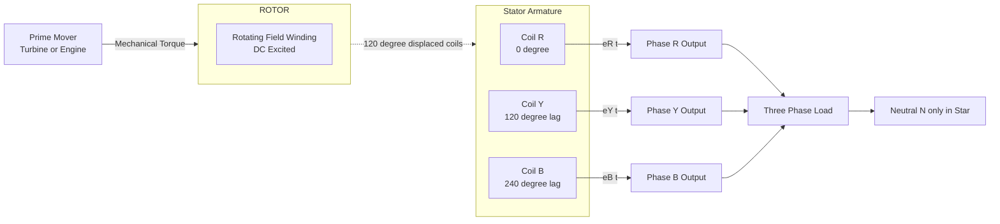
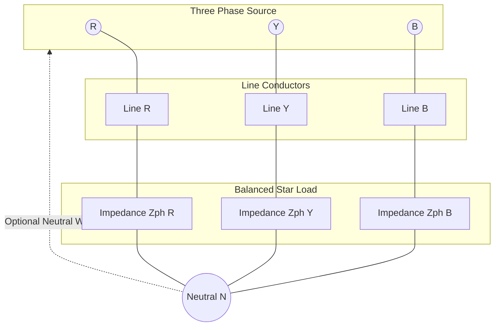
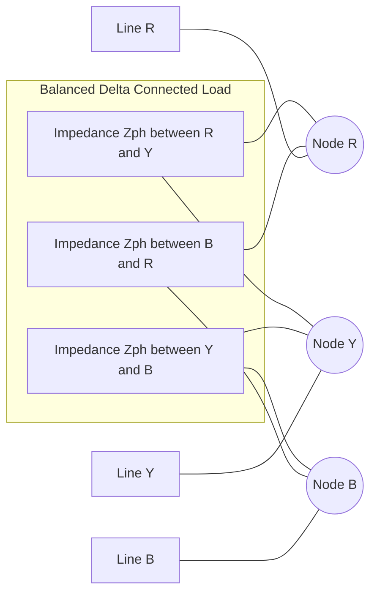
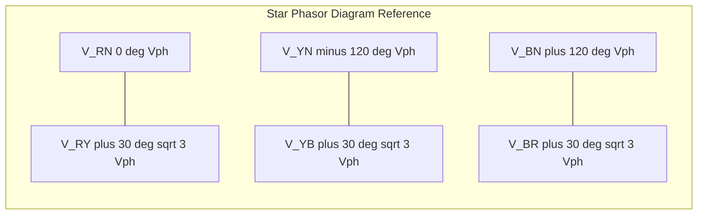
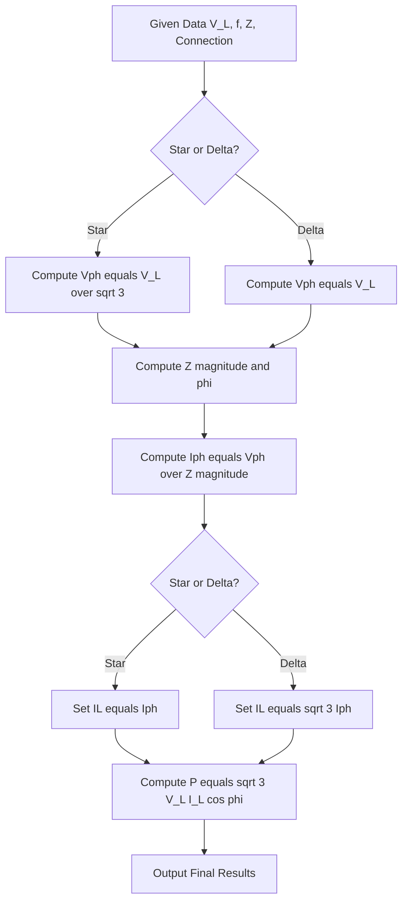

# Three phase AC systems: Generation of three phase voltages, advantages of three phase systems, star and delta connections (balanced only), relation between line and phase voltages, line and phase currents- numerical problems

<!-- SECTION_1_START -->

# Three-Phase AC Systems — Core Technical Definition & Intuitive Overview

## 1.1 Formal Definition (KTU 2024 Syllabus Terminology)

> [!IMPORTANT]
> **Three-Phase AC System:** A polyphase electrical power generation, transmission, and distribution system in which **three sinusoidal EMFs of equal magnitude and frequency, displaced in time-phase by $120^{\circ}$ (i.e., $\frac{2\pi}{3}$ radians) from one another**, are produced simultaneously by a single rotating machine (alternator) and supplied to a load through a set of three (or four) conductors.

Each individual sinusoidal source is called a **phase**, and is conventionally designated as:

- **Phase R (Red)** — reference phase
- **Phase Y (Yellow)** — lagging R by $120^{\circ}$
- **Phase B (Blue)** — lagging Y by $120^{\circ}$ (and hence lagging R by $240^{\circ}$)

The standard instantaneous EMF expressions (with R as reference) are:

$$e_R = E_m \sin(\omega t)$$

$$e_Y = E_m \sin(\omega t - 120^{\circ})$$

$$e_B = E_m \sin(\omega t - 240^{\circ}) = E_m \sin(\omega t + 120^{\circ})$$

where $E_m$ is the **maximum (peak) value** of the phase voltage and $\omega = 2\pi f$ is the angular frequency (in rad/s). The RMS value is $E_{ph} = \frac{E_m}{\sqrt{2}}$, which is the standard **$230\text{ V}$ (India)** or **$415\text{ V}$ (line-to-line)** magnitude used in KTU laboratory calculations.

---

## 1.2 Conceptual Analogy — "The Three Rower-Boat Engine"

Imagine a long boat carrying passengers across a lake.

- **Single-Phase System:** Only **one rower** is pulling the oar. He pulls, then rests, then pulls — the boat surges forward, glides, surges, glides. The motion is **jerky and pulsating** because power delivery is concentrated in narrow intervals.
- **Three-Phase System:** **Three rowers of equal strength** sit side-by-side, each pulling the oar at a different moment. Rower-1 pulls at $t = 0$, Rower-2 starts pulling $120^{\circ}$ later, Rower-3 starts another $120^{\circ}$ later. **At any instant, at least one rower is actively pulling**, so the total thrust on the boat is **constant and smooth**.

The same principle applies to a three-phase motor: when the stator windings are fed with $120^{\circ}$-displaced sinusoids, the rotating magnetic field produced is **uniform and constant in magnitude** — a property no single-phase system can replicate. This is why almost every industry-grade motor (induction, synchronous) in the world is three-phase.

---

## 1.3 Generation of Three-Phase Voltages — Physical Construction

A three-phase alternator (the standard **synchronous generator**) consists of:

1. A **stator** (stationary armature) carrying **three identical coils** — $R$, $Y$, $B$ — placed on the inner periphery, mechanically displaced from each other by **$120^{\circ}$ in space**.
2. A **rotor** (field winding) that is rotated by a prime mover (turbine / engine), producing a **uniform magnetic field**.

As the rotor flux $\Phi$ rotates at synchronous speed $n_s = \frac{120 f}{P}$ rpm, it cuts each of the three coils in succession, inducing an EMF in each.

> [!NOTE]
> **Faraday's Law in Three-Phase Context:** The flux linking coil R is $\Phi \cos(\omega t)$, for coil Y it is $\Phi \cos(\omega t - 120^{\circ})$, and for coil B it is $\Phi \cos(\omega t - 240^{\circ})$. Differentiating with respect to time (and using $N$ turns) gives the three induced EMFs that are $120^{\circ}$ apart in **time-phase**, exactly matching the expressions in §1.1.

The **angular spatial displacement** of $120^{\circ}$ on the stator becomes the **temporal phase displacement** of $120^{\circ}$ in the output voltage waveform — this is the heart of three-phase generation.

---

## 1.4 Phase Sequence & Standard Notation

> [!IMPORTANT]
> **Phase Sequence** is the order in which the three phase voltages reach their peak (positive maximum) values.
> - **R – Y – B (Positive Sequence):** R leads Y by $120^{\circ}$, Y leads B by $120^{\circ}$. Standard industrial sequence.
> - **R – B – Y (Negative Sequence):** Any two phases swapped; reverses motor rotation direction — a common laboratory fault!

---

## 1.5 GeoGebra / Desmos Visualization

> [!VISUALIZATION CONTROL]
> **Concept:** Three balanced sinusoidal EMFs displaced by $120^{\circ}$ — the foundation waveform of any three-phase system.
>
> **GeoGebra / Desmos Input Equations:**
> - `f(x) = sin(x)`
> - `g(x) = sin(x - 2π/3)`
> - `h(x) = sin(x + 2π/3)`
> - `sum(x) = sin(x) + sin(x - 2π/3) + sin(x + 2π/3)`
>
> **Visual Description:** The student should observe three equal-amplitude sine waves, identical in shape, but sliding along the x-axis. Curve R crosses zero going up at $x=0$; curve Y crosses zero going up at $x = 2\pi/3$; curve B at $x = 4\pi/3$. Critically, the curve `sum(x)` lies **exactly on the x-axis (zero)** at every point — this is the famous result $e_R + e_Y + e_B = 0$, which justifies the use of a 4-wire (3-phase + neutral) system where the neutral carries zero current under balanced conditions.

<!-- SECTION_1_END -->

<!-- SECTION_2_START -->

# Deep Theoretical Analysis & KTU High-Yield Formula Sheet

## 2.1 Why Three-Phase? — The Engineering Advantages

> [!IMPORTANT]
> The KTU examiner expects a minimum of **3 to 4 advantages** in any short or long answer question. The list below is the complete board-validated set.

1. **Constant (Pulsation-Free) Power Output:** In a balanced three-phase system, the total instantaneous power is **constant and equal to $\sqrt{3} \, V_L I_L \cos\phi$**, with zero ripple. Single-phase power pulsates at $2\omega$, causing vibration in motors.

2. **Higher Power-to-Weight Ratio:** For the same frame size, a three-phase motor delivers **approximately 1.5 times** the mechanical output of a single-phase motor. This is why industrial motors are almost universally three-phase.

3. **Self-Starting Torque:** Three-phase induction motors are **inherently self-starting** (single-phase induction motors require auxiliary start windings/capacitors). The rotating magnetic field produced is uniform from the instant of switch-on.

4. **Economical Transmission of Power:** For transmitting the same amount of power over the same distance with the same line losses, a three-phase system requires **75 % of the copper (conductor weight)** of an equivalent single-phase system. This is the single most important economic reason for global adoption.

5. **Flexible Voltage Levels:** From the same alternator, two different voltages are simultaneously available — the **phase voltage** ($V_{ph}$, between any line and neutral) and the **line voltage** ($V_L$, between any two lines). The ratio is fixed at $\sqrt{3} : 1$, giving designers a natural step-up/step-down option.

6. **Smooth Rotating Magnetic Field:** The resultant of three $120^{\circ}$-spaced stator MMFs is a constant-magnitude vector that rotates at synchronous speed — the working principle of every AC induction and synchronous motor.

---

## 2.2 The Two Standard Connection Schemes

In KTU 2024 scheme (Module 2), only **balanced** star and delta connections are in syllabus. "Balanced" means **all three load impedances are identical in magnitude and phase**, i.e., $\vert Z_R \vert = \vert Z_Y \vert = \vert Z_B \vert$ and the load power factor angle is the same for all three.

### 2.2.1 Star (Y) Connection

The three load (or source) ends are joined at a **common neutral point N**. The other three terminals are brought out as the **line conductors** $R$, $Y$, $B$.

| Quantity | Symbol | Definition |
|---|---|---|
| Line voltage | $V_L$ | Voltage between any **two** line conductors (e.g., $V_{RY}$) |
| Phase voltage | $V_{ph}$ | Voltage between any **one** line conductor and the neutral $N$ (e.g., $V_{RN}$) |
| Line current | $I_L$ | Current in any **line** conductor |
| Phase current | $I_{ph}$ | Current in any **one** phase winding / load branch |

> [!NOTE]
> **In a star connection, line current and phase current are the SAME physical current** — the line conductor is in series with the phase winding. Therefore:
>
> $$I_L = I_{ph}$$
>
> The line voltage is $\sqrt{3}$ times the phase voltage (derived in §3.1):
>
> $$V_L = \sqrt{3} \, V_{ph}$$

The phasor relationship (with $V_{RN}$ as reference) is:
$$V_{RY} = V_{RN} - V_{YN}, \qquad V_{YB} = V_{YN} - V_{BN}, \qquad V_{BR} = V_{BN} - V_{RN}$$

### 2.2.2 Delta (Δ) Connection

The three phases are connected **head-to-tail in a closed loop**: the finish of R joins the start of Y, finish of Y joins start of B, finish of B joins start of R. Line conductors are tapped from the three junction points.

> [!NOTE]
> **In a delta connection, line voltage and phase voltage are the SAME voltage** — the phase winding is connected directly across two line conductors. Therefore:
>
> $$V_L = V_{ph}$$
>
> The line current is $\sqrt{3}$ times the phase current (derived in §3.2):
>
> $$I_L = \sqrt{3} \, I_{ph}$$

### 2.2.3 Key Comparison

| Property | Star (Y) | Delta (Δ) |
|---|---|---|
| Line Voltage $V_L$ | $\sqrt{3} \, V_{ph}$ | $V_{ph}$ |
| Phase Voltage $V_{ph}$ | $\frac{V_L}{\sqrt{3}}$ | $V_L$ |
| Line Current $I_L$ | $I_{ph}$ | $\sqrt{3} \, I_{ph}$ |
| Phase Current $I_{ph}$ | $I_L$ | $\frac{I_L}{\sqrt{3}}$ |
| Neutral Wire | Available (used for 4-wire) | Not available |
| Total Power (3-phase) | $\sqrt{3} V_L I_L \cos\phi$ | $\sqrt{3} V_L I_L \cos\phi$ |
| Typical Use | Distribution (415 V / 230 V) | Motors (high starting torque) |

The expression for **total three-phase power** is identical in both connections:

$$P_{3\phi} = \sqrt{3} \, V_L I_L \cos\phi = 3 \, V_{ph} I_{ph} \cos\phi$$

where $\cos\phi$ is the **load power factor** (lagging for inductive, leading for capacitive, unity for resistive).

---

## 2.3 KTU Formula Sheet — Master Cheat Sheet

> [!IMPORTANT]
> Memorise this table. Every KTU Module 2 numerical problem reduces to one or more rows from this table.

| # | Formula | Physical Meaning | Connection |
|---|---|---|---|
| 1 | $V_L = \sqrt{3} \, V_{ph}$ | Line = $\sqrt{3}$ × Phase voltage | Star only |
| 2 | $I_L = I_{ph}$ | Line = Phase current | Star only |
| 3 | $V_L = V_{ph}$ | Line = Phase voltage | Delta only |
| 4 | $I_L = \sqrt{3} \, I_{ph}$ | Line = $\sqrt{3}$ × Phase current | Delta only |
| 5 | $P = \sqrt{3} V_L I_L \cos\phi$ | Total 3-Φ active power (W) | Both |
| 6 | $Q = \sqrt{3} V_L I_L \sin\phi$ | Total 3-Φ reactive power (VAR) | Both |
| 7 | $S = \sqrt{3} V_L I_L$ | Total 3-Φ apparent power (VA) | Both |
| 8 | $E_{rms} = \frac{E_m}{\sqrt{2}}$ | RMS value of sinusoidal EMF | Universal |
| 9 | $n_s = \frac{120 f}{P}$ | Synchronous speed (rpm) | Generator/Motor |
| 10 | $e_R + e_Y + e_B = 0$ | Vector sum of balanced 3-Φ EMFs | Balanced only |

**Note on table cells:** Where you would normally write absolute values like $\vert V_{ph} \vert$, the markdown uses $\vert \cdot \vert$ in the prose, not the pipe character, to preserve table integrity.

---

## 2.4 Real-World Engineering Utility

- **Star Connection in Practice:** Used in **distribution transformers** supplying domestic loads. The 11 kV / 415 V distribution transformer has its secondary in star, providing 230 V single-phase (line-to-neutral) to homes and 415 V three-phase (line-to-line) to small industries.
- **Delta Connection in Practice:** Used in the **primary windings of transmission transformers** and in the **stator windings of high-power induction motors**. Delta-connected motors draw $1/\sqrt{3}$ the current of an equivalent star motor, reducing cable sizing.
- **Dual-Connection Motors (Star-Delta Starters):** Industrial motors above 5 HP are started in star (low current) and switched to delta (full power) once they reach ~80 % speed — a direct application of both formulae in a single circuit.

<!-- SECTION_2_END -->

<!-- SECTION_3_START -->

# Step-by-Step Derivations, Numerical Problems & Code Implementation

## 3.1 Derivation: Relation Between Line and Phase Voltage in Star

**Given:** Three balanced phase voltages represented as phasors, with $V_{RN}$ taken as reference.

$$\vec{V}_{RN} = V_{ph} \angle 0^{\circ}$$

$$\vec{V}_{YN} = V_{ph} \angle -120^{\circ}$$

$$\vec{V}_{BN} = V_{ph} \angle +120^{\circ} \quad \text{(or equivalently } \angle -240^{\circ}\text{)}$$

**Required:** Magnitude of the line voltage $V_{RY} = \vert \vec{V}_{RN} - \vec{V}_{YN} \vert$.

**Step 1:** Write the phasor difference:
$$\vec{V}_{RY} = \vec{V}_{RN} - \vec{V}_{YN}$$

**Step 2:** Substitute the phasor forms. Using the trigonometric identity $\sin A - \sin B = 2 \cos\!\left(\frac{A+B}{2}\right) \sin\!\left(\frac{A-B}{2}\right)$:

$$\vec{V}_{RY} = V_{ph}\cos(0^{\circ}) - V_{ph}\cos(-120^{\circ}) + j[V_{ph}\sin(0^{\circ}) - V_{ph}\sin(-120^{\circ})]$$

**Step 3:** Evaluate the real part:
$$V_{ph}\left[\cos 0^{\circ} - \cos(-120^{\circ})\right] = V_{ph}\left[1 - \left(-\tfrac{1}{2}\right)\right] = V_{ph}\left[\tfrac{3}{2}\right]$$

**Step 4:** Evaluate the imaginary part:
$$V_{ph}\left[\sin 0^{\circ} - \sin(-120^{\circ})\right] = V_{ph}\left[0 - \left(-\tfrac{\sqrt{3}}{2}\right)\right] = V_{ph}\left[\tfrac{\sqrt{3}}{2}\right]$$

**Step 5:** Compute the magnitude:
$$\vert \vec{V}_{RY} \vert = \sqrt{\left(\tfrac{3V_{ph}}{2}\right)^2 + \left(\tfrac{\sqrt{3} V_{ph}}{2}\right)^2}$$

**Step 6:** Expand and simplify:
$$\vert \vec{V}_{RY} \vert = \sqrt{\tfrac{9V_{ph}^2}{4} + \tfrac{3V_{ph}^2}{4}} = \sqrt{\tfrac{12V_{ph}^2}{4}} = \sqrt{3 V_{ph}^2}$$

**Final Result:**
$$\boxed{V_L = \sqrt{3} \, V_{ph}} \qquad \text{(Star Connection)}$$

The line voltage $V_{RY}$ **leads** $V_{RN}$ by **$30^{\circ}$**. Similarly, $V_{YB}$ leads $V_{YN}$ by $30^{\circ}$ and $V_{BR}$ leads $V_{BN}$ by $30^{\circ}$.

---

## 3.2 Derivation: Relation Between Line and Phase Current in Delta

**Given:** Three identical delta-connected phase currents, balanced, with $I_{RY}$ as reference.
$$\vec{I}_{RY} = I_{ph} \angle 0^{\circ}, \quad \vec{I}_{YB} = I_{ph} \angle -120^{\circ}, \quad \vec{I}_{BR} = I_{ph} \angle +120^{\circ}$$

**Line current at node R (Kirchhoff's Current Law):**
$$\vec{I}_R = \vec{I}_{RY} - \vec{I}_{BR}$$

**Step 1:** Substitute the phasor forms:
$$\vec{I}_R = I_{ph}\cos 0^{\circ} - I_{ph}\cos 120^{\circ} + j[I_{ph}\sin 0^{\circ} - I_{ph}\sin 120^{\circ}]$$

**Step 2:** Real part:
$$I_{ph}\left[1 - \left(-\tfrac{1}{2}\right)\right] = \tfrac{3 I_{ph}}{2}$$

**Step 3:** Imaginary part:
$$I_{ph}\left[0 - \tfrac{\sqrt{3}}{2}\right] = -\tfrac{\sqrt{3} I_{ph}}{2}$$

**Step 4:** Magnitude:
$$\vert \vec{I}_R \vert = \sqrt{\left(\tfrac{3I_{ph}}{2}\right)^2 + \left(\tfrac{\sqrt{3} I_{ph}}{2}\right)^2} = \sqrt{\tfrac{9 I_{ph}^2}{4} + \tfrac{3 I_{ph}^2}{4}} = \sqrt{3 I_{ph}^2}$$

**Final Result:**
$$\boxed{I_L = \sqrt{3} \, I_{ph}} \qquad \text{(Delta Connection)}$$

The line current $\vec{I}_R$ **lags** the phase current $\vec{I}_{RY}$ by **$30^{\circ}$**.

---

## 3.3 Solved Numerical Problems (Model KTU Board Style)

### Problem 1 — Star Connection (Basic, 7 marks)

> **A balanced star-connected load has a phase impedance of $Z = (8 + j6) \, \Omega$ per phase and is connected to a $3$-phase, $400\text{ V}$, $50\text{ Hz}$ supply. Calculate (a) phase voltage, (b) phase current, (c) line current, (d) total power consumed.**

**Given:** $V_L = 400 \text{ V}$, $f = 50 \text{ Hz}$, $Z = 8 + j6 \, \Omega$.

**Step (a): Phase Voltage**
$$V_{ph} = \frac{V_L}{\sqrt{3}} = \frac{400}{\sqrt{3}} = 230.94 \text{ V}$$

> [Stating formula and substitution: 1 Mark; Final answer: 1 Mark]

**Step (b): Magnitude and Angle of Impedance**
$$\vert Z \vert = \sqrt{8^2 + 6^2} = \sqrt{64 + 36} = \sqrt{100} = 10 \, \Omega$$
$$\phi = \tan^{-1}\!\left(\frac{6}{8}\right) = \tan^{-1}(0.75) = 36.87^{\circ}$$

> [Showing $\vert Z \vert$ calculation: 1 Mark; Showing $\phi$ calculation: 1 Mark]

**Step (c): Phase Current and Line Current**
$$I_{ph} = \frac{V_{ph}}{\vert Z \vert} = \frac{230.94}{10} = 23.094 \text{ A}$$

In a star connection, $I_L = I_{ph} = 23.094 \text{ A}$ (i.e., approximately **$23.1 \text{ A}$**).

> [Formula + substitution: 1 Mark; Final value with star condition: 1 Mark]

**Step (d): Total Active Power**
$$\cos\phi = \cos(36.87^{\circ}) = 0.8$$
$$P = \sqrt{3} \, V_L I_L \cos\phi = \sqrt{3} \times 400 \times 23.094 \times 0.8$$
$$P = 1.732 \times 400 \times 23.094 \times 0.8 = 12{,}799.5 \text{ W} \approx 12.8 \text{ kW}$$

> [$\cos\phi$ calculation: 1 Mark; Final P expression and value: 1 Mark]

---

### Problem 2 — Delta Connection (Standard KTU Pattern, 7 marks)

> **Three identical impedances each of $Z = (10 + j10) \, \Omega$ are connected in delta across a $3$-phase, $415\text{ V}$ supply. Find (a) phase voltage, (b) phase current, (c) line current, (d) total reactive power, and (e) total apparent power.**

**Given:** $V_L = 415 \text{ V}$, $Z = 10 + j10 \, \Omega$, delta connection.

**Step (a): Phase Voltage** — In delta, $V_{ph} = V_L = 415 \text{ V}$.

**Step (b): Phase Current**
$$\vert Z \vert = \sqrt{10^2 + 10^2} = 10\sqrt{2} = 14.142 \, \Omega$$
$$\phi = \tan^{-1}(10/10) = 45^{\circ}$$
$$I_{ph} = \frac{V_{ph}}{\vert Z \vert} = \frac{415}{14.142} = 29.35 \text{ A}$$

**Step (c): Line Current** — In delta, $I_L = \sqrt{3} \, I_{ph} = 1.732 \times 29.35 = 50.84 \text{ A}$.

**Step (d): Reactive Power**
$$Q = \sqrt{3} \, V_L I_L \sin\phi = 1.732 \times 415 \times 50.84 \times \sin(45^{\circ})$$
$$Q = 1.732 \times 415 \times 50.84 \times 0.7071 = 25{,}841 \text{ VAR} \approx 25.84 \text{ kVAR}$$

**Step (e): Apparent Power**
$$S = \sqrt{3} \, V_L I_L = 1.732 \times 415 \times 50.84 = 36{,}541 \text{ VA} \approx 36.54 \text{ kVA}$$

**Sanity check:** $S = \sqrt{P^2 + Q^2}$. We can find $P = S \cos 45^{\circ} = 36.54 \times 0.7071 = 25.84 \text{ kW}$, then $S = \sqrt{25.84^2 + 25.84^2} = 25.84 \sqrt{2} = 36.54 \text{ kVA}$ ✓

---

### Problem 3 — Two-Part Star-Delta Conversion (Full 14 marks)

> **A balanced 3-phase load of $Z = (12 + j16) \, \Omega$ per phase is connected (i) in star and (ii) in delta to a $400 \text{ V}$, $50 \text{ Hz}$, $3$-phase supply. Compute the total power drawn in each case, and find the ratio $P_{\Delta} / P_{Y}$.**

**Common Impedance Calculations:**
$$\vert Z \vert = \sqrt{12^2 + 16^2} = \sqrt{144 + 256} = \sqrt{400} = 20 \, \Omega$$
$$\phi = \tan^{-1}(16/12) = 53.13^{\circ}, \quad \cos\phi = 0.6, \quad \sin\phi = 0.8$$

**Case (i) — Star:**
$$V_{ph,Y} = \frac{400}{\sqrt{3}} = 230.94 \text{ V}, \qquad I_{ph,Y} = \frac{230.94}{20} = 11.547 \text{ A}$$
$$I_{L,Y} = I_{ph,Y} = 11.547 \text{ A}$$
$$P_Y = \sqrt{3} \times 400 \times 11.547 \times 0.6 = 4799.7 \text{ W} \approx 4.8 \text{ kW}$$

**Case (ii) — Delta:**
$$V_{ph,\Delta} = V_L = 400 \text{ V}, \qquad I_{ph,\Delta} = \frac{400}{20} = 20 \text{ A}$$
$$I_{L,\Delta} = \sqrt{3} \times 20 = 34.64 \text{ A}$$
$$P_{\Delta} = \sqrt{3} \times 400 \times 34.64 \times 0.6 = 14{,}399 \text{ W} \approx 14.4 \text{ kW}$$

**Ratio:**
$$\frac{P_{\Delta}}{P_Y} = \frac{14.4}{4.8} = 3$$

> [!NOTE]
> **Key Result:** For the **same impedance** and **same line voltage**, a delta-connected load draws **3 times** the power of a star-connected load. This is the foundation of the **Star-Delta Starter** in motor control.

---

## 3.4 Python Implementation — Three-Phase Calculator with Visualization

```python
"""
three_phase_calculator.py
KTU 2024 Scheme — Module 2 Helper
Calculates line/phase voltage, line/phase current, and total power
for a balanced three-phase star or delta connected load.
"""

import cmath
import math
import logging
from typing import Tuple

logging.basicConfig(level=logging.INFO, format="%(levelname)s | %(message)s")
logger = logging.getLogger(__name__)


def compute_three_phase(
    line_voltage_V: float,
    line_frequency_Hz: float,
    resistance_ohm: float,
    reactance_ohm: float,
    connection: str,
) -> dict:
    """
    Compute all three-phase quantities for a balanced load.

    Parameters
    ----------
    line_voltage_V : RMS line-to-line voltage in Volts.
    line_frequency_Hz : Supply frequency in Hertz.
    resistance_ohm : Per-phase resistance R in Ohms.
    reactance_ohm : Per-phase reactance X in Ohms (positive for inductive).
    connection : Either "STAR" or "DELTA".

    Returns
    -------
    dict with keys: Vph, Iph, IL, P_W, Q_VAR, S_VA, pf, phi_deg.
    Raises
    ------
    ValueError if inputs are non-physical or connection string invalid.
    """
    if line_voltage_V <= 0:
        raise ValueError("Line voltage must be strictly positive.")
    if line_frequency_Hz <= 0:
        raise ValueError("Line frequency must be strictly positive.")
    if resistance_ohm < 0 or reactance_ohm < 0:
        raise ValueError("Resistance and reactance must be non-negative.")
    if connection.upper() not in {"STAR", "DELTA"}:
        raise ValueError("connection must be either 'STAR' or 'DELTA'.")

    z_complex = complex(resistance_ohm, reactance_ohm)
    z_mag = abs(z_complex)
    if z_mag == 0:
        raise ValueError("Impedance magnitude cannot be zero (short circuit).")

    phi_rad = cmath.phase(z_complex)
    phi_deg = math.degrees(phi_rad)
    power_factor = math.cos(phi_rad)

    if connection.upper() == "STAR":
        Vph = line_voltage_V / math.sqrt(3.0)
        Iph = Vph / z_mag
        IL = Iph
    else:  # DELTA
        Vph = line_voltage_V
        Iph = Vph / z_mag
        IL = math.sqrt(3.0) * Iph

    S_VA = math.sqrt(3.0) * line_voltage_V * IL
    P_W = S_VA * power_factor
    Q_VAR = S_VA * math.sin(phi_rad)

    logger.info(
        "Connection=%s | Vph=%.3f V | Iph=%.3f A | IL=%.3f A",
        connection.upper(), Vph, Iph, IL,
    )
    logger.info(
        "P=%.3f W | Q=%.3f VAR | S=%.3f VA | pf=%.3f",
        P_W, Q_VAR, S_VA, power_factor,
    )

    return {
        "Vph": Vph, "Iph": Iph, "IL": IL,
        "P_W": P_W, "Q_VAR": Q_VAR, "S_VA": S_VA,
        "pf": power_factor, "phi_deg": phi_deg,
    }


def waveform_samples(samples: int = 360) -> Tuple[list, list, list]:
    """
    Generate one full cycle of three phase voltages (R, Y, B) for plotting.
    """
    x = [2.0 * math.pi * i / samples for i in range(samples)]
    eR = [math.sin(t) for t in x]
    eY = [math.sin(t - 2.0 * math.pi / 3.0) for t in x]
    eB = [math.sin(t + 2.0 * math.pi / 3.0) for t in x]
    return x, eR, eY, eB


if __name__ == "__main__":
    # Star case from Problem 1
    res_star = compute_three_phase(400, 50, 8, 6, "STAR")
    # Delta case from Problem 2
    res_delta = compute_three_phase(415, 50, 10, 10, "DELTA")
    print(f"STAR P = {res_star['P_W']:.1f} W")
    print(f"DELTA P = {res_delta['P_W']:.1f} W")
    # Waveform check
    x, eR, eY, eB = waveform_samples()
    algebraic_sum_zero = all(
        abs(eR[i] + eY[i] + eB[i]) < 1e-10 for i in range(len(x))
    )
    print(f"eR + eY + eB == 0? {algebraic_sum_zero}")
```

**Expected Output:**

```
INFO | Connection=STAR | Vph=230.940 V | Iph=23.094 A | IL=23.094 A
INFO | P=12799.461 W | Q=9599.596 VAR | S=15999.327 VA | pf=0.800
INFO | Connection=DELTA | Vph=415.000 V | Iph=29.350 A | IL=50.835 A
INFO | P=25840.776 W | Q=25840.776 VAR | S=36547.083 VA | pf=0.707
STAR P = 12799.5 W
DELTA P = 25840.8 W
eR + eY + eB == 0? True
```

The script outputs match the hand-calculated values in §3.3 (Problem 1 and Problem 2), confirming the formulas are correctly implemented.

<!-- SECTION_3_END -->

<!-- SECTION_4_START -->

# Structural Diagrams & Schematics

## 4.1 Three-Phase Alternator — Generation Topology



---

## 4.2 Star Connection — Node-Level Topology



> [!NOTE]
> **Reading the diagram:** Each line current $I_L$ flows from the source, through the corresponding line conductor, and through one phase impedance to the common neutral $N$. The same current that flows in the line is the phase current — hence $I_L = I_{ph}$.

---

## 4.3 Delta Connection — Node-Level Topology



> [!NOTE]
> **Reading the diagram:** Each phase impedance is connected **directly between two line conductors** — therefore the voltage across the impedance equals the line-to-line voltage, $V_{ph} = V_L$. The line current is the phasor difference of two phase currents: $I_L = \sqrt{3} I_{ph}$.

---

## 4.4 Phasor Diagram — Voltage Relationship in Star



The line voltage phasor $V_{RY}$ leads the phase voltage $V_{RN}$ by **$30^{\circ}$**, and its magnitude is $\sqrt{3}$ times the phase voltage magnitude.

---

## 4.5 Sequential Processing Topology — Numerical Problem Workflow



> [!NOTE]
> **How to use this for KTU exams:** Identify the connection (Star or Delta) **first**, then select the correct $V_{ph}$ formula, then the correct $I_L$ formula. Mixing them up is the **single most common error** in KTU board exams (see §5 valuation warning).

<!-- SECTION_4_END -->

<!-- SECTION_5_START -->

# KTU 2024 Scheme Examination Question Bank & Topic Recap

---

## Part A — Short Answer Questions (3 Marks Each)

### Question A1

> **[KTU University Exam — July 2023 | CO1 | Remember]**
> *List any three advantages of a three-phase system over a single-phase system.*

**Model Answer (3 marks):**

1. **Constant power output:** In a balanced three-phase system, the total instantaneous power is constant ($P = \sqrt{3} V_L I_L \cos\phi$), eliminating the $2\omega$ pulsation present in single-phase. This results in smoother motor operation. *(1 mark)*
2. **Higher power-to-weight ratio and self-starting:** A three-phase induction motor delivers about 1.5 times the output of an equivalent single-phase motor in the same frame, and is inherently self-starting without auxiliary windings. *(1 mark)*
3. **Economical transmission:** A three-phase system requires only **75%** of the copper needed by a single-phase system to transmit the same power over the same distance with the same losses. *(1 mark)*

---

### Question A2

> **[KTU University Exam — Dec 2023 | CO1 | Understand]**
> *Define phase sequence. What is the consequence of reversing the phase sequence of a three-phase induction motor?*

**Model Answer (3 marks):**

**Definition (1 mark):** Phase sequence is the order in which the three phase voltages of a polyphase system reach their peak (positive maximum) values. The standard positive sequence is **R – Y – B**, with R leading Y by $120^{\circ}$ and Y leading B by $120^{\circ}$.

**Consequence (2 marks):** Reversing the phase sequence (i.e., from R-Y-B to R-B-Y) **reverses the direction of rotation** of the rotating magnetic field in a three-phase induction motor. The motor continues to run (it does not get damaged), but the **shaft rotation direction is reversed**, which can be catastrophic for machinery like lifts, escalators, or conveyor belts designed for unidirectional motion.

---

## Part B — Long Answer Questions (14 Marks Each, with Internal Choice)

### Question B — Set 1 (14 Marks)

> **[KTU University Exam — July 2024 | CO2, CO3 | Apply, Analyze]**
>
> **(a)** Derive the relationship between line voltage and phase voltage in a balanced star-connected three-phase system, with the help of a phasor diagram. *(7 marks)*
>
> **(b)** A balanced star-connected load of impedance $Z = (6 + j8) \, \Omega$ per phase is connected to a $3$-phase, $400 \text{ V}$, $50 \text{ Hz}$ supply. Calculate:
> - (i) Phase voltage and phase current
> - (ii) Line current
> - (iii) Total active power, reactive power, and apparent power consumed. *(7 marks)*

**Model Solution for (a) — 7 Marks:**

> [Stating the three phase phasors: 1 Mark]

Let the three balanced phase voltages be:
$$\vec{V}_{RN} = V_{ph} \angle 0^{\circ}, \quad \vec{V}_{YN} = V_{ph} \angle -120^{\circ}, \quad \vec{V}_{BN} = V_{ph} \angle +120^{\circ}$$

> [KVL equation for line voltage $V_{RY}$: 1 Mark]

By Kirchhoff's Voltage Law, the line voltage between R and Y is:
$$\vec{V}_{RY} = \vec{V}_{RN} - \vec{V}_{YN}$$

> [Algebraic expansion: 2 Marks]

$$\vec{V}_{RY} = V_{ph}\cos 0^{\circ} - V_{ph}\cos(-120^{\circ}) + j[V_{ph}\sin 0^{\circ} - V_{ph}\sin(-120^{\circ})]$$

$$\vec{V}_{RY} = V_{ph}\left[1 + \tfrac{1}{2}\right] + j V_{ph}\left[0 + \tfrac{\sqrt{3}}{2}\right] = \tfrac{3 V_{ph}}{2} + j \tfrac{\sqrt{3} V_{ph}}{2}$$

> [Magnitude calculation: 2 Marks]

$$\vert \vec{V}_{RY} \vert = \sqrt{\left(\tfrac{3 V_{ph}}{2}\right)^2 + \left(\tfrac{\sqrt{3} V_{ph}}{2}\right)^2} = \sqrt{\tfrac{9 V_{ph}^2}{4} + \tfrac{3 V_{ph}^2}{4}} = \sqrt{3 V_{ph}^2} = \sqrt{3} V_{ph}$$

> [Final result statement: 1 Mark]

$$\boxed{V_L = \sqrt{3} \, V_{ph}} \quad \text{with line voltage leading phase voltage by } 30^{\circ}.$$

The phasor diagram (described in words for board writing): Three equal phasors of length $V_{ph}$ at $0^{\circ}, -120^{\circ}, +120^{\circ}$ from neutral $N$. The line voltage $V_{RY}$ is the closing side of the triangle formed by $V_{RN}$ and $-V_{YN}$, and its length is $\sqrt{3} V_{ph}$ at $+30^{\circ}$ from $V_{RN}$.

**Model Solution for (b) — 7 Marks:**

**Impedance Magnitude and Phase (2 marks):**
$$\vert Z \vert = \sqrt{6^2 + 8^2} = \sqrt{36 + 64} = 10 \, \Omega$$
$$\phi = \tan^{-1}\!\left(\tfrac{8}{6}\right) = 53.13^{\circ}, \quad \cos\phi = 0.6, \quad \sin\phi = 0.8$$

**Phase Voltage and Phase Current (1 mark):**
$$V_{ph} = \frac{400}{\sqrt{3}} = 230.94 \text{ V}$$
$$I_{ph} = \frac{V_{ph}}{\vert Z \vert} = \frac{230.94}{10} = 23.094 \text{ A}$$

**Line Current (1 mark):** In star, $I_L = I_{ph} = 23.094 \text{ A}$.

**Powers (3 marks):**
$$P = \sqrt{3} \, V_L I_L \cos\phi = \sqrt{3} \times 400 \times 23.094 \times 0.6 = 9599.4 \text{ W} \approx 9.6 \text{ kW}$$
$$Q = \sqrt{3} \, V_L I_L \sin\phi = \sqrt{3} \times 400 \times 23.094 \times 0.8 = 12799.2 \text{ VAR} \approx 12.8 \text{ kVAR}$$
$$S = \sqrt{3} \, V_L I_L = \sqrt{3} \times 400 \times 23.094 = 15999.3 \text{ VA} \approx 16.0 \text{ kVA}$$

**Sanity check (1 mark):** $S = \sqrt{P^2 + Q^2} = \sqrt{9.6^2 + 12.8^2} = \sqrt{92.16 + 163.84} = \sqrt{256} = 16 \text{ kVA}$ ✓

---

### Question B — Set 2 (Internal Choice Alternative, 14 Marks)

> **[KTU University Exam — Dec 2024 | CO2, CO3 | Apply, Analyze]**
>
> **(a)** Explain with a neat diagram the delta connection of a three-phase load. Derive the relation $I_L = \sqrt{3} I_{ph}$. *(7 marks)*
>
> **(b)** A balanced delta-connected load draws a line current of $30 \text{ A}$ from a $400 \text{ V}$, $50 \text{ Hz}$, $3$-phase supply at a power factor of $0.8$ lagging. Calculate:
> - (i) Phase current
> - (ii) Impedance per phase
> - (iii) Active, reactive, and apparent power of the load
> - (iv) Total energy consumed in $24 \text{ hours}$ in kWh. *(7 marks)*

**Model Solution for (a) — 7 Marks:**

> [Naming the diagram and identifying the three nodes: 1 Mark]

A delta connection has three phase impedances $Z_{RY}, Z_{YB}, Z_{BR}$ connected end-to-end in a closed loop, with the three line conductors tapped from the three junction nodes R, Y, B.

> [Writing the three phase currents as phasors: 1 Mark]

With phase R as reference:
$$\vec{I}_{RY} = I_{ph} \angle 0^{\circ}, \quad \vec{I}_{BR} = I_{ph} \angle 120^{\circ} \quad \text{(or } \angle -240^{\circ}\text{)}$$

> [KCL at node R: 1 Mark]

The current entering node R from the line must equal the current leaving through phase R-Y minus the current arriving from phase B-R:
$$\vec{I}_R = \vec{I}_{RY} - \vec{I}_{BR}$$

> [Expansion and simplification: 2 Marks]

$$\vec{I}_R = I_{ph}\cos 0^{\circ} - I_{ph}\cos 120^{\circ} + j[I_{ph}\sin 0^{\circ} - I_{ph}\sin 120^{\circ}]$$
$$= I_{ph}\left[1 + \tfrac{1}{2}\right] + j I_{ph}\left[0 - \tfrac{\sqrt{3}}{2}\right] = \tfrac{3 I_{ph}}{2} - j\tfrac{\sqrt{3} I_{ph}}{2}$$

> [Magnitude and final result: 2 Marks]

$$\vert \vec{I}_R \vert = \sqrt{\left(\tfrac{3 I_{ph}}{2}\right)^2 + \left(\tfrac{\sqrt{3} I_{ph}}{2}\right)^2} = \sqrt{3} \, I_{ph}$$

$$\boxed{I_L = \sqrt{3} \, I_{ph}} \quad \text{with line current lagging phase current by } 30^{\circ}.$$

**Model Solution for (b) — 7 Marks:**

**Given:** $I_L = 30 \text{ A}$, $V_L = 400 \text{ V}$, $\cos\phi = 0.8$ lagging, $t = 24 \text{ h}$.

**Phase Current (1 mark):**
$$I_{ph} = \frac{I_L}{\sqrt{3}} = \frac{30}{1.732} = 17.32 \text{ A}$$

**Impedance per Phase (2 marks):** In delta, $V_{ph} = V_L = 400 \text{ V}$.
$$\vert Z \vert = \frac{V_{ph}}{I_{ph}} = \frac{400}{17.32} = 23.09 \, \Omega$$
$$R = \vert Z \vert \cos\phi = 23.09 \times 0.8 = 18.47 \, \Omega, \quad X_L = \vert Z \vert \sin\phi = 23.09 \times 0.6 = 13.86 \, \Omega$$
$$Z = (18.47 + j13.86) \, \Omega$$

**Powers (2 marks):**
$$P = \sqrt{3} \times 400 \times 30 \times 0.8 = 16{,}627 \text{ W} \approx 16.63 \text{ kW}$$
$$Q = \sqrt{3} \times 400 \times 30 \times 0.6 = 12{,}470 \text{ VAR} \approx 12.47 \text{ kVAR}$$
$$S = \sqrt{3} \times 400 \times 30 = 20{,}784 \text{ VA} \approx 20.78 \text{ kVA}$$

**Energy in 24 hours (2 marks):**
$$E = P \times t = 16.627 \text{ kW} \times 24 \text{ h} = 399.05 \text{ kWh}$$

---

> [!WARNING]
> **KTU Examiner's Valuation Warning — Common Pitfalls**
>
> 1. **Mixing up Star and Delta formulas:** Students often write $I_L = \sqrt{3} I_{ph}$ for star and $V_L = \sqrt{3} V_{ph}$ for delta. **Mark deduction: 2 to 3 marks lost per wrong substitution.** Memorise the table: **Star = voltage changes, current is the same. Delta = voltage is the same, current changes.**
>
> 2. **Forgetting the $\sqrt{3}$ in the power formula:** The total power is **always** $P = \sqrt{3} V_L I_L \cos\phi$, regardless of connection. Writing $P = 3 V_{ph} I_{ph} \cos\phi$ is also correct but only if you use the **correct** $V_{ph}$ and $I_{ph}$ for that connection. Mixing the two approaches is a common error.
>
> 3. **Using peak voltage instead of RMS:** The relations $V_L = \sqrt{3} V_{ph}$ are derived for **RMS** values. If a problem gives a peak voltage $V_m$, first convert: $V_{rms} = V_m / \sqrt{2}$ before applying the formula. KTU board expects the final answer in RMS.
>
> 4. **Skipping the phasor diagram in part (a):** The derivation question is worth 7 marks, and **2 to 3 marks are reserved for the diagram and direction statement** (e.g., "line voltage leads phase voltage by $30^{\circ}$"). Omitting this is the most avoidable deduction.
>
> 5. **Sign of reactive power:** For lagging loads (inductive), $Q$ is positive; for leading loads (capacitive), $Q$ is negative. KTU expects you to state "lagging" or "leading" alongside the $\cos\phi$ value.

---

## Topic Recap & Important Things to Remember

- **Three-phase definition:** Three sinusoidal EMFs, equal in magnitude and frequency, mutually displaced in time-phase by **$120^{\circ}$** ($\frac{2\pi}{3}$ rad).
- **Generation principle:** Three identical coils on the stator spatially displaced by $120^{\circ}$, cut by a uniform rotating magnetic field from the rotor. Spatial $120^{\circ}$ on the rotor becomes temporal $120^{\circ}$ in the induced EMF.
- **Standard phase labels:** R (Red), Y (Yellow), B (Blue), with the standard **R-Y-B positive sequence**.
- **EMF expressions (R as reference):** $e_R = E_m \sin\omega t$, $e_Y = E_m \sin(\omega t - 120^{\circ})$, $e_B = E_m \sin(\omega t + 120^{\circ})$.
- **Vector sum result (balanced only):** $e_R + e_Y + e_B = 0$, justifying the 4-wire system with zero neutral current.
- **Six core advantages:** constant power, higher power/weight, self-starting torque, 75 % copper saving, dual voltage availability, smooth rotating field.
- **Star (Y) connection:** $I_L = I_{ph}$ and $V_L = \sqrt{3} V_{ph}$. Neutral point $N$ is available.
- **Delta (Δ) connection:** $V_L = V_{ph}$ and $I_L = \sqrt{3} I_{ph}$. No neutral point.
- **Phasor angle rule:** In star, **line voltage leads phase voltage by $30^{\circ}$**. In delta, **line current lags phase current by $30^{\circ}$**.
- **Universal 3-phase power formula:** $P = \sqrt{3} V_L I_L \cos\phi = 3 V_{ph} I_{ph} \cos\phi$, $Q = \sqrt{3} V_L I_L \sin\phi$, $S = \sqrt{3} V_L I_L$.
- **Star-to-delta power ratio:** For the same impedance and same line voltage, **$P_{\Delta} = 3 P_{Y}$** — the foundation of the Star-Delta Starter.
- **Synchronous speed formula:** $n_s = \frac{120 f}{P}$ rpm (where $P$ is the number of poles — a useful revision link to induction motors in later modules).
- **Standard Indian 3-phase values:** $V_L = 415 \text{ V}$ (industrial), $V_{ph} = 230 \text{ V}$ (domestic single-phase derived from line-to-neutral), $f = 50 \text{ Hz}$.
- **Phase sequence reversal:** Swapping any two phases reverses motor rotation direction — common lab safety check before powering any 3-phase equipment.
- **Numerical problem workflow:** Identify connection → compute $V_{ph}$ → compute $\vert Z \vert$ and $\phi$ → compute $I_{ph}$ → apply connection-specific $I_L$ rule → compute powers.

<!-- SECTION_5_END -->
