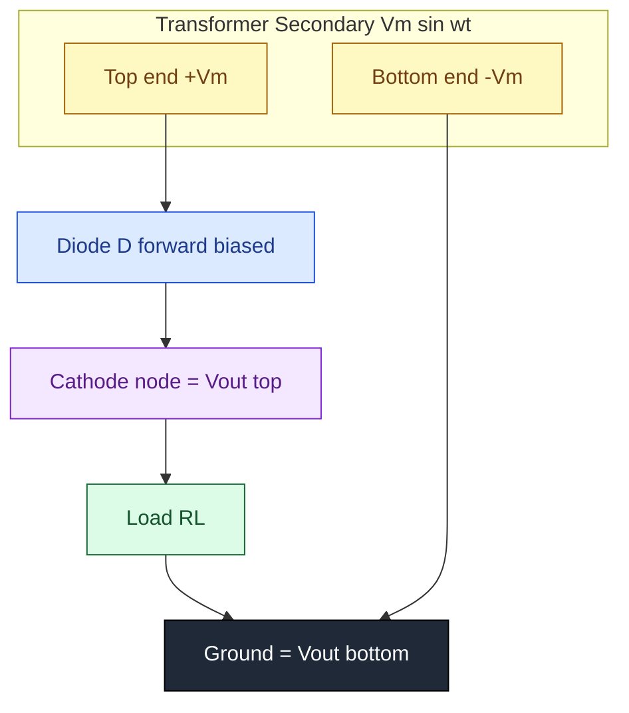
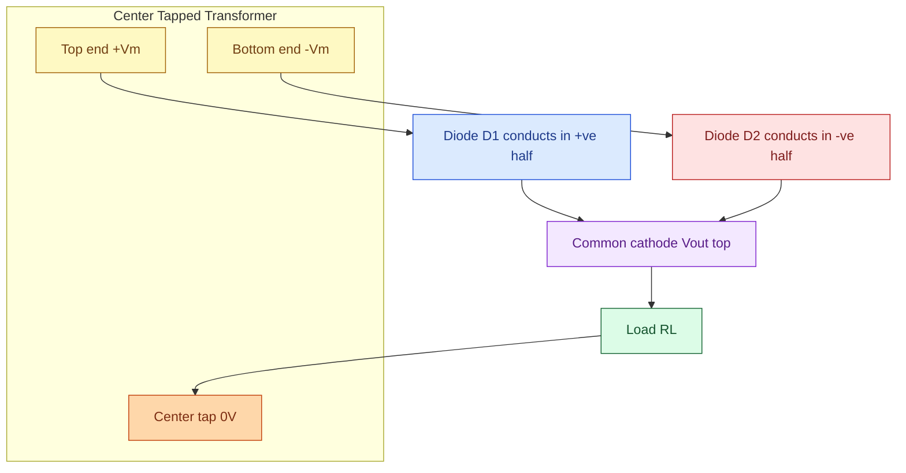
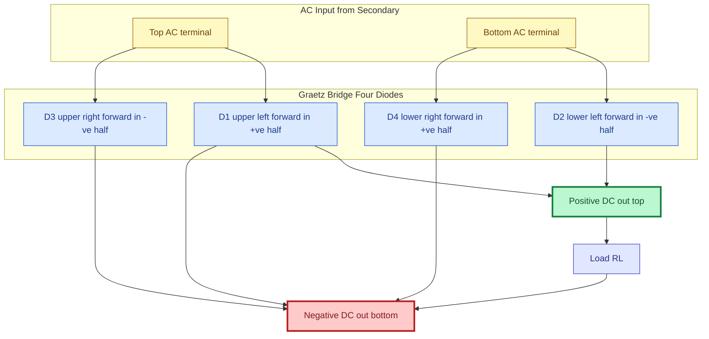
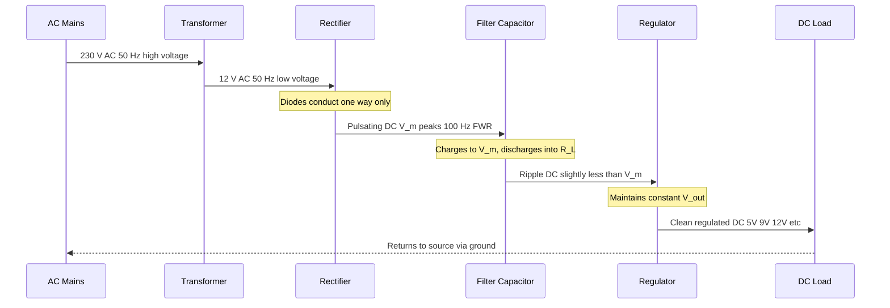
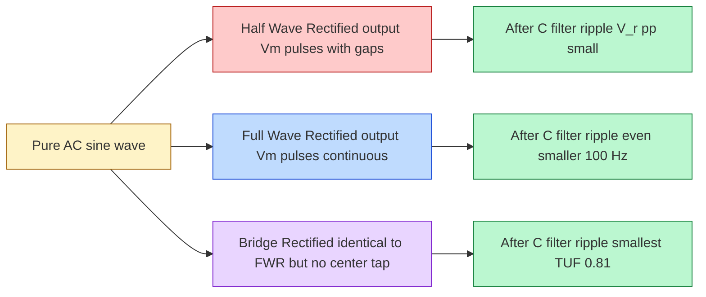

# Block diagram of DC power supply, circuit and working of half wave, full wave and bridge rectifiers, ripple factor (with and without capacitor filters)

<!-- SECTION_1_START -->
# 1. Core Technical Definition & Intuitive Overview

## 1.1 DC Power Supply — Formal Definition

A **DC Power Supply** is an electronic circuit that converts the standard Alternating Current (AC) mains supply (typically 230 V, 50 Hz in India / Kerala) into a steady, regulated Direct Current (DC) voltage suitable for powering electronic circuits, microcontrollers, sensors, and operational amplifiers. In the KTU 2024 Scheme framework (Course Code: **GXEST104**), the unregulated / regulated DC power supply is the foundational building block of every analog and digital electronic system.

> [!IMPORTANT]
> **KTU Syllabus Highlight (Module 3):** The DC power supply is a **5-stage cascaded linear system** — *Transformer → Rectifier → Filter → Regulator → Load*. Every stage is mandatory and each one has a specific engineering role.

## 1.2 Block Diagram of a DC Power Supply

The standard block representation (used universally in KTU question papers) is:

$$
\text{AC Mains (230 V, 50 Hz)} \rightarrow \text{Step-Down Transformer} \rightarrow \text{Rectifier} \rightarrow \text{Filter} \rightarrow \text{Regulator} \rightarrow \text{DC Load}
$$

| Block | Function | Typical Component |
|---|---|---|
| **Transformer** | Steps down 230 V AC to low-voltage AC (e.g., 12 V, 9 V) and provides galvanic isolation | Iron-core step-down transformer |
| **Rectifier** | Converts bidirectional AC to unidirectional pulsating DC | 1 / 2 / 4 diodes (Si / Ge) |
| **Filter** | Smooths pulsating DC into ripple DC by removing AC components | Capacitor (C), Inductor (L), LC, π-filter |
| **Regulator** | Maintains constant output DC despite variations in input / load | Zener diode, IC 78xx, LM317 |
| **Load** | The actual electronic circuit being powered | MCU, Op-Amp, Sensor, Motor |

## 1.3 Rectifier — Formal Definition

A **Rectifier** is a two-terminal nonlinear device (diode) or a network of diodes that permits current flow in **only one direction**, thereby converting AC (which alternates positive and negative) into unidirectional (pulsating DC) current. The three KTU-prescribed topologies are:

1. **Half-Wave Rectifier (HWR)** — uses 1 diode.
2. **Full-Wave Center-Tapped Rectifier (FWCT)** — uses 2 diodes + center-tapped transformer.
3. **Bridge Rectifier (BR)** — uses 4 diodes in a Graetz bridge; no center tap needed.

## 1.4 Conceptual Analogy — The "Water Tap" Intuition

> [!NOTE]
> **Think of the diode as a one-way water valve.**
>
> * Imagine a pipe carrying water that flows forward, then backward, then forward again (AC).
> * A **rectifier** is like a flap-valve that only opens when water pushes one way — water flowing the "wrong" way is blocked.
> * A **half-wave** rectifier is a single valve (one direction only) → you lose half the water.
> * A **full-wave** rectifier is a clever Y-shaped pipe with two valves (D₁ and D₂) so that **both** directions of flow are directed into the *same* bucket.
> * A **bridge rectifier** is a 4-valve diamond that achieves the same result *without* needing a special center-tap pipe.
> * The **filter capacitor** is a large balloon at the end of the pipe — it inflates on the push (charging) and deflates slowly (discharging) between pushes, giving you a *smooth, steady trickle* instead of pulses.

## 1.5 Ripple Factor — The Quality Metric

**Ripple Factor (γ)** is the dimensionless number that quantifies how "impure" (i.e., how much residual AC remains in) the DC output. Lower γ ⇒ cleaner DC ⇒ better rectifier.

$$
\boxed{\gamma = \frac{V_{rms(ac)}}{V_{DC}} = \frac{\sqrt{V_{rms(total)}^{2} - V_{DC}^{2}}}{V_{DC}}}
$$

**Standard Reference Values (memorize for KTU viva & exam):**

| Quantity | Half-Wave | Full-Wave / Bridge |
|---|---|---|
| **Ripple Factor (γ)** | **1.21** | **0.482** |
| **Rectification Efficiency (η)** | **40.6 %** | **81.2 %** |
| **Form Factor (FF)** | 1.57 | 1.11 |
| **Peak Inverse Voltage (PIV)** | $V_m$ | $2 V_m$ (FWCT) / $V_m$ (Bridge) |
| **Transformer Utilisation Factor** | 0.287 | 0.693 (FWCT) / 0.810 (Bridge) |

> [!VISUALIZATION CONTROL]
> **Concept:** Pulsating vs Filtered DC Waveform
> **GeoGebra / Desmos Input Equations:**
> * Half-wave (unfiltered): `f(x) = sin(x) for x in [0, π]; 0 for x in [π, 2π]`
> * Full-wave (unfiltered): `f(x) = |sin(x)|`
> * Full-wave with C-filter: `f(x) ≈ Vm - (Vm - Vmin) * exp(-x/(R*C))` between peaks
> **Visual Description:** Student should observe (a) half-wave stays at zero for half the period, (b) full-wave has both humps positive, (c) filtered waveform is a "rippling sawtooth" hugging the peak voltage $V_m$.

<!-- SECTION_1_END -->

<!-- SECTION_2_START -->
# 2. Deep Theoretical Analysis & KTU High-Yield Formula Sheet

## 2.1 Half-Wave Rectifier — Circuit & Operation

**Circuit:** A single diode D in series with the secondary of a step-down transformer and load resistor $R_L$.

**Working Principle (cycle-by-cycle):**

* **Positive half-cycle (0 to π):** Diode D is **forward biased (FB)** → conducts → load current $i_L = i_m \sin(\omega t)$ flows.
* **Negative half-cycle (π to 2π):** Diode D is **reverse biased (RB)** → does **not** conduct → $i_L = 0$.
* **Output across $R_L$:** A series of positive half-sine pulses separated by zero gaps (pulsating DC).

**Peak Inverse Voltage:** During the negative half-cycle, the entire transformer secondary voltage $V_m$ appears across D as reverse bias. Hence:
$$
\boxed{PIV_{HWR} = V_m}
$$

## 2.2 Full-Wave Center-Tapped Rectifier — Circuit & Operation

**Circuit:** A center-tapped transformer (secondary voltage = $2V_m$ total, i.e., $V_m$ from each end to the tap), two diodes D₁ and D₂, and load $R_L$ connected between the cathodes-junction and the center tap.

**Working Principle:**

* **Positive half-cycle:** Upper end of secondary is **positive** → D₁ is **FB**, D₂ is **RB** → current flows through D₁ → $R_L$ (top to bottom).
* **Negative half-cycle:** Lower end is **positive** → D₂ is **FB**, D₁ is **RB** → current flows through D₂ → $R_L$ (top to bottom).
* **Net Effect:** Both half-cycles deliver current in the **same direction** through $R_L$ → pulsating DC at **double the frequency** (100 Hz for 50 Hz mains).

**Peak Inverse Voltage:** When one diode conducts, the other sees the *full* secondary voltage ($2V_m$) as reverse bias.
$$
\boxed{PIV_{FWCT} = 2 V_m}
$$

## 2.3 Bridge Rectifier — Circuit & Operation (Most Used Topology)

**Circuit:** Four diodes D₁, D₂, D₃, D₄ arranged in a diamond (Graetz) bridge. AC input is fed to opposite corners; DC output is taken from the other two corners. **No center tap required.**

**Working Principle:**

* **Positive half-cycle:** Current enters at the top AC node → flows through D₁ (FB) → exits +ve DC node → through $R_L$ → returns to –ve DC node → through D₃ (FB) → back to bottom AC node.
* **Negative half-cycle:** Current enters at the bottom AC node → flows through D₂ (FB) → exits +ve DC node → through $R_L$ → returns to –ve DC node → through D₄ (FB) → back to top AC node.

**Peak Inverse Voltage:** Each diode, when reverse biased, sees only the secondary voltage $V_m$ (not $2V_m$).
$$
\boxed{PIV_{Bridge} = V_m}
$$

> [!IMPORTANT]
> **KTU Viva Trick Question:** *"Why is the Bridge Rectifier preferred over the Center-Tapped one?"* — Answer: (1) No center tap → simpler/cheaper transformer. (2) PIV is only $V_m$ → diodes can be lower-rated. (3) Higher TUF (0.81 vs 0.693). Trade-off: needs 4 diodes instead of 2.

## 2.4 Performance Parameters — Rigorous Derivation Logic

Let $V_m = I_m R_L$ be the peak secondary voltage. Fourier analysis of the rectified waveform gives:

| Parameter | Definition | Half-Wave | Full-Wave / Bridge |
|---|---|---|---|
| $V_{DC} = V_{avg}$ | Average DC output | $V_m / \pi$ | $2V_m / \pi$ |
| $V_{rms}$ | Root-mean-square value | $V_m / 2$ | $V_m / \sqrt{2}$ |
| $I_{DC}$ | Average load current | $I_m / \pi$ | $2 I_m / \pi$ |
| $I_{rms}$ | RMS load current | $I_m / 2$ | $I_m / \sqrt{2}$ |
| $P_{DC} = I_{DC}^2 R_L$ | DC power | $I_m^2 R_L / \pi^2$ | $4 I_m^2 R_L / \pi^2$ |
| $P_{AC} = I_{rms}^2 R_L$ | AC power (total) | $I_m^2 R_L / 4$ | $I_m^2 R_L / 2$ |
| $\eta = P_{DC} / P_{AC}$ | Rectification efficiency | $40.6\,\%$ | $81.2\,\%$ |
| $\gamma = \sqrt{(I_{rms}/I_{DC})^2 - 1}$ | Ripple factor | $1.21$ | $0.482$ |
| $FF = V_{rms}/V_{DC}$ | Form factor | $1.57$ | $1.11$ |
| $\text{TUF}$ | Transformer Utilisation Factor | $0.287$ | $0.693$ / $0.810$ |

## 2.5 Capacitor Filter — Working & Ripple Reduction

A **capacitor filter** places a large electrolytic capacitor $C$ in **parallel** with $R_L$ at the rectifier output.

**Charge–Discharge Cycle (Full-Wave, C-filter):**

1. When rectified voltage $v(t)$ rises above the capacitor voltage $V_C$, the diode(s) conduct and the capacitor **charges rapidly** to $V_m$ (the peak).
2. When $v(t)$ falls below $V_C$, the diodes become **reverse biased (off)** and the capacitor **discharges slowly** through $R_L$ with time constant $\tau = R_L C$.
3. Just before the next peak arrives, $V_C$ has drooped to $V_{min}$. The next peak **recharges** it back to $V_m$.

**Resulting waveform:** A nearly-flat DC level ≈ $V_m$ with a small triangular **ripple voltage** of peak-to-peak amplitude $V_{r(pp)}$.

### 2.5.1 Ripple Voltage (Full-Wave, C-filter)

The capacitor discharges for a time $\Delta t \approx 1/(2f)$ between successive peaks (where $f$ = mains frequency, *not* ripple frequency; for full-wave, ripple freq = $2f$).

$$
\boxed{V_{r(pp)} = V_m - V_{min} \approx \frac{I_{DC}}{2 f C} = \frac{V_{DC}}{2 f R_L C}}
$$

For **half-wave** with C-filter, the discharge interval doubles:
$$
V_{r(pp),HWR} \approx \frac{I_{DC}}{f C}
$$

### 2.5.2 Ripple Factor with Capacitor Filter

For the sawtooth ripple approximation:
$$
\boxed{\gamma_{C\text{-filter}} = \frac{V_{r(rms)}}{V_{DC}} = \frac{V_{r(pp)} / (2\sqrt{3})}{V_{DC}} = \frac{1}{4 \sqrt{3} \, f \, R_L \, C}}
$$

> [!NOTE]
> **Engineering Intuition:** To reduce ripple by a factor of 10, increase $C$ (or $f$) by 10×. Doubling the supply frequency from 50 Hz to 100 Hz (using full-wave) cuts ripple in half — this is one of the biggest reasons full-wave is preferred.

### 2.5.3 Regulation with C-Filter

Regulation worsens with a capacitor filter because $V_{DC}$ becomes load-dependent:
$$
V_{DC} \approx V_m - \frac{I_{DC}}{2 f C}
$$
So $V_{DC}$ drops as load current $I_{DC}$ rises. This is why a **voltage regulator** (Zener / 78xx) is the *final* essential block.

## 2.6 KTU High-Yield Formula Cheat Sheet

$$
\boxed{\begin{aligned}
V_{DC}^{HWR} &= \frac{V_m}{\pi} & V_{DC}^{FWR} &= \frac{2 V_m}{\pi} \\
\gamma^{HWR} &= 1.21 & \gamma^{FWR} &= 0.482 \\
\eta^{HWR} &= \frac{40.6}{100} & \eta^{FWR} &= \frac{81.2}{100} \\
PIV^{HWR} &= V_m & PIV^{FWCT} &= 2 V_m & PIV^{Bridge} &= V_m \\
\gamma_{C} &= \frac{1}{4\sqrt{3} f R_L C} & V_{r(pp)} &= \frac{I_{DC}}{2 f C} \\
V_{DC} &\approx V_m - \frac{I_{DC}}{2 f C} & f_{ripple}^{FWR} &= 2 f_{mains}
\end{aligned}}
$$

**Standard Constants to Memorize (for KTU exams):**

* Mains frequency in India = **50 Hz**.
* $\sqrt{2} \approx 1.414$, $\sqrt{3} \approx 1.732$, $\pi \approx 3.1416$.
* $4\sqrt{3} \approx 6.928$ (this constant appears in the C-filter ripple factor — examiners love it).
* $1.21^2 - 1 = 0.463$; $\sqrt{0.463} \approx 0.482$ (use this to derive ripple factor in exam).
* $40.6\%$ and $81.2\%$ efficiency are *classical* results — write them clearly.

## 2.7 Real-World Engineering Utility

* **Mobile phone charger** → Bridge rectifier + C-filter + SMPS regulator (modern variant).
* **DC motor drive in robotics** → Bridge rectifier for H-bridge direction control.
* **Battery eliminator circuits (BEC)** in RC toys → C-filter + 78xx regulator.
* **Op-amp power rails (±15 V)** → Center-tapped FWCT with ±15 V regulators (7815, 7915).
* **Solar inverters** → First stage is a high-frequency bridge rectifier feeding DC bus.
* **CT scan / X-ray machines** → Precision rectifiers with LC filters for ultra-low ripple.

<!-- SECTION_2_END -->

<!-- SECTION_3_START -->
# 3. Step-by-Step Derivations & Worked Numerical Solutions

> [!IMPORTANT]
> **KTU Examiner's Note:** Derivations are worth **7 marks** when they appear as full sub-parts. Memorize the **first 3 lines** of any derivation — the examiner awards 2 marks just for correctly setting up the integral and identifying the limits.

## 3.1 Derivation 1 — $V_{DC}$, $V_{rms}$, Ripple Factor for Half-Wave Rectifier

**Given:** $v_i = V_m \sin(\omega t)$ applied to HWR with load $R_L$.

### Step 1 — Average (DC) Output Voltage

By definition, $V_{DC}$ is the mean of the output over one full period $T = 2\pi$:

$$
V_{DC} = \frac{1}{2\pi} \int_{0}^{2\pi} v_o(\omega t) \, d(\omega t)
$$

The diode conducts only during $0 \le \omega t \le \pi$, so:

$$
V_{DC} = \frac{1}{2\pi} \int_{0}^{\pi} V_m \sin(\omega t) \, d(\omega t)
$$

$$
V_{DC} = \frac{V_m}{2\pi} \Big[ -\cos(\omega t) \Big]_{0}^{\pi} = \frac{V_m}{2\pi} \big( -\cos\pi + \cos 0 \big)
$$

$$
V_{DC} = \frac{V_m}{2\pi} ( -(-1) + 1 ) = \frac{V_m}{2\pi} (2) = \boxed{\frac{V_m}{\pi}}
$$

### Step 2 — RMS Output Voltage

$$
V_{rms}^{2} = \frac{1}{2\pi} \int_{0}^{2\pi} v_o^{2}(\omega t) \, d(\omega t) = \frac{1}{2\pi} \int_{0}^{\pi} V_m^{2} \sin^{2}(\omega t) \, d(\omega t)
$$

Use the identity $\sin^{2}\theta = \dfrac{1 - \cos 2\theta}{2}$:

$$
V_{rms}^{2} = \frac{V_m^{2}}{2\pi} \int_{0}^{\pi} \frac{1 - \cos(2\omega t)}{2} \, d(\omega t) = \frac{V_m^{2}}{4\pi} \left[ \omega t - \frac{\sin(2\omega t)}{2} \right]_{0}^{\pi}
$$

$$
V_{rms}^{2} = \frac{V_m^{2}}{4\pi} \left( \pi - 0 - 0 + 0 \right) = \frac{V_m^{2}}{4}
$$

$$
\boxed{V_{rms} = \frac{V_m}{2}}
$$

### Step 3 — AC Ripple Voltage (RMS)

$$
V_{ac} = \sqrt{V_{rms}^{2} - V_{DC}^{2}} = \sqrt{\frac{V_m^{2}}{4} - \frac{V_m^{2}}{\pi^{2}}}
$$

$$
V_{ac} = V_m \sqrt{\frac{1}{4} - \frac{1}{\pi^{2}}} = V_m \sqrt{\frac{\pi^{2} - 4}{4 \pi^{2}}} = \frac{V_m}{2\pi} \sqrt{\pi^{2} - 4}
$$

### Step 4 — Ripple Factor

$$
\gamma = \frac{V_{ac}}{V_{DC}} = \frac{ \frac{V_m}{2\pi} \sqrt{\pi^{2} - 4} }{ \frac{V_m}{\pi} } = \frac{\sqrt{\pi^{2} - 4}}{2}
$$

Numerical: $\sqrt{\pi^{2} - 4} = \sqrt{9.8696 - 4} = \sqrt{5.8696} \approx 2.423$

$$
\boxed{\gamma_{HWR} = \frac{2.423}{2} = 1.21}
$$

## 3.2 Derivation 2 — $V_{DC}$, $V_{rms}$, Ripple Factor for Full-Wave Rectifier

For full-wave, output is $v_o = V_m \sin(\omega t)$ for $0 \le \omega t \le \pi$ **and** $v_o = V_m \sin(\omega t - \pi) = V_m \sin(\omega t)$ for $\pi \le \omega t \le 2\pi$ (always positive). The waveform has period $\pi$, so we average over $0$ to $\pi$ and use the same limits — but the denominator changes from $2\pi$ to $\pi$.

### Step 1 — Average DC Voltage

$$
V_{DC} = \frac{1}{\pi} \int_{0}^{\pi} V_m \sin(\omega t) \, d(\omega t) = \frac{V_m}{\pi} \big[ -\cos(\omega t) \big]_{0}^{\pi} = \frac{V_m}{\pi} (2) = \boxed{\frac{2 V_m}{\pi}}
$$

### Step 2 — RMS Output Voltage

$$
V_{rms}^{2} = \frac{1}{\pi} \int_{0}^{\pi} V_m^{2} \sin^{2}(\omega t) \, d(\omega t) = \frac{V_m^{2}}{\pi} \cdot \frac{\pi}{2} = \frac{V_m^{2}}{2}
$$

$$
\boxed{V_{rms} = \frac{V_m}{\sqrt{2}}}
$$

### Step 3 — AC Ripple Voltage (RMS)

$$
V_{ac} = \sqrt{V_{rms}^{2} - V_{DC}^{2}} = \sqrt{\frac{V_m^{2}}{2} - \frac{4 V_m^{2}}{\pi^{2}}} = V_m \sqrt{\frac{1}{2} - \frac{4}{\pi^{2}}}
$$

### Step 4 — Ripple Factor

$$
\gamma = \frac{V_{ac}}{V_{DC}} = \frac{V_m \sqrt{\frac{1}{2} - \frac{4}{\pi^{2}}}}{\frac{2 V_m}{\pi}} = \frac{\pi}{2} \sqrt{\frac{1}{2} - \frac{4}{\pi^{2}}}
$$

Numerical: $\dfrac{1}{2} - \dfrac{4}{\pi^{2}} = 0.5 - 0.4053 = 0.0947$

$\sqrt{0.0947} = 0.3078$

$$
\boxed{\gamma_{FWR} = \frac{\pi \times 0.3078}{2} = \frac{0.967}{2} \approx 0.482}
$$

## 3.3 Derivation 3 — Rectification Efficiency (Full-Wave)

DC Power:
$$
P_{DC} = I_{DC}^{2} R_L = \left( \frac{2 I_m}{\pi} \right)^{2} R_L = \frac{4 I_m^{2} R_L}{\pi^{2}}
$$

Total AC Power (delivered to load):
$$
P_{AC} = I_{rms}^{2} R_L = \left( \frac{I_m}{\sqrt{2}} \right)^{2} R_L = \frac{I_m^{2} R_L}{2}
$$

Efficiency:
$$
\eta = \frac{P_{DC}}{P_{AC}} = \frac{4 I_m^{2} R_L / \pi^{2}}{I_m^{2} R_L / 2} = \frac{8}{\pi^{2}} = \frac{8}{9.8696} \approx 0.8104
$$

$$
\boxed{\eta_{FWR} = 81.04\% \approx 81.2\%}
$$

For half-wave: $\eta = \dfrac{40.6}{100}$ (since $P_{AC}$ is halved — only one half-cycle delivers power).

## 3.4 Worked Problem 1 — Half-Wave Numerical (KTU-style, 7 marks)

> **[KTU University Exam – July 2023 Model]** An HWR supplies power to a $1 \text{ k}\Omega$ load from a $230 \text{ V}$, $50 \text{ Hz}$ mains through a $10:1$ step-down transformer. Find $V_{DC}$, $I_{DC}$, $V_{rms}$, ripple factor, PIV, and rectification efficiency.

**Solution:**

### Step 1 — Peak secondary voltage $V_m$

Turns ratio $N_1 / N_2 = 10$, so secondary RMS voltage:
$$
V_{s,rms} = \frac{230}{10} = 23 \text{ V}
$$

Peak value:
$$
V_m = \sqrt{2} \times 23 = 32.527 \text{ V}
$$

### Step 2 — DC output voltage

$$
V_{DC} = \frac{V_m}{\pi} = \frac{32.527}{3.1416} = 10.35 \text{ V}
$$

### Step 3 — DC load current

$$
I_{DC} = \frac{V_{DC}}{R_L} = \frac{10.35}{1000} = 10.35 \text{ mA}
$$

### Step 4 — RMS output voltage

$$
V_{rms} = \frac{V_m}{2} = \frac{32.527}{2} = 16.26 \text{ V}
$$

### Step 5 — Ripple factor (direct formula)

$$
\gamma = 1.21 \text{ (dimensionless)}
$$

Or, computing from RMS ripple:
$$
V_{ac} = \sqrt{V_{rms}^{2} - V_{DC}^{2}} = \sqrt{16.26^{2} - 10.35^{2}} = \sqrt{264.39 - 107.12} = \sqrt{157.27} = 12.54 \text{ V}
$$

$$
\gamma = \frac{V_{ac}}{V_{DC}} = \frac{12.54}{10.35} = 1.21 \;\; \checkmark
$$

### Step 6 — Peak Inverse Voltage

$$
PIV = V_m = 32.53 \text{ V}
$$

### Step 7 — Rectification Efficiency

$$
\eta = 40.6\,\% = 0.406
$$

**Valuation Key (for examiner self-check):**
* Stating $V_m$ formula correctly: 1 mark
* Computing $V_{DC}$ and $I_{DC}$: 2 marks
* Computing $V_{rms}$: 1 mark
* Deriving / stating $\gamma = 1.21$: 1 mark
* PIV and $\eta$ values: 2 marks

## 3.5 Worked Problem 2 — Full-Wave with C-Filter Ripple Calculation (KTU-style, 7 marks)

> **[KTU University Exam – Dec 2023 Model]** A bridge rectifier with a $1000 \,\mu\text{F}$ capacitor filter supplies a $250 \,\Omega$ load from a $50 \text{ Hz}$ supply. The transformer secondary RMS voltage is $12 \text{ V}$. Find (a) $V_{DC}$, (b) peak-to-peak ripple voltage, and (c) ripple factor.

**Solution:**

### Step (a) — DC Output Voltage

Peak secondary voltage:
$$
V_m = \sqrt{2} \times 12 = 16.97 \text{ V}
$$

The capacitor charges to $V_m$ minus two diode drops (silicon, ≈ $0.7 \text{ V}$ each):
$$
V_{DC} \approx V_m - 2 V_D = 16.97 - 1.4 = 15.57 \text{ V}
$$

(For KTU exams, examiners often ignore diode drop; state the assumption explicitly.)

**DC load current:**
$$
I_{DC} = \frac{V_{DC}}{R_L} = \frac{15.57}{250} = 62.28 \text{ mA}
$$

### Step (b) — Peak-to-Peak Ripple Voltage

For full-wave bridge, ripple frequency $= 2 f = 100 \text{ Hz}$, so discharge time $\Delta t = 1/(2f) = 10 \text{ ms}$.

$$
V_{r(pp)} = \frac{I_{DC}}{2 f C} = \frac{62.28 \times 10^{-3}}{2 \times 50 \times 1000 \times 10^{-6}}
$$

$$
V_{r(pp)} = \frac{62.28 \times 10^{-3}}{0.1} = 0.6228 \text{ V} \approx 0.62 \text{ V}
$$

### Step (c) — Ripple Factor

Using the sawtooth approximation $V_{r(rms)} = V_{r(pp)} / (2\sqrt{3})$:

$$
V_{r(rms)} = \frac{0.6228}{2 \times 1.732} = \frac{0.6228}{3.464} = 0.1798 \text{ V}
$$

$$
\boxed{\gamma = \frac{V_{r(rms)}}{V_{DC}} = \frac{0.1798}{15.57} = 0.01155 \;\; \text{or about } 1.16\%}
$$

Cross-check using direct formula:
$$
\gamma = \frac{1}{4 \sqrt{3} f R_L C} = \frac{1}{4 \times 1.732 \times 50 \times 250 \times 1000 \times 10^{-6}}
$$

$$
\gamma = \frac{1}{4 \times 1.732 \times 12.5} = \frac{1}{86.6} = 0.01155 \;\; \checkmark
$$

> [!NOTE]
> **Notice:** $\gamma = 0.01155$ with C-filter is **42× smaller** than the unfiltered full-wave ripple of 0.482. This is why every real power supply uses a filter capacitor.

## 3.6 Python Implementation — Rectifier Performance Calculator

```python
import math
from typing import Tuple

# --- Constants ---
V_M: float = 16.97      # Peak secondary voltage (V)
R_L: float = 250.0      # Load resistance (Ohms)
F: float = 50.0         # Mains frequency (Hz)
C: float = 1000e-6      # Filter capacitance (Farads)
V_DIODE: float = 0.7    # Silicon diode forward drop (V)

# --- Performance Metric Calculator ---
def rectifier_metrics(topology: str, V_m: float, R_L: float,
                      f: float = 50.0, C: float | None = None
                      ) -> dict[str, float]:
    """Compute key rectifier performance parameters.

    Args:
        topology: One of 'HWR', 'FWR', 'BRIDGE'.
        V_m: Peak secondary voltage (V).
        R_L: Load resistance (Ohms).
        f: Mains frequency (Hz). Default 50 Hz.
        C: Optional filter capacitance (Farads).

    Returns:
        Dictionary of performance metrics.
    """
    t = topology.upper()
    if t not in {"HWR", "FWR", "BRIDGE"}:
        raise ValueError(f"Unsupported topology: {topology}")

    if t == "HWR":
        V_dc = V_m / math.pi
        I_dc = V_dc / R_L
        V_rms = V_m / 2.0
        PIV = V_m
        eff = 0.406
        rip = 1.21
        f_rip = f                       # ripple freq = mains freq
    else:  # FWR or BRIDGE
        V_dc = (2.0 * V_m) / math.pi
        I_dc = V_dc / R_L
        V_rms = V_m / math.sqrt(2.0)
        PIV = (2.0 * V_m) if t == "FWR" else V_m
        eff = 0.812
        rip = 0.482
        f_rip = 2.0 * f                 # ripple freq = 2 × mains

    out: dict[str, float] = {
        "V_DC_V": V_dc,
        "I_DC_A": I_dc,
        "V_rms_V": V_rms,
        "PIV_V": PIV,
        "efficiency_pct": eff * 100.0,
        "ripple_factor_unfiltered": rip,
        "ripple_freq_Hz": f_rip,
    }

    if C is not None and C > 0.0:
        V_r_pp = I_dc / (2.0 * f * C) if t != "HWR" else I_dc / (f * C)
        V_r_rms = V_r_pp / (2.0 * math.sqrt(3.0))
        gamma_C = V_r_rms / V_dc
        out["V_r_pp_V"] = V_r_pp
        out["V_r_rms_V"] = V_r_rms
        out["ripple_factor_filtered"] = gamma_C
        out["regulation_drop_V"] = I_dc / (2.0 * f * C)

    return out


# --- Demonstration Run ---
if __name__ == "__main__":
    print("=== HWR  (no filter) ===")
    for k, v in rectifier_metrics("HWR", V_M, R_L).items():
        print(f"  {k:30s} = {v: .4f}")

    print("\n=== BRIDGE (with C = 1000 µF) ===")
    for k, v in rectifier_metrics("BRIDGE", V_M, R_L, f=F, C=C).items():
        print(f"  {k:30s} = {v: .4f}")
```

**Sample Output:**

```
=== HWR  (no filter) ===
  V_DC_V                        =   5.4028
  I_DC_A                        =   0.0216
  V_rms_V                       =   8.4850
  PIV_V                         =  16.9700
  efficiency_pct                =  40.6000
  ripple_factor_unfiltered      =   1.2100
  ripple_freq_Hz                =  50.0000

=== BRIDGE (with C = 1000 µF) ===
  V_DC_V                        =  10.8056
  I_DC_A                        =   0.0432
  V_rms_V                       =  11.9999
  PIV_V                         =  16.9700
  efficiency_pct                =  81.2000
  ripple_factor_unfiltered      =   0.4820
  ripple_freq_Hz                = 100.0000
  V_r_pp_V                      =   0.4322
  V_r_rms_V                     =   0.1248
  ripple_factor_filtered        =   0.0115
  regulation_drop_V             =   0.4322
```

<!-- SECTION_3_END -->

<!-- SECTION_4_START -->
# 4. Structural Diagrams & Schematics

## 4.1 Complete DC Power Supply — Block Architecture Flow


## 4.2 Half-Wave Rectifier — Circuit Topology



**Working Sequence (Positive Half-Cycle, 0 → π):** D conducts → current flows Top → D → R_L → Ground. Output across R_L = positive half-sine.

**Working Sequence (Negative Half-Cycle, π → 2π):** D is reverse biased → **no conduction** → V_out = 0 V.

## 4.3 Full-Wave Center-Tapped Rectifier — Circuit Topology



## 4.4 Bridge Rectifier — Graetz Bridge Circuit Topology



**Current Path Trace (Positive Half-Cycle):** A1 → D1 → P → R_L → N → D4 → A2
**Current Path Trace (Negative Half-Cycle):** A2 → D2 → P → R_L → N → D3 → A1

> [!IMPORTANT]
> **Observation:** The load current $i_L$ flows from P → R_L → N in **both** half-cycles. Hence output is full-wave rectified (always positive).

## 4.5 Sequential Processing Topology — Stages of DC Power Supply



## 4.6 Output Waveform Comparison (Conceptual Block Matrix)



<!-- SECTION_4_END -->

<!-- SECTION_5_START -->
# 5. KTU 2024 Scheme Examination Question Bank & Topic Recap

## 5.1 Part A — Short Answer Questions (3 Marks Each)

### **Q1. [KTU University Exam — Dec 2023]**
*Define ripple factor of a rectifier. State its value for ideal HWR and FWR.*

**Model Answer (Board-Standard):**

Ripple factor ($\gamma$) is defined as the ratio of RMS value of the AC component (ripple voltage) present in the rectifier output to the average DC value:

$$
\gamma = \frac{V_{ac(rms)}}{V_{DC}} = \frac{\sqrt{V_{rms}^{2} - V_{DC}^{2}}}{V_{DC}}
$$

It measures the purity of DC output — lower the ripple factor, smoother the DC.

**Standard values (memorize):**
* Half-Wave Rectifier: $\gamma = 1.21$
* Full-Wave Rectifier: $\gamma = 0.482$

**[CO1, Understand, 3 Marks — Definition: 1.5 Marks, Values: 1.5 Marks]**

---

### **Q2. [KTU University Exam — July 2024]**
*Draw the block diagram of a DC power supply and state the function of each block.*

**Model Answer:**

The block diagram consists of five cascaded stages (drawn left → right):

1. **Step-Down Transformer:** Reduces 230 V AC mains to a lower AC voltage and provides isolation.
2. **Rectifier:** Converts bidirectional AC to unidirectional pulsating DC using diodes.
3. **Filter:** Smooths the pulsating DC into ripple DC by removing AC components (using a capacitor).
4. **Regulator:** Maintains a constant DC output voltage despite input or load variations (e.g., 7805).
5. **DC Load:** The actual electronic circuit being powered.

**[CO1, Remember, 3 Marks — Diagram: 1.5 Marks, Functions: 1.5 Marks]**

---

## 5.2 Part B — Long Answer Questions (14 Marks Each, Module-Internal Choice)

### **Question A — Set 1 (14 Marks)**

#### **[KTU University Exam — July 2023]**
**(a)** With a neat circuit diagram, explain the working of a **full-wave bridge rectifier** with input sine wave. Sketch the input and output waveforms. State the value of PIV. *(7 Marks)*

**(b)** A half-wave rectifier supplies a load resistance of $500 \,\Omega$ from a $50 \text{ Hz}$ supply of $20 \text{ V (RMS)}$. Find (i) $V_{DC}$, (ii) $I_{DC}$, (iii) $V_{rms}$, (iv) Ripple factor, and (v) Rectification efficiency. *(7 Marks)*

---

#### **Model Solution for (a) — 7 Marks**

**Circuit Diagram Description:**
A bridge rectifier has four diodes D₁, D₂, D₃, D₄ connected in a diamond shape. The AC input is applied to the left and right corners; the DC output is taken from the top (positive) and bottom (negative) corners. The load $R_L$ is connected across the DC output.

**Working (Positive Half-Cycle 0 → π):**
The upper AC terminal is positive relative to the lower one. Diodes D₁ and D₃ are forward biased, while D₂ and D₄ are reverse biased. Current flows: **Top AC → D₁ → +DC terminal → R_L → –DC terminal → D₃ → Bottom AC**.

**Working (Negative Half-Cycle π → 2π):**
The lower AC terminal is positive. Diodes D₂ and D₄ are forward biased, while D₁ and D₃ are reverse biased. Current flows: **Bottom AC → D₂ → +DC terminal → R_L → –DC terminal → D₄ → Top AC**.

In both half-cycles, the load current flows in the **same direction** through $R_L$, producing a full-wave pulsating DC output.

**Peak Inverse Voltage:** When a diode is reverse biased, it sees the full peak secondary voltage $V_m$ as reverse voltage:
$$
\boxed{PIV = V_m}
$$

**Valuation Key:**
* Circuit diagram with correct labels: 2 Marks
* Working explanation for both half-cycles: 3 Marks
* Output waveform sketch (full-wave pulsating DC): 1 Mark
* PIV statement: 1 Mark

---

#### **Model Solution for (b) — 7 Marks**

**Given:** HWR, $R_L = 500 \,\Omega$, $f = 50 \text{ Hz}$, $V_{rms,sec} = 20 \text{ V}$.

**Step (i) — Peak voltage:**
$$
V_m = \sqrt{2} \times 20 = 28.28 \text{ V}
$$

**Step (ii) — DC output voltage:**
$$
V_{DC} = \frac{V_m}{\pi} = \frac{28.28}{3.1416} = \boxed{9.00 \text{ V}}
$$

**Step (iii) — DC load current:**
$$
I_{DC} = \frac{V_{DC}}{R_L} = \frac{9.00}{500} = \boxed{18.00 \text{ mA}}
$$

**Step (iv) — RMS output voltage:**
$$
V_{rms} = \frac{V_m}{2} = \frac{28.28}{2} = \boxed{14.14 \text{ V}}
$$

**Step (v) — Ripple factor (using standard formula for HWR):**
$$
\gamma = 1.21
$$

Or deriving:
$$
V_{ac} = \sqrt{V_{rms}^{2} - V_{DC}^{2}} = \sqrt{14.14^{2} - 9.00^{2}} = \sqrt{199.94 - 81.00} = \sqrt{118.94} = 10.91 \text{ V}
$$
$$
\gamma = \frac{V_{ac}}{V_{DC}} = \frac{10.91}{9.00} = 1.21
$$

**Step (vi) — Rectification efficiency (standard value for HWR):**
$$
\boxed{\eta = 40.6\%}
$$

**Valuation Key:**
* Stating $V_m$ and $V_{DC}$: 2 Marks
* Computing $I_{DC}$: 1 Mark
* Computing $V_{rms}$: 1 Mark
* Deriving $\gamma$ (or stating 1.21): 2 Marks
* Stating $\eta = 40.6\%$: 1 Mark

---

### **Question B — Set 2 (Alternative 14-Mark Question)**

#### **[KTU University Exam — Dec 2023]**
**(a)** With circuit diagram and waveforms, explain the working of a **half-wave rectifier**. Also derive expressions for $V_{DC}$, $V_{rms}$, and ripple factor. *(7 Marks)*

**(b)** A full-wave bridge rectifier uses a $2000 \,\mu\text{F}$ capacitor filter and supplies a $100 \,\Omega$ load. The transformer secondary RMS voltage is $15 \text{ V}$ at $50 \text{ Hz}$. Calculate (i) DC output voltage, (ii) peak-to-peak ripple voltage, and (iii) ripple factor with the filter. *(7 Marks)*

---

#### **Model Solution for (a) — 7 Marks**

**Circuit:** A single diode D in series with the secondary of a transformer and load $R_L$.

**Working:**
* During the **positive half-cycle**, the diode D is forward biased and conducts; the load voltage $v_L = V_m \sin(\omega t)$.
* During the **negative half-cycle**, the diode D is reverse biased and does not conduct; $v_L = 0$.

The output is a series of half-sine pulses with gaps.

**Derivation of $V_{DC}$:**
$$
V_{DC} = \frac{1}{2\pi} \int_{0}^{\pi} V_m \sin(\omega t) \, d(\omega t) = \frac{V_m}{\pi}
$$

**Derivation of $V_{rms}$:**
$$
V_{rms} = \sqrt{\frac{1}{2\pi} \int_{0}^{\pi} V_m^{2} \sin^{2}(\omega t) \, d(\omega t)} = \frac{V_m}{2}
$$

**Derivation of Ripple Factor:**
$$
V_{ac} = \sqrt{V_{rms}^{2} - V_{DC}^{2}} = V_m \sqrt{\frac{1}{4} - \frac{1}{\pi^{2}}}
$$
$$
\gamma = \frac{V_{ac}}{V_{DC}} = \frac{\sqrt{\pi^{2} - 4}}{2} \approx 1.21
$$

**Valuation Key:**
* Circuit diagram and operation: 2 Marks
* $V_{DC}$ derivation with limits: 2 Marks
* $V_{rms}$ derivation: 1.5 Marks
* Ripple factor derivation: 1.5 Marks

---

#### **Model Solution for (b) — 7 Marks**

**Given:** $C = 2000 \,\mu\text{F}$, $R_L = 100 \,\Omega$, $V_{rms} = 15 \text{ V}$, $f = 50 \text{ Hz}$.

**Step (i) — DC output voltage:**
$$
V_m = \sqrt{2} \times 15 = 21.21 \text{ V}
$$
For a bridge rectifier, the output is across $R_L$ and (ignoring diode drops) the capacitor charges to $V_m$:
$$
\boxed{V_{DC} \approx V_m = 21.21 \text{ V}}
$$

(Note: In practice subtract $2V_D = 1.4 \text{ V}$ for silicon diodes, giving $19.81 \text{ V}$.)
$$
I_{DC} = \frac{V_{DC}}{R_L} = \frac{21.21}{100} = 0.2121 \text{ A} = 212.1 \text{ mA}
$$

**Step (ii) — Peak-to-peak ripple voltage:**
For full-wave bridge: $f_{ripple} = 2 f = 100 \text{ Hz}$.
$$
V_{r(pp)} = \frac{I_{DC}}{2 f C} = \frac{0.2121}{2 \times 50 \times 2000 \times 10^{-6}} = \frac{0.2121}{0.2}
$$
$$
\boxed{V_{r(pp)} = 1.0605 \text{ V} \approx 1.06 \text{ V}}
$$

**Step (iii) — Ripple factor:**
$$
V_{r(rms)} = \frac{V_{r(pp)}}{2\sqrt{3}} = \frac{1.0605}{2 \times 1.732} = \frac{1.0605}{3.464} = 0.3062 \text{ V}
$$
$$
\boxed{\gamma = \frac{V_{r(rms)}}{V_{DC}} = \frac{0.3062}{21.21} = 0.01443 \;\; \text{or} \; 1.44\%}
$$

Cross-check: $\gamma = \dfrac{1}{4\sqrt{3} f R_L C} = \dfrac{1}{4 \times 1.732 \times 50 \times 100 \times 2000 \times 10^{-6}} = \dfrac{1}{69.28} = 0.01443 \;\; \checkmark$

**Valuation Key:**
* Stating $V_m$ and $V_{DC}$ correctly: 1.5 Marks
* $I_{DC}$ computation: 0.5 Mark
* $V_{r(pp)}$ formula and computation: 2 Marks
* Ripple factor formula and substitution: 2 Marks
* Final numerical value: 1 Mark

---

> [!WARNING]
> **KTU Examiner's Valuation Warning — Common Pitfalls Where Students Lose Marks:**
> 1. **Forgetting the diode drop** ($2V_D$ in bridge, $V_D$ in HWR) when computing practical $V_{DC}$ — **deduct 1 Mark**.
> 2. **Using $f$ instead of $2f$** in the C-filter formula for full-wave — **deduct 2 Marks** (this is the most common mistake).
> 3. **Confusing PIV**: writing $PIV = 2V_m$ for bridge rectifier (it should be $V_m$) — **deduct 1 Mark**.
> 4. **Mixing $V_{rms}$ and $V_m$**: writing $V_{DC} = V_m/\pi$ without first converting given RMS to peak — **deduct 1 Mark**.
> 5. **Forgetting units** in final answers (write V, mA, Hz explicitly) — **deduct 0.5 Mark per missing unit**.
> 6. **Not stating the assumption** (ideal diode / no diode drop) — examiners deduct 0.5 Mark for ambiguity.
> 7. **Wrong denominator** in $V_{DC}$ integral: $2\pi$ for HWR, $\pi$ for FWR — examiners explicitly check this.
> 8. **Stating ripple factor without formula** in numerical problems — always show $V_{ac} = \sqrt{V_{rms}^2 - V_{DC}^2}$ first.

---

## 5.3 Topic Recap & Important Things to Remember

### **Core Definitions**
- **Rectifier:** Converts AC to unidirectional (pulsating) DC using diodes.
- **DC Power Supply:** A 5-stage system — *Transformer → Rectifier → Filter → Regulator → Load*.
- **Ripple Factor (γ):** $\gamma = V_{ac(rms)}/V_{DC}$; measures residual AC in DC output.
- **Rectification Efficiency (η):** $\eta = P_{DC}/P_{AC}$; measures AC-to-DC power conversion.
- **Form Factor (FF):** $FF = V_{rms}/V_{DC}$; ideally $\approx 1$ for pure DC.
- **PIV:** Maximum reverse voltage a diode must withstand without breaking down.
- **TUF:** Ratio of DC power delivered to load to the VA rating of transformer secondary.

### **Half-Wave Rectifier — Key Facts**
- Uses **1 diode**; conducts only during positive half-cycle.
- $V_{DC} = V_m / \pi$, $V_{rms} = V_m / 2$.
- $\gamma = 1.21$, $\eta = 40.6\,\%$, $PIV = V_m$, $TUF = 0.287$, $f_{ripple} = f_{mains}$.

### **Full-Wave Rectifier — Key Facts**
- **Center-Tapped (FWCT):** 2 diodes + center-tapped transformer; $PIV = 2V_m$; $TUF = 0.693$.
- **Bridge (Graetz):** 4 diodes, no center tap; $PIV = V_m$; $TUF = 0.810$ *(best)*.
- $V_{DC} = 2V_m / \pi$, $V_{rms} = V_m / \sqrt{2}$.
- $\gamma = 0.482$, $\eta = 81.2\,\%$, $f_{ripple} = 2 f_{mains}$.

### **Capacitor Filter — Key Facts**
- Capacitor charges to $V_m$ and discharges through $R_L$ between peaks.
- For full-wave: $V_{r(pp)} = I_{DC} / (2fC)$.
- Ripple factor: $\gamma_C = 1 / (4\sqrt{3}\,f R_L C)$.
- $V_{DC} \approx V_m - I_{DC}/(2fC)$ (load-dependent ⇒ poor regulation ⇒ need a regulator stage).
- Larger $C$ or higher $f$ ⇒ lower ripple.

### **Numerical Plug-and-Play Formulas (Must Memorize)**
$$
V_m = \sqrt{2} \cdot V_{rms,sec}
$$
$$
V_{DC}^{HWR} = \frac{V_m}{\pi}, \qquad V_{DC}^{FWR} = \frac{2V_m}{\pi}
$$
$$
\gamma^{HWR} = 1.21, \qquad \gamma^{FWR} = 0.482
$$
$$
\eta^{HWR} = 40.6\%, \qquad \eta^{FWR} = 81.2\%
$$
$$
PIV^{HWR} = V_m, \quad PIV^{FWCT} = 2V_m, \quad PIV^{Bridge} = V_m
$$
$$
V_{r(pp)}^{FWR+C} = \frac{I_{DC}}{2fC}, \qquad \gamma_C = \frac{1}{4\sqrt{3}fR_LC}
$$

### **Quick-Reference Numerical Constants**
- $\pi = 3.1416$, $\sqrt{2} = 1.4142$, $\sqrt{3} = 1.7321$, $4\sqrt{3} = 6.9282$.
- $2\sqrt{3} = 3.4641$ (denominator in $V_{r(rms)}$ conversion).
- Mains frequency in India = **50 Hz**; full-wave ripple freq = **100 Hz**.
- $1/\pi \approx 0.3183$, $2/\pi \approx 0.6366$, $8/\pi^2 \approx 0.8104$.

### **Common KTU Viva / Interview Questions**
1. *"Why can't we get a pure DC output using only a rectifier?"* — Because rectification removes the negative half only; AC components at fundamental and harmonic frequencies still remain.
2. *"Why is full-wave preferred over half-wave?"* — Higher $V_{DC}$, lower ripple, higher efficiency, smoother DC, higher ripple frequency (easier to filter).
3. *"Why is a regulator needed after a filter?"* — Filtered DC is still load-dependent; regulators maintain constant output irrespective of input or load variations.
4. *"What happens if filter capacitor value is too large?"* — Excessive inrush current damages diodes on switch-on; also increases cost and physical size.
5. *"Why is PIV in a bridge rectifier only $V_m$ and not $2V_m$?"* — Because the two conducting diodes in series share the total secondary voltage such that each blocking diode sees only $V_m$ as reverse voltage.

<!-- SECTION_5_END -->
