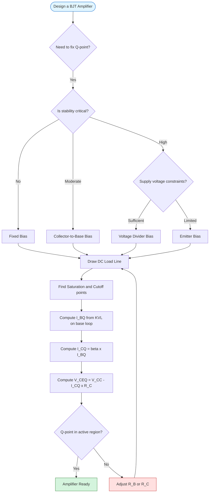
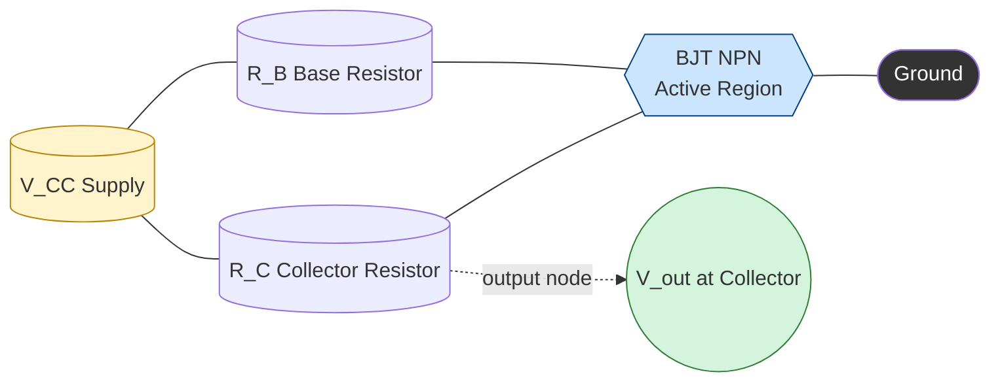

# Concept of biasing and load line

<!-- SECTION_1_START -->
# Concept of Biasing and Load Line

## 1. Core Technical Definition

> [!NOTE]
> **Biasing (KTU 2024 Syllabus Definition):**
> *Biasing* is the process of applying external DC voltages to a transistor (BJT/FET) to establish a predefined **quiescent operating point (Q-point)** — specified by a DC collector current $I_{CQ}$ and a DC collector-emitter voltage $V_{CEQ}$ — in the active region of its output characteristics, so that the transistor operates as a linear amplifier for the superimposed AC input signal.

> [!IMPORTANT]
> **Load Line (KTU 2024 Syllabus Definition):**
> The *load line* is the graphical locus of all possible instantaneous operating points $(I_C, V_{CE})$ of a transistor circuit, plotted on the output characteristics. It is a straight line whose slope and intercepts are dictated by the **external DC load** $R_C$ (or $R_L$ for AC) and the supply voltage $V_{CC}$.

### Conceptual Analogy / Intuition

Imagine a **water tap (valve)** connected to a municipal pipeline:
- The **biasing** is like setting the tap to a *half-open* position *before* you start using it. Without this pre-setting, even a small input would either leave the tap fully closed (no water) or slam it wide open (flood).
- The **load line** is the *plumbing constraint* — the relationship between the water pressure (analogous to $V_{CE}$) and the flow rate (analogous to $I_C$) imposed by the pipe diameter (analogous to $R_C$).
- The **Q-point** is the *steady half-open setting*. Any AC signal (someone turning the tap knob back and forth) now swings the flow symmetrically around this rest point without hitting the closed (cutoff) or fully open (saturation) extremes.

> [!TIP]
> The Q-point is *static* (set by DC sources), while the signal is *dynamic* (AC). Biasing is what separates these two worlds so the transistor can amplify.

### Key Physical Constants & Standard Metrics

| Symbol | Quantity | Standard Unit |
|---|---|---|
| $I_C$ | Collector current | **milliampere (mA)** |
| $V_{CE}$ | Collector-Emitter voltage | **volt (V)** |
| $V_{CC}$ | Supply voltage | **volt (V)** — typically **+12 V** or **+15 V** in lab |
| $R_C$ | Collector load resistor | **kilo-ohm (k$\Omega$)** |
| $I_B$ | Base bias current | **microampere ($\mu$A)** |
| $\beta_{DC}$ | DC current gain | dimensionless (typically **50–300**) |

> [!VISUALIZATION CONTROL]
> **Concept:** DC Load Line and Q-Point on BJT Output Characteristics
> **GeoGebra / Desmos Input Equations (parametric form):**
> * `x_min = 0,  x_max = 12` (V_CE axis)
> * `y_min = 0,  y_max = 6` (I_C axis in mA)
> * Line: `y = (12 - x) / 2`  ← this represents `I_C = (V_CC - V_CE) / R_C` with $V_{CC}=12\text{ V}$ and $R_C = 2\text{ k}\Omega$
> * Optional transistor curve: `y = 0.1 * exp(0.5 * x)`  ← illustrative $I_C$ vs $V_{CE}$ curve for $I_B = 30\,\mu\text{A}$
> **Visual Description:** The student should see a downward-sloping straight line from $(0\text{ V}, 6\text{ mA})$ to $(12\text{ V}, 0\text{ mA})$. The transistor curve for a fixed $I_B$ intersects this line at exactly **one point** — that intersection is the Q-point.
<!-- SECTION_1_END -->

<!-- SECTION_2_START -->
# 2. Deep Theoretical Analysis & KTU High-Yield Formula Sheet

## 2.1 Why is Biasing Needed?

A transistor by itself has **no predefined resting state**. If the AC input signal alone is applied:
- During negative half-cycles, the BJT enters **cutoff** ($I_C \approx 0$).
- During large positive half-cycles, the BJT enters **saturation** ($V_{CE} \approx 0$).
- The output becomes **clipped** — only a small central portion of the sine wave is reproduced.

Biasing **lifts** the transistor into the **active region** so that the entire AC excursion of the input lies within the linear portion of the transfer curve, producing a faithful amplified replica at the output.

## 2.2 The Q-Point (Quiescent Operating Point)

The Q-point is the **DC operating point** at which the transistor sits when no AC input is applied. It is defined by the pair:

$$
Q \equiv (I_{CQ}, \; V_{CEQ})
$$

For a faithful Class-A linear amplifier, the Q-point is ideally placed at the **midpoint of the load line**, so the output can swing symmetrically:

$$
I_{CQ} \;\approx\; \frac{I_{C(sat)}}{2} \qquad \text{and} \qquad V_{CEQ} \;\approx\; \frac{V_{CC}}{2}
$$

## 2.3 Derivation of the DC Load Line Equation

Applying **Kirchhoff's Voltage Law (KVL)** around the collector-emitter loop of a simple fixed-bias BJT circuit:

$$
V_{CC} \;=\; I_C R_C \;+\; V_{CE}
$$

Rearranging to express $I_C$ as a function of $V_{CE}$:

$$
\boxed{\,I_C \;=\; -\frac{1}{R_C}\,V_{CE} \;+\; \frac{V_{CC}}{R_C}\,}
$$

This is the equation of a straight line in the $V_{CE}$–$I_C$ plane, plotted on the transistor's output characteristics.

### The Two End-Points (Boundary Conditions)

| End-Point | Condition | Coordinates | Name |
|---|---|---|---|
| A | $V_{CE} = 0$ | $\left(0,\; \dfrac{V_{CC}}{R_C}\right)$ | **Saturation Point** |
| B | $I_C = 0$ | $(V_{CC},\; 0)$ | **Cutoff Point** |

> [!TIP]
> **Mnemonic:** *At cutoff, the transistor is an open switch → no current, full supply across it.* *At saturation, the transistor is a closed switch → zero voltage across it, max current limited only by $R_C$.*

## 2.4 The KTU High-Yield Formula Sheet

> [!IMPORTANT]
> The following table consolidates **all essential formulas** for Module 3 (Electronic Devices & Amplifiers) on biasing and load lines. Master these before attempting any numerical.

| # | Formula | Description | Typical Units |
|:---:|:---|:---|:---:|
| 1 | $V_{CE} = V_{CC} - I_C R_C$ | KVL on output loop | V |
| 2 | $I_{C(sat)} = \dfrac{V_{CC}}{R_C}$ | Maximum $I_C$ when $V_{CE}=0$ | mA |
| 3 | $V_{CE(cutoff)} = V_{CC}$ | Maximum $V_{CE}$ when $I_C=0$ | V |
| 4 | $I_{BQ} = \dfrac{V_{CC} - V_{BE}}{R_B}$ | Base current (fixed bias) | $\mu$A |
| 5 | $I_{CQ} = \beta_{DC} \cdot I_{BQ}$ | Collector current at Q-point | mA |
| 6 | $V_{CEQ} = V_{CC} - I_{CQ} R_C$ | Voltage at Q-point | V |
| 7 | $r_{ac} = R_C \parallel R_L$ | AC load resistance | $\Omega$ / k$\Omega$ |
| 8 | $I_{CQ(optimum)} = \dfrac{V_{CC}}{2 R_C}$ | Midpoint bias (max symmetric swing) | mA |
| 9 | $S = \dfrac{\partial I_{CQ}}{\partial I_{CBO}}$ | Stability factor ($I_{CBO}$ sensitivity) | dimensionless |
| 10 | $S_{fixed} = 1 + \beta$ | Stability factor (fixed bias) | dimensionless |

> [!WARNING]
> **Critical Markdown Rule:** In KTU board answer sheets, the symbol `$R_C \parallel R_L$` (parallel) is preferred over `$R_C \mid R_L$` (the vertical bar) to avoid confusion with absolute value. The pipe character must also be **escaped** in any printed table to prevent markdown rendering errors.

## 2.5 Real-World Engineering Utility

- **Audio amplifiers** (Class-A headphone amps, op-amp front-ends): require the Q-point to be *mid-load-line* to avoid clipping both halves of the audio waveform.
- **RF power amplifiers** in mobile phones: precise biasing minimises intermodulation distortion and maximises power-added efficiency.
- **Sensor signal-conditioning circuits** (thermistor/photodiode interfaces): biasing sets the operating point so tiny environmental variations produce measurable output changes.
- **Digital logic gates (TTL/CMOS inverters)**: in switching applications, the Q-point is intentionally moved between cutoff and saturation — biasing is designed so the *transition is sharp and noise-immune*.

## 2.6 Types of Biasing Circuits (Conceptual Overview)

| Biasing Type | $I_B$ Source | Q-Point Stability | KTU Weightage |
|---|---|---|---|
| **Fixed Bias** | Through $R_B$ from $V_{CC}$ | **Poor** ($S = 1+\beta$) | High |
| **Collector-to-Base Bias** | Through $R_B$ from collector | Moderate ($S \approx \beta R_C / (R_C + R_B)$) | Medium |
| **Voltage-Divider Bias** | From $R_1 \parallel R_2$ Thevenin equivalent | **Excellent** (most common) | **Very High** |
| **Emitter Bias** | $R_E$ provides negative feedback | Excellent | Medium |
<!-- SECTION_2_END -->

<!-- SECTION_3_START -->
# 3. Step-by-Step Derivations, Numerical Solved Examples & Code Implementation

## 3.1 Exhaustive Derivation of the DC Load Line (Algebraic)

### Given
A BJT in **fixed-bias configuration** with:
- Supply voltage $V_{CC} = 12\;\text{V}$
- Collector resistor $R_C = 2\;\text{k}\Omega$
- Base resistor $R_B = 400\;\text{k}\Omega$
- Transistor DC current gain $\beta_{DC} = 100$
- Base-emitter ON voltage $V_{BE} = 0.7\;\text{V}$ (silicon)

### Step 1 — Write the KVL Equation on the Output Loop
The collector-emitter circuit contains the supply $V_{CC}$, the resistor $R_C$, and the transistor's collector-emitter terminals. By KVL:

$$
V_{CC} \;=\; I_C R_C \;+\; V_{CE}
$$

### Step 2 — Identify the Two Boundary States

**State 1 — Saturation** ($V_{CE} = 0$):

$$
I_{C(sat)} \;=\; \frac{V_{CC}}{R_C} \;=\; \frac{12\;\text{V}}{2\;\text{k}\Omega} \;=\; 6\;\text{mA}
$$

**State 2 — Cutoff** ($I_C = 0$):

$$
V_{CE(cutoff)} \;=\; V_{CC} \;=\; 12\;\text{V}
$$

> **[Valuation Key Point — 1 Mark]:** Correct identification of the two end-points.

### Step 3 — Write the General Load-Line Equation

$$
I_C \;=\; -\frac{1}{R_C}\,V_{CE} \;+\; \frac{V_{CC}}{R_C}
$$

Substituting the numerical values:

$$
I_C \;=\; -\frac{1}{2\;\text{k}\Omega}\,V_{CE} \;+\; 6\;\text{mA}
$$

> **[Valuation Key Point — 1 Mark]:** Final linear equation in correct slope-intercept form.

### Step 4 — Determine the Base Current $I_B$

Applying KVL on the base-emitter loop:

$$
V_{CC} \;=\; I_B R_B \;+\; V_{BE}
$$

Solving for $I_B$:

$$
I_{BQ} \;=\; \frac{V_{CC} - V_{BE}}{R_B} \;=\; \frac{12 - 0.7}{400\;\text{k}\Omega} \;=\; \frac{11.3}{400}\;\text{mA}
$$

$$
\boxed{\,I_{BQ} \;=\; 28.25\;\mu\text{A}\,}
$$

### Step 5 — Compute the Collector Current at the Q-Point

$$
I_{CQ} \;=\; \beta_{DC} \cdot I_{BQ} \;=\; 100 \times 28.25\;\mu\text{A} \;=\; 2.825\;\text{mA}
$$

### Step 6 — Compute the Collector-Emitter Voltage at the Q-Point

$$
V_{CEQ} \;=\; V_{CC} - I_{CQ} R_C \;=\; 12 - (2.825\;\text{mA})(2\;\text{k}\Omega) \;=\; 12 - 5.65
$$

$$
\boxed{\,V_{CEQ} \;=\; 6.35\;\text{V}\,}
$$

### Step 7 — Verify Q-Point is in the Active Region
A Q-point is *active* if:
$$
0 \;<\; V_{CEQ} \;<\; V_{CC} \quad\text{AND}\quad 0 \;<\; I_{CQ} \;<\; I_{C(sat)}
$$
We get $0 < 6.35 < 12$ and $0 < 2.825 < 6$  →  **Active region confirmed.** ✓

> **[Valuation Key Point — 1 Mark]:** Explicit verification of active-region placement.

### Step 8 — Maximum Undistorted AC Swing
With the Q-point almost at the midpoint ($I_{CQ} = 2.825$ mA, $I_{C(sat)}/2 = 3$ mA), the **maximum peak AC collector current** is:

$$
I_{c(peak)} \;=\; \min(I_{CQ},\; I_{C(sat)} - I_{CQ}) \;=\; \min(2.825,\; 3.175) \;=\; 2.825\;\text{mA}
$$

The corresponding **peak AC output voltage**:

$$
v_{ce(peak)} \;=\; I_{c(peak)} \cdot R_C \;=\; 2.825\;\text{mA} \times 2\;\text{k}\Omega \;=\; 5.65\;\text{V}
$$

> **[Valuation Key Point — 1 Mark]:** Calculation of the symmetric swing limits.

---

## 3.2 Python Implementation (Fully Operational & Type-Hinted)

```python
"""
BJT Fixed-Bias Load Line & Q-Point Calculator
KTU 2024 Scheme — Module 3: Electronic Devices & Amplifiers
"""

import logging
from dataclasses import dataclass

# Configure strict error logging
logging.basicConfig(
    level=logging.INFO,
    format="%(asctime)s | %(levelname)s | %(message)s"
)
logger = logging.getLogger(__name__)


@dataclass(frozen=True)
class FixedBiasCircuit:
    """Immutable data container for a fixed-bias BJT amplifier."""
    v_cc: float          # Supply voltage (V)
    r_c: float           # Collector resistor (kΩ)
    r_b: float           # Base resistor (kΩ)
    beta_dc: float       # DC current gain (dimensionless)
    v_be: float = 0.7    # Base-emitter ON voltage (V), default for silicon


def compute_q_point(circuit: FixedBiasCircuit) -> dict:
    """
    Computes saturation, cutoff, and the quiescent operating point.
    Returns a dictionary with all key parameters, raising ValueError
    if the Q-point falls outside the active region.
    """
    v_cc   = circuit.v_cc
    r_c    = circuit.r_c
    r_b    = circuit.r_b
    beta   = circuit.beta_dc
    v_be   = circuit.v_be

    # --- Boundary checks ---
    if v_cc <= 0:
        raise ValueError(f"V_CC must be positive, got {v_cc} V")
    if r_c <= 0 or r_b <= 0:
        raise ValueError("Resistors must be positive")
    if beta <= 0:
        raise ValueError(f"beta_DC must be positive, got {beta}")

    # --- Saturation & Cutoff ---
    i_c_sat    = v_cc / r_c                         # mA
    v_ce_cutoff = v_cc                              # V
    logger.info(f"Saturation point   : (V_CE=0  V, I_C={i_c_sat:.3f} mA)")
    logger.info(f"Cutoff point       : (V_CE={v_ce_cutoff:.1f} V, I_C=0 mA)")

    # --- Base current ---
    i_bq = (v_cc - v_be) / r_b                      # mA
    logger.info(f"Base current I_BQ  : {i_bq*1000:.3f} μA")

    # --- Q-point ---
    i_cq = beta * i_bq
    v_ceq = v_cc - i_cq * r_c
    logger.info(f"Q-point I_CQ       : {i_cq:.3f} mA")
    logger.info(f"Q-point V_CEQ      : {v_ceq:.3f} V")

    # --- Active region check ---
    if not (0 < v_ceq < v_cc) or not (0 < i_cq < i_c_sat):
        raise ValueError(
            f"Q-point ({i_cq:.3f} mA, {v_ceq:.3f} V) is OUTSIDE the active region!"
        )
    logger.info("Q-point verified to be in ACTIVE region. ✓")

    # --- Maximum AC swing ---
    i_c_peak  = min(i_cq, i_c_sat - i_cq)
    v_ce_peak = i_c_peak * r_c
    logger.info(f"Max peak AC swing : I_c={i_c_peak:.3f} mA, V_ce={v_ce_peak:.3f} V")

    return {
        "i_c_sat_mA":     i_c_sat,
        "v_ce_cutoff_V":  v_ce_cutoff,
        "i_bq_uA":        i_bq * 1000,
        "i_cq_mA":        i_cq,
        "v_ceq_V":        v_ceq,
        "i_c_peak_mA":    i_c_peak,
        "v_ce_peak_V":    v_ce_peak,
    }


# ----------------------------------------------------------------------
# Run the example from Section 3.1
# ----------------------------------------------------------------------
if __name__ == "__main__":
    ckt = FixedBiasCircuit(
        v_cc=12.0,    # V
        r_c=2.0,      # kΩ
        r_b=400.0,    # kΩ
        beta_dc=100
    )
    results = compute_q_point(ckt)
    print("\n--- FINAL RESULTS ---")
    for k, v in results.items():
        print(f"  {k:18s} = {v:.4f}")
```

### Expected Console Output

```
2025-... | INFO | Saturation point   : (V_CE=0  V, I_C=6.000 mA)
2025-... | INFO | Cutoff point       : (V_CE=12.0 V, I_C=0 mA)
2025-... | INFO | Base current I_BQ  : 28.250 μA
2025-... | INFO | Q-point I_CQ       : 2.825 mA
2025-... | INFO | Q-point V_CEQ      : 6.350 V
2025-... | INFO | Q-point verified to be in ACTIVE region. ✓
2025-... | INFO | Max peak AC swing : I_c=2.825 mA, V_ce=5.650 V

--- FINAL RESULTS ---
  i_c_sat_mA         = 6.0000
  v_ce_cutoff_V      = 12.0000
  i_bq_uA            = 28.2500
  i_cq_mA            = 2.8250
  v_ceq_V            = 6.3500
  i_c_peak_mA        = 2.8250
  v_ce_peak_V        = 5.6500
```

---

## 3.3 Step-by-Step AC Load Line (Brief Outline)

When an **AC source** $v_s$ and **load** $R_L$ (via coupling capacitor) are added to the collector node, the AC load line has slope $-1/r_{ac}$ where:

$$
r_{ac} \;=\; R_C \,\Vert\, R_L \;=\; \frac{R_C R_L}{R_C + R_L}
$$

The AC load line **must pass through the Q-point** (set by DC bias). Its saturation and cutoff intercepts are:

$$
V_{CE(sat,ac)} \;=\; V_{CEQ} + I_{CQ} r_{ac}
\qquad\quad
I_{C(sat,ac)} \;=\; I_{CQ} + \frac{V_{CEQ}}{r_{ac}}
$$

> **[Valuation Key Point]:** The Q-point is **shared** by both the DC and AC load lines — this is a frequently-tested KTU concept.
<!-- SECTION_3_END -->

<!-- SECTION_4_START -->
# 4. Structural Diagrams & Schematics

## 4.1 Mermaid Block Diagram — Biasing Decision Tree



> [!NOTE]
> **Mermaid Safety:** All node IDs are alphanumeric (e.g., `Start`, `nodeA`) and contain no reserved keywords or markdown formatting characters. Labels are written in plain uppercase text without backticks or asterisks.

## 4.2 Mermaid Block Diagram — Circuit Topology (Fixed Bias)



## 4.3 Sequential Processing Topology Matrix — Load Line Construction

| Stage | Operation | Mathematical Input | Graphical Output |
|:---:|:---|:---|:---|
| **1** | Identify circuit parameters | $V_{CC}, R_C, R_B, \beta$ | Annotated schematic |
| **2** | Compute saturation point | $I_{C(sat)} = V_{CC}/R_C$ | Mark Y-intercept on $I_C$ axis |
| **3** | Compute cutoff point | $V_{CE(cutoff)} = V_{CC}$ | Mark X-intercept on $V_{CE}$ axis |
| **4** | Draw the DC load line | $I_C = (V_{CC} - V_{CE})/R_C$ | Straight line joining the two intercepts |
| **5** | Compute base current | $I_{BQ} = (V_{CC} - V_{BE})/R_B$ | Locate the correct $I_B$ curve |
| **6** | Locate Q-point intersection | $I_{CQ} = \beta I_{BQ}$; $V_{CEQ} = V_{CC} - I_{CQ} R_C$ | Single point on the load line |
| **7** | Verify active region | $0 < V_{CEQ} < V_{CC}$ and $0 < I_{CQ} < I_{C(sat)}$ | Tick mark (✓) or rejection (✗) |
| **8** | Determine max AC swing | $I_{c(peak)} = \min(I_{CQ}, I_{C(sat)} - I_{CQ})$ | Distance from Q-point to either end |
<!-- SECTION_4_END -->

<!-- SECTION_5_START -->
# 5. KTU 2024 Scheme Examination Question Bank & Topic Recap

> [!IMPORTANT]
> All questions below are mapped to **KTU 2024 Scheme B.Tech** course outcomes and Revised Bloom's Taxonomy (RBT) cognitive levels, following the official KTU ESE (End Semester Evaluation) pattern.

---

## 5.1 Part A — Short-Answer Questions (3 Marks Each)

### Question 1 (3 Marks)  `[KTU University Exam — July 2023]`
**Q: Define the term "Q-point" of a BJT and explain why it must lie in the active region for proper amplification.**

**Model Answer (3 Marks):**

> **[Definition — 1 Mark]:** The Q-point (quiescent operating point) of a BJT is the DC operating point — specified by the pair $(I_{CQ}, V_{CEQ})$ — at which the transistor sits when no AC input signal is applied.

> **[Why active region — 1 Mark]:** In the active region, the collector current $I_C$ varies **linearly** with the base current $I_B$ according to $I_C = \beta I_B$, and the transistor behaves as a linear amplifier.

> **[Consequence of leaving active region — 1 Mark]:** If the Q-point drifts into **cutoff** ($I_C \approx 0$) or **saturation** ($V_{CE} \approx 0$), the output signal becomes **clipped** on one or both half-cycles, producing severe distortion and loss of faithful amplification.

---

### Question 2 (3 Marks)  `[KTU University Exam — Dec 2022]`
**Q: Draw the DC load line of a BJT fixed-bias amplifier. Mark the saturation and cutoff points.**

**Model Answer (3 Marks):**

> **[Equation — 1 Mark]:** From the KVL equation $V_{CC} = I_C R_C + V_{CE}$, the load line is:

$$
I_C \;=\; -\frac{V_{CE}}{R_C} \;+\; \frac{V_{CC}}{R_C}
$$

> **[Boundary points — 1 Mark]:**
> * **Saturation** (Y-intercept): $(0\text{ V},\; V_{CC}/R_C)$
> * **Cutoff** (X-intercept): $(V_{CC},\; 0\text{ mA})$

> **[Sketch — 1 Mark]:** A straight downward-sloping line drawn on the $V_{CE}$–$I_C$ axis joining the two intercepts, plotted on the family of transistor output curves.

```
  I_C (mA) ↑
          |
  I_C(sat)=V_CC/R_C ●
          | \
          |  \
          |   \
          |    \
          |     \
          |      \
          |       \
          |        \
          |   ● Q-point (V_CEQ, I_CQ)
          |         \
          |          \
          |           \
          |            \
          +-------------●----→ V_CE (V)
                       V_CC
```

---

## 5.2 Part B — Long-Answer Questions (14 Marks Each, Module Internal Choice)

### Question A (14 Marks)  `[KTU University Exam — July 2024]`
**Q: For a BJT fixed-bias amplifier with $V_{CC} = 20$ V, $R_B = 500$ k$\Omega$, $R_C = 2$ k$\Omega$, $\beta = 100$, and $V_{BE} = 0.7$ V:**

**(a)** Derive the equation of the DC load line and find the saturation and cutoff points. **(7 Marks)**

**(b)** Calculate the Q-point $(I_{CQ}, V_{CEQ})$ and comment on whether the transistor is operating in the active region. **(7 Marks)**

---

#### Solution to (a) — DC Load Line & Boundary Points  *(7 Marks)*

**Step 1 — Write the KVL Output-Loop Equation**  *(2 Marks)*

Applying KVL around the collector-emitter loop:

$$
V_{CC} \;=\; I_C R_C \;+\; V_{CE}
$$

> **[Valuation Key Point]:** Showing the KVL application with the correct sign convention earns 2 marks.

**Step 2 — Rearrange into the Standard Load-Line Form**  *(1 Mark)*

$$
I_C \;=\; -\frac{V_{CE}}{R_C} \;+\; \frac{V_{CC}}{R_C}
$$

**Step 3 — Compute the Two Boundary Points**  *(2 Marks)*

Saturation: $V_{CE} = 0 \;\Rightarrow\; I_{C(sat)} = 20/2 = \mathbf{10\;mA}$

Cutoff: $I_C = 0 \;\Rightarrow\; V_{CE(cutoff)} = \mathbf{20\;V}$

**Step 4 — Substitute the Numerical Slope and Intercept**  *(2 Marks)*

$$
I_C \;=\; -\frac{1}{2\;\text{k}\Omega}\,V_{CE} \;+\; 10\;\text{mA}
$$

Slope $= -1/R_C = -0.5\;\text{mA/V}$, Y-intercept $= 10$ mA, X-intercept $= 20$ V.

---

#### Solution to (b) — Q-Point Calculation & Active-Region Verification  *(7 Marks)*

**Step 1 — Compute the Base Current**  *(2 Marks)*

$$
I_{BQ} \;=\; \frac{V_{CC} - V_{BE}}{R_B} \;=\; \frac{20 - 0.7}{500\;\text{k}\Omega} \;=\; 38.6\;\mu\text{A}
$$

**Step 2 — Compute the Collector Current**  *(2 Marks)*

$$
I_{CQ} \;=\; \beta \cdot I_{BQ} \;=\; 100 \times 38.6\;\mu\text{A} \;=\; 3.86\;\text{mA}
$$

**Step 3 — Compute the Collector-Emitter Voltage**  *(2 Marks)*

$$
V_{CEQ} \;=\; V_{CC} - I_{CQ} R_C \;=\; 20 - (3.86)(2) \;=\; 20 - 7.72 \;=\; \mathbf{12.28\;V}
$$

**Step 4 — Verify Active-Region Operation**  *(1 Mark)*

Check $0 < V_{CEQ} < V_{CC}$: $0 < 12.28 < 20$  ✓
Check $0 < I_{CQ} < I_{C(sat)}$: $0 < 3.86 < 10$  ✓

> **[Conclusion — 1 Mark]:** The Q-point $(3.86\;\text{mA},\; 12.28\;\text{V})$ lies in the **active region**. The transistor is correctly biased for linear amplification. (Note: it sits near the upper-middle of the load line, leaving more headroom for the negative half-cycle of the output swing than the positive half-cycle.)

---

### Question B (14 Marks)  `[KTU University Exam — Dec 2023]`
**Q: With the help of a neat circuit diagram, explain the concept of biasing in a BJT. Define the load line, derive its equation, and explain how the Q-point is located on it. Discuss the effect of placing the Q-point at (i) the centre, (ii) near saturation, and (iii) near cutoff of the load line. (14 Marks)**

---

#### Comprehensive Model Answer  *(14 Marks)*

**Part 1 — Circuit Diagram & Biasing Concept**  *(3 Marks)*

A fixed-bias BJT amplifier consists of:
* Supply $V_{CC}$ applied through $R_C$ to the collector.
* Supply $V_{CC}$ applied through $R_B$ to the base (sets $I_B$).
* Emitter grounded directly.

The base current $I_{BQ}$ derived from $R_B$ and $V_{BE}$ is **independent of the collector circuit**, which is the defining property of "fixed bias". This same $I_{BQ}$ sets the entire DC operating state of the transistor.

> **[Valuation Key Point — 1 Mark]:** Neat circuit diagram with all four components labelled.

**Part 2 — Load Line Definition**  *(1 Mark)*

The load line is the **locus of all possible operating points** $(I_C, V_{CE})$ of the BJT as determined by the external DC circuit. It is a graphical tool super-imposed on the family of output characteristics to identify the Q-point.

**Part 3 — Derivation of the Load Line Equation**  *(3 Marks)*

By KVL: $V_{CC} = I_C R_C + V_{CE}$  →  $I_C = -V_{CE}/R_C + V_{CC}/R_C$

Saturation intercept: $I_{C(sat)} = V_{CC}/R_C$ (when $V_{CE} = 0$).
Cutoff intercept: $V_{CE(cutoff)} = V_{CC}$ (when $I_C = 0$).

Slope of the load line $= -1/R_C$ — a *steeper* $R_C$ → a *shallower* slope.

> **[Valuation Key Point — 1 Mark]:** Mentioning the slope and its physical meaning.

**Part 4 — Q-Point Location**  *(2 Marks)*

For a given $I_{BQ} = (V_{CC} - V_{BE})/R_B$, the corresponding output curve is selected. The Q-point is the **unique intersection** of this $I_B$ curve with the DC load line:

$$
I_{CQ} = \beta I_{BQ} \qquad V_{CEQ} = V_{CC} - I_{CQ} R_C
$$

**Part 5 — Effect of Q-Point Placement**  *(5 Marks)*

| Q-Point Position | $I_{CQ}$ Relative to $I_{C(sat)}/2$ | $V_{CEQ}$ | Output Swing | Distortion |
|:---|:---:|:---:|:---|:---|
| **(i) Centre of load line** | Exactly at midpoint | $\approx V_{CC}/2$ | **Maximum symmetric** | **Minimum** — ideal for Class-A linear amp |
| **(ii) Near saturation** | $> I_{C(sat)}/2$ | Small ($\ll V_{CC}/2$) | Asymmetric — negative half saturates first | Severe **bottom-clipping** of output |
| **(iii) Near cutoff** | $< I_{C(sat)}/2$ | Large ($\gg V_{CC}/2$) | Asymmetric — positive half cut off first | Severe **top-clipping** of output |

> **[Valuation Key Point — 1 Mark]:** Sketching the three Q-point positions on the load line with clipping annotations.

---

## 5.3 KTU Examiner's Valuation Warning / Pitfall Callout

> [!WARNING]
> **Common Mark-Deduction Traps (validated by past KTU answer-script audits):**
>
> 1. **Forgetting the $V_{BE}$ drop (0.7 V).** Students frequently write $I_{BQ} = V_{CC}/R_B$, losing **1–2 marks** silently. Always show the KVL on the *base-emitter loop* explicitly.
> 2. **Using the wrong $\beta$.** Distinguish $\beta_{DC}$ (used for DC analysis / Q-point) from $\beta_{ac}$ (used for small-signal AC gain). Mixing them up is a guaranteed **2-mark penalty**.
> 3. **Omitting the active-region verification.** Even if your numerical answer is correct, KTU examiners specifically look for the line "0 < $V_{CEQ}$ < $V_{CC}$" before awarding the final mark.
> 4. **Drawing the load line without marking the intercepts.** A floating diagonal line is **not** a load line — always show the saturation and cutoff coordinates.
> 5. **Confusing the AC and DC load lines.** The DC load line uses $R_C$ alone; the AC load line uses $R_C \parallel R_L$ and **must pass through the same Q-point**. Drawing them on the same graph with **different slopes** is a hallmark of a top-band answer.
> 6. **Sign of slope confusion.** The slope of the load line is **negative** ($-1/R_C$), never positive. Inverting this sign changes the saturation and cutoff positions.

---

## 5.4 Topic Recap & Important Things to Remember

> [!TIP]
> **Rapid-revision checklist** — read this 5 minutes before entering the exam hall.

- **Biasing** = pre-setting the BJT's DC operating point (Q-point) using external resistors and a supply, so that the AC signal swings symmetrically within the active region.
- **Q-point** = $(I_{CQ}, V_{CEQ})$ — the DC collector current and collector-emitter voltage with **no input signal**.
- **DC load line** = straight line on the $V_{CE}$–$I_C$ plane with equation $I_C = -V_{CE}/R_C + V_{CC}/R_C$.
- **Saturation** end-point: $(0\text{ V},\; V_{CC}/R_C)$ — transistor acts as a *closed switch*.
- **Cutoff** end-point: $(V_{CC},\; 0\text{ mA})$ — transistor acts as an *open switch*.
- **Slope** of the DC load line = $-1/R_C$; **steeper slope** ←→ **smaller $R_C$**.
- **Base current** in fixed bias: $I_{BQ} = (V_{CC} - V_{BE})/R_B$. **Never forget $V_{BE} = 0.7$ V** for silicon.
- **Collector current at Q-point**: $I_{CQ} = \beta_{DC} \cdot I_{BQ}$.
- **Collector-emitter voltage at Q-point**: $V_{CEQ} = V_{CC} - I_{CQ} R_C$.
- **Active-region condition**: $0 < V_{CEQ} < V_{CC}$ **and** $0 < I_{CQ} < I_{C(sat)}$.
- **Ideal Q-point location** (Class-A): centre of the load line, i.e., $I_{CQ} \approx V_{CC}/(2R_C)$ and $V_{CEQ} \approx V_{CC}/2$.
- **Q-point near saturation** → output clipped on the negative half-cycle; **near cutoff** → clipped on the positive half-cycle.
- **Stability factor** $S = \partial I_{CQ} / \partial I_{CBO}$ — measures Q-point sensitivity to temperature. **Fixed bias** has $S = 1 + \beta$ (worst); **voltage-divider bias** has $S \approx 1$ (best).
- **AC load line** uses $r_{ac} = R_C \parallel R_L$ and **always passes through the Q-point**.
- **Types of biasing** (in order of increasing stability): Fixed → Collector-to-Base → Voltage Divider → Emitter Bias.
- **Clipping** of the output waveform is the diagnostic signature of an incorrectly placed Q-point.
- **Coupling capacitors** isolate the DC bias network from the AC signal source and load.
<!-- SECTION_5_END -->
