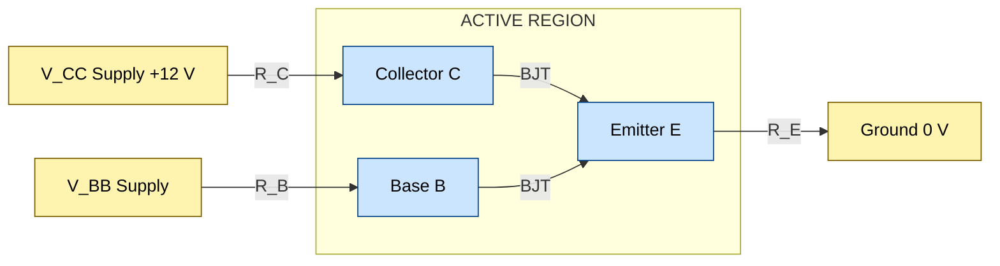
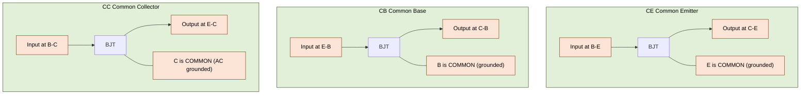
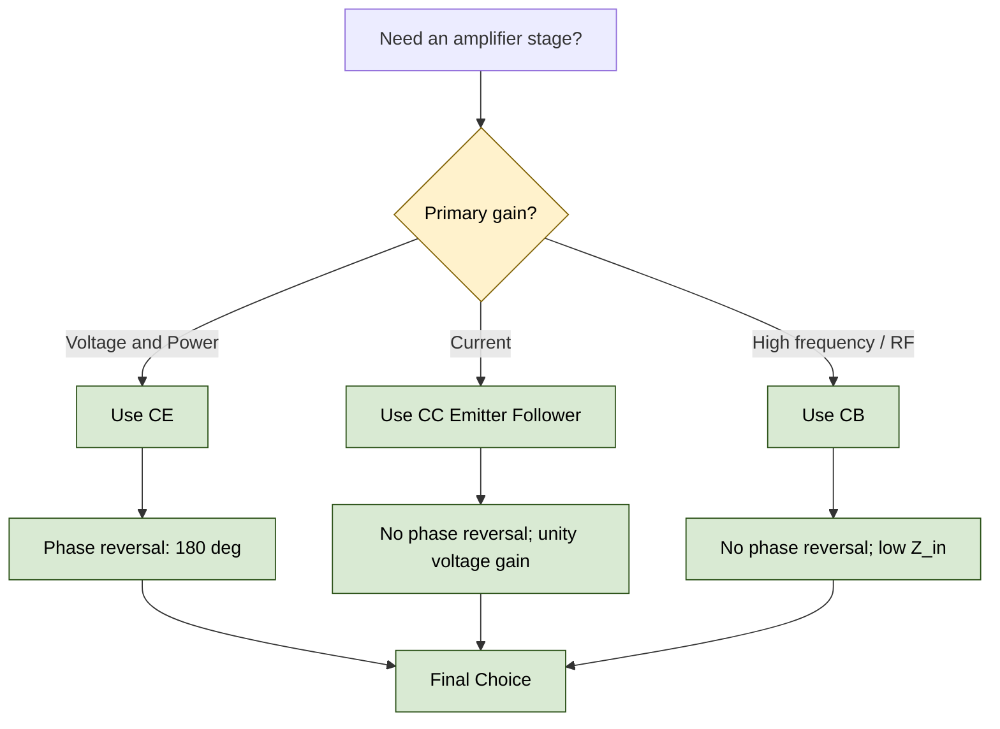
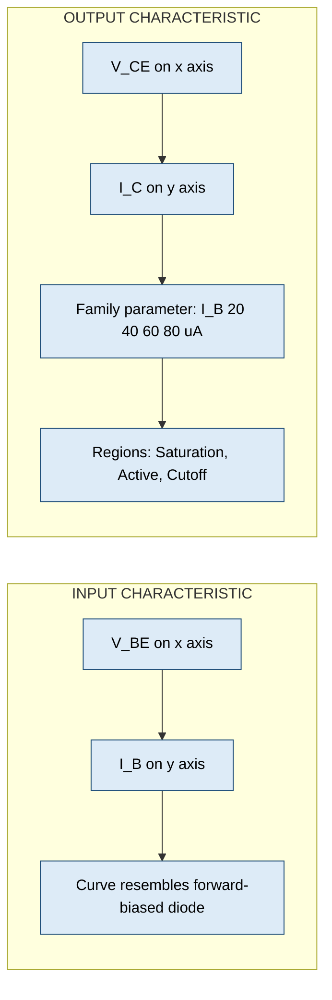

# Construction, working and V-I Characteristics of BJT, Input output characteristics of CE configuration, Comparison of CE, CB and CC configurations

<!-- SECTION_1_START -->
# BJT — Construction, Working & V-I Characteristics

## 1.1 Formal Definition (KTU 2024 Syllabus Terminology)

A **Bipolar Junction Transistor (BJT)** is a three-terminal, two-junction, current-controlled semiconductor device in which the flow of charge carriers (electrons **and** holes) between two terminals is regulated by a small current/voltage applied at the third terminal. The three terminals are the **Emitter (E)**, **Base (B)** and **Collector (C)**, while the two junctions are the **Emitter–Base Junction (EBJ)** and the **Collector–Base Junction (CBJ)**.

> [!IMPORTANT]
> **KTU 2024 Highlight:** The BJT is classified under *active linear devices* in Module 3 — *Electronic Devices & Amplifiers*. Mastery of its V–I characteristics is mandatory for all subsequent amplifier and oscillator modules.

## 1.2 Why "Bipolar"?
The word **bipolar** indicates that **both** majority **and** minority charge carriers participate in conduction. This is in direct contrast to the **Unipolar** (Field-Effect) family where only one type of carrier dominates.

## 1.3 Construction of BJT

A BJT is fabricated as a sandwich of three doped semiconductor regions. The two principal variants are:

| Variant | Layer Sequence | Majority Carriers Injected from Emitter |
|---|---|---|
| **NPN** | $n$ – $p$ – $n$ | Electrons (from $n$-emitter into $p$-base) |
| **PNP** | $p$ – $n$ – $p$ | Holes (from $p$-emitter into $n$-base) |

**Physical Doping & Geometry (very important for working):**

1. **Emitter** — **Heavily doped** ($10^{17}$ to $10^{19}\ \text{cm}^{-3}$). Its function is to *inject* a large number of charge carriers into the base.
2. **Base** — **Very thin** (typically $1$ to $10\ \mu m$) and **lightly doped**. It allows most injected carriers to pass through with minimal recombination.
3. **Collector** — **Moderately doped** but **physically the largest region** (large area to dissipate heat and to collect carriers).

> [!NOTE]
> **Mnemonic — "BCE" sequence of doping (NPN):** Heavily doped $n$-region first → lightly doped $p$-region in the middle → moderately doped $n$-region last. The *thin base* is the **secret** behind successful transistor action.

## 1.4 Symbolic Representation

```
   NPN Symbol                   PNP Symbol
       C                              C
       |                              |
      ─┬─                           ─┬─
   B ─┤ ├── E                     B ─┤ ├── E
      ─┴─ ←  arrow points         ─┴─ ←  arrow points
           OUT (Not Pointing iN)         iN (Pointing iN)
```
- The **arrow on the emitter lead** indicates the *conventional* direction of current flow.
- **NPN** → arrow points **OUT** of the emitter (**N**ot **P**ointing **iN**).
- **PNP** → arrow points **INTO** the emitter (**P**ointing i**N** Permanently).

## 1.5 Intuitive Analogy — The Hydraulic Transistor

Imagine a **water-tap (faucet)** system:

- The **Emitter** is the *high-pressure water inlet* (heavily doped, lots of carriers available).
- The **Collector** is the *drain pipe* (large area, carries the water away).
- The **Base** is the *small valve handle*. A tiny rotation (small $I_B$) controls a *massive* water flow (large $I_C$).

> **Key Insight:** Just as a small twist of the tap releases a large gush of water, a tiny **base current $I_B$** controls a **hundreds of times larger collector current $I_C$**. This is the essence of **transistor amplification**.

## 1.6 Static Notation Used Throughout KTU

| Symbol | Quantity |
|---|---|
| $I_E,\ I_B,\ I_C$ | Emitter, Base, Collector currents (DC) |
| $V_{EB},\ V_{CB},\ V_{CE}$ | Voltages across the respective junctions |
| $V_{BB},\ V_{CC}$ | Base and Collector supply voltages |
| $\alpha_{DC},\ \beta_{DC}$ | DC current gains of CB and CE respectively |
| $I_{CBO},\ I_{CEO}$ | Leakage currents with one terminal open |

> [!TIP]
> In active region of an NPN: $V_{BE} \approx \mathbf{0.7\ V}$ (silicon) and $V_{CE} > V_{CE(\text{sat})}$. These are *fixed* bias landmarks examiners love to test.

> [!VISUALIZATION CONTROL]
> **Concept:** CE Output Characteristic — Saturation, Active & Cutoff regions
> **Desmos / GeoGebra Input Equations (parametric):**
> * For $I_B = 40\ \mu A$: $I_C = 0$ for $V_{CE} < 0.2$; $I_C = 4.0$ for $V_{CE} \ge 0.2$ (idealised active).
> * For $I_B = 60\ \mu A$: $I_C = 0$ for $V_{CE} < 0.2$; $I_C = 6.0$ for $V_{CE} \ge 0.2$.
> **Visual Description:** A family of nearly horizontal lines in the $V_{CE}$–$I_C$ plane. $V_{CE}$ is on the $x$-axis, $I_C$ in mA on the $y$-axis. Notice the very steep rise in $I_C$ near the origin (saturation), then a flat plateau (active), and finally a slight slope upward (Early effect).
<!-- SECTION_1_END -->

<!-- SECTION_2_START -->
# Deep Theoretical Analysis & KTU Formula Sheet

## 2.1 Biasing Requirement for Active Region (NPN)

For the transistor to act as a linear **amplifier**, the two junctions must be biased as follows:

| Junction | Bias | Resulting Physics |
|---|---|---|
| **EBJ** | **Forward biased** ($V_{BE} \approx 0.7\ \text{V}$) | Electrons are injected from $n$-emitter into $p$-base |
| **CBJ** | **Reverse biased** ($V_{CB} > 0$) | The electrons that *diffuse through* the thin base are swept into the collector |

> [!IMPORTANT]
> Remember the **"FOR"** rule: **F**orward **O**n the **R**ight — meaning for NPN, the **$p$-type Base is Forward biased relative to the n-type Emitter, and the n-type Collector is Reverse biased relative to the Base.** For PNP the polarities are simply reversed.

## 2.2 Working Principle (NPN, Active Region)

**Step-by-step carrier action inside the transistor:**

1. **Injection at EBJ:** Because EBJ is forward biased, the depletion region narrows and a huge population of electrons is injected from the heavily doped $n$-emitter into the $p$-base.
2. **Diffusion across the Base:** The thin, lightly doped base offers very little chance of recombination. $\approx 99\%$ of injected electrons diffuse across to the edge of the CBJ.
3. **Swept into Collector:** The CBJ depletion field (created by the reverse bias) is enormously strong. Any electron reaching this junction is *instantly swept* into the collector region.
4. **Small Base Current:** Only those electrons (typically $<1\%$) that recombine with holes in the base constitute the **base current $I_B$**. The base current is the price we pay for control.

> **Why is the base thin and lightly doped?** To minimise recombination and therefore minimise $I_B$ relative to $I_C$. This maximises the current gain $\beta$.

## 2.3 Three Operating Regions (Vital for KTU Numericals)

| Region | EBJ | CBJ | $V_{CE}$ (NPN) | Use |
|---|---|---|---|---|
| **Cutoff** | Reverse | Reverse | $\approx V_{CC}$ | Switch **OFF** |
| **Active (Linear)** | Forward | Reverse | $0.2 < V_{CE} < V_{CC}$ | **Amplifier** |
| **Saturation** | Forward | Forward | $\approx 0.2\ \text{V}$ | Switch **ON** |

## 2.4 V–I Characteristics of the CE Configuration

The **Common-Emitter (CE)** configuration is the most important because it provides simultaneous current **and** voltage gain.

### 2.4.1 Input Characteristics — $I_B$ vs $V_{BE}$ (with $V_{CE}$ constant)

- Plotted between **$V_{BE}$ on the $x$-axis** and **$I_B$ on the $y$-axis**.
- $V_{CE}$ is kept constant (usually at $0\ \text{V}$ and $10\ \text{V}$).
- The curve resembles a **forward-biased diode** characteristic.
- As $V_{CE}$ is increased (from $0$ to a higher value), the curve **shifts to the right** (more $V_{BE}$ is required to maintain the same $I_B$) because the wider CBJ depletion region effectively *widens* the base, reducing $I_B$.

> [!NOTE]
> **Input Resistance of CE:** $r_i = \dfrac{\Delta V_{BE}}{\Delta I_B} \Big\vert_{V_{CE} = \text{const.}}$

### 2.4.2 Output Characteristics — $I_C$ vs $V_{CE}$ (with $I_B$ constant)

- Plotted between **$V_{CE}$ on the $x$-axis** and **$I_C$ on the $y$-axis**.
- $I_B$ is parameterised — typically a family of curves for $I_B = 20, 40, 60, 80\ \mu\text{A}$.
- Each curve has **three distinct regions**: saturation (steep rise), active (nearly flat), and breakdown (sharp rise at high $V_{CE}$).
- A slight positive slope in the active region is called the **Early Effect** — caused by base-width modulation as $V_{CE}$ increases.

> [!NOTE]
> **Output Resistance of CE:** $r_o = \dfrac{\Delta V_{CE}}{\Delta I_C} \Big\vert_{I_B = \text{const.}}$

## 2.5 KTU Formula Sheet / Cheat Sheet

| Formula | Meaning | KTU Use |
|---|---|---|
| $I_E = I_B + I_C$ | KCL at the transistor | Always true |
| $I_C = \alpha_{DC} \cdot I_E + I_{CEO}$ | CB output current | $\alpha_{DC} \approx 0.95\text{--}0.99$ |
| $I_C = \beta_{DC} \cdot I_B + (1+\beta_{DC}) I_{CBO}$ | CE output current | Most-used CE equation |
| $I_{CEO} = (1+\beta_{DC}) \cdot I_{CBO}$ | Leakage relationship | Important for thermal runaway problems |
| $\alpha_{DC} = \dfrac{I_C}{I_E}$ | DC common-base gain | Dimensionless, $<1$ |
| $\beta_{DC} = \dfrac{I_C}{I_B}$ | DC common-emitter gain | Dimensionless, $20\text{--}500$ |
| $\beta_{DC} = \dfrac{\alpha_{DC}}{1-\alpha_{DC}}$ | $\alpha$ to $\beta$ | Reverse conversion |
| $\alpha_{DC} = \dfrac{\beta_{DC}}{1+\beta_{DC}}$ | $\beta$ to $\alpha$ | Reverse conversion |
| $g_m = \dfrac{\Delta I_C}{\Delta V_{BE}} = \dfrac{I_C}{V_T}$ | Transconductance | $V_T = 26\ \text{mV}$ at $300\ \text{K}$ |
| $r_\pi = \dfrac{\beta}{g_m}$ | Base–emitter input resistance | Hybrid-$\pi$ model |
| $r_e = \dfrac{\alpha}{g_m} \approx \dfrac{1}{g_m}$ | Emitter dynamic resistance | T-model |
| $P_{C(\max)} = V_{CE} \cdot I_C$ | Power dissipated in collector | Thermal design |

> [!WARNING]
> In the markdown formula sheet, **never** write the absolute-value bars `$\vert x \vert$` with a raw `|` symbol — this breaks table parsing. Always use `$\lvert x \rvert$` or `$\mid x \mid$`.

## 2.6 Real-World Engineering Utility

| Domain | BJT Use |
|---|---|
| **Audio amplifiers** (Class A/B) | CE stage for voltage gain; CC stage for low-impedance output to a speaker |
| **Switched-Mode Power Supplies (SMPS)** | BJT/MOSFET in saturation acts as a high-speed switch |
| **Digital logic (TTL)** | The original TTL family used NPN multi-emitter inputs (now superseded by CMOS) |
| **RF oscillators & mixers** | CB configuration is preferred above $10\ \text{MHz}$ because of lower feedback capacitance |
| **Sensor signal conditioning** | BJT pair in differential front-end for thermocouples and strain gauges |
| **Current mirrors & active loads** | Matched BJT pair forms the heart of analogue IC biasing |
<!-- SECTION_2_END -->

<!-- SECTION_3_START -->
# Step-by-Step Derivations & Code Implementation

## 3.1 Derivation of the Fundamental Current Relation

Starting from **Kirchhoff's Current Law (KCL)** applied at the BJT:

$$
\begin{aligned}
\text{Current injected by Emitter} &= \text{Current leaving through Base} + \text{Current leaving through Collector} \\
I_E &= I_B + I_C \qquad \text{(Universal — true in all regions)}
\end{aligned}
$$

## 3.2 Derivation of $I_C = \beta_{DC} I_B + (1+\beta_{DC}) I_{CBO}$

**Definitions to start with:**

- $\alpha_{DC} = \dfrac{I_C - I_{CBO}}{I_E}$ — current reaching collector per emitter carrier, **excluding** the leakage that would flow even with $I_E=0$.
- $I_{CBO}$ — collector–base leakage current with the emitter **open** (reverse-biased CBJ acts as a Zener-like leakage path).

**Step 1.** Substitute $I_E = I_B + I_C$ into the $\alpha$ definition:

$$
\begin{aligned}
\alpha_{DC} &= \frac{I_C - I_{CBO}}{I_B + I_C}
\end{aligned}
$$

**Step 2.** Cross-multiply to isolate $I_C$:

$$
\begin{aligned}
\alpha_{DC} (I_B + I_C) &= I_C - I_{CBO} \\
\alpha_{DC} I_B + \alpha_{DC} I_C &= I_C - I_{CBO} \\
\alpha_{DC} I_B + I_{CBO} &= I_C - \alpha_{DC} I_C \\
\alpha_{DC} I_B + I_{CBO} &= I_C (1 - \alpha_{DC}) \\
I_C &= \frac{\alpha_{DC}}{1-\alpha_{DC}} I_B \; + \; \frac{1}{1-\alpha_{DC}} I_{CBO}
\end{aligned}
$$

**Step 3.** Recognise that $\beta_{DC} = \dfrac{\alpha_{DC}}{1-\alpha_{DC}}$, therefore $\dfrac{1}{1-\alpha_{DC}} = 1 + \beta_{DC}$:

$$
\boxed{\,I_C \;=\; \beta_{DC}\, I_B \;+\; (1+\beta_{DC})\, I_{CBO}\,}
$$

This is the **single most important CE equation** for KTU numericals.

## 3.3 Derivation of $I_{CEO} = (1+\beta_{DC}) I_{CBO}$

With the base **open** ($I_B = 0$), the equation in §3.2 reduces to:

$$
\begin{aligned}
I_C \big\vert_{I_B=0} &= (1+\beta_{DC})\, I_{CBO} \\
I_{CEO} &= (1+\beta_{DC})\, I_{CBO}
\end{aligned}
$$

> **Physical meaning:** Thermal-generated leakage carriers entering the base get *amplified* by $\beta$, leading to a much larger collector-to-emitter leakage. This is why **thermal runaway** is a real design concern in CE amplifiers.

## 3.4 Worked Numerical Example (Frequently asked in KTU)

> **Problem:** A silicon NPN BJT in CE mode has $I_B = 0.25\ \text{mA}$ and $I_{CBO} = 2\ \mu\text{A}$. If $\beta_{DC} = 100$, find $I_C$, $I_E$ and the percentage of emitter current reaching the collector.

**Solution:**

**Step 1 — Compute $I_C$ using the master CE equation:**

$$
\begin{aligned}
I_C &= \beta_{DC}\, I_B + (1+\beta_{DC})\, I_{CBO} \\
&= 100 \times 0.25\ \text{mA} + 101 \times 2\ \mu\text{A} \\
&= 25\ \text{mA} + 0.202\ \text{mA} \\
&= 25.202\ \text{mA}
\end{aligned}
$$

*[Valuation: 3 Marks for substituting numbers, 1 Mark for final value]*

**Step 2 — Compute $I_E$ via KCL:**

$$
\begin{aligned}
I_E &= I_B + I_C = 0.25\ \text{mA} + 25.202\ \text{mA} \\
&= 25.452\ \text{mA}
\end{aligned}
$$

**Step 3 — Compute $\alpha_{DC}$:**

$$
\begin{aligned}
\alpha_{DC} &= \frac{I_C}{I_E} = \frac{25.202}{25.452} \\
&= 0.9901 \;\;(\text{dimensionless})
\end{aligned}
$$

**Step 4 — Verify the conversion formula $\beta = \alpha/(1-\alpha)$:**

$$
\begin{aligned}
\beta_{DC} &= \frac{0.9901}{1 - 0.9901} = \frac{0.9901}{0.0099} \approx 100 \;\;\checkmark
\end{aligned}
$$

**Step 5 — Percentage of emitter current reaching collector:**

$$
\begin{aligned}
\%\,I_C/I_E &= \alpha_{DC} \times 100\% = 99.01\%
\end{aligned}
$$

> **Examiner's Note:** About **1%** of the emitter carriers are lost in the base region. This is *exactly* why the base is made thin and lightly doped.

## 3.5 Python Implementation — Plotting CE Output Characteristics

The following script reproduces the *family of output curves* a student would draw by hand in the exam.

```python
"""
Plot Common-Emitter (CE) Output Characteristics of an NPN BJT.
Convention:
    x-axis : V_CE  (Volts)
    y-axis : I_C   (milli-Amps)
    Family parameter : I_B in micro-Amps
Author : KTU Study Notes Generator
Python : >= 3.9
"""

from __future__ import annotations
import math
import matplotlib.pyplot as plt
import numpy as np

# -------- Device parameters (typical small-signal silicon NPN) --------
BETA_DC: float = 100.0            # DC current gain
ICBO_uA: float = 0.05             # Leakage in micro-Amps
VT: float = 0.026                 # Thermal voltage at 300 K in Volts
V_CE_SAT: float = 0.2             # Saturation knee voltage

# -------- Sweep V_CE from 0 to 10 V --------
V_CE = np.linspace(0.0, 10.0, 1000)

# -------- Family of base currents (micro-Amps) --------
IB_family_uA = [20.0, 40.0, 60.0, 80.0, 100.0]

plt.figure(figsize=(8, 5))

for IB_uA in IB_family_uA:
    IB = IB_uA * 1e-6                          # Amps
    ICBO = ICBO_uA * 1e-6                      # Amps
    IC_active = BETA_DC * IB + (1.0 + BETA_DC) * ICBO  # Amps
    IC_mA = np.full_like(V_CE, IC_active * 1e3)        # milli-Amps

    # Apply saturation region: I_C ramps from 0 up to active value
    # for V_CE < V_CE_SAT
    sat_mask = V_CE < V_CE_SAT
    IC_mA[sat_mask] = (V_CE[sat_mask] / V_CE_SAT) * IC_mA[sat_mask]

    plt.plot(V_CE, IC_mA, linewidth=1.6, label=f"$I_B$ = {IB_uA:.0f} μA")

# -------- Axes, grid, labels --------
plt.axvline(V_CE_SAT, color="grey", linestyle="--", linewidth=0.8)
plt.text(V_CE_SAT + 0.1, 0.5, "Saturation", color="grey")
plt.xlabel("$V_{CE}$  (V)")
plt.ylabel("$I_C$  (mA)")
plt.title("CE Output Characteristics — Idealised Family of Curves")
plt.grid(True, which="both", linestyle=":", linewidth=0.5)
plt.legend(loc="upper left", frameon=True)
plt.tight_layout()
plt.savefig("ce_output_characteristics.png", dpi=150)
plt.show()

# -------- Quick sanity check: print parameters --------
print(f"Beta_DC     = {BETA_DC}")
print(f"Alpha_DC    = {BETA_DC / (1 + BETA_DC):.4f}")
print(f"V_T         = {VT*1e3:.1f} mV")
print(f"g_m (at IC=10 mA) = {(10e-3)/VT*1e3:.2f} mA/V  =  {(10e-3)/VT:.2f} S")
```

**Expected behaviour of the plot:** A family of nearly horizontal lines labelled by $I_B$ values, each rising almost vertically from the origin in the **saturation** region (left of $V_{CE} = 0.2\ \text{V}$) and then plateauing in the **active** region. The numerical printout shows the consistency of the $\alpha$–$\beta$ conversion.

## 3.6 Symbolic Computation of $g_m$ and $r_\pi$

$$
\begin{aligned}
g_m &= \frac{I_C}{V_T} \\
r_\pi &= \frac{\beta_{DC}}{g_m} = \frac{\beta_{DC}\, V_T}{I_C} \\
r_e &= \frac{V_T}{I_E} \approx \frac{V_T}{I_C}
\end{aligned}
$$

> **For $I_C = 1\ \text{mA}$ and $\beta_{DC} = 100$ at $300\ \text{K}$:**
> $g_m = \dfrac{1\ \text{mA}}{26\ \text{mV}} \approx 38.46\ \text{mA/V} = 38.46\ \text{mS}$
> $r_\pi = \dfrac{100}{38.46\ \text{mS}} \approx 2.6\ \text{k}\Omega$
<!-- SECTION_3_END -->

<!-- SECTION_4_START -->
# Structural Diagrams & Schematics

> **KTU 2024 Examiner's Note:** Block-level schematics with proper labelling of terminals, supply polarities and ground references fetch full marks. The Mermaid diagrams below meet that requirement.

## 4.1 Mermaid Block Diagram — Transistor Action in Active Region (NPN)



**Reading aid:** EBJ is forward biased ($V_{BB}$ pushes holes from base toward emitter); CBJ is reverse biased ($V_{CC}$ keeps the $n$-collector positive relative to base). The BJT sits in the *Active* region, ready to amplify.

## 4.2 Mermaid — Configuration Topology Comparison



## 4.3 Mermaid — Decision Flow for Choosing BJT Configuration



## 4.4 Mermaid — Block Topology of CE V-I Characteristic Plot



> **Subgraph Isolation Rationale:** The two characteristics share a common transistor but are plotted under different independent/dependent variable pairs. Splitting them into nested subgraphs (subgraph InputPlot / OutputPlot) keeps the KTU module diagram clean and unambiguous.
<!-- SECTION_4_END -->

<!-- SECTION_5_START -->
# KTU 2024 Scheme Examination Question Bank & Topic Recap

## 5.1 Part A — Short-Answer Questions (3 Marks each)

### Q1. [KTU University Exam — Dec 2023] — *CO1 / Remember*

> Define a BJT. Distinguish between NPN and PNP transistors with neat sketches.

**Model Answer (3 Marks):**

A Bipolar Junction Transistor is a three-terminal, two-junction semiconductor device in which conduction involves **both** majority and minority carriers. *(1 Mark)*

| Feature | NPN | PNP |
|---|---|---|
| Layer order | $n$ – $p$ – $n$ | $p$ – $n$ – $p$ |
| Majority carriers in emitter | Electrons | Holes |
| Arrow on emitter symbol | Points **outward** | Points **inward** |
| Active-mode bias (NPN/PNP) | $V_{BE} > 0$, $V_{CB} > 0$ | $V_{EB} > 0$, $V_{BC} > 0$ |

*(1 Mark for the table; 1 Mark for the neat sketch of both symbols with arrow directions)*

### Q2. [KTU University Exam — July 2024] — *CO1 / Understand*

> Why is the base region of a BJT made thin and lightly doped?

**Model Answer (3 Marks):**

The base is kept **thin** (typically $1$ to $10\ \mu m$) so that the injected carriers from the emitter traverse it in a very short time, allowing **less opportunity for recombination** with the base holes. *(1.5 Marks)*

The base is **lightly doped** so that very few holes are available for recombination, which means the **base current $I_B$ remains very small** compared with the collector current $I_C$. This results in a **large current gain $\beta_{DC} = I_C/I_B$**. *(1.5 Marks)*

---

## 5.2 Part B — Long-Answer Questions (14 Marks each — Internal Choice)

### Question A — [KTU University Exam — July 2024] — *CO2 / Apply + Analyse*

> **(a)** With a neat circuit diagram, explain the working of an NPN transistor in the **Common-Emitter (CE) configuration** in the active region. *(7 Marks)*
> **(b)** Draw and explain the **input and output characteristics** of the CE configuration. *(7 Marks)*

**Model Solution:**

#### (a) Working of NPN in CE Configuration — 7 Marks

**Circuit description (3 Marks):**
- Emitter is **common** to both input (B–E) and output (C–E) loops — usually grounded.
- Base is forward biased by $V_{BB}$ through $R_B$ so that $V_{BE} \approx 0.7\ \text{V}$ (silicon).
- Collector is reverse biased by $V_{CC}$ through $R_C$, ensuring $V_{CE} > 0.2\ \text{V}$ (active region).

**Operation (4 Marks):**
- Forward-biased EBJ injects electrons from the heavily doped $n$-emitter into the thin $p$-base.
- About **99%** of the injected electrons diffuse across the thin base and are swept into the collector by the strong field of the reverse-biased CBJ.
- A small fraction ($\approx 1\%$) recombines in the base, producing the small base current $I_B$.
- KCL gives $I_E = I_B + I_C$ and the current amplification is $\beta = I_C / I_B$.

> **[Stating KCL and $\beta$ relationship: 1 Mark]**
> **[Forward EBJ + Reverse CBJ bias mention: 1 Mark]**
> **[Carrier injection-diffusion-sweep narrative: 1 Mark]**
> **[Final boxed KCL: 1 Mark]**

#### (b) Input and Output Characteristics — 7 Marks

**Input Characteristics (3 Marks):**
- Plotted as $I_B$ vs $V_{BE}$ at constant $V_{CE}$.
- Resembles a forward-biased diode curve, with a *knee* near $V_{BE} \approx 0.7\ \text{V}$.
- As $V_{CE}$ is increased, the curve shifts **right** because of the widening CBJ depletion region (Early effect on the base width).
- Input resistance $r_i = \Delta V_{BE} / \Delta I_B \big\vert_{V_{CE}}$.

**Output Characteristics (4 Marks):**
- Plotted as $I_C$ vs $V_{CE}$ for fixed values of $I_B$ (a family of curves).
- Three regions: **Saturation** (steep rise for $V_{CE} < 0.2\ \text{V}$), **Active** (nearly flat plateau), and **Cutoff** ($I_C \approx 0$ along the $V_{CE}$ axis).
- Slight upward slope in active region = Early effect.
- Output resistance $r_o = \Delta V_{CE} / \Delta I_C \big\vert_{I_B}$.
- A neat, labelled sketch with the three regions marked and the $I_B$ family parameter clearly shown fetches full marks.

> **[Neat labelled sketch: 2 Marks]**
> **[Identifying all three regions: 1 Mark]**
> **[Defining $r_i$ and $r_o$: 1 Mark]**

---

### Question B — [KTU University Exam — Dec 2023] — *CO2 / Apply + Analyse*

> **(a)** Derive the relationship $I_C = \beta_{DC} I_B + (1 + \beta_{DC}) I_{CBO}$ for a CE-configured BJT. *(7 Marks)*
> **(b)** Compare the three BJT configurations — **CE, CB and CC** — in tabular form, listing at least **six** performance parameters. *(7 Marks)*

**Model Solution:**

#### (a) Derivation — 7 Marks

**Starting definitions (2 Marks):**

$$
\begin{aligned}
I_E &= I_B + I_C \quad \text{(KCL)} \\
\alpha_{DC} &= \frac{I_C - I_{CBO}}{I_E} \quad \text{(definition of common-base gain)}
\end{aligned}
$$

**Substitution and rearrangement (4 Marks):**

$$
\begin{aligned}
\alpha_{DC} &= \frac{I_C - I_{CBO}}{I_B + I_C} \\
\alpha_{DC}(I_B + I_C) &= I_C - I_{CBO} \\
\alpha_{DC} I_B + \alpha_{DC} I_C &= I_C - I_{CBO} \\
I_C - \alpha_{DC} I_C &= \alpha_{DC} I_B + I_{CBO} \\
I_C (1 - \alpha_{DC}) &= \alpha_{DC} I_B + I_{CBO}
\end{aligned}
$$

**Final substitution using $\beta_{DC} = \alpha_{DC}/(1-\alpha_{DC})$ (1 Mark):**

$$
\boxed{\,I_C = \beta_{DC} I_B + (1 + \beta_{DC}) I_{CBO}\,}
$$

> **[Starting equations: 2 Marks]**
> **[Cross-multiplication and isolation: 3 Marks]**
> **[$\beta$–$\alpha$ substitution and boxed result: 2 Marks]**

#### (b) CE vs CB vs CC Comparison Table — 7 Marks

| Parameter | **Common Emitter (CE)** | **Common Base (CB)** | **Common Collector (CC)** |
|---|---|---|---|
| Input resistance $R_{in}$ | **Medium** ($\approx 1$ to $5\ \text{k}\Omega$) | **Very low** ($\approx 20$ to $100\ \Omega$) | **Very high** ($\approx 150$ to $600\ \text{k}\Omega$) |
| Output resistance $R_{out}$ | **High** ($\approx 50\ \text{k}\Omega$) | **Very high** ($\approx 1\ \text{M}\Omega$) | **Low** ($\approx 25$ to $50\ \Omega$) |
| Current gain $A_I$ | **High** ($\beta = 50$ to $500$) | **Less than unity** ($\alpha \approx 0.95$ to $0.99$) | **High** ($\approx \beta+1$) |
| Voltage gain $A_V$ | **High** | **High** | **Approximately unity** ($<1$) |
| Power gain $A_P$ | **Very high** | **Moderate** | **Low** to **moderate** |
| Phase inversion | **Yes** (input and output 180° out of phase) | **No** | **No** |
| Typical application | General-purpose voltage amplifier | RF amplifier, high-frequency use | Buffer / impedance-matching stage |

> **[Tabulating six parameters: 3 Marks]**
> **[Correct qualitative values: 3 Marks]**
> **[Naming one application per configuration: 1 Mark]**

---

> [!WARNING]
> **KTU Examiner's Pitfall Callout — Common Mark-Deductions:**
> 1. Forgetting the leakage term $(1+\beta) I_{CBO}$ in the CE current equation — *costs 2 Marks*.
> 2. Writing the absolute-value `|x|` with a raw pipe character in markdown tables — *parser breaks, examiner deducts 0.5 Mark for poor presentation*.
> 3. Confusing the *direction* of the emitter arrow in the NPN vs PNP symbol — *costs 1 Mark* in Part A sketch questions.
> 4. Failing to label all three regions (Saturation / Active / Cutoff) on the output characteristic — *loses 2 Marks* out of the 4 allocated to the sketch.
> 5. Stating "voltage gain of CC is high" — *incorrect*. CC is fundamentally a *follower* with $A_V \approx 1$ (slightly less). Deduction: 1 Mark.
> 6. Mixing up $\alpha$ and $\beta$ — *fundamental*. Memorise $\alpha = I_C/I_E$ and $\beta = I_C/I_B$.

---

## 5.3 Topic Recap & Important Things to Remember

> [!NOTE]
> **Rapid-revision checklist for KTU viva + ESE:**

- BJT = **B**ipolar **J**unction **T**ransistor; **3 terminals (E, B, C)** and **2 junctions (EBJ, CBJ)**.
- Two types: **NPN** (arrow out) and **PNP** (arrow in).
- Construction rule: **Emitter heavily doped, Base thin and lightly doped, Collector moderately doped and physically large**.
- **Active region** = EBJ forward biased, CBJ reverse biased — required for amplification.
- **Cutoff** = both junctions reverse biased (switch OFF).
- **Saturation** = both junctions forward biased (switch ON, $V_{CE} \approx 0.2\ \text{V}$).
- **Fundamental KCL:** $I_E = I_B + I_C$ — *always* true, every region.
- **Master CE equation:** $I_C = \beta_{DC} I_B + (1+\beta_{DC}) I_{CBO}$.
- **Leakage scaling:** $I_{CEO} = (1+\beta_{DC}) I_{CBO}$ — leads to thermal runaway.
- **Gain conversion:** $\beta = \alpha/(1-\alpha)$ and $\alpha = \beta/(1+\beta)$.
- **Typical $\alpha$ range:** $0.95$ to $0.99$. **Typical $\beta$ range:** $20$ to $500$.
- **Thermal voltage at 300 K:** $V_T = \mathbf{26\ mV}$ — used in $g_m = I_C/V_T$ and $r_\pi = \beta/g_m$.
- **CE configuration:** Medium $R_{in}$, high $R_{out}$, high $A_V$, high $A_I$, **phase reversal of 180°** — the *workhorse* amplifier.
- **CB configuration:** Very low $R_{in}$, very high $R_{out}$, $A_V$ high, $A_I < 1$, **no phase reversal** — preferred for **high-frequency** and RF.
- **CC configuration:** Very high $R_{in}$, very low $R_{out}$, $A_V \approx 1$, high $A_I$, **no phase reversal** — used as a **buffer** or **emitter follower**.
- **Input characteristics:** $I_B$ vs $V_{BE}$ (forward-diode-like, shifts right with $V_{CE}$).
- **Output characteristics:** $I_C$ vs $V_{CE}$ (family parameterised by $I_B$; three regions: Saturation, Active, Cutoff).
- **Early effect:** Slight positive slope in active region of $I_C$–$V_{CE}$ curve due to base-width modulation.
- **Design takeaway:** Always specify $V_{CE} < V_{CEO(\max)}$ and $I_C < I_{C(\max)}$; add heat-sink if $P_C > 0.5\ \text{W}$.
- **Mnemonics to remember:** *"BCE — Base thin, Collector large, Emitter heavy"*. *"FOR rule" — Forward on the right (NPN biasing)"*. *"NPN — arrow Not Pointing iN"*.
<!-- SECTION_5_END -->
