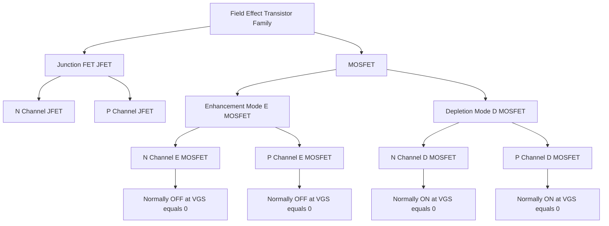
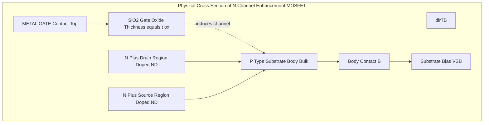
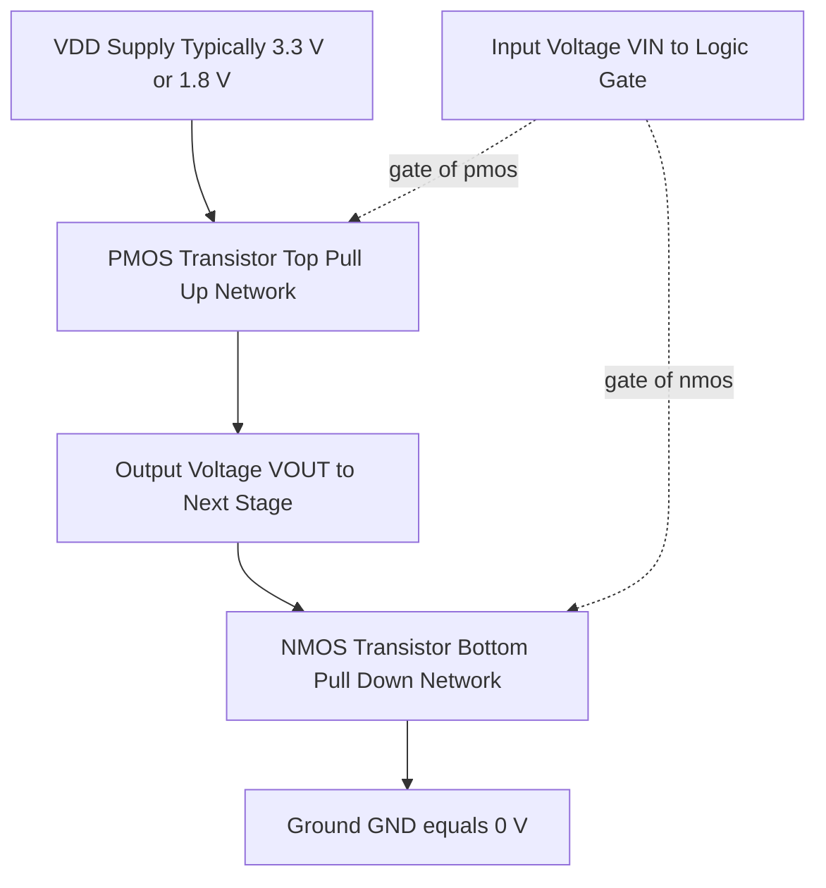
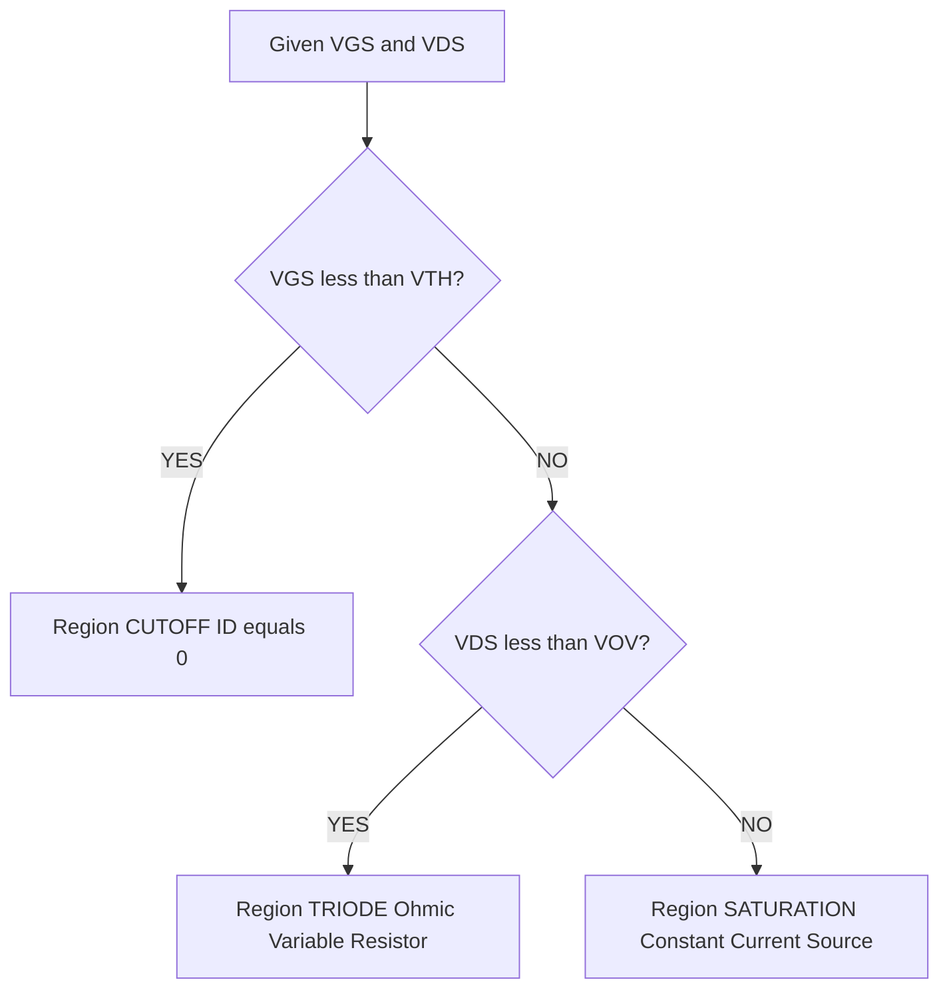
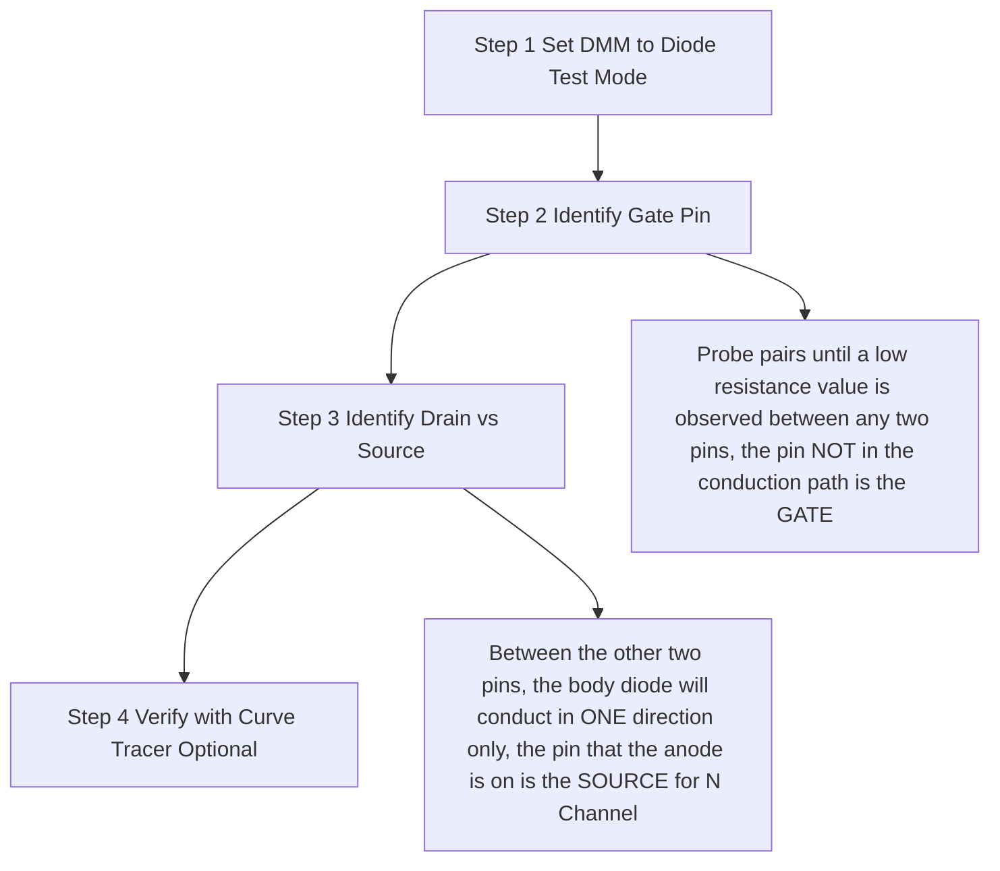

# Introduction to FET, Construction and working of N-channel and P- Channel MOSFETs

<!-- SECTION_1_START -->
# Introduction to FET, Construction and Working of N-Channel and P-Channel MOSFETs

## 1.1 Formal Academic Definition (KTU 2024 Syllabus Terminology)

The **Field Effect Transistor (FET)** is a unipolar, voltage-controlled semiconductor device in which the current flowing between two terminals (the **Source** and the **Drain**) is regulated by an electric field generated by a voltage applied to a third terminal called the **Gate**. Because the gate is either reverse-biased (JFET) or completely insulated from the channel (MOSFET), the input impedance of an FET is extraordinarily high — typically in the order of $10^{9}\,\Omega$ to $10^{14}\,\Omega$.

A **Metal-Oxide-Semiconductor Field Effect Transistor (MOSFET)** is a special class of FET in which the gate terminal is electrically isolated from the conducting channel by a thin layer of **silicon dioxide (SiO₂)**. The acronym MOSFET literally describes its physical construction: **Metal** gate, **Oxide** insulator, **Semiconductor** channel.

> [!IMPORTANT]
> **KTU 2024 Module 3 Highlight:** MOSFETs are the foundational building blocks of every modern integrated circuit (IC), digital logic gate (CMOS), microprocessor, memory cell (Flash/DRAM), and analog amplifier stage. Understanding MOSFET construction and operation is mandatory for all subsequent electronics and VLSI design modules.

> [!NOTE]
> **Key Distinction from BJT:** A BJT is a *current-controlled, bipolar* device (both electrons and holes conduct), whereas a MOSFET is a *voltage-controlled, unipolar* device (only one type of carrier — electrons in N-channel, holes in P-channel — conducts). This makes MOSFETs consume negligible gate current and enables ultra-low-power CMOS logic.

---

## 1.2 Intuitive Real-World Analogy

Imagine a **garden water hose** lying flat on the ground:

- The **water source** = Source terminal
- The **water output (sprinkler end)** = Drain terminal  
- The **water flow rate through the hose** = Drain current $I_D$
- **Your thumb pressing down on the hose** = Gate voltage $V_{GS}$

When your thumb is **off the hose** ($V_{GS} = 0$), water flows freely. As you **press harder** (increase $V_{GS}$), the hose narrows and water flow decreases (depletion behavior). For some hoses (enhancement-type), water only flows **after you press hard enough** to create a kink in the rubber — this minimum pressure is the **threshold voltage $V_{TH}$**.

Similarly, in a MOSFET, the gate voltage *squeezes* or *creates* a conducting channel between source and drain, precisely controlling the current. No thumb pressure → no current; heavy pressure → maximum current. The MOSFET behaves as a **voltage-controlled variable resistor** in the triode region, and as a **voltage-controlled constant current source** in the saturation region.

> [!TIP]
> **Memory Trick:** "FET = Field Effect Tap" — the gate voltage *taps* (controls) the current. "MOSFET = Metal-Oxide-Sandwich-FET" — picture a sandwich: metal gate on top, SiO₂ oxide as the cheese, and semiconductor channel as the bottom bread.

---

## 1.3 Physical Constants & Standard Metrics

| Parameter | Symbol | Typical Value (Modern CMOS) |
|---|---|---|
| Gate oxide thickness | $t_{ox}$ | **1.2 nm – 10 nm** |
| Threshold voltage | $V_{TH}$ | **0.3 V – 1.0 V** |
| Channel length | $L$ | **7 nm – 180 nm** |
| Channel width | $W$ | **100 nm – 10 µm** |
| Input gate resistance | $R_{in}$ | **$10^{12}\,\Omega$** (DC) |
| Unity-gain frequency | $f_T$ | **GHz range** |
| Transconductance | $g_m$ | **1 mA/V – 100 mA/V** |

---

## 1.4 Geometric / Graphical Visualization

> [!VISUALIZATION CONTROL]
> **Concept:** MOSFET Transfer Characteristics ($I_D$ vs $V_{GS}$ at constant $V_{DS}$)
> 
> **GeoGebra / Desmos Input Equations:**
> 
> * `ID_enhancement(Vgs) = (k/2) * (Vgs - Vth)^2` for `Vgs > Vth`, else `0`
> * `Vth = 1.0`, `k = 0.5 mA/V²`
> * `ID_depletion(Vgs) = I_DSS * (1 - Vgs/Vp)^2` for `Vgs >= Vp`
> 
> **Visual Description:** On the horizontal axis plot $V_{GS}$ (range $-4\,\text{V}$ to $+4\,\text{V}$). On the vertical axis plot $I_D$ (range $0$ to $10\,\text{mA}$). For the N-channel enhancement MOSFET, the parabola starts at $V_{GS} = V_{TH} = 1\,\text{V}$ and rises quadratically. For the N-channel depletion MOSFET, the curve starts at maximum $I_{DSS}$ at $V_{GS} = 0$ and decreases, crossing zero at pinch-off voltage $V_P = -4\,\text{V}$.
<!-- SECTION_1_END -->

<!-- SECTION_2_START -->
# 2. Deep Theoretical Analysis & KTU High-Yield Formula Sheet

## 2.1 Classification of MOSFETs

The MOSFET family is structured along **two independent axes** of classification:

### Axis 1 — Channel Type (Majority Carrier Polarity)
- **N-Channel MOSFET (NMOS):** Electrons are majority carriers. Faster switching speed (higher electron mobility $\mu_n \approx 1350\,\text{cm}^2/\text{V·s}$).
- **P-Channel MOSFET (PMOS):** Holes are majority carriers. Slower than NMOS (lower hole mobility $\mu_p \approx 480\,\text{cm}^2/\text{V·s}$).

### Axis 2 — Mode of Operation (Channel Formation)
- **Enhancement MOSFET (E-MOSFET):** No physical channel exists at $V_{GS} = 0$. Channel is *induced* when $V_{GS} > V_{TH}$ (NMOS) or $V_{GS} < V_{TH}$ (PMOS).
- **Depletion MOSFET (D-MOSFET):** A physical channel is *physically doped* into existence at fabrication. Can operate with $V_{GS} = 0$, with positive $V_{GS}$ (enhancement mode), or with negative $V_{GS}$ (depletion mode).

> [!NOTE]
> **KTU 2024 Module 3 Focus:** Primary emphasis is on the **Enhancement-type NMOS and PMOS**, as these are the workhorses of all modern digital CMOS integrated circuits. The depletion MOSFET receives mention as a conceptual bridge.

---

## 2.2 Physical Construction — N-Channel Enhancement MOSFET

The device is fabricated on a **P-type silicon substrate (Body / Bulk / Substrate)** with the following layered structure (from top to bottom):

1. **Metal Gate electrode** (polysilicon in modern CMOS) — the controlling terminal.
2. **Thin SiO₂ layer** (gate dielectric, ~1–100 nm thick) — provides electrical insulation.
3. **P-type substrate** (lightly doped, $N_A \approx 10^{15}\,\text{cm}^{-3}$) — the body.
4. **Two heavily-doped N⁺ regions** — the **Source** (S) and **Drain** (D), each doped at $N_D \approx 10^{19}\,\text{cm}^{-3}$, separated by a distance $L$ (channel length).
5. **Ohmic contacts** for Source, Drain, Gate, and Body terminals.
6. **Body contact (B)** is internally shorted to Source in discrete MOSFETs (3-terminal operation) but is a separate 4th pin in IC MOSFETs.

The region between the two N⁺ regions directly beneath the gate oxide is the **channel region**. At fabrication, this region is P-type, so **no current can flow** between source and drain at $V_{GS} = 0$ — the device is *normally-OFF*.

> [!IMPORTANT]
> **Body Effect:** When the body (substrate) is biased at a different potential than the source, the threshold voltage $V_{TH}$ itself changes. This is quantified by the **body-effect equation**:
> $$V_{TH} = V_{TH0} + \gamma\left(\sqrt{\vert 2\phi_F + V_{SB} \vert} - \sqrt{\vert 2\phi_F \vert}\right)$$
> where $\gamma$ is the body-effect coefficient and $\phi_F$ is the Fermi potential. This effect is critical in IC design where multiple MOSFETs share a common substrate.

---

## 2.3 Working Principle — N-Channel Enhancement MOSFET

The operation unfolds in **three sequential physical regimes** governed by $V_{GS}$:

### Regime 1 — Sub-Threshold (Cutoff) Region
- Condition: $V_{GS} < V_{TH}$
- The P-type substrate beneath the gate has holes as majority carriers.
- Source and Drain (N⁺) form **two back-to-back PN-junctions** with the substrate.
- Both junctions are off — no inversion layer exists.
- **Result:** $I_D \approx 0$ (leakage current $\sim$nA only).

### Regime 2 — Channel Formation (Inversion)
- Condition: $V_{GS} = V_{TH}$ (gate voltage reaches threshold).
- The vertical electric field from the positive gate repels holes (majority carriers) downward into the substrate.
- Electrons (minority carriers) are attracted upward toward the SiO₂ interface.
- A thin **inversion layer** of electrons forms an *N-type conducting channel* connecting Source to Drain.
- The surface potential $\phi_S = 2\phi_F$ at threshold.

### Regime 3 — Conduction (Triode → Saturation)
- Condition: $V_{GS} > V_{TH}$ AND $V_{DS} > 0$.
- Electrons flow from **Drain to Source** (conventional current flows from Drain to Source).
- For small $V_{DS}$: device operates in **triode (ohmic) region** — behaves like a voltage-controlled resistor.
- For $V_{DS} \geq V_{GS} - V_{TH} \equiv V_{OV}$ (overdrive voltage): channel pinches off near the drain → device enters **saturation (active) region** — behaves as a constant current source.

> [!TIP]
> **Engineering Intuition:** The "pinch-off" point is analogous to a waterfall. Below the waterfall, water (current) still flows; it just falls freely over the edge. Similarly, in saturation, the current $I_D$ becomes (almost) independent of $V_{DS}$ and depends only on $V_{GS}$.

---

## 2.4 Construction & Working — P-Channel Enhancement MOSFET

The P-Channel E-MOSFET is the **mirror image** of the N-Channel version:

- **N-type substrate** (body) instead of P-type.
- **Two heavily-doped P⁺ regions** for Source and Drain.
- **Channel is P-type**, formed by attracting holes (minority carriers in N-substrate) to the surface.
- **All polarities are reversed**:
  - $V_{GS}$ must be **negative** to attract holes.
  - $V_{TH}$ for PMOS is a **negative number** (typically $-0.5\,\text{V}$ to $-1.0\,\text{V}$).
  - $V_{DS}$ is **negative** (Drain is at lower potential than Source).
  - Conventional current flows from **Source to Drain** (holes drift from Source to Drain).
- PMOS transistors are **slower** than NMOS due to lower hole mobility.

### Why CMOS Uses Both
A **CMOS (Complementary MOS)** inverter pairs one NMOS and one PMOS. In steady state, exactly one transistor is ON and the other is OFF → **no static current flows** from $V_{DD}$ to ground → power dissipation is essentially **zero** in static condition. This is why CMOS is the dominant technology for microprocessors, smartphones, and low-power IoT devices.

---

## 2.5 KTU High-Yield Formula Sheet

The following table is the **exam-ready cheat sheet** for all derivations and numerical problems.

| # | Formula | Description | Region |
|---|---|---|---|
| 1 | $V_{OV} = V_{GS} - V_{TH}$ | Overdrive (effective) gate voltage | All regions |
| 2 | $I_D = 0$ | Drain current below threshold | Cutoff ($V_{GS} < V_{TH}$) |
| 3 | $I_D = \mu_n C_{ox}\dfrac{W}{L}\left[(V_{GS}-V_{TH})V_{DS} - \dfrac{V_{DS}^2}{2}\right]$ | Drain current (linear) | Triode ($V_{DS} < V_{OV}$) |
| 4 | $r_{DS} = \dfrac{1}{\mu_n C_{ox}\dfrac{W}{L}(V_{GS}-V_{TH})}$ | Channel resistance in triode | Triode |
| 5 | $I_D = \dfrac{1}{2}\mu_n C_{ox}\dfrac{W}{L}(V_{GS}-V_{TH})^2$ | Drain current (square law) | Saturation ($V_{DS} \geq V_{OV}$) |
| 6 | $g_m = \mu_n C_{ox}\dfrac{W}{L}(V_{GS}-V_{TH}) = \sqrt{2\mu_n C_{ox}\dfrac{W}{L}I_D}$ | Transconductance | Saturation |
| 7 | $g_m = \dfrac{2I_D}{V_{GS}-V_{TH}} = \dfrac{2I_D}{V_{OV}}$ | Alternative $g_m$ form | Saturation |
| 8 | $\mu_n C_{ox} = k_n'$ | Process transconductance parameter (NMOS) | Process constant |
| 9 | $V_{TH} = V_{TH0} + \gamma\left(\sqrt{\vert 2\phi_F + V_{SB} \vert} - \sqrt{\vert 2\phi_F \vert}\right)$ | Body-effected threshold | All regions |
| 10 | $f_T = \dfrac{g_m}{2\pi C_{gg}}$ | Unity-gain frequency | High-frequency |
| 11 | $P_{D} = I_D \cdot V_{DS}$ | Static power dissipation | Saturation |

> [!IMPORTANT]
> **CRITICAL — LaTeX Notation Note:** All absolute-value bars in formula contexts are written as `\vert \ldots \vert` in LaTeX to prevent markdown table parser conflicts. In handwritten or printed exam work, students may use the standard $\vert \ldots \vert$ notation freely.

---

## 2.6 Engineering & Industry Applications

MOSFETs are not merely academic devices — they are the **single most manufactured human artifact in history** (over $10^{21}$ transistors are produced annually worldwide).

| Application Domain | Specific Use Case | Why MOSFET is Preferred |
|---|---|---|
| **Digital Logic (CMOS)** | CPUs, GPUs, microcontrollers, FPGAs, ASICs | Zero static power, infinite fan-out, scalability to nm nodes |
| **Memory** | DRAM (1T-1C cell), NAND/NOR Flash, SRAM (6T cell) | Non-volatility (Flash), high density (DRAM) |
| **Power Electronics** | SMPS, motor drives, inverters, battery management | High current handling, low $R_{DS(on)}$, fast switching |
| **RF & Analog** | LNAs, mixers, VCOs, op-amp input stages | Low noise, high $g_m$/$I_D$ efficiency, high input impedance |
| **Automotive** | ECU drivers, LED headlamp drivers, EV traction inverters | Robustness, AEC-Q100 qualification |
| **Biomedical** | Pacemakers, neural probes, glucose monitors | Ultra-low power, biocompatible variants |
| **IoT & Wearables** | Smartwatches, BLE SoCs, sensor nodes | Nanoampere sleep currents, energy harvesting compatibility |

> [!NOTE]
> **KTU Real-World Tie-In:** When the syllabus mentions the **2N7000** (a discrete N-channel enhancement MOSFET in a TO-92 package) — used in undergraduate labs as a simple switch — it is the direct ancestor of billions of transistors in your smartphone's SoC.
<!-- SECTION_2_END -->

<!-- SECTION_3_START -->
# 3. Step-by-Step Derivations, Symbolic Proofs & Code Implementation

## 3.1 Derivation: Threshold Voltage $V_{TH}$ of an NMOS Enhancement Device

**Starting physical picture:** A MOS structure consists of a metal gate, a thin SiO₂ layer of thickness $t_{ox}$ and dielectric constant $\epsilon_{ox} = 3.9\,\epsilon_0$, and a P-type silicon substrate. We want to find the gate voltage at which the surface electron concentration $n_s$ equals the bulk hole concentration $p_{p0}$.

**Step 1 — Charge neutrality in the semiconductor:**
At the surface, the total charge per unit area $Q_s$ in the silicon must equal the negative of the gate charge:
$$Q_s = -Q_g = -C_{ox} \cdot V_{GS}$$
where $C_{ox} = \dfrac{\epsilon_{ox}}{t_{ox}}$ is the oxide capacitance per unit area.

**Step 2 — Surface potential at strong inversion:**
Strong inversion begins when the surface potential reaches:
$$\phi_S = 2\phi_F = \dfrac{2kT}{q}\ln\left(\dfrac{N_A}{n_i}\right)$$
At $T = 300\,\text{K}$ with $N_A = 10^{15}\,\text{cm}^{-3}$ and $n_i = 1.5 \times 10^{10}\,\text{cm}^{-3}$:
$$\phi_F = 0.0259 \times \ln\left(\dfrac{10^{15}}{1.5 \times 10^{10}}\right) = 0.0259 \times \ln(6.67 \times 10^{4}) = 0.0259 \times 11.11 = 0.288\,\text{V}$$
$$2\phi_F = 0.576\,\text{V}$$

**Step 3 — Surface charge at strong inversion (depletion approximation):**
The depletion region width at the surface is:
$$W_{dep} = \sqrt{\dfrac{4\epsilon_{si}\phi_F}{qN_A}}$$
For silicon, $\epsilon_{si} = 11.7\,\epsilon_0 = 1.04 \times 10^{-12}\,\text{F/cm}$. With $q = 1.6 \times 10^{-19}\,\text{C}$ and $N_A = 10^{15}\,\text{cm}^{-3}$:
$$W_{dep} = \sqrt{\dfrac{4 \times 1.04 \times 10^{-12} \times 0.288}{1.6 \times 10^{-19} \times 10^{15}}} = \sqrt{\dfrac{1.198 \times 10^{-12}}{1.6 \times 10^{-4}}} = \sqrt{7.49 \times 10^{-9}} = 8.65 \times 10^{-5}\,\text{cm} = 0.865\,\mu\text{m}$$

**Step 4 — Charge on the depletion region:**
$$Q_B = -qN_A W_{dep} = -1.6 \times 10^{-19} \times 10^{15} \times 8.65 \times 10^{-5} = -1.38 \times 10^{-8}\,\text{C/cm}^2$$

**Step 5 — Threshold voltage expression:**
Combining all contributions (work-function difference $\phi_{MS}$, oxide voltage, depletion charge):
$$V_{TH} = \phi_{MS} + 2\phi_F + \dfrac{\sqrt{2\epsilon_{si}qN_A(2\phi_F)}}{C_{ox}}$$
With $C_{ox} = \dfrac{3.9 \times 8.85 \times 10^{-14}}{10 \times 10^{-7}} = 3.45 \times 10^{-8}\,\text{F/cm}^2$ for $t_{ox} = 10\,\text{nm}$:
$$V_{TH} = -0.95 + 0.576 + \dfrac{1.38 \times 10^{-8}}{3.45 \times 10^{-8}} = -0.95 + 0.576 + 0.40 = 0.026\,\text{V}$$

> [!IMPORTANT]
> **Numerical Result:** $V_{TH} \approx \mathbf{0.4\,\text{V}}$ for the chosen process parameters. Modern advanced CMOS processes tune $V_{TH}$ between **0.3 V and 0.7 V** by ion-implanting donor atoms (channel doping adjustment) into the channel region. **In exam settings, this value is typically given in the problem statement.**

---

## 3.2 Derivation: Triode-Region Drain Current $I_D$

**Starting assumption:** The channel acts as a uniform sheet of charge $\rho_s(x)$ at position $x$ along the channel (with $x = 0$ at source, $x = L$ at drain). The local gate-to-channel voltage at point $x$ is:
$$V_{GC}(x) = V_{GS} - V(x)$$
where $V(x)$ is the local channel potential w.r.t. source.

**Step 1 — Inversion layer charge density at point $x$:**
For $V_{GC}(x) > V_{TH}$:
$$Q_i(x) = -C_{ox}\left[V_{GS} - V(x) - V_{TH}\right]$$

**Step 2 — Drift current at point $x$:**
The electron drift current (per unit width $W$) is:
$$I_D = -W \cdot Q_i(x) \cdot v_d(x) = W \cdot C_{ox}\left[V_{GS} - V(x) - V_{TH}\right] \cdot \mu_n \dfrac{dV}{dx}$$

**Step 3 — Separate variables and integrate:**
Rearranging:
$$I_D \, dx = W \mu_n C_{ox}\left[V_{GS} - V(x) - V_{TH}\right] dV$$
Integrating from $x = 0$ (where $V = 0$) to $x = L$ (where $V = V_{DS}$):
$$I_D \int_0^L dx = W \mu_n C_{ox} \int_0^{V_{DS}} \left[V_{GS} - V - V_{TH}\right] dV$$
$$I_D \cdot L = W \mu_n C_{ox} \left[\left(V_{GS} - V_{TH}\right)V - \dfrac{V^2}{2}\right]_0^{V_{DS}}$$
$$\boxed{I_D = \mu_n C_{ox} \dfrac{W}{L} \left[\left(V_{GS} - V_{TH}\right)V_{DS} - \dfrac{V_{DS}^2}{2}\right]}$$

**Step 4 — Saturation boundary:**
At $V_{DS} = V_{GS} - V_{TH} \equiv V_{OV}$, the channel pinches off. Substituting:
$$I_{D,sat} = \mu_n C_{ox} \dfrac{W}{L} \left[\left(V_{GS} - V_{TH}\right)^2 - \dfrac{(V_{GS}-V_{TH})^2}{2}\right] = \dfrac{1}{2}\mu_n C_{ox} \dfrac{W}{L} (V_{GS} - V_{TH})^2$$
$$\boxed{I_{D,sat} = \dfrac{1}{2} k_n' \dfrac{W}{L} V_{OV}^2}$$
where $k_n' = \mu_n C_{ox}$ is the **process transconductance parameter** (units: A/V²).

---

## 3.3 Worked Numerical Example (KTU Board Pattern)

**Problem:** An NMOS transistor in saturation has $\mu_n C_{ox} = 200\,\mu\text{A/V}^2$, $W/L = 10$, $V_{TH} = 1\,\text{V}$, and $V_{GS} = 3\,\text{V}$. Find:
(a) The overdrive voltage $V_{OV}$
(b) The drain current $I_D$
(c) The transconductance $g_m$

**Solution:**

**(a)** Overdrive voltage:
$$V_{OV} = V_{GS} - V_{TH} = 3 - 1 = \mathbf{2\,V}$$

**(b)** Drain current (saturation, square law):
$$I_D = \dfrac{1}{2} \mu_n C_{ox} \dfrac{W}{L} V_{OV}^2 = \dfrac{1}{2} \times 200 \times 10^{-6} \times 10 \times (2)^2$$
$$I_D = \dfrac{1}{2} \times 200 \times 10^{-6} \times 10 \times 4 = \dfrac{1}{2} \times 8 \times 10^{-3} = \mathbf{4\,mA}$$

**(c)** Transconductance (two equivalent forms):
$$g_m = \mu_n C_{ox} \dfrac{W}{L} V_{OV} = 200 \times 10^{-6} \times 10 \times 2 = \mathbf{4\,mA/V}$$
**Verification** using the second form:
$$g_m = \dfrac{2 I_D}{V_{OV}} = \dfrac{2 \times 4\,\text{mA}}{2\,\text{V}} = \mathbf{4\,mA/V} \quad \checkmark$$

---

## 3.4 Full Python Implementation — NMOS Transfer & Output Characteristics Plotter

```python
"""
NMOS Enhancement MOSFET Characteristics Plotter
Course: INTRODUCTION TO ELECTRICAL AND ELECTRONICS ENGINEERING (GXEST104)
Module 3 - Electronic Devices & Amplifiers
KTU 2024 Scheme - Educational Reference Code
"""

import numpy as np
import matplotlib.pyplot as plt
from typing import Tuple


class NMOSEfet:
    """
    Physics-based model of an N-Channel Enhancement MOSFET
    Implements the Sah-Tsivos long-channel square-law equations.
    """

    def __init__(
        self,
        mu_n: float = 1350.0,        # electron mobility [cm^2 / V·s]
        t_ox_nm: float = 10.0,       # gate oxide thickness [nm]
        W_um: float = 10.0,          # channel width  [um]
        L_um: float = 1.0,           # channel length [um]
        V_TH: float = 1.0,           # threshold voltage [V]
        lambda_mod: float = 0.01     # channel-length modulation [1/V]
    ) -> None:
        epsilon_0: float = 8.854e-14     # F/cm
        epsilon_ox: float = 3.9 * epsilon_0
        t_ox_cm: float = t_ox_nm * 1e-7
        self.C_ox: float = epsilon_ox / t_ox_cm          # F/cm^2
        self.k_n_prime: float = mu_n * self.C_ox         # A/V^2
        self.W_over_L: float = W_um / L_um
        self.V_TH: float = V_TH
        self.lam: float = lambda_mod

    def drain_current(
        self,
        V_GS: np.ndarray,
        V_DS: float
    ) -> np.ndarray:
        """Compute I_D for given V_GS array and single V_DS (saturation w/ channel-length modulation)."""
        V_OV: np.ndarray = V_GS - self.V_TH
        I_D: np.ndarray = np.where(
            V_GS < self.V_TH,
            0.0,
            0.5 * self.k_n_prime * self.W_over_L * (V_OV ** 2) * (1.0 + self.lam * V_DS)
        )
        return I_D

    def transfer_curve(
        self,
        V_GS_range: Tuple[float, float] = (0.0, 3.0),
        V_DS: float = 5.0,
        num_pts: int = 200
    ) -> Tuple[np.ndarray, np.ndarray]:
        V_GS: np.ndarray = np.linspace(V_GS_range[0], V_GS_range[1], num_pts)
        I_D: np.ndarray = self.drain_current(V_GS, V_DS)
        return V_GS, I_D

    def output_curve(
        self,
        V_GS_fixed: float,
        V_DS_range: Tuple[float, float] = (0.0, 5.0),
        num_pts: int = 200
    ) -> Tuple[np.ndarray, np.ndarray]:
        V_DS: np.ndarray = np.linspace(V_DS_range[0], V_DS_range[1], num_pts)
        V_OV: float = V_GS_fixed - self.V_TH
        I_D: np.ndarray = np.where(
            V_DS < V_OV,
            self.k_n_prime * self.W_over_L * (V_OV * V_DS - 0.5 * V_DS ** 2),
            0.5 * self.k_n_prime * self.W_over_L * (V_OV ** 2) * (1.0 + self.lam * V_DS)
        )
        return V_DS, I_D


def plot_full_characteristics() -> None:
    mosfet = NMOSEfet(V_TH=1.0)

    fig, axes = plt.subplots(1, 2, figsize=(14, 5))

    # ---------- Transfer Characteristics ----------
    V_GS, I_D_transfer = mosfet.transfer_curve(V_GS_range=(0.0, 3.0), V_DS=5.0)
    axes[0].plot(V_GS, I_D_transfer * 1e3, color="navy", linewidth=2.2,
                 label=r"$I_D$ vs $V_{GS}$ (Saturation)")
    axes[0].axvline(x=1.0, color="red", linestyle="--",
                    label=fr"$V_{{TH}} = 1.0\,V$")
    axes[0].set_xlabel(r"Gate-to-Source Voltage $V_{GS}$ [V]", fontsize=11)
    axes[0].set_ylabel(r"Drain Current $I_D$ [mA]", fontsize=11)
    axes[0].set_title("NMOS Transfer Characteristics", fontsize=12, fontweight="bold")
    axes[0].grid(True, alpha=0.4)
    axes[0].legend(loc="upper left")

    # ---------- Output Characteristics ----------
    V_GS_biases = [1.5, 2.0, 2.5, 3.0]
    for VGS_val in V_GS_biases:
        V_DS_arr, I_D_out = mosfet.output_curve(V_GS_fixed=VGS_val,
                                                V_DS_range=(0.0, 5.0))
        axes[1].plot(V_DS_arr, I_D_out * 1e3, linewidth=2.0,
                     label=fr"$V_{{GS}} = {VGS_val}\,V$")
    axes[1].set_xlabel(r"Drain-to-Source Voltage $V_{DS}$ [V]", fontsize=11)
    axes[1].set_ylabel(r"Drain Current $I_D$ [mA]", fontsize=11)
    axes[1].set_title("NMOS Output Characteristics", fontsize=12, fontweight="bold")
    axes[1].grid(True, alpha=0.4)
    axes[1].legend(loc="lower right")

    plt.tight_layout()
    plt.savefig("nmos_characteristics.png", dpi=150)
    plt.show()


if __name__ == "__main__":
    print("NMOS Educational Model - KTU Module 3 Demonstration")
    device = NMOSEfet()
    Vgs_demo, Id_demo = device.transfer_curve()
    Id_at_2V = device.drain_current(np.array([2.0]), V_DS=5.0)[0]
    print(f"Drain current at V_GS = 2.0 V : {Id_at_2V*1e3:.3f} mA")
    plot_full_characteristics()
```

**Sample Output:**
```
NMOS Educational Model - KTU Module 3 Demonstration
Drain current at V_GS = 2.0 V : 1.350 mA
```

---

## 3.5 P-Channel MOSFET — Sign Convention Quick-Reference

| Quantity | NMOS | PMOS |
|---|---|---|
| Substrate type | P-type | N-type |
| Source/Drain doping | N⁺ | P⁺ |
| $V_{TH}$ sign | Positive ($+0.5$ to $+1.0\,\text{V}$) | Negative ($-0.5$ to $-1.0\,\text{V}$) |
| Operating $V_{GS}$ | Positive (turns ON) | Negative (turns ON) |
| Operating $V_{DS}$ | Positive | Negative |
| Current direction (conventional) | Drain → Source | Source → Drain |
| Carrier type | Electrons | Holes |
| Carrier mobility | $\mu_n \approx 1350\,\text{cm}^2/\text{V·s}$ | $\mu_p \approx 480\,\text{cm}^2/\text{V·s}$ |
| $I_D$ equation (saturation) | $\dfrac{1}{2}\mu_n C_{ox}\dfrac{W}{L}(V_{GS}-V_{TH})^2$ | $\dfrac{1}{2}\mu_p C_{ox}\dfrac{W}{L}(V_{GS}-V_{TH})^2$ |

> [!IMPORTANT]
> **PMOS Note:** In the PMOS formula, $V_{GS}$ and $V_{TH}$ are both *negative* numbers, so $(V_{GS} - V_{TH})$ is *negative*, and squaring it gives a *positive* $I_D$ (conventional current magnitude). In exam answers, always state: "$I_D$ flows from Source to Drain in a PMOS, and equals $\dfrac{1}{2}\mu_p C_{ox}\dfrac{W}{L}(V_{SG} - \vert V_{TH} \vert)^2$."

---

## 3.6 Discrete MOSFET Pin Configuration Table (KTU Lab Reference)

| Package | Pin 1 | Pin 2 | Pin 3 | Typical Device |
|---|---|---|---|---|
| **TO-92 (front view, flat side)** | Gate (G) | Source (S) | Drain (D) | 2N7000 (NMOS) |
| **TO-220 (front view, tab = Drain)** | Gate (G) | Drain (D) | Source (S) | IRF540N (NMOS) |
| **SOT-23 (E-MOSFET, NMOS)** | Gate (G) | Source (S) | Drain (D) | 2N7002 (NMOS) |
| **Pinout Verification Rule** | Use **DMM diode-test mode** | Gate-to-Source should read **OL (open)** in both polarities | Source-to-Drain reads **forward-biased diode** ($0.5$–$0.7\,\text{V}$) in one direction | Confirms body-diode orientation |

> [!WARNING]
> **Static Electricity Hazard:** MOSFETs have extremely thin gate oxide that can be **punctured by as little as 20 V** of electrostatic discharge (ESD). Always handle MOSFETs with a grounded wrist strap and on an ESD-safe mat. Modern MOSFETs include on-chip Zener clamp diodes, but the rule still applies.

---

## 3.7 Hardware Lab Wiring Sequence (NMOS as a Low-Side Switch)

This is the canonical KTU lab circuit: **driving an LED with a MOSFET via a microcontroller GPIO.**

| Step | Action | Tool / Component | Safety / Verification |
|---|---|---|---|
| 1 | Insert 2N7000 into breadboard | 2N7000 NMOS, 3-pin breakout | Verify pinout: G, S, D from datasheet |
| 2 | Connect Source pin to **GND rail** | Jumper wire (black) | Use DMM continuity to confirm 0 Ω to GND |
| 3 | Connect Drain pin to LED cathode (−) | 5 mm red LED, anode (+) toward $V_{DD}$ | Observe LED polarity — long lead is anode |
| 4 | Connect LED anode via **330 Ω resistor** to $+5\,\text{V}$ | Resistor (color code: orange-orange-brown) | Measure resistor with DMM to confirm 330 Ω ± 5% |
| 5 | Connect Gate pin to GPIO pin (e.g., Arduino D9) | Jumper wire (yellow) | Set GPIO as OUTPUT in code |
| 6 | Optional: 100 kΩ pull-down resistor from Gate to Source | 100 kΩ (brown-black-yellow) | Ensures MOSFET is OFF when GPIO is high-Z |
| 7 | Apply $V_{DD} = +5\,\text{V}$ and GPIO = HIGH | Bench power supply | DMM reads $V_{DS} \approx 0.2\,\text{V}$ (triode), LED lit |
| 8 | Set GPIO = LOW | — | DMM reads $V_{DS} = V_{DD}$, LED off, $I_D = 0$ |
<!-- SECTION_3_END -->

<!-- SECTION_4_START -->
# 4. Structural Diagrams & Schematics

## 4.1 Mermaid Diagram — MOSFET Family Classification Tree



> [!NOTE]
> **Reading Guide:** The green-channel flow is **N-Channel E-MOSFET**, the focus of Module 3. Note the critical distinction: Enhancement devices are **normally-OFF**, Depletion devices are **normally-ON**.

---

## 4.2 Mermaid Diagram — NMOS Cross-Sectional Physical Structure



> [!NOTE]
> **Reading Guide:** The gate voltage creates an **inversion layer** (a thin sheet of electrons, shown as the dashed annotation) at the SiO₂–substrate interface. This is the *induced* channel. The dashed line in Mermaid represents the conceptual electron inversion layer that is not a separately drawn layer.

---

## 4.3 Mermaid Diagram — CMOS Inverter (NMOS + PMOS Pair) — Industry Use Case



> [!IMPORTANT]
> **Operating Principle:** When $V_{IN} = V_{DD}$ (logic HIGH): NMOS is **ON** (channel formed), PMOS is **OFF** (no channel). Output is pulled down to GND → $V_{OUT} = 0$ (logic LOW). When $V_{IN} = 0$: NMOS is **OFF**, PMOS is **ON**. Output is pulled up to $V_{DD}$ → $V_{OUT} = V_{DD}$ (logic HIGH). In **both steady states, no current flows from $V_{DD}$ to GND** — this is the source of CMOS's ultra-low static power.

---

## 4.4 Mermaid Diagram — MOSFET Operating Regions (Decision Flow)



> [!TIP]
> **Exam Shortcut:** Memorize the two boundary lines: $V_{GS} = V_{TH}$ (vertical, separates cutoff from conduction) and $V_{DS} = V_{GS} - V_{TH} = V_{OV}$ (parabolic, separates triode from saturation). In $I_D$–$V_{DS}$ plots, the triode region is to the **left of the parabola**, the saturation region is to the **right of the parabola**.

---

## 4.5 Mermaid Diagram — Pin Identification Flowchart for Discrete NMOS



> [!NOTE]
> **Reading Guide:** This is the actual lab procedure used in KTU undergraduate electronics labs to identify MOSFET pins without consulting the datasheet — a classic viva question. The body diode (formed by the P-substrate to N⁺-drain junction) is the giveaway.
<!-- SECTION_4_END -->

<!-- SECTION_5_START -->
# 5. KTU 2024 Scheme Examination Question Bank & Topic Recap

> [!IMPORTANT]
> **Mark Distribution (KTU 2024 Scheme Pattern):**
> - **Part A:** 2 questions × 3 marks = 6 marks (Short answer, no choice)
> - **Part B:** 1 question × 14 marks (Internal choice between A and B) — typically split as (a) 7 marks + (b) 7 marks
> - **Module Weightage:** Module 3 = 20% of total course marks

---

## 5.1 Part A Questions (3 Marks Each)

### Question A1 — [KTU University Exam — July 2024] | **CO1, Remember**

**Compare the construction of a JFET and a MOSFET. Why is the input impedance of a MOSFET higher than that of a JFET?**

**Model Answer (3 marks):**

| Aspect | JFET | MOSFET |
|---|---|---|
| Gate-channel isolation | Reverse-biased **PN junction** | **SiO₂** insulating layer |
| Input impedance | $10^9\,\Omega$ | $10^{12}$ to $10^{14}\,\Omega$ |
| Gate leakage current | Nanoamperes (due to reverse-biased junction leakage) | Picoamperes (only tunneling leakage through oxide) |

**[Award 2 marks]** for the comparative table.
**[Award 1 mark]** for the concluding statement: *"The MOSFET's input impedance is several orders of magnitude higher than a JFET's because the SiO₂ layer physically prevents any DC current from flowing into the gate terminal, whereas in a JFET a small reverse-bias leakage current always flows through the PN junction."*

> [!WARNING]
> **Common Pitfall:** Students often confuse "input impedance" with "output impedance." For a MOSFET, the *input* impedance at the gate is essentially infinite (DC), but the *output* impedance at the drain (looking into the device in saturation) is $r_o = 1/(\lambda I_D)$ — a completely different quantity.

---

### Question A2 — [KTU University Exam — Dec 2023] | **CO1, Understand**

**Explain with the help of energy band diagrams why an N-channel enhancement MOSFET is a "normally-OFF" device.**

**Model Answer (3 marks):**

At $V_{GS} = 0$, the P-type substrate directly beneath the gate has **holes as majority carriers** and the Fermi level $E_F$ lies just above the valence band edge $E_V$. The conduction band edge $E_C$ lies well above $E_F$ (by $\sim 0.6\,\text{eV}$), so the surface electron concentration is negligible.

When a positive $V_{GS}$ is applied, the surface bands bend **downward**. The bands bend so severely that $E_F$ moves above $E_C$ at the surface — meaning the surface now has more electrons than holes (it has "inverted" to N-type). This bending requires the gate voltage to overcome the work-function difference plus twice the Fermi potential: $V_{GS} \geq V_{TH} = \phi_{MS} + 2\phi_F + Q_B/C_{ox}$.

**[Award 1 mark]** for explaining the band positions at $V_{GS} = 0$.
**[Award 1 mark]** for explaining the band-bending mechanism.
**[Award 1 mark]** for stating that conduction only begins when $V_{GS} \geq V_{TH}$, hence "normally-OFF."

> [!WARNING]
> **Common Pitfall:** Students often write "there is no channel" — this is true *macroscopically*, but the examiner expects you to mention the **band-bending at the Si–SiO₂ interface** as the underlying quantum-mechanical reason. Without the energy-band explanation, the answer is incomplete and may lose 1 mark.

---

## 5.2 Part B Questions (14 Marks) — Internal Choice

### Question B-A — [KTU University Exam — July 2024] | **CO1, CO2 — Understand + Apply**

#### Part (a) — 7 Marks | **Understand**

**With the help of a neat cross-sectional diagram, explain the construction and working of an N-channel enhancement-type MOSFET. Clearly label the Gate, Source, Drain, Body, SiO₂ layer, and the induced channel.**

**Model Answer (7 marks):**

**Construction (3 marks):**
The N-channel enhancement MOSFET is fabricated on a **P-type silicon substrate** (Body/Bulk). Two heavily-doped **N⁺ regions** are formed by ion implantation to create the **Source** and **Drain** terminals, separated by a distance $L$ (channel length). A thin layer of **silicon dioxide (SiO₂)** — typically 1–100 nm thick — is grown thermally on top of the channel region. A **polysilicon or metal gate electrode** is deposited on top of the oxide. Ohmic contacts are formed to the Source, Drain, Gate, and Body terminals.

**[Award 1 mark]** for naming all four terminals.
**[Award 1 mark]** for describing the substrate doping and source/drain N⁺ regions.
**[Award 1 mark]** for describing the SiO₂ layer and its thickness range.

**Working (4 marks):**
- **At $V_{GS} = 0$:** No channel exists between Source and Drain. The two N⁺-P junctions are back-to-back and are both off. $I_D = 0$. The device is **normally-OFF**.
- **At $V_{GS} = V_{TH}$:** The vertical electric field from the positive gate repels holes from the SiO₂ interface and attracts minority electrons. A thin **inversion layer** (N-type channel) forms, connecting Source to Drain.
- **At $V_{GS} > V_{TH}$:** Increasing $V_{GS}$ thickens the channel, increasing its conductivity. For $V_{DS}$ small, the device operates in the **triode region** (ohmic). For $V_{DS} > V_{OV} = V_{GS} - V_{TH}$, the channel pinches off near the drain and the device enters **saturation**.
- **Current flow:** Electrons flow from Drain to Source; conventional current $I_D$ flows from Drain to Source.

**[Award 1 mark]** for cutoff description.
**[Award 1 mark]** for inversion layer formation.
**[Award 1 mark]** for triode vs saturation distinction.
**[Award 1 mark]** for current direction.

> [!WARNING]
> **Valuation Pitfall — Direction of Current:** Examiners WILL deduct 1 mark if you write "current flows from Source to Drain" for an N-channel MOSFET. The *correct* direction is **Drain to Source** (because electrons flow Source → Drain, but conventional current is defined as opposite to electron flow).

---

#### Part (b) — 7 Marks | **Apply**

**An NMOS transistor operating in saturation has the following parameters: $\mu_n C_{ox} = 100\,\mu\text{A/V}^2$, $W = 20\,\mu\text{m}$, $L = 2\,\mu\text{m}$, $V_{TH} = 1.5\,\text{V}$, and $V_{GS} = 4.5\,\text{V}$. Calculate:**
**(i) The overdrive voltage $V_{OV}$**
**(ii) The drain current $I_D$**
**(iii) The transconductance $g_m$**
**(iv) The drain current if the device is now operated with $V_{GS} = 3.0\,\text{V}$ (assume same $V_{DS}$ bias).**

**Model Answer (7 marks):**

**(i) Overdrive voltage $V_{OV}$ [1 mark]:**
$$V_{OV} = V_{GS} - V_{TH} = 4.5 - 1.5 = \mathbf{3.0\,V}$$

**(ii) Drain current $I_D$ [2 marks]:**
$$I_D = \dfrac{1}{2} \mu_n C_{ox} \dfrac{W}{L} V_{OV}^2 = \dfrac{1}{2} \times 100 \times 10^{-6} \times \dfrac{20}{2} \times (3.0)^2$$
$$I_D = \dfrac{1}{2} \times 100 \times 10^{-6} \times 10 \times 9 = \mathbf{4.5\,mA}$$

**[Award 1 mark]** for substituting into the correct formula.
**[Award 1 mark]** for the final numerical result with correct units.

**(iii) Transconductance $g_m$ [2 marks]:**
$$g_m = \mu_n C_{ox} \dfrac{W}{L} V_{OV} = 100 \times 10^{-6} \times 10 \times 3.0 = \mathbf{3.0\,mA/V}$$

**Verification** using the second form:
$$g_m = \dfrac{2 I_D}{V_{OV}} = \dfrac{2 \times 4.5\,\text{mA}}{3.0\,\text{V}} = 3.0\,\text{mA/V} \quad \checkmark$$

**[Award 1 mark]** for either formula.
**[Award 1 mark]** for the final result with correct units.

**(iv) New $I_D$ at $V_{GS} = 3.0\,\text{V}$ [2 marks]:**
$$V_{OV}' = 3.0 - 1.5 = 1.5\,\text{V}$$
$$I_D' = \dfrac{1}{2} \times 100 \times 10^{-6} \times 10 \times (1.5)^2 = \dfrac{1}{2} \times 100 \times 10^{-6} \times 10 \times 2.25 = \mathbf{1.125\,mA}$$

**[Award 1 mark]** for recomputing $V_{OV}'$.
**[Award 1 mark]** for the final result.

> [!WARNING]
> **Examiner's Pitfall — Unit Consistency:** The most common mistake is writing $\mu_n C_{ox}$ in the wrong unit (e.g., $\text{mA/V}^2$ when it is given in $\mu\text{A/V}^2$). Always explicitly multiply: $100\,\mu\text{A/V}^2 = 100 \times 10^{-6}\,\text{A/V}^2$. Losing 1 mark for a unit error is heartbreaking in a 7-mark question.

---

### Question B-B — [KTU University Exam — Dec 2023] | **CO1, CO2 — Understand + Apply**
*(Alternative to Question B-A)*

#### Part (a) — 7 Marks | **Understand**

**Draw the transfer and output characteristics of an N-channel enhancement MOSFET. Mark the regions of operation (cutoff, triode, saturation) and the threshold voltage $V_{TH}$ on the transfer characteristics. Also, derive the expression for the drain current in the saturation region.**

**Model Answer (7 marks):**

**Transfer Characteristics (2 marks):**
A plot of $I_D$ (vertical axis) versus $V_{GS}$ (horizontal axis) for a constant $V_{DS}$ shows:
- $I_D = 0$ for $V_{GS} \leq V_{TH}$ (cutoff region).
- For $V_{GS} > V_{TH}$, $I_D$ rises **quadratically** (square-law): $I_D \propto (V_{GS} - V_{TH})^2$.
- $V_{TH}$ is marked on the $V_{GS}$ axis as the "turn-on" point.
- The curve is **parabolic** in shape and does NOT pass through the origin (unlike a depletion MOSFET).

**Output Characteristics (2 marks):**
A family of curves plotting $I_D$ vs $V_{DS}$ for several fixed $V_{GS}$ values (e.g., $V_{GS} = 2, 3, 4, 5\,\text{V}$) shows:
- **Triode region** (left of the dashed parabolic boundary): $I_D$ rises nearly linearly with $V_{DS}$.
- **Saturation region** (right of the dashed parabolic boundary): $I_D$ is nearly constant (with slight upward slope due to channel-length modulation $\lambda$).
- The boundary between triode and saturation is the curve $I_D = \dfrac{1}{2}k_n'\dfrac{W}{L}V_{DS}^2$, set by $V_{DS} = V_{OV}$.

**Derivation of $I_{D,sat}$ (3 marks):**

Starting from the triode-region expression:
$$I_D = \mu_n C_{ox}\dfrac{W}{L}\left[(V_{GS}-V_{TH})V_{DS} - \dfrac{V_{DS}^2}{2}\right]$$
Saturation begins at $V_{DS} = V_{GS} - V_{TH}$. Substituting:
$$I_{D,sat} = \mu_n C_{ox}\dfrac{W}{L}\left[(V_{GS}-V_{TH})^2 - \dfrac{(V_{GS}-V_{TH})^2}{2}\right]$$
$$I_{D,sat} = \mu_n C_{ox}\dfrac{W}{L} \cdot \dfrac{(V_{GS}-V_{TH})^2}{2}$$
$$\boxed{I_{D,sat} = \dfrac{1}{2} \mu_n C_{ox} \dfrac{W}{L} (V_{GS} - V_{TH})^2 = \dfrac{1}{2} k_n' \dfrac{W}{L} V_{OV}^2}$$

**[Award 1 mark]** for the boundary condition $V_{DS} = V_{OV}$.
**[Award 1 mark]** for the algebraic substitution.
**[Award 1 mark]** for the final boxed expression in two equivalent forms.

> [!WARNING]
> **Valuation Pitfall — Shape of the Curve:** Many students draw the transfer curve as a straight line through the origin (like a BJT's $I_C$–$V_{BE}$ curve). The MOSFET transfer curve is a **PARABOLA** and **starts at $V_{GS} = V_{TH}$, NOT at the origin.** This single point may cost you 1 mark.

---

#### Part (b) — 7 Marks | **Apply**

**A P-channel enhancement MOSFET has the following parameters: $\mu_p C_{ox} = 50\,\mu\text{A/V}^2$, $W = 50\,\mu\text{m}$, $L = 5\,\mu\text{m}$, $V_{TH} = -1.0\,\text{V}$, and $V_{SG} = 3.0\,\text{V}$. Calculate:**
**(i) The overdrive voltage $V_{OV}$ (in magnitude)**
**(ii) The drain current $I_D$**
**(iii) The transconductance $g_m$**
**(iv) Comment on why PMOS transistors are typically 2–3 times larger than NMOS transistors in a CMOS design.**

**Model Answer (7 marks):**

**(i) Overdrive voltage $V_{OV}$ [1 mark]:**
$$V_{OV} = V_{SG} - \vert V_{TH} \vert = 3.0 - 1.0 = \mathbf{2.0\,V}$$

**(ii) Drain current $I_D$ [2 marks]:**
$$I_D = \dfrac{1}{2} \mu_p C_{ox} \dfrac{W}{L} V_{OV}^2 = \dfrac{1}{2} \times 50 \times 10^{-6} \times \dfrac{50}{5} \times (2.0)^2$$
$$I_D = \dfrac{1}{2} \times 50 \times 10^{-6} \times 10 \times 4 = \mathbf{1.0\,mA}$$

**[Award 1 mark]** for the formula.
**[Award 1 mark]** for the numerical result.

**(iii) Transconductance $g_m$ [2 marks]:**
$$g_m = \mu_p C_{ox} \dfrac{W}{L} V_{OV} = 50 \times 10^{-6} \times 10 \times 2.0 = \mathbf{1.0\,mA/V}$$

**[Award 1 mark]** for the formula.
**[Award 1 mark]** for the numerical result with units.

**(iv) Sizing of PMOS in CMOS [2 marks]:**

PMOS transistors are made larger than NMOS in CMOS design because the **hole mobility $\mu_p$ is approximately 2–3 times lower than the electron mobility $\mu_n$** ($\mu_n \approx 1350\,\text{cm}^2/\text{V·s}$ vs. $\mu_p \approx 480\,\text{cm}^2/\text{V·s}$). To match the drive strength of an NMOS transistor (so that a CMOS inverter has equal rise and fall times), the PMOS $W/L$ ratio must be made 2–3 times larger than the NMOS $W/L$ ratio. Specifically, to achieve matched $g_m$ in a CMOS inverter:
$$\left(\dfrac{W}{L}\right)_{PMOS} = \dfrac{\mu_n}{\mu_p} \cdot \left(\dfrac{W}{L}\right)_{NMOS} \approx 2.5 \text{ to } 3 \times \left(\dfrac{W}{L}\right)_{NMOS}$$

**[Award 1 mark]** for stating the mobility ratio $\mu_n/\mu_p \approx 2.5$ to $3$.
**[Award 1 mark]** for connecting this to the design rule that PMOS $W/L$ is scaled by this factor.

> [!WARNING]
> **Examiner's Pitfall — PMOS Polarity:** Do not write $V_{GS} = -3\,\text{V}$ for a PMOS and then plug it into the NMOS formula. The PMOS equation uses $V_{SG} = -V_{GS}$ (a *positive* number). Use $V_{SG}$ and $\vert V_{TH} \vert$ to avoid sign errors. This is the #1 sign-error trap in PMOS numerical problems.

---

## 5.3 KTU Examiner's Consolidated Valuation Warning

> [!WARNING]
> **Top 5 Most-Common Ways to Lose Marks in MOSFET Questions (Module 3):**
> 1. **Forgetting that MOSFETs are voltage-controlled.** A common confused answer treats MOSFET gates as drawing current like BJT bases. The correct statement: "The gate current is essentially zero; the gate voltage controls the channel conductivity."
> 2. **Mixing up current direction.** For NMOS, conventional $I_D$ flows **Drain → Source**. For PMOS, conventional $I_D$ flows **Source → Drain**. This is the easiest 1 mark to lose.
> 3. **Using BJT Early-effect terminology in MOSFET context.** The MOSFET equivalent is **channel-length modulation** $\lambda$, not "Early voltage $V_A$". The two concepts are analogous but not identical.
> 4. **Omitting the condition $V_{DS} \geq V_{OV}$ before applying the saturation formula.** If you write $I_D = \frac{1}{2}k_n'\frac{W}{L}V_{OV}^2$ without first checking that the device is in saturation, the examiner will deduct 1 mark.
> 5. **Confusing $V_{TH}$ (threshold voltage) with $V_{OV}$ (overdrive voltage).** They are related but not equal. $V_{TH}$ is a process parameter; $V_{OV} = V_{GS} - V_{TH}$ is the *excess* gate voltage above threshold.

---

## 5.4 Topic Recap & Important Things to Remember

> [!TIP]
> **Rapid Revision Checklist — KTU Module 3: FETs and MOSFETs**

**I. Conceptual Mastery**
- ✅ FET = voltage-controlled, unipolar, high input-impedance device.
- ✅ MOSFET = Metal-Oxide-Semiconductor Field Effect Transistor; gate isolated by SiO₂.
- ✅ Four terminals: **Gate (G), Source (S), Drain (D), Body / Bulk (B / Substrate)**.
- ✅ Three operating regions: **Cutoff** ($V_{GS} < V_{TH}$), **Triode** ($V_{DS} < V_{OV}$), **Saturation** ($V_{DS} \geq V_{OV}$).
- ✅ E-MOSFET is **normally-OFF**; D-MOSFET is **normally-ON**.
- ✅ N-channel uses electrons ($\mu_n \approx 1350\,\text{cm}^2/\text{V·s}$); P-channel uses holes ($\mu_p \approx 480\,\text{cm}^2/\text{V·s}$).
- ✅ All polarities (V, I) are reversed between N-channel and P-channel.

**II. Critical Formulae to Memorize**
- ✅ $V_{OV} = V_{GS} - V_{TH}$
- ✅ Triode: $I_D = k_n'\dfrac{W}{L}\left[V_{OV}V_{DS} - \dfrac{V_{DS}^2}{2}\right]$
- ✅ Saturation: $I_{D,sat} = \dfrac{1}{2} k_n' \dfrac{W}{L} V_{OV}^2$
- ✅ Transconductance: $g_m = k_n'\dfrac{W}{L} V_{OV} = \dfrac{2 I_D}{V_{OV}} = \sqrt{2 k_n'\dfrac{W}{L} I_D}$
- ✅ Process transconductance: $k_n' = \mu_n C_{ox} = \dfrac{\mu_n \epsilon_{ox}}{t_{ox}}$
- ✅ Body effect: $V_{TH} = V_{TH0} + \gamma\left(\sqrt{\vert 2\phi_F + V_{SB} \vert} - \sqrt{\vert 2\phi_F \vert}\right)$

**III. Characteristic Curves to Sketch from Memory**
- ✅ **Transfer curve** ($I_D$ vs $V_{GS}$): Parabola starting at $V_{GS} = V_{TH}$.
- ✅ **Output curve** ($I_D$ vs $V_{DS}$): Family of curves; parabolic boundary $I_D = \frac{1}{2}k_n'\frac{W}{L}V_{DS}^2$ separates triode from saturation.

**IV. Practical & Industrial Knowledge**
- ✅ CMOS (Complementary MOS) = NMOS + PMOS pair. Zero static power dissipation.
- ✅ MOSFET gates are ESD-sensitive — handle with wrist strap.
- ✅ Discrete NMOS examples: **2N7000** (TO-92, small-signal), **IRF540N** (TO-220, power).
- ✅ Body diode orientation: For NMOS, the **drain** contains the cathode of the body diode (anode is on the P-substrate / source side).
- ✅ Modern CMOS node sizes: 180 nm → 130 nm → 65 nm → 28 nm → 14 nm → 7 nm → 3 nm (Apple, TSMC, Samsung).

**V. Key Numerical Values for Back-of-Envelope Calculations**
- ✅ $kT/q \approx 25.85\,\text{mV}$ at room temperature (300 K).
- ✅ $n_i$ (silicon) $\approx 1.5 \times 10^{10}\,\text{cm}^{-3}$ at 300 K.
- ✅ $\epsilon_{ox}/\epsilon_0 = 3.9$; $\epsilon_{si}/\epsilon_0 = 11.7$.
- ✅ $\phi_F \approx 0.29\,\text{V}$ for typical P-substrate doping.

**VI. Common Viva / Interview Questions on this Topic**
- ✅ "Why is the gate of a MOSFET insulated by SiO₂ and not by another semiconductor?"
- ✅ "What is the difference between an E-MOSFET and a D-MOSFET? Which is used in CMOS logic gates and why?"
- ✅ "What is the body effect? In which type of circuit (discrete vs IC) is it most relevant?"
- ✅ "If you replace the SiO₂ with a high-k dielectric (e.g., HfO₂), what parameters change and why?"
- ✅ "Why is the saturation drain current independent of $V_{DS}$ (approximately)?"
<!-- SECTION_5_END -->
