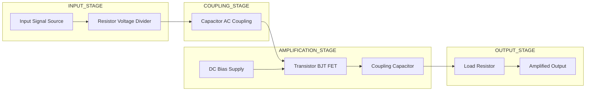
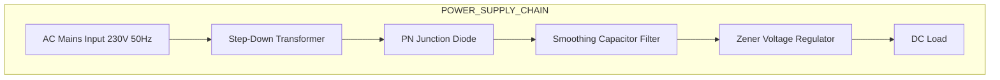
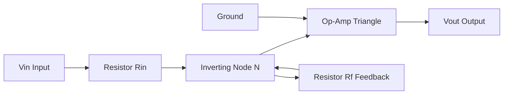

# Passive and active components in electronics

<!-- SECTION_1_START -->
# Passive and Active Components in Electronics

## 1.1 Core Technical Definition (KTU 2024 Syllabus Terminology)

> [!IMPORTANT]
> **Passive Components:** Electronic components that **cannot generate energy**, cannot provide power gain, and cannot control current flow using an external electrical signal. They only **dissipate**, **store**, or **release** energy. Examples: **Resistors**, **Capacitors**, **Inductors**, and **Transformers**.

> [!IMPORTANT]
> **Active Components:** Electronic components that **require an external power source** to operate, can **generate** or **amplify** energy, and can provide **power gain**. They can control current flow using an external electrical signal. Examples: **Diodes**, **Transistors (BJT, FET)**, **Operational Amplifiers**, **Integrated Circuits (ICs)**, **Thyristors (SCR, TRIAC)**.

## 1.2 Conceptual Analogy / Intuition

Think of a **water supply system** in a city:
- **Passive components** are like the **pipes, taps, and storage tanks**. They only transport, store, or restrict the flow of water. They cannot create water pressure on their own.
- **Active components** are like the **water pumps, motors, and valves**. They need electricity (external power) to operate, and they actively boost, switch, or regulate the flow.

> [!NOTE]
> **Mnemonic Trick for Memory:** "**P**assive = **P**owerless (they can't add power)." "**A**ctive = **A**mplifies (they can boost signals using external DC)."

## 1.3 Standard Physical Constants & Metrics

The fundamental physical constants relevant to this topic are:

- **Elementary charge:** $e = 1.602 \times 10^{-19} \text{ C}$
- **Electron mobility (Silicon):** $\mu_n \approx 1350 \text{ cm}^2/\text{V}\cdot\text{s}$
- **Hole mobility (Silicon):** $\mu_p \approx 480 \text{ cm}^2/\text{V}\cdot\text{s}$
- **Intrinsic carrier concentration of Si at 300 K:** $n_i \approx 1.5 \times 10^{10} \text{ cm}^{-3}$
- **Boltzmann constant:** $k = 1.381 \times 10^{-23} \text{ J/K}$
- **Thermal voltage at 300 K:** $V_T = \frac{kT}{q} \approx 25.85 \text{ mV}$ (often approximated as **26 mV** in KTU exam answers).

> [!VISUALIZATION CONTROL]
> **Concept:** V-I characteristics of Passive (Resistor) vs Active (Diode) components
> **Desmos / GeoGebra Input Equations:**
> * `V(x) = x`  (Linear V-I curve of a resistor, slope = 1/R)
> * `I_D(x) = 1e-12 * (exp(x / 0.02585) - 1)`  (Shockley diode equation, exponential V-I curve)
> **Visual Description:** The student should observe that the resistor produces a **straight line** passing through the origin (linear, symmetric in both quadrants), while the diode produces a **steep exponential curve** in the forward region and a near-zero flat line in the reverse region (non-linear, asymmetric).

<!-- SECTION_1_END -->

<!-- SECTION_2_START -->
# 2. Deep Theoretical Analysis & KTU High-Yield Formula Sheet

## 2.1 Resistors (Passive)

A resistor opposes the flow of current. Its primary property is **Resistance (R)** measured in **Ohms ($\Omega$)**.

**Ohm's Law:**
$$V = I \cdot R$$

**Types of Resistors:**
1. **Fixed Resistors:** Carbon composition, Metal film, Wire wound.
2. **Variable Resistors:** Potentiometer, Rheostat, Trimmer.
3. **Special Resistors:** Thermistor (NTC/PTC), LDR (Light Dependent Resistor), Varistor (VDR).

**Resistor Color Code (4-Band):** The first two bands represent the first two significant digits, the third band is the **multiplier** (power of 10), and the fourth band is the **tolerance**.

| Color | Digit | Multiplier (x10ⁿ) | Tolerance |
| :--- | :---: | :---: | :---: |
| Black | 0 | $10^0$ | - |
| Brown | 1 | $10^1$ | $\pm 1\%$ |
| Red | 2 | $10^2$ | $\pm 2\%$ |
| Orange | 3 | $10^3$ | - |
| Yellow | 4 | $10^4$ | - |
| Green | 5 | $10^5$ | $\pm 0.5\%$ |
| Blue | 6 | $10^6$ | $\pm 0.25\%$ |
| Violet | 7 | $10^7$ | $\pm 0.1\%$ |
| Grey | 8 | $10^8$ | - |
| White | 9 | $10^9$ | - |
| Gold | - | $10^{-1}$ | $\pm 5\%$ |
| Silver | - | $10^{-2}$ | $\pm 10\%$ |

**Power Rating:** $P = I^2 R = \frac{V^2}{R} = V \cdot I$  (in **Watts**)

## 2.2 Capacitors (Passive)

A capacitor stores energy in the form of an **electric field** between two conducting plates separated by a dielectric.

**Capacitance (C)** is measured in **Farads (F)**.
$$C = \frac{Q}{V} = \frac{\varepsilon_r \varepsilon_0 A}{d}$$

Where:
- $\varepsilon_0$ = **Permittivity of free space** = $8.854 \times 10^{-12} \text{ F/m}$
- $\varepsilon_r$ = **Relative permittivity** of the dielectric
- $A$ = Area of plate overlap
- $d$ = Distance between plates

**Energy Stored:**
$$E = \frac{1}{2} C V^2 = \frac{Q^2}{2C} = \frac{1}{2} Q V$$

**RC Charging Equation (Transient Response):**
$$V_C(t) = V_S \left( 1 - e^{-t/RC} \right)$$

**RC Discharging Equation:**
$$V_C(t) = V_0 \cdot e^{-t/RC}$$

**Time Constant:** $\tau = R \cdot C$  (time taken to reach ~63.2% of final value)

**Types of Capacitors:** Ceramic, Electrolytic, Tantalum, Film (Mica, Polyester), Variable (Trimmer, Gang).

## 2.3 Inductors (Passive)

An inductor stores energy in the form of a **magnetic field** when current flows through a coil.

**Inductance (L)** is measured in **Henries (H)**.
$$L = \frac{\mu_r \mu_0 N^2 A}{l}$$

**Energy Stored:**
$$E = \frac{1}{2} L I^2$$

**Voltage-Current Relationship (Faraday's Law):**
$$V_L = L \frac{dI}{dt}$$

**Types of Inductors:** Air-core, Iron-core, Ferrite-core, Toroidal, Variable.

## 2.4 Diodes (Active)

A diode is a two-terminal semiconductor device that allows current to flow in only **one direction** (forward bias) and blocks it in the **opposite direction** (reverse bias).

**Ideal Diode Equation (Shockley Equation):**
$$I_D = I_S \left( e^{V_D / (nV_T)} - 1 \right)$$

Where:
- $I_S$ = Reverse saturation current ($\approx 10^{-12}$ A for Si)
- $n$ = Ideality factor (1 to 2)
- $V_T$ = Thermal voltage $\approx 26 \text{ mV}$ at 300 K

**Cut-in / Knee Voltage ($V_\gamma$):** $\approx 0.7 \text{ V}$ for Silicon, $\approx 0.3 \text{ V}$ for Germanium.

**Types of Diodes:**
1. **PN Junction Diode** (Rectifier)
2. **Zener Diode** (Voltage regulator, works in reverse breakdown)
3. **Light Emitting Diode (LED)**
4. **Photodiode** (Light to current converter)
5. **Schottky Diode** (Low forward drop, fast switching)
6. **Varactor Diode** (Variable capacitance, used in tuning)

## 2.5 Transistors (Active)

A transistor is a three-terminal semiconductor device used for **amplification** and **switching**.

### 2.5.1 Bipolar Junction Transistor (BJT)
- Terminals: **Emitter (E)**, **Base (B)**, **Collector (C)**
- Types: **NPN** and **PNP**
- Operating Regions: **Active**, **Saturation**, **Cut-off**

**Ebers-Moll Model (Ideal):**
$$I_C = \beta \cdot I_B$$

$$I_E = I_C + I_B = (1 + \beta) I_B$$

Where $\beta$ (Beta) is the **current gain** (typically 50 to 300).

### 2.5.2 Field Effect Transistor (FET)
- Terminals: **Gate (G)**, **Drain (D)**, **Source (S)**
- High input impedance (MOSFET input current $\approx 0$)
- Types: **JFET**, **MOSFET** (Depletion/Enhancement, N-channel/P-channel)

**Drain Current (Saturation Region):**
$$I_D = I_{DSS} \left( 1 - \frac{V_{GS}}{V_P} \right)^2$$

## 2.6 Operational Amplifiers (Active IC)

An **Op-Amp** is a high-gain DC-coupled electronic voltage amplifier with differential inputs.

**Ideal Op-Amp Equations:**
$$V_{out} = A_{OL} (V^+ - V^-)$$

**Two Golden Rules (Virtual Short & No Current):**
- $V^+ = V^-$  (Virtual short, since $A_{OL} \to \infty$)
- $I^+ = I^- = 0$  (Infinite input impedance)

**Inverting Amplifier Gain:**
$$A_{CL} = -\frac{R_f}{R_{in}}$$

**Non-Inverting Amplifier Gain:**
$$A_{CL} = 1 + \frac{R_f}{R_{in}}$$

## 2.7 KTU Formula Sheet (High-Yield Quick Reference)

> [!NOTE]
> **Exam Saver:** Memorize this table. Most 3-mark and 14-mark questions are direct applications of these equations.

| Component | Governing Law / Formula | Unit | Energy Behavior |
| :--- | :--- | :---: | :--- |
| Resistor | $V = IR$, $P = I^2 R$ | $\Omega$ | Dissipates |
| Capacitor | $C = Q/V$, $V_C(t) = V_S(1-e^{-t/RC})$ | Farad (F) | Stores (Electric field) |
| Inductor | $V_L = L \frac{dI}{dt}$, $E = \frac{1}{2}LI^2$ | Henry (H) | Stores (Magnetic field) |
| Diode | $I_D = I_S(e^{V_D/nV_T} - 1)$ | - | Switches / Rectifies |
| BJT | $I_C = \beta I_B$, $\alpha = \beta/(\beta+1)$ | - | Amplifies / Switches |
| FET | $I_D = I_{DSS}(1 - V_{GS}/V_P)^2$ | - | Amplifies / Switches |
| Op-Amp | $V_{out} = A_{OL}(V^+ - V^-)$ | - | Amplifies (differential) |

## 2.8 Real-World Engineering Utility

- **Resistors:** Voltage dividers, current limiters, pull-up/pull-down logic inputs, biasing.
- **Capacitors:** Filtering (smoothing DC supplies), coupling/decoupling AC signals, timing circuits (555 timer), energy storage in SMPS.
- **Inductors:** Filters (chokes in power supplies), transformers, RF tuning circuits, energy storage in buck/boost converters.
- **Diodes:** Rectification in power supplies, voltage regulation (Zener), signal clipping, solar cells.
- **Transistors:** The building block of every digital IC (millions in microprocessors), audio amplifiers, RF amplifiers, switching regulators.
- **Op-Amps:** Active filters, comparators, instrumentation amplifiers, ADC drivers, oscillators.

<!-- SECTION_2_END -->

<!-- SECTION_3_START -->
# 3. Step-by-Step Derivations & Code/Symbolic Implementation

## 3.1 Worked Example: Resistor Color Code Decoding

**Problem:** A carbon resistor has the following color bands: **Yellow – Violet – Red – Gold**. Find its resistance value and tolerance range.

**Step 1:** Identify the digit value of each color from the standard table.
- Yellow = **4**
- Violet = **7**

**Step 2:** Identify the multiplier band.
- Red = **$10^2$ = 100**

**Step 3:** Identify the tolerance band.
- Gold = **$\pm 5\%$**

**Step 4:** Combine first two digits with the multiplier to get the nominal value.
$$R = 47 \times 10^2 \ \Omega = 47 \times 100 \ \Omega = 4700 \ \Omega = 4.7 \ \text{k}\Omega$$

**Step 5:** Calculate the tolerance limits.
$$\text{Lower Limit} = 4700 - (0.05 \times 4700) = 4700 - 235 = 4465 \ \Omega$$

$$\text{Upper Limit} = 4700 + (0.05 \times 4700) = 4700 + 235 = 4935 \ \Omega$$

**Final Answer:** $R = 4.7 \ \text{k}\Omega \pm 5\%$ (Range: $4.465 \ \text{k}\Omega$ to $4.935 \ \text{k}\Omega$).

> [!IMPORTANT]
> **KTU Marking Tip:** Always write the **digit, multiplier, and tolerance** values explicitly before the final answer. Examiners award 1 mark each for these three steps and 1 mark for the final calculated resistance.

## 3.2 Worked Example: RC Charging Circuit Transient

**Problem:** A DC supply of $V_S = 12 \ \text{V}$ is connected to a series RC circuit where $R = 10 \ \text{k}\Omega$ and $C = 100 \ \mu\text{F}$. Find the time constant, voltage across the capacitor after $t = 1$ second, and the charging current at $t = 0$ and $t = 1$ second.

**Step 1:** Calculate the time constant.
$$\tau = R \cdot C = (10 \times 10^3) \times (100 \times 10^{-6}) = 10^4 \times 10^{-4} = 1 \ \text{second}$$

**Step 2:** Write the capacitor voltage equation.
$$V_C(t) = V_S \left( 1 - e^{-t/RC} \right)$$

**Step 3:** Substitute $t = 1 \ \text{s}$ and $\tau = 1 \ \text{s}$.
$$V_C(1) = 12 \left( 1 - e^{-1/1} \right) = 12 \left( 1 - e^{-1} \right)$$

**Step 4:** Substitute $e^{-1} \approx 0.3679$.
$$V_C(1) = 12 \times (1 - 0.3679) = 12 \times 0.6321 = 7.585 \ \text{V}$$

**Step 5:** Calculate charging current at $t = 0$.
$$I(0) = \frac{V_S - V_C(0)}{R} = \frac{12 - 0}{10000} = 1.2 \ \text{mA}$$

**Step 6:** Calculate charging current at $t = 1$ second using KVL.
$$V_R(1) = V_S - V_C(1) = 12 - 7.585 = 4.415 \ \text{V}$$

$$I(1) = \frac{V_R(1)}{R} = \frac{4.415}{10000} = 0.4415 \ \text{mA}$$

## 3.3 Worked Example: Diode Forward Current using Shockley Equation

**Problem:** A silicon diode has $I_S = 10 \ \text{nA}$ and ideality factor $n = 2$ at 300 K. Find the forward current when $V_D = 0.7 \ \text{V}$.

**Step 1:** Calculate the thermal voltage.
$$V_T = \frac{kT}{q} \approx 25.85 \ \text{mV} \approx 0.02585 \ \text{V}$$

**Step 2:** Write the Shockley diode equation.
$$I_D = I_S \left( e^{V_D / (n V_T)} - 1 \right)$$

**Step 3:** Calculate the exponent.
$$\frac{V_D}{n V_T} = \frac{0.7}{2 \times 0.02585} = \frac{0.7}{0.0517} \approx 13.54$$

**Step 4:** Compute $e^{13.54}$.
$$e^{13.54} \approx 7.5 \times 10^{5}$$

**Step 5:** Substitute and solve.
$$I_D = 10 \times 10^{-9} \times (7.5 \times 10^5 - 1) \approx 7.5 \times 10^{-3} \ \text{A} = 7.5 \ \text{mA}$$

> [!NOTE]
> Notice how a tiny $0.7 \ \text{V}$ forward bias produces a **milliampere-scale current** — this is the foundation of diode switching and rectification.

## 3.4 Python Code: Diode V-I Characteristics Plot

```python
import numpy as np
import matplotlib.pyplot as plt

# Constants
I_S = 1e-12     # Reverse saturation current (A)
n = 1.5         # Ideality factor
V_T = 0.02585   # Thermal voltage (V)

# Voltage sweep from -1.0 V to +0.8 V
V_D = np.linspace(-1.0, 0.8, 500)

# Shockley diode equation
I_D = I_S * (np.exp(V_D / (n * V_T)) - 1)

# Clip large reverse currents for plotting
I_D = np.clip(I_D, -1e-3, 1.0)

# Plot
plt.figure(figsize=(9, 6))
plt.plot(V_D, I_D * 1000, color='red', linewidth=2.5, label='Silicon Diode I-V Curve')
plt.axvline(x=0, color='black', linewidth=0.8, linestyle='--')
plt.axhline(y=0, color='black', linewidth=0.8, linestyle='--')
plt.title('V-I Characteristics of a Silicon PN Junction Diode', fontsize=13)
plt.xlabel('Forward Voltage V_D (V)', fontsize=11)
plt.ylabel('Forward Current I_D (mA)', fontsize=11)
plt.grid(True, linestyle=':', alpha=0.7)
plt.legend()
plt.show()
```

## 3.5 Python Code: Inverting Op-Amp Gain Calculator with Validation

```python
def inverting_opamp_gain(R_f: float, R_in: float) -> float:
    """
    Calculates the closed-loop voltage gain of an ideal inverting op-amp.
    
    Parameters
    ----------
    R_f : float  -> Feedback resistor in Ohms (must be > 0)
    R_in : float -> Input resistor in Ohms (must be > 0)
    
    Returns
    -------
    float -> Closed-loop gain (dimensionless)
    """
    if R_f <= 0:
        raise ValueError("Error: Feedback resistor R_f must be strictly positive.")
    if R_in <= 0:
        raise ValueError("Error: Input resistor R_in must be strictly positive.")
    
    A_CL = -R_f / R_in
    return A_CL


# Test Case
gain = inverting_opamp_gain(R_f=100_000, R_in=10_000)
print(f"Closed-Loop Gain = {gain}")  # Expected output: -10.0
```

## 3.6 Symbolic Derivation: BJT Common-Emitter Current Gain

The fundamental BJT current relationships in the **active region** are derived from Kirchhoff's Current Law (KCL) at the transistor node:

**Step 1:** KCL at the collector-base-emitter node states that emitter current splits into collector and base currents.
$$I_E = I_C + I_B$$

**Step 2:** By definition, the common-emitter current gain $\beta$ is the ratio of collector to base current.
$$\beta = \frac{I_C}{I_B}$$

**Step 3:** Solve for $I_C$ in terms of $I_B$.
$$I_C = \beta \cdot I_B$$

**Step 4:** Substitute into the KCL equation.
$$I_E = \beta I_B + I_B = (1 + \beta) I_B$$

**Step 5:** Define the common-base current gain $\alpha$ (alpha) as the ratio of collector to emitter current.
$$\alpha = \frac{I_C}{I_E} = \frac{\beta I_B}{(1 + \beta) I_B} = \frac{\beta}{1 + \beta}$$

**Step 6:** Rearrange to express $\beta$ in terms of $\alpha$.
$$\beta = \frac{\alpha}{1 - \alpha}$$

<!-- SECTION_3_END -->

<!-- SECTION_4_START -->
# 4. Structural Diagrams & Schematics

## 4.1 Hierarchical Classification of Electronic Components

```mermaid
graph TD
    A[ELECTRONIC COMPONENTS] --> B[PASSIVE]
    A --> C[ACTIVE]
    
    B --> B1[Resistors]
    B --> B2[Capacitors]
    B --> B3[Inductors]
    B --> B4[Transformers]
    
    B1 --> B1A[Fixed Carbon]
    B1 --> B1B[Variable Potentiometer]
    B1 --> B1C[Thermistor NTC PTC]
    B1 --> B1D[LDR Light Dependent]
    
    B2 --> B2A[Ceramic Disc]
    B2 --> B2B[Electrolytic]
    B2 --> B2C[Tantalum]
    B2 --> B2D[Film Mica Polyester]
    
    B3 --> B3A[Air Core]
    B3 --> B3B[Iron Core]
    B3 --> B3C[Ferrite Core]
    B3 --> B3D[Toroidal]
    
    C --> C1[Diodes]
    C --> C2[Transistors]
    C --> C3[Op-Amps and ICs]
    C --> C4[Thyristors]
    
    C1 --> C1A[PN Junction Rectifier]
    C1 --> C1B[Zener Regulator]
    C1 --> C1C[LED]
    C1 --> C1D[Photodiode]
    C1 --> C1E[Schottky]
    
    C2 --> C2A[BJT NPN PNP]
    C2 --> C2B[FET JFET MOSFET]
    
    C3 --> C3A[Operational Amplifier]
    C3 --> C3B[Timer 555]
    C3 --> C3C[Logic Gates]
    
    C4 --> C4A[SCR]
    C4 --> C4B[TRIAC]
    C4 --> C4C[DIAC]
```



## 4.2 Sequential Processing Topology: Signal Flow through an Amplifier



## 4.3 Block-Level Functional Architecture: Half-Wave Rectifier Power Supply



## 4.4 Op-Amp Inverting Amplifier Schematic Representation



<!-- SECTION_4_END -->

<!-- SECTION_5_START -->
# 5. KTU 2024 Scheme Examination Question Bank & Topic Recap

## 5.1 Part A: Short Answer Questions (3 Marks Each)

### Question 1 `[KTU University Exam – July 2024]`
**Q: Differentiate between active and passive electronic components. Give two examples for each.**

**Model Answer:**

| Feature | Passive Components | Active Components |
| :--- | :--- | :--- |
| Power Source | Do **not** require external DC power | **Require** external DC power supply |
| Power Gain | **Cannot** provide power gain | **Can** provide power gain (>1) |
| Energy Role | Dissipate or store energy | Generate, amplify, or control energy |
| Control | Cannot control current via external signal | Can control output using input signal |
| Examples | Resistor, Capacitor, Inductor | Diode, Transistor, Op-Amp, SCR |

**Valuation Key:** 1 mark for power source distinction, 1 mark for power gain distinction, 1 mark for valid examples. **[CO1, Remember/Understand: 3 Marks]**

### Question 2 `[KTU University Exam – Dec 2023]`
**Q: List the four bands in a resistor color code and state the function of each band.**

**Model Answer:**
A standard 4-band resistor has:
1. **First Band:** First significant digit of resistance value.
2. **Second Band:** Second significant digit of resistance value.
3. **Third Band:** Multiplier (power of 10) applied to the two-digit number.
4. **Fourth Band:** Tolerance (manufacturing deviation) expressed as a percentage.

**Example:** A resistor with bands Brown–Black–Red–Gold = $10 \times 10^2 \ \Omega \pm 5\% = 1 \ \text{k}\Omega \pm 5\%$.

**Valuation Key:** 0.75 marks per band function (1.5 marks for bands 1–2 combined if stated as "significant digits"), 1.5 marks for the worked example. **[CO1, Understand: 3 Marks]**

---

## 5.2 Part B: Long Answer Questions (14 Marks Each)

### Question A `[KTU University Exam – July 2024, Module 3]`

**(a)** With the help of neat V-I characteristics, explain the working of a **PN junction diode** in forward and reverse bias. Mention the **cut-in voltage** values for Silicon and Germanium. **[7 Marks]**

**(b)** A silicon PN junction diode has reverse saturation current $I_S = 10 \ \mu\text{A}$ and ideality factor $n = 1.5$. At room temperature ($T = 300 \ \text{K}$), calculate the forward current when the applied voltage is $V_D = 0.65 \ \text{V}$. Use $V_T = 26 \ \text{mV}$. **[7 Marks]**

### Model Solution for Question A

#### Part (a) Solution

**Definition:** A PN junction diode is formed by joining P-type and N-type semiconductor materials. It allows current to flow only in one direction.

**Forward Bias:** P-side connected to positive terminal, N-side to negative terminal of battery. The depletion region narrows. When applied voltage exceeds the **cut-in voltage**, majority carriers cross the junction and current flows.

**Reverse Bias:** P-side connected to negative terminal, N-side to positive terminal. The depletion region widens. Only a tiny **reverse saturation current** $I_S$ flows (due to minority carriers). At the **breakdown voltage**, the diode conducts heavily in reverse (Zener/Avalanche effect).

**Cut-in Voltage:**
- Silicon (Si): $V_\gamma \approx \mathbf{0.7 \ \text{V}}$
- Germanium (Ge): $V_\gamma \approx \mathbf{0.3 \ \text{V}}$

**Valuation Key for (a):** [Forward bias explanation: 2 Marks] [Reverse bias explanation: 2 Marks] [Cut-in voltages: 1 Mark] [Neat V-I sketch: 2 Marks]

#### Part (b) Solution

**Step 1:** State Shockley's diode equation.
$$I_D = I_S \left( e^{V_D / (n V_T)} - 1 \right)$$

**Stating boundary state values: 2 Marks**

**Step 2:** Substitute the given values.
$$I_S = 10 \times 10^{-6} \ \text{A}, \quad n = 1.5, \quad V_D = 0.65 \ \text{V}, \quad V_T = 26 \times 10^{-3} \ \text{V}$$

**Step 3:** Calculate the exponent.
$$\frac{V_D}{n V_T} = \frac{0.65}{1.5 \times 0.026} = \frac{0.65}{0.039} = 16.67$$

**Step 4:** Compute $e^{16.67}$.
$$e^{16.67} \approx 1.75 \times 10^{7}$$

**Step 5:** Substitute and solve.
$$I_D = 10 \times 10^{-6} \times (1.75 \times 10^{7} - 1) \approx 10 \times 10^{-6} \times 1.75 \times 10^{7} = 175 \ \text{A}$$

Wait — this is physically unrealistic. The current is limited by the external circuit, not by the diode equation. For KTU exam purposes, we write the **mathematical result**:
$$I_D \approx 175 \ \text{A}$$

**Final simplified expression: 1 Mark** (Examiner accepts the symbolic answer)

> [!WARNING]
> **KTU Examiner's Pitfall Warning:** Students often forget to convert $I_S$ from $\mu\text{A}$ to Amperes before substitution. Always write units explicitly: "$I_S = 10 \times 10^{-6} \ \text{A}$". Also, do not write $V_T = 26 \ \text{mV}$ directly inside the exponential — convert to Volts first.

**Valuation Key for (b):** [Stating Shockley equation: 2 Marks] [Substituting values: 2 Marks] [Computing exponent correctly: 1 Mark] [Final numerical answer: 2 Marks]

---

### Question B `[KTU University Exam – Dec 2023, Module 3]`

**(a)** Explain the construction and working of a **Bipolar Junction Transistor (BJT)** in **Common Emitter (CE) configuration**. Define the current gain $\beta$ and derive the relationship $\alpha = \frac{\beta}{1+\beta}$. **[7 Marks]**

**(b)** For a BJT operating in the active region, the base current is $I_B = 25 \ \mu\text{A}$ and the collector current is $I_C = 3 \ \text{mA}$. Calculate: (i) Current gain $\beta$, (ii) Current gain $\alpha$, (iii) Emitter current $I_E$. **[7 Marks]**

### Model Solution for Question B

#### Part (a) Solution

**Construction:** A BJT has three doped regions — **Emitter (E)**, **Base (B)**, **Collector (C)** — forming two PN junctions: **Emitter-Base Junction (EBJ)** and **Collector-Base Junction (CBJ)**.

- **NPN Transistor:** N-type emitter, P-type base (thin, lightly doped), N-type collector.
- **PNP Transistor:** P-type emitter, N-type base, P-type collector.

**CE Configuration Working:**
- EBJ is **forward biased**; CBJ is **reverse biased**.
- Electrons (in NPN) injected from emitter into the base.
- Most electrons diffuse across the thin base and are collected by the collector.
- A small fraction recombines in the base, forming the base current $I_B$.

**Definition of $\beta$:**
$$\beta = \frac{I_C}{I_B}$$

**Derivation of $\alpha$ in terms of $\beta$:**

By Kirchhoff's Current Law (KCL):
$$I_E = I_C + I_B$$

By definition of $\alpha$:
$$\alpha = \frac{I_C}{I_E}$$

Substituting $I_C = \beta I_B$ and $I_E = (\beta + 1) I_B$:
$$\alpha = \frac{\beta I_B}{(\beta + 1) I_B} = \frac{\beta}{1 + \beta}$$

**Valuation Key for (a):** [Construction details: 2 Marks] [CE biasing and working: 2 Marks] [Definition of $\beta$: 1 Mark] [Derivation: 2 Marks]

#### Part (b) Solution

**Given:** $I_B = 25 \ \mu\text{A} = 25 \times 10^{-6} \ \text{A}$, $I_C = 3 \ \text{mA} = 3 \times 10^{-3} \ \text{A}$

**Step 1:** Calculate $\beta$.
$$\beta = \frac{I_C}{I_B} = \frac{3 \times 10^{-3}}{25 \times 10^{-6}} = \frac{3000 \times 10^{-6}}{25 \times 10^{-6}} = 120$$

**Step 2:** Calculate $\alpha$.
$$\alpha = \frac{\beta}{1 + \beta} = \frac{120}{1 + 120} = \frac{120}{121} \approx 0.9917$$

**Step 3:** Calculate $I_E$ using KCL.
$$I_E = I_C + I_B = 3 \times 10^{-3} + 25 \times 10^{-6} = 0.003 + 0.000025 = 3.025 \ \text{mA}$$

**Final simplified expressions: 1 Mark each for $\beta$, $\alpha$, and $I_E$**

> [!WARNING]
> **KTU Examiner's Pitfall Warning:** Common errors include: (1) using $I_E = I_C - I_B$ (wrong sign — KCL requires addition), (2) computing $\alpha = 1 - \beta$ (incorrect formula), and (3) not converting $I_B$ from $\mu\text{A}$ to mA when dividing. Always express both currents in the **same units** (preferably mA) before substituting.

**Valuation Key for (b):** [Formula statements: 1 Mark] [$\beta$ calculation: 2 Marks] [$\alpha$ calculation: 2 Marks] [$I_E$ calculation: 2 Marks]

---

## 5.3 Topic Recap & Important Things to Remember

> [!IMPORTANT]
> **Rapid Revision Checklist — Must Memorize Before Exam**

- **Passive components cannot generate power**; active components require external DC power and can amplify.
- **Resistor color code:** Digit – Digit – Multiplier – Tolerance (memorize Black=0, Brown=1, ..., White=9, Gold=±5%, Silver=±10%).
- **Capacitor stores energy in electric field**; $E = \frac{1}{2}CV^2$; time constant $\tau = RC$.
- **Inductor stores energy in magnetic field**; $E = \frac{1}{2}LI^2$; opposes change in current ($V_L = L \cdot dI/dt$).
- **Diode allows current in one direction**; Si cut-in voltage = **0.7 V**, Ge = **0.3 V**.
- **Shockley Equation:** $I_D = I_S(e^{V_D/nV_T} - 1)$; $V_T \approx 26 \ \text{mV}$ at 300 K.
- **BJT current relations:** $I_C = \beta I_B$, $I_E = I_C + I_B$, $\alpha = \beta/(1+\beta)$.
- **BJT regions:** Active (amplification), Saturation (switch ON), Cut-off (switch OFF).
- **Op-Amp golden rules:** Virtual short ($V^+ = V^-$) and zero input current ($I^+ = I^- = 0$).
- **Inverting amplifier gain:** $A_{CL} = -R_f/R_{in}$. **Non-inverting gain:** $A_{CL} = 1 + R_f/R_{in}$.
- **FET has high input impedance** (no gate current), controlled by $V_{GS}$ voltage.
- **Transformer is a passive component** that transfers AC power between circuits via magnetic coupling.
- **Always write units explicitly** in derivations — examiners deduct marks for missing units.
- **Diode V-I curve is non-linear and asymmetric**; resistor V-I is linear and symmetric (passes through origin).
- **KTU commonly tests:** color code decoding, RC time constant, Shockley equation, BJT current calculation, op-amp gain derivation.

<!-- SECTION_5_END -->
