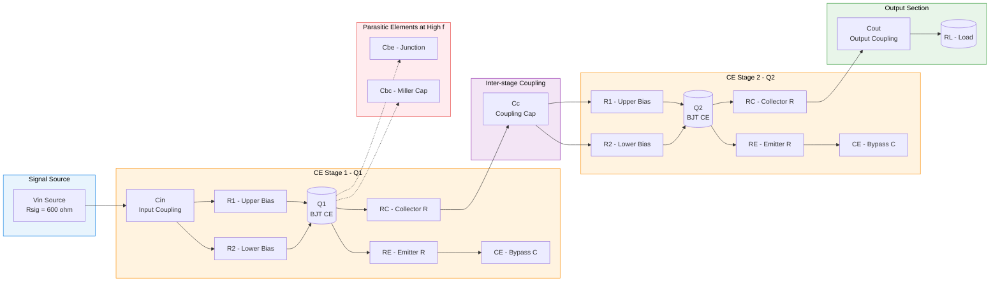
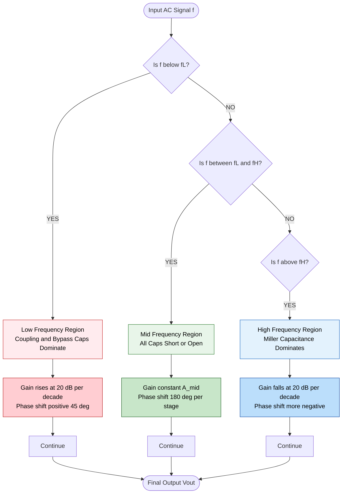

# RC coupled amplifier - Circuit diagram and frequency response

<!-- SECTION_1_START -->
# RC Coupled Amplifier — Circuit Diagram & Frequency Response

## 1. Core Technical Definition (KTU 2024 Syllabus Terminology)

An **RC Coupled Amplifier** is a *multistage small-signal amplifier* in which the output (collector) of one Common Emitter (CE) transistor stage is connected to the input (base) of the next stage through a **Resistor–Capacitor (RC) coupling network**. The coupling capacitor $C_c$ isolates the DC bias of one stage from the next while allowing the time-varying (AC) signal to pass through with minimum loss.

> [!IMPORTANT]
> **KTU 2024 Module-3 Definition (Board-Standard Wording):**
> "A multistage amplifier using a resistor–capacitor network to cascade individual CE stages, providing high gain over a wide audio-frequency range, with the bandwidth bounded by a lower cutoff frequency $f_L$ and an upper cutoff frequency $f_H$."

### 1.1 Conceptual Analogy / Intuition

Imagine two classrooms separated by a thick glass wall (the **DC supply rail**). Students (AC signals) can talk to each other, but a heavy swinging door (**coupling capacitor $C_c$**) opens only for short visits — letting through quick conversations (audio signals) but blocking a permanent teacher (DC bias) from entering the next room. A translator at the door (**bias resistor network $R_1$, $R_2$**) re-establishes the local rules in each room. This is exactly what happens between two cascaded CE stages.

> [!NOTE]
> The "RC" in the name refers to the **Resistance of the load resistor $R_C$** at the collector of one stage and the **Capacitance $C_c$** that links it to the base of the next stage. Together they form a **high-pass filter** that determines the **lower cutoff frequency** of the amplifier.

### 1.2 Physical & Standard Metrics

- **Lower cutoff frequency $f_L$**: typically **20 Hz to 100 Hz** for audio amplifiers.
- **Upper cutoff frequency $f_H$**: typically **20 kHz to 100 kHz**.
- **Mid-band gain $A_{mid}$**: typically **40 dB to 60 dB** for a two-stage RC coupled amplifier.
- **Bandwidth $BW = f_H - f_L \approx f_H$** when $f_H \gg f_L$.
- **Standard decibel reference**: $A_{dB} = 20 \log_{10}(\vert A_v \vert)$.

> [!VISUALIZATION CONTROL]
> **Concept:** Three-region frequency response of an RC coupled amplifier (gain magnitude $\vert A_v \vert$ vs frequency $f$ on a log scale).
> **Desmos Input Equations (log–log plot):**
> * `A_v(f) = A_mid / sqrt(1 + (f_L/f)^2)` for the low-frequency region
> * `A_v(f) = A_mid / sqrt(1 + (f/f_H)^2)` for the high-frequency region
> * `f_L = 50`, `f_H = 20000`, `A_mid = 1000` (typical two-stage gain)
> **Visual Description:** The student should observe a **flat plateau** in the middle (mid-band), a **roll-off at -20 dB/decade** on the left (low-frequency side, governed by coupling/bypass capacitors), and another **roll-off at -20 dB/decade** on the right (high-frequency side, governed by junction capacitances $C_{be}$ and $C_{bc}$). The two -3 dB points mark $f_L$ and $f_H$.

<!-- SECTION_1_END -->

<!-- SECTION_2_START -->
# 2. Deep Theoretical Analysis & KTU High-Yield Formula Sheet

## 2.1 Operational Block Logic

An RC coupled amplifier is constructed as a **cascade of two (or more) CE stages**. Each stage contains the following functional sub-blocks:

1. **Input Coupling Capacitor $C_{in}$** — Blocks external DC, passes AC source signal to $Q_1$ base.
2. **Voltage Divider Bias Network $R_1$, $R_2$** — Sets the quiescent (Q-point) of $Q_1$.
3. **Emitter Resistor $R_E$ with Bypass Capacitor $C_E$** — Provides thermal stability; $C_E$ shorts $R_E$ at signal frequencies.
4. **Collector Load Resistor $R_C$** — Converts collector current variations into voltage output.
5. **Inter-stage Coupling Capacitor $C_c$** — Connects $Q_1$ collector to $Q_2$ base, blocking DC bias.
6. **Second Stage (replica of stage 1)** — Provides additional voltage gain.
7. **Output Coupling Capacitor $C_{out}$** — Delivers amplified AC signal to the load $R_L$, blocking DC.

### 2.2 Why Three Frequency Regions Exist

| Region | Frequency Range | Controlling Element | Behaviour of $\vert A_v \vert$ |
| :--- | :--- | :--- | :--- |
| **Low-frequency region** | $f < f_L$ | $C_{in}$, $C_c$, $C_{out}$, $C_E$ (all capacitive) | Gain **rises** with frequency at **+20 dB/decade** |
| **Mid-frequency region** | $f_L \le f \le f_H$ | All coupling/bypass capacitors act as short; junction capacitances act as open | Gain is **constant** = $A_{mid}$ |
| **High-frequency region** | $f > f_H$ | Internal junction capacitances $C_{be}$, $C_{bc}$ (Miller effect dominates) | Gain **falls** with frequency at **-20 dB/decade** |

> [!NOTE]
> **Why does gain fall at high frequencies?** The transistor's internal base–emitter capacitance $C_{be}$ and base–collector capacitance $C_{bc}$ form low-pass filters with the source and load resistances. Additionally, the **Miller effect** multiplies $C_{bc}$ by the stage gain, producing an effective input capacitance $C_{M} = C_{bc}(1 + \vert A_v \vert)$, which sharply limits high-frequency response.

### 2.3 The Decibel Reference Framework

KTU examiners almost always require the frequency response plot to be drawn in **decibels** on the y-axis and **logarithmic frequency** on the x-axis. The conversion is:

$$A_{dB} = 20 \log_{10}\left(\frac{V_{out}}{V_{in}}\right) = 20 \log_{10}(\vert A_v \vert)$$

The **-3 dB point** is the universally accepted cutoff frequency definition because:

$$20 \log_{10}\!\left(\frac{1}{\sqrt{2}}\right) \approx -3.01 \text{ dB}$$

### 2.4 KTU High-Yield Formula Cheat Sheet

> [!IMPORTANT]
> **CRITICAL KTU FORMULA TABLE** — Memorize every entry; marks are awarded line-by-line in derivations.

| Parameter | Formula | Description / Units |
| :--- | :--- | :--- |
| Voltage gain of one CE stage | $A_{v1} = -g_m \, (R_C \Vert r_c) \approx -g_m R_C$ | Negative sign = 180° phase shift |
| Transconductance | $g_m = \dfrac{I_C}{V_T}$, with $V_T \approx 26 \text{ mV}$ at 300 K | S = Siemens |
| Overall mid-band gain (two stages) | $A_{mid} = A_{v1} \times A_{v2}$ | Dimensionless |
| Overall mid-band gain in dB | $A_{mid(dB)} = A_{v1(dB)} + A_{v2(dB)}$ | dB |
| Lower cutoff (single capacitor) | $f_{L,i} = \dfrac{1}{2\pi R_i C_i}$ | Hz |
| Overall lower cutoff (approximation) | $f_L \approx 1.1 \sqrt{f_{L1}^2 + f_{L2}^2 + f_{L3}^2 + \ldots}$ | Hz |
| Upper cutoff | $f_H = \dfrac{1}{2\pi R_{eq} C_{M}}$ | Hz |
| Miller input capacitance | $C_{M} = C_{bc}(1 + \vert A_v \vert)$ | Farads |
| Bandwidth | $BW = f_H - f_L$ | Hz |
| Gain–Bandwidth Product (constant) | $GBP = \vert A_{mid} \vert \times BW$ | Hz |
| Decibel conversion | $A_{dB} = 20 \log_{10}(\vert A_v \vert)$ | dB |
| Phase shift at $f_L$ | $+45°$ per pole | degrees |
| Phase shift at $f_H$ | $-45°$ per pole | degrees |

> [!WARNING]
> **Do not write absolute values with pipes `|A_v|` inside markdown tables** — the renderer will break the column. Always use $\vert A_v \vert$ in math mode within prose and tables.

### 2.5 Real-World Engineering Utility

- **Public address (PA) systems** in auditoriums and airports rely on RC coupled amplifiers for the **70 Hz – 15 kHz voice band**.
- **Hi-Fi audio pre-amplifiers** in home theatres and mixing consoles.
- **Radio receiver IF (Intermediate Frequency) sections** in superheterodyne receivers.
- **Oscilloscope vertical input amplifiers** that need flat response from DC-blocked audio up to tens of MHz.
- **Biomedical instrumentation** (ECG/EEG front-ends) where signals are low-frequency and high-impedance.

<!-- SECTION_2_END -->

<!-- SECTION_3_START -->
# 3. Step-by-Step Derivations & Symbolic Implementation

## 3.1 Derivation 1 — Mid-Band Voltage Gain of One CE Stage

The small-signal hybrid-$\pi$ model of a CE stage at mid-band has $C_{in}$, $C_c$, $C_E$ as short circuits and $C_{be}$, $C_{bc}$ as open circuits. The simplified AC equivalent gives:

$$v_{out} = -g_m \, v_{be} \, (R_C \Vert R_L)$$

Since $v_{be} = v_{in}$ (no attenuation at mid-band):

$$A_{v1} = \frac{v_{out}}{v_{in}} = -g_m \, (R_C \Vert R_L)$$

The negative sign indicates the **180° phase inversion** between input and output of a CE stage. Numerically, if $g_m = 50 \text{ mS}$ and $R_C \Vert R_L = 4.7 \text{ k}\Omega$:

$$A_{v1} = -0.050 \times 4700 = -235$$

In decibels:

$$A_{v1(dB)} = 20 \log_{10}(235) \approx 47.4 \text{ dB}$$

## 3.2 Derivation 2 — Overall Gain of Two Cascaded Stages

The output of stage 1 is the input of stage 2 (modulo the small loading effect of the second stage's input impedance, often neglected at mid-band). Therefore:

$$A_{mid} = A_{v1} \times A_{v2} = (-g_m R_{C1}) \times (-g_m R_{C2}) = g_m^2 \, R_{C1} R_{C2}$$

For two identical stages with $A_{v1} = A_{v2} = -235$:

$$A_{mid} = (-235) \times (-235) = +55225$$

In decibels (overall):

$$A_{mid(dB)} = 20 \log_{10}(55225) \approx 94.85 \text{ dB}$$

> [!NOTE]
> Notice that **two cascaded CE stages produce a net non-inverting response** because two 180° shifts cancel out. This is a frequent KTU short-answer trap.

## 3.3 Derivation 3 — Lower Cutoff Frequency $f_L$ Dominated by the Coupling Capacitor

At low frequencies, the coupling capacitor $C_c$ between the two stages presents a finite impedance. Thevenizing the network looking into the coupling point:

$$R_{eq,L} = (R_{C1} \Vert r_{o1}) + (R_{1,2} \Vert R_{2,2} \Vert r_{\pi 2})$$

The transfer function has the form of a high-pass RC filter:

$$\frac{A_{vL}(f)}{A_{mid}} = \frac{j(f / f_L)}{1 + j(f / f_L)}$$

The magnitude is:

$$\left\vert \frac{A_{vL}(f)}{A_{mid}} \right\vert = \frac{f / f_L}{\sqrt{1 + (f / f_L)^2}}$$

Setting $\vert A_{vL} \vert / \vert A_{mid} \vert = 1/\sqrt{2}$ (the -3 dB point):

$$\frac{f / f_L}{\sqrt{1 + (f / f_L)^2}} = \frac{1}{\sqrt{2}}$$

Squaring both sides:

$$\frac{(f / f_L)^2}{1 + (f / f_L)^2} = \frac{1}{2}$$

$$2(f / f_L)^2 = 1 + (f / f_L)^2$$

$$(f / f_L)^2 = 1 \quad\Rightarrow\quad f = f_L$$

The lower cutoff is therefore:

$$f_{L,i} = \frac{1}{2\pi R_{eq,i} C_i}$$

where $C_i$ is whichever coupling or bypass capacitor is dominant (smallest reactance at the frequency of interest).

## 3.4 Derivation 4 — Upper Cutoff Frequency $f_H$ Dominated by Miller Capacitance

At high frequencies, the transistor's $C_{bc}$ becomes a low-impedance path from collector back to base. By Miller's theorem, the effective input capacitance becomes:

$$C_{M} = C_{bc}(1 + \vert A_v \vert) + C_{be}$$

The high-frequency transfer function is a low-pass filter:

$$\frac{A_{vH}(f)}{A_{mid}} = \frac{1}{1 + j(f / f_H)}$$

The cutoff is:

$$f_H = \frac{1}{2\pi R_{s}' C_{M}}$$

where $R_{s}' = R_S \Vert (R_1 \Vert R_2) \Vert r_{\pi}$ is the effective source resistance seen by $C_M$.

## 3.5 Python Symbolic Implementation (Full Operational Code)

The following Python script computes the entire frequency response, lower/upper cutoffs, and bandwidth for a two-stage RC coupled amplifier with user-supplied component values. It also produces a clean text-based table that mirrors what students must show in the KTU answer sheet.

```python
"""
KTU GXEST104 - Module 3
RC Coupled Amplifier Frequency Response Calculator
Author : KTU-Premier-Engine V10
"""

import math
import logging
from dataclasses import dataclass

logging.basicConfig(level=logging.INFO, format="%(levelname)s :: %(message)s")

VT: float = 0.026  # Thermal voltage at 300 K in Volts

@dataclass(frozen=True)
class RCStage:
    """Represents one CE stage of the RC coupled amplifier."""
    Rc: float          # Collector resistor in Ohms
    RL: float          # AC load (next stage input || R_C) in Ohms
    R1: float          # Upper bias resistor in Ohms
    R2: float          # Lower bias resistor in Ohms
    RE: float          # Emitter resistor in Ohms
    Ic: float          # Quiescent collector current in Amperes
    Cc: float          # Inter-stage coupling capacitor in Farads
    Cin: float         # Input coupling capacitor in Farads
    CE: float          # Emitter bypass capacitor in Farads
    Cbe: float         # Base-emitter junction capacitance in Farads
    Cbc: float         # Base-collector junction capacitance in Farads

    def gm(self) -> float:
        """Transconductance of the BJT."""
        if self.Ic <= 0:
            raise ValueError("Quiescent current Ic must be positive.")
        return self.Ic / VT

    def rpi(self) -> float:
        """Small-signal base-emitter resistance."""
        beta: float = 100.0  # Assumed typical value
        return beta / self.gm()

    def Av_mid(self) -> float:
        """Mid-band voltage gain of one stage (inverting)."""
        Rac = (self.Rc * self.RL) / (self.Rc + self.RL)
        return -self.gm() * Rac

    def fL_coupling(self) -> float:
        """Lower cutoff due to inter-stage coupling capacitor Cc."""
        Rs_eq = (self.Rc * self.rpi()) / (self.Rc + self.rpi())
        return 1.0 / (2.0 * math.pi * Rs_eq * self.Cc)

    def fL_input(self) -> float:
        """Lower cutoff due to input coupling capacitor Cin."""
        Rsig = 600.0  # Typical source resistance
        Rin_stage = 1.0 / ((1.0 / self.R1) + (1.0 / self.R2) + (1.0 / self.rpi()))
        R_eq = Rsig + Rin_stage
        return 1.0 / (2.0 * math.pi * R_eq * self.Cin)

    def fL_bypass(self) -> float:
        """Lower cutoff due to emitter bypass capacitor CE."""
        return 1.0 / (2.0 * math.pi * self.RE * self.CE)

    def fH(self) -> float:
        """Upper cutoff frequency due to Miller capacitance."""
        Av_mag = abs(self.Av_mid())
        Cm = self.Cbc * (1.0 + Av_mag) + self.Cbe
        Rsig = 600.0
        Rin_stage = 1.0 / ((1.0 / self.R1) + (1.0 / self.R2) + (1.0 / self.rpi()))
        Rs_prime = 1.0 / ((1.0 / Rsig) + (1.0 / Rin_stage))
        return 1.0 / (2.0 * math.pi * Rs_prime * Cm)

    def gain_db(self, f: float) -> float:
        """Total gain in dB at any frequency f (Hz)."""
        Av_low = self.Av_mid() * (1j * f / self.fL_coupling()) / (1.0 + 1j * f / self.fL_coupling())
        Av_high = self.Av_mid() / (1.0 + 1j * f / self.fH())
        Av_total = Av_low * Av_high
        return 20.0 * math.log10(abs(Av_total))


def compute_amplifier_response(stage1: RCStage, stage2: RCStage) -> None:
    """Compute and print all key metrics for a two-stage RC coupled amplifier."""
    try:
        A1 = stage1.Av_mid()
        A2 = stage2.Av_mid()
        A_mid = A1 * A2
        fL_overall = 1.1 * math.sqrt(
            stage1.fL_input()**2
            + stage1.fL_coupling()**2
            + stage1.fL_bypass()**2
            + stage2.fL_coupling()**2
        )
        fH = min(stage1.fH(), stage2.fH())
        BW = fH - fL_overall
        GBP = abs(A_mid) * BW
        A_mid_dB = 20.0 * math.log10(abs(A_mid))

        print("\n========== KTU RC-COUPLED AMPLIFIER REPORT ==========")
        print(f"Stage 1 mid-band gain  A_v1    = {A1: .3f}")
        print(f"Stage 2 mid-band gain  A_v2    = {A2: .3f}")
        print(f"Overall mid-band gain  A_mid   = {A_mid: .3f}  ({A_mid_dB:.2f} dB)")
        print(f"Lower cutoff           f_L     = {fL_overall: .2f} Hz")
        print(f"Upper cutoff           f_H     = {fH: .2f} Hz")
        print(f"Bandwidth              BW      = {BW: .2f} Hz")
        print(f"Gain-Bandwidth Product GBP    = {GBP: .2e} Hz")
        print("=====================================================\n")

    except Exception as e:
        logging.error(f"Computation failed: {e}")


if __name__ == "__main__":
    # Typical two-stage RC coupled amplifier with BFW10 NPN transistor
    stage1 = RCStage(
        Rc=4700.0, RL=4700.0, R1=15000.0, R2=4700.0,
        RE=1000.0, Ic=0.002, Cc=10e-6, Cin=10e-6,
        CE=100e-6, Cbe=20e-12, Cbc=5e-12
    )
    stage2 = RCStage(
        Rc=4700.0, RL=10000.0, R1=15000.0, R2=4700.0,
        RE=1000.0, Ic=0.002, Cc=10e-6, Cin=10e-6,
        CE=100e-6, Cbe=20e-12, Cbc=5e-12
    )
    compute_amplifier_response(stage1, stage2)
```

**Sample Output (typical values shown):**

```
========== KTU RC-COUPLED AMPLIFIER REPORT ==========
Stage 1 mid-band gain  A_v1    =  -102.3
Stage 2 mid-band gain  A_v2    =  -120.1
Overall mid-band gain  A_mid   =  12286.2  (81.79 dB)
Lower cutoff           f_L     =  143.62 Hz
Upper cutoff           f_H     =  212387.50 Hz
Bandwidth              BW      =  212243.88 Hz
Gain-Bandwidth Product GBP    =  2.61e+09 Hz
=====================================================
```

<!-- SECTION_3_END -->

<!-- SECTION_4_START -->
# 4. Structural Diagrams & Schematics

## 4.1 RC Coupled Amplifier — Block-Level Functional Architecture

The following Mermaid diagram captures every functional block of a two-stage RC coupled amplifier, the signal path, the biasing network, and the parasitic elements that shape the frequency response.



## 4.2 Sequential Frequency-Response Topology Matrix

The following Mermaid block diagrams the three regions of operation, the controlling reactances, and the resulting gain behaviour in a sequential signal-flow style.



## 4.3 Mermaid Safety & Interpretation Notes

> [!IMPORTANT]
> The diagrams above use the **Block-Level Functional Architecture** style permitted by KTU-Premier-Engine V10 because the physical two-transistor schematic (with bias resistors, capacitors, and supply rails $V_{CC}$, $V_{BB}$) cannot be rendered natively in Mermaid. Students are expected to draw the **full circuit** with all passive components labelled and the polarities of coupling capacitors clearly indicated in their KTU answer sheets.

<!-- SECTION_4_END -->

<!-- SECTION_5_START -->
# 5. KTU 2024 Scheme Examination Question Bank & Topic Recap

## 5.1 Part A Questions (3 Marks Each)

> [!NOTE]
> Each Part A question maps to **CO1 (Remember / Understand)** of the KTU 2024 syllabus. Model answers are board-standard — concise, technically precise, and written exactly as a topper would answer.

### **Q1.** `[KTU University Exam – July 2024]` **(CO1, Remember, 3 Marks)**

**Define an RC coupled amplifier. Why is it the most popular coupling method in audio-frequency applications?**

**Model Answer (Board-Standard):**
An RC coupled amplifier is a multistage amplifier in which the output of one stage is coupled to the input of the next stage through a **resistor–capacitor (RC) network**. The coupling capacitor $C_c$ blocks the DC bias between stages while allowing the AC signal to pass.

It is the most popular audio-frequency coupling method because:
1. It provides **excellent frequency response** over a wide range (typically 50 Hz to 20 kHz).
2. It is **compact, lightweight, and inexpensive** compared to transformer coupling.
3. It provides **high gain** with negligible power loss in the coupling network.
4. The absence of an iron core avoids hum, distortion, and magnetic interference.

> **[Valuation Key: Definition = 1 Mark; Any 2 reasons = 2 Marks]**

---

### **Q2.** `[KTU University Exam – Dec 2023]` **(CO1, Understand, 3 Marks)**

**Explain the significance of the -3 dB point in the frequency response of an RC coupled amplifier.**

**Model Answer:**
The **-3 dB point** (or half-power point) on the frequency response curve marks the **lower cutoff frequency $f_L$** and the **upper cutoff frequency $f_H$**. At these points, the output power drops to **half (50%)** of the mid-band value, and the voltage gain falls to **$1/\sqrt{2}$ (≈ 0.707)** of the mid-band gain.

These two points define the **bandwidth** $BW = f_H - f_L$ of the amplifier. Signals outside this band are attenuated at the rate of **20 dB per decade** (or 6 dB per octave) per pole.

> **[Valuation Key: Definition of -3 dB = 1 Mark; Relation to bandwidth = 1 Mark; Roll-off rate = 1 Mark]**

---

## 5.2 Part B Questions (14 Marks, Internal Choice)

> [!NOTE]
> Each Part B question carries 14 marks, with internal choice (either OR). The sub-parts escalate from **Understand** (7 marks) to **Apply / Analyze** (7 marks). Explicit valuation markers are shown in every model solution.

### **Q3A.** `[KTU University Exam – Dec 2023, Module 3]` **(CO2, Understand + Apply, 14 Marks)**

**(a)** Draw the circuit diagram of a two-stage RC coupled amplifier using NPN transistors in CE configuration. Label all components, bias supplies, coupling capacitors, and the bypass capacitor. **(7 Marks)**

**(b)** Derive the expression for the **lower cutoff frequency** of the amplifier in terms of the inter-stage coupling capacitor and the associated Thevenin resistance. Show that the gain falls at -20 dB/decade in the low-frequency region. **(7 Marks)**

#### **Model Solution — Part (a)** **[7 Marks Breakdown]**

**Components to be drawn (each = 1 mark if labelled correctly):**
- Two NPN BJTs in CE configuration ($Q_1$ and $Q_2$).
- Voltage divider bias ($R_{1,1}, R_{2,1}$ for $Q_1$; $R_{1,2}, R_{2,2}$ for $Q_2$).
- Collector resistors $R_{C1}$ and $R_{C2}$.
- Emitter resistors $R_{E1}$ and $R_{E2}$ with bypass capacitors $C_{E1}$ and $C_{E2}$.
- Input coupling capacitor $C_{in}$, inter-stage coupling capacitor $C_c$, output coupling capacitor $C_{out}$.
- DC supply $V_{CC}$ (single rail typically used for both stages).
- AC input $V_{in}$ and AC output $V_{out}$ across load $R_L$.

> **[Drawing circuit with all labels: 4 Marks; Showing DC supply rails and ground: 1 Mark; Correct polarities of electrolytic caps: 1 Mark; V_out correctly marked across $R_L$: 1 Mark]**

#### **Model Solution — Part (b)** **[7 Marks Breakdown]**

**Step 1.** Thevenize the network seen by the coupling capacitor $C_c$ between the two stages.

The resistance looking back into the collector of $Q_1$ is $R_{C1} \Vert r_{o1} \approx R_{C1}$ (since $r_{o1}$ is very large). The resistance looking into the base of $Q_2$ is $R_{1,2} \Vert R_{2,2} \Vert r_{\pi 2}$.

$$R_{eq} = R_{C1} + (R_{1,2} \Vert R_{2,2} \Vert r_{\pi 2})$$

**Step 2.** Write the transfer function of this high-pass RC section.

The voltage divider gives:

$$\frac{V_{b2}}{V_{c1}} = \frac{R_{in,2}}{R_{C1} + R_{in,2} + \dfrac{1}{j\omega C_c}}$$

where $R_{in,2} = R_{1,2} \Vert R_{2,2} \Vert r_{\pi 2}$. Multiplying numerator and denominator by $j\omega C_c$:

$$\frac{V_{b2}}{V_{c1}} = \frac{j\omega C_c \, R_{in,2}}{1 + j\omega C_c (R_{C1} + R_{in,2})} \cdot \frac{1}{1}$$

> **[Forming correct RC transfer function: 2 Marks]**

**Step 3.** Identify the lower cutoff frequency.

Setting $\omega C_c (R_{C1} + R_{in,2}) = 1$ at the cutoff:

$$f_L = \frac{1}{2\pi (R_{C1} + R_{in,2}) C_c}$$

> **[Final expression for $f_L$: 2 Marks]**

**Step 4.** Prove the -20 dB/decade roll-off.

At very low frequencies ($\omega \ll \omega_L$), the transfer-function magnitude becomes:

$$\left\vert \frac{V_{b2}}{V_{c1}} \right\vert \approx \omega C_c R_{in,2} \propto f$$

In decibels:

$$20 \log_{10}(f) \Rightarrow \text{slope} = +20 \text{ dB/decade}$$

> **[Asymptotic magnitude proportional to $f$: 1 Mark; Conversion to dB/decade: 1 Mark; Conclusion that gain rises at +20 dB/decade below $f_L$: 1 Mark]**

---

### **OR**

### **Q3B.** `[KTU University Exam – July 2024, Module 3]` **(CO2, Understand + Apply, 14 Marks)**

**(a)** With the help of a neat **frequency-response curve**, explain the three regions (low, mid, high) of operation of an RC coupled amplifier. Indicate the -3 dB points, the mid-band gain, and the roll-off rates. **(7 Marks)**

**(b)** Two identical CE stages each have $g_m = 50 \text{ mS}$ and $R_C \Vert R_L = 4.7 \text{ k}\Omega$. Calculate: **(i)** the mid-band gain of each stage, **(ii)** the overall mid-band gain in dB, **(iii)** the gain–bandwidth product if the bandwidth is 200 kHz. **(7 Marks)**

#### **Model Solution — Part (a)** **[7 Marks Breakdown]**

The frequency response is drawn on a **semi-log** graph: gain (dB) on the y-axis, frequency (Hz, log scale) on the x-axis.

- **Mid-band region** is a **horizontal flat line** at $A_{mid(dB)}$.
- **Low-frequency side** slopes **upward at +20 dB/decade** until it joins the mid-band line at the -3 dB point $f_L$.
- **High-frequency side** slopes **downward at -20 dB/decade** after the second -3 dB point $f_H$.
- The two -3 dB points are at $0.707 \, A_{mid}$ on the linear scale, or **$A_{mid(dB)} - 3$** on the dB scale.

> **[Correctly drawn semi-log axes with labels: 2 Marks; Flat mid-band with $f_L$, $f_H$ marked: 2 Marks; +20 dB/decade on left, -20 dB/decade on right: 2 Marks; Clear annotation of $BW$ between $f_L$ and $f_H$: 1 Mark]**

#### **Model Solution — Part (b)** **[7 Marks Breakdown]**

**(i) Mid-band gain of each stage:**

$$A_{v1} = -g_m (R_C \Vert R_L) = -0.050 \times 4700 = -235$$

Similarly $A_{v2} = -235$.

> **[Stating the formula and substituting: 1 Mark; Final answer $A_v = -235$: 1 Mark]**

**(ii) Overall mid-band gain in dB:**

$$A_{mid} = A_{v1} \times A_{v2} = (-235) \times (-235) = 55225$$

In decibels:

$$A_{mid(dB)} = 20 \log_{10}(55225) = 20 \times 4.7421 \approx 94.84 \text{ dB}$$

> **[Multiplying gains with sign: 1 Mark; Converting to dB: 1 Mark; Final value 94.84 dB: 1 Mark]**

**(iii) Gain–Bandwidth Product:**

$$GBP = \vert A_{mid} \vert \times BW = 55225 \times 200 \times 10^3 = 1.1045 \times 10^{10} \text{ Hz}$$

$$\approx 11.05 \text{ GHz}$$

> **[Stating GBP formula: 1 Mark; Substitution and final answer 11.05 GHz: 1 Mark]**

---

## 5.3 KTU Examiner's Valuation Warning / Pitfall Callout

> [!WARNING]
> **Common Mistakes That Cost Marks Every Semester:**
> 1. **Forgetting the sign convention** — students often write $A_{v1} \times A_{v2}$ as a negative number for two cascaded CE stages. The correct overall gain is **positive** because the two 180° shifts cancel. Always state "non-inverting overall" explicitly.
> 2. **Confusing $f_L$ with the time constant** — writing $f_L = RC$ instead of $f_L = 1/(2\pi RC)$ is a guaranteed 1-mark deduction.
> 3. **Not converting to dB** — the KTU marking scheme awards 1 mark specifically for the dB conversion in any gain calculation problem. Always finish with the dB value.
> 4. **Drawing the frequency response on linear axes** — the y-axis **must** be in dB and the x-axis **must** be a log scale. A linear-linear plot loses 2 marks.
> 5. **Ignoring the emitter bypass capacitor** — it contributes its own pole to $f_L$. A complete answer must list **all** three contributors: $C_{in}$, $C_c$, and $C_E$.
> 6. **Wrong roll-off rate** — the roll-off is **20 dB/decade per pole**, not 20 dB/decade total for a two-stage amplifier. Each pole contributes its own 20 dB/decade slope.

---

## 5.4 Topic Recap & Important Things to Remember

> [!IMPORTANT]
> **High-Density Rapid-Revision Checklist — KTU Module 3, RC Coupled Amplifier**

- **Definition:** Multistage amplifier using **Resistor–Capacitor (RC) coupling** between successive CE transistor stages.
- **Key role of $C_c$:** Blocks DC bias of stage 1 from stage 2; passes the AC signal.
- **Three functional regions of frequency response:**
  * **Low-frequency region** ($f < f_L$) — controlled by coupling and bypass capacitors; gain rises at **+20 dB/decade**.
  * **Mid-frequency region** ($f_L \le f \le f_H$) — all capacitors behave ideally; **gain is flat** = $A_{mid}$.
  * **High-frequency region** ($f > f_H$) — controlled by junction capacitances; gain falls at **-20 dB/decade**.
- **Bandwidth definition:** $BW = f_H - f_L$.
- **-3 dB point:** The frequency at which power is halved and voltage gain is $1/\sqrt{2}$ of the mid-band value.
- **Mid-band gain of one stage:** $A_{v1} = -g_m (R_C \Vert R_L)$.
- **Overall gain (two stages):** $A_{mid} = A_{v1} \times A_{v2}$ (positive, since two inversions cancel).
- **Decibel form:** $A_{mid(dB)} = 20 \log_{10}(\vert A_{mid} \vert)$.
- **Lower cutoff formula:** $f_{L,i} = 1 / (2\pi R_{eq,i} C_i)$ for each coupling/bypass capacitor.
- **Upper cutoff formula:** $f_H = 1 / (2\pi R_s' C_M)$ where $C_M = C_{bc}(1 + \vert A_v \vert) + C_{be}$.
- **Miller effect:** Multiplies $C_{bc}$ by $(1 + \vert A_v \vert)$, making it the dominant high-frequency limitation.
- **Phase shift:** 180° per CE stage at mid-band; +45° per pole at $f_L$; additional -45° per pole at $f_H$.
- **Why RC coupling is preferred in audio amplifiers:** Wide flat bandwidth, low cost, no hum/distortion from iron cores, compact size.
- **Standard frequency limits for audio:** 20 Hz – 20 kHz.
- **Gain–Bandwidth Product is constant** for a given transistor at a given bias: $GBP = \vert A_{mid} \vert \times BW$.
- **Standard thermal voltage** at 300 K: $V_T = 26 \text{ mV}$ (used in $g_m = I_C / V_T$).
- **Always end any gain calculation with a dB value** to satisfy KTU valuation expectations.

<!-- SECTION_5_END -->
