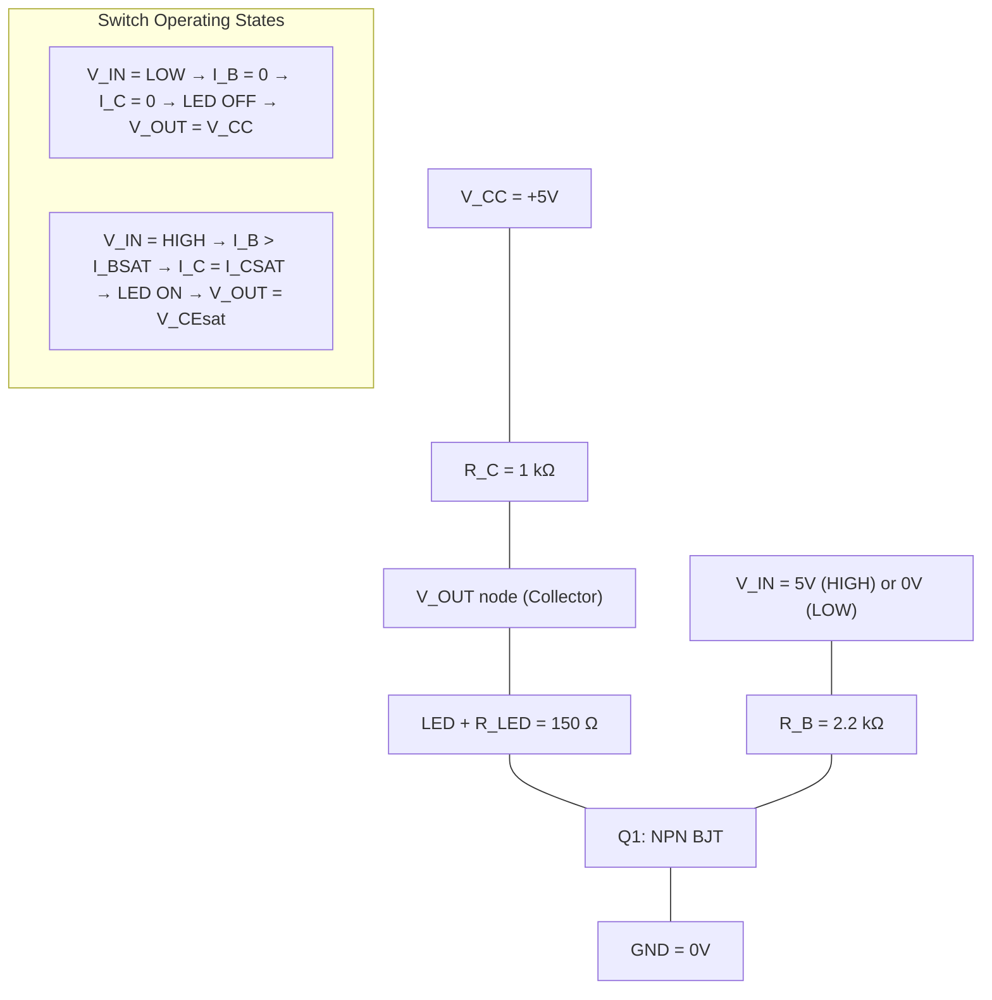
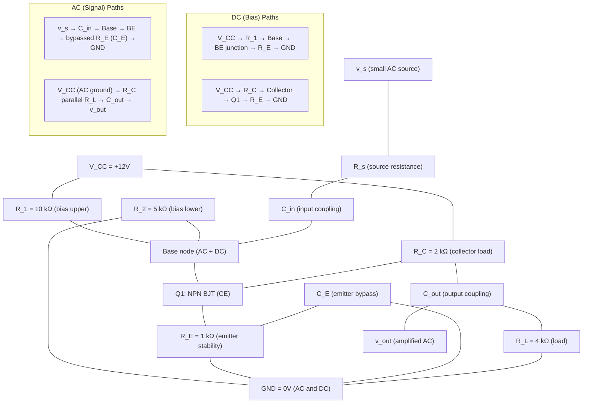
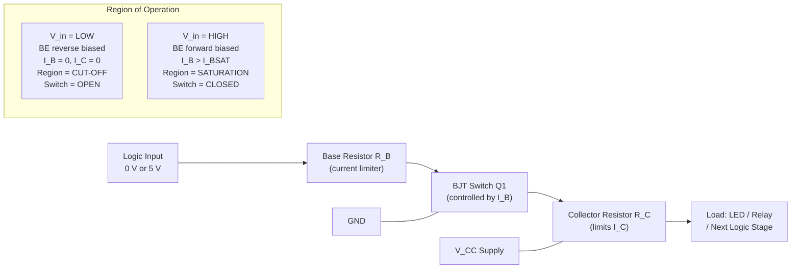
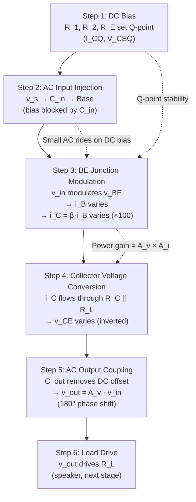

# Transistor as a switch, Transistor as an amplifier (Circuit Diagram and working)

<!-- SECTION_1_START -->
# Module 3 — Electronic Devices & Amplifiers
## Topic: Transistor as a Switch & Transistor as an Amplifier

---

### 1.1 The Bipolar Junction Transistor (BJT) — Quick Refresher

A **Bipolar Junction Transistor (BJT)** is a three-terminal, current-controlled semiconductor device constructed by sandwiching either a *P*-type layer between two *N*-type layers (NPN) or an *N*-type layer between two *P*-type layers (PNP). The three terminals are named:

- **Emitter (E)** — heavily doped, injects charge carriers into the base.
- **Base (B)** — very thin and lightly doped, controls carrier flow.
- **Collector (C)** — moderately doped, collects the carriers from the emitter.

> [!NOTE]
> **KTU 2024 Syllabus Hook (GXEST104 — Module 3):** "Transistor as a switch, Transistor as an amplifier (Circuit Diagram and working)." A BJT can operate in **three regions** based on the biasing of its two PN junctions (Emitter-Base junction and Collector-Base junction):
> 1. **Cut-off Region** — both junctions reverse-biased (used in *switching OFF*).
> 2. **Active Region** — EB forward-biased, CB reverse-biased (used in *amplification*).
> 3. **Saturation Region** — both junctions forward-biased (used in *switching ON*).

The single BJT is therefore a *dual-role* device — it is the fundamental building block of both **digital logic gates** (acting as a switch) and **analogue signal amplifiers** (acting as a linear current/voltage controlled source).

---

### 1.2 Conceptual Analogy — The BJT as a *Water-Tap & Pressure Amplifier*

Imagine a **water pipeline** that you want to control with a tiny side-pipe:

- A *small push* on the side-valve (Base current $I_B$) releases a *huge surge* of water through the main pipe (Collector current $I_C$).
- If you **crank the side-valve fully open** (large $I_B$), the main pipe becomes a direct, low-resistance channel — water gushes freely. This is the **Saturation (ON)** state of a *transistor switch*.
- If you **completely shut the side-valve** ($I_B = 0$), the main pipe is blocked — no water flows. This is the **Cut-off (OFF)** state of a *transistor switch*.
- If you **partially open the side-valve**, the main pipe allows a *proportional, controlled* water flow — this is the **Active Region**, where the BJT acts as a **linear amplifier** of the small side-flow into a large main-flow.

The amplification factor is denoted by the Greek letter **β (beta)** — the *DC current gain* of the transistor.

> [!IMPORTANT]
> **Core Definition — Transistor as a Switch**
> When a BJT is operated at the **two extreme regions** of its output characteristics — *Cut-off* and *Saturation* — it behaves as an **electronic switch** with no moving parts. It can switch ON (saturation) or OFF (cut-off) within a few nanoseconds, making it indispensable in digital logic gates, relay drivers, LED drivers, and power-control circuits.

> [!IMPORTANT]
> **Core Definition — Transistor as an Amplifier**
> When a BJT is operated in the **active region**, a small AC signal applied at the Base-Emitter junction produces a *proportionally larger* AC signal at the Collector. The transistor is said to provide **power gain** (since output power $>$ input power), derived simultaneously from voltage and current amplification.

---

### 1.3 The Two Operating Regions — A Visual Snapshot

| Property | Cut-off (Switch OFF) | Active (Amplifier) | Saturation (Switch ON) |
|---|---|---|---|
| Base–Emitter junction | Reverse biased | Forward biased | Forward biased |
| Collector–Base junction | Reverse biased | Reverse biased | Forward biased |
| Base current $I_B$ | $\approx 0$ | $I_B > 0$ | $I_B \geq I_{B(\text{sat})}$ |
| Collector current $I_C$ | $\approx 0$ | $I_C = \beta I_B$ | $I_{C(\text{sat})} = \dfrac{V_{CC}}{R_C}$ |
| Collector–Emitter voltage $V_{CE}$ | $\approx V_{CC}$ | between 0.2 V and $V_{CC}$ | $\approx V_{CE(\text{sat})} \approx 0.2$ V |
| Acts as | Open switch | Linear amplifier | Closed switch |

> [!VISUALIZATION CONTROL]
> **Concept:** Transistor Output Characteristics — Load Line Intersection
> **GeoGebra / Desmos Input Equations:**
> - Load line: $y = -x/R_C + V_{CC}/R_C$ with $V_{CC} = 12$, $R_C = 1\,\text{k}\Omega$
> - $I_C$ axis (vertical), $V_{CE}$ axis (horizontal)
> - Family of curves: $I_C = \beta I_B$ for $I_B = 0$, $20\,\mu\text{A}$, $40\,\mu\text{A}$, $60\,\mu\text{A}$, $80\,\mu\text{A}$, $100\,\mu\text{A}$ (assuming $\beta = 100$)
> **Visual Description:** A straight load line cuts through the family of transistor output curves. The intersection near the $V_{CE}$-axis is the **cut-off point** (switch OFF). The intersection near the $I_C$-axis is the **saturation point** (switch ON). Any intersection in the middle represents the **Q-point (quiescent operating point)** for amplifier operation.

---

### 1.4 Module Roadmap

This module covers the **two primary applications** of the BJT in detail:

1. **Part A — Transistor as a Switch:** Circuit diagram, working, and the mathematical conditions for cut-off and saturation.
2. **Part B — Transistor as an Amplifier:** The **Common-Emitter (CE) configuration** as the most widely used amplifier, its biasing, working, and small-signal voltage gain derivation.

> [!TIP]
> The Common-Emitter amplifier is the **KTU-favoured** topology for numerical problems — expect a 14-mark question on its voltage gain, Q-point analysis, or waveform sketching almost every semester.
<!-- SECTION_1_END -->

<!-- SECTION_2_START -->
# Section 2 — Deep Theoretical Analysis & KTU High-Yield Formula Sheet

---

## 2.1 Transistor as a Switch — Complete Theoretical Analysis

### 2.1.1 Circuit Description

The fundamental **transistor switch** (NPN, low-side switch) is a single-stage circuit consisting of:

- An **NPN BJT** (e.g., BC547, 2N2222, 2N3904) with Emitter grounded.
- A **Base resistor** $R_B$ that limits the base current driven by the control input $V_{in}$.
- A **Collector resistor** $R_C$ (also called the *load resistor*) connected between the positive supply $V_{CC}$ and the Collector.
- An **output node** $V_{out}$ taken at the Collector.
- A **load** (LED, relay coil, lamp, or the next logic stage) between the Collector and $V_{CC}$.

> [!NOTE]
> The same circuit with a **PNP** transistor and supply polarity reversed is called a *high-side switch*. The analysis is symmetric — only the biasing polarities invert.

### 2.1.2 Working — Step by Step

**Step 1 — Input is LOW (e.g., $V_{in} = 0$ V):**
- The Base–Emitter junction is **not forward-biased** (since $V_{in} < 0.7$ V).
- Therefore $I_B \approx 0$, which forces $I_C = \beta I_B \approx 0$.
- The transistor is in **cut-off**; it behaves like an **open switch** between Collector and Emitter.
- No voltage drop occurs across $R_C$, so $V_{out} = V_{CC} - I_C R_C \approx V_{CC}$ (HIGH).
- The load (say, an LED) is OFF because no current flows.

**Step 2 — Input is HIGH (e.g., $V_{in} = 5$ V):**
- The Base–Emitter junction becomes **forward-biased** (BE voltage is clamped to $\approx 0.7$ V).
- Base current flows: $I_B = \dfrac{V_{in} - V_{BE}}{R_B} = \dfrac{5 - 0.7}{R_B}$.
- If this $I_B$ is **large enough** to drive the transistor into saturation, then $I_C = I_{C(\text{sat})} = \dfrac{V_{CC} - V_{CE(\text{sat})}}{R_C} \approx \dfrac{V_{CC}}{R_C}$.
- The transistor behaves like a **closed switch**; $V_{out} = V_{CE(\text{sat})} \approx 0.2$ V (LOW).
- The load (LED) is now ON because $I_C$ flows through it.

> [!IMPORTANT]
> **Saturation condition (design rule for switching):** To guarantee hard saturation, design for a base current that is **at least 2× to 10× the minimum required** $I_{B(\text{sat})}$.
>
> $I_{B(\text{sat})} = \dfrac{I_{C(\text{sat})}}{\beta_{DC}} = \dfrac{V_{CC}}{\beta_{DC} R_C}$
>
> Hence the *over-drive factor* of 5 is typical:
>
> $R_B = \dfrac{V_{in} - V_{BE}}{10 \cdot I_{B(\text{sat})}}$

### 2.1.3 Why Use a Transistor as a Switch?

| Feature | Mechanical Relay | Transistor Switch |
|---|---|---|
| Switching speed | $\sim 10$ ms (slow) | $\sim 10$ ns (extremely fast) |
| Bouncing | Contact bounce present | No bouncing (solid-state) |
| Size | Bulky | Microscopic (in ICs) |
| Lifetime | Limited (mechanical wear) | $> 10^{9}$ operations |
| Power consumption (coil) | High | Negligible (only $\mu$A at base) |
| Isolation | Galvanic isolation | No isolation |

This is why **every digital IC** (logic gates, microcontrollers, flip-flops) is built from millions of transistor switches.

---

## 2.2 Transistor as an Amplifier — Complete Theoretical Analysis

### 2.2.1 Why Amplification is Needed

Many real-world signals (audio from a microphone, RF from an antenna, sensor outputs from a thermocouple) are **too weak** to drive a load (loudspeaker, antenna, ADC). The amplitude may be in the **millivolt** range. We need a circuit that takes this small AC signal and produces a **larger replica** at the output, with the same waveform shape.

The BJT in the **active region** accomplishes this through **power gain**:

$$A_P = \frac{P_{out}}{P_{in}} = A_V \cdot A_I$$

where $A_V$ is the voltage gain and $A_I$ is the current gain.

### 2.2.2 The Three Amplifier Configurations

| Configuration | Input Port | Output Port | Common Terminal | Typical Use |
|---|---|---|---|---|
| **Common Emitter (CE)** | Base | Collector | Emitter (grounded) | **Voltage amplifier** (most common) |
| **Common Base (CB)** | Emitter | Collector | Base (grounded) | High-frequency, low-input-impedance stages |
| **Common Collector (CC) — Emitter Follower** | Base | Emitter | Collector (grounded) | Buffer / impedance-matching stage |

The **CE configuration** dominates because it provides **simultaneous voltage and current gain** (and therefore large power gain) with a single transistor.

### 2.2.3 Common-Emitter Amplifier — Circuit Working

**The two-port CE amplifier** has the following structure:

1. **Input side:** A small AC source $v_s$ (with source resistance $R_s$) is coupled to the Base via a coupling capacitor $C_{in}$. $C_{in}$ blocks the DC from the source but passes the AC signal.
2. **Biasing network:** A pair of resistors $R_1$ (upper) and $R_2$ (lower) form a *voltage divider* that sets the DC base voltage $V_{BB} = V_{CC} \cdot R_2 / (R_1 + R_2)$. The emitter resistor $R_E$ provides *DC stability* (negative feedback for Q-point).
3. **Bypass capacitor $C_E$:** Connected across $R_E$, it shorts $R_E$ for AC signals (so the AC gain is not reduced by $R_E$) while leaving $R_E$ active for DC stability.
4. **Output side:** The amplified AC signal is taken at the Collector and coupled to the load $R_L$ via the output coupling capacitor $C_{out}$.

**Working principle:**

- The DC supply $V_{CC}$ sets up a **quiescent operating point (Q-point)** — the DC values $I_{CQ}$, $V_{CEQ}$, and $I_{BQ}$.
- When the small AC input $v_{in}$ is applied, the Base–Emitter voltage varies as $v_{BE} = V_{BE(Q)} + v_{in}$.
- Since the BE junction is a *forward-biased diode* with a small dynamic resistance $r_e \approx 25\,\text{mV} / I_{EQ}$, a small $\Delta v_{BE}$ produces a proportionally larger $\Delta i_B$.
- The collector current varies as $i_C = \beta \, i_B$ — much larger than $i_B$.
- This large $\Delta i_C$ flows through $R_C$ (or $R_C \parallel R_L$), producing a much larger $\Delta v_{CE} = -\Delta i_C \cdot (R_C \parallel R_L)$.
- The **$180^\circ$ phase inversion** between $v_{in}$ and $v_{out}$ is the signature of the CE amplifier.

---

## 2.3 KTU High-Yield Formula Sheet

### A. Transistor Switch Formulas

$$
\begin{aligned}
V_{out(\text{OFF})} &= V_{CC} \\
V_{out(\text{ON})} &= V_{CE(\text{sat})} \approx 0.2 \text{ V} \\
I_{B(\text{sat})} &= \frac{I_{C(\text{sat})}}{\beta_{DC}} = \frac{V_{CC}}{\beta_{DC} \cdot R_C} \\
I_{C(\text{sat})} &= \frac{V_{CC} - V_{CE(\text{sat})}}{R_C} \approx \frac{V_{CC}}{R_C} \\
R_{B(\max)} &= \frac{V_{in(\text{HIGH})} - V_{BE}}{I_{B(\text{sat})}} \\
\text{For hard saturation:} \quad R_B &= \frac{V_{in} - V_{BE}}{10 \cdot I_{B(\text{sat})}}
\end{aligned}
$$

### B. Biasing & Q-Point (Voltage Divider Bias) Formulas

$$
\begin{aligned}
V_{BB} &= V_{CC} \cdot \frac{R_2}{R_1 + R_2} \\
R_{BB} &= R_1 \parallel R_2 = \frac{R_1 R_2}{R_1 + R_2} \\
I_{BQ} &= \frac{V_{BB} - V_{BE}}{R_{BB} + (\beta + 1) R_E} \quad \text{(exact Thévenin)} \\
I_{EQ} &\approx I_{CQ} = \beta \cdot I_{BQ} \\
V_{CEQ} &= V_{CC} - I_{CQ} (R_C + R_E)
\end{aligned}
$$

### C. Small-Signal CE Amplifier Gain Formulas

$$
\begin{aligned}
r_e &= \frac{25 \text{ mV}}{I_{EQ} \text{ (in mA)}} = \frac{V_T}{I_{EQ}} \quad \text{where } V_T \approx 26 \text{ mV at } 27^\circ\text{C} \\
r_\pi &= \beta \cdot r_e \\
g_m &= \frac{I_{CQ}}{V_T} = \frac{1}{r_e} \quad \text{(transconductance)} \\
A_v &= \frac{v_{out}}{v_{in}} = -\frac{\beta \cdot (R_C \parallel R_L)}{r_\pi} = -\frac{R_C \parallel R_L}{r_e} \\
A_v &\approx -\frac{R_C}{r_e} \quad \text{(if no load, i.e., } R_L = \infty \text{)} \\
A_i &= \beta \quad \text{(CE short-circuit current gain)} \\
A_p &= \vert A_v \vert \cdot A_i \quad \text{(power gain)} \\
R_{in(\text{stage})} &= R_1 \parallel R_2 \parallel r_\pi \\
R_{out(\text{stage})} &= R_C
\end{aligned}
$$

### D. Boundary & Threshold Values (Remember These!)

| Parameter | Symbol | Typical Value |
|---|---|---|
| Base–Emitter ON voltage | $V_{BE(\text{on})}$ | $\approx 0.7$ V (silicon) |
| Collector–Emitter saturation | $V_{CE(\text{sat})}$ | $\approx 0.2$ V |
| Thermal voltage at 27 °C | $V_T$ | $\approx 25.85$ mV (often 26 mV) |
| Thermal voltage at room temp | $V_T$ | $\approx 25$ mV |
| Germanium $V_{BE(\text{on})}$ | — | $\approx 0.3$ V |
| Cut-off base voltage | $V_{BE(\text{cut-in})}$ | $\approx 0.5$ V |

> [!IMPORTANT]
> **Real-world applications of CE amplifiers:**
> - **Audio pre-amplifiers** in microphones, hearing aids, mixers.
> - **RF front-end stages** in radio receivers.
> - **Sensor signal conditioning** for strain gauges and thermistors.
> - **IF (Intermediate Frequency) amplifiers** in superheterodyne radio.
> - **Oscillator and modulator building blocks** (Hartley, Colpitts).
<!-- SECTION_2_END -->

<!-- SECTION_3_START -->
# Section 3 — Step-by-Step Derivations & Numerical Solutions

---

## 3.1 Worked Example 1 — Transistor as a Switch (Design Verification)

**Problem Statement (KTU-style):**
An NPN transistor switch is to be used to drive an LED from a 5 V microcontroller output. The LED requires $20$ mA to glow brightly, the supply is $V_{CC} = 5$ V, and the LED forward drop is $V_{LED} = 1.8$ V. The transistor has $\beta_{DC} = 100$ and $V_{CE(\text{sat})} = 0.2$ V. $V_{BE} = 0.7$ V. The microcontroller output is $5$ V in HIGH state.
Design $R_C$ (current-limiting resistor for the LED) and the maximum value of base resistor $R_B$ to ensure hard saturation.

### Step 1 — Find $R_C$ from the LED current requirement

The LED and $R_C$ are in series between $V_{CC}$ and the Collector. At saturation, $V_{CE} \approx 0.2$ V. The voltage across $R_C$ + LED must equal $V_{CC} - V_{CE(\text{sat})}$.

$$
V_{CC} - V_{CE(\text{sat})} = V_R + V_{LED}
$$

where $V_R$ is the drop across $R_C$. Substituting the numbers:

$$
5 - 0.2 = V_R + 1.8
$$

$$
V_R = 5 - 0.2 - 1.8 = 3.0 \text{ V}
$$

By Ohm's law:

$$
R_C = \frac{V_R}{I_{C(\text{sat})}} = \frac{3.0 \text{ V}}{20 \text{ mA}} = 150 \text{ }\Omega
$$

**Valuation Note:** *[Stating the saturation current: 1 Mark]; [KVL across collector loop: 2 Marks]; [Final $R_C$ value: 1 Mark]*

### Step 2 — Find minimum base current required for saturation

$$
I_{B(\text{sat})} = \frac{I_{C(\text{sat})}}{\beta_{DC}} = \frac{20 \text{ mA}}{100} = 0.2 \text{ mA} = 200 \text{ }\mu\text{A}
$$

### Step 3 — Find the maximum base resistor $R_B$

When the microcontroller output is HIGH ($V_{in} = 5$ V), the BE junction is forward biased at 0.7 V. The voltage across $R_B$ is:

$$
V_{R_B} = V_{in} - V_{BE} = 5 - 0.7 = 4.3 \text{ V}
$$

The minimum $I_B$ we need is $I_{B(\text{sat})}$. So the maximum $R_B$ to still produce this current is:

$$
R_{B(\max)} = \frac{V_{R_B}}{I_{B(\text{sat})}} = \frac{4.3 \text{ V}}{0.2 \text{ mA}} = 21.5 \text{ k}\Omega
$$

### Step 4 — Apply safety margin for *hard* saturation

To ensure the transistor is *deep* in saturation (insensitive to $\beta$ variations, temperature changes, and noise), use a *base overdrive factor* of 10:

$$
I_{B(\text{design})} = 10 \cdot I_{B(\text{sat})} = 10 \times 0.2 \text{ mA} = 2.0 \text{ mA}
$$

$$
R_{B(\text{design})} = \frac{4.3 \text{ V}}{2.0 \text{ mA}} = 2.15 \text{ k}\Omega
$$

Use the standard value **$R_B = 2.2$ k$\Omega$**.

**Final Answer:** $R_C = 150$ $\Omega$ (use standard 150 $\Omega$), $R_B = 2.2$ k$\Omega$ (ensures 10× overdrive saturation).

> [!WARNING]
> **Common KTU Valuation Mistakes:**
> 1. Forgetting to subtract $V_{CE(\text{sat})}$ from $V_{CC}$ when finding $R_C$ — this gives $R_C = 160$ $\Omega$ instead of 150 $\Omega$ (1 mark loss).
> 2. Using $\beta = 100$ but computing $I_{B(\text{sat})}$ as $I_{C(\text{sat})} \cdot \beta$ instead of $I_C / \beta$ — this is a wrong inversion of the formula.
> 3. Forgetting to state the **saturation assumption** explicitly. Examiners look for the phrase *"Assume the transistor is in saturation, so $V_{CE} = V_{CE(\text{sat})}$"*.

---

## 3.2 Worked Example 2 — Common-Emitter Amplifier (Q-Point and Voltage Gain)

**Problem Statement (KTU-style — 14 marks flavour):**
For the CE amplifier shown, $V_{CC} = 12$ V, $R_1 = 10$ k$\Omega$, $R_2 = 5$ k$\Omega$, $R_E = 1$ k$\Omega$, $R_C = 2$ k$\Omega$, $R_L = 4$ k$\Omega$, $\beta = 100$, $V_{BE} = 0.7$ V, and the coupling capacitors are very large (AC short-circuits). Find:
**(a)** The Q-point $(I_{BQ}, I_{CQ}, V_{CEQ})$.
**(b)** The small-signal voltage gain $A_v = v_{out}/v_{in}$.

### Part (a) — Q-Point Calculation (Exact Thévenin Method)

**Step 1 — Thévenin equivalent of the base bias network**

$$
V_{BB} = V_{CC} \cdot \frac{R_2}{R_1 + R_2} = 12 \cdot \frac{5}{10 + 5} = 12 \cdot \frac{5}{15} = 4.0 \text{ V}
$$

$$
R_{BB} = R_1 \parallel R_2 = \frac{10 \times 5}{10 + 5} = \frac{50}{15} = 3.333 \text{ k}\Omega
$$

**Step 2 — Apply KVL around the Base–Emitter loop**

The loop equation is:

$$
V_{BB} = I_{BQ} R_{BB} + V_{BE} + (\beta + 1) I_{BQ} R_E
$$

Solving for $I_{BQ}$:

$$
I_{BQ} = \frac{V_{BB} - V_{BE}}{R_{BB} + (\beta + 1) R_E} = \frac{4.0 - 0.7}{3.333 + 101 \times 1}
$$

$$
I_{BQ} = \frac{3.3}{3.333 + 101} = \frac{3.3}{104.333} = 0.03163 \text{ mA} = 31.63 \text{ }\mu\text{A}
$$

**Step 3 — Compute the collector current**

$$
I_{CQ} = \beta \cdot I_{BQ} = 100 \times 0.03163 \text{ mA} = 3.163 \text{ mA}
$$

**Step 4 — Compute $V_{CEQ}$ using the output loop KVL**

$$
V_{CEQ} = V_{CC} - I_{CQ} (R_C + R_E) = 12 - 3.163 \times (2 + 1)
$$

$$
V_{CEQ} = 12 - 3.163 \times 3 = 12 - 9.489 = 2.511 \text{ V}
$$

**Q-Point Summary:** $I_{BQ} \approx 31.6$ $\mu$A, $I_{CQ} \approx 3.16$ mA, $V_{CEQ} \approx 2.51$ V.

> The Q-point sits roughly in the *middle* of the DC load line, which is the desired condition for maximum symmetrical AC swing without distortion.

**Valuation Key:** *[Thévenin substitution: 2 Marks]; [KVL loop equation: 1 Mark]; [I_BQ calculation: 1 Mark]; [I_CQ and V_CEQ: 1 Mark each]*

### Part (b) — Small-Signal Voltage Gain

**Step 1 — Compute the dynamic emitter resistance $r_e$**

The thermal voltage $V_T$ at room temperature is $25$ mV.

$$
r_e = \frac{V_T}{I_{EQ}} \approx \frac{V_T}{I_{CQ}} = \frac{25 \text{ mV}}{3.163 \text{ mA}} = 7.905 \text{ }\Omega
$$

(Ignoring the small difference between $I_{EQ}$ and $I_{CQ}$.)

**Step 2 — Compute the AC load resistance**

For a CE amplifier with a load $R_L$ coupled through $C_{out}$, the effective AC load at the Collector is the parallel combination:

$$
R_{ac} = R_C \parallel R_L = \frac{R_C \cdot R_L}{R_C + R_L} = \frac{2 \text{ k}\Omega \times 4 \text{ k}\Omega}{2 \text{ k}\Omega + 4 \text{ k}\Omega} = \frac{8}{6} = 1.333 \text{ k}\Omega
$$

**Step 3 — Compute the voltage gain**

For a CE amplifier with $C_E$ fully bypassing $R_E$:

$$
A_v = -\frac{R_{ac}}{r_e} = -\frac{1333 \text{ }\Omega}{7.905 \text{ }\Omega} = -168.6
$$

The negative sign indicates a **$180^\circ$ phase inversion** between input and output.

**Final Answers:**
- $A_v = -168.6$ (dimensionless, or equivalently 168.6 in magnitude).
- In decibels: $A_v(\text{dB}) = 20 \log_{10}(168.6) = 44.5$ dB.

> [!WARNING]
> **Common Mistakes (1-mark deductions each):**
> 1. Using $I_{CQ}$ in **mA** but $V_T$ in **V** (unit mismatch) when computing $r_e$. Always convert to the same unit (mA & mV is the safest pairing).
> 2. Forgetting the parallel combination $R_C \parallel R_L$ — many students use just $R_C$, doubling the gain.
> 3. Reporting $A_v$ as **positive** when it should be **negative** — examiners deduct for the missing phase inversion.
> 4. Confusing the *DC* load $R_{DC} = R_C + R_E$ (used for Q-point) with the *AC* load $R_{ac} = R_C \parallel R_L$ (used for gain).

---

## 3.3 Python Simulation — Visualising the Transistor as a Switch and Amplifier

The following Python script uses the standard *approximate* Ebers–Moll model to numerically simulate the BJT's behaviour in both roles. Each section is heavily commented for KTU 2024 lab-viva readiness.

```python
"""
KTU 2024 Scheme — Lab-Ready Python Simulation
Topic: BJT as a Switch AND as an Amplifier
Course: INTRODUCTION TO ELECTRICAL AND ELECTRONICS ENGINEERING (GXEST104)
Module 3: Electronic Devices & Amplifiers

Dependencies: numpy, matplotlib
"""

import numpy as np
import matplotlib.pyplot as plt


# =========================================================
# PART 1 — BJT AS A SWITCH (NPN, low-side)
# =========================================================
V_CC = 5.0            # Supply voltage (V)
V_BE_on = 0.7         # Base-emitter ON voltage (V)
V_CE_sat = 0.2        # Collector-emitter saturation voltage (V)
beta_dc = 100         # DC current gain
R_C = 1000.0          # Collector resistor (Ohm)
R_B = 10000.0         # Base resistor (Ohm)

# Sweep the input base voltage V_in from 0 to 5 V
V_in = np.linspace(0, 5, 200)
I_B = np.maximum(V_in - V_BE_on, 0) / R_B                # Base current
I_C_active = beta_dc * I_B                               # Active-region collector current
I_C_sat = (V_CC - V_CE_sat) / R_C                        # Maximum collector current (saturation limit)
I_C = np.minimum(I_C_active, I_C_sat)                    # Clipped to saturation
V_CE = np.where(I_C_active < I_C_sat,
                V_CC - I_C * R_C,                        # Active region
                V_CE_sat)                                # Saturation region

# Plot switching characteristics
fig, axes = plt.subplots(1, 2, figsize=(12, 5))
axes[0].plot(V_in, I_C * 1000, 'b-', linewidth=2)
axes[0].set_xlabel('Input Voltage $V_{in}$ (V)')
axes[0].set_ylabel('Collector Current $I_C$ (mA)')
axes[0].set_title('BJT as a Switch — Transfer Characteristic')
axes[0].grid(True, alpha=0.3)
axes[0].axhline(I_C_sat * 1000, color='r', linestyle='--', label='$I_{C(sat)}$')
axes[0].legend()

axes[1].plot(V_in, V_CE, 'r-', linewidth=2)
axes[1].set_xlabel('Input Voltage $V_{in}$ (V)')
axes[1].set_ylabel('Output Voltage $V_{CE}$ (V)')
axes[1].set_title('BJT as a Switch — Output Voltage')
axes[1].grid(True, alpha=0.3)
axes[1].axhline(V_CC, color='b', linestyle='--', label='$V_{CC}$ (OFF)')
axes[1].axhline(V_CE_sat, color='g', linestyle='--', label='$V_{CE(sat)}$ (ON)')
axes[1].legend()
plt.tight_layout()
plt.savefig('bjt_switch.png', dpi=120)
plt.show()

# =========================================================
# PART 2 — BJT AS A COMMON-EMITTER AMPLIFIER
# =========================================================
V_CC = 12.0            # V
R_C_amp = 2000.0       # Ohms
R_E_amp = 1000.0       # Ohms
R_L = 4000.0           # Load resistor
beta_ac = 100
R_1 = 10000.0
R_2 = 5000.0

# --- Q-Point Calculation (Thévenin biasing) ---
V_BB = V_CC * R_2 / (R_1 + R_2)
R_BB = (R_1 * R_2) / (R_1 + R_2)
I_BQ = (V_BB - V_BE_on) / (R_BB + (beta_ac + 1) * R_E_amp)
I_CQ = beta_ac * I_BQ
V_CEQ = V_CC - I_CQ * (R_C_amp + R_E_amp)
print(f"Q-POINT: I_BQ = {I_BQ*1e6:.2f} uA, I_CQ = {I_CQ*1e3:.3f} mA, V_CEQ = {V_CEQ:.3f} V")

# --- Small-signal parameters ---
V_T = 0.025                          # Thermal voltage (25 mV)
r_e = V_T / I_CQ                     # Dynamic emitter resistance
R_ac = (R_C_amp * R_L) / (R_C_amp + R_L)   # AC load
A_v = -R_ac / r_e                    # Voltage gain
print(f"SMALL-SIGNAL: r_e = {r_e:.2f} Ohm, R_ac = {R_ac:.1f} Ohm, A_v = {A_v:.2f}")

# --- AC waveform simulation ---
t = np.linspace(0, 2e-3, 1000)
v_in = 0.005 * np.sin(2 * np.pi * 1000 * t)     # 5 mV peak, 1 kHz input
v_out = A_v * v_in
# The actual output is centred around V_CEQ, not zero — add DC offset for the full waveform:
v_out_total = V_CEQ + v_out

# Plot input and output waveforms
plt.figure(figsize=(10, 5))
plt.plot(t * 1000, v_in * 1000, 'b-', label='Input $v_{in}$ (mV)', linewidth=1.5)
plt.plot(t * 1000, v_out * 1000, 'r-', label='Output $v_{out}$ (mV, AC only)', linewidth=1.5)
plt.plot(t * 1000, v_out_total, 'g--', label='Total $V_{CE}$ (V, with DC Q-point)', linewidth=1.5)
plt.xlabel('Time (ms)')
plt.ylabel('Amplitude')
plt.title(f'CE Amplifier — Voltage Gain $A_v = {A_v:.1f}$ (with $180^\\circ$ phase inversion)')
plt.legend()
plt.grid(True, alpha=0.3)
plt.tight_layout()
plt.savefig('ce_amplifier.png', dpi=120)
plt.show()
```

> [!IMPORTANT]
> **What you should see when you run this code:**
> 1. In **Plot 1 (BJT as Switch):** A flat $I_C = 0$ region for $V_{in} < 0.7$ V, followed by a linear rise, then a *clip* at $I_{C(\text{sat})}$ for $V_{in} >$ threshold. This is the classic *transfer curve* of a digital inverter.
> 2. In **Plot 2 (CE Amplifier):** A small sine wave at the input, a much larger (and **inverted**) sine wave at the output, and the total collector voltage $V_{CE}$ oscillating around the Q-point $V_{CEQ}$ without hitting either the $0$ V rail or the $V_{CC}$ rail.

---

## 3.4 Alternative Configurations — Quick Reference

### A. Common-Base (CB) Amplifier
- **Voltage gain:** High and non-inverting.
- **Current gain:** $\approx 1$ (no current amplification).
- **Input impedance:** Very low ($\sim r_e$).
- **Application:** High-frequency RF amplifiers, UHF circuits.

### B. Common-Collector (CC) Amplifier — *Emitter Follower*
- **Voltage gain:** $\approx 1$ (slightly less than unity), non-inverting.
- **Current gain:** $\approx \beta$ (high).
- **Input impedance:** Very high ($\sim \beta R_E$).
- **Output impedance:** Very low.
- **Application:** Buffer amplifier, impedance-matching between a high-impedance source and a low-impedance load.

> [!NOTE]
> The KTU 2024 syllabus for **GXEST104** specifically emphasizes the **Common-Emitter** topology, but you should know that the **CC (emitter follower)** is the natural choice when a stage needs to drive a low-impedance load without losing signal level.
<!-- SECTION_3_END -->

<!-- SECTION_4_START -->
# Section 4 — Structural Diagrams & Schematics

---

## 4.1 Circuit Schematic — BJT as an NPN Switch



> **Reading the diagram:** The input voltage at the base controls whether the NPN transistor acts as an *open circuit* (OFF, LED dark) or a *closed low-resistance path* (ON, LED lit). The collector resistor $R_C$ protects the transistor and limits the LED current.

---

## 4.2 Circuit Schematic — Common-Emitter Amplifier (Full Topology)



> **Reading the diagram:** The DC network ($R_1$, $R_2$, $R_E$, $R_C$) sets the Q-point independently of the AC signal. The AC network ($C_{in}$, $C_E$, $C_{out}$, $v_s$, $R_L$) determines the small-signal gain. $C_E$ is critical: it shorts $R_E$ for AC (preserving high gain) but leaves $R_E$ active for DC (preserving Q-point stability).

---

## 4.3 Block-Level Functional Architecture — Transistor Switch in a Digital System



> **Reading the diagram:** This functional view isolates the *control side* (Base) from the *power side* (Collector), making clear that a small control current at the Base can switch a *much larger* load current at the Collector — the foundation of every digital logic gate.

---

## 4.4 Sequential Processing Topology — The CE Amplifier Signal Path



> **Reading the diagram:** This topology shows the *causal chain* of amplification. The DC bias (Step 1) is set first; the AC input (Step 2) modulates the base current (Step 3); the larger collector current is converted to a voltage (Step 4); the DC is removed (Step 5) and the amplified AC drives the load (Step 6).

---

## 4.5 Output Characteristic with DC Load Line — Single Visual Snapshot

> *(This complex plot cannot be drawn with Mermaid, so it is described in detail for reproduction on graph paper.)*

**Axes:**
- X-axis: $V_{CE}$ from 0 to 12 V.
- Y-axis: $I_C$ from 0 to 6 mA.

**Elements to draw:**

1. **DC Load Line:** Straight line from $(V_{CE} = 12\text{ V}, I_C = 0)$ on the x-axis to $(V_{CE} = 0, I_C = 4\text{ mA})$ on the y-axis. Equation: $I_C = (V_{CC} - V_{CE}) / (R_C + R_E) = (12 - V_{CE}) / 3\text{ k}\Omega$.

2. **Transistor Curves:** Family of curves, each for a constant $I_B$: 0, 20 $\mu$A, 40 $\mu$A, 60 $\mu$A, 80 $\mu$A, 100 $\mu$A.

3. **Q-Point:** Mark the intersection of $I_B = 31.6$ $\mu$A (from the earlier numerical) with the DC load line at approximately $(V_{CEQ} = 2.51\text{ V}, I_{CQ} = 3.16\text{ mA})$.

4. **Cut-off point:** The leftmost point of the load line where it meets the $V_{CE}$-axis (at $V_{CE} = 12$ V) — this is the *switch OFF* state.

5. **Saturation point:** The rightmost end of the load line where it meets the $I_C$-axis (at $I_C = 4$ mA) — this is the *switch ON* state (with $V_{CE} \approx 0.2$ V).
<!-- SECTION_4_END -->

<!-- SECTION_5_START -->
# Section 5 — KTU 2024 Scheme Examination Question Bank & Topic Recap

---

## 5.1 Part A Questions (3 Marks Each)

### Question 1 — `[KTU University Exam — July 2024]`
**Q: Define the three regions of operation of a BJT. Mention one application of the BJT in each region.**
**CO Mapped:** CO2 | **RBT Level:** Remember

**Model Answer (3 Marks — distribution in brackets):**

The three regions of operation of a BJT are determined by the biasing of the Base–Emitter (BE) and Collector–Base (CB) junctions.

1. **Cut-off Region** *[1 Mark]* — Both BE and CB junctions are reverse-biased. $I_B = 0$, $I_C \approx 0$, and the transistor acts as an **open switch**. **Application:** Used in digital logic OFF state, relay driver (OFF).

2. **Active Region** *[1 Mark]* — The BE junction is forward-biased and the CB junction is reverse-biased. $I_C = \beta I_B$, and the transistor acts as a **linear amplifier**. **Application:** Common-Emitter audio amplifier.

3. **Saturation Region** *[1 Mark]* — Both BE and CB junctions are forward-biased. $V_{CE} \approx V_{CE(\text{sat})}$, and the transistor acts as a **closed switch**. **Application:** Digital logic ON state, LED driver (ON).

---

### Question 2 — `[KTU University Exam — December 2023]`
**Q: Why is the Emitter resistor $R_E$ used in a CE amplifier, and why is it bypassed by a capacitor $C_E$?**

**CO Mapped:** CO2 | **RBT Level:** Understand

**Model Answer (3 Marks):**

1. **Purpose of $R_E$** *[1.5 Marks]* — The emitter resistor provides **DC negative feedback**, which stabilises the Q-point (the operating point $I_{CQ}$, $V_{CEQ}$) against variations in temperature and the $\beta$-spread of transistors. If $I_C$ tends to increase due to heating, the voltage across $R_E$ increases, which reduces $V_{BE}$, which in turn reduces $I_B$ and counteracts the original increase in $I_C$.

2. **Purpose of $C_E$** *[1.5 Marks]* — The bypass capacitor $C_E$ is connected in parallel with $R_E$ to provide a **low-impedance path to ground for AC signals** (since $X_{C_E} \approx 0$ at the signal frequency). This shorts out $R_E$ for AC, so the AC voltage gain is not reduced by the negative feedback, while the DC stability benefit of $R_E$ is fully retained.

---

## 5.2 Part B Questions (14 Marks Each — Internal Choice)

### Question A — `[KTU University Exam — July 2024]`
**Q: (a)** With a neat circuit diagram, explain the operation of an NPN transistor as a switch in the cut-off and saturation regions. Derive the expression for the base resistor $R_B$ required to ensure hard saturation. (7 Marks)

**(b)** A transistor switch has $V_{CC} = 12$ V, $R_C = 1$ k$\Omega$, $\beta = 100$, $V_{BE} = 0.7$ V, $V_{CE(\text{sat})} = 0.2$ V, and a microcontroller input of $5$ V. Calculate: (i) the saturation collector current $I_{C(\text{sat})}$, (ii) the minimum base current $I_{B(\text{sat})}$, and (iii) the maximum base resistor $R_{B(\max)}$ that will just keep the transistor in saturation. If the design requires a safety factor of 5, what is the recommended value of $R_B$? (7 Marks)

**CO Mapped:** CO2, CO3 | **RBT Levels:** Understand (a) + Apply (b)

---

#### Model Solution for Question A

**Part (a) — Theory + Circuit Diagram (7 Marks)**

**Circuit Diagram (2 Marks):**
Draw the standard NPN low-side switch: $V_{CC} \to R_C \to$ Collector of NPN; Emitter to GND; $V_{in} \to R_B \to$ Base; output $V_{out}$ taken at Collector. (See Section 4.1 for the reference schematic.)

**Cut-off Region Working (2 Marks):**
When $V_{in} < V_{BE(\text{on})} = 0.7$ V, the Base–Emitter junction is *not* forward biased. Therefore $I_B = 0$, and $I_C = \beta I_B = 0$. The transistor acts as an **open switch** between Collector and Emitter. With no current through $R_C$, there is no voltage drop across it, so $V_{out} = V_{CC} - 0 = V_{CC}$. The load (e.g., LED) is OFF.

**Saturation Region Working (2 Marks):**
When $V_{in}$ is sufficiently HIGH, the BE junction is forward biased and a large $I_B$ flows. The collector current tries to rise to $\beta I_B$, but it is limited by the external circuit to $I_{C(\text{sat})} = (V_{CC} - V_{CE(\text{sat})})/R_C$. When the demanded $\beta I_B$ exceeds this limit, the transistor enters *saturation* — both junctions are forward biased, and $V_{out} = V_{CE(\text{sat})} \approx 0.2$ V. The transistor behaves as a **closed switch**.

**Derivation of $R_B$ for Hard Saturation (1 Mark):**
For the transistor to be in saturation:

$$
I_B \geq I_{B(\text{sat})} = \frac{I_{C(\text{sat})}}{\beta}
$$

The base current is determined by the input loop:

$$
I_B = \frac{V_{in} - V_{BE}}{R_B}
$$

Equating and solving:

$$
R_B \leq \frac{V_{in} - V_{BE}}{I_{B(\text{sat})}} = \frac{\beta (V_{in} - V_{BE})}{I_{C(\text{sat})}}
$$

---

**Part (b) — Numerical Solution (7 Marks)**

**(i) Saturation collector current (2 Marks):**

$$
I_{C(\text{sat})} = \frac{V_{CC} - V_{CE(\text{sat})}}{R_C} = \frac{12 - 0.2}{1 \text{ k}\Omega} = 11.8 \text{ mA}
$$

*[KVL statement: 1 Mark]; [Final value: 1 Mark]*

**(ii) Minimum base current for saturation (2 Marks):**

$$
I_{B(\text{sat})} = \frac{I_{C(\text{sat})}}{\beta} = \frac{11.8 \text{ mA}}{100} = 0.118 \text{ mA} = 118 \text{ }\mu\text{A}
$$

*(iii) Maximum base resistor (2 Marks):*

$$
R_{B(\max)} = \frac{V_{in} - V_{BE}}{I_{B(\text{sat})}} = \frac{5 - 0.7}{0.118 \text{ mA}} = \frac{4.3 \text{ V}}{0.118 \text{ mA}} = 36.44 \text{ k}\Omega
$$

**With safety factor of 5 (1 Mark — included in (iii) per KTU pattern):**
The design base current must be $5 \times I_{B(\text{sat})} = 0.59$ mA. Therefore:

$$
R_{B(\text{design})} = \frac{4.3 \text{ V}}{0.59 \text{ mA}} = 7.29 \text{ k}\Omega
$$

**Use the standard value 6.8 k$\Omega$ (next lower E12 value) to ensure the safety factor is preserved.**

---

### Question B (Alternative Choice) — `[KTU University Exam — December 2023]`
**Q: (a)** With a neat circuit diagram, explain the working of a Common-Emitter (CE) transistor amplifier using voltage-divider bias. Define the Q-point and explain its importance. (7 Marks)

**(b)** For the CE amplifier with $V_{CC} = 15$ V, $R_1 = 12$ k$\Omega$, $R_2 = 4.7$ k$\Omega$, $R_E = 1.2$ k$\Omega$, $R_C = 2.2$ k$\Omega$, $R_L = 4.7$ k$\Omega$, $\beta = 120$, and $V_{BE} = 0.7$ V, compute: (i) the Q-point $(I_{BQ}, I_{CQ}, V_{CEQ})$, and (ii) the small-signal voltage gain $A_v$ at room temperature ($V_T = 25$ mV). (7 Marks)

**CO Mapped:** CO2, CO3 | **RBT Levels:** Understand (a) + Apply (b)

---

#### Model Solution for Question B

**Part (a) — CE Amplifier Theory (7 Marks)**

**Circuit Diagram (3 Marks):**
Draw the CE amplifier with:
- $V_{CC}$ at top.
- Bias network: $R_1$ from $V_{CC}$ to Base, $R_2$ from Base to GND.
- $C_{in}$ coupling the AC source to the Base.
- NPN transistor with Collector connected to $R_C$ (which goes to $V_{CC}$), and Emitter to $R_E$ (which goes to GND).
- $C_E$ across $R_E$.
- $C_{out}$ coupling the Collector to $R_L$.

**Working (3 Marks):**
The DC network ($R_1$, $R_2$, $R_E$, $R_C$) sets a stable Q-point independent of the input signal. When a small AC input $v_{in}$ is applied through $C_{in}$, the BE voltage varies as $v_{BE} = V_{BE(Q)} + v_{in}$. This modulates the base current, which is amplified by $\beta$ at the collector. The collector current variation $\Delta i_C$ flows through $R_C \parallel R_L$ and is converted back to a voltage. The output is **inverted by $180^\circ$** relative to the input. The bypass capacitor $C_E$ prevents $R_E$ from reducing the AC gain.

**Q-Point Definition (1 Mark):**
The Q-point (quiescent operating point) is the DC operating point of the transistor, specified by $(I_{BQ}, I_{CQ}, V_{CEQ})$, around which the AC signal swings. It is important because it determines the *class of operation* (A, B, AB, C), the maximum undistorted output swing, and the linearity of amplification.

---

**Part (b) — Numerical Solution (7 Marks)**

**(i) Q-Point Calculation (4 Marks):**

*Thévenin voltage:*

$$
V_{BB} = V_{CC} \cdot \frac{R_2}{R_1 + R_2} = 15 \cdot \frac{4.7}{12 + 4.7} = 15 \cdot \frac{4.7}{16.7} = 4.222 \text{ V}
$$

*Thévenin resistance:*

$$
R_{BB} = \frac{R_1 R_2}{R_1 + R_2} = \frac{12 \times 4.7}{16.7} = 3.377 \text{ k}\Omega
$$

*Base current:*

$$
I_{BQ} = \frac{V_{BB} - V_{BE}}{R_{BB} + (\beta + 1) R_E} = \frac{4.222 - 0.7}{3.377 + 121 \times 1.2} = \frac{3.522}{3.377 + 145.2} = \frac{3.522}{148.577} = 0.02371 \text{ mA} = 23.71 \text{ }\mu\text{A}
$$

*Collector current:*

$$
I_{CQ} = \beta I_{BQ} = 120 \times 0.02371 = 2.845 \text{ mA}
$$

*Collector–Emitter voltage:*

$$
V_{CEQ} = V_{CC} - I_{CQ} (R_C + R_E) = 15 - 2.845 \times (2.2 + 1.2) = 15 - 2.845 \times 3.4 = 15 - 9.673 = 5.327 \text{ V}
$$

**Q-Point:** $I_{BQ} = 23.71$ $\mu$A, $I_{CQ} = 2.845$ mA, $V_{CEQ} = 5.327$ V.

*(Thévenin equivalent: 1 Mark]; [I_BQ: 1 Mark]; [I_CQ: 1 Mark]; [V_CEQ: 1 Mark])*

**(ii) Voltage Gain (3 Marks):**

*Dynamic emitter resistance:*

$$
r_e = \frac{V_T}{I_{EQ}} \approx \frac{25 \text{ mV}}{2.845 \text{ mA}} = 8.787 \text{ }\Omega
$$

*AC load:*

$$
R_{ac} = R_C \parallel R_L = \frac{2.2 \times 4.7}{2.2 + 4.7} = \frac{10.34}{6.9} = 1.499 \text{ k}\Omega
$$

*Voltage gain:*

$$
A_v = -\frac{R_{ac}}{r_e} = -\frac{1499}{8.787} = -170.6
$$

In decibels: $A_v(\text{dB}) = 20 \log_{10}(170.6) = 44.6$ dB.

*(r_e: 1 Mark]; [R_ac: 1 Mark]; [A_v with sign and units: 1 Mark])*

> [!WARNING]
> **KTU Examiner's Valuation Pitfalls — Transistor as a Switch & Amplifier**
> 1. **Switch design:** Failing to state the **saturation assumption** explicitly at the start of the solution. The examiner expects the line: *"Assume the transistor is in saturation, so $V_{CE} = V_{CE(\text{sat})}$"*. Without it, the first equation looks unmotivated.
> 2. **Switch design:** Using $\beta$ and $\beta_{DC}$ interchangeably. Always check whether the question gives $\beta$, $h_{FE}$, or $\beta_{DC}$ — they refer to the same quantity but writing a wrong symbol costs a mark.
> 3. **Amplifier design:** Confusing the *DC* load line ($R_C + R_E$) with the *AC* load line ($R_C \parallel R_L$). Use the DC load line to find the Q-point; use the AC load line (and $R_C \parallel R_L$) to find the gain.
> 4. **Amplifier design:** Forgetting that $C_E$ **removes** $R_E$ from the AC equivalent. If the question does *not* have a bypass capacitor, the gain becomes $A_v = -R_C \parallel R_L / (r_e + R_E)$ — a common 7-mark trap.
> 5. **Amplifier design:** Forgetting the **$180^\circ$ phase inversion**. The output voltage is *opposite in sign* to the input. A positive $A_v$ is a guaranteed 1-mark cut.
> 6. **Amplifier design:** Using $V_T = 25$ mV vs 26 mV. KTU accepts both, but you must state the *temperature assumption* (typically 27 °C → $V_T = 25.85$ mV; "room temperature" → 25 mV).

---

## 5.3 Topic Recap & Important Things to Remember

> [!IMPORTANT]
> **Module 3 Recap — BJT as a Switch and Amplifier (Rapid Revision)**

**A. BJT as a Switch — Key Points**
- A BJT acts as a switch when operated in **cut-off** (OFF) or **saturation** (ON).
- **Cut-off:** $I_B = 0$, $I_C = 0$, $V_{CE} \approx V_{CC}$, transistor is an *open switch*.
- **Saturation:** $V_{CE} \approx 0.2$ V, $I_C = I_{C(\text{sat})} = V_{CC}/R_C$, transistor is a *closed switch*.
- For hard saturation, use a base overdrive factor of **5 to 10** to make the design insensitive to $\beta$ variation and temperature.
- Saturation condition: $I_B \geq I_{B(\text{sat})} = I_{C(\text{sat})}/\beta$.
- Maximum base resistor for saturation: $R_{B(\max)} = (V_{in} - V_{BE})/I_{B(\text{sat})}$.

**B. BJT as an Amplifier — Key Points**
- A BJT acts as an amplifier only in the **active region** (EB forward, CB reverse).
- The **Common-Emitter (CE)** is the most common amplifier: provides simultaneous voltage and current gain.
- The **Q-point** $(I_{BQ}, I_{CQ}, V_{CEQ})$ must be set near the middle of the DC load line for maximum symmetrical swing.
- **Voltage-divider bias** is the most widely used biasing method because it makes the Q-point *nearly independent* of $\beta$.
- **Thermal runaway** is prevented by the DC negative feedback provided by $R_E$.
- The **$180^\circ$ phase inversion** between input and output is a signature of the CE amplifier.
- The **bypass capacitor $C_E$** across $R_E$ preserves AC gain while retaining DC stability.

**C. Key Formulas to Memorise**
- $r_e = V_T / I_{EQ} \approx 25 \text{ mV} / I_{CQ}(\text{mA})$
- $A_v = -R_{ac} / r_e$ for CE amplifier with bypassed $R_E$
- $A_v = -R_{ac} / (r_e + R_E)$ for CE amplifier *without* bypass capacitor
- $V_{CEQ} = V_{CC} - I_{CQ}(R_C + R_E)$
- $I_{BQ} = (V_{BB} - V_{BE}) / [R_{BB} + (\beta + 1) R_E]$ (exact Thévenin)

**D. Critical Numerical Values to Remember**
- $V_{BE(\text{on})} = 0.7$ V (silicon NPN at room temperature)
- $V_{CE(\text{sat})} = 0.2$ V
- $V_T = 25$ mV (at 27 °C) — for all small-signal $r_e$ calculations
- $I_{C(\text{sat})} \approx V_{CC} / R_C$ (ignoring $V_{CE(\text{sat})}$ for first-order design)

**E. Common KTU Question Triggers (What Examiners Love to Ask)**
- "Design $R_B$ for hard saturation" → involves $I_{B(\text{sat})}$ and overdrive factor.
- "Calculate the Q-point using exact analysis" → Thévenin equivalent of $R_1$-$R_2$ network.
- "Find the voltage gain with and without bypass capacitor" → two different formulas.
- "Sketch the input and output waveforms, marking the $180^\circ$ phase shift and Q-point" → the classic 7-mark waveform question.
- "Explain why $V_{CEQ}$ is chosen around half of $V_{CC}$" → to allow maximum undistorted AC swing.
- "Compare CB, CE, and CC amplifiers" → tabular comparison is the expected format.

> [!TIP]
> **Last-minute exam mantra:** *"Two regions for switching, one region for amplifying, three terminals for controlling, and one thermal voltage for calculating."* Memorise this, and you are through the toughest part of Module 3.
<!-- SECTION_5_END -->
