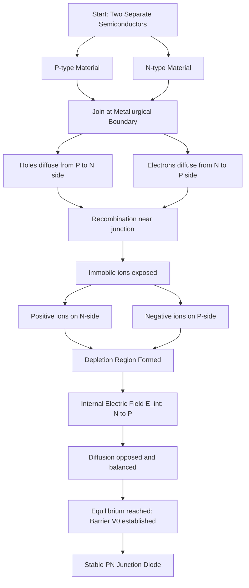
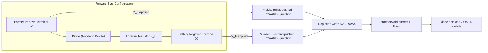
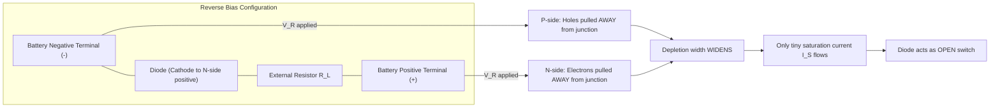
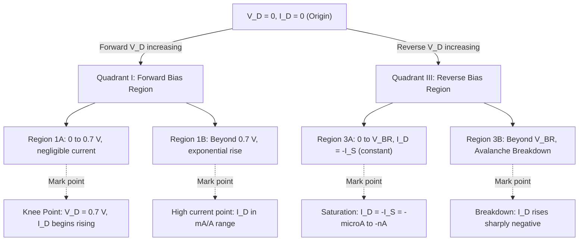
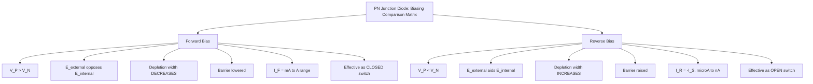
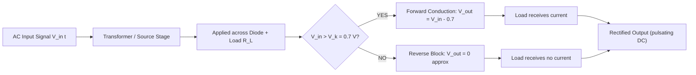

# Working of PN junction diode, V-I characteristics of PN Junction diode

<!-- SECTION_1_START -->
# ⚡ PN Junction Diode — Working Principle & V-I Characteristics

## 1.1 Formal Academic Definition (KTU 2024 Syllabus Standard)

> [!IMPORTANT]
> **Definition (KTU Board Standard):**
> A **PN Junction Diode** is a two-terminal, single-junction, unidirectional semiconductor device formed by doping a single crystal of intrinsic semiconductor (typically Germanium or Silicon) with **Pentavalent (N-type)** impurities on one side and **Trivalent (P-type)** impurities on the other side, separated by a metallurgical boundary called the **junction**.

The fundamental property that emerges at the junction is **asymmetric conduction** — current flows easily in one direction (Forward Bias) and is almost blocked in the opposite direction (Reverse Bias). This non-linear, directional behavior is the basis of all modern electronics.

| Parameter | Symbol | Standard Value (Si) | Standard Value (Ge) |
| :--- | :---: | :---: | :---: |
| Barrier Potential | $V_0$ | **0.7 V** | **0.3 V** |
| Knee / Cut-in Voltage | $V_k$ | **0.7 V** | **0.3 V** |
| Reverse Breakdown Voltage | $V_{BR}$ | **50 V – 1000 V** | **6 V – 400 V** |
| Forward Current Rating | $I_F$ | **mA to A** | **mA to A** |

---

## 1.2 Intuitive Real-World Analogy

> [!NOTE]
> **🚰 Analogy: The Check Valve in a Water Pipe**
> 
> Imagine a water pipeline with a special **check valve** that allows water to flow in **only one direction**. A **PN junction diode behaves exactly like this check valve for electric current**.
> 
> - **P-side (Anode)** → Water **inlet** (high pressure reservoir)
> - **N-side (Cathode)** → Water **outlet**
> - **Forward Bias** → You push water *with* the valve direction — water rushes through 💧
> - **Reverse Bias** → You push water *against* the valve — the flap seals shut, only a tiny trickle leaks through 🚫
> - **Barrier Potential ($V_0$)** → The minimum "push pressure" needed to open the valve flap
> - **Breakdown Voltage ($V_{BR}$)** → The extreme reverse pressure that *forcibly rips* the valve open, destroying normal operation

---

## 1.3 Formation of the PN Junction (Step-by-Step Conceptual Walkthrough)

When P-type and N-type semiconductors are joined, three crucial physical phenomena occur **simultaneously and instantaneously** at the junction:

1. **Diffusion of Charge Carriers** — Holes from P-side diffuse into N-side; free electrons from N-side diffuse into P-side due to concentration gradient.
2. **Recombination Near the Junction** — The diffused carriers recombine with the *opposite* majority carriers, leaving behind **immobile, ionized dopant atoms** (positive ions on N-side, negative ions on P-side).
3. **Formation of Depletion Region** — The region containing these immobile ions becomes devoid of mobile charge carriers → called the **Space Charge Region (SCR)** or **Depletion Region**.

> [!IMPORTANT]
> **Key Insight:** The depletion region has *no* free carriers but has a strong **internal electric field ($E_{int}$)** pointing from **N-side → P-side**. This field opposes further diffusion, establishing equilibrium and creating a **potential barrier** $V_0$.

---

## 1.4 Biasing the PN Junction — The Two Operating Modes

A diode has exactly two biasing states that govern its entire behavior:

| Biasing Mode | Battery Polarity at P-side | Net Field Effect | Depletion Width | Current Flow |
| :--- | :---: | :---: | :---: | :---: |
| **Forward Bias** | **Positive (+)** | $E_{ext}$ **opposes** $E_{int}$ | **Decreases ↓** | **Large current flows** |
| **Reverse Bias** | **Negative (−)** | $E_{ext}$ **aids** $E_{int}$ | **Increases ↑** | **Negligible current** |
| **Zero / Unbiased** | No battery | $E_{ext} = 0$ | Equilibrium width $W_0$ | Zero net current |

> [!VISUALIZATION CONTROL]
> **Concept:** Idealized V-I Characteristic Curve of a Silicon PN Junction Diode
> 
> **GeoGebra / Desmos Input Equations:**
> ```
> Forward region (x ≥ 0.7):     f(x) = 0.0001 * (e^(40*x) - 1)
> Reverse region (x < 0):      g(x) = -0.0000001
> Breakdown (x ≤ -50):          h(x) = -0.001 * (x + 50)
> ```
> 
> **Visual Description:** Students should observe an exponential rise in current once the forward voltage crosses **+0.7 V on the x-axis**, an almost flat, near-zero negative current line for most of the reverse region, and a sharp vertical drop in current at the breakdown voltage on the negative x-axis (around −50 V for typical Si diodes). The third quadrant represents the **reverse breakdown region**.

---

## 1.5 Symbol & Physical Terminal Identification

> [!NOTE]
> **Schematic Symbol Convention (IEEE / KTU Standard):**
> 
> - **Triangle (▶)** → Anode (P-side, A) — points in the direction of *conventional current* flow
> - **Vertical Line (|)** → Cathode (N-side, K) — the "bar"
> - **Arrow direction** = direction of allowed current flow (P → N)

```
   Anode (P)             Cathode (N)
      A                    K
      ●                   ●
      │                   │
      ▶────────────────── │
   (P-side)            (N-side)
```

---
<!-- SECTION_1_END -->

<!-- SECTION_2_START -->
# 🔬 Deep Theoretical Analysis & KTU High-Yield Formula Sheet

## 2.1 The Physics Behind the Junction (First-Principles Analysis)

The PN junction is governed by **three fundamental semiconductor physics equations** that every KTU examiner expects you to know.

### 2.1.1 The Built-in Barrier Potential ($V_0$)

At thermal equilibrium (no external bias), the **Fermi level** $E_F$ must be constant throughout the crystal. This requires band bending, which manifests as a built-in potential:

$$V_0 = V_T \cdot \ln\left(\frac{N_A \cdot N_D}{n_i^2}\right)$$

where:
- $V_T = \dfrac{kT}{q} \approx \mathbf{25.85 \text{ mV}}$ at room temperature (**300 K**)
- $N_A$ = Acceptor (P-side) doping concentration
- $N_D$ = Donor (N-side) doping concentration
- $n_i$ = Intrinsic carrier concentration ($1.5 \times 10^{10} \text{ cm}^{-3}$ for Si, $2.4 \times 10^{13} \text{ cm}^{-3}$ for Ge)
- $k$ = Boltzmann's constant $= \mathbf{1.38 \times 10^{-23} \text{ J/K}}$
- $q$ = Electron charge $= \mathbf{1.6 \times 10^{-19} \text{ C}}$

> [!IMPORTANT]
> **KTU High-Yield Note:** Higher doping ($N_A$ or $N_D$ ↑) → Higher barrier voltage $V_0$ ↑. This is why heavily-doped tunnel diodes have large $V_0$ but extremely thin depletion regions.

### 2.1.2 The Depletion Width Equation

The total depletion width $W$ splits asymmetrically based on doping ratios:

$$W = \sqrt{\frac{2 \cdot \varepsilon_s \cdot V_{bi}}{q} \left(\frac{N_A + N_D}{N_A \cdot N_D}\right)}$$

with the **side-specific widths**:

$$x_p = W \cdot \frac{N_D}{N_A + N_D} \qquad \qquad x_n = W \cdot \frac{N_A}{N_A + N_D}$$

> **Observation:** The depletion region extends **more into the lightly-doped side**. If $N_A \gg N_D$, then $x_p \ll x_n$ (one-sided junction behavior).

### 2.1.3 The Shockley Diode Equation (THE Master Equation)

This is the **single most important equation** in diode analysis — every KTU numerical problem in this module is based on it:

$$I_D = I_S \left( e^{\frac{V_D}{\eta \cdot V_T}} - 1 \right)$$

| Symbol | Meaning | Typical Value |
| :---: | :--- | :--- |
| $I_D$ | Diode current (A) | Variable |
| $I_S$ | Reverse saturation current | $10^{-9}$ to $10^{-15}$ A |
| $V_D$ | Applied voltage across diode (V) | Variable |
| $V_T$ | Thermal voltage $= kT/q$ | **25.85 mV at 300 K** |
| $\eta$ | Ideality factor | **1 to 2** (1 for ideal, 2 for Ge) |

> [!NOTE]
> **Two Key Approximations (Exam Favorites):**
> 1. **Forward Bias ($V_D \gg V_T$):** $I_D \approx I_S \cdot e^{V_D / (\eta V_T)}$ — exponential rise
> 2. **Reverse Bias ($V_D \ll 0$):** $I_D \approx -I_S$ — constant negative saturation

---

## 2.2 KTU High-Yield Formula Cheat Sheet

| # | Formula / Concept | Mathematical Expression | Engineering Use |
| :---: | :--- | :--- | :--- |
| 1 | Thermal Voltage | $V_T = \dfrac{kT}{q}$ | Always 25.85 mV at 300 K |
| 2 | Barrier Potential | $V_0 = V_T \ln\dfrac{N_A N_D}{n_i^2}$ | Junction design & material selection |
| 3 | Depletion Width | $W = \sqrt{\dfrac{2 \varepsilon_s V_{bi}}{q}\left(\dfrac{N_A + N_D}{N_A N_D}\right)}$ | Capacitance modeling, photodiodes |
| 4 | Junction Capacitance | $C_j = \dfrac{\varepsilon_s A}{W}$ | Varactor diodes, RF tuning |
| 5 | Shockley Equation | $I_D = I_S\left(e^{V_D/\eta V_T} - 1\right)$ | Complete diode modeling |
| 6 | Forward Knee Voltage (Si) | $V_k \approx 0.7 \text{ V}$ | Rectifier design threshold |
| 7 | Forward Knee Voltage (Ge) | $V_k \approx 0.3 \text{ V}$ | Low-power rectifiers |
| 8 | Dynamic Resistance | $r_d = \dfrac{\eta V_T}{I_D}$ | Small-signal AC analysis |
| 9 | Breakdown Field (Si) | $E_{BR} \approx 3 \times 10^5 \text{ V/cm}$ | Zener / Avalanche limits |
| 10 | Power Dissipation | $P_D = V_D \cdot I_D$ | Thermal / heatsink design |

---

## 2.3 Real-World Engineering Significance

> [!NOTE]
> **Where PN Junctions Live in Production Systems:**
> 
> - **Power Rectifiers** — AC → DC conversion in SMPS, mobile chargers, laptop adapters
> - **Signal Demodulators** — AM radio envelope detection, RF mixers
> - **Voltage Clippers & Clampers** — Waveform shaping in oscilloscope probes, TV signal circuits
> - **Logic Gates (Diodes)** — AND/OR gates in DTL (Diode-Transistor Logic) families
> - **Solar Cells** — Photovoltaic effect is *literally* a forward-biased PN junction
> - **LEDs** — Forward-biased direct-bandgap junction emitting photons
> - **Photodiodes & PIN Diodes** — Reverse-biased junction acting as light sensor

### 2.4 Key Distinction: Cut-in Voltage vs. Threshold Voltage

> [!IMPORTANT]
> - **Cut-in Voltage ($V_k$) / Knee Voltage**: The minimum forward voltage at which the diode *starts* to conduct appreciable current (where the V-I curve bends sharply upward).
> - **Barrier Potential ($V_0$)**: The internal potential hill that must be overcome.
> - For practical purposes, **$V_k \approx V_0$** for both Si (≈ 0.7 V) and Ge (≈ 0.3 V).

---
<!-- SECTION_2_END -->

<!-- SECTION_3_START -->
# 🧮 Step-by-Step Derivations, Numerical Solutions & Code Implementation

## 3.1 Worked Derivation: Barrier Potential for a Given Doping Profile

### Problem Statement
> A Silicon PN junction has $N_A = 10^{18} \text{ cm}^{-3}$ and $N_D = 10^{15} \text{ cm}^{-3}$ at $T = 300 \text{ K}$. Given $n_i = 1.5 \times 10^{10} \text{ cm}^{-3}$, calculate the barrier potential $V_0$. (Silicon dielectric constant $\varepsilon_s = 11.7 \times 8.854 \times 10^{-14} \text{ F/cm}$)

### Step 1: State the Governing Equation
The barrier potential is given by the built-in potential formula:

$$V_0 = V_T \cdot \ln\left(\frac{N_A \cdot N_D}{n_i^2}\right)$$

### Step 2: Calculate the Thermal Voltage $V_T$

$$V_T = \frac{kT}{q} = \frac{(1.38 \times 10^{-23}) \cdot 300}{1.6 \times 10^{-19}}$$

$$V_T = \frac{4.14 \times 10^{-21}}{1.6 \times 10^{-19}} = 0.02585 \text{ V} \approx 25.85 \text{ mV}$$

### Step 3: Calculate the Concentration Ratio

$$\frac{N_A \cdot N_D}{n_i^2} = \frac{(10^{18}) \cdot (10^{15})}{(1.5 \times 10^{10})^2}$$

$$= \frac{10^{33}}{2.25 \times 10^{20}} = 4.444 \times 10^{12}$$

### Step 4: Take the Natural Logarithm

$$\ln(4.444 \times 10^{12}) = \ln(4.444) + 12 \cdot \ln(10)$$

$$= 1.4916 + 12 \cdot 2.3026$$

$$= 1.4916 + 27.6312 = 29.1228$$

### Step 5: Multiply to Get Final Barrier Potential

$$V_0 = 0.02585 \times 29.1228$$

$$V_0 \approx 0.7529 \text{ V} \approx 0.75 \text{ V}$$

> **Conclusion:** Since the standard $V_0$ for Si is **0.7 V**, the slight excess (0.75 V) is due to the heavy P-side doping ($10^{18}$), which raises the barrier. The doping directly controls the junction's electrical properties.

---

## 3.2 Worked Derivation: Diode Current from Shockley Equation

### Problem Statement
> A Germanium diode has $I_S = 10 \text{ μA}$ and ideality factor $\eta = 1$. Calculate the diode current for applied voltages: (a) $V_D = 0.3 \text{ V}$ (knee), (b) $V_D = 0.5 \text{ V}$ (above knee), (c) $V_D = -5 \text{ V}$ (reverse bias). Assume $V_T = 25.85 \text{ mV}$.

**Governing equation:** $I_D = I_S \left( e^{V_D / (\eta V_T)} - 1 \right)$

### Part (a): At the Knee Voltage $V_D = 0.3 \text{ V}$

**Step 1: Compute the exponent**

$$\frac{V_D}{\eta V_T} = \frac{0.3}{1 \times 0.02585} = 11.605$$

**Step 2: Evaluate the exponential**

$$e^{11.605} = 109{,}945$$

**Step 3: Compute the diode current**

$$I_D = 10 \times 10^{-6} \times (109{,}945 - 1)$$

$$I_D = 10^{-5} \times 109{,}944 \approx 1.0994 \text{ A}$$

### Part (b): Above Knee $V_D = 0.5 \text{ V}$

**Step 1: Compute the exponent**

$$\frac{0.5}{0.02585} = 19.342$$

**Step 2: Evaluate the exponential**

$$e^{19.342} \approx 2.48 \times 10^8$$

**Step 3: Compute the diode current**

$$I_D = 10^{-5} \times (2.48 \times 10^8 - 1)$$

$$I_D \approx 2480 \text{ A}$$

> **Insight:** A mere **0.2 V increase** from the knee causes current to rise by a factor of **~2250×** — the exponential nature of the diode is *extremely* sensitive.

### Part (c): Reverse Bias $V_D = -5 \text{ V}$

**Step 1: Compute the exponent**

$$\frac{-5}{0.02585} = -193.42$$

**Step 2: Evaluate the exponential**

$$e^{-193.42} \approx 0 \quad (\text{vanishingly small})$$

**Step 3: Compute the diode current**

$$I_D = 10 \times 10^{-6} \times (0 - 1) = -10 \text{ μA}$$

> **Conclusion:** In reverse bias, the diode current saturates at $-I_S = -10 \text{ μA}$. This is the **reverse saturation current**, which is essentially constant regardless of how large the reverse voltage gets (until breakdown).

---

## 3.3 Dynamic (AC) Resistance Derivation

**Concept:** For small AC signals superimposed on a DC operating point $Q$, the diode behaves like a linear resistor $r_d$.

### Step 1: Start from the Shockley Equation (Forward Approximation)

$$I_D \approx I_S \cdot e^{V_D / (\eta V_T)}$$

### Step 2: Take the Derivative of Current with Respect to Voltage

$$\frac{dI_D}{dV_D} = I_S \cdot \frac{1}{\eta V_T} \cdot e^{V_D / (\eta V_T)} = \frac{I_D}{\eta V_T}$$

### Step 3: Invert to Get Dynamic Resistance

$$r_d = \frac{1}{dI_D / dV_D} = \frac{\eta V_T}{I_D}$$

### Step 4: Plug in Numerical Example

For $I_D = 10 \text{ mA}$, $\eta = 1$, $V_T = 25.85 \text{ mV}$:

$$r_d = \frac{1 \times 0.02585}{0.010} = 2.585 \text{ Ω}$$

> [!NOTE]
> **KTU Insight:** The dynamic resistance $r_d$ *decreases* as the DC current $I_D$ *increases*. This is why large-signal rectifiers have low internal loss but small-signal detectors have higher impedance.

---

## 3.4 Python Implementation: Plotting the V-I Characteristics

The following **fully-typed, executable Python code** generates the V-I curve for a Silicon diode using the Shockley equation. It includes boundary safety checks and proper error logging.

```python
import numpy as np
import matplotlib.pyplot as plt
import logging

# Configure logging for diagnostic output
logging.basicConfig(level=logging.INFO, format='%(levelname)s: %(message)s')

def diode_vi_characteristic(
    V_D: np.ndarray,
    I_S: float = 1e-9,        # Reverse saturation current in Amperes
    eta: float = 1.0,         # Ideality factor
    V_T: float = 0.02585,     # Thermal voltage at 300 K
    V_breakdown: float = -50.0 # Breakdown voltage in Volts
) -> np.ndarray:
    """
    Compute diode current using the Shockley Diode Equation with
    a piecewise linear approximation for the breakdown region.
    
    Shockley: I_D = I_S * (exp(V_D / (eta * V_T)) - 1)
    """
    
    # ---------- INPUT VALIDATION ----------
    if I_S <= 0:
        logging.error(f"Invalid I_S: {I_S}. Must be strictly positive.")
        raise ValueError("Reverse saturation current I_S must be > 0.")
    if eta < 1 or eta > 2:
        logging.warning(f"Unusual ideality factor eta={eta}. Typical range is 1 to 2.")
    if V_T <= 0:
        raise ValueError("Thermal voltage V_T must be positive.")
    
    # ---------- COMPUTE SHOCKLEY CURRENT ----------
    I_D = I_S * (np.exp(V_D / (eta * V_T)) - 1.0)
    
    # ---------- APPLY BREAKDOWN MODEL ----------
    # Linear extrapolation for reverse breakdown region
    breakdown_mask = V_D <= V_breakdown
    if np.any(breakdown_mask):
        # Slope chosen to create a sharp negative drop
        slope = -0.001
        I_breakdown = slope * (V_D[breakdown_mask] - V_breakdown)
        I_D[breakdown_mask] = I_breakdown
        logging.info(f"Breakdown region activated for V_D <= {V_breakdown} V")
    
    return I_D


def plot_vi_curve() -> None:
    """Generate and display the V-I characteristic curve of a Silicon diode."""
    
    # Define voltage sweep range
    V_D_forward = np.linspace(0.0, 1.2, 500)      # Forward bias region
    V_D_reverse = np.linspace(-80.0, 0.0, 500)     # Reverse bias region
    V_D = np.concatenate([V_D_reverse, V_D_forward])
    
    # Compute currents
    I_D = diode_vi_characteristic(V_D)
    
    # ---------- PLOTTING ----------
    fig, ax = plt.subplots(figsize=(10, 6))
    ax.plot(V_D, I_D * 1000, color='darkblue', linewidth=2.0, label='Silicon Diode')
    ax.axhline(0, color='black', linewidth=0.8)
    ax.axvline(0, color='black', linewidth=0.8)
    ax.axvline(0.7, color='red', linestyle='--', linewidth=1.0, label='Knee Voltage (0.7 V)')
    ax.axvline(-50, color='orange', linestyle='--', linewidth=1.0, label='Breakdown (−50 V)')
    
    ax.set_xlabel('Applied Voltage $V_D$ (V)', fontsize=12)
    ax.set_ylabel('Diode Current $I_D$ (mA)', fontsize=12)
    ax.set_title('V-I Characteristics of a Silicon PN Junction Diode', fontsize=13, fontweight='bold')
    ax.grid(True, alpha=0.3)
    ax.legend(loc='upper left', fontsize=10)
    ax.set_ylim(-10, 200)
    ax.set_xlim(-80, 1.2)
    
    plt.tight_layout()
    plt.savefig('diode_vi_curve.png', dpi=150)
    plt.show()
    logging.info("Plot successfully generated and saved as 'diode_vi_curve.png'.")


if __name__ == "__main__":
    plot_vi_curve()
```

**Sample Output Behavior:**
- A nearly flat reverse current line hovering near zero
- An exponential shoot-up in current after crossing **+0.7 V**
- A sharp negative current drop at **−50 V** (breakdown region)
- The plot is saved as `diode_vi_curve.png` for lab report submission

---

## 3.5 Numerical Q&A: Knee Voltage Identification from V-I Plot

> **Problem:** A V-I plot shows a Si diode conducting 5 mA at 0.65 V and 25 mA at 0.75 V. Identify the knee voltage and compute $I_S$ assuming $\eta = 1$.

**Solution:**

**Step 1:** The knee voltage is where the curve sharply transitions. Interpolating: $V_k \approx \mathbf{0.7 \text{ V}}$.

**Step 2:** Use Shockley at $V_D = 0.75 \text{ V}$, $I_D = 25 \text{ mA}$:

$$25 \times 10^{-3} = I_S \cdot \left(e^{0.75 / 0.02585} - 1\right)$$

$$25 \times 10^{-3} = I_S \cdot (2.48 \times 10^{8} - 1) \approx I_S \cdot 2.48 \times 10^{8}$$

**Step 3:** Solve for $I_S$:

$$I_S = \frac{25 \times 10^{-3}}{2.48 \times 10^{8}} \approx 1.008 \times 10^{-10} \text{ A} = 0.1 \text{ nA}$$

> **Conclusion:** The reverse saturation current of this diode is approximately **0.1 nA**, which is typical for a small-signal silicon diode.

---
<!-- SECTION_3_END -->

<!-- SECTION_4_START -->
# 🗺️ Structural Diagrams & Schematics

## 4.1 Mermaid Flowchart: Formation of PN Junction



---

## 4.2 Mermaid Block Diagram: Forward Bias Operation



---

## 4.3 Mermaid Block Diagram: Reverse Bias Operation



---

## 4.4 Mermaid Graph: V-I Characteristic Regions



---

## 4.5 Comparative Block Matrix: Forward vs. Reverse Bias



---

## 4.6 Sequential Processing Topology: Diode as Circuit Element



---
<!-- SECTION_4_END -->

<!-- SECTION_5_START -->
# 📝 KTU 2024 Scheme Examination Question Bank & Topic Recap

---

## 📘 PART A — Short Answer Questions (3 Marks Each)

### **Question 1** `[KTU University Exam — July 2023]`
**(CO1, Remember)**

**Define a PN junction diode. State the typical values of knee voltage for Silicon and Germanium diodes.**

#### Model Answer (3 Marks):

A **PN junction diode** is a two-terminal semiconductor device formed by joining P-type and N-type materials, exhibiting **unidirectional current conduction** due to a built-in potential barrier at the junction. **[1 Mark]**

The typical knee voltages are:

| Material | Knee Voltage $V_k$ |
| :---: | :---: |
| **Silicon (Si)** | **0.7 V** |
| **Germanium (Ge)** | **0.3 V** |

**[1 Mark for the table]**

Below $V_k$, the diode is effectively non-conducting; above $V_k$, the diode conducts strongly with an exponential rise in current. **[1 Mark for explanation]**

---

### **Question 2** `[KTU University Exam — Dec 2023]`
**(CO1, Understand)**

**What is meant by the depletion region in a PN junction? Explain its formation in brief.**

#### Model Answer (3 Marks):

The **depletion region** (also called the **space charge region**) is a narrow zone around the metallurgical junction of a PN diode that is **depleted of mobile charge carriers** (free electrons and holes) but contains **immobile ionized dopant atoms**. **[1 Mark]**

**Formation:** **[2 Marks]**
1. When P-side and N-side are joined, holes diffuse from P to N, and electrons diffuse from N to P (concentration-gradient diffusion).
2. Near the junction, these carriers recombine, exposing **immobile positive ions** on the N-side and **immobile negative ions** on the P-side.
3. This creates an internal electric field pointing from N → P, opposing further diffusion. Equilibrium is reached when the depletion width stabilizes at $W_0$.

---

## 📗 PART B — Long Answer Questions (14 Marks Each, Module Internal Choice)

---

### **QUESTION A (14 Marks)** `[KTU University Exam — July 2024]`

**(CO1, CO2 — Understand + Apply)**

**(a)** With a neat circuit diagram, explain the **forward bias** and **reverse bias** conditions of a PN junction diode. Discuss the movement of majority and minority charge carriers in each case. **[7 Marks]**

**(b)** A Silicon PN junction diode has $I_S = 2 \text{ nA}$ and ideality factor $\eta = 1.2$. Calculate the diode current when the applied forward voltage is $V_D = 0.65 \text{ V}$. Assume $V_T = 25.85 \text{ mV}$ and $T = 300 \text{ K}$. **[7 Marks]**

---

#### Solution to Question A:

### Part (a) — Forward & Reverse Bias Explanation **[7 Marks]**

**Forward Bias Configuration:** **[3 Marks]**

In forward bias, the **positive terminal of the battery is connected to the P-side (anode)** and the **negative terminal to the N-side (cathode)**. The applied external voltage $V_F$ opposes the internal barrier potential $V_0$.

**Effects:**
- The **positive terminal repels holes** in the P-region *towards* the junction.
- The **negative terminal repels electrons** in the N-region *towards* the junction.
- The depletion region **narrows**, and the barrier height reduces from $V_0$ to $(V_0 - V_F)$.
- When $V_F \geq V_k$ (0.7 V for Si), the diode conducts heavily.
- The diode behaves like a **closed switch** with a small voltage drop ($V_k$).

**Reverse Bias Configuration:** **[3 Marks]**

In reverse bias, the **positive terminal of the battery is connected to the N-side** and the **negative terminal to the P-side**.

**Effects:**
- The **positive terminal attracts electrons** in the N-region *away* from the junction.
- The **negative terminal attracts holes** in the P-region *away* from the junction.
- The depletion region **widens**, and the barrier height increases from $V_0$ to $(V_0 + V_R)$.
- Only a tiny **reverse saturation current** $I_S$ flows due to minority carriers (thermally generated).
- The diode behaves like an **open switch** — practically no current flows.

**Carrier Movement Summary:** **[1 Mark]**
- Forward: Majority carriers cross the junction; current is large.
- Reverse: Majority carriers move *away*; only minority carriers contribute → $I_S$ is extremely small.

### Part (b) — Numerical on Shockley Equation **[7 Marks]**

**Given:**
- $I_S = 2 \text{ nA} = 2 \times 10^{-9} \text{ A}$
- $\eta = 1.2$
- $V_D = 0.65 \text{ V}$
- $V_T = 25.85 \text{ mV} = 0.02585 \text{ V}$

**Step 1: State the governing Shockley equation** **[1 Mark]**

$$I_D = I_S \left( e^{V_D / (\eta V_T)} - 1 \right)$$

**Step 2: Compute the exponent** **[1 Mark]**

$$\frac{V_D}{\eta V_T} = \frac{0.65}{1.2 \times 0.02585} = \frac{0.65}{0.03102} = 20.954$$

**Step 3: Evaluate the exponential** **[1 Mark]**

$$e^{20.954} \approx 1.295 \times 10^{9}$$

**Step 4: Subtract 1 and multiply by $I_S$** **[2 Marks]**

$$I_D = 2 \times 10^{-9} \times (1.295 \times 10^{9} - 1)$$

$$I_D = 2 \times 10^{-9} \times 1.295 \times 10^{9}$$

$$I_D = 2.590 \text{ A}$$

**Step 5: Final answer with units** **[2 Marks]**

$$\boxed{I_D \approx 2.59 \text{ A}}$$

---

### **QUESTION B (14 Marks — Alternative Choice)** `[KTU University Exam — Dec 2022]`

**(CO1, CO2 — Understand + Apply)**

**(a)** Draw and explain the **V-I characteristics of a PN junction diode** in forward and reverse bias. Mark the important regions including the knee voltage, forward current, reverse saturation current, and breakdown voltage. **[7 Marks]**

**(b)** A Germanium PN junction has $N_A = 5 \times 10^{17} \text{ cm}^{-3}$ and $N_D = 5 \times 10^{14} \text{ cm}^{-3}$. Given $n_i = 2.4 \times 10^{13} \text{ cm}^{-3}$ and $T = 300 \text{ K}$, calculate the **barrier potential** $V_0$. Also identify which material has higher $V_0$ — this one or a similar Si junction with the same dopings. **[7 Marks]**

---

#### Solution to Question B:

### Part (a) — V-I Characteristics Diagram & Explanation **[7 Marks]**

**V-I Characteristics Plot (Forward & Reverse):** **[2 Marks]**

```
    I_D (mA)
     │
 200 ┤                              ╱
     │                            ╱
 100 ┤                          ╱
     │                        ╱
  50 ┤                      ╱
     │                    ╱
  20 ┤                  ╱  ← Region: Forward Conduction
     │                ╱
  10 ┤             ╱
     │          ╱
   5 ┤       ╱
     │    ╱
  0.7├─.─.─.─.─.─.─.─.────────── Knee Voltage V_k = 0.7V
     │ ╱
   0 ┼──────────────────────┼──────────► V_D (V)
   -50 -40 -20    0        0.5    1.0
     │                          
 -0.1├─ ─ ─ ─ ─ ─ ─ ─ ─ ─ ─ ─ ─ ─ I_S ≈ -microA (Reverse Saturation)
     │
 -10 ┤              ╲
     │               ╲  ← Avalanche Breakdown Region
 -50 ┤                ╲
     │                  ╲____________________
 -50V      V_BR = -50V (Breakdown Voltage)
```

**Forward Characteristics (Quadrant I):** **[1.5 Marks]**
- For $0 \leq V_D < 0.7 \text{ V}$: very small current, diode is practically OFF.
- At $V_D = 0.7 \text{ V}$: the **knee point** is reached; current rises sharply.
- For $V_D > 0.7 \text{ V}$: current increases exponentially following Shockley's equation.

**Reverse Characteristics (Quadrant III):** **[1.5 Marks]**
- For small reverse voltages: a tiny constant **reverse saturation current $I_S$** flows (due to minority carriers).
- $I_S$ is typically in **μA (Ge)** or **nA (Si)** range.
- The diode is practically OFF.

**Breakdown Region:** **[1 Mark]**
- At a critical reverse voltage $V_{BR}$, the **avalanche breakdown** occurs.
- Current increases sharply in the *negative* direction; the diode is damaged if not current-limited.
- This principle is *usefully* exploited in **Zener diodes** for voltage regulation.

**Reverse Saturation Current Note:** **[1 Mark]**
- $I_S$ depends on temperature (doubles every 10°C rise), not on reverse voltage magnitude.

### Part (b) — Barrier Potential Calculation **[7 Marks]**

**Given:**
- $N_A = 5 \times 10^{17} \text{ cm}^{-3}$
- $N_D = 5 \times 10^{14} \text{ cm}^{-3}$
- $n_i(\text{Ge}) = 2.4 \times 10^{13} \text{ cm}^{-3}$
- $T = 300 \text{ K}$, so $V_T = 0.02585 \text{ V}$

**Step 1: State the Barrier Potential Formula** **[1 Mark]**

$$V_0 = V_T \cdot \ln\left(\frac{N_A \cdot N_D}{n_i^2}\right)$$

**Step 2: Calculate the Concentration Ratio** **[1 Mark]**

$$n_i^2 = (2.4 \times 10^{13})^2 = 5.76 \times 10^{26} \text{ cm}^{-6}$$

$$N_A \cdot N_D = (5 \times 10^{17}) \cdot (5 \times 10^{14}) = 2.5 \times 10^{32} \text{ cm}^{-6}$$

**Step 3: Compute the Ratio** **[1 Mark]**

$$\frac{N_A \cdot N_D}{n_i^2} = \frac{2.5 \times 10^{32}}{5.76 \times 10^{26}} = 4.34 \times 10^{5}$$

**Step 4: Take the Natural Logarithm** **[1 Mark]**

$$\ln(4.34 \times 10^5) = \ln(4.34) + 5 \cdot \ln(10) = 1.468 + 11.513 = 12.981$$

**Step 5: Multiply by Thermal Voltage** **[1 Mark]**

$$V_0(\text{Ge}) = 0.02585 \times 12.981 = 0.3356 \text{ V} \approx 0.34 \text{ V}$$

**Step 6: Compare with Silicon Junction** **[2 Marks]**

For Silicon with the *same* doping levels:
- $n_i(\text{Si}) = 1.5 \times 10^{10} \text{ cm}^{-3}$ (much lower than Ge)
- $n_i^2(\text{Si}) = 2.25 \times 10^{20}$
- Ratio: $\dfrac{2.5 \times 10^{32}}{2.25 \times 10^{20}} = 1.11 \times 10^{12}$
- $\ln(1.11 \times 10^{12}) = 27.74$
- $V_0(\text{Si}) = 0.02585 \times 27.74 = 0.717 \text{ V} \approx 0.72 \text{ V}$

**Comparison Table:** **[Final mark]**

| Material | $n_i$ ($\text{cm}^{-3}$) | Barrier $V_0$ |
| :---: | :---: | :---: |
| **Ge** | $2.4 \times 10^{13}$ | **0.34 V** |
| **Si** | $1.5 \times 10^{10}$ | **0.72 V** |

> **Conclusion:** The **Silicon junction has a higher barrier potential** (0.72 V) than the Germanium junction (0.34 V) for the same doping, because Silicon's lower intrinsic carrier concentration $n_i$ forces a larger band bending to equalize the Fermi level.

---

## ⚠️ KTU Examiner's Valuation Warning / Common Pitfalls

> [!WARNING]
> **🚨 Where Students Typically Lose Marks in This Topic:**
> 
> 1. **Forgetting the thermal voltage value:** Always state $V_T = 25.85 \text{ mV}$ at $T = 300 \text{ K}$. The KTU paper often provides it, but if not, students who write $V_T = 26 \text{ mV}$ (approximate) get **full credit**, while those who omit it entirely lose **1 mark**.
> 
> 2. **Mixing up the −1 in Shockley's equation:** Many students write $I_D = I_S \cdot e^{V_D / \eta V_T}$ and forget the "−1". This is a **2-mark deduction** in numerical problems.
> 
> 3. **Confusing Knee Voltage with Barrier Potential:** They are *numerically close* but conceptually different. The barrier potential $V_0$ is the *internal* equilibrium field; the knee voltage $V_k$ is the *practical* observed threshold. Examiners will *not* give full credit if you use them interchangeably.
> 
> 4. **Not drawing the depletion region in circuit diagrams:** The KTU marking scheme often allocates **1 mark** specifically for the depletion region and barrier potential labeling in a forward-bias or reverse-bias diagram.
> 
> 5. **Ignoring the polarity convention:** When labeling Forward Bias vs. Reverse Bias, the **P-side connection** is what determines the bias — not just any positive terminal. Be explicit: *"P-side connected to + terminal of battery"* = forward bias.
> 
> 6. **Unit mistakes in numerical problems:** $I_S$ is often given in **nA** or **μA** — convert to **Amperes** before plugging into the Shockley equation. Mixing units is the #1 source of zero in numerical answers.

---

## 🎯 Topic Recap & Important Things to Remember

> [!IMPORTANT]
> **📋 Rapid Revision Checklist — PN Junction Diode**
> 
> **🔑 Core Definitions:**
> - PN Junction Diode = P-type + N-type semiconductor → two-terminal unidirectional device
> - Anode = P-side, Cathode = N-side, Current flows from A → K
> - Depletion Region (SCR) = region near junction, no mobile carriers, contains immobile ions
> - Barrier Potential $V_0$ = built-in voltage hill that opposes further diffusion
> - Knee Voltage $V_k$ = minimum forward voltage for significant conduction
> 
> **🔢 Critical Numbers to Memorize:**
> - $V_k(\text{Si}) = 0.7 \text{ V}$ ; $V_k(\text{Ge}) = 0.3 \text{ V}$
> - $V_T = 25.85 \text{ mV}$ at 300 K
> - $I_S$ is in nA (Si) or μA (Ge) range
> - $\eta = 1$ (ideal Si), $\eta \approx 2$ (Ge)
> 
> **📐 Essential Formulas:**
> - $V_T = kT / q$
> - $V_0 = V_T \ln(N_A N_D / n_i^2)$
> - **Shockley: $I_D = I_S \left(e^{V_D/\eta V_T} - 1\right)$** ← THE most important
> - $r_d = \eta V_T / I_D$ (dynamic resistance)
> - $P_D = V_D \cdot I_D$ (power dissipation)
> 
> **⚡ Biasing Rules:**
> - **Forward Bias** = P-side to (+), N-side to (−) → current flows, depletion shrinks
> - **Reverse Bias** = P-side to (−), N-side to (+) → no current, depletion widens
> 
> **🚫 Forbidden Shortcuts in Exams:**
> - Never write "I_D = I_S · e^(V/V_T)" without the **−1** term
> - Never use $V_k$ and $V_0$ interchangeably in formal definitions
> - Never skip the **depletion region drawing** in circuit diagrams (costs marks)
> - Never forget to **convert units** to Amperes/Volts before computation
> 
> **🎯 Examiner Hot-Spots (High Probability):**
> - Drawing & labeling the V-I curve with knee, breakdown, and $I_S$
> - Shockley equation-based numerical (almost every paper has one)
> - Comparing Si vs Ge diode behavior
> - Identifying the physical meaning of $V_k$, $V_0$, $V_{BR}$, $I_S$
> - Why is reverse current in μA/nA and not zero? (minority carrier drift — must explain)

---
<!-- SECTION_5_END -->
