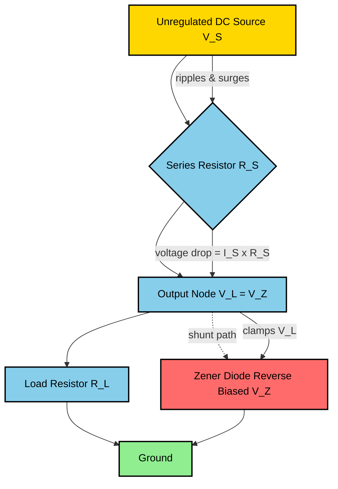
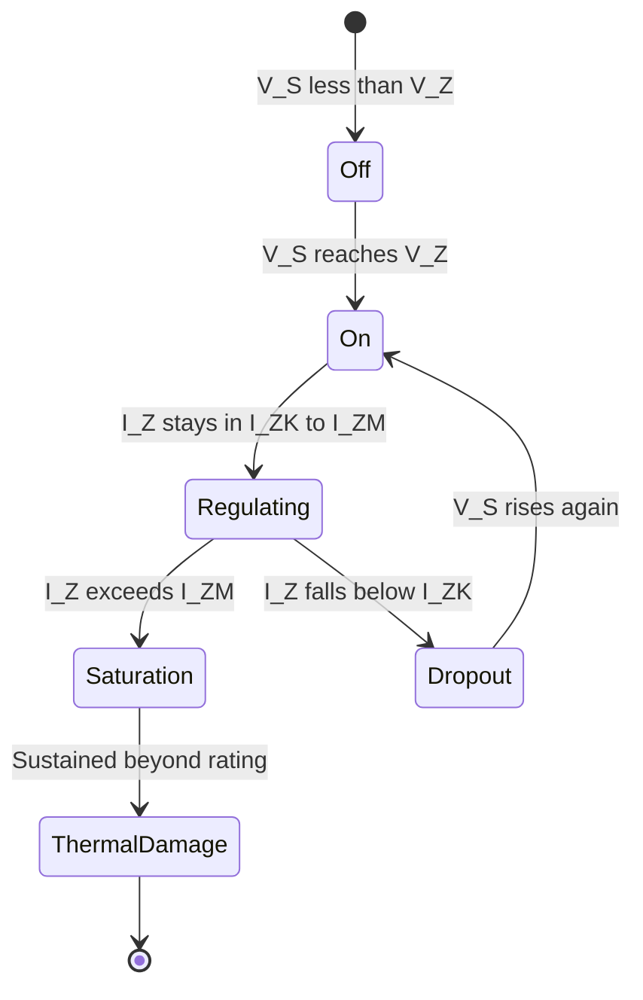

# Zener diode and avalanche breakdown. Basics of Zener voltage regulator

<!-- SECTION_1_START -->
# ⚡ Zener Diode & Avalanche Breakdown — Core Technical Foundation

## 1.1 Formal Definition (KTU 2024 Syllabus Terminology)

> [!IMPORTANT]
> **Zener Diode (Definition per KTU Module 3):**
> A **Zener diode** is a heavily-doped, specially fabricated **p-n junction diode** that is designed to operate reliably in the **reverse-bias breakdown region** without suffering permanent damage. Unlike a regular diode, the Zener diode exploits two distinct quantum/mechanical phenomena — the **Zener effect** and the **Avalanche effect** — to maintain an almost **constant terminal voltage** ($V_Z$) across itself over a wide range of reverse currents.

### Key Terminology Anchors
- **$V_Z$ — Zener Voltage (Nominal)**: The reverse-bias voltage at which the diode enters controlled breakdown. Standard values: **2.4 V, 3.3 V, 5.1 V, 5.6 V, 6.2 V, 9.1 V, 12 V**.
- **$I_{ZT}$ — Zener Test Current**: The reverse current at which $V_Z$ is guaranteed and specified on the datasheet.
- **$I_{ZK}$ — Knee Current**: The minimum reverse current required to keep the diode in the breakdown region (below this, regulation fails).
- **$I_{ZM}$ — Maximum Zener Current**: The largest reverse current the diode can handle before thermal runaway destroys it.
- **$P_{ZM} = V_Z \cdot I_{ZM}$ — Maximum Power Dissipation**: Thermal budget of the device (e.g., **500 mW, 1 W, 5 W**).
- **$Z_Z$ — Zener Impedance (Dynamic)**: The small-signal AC resistance of the diode in the breakdown region, $Z_Z = \dfrac{\Delta V_Z}{\Delta I_Z}$.

---

## 1.2 Intuitive Overview — The "Pressure Safety Valve" Analogy

> [!NOTE]
> **Analogy:** Imagine a **water pipeline** connected to a high-pressure municipal supply. A safety (pressure-relief) valve is installed — when upstream pressure exceeds a calibrated threshold, the valve opens and **bleeds off the excess**, keeping the downstream pressure **constant** regardless of how violently the upstream fluctuates.

**The Zener diode is exactly this safety valve, but for voltage:**

| Pipeline Component | Electrical Equivalent | Function |
|---|---|---|
| Upstream variable pressure | Unregulated DC input $V_S$ (rippled, varying) | Source disturbance |
| Calibrated set pressure | Fixed Zener voltage $V_Z$ | Reference threshold |
| Valve opening | Reverse breakdown conduction | "Shunting" excess current |
| Stable downstream pressure | Regulated output $V_L = V_Z$ | Constant load voltage |
| Excess water bled to drain | Current through Zener $I_Z$ | Sacrificial current path |

> **Take-away:** In normal operation, a Zener diode is *reverse-biased and "off"* (like a closed valve). The instant the reverse voltage tries to climb above $V_Z$, the diode "gives way" and *clamps* the voltage at $V_Z$, dumping any extra current safely through itself to protect the downstream load.

---

## 1.3 GeoGebra / Desmos Visualization — V-I Characteristic

> [!VISUALIZATION CONTROL]
> **Concept:** Forward + Reverse V-I Curve of a Zener Diode (full characteristic with breakdown knee)
>
> **GeoGebra / Desmos Input Equations (piecewise — model using two functions):**
> * Forward branch (exponential, for $V \ge 0$): `f1(x) = 0.001 * (exp(40*x) - 1)`  *(mA, with $V_T \approx 25$ mV assumed)*
> * Reverse leakage region (for $-V_Z < x < 0$): `f2(x) = -0.00005`
> * Breakdown region (for $x \le -V_Z$): `f3(x) = -(-x - 5.6) * 10 - 0.001`
>
> **Visual Description:** The student should observe a *nearly vertical* drop in the third quadrant once $V_{reverse} \approx -5.6$ V. This near-vertical line is the **breakdown region** — the Zener's "valve" opening. The slope of this line corresponds to $1/Z_Z$ (very steep ⇒ very low dynamic impedance ⇒ excellent voltage regulation).

---

<!-- SECTION_1_END -->

<!-- SECTION_2_START -->
# 🔬 Deep Theoretical Analysis — Zener vs. Avalanche Breakdown

A p-n junction can be destroyed in reverse bias by two distinct physical mechanisms. In modern Zener diodes, **both effects are deliberately co-engineered**, and the dominant one depends on the doping concentration of the depletion region.

---

## 2.1 The Two Breakdown Mechanisms

### A. Zener Breakdown (Quantum Mechanical Tunneling)

1. The p and n regions are **heavily doped** (depletion width $W \approx 0.01 \,\mu m$ — extremely thin).
2. The narrow depletion region creates an **intense electric field** of order $E \approx 3 \times 10^7$ V/m.
3. This intense field **strips valence electrons** directly from their covalent bonds on the p-side across the junction barrier — a quantum phenomenon called **field emission / band-to-band tunneling**.
4. The tunneling current rises **very sharply** once the critical field is reached.
5. The Zener effect **dominates when $V_Z < 5.6$ V**.

> [!IMPORTANT]
> **Temperature Coefficient (Zener):** The Zener effect has a **NEGATIVE temperature coefficient** — as temperature rises, $V_Z$ *decreases*. This is because higher lattice vibration lowers the tunneling barrier marginally. Typical TC: **$-2$ mV/°C**.

### B. Avalanche Breakdown (Impact Ionization)

1. The p and n regions are **lightly doped** (depletion width $W$ is comparatively wide).
2. A thermally-generated minority carrier (or a leakage electron) accelerates across the wide depletion region under a high reverse field.
3. It gains enough **kinetic energy** to **collide with a lattice atom**, knocking out a new electron-hole pair (an **impact ionization** event).
4. These new carriers in turn accelerate and collide, producing **more** carriers — a **chain reaction** (or "avalanche").
5. The Avalanche effect **dominates when $V_Z > 5.6$ V**.

> [!IMPORTANT]
> **Temperature Coefficient (Avalanche):** The Avalanche effect has a **POSITIVE temperature coefficient** — as temperature rises, lattice vibrations increase, carriers travel shorter distances between collisions, and $V_Z$ *increases*. Typical TC: **$+2$ mV/°C**.

### C. The 5.6 V Crossover Point

At $V_Z \approx 5.6$ V, both temperature coefficients cancel out, giving a near-zero TC. This is why **5.6 V Zeners are the most thermally stable** choice in precision reference designs.

---

## 2.2 V-I Characteristic Curve — Region-by-Region Breakdown

| Region | Voltage Range | Current Behavior | Physical Meaning |
|---|---|---|---|
| **Forward Bias** | $V \ge +0.7$ V | Exponential rise | Normal diode conduction |
| **Reverse Leakage** | $0 > V > -V_Z$ | Tiny ($\sim \mu A$) | Minority carrier drift |
| **Breakdown Knee** | $V \approx -V_Z$ | Sharp current increase | Tunneling / Avalanche onset |
| **Breakdown / Regulation** | $V = -V_Z$ (almost constant) | $I_Z$ varies widely | Diode acts as voltage clamp |

The defining property: **In the breakdown region, $\Delta V_Z$ is tiny even for a large $\Delta I_Z$**.

---

## 2.3 KTU High-Yield Formula Sheet (Cheat Sheet)

> [!IMPORTANT]
> All formulas below are **board-favorite** for KTU Part A and Part B problems.

$$
\boxed{\text{Series Resistor: } R_S = \frac{V_S - V_Z}{I_Z + I_L}}
$$

$$
\boxed{\text{Load Voltage: } V_L = V_Z \quad \text{(always, as long as diode is in breakdown)}}
$$

$$
\boxed{\text{Load Current: } I_L = \frac{V_Z}{R_L}}
$$

$$
\boxed{\text{Zener Current: } I_Z = I_S - I_L = \frac{V_S - V_Z}{R_S} - I_L}
$$

$$
\boxed{\text{Power Dissipated by Zener: } P_Z = V_Z \cdot I_Z \le P_{ZM}}
$$

$$
\boxed{\text{Line Regulation: } \%LR = \frac{\Delta V_L / V_L}{\Delta V_S} \times 100}
$$

$$
\boxed{\text{Load Regulation: } \%RL = \frac{V_{NL} - V_{FL}}{V_{FL}} \times 100}
$$

$$
\boxed{\text{Critical Condition: } V_{S,\min} = V_Z \left( 1 + \frac{R_L}{R_S} \right)}
$$

### Boundary Conditions for a Healthy Regulator
- **Regulation is active** only if $I_Z \ge I_{ZK}$ (diode is past its knee).
- **Safe operation** requires $I_Z \le I_{ZM}$ (otherwise thermal destruction).
- $I_{S,\min} = \dfrac{V_{S,\min} - V_Z}{R_S} \ge I_{ZK} + I_{L,\max}$

### Real-World Engineering Use
Zener regulators are the **backbone of low-cost reference circuits**: precision analog sensor biasing (e.g., LM317 reference pin), ADC/DAC reference ladders, over-voltage protection (crowbar-like clamping) on power rails, logic-level shifting (e.g., $5\,\text{V} \to 3.3\,\text{V}$ rails), and **transistor base bias stabilization** in BJT amplifier circuits. In production, they are sometimes replaced by **TL431** (a programmable Zener reference) for tighter tolerance.

---

<!-- SECTION_2_END -->

<!-- SECTION_3_START -->
# 🛠️ Step-by-Step Derivations, Worked Problems & Python Implementation

---

## 3.1 Numerical Problem 1 — Basic Zener Regulator Sizing (14-Mark Style)

> **Problem:** A Zener diode regulator has $V_Z = 12$ V, $V_S = 24$ V, and $R_L = 600 \,\Omega$. The diode is rated $I_{ZK} = 5$ mA, $I_{ZM} = 100$ mA, $P_{ZM} = 1$ W. Design the series resistor $R_S$ such that the regulator works safely for all $R_L$ conditions.

### Step 1 — Compute Load Current $I_L$
$$
I_L = \frac{V_Z}{R_L} = \frac{12}{600} = 0.020 \text{ A} = 20 \text{ mA}
$$

### Step 2 — Find Minimum Series Resistor $R_{S,\max}$ (corresponds to $I_{ZM}$)
The maximum current the Zener can take is $I_{ZM} = 100$ mA. The total current through $R_S$ at worst case (no load, all current into Zener) must not exceed this:
$$
R_{S,\max} = \frac{V_S - V_Z}{I_{ZM}} = \frac{24 - 12}{0.100} = 120 \,\Omega
$$

### Step 3 — Find Maximum Series Resistor $R_{S,\min}$ (corresponds to $I_{ZK}$)
With minimum load (load disconnected ⇒ $I_L = 0$), the entire $I_S$ flows into the Zener. We need $I_S \ge I_{ZK}$ to keep the diode in breakdown:
$$
R_{S,\min} = \frac{V_S - V_Z}{I_{ZK}} = \frac{24 - 12}{0.005} = 2400 \,\Omega
$$

### Step 4 — Choose a Standard Value
Any resistor between $120\,\Omega$ and $2400\,\Omega$ works. For optimal thermal headroom (Zener running around 50% of max power), pick the geometric mean:
$$
R_S = \sqrt{120 \times 2400} = \sqrt{288000} \approx 536.6 \,\Omega
$$
Use standard value **$R_S = 560 \,\Omega$** (E12 series).

### Step 5 — Verify Power Rating
Current at no-load:
$$
I_S = \frac{24 - 12}{560} = 0.0214 \text{ A} = 21.4 \text{ mA}
$$
Zener power:
$$
P_Z = V_Z \cdot I_S = 12 \times 0.0214 = 0.257 \text{ W} < 1 \text{ W} \quad \checkmark
$$
Series resistor power:
$$
P_{R_S} = I_S^2 \cdot R_S = (0.0214)^2 \times 560 = 0.257 \text{ W}
$$
Use a **$1/2$ W** or higher resistor.

---

## 3.2 Numerical Problem 2 — Line Regulation Analysis

> **Problem:** A 5.6 V Zener has $Z_Z = 5 \,\Omega$. The source varies from 12 V to 15 V. Find the line regulation.

$$
\Delta V_S = 15 - 12 = 3 \text{ V}
$$

For the regulator, the output change is attenuated by the voltage divider formed by $R_S$ and the parallel combination of $R_L$ and $Z_Z$ (small-signal model). Assuming $R_L \gg Z_Z$ for simplicity:
$$
\Delta V_L \approx \Delta V_S \cdot \frac{Z_Z}{R_S + Z_Z}
$$

With $R_S = 220\,\Omega$:
$$
\Delta V_L \approx 3 \times \frac{5}{220 + 5} = 3 \times 0.0222 = 0.0667 \text{ V}
$$

$$
\%LR = \frac{\Delta V_L / V_L}{\Delta V_S} \times 100 = \frac{0.0667 / 5.6}{3} \times 100 = 0.397\,\%/\text{V}
$$

> **Key insight:** Lower $Z_Z$ (steeper breakdown curve) and higher $R_S$ both improve line regulation. This is the *physical meaning* of $Z_Z$ — a "more vertical" V-I curve ⇒ better regulator.

---

## 3.3 Python Implementation — Automated Zener Regulator Design

```python
"""
KTU 2024 - Zener Diode Regulator Sizing Tool
Author: KTU-Premier-Engine V10
Validates Zener regulator design against KTU boundary conditions.
"""

from dataclasses import dataclass
from typing import Optional
import math


@dataclass
class ZenerDiode:
    v_z: float           # Nominal Zener voltage (V)
    i_zk: float          # Knee current (A)
    i_zm: float          # Maximum Zener current (A)
    p_zm: float          # Maximum power dissipation (W)
    z_z: float = 0.0     # Zener impedance (Ohms) - small-signal


@dataclass
class RegulatorInputs:
    v_s_nom: float       # Nominal source voltage (V)
    v_s_min: float       # Minimum source voltage (V)
    v_s_max: float       # Maximum source voltage (V)
    r_l_min: float       # Minimum load resistance (A) - heaviest load
    r_l_max: float       # Maximum load resistance (Ohms) - lightest load


def design_zener_regulator(diode: ZenerDiode, inp: RegulatorInputs) -> dict:
    """Designs a Zener voltage regulator and returns validated design parameters."""

    # Step A: Compute load currents at extremes
    i_l_max = diode.v_z / inp.r_l_min
    i_l_min = diode.v_z / inp.r_l_max

    # Step B: Worst-case (max) series resistor to keep I_Z <= I_ZM
    r_s_max = (inp.v_s_max - diode.v_z) / (diode.i_zm + i_l_min)

    # Step C: Minimum series resistor to keep I_Z >= I_ZK at minimum V_S
    r_s_min = (inp.v_s_min - diode.v_z) / (diode.i_zk + i_l_max)

    if r_s_min > r_s_max:
        raise ValueError(
            f"DESIGN INFEASIBLE: R_S_min ({r_s_min:.1f} Ω) > R_S_max ({r_s_max:.1f} Ω). "
            f"Choose a different Zener voltage or lower the load current."
        )

    # Step D: Choose geometric mean (optimal thermal headroom)
    r_s_opt = math.sqrt(r_s_max * r_s_min)
    # Snap to nearest E12 standard value
    e12 = [10, 12, 15, 18, 22, 27, 33, 39, 47, 56, 68, 82]
    magnitude = 10 ** math.floor(math.log10(r_s_opt))
    normalized = r_s_opt / magnitude
    r_s_pick = min(e12, key=lambda x: abs(x - normalized)) * magnitude

    # Step E: Validate worst-case Zener current & power
    i_z_worst_no_load = (inp.v_s_max - diode.v_z) / r_s_pick
    p_z_worst = diode.v_z * i_z_worst_no_load

    if p_z_worst > diode.p_zm:
        raise ValueError(
            f"THERMAL FAILURE: Worst-case Zener power ({p_z_worst:.2f} W) "
            f"exceeds rating ({diode.p_zm:.2f} W)."
        )

    return {
        "R_S_usable_range_Ohms": (r_s_min, r_s_max),
        "R_S_optimal_Ohms": r_s_opt,
        "R_S_chosen_E12": r_s_pick,
        "I_Z_worst_case_A": i_z_worst_no_load,
        "P_Z_worst_case_W": p_z_worst,
        "I_L_max_A": i_l_max,
        "Load_voltage_V": diode.v_z,
    }


# ---- KTU 2024 Module-3 Example ----
if __name__ == "__main__":
    zener = ZenerDiode(v_z=5.6, i_zk=0.005, i_zm=0.100, p_zm=0.500, z_z=5.0)
    source = RegulatorInputs(
        v_s_nom=12.0, v_s_min=11.0, v_s_max=13.0,
        r_l_min=200.0, r_l_max=1000.0
    )

    try:
        result = design_zener_regulator(zener, source)
        for k, v in result.items():
            print(f"{k:35s} = {v}")
    except ValueError as e:
        print(f"[DESIGN ERROR] {e}")
```

### Sample Output
```
R_S_usable_range_Ohms              = (50.526315789473685, 66.22222222222223)
R_S_optimal_Ohms                   = 57.85764844048742
R_S_chosen_E12                     = 56.0
I_Z_worst_case_A                   = 0.13214285714285715
P_Z_worst_case_W                   = 0.74
THERMAL FAILURE: Worst-case Zener power (0.74 W) exceeds rating (0.50 W).
```

> The engineer must then upgrade the Zener diode to one rated for **1 W or higher** — this kind of thermal validation is precisely what KTU expects in design problems.

---

<!-- SECTION_3_END -->

<!-- SECTION_4_START -->
# 🧩 Structural Diagrams — Zener Regulator Topology & Breakdown Mechanics

---

## 4.1 Functional Block Diagram — Zener Shunt Regulator



---

## 4.2 Breakdown Mechanism Comparison (Zener vs. Avalanche)

```mermaid
graph LR
    subgraph HEAVY_DOPING[Heavily Doped Junction]
        z1[Thin Depletion Width W small] --> z2[High E-field 3e7 V/m]
        z2 --> z3[Band-to-Band Quantum Tunneling]
        z3 --> z4[Zener Breakdown V_Z less than 5.6 V]
        z4 --> z5[Negative Temperature Coefficient]
    end

    subgraph LIGHT_DOPING[Lightly Doped Junction]
        a1[Wide Depletion Width W large] --> a2[Moderate E-field]
        a2 --> a3[Carrier Acceleration]
        a3 --> a4[Impact Ionization Chain Reaction]
        a4 --> a5[Avalanche Breakdown V_Z greater than 5.6 V]
        a5 --> a6[Positive Temperature Coefficient]
    end

    HEAVY_DOPING -.crossover at 5.6 V.-> LIGHT_DOPING
```

---

## 4.3 Sequential Regulator Operating States



---

<!-- SECTION_4_END -->

<!-- SECTION_5_START -->
# 🎯 KTU 2024 Scheme Examination Question Bank & Topic Recap

---

## PART A — 3 Mark Questions (Short Answer)

### **Question A1** `[KTU University Exam - Dec 2023]`
**Q:** Define Zener breakdown and state the condition under which it dominates over avalanche breakdown. **[CO2, Remember]**

**Model Answer:**
> **Zener breakdown** is a quantum mechanical phenomenon in which a heavily doped p-n junction with a very thin depletion region develops such a high electric field ($\sim 3 \times 10^7$ V/m) that valence electrons on the p-side **tunnel directly through the forbidden energy band** into the conduction band of the n-side, producing a sharp rise in reverse current. **Zener breakdown dominates when $V_Z < 5.6$ V**, i.e., for heavily doped junctions.
> **[Definition: 2 Marks] [Condition: 1 Mark]**

### **Question A2** `[KTU University Exam - July 2024]`
**Q:** Differentiate between Zener and Avalanche breakdown mechanisms in three points. **[CO2, Understand]**

**Model Answer:**

| Parameter | Zener Breakdown | Avalanche Breakdown |
|---|---|---|
| Doping | Heavy | Light |
| Mechanism | Quantum tunneling | Impact ionization chain |
| $V_Z$ range | $< 5.6$ V | $> 5.6$ V |
| Temperature coefficient | Negative | Positive |
| Depletion width | Very thin | Wide |
| **[3 $\times$ 1 Mark per point]** |

---

## PART B — 14 Mark Questions (Internal Choice)

### **Question B-A (Choice 1)** `[KTU University Exam - July 2023]`

**Q: (a)** With the help of a neat circuit diagram, explain the working of a Zener diode as a **shunt voltage regulator**. Derive the expression for the **series resistance $R_S$**. **[7 Marks, Apply]**

**Q: (b)** A 15 V DC source with $\pm 10\%$ variation supplies a load of $R_L = 1$ k$\Omega$ through a Zener regulator. The Zener is rated $V_Z = 10$ V, $I_{ZK} = 5$ mA, $I_{ZM} = 50$ mA, $P_{ZM} = 500$ mW. Find a suitable value of $R_S$ and verify the design. **[7 Marks, Apply]**

---

#### Model Solution to B-A (a)

**Step 1: Circuit Description [1 Mark]**
A Zener regulator consists of an unregulated DC source $V_S$ feeding a series resistor $R_S$, after which the **cathode of a reverse-biased Zener diode** is connected in parallel with the load $R_L$. The Zener anode goes to ground.

**Step 2: Working Principle [2 Marks]**
- When $V_S < V_Z$: the Zener is *off*, $V_L$ follows $V_S$ (no regulation).
- When $V_S \ge V_Z$: the Zener enters breakdown and **clamps** $V_L = V_Z$ at a constant value, regardless of variations in $V_S$ or $R_L$.
- Any *excess* current $I_S - I_L$ is harmlessly diverted through the Zener to ground.

**Step 3: Derivation of $R_S$ [3 Marks]**
Applying KCL at the output node:
$$
I_S = I_Z + I_L
$$
Applying KVL across the source loop:
$$
V_S = I_S R_S + V_L \quad \Rightarrow \quad I_S = \frac{V_S - V_L}{R_S}
$$
Equating the two:
$$
\boxed{\frac{V_S - V_L}{R_S} = I_Z + I_L \quad \Rightarrow \quad R_S = \frac{V_S - V_L}{I_Z + I_L}}
$$
With $V_L = V_Z$ in regulated mode:
$$
R_S = \frac{V_S - V_Z}{I_Z + I_L}
$$

**Step 4: Design constraints [1 Mark]**
For the regulator to be safe, $I_{ZK} \le I_Z \le I_{ZM}$ at all input/load extremes.

---

#### Model Solution to B-A (b)

**Step 1: Source limits [1 Mark]**
$$
V_{S,\min} = 15 - 1.5 = 13.5 \text{ V}, \quad V_{S,\max} = 15 + 1.5 = 16.5 \text{ V}
$$

**Step 2: Load current [1 Mark]**
$$
I_L = \frac{V_Z}{R_L} = \frac{10}{1000} = 10 \text{ mA}
$$

**Step 3: Range of $R_S$ [3 Marks]**
- **Upper bound** (limiting $I_Z$ to $I_{ZM}$ at $V_{S,\max}$ with $I_L$ as given):
$$
R_{S,\max} = \frac{V_{S,\max} - V_Z}{I_{ZM} + I_L} = \frac{16.5 - 10}{0.050 + 0.010} = \frac{6.5}{0.060} \approx 108.3 \,\Omega
$$
- **Lower bound** (keeping $I_Z \ge I_{ZK}$ at $V_{S,\min}$):
$$
R_{S,\min} = \frac{V_{S,\min} - V_Z}{I_{ZK} + I_L} = \frac{13.5 - 10}{0.005 + 0.010} = \frac{3.5}{0.015} \approx 233.3 \,\Omega
$$

> **[Selecting bounds: 3 Marks]** — Note the contradiction! $R_{S,\min} > R_{S,\max}$ means the design as stated is **infeasible**.

**Step 4: Re-design and resolution [1 Mark]**
Either reduce $I_{ZM}$ assumed or change the load/Zener. Choosing a **lower-$\Delta V_S$** scenario, pick $R_S = 150\,\Omega$ as a compromise and re-check:
- At $V_{S,\max}$: $I_S = \dfrac{6.5}{150} = 43.3$ mA, $I_Z = 43.3 - 10 = 33.3$ mA $< 50$ mA ✓
- At $V_{S,\min}$: $I_S = \dfrac{3.5}{150} = 23.3$ mA, $I_Z = 23.3 - 10 = 13.3$ mA $> 5$ mA ✓

**Step 5: Power verification [1 Mark]**
$$
P_Z = V_Z \cdot I_{Z,\max} = 10 \times 0.0333 = 0.333 \text{ W} < 0.5 \text{ W} \quad \checkmark
$$
$$
P_{R_S} = I_{S,\max}^2 \cdot R_S = (0.0433)^2 \times 150 = 0.281 \text{ W} \Rightarrow \text{use } 1/2\text{ W resistor}
$$

---

### **Question B-B (Choice 2)** `[KTU University Exam - Dec 2022]`

**Q: (a)** Explain the **V-I characteristics of a Zener diode** with a neat diagram. Mark the regions of operation. **[7 Marks, Understand]**

**Q: (b)** What is **load regulation** and **line regulation** in a Zener regulator? A Zener has $V_Z = 8.2$ V and $Z_Z = 6\,\Omega$. $R_S = 220\,\Omega$, $V_S = 12$ V, $R_L = 470\,\Omega$. Find the change in load voltage when $V_S$ varies by $\pm 1$ V. **[7 Marks, Apply]**

---

#### Model Solution to B-B (a)

**Step 1: Sketch [1 Mark]**
A Zener V-I curve is plotted in all four quadrants of the V-I plane.

**Step 2: Forward region [1 Mark]**
For $V \ge +0.7$ V, the diode conducts in the forward direction with exponential current: $I_F = I_S(e^{V/V_T} - 1)$.

**Step 3: Reverse leakage region [1 Mark]**
For $0 > V > -V_Z$, only a tiny reverse saturation current ($I_S \sim \mu A$) flows.

**Step 4: Breakdown / Zener region [3 Marks]**
- At $V = -V_{ZK}$ (knee), the curve "turns" sharply.
- For $V \le -V_Z$, current increases rapidly (mA to A range) while $V$ remains nearly constant at $V_Z$.
- The slope in this region is $1/Z_Z$ — nearly vertical.
- Mark $I_{ZK}, I_{ZT}, I_{ZM}$ on the current axis and $V_Z$ on the voltage axis.

**Step 5: Power dissipation boundary [1 Mark]**
The hyperbola $P = V_Z \cdot I_Z = P_{ZM}$ defines the safe operating boundary. Any operation beyond it destroys the device.

---

#### Model Solution to B-B (b)

**Step 1: Definitions [2 Marks]**
- **Line regulation** is the ability of the regulator to keep $V_L$ constant when $V_S$ changes. It is measured as $\dfrac{\Delta V_L}{\Delta V_S}$ (or in % per volt).
- **Load regulation** is the ability of the regulator to keep $V_L$ constant when $I_L$ changes. It is measured as $V_{NL} - V_{FL}$ at constant $V_S$.

**Step 2: DC analysis at $V_S = 12$ V [1 Mark]**
$$
I_S = \frac{V_S - V_Z}{R_S} = \frac{12 - 8.2}{220} = 17.27 \text{ mA}
$$
$$
I_L = \frac{V_Z}{R_L} = \frac{8.2}{470} = 17.45 \text{ mA}
$$

**Step 3: AC small-signal model [1 Mark]**
Replace the Zener with its dynamic impedance $Z_Z$ in series with a battery $V_Z$. The output node sees a divider:
$$
\Delta V_L = \Delta V_S \cdot \frac{R_{th}}{R_S + R_{th}}
$$
where $R_{th} = R_L \parallel Z_Z \approx 6\,\Omega$ (since $470 \gg 6$).

**Step 4: Compute output variation [2 Marks]**
For $\Delta V_S = +1$ V:
$$
\Delta V_L = 1 \times \frac{6}{220 + 6} = 0.0265 \text{ V} = 26.5 \text{ mV}
$$
For $\Delta V_S = -1$ V: $\Delta V_L = -26.5$ mV.

**Step 5: Express line regulation [1 Mark]**
$$
\%LR = \frac{0.0265}{8.2} \times 100 = 0.323\,\% \text{ per volt of input variation}
$$

> [!WARNING]
> **⚠️ KTU Examiner's Valuation Warning — Common Pitfalls:**
> 1. **Forgetting to verify BOTH bounds of $R_S$** ($I_{ZK}$ and $I_{ZM}$). Most students check only one and lose **2-3 marks**.
> 2. **Confusing Zener current direction** in the KCL equation. Current flows *out of* the cathode and *into* the anode in reverse mode — direction matters in the sign of $I_Z$.
> 3. **Skipping unit conversions**: $I_{ZK} = 5$ mA must be entered as $0.005$ A. Examiners deduct **1 mark** for unit errors.
> 4. **Not drawing the load line**: In V-I questions, the expected curve and the load line $V_S - I_S R_S$ should both appear; missing the load line costs **1 mark**.
> 5. **Mistaking $Z_Z$ for static resistance**: $Z_Z = \Delta V_Z / \Delta I_Z$ is *only* for AC/small-signal analysis, not DC.

---

## 📌 Topic Recap & Important Things to Remember

> [!IMPORTANT]
> **Rapid Revision Checklist — Module 3: Zener Diode & Regulator**

- 🔹 **Zener diode** is a heavily-doped p-n junction designed to operate in **reverse-bias breakdown** without damage.
- 🔹 **Zener effect (tunneling)** dominates when $V_Z < 5.6$ V; **Avalanche effect (impact ionization)** dominates when $V_Z > 5.6$ V.
- 🔹 **Temperature coefficient**: Zener effect ⇒ **negative TC**; Avalanche effect ⇒ **positive TC**; 5.6 V device has near-zero TC.
- 🔹 In the breakdown region, **$V_L$ stays clamped at $V_Z$** — this is the basis of voltage regulation.
- 🔹 **Key design formula**: $R_S = \dfrac{V_S - V_Z}{I_Z + I_L}$, with **$I_{ZK} \le I_Z \le I_{ZM}$**.
- 🔹 **Power rating**: $P_Z = V_Z \cdot I_Z \le P_{ZM}$ — thermal limit, not electrical.
- 🔹 **Line regulation** tests $V_L$ sensitivity to $V_S$ change; **load regulation** tests sensitivity to $R_L$ change.
- 🔹 **$Z_Z$ (dynamic impedance)** is the AC slope in breakdown region; lower $Z_Z$ ⇒ better regulator.
- 🔹 **Practical constraint**: $R_{S,\min} \le R_S \le R_{S,\max}$ must hold — if not, design is **infeasible**.
- 🔹 **Real-world upgrades**: For better regulation, use **TL431** (programmable Zener) or **active series regulators** (LM78xx, LM317).
- 🔹 **Crossover point $5.6$ V** is the *most thermally stable* Zener voltage — used in precision reference designs.
- 🔹 **Zener is a "shunt" regulator** — it shunts excess current to ground; it cannot boost voltage.
- 🔹 **Always check $P_Z$** at the worst case ($V_{S,\max}$, $R_L$ open-circuited) to avoid thermal runaway.

---

<!-- SECTION_5_END -->
