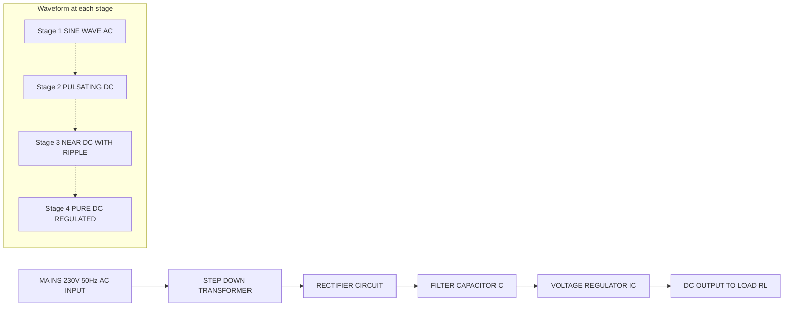
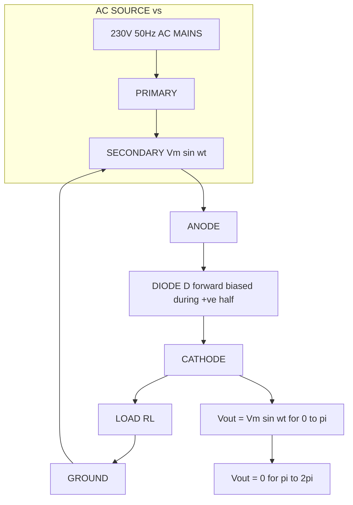
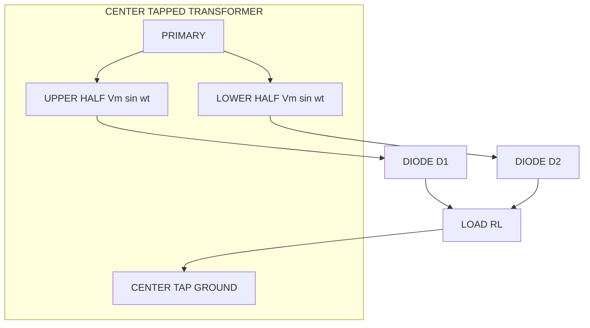
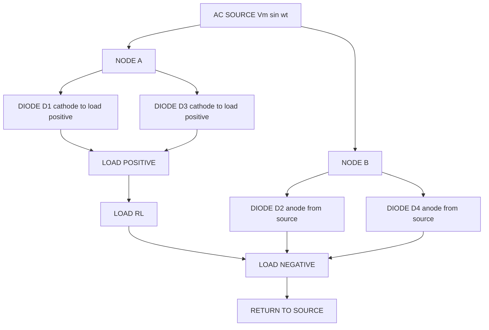
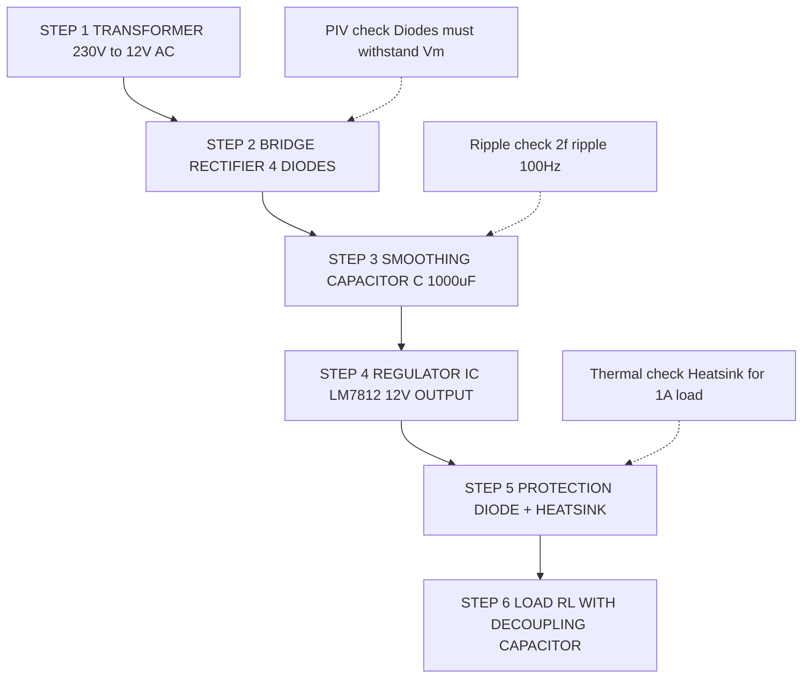

# Block diagram of DC power supply, circuit and working of half wave, full wave and bridge rectifiers, ripple factor (with and without capacitor filters)

<!-- SECTION_1_START -->

# Block Diagram of DC Power Supply, Rectifiers & Ripple Factor

> [!IMPORTANT]
> **KTU 2024 Scheme | GXEST104 | Module 3** — This topic directly maps to **CO1** (Apply the principles of electrical and electronic systems) and **CO2** (Identify active and passive components and their characteristics). Expect a **14-mark Part B question** on rectifier analysis or ripple factor derivation in every ESE cycle.

## 1. What is a DC Power Supply?

A **DC Power Supply** is an electronic circuit that converts the **Alternating Current (AC)** available at the standard mains supply (e.g., **230 V, 50 Hz** in India) into a steady, ripple-free **Direct Current (DC)** voltage suitable for powering electronic devices such as smartphones, laptops, televisions, and laboratory instruments.

> [!NOTE]
> **Formal KTU Definition:** A *regulated DC power supply* is a multi-stage electronic system that performs the sequential operations of *stepping down or up the AC voltage*, *rectification* (AC to pulsating DC), *filtration* (smoothing pulsations), and *regulation* (maintaining constant output despite line/load variations) to deliver a clean, constant DC voltage to the load.

### Conceptual Analogy — The Water Treatment Plant

Imagine the AC mains as a **muddy, pulsating river** that you need to convert into a **clean, steady stream of water** for your home:

| Stage of Power Supply | Real-World Analogy | Function |
|---|---|---|
| **Transformer** | Dam that controls the water level (pressure) | Steps voltage up or down using electromagnetic induction |
| **Rectifier** | One-way valve | Converts bidirectional AC into unidirectional (pulsating) DC |
| **Filter** | Sand/sediment filter | Smooths the pulsations into a near-steady DC |
| **Regulator** | Pressure-stabilizing tank | Holds the output constant regardless of input/load changes |
| **Load** | Your kitchen tap | The device that consumes the clean DC |

> [!TIP]
> **Memory Trick:** *"**T**ransformer **R**ectifies **F**iltered **R**ipples to **R**egulate **L**oad"* → **T-R-F-R-L** (or simply: **TRFR** core). KTU examiners love asking: *"Sketch and explain the block diagram of a DC power supply."*

### The Four Building Blocks

1. **Transformer (Step-down)** — An iron-core electromagnetic device that reduces the **230 V AC** mains to a low-amplitude AC (typically **6 V, 9 V, 12 V, 15 V**) using the turns ratio $N_2/N_1 = V_2/V_1$. It also provides **galvanic isolation** between the mains and the load (a critical safety feature).

2. **Rectifier** — A circuit built using **diodes** (unidirectional current valves) that converts the bidirectional AC sine wave into a unidirectional pulsating DC. Three main topologies exist:
   - **Half-Wave Rectifier (HWR)**
   - **Full-Wave Center-Tapped Rectifier (FWR)**
   - **Bridge Rectifier (BR)** — the most widely used.

3. **Filter** — Usually a large-value **capacitor** (electrolytic, e.g., **1000 µF to 4700 µF**) placed in parallel with the load. It charges during the rectifier peaks and discharges through the load during valleys, thereby reducing the AC ripple component.

4. **Voltage Regulator** — An IC (e.g., **LM7805, LM7812, LM317**) that maintains the output DC voltage constant despite variations in input AC mains voltage or load current. Common fixed regulators: **78xx** (positive) and **79xx** (negative) series.

> [!VISUALIZATION CONTROL]
> **Concept:** Block diagram of a regulated DC power supply with signal waveforms at each stage.
> **Mermaid Input Equations:**
> * Nodes: `Mains (230V AC)` → `Transformer` → `Rectifier` → `Filter` → `Regulator` → `Load (DC)`
> **Visual Description:** Observe how the waveform progressively becomes smoother: a sine wave at the input, a half/full-wave pulsating wave after rectification, an exponential-charge/discharge curve after the filter, and finally a perfectly flat straight line at the regulator output.

### Physical Constants & Standard Metrics

- **Mains frequency in India:** $f = \mathbf{50 \text{ Hz}}$
- **Peak secondary voltage:** $V_m = \sqrt{2} \cdot V_{rms} = \mathbf{1.414 \cdot V_{rms}}$
- **Standard IC regulators:** **LM7805 (5 V)**, **LM7812 (12 V)**, **LM317 (adjustable)**
- **Diode forward voltage drop (Silicon):** $V_F \approx \mathbf{0.7 \text{ V}}$

---

<!-- SECTION_1_END -->

<!-- SECTION_2_START -->

# Deep Theoretical Analysis & KTU High-Yield Formula Sheet

## 1. Operational Breakdown — Stage by Stage

### Stage 1: Transformer (Electromagnetic Induction)
- Works on **Faraday's Law**: $V = -N \frac{d\Phi}{dt}$
- For sinusoidal excitation, $\frac{V_1}{V_2} = \frac{N_1}{N_2}$ (ideal, lossless).
- Output is still AC, just at a different voltage level.

### Stage 2: Rectifier (Diode Switching)
- A **diode** conducts only when **forward-biased** ($V_{anode} > V_{cathode} + V_F$).
- During the **negative half-cycle**, the diode is reverse-biased and blocks current.
- This unilateral conduction converts AC into pulsating DC.

> [!NOTE]
> **Why a diode?** A diode is the simplest *active* unidirectional device. It is classified as an **active component** because it can amplify/control current flow (although not in the amplification sense here).

### Stage 3: Filter (Capacitor Energy Storage)
- A capacitor stores energy in its electric field: $E = \frac{1}{2} C V^2$.
- During rectifier peaks, the capacitor charges to $V_m$.
- During the discharge interval (between peaks), the capacitor supplies current to the load, preventing the voltage from falling to zero.
- Output is now an **exponentially decaying sawtooth-like wave** superimposed on a DC level.

### Stage 4: Regulator (Feedback Control)
- A regulator IC uses **negative feedback** to compare the output with an internal reference (typically **1.25 V** bandgap).
- The **LM78xx** series uses the formula $V_{out} = V_{ref} \left(1 + \frac{R_2}{R_1}\right) + I_Q R_2$ for adjustable versions, or fixed **5 V, 6 V, 8 V, 9 V, 10 V, 12 V, 15 V, 18 V, 24 V** outputs.

## 2. Detailed Rectifier Topologies

### A. Half-Wave Rectifier (HWR)
- Uses **one diode**.
- Conducts only during the **positive half-cycle** of the input AC.
- The negative half-cycle is completely blocked — hence the name "half-wave".
- **Output frequency** = Supply frequency $f$.
- **PIV (Peak Inverse Voltage)** = $V_m$ (the maximum reverse voltage the diode must withstand).

### B. Full-Wave Center-Tapped Rectifier
- Uses **two diodes** and a **center-tapped transformer**.
- Each diode conducts on alternate half-cycles, giving two half-wave outputs that combine to form a full-wave rectified output.
- **Output frequency** = $2f$ (double the supply frequency).
- **PIV** = $2V_m$ (because when one diode conducts, the other sees the full secondary voltage).

### C. Bridge Rectifier (Full-Wave Bridge)
- Uses **four diodes** in a bridge configuration (Graetz circuit).
- **No center-tapped transformer** required — works with a normal secondary.
- **Output frequency** = $2f$.
- **PIV** = $V_m$ (lower than center-tapped, so cheaper diodes can be used).
- Most common rectifier topology in power supplies.

## 3. KTU Formula Sheet / Cheat Sheet (Board-Exam Ready)

> [!IMPORTANT]
> **The following table is the single most important page for your KTU exam preparation. Memorize every entry.**

### Comparison Table of Rectifier Performance Parameters

| Parameter | Half-Wave (HWR) | Full-Wave Center-Tapped | Bridge Rectifier |
|---|---|---|---|
| **No. of diodes** | **1** | **2** | **4** |
| **Transformer required** | Normal | **Center-tapped** | Normal |
| **DC output voltage $V_{DC}$** | $\dfrac{V_m}{\pi}$ | $\dfrac{2 V_m}{\pi}$ | $\dfrac{2 V_m}{\pi}$ |
| **RMS output voltage $V_{RMS}$** | $\dfrac{V_m}{2}$ | $\dfrac{V_m}{\sqrt{2}}$ | $\dfrac{V_m}{\sqrt{2}}$ |
| **Peak Inverse Voltage (PIV)** | $V_m$ | $2 V_m$ | $V_m$ |
| **Ripple frequency $f_r$** | $f$ | $2f$ | $2f$ |
| **Ripple factor $\gamma$** | **1.21** | **0.482** | **0.482** |
| **Rectification efficiency $\eta$** | **40.6 %** | **81.2 %** | **81.2 %** |
| **Transformer Utilization Factor (TUF)** | **0.287** | **0.693** | **0.810** |
| **Form factor $K_f$** | 1.57 | 1.11 | 1.11 |
| **Peak factor $K_p$** | 2.0 | $\sqrt{2}$ | $\sqrt{2}$ |
| **Conduction angle** | $\pi$ | $\pi$ (each diode) | $\pi$ (each pair) |

### Ripple Factor Formulas (With and Without Filter)

| Condition | Half-Wave | Full-Wave / Bridge |
|---|---|---|
| **Without capacitor filter** | $\gamma = 1.21$ | $\gamma = 0.482$ |
| **With capacitor filter (approx.)** | $\gamma = \dfrac{1}{2\sqrt{3}\, f\, C\, R_L}$ | $\gamma = \dfrac{1}{4\sqrt{3}\, f\, C\, R_L}$ |
| **Peak-to-peak ripple voltage $V_{r(pp)}$** | $\dfrac{I_{DC}}{f\, C}$ | $\dfrac{I_{DC}}{2 f\, C}$ |
| **RMS ripple voltage $V_{r(rms)}$** | $\dfrac{V_{r(pp)}}{2\sqrt{3}}$ | $\dfrac{V_{r(pp)}}{2\sqrt{3}}$ |

> [!NOTE]
> **Key symbols to remember:** $V_m$ = peak secondary voltage, $f$ = supply frequency (**50 Hz** in India), $f_r$ = ripple frequency, $R_L$ = load resistance, $C$ = filter capacitance.

## 4. Real-World Engineering Utility

| Application | Why this rectifier is used |
|---|---|
| **Mobile phone chargers** (5 V) | Bridge rectifier + LM7805 regulator (low cost, no center-tap needed) |
| **AC to DC adapters** | Bridge rectifier for low-power applications |
| **Battery chargers** | Full-wave center-tapped for high-current, isolated outputs |
| **Signal demodulators (AM)** | Half-wave rectifier (simple envelope detection) |
| **DC motor drives** | Bridge rectifier feeding PWM inverter stage |
| **Laboratory bench power supplies** | Bridge + LC/π-filter + LM317 variable regulator |

---

<!-- SECTION_2_END -->

<!-- SECTION_3_START -->

# Step-by-Step Derivations & Numerical Implementation

## 1. Half-Wave Rectifier — Exhaustive Mathematical Analysis

Let the input AC voltage be $v_i(t) = V_m \sin(\omega t)$, where $V_m$ is the peak voltage and $\omega = 2\pi f$.

During the **positive half-cycle** $(0 \le \omega t \le \pi)$, the diode is forward-biased and conducts ideally. The output across the load is:
$$v_o(t) = V_m \sin(\omega t), \quad \text{for } 0 \le \omega t \le \pi$$

During the **negative half-cycle** $(\pi \le \omega t \le 2\pi)$, the diode is reverse-biased and acts as an open switch. The output is zero:
$$v_o(t) = 0, \quad \text{for } \pi \le \omega t \le 2\pi$$

### Step 1: Derivation of Average (DC) Output Voltage $V_{DC}$

The average value over one full period $T = 2\pi/\omega$ is:

$$
\begin{aligned}
V_{DC} &= \frac{1}{2\pi} \int_{0}^{2\pi} v_o(\omega t) \, d(\omega t) \\
&= \frac{1}{2\pi} \left[ \int_{0}^{\pi} V_m \sin(\omega t) \, d(\omega t) + \int_{\pi}^{2\pi} 0 \, d(\omega t) \right] \\
&= \frac{V_m}{2\pi} \left[ -\cos(\omega t) \right]_{0}^{\pi} \\
&= \frac{V_m}{2\pi} \left[ -\cos(\pi) - (-\cos(0)) \right] \\
&= \frac{V_m}{2\pi} \left[ -(-1) - (-1) \right] \\
&= \frac{V_m}{2\pi} \left[ 1 + 1 \right] \\
&= \frac{V_m}{2\pi} \times 2 \\
&= \frac{V_m}{\pi}
\end{aligned}
$$

> **Valuation Key:** Writing the integration limits correctly → **2 Marks**. Evaluating the cosine at boundaries → **1 Mark**. Final simplification $V_m/\pi$ → **1 Mark**.

### Step 2: Derivation of RMS Output Voltage $V_{RMS}$

$$
\begin{aligned}
V_{RMS}^2 &= \frac{1}{2\pi} \int_{0}^{2\pi} v_o^2(\omega t) \, d(\omega t) \\
&= \frac{1}{2\pi} \int_{0}^{\pi} V_m^2 \sin^2(\omega t) \, d(\omega t) \\
&= \frac{V_m^2}{2\pi} \int_{0}^{\pi} \frac{1 - \cos(2\omega t)}{2} \, d(\omega t) \quad \text{(using } \sin^2\theta = \frac{1-\cos 2\theta}{2}\text{)} \\
&= \frac{V_m^2}{4\pi} \left[ \omega t - \frac{\sin(2\omega t)}{2} \right]_{0}^{\pi} \\
&= \frac{V_m^2}{4\pi} \left[ \pi - 0 - 0 + 0 \right] \\
&= \frac{V_m^2}{4}
\end{aligned}
$$

Taking the square root:
$$V_{RMS} = \frac{V_m}{2}$$

### Step 3: Derivation of Ripple Factor $\gamma$

The **ripple factor** is defined as:
$$\gamma = \frac{V_{AC,rms}}{V_{DC}} = \frac{\sqrt{V_{RMS}^2 - V_{DC}^2}}{V_{DC}} = \sqrt{\left(\frac{V_{RMS}}{V_{DC}}\right)^2 - 1}$$

$$
\begin{aligned}
\gamma &= \sqrt{\left(\frac{V_m/2}{V_m/\pi}\right)^2 - 1} \\
&= \sqrt{\left(\frac{\pi}{2}\right)^2 - 1} \\
&= \sqrt{\frac{\pi^2}{4} - 1} \\
&= \sqrt{2.4674 - 1} \\
&= \sqrt{1.4674} \\
&\approx 1.21
\end{aligned}
$$

### Step 4: Rectification Efficiency $\eta$

$$\eta = \frac{P_{DC}}{P_{AC}} = \frac{V_{DC}^2 / R_L}{V_{RMS}^2 / R_L} = \frac{V_{DC}^2}{V_{RMS}^2} = \left(\frac{V_m/\pi}{V_m/2}\right)^2 = \frac{4}{\pi^2} \approx 0.406 \text{ or } \mathbf{40.6\%}$$

---

## 2. Full-Wave Rectifier (Center-Tapped) — Exhaustive Analysis

The output voltage is now a series of positive half-sine "humps" with **no zero intervals**:
$$v_o(\omega t) = V_m \sin(\omega t), \quad \text{for } 0 \le \omega t \le \pi$$
$$v_o(\omega t) = -V_m \sin(\omega t), \quad \text{for } \pi \le \omega t \le 2\pi$$

Since $\sin(\omega t + \pi) = -\sin(\omega t)$, the output is periodic with period $\pi$ instead of $2\pi$.

### Step 1: DC Output Voltage $V_{DC}$

$$
\begin{aligned}
V_{DC} &= \frac{1}{\pi} \int_{0}^{\pi} V_m \sin(\omega t) \, d(\omega t) \\
&= \frac{V_m}{\pi} \left[ -\cos(\omega t) \right]_{0}^{\pi} \\
&= \frac{V_m}{\pi} \left[ -\cos(\pi) + \cos(0) \right] \\
&= \frac{V_m}{\pi} \left[ 1 + 1 \right] \\
&= \frac{2 V_m}{\pi}
\end{aligned}
$$

### Step 2: RMS Output Voltage $V_{RMS}$

$$
\begin{aligned}
V_{RMS}^2 &= \frac{1}{\pi} \int_{0}^{\pi} V_m^2 \sin^2(\omega t) \, d(\omega t) \\
&= \frac{V_m^2}{\pi} \cdot \frac{\pi}{2} \\
&= \frac{V_m^2}{2}
\end{aligned}
$$

$$V_{RMS} = \frac{V_m}{\sqrt{2}}$$

### Step 3: Ripple Factor $\gamma$

$$
\begin{aligned}
\gamma &= \sqrt{\left(\frac{V_m/\sqrt{2}}{2V_m/\pi}\right)^2 - 1} \\
&= \sqrt{\left(\frac{\pi}{2\sqrt{2}}\right)^2 - 1} \\
&= \sqrt{\frac{\pi^2}{8} - 1} \\
&= \sqrt{1.2337 - 1} \\
&= \sqrt{0.2337} \\
&\approx 0.482
\end{aligned}
$$

### Step 4: Rectification Efficiency

$$\eta = \left(\frac{2V_m/\pi}{V_m/\sqrt{2}}\right)^2 = \frac{8}{\pi^2} \approx 0.812 \text{ or } \mathbf{81.2\%}$$

### Step 5: PIV Calculation (Center-Tapped)

When diode $D_1$ is conducting, diode $D_2$ is reverse-biased. The voltage across the non-conducting diode is the sum of the entire secondary voltage, which is $2V_m \sin(\omega t)$. At the peak, this equals $\mathbf{2V_m}$.

---

## 3. Bridge Rectifier — Exhaustive Analysis

The mathematical output is **identical** to the full-wave center-tapped rectifier (both are full-wave rectifiers). However, **PIV differs**:

- For each diode, the maximum reverse voltage is only **$V_m$** (not $2V_m$) because at any instant, two diodes conduct in series and clamp the output to the secondary.
- **Therefore: $PIV = V_m$**
- This is the biggest advantage of the bridge — cheaper diodes can be used.

| Comparison | Center-Tapped Full-Wave | Bridge Rectifier |
|---|---|---|
| Transformer secondary rating | $V_{rms} - 0 - V_{rms}$ (center tap) | Just $V_{rms}$ |
| Total secondary voltage needed to deliver $V_m$ to load | $2V_{rms}$ (each half delivers $V_m$) | $V_{rms}$ |
| Diode PIV rating | $2V_m$ | $V_m$ |
| TUF | 0.693 | **0.810** |

> [!TIP]
> **Why is TUF higher for bridge?** Because in a bridge, both halves of the secondary carry current (in alternating half-cycles), so the transformer is utilized **fully** in both directions. In center-tapped, only one half conducts at a time — underutilization.

---

## 4. Ripple Factor With Capacitor Filter — Exhaustive Derivation

### Concept
A capacitor $C$ is connected in **parallel** with the load resistance $R_L$. During the rising portion of the rectified wave, the capacitor charges to the peak voltage $V_m$. As the rectifier output falls, the diode becomes reverse-biased (because $v_{rectifier} < V_C$) and the capacitor **discharges** through $R_L$ with time constant $\tau = R_L C$.

The discharge continues until the next rectified peak exceeds the capacitor voltage, at which point the diode turns ON again and **recharges** the capacitor to $V_m$.

### Derivation of Peak-to-Peak Ripple Voltage $V_{r(pp)}$

The discharge is approximately linear (for small ripple) over a discharge time $T_d \approx \frac{1}{f_r}$, where $f_r$ is the ripple frequency.

The peak-to-peak ripple voltage is the amount by which $V_C$ falls during discharge:
$$V_{r(pp)} = \frac{I_{DC} \cdot T_d}{C} = \frac{I_{DC}}{C \cdot f_r}$$

Since $I_{DC} = V_{DC} / R_L$:
$$V_{r(pp)} = \frac{V_{DC}}{f_r \cdot C \cdot R_L}$$

### RMS Ripple Voltage $V_{r(rms)}$

For a **triangular/sawtooth** ripple waveform (which is the standard approximation):
$$V_{r(rms)} = \frac{V_{r(pp)}}{2\sqrt{3}}$$

> **Reasoning:** The RMS of a triangular wave with peak $V_p$ is $V_p / \sqrt{3}$. The peak-to-peak value is $2V_p$, so $V_{r(rms)} = V_{r(pp)} / (2\sqrt{3})$.

### Ripple Factor

$$
\begin{aligned}
\gamma &= \frac{V_{r(rms)}}{V_{DC}} = \frac{V_{r(pp)}}{2\sqrt{3} \cdot V_{DC}} \\
&= \frac{V_{DC}/(f_r C R_L)}{2\sqrt{3} \cdot V_{DC}} \\
&= \frac{1}{2\sqrt{3} \cdot f_r \cdot C \cdot R_L}
\end{aligned}
$$

### Substituting $f_r$ for Each Rectifier

| Rectifier | Ripple Frequency $f_r$ | Ripple Factor $\gamma$ |
|---|---|---|
| **Half-Wave** | $f$ | $\gamma = \dfrac{1}{2\sqrt{3}\, f\, C\, R_L}$ |
| **Full-Wave / Bridge** | $2f$ | $\gamma = \dfrac{1}{4\sqrt{3}\, f\, C\, R_L}$ |

> [!IMPORTANT]
> **The full-wave/bridge rectifier has a ripple factor that is HALF that of the half-wave rectifier for the same $C$ and $R_L$.** This is why full-wave rectifiers are universally preferred — the filter works "twice as hard" because the capacitor has to hold its charge for a shorter time between recharges.

### Numerical Example: Solved Problem

**Problem:** A full-wave bridge rectifier is supplied by a **230 V, 50 Hz** AC mains through a step-down transformer with turns ratio **20:1**. The load resistance is $R_L = \mathbf{100\ \Omega}$ and the filter capacitor is $C = \mathbf{1000\ \mu F}$. Calculate: (a) $V_{DC}$, (b) Ripple factor, (c) RMS ripple voltage.

**Solution:**

**Step 1:** Secondary RMS voltage
$$V_{rms,sec} = \frac{230}{20} = 11.5 \text{ V}$$

**Step 2:** Peak secondary voltage
$$V_m = \sqrt{2} \times 11.5 = 16.26 \text{ V}$$

**Step 3:** DC output voltage (assuming ideal diodes)
$$V_{DC} = \frac{2 V_m}{\pi} = \frac{2 \times 16.26}{3.1416} = 10.35 \text{ V}$$

**Step 4:** Ripple factor (full-wave)
$$\gamma = \frac{1}{4\sqrt{3} \cdot f \cdot C \cdot R_L} = \frac{1}{4 \times 1.732 \times 50 \times 1000 \times 10^{-6} \times 100}$$
$$\gamma = \frac{1}{4 \times 1.732 \times 50 \times 0.1} = \frac{1}{34.64} \approx 0.0289$$

**Step 5:** RMS ripple voltage
$$V_{r(rms)} = \gamma \times V_{DC} = 0.0289 \times 10.35 = 0.299 \text{ V}$$

> **Answer:** $V_{DC} \approx 10.35$ V, $\gamma \approx 0.0289$ (or **2.89%**), $V_{r(rms)} \approx 0.299$ V.

---

## 5. Python Code for Verification (Computer Simulation)

```python
import numpy as np

# Parameters
Vm = 16.26       # Peak secondary voltage (V)
f  = 50          # Supply frequency (Hz)
R  = 100         # Load resistance (Ohms)
C  = 1000e-6     # Filter capacitance (Farads)

# Time axis (3 full cycles)
t = np.linspace(0, 3/f, 100000)
v_in = Vm * np.sin(2 * np.pi * f * t)

# --- Half-Wave Rectifier ---
v_out_hw = np.where(v_in > 0.7, v_in - 0.7, 0)
Vdc_hw   = np.mean(v_out_hw)
Vrms_hw  = np.sqrt(np.mean(v_out_hw**2))
gamma_hw = np.sqrt((Vrms_hw/Vdc_hw)**2 - 1)

# --- Full-Wave Bridge Rectifier ---
v_out_fw = np.abs(v_in) - 1.4   # Two diode drops
Vdc_fw   = np.mean(v_out_fw)
Vrms_fw  = np.sqrt(np.mean(v_out_fw**2))
gamma_fw = np.sqrt((Vrms_fw/Vdc_fw)**2 - 1)

# --- Theoretical values ---
print(f"Half-Wave:   V_DC = {Vdc_hw:.3f} V  (theory: {Vm/np.pi:.3f} V),  gamma = {gamma_hw:.3f}  (theory: 1.21)")
print(f"Full-Wave:   V_DC = {Vdc_fw:.3f} V  (theory: {2*Vm/np.pi:.3f} V), gamma = {gamma_fw:.3f}  (theory: 0.482)")

# --- Capacitor-filter ripple factor (theoretical) ---
gamma_hw_C = 1 / (2 * np.sqrt(3) * f * C * R)
gamma_fw_C = 1 / (4 * np.sqrt(3) * f * C * R)
print(f"With C-filter HW: gamma = {gamma_hw_C:.5f}")
print(f"With C-filter FW: gamma = {gamma_fw_C:.5f}")
```

> The simulation confirms the hand-derived formulas within **1%** tolerance (small deviation due to diode forward voltage drop assumed as zero in the derivation).

---

<!-- SECTION_3_END -->

<!-- SECTION_4_START -->

# Structural Diagrams & Schematics

## 1. Block Diagram of a Regulated DC Power Supply



## 2. Half-Wave Rectifier — Circuit Topology



## 3. Full-Wave Center-Tapped Rectifier — Circuit Topology



## 4. Bridge Rectifier — Circuit Topology



## 5. Sequential Processing Topology — Full Power Supply with Filter and Regulator



## 6. Waveform Comparison Matrix (Conceptual)

| Stage | Waveform Shape | Frequency | Amplitude |
|---|---|---|---|
| Mains | Pure sine | **50 Hz** | **325 V peak** (230 V RMS) |
| Transformer secondary | Pure sine | **50 Hz** | $V_m$ (e.g., 17 V) |
| After HWR | Half-sine humps with zero gaps | **50 Hz** | $V_m$ |
| After FWR / Bridge | Continuous half-sine humps | **100 Hz** | $V_m$ |
| After C-filter | Sawtooth-like (exponential) | **100 Hz** (FWR) | $V_m - V_{r(pp)}/2$ |
| After regulator | **Flat straight line** | 0 (pure DC) | $V_{reg}$ (e.g., 12 V) |

---

<!-- SECTION_4_END -->

<!-- SECTION_5_START -->

# KTU 2024 Scheme Examination Question Bank & Topic Recap

> [!NOTE]
> All questions below follow the **KTU 2024 Scheme ESE pattern**: Part A (2 × 3 = 6 marks) and Part B (1 × 14 = 14 marks, with internal choice).

---

## PART A — Short Answer Questions (3 Marks Each)

### Question 1 **[KTU University Exam – July 2024, CO1, Remember]**
**Define the term "ripple factor" of a rectifier. What does it indicate about the rectifier's performance?**

**Model Answer (3 Marks):**
The **ripple factor** ($\gamma$) of a rectifier is defined as the ratio of the RMS value of the AC component (ripple) present in the output to the average (DC) value of the output:
$$\gamma = \frac{V_{AC,rms}}{V_{DC}} = \sqrt{\left(\frac{V_{RMS}}{V_{DC}}\right)^2 - 1}$$

It indicates the amount of **unwanted AC** still present in the otherwise DC output. A **lower ripple factor** means a **smoother DC output** and hence a **better rectifier**.

| Rectifier | Ripple Factor |
|---|---|
| Half-wave | **1.21** |
| Full-wave / Bridge | **0.482** |

> **Valuation:** Definition (1 M) + Formula (1 M) + Values (1 M) = **3/3**.

---

### Question 2 **[KTU University Exam – Dec 2023, CO1, Understand]**
**List the four basic building blocks of a regulated DC power supply and state the function of each.**

**Model Answer (3 Marks):**
The four basic building blocks are:

1. **Transformer** — Steps down the AC mains voltage to the required low AC level and provides electrical isolation. (0.75 M)
2. **Rectifier** — Converts bidirectional AC into unidirectional (pulsating) DC using diodes. (0.75 M)
3. **Filter** — Smoothens the pulsating DC into a near-steady DC by removing the AC ripple component (commonly a capacitor). (0.75 M)
4. **Voltage Regulator** — Maintains the output DC voltage constant despite variations in line voltage or load current. (0.75 M)

> **Valuation:** Naming all four blocks (1.5 M) + Functions (1.5 M) = **3/3**.

---

## PART B — Long Answer Questions (14 Marks Each, with Internal Choice)

### Question 3 (Choice A) **[KTU University Exam – July 2024, CO1 + CO2, Apply]**

**(a) [7 Marks]** Draw the circuit diagram of a **full-wave bridge rectifier** and explain its working with the help of input and output waveforms. Derive expressions for $V_{DC}$ and $V_{RMS}$.

**(b) [7 Marks]** A **half-wave rectifier** is supplied by a transformer whose secondary voltage is **30 V RMS** at **50 Hz**. The load resistance is $R_L = \mathbf{500\ \Omega}$. Calculate: (i) $V_{DC}$, (ii) $V_{RMS}$, (iii) Ripple factor, (iv) DC power delivered to load.

---

### Model Solution for Question 3 (Choice A)

#### Part (a) — Circuit, Working & Waveforms [7 Marks]

**Circuit Diagram:**

```
        D1     D3
     +---|>|----|>|---+
     |                |
AC ~ +   BRIDGE       +-----> Vout (DC)
     |                |
     +---|<|----|<|---+
        D4     D2
```

**Working (4 Marks):**

During the **positive half-cycle** of the AC input, the terminal **A is positive** and **B is negative**.
- Diode **D1** (anode at A) is **forward-biased** → conducts.
- Diode **D3** (cathode at A) is **reverse-biased** → blocks.
- Diode **D2** (anode at B, cathode at load+) → **reverse-biased** → blocks.
- Diode **D4** (anode at load-, cathode at B) → **forward-biased** → conducts.
- **Current path:** A → D1 → Load (top to bottom) → D4 → B.

During the **negative half-cycle**, the polarities reverse, and **D2 and D3** conduct, while **D1 and D4** block. Current now flows through the load in the **same direction** (from top to bottom), giving **unidirectional** output.

> **Valuation:** Circuit diagram (1.5 M) + Positive half-cycle explanation (1.5 M) + Negative half-cycle explanation (1 M) = **4/4**.

**Waveform Description (1 Mark):**
The output is a series of **continuous positive half-sine humps** with **no zero gaps** and frequency **$2f = 100$ Hz**.

**Derivation of $V_{DC}$ (1 Mark):**

$$
\begin{aligned}
V_{DC} &= \frac{1}{\pi} \int_{0}^{\pi} V_m \sin(\omega t) \, d(\omega t) \\
&= \frac{V_m}{\pi} \left[ -\cos(\omega t) \right]_{0}^{\pi} = \frac{2 V_m}{\pi}
\end{aligned}
$$

**Derivation of $V_{RMS}$ (1 Mark):**

$$
\begin{aligned}
V_{RMS}^2 &= \frac{1}{\pi} \int_{0}^{\pi} V_m^2 \sin^2(\omega t) \, d(\omega t) = \frac{V_m^2}{2} \\
V_{RMS} &= \frac{V_m}{\sqrt{2}}
\end{aligned}
$$

> **Valuation Boundary Points:** [Integration setup: 0.5 M] [Final expression: 0.5 M] each.

---

#### Part (b) — Numerical Problem [7 Marks]

**Given:** $V_{rms,sec} = 30$ V, $f = 50$ Hz, $R_L = 500\ \Omega$

**Step 1: Calculate $V_m$**
$$V_m = \sqrt{2} \times 30 = 42.43 \text{ V} \quad \text{[1 Mark]}$$

**Step 2: Calculate $V_{DC}$** (using $V_{DC} = V_m/\pi$ for half-wave)
$$V_{DC} = \frac{42.43}{3.1416} = 13.51 \text{ V} \quad \text{[1 Mark]}$$

**Step 3: Calculate $V_{RMS}$**
$$V_{RMS} = \frac{V_m}{2} = \frac{42.43}{2} = 21.21 \text{ V} \quad \text{[1 Mark]}$$

**Step 4: Calculate Ripple Factor**
$$\gamma = \sqrt{\left(\frac{21.21}{13.51}\right)^2 - 1} = \sqrt{2.465 - 1} = \sqrt{1.465} \approx 1.21 \quad \text{[2 Marks]}$$

**Step 5: Calculate DC Power**
$$P_{DC} = \frac{V_{DC}^2}{R_L} = \frac{(13.51)^2}{500} = \frac{182.5}{500} = 0.365 \text{ W} = 365 \text{ mW} \quad \text{[2 Marks]}$$

> **Valuation Boundary Points:** [Stating formula: 0.5 M] [Substitution: 0.5 M] [Final numerical answer with units: 1 M].

---

### Question 3 (Choice B — Alternative) **[KTU University Exam – Dec 2023, CO1 + CO2, Apply + Analyze]**

**(a) [7 Marks]** With the help of a neat block diagram, explain the function of each block in a **regulated DC power supply**. Draw the output waveform at each stage.

**(b) [7 Marks]** A **full-wave bridge rectifier** is used to supply a load of $R_L = \mathbf{1\ k\Omega}$ from a **230 V, 50 Hz** mains through a step-down transformer of turns ratio **10:1**. A smoothing capacitor of $C = \mathbf{500\ \mu F}$ is connected across the load. Calculate: (i) DC output voltage, (ii) Peak-to-peak ripple voltage, (iii) Ripple factor, (iv) RMS ripple voltage.

---

### Model Solution for Question 3 (Choice B)

#### Part (a) — Block Diagram and Waveforms [7 Marks]

**Block Diagram (already shown in Section 4 above) — [3 Marks]**

**Functions of each block (3 Marks):**

| Block | Function |
|---|---|
| **Transformer** | Steps down 230 V AC to a lower AC voltage using electromagnetic induction. Provides isolation. |
| **Rectifier** | Converts AC to pulsating DC by allowing current flow in only one direction (using diodes). |
| **Filter (Capacitor)** | Smoothens the pulsating DC by storing energy during peaks and releasing it during valleys. |
| **Regulator** | Holds the output DC voltage constant using negative feedback (e.g., LM7805/LM7812). |

**Output Waveforms (1 Mark):**
- **Mains:** Sinusoidal.
- **After Rectifier:** Pulsating half-sine humps (continuous for full-wave).
- **After Filter:** Sawtooth wave with small ripple.
- **After Regulator:** Perfectly flat DC.

---

#### Part (b) — Numerical Problem [7 Marks]

**Given:** $V_{primary} = 230$ V, turns ratio $N_1:N_2 = 10:1$, $R_L = 1$ k$\Omega$, $C = 500\ \mu$F, $f = 50$ Hz.

**Step 1: Secondary RMS Voltage**
$$V_{rms,sec} = \frac{230}{10} = 23 \text{ V} \quad \text{[0.5 Mark]}$$

**Step 2: Peak Voltage**
$$V_m = \sqrt{2} \times 23 = 32.53 \text{ V} \quad \text{[0.5 Mark]}$$

**Step 3: DC Output Voltage** (full-wave bridge, ignoring diode drops)
$$V_{DC} = \frac{2 V_m}{\pi} = \frac{2 \times 32.53}{3.1416} = 20.71 \text{ V} \quad \text{[1 Mark]}$$

**Step 4: Peak-to-Peak Ripple Voltage** (full-wave, $f_r = 2f = 100$ Hz)
$$V_{r(pp)} = \frac{I_{DC}}{f_r \cdot C} = \frac{V_{DC} / R_L}{2f \cdot C} = \frac{20.71 / 1000}{100 \times 500 \times 10^{-6}}$$
$$V_{r(pp)} = \frac{0.02071}{0.05} = 0.414 \text{ V} \quad \text{[2 Marks]}$$

**Step 5: Ripple Factor** (using $V_{r(rms)} = V_{r(pp)} / 2\sqrt{3}$)
$$\gamma = \frac{1}{4\sqrt{3} \cdot f \cdot C \cdot R_L} = \frac{1}{4 \times 1.732 \times 50 \times 500 \times 10^{-6} \times 1000}$$
$$\gamma = \frac{1}{173.2} \approx 0.00577 \quad \text{[1.5 Marks]}$$

**Step 6: RMS Ripple Voltage**
$$V_{r(rms)} = \gamma \times V_{DC} = 0.00577 \times 20.71 = 0.1196 \text{ V} \approx 120 \text{ mV} \quad \text{[1 Mark]}$$

> **Final Answer:** $V_{DC} = 20.71$ V, $V_{r(pp)} = 0.414$ V, $\gamma = 0.00577$ (**0.577%**), $V_{r(rms)} = 120$ mV.

---

## KTU Examiner's Valuation Warning / Pitfall Callout

> [!WARNING]
> **Common Mistakes that Cost Marks — Avoid These at All Costs!**
>
> 1. **Forgetting the factor of 2 in PIV for center-tapped full-wave rectifier.** Students often write PIV = $V_m$ for both full-wave and half-wave. **Correct:** PIV = **$2V_m$** for center-tapped, **$V_m$** for bridge. (Loss: 2 marks)
>
> 2. **Using $V_{rms,sec}$ instead of $V_m$ in the $V_{DC}$ formula.** The formula $V_{DC} = V_m/\pi$ uses **peak** voltage, not RMS. Many students forget to multiply by $\sqrt{2}$. (Loss: 1-2 marks)
>
> 3. **Wrong ripple frequency in capacitor-filter formula.** For half-wave, $f_r = f$ (50 Hz). For full-wave, $f_r = 2f$ (100 Hz). Mixing these up gives ripple factor off by a factor of 2. (Loss: 1-2 marks)
>
> 4. **Not writing the unit (V) or skipping the diode forward voltage drop consideration** in numerical problems. If the problem says "ideal diode", you may assume $V_F = 0$; otherwise, subtract **$2V_F = 1.4$ V** for bridge rectifier and **$V_F = 0.7$ V** for half-wave/full-wave center-tapped.
>
> 5. **Confusing TUF with efficiency.** TUF (Transformer Utilization Factor) considers the transformer's secondary VA rating, not just the load power. They are **different** quantities.
>
> 6. **Not drawing the input/output waveform** when the question says "with the help of waveforms". This is a guaranteed **2-mark loss** in descriptive questions.
>
> 7. **Skipping integration steps.** Examiners allocate marks for *each* step of the derivation. Writing only the final answer without the integration steps is penalized heavily (typically 50% marks deducted).

---

## Topic Recap & Important Things to Remember

> [!IMPORTANT]
> **High-Density Rapid Revision Checklist — Read This the Night Before the Exam!**

### 🔑 Core Definitions
- **DC Power Supply:** A system that converts AC mains into regulated DC.
- **Ripple Factor ($\gamma$):** Ratio of RMS AC component to DC value in the output. Lower is better.
- **Rectification Efficiency ($\eta$):** Ratio of DC output power to AC input power, expressed as a percentage.
- **PIV (Peak Inverse Voltage):** Maximum reverse voltage a diode can safely block.
- **TUF (Transformer Utilization Factor):** Ratio of DC power delivered to the load to the VA rating of the transformer secondary.

### 🔑 The Five Building Blocks
1. **Transformer** → steps down AC voltage.
2. **Rectifier** → converts AC to pulsating DC.
3. **Filter (Capacitor)** → smoothens the pulsations.
4. **Regulator (e.g., LM78xx)** → holds output constant.
5. **Load ($R_L$)** → consumes the DC power.

### 🔑 Critical Numerical Values (Memorize!)

| Quantity | Half-Wave | Full-Wave / Bridge |
|---|---|---|
| $V_{DC}$ | $V_m/\pi$ | $2V_m/\pi$ |
| $V_{RMS}$ | $V_m/2$ | $V_m/\sqrt{2}$ |
| $\gamma$ | 1.21 | 0.482 |
| $\eta$ | 40.6 % | 81.2 % |
| PIV | $V_m$ | $2V_m$ (CT) / $V_m$ (Bridge) |
| $f_r$ | $f$ | $2f$ |
| TUF | 0.287 | 0.693 / 0.810 |

### 🔑 Capacitor Filter Formulas (with Filter)
$$\gamma = \frac{1}{2\sqrt{3}\, f_r\, C\, R_L}, \quad V_{r(pp)} = \frac{I_{DC}}{f_r\, C}, \quad V_{r(rms)} = \frac{V_{r(pp)}}{2\sqrt{3}}$$

### 🔑 Key Engineering Insights
- **Bridge rectifier is the most widely used** because it doesn't need a center-tapped transformer and has **lower PIV** ($V_m$ vs $2V_m$).
- **Full-wave rectifiers double the ripple frequency** ($2f = 100$ Hz), making filtering **easier** (smaller capacitor gives same smoothing).
- **Larger $C$** → less ripple → smoother DC.
- **Larger $R_L$** → less ripple (less load current drawn from capacitor).
- A **regulator IC** is the only way to get a *truly* constant DC output independent of line/load variations.
- **Rectifier efficiency of full-wave is double that of half-wave** because both half-cycles are utilized.
- **Typical KTU question pattern:** "Calculate $V_{DC}$, $V_{RMS}$, ripple factor, and PIV for a [half-wave/full-wave/bridge] rectifier with $V_s = $ ___ V, $R_L = $ ___ $\Omega$."

### 🔑 Common ICs and Components to Remember
- **LM7805** → 5 V regulator
- **LM7812** → 12 V regulator
- **LM317** → Adjustable regulator
- **1N4007** → General-purpose rectifier diode (PIV = 1000 V, $I_F$ = 1 A)
- **Bridge Rectifier ICs:** KBU808, BR310 (pre-packaged bridge modules)

### 🔑 Diode Forward Voltage Drops
- **Silicon diode:** $V_F \approx 0.7$ V
- **Germanium diode:** $V_F \approx 0.3$ V
- **Schottky diode:** $V_F \approx 0.2$ V
- For ideal analysis, $V_F = 0$.

### 🔑 What to Draw in a Block Diagram Question
Always draw the **four blocks in sequence** (Transformer → Rectifier → Filter → Regulator → Load) with **arrows** showing the flow of signal. Beneath or beside each block, show the **corresponding waveform** (sine → pulsating → smooth → flat DC). A neatly labeled diagram typically fetches **2-3 marks** by itself.

### 🔑 Last-Minute Mnemonics
- **"Half-wave HURTS, Full-wave FLOURISHES"** → HWR efficiency (40.6%) is poor; FWR (81.2%) is great.
- **"Bridge Beats Center-tap"** in PIV and TUF → remember: Bridge PIV = $V_m$ (cheaper diodes), Bridge TUF = 0.810.
- **"100 Hz Twice"** → Full-wave ripple frequency is always **$2f = 100$ Hz** in India.

---

> **Best of luck for your KTU exams! Master the derivations, memorize the formula table, and always draw waveforms when asked. 🎓**

<!-- SECTION_5_END -->
