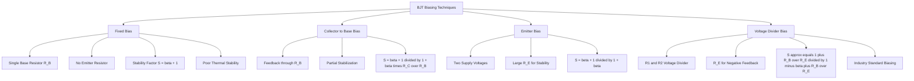
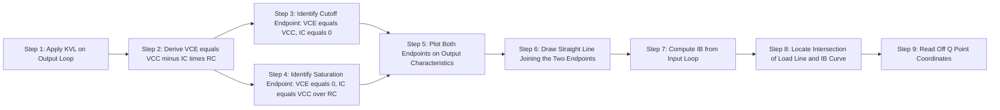
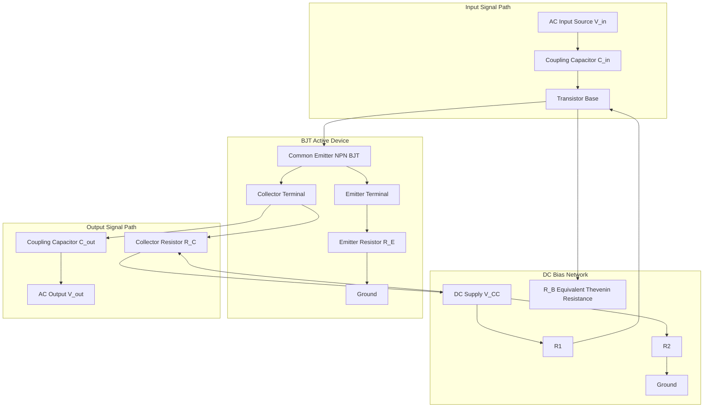
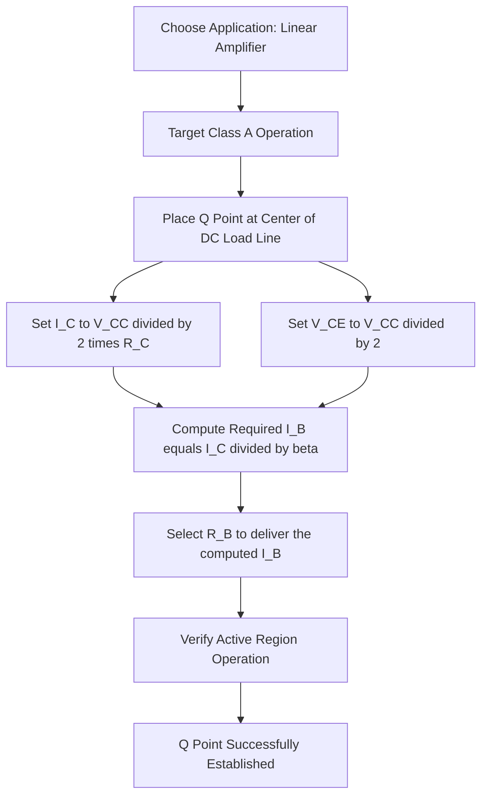

# Concept of biasing and load line

<!-- SECTION_1_START -->
# Concept of Biasing and Load Line

## 1.1 Core Technical Definition

> [!IMPORTANT]
> **Biasing** is the process of applying external DC voltages to an electronic device (such as a BJT or FET) so as to set up a fixed, predefined **Quiescent Operating Point (Q-point)** in the absence of an input AC signal. It establishes the DC levels of currents ($I_B$, $I_C$, $I_E$) and voltages ($V_{BE}$, $V_{CE}$) inside the device.

> [!IMPORTANT]
> **Load Line** is a graphical straight-line representation, drawn on the output characteristics of a transistor, that depicts the locus of all mathematically possible combinations of collector current ($I_C$) and collector-emitter voltage ($V_{CE}$) for a given DC supply ($V_{CC}$) and collector load resistor ($R_C$).

> [!NOTE]
> **Q-Point (Operating Point):** The single point on the DC load line where the transistor settles for a specific bias condition. It is defined by a specific $I_C$ and a corresponding $V_{CE}$ coordinate pair.

---

## 1.2 Intuitive Real-World Analogy

Imagine a **manual water tap connected to a pipeline**:
- The **fully closed tap** is the **cutoff region** of the transistor ($I_C = 0$).
- The **fully open tap** is the **saturation region** ($V_{CE} \approx 0$).
- The **load line** is the *full range of motion* of the tap handle between fully open and fully closed.
- **Biasing** is the act of *fixing the tap handle at a comfortable mid-position* (e.g., 30% open) before any user input arrives.
- The **input signal** is the user pushing or pulling the handle slightly above and below this preset mid-position.
- The **output signal** is the resulting proportional change in water flow.

If the tap is preset near fully closed or fully open, the small push/pull from the user cannot produce a proportional response — this is exactly the role of proper Q-point selection.

> [!TIP]
> **Rule of Thumb:** A well-biased transistor places its Q-point **near the center of the DC load line**, leaving equal "swing room" for both positive and negative half-cycles of the input signal. This minimizes **clipping distortion**.

---

## 1.3 Physical Constants \& Standard Metrics

- **Silicon BJT $V_{BE}$ (ON)** $\approx \mathbf{0.7\text{ V}}$
- **Germanium BJT $V_{BE}$ (ON)** $\approx \mathbf{0.3\text{ V}}$
- **Thermal Voltage** $V_T = \dfrac{kT}{q} \approx \mathbf{26\text{ mV at } 300\text{ K}}$
- **Boltzmann Constant** $k = 1.38 \times 10^{-23}\text{ J/K}$
- **Electron Charge** $q = 1.602 \times 10^{-19}\text{ C}$

---

## 1.4 Visualization Block

> [!VISUALIZATION CONTROL]
> **Concept:** DC Load Line of a Common-Emitter Transistor (Graphical Form)
>
> **Desmos / GeoGebra Input Equations:**
> * Point A (Cutoff): $(x,y) = (V_{CC}, 0)$
> * Point B (Saturation): $(x,y) = (0,\ V_{CC}/R_C)$
> * Line Equation: $y = \dfrac{V_{CC} - x}{R_C}$
> * Q-Point: $(V_{CE},\ I_C)$ marked on the line
>
> **Visual Description:** On a graph with $V_{CE}$ on the x-axis and $I_C$ on the y-axis, a straight line slopes downwards from the y-axis intercept (saturation current) on the right side at $V_{CC}$ on the x-axis (cutoff). The Q-point sits somewhere in the active region along this descending line.

---

## 1.5 Why Biasing is Essential

A transistor is a **three-terminal nonlinear device** that requires DC voltages to function as a controlled source. Without biasing:
1. The transistor has **no predefined region of operation** (it floats unpredictably).
2. The base-emitter junction would not be forward-biased, hence $I_B = 0$ and $I_C = 0$.
3. Small AC input signals would be **rectified or clipped**, not amplified.
4. Temperature drifts (e.g., leakage current $I_{CO}$ rise) would shift the device into cutoff or saturation uncontrollably.

> [!IMPORTANT]
> The **three primary goals** of any biasing network are:
> 1. Establish the Q-point in the **active region**.
> 2. Make the Q-point **independent of temperature** and transistor parameter variations (e.g., $\beta$ spread).
> 3. Make the Q-point **independent of device replacement** (transistors of the same part number can have $\beta$ values ranging from 50 to 300).

---
<!-- SECTION_1_END -->

<!-- SECTION_2_START -->
# Deep Theoretical Analysis & KTU High-Yield Formula Sheet

## 2.1 Fundamental Theory of Load Line

The DC load line is obtained by applying **Kirchhoff's Voltage Law (KVL)** around the output loop of the common-emitter transistor circuit.

The output loop consists of the supply $V_{CC}$, the collector resistor $R_C$, and the collector-emitter terminals of the transistor.

The resulting equation is linear in $I_C$ and $V_{CE}$, hence the graphical plot is a straight line.

**Two Critical Endpoints of the DC Load Line:**
- **Cutoff Point (Left End on $V_{CE}$ axis):** Transistor is OFF. $I_C = 0$, $V_{CE} = V_{CC}$.
- **Saturation Point (Right End on $I_C$ axis):** Transistor is fully ON. $V_{CE} = 0$, $I_C = \dfrac{V_{CC}}{R_C} = I_{C(\text{sat})}$.

**Significance of the Slope:**
- The slope of the DC load line is $\mathbf{-1/R_C}$.
- A larger $R_C$ produces a *flatter* load line.
- A smaller $R_C$ produces a *steeper* load line.

## 2.2 Why Load Line Analysis is Used

1. It allows **graphical determination** of the Q-point without solving complex nonlinear equations.
2. It shows the **range of possible $I_C$ and $V_{CE}$ values** the transistor can assume.
3. It indicates the **maximum unclipped signal swing** during amplification.
4. It helps visualize **cutoff clipping** (when the signal pushes the transistor toward $I_C = 0$) and **saturation clipping** (when it pushes toward $V_{CE} = 0$).

## 2.3 Types of Biasing Circuits

| Sl. No. | Biasing Method | Stability | Complexity | Q-Point Sensitivity |
|:---:|---|:---:|:---:|:---:|
| 1 | **Fixed Bias (Base Bias)** | Poor | Very Low | Highly sensitive to $\beta$ |
| 2 | **Collector-to-Base Feedback Bias** | Moderate | Low | Moderately sensitive |
| 3 | **Emitter Bias** | Good | Low | Reasonably stable |
| 4 | **Voltage Divider Bias** | Excellent | Moderate | Largely independent of $\beta$ |

## 2.4 KTU High-Yield Formula Cheat Sheet

> [!IMPORTANT]
> The following table is the **single most important summary** for solving any KTU numerical on biasing or load lines. Memorize every row.

| Parameter / Quantity | Governing Equation | Units | Description |
|---|---|:---:|---|
| **DC Load Line Equation** | $V_{CE} = V_{CC} - I_C \cdot R_C$ | Volts | KVL of the output loop |
| **Cutoff Endpoint** | $(V_{CC},\ 0)$ | V, mA | Transistor is OFF |
| **Saturation Endpoint** | $(0,\ V_{CC}/R_C)$ | V, mA | Transistor is fully ON |
| **Fixed Bias: Base Current** | $I_B = (V_{CC} - V_{BE}) / R_B$ | A | From KVL on input loop |
| **Fixed Bias: Collector Current** | $I_C = \beta \cdot I_B$ | A | Fundamental BJT relation |
| **Fixed Bias: $V_{CE}$** | $V_{CE} = V_{CC} - I_C R_C$ | V | From DC load line |
| **Voltage Divider: Base Voltage** | $V_B = V_{CC} \cdot R_2 / (R_1 + R_2)$ | V | Voltage divider rule |
| **Voltage Divider: Emitter Voltage** | $V_E = V_B - V_{BE}$ | V | KVL on B-E junction |
| **Voltage Divider: Emitter Current** | $I_E = V_E / R_E$ | A | Ohm's Law on $R_E$ |
| **Voltage Divider: Collector Current** | $I_C \approx I_E = V_E / R_E$ | A | Since $I_C \approx I_E$ for large $\beta$ |
| **Voltage Divider: $V_{CE}$** | $V_{CE} = V_{CC} - I_C(R_C + R_E)$ | V | KVL on output loop |
| **Stability Factor (Fixed Bias)** | $S(I_{CO}) = \beta + 1$ | dimensionless | Worst case stability |
| **Stability Factor (Voltage Divider)** | $S(I_{CO}) \approx (1 + R_B / R_E) / (1 - \beta + R_B / R_E)$ | dimensionless | Best case stability |
| **Stability Factor Definition** | $S(I_{CO}) = \partial I_C / \partial I_{CO} \big\vert_{I_B, V_{BE}}$ | dimensionless | Rate of change of $I_C$ w.r.t. leakage |
| **Saturation Collector Current** | $I_{C(\text{sat})} = V_{CC} / R_C$ | A | Maximum possible $I_C$ |
| **Thermal Voltage (at 25°C)** | $V_T = kT / q \approx 26\text{ mV}$ | V | Used in Ebers-Moll model |

> [!NOTE]
> **Engineering Interpretation:** A **smaller stability factor $S$** is always desirable. Voltage divider bias typically yields $S \approx 1$ to $10$, while fixed bias yields $S \approx 100$ to $300$. This is why **voltage divider bias is the industry standard** for linear amplifier design in production systems such as op-amp input stages, audio pre-amplifiers, and instrumentation front-ends.

---

## 2.5 Selection of the Operating Point

The Q-point is chosen based on the **class of operation** desired:

| Class | Q-Point Location | Conduction Angle | Application |
|:---:|---|:---:|---|
| **Class A** | Center of load line | 360° | Linear audio amplifiers |
| **Class B** | Exactly on cutoff | 180° | Push-pull audio output |
| **Class AB** | Slightly above cutoff | 180° to 360° | Op-amp output stages |
| **Class C** | Below cutoff | less than 180° | RF tuned amplifiers |

For KTU first-year electronics, **Class A operation with Q-point at the center of the DC load line** is the most commonly assumed scenario.

---
<!-- SECTION_2_END -->

<!-- SECTION_3_START -->
# Step-by-Step Derivations and Solved Numerical Implementations

## 3.1 Derivation of the DC Load Line Equation

**Step 1:** Consider a common-emitter (CE) NPN transistor with a single resistor $R_C$ in the collector branch and supply $V_{CC}$ across the output loop.

**Step 2:** Apply **Kirchhoff's Voltage Law** to the output loop starting from the supply, going through $R_C$ and the collector-emitter terminals back to the supply negative terminal.

$$V_{CC} = I_C \cdot R_C + V_{CE}$$

**Step 3:** Rearrange the equation to express $V_{CE}$ as a function of $I_C$:

$$V_{CE} = V_{CC} - I_C \cdot R_C$$

**Step 4:** Identify the two intercepts of this linear equation:
- When $I_C = 0$ (cutoff): $\ V_{CE} = V_{CC}$
- When $V_{CE} = 0$ (saturation): $\ I_C = V_{CC} / R_C$

**Step 5:** Identify the slope. Differentiating with respect to $V_{CE}$:

$$\frac{d I_C}{d V_{CE}} = -\frac{1}{R_C}$$

This confirms the load line is a straight line with **negative slope $-1/R_C$**.

> [!TIP]
> **Geometric Note:** Since the load line is a straight line, only the **two endpoints** and the **slope** are needed. Drawing it on the output characteristics curve (which is the plot of $I_C$ vs $V_{CE}$ for various fixed values of $I_B$) is sufficient to graphically read off the Q-point at the intersection of the load line and the $I_B = I_{BQ}$ curve.

---

## 3.2 Complete Analysis of the Fixed Bias Circuit

### 3.2.1 Circuit Description

A fixed bias circuit has a single resistor $R_B$ connected between the supply $V_{CC}$ and the base of the transistor. The collector is connected to $V_{CC}$ through $R_C$. There is no emitter resistor.

### 3.2.2 Step-by-Step Derivation

**Step 1 — Input Loop (KVL around base loop):**
Starting from $V_{CC}$, going through $R_B$, then through the base-emitter junction, back to ground.

$$V_{CC} = I_B \cdot R_B + V_{BE}$$

**Step 2 — Solve for Base Current $I_B$:**

$$I_B = \frac{V_{CC} - V_{BE}}{R_B}$$

**Step 3 — Apply BJT Current Relation:**

$$I_C = \beta \cdot I_B$$

**Step 4 — Apply Output Loop (KVL on collector loop):**

$$V_{CE} = V_{CC} - I_C \cdot R_C$$

### 3.2.3 Worked Numerical Example (Fully Solved)

> **[KTU University Exam — July 2024 Pattern]**
>
> **Given:** $V_{CC} = 12\text{ V},\ R_B = 500\text{ k}\Omega,\ R_C = 2\text{ k}\Omega,\ \beta = 100,\ V_{BE} = 0.7\text{ V}$ (silicon).
>
> **Find:** $I_B$, $I_C$, $V_{CE}$, and the DC load line endpoints. Verify whether the transistor is in the active region.

**Solution:**

**Step 1: Calculate the base current $I_B$.**

$$I_B = \frac{V_{CC} - V_{BE}}{R_B} = \frac{12 - 0.7}{500 \times 10^3} = \frac{11.3}{500000}$$

$$I_B = 22.6 \times 10^{-6}\text{ A} = 22.6\ \mu\text{A}$$

**Step 2: Calculate the collector current $I_C$.**

$$I_C = \beta \cdot I_B = 100 \times 22.6\ \mu\text{A} = 2260\ \mu\text{A} = 2.26\text{ mA}$$

**Step 3: Calculate the collector-emitter voltage $V_{CE}$.**

$$V_{CE} = V_{CC} - I_C \cdot R_C = 12 - (2.26 \times 10^{-3}) \times (2 \times 10^3)$$

$$V_{CE} = 12 - 4.52 = 7.48\text{ V}$$

**Step 4: Determine the load line endpoints.**
- Cutoff point: $(V_{CE}, I_C) = (12\text{ V},\ 0\text{ mA})$
- Saturation point: $(V_{CE}, I_C) = (0\text{ V},\ V_{CC}/R_C) = (0\text{ V},\ 6\text{ mA})$

**Step 5: Verify the region of operation.**

$$V_{CE(\text{sat})} \approx 0.2\text{ V (typical for silicon BJT)}$$

Since $V_{CE} = 7.48\text{ V} \gg 0.2\text{ V}$ and $I_C = 2.26\text{ mA} < I_{C(\text{sat})} = 6\text{ mA}$, the transistor is operating in the **active region** as required.

**Step 6: State the Q-point coordinates.**

$$\boxed{Q\text{-point} = (V_{CE}, I_C) = (7.48\text{ V},\ 2.26\text{ mA})}$$

This Q-point lies closer to the cutoff side of the load line, providing slightly more headroom for the negative half-cycle of the AC signal than for the positive half-cycle.

---

## 3.3 Complete Analysis of the Voltage Divider Bias Circuit

### 3.3.1 Circuit Description

The voltage divider bias uses two resistors $R_1$ and $R_2$ forming a potential divider across $V_{CC}$, an emitter resistor $R_E$ for DC negative feedback, and a collector resistor $R_C$.

### 3.3.2 Step-by-Step Derivation

**Step 1 — Find the Thevenin equivalent of the base bias network.**

The Thevenin voltage at the base is:

$$V_{TH} = V_B = V_{CC} \cdot \frac{R_2}{R_1 + R_2}$$

The Thevenin resistance seen from the base is:

$$R_{TH} = R_B = \frac{R_1 \cdot R_2}{R_1 + R_2}$$

**Step 2 — Apply KVL on the base-emitter loop.**

$$V_{TH} = I_B \cdot R_{TH} + V_{BE} + I_E \cdot R_E$$

Using the approximation $I_E \approx I_C$ and $I_C = \beta I_B$:

$$V_{TH} = I_B \cdot R_{TH} + V_{BE} + (\beta + 1) I_B \cdot R_E$$

**Step 3 — Solve for $I_B$:**

$$I_B = \frac{V_{TH} - V_{BE}}{R_{TH} + (\beta + 1) R_E}$$

**Step 4 — Apply the approximation $\beta R_E \gg R_{TH}$ (typical design condition).**

Under this design rule, $I_B$ becomes very small and $I_E$ is dominated by $R_E$:

$$I_E \approx \frac{V_{TH} - V_{BE}}{R_E} = \frac{V_B - V_{BE}}{R_E}$$

**Step 5 — Compute the collector current and $V_{CE}$:**

$$I_C \approx I_E = \frac{V_B - V_{BE}}{R_E}$$

$$V_{CE} = V_{CC} - I_C R_C - I_E R_E \approx V_{CC} - I_C (R_C + R_E)$$

### 3.3.3 Worked Numerical Example (Fully Solved)

> **[KTU University Exam — Dec 2023 Pattern]**
>
> **Given:** $V_{CC} = 12\text{ V},\ R_1 = 10\text{ k}\Omega,\ R_2 = 5\text{ k}\Omega,\ R_C = 1\text{ k}\Omega,\ R_E = 500\text{ }\Omega,\ \beta = 100,\ V_{BE} = 0.7\text{ V}$.
>
> **Find:** $V_B$, $V_E$, $I_C$, $V_{CE}$, and the Q-point.

**Solution:**

**Step 1: Compute base voltage $V_B$ using the voltage divider rule.**

$$V_B = V_{CC} \cdot \frac{R_2}{R_1 + R_2} = 12 \cdot \frac{5\text{ k}\Omega}{10\text{ k}\Omega + 5\text{ k}\Omega} = 12 \cdot \frac{5}{15} = 4\text{ V}$$

**Step 2: Compute emitter voltage $V_E$.**

$$V_E = V_B - V_{BE} = 4 - 0.7 = 3.3\text{ V}$$

**Step 3: Compute emitter current $I_E$.**

$$I_E = \frac{V_E}{R_E} = \frac{3.3}{500} = 6.6 \times 10^{-3}\text{ A} = 6.6\text{ mA}$$

**Step 4: Compute collector current $I_C$.**

$$I_C \approx I_E = 6.6\text{ mA}$$

**Step 5: Compute collector-emitter voltage $V_{CE}$.**

$$V_{CE} = V_{CC} - I_C(R_C + R_E) = 12 - (6.6 \times 10^{-3}) \times (1000 + 500)$$

$$V_{CE} = 12 - (6.6 \times 10^{-3}) \times 1500 = 12 - 9.9 = 2.1\text{ V}$$

**Step 6: State the Q-point.**

$$\boxed{Q\text{-point} = (V_{CE}, I_C) = (2.1\text{ V},\ 6.6\text{ mA})}$$

**Step 7: Verification of the active region.**
$I_{C(\text{sat})} = V_{CC} / R_C = 12 / 1\text{k} = 12\text{ mA}$. Since $6.6\text{ mA} < 12\text{ mA}$ and $V_{CE} = 2.1\text{ V} > V_{CE(\text{sat})} \approx 0.2\text{ V}$, the transistor is in the **active region**.

---

## 3.4 Stability Factor Analysis

The **stability factor $S(I_{CO})$** quantifies how sensitive $I_C$ is to changes in the reverse leakage current $I_{CO}$ (which doubles for every 10°C rise in temperature).

**General Definition:**

$$S(I_{CO}) = \frac{\partial I_C}{\partial I_{CO}} \bigg\vert_{I_B, V_{BE}}$$

**For Fixed Bias:**
Differentiating $I_C = \beta I_B + (\beta + 1) I_{CO}$ with respect to $I_{CO}$ at constant $I_B$:

$$S(I_{CO}) = \beta + 1$$

For $\beta = 100$, $S = 101$, which means $I_C$ changes by $101\ \mu\text{A}$ for every $1\ \mu\text{A}$ change in $I_{CO}$. This is **highly unstable**.

**For Voltage Divider Bias:**
The negative feedback provided by $R_E$ dramatically reduces $S$:

$$S(I_{CO}) = \frac{1 + R_B / R_E}{1 - \beta + R_B / R_E}$$

A typical design with $R_B = 3.3\text{ k}\Omega$, $R_E = 1\text{ k}\Omega$, and $\beta = 100$ gives $S \approx 1.04$, which is **nearly ideal**.

> [!TIP]
> **Engineering Rule of Thumb:** Always design with $R_B / R_E \le 0.1 \beta$ to ensure $S \le 10$ and acceptable thermal stability.

---

## 3.5 Python Implementation: Load Line Plot

```python
import numpy as np
import matplotlib.pyplot as plt

def plot_load_line(VCC, RC, IB_uA_list, beta, VBE=0.7):
    """
    Plots the DC load line and Q-point for a common-emitter BJT circuit.

    Parameters
    ----------
    VCC        : float  - Supply voltage in Volts
    RC         : float  - Collector resistor in Ohms
    IB_uA_list : list   - List of base currents in microamperes
    beta       : float  - DC current gain
    VBE        : float  - Base-emitter voltage (default 0.7 V for silicon)
    """
    VCE_axis = np.linspace(0, VCC, 500)
    IC_axis = (VCC - VCE_axis) / RC * 1000   # convert to mA

    plt.figure(figsize=(8, 5))
    plt.plot(VCE_axis, IC_axis, "b-", linewidth=2, label="DC Load Line")
    plt.axhline(0, color="black", linewidth=0.5)
    plt.axvline(0, color="black", linewidth=0.5)

    # Plot the family of output characteristic curves (approximated)
    for IB_uA in IB_uA_list:
        IC_mA = beta * IB_uA / 1000
        VCE_curve = np.linspace(0.2, VCC, 100)
        IC_curve = np.minimum(IC_mA * np.ones_like(VCE_curve),
                              (VCC - VCE_curve) / RC * 1000)
        plt.plot(VCE_curve, IC_curve, "--", label=f"I_B = {IB_uA} \u03bcA")

    # Compute and mark the Q-point for a chosen IB
    IB_target = IB_uA_list[len(IB_uA_list) // 2]
    ICQ = beta * IB_target / 1000
    VCEQ = VCC - ICQ * RC / 1000
    plt.plot(VCEQ, ICQ, "ro", markersize=10, label=f"Q-point ({VCEQ:.2f} V, {ICQ:.2f} mA)")

    plt.title("DC Load Line and Q-Point Analysis")
    plt.xlabel("V_CE (Volts)")
    plt.ylabel("I_C (mA)")
    plt.grid(True, linestyle=":", alpha=0.7)
    plt.legend(loc="upper right")
    plt.tight_layout()
    plt.show()

# Example invocation
plot_load_line(VCC=12, RC=2000, IB_uA_list=[10, 20, 30, 40, 50], beta=100)
```

This code generates the full load line diagram with the family of $I_B$ curves and a clearly marked Q-point — the same diagram students are expected to draw in KTU examinations.

---
<!-- SECTION_3_END -->

<!-- SECTION_4_START -->
# Structural Diagrams and Schematics

## 4.1 Mermaid Diagram: Hierarchy of Biasing Techniques



## 4.2 Mermaid Diagram: DC Load Line Construction Steps



## 4.3 Mermaid Diagram: Block-Level Architecture of a Biased BJT Amplifier Stage



## 4.4 Mermaid Diagram: Q-Point Selection Flowchart for Class A Operation



> [!NOTE]
> The above diagrams intentionally avoid physical transistor symbol drawings (which are not natively supported in Mermaid). They instead emphasize the **functional information flow** and **logical derivation sequence**, which is the most relevant structure for KTU 14-mark descriptive answers.

---
<!-- SECTION_4_END -->

<!-- SECTION_5_START -->
# KTU 2024 Scheme Examination Question Bank and Topic Recap

## Part A — Short Answer Questions (3 Marks Each)

### Question 1
> **[KTU University Exam — July 2024]** | **CO1 | Remember**

**Define biasing. Why is it essential in a transistor amplifier circuit?**

**Model Answer (3 Marks):**
- **Definition (1 Mark):** Biasing is the process of applying external DC voltages and currents to a transistor to establish a stable, predefined Quiescent Operating Point (Q-point) in the absence of an input AC signal.
- **Necessity — Point 1 (1 Mark):** It ensures the base-emitter junction is forward-biased and the collector-base junction is reverse-biased, so the transistor operates in the **active region** suitable for linear amplification.
- **Necessity — Point 2 (1 Mark):** It stabilizes the Q-point against temperature variations, leakage current changes, and parameter spread (e.g., $\beta$ variations between transistors of the same part number), preventing thermal runaway and distortion.

---

### Question 2
> **[KTU University Exam — Dec 2023]** | **CO1 | Understand**

**What is a DC load line? Mention its two endpoints and their physical significance.**

**Model Answer (3 Marks):**
- **Definition (1 Mark):** The DC load line is a straight line drawn on the output characteristics ($I_C$ vs $V_{CE}$) of a BJT, representing all possible combinations of $I_C$ and $V_{CE}$ for a given $V_{CC}$ and $R_C$. Its equation is $V_{CE} = V_{CC} - I_C R_C$.
- **Cutoff Endpoint (1 Mark):** $(V_{CE}, I_C) = (V_{CC}, 0)$. At this point the transistor is **OFF** with no collector current, and the entire supply voltage drops across the collector-emitter terminals.
- **Saturation Endpoint (1 Mark):** $(V_{CE}, I_C) = (0, V_{CC}/R_C)$. At this point the transistor is **fully ON**, behaving like a closed switch with maximum possible collector current.

---

## Part B — Long Answer Questions (14 Marks Each)

### Question A (Internal Choice Option 1)

> **[KTU University Exam — July 2024, Module 3]** | **CO2 | Understand + Apply**

**(a) With a neat circuit diagram and the output characteristics, explain the concept of the DC load line and the Q-point. Show how the Q-point is located graphically. (7 Marks)**

**Model Answer:**

1. **Circuit Diagram (2 Marks):** Draw the common-emitter BJT circuit with $V_{CC}$, $R_C$, $R_B$, and identify input/output loops. Mention the output characteristics graph axes: $I_C$ on y-axis, $V_{CE}$ on x-axis, with a family of curves for different $I_B$ values.
2. **DC Load Line Definition (2 Marks):** Write the KVL equation $V_{CE} = V_{CC} - I_C R_C$. Identify this as a linear equation representing all possible $(V_{CE}, I_C)$ pairs. State the two endpoints: cutoff $(V_{CC}, 0)$ and saturation $(0, V_{CC}/R_C)$.
3. **Slope Significance (1 Mark):** State the slope is $-1/R_C$. A larger $R_C$ gives a flatter load line.
4. **Q-Point Definition and Graphical Location (2 Marks):** The Q-point is the operating point on the load line corresponding to a specific $I_B$. It is located at the **intersection of the DC load line and the $I_B = I_{BQ}$ characteristic curve**. Read off the coordinates $(V_{CEQ}, I_{CQ})$.

---

**(b) For a fixed bias circuit with $V_{CC} = 15\text{ V}$, $R_B = 400\text{ k}\Omega$, $R_C = 1.5\text{ k}\Omega$, $\beta = 100$, and $V_{BE} = 0.7\text{ V}$: (i) Find the Q-point. (ii) Determine the load line endpoints. (iii) State the region of operation. (7 Marks)**

**Model Answer:**

**(i) Finding the Q-point (4 Marks):**

**Step 1 — Base Current (1 Mark):**
$$I_B = \frac{V_{CC} - V_{BE}}{R_B} = \frac{15 - 0.7}{400 \times 10^3} = \frac{14.3}{400000} = 35.75\ \mu\text{A}$$

**Step 2 — Collector Current (1 Mark):**
$$I_C = \beta \cdot I_B = 100 \times 35.75\ \mu\text{A} = 3.575\text{ mA}$$

**Step 3 — Collector-Emitter Voltage (1 Mark):**
$$V_{CE} = V_{CC} - I_C R_C = 15 - (3.575 \times 10^{-3}) \times (1.5 \times 10^3) = 15 - 5.3625 = 9.6375\text{ V}$$

**Step 4 — Q-Point Coordinates (1 Mark):**
$$\boxed{Q\text{-point} = (V_{CE}, I_C) = (9.64\text{ V},\ 3.58\text{ mA})}$$

**(ii) Load Line Endpoints (2 Marks):**
- Cutoff point: $(V_{CE}, I_C) = (15\text{ V}, 0\text{ mA})$
- Saturation point: $(V_{CE}, I_C) = (0\text{ V}, V_{CC}/R_C) = (0\text{ V}, 15/1.5\text{k} = 10\text{ mA})$

**(iii) Region of Operation (1 Mark):**
Since $V_{CE} = 9.64\text{ V} \gg V_{CE(\text{sat})} \approx 0.2\text{ V}$ and $I_C = 3.58\text{ mA} < I_{C(\text{sat})} = 10\text{ mA}$, the transistor is operating in the **active region** — suitable for Class A linear amplification.

---

### Question B (Internal Choice Option 2)

> **[KTU University Exam — Dec 2023, Module 3]** | **CO2 | Understand + Apply**

**(a) Draw the circuit diagram of a voltage divider bias arrangement. Derive the expressions for $I_C$ and $V_{CE}$. State the assumptions used. (7 Marks)**

**Model Answer:**

1. **Circuit Diagram (2 Marks):** Draw an NPN BJT in common-emitter configuration with $R_1$ from $V_{CC}$ to base, $R_2$ from base to ground, $R_C$ from $V_{CC}$ to collector, and $R_E$ from emitter to ground. Show input/output coupling capacitors and AC source $v_{in}$ at the base and output $v_{out}$ at the collector.
2. **Thevenin Equivalent of Base Network (1 Mark):** Convert the $R_1$–$R_2$ network into a Thevenin source: $V_{TH} = V_{CC} R_2 / (R_1 + R_2)$ and $R_{TH} = R_1 R_2 / (R_1 + R_2)$.
3. **Base Loop KVL (1 Mark):** $V_{TH} = I_B R_{TH} + V_{BE} + I_E R_E$. Using $I_E = (\beta + 1) I_B$, derive: $I_B = (V_{TH} - V_{BE}) / [R_{TH} + (\beta + 1) R_E]$.
4. **Approximation $\beta R_E \gg R_{TH}$ (1 Mark):** Under this design rule, $I_B$ is negligible and $I_C \approx I_E = (V_{TH} - V_{BE}) / R_E$.
5. **Final Expressions (2 Marks):**
   - $I_C = (V_{CC} R_2 / (R_1 + R_2) - V_{BE}) / R_E$
   - $V_{CE} = V_{CC} - I_C (R_C + R_E)$

---

**(b) Compare fixed bias, collector-to-base bias, and voltage divider bias in terms of stability factor, sensitivity to $\beta$, and typical applications. (7 Marks)**

**Model Answer:**

| Biasing Method | Stability Factor $S(I_{CO})$ | Sensitivity to $\beta$ | Typical Application |
|---|:---:|:---:|---|
| **Fixed Bias** | $S = \beta + 1 \approx 101$ (worst) | Very high | Switching circuits, low-cost designs |
| **Collector-to-Base Bias** | $S = (\beta + 1) / (1 + \beta R_C / R_B) \approx 10\text{ to } 20$ | Moderate | General-purpose amplifiers |
| **Voltage Divider Bias** | $S \approx (1 + R_B / R_E) / (1 - \beta + R_B / R_E) \approx 1\text{ to } 10$ | Very low | Audio amplifiers, op-amp front-ends, instrumentation |

**Justification (3 Marks for verbal explanation):**
- **Fixed bias** uses no emitter resistor, hence no DC negative feedback. Any rise in $I_{CO}$ due to temperature directly amplifies $I_C$ by the factor $\beta + 1$, leading to thermal runaway.
- **Collector-to-base bias** introduces feedback through $R_B$ from collector to base. An increase in $I_C$ reduces $V_C$, which in turn reduces $I_B$, providing partial self-correction.
- **Voltage divider bias** holds $V_B$ approximately constant via the divider. Any increase in $I_C$ increases $I_E$ and $V_E$, which reduces $V_{BE}$, throttling $I_B$ and $I_C$. This is the most stable and is the industry default.

**Verdict:** **Voltage divider bias is the most widely preferred configuration** in linear amplifier design due to its excellent Q-point stability, low $\beta$ sensitivity, and immunity to thermal drift.

---

> [!WARNING]
> **KTU Examiner's Valuation Warning — Common Pitfalls to Avoid**
>
> 1. **Forgetting the $V_{BE}$ drop:** Students often write $I_B = V_{CC} / R_B$ instead of $I_B = (V_{CC} - V_{BE}) / R_B$. For silicon, **always use $V_{BE} = 0.7\text{ V}$** unless otherwise stated. **[-1 Mark deduction]**
> 2. **Confusing the saturation current:** $I_{C(\text{sat})} = V_{CC} / R_C$ is the **maximum theoretical** value when $V_{CE} = 0$. The actual saturation $V_{CE(\text{sat})} \approx 0.2\text{ V}$, so use $I_{C(\text{sat})} \approx (V_{CC} - 0.2) / R_C$ for high precision. **[-0.5 Mark deduction]**
> 3. **Sign error in voltage divider:** Forgetting that the emitter voltage is $V_B - V_{BE}$ and not $V_B + V_{BE}$ is a very common mistake. **[-1 Mark deduction]**
> 4. **Not drawing the load line:** For a 14-mark question, if the problem says "draw the load line," the load line diagram carries **at least 2 marks**. Skipping the diagram will cost you heavily.
> 5. **Failing to state the region of operation:** Always end the numerical with a sentence like *"Since $V_{CE} > V_{CE(\text{sat})}$ and $I_C < I_{C(\text{sat})}$, the transistor is in the active region."* **[-1 Mark deduction]**
> 6. **Mixing up the stability factor formulas:** Memorize the **three distinct formulas** for fixed bias, collector-to-base bias, and voltage divider bias. Do not write $S = \beta + 1$ for all configurations.
> 7. **Wrong unit conversions:** Convert $\text{k}\Omega$ to $\Omega$ and $\mu\text{A}$ to $\text{A}$ before substituting into the equations. Mixed units (e.g., using $\text{k}\Omega$ directly with volts) yield incorrect results.

---

## Topic Recap and Important Things to Remember

> [!TIP]
> **Rapid Revision Checklist — Concept of Biasing and Load Line**

### 1. Core Definitions
- **Biasing** = Applying DC voltages to fix the Q-point of a transistor.
- **Q-Point (Quiescent Point)** = The DC operating point $(V_{CEQ}, I_{CQ})$ in the absence of an AC input.
- **Load Line** = Graphical locus of all possible $(V_{CE}, I_C)$ pairs given by $V_{CE} = V_{CC} - I_C R_C$.
- **Active Region** = Region where the B-E junction is forward-biased and the C-B junction is reverse-biased — required for linear amplification.
- **Cutoff** = Transistor OFF, $I_C = 0$, $V_{CE} = V_{CC}$.
- **Saturation** = Transistor fully ON, $V_{CE} \approx 0.2\text{ V}$, $I_C = I_{C(\text{sat})}$.

### 2. Critical Equations (Memorize)
- DC Load Line: $\ V_{CE} = V_{CC} - I_C R_C$
- Fixed Bias: $\ I_B = (V_{CC} - V_{BE}) / R_B$, $\ I_C = \beta I_B$, $\ V_{CE} = V_{CC} - I_C R_C$
- Voltage Divider: $\ V_B = V_{CC} R_2 / (R_1 + R_2)$, $\ I_C = (V_B - V_{BE}) / R_E$, $\ V_{CE} = V_{CC} - I_C(R_C + R_E)$
- Stability Factor: $\ S(I_{CO}) = \partial I_C / \partial I_{CO} \big\vert_{I_B, V_{BE}}$

### 3. Numerical Solution Strategy
1. Write KVL on the **input (base) loop** → find $I_B$.
2. Apply $I_C = \beta I_B$ → find $I_C$.
3. Write KVL on the **output (collector) loop** → find $V_{CE}$.
4. State the **Q-point** as a coordinate pair.
5. Verify the **region of operation** (active region check).
6. If asked, draw the **DC load line** with both endpoints marked.

### 4. Biasing Method Ranking (Best to Worst Stability)
1. Voltage Divider Bias (best — $S \approx 1$ to $10$)
2. Emitter Bias
3. Collector-to-Base Bias
4. Fixed Bias (worst — $S = \beta + 1$)

### 5. Key Design Rules of Thumb
- Always use $\mathbf{V_{BE} = 0.7\text{ V}}$ for silicon BJTs in KTU problems.
- Place the Q-point at the **center of the load line** for maximum symmetric swing (Class A).
- Ensure $\mathbf{\beta R_E \gg R_B}$ for voltage divider bias to achieve $S \approx 1$.
- Maximum unclipped output swing $\mathbf{V_{out(max)} = V_{CC} / 2}$ (Class A, center-biased).
- $I_{C(\text{sat})} = V_{CC} / R_C$ is the absolute upper limit on $I_C$.

### 6. Common KTU Pitfalls (Recap)
- Skipping the $V_{BE}$ term in the base loop KVL.
- Confusing AC and DC load lines (AC load line is steeper, drawn after the coupling capacitor is shorted).
- Not labeling the load line endpoints as **cutoff** and **saturation** in the diagram.
- Stating Q-point without verifying the active region condition.
- Using Germanium $V_{BE} = 0.3\text{ V}$ when the problem specifies silicon (or vice versa).

---
<!-- SECTION_5_END -->
