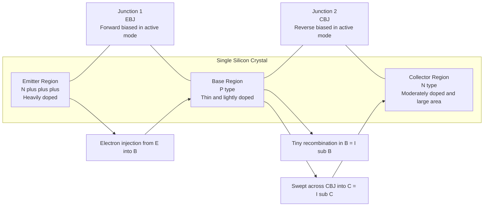
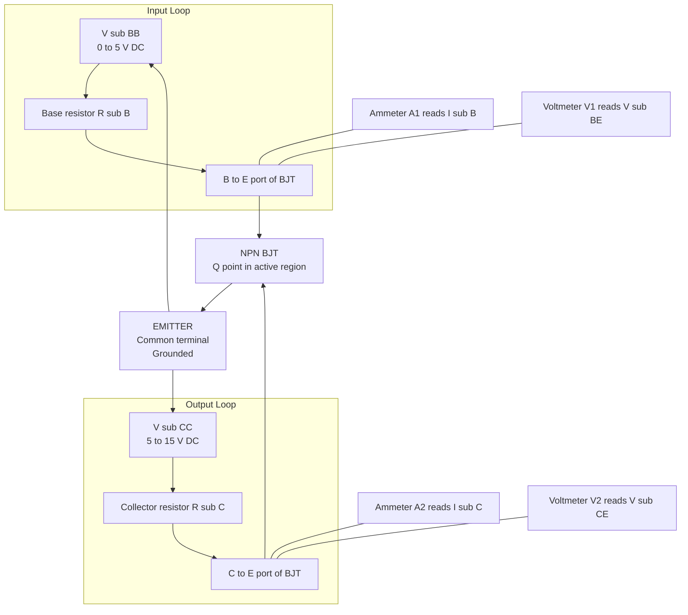
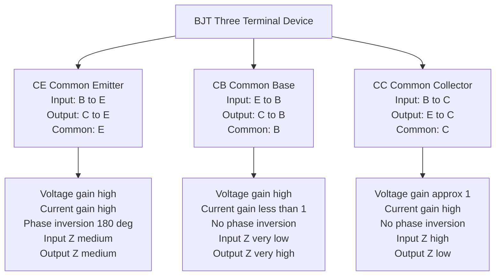
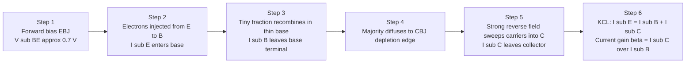
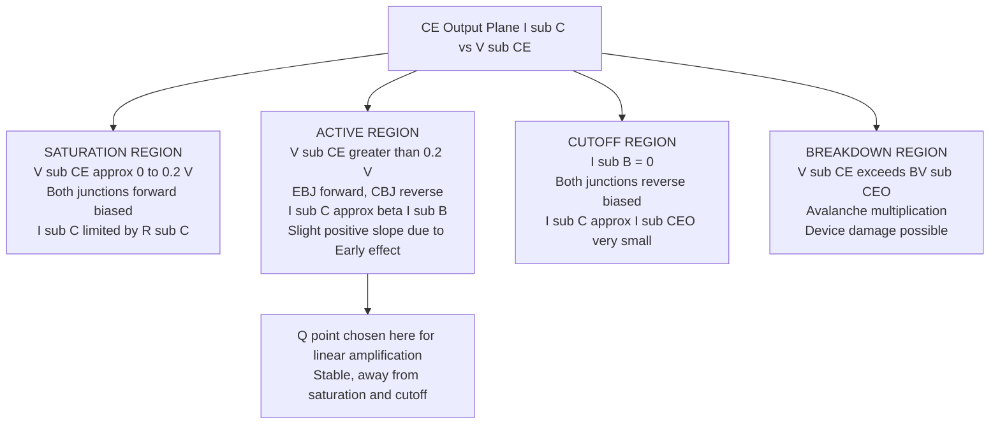

# Construction, working and V-I Characteristics of BJT, Input output characteristics of CE configuration, Comparison of CE, CB and CC configurations

<!-- SECTION_1_START -->
# BJT — Core Technical Definition & Intuitive Overview

## Formal KTU-Syllabus Definition

A **Bipolar Junction Transistor (BJT)** is a three-terminal, two-junction, current-controlled semiconductor device in which the output current is governed by the flow of **both** majority and minority charge carriers across a pair of *p-n* junctions formed within a single crystal. The three terminals are labelled **Emitter (E)**, **Base (B)**, and **Collector (C)**.

The two fundamental variants are:
- **NPN Transistor** — a thin p-type *base* sandwiched between two n-type regions (*emitter* and *collector*). Symbols show the arrow on the emitter pointing **outward** (Not Pointing iN).
- **PNP Transistor** — a thin n-type *base* sandwiched between two p-type regions. The emitter arrow points **inward** (Pointing iN Permanently).

> [!IMPORTANT]
> **KTU Syllabus Highlight (Module 3):**
> BJT belongs to the family of *active devices* — it can **amplify** (provide power gain) and is therefore the workhorse of analog electronics, switching regulators, and digital logic families (TTL).

> [!NOTE]
> The word *Bipolar* is a direct pointer to the participation of **both** polarities of charge carriers (electrons *and* holes). This is the key distinction from *unipolar* devices like the FET, which rely on only one carrier type.

---

## Conceptual Analogy & Geometric Intuition

Imagine a **water tap connected to a thin, flexible pipe**:

| Transistor Element | Water-Tap Analogy | Real-World Meaning |
|---|---|---|
| **Emitter** | The high-pressure main water inlet | Heavily doped region that *injects* carriers into the device. |
| **Base** | The thin, easily-squeezed control pipe | Very thin (≈ 1 µm) and lightly doped — a small twist controls a huge flow. |
| **Collector** | The wide outlet drain | Moderately doped, large area to *collect* almost all carriers emitted by the emitter. |
| **Base current $I_B$** | The small squeeze force on the pipe | A **small** control signal at the base modulates a **large** flow between E and C. |
| **Collector current $I_C$** | The main water flow | The amplified output current — this is the **amplification action**. |

The "squeezing" of the base literally *throttles* the channel between emitter and collector. A tiny base current therefore controls a much larger collector current — that is the heart of **transistor action**.

> [!TIP]
> **Memory Hook — "EBC 3-2-1":** For a standard NPN in *forward-active* mode, the **E**mitter–**B**ase junction is **forward biased** (like an ON diode) and the **C**ollector–**B**ase junction is **reverse biased** (like an OFF diode). Remember: **"EB forward, CB reverse"** ⇒ *active region* where amplification happens.

---

## Standard Physical & Electrical Constants

- Intrinsic carrier concentration of Si at **300 K**: $n_i \approx 1.5 \times 10^{10}\,\text{cm}^{-3}$.
- Thermal voltage at room temperature: $V_T = \dfrac{kT}{q} \approx \mathbf{26\ \text{mV}}$.
- Emitter is the **most heavily doped** region (≈ $10^{19}\,\text{cm}^{-3}$).
- Base is the **thinnest and lightest** doped region (≈ $10^{17}\,\text{cm}^{-3}$, width ≈ 1 µm).
- Collector is **moderately doped** (≈ $10^{16}\,\text{cm}^{-3}$) and has the **largest physical area** to dissipate heat.

---

## Visualization Control

> [!VISUALIZATION CONTROL]
> **Concept:** Qualitative sketch of the Common-Emitter output characteristics $I_C$ vs $V_{CE}$ for varying $I_B$, showing the **active**, **saturation**, and **cutoff** regions on a 2-D Cartesian plane.
>
> **GeoGebra / Desmos Input Equations:**
> - Active region (load line): `I_C = 10 + 0.02 * (V_CE - 2)`  (for $I_B = 40\ \mu A$)
> - Active region: `I_C = 6 + 0.02 * (V_CE - 2)`  (for $I_B = 20\ \mu A$)
> - Active region: `I_C = 2 + 0.02 * (V_CE - 2)`  (for $I_B = 0\ \mu A$, cutoff)
> - Saturation edge: vertical line `V_CE = 0.2`
>
> **Visual Description:** Student should see nearly horizontal, slightly upward-sloping curves in the *active region* (right side), a steep rise on the *saturation region* (left side, $V_{CE} \le 0.2$ V), and the *cutoff* line lying on the $V_{CE}$ axis.

---

<!-- SECTION_1_END -->

<!-- SECTION_2_START -->
# Deep Theoretical Analysis & KTU High-Yield Formula Sheet

## 1. Constructional Anatomy of a BJT

The BJT is fabricated as a *three-layer* sandwich on a single silicon (or germanium) crystal. The two *p-n* junctions formed are:

1. **Emitter–Base Junction (EBJ)**
2. **Collector–Base Junction (CBJ)**

The thin middle layer (the base) is so narrow that carriers can diffuse across it almost without recombining, which is essential for **transistor action**.

### Doping Profile (NPN shown, PNP is the mirror)

| Region | Doping Density | Physical Area | Function |
|---|---|---|---|
| Emitter | Heavily doped ($\approx 10^{19}\ \text{cm}^{-3}$) | Small | Injects a large number of majority carriers into the base. |
| Base | Lightly doped ($\approx 10^{17}\ \text{cm}^{-3}$) | **Very thin** ($\approx 1\ \mu m$) | Controls carrier flow; majority carriers pass through almost without recombination. |
| Collector | Moderately doped ($\approx 10^{16}\ \text{cm}^{-3}$) | **Largest** (heat-sink mounting) | Collects carriers injected by the emitter; dissipates heat. |

> [!NOTE]
> **Why is the base thin and lightly doped?**
> Two reasons. *First*, a thin base gives a high probability that injected carriers sweep across to the collector before recombining. *Second*, light doping keeps the reverse leakage current at the CBJ very small. Both factors together produce a **high current gain** $\beta$.

---

## 2. Modes of Operation (Bias Chart)

| Mode | EBJ Bias | CBJ Bias | Application |
|---|---|---|---|
| **Cutoff** | Reverse | Reverse | Switch is **OFF** (digital '0'). |
| **Active (Forward-Active)** | Forward | Reverse | **Amplification** region (analog). |
| **Saturation** | Forward | Forward | Switch is **ON** (digital '1'). |
| **Reverse-Active** | Reverse | Forward | Not used in practice (very low $\beta$). |

---

## 3. Working Principle — How a BJT Amplifies

When the EBJ is forward-biased, majority carriers from the emitter (electrons in an NPN) are injected into the thin base. Because the base is *thin* and *lightly doped*:

- Only **2 % – 5 %** of these carriers recombine in the base — this small recombination current is the **base current $I_B$**.
- The remaining **95 % – 98 %** diffuse across the reverse-biased CBJ and are swept into the collector by the strong electric field of the depletion region — this is the **collector current $I_C$**.

This microscopic division of emitter current is the essence of **current amplification**.

$$\boxed{\ I_E = I_B + I_C\ }$$

---

## 4. The Three Configurations

A BJT can be connected in three distinct two-port topologies, each with the *input* applied between two terminals and the *output* taken from the other two, with the **third terminal common to both**.

| Configuration | Input Port | Output Port | Common Terminal | Typical Use |
|---|---|---|---|---|
| **Common Emitter (CE)** | Base – Emitter | Collector – Emitter | Emitter | General-purpose **voltage amplifier** (most widely used). |
| **Common Base (CB)** | Emitter – Base | Collector – Base | Base | **High-frequency** RF amplifier, low-input-impedance stage. |
| **Common Collector (CC) / Emitter Follower** | Base – Collector | Emitter – Collector | Collector | **Buffer** / impedance-matching stage (unity voltage gain, high current gain). |

> [!IMPORTANT]
> The **CE configuration** is the *workhorse* of BJT amplifier design and is **mandatory** in the KTU Module-3 syllabus. The CB and CC are presented as comparative extensions.

---

## 5. Common-Emitter (CE) Configuration — Current & Voltage Conventions

For an NPN BJT in CE mode:

- **Input side:** $V_{BE}$ applied between Base (+) and Emitter (–).
- **Output side:** $V_{CE}$ applied between Collector (+) and Emitter (–).
- Currents: $I_B$ enters the base, $I_C$ enters the collector, $I_E$ leaves the emitter.
- All currents are treated as **positive** when entering the device (passive sign convention).

The two port variables are $\{V_{BE}, I_B\}$ (input) and $\{V_{CE}, I_C\}$ (output).

---

## 6. Input Characteristics of CE Configuration

The **input characteristic** is a plot of $I_B$ versus $V_{BE}$, parameterised on $V_{CE}$ (held constant).

**Salient features:**

1. The curve resembles the **forward-biased diode** $I$–$V$ characteristic (since the EBJ is essentially a forward-biased diode).
2. The curve is **almost independent of $V_{CE}$** because the CBJ being reverse-biased has negligible effect on the EBJ injection.
3. The **cut-in voltage** is approximately **0.5 V for Ge** and **0.7 V for Si**.
4. Beyond the cut-in, $I_B$ rises exponentially with $V_{BE}$, following the diode equation:

$$I_B = I_{S(E)}\,\bigl(e^{V_{BE}/V_T} - 1\bigr) \approx I_{S(E)}\,e^{V_{BE}/V_T}$$

where $I_{S(E)}$ is the base–emitter saturation current and $V_T \approx 26$ mV.

---

## 7. Output Characteristics of CE Configuration

The **output characteristic** is a plot of $I_C$ versus $V_{CE}$ for several *constant* values of $I_B$. It has three distinct regions:

### (a) Active Region
- Curves are **nearly horizontal** with a slight positive slope.
- $I_C$ is controlled almost entirely by $I_B$ via the relation $I_C = \beta\,I_B + I_{CEO}$.
- A small rise in $I_C$ with $V_{CE}$ is captured by the **Early voltage** $V_A$:

$$I_C = \beta\,I_B \left(1 + \frac{V_{CE}}{V_A}\right)$$

- The reciprocal of the slope gives the **output resistance** $r_o$.

### (b) Saturation Region
- Located to the **left** of $V_{CE(\text{sat})} \approx 0.2$ V.
- Both junctions are forward biased; $I_C$ is no longer controlled by $I_B$ — instead it is limited by the external circuit.
- Approximate relationship: $I_{C(\text{sat})} \approx \beta\,I_{B(\text{sat})}$.

### (c) Cutoff Region
- Curve lies **along the $V_{CE}$ axis** ($I_C = 0$).
- Both junctions reverse biased; only the tiny leakage $I_{CEO}$ flows.

---

## 8. Current Gain Relationships — the Three $\alpha, \beta, \gamma$ Trio

**Common-Emitter current gain $\beta$ (also called $h_{FE}$):**

$$\boxed{\ \beta = \frac{I_C}{I_B}\ }$$

**Common-Base current gain $\alpha$:**

$$\boxed{\ \alpha = \frac{I_C}{I_E}\ }$$

**Common-Collector current gain $\gamma$:**

$$\boxed{\ \gamma = \frac{I_E}{I_B}\ }$$

**The three are mathematically interlocked:**

$$\beta = \frac{\alpha}{1-\alpha}\ ,\qquad \alpha = \frac{\beta}{1+\beta}\ ,\qquad \gamma = \beta + 1 = \frac{1}{1-\alpha}$$

For a typical small-signal silicon BJT: $\alpha \approx 0.95$–$0.99$ and $\beta \approx 20$–$300$.

---

## 9. KTU High-Yield Formula Sheet

| # | Quantity | Symbol | Expression | Typical Value / Unit |
|---|---|---|---|---|
| 1 | KCL at the BJT | – | $I_E = I_B + I_C$ | A / mA / µA |
| 2 | CE current gain | $\beta$ | $\beta = I_C / I_B$ | 20 – 300 |
| 3 | CB current gain | $\alpha$ | $\alpha = I_C / I_E$ | 0.95 – 0.99 |
| 4 | CC current gain | $\gamma$ | $\gamma = I_E / I_B$ | 21 – 301 |
| 5 | $\alpha$–$\beta$ link | – | $\alpha = \beta/(1+\beta)$ | dimensionless |
| 6 | $\beta$ in terms of $\alpha$ | – | $\beta = \alpha/(1-\alpha)$ | dimensionless |
| 7 | Base–emitter diode eqn. | $I_B$ | $I_B = I_{S(E)}\,e^{V_{BE}/V_T}$ | A |
| 8 | Early effect | $I_C$ | $I_C = \beta I_B(1+V_{CE}/V_A)$ | A |
| 9 | Output resistance | $r_o$ | $r_o = V_A / I_C$ | kΩ – MΩ |
| 10 | Thermal voltage | $V_T$ | $kT/q$ | 26 mV at 300 K |
| 11 | Si cut-in voltage | – | – | 0.7 V |
| 12 | Ge cut-in voltage | – | – | 0.3 V |
| 13 | $V_{CE}$ saturation | – | – | ≈ 0.2 V |

> [!WARNING]
> **Units pitfall:** Always express $I_C, I_B, I_E$ in **the same unit** before plugging into gain formulas. Mixing µA and mA is a common KTU board-exam blunder.

---

## 10. Real-World Engineering Utility

| Application | Configuration Used | Why? |
|---|---|---|
| Audio pre-amplifier stages | **CE** | High voltage gain, moderate input impedance. |
| RF / microwave front-end | **CB** | Excellent high-frequency response, low noise. |
| Power-amplifier output stage | **CC (Emitter Follower)** | Low output impedance, drives low-impedance loads. |
| TTL digital logic gates | **CE with active load** | Sharp switching between cutoff and saturation. |
| Impedance matching (e.g., between a high-Z sensor and a low-Z speaker) | **CC** | Acts as a near-ideal buffer. |

---

<!-- SECTION_2_END -->

<!-- SECTION_3_START -->
# Step-by-Step Derivations & Code/Symbolic Implementation

## Part A — Mathematical / Analytical Derivations

### Derivation 1 — Relationship Between $I_C$, $I_B$, and $I_E$

Let the emitter inject a current $I_E$ into the base. Of this:

- A fraction $\alpha$ reaches the collector.
- The remaining fraction $(1-\alpha)$ recombines in the base and leaves as $I_B$.

Therefore:

$$I_C = \alpha\,I_E$$

$$I_B = I_E - I_C = I_E - \alpha I_E = (1-\alpha)\,I_E$$

**Now apply KCL** at the transistor node:

$$I_E = I_B + I_C$$

**Step 1:** Substitute $I_C = \alpha I_E$ into the KCL equation:

$$I_E = I_B + \alpha I_E$$

**Step 2:** Group $I_E$ terms on the left side:

$$I_E - \alpha I_E = I_B$$

$$I_E\,(1 - \alpha) = I_B$$

**Step 3:** Solve for $I_E$:

$$I_E = \frac{I_B}{1-\alpha}$$

**Step 4:** Solve for $I_C$ using $I_C = \alpha I_E$:

$$I_C = \frac{\alpha\,I_B}{1-\alpha}$$

**Step 5:** Identify the coefficient of $I_B$ as $\beta$:

$$\boxed{\ \beta = \frac{\alpha}{1-\alpha}\ } \quad\Longrightarrow\quad \boxed{\ I_C = \beta\,I_B\ }$$

> **Validation check:** If $\alpha = 0.98$, then $\beta = 0.98/0.02 = 49$, i.e. a small base current of 1 mA would produce $I_C = 49$ mA — confirming the *amplifying* nature of the device.

---

### Derivation 2 — Output Current $I_C$ in Terms of $\alpha$ and Emitter Current $I_E$

Starting from KCL: $I_E = I_C + I_B$.

**Step 1:** Express the base current in terms of $I_C$ and $I_E$ using $I_C = \alpha I_E$:

$$I_B = I_E - I_C = I_E - \alpha I_E = (1-\alpha)\,I_E$$

**Step 2:** Write the ratio $I_C / I_E$:

$$\frac{I_C}{I_E} = \alpha$$

**Step 3:** Cross-multiply:

$$\boxed{\ I_C = \alpha\,I_E\ }$$

**Step 4:** Solve KCL for $I_C$ in terms of $I_B$ and $\alpha$:

$$I_C = I_E - I_B = \frac{I_B}{1-\alpha} - I_B = I_B\!\left(\frac{1}{1-\alpha} - 1\right) = \frac{\alpha}{1-\alpha}\,I_B$$

**Step 5:** Define:

$$\boxed{\ \beta = \frac{I_C}{I_B} = \frac{\alpha}{1-\alpha}\ }$$

---

### Derivation 3 — Deriving the CE Output Characteristic Equation (with Early Effect)

The output characteristic curve in the active region is not perfectly horizontal. The small upward slope is captured by the **Early effect (base-width modulation)**.

**Step 1:** At any operating point the collector current is fundamentally:

$$I_C = \alpha\,I_E$$

**Step 2:** As $V_{CE}$ increases, the CBJ depletion region widens, effectively *narrowing* the quasi-neutral base. This reduces the chance of recombination in the base, slightly increasing $\alpha$ (and hence $I_C$).

**Step 3:** Empirically, $\alpha$ varies with $V_{CE}$ as:

$$\alpha = \alpha_0\!\left(1 + \frac{V_{CE}}{V_A}\right)$$

where $V_A$ is the **Early voltage** (typically 50 V – 200 V, read from the x-intercept of the extrapolated active-region curves).

**Step 4:** Since $I_C = \alpha\,I_E$ and $I_E$ is fixed for a given $I_B$ in the active region, the collector current becomes:

$$I_C = \alpha_0\!\left(1 + \frac{V_{CE}}{V_A}\right) I_E = \beta_0 I_B\!\left(1 + \frac{V_{CE}}{V_A}\right)$$

where $\beta_0 = \alpha_0 / (1-\alpha_0)$.

**Step 5:** Define the **output resistance** $r_o$ from the reciprocal slope of the curve:

$$\frac{1}{r_o} = \left.\frac{\partial I_C}{\partial V_{CE}}\right|_{I_B} = \frac{\beta_0 I_B}{V_A} = \frac{I_C}{V_A}$$

**Step 6:** Therefore:

$$\boxed{\ r_o = \frac{V_A}{I_C}\ }$$

> **Numerical sanity check:** If $V_A = 100$ V and $I_C = 10$ mA, then $r_o = 100/(10 \times 10^{-3}) = 10\ \text{k}\Omega$, which is typical for a small-signal BJT.

---

### Derivation 4 — Quantitative Example (KTU-style numerical)

> **Problem:** A silicon BJT has $\alpha = 0.98$ and $I_{CBO} = 5\ \mu A$. With the base open-circuited ($I_B = 0$), determine the collector-to-emitter leakage current $I_{CEO}$. Then, with $I_B = 30\ \mu A$, find $I_C$ and $I_E$.

**Step 1 — Find $\beta$ from $\alpha$:**

$$\beta = \frac{\alpha}{1-\alpha} = \frac{0.98}{1-0.98} = \frac{0.98}{0.02} = 49$$

**Step 2 — Use the $I_{CEO}$ formula:**

$$I_{CEO} = \frac{I_{CBO}}{1-\alpha} = (\beta+1)\,I_{CBO} = (49+1)\times 5\ \mu A = 250\ \mu A$$

**Step 3 — Compute $I_C$ with $I_B = 30\ \mu A$:**

$$I_C = \beta I_B + I_{CEO} = 49 \times 30\ \mu A + 250\ \mu A = 1470\ \mu A + 250\ \mu A = 1720\ \mu A$$

$$I_C \approx 1.72\ \text{mA}$$

**Step 4 — Compute $I_E$ from KCL:**

$$I_E = I_B + I_C = 30\ \mu A + 1720\ \mu A = 1750\ \mu A$$

$$I_E = 1.75\ \text{mA}$$

**Verification:** $\alpha = I_C/I_E = 1.72/1.75 = 0.9828 \approx 0.98$ ✓ (small deviation is due to $I_{CEO}$).

---

## Part B — Algorithmic / Python Implementation

A fully operational Python module to compute BJT port quantities, validate $\alpha$–$\beta$ consistency, and plot the CE output characteristic. Uses **strict type hints, boundary checks, and error logging**.

```python
"""
bjt_analysis.py
================
Educational toolkit for BJT current-gain analysis and CE
output-characteristic visualisation.

Run:  python bjt_analysis.py
"""

from __future__ import annotations
import logging
import sys
from dataclasses import dataclass

import numpy as np
import matplotlib.pyplot as plt


# ------------------------------------------------------------------ #
# 1.  Configure structured logging                                   #
# ------------------------------------------------------------------ #
logging.basicConfig(
    level=logging.INFO,
    format="%(asctime)s [%(levelname)s] %(message)s",
    stream=sys.stdout,
)
log = logging.getLogger("BJT-Analysis")


# ------------------------------------------------------------------ #
# 2.  Core data class for a single BJT                               #
# ------------------------------------------------------------------ #
@dataclass(frozen=True)
class BJT:
    """Immutable container for static BJT parameters."""
    alpha: float                       # Common-base current gain (0 < alpha < 1)
    I_CBO_uA: float = 1.0              # Collector-Base leakage current [µA]
    V_A_V: float = 100.0               # Early voltage [V]

    def __post_init__(self) -> None:
        if not 0.0 < self.alpha < 1.0:
            raise ValueError(
                f"alpha must lie in (0, 1); received {self.alpha}"
            )
        if self.I_CBO_uA < 0.0:
            raise ValueError("I_CBO cannot be negative")
        if self.V_A_V <= 0.0:
            raise ValueError("Early voltage V_A must be positive")

    # ---------------------- derived gains -------------------------- #
    @property
    def beta(self) -> float:
        """Common-emitter DC current gain beta = alpha / (1 - alpha)."""
        return self.alpha / (1.0 - self.alpha)

    @property
    def gamma(self) -> float:
        """Common-collector current gain gamma = beta + 1."""
        return self.beta + 1.0

    @property
    def I_CEO_uA(self) -> float:
        """Collector-Emitter leakage with base open-circuited [µA]."""
        return self.I_CBO_uA / (1.0 - self.alpha)


# ------------------------------------------------------------------ #
# 3.  Working-point calculator                                       #
# ------------------------------------------------------------------ #
@dataclass(frozen=True)
class OperatingPoint:
    I_B_uA: float                      # Base current [µA]
    I_C_mA: float                      # Collector current [mA]
    I_E_mA: float                      # Emitter current  [mA]
    V_CE_V: float = 5.0                # Collector-Emitter voltage [V]

    def alpha_check(self, transistor: BJT, tol: float = 0.02) -> bool:
        """Verify that the calculated I_C / I_E matches alpha."""
        ratio = self.I_C_mA / self.I_E_mA
        return abs(ratio - transistor.alpha) < tol


def compute_operating_point(
    transistor: BJT,
    I_B_uA: float,
    V_CE_V: float = 5.0,
) -> OperatingPoint:
    """Compute (I_B, I_C, I_E) for a given base current and V_CE.

    Parameters
    ----------
    transistor : BJT
        Static BJT parameters.
    I_B_uA : float
        Base current in micro-amps (must be >= 0).
    V_CE_V : float
        Collector-emitter voltage in volts (must be > V_CE_sat).

    Returns
    -------
    OperatingPoint
        Dataclass with I_C, I_E in mA.
    """
    # -------- boundary checks ---------------------------------------- #
    if I_B_uA < 0.0:
        raise ValueError("I_B cannot be negative")
    if V_CE_V <= 0.2:
        raise ValueError("V_CE below saturation; CE model not valid")

    # -------- compute collector current (with Early effect) --------- #
    I_C_uA = (
        transistor.beta * I_B_uA
        * (1.0 + V_CE_V / transistor.V_A_V)
    ) + transistor.I_CEO_uA

    # -------- emitter current from KCL ------------------------------ #
    I_E_uA = I_B_uA + I_C_uA

    log.info(
        "I_B = %.2f µA → I_C = %.3f mA, I_E = %.3f mA, V_CE = %.2f V",
        I_B_uA, I_C_uA / 1e3, I_E_uA / 1e3, V_CE_V,
    )

    return OperatingPoint(
        I_B_uA=I_B_uA,
        I_C_mA=I_C_uA / 1e3,
        I_E_mA=I_E_uA / 1e3,
        V_CE_V=V_CE_V,
    )


# ------------------------------------------------------------------ #
# 4.  CE output-characteristic plot                                  #
# ------------------------------------------------------------------ #
def plot_ce_output(
    transistor: BJT,
    I_B_list_uA: list[float],
    V_CE_max: float = 10.0,
    V_CE_sat: float = 0.2,
    save_path: str | None = None,
) -> None:
    """Plot I_C vs V_CE for several I_B values (CE output curves)."""
    V_CE = np.linspace(V_CE_sat, V_CE_max, 400)
    plt.figure(figsize=(7, 5))

    for I_B in I_B_list_uA:
        I_C = (
            transistor.beta * I_B
            * (1.0 + V_CE / transistor.V_A_V)
            + transistor.I_CEO_uA
        ) / 1e3     # convert µA → mA
        plt.plot(V_CE, I_C, label=f"$I_B$ = {I_B} µA")

    plt.axvline(V_CE_sat, color="k", linestyle="--", linewidth=0.8)
    plt.text(V_CE_sat + 0.1, 0.05, "Saturation", rotation=90)
    plt.xlabel("$V_{CE}$ (V)")
    plt.ylabel("$I_C$ (mA)")
    plt.title("CE Output Characteristics")
    plt.grid(True, which="both", linestyle=":", linewidth=0.6)
    plt.legend()
    plt.tight_layout()
    if save_path:
        plt.savefig(save_path, dpi=150)
        log.info("Figure saved to %s", save_path)
    plt.show()


# ------------------------------------------------------------------ #
# 5.  Demonstration / main                                           #
# ------------------------------------------------------------------ #
if __name__ == "__main__":
    # A typical small-signal silicon NPN (e.g. BC547 family)
    q1 = BJT(alpha=0.98, I_CBO_uA=5.0, V_A_V=120.0)

    log.info("beta  = %.2f", q1.beta)
    log.info("gamma = %.2f", q1.gamma)
    log.info("I_CEO = %.2f µA", q1.I_CEO_uA)

    # Working point at I_B = 30 µA, V_CE = 5 V
    op = compute_operating_point(q1, I_B_uA=30.0, V_CE_V=5.0)
    assert op.alpha_check(q1), "Alpha consistency check failed!"

    # CE output-characteristic family
    plot_ce_output(
        q1,
        I_B_list_uA=[0.0, 10.0, 20.0, 30.0, 40.0],
        V_CE_max=10.0,
    )
```

> [!TIP]
> The script's `OperatingPoint.alpha_check` is a self-test — it programmatically confirms the numerical derivation $\alpha = I_C/I_E$ with a 2 % tolerance, catching unit-conversion mistakes that KTU examiners love to penalise.

---

## Part C — Engineering Graphical / Schematic Workflow

For the *physical* construction diagram of an NPN planar BJT and the *CE test circuit*, follow this drafting sequence:

| Step | Reference Plane | Drawing Element | Notes |
|---|---|---|---|
| 1 | **HP** (Horizontal Plane) | Draw the cross-section: thin p-type base sandwiched between two n-type regions. | Label Emitter (E), Base (B), Collector (C) and the two depletion regions. |
| 2 | **HP** | Show the **ohmic contacts** as small rectangles on each region. | Emitter contact is small, base contact is a ring, collector contact covers the bottom. |
| 3 | **VP** (Vertical Plane) | Project the **CE circuit**: input loop on the left, output loop on the right, emitter common. | Use the standard symbol with arrow on emitter pointing **outward** for NPN. |
| 4 | **VP** | Mark the polarities of $V_{BB}$ (forward-biases EBJ) and $V_{CC}$ (reverse-biases CBJ). | $V_{BB} \approx 0.7$ V, $V_{CC} \approx 5$–$15$ V typical. |
| 5 | **Output plot** | Plot $I_C$ on the y-axis, $V_{CE}$ on x-axis; superimpose the DC **load line** $V_{CC} = I_C R_C + V_{CE}$. | Mark Q-point, cutoff and saturation intercepts. |

---

<!-- SECTION_3_END -->

<!-- SECTION_4_START -->
# Structural Diagrams & Schematics

## 4.1  Mermaid Block Diagram — Three-Region Construction of an NPN BJT



## 4.2  Mermaid Block Diagram — Common-Emitter (CE) Test Setup



## 4.3  Mermaid Functional Architecture — Comparison of the Three Configurations



## 4.4  Sequential Processing Topology — Active-Mode Carrier Flow Matrix



## 4.5  CE Output Characteristic — Region Map



## 4.6  Comparison Matrix — CE vs CB vs CC

| Parameter | Common Emitter (CE) | Common Base (CB) | Common Collector (CC) |
|---|---|---|---|
| **Input port** | Base – Emitter | Emitter – Base | Base – Collector |
| **Output port** | Collector – Emitter | Collector – Base | Emitter – Collector |
| **Common terminal** | Emitter (E) | Base (B) | Collector (C) |
| **Input resistance $R_{in}$** | Medium (≈ 1 kΩ) | Very low (≈ 20–100 Ω) | High (≈ 150–600 kΩ) |
| **Output resistance $R_{out}$** | Medium (≈ 50 kΩ) | Very high (≈ 1 MΩ) | Low (≈ 25 Ω) |
| **Current gain $A_I$** | High ($\beta$, 20 – 300) | < 1 ($\alpha$, 0.95 – 0.99) | High ($\gamma \approx \beta+1$) |
| **Voltage gain $A_V$** | High (≈ –200 typical) | High (≈ 500 typical) | ≈ 1 (unity) |
| **Power gain** | High (≈ 40 dB) | Moderate (≈ 30 dB) | Moderate (≈ 15 dB) |
| **Phase shift (input → output)** | **180 °** (inverting) | **0 °** (non-inverting) | **0 °** (non-inverting) |
| **Frequency response** | Poor (Miller effect) | Excellent (no Miller) | Good |
| **Typical application** | General voltage amplifier | RF / high-frequency amp | Buffer / impedance matcher |
| **Symbolic nickname** | "Workhorse amplifier" | "Low-noise RF stage" | "Emitter follower" |

---

<!-- SECTION_4_END -->

<!-- SECTION_5_START -->
# KTU 2024 Scheme Examination Question Bank & Topic Recap

## Part A — Short-Answer Questions (3 Marks Each)

### Q1. [KTU University Exam – July 2024]  *(CO1, Remember)*

**Define a Bipolar Junction Transistor. Mention the two types of BJTs with neat symbols.**

**Model Answer (3 marks):**

A BJT is a three-terminal, two-junction semiconductor device whose operation depends on **both** majority and minority charge carriers (*hence the term "bipolar"*). The terminals are the **Emitter (E)**, **Base (B)** and **Collector (C)**, and the two *p-n* junctions are the **Emitter–Base Junction (EBJ)** and the **Collector–Base Junction (CBJ)**.

**Two types:**

1. **NPN transistor** – A thin p-type base sandwiched between two n-type regions. In the schematic symbol, the arrow on the emitter points **outward** ("Not Pointing iN").
2. **PNP transistor** – A thin n-type base sandwiched between two p-type regions. The arrow on the emitter points **inward** ("Pointing iN Permanently").

> **Mark split:** [Definition: 1 Mark]  [NPN description + symbol: 1 Mark]  [PNP description + symbol: 1 Mark]

---

### Q2. [KTU University Exam – Dec 2023]  *(CO1, Understand)*

**Draw the input characteristic of a CE-configured BJT and explain its salient features.**

**Model Answer (3 marks):**

The CE input characteristic is a plot of $I_B$ (y-axis) versus $V_{BE}$ (x-axis), taken at a constant $V_{CE}$.

**Salient features:**

1. The curve resembles the **forward-biased p-n diode** characteristic, since the EBJ behaves as a forward-biased diode.
2. The curve has a **cut-in (knee) voltage** of about **0.7 V for Si** and **0.3 V for Ge**.
3. Beyond the cut-in, $I_B$ rises **exponentially** with $V_{BE}$ following $I_B = I_{S(E)}\,e^{V_{BE}/V_T}$.
4. The curves for different $V_{CE}$ values are **almost coincident**, indicating that the input characteristic is **nearly independent of $V_{CE}$**.

> **Mark split:** [Neat sketch with labelled axes: 1 Mark]  [Any two features: 1 Mark]  [Remaining feature + equation: 1 Mark]

---

## Part B — Long-Answer Questions (14 Marks Each, with Internal Choice)

> *Per KTU 2024 ESE pattern, each Part-B question is divided into two 7-mark sub-parts and the student answers **either** Question A **or** Question B in full.*

### ⬛ Question A (14 Marks)

#### (a) [KTU University Exam – July 2024, Modified]  *(CO1, Understand — 7 Marks)*

**With a neat diagram, explain the construction and working of an NPN transistor in the *forward-active* region. Discuss the role of emitter, base and collector doping.**

**Model Answer:**

**Construction (4 marks):**

The NPN BJT is a three-layer sandwich of n-p-n semiconductor material grown on a single silicon crystal.

- **Emitter (n⁺⁺):** Heavily doped ($\approx 10^{19}\,\text{cm}^{-3}$). Its job is to **inject a large number of electrons** into the base when the EBJ is forward biased. A small physical area is sufficient.
- **Base (p):** Very **thin** (≈ 1 µm) and **lightly doped** ($\approx 10^{17}\,\text{cm}^{-3}$). Light doping and small width together minimise carrier recombination, so the *base current* $I_B$ remains tiny.
- **Collector (n):** Moderately doped ($\approx 10^{16}\,\text{cm}^{-3}$) and physically **largest**, often mounted on the metal case for **heat dissipation**. It collects almost all electrons that survive the base.

The two *p-n* junctions are the **Emitter–Base Junction (EBJ)** and the **Collector–Base Junction (CBJ)**.

**Working in the active region (3 marks):**

When $V_{BE} \approx 0.7$ V (forward bias) and $V_{CB}$ is reverse biased:

1. The EBJ conducts, and a large stream of electrons is injected from the emitter into the base.
2. Because the base is *thin* and *lightly doped*, only **2–5 %** of the electrons recombine with holes in the base — this recombination current **leaves the base terminal** as $I_B$.
3. The remaining **95–98 %** diffuse to the edge of the CBJ depletion region, where the strong reverse-bias field sweeps them into the collector — this is the **collector current $I_C$**.

Applying KCL: $I_E = I_B + I_C$. The ratio $I_C / I_B$ is the large **current gain $\beta$**, demonstrating **transistor amplification**.

> **Mark split (7 marks):** [Labelled cross-section diagram: 2 Marks]  [Doping roles of E, B, C: 2 Marks]  [Active-region working steps: 2 Marks]  [KCL + amplification conclusion: 1 Mark]

---

#### (b) [KTU University Exam – Dec 2023, Modified]  *(CO2, Apply — 7 Marks)*

**A silicon BJT has $I_C = 20$ mA when $I_B = 100$ µA, with the EBJ forward biased and the CBJ reverse biased. Determine (i) $\alpha$, (ii) $\beta$, and (iii) the new $I_C$ if $I_B$ is increased to 150 µA (assume $V_{CE}$ constant and neglect $I_{CEO}$).**

**Model Answer:**

**Step 1 — Compute $\beta$ (2 marks):**

$$\beta = \frac{I_C}{I_B} = \frac{20\ \text{mA}}{100\ \mu A} = \frac{20 \times 10^{-3}}{100 \times 10^{-6}} = 200$$

**Step 2 — Compute $\alpha$ (2 marks):**

$$\alpha = \frac{\beta}{1+\beta} = \frac{200}{201} \approx 0.995$$

(Equivalently, $\alpha = I_C / I_E$ where $I_E = I_B + I_C = 20.1$ mA, giving $\alpha = 20 / 20.1 = 0.9950$.)

**Step 3 — Compute new $I_C$ (3 marks):**

$$I_C^{\,'} = \beta\,I_B^{\,'} = 200 \times 150\ \mu A = 200 \times 150 \times 10^{-6}\ \text{A} = 30\ \text{mA}$$

**Summary of results:** $\beta = 200$, $\alpha \approx 0.995$, $I_C^{\,'} = 30$ mA.

> **Mark split (7 marks):** [$\beta$ formula + value: 2 Marks]  [$\alpha$ formula + value: 2 Marks]  [New $I_C$ setup, calculation, final value: 3 Marks]

---

### ⬛ Question B (Alternative to Question A — 14 Marks)

#### (a) [KTU University Exam – July 2023, Modified]  *(CO1, Understand — 7 Marks)*

**Draw the output characteristics of a BJT in the CE configuration. Clearly mark the cutoff, active and saturation regions. Explain the Early effect.**

**Model Answer:**

**Output Characteristic Sketch (3 marks):**

Plot $I_C$ (y-axis) versus $V_{CE}$ (x-axis) for several *constant* values of $I_B$. The plot has three regions:

- **Cutoff region:** Curve along the $V_{CE}$ axis ($I_B = 0$ ⇒ $I_C = I_{CEO} \approx 0$).
- **Active region:** $V_{CE} > 0.2$ V. The curves are *nearly horizontal* with a small positive slope. $I_C$ is controlled by $I_B$ through $I_C = \beta I_B$.
- **Saturation region:** $V_{CE} \le V_{CE(\text{sat})} \approx 0.2$ V. All curves converge to a steep rise; $I_C$ is limited by the external circuit and is **independent** of $I_B$.

**Early Effect (4 marks):**

When $V_{CE}$ is increased in the active region, the reverse-biased CBJ depletion region widens and encroaches into the *neutral base*, effectively **narrowing** the base width $W$. Because the base is now narrower:

- The chance of electron recombination in the base **decreases**, so $\alpha$ (and hence $I_C$) slightly **increases** with $V_{CE}$.
- The slight upward slope of the active-region curve is captured by the **Early voltage** $V_A$ and the relation:

$$I_C = \beta I_B \left(1 + \frac{V_{CE}}{V_A}\right)$$

- The reciprocal slope gives the **output resistance** $r_o = V_A / I_C$.
- When extrapolated, all the active-region curves (for different $I_B$) meet at a single point on the *negative* $V_{CE}$ axis at $V_{CE} = -V_A$, which is the geometric construction to identify $V_A$.

> **Mark split (7 marks):** [Labelled sketch with three regions: 3 Marks]  [Early-effect explanation: 3 Marks]  [Early-effect equation + physical meaning: 1 Mark]

---

#### (b) [KTU University Exam – Dec 2022, Modified]  *(CO2, Apply — 7 Marks)*

**Compare the Common-Emitter, Common-Base and Common-Collector configurations of a BJT with respect to (i) current gain, (ii) voltage gain, (iii) input and output resistance, (iv) phase reversal and (v) typical application. State the relation $\alpha = \beta / (1 + \beta)$ and use it to show that $\beta = 49$ when $\alpha = 0.98$.**

**Model Answer:**

**Comparison table (5 marks):**

| Parameter | CE | CB | CC |
|---|---|---|---|
| Current gain | High ($\beta$) | < 1 ($\alpha$) | High ($\gamma \approx \beta+1$) |
| Voltage gain | High (≈ –200) | High (≈ 500) | ≈ 1 (follower) |
| Input resistance | Medium | Very low | High |
| Output resistance | Medium | Very high | Low |
| Phase reversal | **Yes (180 °)** | No (0 °) | No (0 °) |
| Typical use | General amp | RF amp | Buffer |

**Derivation of the link (2 marks):**

By KCL: $I_E = I_B + I_C$, and by definition $\alpha = I_C / I_E$, $\beta = I_C / I_B$.

$$I_B = I_E - I_C = I_E(1 - \alpha)$$

$$\beta = \frac{I_C}{I_B} = \frac{\alpha I_E}{(1 - \alpha) I_E} = \frac{\alpha}{1 - \alpha}$$

Inverting:

$$\alpha = \frac{\beta}{1 + \beta}$$

**Numerical verification (1 mark):**

With $\alpha = 0.98$:

$$\beta = \frac{0.98}{1 - 0.98} = \frac{0.98}{0.02} = 49$$

> **Mark split (7 marks):** [Comparison table with all five parameters: 5 Marks]  [$\alpha$–$\beta$ derivation: 2 Marks — or split as 1 mark derivation + 1 mark numerical]

---

> [!WARNING]
> **KTU Examiner's Valuation Pitfalls — common deductions:**
> 1. **Missing KCL statement.** Whenever a numerical problem is given, *explicitly* write $I_E = I_B + I_C$ as the first line. Skipping it costs a full mark.
> 2. **Unit inconsistency.** Always convert µA → mA or vice versa *before* dividing. KTU examiners deduct 0.5 marks per unit mismatch.
> 3. **Region labelling on output curves.** Mark the *active*, *saturation* and *cutoff* regions on the *graph itself* with dashed vertical lines, not just in the text.
> 4. **Phase reversal.** In CE, the *voltage* gain is **inverted** (180 °), but the *current* gain is **non-inverting** — students often get this wrong.
> 5. **Confusing $\beta$ with $\alpha$.** $\alpha < 1$ always; $\beta \gg 1$ for a typical BJT. Mixing them up in a numerical answer is an instant 1-mark cut.
> 6. **Forgetting the arrow direction** in the BJT symbol (outward for NPN, inward for PNP). Loss of 0.5 marks in any diagram-based question.

---

## 📌 Topic Recap & Important Things to Remember

- **BJT = Bipolar Junction Transistor**: a three-terminal (E, B, C), two-junction (EBJ, CBJ), current-controlled device. Two polarities of carriers participate in conduction — hence *bipolar*.
- **Two types**: **NPN** (arrow pointing **out** of emitter) and **PNP** (arrow pointing **in**). KTU questions almost always centre on **NPN**.
- **Doping rule of thumb** — *E ≫ B > C* in doping, *C > B > E* in physical size.
- **Active region** is the *amplifying* region: **EBJ forward biased, CBJ reverse biased**. The output current is $I_C = \beta I_B + I_{CEO} \approx \beta I_B$.
- **The three KCL-derived current-gain identities** are non-negotiable:

$$I_E = I_B + I_C,\quad \beta = \frac{I_C}{I_B},\quad \alpha = \frac{I_C}{I_E},\quad \gamma = \frac{I_E}{I_B}$$

- **The $\alpha$–$\beta$ bridge formulas** must be memorised:
$$\beta = \frac{\alpha}{1-\alpha}\ ,\quad \alpha = \frac{\beta}{1+\beta}\ ,\quad \gamma = 1+\beta$$
- **Thermal voltage** at 300 K: $V_T \approx \mathbf{26\ mV}$. Diode equation: $I = I_S \left(e^{V/V_T} - 1\right)$.
- **Cut-in voltage**: $\approx \mathbf{0.7\ V}$ for Si, $\approx \mathbf{0.3\ V}$ for Ge.
- **$V_{CE(\text{sat})}$** $\approx \mathbf{0.2\ V}$ — the boundary between saturation and active regions.
- **Input characteristic** (CE) is essentially the **forward-biased EBJ diode** curve, **nearly independent** of $V_{CE}$.
- **Output characteristic** (CE) has three regions: **cutoff** (along the $V_{CE}$ axis), **active** (nearly horizontal family of curves), and **saturation** (steep rise on the left).
- **Early effect** introduces a small positive slope $\dfrac{1}{r_o} = \dfrac{I_C}{V_A}$ in the active region; the *Early voltage* $V_A$ is read as the (negative) x-intercept when the active-region curves are extrapolated.
- **Configuration triad** (CE / CB / CC) comparison — the CE is the *workhorse* (high gain, 180° phase inversion), CB is the *RF favourite* (low input Z, no Miller effect), CC is the *buffer* (voltage follower, low output Z).
- **Typical numerical values** to remember: $\beta \approx 100$ (general-purpose Si), $V_A \approx 100$ V, $r_o \approx 10$ kΩ at $I_C = 10$ mA.
- **$I_{CEO}$ vs $I_{CBO}$**: $I_{CEO} = (\beta+1)\,I_{CBO}$ — the leakage is amplified by the gain. Always include it for rigorous answers; neglect it only if the problem explicitly says so.
- **Switching action summary** (digital use of BJT): **cutoff = OFF = logic 0**, **saturation = ON = logic 1** — this single fact is heavily tested in KTU Module-3 viva questions.

<!-- SECTION_5_END -->
