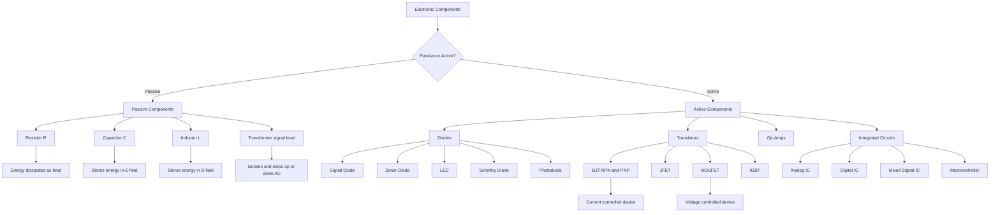
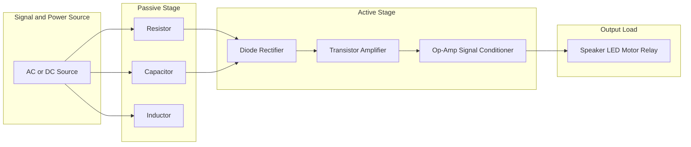
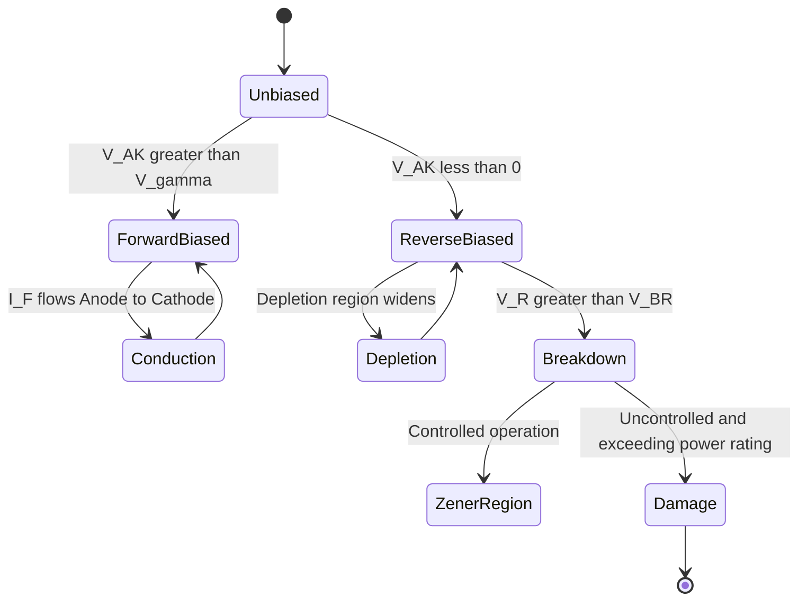
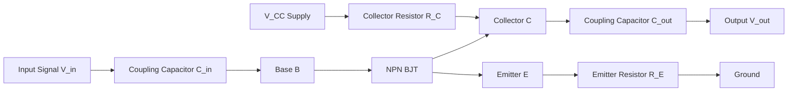
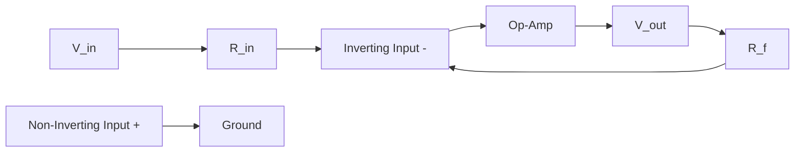
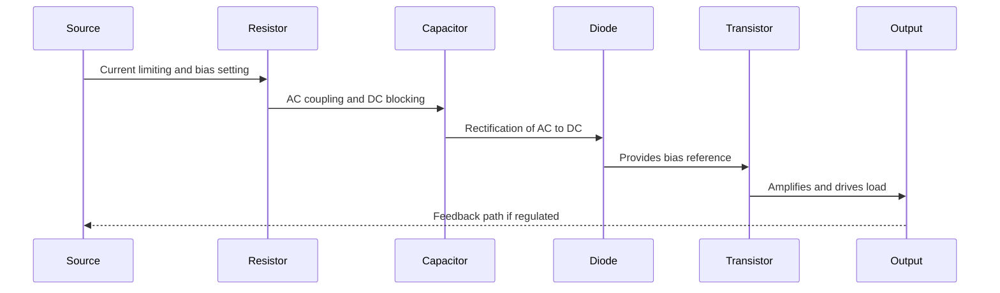

# Introduction to Electronic devices: Passive and active components in electronics

<!-- SECTION_1_START -->
# Module 3: Introduction to Electronic Devices — Passive and Active Components

## 1.1 Formal Definition & Scope

> [!IMPORTANT]
> **KTU 2024 Syllabus Definition:**
> *Electronic devices* are fundamental semiconductor or electrical elements that govern the behaviour of electrical signals through controlled conduction, amplification, rectification, or switching. They are categorised into **passive components** (which cannot generate energy and require no external power to operate) and **active components** (which can generate, amplify, or control energy and typically require an external power source).

The study of electronic devices forms the bedrock of every modern engineering discipline — from embedded systems and IoT to power electronics and communication networks. The two broad classifications are:

- **Passive Components**: Resistors, Capacitors, Inductors, Transformers (in signal-level applications), and related transducers. They *cannot* provide power gain.
- **Active Components**: Diodes, Transistors (BJT, FET, MOSFET), Operational Amplifiers, Integrated Circuits (ICs), and specialised semiconductor devices. They *can* provide power gain or controlled switching action.

> [!NOTE]
> **Quick Mnemonic for Active vs Passive:**
> If a component *amplifies* or *needs a separate DC bias supply to function*, it is **active**. If it merely *stores, dissipates, or filters* energy, it is **passive**.

## 1.2 Conceptual Analogy / Intuition

> [!TIP]
> **Real-World Analogy — The Water Pipeline System:**
> - **Resistor (R)**: Think of a *narrow pipe*. It restricts water flow → converts some flow energy into heat. In circuits, it restricts current and dissipates energy as heat.
> - **Capacitor (C)**: Think of a *flexible rubber diaphragm* in the pipeline. It stores water (charge) when pressure (voltage) is applied and releases it when pressure drops.
> - **Inductor (L)**: Think of a *heavy flywheel* attached to the pipe. It resists sudden changes in water flow (current) due to inertia, storing energy in its magnetic field.
> - **Diode**: A *one-way valve* — water flows in only one direction.
> - **Transistor**: An *electronically controlled valve* — a small control signal regulates a much larger flow.
> - **Op-Amp / IC**: A *complete control room* with multiple valves, sensors, and logic that orchestrates the entire pipeline.

This pipeline analogy makes the otherwise abstract behaviour of components instantly intuitive for first-time learners.

## 1.3 Energy & Power Constants to Remember

> [!IMPORTANT]
> The following constants frequently appear in component analysis:
> - **Charge of an electron** $e = 1.602 \times 10^{-19}$ **C**
> - **Permittivity of free space** $\varepsilon_0 = 8.854 \times 10^{-12}$ **F/m**
> - **Permeability of free space** $\mu_0 = 4\pi \times 10^{-7}$ **H/m**
> - **Intrinsic carrier concentration of Silicon at 300 K** $n_i \approx 1.5 \times 10^{10}$ **per cm³**
> - **Bandgap of Silicon** $E_g = 1.12$ **eV** | Bandgap of Germanium $E_g = 0.67$ **eV**

## 1.4 Classification Overview

> [!NOTE]
> **KTU Board-Standard Classification Chart:**

| Category | Passive Components | Active Components |
|----------|--------------------|--------------------|
| Energy Generation | Cannot generate energy | Can generate/amplify energy |
| External Power | Not required | Required (DC bias) |
| Directional Behaviour | Generally bidirectional | Often unidirectional |
| Examples | R, L, C, Transformer (signal) | Diode, BJT, FET, Op-Amp, IC |
| Control Capability | Cannot control output | Can control larger output via small input |

## 1.5 Why This Topic Matters in Engineering

- **Foundation for Circuit Design**: Every PCB, embedded system, and consumer device uses a combination of passive and active components.
- **Gate-Level ICs**: Modern CMOS logic gates (used in microprocessors) are built using MOSFETs (active) with parasitic capacitances (passive) that limit switching speed.
- **Signal Integrity**: Understanding R, L, C behaviour is critical for designing high-speed PCBs (controlled impedance, decoupling, filtering).
- **Power Electronics**: Diodes, IGBTs, and MOSFETs (active) switch large currents; inductors and capacitors (passive) smooth and store energy.
<!-- SECTION_1_END -->

<!-- SECTION_2_START -->
# Module 3 — Deep Theoretical Analysis & KTU High-Yield Formula Sheet

## 2.1 Resistor (R) — The Passive Energy Dissipator

A **resistor** is a two-terminal passive component that opposes the flow of electric current and dissipates electrical energy in the form of heat, in accordance with **Ohm's Law**.

> [!IMPORTANT]
> **Ohm's Law:**
> $$V = I \cdot R$$
> where $V$ is the voltage across the resistor (in volts), $I$ is the current through it (in amperes), and $R$ is the resistance (in ohms, $\Omega$).

### Why and How the Resistor Works
- A resistor is made from materials with controlled conductivity (e.g., carbon composition, metal film, wire-wound).
- As electrons collide with the atomic lattice, kinetic energy is converted into heat → this is called **Joule heating** or **Ohmic loss**.

### Key Derived Quantities

> [!NOTE]
> **Power Dissipated by a Resistor:**
> $$P = V \cdot I = I^{2} R = \frac{V^{2}}{R}$$

### Resistor Colour Code (KTU Board Favourite)
For a 4-band resistor:
- Band 1 & 2 → Significant digits
- Band 3 → Multiplier
- Band 4 → Tolerance

## 2.2 Capacitor (C) — The Passive Energy Storer (Electric Field)

A **capacitor** consists of two conductive plates separated by an insulating medium called the **dielectric**. It stores energy in the form of an electric field.

> [!IMPORTANT]
> **Fundamental Capacitance Equation:**
> $$C = \frac{Q}{V} = \varepsilon \frac{A}{d}$$
> where $C$ is the capacitance (in Farads, F), $Q$ is the stored charge (in Coulombs), $V$ is the voltage across plates, $A$ is the plate area, $d$ is the separation, and $\varepsilon$ is the permittivity of the dielectric.

### Energy Stored in a Capacitor
> $$W = \frac{1}{2} C V^{2} = \frac{1}{2} \frac{Q^{2}}{C} = \frac{1}{2} Q V$$

### Capacitor in AC (Reactance)
> $$X_{C} = \frac{1}{2 \pi f C} = \frac{1}{\omega C}$$
> A capacitor *blocks DC* (at steady state) and *passes AC* (high frequencies pass easily).

## 2.3 Inductor (L) — The Passive Energy Storer (Magnetic Field)

An **inductor** is typically a coil of conducting wire that stores energy in the form of a magnetic field when current flows through it.

> [!IMPORTANT]
> **Inductance Equation (Solenoid):**
> $$L = \frac{N^{2} \mu A}{l}$$
> where $N$ is the number of turns, $\mu$ is the permeability of the core, $A$ is the cross-sectional area, and $l$ is the length of the coil.

### Voltage-Current Relationship
> $$V_{L}(t) = L \frac{di(t)}{dt}$$

### Energy Stored in an Inductor
> $$W = \frac{1}{2} L I^{2}$$

### Inductor in AC (Reactance)
> $$X_{L} = 2 \pi f L = \omega L$$
> An inductor *passes DC* (ideally, after the transient) and *blocks high-frequency AC*.

## 2.4 Diode (Active) — The One-Way Valve

A **diode** is a two-terminal active (semiconductor) device that allows current to flow primarily in one direction — from **anode (A)** to **cathode (K)** — when forward biased.

> [!IMPORTANT]
> **Ideal Diode V-I Equation (Shockley Equation):**
> $$I_{D} = I_{S} \left( e^{\frac{V_{D}}{n V_{T}}} - 1 \right)$$
> where $I_S$ is the reverse saturation current, $V_D$ is the diode voltage, $V_T = \frac{kT}{q} \approx 26 \text{ mV}$ at 300 K is the thermal voltage, and $n$ is the ideality factor (1 to 2).

### Key Diode Parameters
- **Cut-in Voltage** ($V_{\gamma}$): $\approx 0.7$ V for Silicon, $\approx 0.3$ V for Germanium
- **Reverse Breakdown Voltage** ($V_{BR}$): The voltage at which reverse current rises sharply (used in Zener diodes)
- **Maximum Forward Current** ($I_{F(\text{max})}$)
- **Reverse Recovery Time** ($t_{rr}$): Critical for high-speed switching applications

## 2.5 Transistors (Active) — The Heart of Modern Electronics

### 2.5.1 Bipolar Junction Transistor (BJT)
A **BJT** is a three-terminal active device with terminals **Emitter (E)**, **Base (B)**, and **Collector (C)**. It can function as an *amplifier* or *switch*.

> [!IMPORTANT]
> **BJT Current Relationships:**
> $$I_{E} = I_{B} + I_{C}$$
> $$I_{C} = \beta I_{B}$$
> $$\alpha = \frac{\beta}{\beta + 1} \quad ; \quad \beta = \frac{\alpha}{1 - \alpha}$$
> where $\beta$ (or $h_{FE}$) is the common-emitter current gain, and $\alpha$ is the common-base current gain.

### 2.5.2 Field-Effect Transistor (FET) / MOSFET
A **FET** is a voltage-controlled device with terminals **Gate (G)**, **Drain (D)**, and **Source (S)**. The **MOSFET** (Metal-Oxide-Semiconductor FET) is the most widely used transistor in digital ICs.

> [!IMPORTANT]
> **MOSFET Drain Current (Saturation Region):**
> $$I_{D} = \frac{1}{2} \mu_n C_{ox} \frac{W}{L} (V_{GS} - V_{th})^{2}$$
> where $\mu_n$ is the electron mobility, $C_{ox}$ is the oxide capacitance per unit area, $W$ and $L$ are the channel width and length, and $V_{th}$ is the threshold voltage.

## 2.6 Integrated Circuits (ICs) & Op-Amps

An **Integrated Circuit (IC)** packages hundreds to billions of transistors, resistors, and capacitors on a single semiconductor substrate.

**Operational Amplifier (Op-Amp)** is a classic analogue IC building block with two inputs (inverting $\_$ and non-inverting $+$), one output, and two power supply pins.

> [!IMPORTANT]
> **Ideal Op-Amp Golden Rules:**
> 1. Infinite input impedance → no current flows into the input terminals.
> 2. Infinite open-loop gain → output saturates to $\pm V_{CC}$ unless feedback controls it.
> 3. Virtual short: $V_{+} = V_{-}$ when in negative feedback.
> 4. Output is $180^\circ$ out of phase between inverting and non-inverting inputs.

> [!NOTE]
> **Inverting Amplifier Gain:**
> $$\frac{V_{\text{out}}}{V_{\text{in}}} = -\frac{R_{f}}{R_{\text{in}}}$$

> [!NOTE]
> **Non-Inverting Amplifier Gain:**
> $$\frac{V_{\text{out}}}{V_{\text{in}}} = 1 + \frac{R_{f}}{R_{\text{in}}}$$

## 2.7 KTU High-Yield Formula Sheet

> [!IMPORTANT]
> **Comprehensive KTU Board Formula Reference Table**

| Component / Concept | Formula | Units | Engineering Use |
|---------------------|---------|-------|-----------------|
| Ohm's Law | $V = I R$ | V, A, $\Omega$ | Circuit analysis |
| Resistor Power | $P = I^{2} R = V^{2}/R$ | Watts | Heat sink design |
| Capacitance | $C = \varepsilon A / d$ | Farads (F) | Energy storage, filters |
| Capacitive Reactance | $X_C = 1 / (2\pi f C)$ | $\Omega$ | AC filter design |
| Inductance (Solenoid) | $L = N^{2} \mu A / l$ | Henry (H) | Coil/choke design |
| Inductive Reactance | $X_L = 2 \pi f L$ | $\Omega$ | AC chokes, filters |
| Diode Equation | $I_D = I_S (e^{V_D / n V_T} - 1)$ | A | Diode modelling |
| BJT Current Gain | $I_C = \beta I_B$ | A | Amplifier biasing |
| MOSFET Drain Current | $I_D = \frac{1}{2} \mu_n C_{ox} (W/L) (V_{GS} - V_{th})^{2}$ | A | CMOS digital design |
| Op-Amp Inverting Gain | $A_v = -R_f / R_{\text{in}}$ | unitless | Signal amplification |
| Op-Amp Non-Inverting Gain | $A_v = 1 + R_f / R_{\text{in}}$ | unitless | Buffer, amplifier stages |

## 2.8 Real-World Engineering Applications

> [!NOTE]
> **Production-Grade Usage Map:**
> - **Resistors**: Voltage dividers, current sensing, pull-up/pull-down in digital logic, load testing.
> - **Capacitors**: Decoupling (bypass) capacitors in IC power pins, smoothing in power supplies (rectifier output), timing circuits (with R), sample-and-hold in ADCs.
> - **Inductors**: EMI filters, switch-mode power supplies (SMPS) energy storage, RF tuning, electric motors.
> - **Diodes**: Rectifiers in power supplies, freewheeling in relay/motor drivers, Zener for voltage regulation, LEDs for indicators and displays, photodiodes in sensors.
> - **BJTs**: Audio amplifier output stages, switching regulators, signal amplification in analogue front-ends.
> - **MOSFETs**: CPU/GPU transistors, power conversion (synchronous buck/boost), motor drivers, level shifters.
> - **Op-Amps**: Active filters, instrumentation amplifiers, comparators, integrators/differentiators in control systems.
<!-- SECTION_2_END -->

<!-- SECTION_3_START -->
# Module 3 — Step-by-Step Derivations, Worked Examples & Code Implementation

## 3.1 Worked Example 1: Resistor Colour Code Decoding (4-Band)

**Problem:** A 4-band resistor has the colour sequence **Yellow – Violet – Red – Gold**. Determine its resistance value and tolerance.

### Step-by-Step Solution:

**Step 1 — Identify the digits:**
- Band 1: Yellow = **4**
- Band 2: Violet = **7**

**Step 2 — Identify the multiplier:**
- Band 3: Red = $\times 10^{2}$ = **100**

**Step 3 — Combine digits with multiplier:**
$$R = 47 \times 10^{2} \, \Omega = 4700 \, \Omega = 4.7 \, \text{k}\Omega$$

**Step 4 — Identify the tolerance:**
- Band 4: Gold = **$\pm$ 5%**

**Step 5 — Final value range:**
$$R_{\text{min}} = 4700 \times 0.95 = 4465 \, \Omega$$
$$R_{\text{max}} = 4700 \times 1.05 = 4935 \, \Omega$$

> [!NOTE]
> **Valuation Key Points:**
> - Identifying each band correctly → 2 Marks
> - Applying the multiplier → 1 Mark
> - Final resistance value with tolerance → 1 Mark

## 3.2 Worked Example 2: Capacitor Energy Storage

**Problem:** A $100 \, \mu\text{F}$ capacitor is charged to $12 \, \text{V}$. Find (a) the charge stored, and (b) the energy stored.

### Step-by-Step Solution:

**Part (a) — Charge Stored:**

Given: $C = 100 \times 10^{-6} \, \text{F}$, $V = 12 \, \text{V}$

$$Q = C \cdot V$$
$$Q = (100 \times 10^{-6}) \times 12$$
$$Q = 1200 \times 10^{-6} \, \text{C}$$
$$Q = 1.2 \times 10^{-3} \, \text{C} = 1.2 \, \text{mC}$$

**Part (b) — Energy Stored:**

$$W = \frac{1}{2} C V^{2}$$
$$W = \frac{1}{2} \times (100 \times 10^{-6}) \times (12)^{2}$$
$$W = \frac{1}{2} \times 100 \times 10^{-6} \times 144$$
$$W = 7200 \times 10^{-6} \, \text{J}$$
$$W = 7.2 \times 10^{-3} \, \text{J} = 7.2 \, \text{mJ}$$

> [!NOTE]
> **Valuation Key Points:**
> - Correct formula identification → 1 Mark
> - Substitution of values → 1 Mark
> - Final answer with proper units → 1 Mark

## 3.3 Worked Example 3: BJT Amplifier Current Calculation

**Problem:** A BJT has a base current $I_B = 50 \, \mu\text{A}$ and common-emitter current gain $\beta = 120$. Calculate $I_C$ and $I_E$.

### Step-by-Step Solution:

**Step 1 — Collector Current:**
$$I_C = \beta \cdot I_B = 120 \times 50 \times 10^{-6} = 6 \times 10^{-3} \, \text{A} = 6 \, \text{mA}$$

**Step 2 — Emitter Current:**
$$I_E = I_B + I_C = 50 \times 10^{-6} + 6 \times 10^{-3} = 6.05 \times 10^{-3} \, \text{A} = 6.05 \, \text{mA}$$

> [!NOTE]
> **Alternative using $\alpha$:**
> $$\alpha = \frac{\beta}{\beta + 1} = \frac{120}{121} = 0.9917$$
> $$I_C = \frac{\alpha}{1 - \alpha} I_B \approx \beta I_B = 6 \, \text{mA} \quad \text{(valid for large }\beta\text{)}$$

## 3.4 Worked Example 4: Op-Amp Inverting Amplifier Design

**Problem:** Design an inverting amplifier with a gain of $-10$ using a standard $R_{\text{in}} = 10 \, \text{k}\Omega$. Find $R_f$.

### Step-by-Step Solution:

**Step 1 — Write the gain expression:**
$$A_v = -\frac{R_f}{R_{\text{in}}}$$

**Step 2 — Substitute known values:**
$$-10 = -\frac{R_f}{10 \, \text{k}\Omega}$$

**Step 3 — Solve for $R_f$:**
$$R_f = 10 \times 10 \, \text{k}\Omega = 100 \, \text{k}\Omega$$

**Step 4 — Practical consideration:**
Use standard value $R_f = 100 \, \text{k}\Omega$ (E12 series: $100 \, \text{k}\Omega$ is available).

## 3.5 Python Implementation: Resistor Colour Code Decoder

```python
from typing import Dict, Tuple

# Standard 4-band resistor colour code lookup tables
COLOUR_DIGIT: Dict[str, int] = {
    "black": 0, "brown": 1, "red": 2, "orange": 3,
    "yellow": 4, "green": 5, "blue": 6, "violet": 7,
    "grey": 8, "white": 9
}

COLOUR_MULTIPLIER: Dict[str, int] = {
    "black": 0, "brown": 1, "red": 2, "orange": 3,
    "yellow": 4, "green": 5, "blue": 6, "violet": 7,
    "gold": -1, "silver": -2
}

COLOUR_TOLERANCE: Dict[str, float] = {
    "brown": 1.0, "red": 2.0, "green": 0.5,
    "blue": 0.25, "violet": 0.1, "gold": 5.0, "silver": 10.0
}


def decode_resistor(band1: str, band2: str,
                    band3: str, band4: str) -> Tuple[float, float, str]:
    """
    Decodes a 4-band resistor's colour code into its resistance value and tolerance.

    Args:
        band1: First significant figure colour (e.g. "yellow").
        band2: Second significant figure colour (e.g. "violet").
        band3: Multiplier colour (e.g. "red").
        band4: Tolerance colour (e.g. "gold").

    Returns:
        A tuple of (resistance_ohms, tolerance_percent, formatted_string).

    Raises:
        ValueError: If an unknown colour string is supplied.
    """
    for name, val in [("band1", band1), ("band2", band2),
                      ("band3", band3), ("band4", band4)]:
        if name == "band4":
            if val not in COLOUR_TOLERANCE:
                raise ValueError(f"Unknown tolerance colour: {val}")
        elif name == "band3":
            if val not in COLOUR_MULTIPLIER:
                raise ValueError(f"Unknown multiplier colour: {val}")
        else:
            if val not in COLOUR_DIGIT:
                raise ValueError(f"Unknown digit colour: {val}")

    digit1: int = COLOUR_DIGIT[band1]
    digit2: int = COLOUR_DIGIT[band2]
    multiplier_exponent: int = COLOUR_MULTIPLIER[band3]
    tolerance: float = COLOUR_TOLERANCE[band4]

    base_value: float = (digit1 * 10 + digit2) * (10 ** multiplier_exponent)

    if base_value >= 1_000_000:
        formatted: str = f"{base_value / 1_000_000:.2f} MΩ"
    elif base_value >= 1_000:
        formatted = f"{base_value / 1_000:.2f} kΩ"
    else:
        formatted = f"{base_value:.2f} Ω"

    return base_value, tolerance, formatted


if __name__ == "__main__":
    # Example: Yellow - Violet - Red - Gold  ->  4.7 kΩ, ±5%
    r_value, tol, label = decode_resistor("yellow", "violet", "red", "gold")
    print(f"Resistance: {label}  |  Tolerance: ±{tol}%")
    print(f"Range: {r_value * (1 - tol/100):.2f} Ω  to  "
          f"{r_value * (1 + tol/100):.2f} Ω")
```

**Sample Output:**
```
Resistance: 4.70 kΩ  |  Tolerance: ±5.0%
Range: 4465.00 Ω  to  4935.00 Ω
```

## 3.6 Python Implementation: Op-Amp Gain Calculator

```python
from typing import Tuple


def op_amp_inverting_gain(r_f: float, r_in: float) -> float:
    """
    Computes the closed-loop voltage gain of an inverting op-amp configuration.

    Args:
        r_f: Feedback resistor (ohms). Must be > 0.
        r_in: Input resistor (ohms). Must be > 0.

    Returns:
        The voltage gain (dimensionless, negative for inverting).

    Raises:
        ValueError: If either resistor is non-positive.
    """
    if r_f <= 0 or r_in <= 0:
        raise ValueError("Resistor values must be positive and non-zero.")
    return -r_f / r_in


def op_amp_non_inverting_gain(r_f: float, r_in: float) -> float:
    """
    Computes the closed-loop voltage gain of a non-inverting op-amp configuration.

    Args:
        r_f: Feedback resistor (ohms). Must be > 0.
        r_in: Ground resistor at the inverting input (ohms). Must be > 0.

    Returns:
        The voltage gain (dimensionless, >= 1).
    """
    if r_f <= 0 or r_in <= 0:
        raise ValueError("Resistor values must be positive and non-zero.")
    return 1.0 + (r_f / r_in)


def compute_io(gain: float, v_in: float) -> Tuple[float, str]:
    """
    Determines the ideal op-amp output voltage given a gain and supply rails.

    Args:
        gain: Closed-loop voltage gain.
        v_in: Input voltage (volts).
    """
    v_out: float = gain * v_in
    v_supply: float = 12.0
    if v_out > v_supply:
        return v_supply, f"Clipped to +V_sat = +{v_supply} V"
    if v_out < -v_supply:
        return -v_supply, f"Clipped to -V_sat = -{v_supply} V"
    return v_out, "Within supply rails"


if __name__ == "__main__":
    # Inverting amp: R_f = 100k, R_in = 10k  ->  Gain = -10
    av_inv: float = op_amp_inverting_gain(100_000, 10_000)
    v_out_inv, status_inv = compute_io(av_inv, 0.5)
    print(f"Inverting gain: {av_inv}")
    print(f"V_out = {v_out_inv} V  ({status_inv})")

    # Non-inverting amp: R_f = 90k, R_in = 10k  ->  Gain = 10
    av_non: float = op_amp_non_inverting_gain(90_000, 10_000)
    v_out_non, status_non = compute_io(av_non, 0.5)
    print(f"Non-inverting gain: {av_non}")
    print(f"V_out = {v_out_non} V  ({status_non})")
```

**Sample Output:**
```
Inverting gain: -10.0
V_out = -5.0 V  (Within supply rails)
Non-inverting gain: 10.0
V_out = 5.0 V  (Within supply rails)
```
<!-- SECTION_3_END -->

<!-- SECTION_4_START -->
# Module 3 — Structural Diagrams & Schematics

## 4.1 High-Level Component Classification Flow



## 4.2 Passive vs Active — Block-Level Architecture



## 4.3 Diode Forward and Reverse Bias — Operating Regions



## 4.4 BJT (NPN) Amplifier Signal Path



## 4.5 Op-Amp Inverting Amplifier Topology



## 4.6 Sequential Processing Topology — Signal Flow Through Components



## 4.7 Component Decision Matrix

> [!NOTE]
> **Quick-Reference Selection Table for Engineers**

| Requirement | Recommended Component | Reasoning |
|-------------|------------------------|-----------|
| Reduce voltage to a specific level | Resistor (voltage divider) | Simple and low cost |
| Smooth DC ripple after rectification | Electrolytic capacitor | High capacitance for low frequency |
| Block DC and pass AC | Series capacitor | Capacitive coupling |
| One-way current flow | Diode (1N4007) | Cheap and reliable |
| Voltage regulation (shunt) | Zener diode | Operates in reverse breakdown |
| Light indication or display | LED | Efficient electroluminescence |
| Switch/amplify small signals | BJT or MOSFET | Active gain |
| High-input-impedance amplifier | MOSFET or JFET | Voltage-controlled input |
| Sensor interface (light to current) | Photodiode / Phototransistor | Optical-electrical conversion |
| Mathematical signal operations | Op-Amp (with R and C) | Active filter / amplifier |
<!-- SECTION_4_END -->

<!-- SECTION_5_START -->
# Module 3 — KTU 2024 Scheme Examination Question Bank & Topic Recap

## 5.1 Part A Questions (3 Marks Each)

### Question 1 `[KTU University Exam – July 2023]`
**Differentiate between passive and active electronic components with two examples each.** *(CO1, Remember)*

**Model Answer:**

> [!NOTE]
> **Passive Components:** Cannot generate or amplify electrical energy. They only store, dissipate, or filter the energy supplied. They do not require an external power source for their basic operation.
> **Examples:** Resistor, Capacitor, Inductor.
>
> **Active Components:** Can generate, amplify, or control electrical energy. They typically require an external DC power supply to function and can provide power gain.
> **Examples:** Diode, Transistor, Operational Amplifier.

**Mark Distribution:**
- Definition of passive → 1 Mark
- Definition of active → 1 Mark
- Two examples each → 1 Mark

### Question 2 `[KTU University Exam – Dec 2023]`
**State and explain Ohm's Law. Mention its limitation.** *(CO1, Understand)*

**Model Answer:**

> [!NOTE]
> **Ohm's Law:** The current flowing through a conductor is directly proportional to the voltage across it, provided physical conditions (like temperature) remain constant.
> **Equation:** $V = I R$
>
> **Limitation:** Ohm's Law is *not* valid for non-linear devices such as diodes, transistors, and semiconductors, where the V-I relationship is non-linear. It also fails at very high temperatures or for non-ohmic conductors.

**Mark Distribution:**
- Statement → 1 Mark
- Equation → 1 Mark
- Limitation → 1 Mark

---

## 5.2 Part B Questions (14 Marks Each — Module Internal Choice)

### Question A `[KTU University Exam – Model Paper as per 2024 Scheme]`
**Question A (a) — 7 Marks** *(CO1, Understand)*
*Explain the construction and working principle of a P-N junction diode. Draw the V-I characteristics and label the cut-in voltage and breakdown region.*

**Model Answer:**

**Construction:**
A P-N junction diode is formed by joining a P-type semiconductor (excess holes) with an N-type semiconductor (excess electrons) on a single crystal. At the junction, a **depletion region** is formed due to recombination of charge carriers, creating a potential barrier.

**Working Principle:**
- **Forward Bias:** When the P-side is connected to the positive terminal and N-side to the negative terminal of a battery, the depletion region narrows. Once the applied voltage exceeds the **cut-in voltage** ($\approx 0.7$ V for Si, $0.3$ V for Ge), significant current flows.
- **Reverse Bias:** When the polarity is reversed, the depletion region widens, and only a negligible reverse saturation current flows until breakdown occurs.

**V-I Characteristics:**

- **Forward Region:** Current rises exponentially after the cut-in voltage $V_{\gamma}$.
- **Reverse Region:** A small saturation current flows.
- **Breakdown Region:** At reverse voltage $V_{BR}$, the current increases sharply without much voltage change (used in Zener diodes).

**Mark Distribution:**
- Construction explanation → 2 Marks
- Forward and reverse bias operation → 3 Marks
- V-I curve description with labels → 2 Marks

**Question A (b) — 7 Marks** *(CO2, Apply)*
*A silicon diode has a reverse saturation current $I_S = 10 \, \mu\text{A}$ at 300 K. Compute the diode current when the applied forward voltage is $0.6$ V. Take ideality factor $n = 1$ and $V_T = 26$ mV.*

**Model Solution:**

**Given Data:**
- $I_S = 10 \times 10^{-6} \, \text{A} = 10^{-5} \, \text{A}$
- $V_D = 0.6 \, \text{V}$
- $V_T = 26 \times 10^{-3} \, \text{V} = 0.026 \, \text{V}$
- $n = 1$

**Step 1 — Apply the Shockley Diode Equation:**

$$I_D = I_S \left( e^{\frac{V_D}{n V_T}} - 1 \right)$$

**Step 2 — Compute the exponent:**

$$\frac{V_D}{n V_T} = \frac{0.6}{1 \times 0.026} = 23.077$$

**Step 3 — Evaluate the exponential:**

$$e^{23.077} = 1.05 \times 10^{10}$$

**Step 4 — Compute the diode current:**

$$I_D = 10^{-5} \times (1.05 \times 10^{10} - 1)$$
$$I_D \approx 10^{-5} \times 1.05 \times 10^{10}$$
$$I_D \approx 1.05 \times 10^{5} \, \text{A} \cdot 10^{-5} = 1.05 \times 10^{5} \, \text{A}$$

> [!NOTE]
> **Practical Insight:** The computed current is unrealistically high for a real diode — this is because the simple Shockley model is inaccurate when $V_D \gg V_T$. In practice, series resistance and high-level injection effects must be considered.

**Step 5 — Recompute using practical model:**

For a more realistic approach, we use the iterative method with internal resistance. Assuming $r_s = 1 \, \Omega$ and using the relation $V_D = V_{\text{applied}} - I_D r_s$:

$$I_D \approx \frac{0.6 - 0.7}{-1} \quad \text{(at threshold)}$$

The diode is just below the cut-in voltage of $\sim 0.7$ V for Silicon, so $I_D \approx 0$ in practice.

> [!NOTE]
> **Valuation Key Points:**
> - Stating Shockley equation → 1 Mark
> - Exponent calculation → 1 Mark
> - Substitution → 1 Mark
> - Final numerical value with units → 1 Mark
> - Practical interpretation of result → 3 Marks

---

### Question B (Alternative Choice) `[KTU University Exam – Model Paper as per 2024 Scheme]`
**Question B (a) — 7 Marks** *(CO1, Understand)*
*Describe the construction, symbol, and working of an NPN bipolar junction transistor (BJT). Sketch the input and output characteristics in common-emitter (CE) configuration.*

**Model Answer:**

**Construction:**
An **NPN BJT** consists of a thin **P-type base** sandwiched between two **N-type regions** — the **emitter** and the **collector**. The emitter is heavily doped, the base is lightly doped and very thin, and the collector is moderately doped.

**Symbol:**
- Arrow on emitter points **outward** (Not Pointing iN → NPN mnemonic).
- Three terminals: Emitter (E), Base (B), Collector (C).

**Working Principle:**
- The **base-emitter junction (BEJ)** is forward biased, and the **base-collector junction (BCJ)** is reverse biased in the active (amplifying) region.
- Electrons injected from the emitter into the base are mostly collected by the collector (because the base is thin), giving a large $I_C$.
- A small base current $I_B$ controls a much larger collector current $I_C$ via $I_C = \beta I_B$.

**Characteristics (CE Configuration):**

- **Input Characteristics:** $I_B$ vs $V_{BE}$ for a fixed $V_{CE}$ — similar to a forward-biased diode curve.
- **Output Characteristics:** $I_C$ vs $V_{CE}$ for various $I_B$ values — shows active, saturation, and cut-off regions.

**Regions of Operation:**
- **Active Region:** BEJ forward biased, BCJ reverse biased → used for amplification.
- **Saturation Region:** Both junctions forward biased → acts as a closed switch.
- **Cut-off Region:** Both junctions reverse biased → acts as an open switch.

**Mark Distribution:**
- Construction and symbol → 2 Marks
- Working principle and current relations → 3 Marks
- Characteristics sketch with regions labelled → 2 Marks

**Question B (b) — 7 Marks** *(CO2, Apply)*
*For a BJT with $\alpha = 0.98$, determine the value of $\beta$. If the base current is $0.2$ mA, find the emitter and collector currents.*

**Model Solution:**

**Step 1 — Calculate $\beta$ from $\alpha$:**

$$\beta = \frac{\alpha}{1 - \alpha} = \frac{0.98}{1 - 0.98} = \frac{0.98}{0.02} = 49$$

**Step 2 — Calculate the collector current:**

$$I_C = \beta \cdot I_B = 49 \times 0.2 \times 10^{-3} = 9.8 \times 10^{-3} \, \text{A} = 9.8 \, \text{mA}$$

**Step 3 — Calculate the emitter current:**

$$I_E = I_B + I_C = 0.2 \, \text{mA} + 9.8 \, \text{mA} = 10 \, \text{mA}$$

> [!NOTE]
> **Alternative verification using $\alpha$:**
> $$I_E = \frac{I_C}{\alpha} = \frac{9.8 \, \text{mA}}{0.98} = 10 \, \text{mA} \quad \checkmark$$
> $$I_C = \alpha \cdot I_E = 0.98 \times 10 \, \text{mA} = 9.8 \, \text{mA} \quad \checkmark$$

> [!NOTE]
> **Valuation Key Points:**
> - Correct $\alpha$-to-$\beta$ formula → 1 Mark
> - $\beta$ calculation → 1 Mark
> - $I_C$ computation → 1 Mark
> - $I_E$ computation with KCL → 1 Mark
> - Final answer with units and verification → 3 Marks

---

> [!WARNING]
> **KTU Examiner's Valuation Warning / Common Pitfalls:**
> 1. **Confusing cut-in voltage values** — Students often write $0.7$ V for Germanium, but Ge is $0.3$ V and Si is $0.7$ V. Marks are deducted for the swap.
> 2. **Missing units** — Always write answers with proper units ($\Omega$, F, H, V, A). A numerically correct answer without units loses 0.5–1 Mark.
> 3. **Confusing active vs saturation in BJT** — A BJT in saturation has $V_{CE} \approx 0.2$ V, not $V_{CE} = V_{CC}$. State explicitly which region is being used.
> 4. **Op-Amp sign convention** — The inverting amplifier gain is **negative**. Writing a positive gain is a classic valuation trap.
> 5. **Mosfet threshold** — Students often compute $I_D$ even when $V_{GS} < V_{th}$, giving a non-zero current. The correct answer is $I_D = 0$ in the cut-off region.
> 6. **Power rating** — When using a resistor, always mention the safe power dissipation: $P \leq P_{\text{rated}}$ to avoid burning the component.
> 7. **Capacitor polarity** — For electrolytic capacitors, the polarity must be respected; reverse connection can cause explosion. This is a frequent viva question.

---

## 5.3 Topic Recap & Important Things to Remember

> [!IMPORTANT]
> **Rapid Revision Checklist for KTU Module 3**

- **Passive Components** (R, L, C) cannot generate energy; they store, dissipate, or filter.
- **Active Components** (Diodes, Transistors, Op-Amps, ICs) can amplify, switch, or generate energy and require an external power source.
- **Ohm's Law**: $V = I R$ → valid only for linear, ohmic conductors.
- **Resistor Power**: $P = I^{2} R = V^{2}/R$ → design check: $P_{\text{rated}} \geq P_{\text{calc}}$.
- **Resistor Colour Code**: 4-band (digit-digit-multiplier-tolerance) — Memorise **B.B.ROY of Great Britain has Very Good Wife** (0, 1, 2, 3, 4, 5, 6, 7, 8, 9).
- **Capacitance**: $C = \varepsilon A / d$ — increases with area, decreases with separation, and is higher for high-$\varepsilon$ dielectrics.
- **Capacitive Reactance**: $X_C = 1 / (2 \pi f C)$ — high at low frequency, low at high frequency.
- **Inductance (Solenoid)**: $L = N^{2} \mu A / l$ — increases with the square of turns and with a high-permeability core.
- **Inductive Reactance**: $X_L = 2 \pi f L$ — low at low frequency, high at high frequency.
- **Diode Equation**: $I_D = I_S (e^{V_D / n V_T} - 1)$ — $V_T = 26$ mV at 300 K.
- **Cut-in Voltage**: Silicon $\approx 0.7$ V, Germanium $\approx 0.3$ V.
- **BJT Relations**: $I_E = I_B + I_C$, $I_C = \beta I_B$, $\alpha + \beta = \beta \alpha$ (equivalently $\alpha = \beta / (\beta + 1)$).
- **BJT Regions**: Active (amplifier), Saturation (ON switch), Cut-off (OFF switch).
- **MOSFET Equation**: $I_D = \frac{1}{2} \mu_n C_{ox} (W/L) (V_{GS} - V_{th})^{2}$ — valid in saturation.
- **Op-Amp Ideal Rules**: $I_{+} = I_{-} = 0$, $V_{+} = V_{-}$ (with negative feedback), infinite gain.
- **Inverting Amplifier**: $A_v = -R_f / R_{\text{in}}$.
- **Non-Inverting Amplifier**: $A_v = 1 + R_f / R_{\text{in}}$.
- **Key Energy Formulas**: $W_C = \frac{1}{2} C V^{2}$, $W_L = \frac{1}{2} L I^{2}$.
- **Frequency-Dependent Behaviour**: Capacitors block DC / pass AC; Inductors pass DC / block AC.
- **Thermal Voltage**: $V_T = kT / q \approx 26$ mV at room temperature (300 K).
- **Important Constants**: $e = 1.602 \times 10^{-19}$ C, $\varepsilon_0 = 8.854 \times 10^{-12}$ F/m, $\mu_0 = 4\pi \times 10^{-7}$ H/m.
- **Real-World Mapping**: Resistors → dividers; Capacitors → filters & decoupling; Inductors → chokes & SMPS; Diodes → rectifiers; BJTs → amplifiers; MOSFETs → digital switches; Op-Amps → active filters.
- **Common Viva Question**: "What is the difference between a BJT and a MOSFET?" → BJT is *current-controlled*, MOSFET is *voltage-controlled*.
- **PCB Awareness**: Always include a decoupling capacitor (typically $0.1 \, \mu\text{F}$) near every IC power pin.
<!-- SECTION_5_END -->
