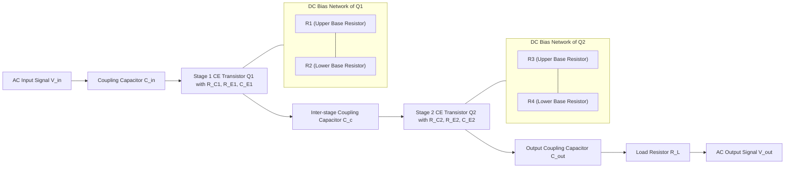
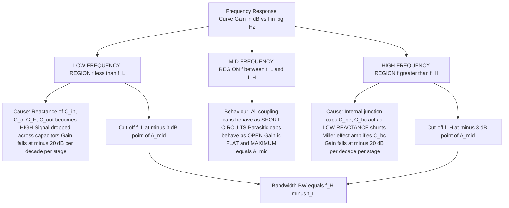
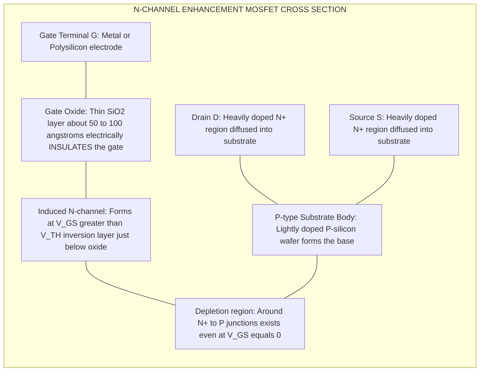
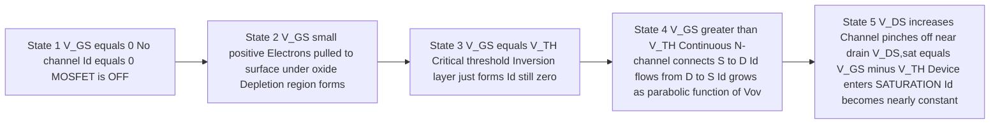
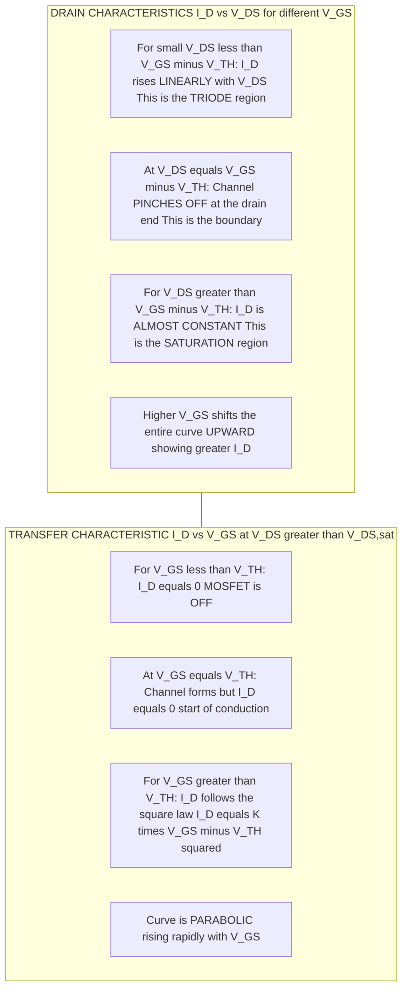

# RC coupled amplifier - Circuit diagram and frequency response Introduction to FET, Construction and working of N-channel and P- Channel MOSFETs

<!-- SECTION_1_START -->

# Module 3 — RC Coupled Amplifier & Field Effect Transistors

## 1.1 RC Coupled Amplifier — Core Definition

> [!IMPORTANT]
> **Definition (KTU 2024 Syllabus Standard):**
> An **RC Coupled Amplifier** is a multistage amplifier in which the output of one amplifying stage is connected to the input of the next stage through a **resistor–capacitor (RC) coupling network**. The coupling capacitor blocks the DC bias of one stage from disturbing the DC operating point of the next stage, while allowing the AC signal to pass through.

> [!NOTE]
> The "RC" in the name refers to the **Resistor–Capacitor** network that bridges two common-emitter (CE) transistor stages. It is the most widely used coupling method in audio-frequency (AF) amplifiers.

### 1.1.1 Intuitive Analogy — The "Bucket-Bridge" of Signals

Imagine a factory assembly line where each worker (transistor stage) does part of the job. Between two workers, there is a small **bridge made of wood with a rubber band on it**. The bridge (coupling capacitor $C_c$) only allows the *moving product* (AC signal) to pass through, but it blocks the *static weight* (DC bias) of the previous worker. The resistors $R_C$ and $R_E$ are like the support pillars that hold each worker steady on the floor. This way, each worker (stage) can be set up with their own comfortable working posture (DC bias point) without being dragged down or pushed up by the neighbour.

---

## 1.2 Field Effect Transistor (FET) — Core Definition

> [!IMPORTANT]
> **Definition:**
> A **Field Effect Transistor (FET)** is a **unipolar, voltage-controlled** semiconductor device in which the current through the channel between two terminals (Source and Drain) is controlled by an electric field produced by a voltage applied to a third terminal called the **Gate**.

### 1.2.1 Two Major Families of FET

| Family | Full Form | Channel Type | Default State |
| :--- | :--- | :--- | :--- |
| **JFET** | Junction FET | Already exists at $V_{GS} = 0$ | **Depletion** mode only |
| **MOSFET** | Metal–Oxide–Semiconductor FET | Induced by gate field | Both **Depletion** & **Enhancement** |

### 1.2.2 Intuitive Analogy — The "Water Tap" of Electronics

A FET behaves like a **water tap (faucet)**:
* The **Gate** is the **handle** of the tap — turning it changes the flow.
* The **Drain** is the **outlet pipe** (where water exits).
* The **Source** is the **inlet pipe** (where water enters).
* The **Channel** is the **bore of the tap** whose width changes when you turn the handle.
* A **MOSFET** is the modern, leak-proof version where a thin insulating oxide layer separates the handle from the water, ensuring **almost zero gate current** ($I_G \approx 0$).

---

## 1.3 MOSFET — Core Definition

> [!IMPORTANT]
> **Definition (KTU 2024 Standard):**
> A **MOSFET (Metal–Oxide–Semiconductor Field Effect Transistor)** is a four-terminal (Gate G, Drain D, Source S, Body/Substrate B) voltage-controlled device in which the gate is **electrically isolated** from the conducting channel by a thin layer of **silicon dioxide ($SiO_2$)**. The channel is **induced** (in enhancement mode) or **pre-existing** (in depletion mode) between the source and drain regions.

> [!WARNING]
> **KTU Examiner Tip:** Always remember — the gate of a MOSFET is **insulated**, so the input impedance is **extremely high** ($10^{12}$ to $10^{15}$ $\Omega$). This is a *huge* advantage over the BJT, which has a low input impedance.

### 1.3.1 Why MOSFETs Dominate Modern Electronics

* **Input resistance** is in giga-ohms → negligible loading on the previous stage.
* **Power consumption** is very low (used in almost every CPU and memory chip).
* **Scaling** — MOSFETs can be made extremely small (nanometre range), enabling billions of transistors on a single integrated circuit.
* **Static RAM, microprocessors, smartphone SoCs, power electronics** — MOSFETs are the backbone.

> [!VISUALIZATION CONTROL]
> **Concept:** Voltage Transfer Characteristics of an N-channel Enhancement MOSFET
> **GeoGebra / Desmos Input Equations:**
> * $f(V_{GS}) = K \cdot (V_{GS} - V_{TH})^2$ for $V_{GS} \geq V_{TH}$, else $0$
> * Sample: $K = 0.5 \text{ mA/V}^2$, $V_{TH} = 2 \text{ V}$
> **Visual Description:** A horizontal line at $I_D = 0$ for $V_{GS} < 2$ V, followed by a **parabolic curve** rising as $V_{GS}$ increases beyond $2$ V.

---

## 1.4 P-channel MOSFET — One-line Definition

> [!NOTE]
> A **P-channel Enhancement MOSFET (PMOS)** uses an **N-type substrate** with two heavily doped **P$^+$ regions** as Source and Drain. When $V_{GS} < V_{TH}$ (a *negative* threshold), a P-type inversion layer is induced, allowing conventional current to flow from Source to Drain. PMOS devices are typically used as the "pull-up" transistors in CMOS digital logic.

<!-- SECTION_1_END -->

<!-- SECTION_2_START -->

# 2. Deep Theoretical Analysis & KTU High-Yield Formula Sheet

## 2.1 RC Coupled Amplifier — Detailed Operation

### 2.1.1 Why Coupling is Needed in Multistage Amplifiers

A **single-stage CE amplifier** gives a voltage gain of only about 50–500. To obtain higher gain (e.g. $10^4$ or more), two or more stages are cascaded. The job of the coupling network is:

1. To **pass the AC signal** from one stage to the next with minimum loss.
2. To **block the DC bias** of one stage from interfering with the next stage.
3. To keep the **$Q$-point (operating point) of each stage independent**.

### 2.1.2 Two-Stage RC Coupled Amplifier — Working in 5 Steps

* **Step 1 — Input coupling ($C_{in}$):** Blocks the external DC and routes the small AC input signal to the base of $Q_1$.
* **Step 2 — First stage amplification:** $Q_1$ operates in the active region, the small base signal is amplified to a larger collector signal that swings about the $Q$-point.
* **Step 3 — Inter-stage coupling ($C_c$):** The amplified AC voltage at the collector of $Q_1$ is passed to the base of $Q_2$ through $C_c$. The DC level of $Q_1$'s collector is **blocked**, so $Q_2$'s bias is unaffected.
* **Step 4 — Second stage amplification:** $Q_2$ further amplifies the signal.
* **Step 5 — Output coupling ($C_{out}$):** The amplified AC signal at the collector of $Q_2$ is delivered to the load $R_L$, while the DC is blocked.

### 2.1.3 Frequency Response — The Heart of This Topic

The **frequency response** of an RC coupled amplifier is a plot of **voltage gain (in dB) versus signal frequency (in Hz, log scale)**. It has **three distinct regions**:

| Region | Frequency Range | Behaviour of Gain | Cause |
| :--- | :--- | :--- | :--- |
| **Low-frequency** | $< f_L$ | Falls at **$-20$ dB/decade** | Reactance of coupling & bypass capacitors becomes large |
| **Mid-frequency** | $f_L$ to $f_H$ | **Constant** ($A_{mid}$ in dB) | All capacitors behave as short circuits; parasitic capacitances are open |
| **High-frequency** | $> f_H$ | Falls at **$-20$ dB/decade** | Transistor internal capacitances (junction + wiring) shunt the signal |

### 2.1.4 Why Gain Falls at Low Frequencies

At low frequencies, the coupling capacitor $C_c$ and the emitter bypass capacitor $C_E$ offer a **high reactance**:
$$X_C = \frac{1}{2 \pi f C}$$
As $f \downarrow$, $X_C \uparrow$, so a large portion of the AC signal is **dropped across $C_c$** and never reaches the next stage. Hence the gain **rolls off**.

### 2.1.5 Why Gain Falls at High Frequencies

At high frequencies, the **internal junction capacitances** of the transistor (collector–base capacitance $C_{bc}$ and base–emitter capacitance $C_{be}$) offer a **low reactance** and act as **shunt paths** to ground. Furthermore, the **Miller effect** multiplies $C_{bc}$ by the voltage gain. So the high-frequency signal is **bypassed** to ground and the output falls.

### 2.1.6 Bandwidth and Key Definitions

* **Lower cut-off frequency ($f_L$):** Frequency at which the gain falls to $0.707 \times A_{mid}$ (i.e. **$-3$ dB point**).
* **Upper cut-off frequency ($f_H$):** Frequency at which the gain again falls to $0.707 \times A_{mid}$.
* **Bandwidth ($BW$):**
$$BW = f_H - f_L$$
* **Gain in dB:**
$$A_{dB} = 20 \log_{10}\left(\frac{V_{out}}{V_{in}}\right)$$

---

## 2.2 KTU Formula Sheet — RC Coupled Amplifier

| # | Quantity | Formula | Typical Units |
| :--- | :--- | :--- | :--- |
| 1 | Gain in dB | $A_{dB} = 20 \log_{10}\vert A_v \vert$ | dB |
| 2 | Overall gain (cascade) | $A_v = A_{v1} \times A_{v2} \times \ldots \times A_{vn}$ | unitless |
| 3 | Bandwidth | $BW = f_H - f_L$ | Hz |
| 4 | Lower cut-off | $f_L \approx \dfrac{1}{2\pi (R_{out,1} \Vert R_{in,2}) C_c}$ | Hz |
| 5 | Upper cut-off | $f_H \approx \dfrac{1}{2\pi R_{eq} C_{in,total}}$ | Hz |
| 6 | Reactance of capacitor | $X_C = \dfrac{1}{2\pi f C}$ | $\Omega$ |
| 7 | Mid-band voltage gain (CE) | $A_{v,mid} \approx \dfrac{-R_C \Vert R_L}{r_e}$ | unitless |
| 8 | $r_e$ of BJT | $r_e = \dfrac{26 \text{ mV}}{I_E \text{ (mA)}}$ | $\Omega$ |

> [!IMPORTANT]
> In KTU numerical problems, $f_L$ and $f_H$ are often computed by **identifying the relevant time-constant** for the coupling or bypass capacitor and inverting it.

---

## 2.3 FET — Deep Theory

### 2.3.1 Comparison of BJT vs FET (High-Yield Table)

| Feature | BJT | FET |
| :--- | :--- | :--- |
| Control | **Current** controlled ($I_B$ controls $I_C$) | **Voltage** controlled ($V_{GS}$ controls $I_D$) |
| Input impedance | Low ($1$–$10$ k$\Omega$) | Very high ($10^9$–$10^{15}$ $\Omega$) |
| Current carriers | Both electrons and holes (**bipolar**) | Only one type — electrons *or* holes (**unipolar**) |
| Noise | Higher | Lower |
| Thermal stability | Poorer (large $I_C$ drift with temp) | Better |
| Power consumption | Higher | Lower |
| Used in | Analog amplification, switches | VLSI, CMOS, RF, power switches |

---

## 2.4 MOSFET — Detailed Theoretical Analysis

### 2.4.1 Construction of an N-channel Enhancement MOSFET (NMOS)

1. **Substrate (Body):** A lightly doped **P-type silicon** wafer forms the foundation.
2. **Source and Drain:** Two heavily doped **N$^+$ regions** are diffused into the substrate. They are symmetric in geometry and are interchangeable in operation.
3. **Oxide Layer:** A very thin layer (typically $50$–$100$ angstroms) of **silicon dioxide ($SiO_2$)** is grown thermally over the surface between source and drain.
4. **Gate:** A metallic (or polysilicon) electrode is deposited on top of the oxide. This is the **Gate** terminal.
5. **Body terminal (B):** A separate ohmic contact is taken from the substrate. It is often tied to the source internally.
6. **Substrate depletion region:** Even with no gate voltage, a depletion region exists around the N$^+$–P junctions.

> [!IMPORTANT]
> The **$SiO_2$ layer** is the heart of the MOSFET. It gives the device its name and provides the **electrical isolation** that results in the ultra-high input resistance.

### 2.4.2 Working of N-channel Enhancement MOSFET (Step by Step)

* **Step 1 — $V_{GS} = 0$:** No conducting channel exists between source and drain. The two back-to-back N$^+$-P-N$^+$ diodes block current. $I_D = 0$. The device is **OFF**.
* **Step 2 — Apply small $V_{GS} > 0$:** A vertical electric field pulls **holes** away from the surface under the oxide and **electrons** (minority carriers) are attracted towards the surface. This forms a **depletion layer**.
* **Step 3 — $V_{GS} = V_{TH}$ (Threshold voltage):** When $V_{GS}$ reaches a critical value, the surface of the P-substrate inverts to form a thin layer of mobile electrons. This is called the **inversion layer** or the **induced N-channel**.
* **Step 4 — $V_{GS} > V_{TH}$:** A continuous N-type channel connects the source and drain. Now if $V_{DS}$ is applied, electrons flow from **D to S** (conventional current $I_D$ flows from **D to S through the channel from S to D** — actually conventional $I_D$ flows from D to S externally, internally from S to D).
* **Step 5 — Channel-width control:** As $V_{GS}$ increases further, the channel becomes **wider / more conductive**, so $I_D$ increases roughly **quadratically** with $(V_{GS} - V_{TH})$.

### 2.4.3 P-channel Enhancement MOSFET (PMOS) — Theory

* The **substrate is N-type**, and the **Source & Drain are P$^+$** regions.
* The device turns ON when $V_{GS} < V_{TH}$ where $V_{TH}$ is **negative** (e.g. $-2$ V).
* A negative gate voltage repels electrons and attracts holes under the oxide, forming a **P-type inversion layer**.
* The current $I_D$ flows from **Source to Drain** (because the source is at a higher potential for PMOS in typical usage).
* PMOS transistors are **slower** than NMOS (holes have lower mobility than electrons) but are essential as pull-up devices in CMOS.

### 2.4.4 MOSFET — Threshold Equation (Quadratic Law)

For long-channel enhancement MOSFETs in **saturation region**:
$$I_D = K \left( V_{GS} - V_{TH} \right)^2$$
where
$$K = \frac{1}{2} \mu_n C_{ox} \frac{W}{L}$$
* $\mu_n$ = electron mobility
* $C_{ox}$ = oxide capacitance per unit area
* $W$ = channel width
* $L$ = channel length
* $V_{TH}$ = threshold voltage (positive for NMOS, negative for PMOS)

> [!NOTE]
> For the exam, you do **not** need to derive the full quadratic law. Just remember the **square-law relationship**: $I_D \propto (V_{GS} - V_{TH})^2$ in saturation, and $I_D \propto V_{DS}$ (linear / triode region) for small $V_{DS}$.

---

## 2.5 KTU Formula Sheet — MOSFET

| # | Quantity | Formula | Notes |
| :--- | :--- | :--- | :--- |
| 1 | Drain current (saturation) | $I_D = K (V_{GS} - V_{TH})^2$ | Enhancement only |
| 2 | Drain current (triode) | $I_D = K \left[ 2(V_{GS}-V_{TH})V_{DS} - V_{DS}^2 \right]$ | $V_{DS} < V_{GS} - V_{TH}$ |
| 3 | Threshold condition (NMOS) | $V_{GS} > V_{TH}$ | $V_{TH}$ typically $1$–$3$ V |
| 4 | Threshold condition (PMOS) | $V_{GS} < V_{TH}$ | $V_{TH}$ typically $-1$ to $-3$ V |
| 5 | Transconductance | $g_m = 2K (V_{GS} - V_{TH}) = 2\sqrt{K I_D}$ | In saturation |
| 6 | Input resistance | $R_{in} = \infty$ (ideal) | $10^{12}$ to $10^{15}$ $\Omega$ practical |
| 7 | Pinch-off voltage ($V_{DS,sat}$) | $V_{DS,sat} = V_{GS} - V_{TH}$ | Boundary between triode & saturation |

---

## 2.6 Real-World Engineering Applications

| Device | Application Area | Why It Is Used |
| :--- | :--- | :--- |
| RC Coupled Amplifier | Audio amplifiers, public-address systems, TV sound IF stages | High gain, flat response over audio band ($20$ Hz – $20$ kHz), compact and cheap |
| NMOS | CPU logic, microcontrollers, RAM | High speed, high electron mobility |
| PMOS | CMOS pull-up network, level shifters | Low static power; complementary with NMOS |
| CMOS (NMOS + PMOS) | Every digital IC, smartphone SoC | **Zero static power dissipation** — the basis of modern VLSI |

<!-- SECTION_2_END -->

<!-- SECTION_3_START -->

# 3. Step-by-Step Derivations, Numerical Examples & Code Implementation

## 3.1 Numerical Example 1 — Mid-Band Gain of a Two-Stage RC Coupled Amplifier

> **Problem (KTU-style):** A two-stage RC coupled amplifier uses two identical CE stages. Each stage has $R_C = 4.7 \text{ k}\Omega$, $R_E = 1 \text{ k}\Omega$, $R_{in,base} = 2 \text{ k}\Omega$ (base bias network), and operates at an emitter current $I_E = 1.3 \text{ mA}$. Calculate the overall mid-band voltage gain in dB. The load $R_L$ is also $4.7 \text{ k}\Omega$.

### Step 1 — Compute $r_e$ of the transistor
$$r_e = \frac{26 \text{ mV}}{I_E \text{ (mA)}}$$
Substituting $I_E = 1.3 \text{ mA}$:
$$r_e = \frac{26}{1.3} = 20 \text{ }\Omega$$

### Step 2 — Compute effective load at collector (AC load line)
The collector sees $R_C$ in parallel with $R_L$:
$$R_{ac} = R_C \Vert R_L = \frac{4.7 \text{ k} \times 4.7 \text{ k}}{4.7 \text{ k} + 4.7 \text{ k}} = 2.35 \text{ k}\Omega$$

### Step 3 — Mid-band voltage gain of one stage
For a CE amplifier (un-bypassed emitter resistance not considered here, since $C_E$ bypasses it at mid-band):
$$A_{v1} = -\frac{R_{ac}}{r_e} = -\frac{2350}{20} = -117.5$$

### Step 4 — Gain of the second stage
Because the stages are identical and $R_{in}$ of stage 2 is much greater than $R_{ac}$ of stage 1, the loading effect is negligible. So $A_{v2} \approx -117.5$ as well.

### Step 5 — Overall (cascade) gain
$$A_v = A_{v1} \times A_{v2} = (-117.5) \times (-117.5) = 13806.25$$

### Step 6 — Convert to dB
$$A_{v,dB} = 20 \log_{10} \vert 13806.25 \vert = 20 \times 4.140 = 82.8 \text{ dB}$$

> [!IMPORTANT]
> **Exam Valuation Key:** Showing the formula for $r_e$ (1 mark), $R_{ac}$ calculation (1 mark), per-stage gain (2 marks), overall gain (1 mark), and final dB conversion (1 mark) totals 6 marks. The 7th mark is for writing the **negative sign** indicating phase inversion (180° between stages).

---

## 3.2 Numerical Example 2 — Lower Cut-off Frequency

> **Problem:** The inter-stage coupling network of an RC coupled amplifier has an effective source resistance $R_S' = R_{C1} \Vert R_{in,2} = 2 \text{ k}\Omega$ and coupling capacitor $C_c = 5 \text{ }\mu\text{F}$. Calculate $f_L$.

### Step 1 — Apply the formula
$$f_L = \frac{1}{2 \pi (R_{C1} \Vert R_{in,2}) C_c}$$

### Step 2 — Substitute the values
$$f_L = \frac{1}{2 \pi \times 2 \times 10^3 \times 5 \times 10^{-6}}$$

### Step 3 — Simplify the denominator
$$2 \pi \times 2000 \times 5 \times 10^{-6} = 2 \pi \times 10 \times 10^{-3} = 2 \pi \times 0.01 = 0.06283$$

### Step 4 — Final answer
$$f_L = \frac{1}{0.06283} \approx 15.92 \text{ Hz}$$

> [!NOTE]
> This is the typical low-end cut-off for an audio amplifier using a $5 \text{ }\mu\text{F}$ coupling capacitor.

---

## 3.3 Numerical Example 3 — MOSFET Drain Current (Square Law)

> **Problem:** An N-channel enhancement MOSFET has $V_{TH} = 2 \text{ V}$ and $K = 0.4 \text{ mA/V}^2$. If $V_{GS} = 4 \text{ V}$, find the drain current in saturation. Find the transconductance also.

### Step 1 — Apply the square-law formula
$$I_D = K (V_{GS} - V_{TH})^2$$
$$I_D = 0.4 \times 10^{-3} \times (4 - 2)^2 = 0.4 \times 10^{-3} \times 4 = 1.6 \text{ mA}$$

### Step 2 — Transconductance
$$g_m = 2 K (V_{GS} - V_{TH})$$
$$g_m = 2 \times 0.4 \times 10^{-3} \times 2 = 1.6 \text{ mA/V} = 1.6 \text{ mS}$$

### Step 3 — Cross-check using $g_m = 2\sqrt{K I_D}$
$$g_m = 2 \sqrt{0.4 \times 10^{-3} \times 1.6 \times 10^{-3}} = 2 \sqrt{0.64 \times 10^{-6}} = 2 \times 0.8 \times 10^{-3} = 1.6 \text{ mS} \checkmark$$

---

## 3.4 Complete Python Implementation — Frequency Response Plot

The following Python program computes and plots the gain (in dB) of a typical two-stage RC coupled amplifier versus frequency, with all three regions visible.

```python
import numpy as np
import matplotlib.pyplot as plt

def rc_coupled_gain(f, A_mid, f_L, f_H):
    """
    Compute the magnitude of voltage gain (linear) of a single-stage
    RC coupled amplifier with one dominant pole at f_L and one at f_H.
    """
    # Low-frequency pole (from coupling / bypass capacitors)
    low_factor = (f / f_L) / np.sqrt(1 + (f / f_L) ** 2)
    # High-frequency pole (from internal capacitances)
    high_factor = 1 / np.sqrt(1 + (f / f_H) ** 2)
    return A_mid * low_factor * high_factor


def main() -> None:
    # ---- Design Parameters of a typical audio RC coupled amplifier ----
    A_mid: float = 117.5            # per-stage mid-band gain (linear)
    f_L: float = 16.0               # lower -3 dB frequency in Hz
    f_H: float = 50_000.0           # upper -3 dB frequency in Hz
    stages: int = 2                 # number of cascaded stages

    # Logarithmic frequency sweep from 1 Hz to 10 MHz
    f: np.ndarray = np.logspace(0, 7, 2000)

    # Per-stage gain (linear)
    A_per_stage: np.ndarray = rc_coupled_gain(f, A_mid, f_L, f_H)

    # Overall gain (cascade) in linear scale
    A_total: np.ndarray = A_per_stage ** stages

    # Convert to dB (handle the very-low-gain region carefully)
    with np.errstate(divide="ignore"):
        A_dB: np.ndarray = 20 * np.log10(np.abs(A_total))
    A_dB = np.where(np.isfinite(A_dB), A_dB, -120.0)

    # ---- Plot the response ----
    plt.figure(figsize=(10, 6))
    plt.semilogx(f, A_dB, color="navy", linewidth=2.0,
                 label="Two-stage RC coupled amplifier")
    plt.axvline(f_L, color="red", linestyle="--", label=f"f_L = {f_L} Hz")
    plt.axvline(f_H, color="green", linestyle="--", label=f"f_H = {f_H/1000} kHz")

    # Mid-band reference level
    A_mid_dB: float = 20 * np.log10(A_mid ** stages)
    plt.axhline(A_mid_dB, color="gray", linestyle=":",
                label=f"Mid-band gain = {A_mid_dB:.1f} dB")
    plt.axhline(A_mid_dB - 3, color="orange", linestyle=":",
                label="-3 dB line (bandwidth limits)")

    plt.title("Frequency Response of Two-Stage RC Coupled Amplifier")
    plt.xlabel("Frequency f (Hz) — log scale")
    plt.ylabel("Voltage Gain (dB)")
    plt.grid(True, which="both", linestyle="--", alpha=0.6)
    plt.legend(loc="lower center")
    plt.ylim(-20, A_mid_dB + 10)
    plt.tight_layout()
    plt.savefig("rc_coupled_response.png", dpi=150)
    plt.show()

    # ---- Print bandwidth ----
    BW: float = f_H - f_L
    print(f"Mid-band gain   : {A_mid_dB:.2f} dB")
    print(f"Lower cut-off   : {f_L} Hz")
    print(f"Upper cut-off   : {f_H} Hz")
    print(f"Bandwidth (BW)  : {BW} Hz = {BW/1000} kHz")


if __name__ == "__main__":
    main()
```

> [!IMPORTANT]
> **What the student should observe on the plot:**
> 1. The curve is **flat** between $f_L$ and $f_H$ — this is the **mid-band region**.
> 2. Below $f_L$, the curve **rolls off at $-20$ dB/decade per stage**, i.e. $-40$ dB/decade for two stages.
> 3. Above $f_H$, the curve again **rolls off at $-20$ dB/decade per stage**.
> 4. The $-3$ dB points define the **useful bandwidth**.

---

## 3.5 Python Implementation — MOSFET Drain Characteristics

```python
import numpy as np
import matplotlib.pyplot as plt


def mosfet_id(Vgs: float, Vth: float, K: float, Vds_arr: np.ndarray) -> np.ndarray:
    """
    Compute the drain current Id (in Amps) of an N-channel enhancement
    MOSFET for a given Vgs and an array of Vds values.
    """
    if Vgs <= Vth:
        # Device is OFF — Id is essentially zero (leakage neglected)
        return np.zeros_like(Vds_arr)

    Vov: float = Vgs - Vth           # overdrive voltage
    Vds_sat: float = Vov             # saturation boundary

    Id: np.ndarray = np.empty_like(Vds_arr)
    for i, vds in enumerate(Vds_arr):
        if vds < Vds_sat:
            # Triode (linear / ohmic) region
            Id[i] = K * (2 * Vov * vds - vds ** 2)
        else:
            # Saturation region — current is constant
            Id[i] = K * Vov ** 2
    return Id


def main() -> None:
    Vth: float = 2.0                 # threshold voltage in Volts
    K: float = 0.4e-3                # transconductance parameter (A/V^2)
    Vgs_values: list[float] = [3.0, 4.0, 5.0, 6.0, 7.0]
    Vds_arr: np.ndarray = np.linspace(0, 10, 500)

    plt.figure(figsize=(10, 6))
    for Vgs in Vgs_values:
        Id: np.ndarray = mosfet_id(Vgs, Vth, K, Vds_arr) * 1e3   # convert to mA
        plt.plot(Vds_arr, Id, linewidth=1.8, label=f"V_GS = {Vgs} V")

    plt.title("Drain Characteristics of N-channel Enhancement MOSFET")
    plt.xlabel("V_DS (V)")
    plt.ylabel("I_D (mA)")
    plt.grid(True, linestyle="--", alpha=0.6)
    plt.legend(title="Gate Voltage")
    plt.axvline(x=1.0, color="gray", linestyle=":",
                label="V_DS,sat = V_GS - V_TH")
    plt.tight_layout()
    plt.savefig("mosfet_drain_curve.png", dpi=150)
    plt.show()

    # ---- Transfer characteristic I_D vs V_GS at V_DS = 5 V (saturation) ----
    Vgs_sweep: np.ndarray = np.linspace(0, 7, 500)
    Id_sat: np.ndarray = np.array(
        [mosfet_id(v, Vth, K, np.array([5.0]))[0] for v in Vgs_sweep]
    ) * 1e3

    plt.figure(figsize=(10, 6))
    plt.plot(Vgs_sweep, Id_sat, color="darkred", linewidth=2.0)
    plt.axvline(Vth, color="blue", linestyle="--", label=f"V_TH = {Vth} V")
    plt.title("Transfer Characteristic (I_D vs V_GS) in Saturation")
    plt.xlabel("V_GS (V)")
    plt.ylabel("I_D (mA)")
    plt.grid(True, linestyle="--", alpha=0.6)
    plt.legend()
    plt.tight_layout()
    plt.savefig("mosfet_transfer_curve.png", dpi=150)
    plt.show()


if __name__ == "__main__":
    main()
```

> [!TIP]
> The two plots produced by this code are exactly what you will be asked to draw in the KTU exam. Practice drawing them by hand on graph paper — both the **drain characteristics** (family of curves) and the **transfer curve** (single parabola starting at $V_{TH}$).

<!-- SECTION_3_END -->

<!-- SECTION_4_START -->

# 4. Structural Diagrams & Schematics

## 4.1 Block Diagram of a Two-Stage RC Coupled Amplifier



> [!NOTE]
> The **coupling capacitor $C_c$** is the *only* AC path between the collector of $Q_1$ and the base of $Q_2$. The DC bias of the two stages is therefore **completely independent** — this is the central purpose of RC coupling.

---

## 4.2 Frequency Response Topology (3 Regions + 2 Break Frequencies)



---

## 4.3 Construction Topology of N-channel Enhancement MOSFET (NMOS)



---

## 4.4 Operation Flow of NMOS — From OFF to ON



---

## 4.5 NMOS vs PMOS — Comparison Block Topology

```mermaid
graph LR
    subgraph NMOS_BOX["N-CHANNEL ENHANCEMENT MOSFET"]
        N1["Substrate: P-type"]
        N2["Source and Drain: N+ regions"]
        N3["Threshold: V_TH is POSITIVE about 1 to 3 V"]
        N4["Majority carriers: ELECTRONS"]
        N5["Switch ON when: V_GS greater than V_TH"]
        N6["Faster device: higher electron mobility"]
    end

    subgraph PMOS_BOX["P-CHANNEL ENHANCEMENT MOSFET"]
        P1["Substrate: N-type"]
        P2["Source and Drain: P+ regions"]
        P3["Threshold: V_TH is NEGATIVE about minus 1 to minus 3 V"]
        P4["Majority carriers: HOLES"]
        P5["Switch ON when: V_GS less than V_TH"]
        P6["Slower device: lower hole mobility"]
    end

    NMOS_BOX --- PMOS_BOX
```



---

## 4.6 MOSFET Drain & Transfer Characteristics Topology



---

## 4.7 Equivalent Small-Signal Model of MOSFET (Functional Block)

```mermaid
graph LR
    G["Gate Node"] --|"No DC current in"| Oxide2["Gate Oxide Z equals infinity R_in equals infinity"]
    Oxide2 --> gm["Voltage Controlled Current Source g_m times v_gs"]
    gm --> D["Drain Node"]
    S["Source Node common ground reference"] --> gm
    D --> RL_ext["External Load R_L or R_D"]
    RL_ext --> GND["Ground"]

    Cgs["C_gs parasitic"] -. parallel to gate to source .-> G
    Cgs -.-> S
    Cgd["C_gd Miller capacitance"] -. between gate and drain .-> G
    Cgd -.-> D
```

<!-- SECTION_4_END -->

<!-- SECTION_5_START -->

# 5. KTU 2024 Scheme Examination Question Bank & Topic Recap

## 5.1 Part A — Short Answer Questions (3 Marks Each)

### Question 1 `[KTU University Exam — July 2023]`
**(CO1, Remember/Understand)**

> **State any three advantages of RC coupled amplifier over transformer coupled amplifier.**

**Model Answer (Valuation Key):**

1. **Lightweight and compact** — RC coupled amplifiers use small resistors and capacitors, whereas transformer coupled amplifiers use bulky iron-core transformers. *(1 mark)*
2. **Wide frequency response** — Provides nearly uniform gain over the audio frequency range (about $20$ Hz to $20$ kHz), suitable for speech and music. *(1 mark)*
3. **Lower cost** — Resistors and capacitors are much cheaper than audio transformers. *(1 mark)*

> [!NOTE]
> For full 3 marks, students can also mention: "no humming noise", "good impedance matching not required at low frequencies", and "low power consumption".

---

### Question 2 `[KTU University Exam — Dec 2023]`
**(CO2, Remember/Understand)**

> **Draw the circuit symbol of N-channel and P-channel enhancement type MOSFET. Label all four terminals.**

**Model Answer (Valuation Key):**

| Device | Symbol Description |
| :--- | :--- |
| **N-channel Enhancement MOSFET** | A horizontal line (channel region) with a **broken line** between Source and Drain (indicating *enhancement* mode, channel is *induced*). The arrow on the **substrate terminal points inward** (towards the channel). Gate is drawn as a **vertical line separated from the channel by a small gap** (representing the oxide insulation). |
| **P-channel Enhancement MOSFET** | Same structure as above, but the **arrow on the substrate points outward** (away from the channel). |

> *Drawing of NMOS symbol with labels G, D, S, B — 1.5 marks*
> *Drawing of PMOS symbol with labels G, D, S, B — 1.5 marks*

---

## 5.2 Part B — Long Answer Questions (14 Marks Each — Internal Choice)

> **Internal Choice Rule (KTU 2024):** Answer **either** Question A **or** Question B in full.

---

### Question A `[KTU University Exam — July 2024]` — 14 Marks

#### Part (a) — 7 Marks **(CO1, Understand/Apply)**

> **With a neat circuit diagram, explain the operation of a two-stage RC coupled amplifier. Why is the coupling capacitor required between the two stages?**

**Model Answer Outline & Valuation Key:**

* **[Circuit diagram of two-stage RC coupled amplifier with all components labelled: 2 Marks]**
    * Show $V_{CC}$, two NPN transistors $Q_1$ and $Q_2$, biasing resistors $R_1, R_2, R_3, R_4$, collector resistors $R_{C1}, R_{C2}$, emitter resistors $R_{E1}, R_{E2}$ with bypass capacitors $C_{E1}, C_{E2}$, input capacitor $C_{in}$, inter-stage coupling capacitor $C_c$, output capacitor $C_{out}$, and load $R_L$.
* **[Explanation of signal flow and amplification: 3 Marks]**
    * Step 1: AC input signal enters $Q_1$ base via $C_{in}$.
    * Step 2: $Q_1$ amplifies the signal — collector voltage swings about its $Q$-point.
    * Step 3: $C_c$ passes only the AC component to $Q_2$ base.
    * Step 4: $Q_2$ provides further amplification.
    * Step 5: $C_{out}$ delivers the final amplified AC output to $R_L$.
* **[Role of coupling capacitor: 2 Marks]**
    * **Blocks DC:** Prevents the DC collector voltage of $Q_1$ from disturbing the DC bias of $Q_2$ base. Hence each stage can be biased independently.
    * **Passes AC:** Allows the amplified AC signal to be coupled to the next stage with minimum loss.

---

#### Part (b) — 7 Marks **(CO1, Apply/Analyse)**

> **Draw the frequency response curve of an RC coupled amplifier and label the three regions. Explain why the gain falls at low and high frequencies.**

**Model Answer Outline & Valuation Key:**

* **[Neat frequency response plot: 2 Marks]**
    * X-axis: $f$ in Hz, log scale. Y-axis: Gain in dB.
    * Plot a curve with flat mid-band, $-20$ dB/dec slope on each side, mark $f_L$ and $f_H$ at $-3$ dB points.
* **[Naming the three regions: 1 Mark]**
    1. Low-frequency region ($f < f_L$).
    2. Mid-frequency region ($f_L$ to $f_H$).
    3. High-frequency region ($f > f_H$).
* **[Reason for gain fall at low frequencies: 2 Marks]**
    * At low $f$, the reactance $X_C = 1 / (2 \pi f C)$ of $C_{in}$, $C_c$, $C_{out}$ and bypass capacitor $C_E$ becomes very **large**.
    * A significant portion of the signal is **dropped across these capacitors**, so less voltage reaches the next stage. Hence gain **decreases**.
* **[Reason for gain fall at high frequencies: 2 Marks]**
    * At high $f$, the **internal junction capacitances** of the transistor ($C_{be}$, $C_{bc}$) and wiring capacitances offer **low reactance**.
    * These shunt the signal to ground; additionally, the **Miller effect** multiplies $C_{bc}$ by the voltage gain, making the shunting even worse. Hence gain **decreases**.

> [!WARNING]
> **KTU Examiner's Valuation Warning:**
> * Students often **forget to mention the Miller effect** at high frequencies. That alone can cost 1 full mark.
> * Do **not** confuse the "$-3$ dB points" with "$f_L$ and $f_H$ defined as half-power points" — they are the same numerically, but write it in **dB** form on the graph axis. KTU examiners specifically check for the unit "dB" on the Y-axis label.
> * At low frequency, students frequently only mention $C_c$ and forget the **emitter bypass capacitor $C_E$**. Mention *all four* relevant capacitors for full marks.

---

### Question B `[KTU University Exam — Dec 2022]` — 14 Marks (Alternative)

#### Part (a) — 7 Marks **(CO1, Understand)**

> **Explain the construction and working of an N-channel enhancement type MOSFET with a neat diagram. Also draw its drain characteristics.**

**Model Answer Outline & Valuation Key:**

* **[Construction diagram with proper labels: 2 Marks]**
    * Show the P-substrate, two N$^+$ regions (S, D), $SiO_2$ oxide layer, metal gate, and the body terminal $B$. Label the four terminals G, D, S, B.
* **[Step-by-step working explanation: 3 Marks]**
    * State 1 ($V_{GS} = 0$): Two back-to-back PN junctions (N$^+$-P, P-N$^+$) block current. $I_D = 0$.
    * State 2 ($0 < V_{GS} < V_{TH}$): Holes are repelled, a depletion region forms under the oxide.
    * State 3 ($V_{GS} = V_{TH}$): The surface **inverts** to form an N-type channel. Inversion layer just appears.
    * State 4 ($V_{GS} > V_{TH}$): A continuous N-channel is induced between S and D. When $V_{DS}$ is applied, $I_D$ flows.
    * The square-law: $I_D = K (V_{GS} - V_{TH})^2$ in saturation.
* **[Drain characteristics: 2 Marks]**
    * Plot $I_D$ (Y-axis, mA) vs $V_{DS}$ (X-axis, V) for different constant $V_{GS}$ values.
    * Mark the **triode region** (linear rise), the **knee** at $V_{DS,sat} = V_{GS} - V_{TH}$, and the **saturation region** (current nearly constant).

---

#### Part (b) — 7 Marks **(CO2, Understand/Apply)**

> **With a neat sketch, explain the construction, working and transfer characteristics of a P-channel enhancement MOSFET. State any two differences between N-channel and P-channel MOSFETs.**

**Model Answer Outline & Valuation Key:**

* **[Construction of PMOS: 2 Marks]**
    * Lightly doped **N-type substrate**.
    * Two heavily doped **P$^+$** source and drain regions.
    * Thin $SiO_2$ layer and metal gate on top.
    * Substrate terminal labelled $B$ connected to N-substrate.
* **[Working of PMOS: 2 Marks]**
    * When $V_{GS} = 0$, no channel exists.
    * When a **negative** $V_{GS}$ is applied, the P-substrate surface inverts to form a P-type channel.
    * The device turns ON when $V_{GS} < V_{TH}$ (where $V_{TH}$ is negative, e.g. $-2$ V).
    * Conventional current flows from **Source to Drain**.
* **[Transfer characteristics sketch: 2 Marks]**
    * $I_D$ vs $V_{GS}$ plot showing $I_D = 0$ until $V_{GS}$ reaches the **negative** threshold, after which $I_D$ rises parabolically.
* **[Two differences NMOS vs PMOS: 1 Mark]**
    1. **Carrier type:** NMOS uses electrons, PMOS uses holes.
    2. **Threshold polarity:** NMOS $V_{TH}$ is positive, PMOS $V_{TH}$ is negative.
    3. **Speed:** NMOS is faster because $\mu_n > \mu_p$.
    4. **Substrate:** NMOS uses P-substrate, PMOS uses N-substrate.

> [!WARNING]
> **KTU Examiner's Valuation Warning for PMOS questions:**
> * Students frequently **forget to make the threshold negative** in the diagram of $V_{GS}$ axis. Always draw the threshold point on the **negative** side of the $V_{GS}$ axis.
> * For the **drain characteristics**, the current axis for PMOS is usually drawn in the **negative** $I_D$ region if you use the standard textbook convention. Clarify your sign convention at the top of the answer.
> * A common mistake is to **swap the roles of Source and Drain** for PMOS. The terminal at the **higher potential** is the Source (for PMOS in typical operation).

---

## 5.3 Topic Recap & Important Things to Remember

> [!IMPORTANT]
> **Rapid Revision Checklist — Module 3 (RC Coupled Amplifier & MOSFETs)**

### RC Coupled Amplifier
* It is the **most common coupling method** used in audio amplifiers.
* **Coupling capacitor $C_c$** has two jobs — *block DC* between stages and *pass AC* signal.
* **Three regions of frequency response:**
    1. **Low frequency** ($f < f_L$): Gain $\downarrow$ at $-20$ dB/decade per stage.
    2. **Mid frequency** ($f_L$ to $f_H$): Gain = $A_{mid}$ (constant, maximum).
    3. **High frequency** ($f > f_H$): Gain $\downarrow$ at $-20$ dB/decade per stage.
* **$-3$ dB cut-off points** define the **bandwidth** $BW = f_H - f_L$.
* **Low-frequency gain reduction** is due to $C_{in}$, $C_c$, $C_{out}$, $C_E$ having high reactance.
* **High-frequency gain reduction** is due to internal $C_{be}$, $C_{bc}$ and the **Miller effect**.
* **Overall gain** of cascaded identical stages: $A_v = A_{v1} \times A_{v2} \times \ldots$
* **Gain in dB:** $A_{dB} = 20 \log_{10} \vert A_v \vert$.
* **Phase inversion:** Each CE stage inverts by $180°$; a two-stage amplifier gives an **in-phase** output with the input (if both stages are CE).

### FET Basics
* FET is a **voltage-controlled, unipolar** device.
* **Three terminals:** Source (S), Drain (D), Gate (G). Optional fourth: Body/Substrate (B).
* Input impedance is **very high** ($10^9$ to $10^{15}$ $\Omega$).
* Two families: **JFET** and **MOSFET**.

### MOSFET Key Points
* **N-channel Enhancement NMOS:**
    * **P-substrate**, N$^+$ source & drain.
    * Gate isolated by $SiO_2$.
    * Turns ON when $V_{GS} > V_{TH}$ ($V_{TH} > 0$).
    * Inversion layer (N-type channel) is *induced* under the oxide.
* **P-channel Enhancement PMOS:**
    * **N-substrate**, P$^+$ source & drain.
    * Turns ON when $V_{GS} < V_{TH}$ ($V_{TH} < 0$).
    * Inversion layer (P-type channel) is *induced*.
* **Square law** (saturation): $I_D = K (V_{GS} - V_{TH})^2$.
* **Triode (linear) region:** $I_D = K [2(V_{GS} - V_{TH}) V_{DS} - V_{DS}^2]$.
* **Pinch-off / saturation boundary:** $V_{DS,sat} = V_{GS} - V_{TH}$.
* **Transconductance:** $g_m = 2K(V_{GS} - V_{TH}) = 2\sqrt{K I_D}$.
* **Drain characteristics** = family of $I_D$ vs $V_{DS}$ curves for various $V_{GS}$.
* **Transfer characteristics** = $I_D$ vs $V_{GS}$ parabola (zero until $V_{TH}$, then square-law rise).
* NMOS is **faster** than PMOS (electron mobility > hole mobility).
* **CMOS** = NMOS + PMOS; basis of all modern digital ICs.

### Common KTU Exam Pitfalls (Read Twice!)
1. Always **label axes with units** in graphs (Hz on X, dB on Y).
2. Never forget to mention the **Miller effect** when explaining high-frequency roll-off.
3. For PMOS, the threshold voltage and gate voltage are **negative** — show this clearly.
4. **Substrate** of NMOS is P-type, of PMOS is N-type. Don't mix them up.
5. The coupling capacitor $C_c$ does **not** amplify; it only **passes/blockes** signals.
6. For cascading gains, remember the **dB rule**: $A_{total,dB} = A_{1,dB} + A_{2,dB} + \ldots$

<!-- SECTION_5_END -->
