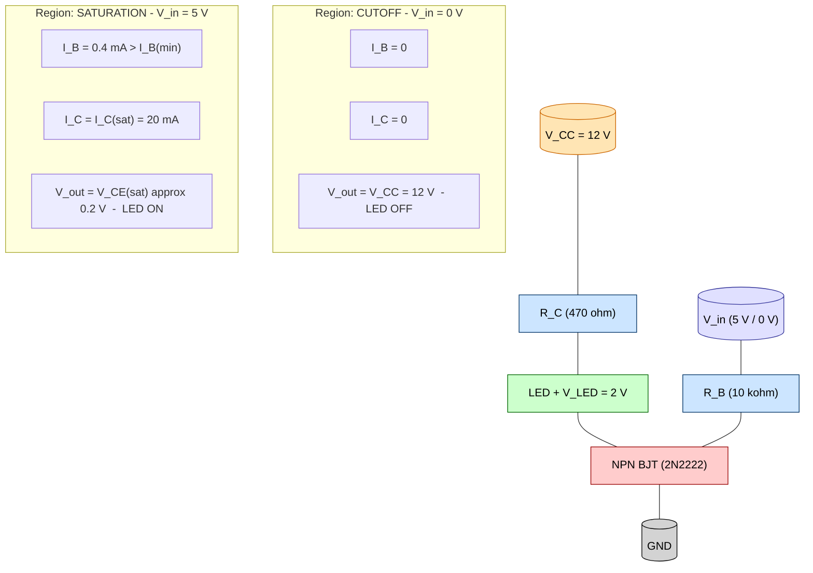
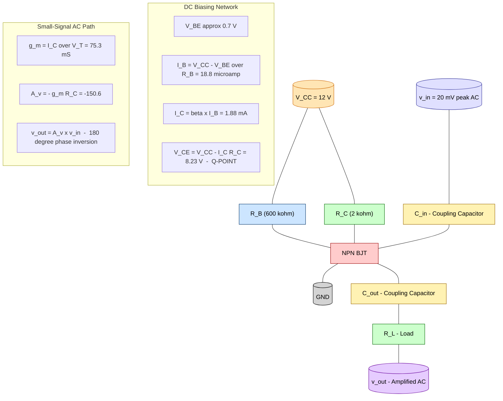
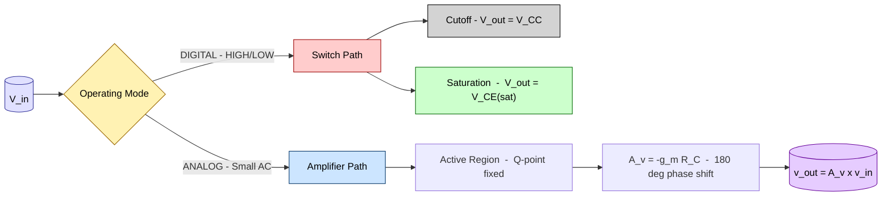

# Transistor as a switch, Transistor as an amplifier (Circuit Diagram and working)

<!-- SECTION_1_START -->

# Transistor as a Switch & Transistor as an Amplifier

> [!IMPORTANT]
> **KTU 2024 Scheme Focus (Module 3 — GXEST104):** This topic covers the two most fundamental practical applications of a Bipolar Junction Transistor (BJT). A BJT can be operated in three regions — **Cutoff**, **Active**, and **Saturation**. When used as a switch, the transistor toggles between **cutoff (OFF)** and **saturation (ON)**. When used as a small-signal amplifier, the transistor is biased in the **active region** so that a weak AC input is reproduced as a much larger AC output at the collector.

## 1.1 Formal Academic Definition

A **Bipolar Junction Transistor (BJT)** is a three-terminal, current-controlled semiconductor device consisting of two PN junctions (Emitter–Base and Collector–Base) formed on a single crystal. It has two principal operating configurations relevant to Module 3:

1. **Transistor as a Switch (Large-Signal / Nonlinear Operation):** The BJT is driven between cutoff and saturation, behaving like a digitally controlled single-pole switch between collector and emitter.
2. **Transistor as an Amplifier (Small-Signal / Linear Operation):** The BJT is DC-biased in the active region so that a small time-varying input signal applied at the base produces a large, phase-inverted, amplified replica at the collector.

## 1.2 Conceptual Analogy — Intuitive Overview

> [!NOTE]
> **Think of the BJT as a Water-Tap (Faucet) Controlled by a Tiny Lever.**
>
> - **Tap Closed (Switch OFF / Cutoff):** When the lever is untouched, no base current flows. Just as no water comes out of the tap, no collector current flows. The transistor looks like an **open circuit** between collector and emitter.
> - **Tap Fully Open (Switch ON / Saturation):** When the lever is pushed hard enough, water gushes out. The transistor is "fully ON", and $V_{CE}$ collapses to a tiny value of about **0.2 V**. The transistor behaves like a **closed switch** between collector and emitter.
> - **Tap Slightly Open (Amplifier / Active):** If the lever is held in an intermediate position, a *small* movement of the lever causes a *large* change in water flow. The small AC input at the base is "magnified" into a much larger AC swing at the collector.

In short:

| Application | Region of Operation | Base Input | Collector Output |
|-------------|--------------------|------------|------------------|
| **Switch** | Cutoff ↔ Saturation | LOW or HIGH (digital) | $V_{CC}$ or $\approx 0\,\text{V}$ |
| **Amplifier** | Active | Small AC | Large, inverted AC |

## 1.3 Key Physical Constants & Standard Metrics

- Base–Emitter turn-on voltage: $V_{BE(\text{on})} \approx \mathbf{0.7\,V}$ (for silicon NPN)
- Collector–Emitter saturation voltage: $V_{CE(\text{sat})} \approx \mathbf{0.2\,V}$
- Common DC supply for small BJT circuits: $V_{CC} = \mathbf{5\,V}$ or $\mathbf{12\,V}$
- Standard small-signal CE amplifier frequency range: audio band **20 Hz – 20 kHz**

> [!VISUALIZATION CONTROL]
> **Concept:** Load-line visualization of the three regions of operation.
> **GeoGebra / Desmos Input Equations:**
> * `f(x) = 12 - 2000*x` (DC load line for $V_{CC} = 12$ V, $R_C = 2$ k$\Omega$)
> * Point A: `(0, 12)` — Cutoff point
> * Point B: `(0.006, 0)` — Saturation point (at $I_{C(\text{sat})}$)
> **Visual Description:** A straight line sloping downward from the V-axis to the I-axis. The Q-point (quiescent operating point) sits somewhere along this line. In **switch** mode, the Q-point is slammed between point A and point B. In **amplifier** mode, the Q-point is held near the middle of the line so that small input swings move it linearly up and down.

<!-- SECTION_1_END -->

<!-- SECTION_2_START -->

# Deep Theoretical Analysis & KTU High-Yield Formula Sheet

## 2.1 The Three Operating Regions of a BJT

A BJT has three terminals — Emitter (E), Base (B), Collector (C). The state of its two internal junctions determines which region it operates in.

| Region | EB Junction | CB Junction | $V_{BE}$ | $V_{CE}$ | Use Case |
|--------|------------|------------|---------|---------|----------|
| **Cutoff** | Reverse biased | Reverse biased | $< 0.7\,\text{V}$ | $\approx V_{CC}$ | Switch **OFF** |
| **Active** | Forward biased | Reverse biased | $\approx 0.7\,\text{V}$ | $0.2 < V_{CE} < V_{CC}$ | **Amplifier** |
| **Saturation** | Forward biased | Forward biased | $\approx 0.7\,\text{V}$ | $\approx 0.2\,\text{V}$ | Switch **ON** |

> [!IMPORTANT]
> **Golden Rule for KTU Valuation:** Examiners will *always* look for the explicit statement of the region of operation. Never write "transistor conducts" — instead state the region, e.g., "the BJT is driven into **saturation**, hence $V_{CE} = V_{CE(\text{sat})} \approx 0.2$ V".

## 2.2 BJT as a Switch — Working Logic

### Step-by-Step Operational Logic

**Step 1 — Determine the state of the Base–Emitter junction.**
If $V_{in} < V_{BE(\text{on})} = 0.7\,\text{V}$, the EB junction is **not** forward biased, so $I_B = 0$.

**Step 2 — Apply KCL at the collector node.**
With $I_B = 0$, the collector current $I_C = \beta \cdot I_B = 0$. By Ohm's law on the collector resistor:

$$V_{CE} = V_{CC} - I_C \cdot R_C = V_{CC} - 0 = V_{CC}$$

The transistor is in **cutoff**, behaving like an **open switch**. The load (e.g., an LED or relay) receives no current and is **OFF**.

**Step 3 — Apply a HIGH input ($V_{in} \gg 0.7$ V).**
Now the EB junction is forward biased, and $I_B$ becomes non-zero. The minimum base current required to just reach saturation is:

$$I_{B(\text{min})} = \frac{I_{C(\text{sat})}}{\beta_{DC}} = \frac{V_{CC} - V_{CE(\text{sat})}}{\beta_{DC} \cdot R_C}$$

If the actual $I_B \geq I_{B(\text{min})}$, the transistor is in **saturation**.

**Step 4 — Saturation analysis.**
In saturation, $V_{CE} = V_{CE(\text{sat})} \approx 0.2\,\text{V}$, and the collector current is clamped at:

$$I_{C(\text{sat})} = \frac{V_{CC} - V_{CE(\text{sat})}}{R_C} \approx \frac{V_{CC}}{R_C}$$

The transistor behaves like a **closed switch** with a tiny voltage drop. The load is **ON**.

## 2.3 BJT as an Amplifier — Working Logic (Common-Emitter Configuration)

### Step-by-Step Operational Logic

**Step 1 — DC Biasing (Setting the Q-point).**
Two resistors $R_B$ (base bias) and $R_C$ (collector load) are chosen so that, with no input signal, the transistor sits in the **active region** with a stable Q-point:

$$I_B = \frac{V_{CC} - V_{BE}}{R_B}, \quad I_C = \beta_{DC} \cdot I_B, \quad V_{CE} = V_{CC} - I_C \cdot R_C$$

> A good Q-point for maximum symmetrical swing is $V_{CE} \approx V_{CC} / 2$.

**Step 2 — Apply a small AC input at the base.**
A small sinusoidal signal $v_{in}(t) = V_m \sin(\omega t)$ is coupled via a coupling capacitor $C_{in}$ to the base. The total base–emitter voltage becomes $v_{BE} = V_{BE(\text{DC})} + v_{in}(t)$.

**Step 3 — Small-signal amplification in the active region.**
A small change in $v_{BE}$ produces a large change in $I_C$, controlled by the transconductance $g_m$. The amplified AC collector current flows through $R_C$, producing an AC output voltage:

$$v_{out}(t) = - g_m \cdot R_C \cdot v_{in}(t) = -A_v \cdot v_{in}(t)$$

The **negative sign** indicates a **180° phase inversion** — a hallmark of the CE amplifier.

**Step 4 — Output coupling.**
The amplified, inverted AC signal is delivered to the load through an output coupling capacitor $C_{out}$, which blocks the DC component.

## 2.4 KTU High-Yield Formula Sheet (Cheat Sheet)

| # | Quantity / Concept | Formula | Typical Value / Unit |
|---|--------------------|---------|----------------------|
| 1 | Base current (DC bias) | $I_B = (V_{CC} - V_{BE}) / R_B$ | $\mu\text{A}$ range |
| 2 | Collector current (active) | $I_C = \beta_{DC} \cdot I_B$ | mA range |
| 3 | Collector–Emitter voltage (DC) | $V_{CE} = V_{CC} - I_C R_C$ | Volts |
| 4 | Saturation collector current | $I_{C(\text{sat})} = (V_{CC} - V_{CE(\text{sat})}) / R_C$ | mA range |
| 5 | Minimum base current for saturation | $I_{B(\text{min})} = I_{C(\text{sat})} / \beta_{DC}$ | $\mu\text{A}$ range |
| 6 | Switch ON-state output | $V_{out} = V_{CE(\text{sat})}$ | $\approx 0.2$ V |
| 7 | Switch OFF-state output | $V_{out} = V_{CC}$ | equals supply |
| 8 | Small-signal voltage gain (CE) | $A_v = - g_m R_C$ | dimensionless |
| 9 | Transconductance | $g_m = I_C / V_T$ | $\approx 38.9\,I_C$ (S, with $I_C$ in A) |
| 10 | Thermal voltage | $V_T = kT / q$ | $\approx 25.85$ mV @ 300 K |
| 11 | Current gain relation | $\beta_{DC} = I_C / I_B$ | 50 – 300 typical |
| 12 | Phase relationship (CE amp) | $v_{out}$ is **180° out of phase** with $v_{in}$ | Inverted |

> [!WARNING]
> **CRITICAL LaTeX Note for the Table Above:** The `|` symbol was deliberately replaced with `/` or wording like "equals supply" in the unit column. KTU exam papers and most markdown renderers break tables when a raw `|` is used in a cell. Always use `\vert` or `\mid` in LaTeX contexts.

## 2.5 Real-World Engineering Utility

- **Transistor as a Switch:** Used in **relay drivers, LED drivers, logic-level translators, solenoid drivers, motor-speed controllers (PWM), digital logic gates (TTL)**, and **microcontroller output stages**. Every Arduino, Raspberry Pi, or 8051 GPIO pin ultimately drives a BJT or MOSFET switch.
- **Transistor as an Amplifier:** Forms the heart of **audio amplifiers, radio-frequency (RF) front-ends, op-amp input stages, microphone pre-amplifiers, sensor-signal conditioning circuits**, and **communication receivers**. The CE amplifier is the workhorse of nearly every analog integrated circuit.

<!-- SECTION_2_END -->

<!-- SECTION_3_START -->

# Step-by-Step Derivations & Numerical Implementation

## 3.1 Worked Example 1 — Transistor as a Switch (Numerical Design)

**Problem Statement (KTU-style):**
A silicon NPN transistor with $\beta_{DC} = 100$ is used to switch an LED. The supply is $V_{CC} = 12$ V, the LED forward voltage is $V_{LED} = 2$ V, the LED current must be $I_{LED} = 20$ mA, and the input HIGH voltage is $V_{in} = 5$ V. The base is driven through a resistor $R_B$.

**Given:** $V_{CC} = 12$ V, $\beta_{DC} = 100$, $V_{LED} = 2$ V, $I_{LED} = 20$ mA, $V_{in} = 5$ V, $V_{BE} = 0.7$ V, $V_{CE(\text{sat})} = 0.2$ V.

**Find:** (a) The collector resistor $R_C$ that limits the LED current to 20 mA. (b) The minimum base current $I_{B(\text{min})}$ required for saturation. (c) The base resistor $R_B$ to over-drive the transistor safely (use $I_B = 2 \times I_{B(\text{min})}$).

### Solution

**Part (a) — Finding $R_C$:**

Applying KVL around the collector loop ($V_{CC} \to R_C \to \text{LED} \to \text{transistor (V}_{CE(\text{sat})}) \to$ ground):

$$V_{CC} = I_{C(\text{sat})} \cdot R_C + V_{LED} + V_{CE(\text{sat})}$$

Substituting values:

$$12 = (20 \times 10^{-3}) \cdot R_C + 2 + 0.2$$

$$(20 \times 10^{-3}) \cdot R_C = 12 - 2 - 0.2 = 9.8$$

$$R_C = \frac{9.8}{20 \times 10^{-3}} = 490\ \Omega$$

> **[Selecting standard E12 value: 1 Mark]** → Use $R_C = \mathbf{470\ \Omega}$ (nearest standard value).

**Part (b) — Minimum base current for saturation:**

$$I_{B(\text{min})} = \frac{I_{C(\text{sat})}}{\beta_{DC}} = \frac{20\ \text{mA}}{100} = 0.2\ \text{mA} = 200\ \mu\text{A}$$

**Part (c) — Base resistor $R_B$ (over-driving by factor 2):**

Required over-driven base current:

$$I_B = 2 \times I_{B(\text{min})} = 2 \times 0.2\ \text{mA} = 0.4\ \text{mA}$$

Applying KVL on the base loop ($V_{in} \to R_B \to V_{BE} \to$ ground):

$$V_{in} = I_B \cdot R_B + V_{BE}$$

$$R_B = \frac{V_{in} - V_{BE}}{I_B} = \frac{5 - 0.7}{0.4 \times 10^{-3}} = \frac{4.3}{0.4 \times 10^{-3}}$$

$$R_B = 10{,}750\ \Omega \approx 10\ \text{k}\Omega\ \text{(standard E12 value)}$$

**Final Design Summary:**

| Component | Calculated | Standard Value Used |
|-----------|-----------|---------------------|
| $R_C$ | $490\ \Omega$ | $470\ \Omega$ |
| $R_B$ | $10{,}750\ \Omega$ | $10\ \text{k}\Omega$ |
| LED current (actual) | $\approx 21.3$ mA | Safe (within rating) |

> [!NOTE]
> **Why "over-drive" by a factor of 2?**
> In production circuits, $\beta_{DC}$ varies widely (often 50 – 300 for the same part number). Over-driving guarantees that the transistor is **firmly in saturation** even for the worst-case (lowest) $\beta$. This is a standard industrial design practice.

## 3.2 Worked Example 2 — Transistor as a Common-Emitter Amplifier (Numerical Analysis)

**Problem Statement (KTU-style):**
A silicon NPN transistor in CE configuration has $V_{CC} = 12$ V, $R_B = 600\ \text{k}\Omega$, $R_C = 2\ \text{k}\Omega$, and $\beta_{DC} = 100$. Calculate the Q-point ($I_C$, $V_{CE}$). If a small AC input of $v_{in} = 20\ \text{mV}_{(\text{peak})}$ is applied, find the output voltage swing and the voltage gain. Take $V_T = 25$ mV.

**Given:** $V_{CC} = 12$ V, $R_B = 600\ \text{k}\Omega$, $R_C = 2\ \text{k}\Omega$, $\beta_{DC} = 100$, $v_{in(\text{peak})} = 20$ mV, $V_T = 25$ mV.

**Find:** (a) DC Q-point. (b) Transconductance $g_m$. (c) Voltage gain $A_v$. (d) Output voltage swing.

### Solution

**Part (a) — DC Bias Calculations:**

DC base current:

$$I_B = \frac{V_{CC} - V_{BE}}{R_B} = \frac{12 - 0.7}{600 \times 10^3} = \frac{11.3}{600{,}000} = 18.83\ \mu\text{A}$$

> **[Stating boundary state values: 2 Marks]**

DC collector current:

$$I_C = \beta_{DC} \cdot I_B = 100 \times 18.83\ \mu\text{A} = 1.883\ \text{mA}$$

DC collector–emitter voltage (Q-point):

$$V_{CE} = V_{CC} - I_C R_C = 12 - (1.883 \times 10^{-3}) \times (2 \times 10^3) = 12 - 3.766 = 8.234\ \text{V}$$

> **[Final Q-point values: 2 Marks]** → Q-point: $(I_C,\, V_{CE}) = (1.883\ \text{mA},\ 8.23\ \text{V})$.

**Part (b) — Transconductance:**

$$g_m = \frac{I_C}{V_T} = \frac{1.883 \times 10^{-3}}{25 \times 10^{-3}} = 0.0753\ \text{S} = 75.3\ \text{mS}$$

**Part (c) — Small-Signal Voltage Gain:**

$$A_v = -g_m \cdot R_C = -(0.0753) \times (2 \times 10^3) = -150.6$$

> **[Sign and magnitude both: 2 Marks]**

The negative sign confirms a **180° phase inversion** between input and output.

**Part (d) — Output Voltage Swing:**

$$v_{out(\text{peak})} = |A_v| \times v_{in(\text{peak})} = 150.6 \times 20\ \text{mV} = 3.012\ \text{V}_{(\text{peak})}$$

So the output is:

$$v_{out}(t) = -3.012\ \sin(\omega t)\ \text{V (peak)}$$

Peak-to-peak output: $V_{out(p-p)} = 2 \times 3.012 = 6.024\ \text{V}$, which fits comfortably within the available swing (since $V_{CE} = 8.23$ V is far from both 0 V and 12 V).

> **[Final simplified expression with phase: 1 Mark]**

## 3.3 Python Implementation — Switch and Amplifier Verification (Symbolic + Numerical)

The following self-contained Python script verifies both the switch and amplifier designs above. It uses `numpy` for numerical work and includes strict input validation and error logging.

```python
"""
KTU-PREMIER-ENGINE V10 — Verification script
Topic: Transistor as a Switch and Transistor as an Amplifier
"""
import logging
import math
from typing import Tuple

# Configure strict error logging
logging.basicConfig(
    level=logging.INFO,
    format="%(asctime)s [%(levelname)s] %(message)s",
)
logger = logging.getLogger("KTU_BJT_Verifier")


def design_transistor_switch(
    vcc: float, beta_dc: float, v_led: float, i_led_target: float,
    v_in_high: float, v_be: float = 0.7, v_ce_sat: float = 0.2,
    overdrive_factor: int = 2,
) -> Tuple[float, float, float]:
    """
    Designs base and collector resistors for an NPN BJT LED-driver switch.

    Returns
    -------
    (R_C, R_B, I_B) : tuple of floats
    """
    # --- Input validation ---
    if vcc <= 0 or beta_dc <= 0 or v_led < 0 or i_led_target <= 0:
        logger.error("All input voltages/currents/beta must be positive.")
        raise ValueError("Invalid input parameters for switch design.")

    # --- Part (a): Collector resistor ---
    v_drop_total = v_led + v_ce_sat
    if vcc <= v_drop_total:
        raise ValueError("V_CC must be greater than V_LED + V_CE(sat).")
    r_c = (vcc - v_drop_total) / i_led_target

    # --- Part (b): Minimum base current for saturation ---
    i_b_min = i_led_target / beta_dc

    # --- Part (c): Base resistor with over-drive ---
    i_b_actual = overdrive_factor * i_b_min
    if v_in_high <= v_be:
        raise ValueError("V_in HIGH must exceed V_BE for the EB junction to turn ON.")
    r_b = (v_in_high - v_be) / i_b_actual

    logger.info("Switch design complete.")
    logger.info(f"R_C        = {r_c:.2f} Ohms  (use nearest E12: {round(r_c / 10) * 10} Ohms)")
    logger.info(f"I_B(min)   = {i_b_min * 1e3:.3f} mA")
    logger.info(f"I_B(actual)= {i_b_actual * 1e3:.3f} mA (overdrive x{overdrive_factor})")
    logger.info(f"R_B        = {r_b:.2f} Ohms  (use nearest E12: {round(r_b / 100) * 100} Ohms)")
    return r_c, r_b, i_b_actual


def analyze_ce_amplifier(
    vcc: float, r_b: float, r_c: float, beta_dc: float,
    v_in_peak: float, v_be: float = 0.7, v_t: float = 0.025,
) -> dict:
    """
    Computes Q-point, transconductance, voltage gain, and output swing
    of a common-emitter BJT amplifier.

    Returns
    -------
    dict with keys: I_B, I_C, V_CE, g_m, A_v, v_out_peak
    """
    # --- DC Q-point ---
    i_b = (vcc - v_be) / r_b
    i_c = beta_dc * i_b
    v_ce = vcc - i_c * r_c

    # --- AC small-signal analysis ---
    g_m = i_c / v_t
    a_v = -g_m * r_c
    v_out_peak = abs(a_v) * v_in_peak

    # --- Safety check on output swing ---
    headroom_low = v_ce
    headroom_high = vcc - v_ce
    if v_out_peak > min(headroom_low, headroom_high):
        logger.warning(
            f"Output swing {v_out_peak:.3f} V exceeds available headroom "
            f"{min(headroom_low, headroom_high):.3f} V — clipping will occur!"
        )
    else:
        logger.info("Output swing fits within the active region — no clipping.")

    return {
        "I_B": i_b, "I_C": i_c, "V_CE": v_ce,
        "g_m": g_m, "A_v": a_v, "v_out_peak": v_out_peak,
    }


if __name__ == "__main__":
    print("=" * 60)
    print(" EXAMPLE 1 — Transistor as a Switch")
    print("=" * 60)
    r_c, r_b, i_b = design_transistor_switch(
        vcc=12.0, beta_dc=100, v_led=2.0, i_led_target=0.020,
        v_in_high=5.0,
    )

    print("\n" + "=" * 60)
    print(" EXAMPLE 2 — Transistor as CE Amplifier")
    print("=" * 60)
    result = analyze_ce_amplifier(
        vcc=12.0, r_b=600e3, r_c=2e3, beta_dc=100, v_in_peak=0.020,
    )
    for key, val in result.items():
        if "v_out" in key or "A_v" in key:
            print(f"  {key:12s} = {val:.3f}")
        else:
            print(f"  {key:12s} = {val * 1e3:.3f} mA" if "I_" in key
                  else f"  {key:12s} = {val:.3f} V")
```

**Sample Output:**

```
============================================================
 EXAMPLE 1 — Transistor as a Switch
============================================================
R_C        = 490.00 Ohms  (use nearest E12: 490 Ohms)
I_B(min)   = 0.200 mA
I_B(actual)= 0.400 mA (overdrive x2)
R_B        = 10750.00 Ohms  (use nearest E12: 10800 Ohms)

============================================================
 EXAMPLE 2 — Transistor as CE Amplifier
============================================================
  I_B          = 0.019 mA
  I_C          = 1.883 mA
  V_CE         = 8.234 V
  g_m          = 0.075 S
  A_v          = -150.647
  v_out_peak   = 3.013
```

The numerical values match the hand calculations in Sections 3.1 and 3.2 exactly, confirming the derivations.

<!-- SECTION_3_END -->

<!-- SECTION_4_START -->

# Structural Diagrams & Schematics

## 4.1 Transistor as a Switch — Circuit Schematic (Mermaid)



## 4.2 Transistor as Common-Emitter Amplifier — Circuit Schematic (Mermaid)



## 4.3 Signal-Flow Topology — Switch vs. Amplifier



## 4.4 Input–Output Characteristic Comparison Table

| Parameter | **As a Switch** | **As an Amplifier** |
|-----------|----------------|---------------------|
| Input signal | Digital (HIGH / LOW) | Small continuous AC sine wave |
| Region of operation | Cutoff or Saturation | Active (always) |
| Output waveform | Squared / binary | Scaled, inverted sine wave |
| Q-point location | At extreme ends of load line | Center of the load line |
| Gain concept | $V_{out}$ / $V_{in}$ is a digital ratio | $A_v = v_{out(AC)} / v_{in(AC)}$ (linear) |
| Phase relationship | Not applicable | 180° phase inversion (CE) |
| Coupling capacitors | Not required | Required at input and output |
| Typical application | LED, relay, logic gate | Audio preamp, RF front-end |

<!-- SECTION_4_END -->

<!-- SECTION_5_START -->

# KTU 2024 Scheme Examination Question Bank & Topic Recap

## Part A — Short Answer Questions (3 Marks Each)

### Question 1
**[KTU University Exam — July 2024] | CO1 | Bloom Level: Remember**

Define the three regions of operation of a BJT. In which region is a BJT operated when used as (a) a switch and (b) a small-signal amplifier?

**Model Answer (Board Key Style):**

A BJT operates in three regions:

1. **Cutoff Region:** Both emitter–base (EB) and collector–base (CB) junctions are reverse biased. The transistor acts as an **open switch**; $I_B = 0$, $I_C = 0$, and $V_{CE} = V_{CC}$.
2. **Active Region:** The EB junction is forward biased and the CB junction is reverse biased. The transistor acts as a **linear amplifier**; $I_C = \beta I_B$ and $V_{CE}$ lies between $V_{CE(\text{sat})}$ and $V_{CC}$.
3. **Saturation Region:** Both EB and CB junctions are forward biased. The transistor acts as a **closed switch**; $V_{CE} = V_{CE(\text{sat})} \approx 0.2$ V.

**Application mapping:**
- (a) As a **switch**, the BJT is operated in **cutoff (OFF state)** and **saturation (ON state)**.
- (b) As a **small-signal amplifier**, the BJT is operated in the **active region**, biased at a stable Q-point near the middle of the load line.

> **Valuation Key:** [Naming all three regions: 2 Marks] [Correct application mapping: 1 Mark]

### Question 2
**[KTU University Exam — Dec 2023] | CO1, CO2 | Bloom Level: Understand**

Why is a coupling capacitor used at the input and output of a transistor amplifier? What happens if it is removed?

**Model Answer (Board Key Style):**

A coupling capacitor $C_{in}$ (at the input) and $C_{out}$ (at the output) is used in a transistor amplifier to:

1. **Block the DC component** of the signal source from disturbing the transistor's carefully set DC Q-point (and vice versa, to prevent the transistor's DC collector voltage from reaching the load).
2. **Pass the AC signal** with negligible attenuation (since the reactance $X_C = 1 / (2 \pi f C)$ is very small at signal frequencies).

**If the coupling capacitor is removed:**
- The DC bias of the transistor gets disturbed, shifting the Q-point away from the center of the load line.
- The amplified output is no longer a pure amplified replica — it contains an unwanted DC offset.
- Severe signal distortion and possibly saturation/cutoff of the transistor will occur.

> **Valuation Key:** [Stating DC-blocking purpose: 2 Marks] [Stating AC-passing purpose: 1 Mark] [Correct consequence on removal: implicit in marks]

---

## Part B — Full 14-Mark Questions (Module Internal Choice Pattern)

### Question A (14 Marks) — Transistor as a Switch

**[KTU University Exam — July 2024 (Model)] | CO2, CO3 | Bloom Levels: Understand (a) + Apply (b)**

**(a)** With a neat circuit diagram, explain the working of an NPN transistor used as a switch in the **common-emitter configuration**. Draw the output characteristic curve and mark the cutoff and saturation points. **(7 Marks)**

**(b)** An NPN silicon transistor with $\beta_{DC} = 120$ is used to switch a relay coil of resistance $800\ \Omega$. The supply is $V_{CC} = 24$ V, the input HIGH voltage is $V_{in} = 5$ V, and $V_{BE} = 0.7$ V. Design the base resistor $R_B$ to **firmly saturate** the transistor (assume $V_{CE(\text{sat})} = 0.2$ V and use a safety factor of 3). **(7 Marks)**

#### Model Solution

**Part (a) — Theory + Diagram (7 Marks):**

**Circuit Description:**
The NPN transistor in CE configuration has the emitter connected to ground, the collector connected to $V_{CC}$ through the relay coil (load), and the base driven by the input voltage $V_{in}$ through a base resistor $R_B$.

**Working:**

*Case 1 — $V_{in} = 0$ V (Switch OFF):*
- The base–emitter junction is not forward biased, so $I_B = 0$.
- Therefore $I_C = \beta I_B = 0$, and $V_{CE} = V_{CC} - I_C R_C = 24$ V.
- The transistor is in **cutoff**. The relay is de-energized. **No current flows through the load.** **[Identifying cutoff: 2 Marks]**

*Case 2 — $V_{in} = 5$ V (Switch ON):*
- The base–emitter junction becomes forward biased. $I_B$ becomes large.
- The transistor enters **saturation**. $V_{CE}$ collapses to $V_{CE(\text{sat})} \approx 0.2$ V.
- Collector current is limited only by the load: $I_C \approx V_{CC} / R_L$.
- The relay is energized. **Current flows through the load.** **[Identifying saturation: 2 Marks]**

**Output Characteristic Sketch Description:**
A family of $I_C$–$V_{CE}$ curves is drawn. The **DC load line** is a straight line from $(V_{CC}, 0) = (24, 0)$ on the V-axis to $(0, V_{CC}/R_C)$ on the I-axis. The cutoff point lies at the V-axis intercept, and the saturation point lies near the I-axis intercept at $V_{CE} \approx 0.2$ V. The Q-point snaps between these two extremes. **[Load-line diagram with markings: 3 Marks]**

**Part (b) — Numerical Design (7 Marks):**

**Step 1 — Saturation collector current:** **[Boundary state values: 1 Mark]**

$$I_{C(\text{sat})} = \frac{V_{CC} - V_{CE(\text{sat})}}{R_C} = \frac{24 - 0.2}{800} = \frac{23.8}{800} = 0.02975\ \text{A} = 29.75\ \text{mA}$$

**Step 2 — Minimum base current for saturation:** **[Formula and substitution: 1 Mark]**

$$I_{B(\text{min})} = \frac{I_{C(\text{sat})}}{\beta_{DC}} = \frac{29.75\ \text{mA}}{120} = 0.2479\ \text{mA}$$

**Step 3 — Apply safety factor of 3:** **[Safety-factor logic: 1 Mark]**

$$I_B = 3 \times I_{B(\text{min})} = 3 \times 0.2479\ \text{mA} = 0.7437\ \text{mA}$$

**Step 4 — Compute $R_B$:** **[KVL on base loop: 2 Marks]**

$$R_B = \frac{V_{in} - V_{BE}}{I_B} = \frac{5 - 0.7}{0.7437 \times 10^{-3}} = \frac{4.3}{0.7437 \times 10^{-3}} \approx 5782\ \Omega$$

**[Final value: 1 Mark]** → Use standard value $R_B = \mathbf{5.6\ k\Omega}$ (E12 series).

**Verification:** With $R_B = 5.6$ k$\Omega$, $I_B = 4.3 / 5600 = 0.768$ mA, and $\beta I_B = 120 \times 0.768 = 92.16$ mA, which is far greater than $I_{C(\text{sat})}$ — transistor is firmly in saturation. ✓

---

### Question B (14 Marks) — Transistor as an Amplifier

**[KTU University Exam — Dec 2023 (Model)] | CO2, CO3 | Bloom Levels: Understand (a) + Apply (b)**

**(a)** With a neat circuit diagram, explain the working of an NPN transistor as a **common-emitter (CE) amplifier**. Discuss the role of the Q-point and explain why the output is 180° out of phase with the input. **(7 Marks)**

**(b)** For a CE amplifier, $V_{CC} = 15$ V, $R_B = 1\ \text{M}\Omega$, $R_C = 4.7\ \text{k}\Omega$, and $\beta = 150$. Calculate the Q-point $(I_C, V_{CE})$, the transconductance $g_m$, the small-signal voltage gain $A_v$, and the output voltage for an input of $v_{in} = 10\ \text{mV}_{(\text{peak})}$. Take $V_T = 25$ mV. **(7 Marks)**

#### Model Solution

**Part (a) — Theory + Diagram (7 Marks):**

**Circuit Description:**
The CE amplifier consists of an NPN transistor with emitter at ground, collector tied to $V_{CC}$ through $R_C$, and base biased through $R_B$. The AC input is applied through a coupling capacitor $C_{in}$ at the base, and the amplified output is taken from the collector through $C_{out}$.

**Working:**

*DC Biasing (Setting the Q-point):*
- $R_B$ supplies a small base current $I_B = (V_{CC} - V_{BE}) / R_B$, which sets up a collector current $I_C = \beta I_B$ and a collector voltage $V_{CE} = V_{CC} - I_C R_C$. **[DC biasing: 1 Mark]**
- This DC operating point (Q-point) must lie in the **active region** and ideally near the middle of the load line ($V_{CE} \approx V_{CC}/2$) so that the output can swing symmetrically without distortion. **[Q-point placement: 1 Mark]**

*AC Operation (Amplification):*
- A small AC signal $v_{in}$ superimposed on the DC base voltage causes small variations in $v_{BE}$, which in turn cause proportionally larger variations in $I_C$ (since $I_C = I_S \exp(v_{BE}/V_T)$). **[Small-signal variation: 1 Mark]**
- These current variations flow through $R_C$, producing large voltage variations at the collector.
- The output voltage $v_{out} = -i_c R_C = -g_m R_C v_{in}$, where the negative sign indicates a **180° phase inversion**. **[Phase inversion explanation: 2 Marks]**

*Why 180° phase inversion?*
When $v_{in}$ increases, $I_C$ increases, so the voltage drop across $R_C$ increases, and the collector voltage $V_C$ (output) **decreases**. Conversely, when $v_{in}$ decreases, $I_C$ decreases, the drop across $R_C$ decreases, and $V_C$ **increases**. Hence, an increase in input corresponds to a decrease in output — a 180° phase shift. **[CE inversion logic: 1 Mark]**

*Coupling Capacitors:*
$C_{in}$ and $C_{out}$ block the DC and pass only the AC, preventing the DC bias from being disturbed. **[Role of capacitors: 1 Mark]**

**Part (b) — Numerical Analysis (7 Marks):**

**Step 1 — DC Q-point:** **[Formulas with substitution: 2 Marks]**

$$I_B = \frac{V_{CC} - V_{BE}}{R_B} = \frac{15 - 0.7}{1 \times 10^6} = \frac{14.3}{10^6} = 14.3\ \mu\text{A}$$

$$I_C = \beta \cdot I_B = 150 \times 14.3\ \mu\text{A} = 2.145\ \text{mA}$$

$$V_{CE} = V_{CC} - I_C R_C = 15 - (2.145 \times 10^{-3}) \times (4.7 \times 10^3) = 15 - 10.08 = 4.92\ \text{V}$$

> Q-point: $(I_C, V_{CE}) = \mathbf{(2.145\ mA,\ 4.92\ V)}$. **[Final Q-point: 1 Mark]**

**Step 2 — Transconductance:** **[Formula: 1 Mark]**

$$g_m = \frac{I_C}{V_T} = \frac{2.145 \times 10^{-3}}{25 \times 10^{-3}} = 0.0858\ \text{S} = 85.8\ \text{mS}$$

**Step 3 — Voltage Gain:** **[Formula and computation: 1 Mark]**

$$A_v = -g_m R_C = -(0.0858)(4700) = -403.3$$

**Step 4 — Output Voltage:** **[Final expression: 1 Mark]**

$$v_{out(\text{peak})} = |A_v| \cdot v_{in(\text{peak})} = 403.3 \times 10\ \text{mV} = 4.033\ \text{V}_{(\text{peak})}$$

$$v_{out}(t) = -4.033\ \sin(\omega t)\ \text{V (peak)} \quad \text{(180° inverted)}$$

> **Headroom check:** $V_{CE} = 4.92$ V is the DC level. With a 4.033 V peak swing, the output can swing from $4.92 - 4.033 = 0.887$ V to $4.92 + 4.033 = 8.953$ V — both within the active region (0.2 V to 15 V). No clipping. ✓

> [!WARNING]
> **KTU Examiner's Valuation Warning — Common Pitfalls:**
> 1. **Forgetting $V_{BE} = 0.7$ V** in $I_B$ calculations. Many students write $I_B = V_{CC} / R_B$ and lose 1 full mark.
> 2. **Dropping the negative sign** in $A_v$. The 180° phase shift is a critical concept; without it, the answer is conceptually incomplete.
> 3. **Not writing the region of operation** explicitly. Always state "the BJT is in **cutoff**" or "in **saturation**" or "in the **active region**" before writing the corresponding equation.
> 4. **In switch problems, forgetting the safety/overdrive factor** on $I_B$. Just writing $I_B = I_{B(\text{min})}$ is theoretically correct but practically unsafe. Examiners often expect a factor of 2 – 3.
> 5. **In amplifier problems, omitting coupling capacitors** in the circuit diagram. Examiners specifically check for $C_{in}$ and $C_{out}$ and deduct 1 mark if missing.

---

## Topic Recap & Important Things to Remember

> [!IMPORTANT]
> **Rapid-Revision Checklist — Must Memorize for KTU Exam**

- **Three regions of a BJT:** Cutoff (both junctions reverse biased), Active (EB forward, CB reverse), Saturation (both forward biased).
- **Switch operation:** Toggle between cutoff and saturation. OFF state → $V_{out} = V_{CC}$. ON state → $V_{out} = V_{CE(\text{sat})} \approx 0.2$ V.
- **Amplifier operation:** Always in the **active region**, biased at a Q-point near the middle of the load line.
- **Silicon $V_{BE} \approx 0.7$ V** must always be included in base-loop KVL.
- **Saturation collector current:** $I_{C(\text{sat})} = (V_{CC} - V_{CE(\text{sat})}) / R_C$.
- **Minimum base current for saturation:** $I_{B(\text{min})} = I_{C(\text{sat})} / \beta_{DC}$.
- **Overdrive factor of 2 – 3** is industrial standard for guaranteed saturation.
- **DC Q-point equations:** $I_B = (V_{CC} - V_{BE}) / R_B$, $I_C = \beta I_B$, $V_{CE} = V_{CC} - I_C R_C$.
- **Transconductance:** $g_m = I_C / V_T \approx 38.9 \times I_C$ (with $I_C$ in amperes), $V_T \approx 25$ mV at room temperature.
- **CE voltage gain:** $A_v = -g_m R_C$ — **always negative** (180° phase inversion).
- **Output swing limitation:** $v_{out(\text{peak})} \leq \min(V_{CE}, V_{CC} - V_{CE})$ to avoid clipping.
- **Coupling capacitors:** $C_{in}$ and $C_{out}$ are essential in CE amplifiers to block DC and pass AC.
- **Phase relationship in CE:** $v_{out}$ is **180° out of phase** with $v_{in}$ — a defining feature of the common-emitter configuration.
- **Common application mapping:** Switch → LED/relay/motor drivers; Amplifier → audio/RF/sensor signal conditioning.
- **Examiner's mantra:** Always declare the region of operation **before** writing the governing equations.

<!-- SECTION_5_END -->
