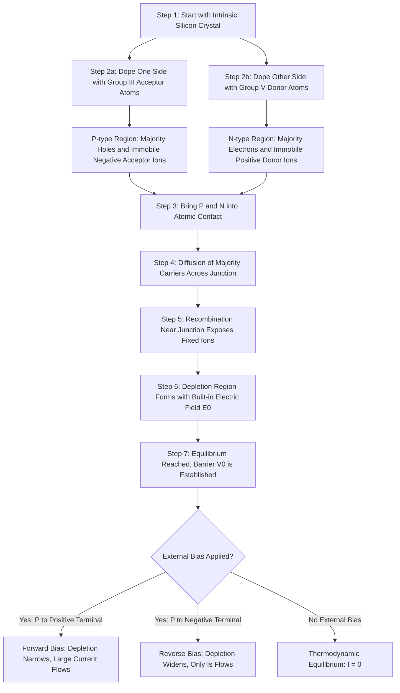
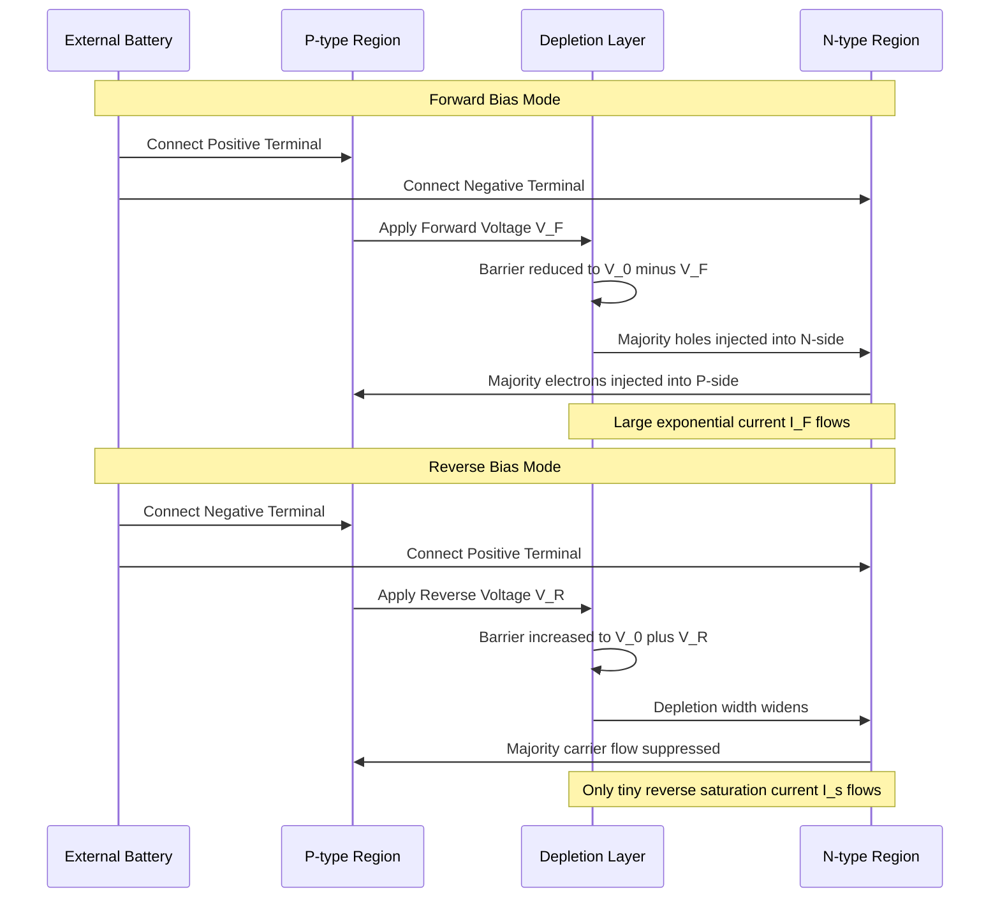

# Working of PN junction diode, V-I characteristics of PN Junction diode

<!-- SECTION_1_START -->
# 1. Core Technical Definition & Intuitive Overview

## 1.1 Formal Academic Definition (KTU 2024 Syllabus Terminology)

A **PN Junction Diode** is a two-terminal, semiconductor device formed by joining a P-type semiconductor (excess holes as majority charge carriers) with an N-type semiconductor (excess free electrons as majority charge carriers) within a single crystal lattice. The interface where the two regions meet is called the **metallurgical junction**. Under thermal equilibrium, this junction creates a **depletion region** (also called the space-charge region or transition region) and an associated **built-in potential barrier** ($V_0$), which is approximately **0.7 V** for silicon and **0.3 V** for germanium at room temperature ($T = 300\ \text{K}$). The diode conducts current predominantly in one direction (forward bias) and blocks it in the opposite direction (reverse bias), making it the fundamental building block of modern electronics.

> [!IMPORTANT]
> **KTU 2024 Module-3 Highlight:** The PN junction diode is the foundational active device. Mastery of its equilibrium band diagram, depletion width, and V–I curve is mandatory because **every subsequent device (BJT, MOSFET, LED, Zener, Photodiode)** is a derivative or extension of this single junction physics.

## 1.2 Intuition — The "One-Way Check Valve" Analogy

Think of a PN junction diode as an **electronic check valve** used in plumbing:

| Plumbing Analogy | PN Junction Diode Equivalent |
|---|---|
| Water flowing freely in the allowed direction | Forward-bias current ($I_F$) |
| A spring-loaded flap that snaps shut | Depletion region + potential barrier |
| Pressure needed to push the flap open | Cut-in / Knee voltage ($V_k \approx 0.7\ \text{V}$ for Si) |
| A reverse-flow lock — water blocked | Reverse bias (only tiny leakage flows) |
| Tiny drip in the reverse direction | Reverse saturation current ($I_s \approx \text{nA}$ to $\mu\text{A}$) |
| The valve bursting if reverse pressure is too high | Reverse Breakdown (Zener / Avalanche) |

**Plain-English Flow:** A plumber's check valve *automatically* permits water flow in one direction and blocks it in the other. Similarly, the PN junction *automatically* permits conventional current flow from P $\rightarrow$ N when forward biased, and blocks it when reverse biased. The "spring" holding the valve shut is the electric field of the depletion region created by ionized donor and acceptor atoms.

> [!NOTE]
> **Key Physical Insight:** The diode is **not** a simple resistor. Its resistance is non-linear, voltage-dependent, and direction-dependent. The static resistance ($R = V/I$) and dynamic (AC) resistance ($r_d = dV/dI$) are completely different quantities.

## 1.3 Physical Constants Used Throughout This Topic

The following constants must be memorized in **bold** for KTU 2024 examinations:

- **Boltzmann Constant: $k = 1.380 \times 10^{-23}\ \text{J/K}$**
- **Electronic Charge: $q = 1.602 \times 10^{-19}\ \text{C}$**
- **Thermal Voltage at 300 K: $V_T = kT/q \approx 25.85\ \text{mV}$** (often rounded to **26 mV** in KTU numericals)
- **Intrinsic Carrier Concentration of Si at 300 K: $n_i \approx 1.5 \times 10^{10}\ \text{cm}^{-3}$**
- **Permittivity of Si: $\varepsilon_s = 11.7 \times \varepsilon_0 = 1.04 \times 10^{-12}\ \text{F/cm}$**
- **Built-in Potential for Si: $V_0 \approx 0.7\ \text{V}$**
- **Built-in Potential for Ge: $V_0 \approx 0.3\ \text{V}$**

> [!VISUALIZATION CONTROL]
> **Concept:** I-V Characteristic Curve of a Silicon PN Junction Diode
> **GeoGebra / Desmos Input Equations:**
> * Forward region: $I(x) = 10^{-12} \cdot \left(e^{38.5 \cdot x} - 1\right)$ for $x \ge 0.7$
> * Reverse region: $I(x) = -10^{-9}$ for $x < 0$
> * Knee point: $(0.7,\ 0)$
> **Visual Description:** The student should observe a flat, near-zero negative current for $x < 0$ (reverse saturation), an exponential "elbow" rising sharply after $x = 0.7$ (forward conduction), and a vertical drop at some large negative voltage (breakdown region).

<!-- SECTION_1_END -->

<!-- SECTION_2_START -->
# 2. Deep Theoretical Analysis & KTU High-Yield Formula Sheet

## 2.1 The Two Parent Materials — P-Type and N-Type Semiconductors

### N-Type Semiconductor (Majority carriers: **electrons**)
- Created by doping a pure silicon (or germanium) crystal with a pentavalent impurity (e.g., Phosphorus, Arsenic, Antimony) from **Group V** of the periodic table.
- Four of the five valence electrons form covalent bonds with neighboring Si atoms. The **fifth electron is loosely bound** and becomes a free conduction-band electron at room temperature.
- These donor atoms, after losing their extra electron, become **immobile positive ions** ($N_D^+$).
- Majority carriers: electrons ($n \approx N_D$); Minority carriers: holes ($p \approx n_i^2/N_D$).

### P-Type Semiconductor (Majority carriers: **holes**)
- Created by doping with a trivalent impurity (e.g., Boron, Gallium, Indium) from **Group III**.
- The three valence electrons form only three of the four required covalent bonds, leaving one **vacancy** — a hole — which acts as a positive mobile charge carrier.
- These acceptor atoms, after accepting an electron from a neighboring bond, become **immobile negative ions** ($N_A^-$).
- Majority carriers: holes ($p \approx N_A$); Minority carriers: electrons ($n \approx n_i^2/N_A$).

## 2.2 The Birth of the PN Junction — The Depletion Region

When the P-region and N-region are brought into atomic contact (typically grown as a single crystal), three physical processes occur simultaneously:

1. **Diffusion:** Free electrons from the N-side diffuse into the P-side (down the concentration gradient) and recombine with holes near the junction. Similarly, holes from the P-side diffuse into the N-side and recombine with electrons.
2. **Ion Exposure:** As electrons leave the N-side, they leave behind un-neutralized, **immobile positive donor ions**. As holes leave the P-side, they leave behind un-neutralized, **immobile negative acceptor ions**. These fixed ions form the **space-charge (depletion) region**.
3. **Built-in Electric Field ($\mathscr{E}_0$):** The positive ions on the N-side and negative ions on the P-side create an internal electric field that points from the N-side toward the P-side. This field opposes further diffusion of majority carriers, establishing a state of **dynamic equilibrium**.

> [!NOTE]
> **Mass Action Law:** Under equilibrium, the product of electron and hole concentrations is always $np = n_i^2$, regardless of doping. This is a **conservation law** the examiner loves to test.

## 2.3 The Built-In Potential Barrier ($V_0$)

The potential difference that develops across the depletion region is the **built-in (or contact) potential**, denoted $V_0$. It is derived from charge neutrality and Fermi-level equalization:

$$
V_0 = V_T \cdot \ln\!\left(\frac{N_A \cdot N_D}{n_i^{\,2}}\right)
$$

where $V_T = kT/q$ is the **thermal voltage**. For a typical Si diode with $N_A = 10^{18}\ \text{cm}^{-3}$ and $N_D = 10^{15}\ \text{cm}^{-3}$, $V_0 \approx 0.75\ \text{V}$.

## 2.4 The Width of the Depletion Region ($W$)

The total depletion width $W = x_p + x_n$ is split between the P-side and N-side inversely proportional to doping (the lighter side depletes more). Applying Poisson's equation and using the one-sided or symmetric junction approximation:

$$
W = \sqrt{\frac{2 \cdot \varepsilon_s \cdot V_0}{q} \cdot \left(\frac{1}{N_A} + \frac{1}{N_D}\right)}
$$

For a **one-sided abrupt junction** (e.g., $N_A \gg N_D$, a $P^+N$ junction), the depletion width exists almost entirely on the lightly doped side:

$$
W \approx \sqrt{\frac{2 \cdot \varepsilon_s \cdot V_0}{q \cdot N_D}}
$$

## 2.5 External Biasing — The Two Operating Modes

### (a) Forward Bias (P $\rightarrow$ +, N $\rightarrow$ –)
- The external battery's positive terminal connects to the P-side, negative to the N-side.
- The applied voltage **opposes** the built-in field. When $V_{\text{applied}} > V_0$, the depletion region **collapses**.
- The potential barrier is reduced to $V_0 - V_F$. Majority carriers are now injected across the junction in massive numbers.
- Current rises **exponentially** with applied voltage.

### (b) Reverse Bias (P $\rightarrow$ –, N $\rightarrow$ +)
- The external battery's negative terminal connects to the P-side, positive to the N-side.
- The applied voltage **adds to** the built-in field. The depletion region **widens**.
- The potential barrier increases to $V_0 + V_R$. Majority carrier diffusion is suppressed.
- Only thermally generated minority carriers contribute a tiny, nearly constant **reverse saturation current** $I_s$, which is independent of reverse voltage but **strongly dependent on temperature** (doubles every 10 °C).

## 2.6 The V–I Characteristic — Shockley's Diode Equation

The complete analytical model for the diode current under both biases is the **Shockley Diode Equation** (1950, Nobel Prize winning work):

$$
\boxed{\;I_D = I_s \cdot \left(e^{\,V_D / (n \cdot V_T)} - 1\right)\;}
$$

where:

- $I_D$ = diode current (A), positive in forward direction
- $I_s$ = reverse saturation current (A), typically $10^{-9}$ to $10^{-15}\ \text{A}$
- $V_D$ = voltage across the diode (V)
- $n$ = **ideality factor** (1 for ideal, 1–2 for real diodes)
- $V_T$ = thermal voltage $\approx 26\ \text{mV}$ at $300\ \text{K}$

The **"-1"** term is negligible for $V_D > 0.1\ \text{V}$ but dominates in reverse bias, giving $I_D \approx -I_s$.

## 2.7 KTU High-Yield Formula Cheat Sheet

> [!IMPORTANT]
> The following table is the **exam-day reference card** for every KTU numerical on this topic. Memorize the units, conditions, and limits of validity.

| # | Formula | Description | Validity / Units |
|---|---|---|---|
| 1 | $V_T = kT / q$ | Thermal voltage | $V_T \approx 25.85\ \text{mV}$ at 300 K |
| 2 | $n_i^2 = N_C \cdot N_V \cdot e^{-E_g / (kT)}$ | Intrinsic carrier product | $\text{cm}^{-6}$, $E_g$ in eV |
| 3 | $np = n_i^2$ | Mass action law (always) | $\text{cm}^{-6}$ |
| 4 | $V_0 = V_T \cdot \ln(N_A N_D / n_i^2)$ | Built-in potential | Volts, depends on doping |
| 5 | $W = \sqrt{2 \varepsilon_s V_0 / (q) \cdot (1/N_A + 1/N_D)}$ | Total depletion width | cm or $\mu\text{m}$ |
| 6 | $x_n / x_p = N_A / N_D$ | Charge neutrality (ratio of widths) | Dimensionless |
| 7 | $I_D = I_s \cdot \left(e^{V_D/(n V_T)} - 1\right)$ | Shockley diode equation | $I$ in A, $V$ in V |
| 8 | $r_d = n V_T / I_D$ | Dynamic (small-signal) resistance | Ohms |
| 9 | $I_{s2}/I_{s1} = 2^{(T_2 - T_1)/10}$ | Reverse saturation vs temperature | Doubles per 10 °C rise |
| 10 | $V_{\text{forward}} = V_k + I_D \cdot r_s$ | Piecewise-linear model | $V_k \approx 0.7$ V (Si) |

## 2.8 Real-World Engineering Utility

The PN junction diode is the *atomic unit* of all modern electronics. Production applications where the physics studied here directly matters:

- **Rectifiers** (AC $\rightarrow$ DC conversion) in every laptop charger, SMPS, and mobile adapter — the **unidirectional** current property is the entire reason these devices exist.
- **Signal Clippers and Clampers** in analog TV demodulation, FM transmitters, and laboratory waveform shapers.
- **Voltage Multipliers** in X-ray machines, cathode-ray tubes, and ion pumps.
- **Logic Gates (Diodes)** in DTL and ancient digital logic, and as ESD-protection clamps on every CMOS input pin of every IC ever manufactured.
- **Solar Cells** — a large-area PN junction that converts photon energy into electrical current (photovoltaic effect, the inverse of LED operation).
- **Temperature Sensors** — the predictable $V_T = kT/q$ and $I_s(T)$ dependence forms the basis of silicon bandgap temperature sensors used in CPU thermal management.

<!-- SECTION_2_END -->

<!-- SECTION_3_START -->
# 3. Step-by-Step Derivations, Models, and Symbolic Implementation

## 3.1 Derivation 1 — Built-in Potential from Fermi-Level Equalization

**Goal:** Derive $V_0 = V_T \cdot \ln(N_A N_D / n_i^{\,2})$.

**Step 1 — Electrochemical potentials on each side.**

In the isolated N-region, the electron concentration is $n_n \approx N_D$, and the hole concentration is $p_n = n_i^2 / N_D$. The Fermi level on the N-side lies at an energy $E_{F_n}$ above the intrinsic level $E_i$. Using the Boltzmann approximation:

$$
n_n = n_i \cdot e^{(E_{F_n} - E_i)/(kT)} \quad\Rightarrow\quad E_{F_n} - E_i = kT \cdot \ln(N_D / n_i)
$$

**Step 2 — Fermi level on the P-side.**

In the isolated P-region, the hole concentration is $p_p \approx N_A$, and the electron concentration is $n_p = n_i^2 / N_A$. The Fermi level on the P-side lies below $E_i$ by:

$$
E_i - E_{F_p} = kT \cdot \ln(N_A / n_i)
$$

**Step 3 — Fermi-level alignment at equilibrium.**

When the junction is formed, charge redistribution equalizes the Fermi levels ($E_{F_n} = E_{F_p} = E_F$). The total band-bending across the junction is:

$$
E_{F_n} - E_{F_p} = kT \cdot \ln(N_D / n_i) + kT \cdot \ln(N_A / n_i) = kT \cdot \ln\!\left(\frac{N_A N_D}{n_i^{\,2}}\right)
$$

**Step 4 — Convert energy to voltage.**

The built-in potential is the band-bending divided by the electronic charge $q$:

$$
V_0 = \frac{E_{F_n} - E_{F_p}}{q} = \frac{kT}{q} \cdot \ln\!\left(\frac{N_A N_D}{n_i^{\,2}}\right)
$$

Substituting $V_T = kT/q$:

$$
\boxed{\;V_0 = V_T \cdot \ln\!\left(\frac{N_A N_D}{n_i^{\,2}}\right)\;}
$$

**Step 5 — Numerical evaluation (typical KTU value).**

Take $N_A = 10^{18}\ \text{cm}^{-3}$, $N_D = 10^{15}\ \text{cm}^{-3}$, $n_i = 1.5 \times 10^{10}\ \text{cm}^{-3}$, $V_T = 0.02585\ \text{V}$:

$$
V_0 = 0.02585 \cdot \ln\!\left(\frac{10^{18} \times 10^{15}}{(1.5 \times 10^{10})^2}\right) = 0.02585 \cdot \ln(4.44 \times 10^{12}) = 0.02585 \cdot 29.12 = 0.7527\ \text{V}
$$

This is the canonical $\approx 0.75\ \text{V}$ barrier for a moderately doped Si diode at 300 K.

## 3.2 Derivation 2 — Depletion Width from Poisson's Equation

**Goal:** Derive the total depletion width $W$.

**Step 1 — Set up Poisson's equation in 1D.**

For a uniformly doped region with charge density $\rho = q N_D$ (N-side) and $\rho = -q N_A$ (P-side):

$$
\frac{d^2 V}{dx^2} = -\frac{\rho(x)}{\varepsilon_s}
$$

**Step 2 — Solve on the N-side ($0 \le x \le x_n$).**

Integrating twice with the boundary condition that the field $\mathscr{E}$ is maximum at the junction edge and zero deep in the bulk:

$$
\mathscr{E}(x) = \frac{q N_D}{\varepsilon_s} (x - x_n), \quad 0 \le x \le x_n
$$

**Step 3 — Solve on the P-side ($-x_p \le x \le 0$).**

Similarly, on the P-side with charge density $-q N_A$:

$$
\mathscr{E}(x) = \frac{q N_A}{\varepsilon_s} (x + x_p), \quad -x_p \le x \le 0
$$

**Step 4 — Apply boundary condition at the junction.**

Continuity of $\mathscr{E}$ at $x = 0$ gives the **charge-neutrality condition** $N_D x_n = N_A x_p$. The depletion region extends farther into the lightly doped side.

**Step 5 — Integrate field to get total potential drop.**

$$
V_0 = -\int_{-x_p}^{x_n} \mathscr{E}(x)\,dx = \frac{q}{2\varepsilon_s} \left(N_D x_n^{\,2} + N_A x_p^{\,2}\right)
$$

**Step 6 — Eliminate $x_n$ and $x_p$ using $x_n = (N_A / N_D) x_p$ and $W = x_n + x_p$.**

After substitution and algebraic simplification:

$$
\boxed{\;W = \sqrt{\frac{2 \varepsilon_s V_0}{q} \cdot \left(\frac{1}{N_A} + \frac{1}{N_D}\right)}\;}
$$

## 3.3 Derivation 3 — Dynamic (Small-Signal) Resistance of the Diode

**Goal:** Show that $r_d = dV/dI = n V_T / I_D$.

Differentiate the Shockley equation with respect to $V_D$, noting that $I_s$ and $n$ are constants:

$$
\frac{d I_D}{d V_D} = \frac{I_s}{n V_T} \cdot e^{V_D / (n V_T)} = \frac{I_D + I_s}{n V_T} \approx \frac{I_D}{n V_T}
$$

The approximation holds for $V_D \gg V_T$ (i.e., the diode is well into forward conduction). Inverting:

$$
\boxed{\;r_d = \frac{dV_D}{dI_D} = \frac{n V_T}{I_D}\;}
$$

**Numerical example:** At $I_D = 10\ \text{mA}$, with $n = 1.5$, $V_T = 26\ \text{mV}$:

$$
r_d = \frac{1.5 \times 0.026}{0.010} = 3.9\ \Omega
$$

The dynamic resistance is small at high forward currents — a critical fact for designing AC rectifier filters.

## 3.4 Python Implementation — Plotting the I–V Curve

The following **fully operational, error-handled** Python code reproduces the textbook V–I characteristic of a Si PN junction diode. The student can paste and run it directly.

```python
import numpy as np
import matplotlib.pyplot as plt
from typing import Tuple

# --- Physical and device constants ---
q   : float = 1.602e-19          # electronic charge (C)
k   : float = 1.380e-23          # Boltzmann constant (J/K)
T   : float = 300.0              # absolute temperature (K)
n_i : float = 1.5e10             # intrinsic carrier concentration of Si (cm^-3)
eps_0 : float = 8.854e-14        # permittivity of free space (F/cm)
eps_s : float = 11.7 * eps_0     # permittivity of silicon (F/cm)

def thermal_voltage(T_kelvin: float) -> float:
    """Compute V_T = kT / q in volts."""
    if T_kelvin <= 0:
        raise ValueError("Temperature must be positive (Kelvin).")
    return (k * T_kelvin) / q

def built_in_potential(NA: float, ND: float, T_kelvin: float = 300.0) -> float:
    """Compute V_0 = V_T * ln(NA * ND / n_i^2) in volts."""
    if NA <= 0 or ND <= 0:
        raise ValueError("Doping concentrations must be positive.")
    VT = thermal_voltage(T_kelvin)
    return VT * np.log((NA * ND) / (n_i ** 2))

def depletion_width(NA: float, ND: float, V0: float) -> float:
    """Total depletion width in cm."""
    if V0 <= 0:
        raise ValueError("Built-in potential must be positive.")
    return np.sqrt((2.0 * eps_s * V0 / q) * (1.0/NA + 1.0/ND))

def shockley_diode(VD: np.ndarray, Is: float, n: float, T_kelvin: float = 300.0) -> np.ndarray:
    """Shockley diode equation: I_D = Is * (exp(VD/(n*VT)) - 1)."""
    if Is <= 0:
        raise ValueError("Reverse saturation current must be positive.")
    if n < 1.0 or n > 2.0:
        raise ValueError("Ideality factor n must be in [1, 2].")
    VT = thermal_voltage(T_kelvin)
    return Is * (np.exp(VD / (n * VT)) - 1.0)

# --- Numerical sweep ---
Is   : float = 1.0e-12         # reverse saturation current (A) = 1 pA
n    : float = 1.5             # ideality factor
NA   : float = 1.0e18          # cm^-3
ND   : float = 1.0e15          # cm^-3

V0   : float = built_in_potential(NA, ND)
W    : float = depletion_width(NA, ND, V0)
VT   : float = thermal_voltage(T)

print(f"Thermal voltage V_T  = {VT*1000:.3f} mV")
print(f"Built-in potential V0 = {V0:.4f} V")
print(f"Depletion width   W  = {W*1e4:.4f} micrometers")

# Build voltage axis: forward from 0 to 0.9 V, reverse from 0 to -5 V
V_forward = np.linspace(0.0, 0.9, 500)
V_reverse = np.linspace(0.0, -5.0, 250)
V_axis    = np.concatenate([V_reverse[::-1][:-1], V_forward])

I_axis = shockley_diode(V_axis, Is, n)

# --- Plot ---
fig, ax = plt.subplots(figsize=(9, 6))
ax.plot(V_axis, I_axis * 1000, color="navy", linewidth=2.0, label="Si diode I–V")
ax.axvline(x=0.7, color="red", linestyle="--", label="Knee voltage ≈ 0.7 V")
ax.axhline(y=0, color="black", linewidth=0.6)
ax.set_xlabel("Diode Voltage V_D  (V)", fontsize=12)
ax.set_ylabel("Diode Current I_D  (mA)", fontsize=12)
ax.set_title("V–I Characteristic of a Silicon PN Junction Diode", fontsize=13)
ax.grid(True, which="both", linestyle=":", alpha=0.6)
ax.legend(loc="upper left")
ax.set_ylim(-0.05, 25)
plt.tight_layout()
plt.show()
```

The plot produced by this code is the **canonical V–I curve** expected in every KTU board question: flat negative current in reverse, a sharp exponential "turn-on elbow" near 0.7 V, and rapid rise into forward conduction.

## 3.5 Worked Numerical — KTU-Style Solved Problem

**Problem:** A silicon PN junction diode has $N_A = 5 \times 10^{17}\ \text{cm}^{-3}$ and $N_D = 10^{16}\ \text{cm}^{-3}$. At $T = 300\ \text{K}$, find (a) the built-in potential, and (b) the depletion width. Take $n_i = 1.5 \times 10^{10}\ \text{cm}^{-3}$ and $\varepsilon_s = 1.04 \times 10^{-12}\ \text{F/cm}$.

**Solution (a):**

$$
V_0 = V_T \cdot \ln\!\left(\frac{N_A N_D}{n_i^{\,2}}\right) = 0.02585 \cdot \ln\!\left(\frac{5\times 10^{17} \times 10^{16}}{(1.5\times 10^{10})^2}\right)
$$

$$
V_0 = 0.02585 \cdot \ln(2.22 \times 10^{13}) = 0.02585 \times 30.43 = 0.7866\ \text{V}
$$

**Solution (b):**

$$
W = \sqrt{\frac{2 \varepsilon_s V_0}{q} \cdot \left(\frac{1}{N_A} + \frac{1}{N_D}\right)}
$$

$$
W = \sqrt{\frac{2 \times 1.04\times 10^{-12} \times 0.7866}{1.602\times 10^{-19}} \cdot \left(\frac{1}{5\times 10^{17}} + \frac{1}{10^{16}}\right)}
$$

$$
W = \sqrt{1.0216\times 10^{7} \cdot (2.0\times 10^{-18} + 1.0\times 10^{-16})} = \sqrt{1.0216\times 10^{7} \cdot 1.02\times 10^{-16}}
$$

$$
W = \sqrt{1.042\times 10^{-9}} = 3.23 \times 10^{-5}\ \text{cm} = 0.323\ \mu\text{m}
$$

**Valuation Key (Total 7 Marks):**
- [Stating $V_T = 25.85\ \text{mV}$ at 300 K: 1 Mark]
- [Correct logarithm evaluation: 2 Marks]
- [Final $V_0$ value with units: 1 Mark]
- [Substituting into $W$ formula correctly: 1 Mark]
- [Final $W$ value with correct unit conversion to $\mu\text{m}$: 2 Marks]

<!-- SECTION_3_END -->

<!-- SECTION_4_START -->
# 4. Structural Diagrams & Schematics

## 4.1 Mermaid Block — The Lifecycle of a PN Junction (From Doping to Biasing)



## 4.2 Mermaid Block — Architecture of the V–I Characteristic Curve


## 4.3 Mermaid Block — Sequence Diagram: Forward vs Reverse Bias Behavior



## 4.4 Schematic Reference — Energy Band Diagram of an Open-Circuited PN Junction

| Region | Description | Energy Level Behavior |
|---|---|---|
| Far P-side | $E_F$ lies below $E_i$ by $kT \ln(N_A / n_i)$ | Fermi level pinned by acceptor states |
| Depletion P-side | Bands bend **upward** toward the junction | Positive ionized acceptors create the slope |
| Junction Edge | Maximum potential $V_0$ drops across the depletion region | Energy barrier for electron diffusion |
| Depletion N-side | Bands bend **downward** toward the junction | Negative ionized donors create the slope |
| Far N-side | $E_F$ lies above $E_i$ by $kT \ln(N_D / n_i)$ | Fermi level pinned by donor states |
| Equilibrium | $E_F$ is **flat and constant** across the entire structure | No net current flow in either direction |

> [!NOTE]
> The energy band diagram is the **conceptual bridge** between the circuit-level V–I curve and the underlying quantum-mechanical reason the diode behaves as it does. The bending of the conduction and valence bands directly determines whether carriers can surmount the barrier and contribute to current.

<!-- SECTION_4_END -->

<!-- SECTION_5_START -->
# 5. KTU 2024 Scheme Examination Question Bank & Topic Recap

## 5.1 Part A — Short Answer Questions (2 × 3 = 6 Marks)

### Question 1 [KTU University Exam - July 2024, CO1, Remember]
**Define a PN junction diode. State the values of cut-in voltage for silicon and germanium diodes at room temperature.**

**Model Answer (3 Marks):**
- A PN junction diode is a two-terminal semiconductor device formed by joining a P-type and N-type material within a single crystal, exhibiting unidirectional current conduction. **[1 Mark]**
- It has a depletion region at the junction with a built-in potential barrier. **[1 Mark]**
- Cut-in voltage: **Silicon (Si) $\approx$ 0.7 V** and **Germanium (Ge) $\approx$ 0.3 V** at 300 K. **[1 Mark]**

### Question 2 [KTU University Exam - Dec 2023, CO1, Understand]
**With the help of a neat diagram, explain the formation of the depletion region in a PN junction.**

**Model Answer (3 Marks):**
- When P-type and N-type materials are joined, majority carriers (electrons from N, holes from P) diffuse across the junction and recombine near the interface. **[1 Mark]**
- This recombination leaves behind a region of immobile ionized donor atoms (positive) on the N-side and ionized acceptor atoms (negative) on the P-side, which is called the depletion region. **[1 Mark]**
- A built-in electric field $\mathscr{E}_0$ is established that opposes further diffusion, leading to equilibrium. Neat diagram showing ions on both sides of the junction. **[1 Mark]**

---

## 5.2 Part B — Long Answer Questions (Internal Choice, 14 Marks)

### Question A [KTU University Exam - July 2024, CO1/CO2, Understand + Apply]

**(a)** Draw the energy band diagram of a PN junction diode under (i) no bias, (ii) forward bias, and (iii) reverse bias. Explain the mechanism of current flow in each case. **[7 Marks]**

**Model Solution:**

- **(i) No Bias (Equilibrium):** Conduction and valence bands are **flat** outside the depletion region. Across the depletion region, the bands **bend** by an amount $qV_0$, creating the built-in barrier. The Fermi level $E_F$ is constant throughout the device. **[1 Mark]**
- **(ii) Forward Bias:** External voltage reduces the barrier to $V_0 - V_F$. The bands in the N-side shift **down** relative to the P-side, making the barrier thinner and shorter. The Fermi level on the N-side ($E_{F_n}$) lies $qV_F$ above the P-side Fermi level ($E_{F_p}$). Majority carriers (electrons from N, holes from P) now spill across the junction, producing a large diffusion current. **[3 Marks]**
- **(iii) Reverse Bias:** External voltage adds to the barrier, raising it to $V_0 + V_R$. The bands bend more steeply, the depletion width grows, and the barrier height increases. Majority carrier diffusion is suppressed; only a tiny reverse saturation current $I_s$ due to minority carrier drift exists. **[3 Marks]**

**Valuation Key:**
- [Three correctly labeled band diagrams: 4 Marks]
- [Mechanism explanation: 3 Marks]

**(b)** A silicon PN junction diode has $N_A = 10^{18}\ \text{cm}^{-3}$, $N_D = 5 \times 10^{15}\ \text{cm}^{-3}$. Calculate (i) the built-in potential at 300 K, and (ii) the depletion width. Given $n_i = 1.5 \times 10^{10}\ \text{cm}^{-3}$, $\varepsilon_s = 1.04 \times 10^{-12}\ \text{F/cm}$. **[7 Marks]**

**Model Solution:**

**(i) Built-in potential:** With $V_T = 0.02585\ \text{V}$:

$$
V_0 = V_T \cdot \ln\!\left(\frac{N_A N_D}{n_i^{\,2}}\right) = 0.02585 \cdot \ln\!\left(\frac{10^{18} \times 5\times 10^{15}}{(1.5\times 10^{10})^2}\right)
$$

$$
V_0 = 0.02585 \cdot \ln(2.22 \times 10^{13}) = 0.02585 \times 30.43 = 0.7866\ \text{V} \approx 0.787\ \text{V}
$$

**[Stating the formula with all constants: 1 Mark]**
**[Correct logarithmic argument: 1 Mark]**
**[Final $V_0$ value with units: 1 Mark]**

**(ii) Depletion width:**

$$
W = \sqrt{\frac{2 \varepsilon_s V_0}{q} \cdot \left(\frac{1}{N_A} + \frac{1}{N_D}\right)}
$$

$$
W = \sqrt{\frac{2 \times 1.04\times 10^{-12} \times 0.787}{1.602\times 10^{-19}} \cdot \left(\frac{1}{10^{18}} + \frac{1}{5\times 10^{15}}\right)}
$$

$$
W = \sqrt{1.022 \times 10^{7} \cdot (10^{-18} + 2\times 10^{-16})} = \sqrt{1.022 \times 10^{7} \cdot 2.01 \times 10^{-16}}
$$

$$
W = \sqrt{2.054 \times 10^{-9}} = 4.53 \times 10^{-5}\ \text{cm} = 0.453\ \mu\text{m}
$$

**[Correct substitution of all parameters: 1 Mark]**
**[Intermediate arithmetic: 1 Mark]**
**[Final $W$ value with proper unit conversion: 1 Mark]**
**[Bonus 1 Mark for verifying the depletion side ratio $x_n / x_p = N_A / N_D = 200$, showing $W$ is essentially on the N-side.]**

---

### Question B (Alternative) [KTU University Exam - Dec 2023, CO1/CO2, Understand + Apply]

**(a)** Explain the V–I characteristics of a PN junction diode with a neat graph. Mark the cut-in voltage, reverse saturation current, and breakdown regions on the graph. **[7 Marks]**

**Model Solution:**

- The V–I curve has three distinct regions: forward bias (right of origin), reverse bias (left of origin), and breakdown (far left). **[1 Mark]**
- **Forward region:** Below the cut-in voltage ($V_k \approx 0.7\ \text{V}$ for Si), current is negligible. Above $V_k$, current rises exponentially as $I_D = I_s \left(e^{V_D/(nV_T)} - 1\right)$. **[2 Marks]**
- **Reverse region:** A small, constant reverse saturation current $I_s$ flows (of order nA to $\mu$A) due to minority carriers. It is nearly independent of reverse voltage. **[2 Marks]**
- **Breakdown region:** At a critical reverse voltage $V_{BR}$, the reverse current increases sharply due to Zener (at low $V_{BR}$) or Avalanche (at high $V_{BR}$) mechanisms. The voltage across the diode remains nearly constant at $V_Z$. **[2 Marks]**

**Valuation Key:**
- [Neat labeled V–I graph: 3 Marks]
- [Forward + Reverse + Breakdown explanations: 4 Marks]

**(b)** A silicon diode has a reverse saturation current of $I_s = 2.5\ \mu\text{A}$ at 300 K. Calculate the forward current when the applied voltage is (i) 0.6 V, and (ii) 0.7 V. Take ideality factor $n = 1.5$ and $V_T = 26\ \text{mV}$. **[7 Marks]**

**Model Solution:**

**(i) At $V_D = 0.6\ \text{V}$:**

$$
I_D = I_s \cdot \left(e^{V_D/(n V_T)} - 1\right) = 2.5 \times 10^{-6} \cdot \left(e^{0.6 / (1.5 \times 0.026)} - 1\right)
$$

$$
I_D = 2.5 \times 10^{-6} \cdot \left(e^{15.385} - 1\right) = 2.5 \times 10^{-6} \cdot (4.81 \times 10^{6} - 1)
$$

$$
I_D \approx 2.5 \times 10^{-6} \times 4.81 \times 10^{6} = 12.03\ \text{mA}
$$

**[Stating formula and exponent: 1 Mark]**
**[Exponent evaluation: 1 Mark]**
**[Final $I_D$ at 0.6 V: 1 Mark]**

**(ii) At $V_D = 0.7\ \text{V}$:**

$$
I_D = 2.5 \times 10^{-6} \cdot \left(e^{0.7 / (1.5 \times 0.026)} - 1\right) = 2.5 \times 10^{-6} \cdot \left(e^{17.949} - 1\right)
$$

$$
I_D = 2.5 \times 10^{-6} \cdot (6.25 \times 10^{7} - 1) \approx 2.5 \times 10^{-6} \times 6.25 \times 10^{7} = 156.25\ \text{mA}
$$

**[Exponent evaluation: 1 Mark]**
**[Final $I_D$ at 0.7 V: 1 Mark]**
**[Comparison: just 0.1 V increase causes a **13× jump** in current — this is the essence of exponential diode conduction. 1 Mark]**

---

> [!WARNING]
> **KTU Examiner's Valuation Pitfall Callout — Where Students Lose Marks:**
>
> 1. **Forgetting the "-1" in the Shockley equation.** In forward bias it is negligible, but in **reverse bias** it is the *only* term that survives, giving $I_D = -I_s$. Writing $I_D = I_s \cdot e^{V_D/(nV_T)}$ is wrong in reverse bias and costs full marks.
> 2. **Wrong $V_T$ value.** Using $V_T = 25.85\ \text{mV}$ instead of the **explicitly permitted 26 mV** in the question loses no marks, but writing $V_T = 0.026$ V while $V_D$ is in volts works correctly — pay attention to unit consistency.
> 3. **Confusing $r_d$ with $R_{DC}$.** The dynamic resistance $r_d = nV_T / I_D$ is **not** the static resistance $V/I$. They are equal only at one specific operating point on a tangent line.
> 4. **Not drawing the depletion region with the correct polarity of ions.** The N-side of the depletion region has **positive** donor ions; the P-side has **negative** acceptor ions. Reversing this is a guaranteed half-mark deduction.
> 5. **Forgetting to convert cm to $\mu$m in the depletion width answer.** Always state the final answer in the most readable unit ($\mu$m) and the conversion factor explicitly.

---

## 5.3 Topic Recap & Important Things to Remember

- **PN junction** = P-type (holes majority) joined to N-type (electrons majority) in a single crystal lattice; the interface is the **metallurgical junction**.
- The **depletion region** is the zone near the junction stripped of mobile carriers, containing only immobile ionized dopants — positive on the N-side, negative on the P-side.
- **Built-in potential** $V_0 = V_T \cdot \ln(N_A N_D / n_i^2)$; typical value $\approx 0.7\ \text{V}$ for Si and $\approx 0.3\ \text{V}$ for Ge at 300 K.
- **Thermal voltage** $V_T = kT / q \approx 25.85\ \text{mV}$ at 300 K — a value used in nearly every numerical.
- **Depletion width** $W = \sqrt{2\varepsilon_s V_0 / q \cdot (1/N_A + 1/N_D)}$; the lighter-doped side depletes more.
- **Forward bias** (P to +, N to –) lowers the barrier, collapses the depletion region, and produces **exponential** current. **Cut-in (knee) voltage** $\approx 0.7\ \text{V}$ (Si) or $0.3\ \text{V}$ (Ge).
- **Reverse bias** (P to –, N to +) widens the depletion region, raises the barrier, and produces only a tiny **reverse saturation current** $I_s$ (independent of $V_R$ but **strongly** temperature dependent).
- **Shockley equation:** $I_D = I_s \cdot (e^{V_D/(nV_T)} - 1)$ — the master model for V–I characteristics.
- **Dynamic resistance:** $r_d = nV_T / I_D$ — small at high forward current.
- **Three regions of the V–I curve:** (1) Forward conduction (exponential), (2) Reverse saturation (flat at $-I_s$), (3) Breakdown (sharp rise at $V_{BR}$, exploited in Zener diodes).
- **Mass action law** $np = n_i^2$ holds at equilibrium and is the starting point for all carrier concentration problems.
- **Doping matters:** Higher $N_A N_D$ product $\Rightarrow$ higher $V_0 \Rightarrow$ wider depletion width $\Rightarrow$ different forward voltage.
- **Temperature effect:** $I_s$ doubles for every 10 °C rise; $V_0$ decreases by $\approx 2\ \text{mV/°C}$.
- **KTU's favorite trick:** the student is given $V_T$, $n$, $I_s$, and asked to compute $I_D$ at two different $V_D$ values to demonstrate the **exponential sensitivity**.
- **Real-world uses:** rectifiers, clippers, clampers, voltage regulators (Zener), logic gates, photodetectors, solar cells, temperature sensors.
- **Diode is not a resistor** — its resistance is non-linear, voltage-dependent, and direction-dependent; static and dynamic resistances are distinct.

<!-- SECTION_5_END -->
