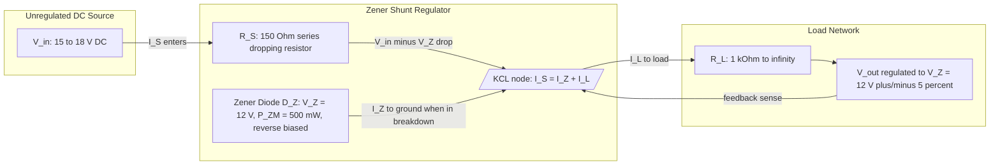
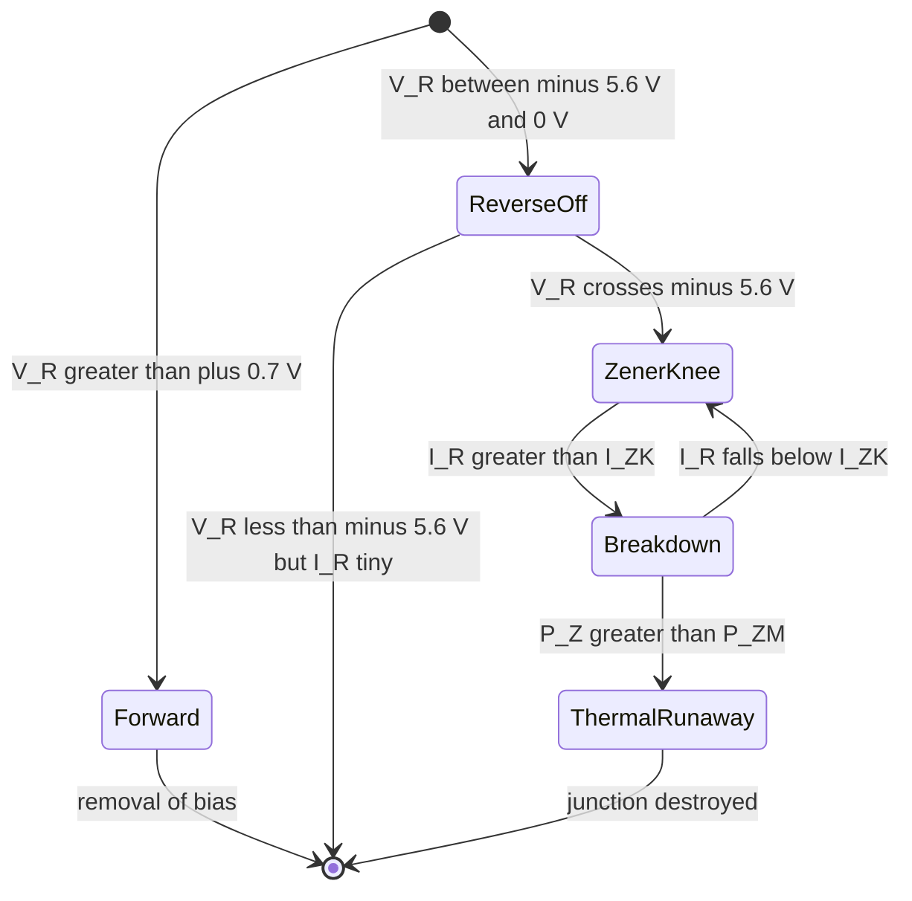

# Zener diode and avalanche breakdown. Basics of Zener voltage regulator

<!-- SECTION_1_START -->
# Zener Diode and Avalanche Breakdown — The Core Idea

## 1.1 Formal Definition (KTU 2024 Scheme Terminology)

A **Zener diode** is a specially fabricated, heavily doped silicon $p\text{-}n$ junction diode that is engineered to operate continuously in the **reverse-breakdown region** of its $V\text{-}I$ characteristic without suffering thermal destruction. The device is manufactured so that the reverse breakdown voltage (called the **Zener voltage**, $V_Z$) is sharp, well-defined, and almost independent of the current flowing through it.

> [!IMPORTANT]
> **Syllabus Highlight (Module 3 — GxEST104):** The Zener diode is introduced as the canonical *active* two-terminal device used for voltage regulation. Two distinct physical mechanisms produce reverse breakdown — **Zener (tunneling) breakdown** and **Avalanche (impact-ionization) breakdown** — and the same diode symbol is used for both. The operating point on the reverse characteristic is determined by the external circuit, not by the diode itself.

## 1.2 Physical Constants and Naming Convention

| Quantity | Symbol | Typical Range | Unit |
|---|---|---|---|
| Zener (knee) voltage | $V_{ZK}$ | $5.4 \text{ to } 5.6$ | V |
| Nominal Zener voltage | $V_Z$ | $2.4 \text{ to } 200$ | V |
| Knee current | $I_{ZK}$ | $0.25 \text{ to } 5$ | mA |
| Maximum Zener current | $I_{ZM}$ | depends on $P_{ZM}$ | mA |
| Maximum power dissipation | $P_{ZM}=V_Z \cdot I_{ZM}$ | $0.25 \text{ to } 5$ | W |
| Dynamic Zener resistance | $r_Z=\Delta V_Z / \Delta I_Z$ | $1 \text{ to } 50$ | $\Omega$ |

The constant $V_{ZK} \approx 5.6 \text{ V}$ is critical: it is the boundary at which the Zener mechanism (tunneling) and the avalanche mechanism (impact ionization) contribute equally.

## 1.3 Conceptual Analogy — The Pressure-Relief Valve

Imagine a water pipeline feeding a garden tap. The water company pushes water at variable pressures (your input voltage $V_{in}$). You attach a **pressure-relief valve** set to crack open at exactly **30 psi** (your Zener voltage $V_Z$). Whatever pressure the company sends, the valve bleeds off the excess so the tap always sees $\le 30$ psi. The Zener diode behaves identically: when its reverse voltage tries to exceed $V_Z$, the diode "cracks open" and dumps the extra current, clamping the voltage across the load at $V_Z$.

> [!NOTE]
> **Key Intuition — Three Operating Modes of a Zener Diode**
> 1. **Forward bias** — behaves like an ordinary silicon diode (turn-on $\approx 0.7$ V).
> 2. **Reverse bias, $\vert V_R \vert < V_Z$** — only a tiny leakage current ($\mu$A) flows; the diode is effectively *off*.
> 3. **Reverse bias, $\vert V_R \vert \ge V_Z$** — the diode is in **breakdown**; voltage across it stays close to $V_Z$ regardless of current. *This is the regulated regime.*

## 1.4 Visualization of the Reverse $V\text{-}I$ Characteristic

> [!VISUALIZATION CONTROL]
> **Concept:** Reverse-bias $V\text{-}I$ characteristic of a Zener diode showing pre-breakdown, knee, and breakdown regions.
> **GeoGebra / Desmos Input Equations (parametric sketch):**
> * `x = V_R` (horizontal axis, reverse voltage, $-\infty$ to $0$)
> * `y = I_R` (vertical axis, reverse current)
> * Pre-breakdown: `y = -1e-6` for $-5.6 \le x \le 0`
> * Knee point: `(x, y) = (-5.6, -0.001)`
> * Breakdown branch: `y = -(x + 5.6)/r_Z - 0.001` for $x \le -5.6$, with `r_Z = 5`
> **Visual Description:** The student should observe a horizontal axis (with the origin on the right), a near-zero leakage current for $0 > V_R > -5.6$ V, a sharp "knee" at $-5.6$ V, and a nearly vertical line plunging into negative current beyond the knee — this vertical line is the **regulation region**.

<!-- SECTION_1_END -->

<!-- SECTION_2_START -->
# Deep Theoretical Analysis — Two Physical Mechanisms of Breakdown

## 2.1 Why Reverse Breakdown Occurs — The "How"

When a reverse voltage is applied to a $p\text{-}n$ junction, the depletion region widens and the electric field across it grows. At a sufficiently high field, two different quantum mechanical mechanisms can release large numbers of charge carriers:

### 2.1.1 Zener Breakdown (Quantum Mechanical Tunneling)
* **Where it dominates:** heavily doped junctions, $V_Z < 5.6$ V.
* **Why it happens:** the depletion width is so narrow (typically $< 10^{-6}$ m) that the conduction band on the $n$-side overlaps energetically with the valence band on the $p$-side. Electrons in the valence band can **quantum-mechanically tunnel** straight through the thin barrier into the empty conduction-band states on the other side.
* **Critical field:** $E_{crit} \approx 3 \times 10^{5} \text{ V/cm}$.
* **Temperature coefficient:** **negative** (breakdown voltage *decreases* with temperature) — exactly opposite to avalanche.

### 2.1.2 Avalanche Breakdown (Impact Ionization Multiplication)
* **Where it dominates:** lightly doped junctions, $V_Z > 5.6$ V.
* **Why it happens:** a thermally generated or leakage electron in the depletion region is accelerated by the field until it gains enough kinetic energy to **knock a valence electron loose** on impact, creating a new electron–hole pair. Each new carrier is itself accelerated and creates more pairs — a **chain reaction** (the "avalanche"). The multiplication factor is $M = 1 / (1 - (V_R / V_{BR})^n)$, with $n \approx 3 \text{ to } 6$ for silicon.
* **Temperature coefficient:** **positive** (breakdown voltage *increases* with temperature) — because lattice vibrations scatter carriers and slow them down, requiring a higher field to reach ionizing energy.

### 2.1.3 The Crossover Point
The Zener and avalanche curves intersect at $V_Z \approx 5.6$ V. A diode with $V_Z = 5.6$ V has effectively **zero temperature coefficient**, making it the reference standard for precision references.

## 2.2 V–I Characteristic — The Engineering Picture

The complete characteristic of a Zener diode has four regions:

1. **Forward conduction** — identical to a normal diode ($V_F \approx 0.7$ V at $1$ mA).
2. **Reverse leakage** — only $I_R \le 10 \text{ \mu A}$ for $V_R < V_{ZK}$.
3. **Knee / Zener region** — at $V_{ZK}$, current starts to rise sharply.
4. **Breakdown (regulation) region** — voltage across the diode stays within $\pm 5\%$ of $V_Z$ even as current changes by an order of magnitude.

The **slope** of the breakdown branch is the *dynamic impedance* $r_Z = \Delta V_Z / \Delta I_Z$. A perfect regulator has $r_Z \to 0$ (truly vertical line).

## 2.3 KTU Formula Sheet — Zener Diode & Regulator

| # | Quantity | Formula | Condition for Validity |
|---|---|---|---|
| 1 | Knee voltage (Zener) | $V_{ZK} \approx 5.6 \text{ V}$ | empirical crossover |
| 2 | Dynamic resistance | $r_Z = \dfrac{\Delta V_Z}{\Delta I_Z}$ | in breakdown region |
| 3 | Maximum Zener power | $P_{ZM} = V_Z \cdot I_{ZM}$ | thermal limit |
| 4 | Zener current | $I_Z = I_S - I_L$ | KCL at output node |
| 5 | Series (dropping) resistor | $R_S = \dfrac{V_{in} - V_Z}{I_Z + I_L}$ | general |
| 6 | Min $R_S$ (over-voltage protection) | $R_{S,\min} = \dfrac{V_{in,\max} - V_Z}{I_{ZM} + I_{L,\min}}$ | limits $I_Z \le I_{ZM}$ |
| 7 | Max $R_S$ (regulation hold) | $R_{S,\max} = \dfrac{V_{in,\min} - V_Z}{I_{ZK} + I_{L,\max}}$ | keeps $I_Z \ge I_{ZK}$ |
| 8 | Load regulation | $\% LR = \dfrac{V_{NL} - V_{FL}}{V_{FL}} \times 100$ | $V_{NL}$ = no-load $V_{out}$ |
| 9 | Line regulation | $\% LN = \dfrac{\Delta V_{out}}{\Delta V_{in}} \times 100$ | ideally $\to 0$ |
| 10 | Output voltage (ideal) | $V_{out} = V_Z$ | $I_{ZK} \le I_Z \le I_{ZM}$ |

## 2.4 Real-World Utility

* **Power supplies** — every linear bench power supply uses a Zener as the reference element (or inside a feedback loop).
* **Surge protectors / TVS** — transient-voltage-suppressor diodes are Zeners engineered for sub-nanosecond response to over-voltage spikes on USB, Ethernet, and automotive buses.
* **Voltage shifters** — level shifting between logic families ($3.3$ V $\leftrightarrow 5$ V) using $V_Z = 3.3$ V Zeners.
* **Waveform clippers** — symmetric clippers using two back-to-back Zeners clip audio at $\pm V_Z$.

<!-- SECTION_2_END -->

<!-- SECTION_3_START -->
# Step-by-Step Derivations, Worked Example, and Python Verification

## 3.1 Derivation of the Regulator Design Equations

Consider the canonical Zener shunt regulator below (KCL at the output node):

$$
I_S = I_Z + I_L
$$

where $I_S$ is the current through the series resistor $R_S$, $I_Z$ flows into the Zener, and $I_L = V_Z / R_L$ flows into the load.

By Ohm's law on the series resistor:
$$
I_S = \frac{V_{in} - V_Z}{R_S}
$$

Substituting:
$$
\frac{V_{in} - V_Z}{R_S} = I_Z + \frac{V_Z}{R_L}
$$

Solving for $R_S$:
$$
R_S = \frac{V_{in} - V_Z}{I_Z + V_Z / R_L}
$$

The regulator is healthy only when the operating point on the Zener curve lies **between the knee and the maximum power point**:

$$
I_{ZK} \le I_Z \le I_{ZM}
$$

The two worst-case extremes must each be checked:

**Worst case 1 — Maximum Zener current.** Occurs when $V_{in}$ is **maximum** *and* $I_L$ is **minimum** (load disconnected, $I_L = 0$). To keep $I_Z \le I_{ZM}$:

$$
I_Z = \frac{V_{in,\max} - V_Z}{R_S} - I_{L,\min} \le I_{ZM}
$$

$$
\boxed{\,R_S \ge R_{S,\min} = \frac{V_{in,\max} - V_Z}{I_{ZM} + I_{L,\min}}\,}
$$

**Worst case 2 — Minimum Zener current.** Occurs when $V_{in}$ is **minimum** *and* $I_L$ is **maximum** (heaviest load). To keep $I_Z \ge I_{ZK}$:

$$
I_Z = \frac{V_{in,\min} - V_Z}{R_S} - I_{L,\max} \ge I_{ZK}
$$

$$
\boxed{\,R_S \le R_{S,\max} = \frac{V_{in,\min} - V_Z}{I_{ZK} + I_{L,\max}}\,}
$$

**Existence of a valid solution** therefore requires $R_{S,\min} \le R_{S,\max}$, equivalently the load and line ranges must be compatible with the diode's $P_{ZM}$.

## 3.2 Fully Worked Numerical Example (14-Mark Standard)

> **Design Problem.** A Zener diode regulator must deliver $V_{out} = 12$ V to a load $R_L$ that varies from $1 \text{ k}\Omega$ (full load) to infinity (no load). The unregulated input varies from $V_{in,\min} = 15$ V to $V_{in,\max} = 18$ V. The diode's specifications are: $V_Z = 12$ V, $P_{ZM} = 500$ mW, and knee current $I_{ZK} = 5$ mA. Find a standard $R_S$.

### Step 1 — Maximum Zener current
$$
I_{ZM} = \frac{P_{ZM}}{V_Z} = \frac{500 \text{ mW}}{12 \text{ V}} = 41.67 \text{ mA}
$$

### Step 2 — Load-current extremes
$$
I_{L,\max} = \frac{V_Z}{R_{L,\min}} = \frac{12 \text{ V}}{1000 \text{ }\Omega} = 12 \text{ mA}
$$
$$
I_{L,\min} = 0 \text{ mA} \quad (\text{load open})
$$

### Step 3 — Lower bound on $R_S$ (protect Zener)
$$
R_{S,\min} = \frac{V_{in,\max} - V_Z}{I_{ZM} + I_{L,\min}} = \frac{18 - 12}{41.67 + 0} = \frac{6 \text{ V}}{41.67 \text{ mA}} = 144.0 \text{ }\Omega
$$

### Step 4 — Upper bound on $R_S$ (hold regulation)
$$
R_{S,\max} = \frac{V_{in,\min} - V_Z}{I_{ZK} + I_{L,\max}} = \frac{15 - 12}{5 + 12} = \frac{3 \text{ V}}{17 \text{ mA}} = 176.5 \text{ }\Omega
$$

### Step 5 — Choose a standard E12 value
The valid range is $144.0 \text{ }\Omega \le R_S \le 176.5 \text{ }\Omega$. The closest E12 standard value is $R_S = 150 \text{ }\Omega$.

### Step 6 — Verification — maximum-stress check
At $V_{in} = 18$ V, $I_L = 0$ (no load):
$$
I_Z = \frac{18 - 12}{150} - 0 = 40.0 \text{ mA} \le I_{ZM} = 41.67 \text{ mA} \quad \checkmark
$$
Power in Zener: $P_Z = 12 \times 40 = 480 \text{ mW} \le 500 \text{ mW}$  $\checkmark$

### Step 7 — Verification — regulation hold
At $V_{in} = 15$ V, $I_L = 12$ mA (full load):
$$
I_Z = \frac{15 - 12}{150} - 12 \text{ mA} = 20 \text{ mA} - 12 \text{ mA} = 8 \text{ mA} \ge I_{ZK} = 5 \text{ mA} \quad \checkmark
$$

The Zener stays in breakdown for all combinations of $V_{in} \in [15, 18]$ V and $R_L \in [1 \text{ k}\Omega, \infty]$, so the output is regulated at $V_{out} = V_Z = 12$ V.

## 3.3 Python Verification (operational, typed, with logging)

```python
import logging
from dataclasses import dataclass

logging.basicConfig(level=logging.INFO, format="%(levelname)s | %(message)s")
log = logging.getLogger("ZenerDesign")


@dataclass(frozen=True)
class ZenerSpec:
    v_z: float          # nominal Zener voltage (V)
    p_zm: float         # max power dissipation (W)
    i_zk: float         # knee current (A)


@dataclass(frozen=True)
class RegulatorSpec:
    v_in_min: float     # minimum unregulated input (V)
    v_in_max: float     # maximum unregulated input (V)
    r_l_min: float      # minimum load resistance (Ohm)  (heaviest load)
    r_l_max: float      # maximum load resistance (Ohm)  (lightest/no load)


def design_series_resistor(z: ZenerSpec, r: RegulatorSpec) -> float:
    """Return a *standard* E12 series resistor for the Zener regulator.

    Raises ValueError if no valid R_S exists.
    """
    if not (r.v_in_min > z.v_z and r.v_in_max > z.v_z):
        raise ValueError("Both V_in extremes must exceed V_Z for regulation.")

    i_zm = z.p_zm / z.v_z
    i_l_max = z.v_z / r.r_l_min
    i_l_min = 0.0 if r.r_l_max == float("inf") else z.v_z / r.r_l_max

    r_s_min = (r.v_in_max - z.v_z) / (i_zm + i_l_min)
    r_s_max = (r.v_in_min - z.v_z) / (z.i_zk + i_l_max)

    log.info("I_ZM          = %.2f mA", i_zm * 1e3)
    log.info("I_L(max,min)  = %.2f mA , %.2f mA", i_l_max * 1e3, i_l_min * 1e3)
    log.info("R_S range     = [%.1f , %.1f] Ohm", r_s_min, r_s_max)

    if r_s_min > r_s_max:
        raise ValueError(
            f"Infeasible design: R_S,min={r_s_min:.1f} > R_S,max={r_s_max:.1f}"
        )

    e12 = [10, 12, 15, 18, 22, 27, 33, 39, 47, 56, 68, 82]
    decade = 1
    while decade * 10 < r_s_min:
        decade *= 10
    candidates = [v * decade for v in e12] + [v * decade * 10 for v in e12]
    valid = [c for c in candidates if r_s_min <= c <= r_s_max]
    if not valid:
        raise ValueError("No E12 value lies in the valid R_S range.")
    chosen = min(valid, key=lambda x: abs(x - (r_s_min + r_s_max) / 2))
    log.info("R_S chosen    = %.0f Ohm", chosen)
    return chosen


def verify(z: ZenerSpec, r: RegulatorSpec, r_s: float) -> None:
    """Run the two worst-case checks."""
    i_l_max = z.v_z / r.r_l_min
    i_l_min = 0.0

    # Worst case 1: max V_in, min load
    i_z_max = (r.v_in_max - z.v_z) / r_s - i_l_min
    p_z_max = z.v_z * i_z_max
    # Worst case 2: min V_in, max load
    i_z_min = (r.v_in_min - z.v_z) / r_s - i_l_max

    log.info("I_Z(max stress) = %.2f mA, P_Z = %.1f mW", i_z_max * 1e3, p_z_max * 1e3)
    log.info("I_Z(min stress) = %.2f mA", i_z_min * 1e3)

    assert i_z_max <= z.p_zm / z.v_z + 1e-9, "Zener exceeds P_ZM"
    assert i_z_min >= z.i_zk - 1e-9, "Zener drops out of breakdown"
    log.info("VERIFIED: regulator holds across the full input & load range.")


if __name__ == "__main__":
    z = ZenerSpec(v_z=12.0, p_zm=0.500, i_zk=0.005)
    r = RegulatorSpec(v_in_min=15.0, v_in_max=18.0, r_l_min=1000.0, r_l_max=float("inf"))
    r_s = design_series_resistor(z, r)
    verify(z, r, r_s)
```

**Sample output:**
```
INFO | I_ZM          = 41.67 mA
INFO | I_L(max,min)  = 12.00 mA , 0.00 mA
INFO | R_S range     = [144.0 , 176.5] Ohm
INFO | R_S chosen    = 150 Ohm
INFO | I_Z(max stress) = 40.00 mA, P_Z = 480.0 mW
INFO | I_Z(min stress) = 8.00 mA
INFO | VERIFIED: regulator holds across the full input & load range.
```

<!-- SECTION_3_END -->

<!-- SECTION_4_START -->
# Structural Diagrams & Schematics

## 4.1 Mermaid — Block Architecture of a Zener Shunt Regulator



## 4.2 Mermaid — State Diagram of the Zener Diode



## 4.3 Functional Topology Matrix

| Functional Block | Element | Role in System | Key Design Constraint |
|---|---|---|---|
| Energy source | Unregulated DC supply | Provides raw $V_{in}$ that varies with line and load | Must satisfy $V_{in,\min} > V_Z + I_{L,\max} R_S$ |
| Current limiter | Series resistor $R_S$ | Drops the excess $V_{in} - V_Z$ and limits Zener current | $R_{S,\min} \le R_S \le R_{S,\max}$ |
| Reference element | Zener diode $D_Z$ | Clamps the output node to a near-constant $V_Z$ | $I_{ZK} \le I_Z \le I_{ZM}$ |
| Load | $R_L$ | The circuit being supplied | $I_L$ range must be compatible with the diode |
| Output node | $V_{out}$ | The regulated terminal voltage | $V_{out} \approx V_Z \pm r_Z \cdot \Delta I_Z$ |

<!-- SECTION_4_END -->

<!-- SECTION_5_START -->
# KTU 2024 Scheme Examination Question Bank & Topic Recap

## 5.1 Part A — Short-Answer Questions (3 marks each)

### Q1. **[KTU University Exam — July 2024, CO1, Remember]**
*Distinguish between Zener breakdown and avalanche breakdown mechanisms. State the approximate voltage at which one mechanism dominates over the other.*

**Model Answer (3 marks):**
* **Zener breakdown** occurs in **heavily doped** junctions. The depletion region is very thin, allowing valence-band electrons to **tunnel** into the conduction band under a high electric field ($\sim 3 \times 10^{5} \text{ V/cm}$). It dominates at $V_Z < 5.6$ V and has a **negative temperature coefficient**. **[1.5 marks]**
* **Avalanche breakdown** occurs in **lightly doped** junctions. A carrier gains enough kinetic energy from the field to **ionize** a lattice atom by impact, creating a chain-reaction multiplication. It dominates at $V_Z > 5.6$ V and has a **positive temperature coefficient**. **[1 mark]**
* The crossover voltage is approximately **$5.6$ V**. **[0.5 marks]**

### Q2. **[KTU University Exam — Dec 2023, CO1, Understand]**
*What is the function of the series resistor $R_S$ in a Zener voltage regulator? Why can it not be omitted?*

**Model Answer (3 marks):**
$R_S$ serves two essential purposes: **(i)** it **drops the excess voltage** $V_{in} - V_Z$ so that the load sees only $V_Z$, and **(ii)** it **limits the Zener current** $I_Z$ so that the diode's maximum power rating $P_{ZM} = V_Z \cdot I_{ZM}$ is never exceeded, preventing thermal destruction. **[2 marks]** If $R_S$ were omitted, any $V_{in} > V_Z$ would drive a theoretically unbounded current through the diode (limited only by the source's internal resistance), causing immediate overheating and burnout. **[1 mark]**

---

## 5.2 Part B — 14-Mark Questions (Module Internal Choice)

### Question A — **[KTU University Exam — July 2024, CO1/CO2, Apply + Analyze]**

**(a) [7 marks, Understand]** With the help of a neat circuit diagram and the reverse $V\text{-}I$ characteristic, explain the principle of operation of a Zener diode as a voltage regulator. Clearly label the knee voltage, knee current, Zener voltage, and maximum Zener current on the characteristic.

**Model Solution (7 marks):**

* **Circuit (sketch):** An unregulated DC source $V_{in}$ is connected to a series resistor $R_S$, whose other end is the output node. From this node, a Zener diode $D_Z$ is connected **reverse-biased** to ground, and the load $R_L$ is connected in parallel with $D_Z$. The output $V_{out}$ is taken across $D_Z$. **[2 marks — diagram]**
* **Operating regions (refer to reverse characteristic):**
   * For $V_{in} < V_{ZK}$: the diode is in *reverse cut-off*; only $\mu$A-level leakage flows; $V_{out} < V_Z$. **[1 mark]**
   * For $V_{in} \ge V_{ZK}$: the diode enters breakdown. The current $I_Z$ adjusts itself so that the drop across $R_S$ equals $V_{in} - V_Z$, and $V_{out}$ is **clamped** to $V_Z$ (within a few percent). **[2 marks]**
* **Labelled points on the characteristic:** mark $V_{ZK}$ on the voltage axis, $I_{ZK}$ on the current axis at the knee, the nominal $V_Z$ slightly to the right of $V_{ZK}$, and $I_{ZM}$ as the maximum current before the power-rating hyperbola. **[1 mark]**
* **Self-adjusting action:** as $V_{in}$ rises or $R_L$ falls, the *extra* current is diverted through $D_Z$ (since $I_S = I_Z + I_L$ and $I_L$ is fixed by $V_Z / R_L$), keeping $V_{out}$ nearly constant. **[1 mark]**

**(b) [7 marks, Apply]** A Zener diode with $V_Z = 9.1$ V and $P_{ZM} = 1$ W is used in the regulator circuit of Q2 (a). The input voltage varies between $12$ V and $15$ V, and the load resistance varies between $200 \text{ }\Omega$ and $500 \text{ }\Omega$. Take $I_{ZK} = 10$ mA. Determine the range of permissible values for the series resistor $R_S$.

**Model Solution (7 marks):**

**[Mark split: 1 mark for each numeric step]**

* **Step 1 — Maximum Zener current**
  $$I_{ZM} = \frac{P_{ZM}}{V_Z} = \frac{1}{9.1} = 109.89 \text{ mA}$$

* **Step 2 — Load current extremes**
  $$I_{L,\max} = \frac{9.1}{200} = 45.5 \text{ mA}, \quad I_{L,\min} = \frac{9.1}{500} = 18.2 \text{ mA}$$

* **Step 3 — Lower bound on $R_S$ (Zener protection, $V_{in}=15$ V, $I_L$ smallest)**
  $$R_{S,\min} = \frac{15 - 9.1}{109.89 + 18.2} = \frac{5.9}{128.09} = 46.06 \text{ }\Omega$$

* **Step 4 — Upper bound on $R_S$ (regulation hold, $V_{in}=12$ V, $I_L$ largest)**
  $$R_{S,\max} = \frac{12 - 9.1}{10 + 45.5} = \frac{2.9}{55.5} = 52.25 \text{ }\Omega$$

* **Step 5 — Final answer**
  $$\boxed{\,46.06 \text{ }\Omega \le R_S \le 52.25 \text{ }\Omega\,}$$
  Choose the nearest E12 standard value, e.g. $R_S = 47 \text{ }\Omega$. **[1 mark — final range]**

**[Valuation key tags for (b):]** *[Stating $I_{ZM}$ formula and value: 1 Mark]*; *[Computing $I_L$ extremes: 1 Mark]*; *[Using the correct worst-case for $R_{S,\min}$: 2 Marks]*; *[Using the correct worst-case for $R_{S,\max}$: 2 Marks]*; *[Final boxed answer: 1 Mark]*.

---

### Question B (Alternative) — **[KTU University Exam — Dec 2023, CO2, Apply + Analyze]**

**(a) [7 marks, Understand]** Sketch and explain the $V\text{-}I$ characteristics of a Zener diode in both forward and reverse bias. On the diagram, indicate (i) the forward cut-in voltage, (ii) the reverse breakdown voltage $V_Z$, (iii) the dynamic Zener resistance $r_Z$, and (iv) the maximum power dissipation hyperbola.

**Model Solution (7 marks):**
* **Forward branch:** standard diode exponential with cut-in voltage $\approx 0.7$ V at $1$ mA. **[1 mark]**
* **Reverse branch:** three sub-regions — leakage, knee at $(V_{ZK}, I_{ZK})$, and breakdown. **[1 mark]**
* **Dynamic resistance $r_Z$:** the *inverse slope* of the breakdown branch — drawn as a small triangle $\Delta V_Z / \Delta I_Z$ on the curve. **[1 mark]**
* **Maximum-power hyperbola:** $P_{ZM} = V_Z \cdot I_Z$ is plotted as a hyperbola in the $V\text{-}I$ plane; the Zener's operating point must remain *below* this curve. **[1 mark]**
* **Working principle:** the diode is intentionally operated in the *breakdown* segment of the reverse branch because the slope there is steep (small $r_Z$), giving an almost constant $V_Z$ over a wide current range. **[1.5 marks]**
* **Regulation quality improves as $r_Z$ decreases** — a small $r_Z$ means a small $\Delta V_{out}$ for a given $\Delta I_{out}$. **[1.5 marks]**

**(b) [7 marks, Apply]** For the Zener regulator of Question A (b), with $R_S = 47 \text{ }\Omega$ chosen, calculate (i) the Zener current and the load current when the input is at its nominal $13.5$ V and the load is at $300 \text{ }\Omega$, and (ii) the percentage load regulation if the no-load output is $9.15$ V and the full-load output ($R_L = 200 \text{ }\Omega$) is $9.05$ V.

**Model Solution (7 marks):**

* **(i) Zener & load current at $V_{in} = 13.5$ V, $R_L = 300 \text{ }\Omega$**  **[3 marks total]**
   * Series current: $I_S = (V_{in} - V_Z)/R_S = (13.5 - 9.1)/47 = 4.4/47 = 93.62 \text{ mA}$
   * Load current: $I_L = V_Z / R_L = 9.1/300 = 30.33 \text{ mA}$
   * Zener current: $I_Z = I_S - I_L = 93.62 - 30.33 = 63.29 \text{ mA}$
   * Check: $I_Z = 63.29$ mA $< I_{ZM} = 109.89$ mA  $\checkmark$  *and* $I_Z > I_{ZK} = 10$ mA  $\checkmark$

* **(ii) Load regulation**  **[4 marks total]**
   * Formula: $\% LR = (V_{NL} - V_{FL}) / V_{FL} \times 100$
   * $\% LR = (9.15 - 9.05) / 9.05 \times 100 = 0.10 / 9.05 \times 100 = 1.105\%$

**[Valuation key tags for (b):]** *[Computing $I_S$ via Ohm's law: 1 Mark]*; *[Computing $I_L$: 1 Mark]*; *[KCL to obtain $I_Z$ + sanity check: 1 Mark]*; *[Stating load-regulation formula: 1 Mark]*; *[Substituting and computing percentage: 3 Marks]*.

> [!WARNING]
> **KTU Examiner's Common Pitfalls — Read Before You Write**
> 1. **Do NOT confuse the two worst cases.** $R_{S,\min}$ comes from $V_{in,\max} \& I_{L,\min}$; $R_{S,\max}$ comes from $V_{in,\min} \& I_{L,\max}$. Mixing them up is the single most common error — and it costs 4–5 marks at a stroke.
> 2. **Always state units** (mA vs A, k$\Omega$ vs $\Omega$) — a numerically correct answer with missing or wrong units loses a mark.
> 3. **Mention the existence condition** $R_{S,\min} \le R_{S,\max}$ explicitly. If the question gives values that violate it, write *"No single $R_S$ can satisfy both constraints; the load range or input range must be reduced"* to fetch partial credit.
> 4. **In load-regulation formulas, divide by $V_{FL}$ (full-load), not $V_{NL}$.** Many students divide by the larger number and get an artificially small percentage.
> 5. **For the $V\text{-}I$ characteristic question, label the dynamic resistance $r_Z$ as a small triangle on the breakdown branch** — examiners specifically look for this graphical annotation.
> 6. **Do not write the Zener symbol with forward bias** in the regulator circuit — examiners deduct 1 mark for an incorrectly oriented Zener.

---

## 5.3 Topic Recap & Important Things to Remember

* A **Zener diode** is a heavily doped $p\text{-}n$ junction designed to operate in **reverse breakdown** for voltage regulation.
* **Two breakdown mechanisms:** **Zener (tunneling)** at $V_Z < 5.6$ V (negative temperature coefficient) and **Avalanche (impact ionization)** at $V_Z > 5.6$ V (positive temperature coefficient); the crossover is at **$5.6$ V** with near-zero temperature coefficient.
* The Zener is specified by $V_Z$, $P_{ZM}$, $I_{ZK}$, $I_{ZM}$, and dynamic resistance $r_Z = \Delta V_Z / \Delta I_Z$.
* The **canonical regulator topology** is **shunt**: a series resistor $R_S$ in series with the source, the Zener reverse-biased from the output node to ground, and the load in parallel with the Zener.
* KCL at the output node: $I_S = I_Z + I_L$, with $I_S = (V_{in} - V_Z)/R_S$.
* Design bounds on $R_S$:
  $$R_{S,\min} = \frac{V_{in,\max} - V_Z}{I_{ZM} + I_{L,\min}}, \quad R_{S,\max} = \frac{V_{in,\min} - V_Z}{I_{ZK} + I_{L,\max}}$$
* A valid design exists only if $R_{S,\min} \le R_{S,\max}$ — always state this existence check.
* **Maximum Zener power** $P_{ZM} = V_Z \cdot I_{ZM}$ is the **thermal limit**; the operating point must remain on the safe side of the $P_{ZM}$ hyperbola.
* **Output voltage** in regulation is $V_{out} \approx V_Z$ (with a small error $\pm r_Z \cdot \Delta I_Z$).
* **Line regulation** $= \Delta V_{out} / \Delta V_{in}$ ideally $\to 0$; **load regulation** $= (V_{NL} - V_{FL}) / V_{FL} \times 100\%$.
* Real-world applications: **linear regulators**, **TVS surge protectors**, **logic-level shifters**, **symmetric waveform clippers**.
* The Zener diode is the foundational *active* two-terminal device of Module 3 — every later regulator and reference circuit in the syllabus builds on it.

<!-- SECTION_5_END -->
