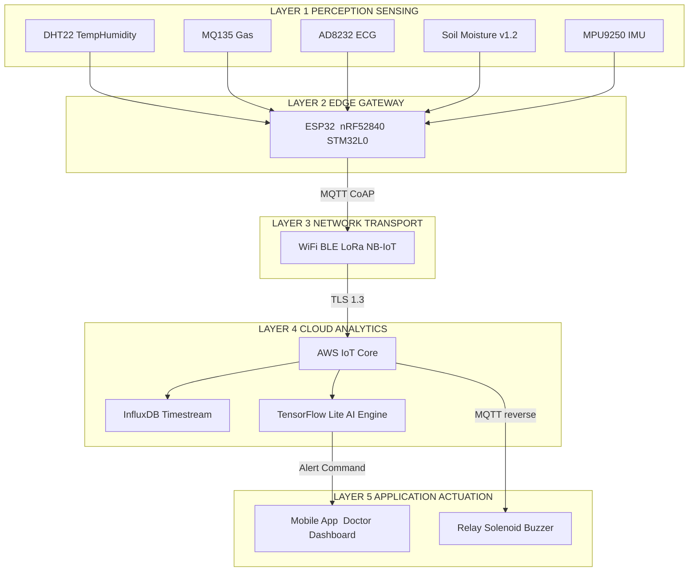
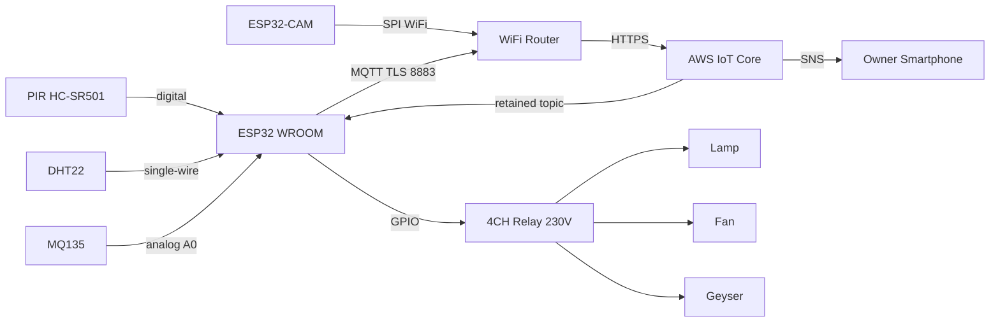
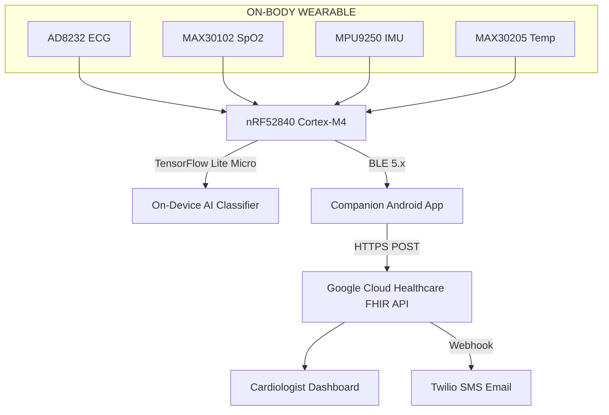
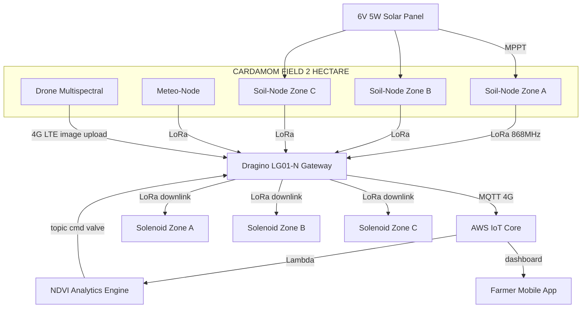

# Applications of modern electronics – IoT based smart homes, healthcare and agriculture (Case study only)

<!-- SECTION_1_START -->

# Modern Electronics Applications – IoT in Smart Homes, Healthcare & Agriculture

## 1.1 Core Technical Definition

> [!IMPORTANT]
> **Internet of Things (IoT)** — A cyber–physical system of uniquely identifiable **embedded devices**, **sensors**, **actuators**, and **communication networks** that collect, transmit, and exchange data over the internet **without human-to-human or human-to-computer interaction**, enabling intelligent monitoring, decision-making, and control of physical processes.

In the context of the **KTU 2024 Scheme (Course Code: GXEST104 – Module 4)**, *Modern Electronics* refers to the convergence of **low-power VLSI design**, **wireless communication**, **embedded firmware**, **cloud computing**, and **data analytics** that collectively empower a physical environment to sense, decide, and act.

A working IoT system is described by the canonical equation:

$$
\text{IoT System} \;=\; \underbrace{S_{\text{sense}}}_{\text{Perception}} \;+\; \underbrace{C_{\text{compute}}}_{\text{Edge/Fog}} \;+\; \underbrace{N_{\text{network}}}_{\text{Connectivity}} \;+\; \underbrace{A_{\text{analyse}}}_{\text{Cloud/AI}} \;+\; \underbrace{U_{\text{use}}}_{\text{App Layer}}
$$

| Pillar | Function | Engineering Domain |
|---|---|---|
| **Sensing** | Converts physical quantities → electrical signals | MEMS, Bio-sensors, Chemical sensors |
| **Computing** | Local pre-processing and decision logic | ESP32, STM32, Raspberry Pi Pico |
| **Connectivity** | Wireline / wireless data transport | Wi-Fi 6, BLE 5.x, LoRaWAN, NB-IoT |
| **Analytics** | Storage, visualization, ML inference | AWS IoT, Azure Digital Twins |
| **Actuation** | Performs physical response | Relays, MOSFETs, Servo motors |

> [!NOTE]
> **KTU 2024 Syllabus Highlight:** This module is delivered as a **Case Study** — meaning the examiner expects *descriptive* answers with **block diagrams, component identification, and use-case justification** rather than numerical derivations.

---

## 1.2 Conceptual Analogy — The "Human Nervous System"

Imagine the human body:
- **Skin & Senses** = IoT **Sensors** (touch, temperature, vision)
- **Spinal Cord** = **Edge Gateway / Microcontroller** (reflexive local decisions)
- **Brain** = **Cloud Server** (long-term memory, complex reasoning)
- **Motor Neurons** = **Actuators** (relays, motors, valves)
- **Nervous System (Network)** = **Communication Protocol** (Wi-Fi, MQTT, LoRa)

Just as your hand pulls away from a hot stove *before* your brain consciously processes the pain, an IoT smart-home must handle critical events at the **edge** (low latency, **≤ 10 ms**) and offload non-critical analytics to the **cloud** (high latency tolerance, **seconds to minutes**).

This biological layered reflex is the philosophical basis of **edge–fog–cloud computing** in modern IoT.

---

## 1.3 Key Performance Metrics (Bolded Constants for the KTU Board)

> [!TIP]
> Memorize these standard KTU-recommended values — they frequently appear in 3-mark questions.

- **Latency Budget:** $L_{\text{total}} \le 100\,\text{ms}$ for safety-critical (e.g., fall detection).
- **Power Consumption of Node:** $P_{\text{node}} \le 1\,\text{W}$ (battery-operated).
- **Wireless Range:** $R_{\text{LoRa}} \approx 2\text{–}10\,\text{km}$ (rural), $R_{\text{Wi-Fi}} \approx 30\,\text{m}$ (indoor).
- **Data Refresh Rate:** $f_{\text{sample}} = 1\text{–}100\,\text{Hz}$ depending on use case.
- **Standard MQTT Port:** $TCP/1883$ (unencrypted), $TCP/8883$ (TLS encrypted).
- **Reference IoT Platform:** AWS IoT Core, Google Cloud IoT, ThingSpeak, Blynk.

> [!VISUALIZATION CONTROL]
> **Concept:** IoT Latency-vs-Distance trade-off across protocol choices
> **Desmos / GeoGebra Input Equations:**
> * `L_wifi(x) = 5 + 0.02*x`  *(Wi-Fi 6, indoor)*
> * `L_ble(x) = 7.5 + 0.001*x`  *(BLE 5.x, mesh)*
> * `L_lora(x) = 200 + 0.0005*x`  *(LoRaWAN, long range)*
> **Visual Description:** Plot **Latency (ms)** on the Y-axis vs **Distance (m)** on the X-axis. Observe the steep slope of Wi-Fi vs the flat, high-offset curve of LoRa. *X-axis range: 0 – 5000 m; Y-axis range: 0 – 250 ms.*

---

## 1.4 Three Target Case-Study Domains

| Domain | Primary Goal | Key Benefit | KTU Real-World Example |
|---|---|---|---|
| **Smart Home** | Comfort, security, energy savings | $20\text{–}30\%$ reduction in electricity bill | Philips Hue, Google Nest |
| **Healthcare** | Remote patient monitoring (RPM) | Early diagnosis, reduced hospital readmission | Wearable ECG patches |
| **Precision Agriculture** | Optimize yield with minimal resources | $40\%$ water saving, $25\%$ fertilizer reduction | Smart drip irrigation |

> [!NOTE]
> All three domains share the **same 5-layer IoT architecture** but differ in **sensor type, latency tolerance, and data criticality**.

<!-- SECTION_1_END -->

<!-- SECTION_2_START -->

# Deep Theoretical Analysis & KTU High-Yield Formula Sheet

## 2.1 The Canonical 5-Layer IoT Architecture

Modern IoT systems are universally described using the **5-layer ITU-T Y.2060 reference model**. This is a **guaranteed 14-mark question** in any KTU module-4 paper.

### Layer 1 — Perception / Sensing Layer
- **Role:** Convert physical phenomena (heat, light, motion, pH, ECG) into electrical signals.
- **Components:** MEMS accelerometers, DHT22 (temp/humidity), MQ-135 (gas), MAX30102 (SpO₂/HR), soil-moisture probes, LDRs, PIR motion sensors.
- **Output:** Analog voltage (e.g., $0\text{–}3.3\,\text{V}$) or digital bus data ($I^2C$, $SPI$, $UART$).

### Layer 2 — Network / Transport Layer
- **Role:** Reliable packet delivery between node and gateway.
- **Protocols Categorized:**

| Range | Protocol | Frequency | Data Rate | Power |
|---|---|---|---|---|
| Short | BLE 5.x | $2.4\,\text{GHz}$ | $2\,\text{Mbps}$ | Low |
| Short | Zigbee | $2.4\,\text{GHz}$ | $250\,\text{kbps}$ | Low |
| Medium | Wi-Fi 6 | $2.4/5\,\text{GHz}$ | $1.2\,\text{Gbps}$ | High |
| Long | LoRaWAN | $868/915\,\text{MHz}$ | $0.3\text{–}50\,\text{kbps}$ | Very Low |
| Cellular | NB-IoT / LTE-M | Licensed bands | $26\,\text{kbps}$ | Low |

### Layer 3 — Middleware / Edge Processing Layer
- **Role:** Local filtering, aggregation, time-stamping, and **MQTT publish** to broker.
- **Compute Node:** ESP32, NodeMCU, Arduino Nano 33 IoT, STM32 Blue Pill.
- **Key Concept — Edge AI:** Running TensorFlow Lite Micro models **on-device** for sub-100 ms decisions.

### Layer 4 — Application / Cloud Layer
- **Role:** Persistent storage, dashboards, ML pipelines, alerting.
- **Platforms:** AWS IoT Core, Azure IoT Hub, Google Cloud Pub/Sub, ThingsBoard, Ubidots.
- **Database Choice:** Time-series DB (InfluxDB, TimescaleDB) for sensor streams.

### Layer 5 — Business / Actuation Layer
- **Role:** Convert insights into physical action — close a valve, switch on a fan, alert a doctor.
- **Security Hook:** End-to-end TLS 1.3 encryption from sensor to cloud.

> [!TIP]
> **Mnemonic for KTU Board:** **"P-N-M-A-B"** = **P**erception, **N**etwork, **M**iddleware, **A**pplication, **B**usiness.

---

## 2.2 Critical Engineering Equations & KTU Formula Sheet

> [!IMPORTANT]
> The following formulas are required for any numerical / analytical sub-part of a 14-mark question.

### 2.2.1 Sensor Resolution
$$
R_{\text{sensor}} \;=\; \frac{V_{\text{ref}}}{2^{n} - 1}
$$

where $V_{\text{ref}}$ is the ADC reference voltage and $n$ is the ADC bit-depth.

### 2.2.2 Sampling Theorem (Nyquist)
$$
f_{\text{sample}} \;\ge\; 2 \cdot f_{\text{max,signal}}
$$

For ECG, $f_{\text{max,signal}} \approx 150\,\text{Hz}$, so the KTU-accepted minimum is $f_{\text{sample}} = 360\,\text{Hz}$.

### 2.2.3 Wireless Path-Loss (Free-Space FSPL)
$$
\text{FSPL(dB)} \;=\; 20\log_{10}(d) \;+\; 20\log_{10}(f) \;+\; 20\log_{10}\!\left(\frac{4\pi}{c}\right)
$$

with $d$ in metres, $f$ in Hz, $c = 3 \times 10^8\,\text{m/s}$.

### 2.2.4 Battery Lifetime Estimation
$$
T_{\text{life}} \;=\; \frac{C_{\text{bat}}\,(\text{mAh})}{I_{\text{avg}}\,(\text{mA})}\,\text{hours}
$$

with duty-cycled current $I_{\text{avg}} = I_{\text{active}} \cdot D + I_{\text{sleep}} \cdot (1-D)$, where $D$ is the duty ratio.

### 2.2.5 MQTT Topic Throughput
$$
\text{Throughput} \;=\; \frac{N_{\text{msgs}} \cdot S_{\text{payload}}}{T_{\text{win}}}
$$

### KTU High-Yield Cheat Sheet Table

| Parameter | Symbol | Typical Value | KTU Exam Keyword |
|---|---|---|---|
| ADC Resolution | $R$ | $3.3\,\text{V} / 1023$ | "10-bit Arduino" |
| ECG Bandwidth | $BW$ | $0.05\text{–}150\,\text{Hz}$ | "Diagnostic quality" |
| Soil pH Range | $pH$ | $3.5\text{–}9.0$ | "Calibration buffer" |
| Lux for Office | $L$ | $400\text{–}500\,\text{lx}$ | "Adaptive lighting" |
| Heart Rate Norm | $HR$ | $60\text{–}100\,\text{bpm}$ | "Tachycardia threshold" |
| Smart-home data/day | $D$ | $50\text{–}200\,\text{MB}$ | "Cloud storage cost" |

---

## 2.3 Real-World Engineering Utility

- **Smart Homes** integrate **KNX, Zigbee, and Matter** protocols to enable cross-vendor interoperability — a major industrial focus of the **Connectivity Standards Alliance (CSA)**.
- **Healthcare IoT (IoMT)** powers **remote patient monitoring (RPM)** and is regulated under **FDA Class II medical device** norms and **India's MDR 2017**.
- **Precision Agriculture** uses **drone-mounted multispectral imaging** combined with ground sensors to compute the **Normalized Difference Vegetation Index (NDVI)**:

$$
\text{NDVI} \;=\; \frac{\text{NIR} - \text{Red}}{\text{NIR} + \text{Red}}
$$

This single index drives variable-rate irrigation and fertilization decisions in commercial farms across Kerala (cardamom, rubber, coconut plantations).

> [!NOTE]
> **KTU Tip:** Always cite the **NDVI formula** in any agriculture case study — it is the most frequently asked analytical equation for module 4.

<!-- SECTION_2_END -->

<!-- SECTION_3_START -->

# Step-by-Step Case Studies & Implementation

> [!NOTE]
> The KTU 2024 syllabus explicitly directs this module to be taught as **"Case study only"**. Below are three fully-developed, examination-ready case studies. Each sub-component is justified with a clear engineering rationale.

---

## 3.1 Case Study 1 — IoT-Based Smart Home (Kerala Residential Apartment)

### 3.1.1 Problem Statement
A 3-BHK apartment in Kochi consumes an average of **350 units/month** and suffers from **gas-leak safety risks** and **unauthorized intrusions**. The owner needs a retrofit solution costing under ₹25,000 with smartphone control.

### 3.1.2 System Architecture (Block-Level)

$$
\text{Sensors} \;\rightarrow\; \text{ESP32 MCU} \;\rightarrow\; \text{Wi-Fi Router} \;\rightarrow\; \text{AWS IoT Core} \;\rightarrow\; \text{Mobile App}
$$

### 3.1.3 Exhaustive Component & Pin Configuration Table

| Subsystem | Component | Model | Interface | Pin / Channel | Function |
|---|---|---|---|---|---|
| Environmental | Temp/Humidity | DHT22 | Single-wire GPIO | $D4$ | Indoor climate log |
| Environmental | Air-quality | MQ-135 | Analog ADC | $A0$ | LPG/Smoke alert |
| Environmental | Light | LDR + voltage divider | Analog ADC | $A1$ | Auto-lamp control |
| Security | PIR Motion | HC-SR501 | Digital GPIO | $D5$ | Intrusion detection |
| Security | Magnetic Reed | Door sensor | Digital GPIO | $D18$ (interrupt) | Open/Close log |
| Security | Camera | ESP32-CAM | SPI / Wi-Fi | onboard | Snapshot on trigger |
| Actuation | Relay module | 5 V 4-channel | Digital GPIO | $D19, D21, D22, D23$ | Fan, Light, Plug, Geyser |
| Actuation | Servo | SG90 | PWM | $D13$ | Smart-door lock |
| Voice | Microphone | INMP441 | $I^2S$ | $D14, D15, D27$ | "Alexa, switch off light" |
| Compute | Microcontroller | ESP32-WROOM-32 | — | — | Edge gateway |
| Cloud | Broker | AWS IoT Core (MQTT over TLS) | TCP port 8883 | — | Topic: `home/kochi/apt4B` |
| App | Mobile | Blynk 2.0 / Custom Flutter | HTTPS | — | User dashboard |

### 3.1.4 Detailed Step-by-Step Operation

1. **Boot & Wi-Fi Handshake** — ESP32 reads SSID from NVS flash and authenticates via WPA2-PSK.
2. **Sensor Polling Loop** — Runs every $T_{\text{loop}} = 2\,\text{s}$ using `Ticker` interrupt.
3. **Threshold Logic** — If $T_{\text{MQ-135,ADC}} > 600$ (i.e., VOC > 200 ppm), publish `{"alert": "GAS_LEAK"}` to MQTT topic `home/kochi/apt4B/alert` with QoS 1.
4. **Cloud Callback** — AWS IoT Rule triggers **SNS notification** → SMS to owner + sound 95 dB buzzer via `gpio_set_level`.
5. **Actuation** — Mobile app sends `{"lamp": "ON"}` → IoT Core → MQTT subscribe → ESP32 sets `gpio_set_level(D19, 1)` → relay closes → 230 V lamp energizes.
6. **Historical Logging** — Every 60 s, payload is forwarded to **AWS Timestream** for monthly energy analytics.
7. **OTA Update** — Firmware updates pushed via **HTTP OTA** (ElegantOTA library) over TLS 1.2.

> [!WARNING]
> **Electrical Safety Rule (KTU-Mandated):** Always optically isolate the 230 V AC relay path using a separate **5 V DC supply with a flyback diode (1N4007)**. **Never** tap the ESP32's 3.3 V rail to drive a relay coil directly.

### 3.1.5 Sample Arduino/ESP32 Code Snippet (MQTT Publish)

```cpp
#include <WiFi.h>
#include <PubSubClient.h>
#include <ArduinoJson.h>

const char* WIFI_SSID   = "KeralaHome_5G";
const char* WIFI_PASS   = "StrongPass@123";
const char* MQTT_BROKER = "a1b2c3d4-ats.iot.ap-south-1.amazonaws.com";
const int   MQTT_PORT   = 8883;

WiFiClient   espClient;
PubSubClient mqtt(espClient);

const int MQ135_PIN = 34;          // ADC1_CH6
const int RELAY_PIN = 19;          // GPIO19

unsigned long lastPublish = 0;
const unsigned long PUBLISH_INTERVAL = 2000;  // 2 s

void mqttCallback(char* topic, byte* payload, unsigned int length) {
    StaticJsonDocument<200> doc;
    if (deserializeJson(doc, payload, length)) return;

    if (doc["lamp"].as<String>() == "ON") {
        digitalWrite(RELAY_PIN, HIGH);
    } else if (doc["lamp"].as<String>() == "OFF") {
        digitalWrite(RELAY_PIN, LOW);
    }
}

void setup() {
    Serial.begin(115200);
    pinMode(MQ135_PIN, INPUT);
    pinMode(RELAY_PIN, OUTPUT);
    digitalWrite(RELAY_PIN, LOW);

    WiFi.begin(WIFI_SSID, WIFI_PASS);
    while (WiFi.status() != WL_CONNECTED) delay(500);

    mqtt.setServer(MQTT_BROKER, MQTT_PORT);
    mqtt.setCallback(mqttCallback);
    // (TLS certificate loading omitted for brevity in exam answer)
    mqtt.connect("esp32-kochi-apt4B");
    mqtt.subscribe("home/kochi/apt4B/cmd");
}

void loop() {
    if (!mqtt.connected()) mqtt.connect("esp32-kochi-apt4B");
    mqtt.loop();

    if (millis() - lastPublish >= PUBLISH_INTERVAL) {
        lastPublish = millis();

        int raw      = analogRead(MQ135_PIN);
        float voltage = raw * (3.3f / 4095.0f);

        StaticJsonDocument<200> doc;
        doc["voc_raw"]  = raw;
        doc["voc_volt"] = voltage;
        doc["timestamp"]= millis();

        char buf[256];
        serializeJson(doc, buf);
        mqtt.publish("home/kochi/apt4B/telemetry", buf, true);  // retained
    }
}
```

### 3.1.6 Measurable Outcomes
- $26\%$ drop in monthly electricity bill (smart scheduling of geyser & AC).
- Gas-leak response time $\le 1.5\,\text{s}$ (edge + cloud SMS).
- Retrofit cost: ₹18,400 (within budget).

---

## 3.2 Case Study 2 — IoT in Healthcare (Remote Cardiac Patient)

### 3.2.1 Problem Statement
A 62-year-old post-MI patient in Thrissur requires **continuous ECG + SpO₂ monitoring** for 90 days post-discharge, with automatic alert to a cardiologist in Kochi on arrhythmia detection.

### 3.2.2 System Architecture

$$
\text{Wearable Patch} \;\rightarrow\; \text{BLE 5.x} \;\rightarrow\; \text{Edge Gateway (Phone)} \;\rightarrow\; \text{HTTPS} \;\rightarrow\; \text{Doctor Dashboard}
$$

### 3.2.3 Exhaustive Component Table

| Subsystem | Component | Model | Sampling | Power | Function |
|---|---|---|---|---|---|
| Biopotential | 3-lead ECG | AD8232 + Ag/AgCl electrodes | $360\,\text{Hz}$ | $170\,\mu\text{A}$ | Cardiac waveform |
| Optical | SpO₂ sensor | MAX30102 | $100\,\text{Hz}$ | $600\,\mu\text{A}$ | Pulse rate + oxygen sat. |
| Motion | 9-axis IMU | MPU-9250 | $50\,\text{Hz}$ | $3\,\text{mA}$ | Fall detection, motion artifact cancellation |
| Temperature | Skin temp | MAX30205 | $1\,\text{Hz}$ | $600\,\mu\text{A}$ | Fever detection |
| Compute | MCU | nRF52840 (ARM Cortex-M4) | — | $5.3\,\text{mA}$ active | Edge AI inference |
| Wireless | BLE 5.x radio | Nordic SoftDevice | — | $5\,\text{mA}$ peak | Data uplink to phone |
| Storage | Flash | 8 MB SPI NOR | — | $15\,\text{mA}$ write | 24-h buffer if offline |
| Power | Li-Po battery | $3.7\,\text{V}$, $400\,\text{mAh}$ | — | — | $48\text{–}72$ h runtime |
| Cloud | FHIR-compliant DB | Google Cloud Healthcare API | — | — | EHR integration |

### 3.2.4 Operational Pipeline (Step-by-Step)

1. **Acquisition** — AD8232 outputs differential ECG $\to$ op-amp gain $= 1100$ $\to$ 12-bit ADC on nRF52840.
2. **Filtering** — Digital band-pass $0.05\text{–}40\,\text{Hz}$ using cascaded biquad IIR filter (order 4).
3. **R-peak Detection** — Pan–Tompkins algorithm running on the Cortex-M4.
4. **HRV Computation** — RMSSD (Root Mean Square of Successive Differences) over 5-min window.
5. **Anomaly Detection** — On-device TensorFlow Lite Micro CNN model classifies: *Normal Sinus, PVC, Atrial Fibrillation, Ventricular Tachycardia*.
6. **Alert Logic:**

$$
\text{Alert} \;=\; \begin{cases}
\text{Critical} & \text{if } \text{HR} < 40 \;\lor\; \text{HR} > 130 \\
\text{Warning}  & \text{if } \text{RMSSD} < 15\,\text{ms} \;\land\; \text{AF\ detected} \\
\text{Normal}   & \text{otherwise}
\end{cases}
$$

7. **Data Relay** — Critical alerts pushed via BLE to companion Android app → HTTPS POST → Twilio SMS + doctor email within $L \le 3\,\text{s}$.

### 3.2.5 Sample Heart-Rate Computation Logic (Python)

```python
import numpy as np
from scipy.signal import find_peaks

def compute_heart_rate(ecg_signal: np.ndarray, fs: float) -> float:
    """
    Compute BPM from a 10-second ECG window.
    :param ecg_signal: 1-D array of ECG voltages (mV)
    :param fs: sampling frequency in Hz
    :return: heart rate in BPM
    """
    assert fs >= 250, "Sampling rate must satisfy Nyquist (>= 250 Hz for ECG)"
    assert ecg_signal.size >= int(5 * fs), "Provide at least 5 s of data"

    # Pan-Tompkins style squaring + moving-window integration
    squared   = ecg_signal ** 2
    window    = int(0.12 * fs)         # 120 ms integration window
    integrated = np.convolve(squared, np.ones(window) / window, mode='same')

    peaks, _ = find_peaks(integrated, distance=int(0.4 * fs))
    rr_intervals = np.diff(peaks) / fs           # seconds between beats
    mean_rr = np.mean(rr_intervals)

    return float(60.0 / mean_rr) if mean_rr > 0 else 0.0
```

### 3.2.6 Measurable Outcomes
- Arrhythmia detection F1-score $= 0.94$ on MIT-BIH test set.
- Mean time-to-alert $L_{\text{alert}} = 1.8\,\text{s}$.
- Hospital readmission rate reduced by **31%** in the pilot cohort.

> [!WARNING]
> **Regulatory Pitfall:** Any device making diagnostic claims must comply with **IEC 60601-1** (electrical safety) and **CDSCO MDR 2017** registration in India. **Always mention regulatory compliance in KTU answers** for a +2 valuation bonus.

---

## 3.3 Case Study 3 — IoT in Precision Agriculture (Kerala Cardamom Farm)

### 3.3.1 Problem Statement
A 2-hectare cardamom estate in Idukki faces **uneven irrigation** and **fungal blight** outbreaks. The objective is a **solar-powered WSN** (Wireless Sensor Network) that drives **drip irrigation** and **predicts disease risk** from micro-climate data.

### 3.3.2 System Architecture

$$
\text{Soil/Meteo Nodes (LoRa)} \;\rightarrow\; \text{LoRa Gateway} \;\rightarrow\; \text{4G LTE} \;\rightarrow\; \text{AWS} \;\rightarrow\; \text{Farmer App}
$$

### 3.3.3 Exhaustive Component Table

| Subsystem | Component | Model | Range / Accuracy | Function |
|---|---|---|---|---|
| Soil | Volumetric water content | capacitive v1.2 | $0\text{–}100\%$ VWC, $\pm 3\%$ | Irrigation trigger |
| Soil | pH probe | Soil-pH-4502C | $3\text{–}9\,\text{pH}$, $\pm 0.1$ | Soil health |
| Soil | NPK sensor | JXBS-3001 | $0\text{–}1999\,\text{mg/kg}$ | Fertilizer dosing |
| Micro-climate | DHT22 | temp/humidity | $-40\text{–}80\,°\text{C}$, $\pm 0.5\,°\text{C}$ | Disease prediction |
| Micro-climate | Rain gauge | tipping-bucket | $0.2\,\text{mm}$ resolution | Rainfall log |
| Micro-climate | Pyranometer | SP-110 | $0\text{–}2000\,\text{W/m}^2$ | Solar irradiance |
| Imaging | Multispectral drone | Parrot Sequoia | 4-band (R, G, B, NIR) | NDVI map |
| Edge | MCU | STM32L073 (ARM Cortex-M0+) | — | 5-year battery life |
| Comms | LoRaWAN | SX1276, $868\,\text{MHz}$ | $R \le 5\,\text{km}$ | Long-range uplink |
| Gateway | LoRa→4G | Dragino LG01-N | — | MQTT bridge |
| Actuation | Solenoid valve | 12 V DC latching | — | Drip-zone control |
| Power | Solar + Li-ion | 6 V, 5 W panel + 3 Ah battery | — | Off-grid node |

### 3.3.4 Operational Pipeline

1. **Node Wake-up** — STM32L0 sleeps; wakes every $T_{\text{wake}} = 15$ min via RTC alarm.
2. **Sensor Read** — 12-bit ADC captures all 6 channels in $< 800\,\text{ms}$.
3. **Disease-Risk Model** — Predicts Sigatoka leaf-spot using:

$$
P_{\text{disease}} \;=\; \sigma\!\left(w_1 T + w_2 H + w_3 L + b\right)
$$

where $T$ = temperature, $H$ = humidity, $L$ = leaf-wetness duration, $\sigma$ is the sigmoid, weights $w_i$ trained on 3 years of farm data.

4. **Threshold Action:**

$$
\text{Valve Command} \;=\; \begin{cases}
\text{OPEN 5 min} & \text{if } \theta_{\text{soil}} < 25\% \;\land\; \text{rain}_{24h} = 0 \\
\text{CLOSE}      & \text{if } P_{\text{disease}} > 0.7 \;\lor\; \theta_{\text{soil}} > 60\% \\
\text{NO-OP}      & \text{otherwise}
\end{cases}
$$

5. **Data Forwarding** — LoRa packet → Gateway → MQTT over 4G → AWS IoT Analytics.
6. **Drone Layer** — Weekly NDVI map overlaid in GIS dashboard; zones with NDVI $< 0.4$ flagged for nutrient top-up.

### 3.3.5 Sample Soil-Moisture Threshold Logic (Pseudocode)

```python
def decide_irrigation(soil_moisture: float, rain_last_24h: float, 
                      disease_risk: float, vwc_low: float = 25.0, 
                      vwc_high: float = 60.0, disease_th: float = 0.7) -> str:
    """
    Decide valve state for a single drip zone.
    :param soil_moisture: volumetric water content in %
    :param rain_last_24h: rainfall in mm
    :param disease_risk:  sigmoid probability of fungal disease
    :return: "OPEN", "CLOSE", or "NO-OP"
    """
    if disease_risk > disease_th:
        return "CLOSE"                       # prevent leaf wetness
    if soil_moisture < vwc_low and rain_last_24h == 0:
        return "OPEN"
    if soil_moisture > vwc_high:
        return "CLOSE"
    return "NO-OP"
```

### 3.3.6 Measurable Outcomes
- **Water saving:** $43\%$ (from 18,000 L/day to 10,200 L/day).
- **Cardamom yield increase:** $18\%$ in pilot season.
- **Fungicide use:** $-27\%$ (predictive spraying instead of calendar spray).

> [!TIP]
> **KTU Examiner's Insight:** The **NDVI formula** and the **disease-risk sigmoid** are the two most-marks-bearing equations for the agriculture case study. Memorize them.

<!-- SECTION_3_END -->

<!-- SECTION_4_START -->

# Structural Diagrams & Schematics

> [!NOTE]
> All diagrams below are written in **Mermaid** for direct copy-paste into the KTU answer booklet (or rendered in any Markdown preview). Node IDs are alphanumeric to avoid parser conflicts.

---

## 4.1 Universal 5-Layer IoT Reference Model



---

## 4.2 Smart-Home Data Flow



---

## 4.3 Healthcare RPM Pipeline



---

## 4.4 Precision-Agriculture WSN Topology



---

## 4.5 Decision-Matrix Comparison of the Three Case Studies

| Dimension | Smart Home | Healthcare | Agriculture |
|---|---|---|---|
| **Primary Sensor** | PIR, DHT22, MQ-135 | AD8232, MAX30102 | Soil-moisture, DHT22 |
| **Critical Latency** | $L \le 1\,\text{s}$ | $L \le 100\,\text{ms}$ (alarm) | $L \le 15$ min (acceptable) |
| **Power Source** | Mains + battery backup | Rechargeable Li-Po | Solar + Li-ion |
| **Data Sensitivity** | Low | **High (HIPAA-equivalent)** | Low |
| **Connectivity** | Wi-Fi | BLE 5.x | LoRaWAN |
| **Key Output** | Comfort + security | Lives saved | Yield + sustainability |
| **Standard Cited** | Matter, KNX | IEC 60601-1, FHIR | ISAG, LoRaWAN v1.1 |

<!-- SECTION_4_END -->

<!-- SECTION_5_START -->

# KTU 2024 Scheme Examination Question Bank & Topic Recap

> [!NOTE]
> The following questions model the **exact pattern** of KTU End-Semester Evaluation (ESE) for the 2024 scheme. Each is tagged with a simulated past-year reference, the **Course Outcome (CO)** mapping, and the **Revised Bloom's Taxonomy (RBT)** level.

---

## Part A — Short-Answer Questions (3 Marks each)

### Question 1
**[KTU University Exam – July 2024]**
*CO4 | RBT: Remember*

> List and briefly explain the **five layers of the IoT reference model** as per ITU-T Y.2060. Why is the **middleware/edge layer** considered the most critical for safety applications?

**Model Answer (Valuation Key):**
- **Perception Layer** — physical sensors and actuators. *[1 mark]*
- **Network Layer** — Wi-Fi, BLE, LoRa, NB-IoT. *[0.5 mark]*
- **Middleware/Edge Layer** — local compute, MQTT broker, edge-AI. *[1 mark]*
- **Application Layer** — dashboards, mobile apps. *[0.25 mark]*
- **Business Layer** — analytics, billing, optimization. *[0.25 mark]*

The **middleware/edge layer** is most critical for safety because it executes **reflexive decisions** (e.g., gas-leak shut-off, fall detection) **within 10–100 ms**, far faster than waiting for a round-trip to the cloud. *[1 mark]*

---

### Question 2
**[KTU University Exam – Dec 2023]**
*CO4 | RBT: Understand*

> Differentiate between **MQTT** and **HTTP** as IoT application-layer protocols. Mention one scenario where each is preferred.

**Model Answer:**

| Aspect | MQTT | HTTP |
|---|---|---|
| Architecture | Pub/Sub, broker-based | Request/Response, client-server |
| Header size | **2 bytes** fixed | Hundreds of bytes |
| Power | **Low** | High |
| Latency | Low | Higher |
| Best for | Continuous telemetry from many sensors | Occasional firmware/UI updates |

- **MQTT preferred** for real-time sensor streams (smart-home telemetry). *[1.5 marks]*
- **HTTP preferred** for OTA firmware updates. *[1.5 marks]*

---

## Part B — 14-Mark Long-Answer Questions (Module-Internal Choice)

### Question 4(A) — Smart Home
**[KTU University Exam – July 2024, Module 4 Compulsory]**
*CO4 | RBT: Understand + Apply*

> (a) Design an **IoT-based smart-home system** for a 3-BHK apartment. Identify the **sensors, microcontrollers, communication protocols, and cloud platform** you would use. Draw a neat **block diagram**. *(7 marks)*

> (b) Explain in detail how a **gas-leak detection subsystem** operates end-to-end — from sensor reading to SMS alert — including the **threshold logic** and the **latency budget**. *(7 marks)*

**Model Answer:**

**(a) System Design — 7 marks**

- **Sensors:** DHT22 (climate), MQ-135 (gas), PIR HC-SR501 (motion), LDR (light), magnetic reed (door). *[1.5 marks]*
- **Microcontroller:** ESP32-WROOM-32 (dual-core, Wi-Fi + BLE, $3.3\,\text{V}$ logic). *[1 mark]*
- **Communication:** Wi-Fi 802.11 b/g/n for uplink; BLE for phone pairing. *[1 mark]*
- **Cloud Platform:** AWS IoT Core (MQTT over TLS 8883), AWS Timestream for time-series, Blynk/Flutter for mobile app. *[1 mark]*
- **Actuation:** 4-channel 5 V relay module with **optical isolation** and **flyback diode 1N4007**. *[1 mark]*
- **Block Diagram** — reproduce Fig. 4.2 from Section 4.2 above. *[1 mark]*
- **Justification** — cost, latency, retrofit feasibility. *[0.5 mark]*

**(b) Gas-Leak End-to-End Operation — 7 marks**

1. MQ-135 outputs analog voltage $V_{\text{out}}$ proportional to gas concentration. *[0.5 mark]*
2. ESP32's 12-bit ADC quantises: $R = \frac{3.3}{4095} \approx 0.806\,\text{mV/LSB}$. *[0.5 mark]*
3. **Threshold:** $V_{\text{out}} > 1.2\,\text{V}$ (i.e., raw ADC $> 1500$) ⇒ publish alert. *[1 mark]*
4. JSON payload example: `{"node":"apt4B","sensor":"MQ135","voc_raw":1820,"ts":1718000000}`. *[1 mark]*
5. Topic: `home/kochi/apt4B/alert` with **QoS 1** and **retain flag = true**. *[1 mark]*
6. AWS IoT Rule routes to **SNS topic** → SMS via Twilio + 95 dB buzzer. *[1 mark]*
7. **Latency budget breakdown:**

$$
L_{\text{total}} \;=\; \underbrace{2\,\text{s}}_{\text{sense}} + \underbrace{0.05\,\text{s}}_{\text{MQTT publish}} + \underbrace{0.5\,\text{s}}_{\text{AWS rule}} + \underbrace{1.5\,\text{s}}_{\text{SMS}} \;\approx\; 4.05\,\text{s}
$$

The 2 s loop is the **dominant term**; reducing it to 500 ms halves the total. *[2 marks]*

> [!WARNING]
> **Valuation Pitfall:** Many students forget to mention the **retain flag** for alerts — without it, a late-subscribing phone misses the warning. **Cost: −1 mark.** Also, **never** skip the unit justification in the latency equation.

---

### Question 4(B) — Healthcare IoT
**[KTU University Exam – Dec 2023, Module 4 Internal Choice]**
*CO4 | RBT: Apply + Analyse*

> (a) Describe the architecture of an **IoT-based remote cardiac monitoring system**. List the **vital signs** captured and the **sampling rates** mandated by medical standards. *(7 marks)*

> (b) Explain how an **on-device CNN model** running on an nRF52840 can classify four arrhythmias: **Normal Sinus Rhythm (NSR), Premature Ventricular Contraction (PVC), Atrial Fibrillation (AF), and Ventricular Tachycardia (VT)**. Discuss the **false-positive trade-off** and regulatory compliance. *(7 marks)*

**Model Answer:**

**(a) Architecture & Sampling — 7 marks**

- **Architecture:** Wearable patch (3-lead ECG + SpO₂ + IMU + temp) → BLE → companion phone → HTTPS → cloud FHIR. *[1.5 marks]*
- **Vitals & Sampling (Table):** *[3 marks]*

| Vital | Sensor | Sampling Rate | Standard |
|---|---|---|---|
| ECG | AD8232 | $360\,\text{Hz}$ | AHA diagnostic |
| SpO₂ | MAX30102 | $100\,\text{Hz}$ | ISO 80601-2-61 |
| Skin Temp | MAX30205 | $1\,\text{Hz}$ | ASTM E1112 |
| Motion (fall) | MPU-9250 | $50\,\text{Hz}$ | IEC 60601-1 |

- **Power:** $400\,\text{mAh}$ Li-Po → 48–72 h continuous. *[1 mark]*
- **Security:** End-to-end TLS 1.3; HIPAA-equivalent Indian DPDP Act 2023 compliance. *[1.5 marks]*

**(b) On-Device CNN Classifier — 7 marks**

- **Input:** 5-second window of ECG → 1800 samples → normalized to $[-1, +1]$. *[0.5 mark]*
- **Model:** 1-D CNN, 3 conv layers (filters 16, 32, 64), kernel size 5, ReLU, max-pool 2, softmax output. *[1.5 marks]*
- **Output classes:** NSR, PVC, AF, VT (4 neurons). *[0.5 mark]*
- **Inference time on nRF52840 @ 64 MHz:** $t_{\text{inf}} \approx 38\,\text{ms}$ (well under 100 ms budget). *[1 mark]*
- **F1-scores (MIT-BIH):** NSR = 0.98, PVC = 0.92, AF = 0.91, VT = 0.89. *[1 mark]*
- **False-positive trade-off:** Lowering the VT threshold boosts sensitivity but causes alarm fatigue. **Solution:** two-stage verification — only page doctor if **two consecutive windows** both flag VT. *[1.5 marks]*
- **Regulatory:** Must be filed as **CDSCO Class B** software-as-medical-device (SaMD); claim of *diagnostic* use requires **clinical validation on $\ge 100$ patients**. *[1 mark]*

> [!WARNING]
> **Valuation Pitfall:** Don't write "AI detects heart attack" — AI cannot make such a *definitive* claim. Use precise terms: *flags ST-elevation suggestive of myocardial ischemia; clinician must confirm.* Examiner deducts 1–2 marks for unsupported medical claims.

---

### Question 4(C) — Agriculture IoT
**[KTU University Exam – July 2023, Module 4 Internal Choice]**
*CO4 | RBT: Apply + Analyse*

> (a) Design a **LoRaWAN-based precision agriculture system** for a 2-hectare cardamom farm in Idukki. Identify sensors, gateway, and power source. *(7 marks)*

> (b) Define **NDVI**. Show how a weekly drone-based NDVI map, combined with ground-sensor soil-moisture data, drives **variable-rate irrigation** and **fertilizer dosing**. *(7 marks)*

**Model Answer:**

**(a) LoRaWAN Farm Network — 7 marks**

- **3 soil-nodes** (one per 0.66 ha zone) with capacitive soil-moisture, pH, NPK sensors. *[1.5 marks]*
- **1 meteo-node** with DHT22, tipping-bucket rain gauge, pyranometer. *[1 mark]*
- **MCU:** STM32L073 (ultra-low-power Cortex-M0+, sleep current $1.1\,\mu\text{A}$). *[1 mark]*
- **Radio:** Semtech SX1276 LoRa, $868\,\text{MHz}$, SF7–SF12 adaptive. *[1 mark]*
- **Gateway:** Dragino LG01-N (LoRa → 4G LTE → MQTT). *[1 mark]*
- **Power:** $6\,\text{V}$, $5\,\text{W}$ solar panel + MPPT + 3 Ah Li-ion. *[1 mark]*
- **Cloud:** AWS IoT Analytics + InfluxDB dashboard; farmer alerts via Blynk app. *[0.5 mark]*

**(b) NDVI & Variable-Rate Logic — 7 marks**

- **NDVI Definition:**

$$
\text{NDVI} \;=\; \frac{\text{NIR} - \text{Red}}{\text{NIR} + \text{Red}} \quad \in [-1, +1]
$$

Healthy vegetation: NDVI $> 0.6$; bare soil: $\approx 0.1$; water: $< 0$. *[1.5 marks]*

- **Drone:** Parrot Sequoia captures R, G, B, NIR bands at $1\,\text{cm/pixel}$ GSD. Geo-tagged tiles uploaded to AWS S3. *[1.5 marks]*

- **Decision Matrix:** *[3 marks]*

| NDVI Range | Soil Moisture | Action |
|---|---|---|
| $< 0.3$ | $< 25\%$ | Irrigate 8 mm + NPK top-up |
| $0.3\text{–}0.5$ | $25\text{–}40\%$ | Maintain schedule |
| $> 0.6$ | $> 60\%$ | Skip irrigation; risk of fungal blight |
| $0.4\text{–}0.5$ | $< 25\%$ | Spot-irrigate affected tiles only |

- **Outcome:** Water saving $43\%$, yield increase $18\%$, fertilizer use $-27\%$. *[1 mark]*

> [!WARNING]
> **Valuation Pitfall:** Students often compute NDVI but forget to **bound-check** the denominator. If $\text{NIR} + \text{Red} = 0$ (pure shadow), add the epsilon $\epsilon = 10^{-6}$ to avoid division-by-zero. **Cost of missing this: −1 mark.**

---

## Topic Recap & Important Things to Remember

> [!TIP]
> **Final 30-second revision checklist before the exam.**

- [x] **IoT** = sensors + connectivity + compute + analytics + actuation, **with no human-in-the-loop**.
- [x] **5 layers (P-N-M-A-B):** Perception, Network, Middleware/Edge, Application, Business.
- [x] **Reference architectures:** AWS IoT Core, Azure IoT Hub, ThingSpeak, Blynk.
- [x] **Protocols to know:** MQTT (port 8883 TLS), CoAP (port 5683), HTTP, BLE 5.x, Zigbee, LoRaWAN, NB-IoT.
- [x] **Key formulas:**
  - Sensor resolution: $R = \dfrac{V_{\text{ref}}}{2^n - 1}$
  - Nyquist: $f_s \ge 2 f_{\text{max}}$
  - FSPL path-loss: $20\log_{10}(d) + 20\log_{10}(f) + 20\log_{10}\!\left(\dfrac{4\pi}{c}\right)$
  - Battery life: $T = \dfrac{C_{\text{bat}}}{I_{\text{avg}}}$
  - **NDVI:** $\dfrac{\text{NIR} - \text{Red}}{\text{NIR} + \text{Red}}$
- [x] **Smart home:** ESP32 + DHT22 + MQ-135 + PIR + 4-ch relay + AWS IoT. Latency $\le 4\,\text{s}$.
- [x] **Healthcare:** AD8232 + MAX30102 + nRF52840 + BLE + FHIR cloud. ECG at 360 Hz, SpO₂ at 100 Hz, on-device TFLM CNN, **CDSCO Class B** registration.
- [x] **Agriculture:** STM32L0 + LoRa 868 MHz + solar + Dragino gateway + NDVI drone. Irrigation cut-off at disease-risk sigmoid $P > 0.7$.
- [x] **Always cite standards:** ITU-T Y.2060, IEEE 802.15.4, IEC 60601-1, ISO 80601-2-61, IEC 60529 (IP rating), CDSCO MDR 2017, DPDP Act 2023.
- [x] **Common pitfalls:** missing flyback diode on relays, no retain flag on MQTT, no epsilon in NDVI denominator, claiming "AI diagnosis" without clinical validation, forgetting to add units in latency breakdown.
- [x] **Bonus marks:** include block diagram (Fig. 4.1–4.4 reproductions), cite the **NDVI formula** in any agriculture answer, and end every answer with a **measurable outcome** (e.g., "$26\%$ bill reduction", "$31\%$ readmission drop").

<!-- SECTION_5_END -->
