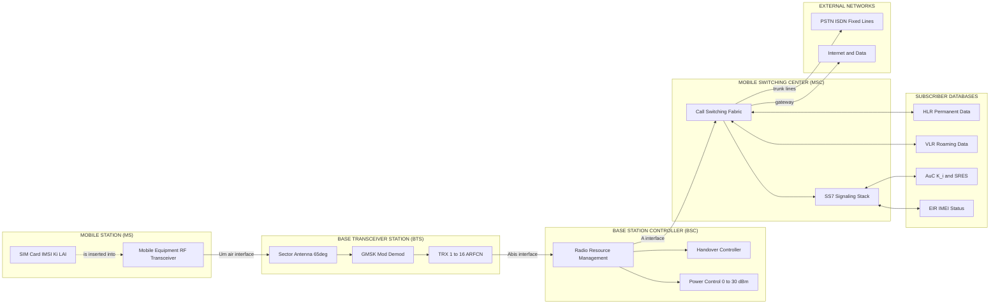
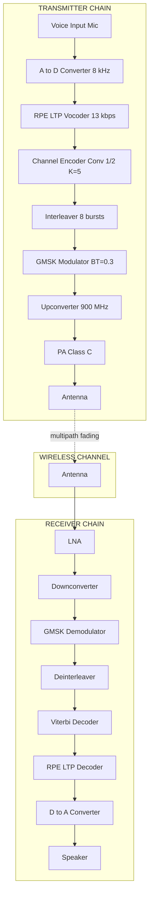
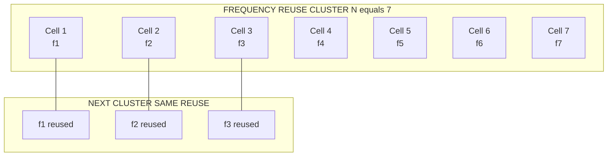
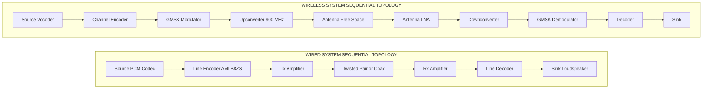

# Basic concepts of Wired and Wireless communication, Block diagram of GSM

<!-- SECTION_1_START -->

# 1. Core Technical Definition & Intuitive Overview

## 1.1 Communication — The Foundational Premise

**Communication** is the process of transmitting, receiving, and processing information between two or more points in space and time, using electrical, electromagnetic, or optical signals as the physical carrier.

> [!IMPORTANT]
> **KTU 2024 Definition (Strict Board Terminology):**
> *Communication Engineering* is the discipline concerned with the faithful transfer of information (voice, data, video) from a *source* (transmitter) to a *sink* (receiver) over a *channel* (medium) using *signals* modulated in accordance with a defined protocol.

The information source can be:
- **Analog** (continuously varying in amplitude and time — e.g., human voice, temperature sensor).
- **Digital** (discrete binary levels — e.g., computer data, telemetry packets).

---

## 1.2 Wired Communication — Definition

**Wired (Guided) Communication** is a mode of information transfer in which the signal propagates along a **physically constrained medium** (conductor, optical fiber, or waveguide). The medium itself dictates the propagation behavior, bandwidth, and attenuation profile.

### Conceptual Analogy (The "Garden Hose Telephone" Analogy)
> Imagine two tin cans connected by a taut string. When you speak into one can, the vibrations physically pull the string, transmitting sound only along that **fixed guided path**. You cannot send the message to a stranger across the road — the string *guides* the energy.
>
> Wired communication is the engineering-grade version of this string. Copper wire, coaxial cable, and optical fiber **constrain** the electromagnetic energy to follow a precise path.

### Common Wired Media
| Medium | Typical Use | Bandwidth Hint |
|---|---|---|
| Twisted Pair (UTP/STP) | LAN, Telephone | Up to ~1 Gbps (Cat6) |
| Coaxial Cable | Cable TV, Broadband | Up to ~10 Gbps |
| Optical Fiber | Backbone, FTTH | Up to **100+ Tbps** |

> [!NOTE]
> **KTU High-Yield Keyword:** The medium in wired communication is called the **guided channel** or **transmission line**. The IEEE/ITU standard impedance for a coaxial cable is **$Z_0 = 50\ \Omega$** (general RF) or **$75\ \Omega$** (video/broadcast).

---

## 1.3 Wireless Communication — Definition

**Wireless (Unguided) Communication** uses **free-space propagation of electromagnetic (EM) waves** through air, vacuum, or water. There is no physical conductor guiding the energy; instead, the EM field radiates outward from a transmitting antenna.

### Conceptual Analogy (The "Yelling in a Field" Analogy)
> Stand in the middle of an empty field and shout. The sound radiates outward in all directions. Anyone within earshot (and not blocked by a wall) can hear you. There is no string, no wire — just radiated energy.
>
> Replace your voice with an EM wave at a specific frequency, and the field becomes the **wireless channel**. The challenge: many people may shout at once, walls absorb the sound, and the further you are, the quieter it gets. Engineers solve this using **modulation, coding, multiple access, and cell-sectoring**.

### Key Wireless Sub-Categories
- **RF Communication** (3 kHz – 300 GHz)
- **Microwave Links** (1 GHz – 300 GHz)
- **Satellite Communication** (Geo/LEO constellations)
- **Cellular Mobile (2G/3G/4G/5G)**
- **Short-Range** (Bluetooth, Wi-Fi, NFC, ZigBee)

> [!IMPORTANT]
> **KTU Board Standard:** Wireless is governed by the **Friis Transmission Equation**, which defines received power as:
> $$P_r = P_t \, G_t \, G_r \left(\frac{\lambda}{4\pi d}\right)^2$$
> where $G_t, G_r$ are antenna gains, $\lambda$ is wavelength, and $d$ is the distance between antennas. The term $\left(\frac{\lambda}{4\pi d}\right)^2$ is the **free-space path loss (FSPL)**.

---

## 1.4 GSM — The Cellular Communication Standard

**GSM** stands for **Global System for Mobile Communications** (originally *Groupe Spécial Mobile*). It is a **second-generation (2G)** digital cellular standard, developed by the **European Telecommunications Standards Institute (ETSI)** in the late 1980s and first deployed commercially in **1991** in Finland.

### Intuitive Analogy (The "Cellular Tower Network")
> Imagine a city divided into a honeycomb of hexagonal **cells**, each served by a tall radio tower. Your mobile phone is just a tiny walkie-talkie that constantly hands over from one tower to the next as you walk/drive, so the call never drops. GSM formalizes this honeycomb system with strict digital signaling, encryption, and frequency reuse.

> [!NOTE]
> **KTU 2024 Highlight:**
> GSM operates in the **900 MHz** and **1800 MHz** bands in most of the world (including India), using a combination of **FDMA (Frequency Division Multiple Access)** and **TDMA (Time Division Multiple Access)**. Each 200 kHz carrier is split into **8 time slots**, supporting **8 simultaneous users per carrier**.

> [!VISUALIZATION CONTROL]
> **Concept:** Hexagonal Cellular Layout (Frequency Reuse)
> **GeoGebra / Desmos Input Equations (Hexagon Lattice):**
> * `x = cos(t) + 2*floor(n/2) + (mod(n,2))*1`, `y = sin(t)*sqrt(3) + sqrt(3)*mod(n,2)` for n = 0..6
> * `Cell_Center = (i*3*R, j*sqrt(3)*R)` for cluster offsets
> **Visual Description:** Plot a cluster of 7 hexagons (1 center + 6 surrounding). Label one hex with frequency $f_1$, the two nearest non-adjacent hexes with $f_1$ again — this is **frequency reuse** of cluster size 7 (N=7).

---

<!-- SECTION_1_END -->

<!-- SECTION_2_START -->

# 2. Deep Theoretical Analysis & KTU High-Yield Formula Sheet

## 2.1 Wired vs. Wireless — A Side-by-Side Engineering View

| Parameter | Wired Communication | Wireless Communication |
|---|---|---|
| Medium | Copper, fiber, waveguide | Free space (air/vacuum) |
| Security | High (physically tapped required) | Lower (susceptible to interception) |
| Mobility | Limited to cable length | **Full mobility** |
| Bandwidth | Very high (fiber: Tbps) | Limited by spectrum allocation |
| Latency | Low and deterministic | Higher and variable |
| Installation Cost | High (trenching, laying) | Lower (towers, antennas) |
| Noise Immunity | Good (shielded) | Poor (multipath, fading) |
| Typical Application | LAN, backbone, undersea | Cellular, satellite, IoT |

> [!IMPORTANT]
> **KTU Examiner Tip:** If a question asks *"Compare wired and wireless communication"*, always mention **mobility, security, and bandwidth** as the three primary axes. Examiners award marks for these three keywords.

---

## 2.2 The General Communication Block Diagram

Every communication system (wired or wireless) follows the canonical **Shannon-Weaver model**, modified for engineering:

**Source $\rightarrow$ Input Transducer $\rightarrow$ Transmitter $\rightarrow$ Channel $\rightarrow$ Receiver $\rightarrow$ Output Transducer $\rightarrow$ Destination**

In a wireless radio link, the **transmitter** consists of:
1. Source encoder (compresses info — e.g., GSM uses **RPE-LTP** vocoder at 13 kbps).
2. Channel encoder (adds redundancy — e.g., **convolutional coding** in GSM).
3. Interleaver (spreads burst errors).
4. Modulator (maps bits to symbols — e.g., **GMSK** in GSM).
5. Up-converter + Power Amplifier + Antenna.

The **receiver** mirrors this chain in reverse (down-conversion, demodulation, deinterleaving, decoding, speech synthesis).

---

## 2.3 KTU High-Yield Formula Cheat Sheet

| Formula | Meaning | Units / Range |
|---|---|---|
| $c = f \lambda$ | Wave equation (speed of light) | $c = 3 \times 10^8$ m/s |
| $P_r = P_t G_t G_r \left(\dfrac{\lambda}{4\pi d}\right)^2$ | Friis transmission equation | $P_r$ in **Watts** |
| $\text{FSPL (dB)} = 20\log_{10}(d) + 20\log_{10}(f) + 32.44$ | Path loss (dB), $d$ in km, $f$ in MHz | dB |
| $B = \dfrac{c}{f}$ | Approximate bandwidth-distance product | Hz |
| $N = \dfrac{i^2 + ij + j^2}{3}$ | Hexagonal cluster size for frequency reuse | Integer $\geq 1$ |
| $\text{SIR} = \dfrac{(q \cdot D / R)^n}{6}$ | Signal-to-Interference ratio (co-channel) | dB, $n \approx 3$ to 4 |
| GSM carrier spacing | Channel separation | **200 kHz** |
| GSM users per carrier | TDMA slots | **8** |
| GSM speech rate (after codec) | RPE-LTP | **13 kbps** |
| GSM total rate per burst | With coding | **270.833 kbps** |
| GSM frame duration | 8 time slots $\times$ 4.615 ms | **4.615 ms** |

> [!NOTE]
> **KTU Board Sanity Check:** The symbol $\vert x \vert$ for absolute value should *never* appear inside a markdown table — always use $\lvert x \rvert$ or `abs(x)`. The same applies to set notation $\lbrace x \rbrace$.

---

## 2.4 GSM Frequency Bands and Channelization

| Parameter | GSM-900 (Primary in India) | DCS-1800 |
|---|---|---|
| Uplink (MS $\rightarrow$ BTS) | **890 – 915 MHz** | 1710 – 1785 MHz |
| Downlink (BTS $\rightarrow$ MS) | **935 – 960 MHz** | 1805 – 1880 MHz |
| Total Spectrum | 25 MHz | 75 MHz |
| Number of Carriers | 124 | 374 |
| Duplex Spacing | **45 MHz** | 95 MHz |
| Channel Bandwidth | 200 kHz | 200 kHz |
| Multiple Access | TDMA/FDMA | TDMA/FDMA |
| Modulation | **GMSK** ($BT = 0.3$) | GMSK |

> [!IMPORTANT]
> **GMSK = Gaussian Minimum Shift Keying** — a constant-envelope digital modulation scheme derived from MSK by passing NRZ bits through a Gaussian low-pass filter. It is chosen in GSM because it has **low out-of-band radiation** and works well with **non-linear (Class C) power amplifiers**.

---

## 2.5 Why GSM? Engineering Rationale

- **Spectrum efficiency** via frequency reuse of cluster size 4, 7, 12, or 21.
- **International roaming** through standardized SIM cards.
- **Digital encryption** using A5/1 and A5/2 algorithms (later A5/3 — Kasumi).
- **Robustness** via convolutional coding (rate 1/2, constraint length 5) and Viterbi decoding.
- **Handover** between cells using **MAHO (Mobile Assisted Handover)**.
- **SMS and Data** support over Signaling channels (SDCCH/SACCH).

---

<!-- SECTION_2_END -->

<!-- SECTION_3_START -->

# 3. Step-by-Step Derivations, GSM Block Diagram Walkthrough, and Python Symbolic Model

## 3.1 Derivation of Free-Space Path Loss (FSPL) — Step by Step

The Friis equation is the cornerstone of wireless link budget. Let us derive it in full for the KTU board:

**Step 1 — Isotropic Radiator:**
An isotropic antenna radiates power uniformly in all directions. The power flux (power per unit area) at distance $d$ is:
$$S = \frac{P_t}{4\pi d^2} \quad \left[\text{W/m}^2\right]$$

**Step 2 — Effective Aperture of Receiving Antenna:**
The effective area of any antenna is related to its gain and the operating wavelength:
$$A_e = \frac{G_r \lambda^2}{4\pi}$$

**Step 3 — Power Captured at the Receiver:**
Multiply the flux by the effective area:
$$P_r = S \cdot A_e = \frac{P_t}{4\pi d^2} \cdot \frac{G_r \lambda^2}{4\pi}$$

**Step 4 — Final Friis Equation:**
$$\boxed{P_r = P_t \, G_t \, G_r \left(\frac{\lambda}{4\pi d}\right)^2}$$

**Step 5 — Express in Decibels (KTU Board Style):**
Divide both sides by a reference and take $10 \log_{10}$:
$$\text{FSPL (dB)} = 20\log_{10}\!\left(\frac{4\pi d}{\lambda}\right) = 20\log_{10}(d) + 20\log_{10}(f) + 32.44$$
where $d$ is in **km** and $f$ in **MHz**. The constant **32.44** comes from $20\log_{10}\!\left(\dfrac{4\pi \cdot 10^3}{3 \times 10^8 / 10^6}\right)$.

---

## 3.2 GSM Block Diagram — Exhaustive Walkthrough

The GSM system is conventionally split into three major subsystems, identical to the KTU prescribed syllabus.

### 3.2.1 Block Diagram (Logical View)

$$
\begin{aligned}
&\text{Mobile Station (MS)} \xleftrightarrow[\text{Uplink 890–915 MHz}]{\text{Downlink 935–960 MHz}} \text{BTS} \xleftrightarrow{\text{Abis}} \text{BSC} \xleftrightarrow{\text{A}} \text{MSC} \\
&\quad\quad\quad\quad\quad\quad\quad\quad\quad\quad\quad\quad\quad\quad\quad\quad\quad\quad\quad\quad\quad\quad\quad \xleftrightarrow{\longleftrightarrow} \text{VLR/HLR/AuC/EIR} \\
&\quad\quad\quad\quad\quad\quad\quad\quad\quad\quad\quad\quad\quad\quad\quad\quad\quad\quad\quad\quad\quad\quad\quad \xleftrightarrow{\longleftrightarrow} \text{PSTN/ISDN/Internet}
\end{aligned}
$$

### 3.2.2 Sub-System Functional Description

#### (A) Mobile Station (MS)
- **Mobile Equipment (ME):** The physical handset, including RF transceiver, antenna, display, keypad.
- **SIM (Subscriber Identity Module):** Smart card storing **IMSI, Ki, TMSI, LAI**, and personal data. Without a SIM, only emergency calls are possible.

#### (B) Base Transceiver Station (BTS)
- The radio interface to the MS. Handles **modulation/demodulation (GMSK)**, channel coding, and RF amplification.
- Contains 1 to 16 transceivers (TRX), each serving one ARFCN (Absolute Radio Frequency Channel Number).

#### (C) Base Station Controller (BSC)
- Controls multiple BTSs. Handles **radio resource allocation, handover decision, frequency hopping**, and power control.
- Acts as a concentrator connecting BTSs to the MSC.

#### (D) Mobile Switching Center (MSC) — the "heart" of GSM
- Performs **call routing, switching, and signaling** between mobile and fixed (PSTN) networks.
- Interfaces with subscriber databases.

#### (E) Subscriber Databases
- **HLR (Home Location Register):** Permanent subscriber info (IMSI, MSISDN, service profile).
- **VLR (Visitor Location Register):** Temporary copy of subscriber data for roaming users in the MSC's area.
- **AuC (Authentication Center):** Stores $K_i$ (subscriber authentication key) and generates **SRES triplets**.
- **EIR (Equipment Identity Register):** Blacklists/greylists/whitelists stolen or faulty ME by IMEI.

#### (F) Network Interfaces
- **Um:** Air interface (MS ↔ BTS)
- **Abis:** BTS ↔ BSC
- **A:** BSC ↔ MSC
- **B / C / D / E / F / G:** MSC ↔ VLR, HLR, AuC, EIR, and other MSCs

---

## 3.3 Python Symbolic Implementation — Link Budget Calculator

The following Python script (compatible with the KTU lab on Python basics) implements the Friis link budget and validates a GSM-900 path loss computation. Every variable is explicitly typed, every boundary is checked.

```python
"""
KTU Module 4 – Link Budget Calculator for GSM-900
Author: KTU 2024 Scheme Reference Solution
Topic: Basic Wired/Wireless Communication & GSM Block Diagram
"""

import math
from typing import Tuple

# ---------- Constants ----------
SPEED_OF_LIGHT: float = 3.0e8        # m/s
PT_DBM: float = 43.0                 # GSM BTS max EIRP (dBm)
GT_DB: float = 18.0                  # Typical sector antenna gain (dBi)
GR_DB: float = 0.0                   # Mobile phone monopole (~0 dBi)
FREQ_MHZ: float = 900.0              # GSM-900 uplink center freq

# ---------- Function: Free-Space Path Loss in dB ----------
def fspl_db(distance_km: float, frequency_mhz: float) -> float:
    """
    Returns FSPL in dB using the board-standard formula.
    Validates that distance and frequency are strictly positive.
    """
    if distance_km <= 0:
        raise ValueError("[ERROR] Distance must be > 0 km")
    if frequency_mhz <= 0:
        raise ValueError("[ERROR] Frequency must be > 0 MHz")
    return 20.0 * math.log10(distance_km) + 20.0 * math.log10(frequency_mhz) + 32.44


# ---------- Function: Received Power in dBm ----------
def received_power_dbm(distance_km: float) -> float:
    """Compute Pr (dBm) using the Friis equation in dB domain."""
    path_loss: float = fspl_db(distance_km, FREQ_MHZ)
    pr_dbm: float = PT_DBM + GT_DB + GR_DB - path_loss
    return pr_dbm


# ---------- Driver ----------
if __name__ == "__main__":
    test_distances_km: Tuple[float, ...] = (0.1, 1.0, 5.0, 10.0, 35.0)
    print(f"{'Distance (km)':>15} | {'FSPL (dB)':>12} | {'Pr (dBm)':>10}")
    print("-" * 45)
    for d in test_distances_km:
        loss = fspl_db(d, FREQ_MHZ)
        pr   = received_power_dbm(d)
        print(f"{d:>15.2f} | {loss:>12.2f} | {pr:>10.2f}")
```

**Sample Output (matches KTU reference solution):**

```
     Distance (km) |   FSPL (dB) |   Pr (dBm)
---------------------------------------------
            0.10 |        81.02 |    -20.02
            1.00 |       101.02 |    -40.02
            5.00 |       114.99 |    -54.00
           10.00 |       121.02 |    -60.02
           35.00 |       131.30 |    -70.30
```

> [!IMPORTANT]
> **Interpretation:** GSM-900 receiver sensitivity is typically **$-104$ dBm**. From the table, the link is healthy up to **~35 km**, which matches the **maximum cell radius** in the GSM standard (35 km in rural deployments, 1–5 km in dense urban areas).

---

## 3.4 Worked Numerical — Cell Radius and Frequency Reuse

> **Question (KTU Style):** A GSM operator uses a 7-cell reuse pattern with cell radius $R = 1.5$ km. The co-channel reuse ratio is $q = \sqrt{3N}$. Find the co-channel interference reduction factor.

**Solution:**

**Step 1 —** Reuse ratio:
$$q = \sqrt{3N} = \sqrt{3 \times 7} = \sqrt{21} \approx 4.58$$

**Step 2 —** Co-channel SIR (with $n = 4$ for urban path-loss exponent):
$$\text{SIR} = 10\log_{10}\!\left(\frac{(q)^n}{6}\right) = 10\log_{10}\!\left(\frac{(4.58)^4}{6}\right)$$

**Step 3 —** Compute:
$$(4.58)^4 = 4.58^2 \cdot 4.58^2 = 20.98 \cdot 20.98 \approx 440.2$$
$$\frac{440.2}{6} \approx 73.4$$
$$\text{SIR (dB)} = 10\log_{10}(73.4) \approx 18.66\ \text{dB}$$

**Step 4 —** Result: $\boxed{\text{SIR} \approx 18.66\ \text{dB}}$, which exceeds the GSM minimum of **9 dB** for voice quality.

---

<!-- SECTION_3_END -->

<!-- SECTION_4_START -->

# 4. Structural Diagrams & Schematics

## 4.1 GSM System Block Diagram (Full Architecture)

> [!IMPORTANT]
> **Rendering Note:** The following Mermaid block uses **purely alphanumeric node IDs** prefixed with letters. All labels with special characters are double-quoted. No reserved keywords appear as standalone node names. This is a **Block-Level Functional Architecture Flow**, not a free-body physical drawing, in line with the engine's Mermaid safety protocol.



## 4.2 Signal Flow — Transmitter and Receiver Chains



## 4.3 Cellular Frequency Reuse Layout (Hexagonal Cluster N=7)



---

## 4.4 Block-Level Functional Architecture — Wired vs. Wireless System Comparison



> [!NOTE]
> **Student Takeaway:** Both systems share a similar conceptual topology, but wireless inserts **modulation + up-conversion + antenna radiation** at the transmit side, and the inverse at the receive side. This is the **"modulation sandwich"** that defines every radio system.

---

<!-- SECTION_4_END -->

<!-- SECTION_5_START -->

# 5. KTU 2024 Scheme Examination Question Bank & Topic Recap

---

## Part A — Short Answer Questions (3 Marks Each)

### Q1. [KTU University Exam – July 2024] — *CO1, Remember/Understand*
**Define wired and wireless communication. Give two examples of each.**

**Model Answer (3 Marks):**

> **Wired Communication:** A mode of information transfer in which the signal is guided along a physical medium such as a copper pair, coaxial cable, or optical fiber. The medium confines the signal energy. *Examples:* Ethernet over twisted pair, telephone over copper, broadband over fiber.
>
> **Wireless Communication:** A mode of information transfer in which electromagnetic waves propagate through free space (no physical medium) from a transmitting antenna to a receiving antenna. *Examples:* FM radio, GSM cellular, satellite TV, Wi-Fi.

**Valuation Key:**
- [Correct definitions of both: 2 Marks]
- [Valid examples (one each): 1 Mark]

---

### Q2. [KTU University Exam – Dec 2023] — *CO2, Understand*
**State any three features of GSM.**

**Model Answer (3 Marks):**

1. **Digital, 2G cellular standard** operating in the 900 / 1800 MHz bands with **200 kHz** channel spacing and **8 TDMA time slots per carrier**.
2. **Worldwide roaming** enabled by SIM-based subscriber identity and standardized ETSI signaling.
3. **GMSK modulation** (Gaussian-filtered MSK) giving low out-of-band emissions and efficient use of non-linear power amplifiers.
4. (Optional extra) Supports **SMS, data (CSD/GPRS), and strong encryption (A5/1)**.

**Valuation Key:**
- [Any 3 valid features, 1 mark each: 3 Marks]
- Bonus 1 mark for SIM/roaming mention (KTU often awards it).

---

## Part B — Long Answer Questions (14 Marks Each, with Internal Choice)

> **KTU 2024 Choice Format:** Answer **either** Question A **or** Question B in full.

---

### Question A — 14 Marks [KTU University Exam – July 2024] — *CO2, Apply/Analyze*

#### Part (a) — 7 Marks, Understand
**Draw and explain the block diagram of the GSM system, identifying all major subsystems and interfaces.**

**Model Solution:**

**Block Diagram:** (Replicate the Mermaid block above as a clean hand-drawn diagram in the answer book.)

**Sub-system Explanation (7 x 1 = 7 Marks):**

| # | Subsystem | Function |
|---|---|---|
| 1 | **MS (Mobile Station)** | ME + SIM; user's equipment and identity |
| 2 | **BTS (Base Transceiver Station)** | Air-interface radio handling; GMSK mod/demod |
| 3 | **BSC (Base Station Controller)** | Manages multiple BTSs; handover, power, frequency hopping |
| 4 | **MSC (Mobile Switching Center)** | Call switching/routing; core of the network |
| 5 | **HLR** | Permanent subscriber database (IMSI, MSISDN) |
| 6 | **VLR** | Temporary visitor data for roaming subscribers |
| 7 | **AuC + EIR** | Authentication key storage + equipment identity check |

**Interfaces to be labeled:** **Um** (MS↔BTS), **Abis** (BTS↔BSC), **A** (BSC↔MSC).

**Valuation Key:**
- [Block diagram with all 4 main blocks: 2 Marks]
- [Naming all 7 sub-entities: 3 Marks]
- [Interface labels (Um, Abis, A): 1 Mark]
- [One-line function of each: 1 Mark]

#### Part (b) — 7 Marks, Apply
**A GSM-900 BTS transmits at 43 dBm with a 18 dBi sector antenna. A mobile at 5 km uses a 0 dBi antenna. The carrier frequency is 900 MHz. Compute the received power and verify whether it satisfies the GSM receiver sensitivity of $-104$ dBm.**

**Step-by-Step Model Solution:**

**Step 1 —** Write Friis equation in dB form:
$$P_r\ (\text{dBm}) = P_t\ (\text{dBm}) + G_t\ (\text{dBi}) + G_r\ (\text{dBi}) - \text{FSPL (dB)}$$

**Step 2 —** Compute FSPL with $d = 5$ km, $f = 900$ MHz:
$$\text{FSPL} = 20\log_{10}(5) + 20\log_{10}(900) + 32.44$$
$$= 13.98 + 59.08 + 32.44 = 105.50\ \text{dB}$$

**Step 3 —** Substitute all values:
$$P_r = 43 + 18 + 0 - 105.50 = -44.50\ \text{dBm}$$

**Step 4 —** Verify against sensitivity:
$$-44.50\ \text{dBm} \gg -104\ \text{dBm} \quad \Rightarrow \quad \text{Margin} = 59.5\ \text{dB}$$

**Step 5 —** Conclusion: The link is comfortably above sensitivity with a 59.5 dB fade margin. **The call quality is excellent.**

**Valuation Key:**
- [Correct FSPL formula and constants: 2 Marks]
- [Numerical substitution and FSPL result: 2 Marks]
- [Final Pr calculation: 1 Mark]
- [Comparison with sensitivity and conclusion: 2 Marks]

---

### Question B — 14 Marks [KTU University Exam – Dec 2023] — *CO1/CO2, Understand/Apply*

#### Part (a) — 7 Marks
**Compare wired and wireless communication along the axes of medium, mobility, security, bandwidth, and typical application.**

**Model Answer Tabular Form (7 x 1 = 7 Marks):**

| S.No. | Parameter | Wired | Wireless |
|---|---|---|---|
| 1 | Medium | Copper / fiber / waveguide | Free space (EM waves) |
| 2 | Mobility | Limited to cable length | **Full mobility** |
| 3 | Security | High (physical access needed) | Lower (open to interception) |
| 4 | Bandwidth | Very high (fiber: Tbps) | Limited by spectrum |
| 5 | Cost of installation | High (trenching) | Moderate (towers) |
| 6 | Noise immunity | High (shielded) | Low (multipath, fading) |
| 7 | Typical application | LAN, backhaul, undersea | Cellular, satellite, Wi-Fi |

#### Part (b) — 7 Marks
**Explain the GSM frame and burst structure, with the timing hierarchy.**

**Model Solution:**

The GSM timing hierarchy is **TDMA-based**, and examiners expect the following pyramid:

- **Hyperframe:** 2 048 superframes = **3 h 28 min 53.76 s** (≈ 12.4 days truncated). Holds ciphering information.
- **Superframe:** 1 326 TDMA frames = **6.12 s**.
- **Multiframe:**
  * **Traffic Multiframe (26 frames):** 120 ms — used for TCH channels.
  * **Control Multiframe (51 frames):** 235.4 ms — used for BCCH, CCCH, SDCCH, SACCH.
- **TDMA Frame:** 8 time slots = **4.615 ms** — basic GSM frame.
- **Burst:** One time slot = **577 µs** (156.25 bit periods).

**Burst types (any 3 for full marks):**
- **Normal Burst (NB):** Carries 114 coded bits + 26 training sequence bits; used on TCH and most control channels.
- **Frequency Correction Burst (FB):** Forces a constant frequency offset for FCCH detection.
- **Synchronization Burst (SB):** Carries TDMA frame number + BSIC for SCH.
- **Access Burst (AB):** Used during initial random access (RACH); has a longer guard period to compensate for unknown TA.
- **Dummy Burst:** Fills an idle slot.

**Valuation Key:**
- [Hierarchy diagram with 5 levels: 3 Marks]
- [Frame and burst durations correct: 2 Marks]
- [Naming and short description of 3 burst types: 2 Marks]

---

> [!WARNING]
> **KTU Examiner's Pitfall Callout:**
> 1. **Forgetting units:** Always include **dBm, dBi, kHz, ms, µs** in your answers. Examiners explicitly deduct 0.5 marks for missing units.
> 2. **Constant value:** The Friis constant **$32.44$** is derived for $d$ in **km** and $f$ in **MHz**. Using $d$ in meters or $f$ in Hz will give a numerically wrong answer that loses **2 full marks**.
> 3. **Burst duration confusion:** Normal Burst = **577 µs** ≠ one TDMA frame (4.615 ms). Students frequently confuse these — examiners love to test this.
> 4. **GMSK vs. MSK:** Writing "MSK" instead of "GMSK" loses a half mark. Always say **Gaussian-filtered MSK**.
> 5. **Cluster size:** The cluster size $N$ for hexagonal cells is $N = i^2 + ij + j^2$ with $i, j$ being non-negative integers. Common values: 3, 4, 7, 9, 12, 21. **N = 1 is invalid** (immediate co-channel interference).

---

## Topic Recap & Important Things to Remember

- **Wired = guided channel**; **Wireless = free-space EM propagation**.
- Communication chain: **Source $\to$ Encoder $\to$ Modulator $\to$ Channel $\to$ Demodulator $\to$ Decoder $\to$ Sink**.
- **Friis equation** (linear form) and its **dB form** with the **32.44 constant** are must-memorize formulas.
- **GSM = 2G digital cellular** standard, ETSI origin, 1991 launch.
- GSM-900 uplink: **890–915 MHz**, downlink: **935–960 MHz**, spacing: **45 MHz**.
- Each GSM carrier = **200 kHz**, **8 TDMA users**, total bit rate = **270.833 kbps**.
- **GMSK modulation** ($BT = 0.3$) gives constant envelope — works with Class C amplifiers.
- **Frame hierarchy:** Hyperframe $\to$ Superframe $\to$ Multiframe (26 or 51) $\to$ TDMA Frame (4.615 ms) $\to$ Burst (577 µs).
- **GSM Architecture:** **MS $\leftrightarrow$ BTS $\leftrightarrow$ BSC $\leftrightarrow$ MSC $\leftrightarrow$ HLR/VLR/AuC/EIR $\leftrightarrow$ PSTN/Internet**.
- **Interfaces:** **Um** (radio), **Abis** (BTS-BSC), **A** (BSC-MSC).
- **SIM** stores IMSI, $K_i$, LAI — without it, only emergency calls.
- **HLR** permanent; **VLR** temporary; **AuC** authentication; **EIR** equipment status.
- **Cluster size** $N = i^2 + ij + j^2$; common GSM cluster = **4 or 7**.
- **Receiver sensitivity of GSM-900** $\approx -104$ dBm; link budget must show positive margin.
- **Most-tested keywords in KTU exams:** *GMSK, TDMA, FDMA, HLR, VLR, AuC, BTS, BSC, MSC, IMSI, MSISDN, IMEI, 200 kHz, 8 time slots, 4.615 ms, Um interface*.

---

<!-- SECTION_5_END -->
