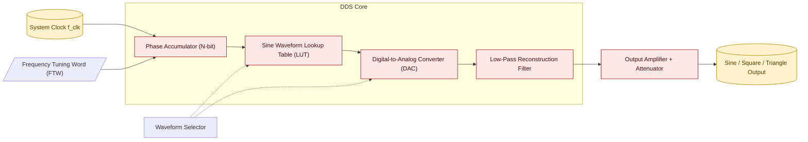
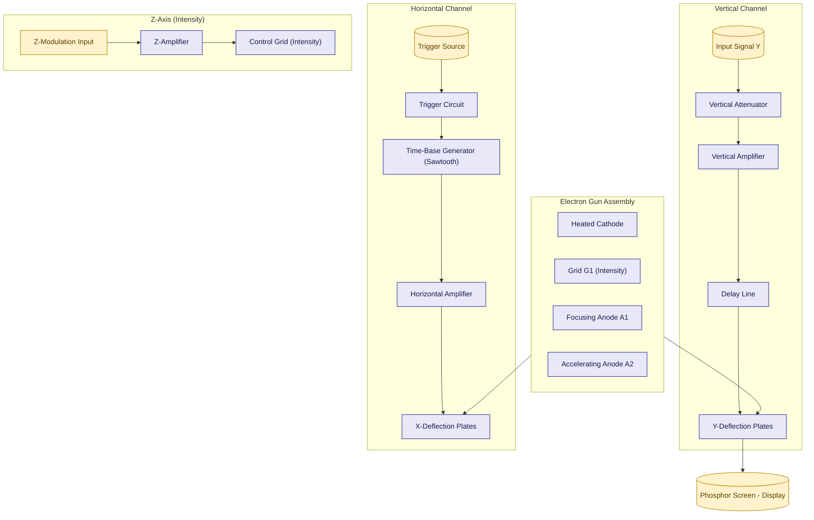
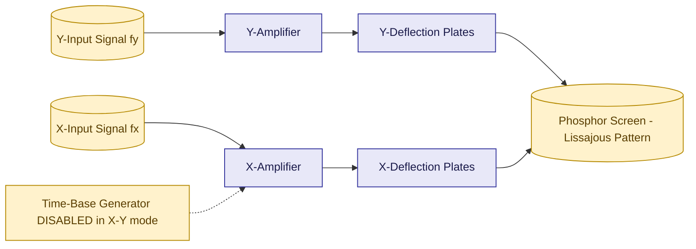
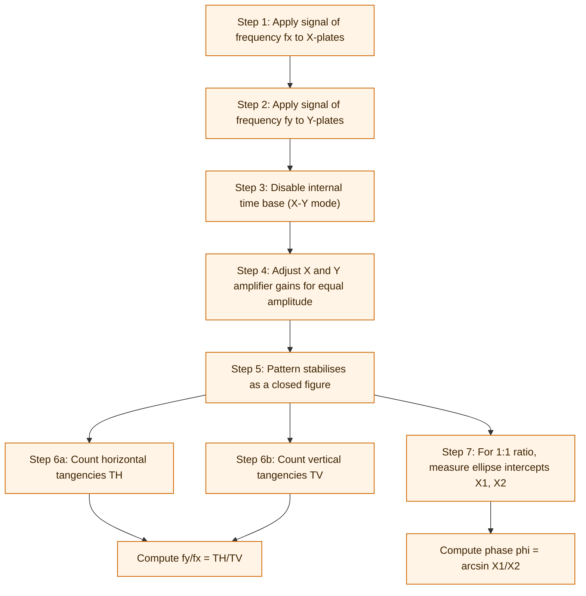
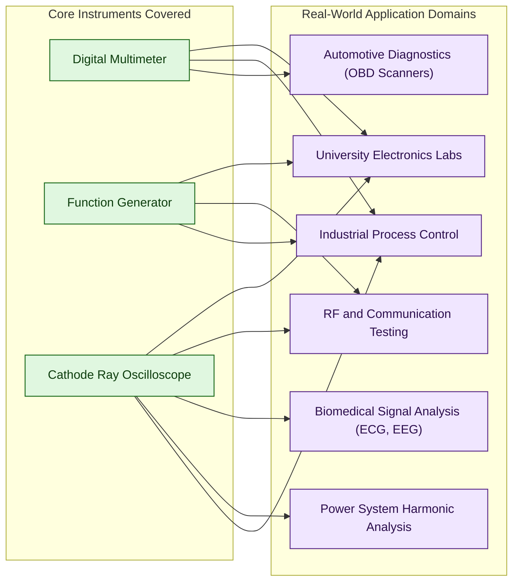
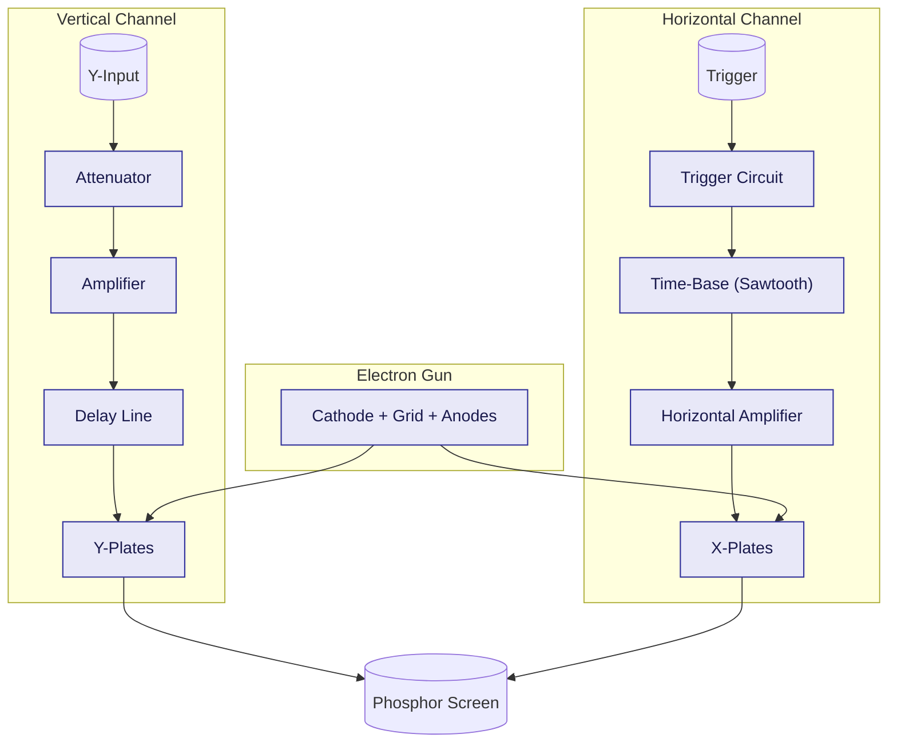
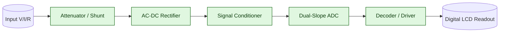

```mermaid
flowchart LR
    subgraph stage1["Stage 1: Sensing"]
        sensor["Primary Sensing Element"]
    end

    subgraph stage2["Stage 2: Conversion"]
        convert["Variable Conversion Element"]
        manip["Variable Manipulation Element"]
    end

    subgraph stage3["Stage 3: Transmission"]
        transmit["Data Transmission Element"]
    end

    subgraph stage4["Stage 4: Conditioning"]
        cond["Signal Conditioning Unit"]
    end

    subgraph stage5["Stage 5: Presentation"]
        display["Data Presentation Element"]
    end

    input[("Physical Quantity")] --> sensor
    sensor --> convert
    convert --> manip
    manip --> transmit
    transmit --> cond
    cond --> display
    display --> out[("Readout / Record")]

    display -.feedback.-> manip

    classDef block fill:#e8f1ff,stroke:#1f4e8c,stroke-width:1.2px,color:#0a2540;
    classDef io fill:#fff2cc,stroke:#b58900,stroke-width:1.2px,color:#5a3e00;
    class sensor,convert,manip,transmit,cond,display block;
    class input,out io;
```

# Block diagrams of Electronic instrumentation system, Digital Multimeter, Function generator, Introduction to CRO and Lissajous patterns

<!-- SECTION_1_START -->

# Module 4: Modern Electronics and Applications

## 1. Electronic Instrumentation System

### 1.1 Core Technical Definition

> [!NOTE]
> **Electronic Instrumentation System:** An integrated arrangement of electronic hardware components and signal-processing blocks designed to **measure**, **monitor**, **record**, and **control** physical quantities (such as temperature, pressure, strain, displacement, or electrical signals) by converting them into equivalent electrical signals that can be displayed, stored, or used for automated decision-making.

The block diagram of a generalized **Electronic Instrumentation System** typically consists of three primary functional stages:

$$
\text{Primary Sensing Element} \longrightarrow \text{Variable Conversion Element} \longrightarrow \text{Variation Comparison Element}
$$
$$
\longrightarrow \text{Data Transmission Element} \longrightarrow \text{Signal Processing / Conditioning Element} \longrightarrow \text{Data Presentation Element}
$$

### 1.2 Conceptual Analogy / Intuition

> [!IMPORTANT]
> **Analogy — The Doctor's Stethoscope System:**
> Think of a doctor measuring your heartbeat. The **stethoscope** acts as the *primary sensor* (converts sound to mechanical vibration). The doctor's ears perform *signal conditioning* (amplifying weak sound). The *brain* processes the conditioned signal (frequency analysis). Finally, the **medical report** is the *data presentation element*. An electronic instrumentation system does exactly this — but for any engineering quantity, using electronic transducers and display devices instead of biological organs.

> [!VISUALIZATION CONTROL]
> **Concept:** Block-Level Signal Flow of a Generic Instrumentation System
> **Input Quantity:** $x_i$ (physical variable)
> **Output Quantity:** $x_o$ (readable display)
> **Visual Description:** A left-to-right flow chart where each block transforms the signal by a known transfer function $K_1, K_2, \dots, K_n$, with a closed feedback loop returning from the output stage to the comparator for closed-loop control.

---

## 2. Digital Multimeter (DMM)

### 2.1 Core Technical Definition

> [!NOTE]
> **Digital Multimeter (DMM):** A microprocessor-controlled, multi-function electronic test instrument that uses an **Analog-to-Digital Converter (ADC)** to convert analog input signals (voltage, current, or resistance) into a digital numerical value displayed on an **LCD/LED** screen. It is the modern digital replacement for the traditional analog **Galvanometer-based moving-coil multimeter**.

### 2.2 Conceptual Analogy / Intuition

> [!IMPORTANT]
> **Analogy — The Digital Weighing Scale:**
> Imagine stepping on an old spring-based weighing scale (analog pointer) versus a modern digital scale that shows "**67.4 kg**" on a screen. The DMM is exactly that — but for **volts, amps, and ohms**. The pointer-and-spring mechanism is replaced by a precision ADC, and the dial is replaced by a 7-segment or dot-matrix LCD.

### 2.3 Functional Block Description

A DMM consists of the following internal signal-processing blocks:

| Block | Function | Key Specification |
| :--- | :--- | :--- |
| Input Attenuator / Shunt | Scales the input signal to a safe ADC range | High input impedance $\geq 10\,\text{M}\Omega$ |
| AC-to-DC Converter (Rectifier) | Converts AC quantities to equivalent DC RMS | True RMS or average-responding |
| Signal Conditioner | Amplification, filtering, level shifting | Bandwidth $\approx 100\,\text{kHz}$ typical |
| Analog-to-Digital Converter (ADC) | Quantizes the conditioned analog signal | Dual-slope integrating ADC preferred |
| Digital Decoder / Display Driver | Converts binary count to 7-segment code | CMOS or TTL driver IC |
| LCD / LED Display | Numerical readout | $3\tfrac{1}{2}$ to $8\tfrac{1}{2}$ digit resolution |

---

## 3. Function Generator

### 3.1 Core Technical Definition

> [!NOTE]
> **Function Generator:** A versatile electronic signal-source instrument that produces **periodic waveforms** of user-selectable shape (sine, square, triangular, ramp, pulse), adjustable **frequency** (typically from $0.01\,\text{Hz}$ to a few $\text{MHz}$), and controllable **amplitude** (with adjustable DC offset). Modern function generators also offer **sweep**, **modulation (AM/FM)**, and **arbitrary waveform** generation capabilities.

### 3.2 Conceptual Analogy / Intuition

> [!IMPORTANT]
> **Analogy — The Music Synthesizer:**
> A musician's keyboard can produce piano, violin, or drum sounds — all from the same instrument, with selectable timbre, pitch, and volume. A function generator is the **electronic equivalent** for test signals: instead of musical notes, you dial in a sine, square, or triangle wave at any pitch (frequency) and loudness (amplitude) you need for testing circuits.

### 3.3 Key Specifications

- **Frequency Range:** $0.01\,\text{Hz}$ to $20\,\text{MHz}$ (or higher in RF models)
- **Output Amplitude:** $1\,\text{mV}_{pp}$ to $20\,\text{V}_{pp}$ (open circuit)
- **Output Impedance:** Standard $50\,\Omega$ for RF compatibility
- **Total Harmonic Distortion (THD):** $< 1\%$ for sine wave
- **Sweep Capability:** Linear or logarithmic

---

## 4. Cathode Ray Oscilloscope (CRO)

### 4.1 Core Technical Definition

> [!NOTE]
> **Cathode Ray Oscilloscope (CRO):** A high-speed electronic measurement instrument that visually displays the **time-varying voltage waveform** of one or more electrical signals on a phosphor-coated screen (or LCD in a DSO — Digital Storage Oscilloscope) by deflecting a focused beam of electrons in a vacuum tube. It is the most fundamental and versatile instrument for analyzing **time-domain**, **amplitude**, **frequency**, and **phase** characteristics of electrical signals.

### 4.2 Conceptual Analogy / Intuition

> [!IMPORTANT]
> **Analogy — The Light Pen Plotter:**
> Imagine a tiny invisible "pen" of electrons that flies across a glowing canvas thousands of times per second, drawing a graph of voltage versus time. The horizontal motion is the **time base (sweep)**, and the vertical wiggle of the pen is the **input signal**. Where the pen's "ink" lands, the screen glows — giving you a real-time picture of the electrical waveform, much like a seismograph drawing an earthquake's vibration.

### 4.3 Functional Block Description of a CRO

The CRO can be divided into three major subsystems:

1. **Electron Gun Assembly** — produces, focuses, and accelerates the electron beam.
2. **Deflection System** — controls the beam using electric fields (electrostatic) or magnetic fields.
3. **Display System** — phosphor screen with graticule markings.

---

## 5. Lissajous Patterns

### 5.1 Core Technical Definition

> [!NOTE]
> **Lissajous Patterns (Bowditch Curves):** Stable, closed geometric figures traced on the CRO screen when two sinusoidal signals of (usually) different frequencies are applied — one to the **horizontal (X)** deflection plates and the other to the **vertical (Y)** deflection plates. The shape, number of loops, and orientation of the resulting pattern allow the determination of the **frequency ratio** and the **phase difference** between the two signals.

### 5.2 Conceptual Analogy / Intuition

> [!IMPORTANT]
> **Analogy — The Spirograph Toy:**
> Remember the Spirograph drawing toy with two interlocking gears? A pen inside the smaller gear traces intricate, looping patterns as the gears rotate. Lissajous figures are the **electrical equivalent**: two orthogonal sinusoidal "rotations" combine vectorially to trace beautiful closed curves. The "gear ratio" corresponds to the **frequency ratio** of the two signals, and the pen's starting angle corresponds to the **phase difference**.

<!-- SECTION_1_END -->

<!-- SECTION_2_START -->

# Deep Theoretical Analysis & KTU High-Yield Formula Sheet

## 1. Block Diagram of a Generalized Electronic Instrumentation System

The complete instrumentation chain is composed of functional blocks connected in cascade (open-loop) or with feedback (closed-loop):

| Stage | Block Name | Purpose | Example |
| :--- | :--- | :--- | :--- |
| 1 | **Primary Sensing Element** | Direct contact with measurand | Thermocouple, RTD, LVDT core |
| 2 | **Variable Conversion Element** | Converts measurand to a more usable form | Strain gauge, piezoelectric crystal |
| 3 | **Variable Manipulation Element** | Modifies the signal magnitude/format | Bridge amplifier, attenuator |
| 4 | **Data Transmission Element** | Sends signal from sensor to processing site | Shielded cable, telemetry, optical fiber |
| 5 | **Signal Conditioning Unit** | Amplifies, filters, linearizes | Instrumentation amplifier, active filter |
| 6 | **Data Presentation Element** | Displays or records the final value | CRO, DMM, strip-chart recorder, computer |

**Overall Transfer Function (Open Loop):**
$$
K_{\text{total}} = K_1 \cdot K_2 \cdot K_3 \cdot K_4 \cdot K_5 \cdot K_6
$$

$$
x_o(t) = K_{\text{total}} \cdot x_i(t)
$$

**Closed-Loop Transfer Function (with feedback factor $\beta$):**
$$
G_{\text{CL}} = \frac{K_{\text{OL}}}{1 + \beta \cdot K_{\text{OL}}}
$$

> [!IMPORTANT]
> **Why closed-loop matters in instrumentation:** Open-loop systems suffer from non-linearity, drift, and calibration sensitivity. Adding negative feedback (typical in **servo-balancing instruments** and **self-balancing potentiometers**) linearizes the response, improves accuracy, and extends bandwidth.

---

## 2. Digital Multimeter — Operational Internals

The DMM revolves around a **dual-slope integrating ADC**, which provides excellent **normal-mode noise rejection** at mains frequency ($50\,\text{Hz}$).

**Dual-Slope Integration Phases:**

**Run-up Phase (Sampling):** The input voltage $V_{\text{in}}$ is integrated for a fixed time $T_1 = 2^n \cdot T_{\text{clk}}$.

$$
V_{\text{ramp}} = -\frac{1}{RC} \int_0^{T_1} V_{\text{in}}\, dt = -\frac{V_{\text{in}} \cdot T_1}{RC}
$$

**Run-down Phase (De-integration):** A reference voltage $V_{\text{ref}}$ of opposite polarity is integrated back to zero. The time taken is $T_2$.

$$
V_{\text{ref}} \cdot \frac{T_2}{RC} = \frac{V_{\text{in}} \cdot T_1}{RC}
$$

$$
\boxed{T_2 = T_1 \cdot \frac{V_{\text{in}}}{V_{\text{ref}}}}
$$

Since $T_2$ is measured by counting clock pulses, the digital output is **proportional to $V_{\text{in}}$** and is **independent of the RC time constant** — a major accuracy advantage.

> [!IMPORTANT]
> **Key Engineering Insight:** DMMs reject $50\,\text{Hz}$ / $60\,\text{Hz}$ mains interference very effectively when the integration period is exactly an integer multiple of the line period — a feature almost impossible to achieve in flash or successive-approximation ADCs.

---

## 3. Function Generator — Working Principle

Modern function generators use **Direct Digital Synthesis (DDS)** architecture:

1. A **phase accumulator** is incremented at a clock rate $f_{\text{clk}}$ by a tunable **frequency tuning word (FTW)**.
2. The accumulated phase value is fed to a **lookup table** (LUT) containing sine samples.
3. A **DAC** converts the digital samples to an analog waveform.
4. A **low-pass filter** smooths the staircase output.

**Output Frequency Equation:**
$$
f_{\text{out}} = \frac{\text{FTW} \cdot f_{\text{clk}}}{2^N}
$$

where $N$ is the phase accumulator bit-width (typically $32$ or $48$ bits).

**Engineering Utility:**
- Testing amplifier **frequency response** and **bandwidth**
- Checking **filter roll-off** characteristics
- Generating **clock signals** for digital logic
- Producing **modulated carriers** in RF and communication labs
- Driving **servo motors** and **transducer calibration**

---

## 4. Cathode Ray Oscilloscope — Complete Block Diagram & Theory

### 4.1 Electron Gun Subsystem

| Component | Function |
| :--- | :--- |
| Cathode (K) | Heated filament emits electrons via thermionic emission |
| Control Grid (G) | Negative voltage controls beam intensity (brightness) |
| Focusing Anode ($A_1$) | Accelerates and converges electron beam |
| Accelerating Anode ($A_2$) | Further accelerates electrons toward screen |
| Focusing Anode ($A_3$) | Final focusing for sharp spot |

The cathode is held at a high negative potential (typically $-1\,\text{kV}$ to $-15\,\text{kV}$), while the screen is near ground. Electrons emitted accelerate toward the screen, strike the phosphor coating, and produce luminescence.

### 4.2 Deflection Subsystem

There are two pairs of deflection plates inside the evacuated CRT:

- **Vertical Deflection Plates (Y-plates):** Deflect the beam **up or down** based on the input signal voltage.
- **Horizontal Deflection Plates (X-plates):** Deflect the beam **left or right** based on the time-base ramp.

**Electrostatic Deflection Equation:**
$$
d = \frac{L \cdot D \cdot V_d}{2 \cdot l \cdot V_a}
$$

where:
- $d$ = beam deflection on screen (m)
- $L$ = distance from deflection plates to screen (m)
- $D$ = length of deflection plates (m)
- $l$ = separation between plates (m)
- $V_d$ = deflecting voltage (V)
- $V_a$ = accelerating voltage (V)

> [!IMPORTANT]
> **Deflection Sensitivity (S):**
> $$
> S = \frac{d}{V_d} = \frac{L \cdot D}{2 \cdot l \cdot V_a} \;\; \text{(m/V)}
> $$
> Higher $S$ means a more sensitive CRO, useful for low-amplitude signals.

### 4.3 Time Base Generator (Sweep Circuit)

The time base is a **sawtooth waveform** that linearly ramps the beam horizontally from left to right, then snaps back (flyback / retrace) so a new trace begins. The **sweep rate** is calibrated in **time/division** (s/div, ms/div, µs/div, ns/div).

### 4.4 Triggering & Synchronization

To stabilize a periodic waveform on the screen, the sweep must be **synchronized** with the input signal. A **trigger circuit** detects a specific voltage level (trigger level) and slope (rising/falling edge) on the input and initiates a fresh sweep at the same point on the waveform each cycle.

> [!TIP]
> **Engineering Tip:** In the **X-Y mode**, the internal time base is disconnected, and an external signal drives the X-plates. This is the configuration used for **Lissajous patterns** and for plotting **transfer characteristics** (e.g., Bode plots of filters).

---

## 5. Lissajous Patterns — Theory

### 5.1 Mathematical Derivation

Consider two sinusoidal signals applied to a CRO in X-Y mode:

$$
x(t) = A_x \sin(\omega_x t + \phi_x)
$$

$$
y(t) = A_y \sin(\omega_y t + \phi_y)
$$

**Case 1 — Equal Frequencies ($\omega_x = \omega_y = \omega$) with Phase Difference $\phi$:**

Let $\phi_y - \phi_x = \phi$. Setting $\phi_x = 0$:

$$
x = A_x \sin(\omega t), \quad y = A_y \sin(\omega t + \phi)
$$

Expanding $y$:
$$
y = A_y [\sin(\omega t)\cos\phi + \cos(\omega t)\sin\phi]
$$

Substituting $\sin(\omega t) = x / A_x$ and $\cos(\omega t) = \sqrt{1 - (x/A_x)^2}$:

$$
\frac{y}{A_y} = \frac{x}{A_x}\cos\phi + \sqrt{1 - \frac{x^2}{A_x^2}}\sin\phi
$$

Rearranging:
$$
y = \frac{A_y}{A_x} \cos\phi \cdot x \pm A_y \sin\phi \cdot \sqrt{1 - \frac{x^2}{A_x^2}}
$$

This is the equation of an **ellipse**, whose specific shape depends on $\phi$:

| Phase Difference $\phi$ | Pattern Shape | Special Feature |
| :---: | :--- | :--- |
| $0°$ | Straight diagonal line | Slope = $A_y / A_x$ |
| $45°$ | Symmetric ellipse | Major axis aligned with diagonal |
| $90°$ | Circle (if $A_x = A_y$) | Perpendicular tangents |
| $135°$ | Tilted ellipse | Major axis on the other diagonal |
| $180°$ | Straight diagonal line | Crosses in opposite direction |

**Phase Difference Formula from Ellipse:**
$$
\boxed{\sin\phi = \frac{Y_1}{Y_2} = \frac{X_1}{X_2}}
$$

where:
- $X_1, Y_1$ = intercepts on the **minor axis**
- $X_2, Y_2$ = intercepts on the **major axis**

### 5.2 Frequency Ratio Determination

When $f_x : f_y = m : n$ (with $m, n$ as integers), the pattern is **closed** and exhibits $(m + n)$ tangential touches on the vertical edge and $(m + n)$ tangential touches on the horizontal edge.

> [!IMPORTANT]
> **Frequency Ratio Rule:**
> $$
> \frac{f_y}{f_x} = \frac{\text{Number of tangencies on the vertical (left/right) edge}}{\text{Number of tangencies on the horizontal (top/bottom) edge}}
> $$

> **Equivalent Memory Aid:**
> $$
> \frac{f_y}{f_x} = \frac{\text{horizontal tangent points}}{\text{vertical tangent points}}
> $$

### 5.3 Common Lissajous Patterns (Reference Table)

| Frequency Ratio $f_y : f_x$ | Phase $0°$ | Phase $45°$ | Phase $90°$ | Phase $135°$ | Phase $180°$ |
| :---: | :---: | :---: | :---: | :---: | :---: |
| $1 : 1$ | Line (/) | Ellipse | Circle | Ellipse (other way) | Line (\\) |
| $2 : 1$ | Figure-of-8 (∞) | Twisted 8 | Two loops vertical | Twisted 8 (other way) | Figure-of-8 inverted |
| $3 : 1$ | Three-lobe pattern | Twisted three-loop | Three vertical loops | Twisted three-loop | Three-lobe inverted |
| $1 : 2$ | Figure-of-8 sideways | Twisted 8 (horizontal) | Two loops horizontal | Twisted 8 (other side) | Figure-of-8 sideways inverted |
| $3 : 2$ | Three-lobe/two-lobe complex curve | Twisted variant | Closed trefoil-like | Twisted variant | Inverted |

---

## 6. KTU High-Yield Formula Cheat Sheet

| Formula | Equation | Application |
| :--- | :--- | :--- |
| Deflection on CRO screen | $d = \dfrac{L \cdot D \cdot V_d}{2 \cdot l \cdot V_a}$ | Spot displacement calculation |
| Deflection sensitivity | $S = \dfrac{d}{V_d} = \dfrac{L \cdot D}{2 \cdot l \cdot V_a}$ | CRO sensitivity specification |
| Phase from Lissajous ellipse | $\sin\phi = \dfrac{Y_1}{Y_2} = \dfrac{X_1}{X_2}$ | Phase difference measurement |
| Frequency ratio from Lissajous | $\dfrac{f_y}{f_x} = \dfrac{\text{horizontal tangencies}}{\text{vertical tangencies}}$ | Unknown frequency measurement |
| Dual-slope ADC count | $T_2 = T_1 \cdot \dfrac{V_{\text{in}}}{V_{\text{ref}}}$ | DMM measurement time |
| DDS output frequency | $f_{\text{out}} = \dfrac{\text{FTW} \cdot f_{\text{clk}}}{2^N}$ | Function generator output |
| Closed-loop transfer function | $G_{\text{CL}} = \dfrac{K_{\text{OL}}}{1 + \beta \cdot K_{\text{OL}}}$ | Servo-balancing instruments |
| Velocity of electron in CRT | $v = \sqrt{\dfrac{2eV_a}{m_e}}$ | Electron beam energy |
| Time-period of waveform | $T = \text{(divisions per cycle)} \times \text{time/div}$ | CRO frequency measurement |
| Frequency from CRO | $f = \dfrac{1}{T}$ | Periodic signal analysis |

> [!TIP]
> **KTU Board Exam Tip:** Always state the **units** of the final answer. For Lissajous patterns, explicitly write the ratio as "$f_y : f_x = p : q$" — never as a decimal — to fetch full marks.

<!-- SECTION_2_END -->

<!-- SECTION_3_START -->

# Step-by-Step Derivations, Numerical Solvers & Code Implementation

## 1. Numerical Derivation: Phase from a Lissajous Ellipse

**Given:** On a Lissajous display with $f_x = f_y$, the measured intercepts are $X_1 = 1.2\,\text{div}$ and $X_2 = 3.0\,\text{div}$.

**To Find:** Phase difference $\phi$ between the two signals.

### Step 1 — Identify the Geometric Quantities

$X_1$ is the intercept on the **minor axis** of the ellipse, and $X_2$ is the intercept on the **major axis**.

### Step 2 — Apply the Phase Formula

$$
\sin\phi = \frac{X_1}{X_2}
$$

### Step 3 — Substitute the Given Values

$$
\sin\phi = \frac{1.2}{3.0} = 0.4
$$

### Step 4 — Compute the Angle

$$
\phi = \arcsin(0.4) = 23.578^\circ
$$

### Step 5 — State the Final Answer with Units

$$
\boxed{\phi \approx 23.58^\circ \;\; \text{(or } 0.411\,\text{rad)}}
$$

> [!NOTE]
> **Valuation Key Points (per KTU Board):** [Stating the geometric interpretation of $X_1$ and $X_2$: 1 Mark] [Writing the formula $\sin\phi = X_1/X_2$: 2 Marks] [Substitution step: 1 Mark] [Inverse-sine evaluation: 2 Marks] [Final boxed answer with units: 1 Mark] = **7 Marks** complete.

---

## 2. Numerical Derivation: Frequency Ratio from a Lissajous Pattern

**Given:** A Lissajous figure has **3 tangencies on the top edge** and **2 tangencies on the right edge**.

**To Find:** Frequency ratio $f_y : f_x$.

### Step 1 — Identify the Tangency Count

- Top/bottom edge (horizontal tangencies): $T_h = 3$
- Right/left edge (vertical tangencies): $T_v = 2$

### Step 2 — Apply the Standard Frequency Ratio Rule

$$
\frac{f_y}{f_x} = \frac{T_h}{T_v}
$$

### Step 3 — Substitute

$$
\frac{f_y}{f_x} = \frac{3}{2}
$$

### Step 4 — Finalize the Ratio

$$
\boxed{f_y : f_x = 3 : 2}
$$

> [!IMPORTANT]
> **Common Mistake to Avoid:** The numerator must be the **horizontal** tangencies (top/bottom edges) and the denominator must be the **vertical** tangencies (left/right edges). Reversing them gives an incorrect inverted ratio.

---

## 3. Numerical Derivation: CRO Deflection Sensitivity

**Given:** A CRO has $L = 30\,\text{cm}$, $D = 2\,\text{cm}$, $l = 0.5\,\text{cm}$, $V_a = 2000\,\text{V}$. Compute the deflection sensitivity and the deflection produced by $V_d = 50\,\text{V}$.

### Step 1 — Write the Sensitivity Formula

$$
S = \frac{L \cdot D}{2 \cdot l \cdot V_a}
$$

### Step 2 — Convert All Units to SI

$L = 0.30\,\text{m},\; D = 0.02\,\text{m},\; l = 0.005\,\text{m},\; V_a = 2000\,\text{V}$

### Step 3 — Substitute

$$
S = \frac{0.30 \times 0.02}{2 \times 0.005 \times 2000}
$$

$$
S = \frac{0.006}{20}
$$

$$
S = 3 \times 10^{-4}\,\text{m/V} = 0.3\,\text{mm/V}
$$

### Step 4 — Compute the Deflection for $V_d = 50\,\text{V}$

$$
d = S \cdot V_d = 3 \times 10^{-4} \times 50 = 0.015\,\text{m} = 1.5\,\text{cm}
$$

### Step 5 — Final Answer

$$
\boxed{S = 0.3\,\text{mm/V} \quad ; \quad d = 1.5\,\text{cm}}
$$

---

## 4. Symbolic / Code Implementation: Lissajous Pattern Visualizer in Python

The following fully-commented, type-annotated Python script computes and plots a Lissajous figure for any user-supplied frequency ratio and phase. Useful for KTU lab simulations and viva demonstrations.

```python
import numpy as np
import matplotlib.pyplot as plt
from typing import Tuple

def generate_lissajous(
    freq_x: float,
    freq_y: float,
    phase_deg: float,
    amplitude_x: float = 1.0,
    amplitude_y: float = 1.0,
    samples: int = 5000
) -> Tuple[np.ndarray, np.ndarray]:
    """
    Generate Lissajous pattern sample coordinates.

    Parameters
    ----------
    freq_x : float
        Frequency of the X (horizontal) input signal in Hz.
    freq_y : float
        Frequency of the Y (vertical) input signal in Hz.
    phase_deg : float
        Phase difference between the two signals in degrees.
    amplitude_x : float
        Peak amplitude of X signal (default 1.0).
    amplitude_y : float
        Peak amplitude of Y signal (default 1.0).
    samples : int
        Number of sample points (default 5000).

    Returns
    -------
    x_vals, y_vals : np.ndarray
        Coordinate arrays of the Lissajous figure.
    """
    if samples <= 0:
        raise ValueError("samples must be a positive integer")
    if freq_x <= 0 or freq_y <= 0:
        raise ValueError("Frequencies must be positive")

    t = np.linspace(0.0, 2.0 * np.pi, num=samples)

    phase_rad = np.deg2rad(phase_deg)

    # Fundamental Lissajous equations
    x_vals = amplitude_x * np.sin(freq_x * t)
    y_vals = amplitude_y * np.sin(freq_y * t + phase_rad)

    return x_vals, y_vals


def plot_lissajous(
    freq_x: float,
    freq_y: float,
    phase_deg: float
) -> None:
    """
    Plot the Lissajous pattern with a labelled grid and ratio header.

    Parameters
    ----------
    freq_x : float
        Frequency of the X signal in Hz.
    freq_y : float
        Frequency of the Y signal in Hz.
    phase_deg : float
        Phase difference in degrees.
    """
    x_vals, y_vals = generate_lissajous(freq_x, freq_y, phase_deg)

    # Compute the ratio as integers when possible for clean labelling
    ratio = f"{int(freq_y)}:{int(freq_x)}" if freq_y.is_integer() and freq_x.is_integer() else f"{freq_y}:{freq_x}"

    plt.figure(figsize=(6, 6))
    plt.plot(x_vals, y_vals, color="navy", linewidth=1.4)
    plt.axhline(0, color="black", linewidth=0.6)
    plt.axvline(0, color="black", linewidth=0.6)
    plt.grid(True, linestyle="--", alpha=0.5)
    plt.title(
        f"Lissajous Pattern  |  fy:fx = {ratio}  |  Phase = {phase_deg} deg",
        fontsize=12
    )
    plt.xlabel("X deflection (V)")
    plt.ylabel("Y deflection (V)")
    plt.gca().set_aspect("equal", adjustable="box")
    plt.tight_layout()
    plt.show()


def phase_from_ellipse(minor_intercept: float, major_intercept: float) -> float:
    """
    Compute the phase difference from measured ellipse intercepts.

    Parameters
    ----------
    minor_intercept : float
        Intercept on the minor axis (X1 or Y1).
    major_intercept : float
        Intercept on the major axis (X2 or Y2).

    Returns
    -------
    phi_deg : float
        Phase difference in degrees.

    Raises
    ------
    ValueError
        If major_intercept is zero or abs(ratio) > 1.
    """
    if major_intercept == 0:
        raise ValueError("Major-axis intercept cannot be zero")
    if abs(minor_intercept) > abs(major_intercept):
        raise ValueError(
            "Minor intercept must not exceed the major intercept in magnitude"
        )

    ratio = minor_intercept / major_intercept
    # Numerical safety: clamp to avoid arcsin domain errors
    ratio = float(np.clip(ratio, -1.0, 1.0))
    phi_rad = np.arcsin(ratio)
    phi_deg = np.rad2deg(phi_rad)
    return phi_deg


# ----------------------------------------------------------------------
# Demonstration: KTU-style verification problem
# ----------------------------------------------------------------------
if __name__ == "__main__":
    # Example 1: 1:1 ratio, 90-degree phase -> should produce a circle
    plot_lissajous(freq_x=1.0, freq_y=1.0, phase_deg=90.0)

    # Example 2: 3:2 ratio, 0-degree phase -> closed three-lobe figure
    plot_lissajous(freq_x=2.0, freq_y=3.0, phase_deg=0.0)

    # Example 3: phase computation
    measured_phase = phase_from_ellipse(minor_intercept=1.2, major_intercept=3.0)
    print(f"Computed phase difference: {measured_phase:.4f} degrees")
```

> [!TIP]
> **Lab Use:** This script can be run in any Python environment (Jupyter, VS Code, Google Colab). The `phase_from_ellipse` function performs the same calculation that the KTU exam expects — students can use this as a self-check tool during practical exams.

---

## 5. Symbolic / Code Implementation: Dual-Slope ADC Count Calculator

```python
def dual_slope_count(
    v_in: float,
    v_ref: float,
    clock_hz: float,
    accumulator_bits: int
) -> tuple[int, float]:
    """
    Compute the digital count and run-down time of a dual-slope ADC.

    Parameters
    ----------
    v_in : float
        Input voltage being measured (V).
    v_ref : float
        Reference voltage of opposite polarity (V).
    clock_hz : float
        Clock frequency driving the counter (Hz).
    accumulator_bits : int
        Bit-width of the phase accumulator (defines T1).

    Returns
    -------
    count : int
        Number of clock pulses counted during run-down.
    t_run_down_s : float
        Run-down time in seconds.
    """
    if v_ref == 0:
        raise ValueError("Reference voltage cannot be zero")
    if clock_hz <= 0:
        raise ValueError("Clock frequency must be positive")
    if accumulator_bits < 1:
        raise ValueError("Accumulator bit-width must be at least 1")

    # Run-up time: T1 = 2^N clock periods
    t_run_up_s = (2 ** accumulator_bits) / clock_hz

    # Run-down time: T2 = T1 * (V_in / V_ref)
    t_run_down_s = t_run_up_s * (v_in / v_ref)

    # Count of clock pulses during run-down
    count = int(round(t_run_down_s * clock_hz))

    return count, t_run_down_s


# Demonstration: measure V_in = 1.234 V with V_ref = 2.000 V, 100 kHz clock, 14-bit accumulator
if __name__ == "__main__":
    v_in = 1.234
    v_ref = 2.000
    f_clk = 100_000.0
    N = 14

    count, t2 = dual_slope_count(v_in, v_ref, f_clk, N)
    print(f"Run-down count : {count}")
    print(f"Run-down time  : {t2 * 1000:.4f} ms")
    print(f"Effective ADC reading : {count} / {2**N} = {count / 2**N:.5f} of full scale")
```

**Sample Output Interpretation:**

- Run-up time $T_1 = 2^{14} / 100{,}000 \approx 0.16384\,\text{s}$
- Run-down time $T_2 = 0.16384 \times (1.234 / 2.000) \approx 0.1011\,\text{s}$
- Digital count $\approx 10{,}110$

> [!IMPORTANT]
> **Engineering Takeaway:** The DMM count is **independent of RC** drift — making the dual-slope architecture a gold standard for precision DC measurement in commercial DMMs.

---

## 6. Worked Example: CRO Frequency Measurement from Time Base

**Given:** A sine wave is displayed on a CRO. One complete cycle occupies **4 horizontal divisions**. The time-base dial is set to **$5\,\mu\text{s/div}$**.

### Step 1 — Compute the Time Period

$$
T = 4\,\text{div} \times 5\,\mu\text{s/div} = 20\,\mu\text{s}
$$

### Step 2 — Compute the Frequency

$$
f = \frac{1}{T} = \frac{1}{20 \times 10^{-6}} = 50{,}000\,\text{Hz} = 50\,\text{kHz}
$$

### Step 3 — Compute the Peak-to-Peak Voltage (if amplitude given)

If the waveform spans **3 vertical divisions** and the vertical sensitivity is **$0.5\,\text{V/div}$**:

$$
V_{pp} = 3 \times 0.5 = 1.5\,\text{V}
$$

$$
V_m = \frac{V_{pp}}{2} = 0.75\,\text{V}
$$

$$
V_{\text{rms}} = \frac{V_m}{\sqrt{2}} = 0.530\,\text{V}
$$

### Final Answer Summary

$$
\boxed{T = 20\,\mu\text{s} \quad ; \quad f = 50\,\text{kHz} \quad ; \quad V_{pp} = 1.5\,\text{V}}
$$

<!-- SECTION_3_END -->

<!-- SECTION_4_START -->

# Structural Diagrams & Schematics

## 1. Block Diagram of a Generalized Electronic Instrumentation System



---

## 2. Block Diagram of a Digital Multimeter (DMM)

```mermaid
flowchart LR
    inp[("Input V / I / R")] --> atten["Input Attenuator / Shunt Network"]
    atten --> rect["AC-to-DC Rectifier (True RMS)"]
    rect --> cond["Signal Conditioner (Amplifier + Filter)"]
    cond --> adc["Dual-Slope Integrating ADC"]
    adc --> decoder["BCD / 7-Segment Decoder"]
    decoder --> driver["LCD / LED Display Driver"]
    driver --> lcd[("Digital Readout e.g. 12.34 V")]

    classDef block fill:#e0f7e0,stroke:#1c6b1c,stroke-width:1.2px,color:#0d3d0d;
    classDef io fill:#fff2cc,stroke:#b58900,stroke-width:1.2px,color:#5a3e00;
    class atten,rect,cond,adc,decoder,driver block;
    class inp,lcd io;
```



---

## 3. Block Diagram of a Function Generator (DDS Architecture)



---

## 4. Block Diagram of a Cathode Ray Oscilloscope (CRO)



---

## 5. CRO Block Diagram in X-Y Mode (for Lissajous Patterns)



---

## 6. Sequential Topology Matrix — Lissajous Pattern Generation Pipeline



---

## 7. Engineering Application Map — Where These Instruments Are Used



<!-- SECTION_4_END -->

<!-- SECTION_5_START -->

# KTU 2024 Scheme Examination Question Bank & Topic Recap

## PART A — 3-Mark Questions (Short Answer)

> **Q1.** [KTU University Exam — July 2024] | **CO2 / Remember**
> **List the functional blocks of a generalized electronic instrumentation system and state the role of the data transmission element.**

**Model Answer:**

An electronic instrumentation system consists of six blocks: (1) Primary sensing element, (2) Variable conversion element, (3) Variable manipulation element, (4) Data transmission element, (5) Signal conditioning unit, and (6) Data presentation element.

The **data transmission element** transfers the conditioned signal from the sensor location to the processing or display location. Examples include shielded cables, telemetry links, optical fibres, and wireless RF links. **[3 Marks]**

---

> **Q2.** [KTU University Exam — Dec 2023] | **CO2 / Understand**
> **State the formula for phase difference measurement using Lissajous patterns. Define $X_1$ and $X_2$.**

**Model Answer:**

The phase difference $\phi$ between two equal-frequency sinusoidal signals is given by:

$$
\sin\phi = \frac{X_1}{X_2} = \frac{Y_1}{Y_2}
$$

where:
- $X_1, Y_1$ = intercepts of the ellipse on its **minor axis**
- $X_2, Y_2$ = intercepts of the ellipse on its **major axis**

The minor axis is the shorter axis of the ellipse; the major axis is the longer axis. **[3 Marks]**

---

## PART B — 14-Mark Questions (Module Choice)

---

### **Question A (14 Marks)** [KTU University Exam — July 2024] | **CO2 / Apply + Analyze**

**(a)** Draw the block diagram of a **Cathode Ray Oscilloscope** and explain the function of the **time-base generator** and **trigger circuit**. **[7 Marks]**

**(b)** A Lissajous pattern is observed on a CRO with the X-input from a **$1\,\text{kHz}$** standard source. The pattern has **3 tangencies on the top edge** and **2 tangencies on the right edge**. Determine the frequency of the Y-input signal. **[7 Marks]**

---

#### Solution to Q-A (a)

**Block Diagram of CRO:**



**Function of the Time-Base Generator:**

The time-base generator produces a **linear sawtooth (ramp) voltage** applied to the X-deflection plates. It causes the electron beam to sweep **horizontally from left to right at a constant velocity**, providing a calibrated **time axis** on the screen. At the end of the ramp, the beam **rapidly returns (flyback)** to the left, and a new trace begins. The sweep rate is selectable in s/div, ms/div, µs/div, or ns/div.

> [Block diagram: 3 Marks] [Time-base explanation: 2 Marks] = **5 Marks** so far.

**Function of the Trigger Circuit:**

The trigger circuit ensures a **stable, non-drifting display** of a periodic waveform. It detects a specific **trigger level** and **edge slope (rising or falling)** on the input signal, and **synchronizes** the start of the time-base ramp to that point. Without triggering, successive sweeps would start at random phases, and the waveform would appear to drift or "roll" across the screen.

> [Trigger explanation: 2 Marks] = **Total 7 Marks** complete.

---

#### Solution to Q-A (b)

**Given Data:**
- $f_x = 1\,\text{kHz}$ (standard source, X-input)
- Tangencies on top edge: $T_h = 3$
- Tangencies on right edge: $T_v = 2$

**Step 1 — Recall the Frequency Ratio Rule**

$$
\frac{f_y}{f_x} = \frac{\text{horizontal tangencies}}{\text{vertical tangencies}} = \frac{T_h}{T_v}
$$

> [Stating the rule: 2 Marks]

**Step 2 — Substitute**

$$
\frac{f_y}{1000} = \frac{3}{2}
$$

> [Substitution step: 2 Marks]

**Step 3 — Solve for $f_y$**

$$
f_y = 1000 \times \frac{3}{2} = 1500\,\text{Hz}
$$

> [Final calculation: 2 Marks]

**Step 4 — State the Result with Units**

$$
\boxed{f_y = 1.5\,\text{kHz}}
$$

> [Final boxed answer with units: 1 Mark] = **Total 7 Marks** complete.

---

### **Question B (14 Marks)** [KTU University Exam — Dec 2023] | **CO2 / Understand + Apply**

**(a)** Explain the **block diagram of a Digital Multimeter (DMM)** and discuss the role of the **dual-slope integrating ADC** in achieving high accuracy. **[7 Marks]**

**(b)** A CRO has the following specifications: accelerating voltage $V_a = 2500\,\text{V}$, plate length $D = 2.5\,\text{cm}$, distance from plates to screen $L = 35\,\text{cm}$, and plate separation $l = 0.6\,\text{cm}$. Calculate the **deflection sensitivity** and the **deflection produced on the screen** when an input of $V_d = 60\,\text{V}$ is applied. **[7 Marks]**

---

#### Solution to Q-B (a)

**Block Diagram of DMM:**



**Functional Description:**

- **Attenuator / Shunt:** Scales the unknown input (V, I, R) to a safe, ADC-compatible level.
- **AC-DC Rectifier:** Converts AC signals to equivalent DC (RMS) values.
- **Signal Conditioner:** Amplifies weak signals, filters noise, and shifts the DC level.
- **Dual-Slope ADC:** Converts the conditioned analog voltage to a digital count.
- **Decoder / Driver:** Converts the binary count to 7-segment display code.
- **LCD Readout:** Displays the measured value numerically.

> [Block diagram + description: 3 Marks]

**Role of Dual-Slope ADC in High Accuracy:**

The dual-slope integrating ADC operates in two phases:

**Phase 1 (Run-Up):** The input voltage $V_{\text{in}}$ is integrated for a fixed time $T_1 = 2^N \cdot T_{\text{clk}}$ to produce a ramp voltage.

**Phase 2 (Run-Down):** A reference voltage $V_{\text{ref}}$ of opposite polarity is applied, and the integrator output ramps back to zero. The run-down time is:

$$
T_2 = T_1 \cdot \frac{V_{\text{in}}}{V_{\text{ref}}}
$$

**Key Accuracy Advantages:**
1. The count is **independent of the RC time-constant drift** — variations in $R$ or $C$ cancel out.
2. Excellent **normal-mode noise rejection** at mains frequency ($50\,\text{Hz}$ / $60\,\text{Hz}$) if $T_1$ is an integer multiple of the line period.
3. The digital output is the **average value of $V_{\text{in}}$** over the integration window, giving inherent **noise immunity**.
4. Resolution is set by the **clock frequency and integration time**, allowing trade-off between speed and accuracy.

> [Run-up + Run-down explanation: 2 Marks] [Four accuracy advantages listed: 2 Marks] = **Total 7 Marks**.

---

#### Solution to Q-B (b)

**Given:**
- $V_a = 2500\,\text{V}$
- $D = 2.5\,\text{cm} = 0.025\,\text{m}$
- $L = 35\,\text{cm} = 0.35\,\text{m}$
- $l = 0.6\,\text{cm} = 0.006\,\text{m}$
- $V_d = 60\,\text{V}$

**Step 1 — Write the Deflection Sensitivity Formula**

$$
S = \frac{L \cdot D}{2 \cdot l \cdot V_a}
$$

> [Stating formula: 1 Mark]

**Step 2 — Substitute in SI Units**

$$
S = \frac{0.35 \times 0.025}{2 \times 0.006 \times 2500}
$$

> [Substitution: 2 Marks]

**Step 3 — Evaluate the Numerator and Denominator**

$$
\text{Numerator} = 0.35 \times 0.025 = 0.00875
$$

$$
\text{Denominator} = 2 \times 0.006 \times 2500 = 30
$$

$$
S = \frac{0.00875}{30} = 2.9167 \times 10^{-4}\,\text{m/V}
$$

$$
S = 0.2917\,\text{mm/V}
$$

> [Numerical evaluation: 2 Marks]

**Step 4 — Compute the Deflection for $V_d = 60\,\text{V}$**

$$
d = S \cdot V_d = 2.9167 \times 10^{-4} \times 60 = 0.0175\,\text{m} = 1.75\,\text{cm}
$$

> [Final calculation: 1 Mark]

**Step 5 — Final Answer**

$$
\boxed{S = 0.2917\,\text{mm/V} \quad ; \quad d = 1.75\,\text{cm}}
$$

> [Boxed answer with units: 1 Mark] = **Total 7 Marks**.

---

> [!WARNING]
> **KTU Examiner's Valuation Warnings — Common Pitfalls to Avoid:**
> 1. **Do not interchange $T_h$ and $T_v$** in the Lissajous frequency ratio — the numerator is always horizontal tangencies (top/bottom), the denominator is vertical (left/right). Reversing them gives $2:3$ instead of $3:2$.
> 2. **Always convert all CRO dimensions to SI units (metres)** before substituting. Mixing cm and m is the most common arithmetic error and results in an answer off by a factor of 100.
> 3. **In DMM block diagrams, do not omit the signal conditioner** between the rectifier and ADC — examiners specifically check for the correct order of blocks.
> 4. **For Lissajous phase measurement, write the formula as $\sin\phi$ (not $\phi$ directly)** — students often write $\phi = X_1 / X_2$ which is dimensionally and mathematically incorrect.
> 5. **Do not forget to disable the time base** when drawing the CRO in X-Y mode for Lissajous patterns — it is an essential part of the answer.
> 6. **In dual-slope ADC derivations, do not assume $V_{\text{in}} = V_{\text{ref}}$** — the entire purpose of the technique is to measure an unknown $V_{\text{in}}$ against a known $V_{\text{ref}}$.

---

## Topic Recap & Important Things to Remember

- **Electronic Instrumentation System** has 6 functional blocks: Primary sensing → Variable conversion → Manipulation → Data transmission → Signal conditioning → Data presentation.
- **Closed-loop transfer function** is $G_{\text{CL}} = K_{\text{OL}} / (1 + \beta K_{\text{OL}})$, providing linearity, accuracy, and bandwidth improvements.
- **DMM** uses a **dual-slope integrating ADC** for high accuracy and excellent mains-frequency noise rejection. The digital count is $T_2 = T_1 (V_{\text{in}} / V_{\text{ref}})$ and is **independent of RC drift**.
- **Function Generator** (DDS architecture) computes $f_{\text{out}} = \text{FTW} \cdot f_{\text{clk}} / 2^N$ using a phase accumulator, sine LUT, and DAC. Modern generators can produce sine, square, triangle, ramp, and arbitrary waveforms.
- **CRO subsystems:** Electron gun (produces and focuses the beam), deflection plates (Y for input, X for time base), and phosphor screen (display).
- **CRO deflection equation:** $d = L \cdot D \cdot V_d / (2 \cdot l \cdot V_a)$, and **deflection sensitivity** $S = d / V_d$.
- **Triggering** is essential for stable CRO display; it synchronizes the time-base ramp to a specific point on the input waveform.
- **Lissajous patterns** are produced in **X-Y mode** (time base disabled) and are used to measure **frequency ratio** and **phase difference**.
- **Frequency ratio rule:** $f_y / f_x = $ (horizontal tangencies) / (vertical tangencies). The ratio is always expressed as integers.
- **Phase difference formula:** $\sin\phi = X_1 / X_2 = Y_1 / Y_2$, where subscripts $1$ and $2$ refer to minor and major axis intercepts respectively.
- **Special Lissajous cases:** $\phi = 0°$ or $180°$ → straight line; $\phi = 90°$ (and $A_x = A_y$) → circle; intermediate phases → tilted ellipse.
- **Real-world applications:** DMMs in field troubleshooting, function generators in lab testing and calibration, CROs in waveform analysis, communication testing, and biomedical signal monitoring.
- **Engineering constants to memorize:** Electron charge $e = 1.6 \times 10^{-19}\,\text{C}$; electron mass $m_e = 9.11 \times 10^{-31}\,\text{kg}$; standard CRO input impedance $1\,\text{M}\Omega \parallel 20\,\text{pF}$; standard function generator output impedance $50\,\Omega$.
- **Formula priority for KTU exam:** Always derive the geometric phase equation from the parametric Lissajous equations before numerical substitution — this fetches the "derivation" marks separately from the "computation" marks.

<!-- SECTION_5_END -->
