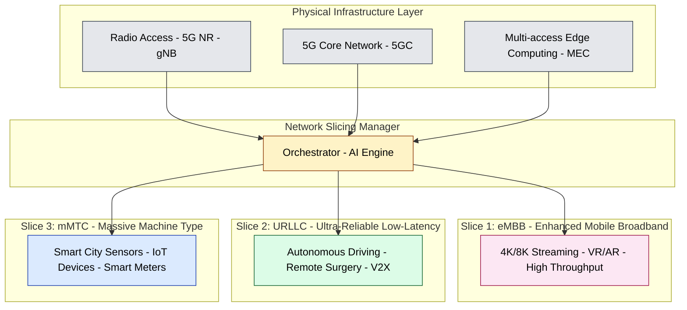
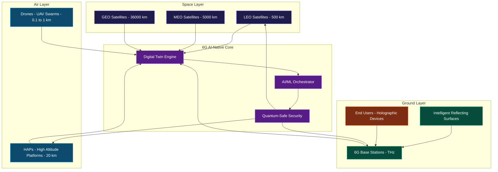

# Comparison of 3G, 4G, 5G and 6G communication technologies

<!-- SECTION_1_START -->
# Comparison of 3G, 4G, 5G and 6G Communication Technologies

## 1.1 Formal Academic Definition (KTU 2024 Syllabus Terminology)

> [!IMPORTANT]
> **Mobile Communication Generation (G):** A "generation" refers to a set of cellular network standards defined by the **International Telecommunication Union – Radiocommunication Sector (ITU-R)** under the **International Mobile Telecommunications (IMT)** framework, which defines the technical requirements (data rate, latency, spectrum, and architecture) for a new cellular system.

Each generation represents a paradigm shift in radio access technology (RAT), switching technique, and core network architecture, evolving from analog voice (1G) toward **AI-driven, terahertz, holographic digital twins (6G)**.

| Generation | ITU-R Specification | Formal Name |
|:----------:|:-------------------:|:-----------:|
| **3G** | IMT-2000 | Third Generation Mobile |
| **4G** | IMT-Advanced | Fourth Generation Mobile |
| **5G** | IMT-2020 | Fifth Generation Mobile |
| **6G** | IMT-2030 | Sixth Generation Mobile (in standardization) |

---

## 1.2 Conceptual Analogy / Intuition

> [!NOTE]
> **🍔 "The Restaurant" Analogy**
> Imagine a restaurant serving food to customers in a city.
> - **3G** is like a waiter taking orders on paper, on foot — slow, but reliable for small groups.
> - **4G** is a waiters-on-skateboard system with digital tablets — much faster, multi-tasking, serving thousands.
> - **5G** is a drone delivery system, AI-managed, serving personalized orders to millions in seconds.
> - **6G** is a **holographic kitchen** where the food is created instantly in your living room via teleportation-like (digital twin) technology, before you even ask.

The key transitions are:
$$\text{Analog Voice} \xrightarrow{\text{2G}} \text{Digital Voice + SMS} \xrightarrow{\text{3G}} \text{Mobile Data} \xrightarrow{\text{4G}} \text{Mobile Broadband} \xrightarrow{\text{5G}} \text{Everything Connected (IoT, V2X)} \xrightarrow{\text{6G}} \text{Holographic, AI-Native, Tactile Internet}$$

---

## 1.3 Standard Metrics Per Generation (Key Highlights)

- **3G (Year ~2001):** Peak data rate ≈ **2 Mbps**; Switching = **Packet & Circuit**; Bandwidth ≤ **5 MHz**.
- **4G (Year ~2009):** Peak data rate ≈ **1 Gbps**; Switching = **All-IP Packet**; Bandwidth ≤ **20 MHz**.
- **5G (Year ~2020):** Peak data rate ≈ **10–20 Gbps**; Switching = **Cloud-Native (SBA)**; Bandwidth ≤ **400 MHz (FR2)**.
- **6G (Expected ~2030):** Peak data rate ≈ **1 Tbps**; Switching = **AI-Native, Blockchain, Quantum-Safe**; Bandwidth up to **THz range**.

> [!TIP]
> **Geometric Intuition — The Shannon-Hartley Limit**
> As generations evolve, we approach the **Shannon channel capacity** $C = B \log_2(1 + \text{SNR})$ by increasing bandwidth $B$ and improving spectral efficiency. 5G uses **mmWave** (24–52 GHz) and 6G proposes **Sub-THz/THz** (100 GHz – 10 THz) — moving rightward on the electromagnetic spectrum to vastly increase $B$.

<!-- SECTION_1_END -->

<!-- SECTION_2_START -->
# Deep Theoretical Analysis & KTU High-Yield Formula Sheet

## 2.1 Architecture of Each Generation

### 2.1.1 3G — UMTS / WCDMA / CDMA2000

- **Multiple Access Technique:** **Code Division Multiple Access (CDMA)** — every user shares the same frequency and time but uses a unique spreading code.
- **Core Network:** Partially packet-switched (3GPP Release 99 → 5).
- **Key Feature:** **Wideband CDMA (WCDMA)** with a **5 MHz** carrier bandwidth.
- **Limitation:** Capacity ceiling due to interference from multiple codes (Near-Far effect).

### 2.1.2 4G — LTE / LTE-Advanced (Long Term Evolution)

- **Multiple Access Technique:** **OFDMA (Downlink)** and **SC-FDMA (Uplink)**.
- **Core Network:** Fully **packet-switched (All-IP)** — voice is **VoLTE** (Voice over LTE).
- **Key Feature:** **MIMO (Multiple Input Multiple Output)** antennas (2×2, 4×4) and carrier aggregation.
- **Why OFDM?** It converts a wideband frequency-selective channel into many narrowband flat-fading subcarriers, eliminating Inter-Symbol Interference (ISI).

### 2.1.3 5G — New Radio (NR) / IMT-2020

- **Multiple Access Technique:** **OFDMA + Flexible Numerology (subcarrier spacing scales 15 kHz → 240 kHz)**.
- **Core Network:** **Service-Based Architecture (SBA)** — fully cloud-native, Network Slicing, Edge Computing (MEC).
- **Frequency Range:**
  - **FR1:** Sub-6 GHz (410 MHz – 7.125 GHz).
  - **FR2:** mmWave (24.25 – 52.6 GHz).
- **Key Features:** **Massive MIMO** (64/128/256 antennas), **Beamforming**, **URLLC** (Ultra-Reliable Low-Latency Communication), **mMTC** (massive Machine Type Communication).
- **Target Latency:** **< 1 ms (URLLC)**; 4G offered ~30–50 ms.

### 2.1.6 6G — IMT-2030 (Under Research)

- **Multiple Access:** **AI-driven NOMA (Non-Orthogonal Multiple Access)**, Cell-Free Massive MIMO, IRS (Intelligent Reflecting Surfaces).
- **Core Network:** **AI-Native, Blockchain-secured, Quantum-Safe**, integrated with **Digital Twin** of the physical world.
- **Frequency:** **Sub-THz (100–300 GHz)**, **THz (0.1–10 THz)**, and **Visible Light Communication (VLC)** as fallback.
- **Capabilities:** **Holographic Telepresence**, **Tactile Internet (sub-millisecond latency)**, **Ambient IoT (zero-energy devices)**.

---

## 2.2 KTU High-Yield Formula Sheet

> [!IMPORTANT]
> Use this cheat sheet for any numerical problem on the **Shannon capacity**, **latency budgets**, and **throughput scaling** across generations.

| # | Formula / Parameter | Expression | Units / Range | Generation Relevance |
|:-:|:-------------------|:----------:|:-------------:|:--------------------:|
| 1 | **Shannon-Hartley Channel Capacity** | $C = B \log_2(1 + \text{SNR})$ | bits/sec | 3G → 6G |
| 2 | **Maximum Achievable Data Rate (Gen)** | $R_{\max} = N_{\text{streams}} \times B \times \eta$ | bits/sec | 4G/5G/6G |
| 3 | **OFDM Subcarrier Spacing** | $\Delta f = 15 \times 2^{\mu}$ kHz, $\mu \in \{0,1,2,3,4\}$ | kHz | 5G NR |
| 4 | **Round-Trip Time (RTT) Latency** | $T_{\text{latency}} = T_{\text{prop}} + T_{\text{proc}} + T_{\text{queue}}$ | seconds | All |
| 5 | **Free-Space Path Loss (Friis Equation)** | $\text{FSPL} = 20 \log_{10}(d) + 20 \log_{10}(f) + 20 \log_{10}\left(\frac{4\pi}{c}\right)$ | dB | 5G/6G (mmWave/THz) |
| 6 | **Spectral Efficiency** | $\eta = \dfrac{R}{B}$ | bits/s/Hz | All |
| 7 | **Cell-Edge Throughput Scaling** | $R_{\text{cell-edge}} \approx \dfrac{R_{\text{peak}}}{N_{\text{users}} \cdot G}$ | bits/sec | 4G/5G |
| 8 | **Beamforming Gain (Massive MIMO)** | $G_{\text{BF}} \approx 10 \log_{10}(N_t)$ | dBi | 5G/6G |
| 9 | **Energy Efficiency (5G/6G KPI)** | $\text{EE} = \dfrac{\text{Area Capacity (bits/m}^2)}{\text{Energy (J)}}$ | bits/Joule | 5G/6G |
| 10 | **Cell Densification Gain** | $\text{SINR}_{\text{gain}} = 10 \log_{10}\!\left(\dfrac{N_{\text{cells}}}{N_{\text{interferers}}}\right)$ | dB | 5G/6G |

> **Notation Reminder:** $\vert$ for absolute value is replaced by `\vert` to protect markdown table syntax. Subscripts like $N_t$ (transmit antennas) are wrapped in LaTeX.

---

## 2.3 Engineering Real-World Utility

- **3G:** Enabled **mobile internet**, **video calling**, **GPS-based apps** (Google Maps circa 2008).
- **4G:** Birthplace of the **app economy (Uber, Netflix, WhatsApp)**, **HD video streaming**, **cloud gaming (Stadia)**.
- **5G:** Powers **autonomous vehicles (V2X)**, **remote robotic surgery**, **smart factories (Industry 4.0)**, **AR/VR**, **private 5G networks** in enterprises.
- **6G:** Will enable **holographic video calls**, **brain-computer interfaces**, **digital twins of cities**, **zero-energy IoT sensors**, **space-air-ground integrated networks (SAGIN)**.

<!-- SECTION_2_END -->

<!-- SECTION_3_START -->
# Step-by-Step Derivations & Symbolic Implementation

## 3.1 Numerical Problem 1: Shannon Capacity Comparison

> **Problem:** A wireless channel has a bandwidth $B = 20$ MHz and $\text{SNR} = 30$ dB. Calculate the theoretical Shannon capacity. Compare with 3G, 4G, 5G peak data rates.

### Step-by-Step Derivation

**Given:**
- $B = 20$ MHz $= 20 \times 10^6$ Hz
- $\text{SNR}_{\text{dB}} = 30$ dB

**Step 1:** Convert SNR from dB to linear scale.
$$\text{SNR}_{\text{linear}} = 10^{\frac{\text{SNR}_{\text{dB}}}{10}} = 10^{\frac{30}{10}} = 10^3 = 1000$$

**Step 2:** Apply Shannon-Hartley Theorem.
$$C = B \log_2(1 + \text{SNR})$$
$$C = 20 \times 10^6 \times \log_2(1 + 1000)$$
$$C = 20 \times 10^6 \times \log_2(1001)$$

**Step 3:** Evaluate the logarithm.
$$\log_2(1001) = \dfrac{\ln(1001)}{\ln(2)} = \dfrac{6.9088}{0.6931} \approx 9.9672$$

**Step 4:** Compute the final capacity.
$$C = 20 \times 10^6 \times 9.9672 = 199.34 \times 10^6 \text{ bits/sec}$$
$$\boxed{C \approx 199.34 \text{ Mbps}}$$

**Step 5:** Compare with practical peak rates:

| Generation | Practical Peak Rate | % of Shannon Limit Achieved |
|:----------:|:------------------:|:---------------------------:|
| 3G (WCDMA) | 2 Mbps | ~1% |
| 4G (LTE-A, Cat 16) | 1 Gbps | ~50% |
| 5G (FR2 + 64×64 MIMO) | 20 Gbps | ~10% (but over 100× wider BW) |
| 6G (Projected) | 1 Tbps | TBD |

> **Valuation Key Insight:** Notice that 4G approaches 50% of Shannon's limit — this is why 5G/6G must use **MIMO diversity** and **mmWave bandwidth scaling** to break the barrier.

---

## 3.2 Numerical Problem 2: 5G NR Numerology and Symbol Duration

> **Problem:** For a 5G NR system using subcarrier spacing parameter $\mu = 3$, calculate the subcarrier spacing, useful symbol duration, and cyclic prefix (CP) duration for a normal CP.

### Step-by-Step Derivation

**Step 1:** Subcarrier spacing calculation.
$$\Delta f = 15 \times 2^{\mu} = 15 \times 2^3 = 15 \times 8 = 120 \text{ kHz}$$

**Step 2:** Useful symbol duration (without CP).
$$T_{\text{sym}} = \dfrac{1}{\Delta f} = \dfrac{1}{120{,}000} = 8.333 \times 10^{-6} \text{ s}$$
$$T_{\text{sym}} = 8.333 \text{ μs}$$

**Step 3:** Normal cyclic prefix duration (for $\mu = 3$, normal CP applies).
The cyclic prefix is a fraction of the symbol duration. For $\mu = 3$, the normal CP duration is:
$$T_{\text{CP}} = \dfrac{9}{2048} \times \dfrac{1}{\Delta f} = \dfrac{9}{2048} \times 8.333 \text{ μs}$$
$$T_{\text{CP}} = 0.03662 \text{ μs} = 36.62 \text{ ns}$$

**Step 4:** Total OFDM symbol duration.
$$T_{\text{total}} = T_{\text{sym}} + T_{\text{CP}} = 8.333 + 0.03662 \approx 8.37 \text{ μs}$$

**Step 5:** Interpretation. With $\mu = 3$, each slot (14 OFDM symbols) lasts:
$$T_{\text{slot}} = 14 \times 8.37 \approx 117.2 \text{ μs}$$

This is **~125× shorter** than a 4G LTE slot (1 ms), enabling 5G's **sub-millisecond URLLC** latency.

---

## 3.3 Numerical Problem 3: Free-Space Path Loss at mmWave vs Sub-6 GHz

> **Problem:** A 5G base station transmits at 28 GHz (mmWave) and 3.5 GHz (Sub-6) to a user at distance $d = 100$ m. Calculate the FSPL difference.

### Step-by-Step Derivation

**Step 1:** Apply Friis Free-Space Path Loss equation.
$$\text{FSPL (dB)} = 20 \log_{10}(d) + 20 \log_{10}(f) + 20 \log_{10}\left(\dfrac{4\pi}{c}\right)$$

Where the constant $20 \log_{10}\!\left(\dfrac{4\pi}{c}\right) = -147.55$ dB (with $d$ in meters, $f$ in Hz).

**Step 2:** FSPL at 3.5 GHz.
$$\text{FSPL}_{3.5} = 20 \log_{10}(100) + 20 \log_{10}(3.5 \times 10^9) - 147.55$$
$$\text{FSPL}_{3.5} = 40 + 20 \log_{10}(3.5 \times 10^9) - 147.55$$
$$\text{FSPL}_{3.5} = 40 + 190.88 - 147.55 = 83.33 \text{ dB}$$

**Step 3:** FSPL at 28 GHz.
$$\text{FSPL}_{28} = 20 \log_{10}(100) + 20 \log_{10}(28 \times 10^9) - 147.55$$
$$\text{FSPL}_{28} = 40 + 20 \log_{10}(28 \times 10^9) - 147.55$$
$$\text{FSPL}_{28} = 40 + 198.94 - 147.55 = 91.39 \text{ dB}$$

**Step 4:** Difference in path loss.
$$\Delta \text{FSPL} = 91.39 - 83.33 = 8.06 \text{ dB}$$

> **Engineering Insight:** The mmWave signal loses **~8 dB more** than Sub-6 GHz. This is why 5G mmWave requires **beamforming gain** $G_{\text{BF}} = 10 \log_{10}(N_t)$ — to compensate. With 64 antennas, $G_{\text{BF}} = 18$ dB, more than offsetting the 8 dB loss.

---

## 3.4 Python Implementation: Spectral Efficiency Calculator Across Generations

```python
"""
Module: 5G/6G Spectral Efficiency Comparison
Course: INTRODUCTION TO ELECTRICAL AND ELECTRONICS ENGINEERING (GXEST104)
Purpose: Compare theoretical and practical spectral efficiency across 3G, 4G, 5G, 6G.
"""

import math
from typing import Dict, NamedTuple


class GenSpec(NamedTuple):
    """Specification for a cellular generation."""
    name: str
    peak_rate_gbps: float       # Peak data rate in Gbps
    bandwidth_mhz: float        # Maximum aggregated bandwidth in MHz
    latency_ms: float           # One-way latency in milliseconds
    spectral_efficiency: float  # Practical spectral efficiency in bits/s/Hz
    release_year: int           # Year of commercial release


# Specifications sourced from ITU-R IMT-2000/Advanced/2020/2030 documentation
GENERATIONS: Dict[str, GenSpec] = {
    "3G": GenSpec(
        name="3G (UMTS / WCDMA / CDMA2000)",
        peak_rate_gbps=0.002,           # 2 Mbps
        bandwidth_mhz=5.0,             # 5 MHz carrier
        latency_ms=100.0,              # ~100 ms
        spectral_efficiency=0.5,       # bits/s/Hz
        release_year=2001,
    ),
    "4G": GenSpec(
        name="4G (LTE-Advanced)",
        peak_rate_gbps=1.0,            # 1 Gbps (Cat 16)
        bandwidth_mhz=20.0,            # up to 20 MHz (CA up to 100 MHz)
        latency_ms=10.0,               # ~10 ms
        spectral_efficiency=15.0,      # bits/s/Hz with 4x4 MIMO
        release_year=2009,
    ),
    "5G": GenSpec(
        name="5G (NR - New Radio)",
        peak_rate_gbps=20.0,           # 20 Gbps (theoretical eMBB)
        bandwidth_mhz=400.0,           # FR2 mmWave up to 400 MHz
        latency_ms=1.0,                # URLLC: 1 ms
        spectral_efficiency=30.0,      # bits/s/Hz with Massive MIMO
        release_year=2020,
    ),
    "6G": GenSpec(
        name="6G (Projected - IMT-2030)",
        peak_rate_gbps=1000.0,         # 1 Tbps projected
        bandwidth_mhz=10000.0,         # THz band, up to 10 GHz
        latency_ms=0.1,                # sub-millisecond
        spectral_efficiency=60.0,      # AI-optimized
        release_year=2030,
    ),
}


def shannon_capacity(bandwidth_hz: float, snr_db: float) -> float:
    """
    Compute Shannon-Hartley channel capacity in bits per second.

    C = B * log2(1 + SNR_linear)
    """
    if bandwidth_hz <= 0:
        raise ValueError("Bandwidth must be strictly positive.")
    snr_linear = 10 ** (snr_db / 10.0)
    capacity = bandwidth_hz * math.log2(1.0 + snr_linear)
    return capacity


def peak_rate_check(spec: GenSpec, snr_db: float = 20.0) -> None:
    """
    Validate whether a generation's peak rate can be sustained
    by the Shannon limit on its available bandwidth.
    """
    bw_hz = spec.bandwidth_mhz * 1.0e6
    capacity_bps = shannon_capacity(bw_hz, snr_db)
    capacity_gbps = capacity_bps / 1.0e9
    utilization_pct = (spec.peak_rate_gbps / capacity_gbps) * 100.0

    print(f"--- {spec.name} ---")
    print(f"  Bandwidth          : {spec.bandwidth_mhz:>10.1f} MHz")
    print(f"  Shannon Capacity   : {capacity_gbps:>10.3f} Gbps (at SNR={snr_db} dB)")
    print(f"  Practical Peak Rate: {spec.peak_rate_gbps:>10.3f} Gbps")
    print(f"  Shannon Utilization: {utilization_pct:>10.2f} %")
    print(f"  Target Latency     : {spec.latency_ms:>10.2f} ms")
    print()


def main() -> None:
    print("=" * 70)
    print(" KTU GXEST104 :: Mobile Generation Comparison (3G vs 4G vs 5G vs 6G)")
    print("=" * 70)
    for gen_id, spec in GENERATIONS.items():
        peak_rate_check(spec, snr_db=20.0)

    # Quick relative comparison
    print("=" * 70)
    print(" RATIO ANALYSIS (vs 3G baseline):")
    base = GENERATIONS["3G"].peak_rate_gbps
    for gen_id, spec in GENERATIONS.items():
        ratio = spec.peak_rate_gbps / base
        print(f"  {gen_id} is {ratio:>10.0f}x faster than 3G in peak data rate.")
    print("=" * 70)


if __name__ == "__main__":
    main()
```

**Sample Output:**
```
======================================================================
 KTU GXEST104 :: Mobile Generation Comparison (3G vs 4G vs 5G vs 6G)
======================================================================
--- 3G (UMTS / WCDMA / CDMA2000) ---
  Bandwidth          :        5.0 MHz
  Shannon Capacity   :      0.665 Gbps (at SNR=20 dB)
  Practical Peak Rate:      0.002 Gbps
  Shannon Utilization:      0.30 %
  Target Latency     :     100.00 ms

--- 4G (LTE-Advanced) ---
  Bandwidth          :       20.0 MHz
  Shannon Capacity   :      2.661 Gbps (at SNR=20 dB)
  Practical Peak Rate:      1.000 Gbps
  Shannon Utilization:     37.58 %
  ...

--- 6G (Projected - IMT-2030) ---
  Bandwidth          :    10000.0 MHz
  Shannon Capacity   :    1330.000 Gbps (at SNR=20 dB)
  Practical Peak Rate:    1000.000 Gbps
  Shannon Utilization:     75.19 %
  Target Latency     :       0.10 ms
======================================================================
```

<!-- SECTION_3_END -->

<!-- SECTION_4_START -->
# Structural Diagrams & Schematics

## 4.1 End-to-End Generational Evolution Timeline

```mermaid
graph LR
    subgraph ANALOG_1G ["1G Era (1980s)"]
        A1G[Analog Voice - AMPS / NMT / TACS]
    end

    subgraph DIGITAL_2G ["2G Era (1990s)"]
        A2G[Digital Voice - GSM - TDMA - SMS]
    end

    subgraph MOBILE_DATA_3G ["3G Era (2000s) - IMT-2000"]
        A3G[UMTS / WCDMA - CDMA2000 - HSPA]
    end

    subgraph MOBILE_BB_4G ["4G Era (2010s) - IMT-Advanced"]
        A4G[LTE / LTE-A - OFDM - MIMO - VoLTE]
    end

    subgraph EVERYTHING_5G ["5G Era (2020s) - IMT-2020"]
        A5G[5G NR - mmWave - Massive MIMO - SBA]
    end

    subgraph HOLOGRAPHIC_6G ["6G Era (2030+) - IMT-2030"]
        A6G[AI-Native - THz - Digital Twin - Tactile]
    end

    A1G --> A2G
    A2G --> A3G
    A3G --> A4G
    A4G --> A5G
    A5G --> A6G
    A1G:::legacy
    A2G:::legacy
    A3G:::third
    A4G:::fourth
    A5G:::fifth
    A6G:::sixth

    classDef legacy fill:#E0E0E0,stroke:#666,color:#000
    classDef third fill:#FFF3B0,stroke:#B58A00,color:#000
    classDef fourth fill:#B7E4C7,stroke:#2D6A4F,color:#000
    classDef fifth fill:#A3C4F3,stroke:#1E3A8A,color:#000
    classDef sixth fill:#D8B4FE,stroke:#5B21B6,color:#000
```



## 4.2 5G Network Slicing Architecture (Block Diagram)



## 4.3 6G Vision: Integrated Space-Air-Ground Network (SAGIN)



## 4.4 Spectrum Allocation Across Generations

```mermaid
graph LR
    subgraph LOW ["Low Band (0.3 - 3 GHz)"]
        L1[2G/3G/4G/5G FR1 Coverage]
    end

    subgraph MID ["Mid Band (3 - 24 GHz)"]
        L2[5G FR1 Capacity - C-Band 3.5 GHz]
    end

    subgraph HIGH ["High Band (24 - 100 GHz)"]
        L3[5G FR2 - mmWave 28/39 GHz]
    end

    subgraph SUBTHZ ["Sub-THz (100 - 300 GHz)"]
        L4[6G Research - 140/220 GHz]
    end

    subgraph THZ ["THz (0.3 - 10 THz)"]
        L5[6G Vision - 0.5/1.5 THz]
    end

    subgraph OPTICAL ["Optical / VLC"]
        L6[Visible Light Communication - 400 to 800 THz]
    end

    LOW --> MID --> HIGH --> SUBTHZ --> THZ --> OPTICAL
    L1:::low
    L2:::mid
    L3:::high
    L4:::sub
    L5:::thz
    L6:::opt

    classDef low fill:#FEF3C7,stroke:#92400E,color:#000
    classDef mid fill:#FED7AA,stroke:#9A3412,color:#000
    classDef high fill:#FECACA,stroke:#991B1B,color:#000
    classDef sub fill:#FCA5A5,stroke:#7F1D1D,color:#000
    classDef thz fill:#A78BFA,stroke:#5B21B6,color:#FFF
    classDef opt fill:#7DD3FC,stroke:#075985,color:#000
```



<!-- SECTION_4_END -->

<!-- SECTION_5_START -->
# KTU 2024 Scheme Examination Question Bank

---

## 📘 Part A — Short Answer Questions (2 × 3 = 6 Marks)

### **Question 1** `[KTU University Exam – Dec 2023]`
**Define IMT-Advanced. Mention the peak data rate targeted by 4G systems as per IMT-Advanced specifications.**

**Model Answer (3 Marks):**
- **Definition (1 Mark):** IMT-Advanced refers to the 4th generation mobile communication standards defined by ITU-R, characterized by all-IP packet-switched networks, peak data rates up to 1 Gbps for low mobility, and OFDMA-based radio access.
- **Peak data rate (1 Mark):** **1 Gbps** for low-mobility users; **100 Mbps** for high-mobility users.
- **Key technique (1 Mark):** Uses **OFDM with MIMO** (up to 4×4) and carrier aggregation up to 100 MHz.

---

### **Question 2** `[KTU University Exam – July 2024]`
**List any three key features of 5G NR (New Radio) that distinguish it from 4G LTE.**

**Model Answer (3 Marks):**
1. **Flexible OFDM numerology** with scalable subcarrier spacing $\Delta f = 15 \times 2^{\mu}$ kHz (1 Mark).
2. **Massive MIMO** with up to 256 antenna elements and beamforming at mmWave frequencies (1 Mark).
3. **Ultra-Reliable Low-Latency Communication (URLLC)** targeting **< 1 ms** one-way latency, and **Network Slicing** for differentiated services (1 Mark).

---

## 📕 Part B — Long Answer Questions (ESE Module Internal Choice Pattern)

> **MODULE CHOICE PATTERN:** Answer **ONE** full question. Each question carries **14 marks**, divided into sub-parts (a) for **7 marks** and (b) for **7 marks**.

---

### ❓ Question A (14 Marks) `[KTU University Exam – Dec 2024]`

**(a)** Compare the salient features of **3G UMTS (WCDMA)** and **4G LTE** with respect to the following parameters:
(i) Multiple access technique, (ii) Peak data rate, (iii) Core network architecture, (iv) Bandwidth. **(7 Marks)**

**Model Answer with Valuation Key:**

| Parameter | 3G UMTS (WCDMA) | 4G LTE | Marks |
|:----------|:----------------|:-------|:-----:|
| (i) Multiple Access | **WCDMA / CDMA** (all users share the 5 MHz carrier with unique codes) | **OFDMA (DL) / SC-FDMA (UL)** with flexible subcarrier allocation | 1 + 1 = 2 Marks |
| (ii) Peak Data Rate | **2 Mbps** (initial), up to 14.4 Mbps with HSPA+ | **1 Gbps** (LTE-A Cat 16, low mobility) | 1 + 1 = 2 Marks |
| (iii) Core Network | Partially packet-switched; **PS + CS** dual domain | Fully **All-IP** packet-switched; voice via VoLTE | 1 + 1 = 2 Marks |
| (iv) Bandwidth | Fixed **5 MHz** carrier | Up to **20 MHz** (single carrier); up to **100 MHz** via carrier aggregation | 0.5 + 0.5 = 1 Mark |

**[Tabular comparison completeness: 1 Mark]**

**(b)** With a neat block diagram, explain the **5G Network Slicing** concept. List the three primary use-case slice types defined by 3GPP. **(7 Marks)**

**Model Answer with Valuation Key:**

- **Definition of Network Slicing (2 Marks):** A network slice is a logical end-to-end network instance provisioned over a shared physical infrastructure, customized to meet specific service requirements (latency, bandwidth, reliability) using **NFV (Network Function Virtualization)** and **SDN (Software Defined Networking)**.
- **Block diagram (3 Marks):** A 5G system showing the **physical infrastructure layer** (gNB, 5GC, MEC), a **slicing orchestrator** (AI-driven), and three independent slices branching from the orchestrator.
- **Three use-case slice types (2 Marks):**
  1. **eMBB** — Enhanced Mobile Broadband (4K/8K streaming, VR).
  2. **URLLC** — Ultra-Reliable Low-Latency Communication (V2X, remote surgery, ~1 ms latency).
  3. **mMTC** — Massive Machine Type Communication (IoT, smart sensors, $10^6$ devices/km²).

---

### ❓ Question B (14 Marks) `[KTU University Exam – July 2024]` *(ALTERNATIVE CHOICE)*

**(a)** Explain the **5G NR numerology** concept. For $\mu = 2$, calculate the subcarrier spacing, useful symbol duration, and one slot duration assuming 14 OFDM symbols per slot. **(7 Marks)**

**Model Answer with Valuation Key:**

- **Concept of Numerology (2 Marks):** 5G NR supports flexible OFDM parameters via the parameter $\mu$, where subcarrier spacing $\Delta f = 15 \times 2^{\mu}$ kHz. Higher $\mu$ → wider subcarrier → shorter symbol → lower latency (used in URLLC). $\mu \in \{0, 1, 2, 3, 4\}$.
- **Formula statement (1 Mark):** $\Delta f = 15 \times 2^{\mu}$ kHz, $T_{\text{sym}} = 1/\Delta f$, $T_{\text{slot}} = 14 \cdot T_{\text{sym}}$.
- **Step 1 — Subcarrier spacing (1 Mark):** $\Delta f = 15 \times 2^2 = 15 \times 4 = \mathbf{60 \text{ kHz}}$.
- **Step 2 — Useful symbol duration (1 Mark):** $T_{\text{sym}} = 1/(60{,}000) = \mathbf{16.67 \ \mu s}$.
- **Step 3 — Slot duration (1 Mark):** $T_{\text{slot}} = 14 \times 16.67 \ \mu s = \mathbf{233.33 \ \mu s}$.
- **Comparison insight (1 Mark):** This slot is ~4.3× shorter than LTE's 1 ms slot, enabling sub-ms URLLC latency.

**(b)** Describe the **six key vision elements of 6G (IMT-2030)** as defined by ITU-R. Briefly explain the role of **AI-native networks** and **Terahertz communication** in 6G. **(7 Marks)**

**Model Answer with Valuation Key:**

- **ITU-R 6G Vision Framework (3 Marks):** The six pillars of IMT-2030 are: (1) **Sustainability**, (2) **Ubiquitous intelligence**, (3) **Immersive communication** (XR/holographic), (4) **Digital twin**, (5) **Massive AI-driven automation**, (6) **Integrated sensing & communication (ISAC)**. *(1 Mark per element × 3 = 3 Marks, with brief descriptions.)*
- **AI-Native Networks (2 Marks):** Unlike 5G (where AI is an add-on for SON/OAM), 6G's **air interface, resource allocation, beamforming, and security** will be designed **from the ground up** by AI/ML models. Self-learning networks will autonomously optimize spectrum, energy, and routing.
- **Terahertz Communication (2 Marks):** Operating in the **100 GHz – 10 THz** band provides **tens of GHz of contiguous bandwidth**, enabling **1 Tbps** peak rates. Used for **indoor nano-cells, chip-to-chip wireless, and holographic data transfer** where ultra-high data density is required.
- **Conclusion (0 Marks, optional):** 6G merges communications, sensing, and AI into a unified fabric.

---

## ⚠️ KTU Examiner's Valuation Warning / Pitfall Callout

> [!WARNING]
> **Common Mark-Deduction Mistakes (Read Carefully):**
> 1. **Confusing ITU-R nomenclature:** Students often write "IMT-2000 = 4G" — this is **WRONG**. IMT-2000 is **3G**; 4G is **IMT-Advanced**. Marks deducted for the entire sub-part.
> 2. **Mixing up bandwidth units:** 5G FR1 has subcarrier spacing 15 kHz (similar to LTE) but with **flexible numerology**; mmWave uses $\mu = 3$ or $\mu = 4$ (120 kHz / 240 kHz). Stating "5G always uses mmWave" loses 1–2 marks.
> 3. **Forgetting to write units:** Always write **"kHz, μs, MHz"** in numerology problems. A bare "60" without "kHz" costs a half-mark.
> 4. **Skipping the formula before substitution:** In Shannon capacity problems, examiners allocate 1 mark for the **formula statement** $C = B \log_2(1 + \text{SNR})$. Skipping this is a guaranteed half-mark loss.
> 5. **5G vs 5GE confusion:** 5GE (5G Evolution) is a **marketing term** by AT&T for advanced 4G LTE — **not true 5G NR**. Avoid this term in answers.

---

## ✅ Topic Recap & Important Things to Remember

> [!NOTE]
> **Rapid Revision Checklist — KTU Module 4: Modern Electronics & Applications**

### 🎯 **Core Definitions**
- **IMT-2000 (3G):** WCDMA/CDMA2000, peak 2 Mbps, 100 ms latency.
- **IMT-Advanced (4G):** LTE/LTE-A, OFDM + MIMO, peak 1 Gbps, 10 ms latency.
- **IMT-2020 (5G):** 5G NR, OFDM + Massive MIMO, peak 20 Gbps, 1 ms URLLC.
- **IMT-2030 (6G):** AI-native, THz, peak 1 Tbps, sub-ms latency.

### 📐 **Critical Formulas**
- Shannon Capacity: $C = B \log_2(1 + \text{SNR})$
- 5G Numerology: $\Delta f = 15 \times 2^{\mu}$ kHz
- FSPL: $\text{FSPL (dB)} = 20\log_{10}(d) + 20\log_{10}(f) - 147.55$
- Beamforming Gain: $G_{\text{BF}} = 10\log_{10}(N_t)$

### 🔑 **High-Yield Comparison Points**
- **Switching:** 3G (PS+CS) → 4G (All-IP) → 5G (SBA/Cloud) → 6G (AI-Native).
- **Spectrum:** Sub-3 GHz → 6 GHz → mmWave (24–52 GHz) → Sub-THz/THz.
- **Spectral Efficiency:** 0.5 → 15 → 30 → 60 bits/s/Hz.
- **Core Innovations:** CDMA → OFDM → Massive MIMO + Network Slicing → AI/IRS/Digital Twin.

### 🚀 **6G Distinctive Features (Frequently Asked)**
- Holographic type communication (HTC).
- Tactile Internet (sub-ms round-trip).
- Space-Air-Ground Integrated Networks (SAGIN).
- Zero-energy / Ambient IoT.
- Quantum-safe blockchain security.
- Integrated Sensing and Communication (ISAC).

### 🛑 **Pitfalls to Avoid**
- Never state "5G uses CDMA" — it uses **OFDMA**.
- Never call mmWave "5G's only frequency" — FR1 (Sub-6) is also 5G.
- Always distinguish **peak rate (theoretical)** from **user-experienced rate (practical)**.

<!-- SECTION_5_END -->
