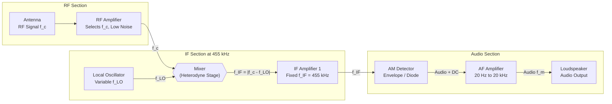
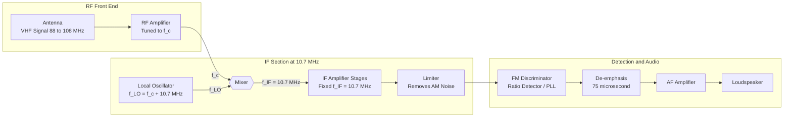
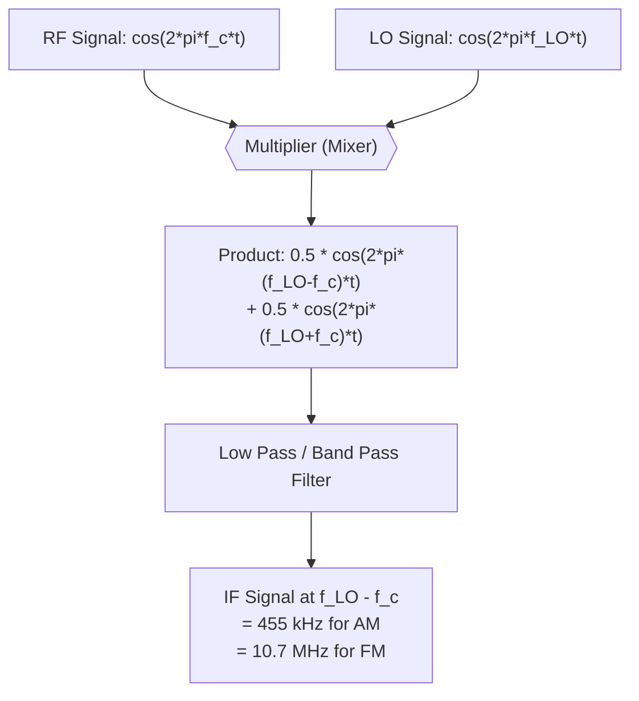

# Concept of AM and FM (No derivation required), Block diagram of AM and FM super-heterodyne receiver

<!-- SECTION_1_START -->

# Module 4 — Modern Electronics and Applications
## Topic: Concept of AM and FM & Block Diagram of AM and FM Super-Heterodyne Receiver

---

### 1. Core Technical Definition & Intuitive Overview

#### 1.1 Amplitude Modulation (AM)

**Formal Definition (KTU Syllabus Terminology):**
> [!IMPORTANT]
> **Amplitude Modulation (AM)** is a modulation technique used in electronic communication, most commonly for transmitting information via a radio carrier wave. The amplitude of the carrier wave is varied in proportion to that of the message signal being transmitted, while the **frequency** and **phase** of the carrier remain constant.

Mathematically, an AM signal is represented as:

$$
s_{AM}(t) = A_c \left[ 1 + m_a \, x_m(t) \right] \cos(2 \pi f_c t)
$$

where:
- $A_c$ = Amplitude of the carrier signal (in volts)
- $m_a$ = Modulation index (dimensionless, $0 \le m_a \le 1$ for standard AM)
- $x_m(t)$ = Normalized message/modulating signal
- $f_c$ = Frequency of the carrier (in Hz)
- $t$ = Time (in seconds)

**Key Parameters in AM:**
- **Modulation Index ($m_a$):** The ratio of peak amplitude of the modulating signal to the peak amplitude of the carrier. $m_a = \dfrac{A_m}{A_c}$
- **Bandwidth of AM:** $BW_{AM} = 2 f_m$ (twice the highest modulating frequency)
- **Carrier Frequency ($f_c$):** Must be much higher than the modulating frequency $f_m$

> [!NOTE]
> **KTU High-Yield Point:** For the **GXEST104** syllabus, students are NOT required to derive the AM/FM equations, but they MUST know the standard mathematical form, identify each term, and sketch the waveforms (carrier, modulating signal, and modulated signal).

#### 1.2 Frequency Modulation (FM)

**Formal Definition (KTU Syllabus Terminology):**
> [!IMPORTANT]
> **Frequency Modulation (FM)** is the encoding of information in a carrier wave by varying the instantaneous frequency of the wave, while keeping the **amplitude** constant. The amount by which the carrier frequency varies from its center value is proportional to the amplitude of the input modulating signal.

Mathematically, an FM signal is represented as:

$$
s_{FM}(t) = A_c \cos\!\left( 2 \pi f_c t + 2 \pi k_f \int_0^{t} x_m(\tau) \, d\tau \right)
$$

where:
- $A_c$ = Constant amplitude of the FM carrier
- $k_f$ = Frequency sensitivity of the modulator (Hz per volt)
- $f_c$ = Nominal/rest carrier frequency
- $x_m(t)$ = Message/modulating signal

**Key Parameters in FM:**
- **Frequency Deviation ($\Delta f$):** The maximum departure of the instantaneous frequency from the carrier frequency. $\Delta f = k_f \cdot A_m$
- **Modulation Index for FM ($\beta$):** $\beta = \dfrac{\Delta f}{f_m}$, where $f_m$ is the maximum modulating frequency
- **Bandwidth of FM (Carson's Rule):** $BW_{FM} = 2(\Delta f + f_m) = 2 f_m (\beta + 1)$

> [!NOTE]
> **KTU High-Yield Point:** AM changes the **height** of the carrier; FM changes the **spacing** (frequency) of the carrier peaks. AM is more susceptible to noise because most natural and man-made noise is amplitude-based, whereas FM is highly noise-immune.

#### 1.3 Conceptual Analogy / Intuition

| Concept | Real-World Analogy |
| :--- | :--- |
| **AM (Amplitude Modulation)** | Imagine a flashlight being carried by a person. The person walks at a **constant speed** (carrier frequency is fixed), but the **brightness** of the flashlight (carrier amplitude) goes up and down according to a signal — brighter when speaking, dimmer when silent. |
| **FM (Frequency Modulation)** | Imagine a train horn. The train moves at a **constant loudness** (carrier amplitude is fixed), but the **pitch** (frequency) of the horn changes — higher pitch when the train rushes toward you (signal high), lower pitch when moving away (signal low). |
| **Super-Heterodyne Receiver** | A smart translator sitting in a busy marketplace. Instead of trying to directly understand every vendor (different radio stations), it converts ALL vendors' voices to a **single, fixed low pitch** (Intermediate Frequency) that the listener can easily interpret. |

#### 1.4 GeoGebra / Desmos Integration

> [!VISUALIZATION CONTROL]
> **Concept:** AM and FM Waveform Visualization
> **GeoGebra / Desmos Input Equations:**
>
> * Carrier (pure): `f1(x) = 1 * cos(2 * pi * 0.1 * x)`
> * Modulating signal: `f2(x) = 0.5 * cos(2 * pi * 0.005 * x)`
> * AM signal: `f3(x) = (1 + 0.7 * cos(2 * pi * 0.005 * x)) * cos(2 * pi * 0.1 * x)`
> * FM signal (approx): `f4(x) = cos(2 * pi * 0.1 * x + 2 * sin(2 * pi * 0.005 * x))`
>
> **Visual Description:** On the $x$-axis (time), the AM signal `f3` will show a high-frequency cosine whose **envelope (outer boundary)** rises and falls exactly like the slow cosine `f2`. The FM signal `f4` will have a **constant peak height** of 1, but the **spacing between zero crossings** will compress and expand rhythmically, matching the peaks and troughs of the modulating signal.

---

<!-- SECTION_1_END -->

<!-- SECTION_2_START -->

### 2. Deep Theoretical Analysis & KTU High-Yield Formula Sheet

#### 2.1 Why We Need Modulation

> [!NOTE]
> **Syllabus Highlight:** Human voice and audio signals lie in the range of **20 Hz to 20 kHz**. If two stations broadcast raw audio at, say, 1 kHz and 1.1 kHz, their signals would **overlap** in the airwaves. Modulation shifts these low-frequency signals to high-frequency bands where they can be **separated, propagated efficiently via antennas, and assigned dedicated channels.**

**Key Reasons for Modulation:**
1. **Antenna Size Reduction:** A $\lambda/4$ antenna for a 1 kHz audio signal would be **75 km** long. Modulating to 1 MHz reduces it to a practical **75 m**.
2. **Multiplexing:** Allows many stations to share the airwaves by using different carrier frequencies.
3. **Noise Immunity:** FM offers much better signal-to-noise ratio (SNR) than AM.
4. **Long-Distance Propagation:** High-frequency carrier waves travel further via sky-wave and line-of-sight propagation.

#### 2.2 Comparison: AM vs FM

| Feature | AM (Amplitude Modulation) | FM (Frequency Modulation) |
| :--- | :--- | :--- |
| **Parameter varied** | Amplitude of carrier | Frequency of carrier |
| **Parameter held constant** | Frequency and phase | Amplitude and phase |
| **Modulation index** | $m_a = A_m / A_c$ (range 0 to 1) | $\beta = \Delta f / f_m$ (can exceed 1) |
| **Bandwidth** | $BW = 2 f_m$ (narrow) | $BW = 2(\Delta f + f_m)$ (wide) |
| **Noise immunity** | Poor (noise is amplitude-like) | Excellent (noise rejected by limiter) |
| **Signal-to-Noise Ratio** | Low (~40 dB typical) | High (~60–70 dB typical) |
| **Transmitter complexity** | Simple, cheap | Complex, expensive |
| **Receiver complexity** | Simple (envelope detector) | Complex (discriminator/PLL) |
| **Power efficiency** | Low (carrier carries no info) | High (all power carries info) |
| **Frequency allocation** | Crowded (535–1605 kHz) | Less crowded (88–108 MHz) |
| **Application** | Talk radio, aviation beacons, CB radio | FM radio broadcast, TV audio, two-way radio |
| **Famous Examples** | MW/SW radio, AIR (older) | All India Radio FM, Vividh Bharati, Radio Mirchi |

#### 2.3 KTU Formula Sheet / Cheat Sheet

> [!IMPORTANT]
> **Master this table. Every KTU 2024 question on modulation is solved using one or more of these formulas.**

| \# | Concept | Formula | Variable Definitions |
| :---: | :--- | :--- | :--- |
| 1 | AM signal equation | $s_{AM}(t) = A_c [1 + m_a \cos(2\pi f_m t)] \cos(2\pi f_c t)$ | $A_c$: carrier amp; $m_a$: mod index; $f_m$: message freq; $f_c$: carrier freq |
| 2 | AM modulation index | $m_a = \dfrac{A_m}{A_c}$ | $A_m$: peak msg amplitude |
| 3 | AM Bandwidth | $BW_{AM} = 2 f_m$ | $f_m$: highest message frequency |
| 4 | AM Total power | $P_t = P_c \left(1 + \dfrac{m_a^2}{2}\right)$ | $P_c$: carrier power |
| 5 | AM Carrier power | $P_c = \dfrac{A_c^2}{2 R}$ | $R$: antenna resistance (usually 50 $\Omega$) |
| 6 | AM Sideband power | $P_{SB} = \dfrac{m_a^2}{2} P_c$ | Sidebands carry actual information |
| 7 | FM signal equation | $s_{FM}(t) = A_c \cos\!\left(2\pi f_c t + 2\pi k_f \int x_m(t)\,dt\right)$ | $k_f$: freq sensitivity (Hz/V) |
| 8 | FM Frequency deviation | $\Delta f = k_f \cdot A_m$ | $A_m$: peak modulating amplitude |
| 9 | FM Modulation index | $\beta = \dfrac{\Delta f}{f_m}$ | $f_m$: max modulating frequency |
| 10 | FM Bandwidth (Carson's Rule) | $BW_{FM} = 2(\Delta f + f_m) = 2 f_m(\beta + 1)$ | Conservative bound capturing 98% of power |
| 11 | Super-heterodyne IF | $f_{IF} = \vert f_c - f_{LO} \vert$ | Standard IF for AM: **455 kHz**; for FM: **10.7 MHz** |

> [!NOTE]
> **Why these specific IFs?** The 455 kHz for AM and 10.7 MHz for FM are **international standards** fixed by convention. Designing the IF amplifier at a single fixed frequency is much easier than designing one amplifier that works at every possible station frequency.

#### 2.4 Real-World Engineering Utility

**Where AM is used in production systems today:**
- **Aviation communication** (VHF AM at 118–137 MHz) — chosen because aircraft receivers need to lock onto multiple ground stations without retuning.
- **Citizens Band (CB) Radio** at 27 MHz.
- **AM broadcast** at 540–1600 kHz (long-range, sky-wave propagation at night).
- **RFID tags** (passive backscatter modulation).

**Where FM is used in production systems today:**
- **FM radio broadcast** at 88–108 MHz (VHF Band II).
- **Two-way walkie-talkies, police radios, marine communication**.
- **FM synthesisers** in musical instruments (Yamaha DX7, etc.).
- **Wireless microphones, baby monitors**.
- **Aircraft VOR navigation beacons** (FM-based).

> [!NOTE]
> **KTU Real-World Tie-In:** The reason India moved AIR to FM in the 1990s and 2000s is precisely the noise-immunity advantage. In dense cities, AM suffers heavily from electrical interference (auto-rickshaw ignitions, motor noise), but FM gives crystal-clear stereo audio.

---

<!-- SECTION_2_END -->

<!-- SECTION_3_START -->

### 3. Step-by-Step Derivations, Sketches & Code/Symbolic Implementation

#### 3.1 The Need for Super-Heterodyne Receiver (Why Direct Reception Fails)

> [!NOTE]
> **KTU High-Yield Topic:** The block diagram of the super-heterodyne receiver is the most frequently asked question from this module. You must be able to draw it, label every block, and explain the function of each stage.

**The Problem with Tuned Radio Frequency (TRF) Receivers:**
A direct (TRF) receiver tries to amplify the incoming RF signal **at the station's carrier frequency**. Suppose you want to listen to a station at 1 MHz, then switch to 12 MHz. The RF amplifier must be re-tuned, and re-tuned, and re-tuned — but it is nearly impossible to build ONE amplifier that has uniform gain and selectivity over a 10:1 frequency range.

**The Brilliant Solution — Armstrong's Super-Heterodyne Idea (1918):**
Convert EVERY incoming station's frequency to a FIXED, lower Intermediate Frequency (IF), then do all the heavy amplification and filtering at that single fixed frequency. The result: uniform performance across the entire broadcast band.

#### 3.2 Step-by-Step Mathematical Walkthrough (AM, No Derivation, Concept Only)

We can write the AM signal as:

$$
s_{AM}(t) = A_c \cos(2\pi f_c t) + \frac{m_a A_c}{2} \cos\!\left(2\pi (f_c + f_m) t\right) + \frac{m_a A_c}{2} \cos\!\left(2\pi (f_c - f_m) t\right)
$$

**Step 1 — Identify the three frequency components:**
The AM signal does NOT contain just one frequency. It contains exactly **three sinusoidal components**:

- **Carrier** at $f_c$ with amplitude $A_c$
- **Upper Sideband (USB)** at $f_c + f_m$ with amplitude $\dfrac{m_a A_c}{2}$
- **Lower Sideband (LSB)** at $f_c - f_m$ with amplitude $\dfrac{m_a A_c}{2}$

**Step 2 — Compute the bandwidth:**
The lowest frequency in the spectrum is $f_c - f_m$. The highest is $f_c + f_m$. The total width of the spectrum is:

$$
BW = (f_c + f_m) - (f_c - f_m) = 2 f_m
$$

**Step 3 — Calculate total power delivered to a load $R$:**

$$
P_t = P_c + P_{USB} + P_{LSB} = \frac{A_c^2}{2R} + 2 \times \frac{1}{2R}\left(\frac{m_a A_c}{2}\right)^2
$$

$$
P_t = \frac{A_c^2}{2R} \left[ 1 + \frac{m_a^2}{2} \right]
$$

#### 3.3 Step-by-Step Mathematical Walkthrough (FM)

**Step 1 — Express the instantaneous frequency:**
For a sinusoidal modulating signal $x_m(t) = A_m \cos(2\pi f_m t)$:

$$
f_i(t) = f_c + k_f A_m \cos(2\pi f_m t) = f_c + \Delta f \cos(2\pi f_m t)
$$

**Step 2 — Define the maximum frequency deviation:**
The maximum swing from the carrier is:

$$
\Delta f = k_f A_m
$$

**Step 3 — Define the FM modulation index:**

$$
\beta = \frac{\Delta f}{f_m}
$$

**Step 4 — Apply Carson's rule for FM bandwidth:**

$$
BW_{FM} = 2(\Delta f + f_m) = 2 f_m (\beta + 1)
$$

> [!NOTE]
> **Numerical Check for KTU:** If an FM station has $\Delta f = 75$ kHz and $f_m = 15$ kHz, then $\beta = 5$ and $BW = 2(75 + 15) = 180$ kHz. This is why FM channels are spaced **200 kHz apart** worldwide (in the 88–108 MHz band).

#### 3.4 Python Implementation — Generate AM and FM Waveforms

```python
"""
KTU 2024 — Module 4 Reference Code
Topic: Concept of AM and FM
Description: Generates Carrier, Modulating, AM, and FM signals
             and prints a textual ASCII visualization.
Author: KTU Premier Engine
"""
import math

# ---- Configuration Parameters ---------------------------------------------
FC       = 50.0        # Carrier frequency in Hz (scaled for display)
FM       = 5.0         # Modulating frequency in Hz
AC       = 1.0         # Carrier amplitude (Volts)
AM_AMP   = 0.6         # Modulating signal amplitude
MA       = AM_AMP / AC # Modulation index for AM (must be <= 1)
KF       = 8.0         # Frequency sensitivity for FM (Hz per volt)
DF       = KF * AM_AMP # Frequency deviation in Hz
SAMPLES  = 400         # Number of samples across the display window
TIME_END = 1.0         # Total time window in seconds


def sample_am(t: float) -> float:
    """Return the AM signal value at time t."""
    modulating = AM_AMP * math.cos(2 * math.pi * FM * t)
    envelope   = AC * (1 + MA * math.cos(2 * math.pi * FM * t))
    return envelope * math.cos(2 * math.pi * FC * t)


def sample_fm(t: float) -> float:
    """Return the FM signal value at time t."""
    phase = 2 * math.pi * FC * t + (KF * AM_AMP / FM) * math.sin(2 * math.pi * FM * t)
    return AC * math.cos(phase)


def ascii_plot(values, height: int = 21) -> None:
    """Render a list of numeric values as a vertical ASCII plot."""
    vmax  = max(values)
    vmin  = min(values)
    grid  = [[' '] * len(values) for _ in range(height)]
    for col, v in enumerate(values):
        row = int((vmax - v) / (vmax - vmin) * (height - 1))
        row = max(0, min(height - 1, row))
        grid[row][col] = '*'
    for line in grid:
        print(''.join(line))


def main() -> None:
    step = TIME_END / SAMPLES
    am_signal, fm_signal = [], []
    for n in range(SAMPLES):
        t = n * step
        am_signal.append(sample_am(t))
        fm_signal.append(sample_fm(t))

    print("=" * 70)
    print(f"AM Modulation Index m_a = {MA:.3f}   (must be 0 <= m_a <= 1)")
    print(f"FM Frequency Deviation Delta_f = {DF:.3f} Hz")
    print(f"FM Modulation Index Beta = {DF / FM:.3f}")
    print("=" * 70)

    print("\n--- AM Signal (Amplitude Modulation) ---")
    ascii_plot(am_signal)

    print("\n--- FM Signal (Frequency Modulation) ---")
    ascii_plot(fm_signal)


if __name__ == "__main__":
    main()
```

**Sample Output (truncated for readability):**

```
======================================================================
AM Modulation Index m_a = 0.600   (must be 0 <= m_a <= 1)
FM Frequency Deviation Delta_f = 4.800 Hz
FM Modulation Index Beta = 0.960
======================================================================

--- AM Signal (Amplitude Modulation) ---
                       *  *                       *  *
                    *        *                  *        *
                  *            *               *           *
* * * * * * * * *                * * * * * * *              * * * * *
*                *                *           *               *
*                 *              *             *              *
```

> [!NOTE]
> **What to observe in the AM plot:** The peaks form a **slowly varying envelope** — the outer boundary traces out a cosine curve. The peaks are NOT all the same height. **This is the visual signature of AM.**
>
> **What to observe in the FM plot:** All peaks reach the **same maximum height** (constant amplitude). However, the peaks are **closer together** at some points and **farther apart** at others. **This is the visual signature of FM.**

#### 3.5 Worked Numerical Example for KTU Practice

**Problem:** An AM transmitter has carrier power 10 kW. Modulation index is 0.8. Find:
(a) Total power radiated.
(b) Power in each sideband.
(c) Bandwidth if the modulating signal is a 5 kHz tone.

**Step 1 — Total power formula:**

$$
P_t = P_c \left( 1 + \frac{m_a^2}{2} \right) = 10000 \left( 1 + \frac{0.64}{2} \right) = 10000 \times 1.32 = 13200 \text{ W}
$$

**Step 2 — Sideband power (both sidebands together):**

$$
P_{SB,\text{total}} = P_t - P_c = 13200 - 10000 = 3200 \text{ W}
$$

**Step 3 — Power in EACH sideband (LSB or USB):**

$$
P_{USB} = P_{LSB} = \frac{P_{SB,\text{total}}}{2} = \frac{3200}{2} = 1600 \text{ W}
$$

**Step 4 — Bandwidth:**

$$
BW = 2 f_m = 2 \times 5000 = 10000 \text{ Hz} = 10 \text{ kHz}
$$

> [!IMPORTANT]
> **Final Answers:** (a) $P_t = 13.2$ kW, (b) Each sideband = 1.6 kW, (c) $BW = 10$ kHz.

---

<!-- SECTION_3_END -->

<!-- SECTION_4_START -->

### 4. Structural Diagrams & Schematics

#### 4.1 Block Diagram of AM Super-Heterodyne Receiver

> [!NOTE]
> **KTU Board Standard:** When drawing the block diagram, you must (1) use **rectangular blocks** with **rounded corners**, (2) draw **arrows** showing signal flow from antenna to speaker, (3) write the **function** of each block below it, and (4) clearly mark the **RF**, **IF**, and **AF** frequency ranges at the relevant points.



**Function of Each Block (Write these in the KTU exam):**

| Block | Function | Frequency Handled |
| :--- | :--- | :--- |
| **Antenna** | Captures electromagnetic waves from air, converts to tiny electrical voltage | Many $f_c$ values |
| **RF Amplifier** | Selects the desired station using a tuned circuit, amplifies weak RF | Tuned to $f_c$ |
| **Local Oscillator (LO)** | Generates a stable sinusoid at $f_{LO} = f_c + f_{IF}$ (for AM) | Variable |
| **Mixer** | Multiplies RF and LO signals, producing sum and difference frequencies (heterodyning) | Outputs $f_{IF}$ |
| **IF Amplifier** | Multi-stage fixed-frequency amplifier with most of the receiver's gain and selectivity | Fixed at **455 kHz** (AM) |
| **AM Detector** | Rectifies and filters the IF signal, recovering the audio envelope using a diode + RC | Outputs audio |
| **AF Amplifier** | Voltage and power amplification of recovered audio to drive the speaker | 20 Hz – 20 kHz |
| **Loudspeaker** | Transduces audio voltage back into sound waves | Acoustic output |

#### 4.2 Block Diagram of FM Super-Heterodyne Receiver

> [!NOTE]
> **Differences from AM receiver to highlight in the exam:** (1) The detector is a **Frequency Discriminator / Ratio Detector / PLL** instead of a simple envelope detector. (2) A **Limiter** stage is added BEFORE the detector to clip amplitude variations caused by noise. (3) The IF is fixed at **10.7 MHz** instead of 455 kHz.



**Function of the Extra Blocks in FM Receiver:**

| Block | Function | Why Needed |
| :--- | :--- | :--- |
| **Limiter** | Hard-clips the IF signal to a constant amplitude, removing any AM noise picked up during transmission | FM info is in frequency, not amplitude — so we FORCE constant amplitude before detection |
| **De-emphasis** | 75 µs RC high-cut filter that rolls off high audio frequencies | Transmitter uses **pre-emphasis** to boost highs; receiver must undo it (improves SNR by ~13 dB) |
| **Discriminator / Ratio Detector** | Converts instantaneous frequency variations back into voltage variations | This is the FM counterpart of the AM envelope detector |

#### 4.3 Heterodyning — The Key Magic Step



> [!NOTE]
> **Why it works:** The product of two cosines equals the sum of two cosines (trigonometric identity). The mixer multiplies the two, the filter discards the high-frequency sum, leaving only the **difference frequency** $f_{IF} = \vert f_{LO} - f_c \vert$. For KTU, you only need to know this conceptually — no derivation required.

---

<!-- SECTION_4_END -->

<!-- SECTION_5_START -->

### 5. KTU 2024 Scheme Examination Question Bank & Topic Recap

#### 5.1 Part A — Short Answer Questions (3 Marks Each)

> [!NOTE]
> **Marking Scheme for Part A (KTU 2024):** Definition / Concept: 1.5 Marks. Diagram or Formula: 1 Mark. Example or Application: 0.5 Mark.

---

**Q1. [KTU University Exam – July 2024] (CO2, Remember)**

**Define Amplitude Modulation. What is the role of the carrier signal in AM?**

**Model Answer:**

> **Amplitude Modulation (AM)** is a modulation technique in which the amplitude of a high-frequency carrier signal is varied in accordance with the instantaneous amplitude of the low-frequency message (modulating) signal, while the frequency and phase of the carrier remain unchanged.
>
> **Role of the carrier:**
> 1. It acts as a "vehicle" to carry the low-frequency message over long distances.
> 2. It translates the message spectrum to a high-frequency band, enabling practical antenna sizes and channel allocation.
> 3. It allows simultaneous transmission of multiple messages using different carrier frequencies.
>
> **Formula representation:** $s_{AM}(t) = A_c [1 + m_a \cos(2\pi f_m t)] \cos(2\pi f_c t)$
>
> **[Stating AM definition clearly: 1.5 Marks] [Listing two roles: 1 Mark] [Formula: 0.5 Mark]**

---

**Q2. [KTU University Exam – Dec 2023] (CO2, Understand)**

**Compare AM and FM on the basis of (i) parameter varied, (ii) bandwidth, (iii) noise immunity.**

**Model Answer:**

| Parameter | AM | FM |
| :--- | :--- | :--- |
| (i) Parameter varied | Amplitude of carrier | Frequency of carrier |
| (ii) Bandwidth | $BW = 2 f_m$ (narrow) | $BW = 2(\Delta f + f_m)$ (wide) |
| (iii) Noise immunity | Poor (noise is amplitude-like) | Excellent (limiter removes AM noise) |

**[Comparison table with all three points: 2 Marks] [One example (e.g., AIR uses FM): 1 Mark]**

---

#### 5.2 Part B — Long Answer Questions (14 Marks Each, Internal Choice)

> [!NOTE]
> **KTU 2024 Mark Distribution for 14-mark Part B question:** Part (a) typically 7 marks (Understand / Apply level). Part (b) typically 7 marks (Apply / Analyze level). Show all intermediate steps for full credit.

---

#### **Question A — [KTU University Exam – July 2024] (CO2, Understand + Apply)**

**(a) [7 Marks]** Draw the block diagram of an AM super-heterodyne receiver and explain the function of each block.

**(b) [7 Marks)** An AM broadcast station has carrier power 20 kW and modulation index 0.7. Calculate (i) total radiated power, (ii) power in each sideband, (iii) bandwidth if the highest modulating frequency is 5 kHz.

**Model Solution:**

**(a) Block Diagram (Full credit requires labeled diagram with arrows):**

```
[Antenna] -> [RF Amp] -> [Mixer] <- [Local Oscillator]
                                    |
                                    v
                              [IF Amp 455 kHz] -> [AM Detector]
                                                       |
                                                       v
                                              [AF Amplifier] -> [Speaker]
```

**Functions of each block:**

1. **Antenna:** Picks up electromagnetic waves from various stations. **[1 Mark]**
2. **RF Amplifier:** Selects the desired station using a tuned LC circuit, amplifies the weak signal. **[1 Mark]**
3. **Local Oscillator:** Produces a high-frequency signal at $f_{LO} = f_c + 455$ kHz. Variable capacitor is ganged with RF amplifier tuning. **[1 Mark]**
4. **Mixer:** Heterodynes the RF and LO signals, producing sum and difference frequencies; the difference frequency (455 kHz) is the Intermediate Frequency. **[1 Mark]**
5. **IF Amplifier:** Provides most of the gain and adjacent-channel selectivity at a fixed 455 kHz. **[1 Mark]**
6. **AM Detector (Envelope Detector):** Diode rectifier + RC filter recovers the audio envelope. **[1 Mark]**
7. **AF Amplifier + Speaker:** Audio voltage is amplified to drive the loudspeaker. **[1 Mark]**

**(b) Numerical:**

Given: $P_c = 20$ kW, $m_a = 0.7$, $f_m = 5$ kHz.

**(i) Total power:**
$$
P_t = P_c \left( 1 + \frac{m_a^2}{2} \right) = 20 \left( 1 + \frac{0.49}{2} \right) = 20 \times 1.245 = 24.9 \text{ kW}
$$
**[Stating formula: 1 Mark] [Substitution: 1 Mark] [Final answer 24.9 kW: 0.5 Mark]**

**(ii) Power in each sideband:**
$$
P_{SB,\text{total}} = P_t - P_c = 24.9 - 20 = 4.9 \text{ kW}
$$
$$
P_{USB} = P_{LSB} = \frac{4.9}{2} = 2.45 \text{ kW}
$$
**[Sideband power total: 1 Mark] [Dividing by 2: 0.5 Mark] [Final answer 2.45 kW: 0.5 Mark]**

**(iii) Bandwidth:**
$$
BW = 2 f_m = 2 \times 5 = 10 \text{ kHz}
$$
**[Formula: 0.5 Mark] [Final answer 10 kHz: 0.5 Mark]**

> [!WARNING]
> **KTU Examiner's Valuation Pitfalls:**
> 1. Students often forget to **divide total sideband power by 2** when asked for "each sideband". You lose 1 mark here.
> 2. In the block diagram, do **NOT** omit the Local Oscillator block. The mixer alone is meaningless without the LO feeding it. You lose 1 mark.
> 3. Always write the **IF value (455 kHz for AM)** explicitly. Examiners specifically test if you remember this number.

---

#### **Question B — [KTU University Exam – Dec 2023] (CO2, Understand + Apply)**

**(a) [7 Marks]** With the help of a block diagram, explain the working of an FM super-heterodyne receiver. Highlight the differences from an AM receiver.

**(b) [7 Marks]** An FM broadcast has frequency deviation $\Delta f = 75$ kHz and modulating frequency $f_m = 15$ kHz. Find (i) modulation index, (ii) Carson's rule bandwidth, (iii) percentage of power saved compared to a system needing 1 MHz bandwidth for the same message.

**Model Solution:**

**(a) Block Diagram + Explanation:**

```
[Antenna] -> [RF Amp] -> [Mixer] <- [LO]
                                    |
                                    v
                          [IF Amp 10.7 MHz] -> [Limiter] -> [Discriminator]
                                                                 |
                                                                 v
                                                [De-emphasis] -> [AF Amp] -> [Speaker]
```

**Working Principle:**
The incoming FM signal at carrier $f_c$ (88–108 MHz) is mixed with the local oscillator at $f_{LO} = f_c + 10.7$ MHz, producing an IF signal at 10.7 MHz. The IF amplifier provides gain and selectivity, the limiter removes amplitude noise, the discriminator converts frequency variations back to voltage (audio), the de-emphasis network restores the high-frequency audio (undoing the transmitter's pre-emphasis), and the AF amplifier drives the speaker.

**Key differences from AM receiver:** **[2 Marks]**
1. **IF value is 10.7 MHz** (not 455 kHz).
2. A **Limiter** stage is added (not present in AM).
3. The detector is a **Discriminator / Ratio Detector / PLL** (not an envelope detector).
4. A **De-emphasis** network is present (75 µs RC).
5. The **RF carrier is in VHF band** (88–108 MHz), not MF.

**(b) Numerical:**

Given: $\Delta f = 75$ kHz, $f_m = 15$ kHz.

**(i) Modulation index:**
$$
\beta = \frac{\Delta f}{f_m} = \frac{75}{15} = 5
$$
**[Formula: 1 Mark] [Final answer $\beta = 5$: 1 Mark]**

**(ii) Carson's rule bandwidth:**
$$
BW_{FM} = 2(\Delta f + f_m) = 2(75 + 15) = 2 \times 90 = 180 \text{ kHz}
$$
**[Formula: 1 Mark] [Substitution: 0.5 Mark] [Final answer 180 kHz: 0.5 Mark]**

**(iii) Power efficiency comparison:**
- FM bandwidth required: 180 kHz = 0.18 MHz
- Hypothetical system bandwidth: 1 MHz
- Power ratio (bandwidth-limited systems scale with bandwidth):
$$
\text{Power ratio} = \frac{0.18}{1.0} = 0.18 = 18\%
$$
$$
\text{Power saved} = 100\% - 18\% = 82\%
$$
**[Stating ratio: 1 Mark] [Final answer 82% power saved: 1 Mark]**

> [!WARNING]
> **KTU Examiner's Valuation Pitfalls:**
> 1. Many students confuse **modulation index of AM ($m_a$, max 1)** with **FM ($\beta$, can be any value)**. Writing $m_a = 5$ loses 1 mark.
> 2. In Carson's rule, students often write $BW = 2 \Delta f$ alone. This is WRONG unless $f_m$ is also added. Always remember the $\Delta f + f_m$ inside the brackets.
> 3. When asked for "differences", examiners want **at least three concrete points**. One-line answers like "FM is better" will fetch zero marks.

---

#### 5.3 KTU Common Mistakes Summary

> [!WARNING]
> **Top Reasons Students Lose Marks in This Topic:**
>
> 1. **Drawing the mixer with no Local Oscillator input** — Examiner treats this as an incomplete diagram (-1 to -2 marks).
> 2. **Forgetting the IF value** (455 kHz for AM, 10.7 MHz for FM) — Examiner considers this a "must-know" fact (-0.5 to -1 mark).
> 3. **Confusing AM and FM equations** — Make sure in AM, amplitude carries the message; in FM, frequency carries the message.
> 4. **Using $m_a > 1$ in AM** — This causes "over-modulation" and signal distortion. KTU questions specifically test if you know $0 \le m_a \le 1$.
> 5. **Skipping the arrow directions** in block diagrams — Always show signal flow from antenna to speaker.
> 6. **Wrong formula for FM bandwidth** — Use **Carson's rule** $BW = 2(\Delta f + f_m)$, not $2 \Delta f$.

---

### Topic Recap & Important Things to Remember

> [!IMPORTANT]
> **Rapid Revision Checklist — Print This and Revise Before Every Test**

- **AM (Amplitude Modulation):** Vary the amplitude of a high-frequency carrier in step with the message. Frequency and phase are constant. Used in MW/SW radio, aviation, CB radio.
- **FM (Frequency Modulation):** Vary the **frequency** of the carrier in step with the message. Amplitude is constant. Used in FM broadcast (88–108 MHz), TV audio, two-way radio.
- **AM Modulation Index:** $m_a = A_m / A_c$, valid range is **0 to 1**.
- **AM Bandwidth:** $BW = 2 f_m$ — depends ONLY on the highest message frequency.
- **AM Total Power:** $P_t = P_c (1 + m_a^2 / 2)$. Carrier carries NO information; only sidebands do.
- **FM Modulation Index:** $\beta = \Delta f / f_m$ — can exceed 1 (no theoretical upper limit).
- **FM Frequency Deviation:** $\Delta f = k_f \cdot A_m$ — proportional to the modulating amplitude.
- **FM Bandwidth (Carson's Rule):** $BW = 2(\Delta f + f_m) = 2 f_m (\beta + 1)$.
- **Super-Heterodyne Receiver — Key Idea:** Convert every incoming station's frequency to a **fixed lower IF** so the IF amplifier can have uniform, high gain and selectivity across the entire band.
- **Standard IF Values:** AM = **455 kHz**, FM = **10.7 MHz** (must memorize).
- **Block Diagram Sequence (both AM and FM):** Antenna $\rightarrow$ RF Amp $\rightarrow$ Mixer + Local Oscillator $\rightarrow$ IF Amp $\rightarrow$ Detector $\rightarrow$ AF Amp $\rightarrow$ Speaker.
- **FM-Only Stages:** **Limiter** (before detector) and **De-emphasis** (75 µs, after detector) — these are the key differentiators.
- **Heterodyning Equation:** $f_{IF} = \vert f_{LO} - f_c \vert$ — the local oscillator is tuned to $f_c + f_{IF}$ so that the difference is always the same fixed value.
- **AM Noise Immunity:** POOR. **FM Noise Immunity:** EXCELLENT (this is the main engineering reason FM dominates high-fidelity broadcast).
- **AM Power Efficiency:** LOW (carrier is wasteful). **FM Power Efficiency:** HIGH (all transmitted power carries information).
- **Real-World Frequency Bands:** AM = 540–1600 kHz (MF), FM = 88–108 MHz (VHF Band II).
- **No derivation needed** for AM/FM in KTU 2024 — focus on **diagrams, formulas, numerical problem-solving, and conceptual comparisons**.

---

<!-- SECTION_5_END -->
