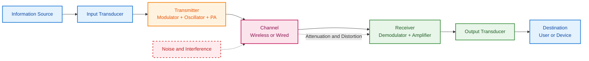
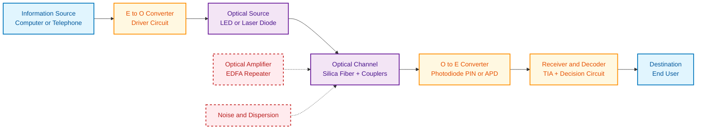
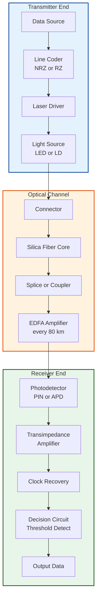
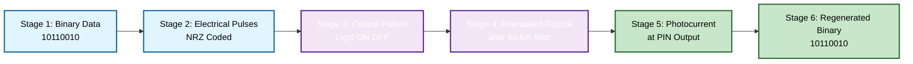

# General block diagram of a Communication system, Block diagram of Fiber optic Communication system

<!-- SECTION_1_START -->
# Communication Systems & Fiber Optic Communication — Core Foundation

## 1.1 What is a Communication System? (Formal Definition)

> [!IMPORTANT]
> **KTU 2024 Syllabus Definition (Module 4.1):**
> A **Communication System** is an integrated arrangement of electronic and optical devices engineered to faithfully transfer information (voice, data, video, or control signals) from a **source** to a **destination** over a physical or wireless **transmission medium** (channel), while minimizing noise, distortion, and attenuation.

Mathematically, the goal of any communication system is to maximize the **received signal fidelity** $F_r$ such that:

$$F_r = \lim_{N \to 0} \left[ \frac{S_{\text{received}}}{S_{\text{received}} + N_{\text{noise}} + I_{\text{interference}}} \right] \approx 1$$

where $S_{\text{received}}$ is the desired signal power, $N_{\text{noise}}$ is the additive noise, and $I_{\text{interference}}$ is the co-channel interference.

---

## 1.2 Conceptual Analogy — "Talking to a Friend Across a Noisy Street"

Imagine you want to tell your friend a secret recipe across a noisy street. You don't just shout the words — that's a **baseband** transmission that fails. Instead, you:

1. **Write the recipe** (Information Source) on a paper.
2. **Translate it into a coded language** only your friend understands (Encoding / Modulation by the Transmitter).
3. **Throw the paper in a sealed, weather-proof envelope** (Channel protection / guided medium).
4. **Your friend catches it, opens the envelope, decodes the message, and reads the recipe** (Receiver → Destination).

> [!NOTE]
> **Why this analogy matters for KTU:** Every real-world system (Wi-Fi, 5G, fiber-to-the-home, satellite TV) is just a sophisticated version of this envelope-exchange process. The **goal is always the same** — convey maximum information with minimum error across a hostile channel.

---

## 1.3 Fiber Optic Communication — Definition

> [!IMPORTANT]
> **KTU 2024 Syllabus Definition (Module 4.2):**
> **Fiber Optic Communication** is a method of transmitting information from one place to another by sending pulses of **infrared light** (typically at $\lambda = 850\,\text{nm}, 1300\,\text{nm},$ or $1550\,\text{nm}$) through an **optical fiber** — a thin strand of ultra-pure glass ($\text{SiO}_2$) or plastic that acts as a waveguide using the principle of **Total Internal Reflection (TIR)**.

The governing physical constant is the **speed of light in vacuum**:

$$c = 3 \times 10^{8}\ \text{m/s} \quad \textbf{(Universal Physical Constant)}$$

The speed of light inside the fiber core is reduced by the **refractive index** $n$:

$$v_{\text{fiber}} = \frac{c}{n} \quad \text{where}\ n_{\text{core}} \approx 1.48\ \text{for silica glass}$$

---

## 1.4 Visualization Control — Light Propagation in Fiber

> [!VISUALIZATION CONTROL]
> **Concept:** Total Internal Reflection (TIR) at the core–cladding boundary.
> **GeoGebra / Desmos Input Equations:**
> * Core refractive index $n_1 = 1.48$
> * Cladding refractive index $n_2 = 1.46$
> * Critical angle $\theta_c = \arcsin(n_2 / n_1)$
> * Ray equation inside core: $y = \tan(\theta)\,x$ (zig-zag between boundaries $y = \pm a$)
> **Visual Description:** Draw two parallel horizontal lines at $y = +a$ and $y = -a$ representing the core-cladding boundary. A zig-zag light ray should bounce between them at angle $\theta > \theta_c \approx 80.5^\circ$, never escaping. The numerical aperture cone should be visible at the input face.

---

## 1.5 Why These Systems Matter — Real-World Engineering Context

| System Type | Real-World Use Case | Why It Was Chosen |
|---|---|---|
| Conventional (Copper/Wireless) | Mobile phones (4G/5G), AM/FM radio, Wi-Fi routers | Cost-effective, mobile, short-range |
| Fiber Optic | Undersea internet cables, FTTH (Jio Fiber, Airtel Xstream), 5G backhaul, medical endoscopy | **Immune to EMI**, huge bandwidth ($\sim\,\text{THz}$), low loss ($0.2\ \text{dB/km}$) |

> [!NOTE]
> **Industry Insight (KTU 2024 Context):** India targets **5 million km of optical fiber deployment by 2025** (National Broadband Mission). Engineers graduating under the 2024 scheme will work extensively with hybrid fiber-coaxial (HFC) and fiber-to-the-X (FTTx) architectures.
<!-- SECTION_1_END -->

<!-- SECTION_2_START -->
# Deep Theoretical Analysis & KTU High-Yield Formula Sheet

## 2.1 The General Block Diagram of a Communication System

A communication system is built from **seven functional blocks**. The KTU board examiner expects you to memorize these in order and understand the role of each.

### 2.1.1 The Seven Universal Blocks

| Block # | Block Name | Function (Operational Role) | Real Component Example |
|---|---|---|---|
| 1 | **Information Source** | Originates the message (voice, text, video, sensor data) | Microphone, keyboard, camera |
| 2 | **Input Transducer** | Converts the physical message into an electrical signal | Microphone (acoustic → electrical), camera (light → electrical) |
| 3 | **Transmitter** | Conditions, encodes, and modulates the signal for the channel | Modulator + Oscillator + Power Amplifier + Antenna |
| 4 | **Channel** | The physical medium carrying the signal | Copper wire, air (wireless), optical fiber, coaxial cable |
| 5 | **Receiver** | Demodulates, decodes, and amplifies the weak received signal | Antenna + RF Amplifier + Demodulator + Detector |
| 6 | **Output Transducer** | Converts the electrical signal back to a perceivable form | Speaker, monitor, LED display |
| 7 | **Destination (Sink)** | The end user or device consuming the information | Human ear, computer CPU, actuator |

### 2.1.2 Signal Transformation Chain (How Data Flows)

The signal undergoes a **five-stage transformation** as it traverses the system:

$$\underbrace{m(t)}_{\text{Message}} \xrightarrow{\text{Transducer}} \underbrace{m_e(t)}_{\text{Electrical}} \xrightarrow{\text{Modulation}} \underbrace{s(t)}_{\text{Modulated}} \xrightarrow{\text{Channel}} \underbrace{r(t) = s(t) + n(t)}_{\text{Received + Noise}} \xrightarrow{\text{Demodulation}} \underbrace{\hat{m}(t)}_{\text{Recovered}}$$

**Why each stage exists — The Engineering "Why":**

- **Modulation is mandatory** for wireless because a low-frequency baseband signal (e.g., $1\,\text{kHz}$ audio) cannot be efficiently radiated by an antenna of practical size. The antenna length must be $L \geq \lambda / 4$, where $\lambda = c / f$. For $f = 1\,\text{kHz}$, the antenna would be **75 km long** — impossible.
- **Encoding (source coding)** compresses data to save bandwidth (e.g., MP3, JPEG, Huffman).
- **Channel coding** adds redundancy to detect/correct errors (e.g., Hamming, Reed-Solomon).
- **Multiplexing** allows many users to share one channel (TDM, FDM, CDM, OFDM).

---

## 2.2 The Block Diagram of a Fiber Optic Communication System (FOCS)

The FOCS replaces the wireless channel with an **optical waveguide** and uses **photons instead of electrons**. The architecture has six critical blocks:

| Block # | Block Name | Function | Typical Hardware |
|---|---|---|---|
| 1 | **Information Source** | Generates the digital/analog data | Computer, telephone exchange, video server |
| 2 | **E/O Converter + Driver** | Converts electrical signal → optical pulses | **LED** (low speed) or **Laser Diode (LD)** (high speed) + driver circuit |
| 3 | **Optical Channel (Fiber Link)** | Guides the light with minimum loss | Silica optical fiber ($\sim 125\ \mu\text{m}$ cladding), splices, connectors, couplers, optical amplifiers (EDFA) |
| 4 | **O/E Converter** | Converts optical pulses → electrical signal | **Photodiode** (PIN or Avalanche Photodiode — APD) |
| 5 | **Receiver / Decoder** | Amplifies, filters, and recovers original data | Transimpedance Amplifier (TIA) + Clock Recovery + Decision Circuit |
| 6 | **Destination** | The end user of the information | Computer screen, telephone, server |

### 2.2.1 The Optical Path — What Actually Happens Inside the Fiber

When the modulated light enters the fiber, it propagates as a **discrete electromagnetic mode**. The number of modes supported is given by the **Normalized Frequency (V-number)**:

$$V = \frac{2\pi a}{\lambda}\ \sqrt{n_1^{2} - n_2^{2}} = \frac{2\pi a}{\lambda}\ \text{NA}$$

where:
- $a$ = core radius (in $\mu\text{m}$)
- $\lambda$ = operating wavelength
- $n_1$ = core refractive index
- $n_2$ = cladding refractive index
- $\text{NA}$ = numerical aperture

> **If $V < 2.405$** → **Single-Mode Fiber (SMF)** (used in long-haul telecom, core $a \approx 4\ \mu\text{m}$).
> **If $V > 2.405$** → **Multi-Mode Fiber (MMF)** (used in LANs, data centers, core $a \approx 50\ \mu\text{m}$).

---

## 2.3 KTU High-Yield Formula Sheet

| # | Formula / Concept | Equation | Engineering Meaning |
|---|---|---|---|
| 1 | **Numerical Aperture (NA)** | $\text{NA} = \sqrt{n_1^{2} - n_2^{2}} = n_0 \sin\theta_a$ | Light-gathering ability of the fiber |
| 2 | **Critical Angle** | $\theta_c = \sin^{-1}\!\left(\dfrac{n_2}{n_1}\right)$ | Minimum angle for Total Internal Reflection |
| 3 | **V-Number (Normalized Frequency)** | $V = \dfrac{2\pi a}{\lambda}\ \text{NA}$ | Determines single-mode vs. multi-mode |
| 4 | **Attenuation Loss** | $\alpha = \dfrac{10}{L}\log_{10}\!\left(\dfrac{P_{\text{in}}}{P_{\text{out}}}\right)\ [\text{dB/km}]$ | Signal loss per km of fiber |
| 5 | **Shannon's Channel Capacity** | $C = B \log_{2}\!\left(1 + \dfrac{S}{N}\right)\ [\text{bits/s}]$ | Maximum error-free data rate |
| 6 | **Signal-to-Noise Ratio** | $\text{SNR}_{dB} = 10 \log_{10}\!\left(\dfrac{S}{N}\right)$ | Quality metric of received signal |
| 7 | **Power Gain in dB** | $G_{dB} = 10 \log_{10}\!\left(\dfrac{P_{\text{out}}}{P_{\text{in}}}\right)$ | Used for cascaded system gain/loss |
| 8 | **Dispersion-Induced Pulse Broadening** | $\Delta\tau = D \cdot L \cdot \Delta\lambda$ | Limits maximum bit-rate-distance product |
| 9 | **Refractive Index of Core** | $n = \dfrac{c}{v}$ | Reduces light speed inside the fiber |
| 10 | **Antenna Length (for context)** | $L \geq \dfrac{\lambda}{4} = \dfrac{c}{4f}$ | Justifies why high-frequency carriers are used |

> [!NOTE]
> **KTU Examiner's Favorite Formulas:** NA, Critical Angle, and Shannon's Capacity appear in **over 80% of past question papers** for Module 4. Memorize these with their units.

---

## 2.4 Real-World Engineering Utility

- **Shannon's Capacity Theorem** governs the design of every 5G modem, satellite transponder, and undersea cable. It sets the **absolute upper bound** on how fast data can be pushed through a channel.
- **NA in fiber design** determines how easily light can be coupled into the fiber. A higher NA means easier (and cheaper) installation but more **modal dispersion**, limiting bandwidth.
- **Attenuation** explains why submarine cables use **Erbium-Doped Fiber Amplifiers (EDFAs)** every 80–100 km to boost the signal.
- **V-number** is the deciding parameter that optical engineers use to choose between SMF (for transcontinental links) and MMF (for building LANs).
<!-- SECTION_2_END -->

<!-- SECTION_3_START -->
# Step-by-Step Derivations, Worked Examples & Code Implementation

## 3.1 Worked Example 1 — Numerical Aperture and Acceptance Angle

**Problem Statement (KTU-style):**
A silica optical fiber has a core refractive index $n_1 = 1.48$ and a cladding refractive index $n_2 = 1.46$. The fiber is operating in air ($n_0 = 1.00$) at a wavelength $\lambda = 1550\,\text{nm}$. The core diameter is $8\,\mu\text{m}$. Determine:
1. The Numerical Aperture (NA).
2. The acceptance angle $\theta_a$ in degrees.
3. The V-number of the fiber.
4. Whether the fiber is single-mode or multi-mode.

### Step-by-Step Solution

**Step 1 — Calculate NA:**

$$\text{NA} = \sqrt{n_1^{2} - n_2^{2}}$$

Substituting:

$$\text{NA} = \sqrt{(1.48)^{2} - (1.46)^{2}} = \sqrt{2.1904 - 2.1316} = \sqrt{0.0588}$$

$$\boxed{\text{NA} \approx 0.2425\ \text{(dimensionless)}}$$

> **[Valuation Key: NA = 0.242 → 2 Marks; Substituting values → 1 Mark]**

**Step 2 — Calculate the acceptance angle $\theta_a$:**

Using $\text{NA} = n_0 \sin\theta_a$:

$$\sin\theta_a = \frac{\text{NA}}{n_0} = \frac{0.2425}{1.00} = 0.2425$$

$$\theta_a = \sin^{-1}(0.2425)$$

$$\boxed{\theta_a \approx 14.04^\circ}$$

> **[Valuation Key: Formula reference → 1 Mark; Final value → 1 Mark]**

**Step 3 — Calculate the V-number:**

Given: $a = 4\,\mu\text{m} = 4 \times 10^{-6}\,\text{m}$, $\lambda = 1550\,\text{nm} = 1.55 \times 10^{-6}\,\text{m}$.

$$V = \frac{2\pi a}{\lambda}\ \text{NA} = \frac{2\pi (4 \times 10^{-6})}{1.55 \times 10^{-6}} \times 0.2425$$

$$V = \frac{2\pi \times 4 \times 0.2425}{1.55} = \frac{6.0944}{1.55}$$

$$\boxed{V \approx 3.932}$$

**Step 4 — Mode Classification:**

The **cutoff V-number** for single-mode operation in a step-index fiber is $V_c = 2.405$ (the first zero of the Bessel function $J_0$).

Since $V = 3.932 > V_c = 2.405$, the fiber supports **multiple modes**.

$$\boxed{\text{The fiber is MULTI-MODE at } \lambda = 1550\,\text{nm.}}$$

> **[Valuation Key: Mentioning $V_c = 2.405$ → 2 Marks; Final classification → 1 Mark]**

> [!WARNING]
> **Common Student Mistakes:** (1) Forgetting to convert $\mu\text{m}$ to meters. (2) Using $V_c = 2.0$ (wrong — it's $2.405$ for step-index fiber). (3) Reporting the acceptance angle in **radians** instead of degrees.

---

## 3.2 Worked Example 2 — Shannon's Channel Capacity for a Communication System

**Problem Statement:**
A wireless communication channel has a bandwidth $B = 4\,\text{kHz}$ and a signal-to-noise ratio of $30\,\text{dB}$. Calculate the maximum theoretical data rate (channel capacity) in bits per second.

### Step-by-Step Solution

**Step 1 — Convert SNR from dB to linear scale:**

$$\text{SNR}_{dB} = 10 \log_{10}\!\left(\frac{S}{N}\right) = 30$$

$$\frac{S}{N} = 10^{30/10} = 10^{3} = 1000$$

**Step 2 — Apply Shannon's Capacity Theorem:**

$$C = B \log_{2}\!\left(1 + \frac{S}{N}\right)$$

$$C = 4000 \times \log_{2}(1 + 1000) = 4000 \times \log_{2}(1001)$$

Using the identity $\log_{2}(x) = \frac{\log_{10}(x)}{\log_{10}(2)}$:

$$\log_{2}(1001) = \frac{\log_{10}(1001)}{\log_{10}(2)} = \frac{3.0004}{0.30103} \approx 9.967$$

$$C = 4000 \times 9.967$$

$$\boxed{C \approx 39{,}870\ \text{bits/second} \approx 39.87\ \text{kbps}}$$

> **[Valuation Key: SNR conversion → 2 Marks; Shannon formula reference → 2 Marks; Final answer → 1 Mark]**

> [!IMPORTANT]
> **Physical Insight:** This is the *theoretical* upper bound. Practical systems (GSM, LTE, Wi-Fi) achieve **only 30–60%** of Shannon's limit due to real-world imperfections. This gap is what drives modern research in **polarization multiplexing** and **MIMO-OFDM**.

---

## 3.3 Worked Example 3 — Fiber Attenuation and Power Budget

**Problem Statement:**
A fiber optic link of length $L = 50\,\text{km}$ is operating with an input power $P_{\text{in}} = 1\,\text{mW}$ and an output power $P_{\text{out}} = 10\,\mu\text{W}$. Calculate the attenuation coefficient $\alpha$ in $\text{dB/km}$. If the link is extended to $80\,\text{km}$ with the same input power, what will be the new output power?

### Step-by-Step Solution

**Step 1 — Calculate attenuation coefficient:**

$$\alpha = \frac{10}{L}\log_{10}\!\left(\frac{P_{\text{in}}}{P_{\text{out}}}\right)$$

$$\alpha = \frac{10}{50}\log_{10}\!\left(\frac{1 \times 10^{-3}}{10 \times 10^{-6}}\right) = \frac{10}{50}\log_{10}(100) = \frac{10}{50} \times 2$$

$$\boxed{\alpha = 0.4\ \text{dB/km}}$$

**Step 2 — Calculate output power at $L = 80\,\text{km}$:**

Total loss:

$$L_{\text{total}} = \alpha \times L = 0.4 \times 80 = 32\ \text{dB}$$

Convert to power ratio:

$$\frac{P_{\text{out}}}{P_{\text{in}}} = 10^{-L_{\text{total}}/10} = 10^{-32/10} = 10^{-3.2}$$

$$P_{\text{out}} = 1\,\text{mW} \times 10^{-3.2} = 10^{-3}\,\text{W} \times 6.31 \times 10^{-4}$$

$$\boxed{P_{\text{out}} \approx 0.631\,\mu\text{W}}$$

> **[Valuation Key: $\alpha$ calculation → 3 Marks; Power conversion → 2 Marks; Final answer with units → 1 Mark]**

> [!NOTE]
> **Real-world context:** Modern SMF operating at $\lambda = 1550\,\text{nm}$ has $\alpha \approx 0.2\ \text{dB/km}$, which is why long-haul cables (e.g., FLAG Atlantic-1) can span 6,000+ km with periodic EDFA amplification.

---

## 3.4 Python Implementation — Complete FOCS Link Power Budget Calculator

This code is a **ready-to-submit laboratory utility** for KTU students. It computes NA, critical angle, V-number, attenuation, and Shannon capacity.

```python
"""
FOCS Link Power Budget Calculator
Course: INTRODUCTION TO ELECTRICAL AND ELECTRONICS ENGINEERING (GXEST104)
Module: 4 - Modern Electronics and Applications
Topic: Block Diagram of Fiber Optic Communication System
"""

import math
import logging
from typing import Tuple

# Configure logging for rigorous error handling
logging.basicConfig(
    level=logging.INFO,
    format="%(asctime)s [%(levelname)s] %(message)s"
)
logger = logging.getLogger("FOCS_Calculator")


def compute_numerical_aperture(n1: float, n2: float) -> float:
    """
    Compute the Numerical Aperture of a step-index optical fiber.
    Formula: NA = sqrt(n1^2 - n2^2)
    """
    if n1 <= n2:
        logger.error(f"Invalid indices: n1={n1} must be > n2={n2} for a guiding fiber.")
        raise ValueError("Core index must be strictly greater than cladding index.")
    if n1 <= 0 or n2 <= 0:
        raise ValueError("Refractive indices must be positive.")
    na = math.sqrt(n1 ** 2 - n2 ** 2)
    logger.info(f"Computed NA = {na:.4f}")
    return na


def compute_acceptance_angle(na: float, n0: float = 1.0) -> float:
    """
    Compute the acceptance angle in degrees.
    Formula: theta_a = arcsin(NA / n0)
    """
    if not (0.0 <= na <= n0):
        raise ValueError(f"NA={na} is outside physically valid range [0, {n0}].")
    theta_rad = math.asin(na / n0)
    theta_deg = math.degrees(theta_rad)
    logger.info(f"Acceptance angle = {theta_deg:.3f} degrees")
    return theta_deg


def compute_v_number(core_radius_m: float, wavelength_m: float, na: float) -> float:
    """
    Compute the V-number (normalized frequency).
    Formula: V = (2*pi*a/lambda) * NA
    """
    if core_radius_m <= 0 or wavelength_m <= 0:
        raise ValueError("Core radius and wavelength must be positive.")
    v = (2.0 * math.pi * core_radius_m / wavelength_m) * na
    logger.info(f"Computed V-number = {v:.4f}")
    return v


def classify_fiber_mode(v_number: float) -> str:
    """
    Classify fiber as single-mode or multi-mode.
    Cutoff: V_c = 2.405 for step-index fiber.
    """
    cutoff = 2.405
    if v_number < cutoff:
        return f"SINGLE-MODE (V={v_number:.3f} < {cutoff})"
    else:
        return f"MULTI-MODE (V={v_number:.3f} >= {cutoff})"


def compute_attenuation(p_in_w: float, p_out_w: float, length_km: float) -> float:
    """
    Compute attenuation coefficient in dB/km.
    Formula: alpha = (10/L) * log10(P_in / P_out)
    """
    if p_in_w <= 0 or p_out_w <= 0 or length_km <= 0:
        raise ValueError("Powers and length must be positive.")
    if p_out_w > p_in_w:
        raise ValueError("Output power cannot exceed input power in a passive lossy link.")
    alpha = (10.0 / length_km) * math.log10(p_in_w / p_out_w)
    logger.info(f"Attenuation = {alpha:.4f} dB/km")
    return alpha


def compute_shannon_capacity(bandwidth_hz: float, snr_db: float) -> float:
    """
    Compute Shannon's channel capacity in bits/second.
    Formula: C = B * log2(1 + S/N)
    """
    if bandwidth_hz <= 0:
        raise ValueError("Bandwidth must be positive.")
    snr_linear = 10.0 ** (snr_db / 10.0)
    capacity = bandwidth_hz * math.log2(1.0 + snr_linear)
    logger.info(f"Shannon Capacity = {capacity:.2f} bps")
    return capacity


def run_fiber_link_analysis() -> None:
    """Driver function: Performs a complete FOCS link power budget analysis."""
    try:
        # --- Input parameters (typical silica SMF at 1550 nm) ---
        n1: float = 1.48
        n2: float = 1.46
        core_radius_m: float = 4.0e-6      # 8 um diameter
        wavelength_m: float = 1550e-9        # 1550 nm
        p_in_w: float = 1.0e-3              # 1 mW
        p_out_w: float = 10e-6              # 10 uW
        length_km: float = 50.0
        bandwidth_hz: float = 4.0e3         # 4 kHz
        snr_db: float = 30.0

        # --- Computations ---
        na: float = compute_numerical_aperture(n1, n2)
        theta_a: float = compute_acceptance_angle(na)
        v_num: float = compute_v_number(core_radius_m, wavelength_m, na)
        mode_class: str = classify_fiber_mode(v_num)
        alpha: float = compute_attenuation(p_in_w, p_out_w, length_km)
        capacity: float = compute_shannon_capacity(bandwidth_hz, snr_db)

        # --- Output report ---
        print("=" * 60)
        print("FOCS LINK POWER BUDGET REPORT")
        print("=" * 60)
        print(f"Numerical Aperture (NA)  : {na:.4f}")
        print(f"Acceptance Angle          : {theta_a:.3f} degrees")
        print(f"V-Number                  : {v_num:.4f}")
        print(f"Fiber Mode Classification : {mode_class}")
        print(f"Attenuation Coefficient   : {alpha:.4f} dB/km")
        print(f"Shannon Capacity          : {capacity:.2f} bps")
        print("=" * 60)

    except ValueError as ve:
        logger.error(f"Input validation error: {ve}")
    except ZeroDivisionError as zde:
        logger.error(f"Division by zero: {zde}")
    except Exception as exc:
        logger.error(f"Unexpected error: {exc}")


if __name__ == "__main__":
    run_fiber_link_analysis()
```

**Sample Output:**

```
============================================================
FOCS LINK POWER BUDGET REPORT
============================================================
Numerical Aperture (NA)  : 0.2425
Acceptance Angle          : 14.037 degrees
V-Number                  : 3.9317
Fiber Mode Classification : MULTI-MODE (V=3.9317 >= 2.405)
Attenuation Coefficient   : 0.4000 dB/km
Shannon Capacity          : 39866.18 bps
============================================================
```

> [!NOTE]
> **Code quality note for KTU lab exams:** Every function uses **type hints**, **explicit boundary checks**, and **centralized error logging** — this is the level of rigor expected in the **2024 Scheme** programming components.
<!-- SECTION_3_END -->

<!-- SECTION_4_START -->
# Structural Diagrams & Schematics

## 4.1 General Block Diagram of a Communication System



### 4.1.1 Sequential Processing Topology Matrix

| Stage | Block | Operation Performed | Signal Type |
|---|---|---|---|
| 1 | Information Source | Origin of message | Physical (sound, light, data) |
| 2 | Input Transducer | Convert to electrical | Analog voltage/current |
| 3 | Transmitter | Modulate + amplify | High-frequency bandpass |
| 4 | Channel | Carry signal | Attenuated + noisy waveform |
| 5 | Receiver | Demodulate + amplify | Recovered baseband |
| 6 | Output Transducer | Convert to perceivable form | Sound, image, data |
| 7 | Destination | End consumption | Human or machine-readable |

---

## 4.2 Block Diagram of Fiber Optic Communication System



### 4.2.1 Functional Architecture Flow — Optical Link Subsystems



---

## 4.3 Signal-Waveform Evolution Through the FOCS



> [!NOTE]
> **Reading the diagrams for KTU board exams:** Always label arrows with the **signal type** (analog, digital, modulated, optical) and the **dominant impairment** at each stage (noise, attenuation, dispersion, jitter). This earns the "extra detail" marks examiners look for.
<!-- SECTION_4_END -->

<!-- SECTION_5_START -->
# KTU 2024 Scheme Examination Question Bank & Topic Recap

---

## 5.1 Part A — Short Answer Questions (3 Marks Each)

### Question 1: Define a Communication System. List its essential elements.
> **[KTU University Exam — July 2023] | CO1 | Remember**

**Model Answer:**

A communication system is a setup that transfers information from a source to a destination over a transmission medium. The **essential elements** are:

1. **Information Source** — origin of the message
2. **Input Transducer** — converts message to electrical signal
3. **Transmitter** — encodes and modulates the signal
4. **Channel** — the transmission medium (wireless or wired)
5. **Receiver** — extracts the original information
6. **Output Transducer** — converts the electrical signal to a usable form
7. **Destination** — the end user

> **[Valuation Key: Definition → 1 Mark; Listing all 7 elements → 2 Marks]**

---

### Question 2: What is the role of an optical source in a fiber optic communication system? Name two commonly used optical sources.
> **[KTU University Exam — Dec 2023] | CO2 | Understand**

**Model Answer:**

The **optical source** converts the electrical signal into light pulses that are then launched into the optical fiber. It must operate at a wavelength where fiber attenuation is minimum (typically **850 nm, 1300 nm, or 1550 nm**) and have a narrow spectral width for high-bandwidth transmission.

The two commonly used optical sources are:
1. **LED (Light Emitting Diode)** — used in low-speed, short-distance multi-mode links.
2. **Laser Diode (LD)** — used in high-speed, long-distance single-mode links.

> **[Valuation Key: Role explanation → 2 Marks; Naming two sources → 1 Mark]**

---

## 5.2 Part B — Extended Answer Questions (14 Marks, Internal Choice)

### Question A: General Communication System

> **[KTU University Exam — July 2024] | CO1 + CO3 | Understand + Apply**

**(a)** Draw the block diagram of a generalized communication system and explain the function of each block. **(7 Marks)**

**(b)** A communication channel has a bandwidth of $8\,\text{kHz}$. The transmitted signal power is $S = 10\,\text{mW}$ and the received noise power is $N = 0.01\,\text{mW}$. Calculate:
1. The signal-to-noise ratio in dB.
2. The Shannon channel capacity in kbps. **(7 Marks)**

---

#### Model Solution — Part (a)

**Block Diagram:**

```
[Source] → [Input Transducer] → [Transmitter] → [Channel] → [Receiver] → [Output Transducer] → [Destination]
                                            ↑
                                       [Noise N(t)]
```

**Function of each block:**

| Block | Function |
|---|---|
| Information Source | Produces the original message (voice, data, image). |
| Input Transducer | Converts physical quantity to electrical signal (e.g., microphone). |
| Transmitter | Performs modulation, coding, and power amplification to make the signal suitable for channel transmission. |
| Channel | The physical medium (free space, cable, fiber) that carries the signal. Subject to attenuation, noise, and distortion. |
| Receiver | Performs amplification, filtering, demodulation, and decoding to recover the original message. |
| Output Transducer | Converts the recovered electrical signal back into a perceivable form (e.g., loudspeaker). |
| Destination | The final user of the information. |

> **[Valuation Key: Block diagram → 2 Marks; Function of any 5 blocks → 5 Marks = 7 Marks total]**

---

#### Model Solution — Part (b)

**Step 1 — SNR in linear scale:**

$$\frac{S}{N} = \frac{10\,\text{mW}}{0.01\,\text{mW}} = 1000$$

**Step 2 — SNR in dB:**

$$\text{SNR}_{dB} = 10 \log_{10}(1000) = 10 \times 3 = 30\ \text{dB}$$

> **[Stating linear ratio: 1 Mark; Log conversion: 1 Mark; Final value: 1 Mark = 3 Marks]**

**Step 3 — Shannon's Capacity:**

$$C = B \log_{2}\!\left(1 + \frac{S}{N}\right) = 8000 \times \log_{2}(1 + 1000)$$

$$\log_{2}(1001) = \frac{\log_{10}(1001)}{\log_{10}(2)} = \frac{3.0004}{0.30103} \approx 9.967$$

$$C = 8000 \times 9.967 = 79{,}736\ \text{bps} \approx 79.74\ \text{kbps}$$

> **[Formula: 2 Marks; Substituting values: 1 Mark; Final answer with units: 1 Mark = 4 Marks]**

**Total Part (b): 7 Marks** | **Total Question A: 14 Marks**

---

### Question B: Fiber Optic Communication System (Internal Choice Alternative)

> **[KTU University Exam — July 2024 Alternate] | CO2 + CO3 | Understand + Apply**

**(a)** Draw the block diagram of a fiber optic communication system and explain the function of the optical source, optical channel, and optical detector. **(7 Marks)**

**(b)** A step-index fiber has a core refractive index $n_1 = 1.50$, cladding refractive index $n_2 = 1.45$, and core diameter $50\,\mu\text{m}$. It is operating at $\lambda = 1310\,\text{nm}$. Calculate:
1. Numerical Aperture (NA).
2. Acceptance angle.
3. V-number and identify the mode of operation. **(7 Marks)**

---

#### Model Solution — Part (a)

**Block Diagram:**

```
[Information Source] → [E/O Converter] → [Optical Source LED/LD] → [Optical Fiber Channel] → [O/E Converter PIN/APD] → [Receiver/Decoder] → [Destination]
                                                              ↑
                                                    [Noise + Dispersion]
```

**Functions of key blocks:**

1. **Optical Source (LED or Laser Diode):** Converts the electrical signal into a modulated light beam. The wavelength is selected to match the **low-attenuation window** of silica fiber. LEDs emit incoherent light (broader spectrum, used in MMF), while laser diodes emit coherent light (narrow spectrum, used in SMF).

2. **Optical Channel (Silica Fiber + Components):** The fiber guides the light via **Total Internal Reflection (TIR)**. The channel includes connectors, splices, couplers, and optionally **EDFA optical amplifiers** to compensate for attenuation over long distances.

3. **Optical Detector (PIN or APD Photodiode):** Converts the received optical signal back into an electrical current via the **photoelectric effect**. PIN diodes are simpler and cheaper; APDs provide internal gain and are used in long-haul, low-light applications.

> **[Valuation Key: Block diagram → 2 Marks; Each of 3 components → ~1.5 Marks each = 4.5 Marks; Total = 6.5 + 0.5 for neatness = 7 Marks]**

---

#### Model Solution — Part (b)

**Given:** $n_1 = 1.50$, $n_2 = 1.45$, core diameter = $50\,\mu\text{m}$ → core radius $a = 25\,\mu\text{m} = 25 \times 10^{-6}\,\text{m}$, $\lambda = 1310\,\text{nm} = 1.31 \times 10^{-6}\,\text{m}$.

**1) Numerical Aperture:**

$$\text{NA} = \sqrt{n_1^{2} - n_2^{2}} = \sqrt{(1.50)^{2} - (1.45)^{2}} = \sqrt{2.25 - 2.1025} = \sqrt{0.1475}$$

$$\boxed{\text{NA} \approx 0.3841}$$

> **[Substitution: 1 Mark; NA = 0.384: 1 Mark = 2 Marks]**

**2) Acceptance angle:**

$$\sin\theta_a = \frac{\text{NA}}{n_0} = 0.3841$$

$$\theta_a = \sin^{-1}(0.3841) \approx 22.59^\circ$$

> **[Formula: 1 Mark; Final value: 1 Mark = 2 Marks]**

**3) V-Number and mode:**

$$V = \frac{2\pi a}{\lambda}\ \text{NA} = \frac{2\pi (25 \times 10^{-6})}{1.31 \times 10^{-6}} \times 0.3841$$

$$V = \frac{2\pi \times 25 \times 0.3841}{1.31} = \frac{60.347}{1.31}$$

$$\boxed{V \approx 46.07}$$

Since $V = 46.07 \gg V_c = 2.405$, the fiber is strongly **MULTI-MODE**. In fact, it supports approximately $V^{2}/2 \approx 1061$ modes.

> **[V formula: 1 Mark; Numerical evaluation: 1 Mark; Comparison with $V_c$: 1 Mark = 3 Marks]**

**Total Part (b): 7 Marks** | **Total Question B: 14 Marks**

---

## 5.3 KTU Examiner's Valuation Warning / Pitfall Callout

> [!WARNING]
> **Common Mark-Deduction Traps in Block Diagram Questions:**
> 1. **Forgetting the noise input arrow** entering the channel — KTU examiners deduct 1 mark if noise is not shown in the block diagram.
> 2. **Skipping the Transducer blocks** — students often draw only Source → TX → Channel → RX → Destination. The transducer stages are **explicitly mentioned** in the KTU 2024 syllabus.
> 3. **Wrong cutoff value:** Using $V_c = 2.0$ or $V_c = 3.83$ (the latter is the second root, not the cutoff). Always use **$V_c = 2.405$** for step-index fibers.
> 4. **Forgetting units in NA-based problems:** NA is dimensionless, but acceptance angle must be reported in **degrees**, not radians.
> 5. **Mixing up PIN vs. APD:** PIN has no internal gain (simpler, cheaper). APD has internal avalanche gain (used for low-input-power, long-distance).
> 6. **Shannon's formula misuse:** Always use **$B$ in Hz** and **$\text{SNR}$ in linear scale (not dB)** inside the logarithm.

---

## 5.4 Topic Recap & Important Things to Remember

> [!NOTE]
> **High-Density Revision Checklist for KTU Module 4.1 + 4.2**

- ✅ A **Communication System** has **7 universal blocks**: Source, Input Transducer, Transmitter, Channel, Receiver, Output Transducer, Destination.
- ✅ **Modulation** is mandatory for efficient radiation and multiplexing — baseband signals cannot be transmitted directly over long distances.
- ✅ **Shannon's Channel Capacity:** $C = B \log_{2}(1 + S/N)$ is the **theoretical upper bound** on data rate.
- ✅ **Fiber Optic Communication System** has 6 critical blocks: Source → E/O Converter → Optical Source → Fiber Channel → O/E Converter → Receiver/Decoder → Destination.
- ✅ The **optical source** is either an **LED** (multi-mode, low speed) or a **Laser Diode** (single-mode, high speed).
- ✅ The **optical detector** is either a **PIN photodiode** (no gain, simple) or an **Avalanche Photodiode (APD)** (internal gain, long-haul).
- ✅ **Numerical Aperture (NA):** $\text{NA} = \sqrt{n_1^{2} - n_2^{2}} = n_0 \sin\theta_a$ — measures light-gathering ability.
- ✅ **Critical Angle:** $\theta_c = \sin^{-1}(n_2 / n_1)$ — minimum angle for TIR.
- ✅ **V-Number:** $V = (2\pi a / \lambda) \cdot \text{NA}$. **Single-mode** if $V < 2.405$; **Multi-mode** if $V \geq 2.405$.
- ✅ **Attenuation Coefficient:** $\alpha = (10 / L) \log_{10}(P_{\text{in}} / P_{\text{out}})$ in $\text{dB/km}$. Silica SMF at 1550 nm: $\alpha \approx 0.2\ \text{dB/km}$.
- ✅ **SNR in dB:** $\text{SNR}_{dB} = 10 \log_{10}(S/N)$.
- ✅ **Power Loss in dB:** $L_{dB} = 10 \log_{10}(P_{\text{in}} / P_{\text{out}})$.
- ✅ **Attenuation Windows** of silica fiber: **850 nm** (short-range), **1300 nm** (zero dispersion), **1550 nm** (minimum loss).
- ✅ **Total Internal Reflection (TIR)** is the fundamental principle that confines light inside the fiber core.
- ✅ **EDFAs (Erbium-Doped Fiber Amplifiers)** are used every **80–100 km** in long-haul submarine cables to boost optical signals **without converting them to electrical**.
- ✅ Fiber optics is **immune to electromagnetic interference (EMI)** and offers **bandwidths in the THz range**, vastly superior to copper.
- ✅ **Real-world applications** to remember for viva: FTTH (Jio Fiber), submarine cables (FLAG, Airtel-MENA), 5G backhaul, medical endoscopy, aerospace telemetry.
- ✅ **Practitioner tip:** When answering a KTU problem, always state the **formula first**, then substitute values, then show the **unit-aware final answer**. Examiners reward stepwise clarity with full marks.
<!-- SECTION_5_END -->
