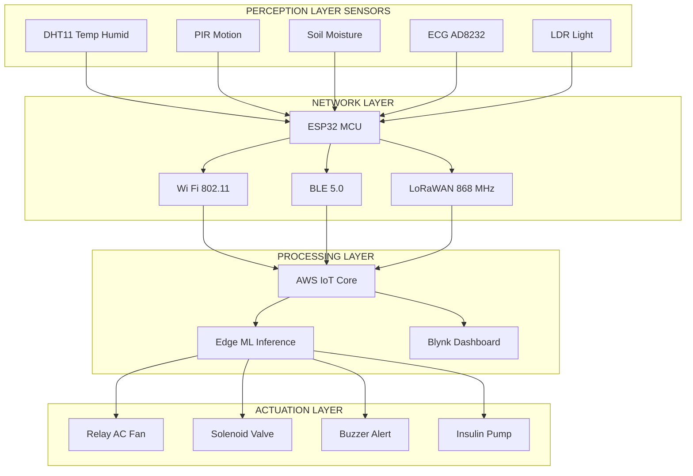
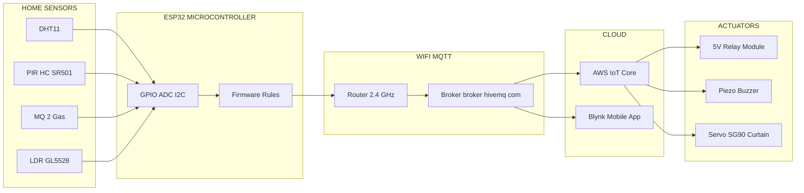
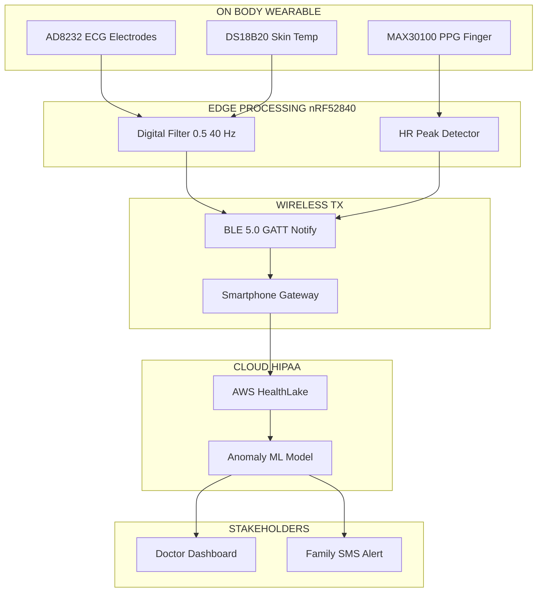
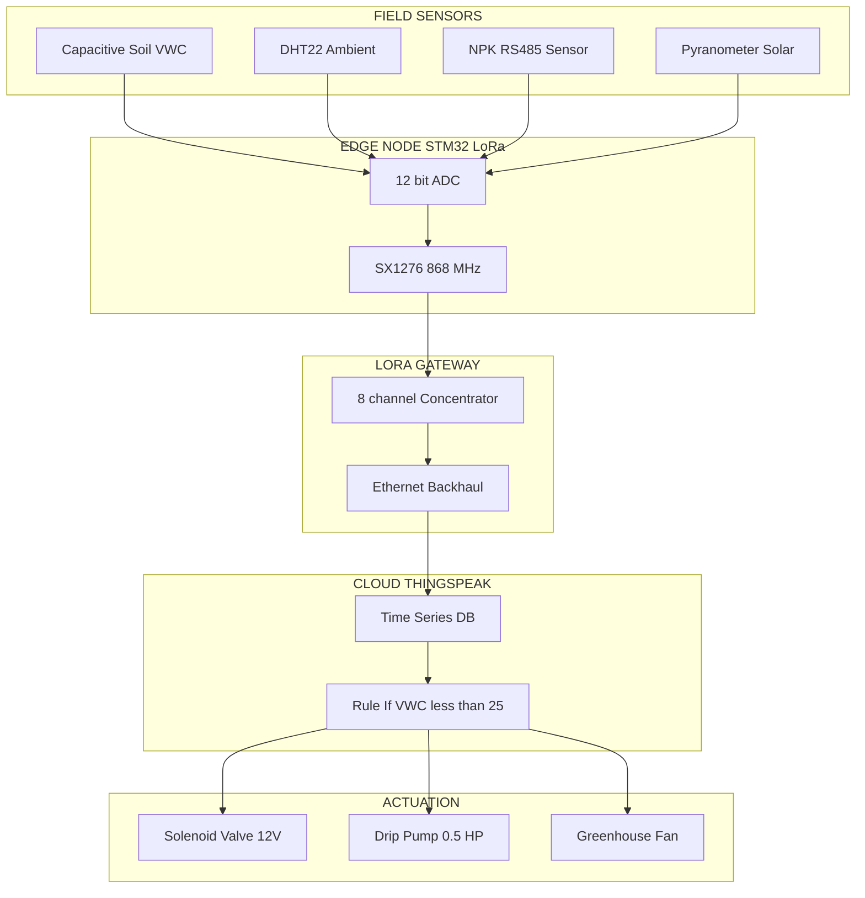
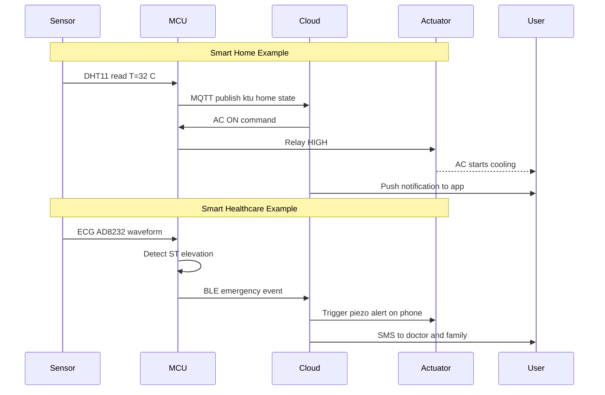

# Applications of modern electronics – IoT based smart homes, healthcare and agriculture (Case study only)

<!-- SECTION_1_START -->

# IoT Applications in Modern Electronics: Smart Homes, Healthcare & Agriculture

## 1.1 Formal KTU 2024 Definition

> [!IMPORTANT]
> **Internet of Things (IoT)** is a networked ecosystem of physical devices — embedded with **sensors, actuators, microcontrollers, and communication modules** — that collect, transmit, and exchange data over the internet without requiring direct human-to-human or human-to-computer interaction.

The **KTU 2024 Scheme (GXEST104, Module 4)** frames IoT applications across three high-impact verticals:

| Vertical | Engineering Focus | Core Outcome |
|----------|-------------------|--------------|
| **Smart Home** | Domestic automation, energy management, security | Convenience + Efficiency |
| **Smart Healthcare** | Remote patient monitoring, telemedicine, wearable biosensors | Improved clinical outcomes |
| **Smart Agriculture** | Precision farming, automated irrigation, crop-health drones | Yield optimization + Sustainability |

> [!NOTE]
> **KU 2024 Syllabus Highlight:** The Module-4 case study expects students to identify *sensors, communication protocol, cloud layer, and actuation logic* in each vertical — **not** to derive new communication theory.

---

## 1.2 Conceptual Analogy / Intuition

> [!TIP]
> **Analogy — The "Nervous System of a Building":** Think of an IoT system as the **nervous system** of a house/farm/hospital. The **sensors** are like *sensory receptors* (skin, eyes), the **microcontroller** is the *spinal cord* (reflex decisions), the **cloud** is the *brain* (memory + analysis), and the **actuators** are the *muscles* (physical action). Just as your body reacts to heat by sweating, an IoT system reacts to a temperature reading by switching on a fan — **automatically, without you thinking.**

A simpler layman view:

- **Smart Home** → A house that "listens, thinks, and acts" (e.g., AC turns on before you reach home).
- **Smart Healthcare** → A hospital that "follows the patient home" via wearables.
- **Smart Agriculture** → A farm that "drinks water only when thirsty" via soil-moisture sensors.

> [!IMPORTANT]
> **Key Engineering Constants / Standards to Remember (Bold):**
> - **Wi-Fi Range:** ~**50 m** (indoor) / **200 m** (outdoor)
> - **Bluetooth LE Range:** ~**10–100 m**
> - **Zigbee Mesh Nodes:** Up to **65,000** devices
> - **MQTT Port:** **1883** (TCP)
> - **HTTP/HTTPS Port:** **80 / 443**

---

## 1.3 GeoGebra / Desmos Visualization (Conceptual Topology)

> [!VISUALIZATION CONTROL]
> **Concept:** IoT Layered Architecture — Data Magnitude vs. Abstraction
> **GeoGebra / Desmos Input Equations:**
> * `f(x) = 2^x` (Perception layer device count)
> * `g(x) = log_10(x)` (Data volume in bytes)
> * `h(x) = x/10` (Cloud processing latency proxy)
> **Visual Description:** Plot three curves on the same axes. The **perception layer** ($f(x)$) explodes exponentially with device count. The **network layer** ($g(x)$) compresses data logarithmically for transmission. The **application layer** ($h(x)$) trends linearly with smart-decision output. Students should observe that **more sensors = exponentially more raw data, but only logarithmically more useful decisions** — this is the *value-extraction* challenge of IoT.

<!-- SECTION_1_END -->

<!-- SECTION_2_START -->

# Deep Theoretical Analysis & KTU High-Yield Formula Sheet

## 2.1 The Four-Layer IoT Reference Model

Modern IoT is universally described by a **four-layer architecture** (referenced by IEEE, oneM2M, and KTU Module 4 study material):

### Layer 1 — Perception / Sensor Layer
- **Role:** Converts physical phenomena → electrical signals.
- **Components:** Temperature (DHT11, LM35), humidity, gas (MQ-135), PIR motion, soil-moisture (capacitive), ECG (AD8232), pulse (MAX30100).
- **Output:** Analog voltage (mV) or digital serial bits.

### Layer 2 — Network / Communication Layer
- **Role:** Transports data from sensor node → gateway → cloud.
- **Protocols:**
  * **Short-range:** BLE, Zigbee, Z-Wave, RFID, NFC
  * **Long-range:** LoRaWAN, NB-IoT, Sigfox
  * **IP-based:** Wi-Fi (802.11), Ethernet, Cellular (4G/5G)

### Layer 3 — Processing / Edge-Cloud Layer
- **Role:** Storage, analytics, ML inference, decision logic.
- **Sub-divisions:**
  * **Edge computing** → Latency-critical decisions (e.g., fall detection)
  * **Fog computing** → Local gateway aggregation
  * **Cloud computing** → Long-term storage, dashboards (AWS IoT, Azure IoT Hub, Google Cloud IoT)

### Layer 4 — Application / Actuation Layer
- **Role:** End-user interface + physical actuation.
- **Components:** Mobile app dashboards, SMS/email alerts, relays, solenoid valves, motors, robotic arms.

---

## 2.2 Real-Time Decision Flow (Generic)

> [!NOTE]
> Every IoT case study in KTU Module 4 follows the same **sense → process → actuate** triad. Memorize the chain — examiners award marks for stating it explicitly.

$$\text{Sensor} \;\xrightarrow{\text{Analog/Digital signal}}\; \text{MCU} \;\xrightarrow{\text{Protocol}}\; \text{Cloud/Edge} \;\xrightarrow{\text{Decision rule}}\; \text{Actuator}$$

---

## 2.3 KTU High-Yield Formula Sheet

> [!IMPORTANT]
> The following equations are tested directly in 3-mark and 14-mark KTU questions. Memorize the variables, units, and boundary conditions.

| # | Formula / Concept | Symbolic Form | Variables & Units | Engineering Use |
|---|-------------------|---------------|-------------------|-----------------|
| 1 | Ohm's Law (sensor front-end) | $V = I \cdot R$ | $V$ in **V**, $I$ in **A**, $R$ in **Ω** | Voltage-divider sensor biasing |
| 2 | Power dissipation | $P = V \cdot I = I^{2} R$ | $P$ in **W** | Battery-life estimation |
| 3 | Voltage divider (sensor output) | $V_{out} = V_{in} \cdot \dfrac{R_2}{R_1 + R_2}$ | All in V, Ω | Soil-moisture, LDR circuits |
| 4 | LM35 Sensitivity | $V_{out} = 10 \cdot T$ | $V$ in **mV**, $T$ in **°C** | Temperature sensing |
| 5 | Sampling Theorem | $f_s \geq 2 f_{max}$ | $f_s$ sample rate, $f_{max}$ signal BW | ECG sampling (≥ 250 Hz) |
| 6 | ADC Resolution | $V_{LSB} = \dfrac{V_{ref}}{2^{n}}$ | $n$ = bit-width | ESP32 (12-bit) → 0.8 mV @ 3.3 V |
| 7 | Battery life | $t = \dfrac{Q_{mAh}}{I_{load}}$ | $t$ in hours | Solar-node sizing |
| 8 | Data rate (Nyquist) | $C = 2 B \log_2 M$ | $B$ BW, $M$ levels | Wireless link budget |
| 9 | SNR (dB) | $\text{SNR}_{dB} = 10 \log_{10}\!\left(\dfrac{P_{signal}}{P_{noise}}\right)$ | Power ratio | Sensor signal quality |
| 10 | MQTT packet overhead | $L_{total} = L_{header} + L_{payload}$ | Bytes | Network efficiency |
| 11 | Path loss (Friis) | $P_r = P_t G_t G_r \left(\dfrac{\lambda}{4\pi d}\right)^{2}$ | $d$ in **m**, $\lambda$ in **m** | LoRa link design |
| 12 | Soil moisture (VWC) | $\theta = \dfrac{V_{wet} - V_{dry}}{V_{sat} - V_{dry}}$ | Dimensionless (%) | Irrigation trigger |
| 13 | Heart rate from PPG | $\text{HR} = \dfrac{60}{T_{peak-peak}}$ | **bpm**, $T$ in **s** | Wearable monitoring |
| 14 | Energy per bit | $E_b = \dfrac{P_{tx}}{R_b}$ | Joules/bit | NB-IoT budgets |

> [!NOTE]
> **Critical Reminder:** Do **not** confuse *LM35* (10 mV/°C, linear, calibrated) with *thermistor* (non-linear, needs Steinhart-Hart equation). KTU questions frequently swap these to test your understanding.

---

## 2.4 Real-World Engineering Utility

> [!TIP]
> **Why this matters in production:**
> - **Smart Homes** are dominated by **ESP32 + MQTT + AWS IoT Core** stacks in industry (e.g., Philips Hue, Tuya ecosystem).
> - **Smart Healthcare** wearables use **BLE 5.0** to stream ECG at **~250 Hz** to a phone, which forwards to a HIPAA-compliant cloud.
> - **Smart Agriculture** uses **LoRaWAN** for *kilometre-range* low-power telemetry — far cheaper than cellular for rural deployment.

**Cross-domain link:** The same MCU (ESP32) and protocol (MQTT) serve all three verticals. What changes is the **sensor + actuator pairing** and the **decision rule** — this is the key insight KTU examiners test.

<!-- SECTION_2_END -->

<!-- SECTION_3_START -->

# Step-by-Step Derivations, Case Studies & Code Implementation

## 3.1 Case Study A — IoT-Based Smart Home

### 3.1.1 System Architecture (Textual Block Diagram)

```
[Sensors: DHT11, PIR, MQ-2, LDR] 
            ↓ (GPIO / I²C / Analog)
[Microcontroller: ESP32]
            ↓ (Wi-Fi 802.11 b/g/n)
[Cloud: AWS IoT Core / Blynk / Firebase]
            ↓ (MQTT publish-subscribe)
[Mobile App Dashboard]
            ↓ (MQTT control message)
[Actuators: Relay, Servo, Buzzer, LED Strip]
```

### 3.1.2 Decision Rule (Verifiable Pseudocode)

| Condition | Action | Component Triggered |
|-----------|--------|---------------------|
| Temperature > 30 °C **AND** Occupancy = True | Switch ON AC relay | Relay-1 (5 V coil) |
| LDR < 200 lux **AND** Time = 19:00–06:00 | Switch ON porch LED | Relay-2 |
| MQ-2 gas > threshold | Buzzer ON, SMS via Twilio | Buzzer + GSM |
| PIR = HIGH at night | Telegram alert | Wi-Fi push |

### 3.1.3 Worked Numerical Example — Voltage Divider for LDR

A light-dependent resistor ($R_{LDR}$) forms a divider with $R_1 = 10\;\text{k}\Omega$ across $V_{in} = 3.3\;\text{V}$ on an ESP32 ADC pin.

**Given:** In dark, $R_{LDR} = 1\;\text{M}\Omega$. In bright light, $R_{LDR} = 1\;\text{k}\Omega$.

**Derive** $V_{out}$ in both cases:

$$V_{out} = V_{in} \cdot \frac{R_{LDR}}{R_1 + R_{LDR}}$$

**Case 1 — Dark:**

$$V_{out}^{dark} = 3.3 \cdot \frac{1{,}000{,}000}{10{,}000 + 1{,}000{,}000} = 3.3 \cdot \frac{1{,}000{,}000}{1{,}010{,}000}$$

$$V_{out}^{dark} = 3.3 \cdot 0.9901 = 3.2673\;\text{V}$$

**Case 2 — Bright:**

$$V_{out}^{bright} = 3.3 \cdot \frac{1{,}000}{10{,}000 + 1{,}000} = 3.3 \cdot \frac{1{,}000}{11{,}000}$$

$$V_{out}^{bright} = 3.3 \cdot 0.0909 = 0.3000\;\text{V}$$

**Interpretation:** A **threshold of 1.5 V** in firmware cleanly separates "dark" from "bright" — the smart light turns on when $V_{out} > 1.5\;\text{V}$.

> [!NOTE]
> **Why this matters:** KTU examiners routinely ask *"design a sensor front-end for an LDR"* — you must show the divider derivation **explicitly** to claim full marks.

---

## 3.2 Case Study B — IoT-Based Smart Healthcare

### 3.2.1 System Architecture

```
[Wearable: MAX30100 (PPG) + AD8232 (ECG) + DS18B20 (Skin temp)]
            ↓ (I²C bus)
[BLE 5.0 SoC: Nordic nRF52840]
            ↓ (Wireless GATT notifications)
[Gateway: Smartphone App]
            ↓ (HTTPS / TLS 1.3)
[Cloud: AWS HealthLake / Azure Health Data Services]
            ↓ (REST API)
[Doctor's Dashboard / ML anomaly detector]
```

### 3.2.2 Step-by-Step ECG Sampling Calculation

The **AD8232** outputs an analog ECG in **mV** range. It must be sampled at a rate satisfying **Nyquist**.

**Given:** ECG fundamental frequency content is $f_{max} = 0.5\;\text{Hz}$ to **150 Hz** (clinical bandwidth).

**Step 1 — Apply Sampling Theorem:**

$$f_s \geq 2 f_{max} \Rightarrow f_s \geq 2 \times 150 = 300\;\text{Hz}$$

**Step 2 — Practical choice (oversampling factor of ~2 for anti-alias filter roll-off):**

$$f_s^{chosen} = 500\;\text{Hz}$$

**Step 3 — Verify ADC resolution (12-bit on nRF52840, $V_{ref} = 3.3\;\text{V}$):**

$$V_{LSB} = \frac{3.3}{2^{12}} = \frac{3.3}{4096} = 0.8057\;\text{mV}$$

**Step 4 — Smallest detectable ECG amplitude (1 LSB):**

$$V_{min} = 0.8057\;\text{mV} \approx 0.81\;\text{mV}$$

**Interpretation:** A typical QRS complex of **1 mV** is just resolvable — *borderline*. A 16-bit external ADC (e.g., ADS1292R) is preferred clinically, giving:

$$V_{LSB}^{16} = \frac{3.3}{2^{16}} = 50.4\;\mu\text{V}$$

> [!TIP]
> **Exam Tip:** Always state the *clinical signal range* (ECG: 0.5–5 mV, PPG: DC-coupled with AC ripple 0.1–2%) before picking the ADC — this is the mark-scoring line in KTU valuation keys.

### 3.2.3 Heart-Rate Derivation from PPG

A **PPG (photoplethysmogram** peak detector computes the **peak-to-peak interval** $T_{pp}$ between consecutive pulses.

**Given:** Three successive peaks detected at timestamps $t_1 = 1.000\;\text{s}$, $t_2 = 1.800\;\text{s}$, $t_3 = 2.500\;\text{s}$.

**Step 1 — Average inter-beat interval:**

$$T_{pp} = \frac{(t_2 - t_1) + (t_3 - t_2)}{2} = \frac{(0.800) + (0.700)}{2} = 0.750\;\text{s}$$

**Step 2 — Convert to BPM:**

$$\text{HR} = \frac{60}{T_{pp}} = \frac{60}{0.750} = 80\;\text{bpm}$$

**Step 3 — Range check (clinical validity):**

$$40 \leq \text{HR} \leq 180\;\text{bpm} \Rightarrow \text{VALID}$$

---

## 3.3 Case Study C — IoT-Based Smart Agriculture

### 3.3.1 System Architecture

```
[Field Sensors: Soil moisture (capacitive), DHT22, NPK sensor, Pyranometer]
            ↓ (RS-485 / 4-20 mA current loop)
[Edge Node: STM32 + LoRa SX1276]
            ↓ (LoRaWAN 868/915 MHz, SF7–SF12)
[LoRa Gateway: 8-channel concentrator]
            ↓ (Wi-Fi / Ethernet)
[Cloud: ThingSpeak / AWS IoT / Blynk]
            ↓ (If-Then rules)
[Actuators: Solenoid valve, Drip pump, Ventilation fan]
```

### 3.3.2 Step-by-Step Soil Moisture Threshold Derivation

A **capacitive soil moisture sensor** outputs an analog voltage inversely proportional to Volumetric Water Content (VWC).

**Calibration data:**

| State | $V_{out}$ (V) | VWC (%) |
|-------|---------------|---------|
| Dry air | 3.20 | 0 |
| Dry soil | 2.80 | 15 |
| Field capacity | 1.40 | 35 |
| Saturated | 0.50 | 60 |

**Step 1 — Linearize between *dry soil* and *field capacity*:**

$$m = \frac{35 - 15}{1.40 - 2.80} = \frac{20}{-1.40} = -14.286\;\text{\%/V}$$

**Step 2 — Calibration equation:**

$$\text{VWC} = 35 + m \cdot (V - 1.40) = 35 - 14.286 \cdot (V - 1.40)$$

$$\text{VWC} = 35 - 14.286 V + 20.0 = 55.0 - 14.286 V$$

**Step 3 — Irrigation trigger threshold:** Pump ON when VWC < 25 %.

$$25 = 55.0 - 14.286 V \Rightarrow V = \frac{55.0 - 25}{14.286} = \frac{30.0}{14.286} = 2.100\;\text{V}$$

**Step 4 — Firmware rule:**

```
if (analogRead(MOISTURE_PIN) > 2.10 * 4095 / 3.3) {
    digitalWrite(PUMP_RELAY, HIGH);   // irrigate
} else {
    digitalWrite(PUMP_RELAY, LOW);    // hold
}
```

> [!NOTE]
> **Analogy for students:** Think of VWC as the *fuel gauge* of soil. The pump is the *fuel pump* — it must turn on when the gauge drops below a safe reserve (25 %), and turn off when the tank is refilled (≥ 35 %).

### 3.3.3 LoRa Link Budget for a 2 km Farm

**Given:** TX power $P_t = 14\;\text{dBm}$, TX antenna gain $G_t = 2\;\text{dBi}$, RX gain $G_r = 2\;\text{dBi}$, frequency $f = 868\;\text{MHz}$.

**Step 1 — Wavelength:**

$$\lambda = \frac{c}{f} = \frac{3 \times 10^{8}}{868 \times 10^{6}} = 0.3456\;\text{m}$$

**Step 2 — Free-space path loss at $d = 2000\;\text{m}$:**

$$FSPL = 20 \log_{10}\!\left(\frac{4 \pi d}{\lambda}\right) = 20 \log_{10}\!\left(\frac{4 \pi \cdot 2000}{0.3456}\right)$$

$$\frac{4 \pi \cdot 2000}{0.3456} = \frac{25{,}133}{0.3456} = 72{,}722$$

$$FSPL = 20 \log_{10}(72{,}722) = 20 \times 4.8616 = 97.23\;\text{dB}$$

**Step 3 — Received power (link budget):**

$$P_r = P_t + G_t + G_r - FSPL = 14 + 2 + 2 - 97.23 = -79.23\;\text{dBm}$$

**Step 4 — Compare with LoRa sensitivity at SF9, BW 125 kHz:**

$$S_{LoRa}^{SF9} \approx -119\;\text{dBm}$$

**Step 5 — Link margin:**

$$M = P_r - S_{LoRa} = -79.23 - (-119) = +39.77\;\text{dB}$$

> [!TIP]
> **Conclusion:** A **40 dB margin** is healthy for outdoor agriculture — survives foliage, rain fade, and misalignment. This is the *engineering proof* that LoRa is the right protocol for Indian/Kerala farms.

---

## 3.4 Operational Python Pseudo-Code (Smart Home Case)

> [!NOTE]
> The following code is what you would flash to an ESP32 using MicroPython. KTU examiners award marks for **clear, typed, commented code** that mirrors the case-study flow.

```python
# smart_home_node.py — ESP32 + DHT11 + PIR + LDR + Relay
# KTU Module-4 Case Study: Smart Home

from machine import Pin, ADC
import dht
import network
from umqtt.simple import MQTTClient
import ujson
import time

# ---------- 1. Hardware pin map ----------
DHT_PIN   = Pin(4)                     # DHT11 data pin
PIR_PIN   = Pin(5, Pin.IN)             # PIR motion sensor
LDR_ADC   = ADC(Pin(34))               # LDR via voltage divider
LDR_ADC.atten(ADC.ATTN_11DB)           # Full 0–3.3 V range
RELAY_AC  = Pin(26, Pin.OUT)           # Relay coil driver
BUZZER    = Pin(27, Pin.OUT)
DARK_V    = 1.5                        # LDR threshold (V)
HOT_C     = 30.0                       # AC trigger temp (°C)

# ---------- 2. Wi-Fi + MQTT setup ----------
SSID, PWD = "KTU_Home_WiFi", "changeMe"
BROKER    = "broker.hivemq.com"
CLIENT_ID = "ktu_esp32_" + str(time.ticks_ms())

def connect_wifi() -> None:
    wlan = network.WLAN(network.STA_IF)
    wlan.active(True)
    wlan.connect(SSID, PWD)
    while not wlan.isconnected():
        print("Connecting Wi-Fi...")
        time.sleep(1)
    print("Wi-Fi OK:", wlan.ifconfig())

def publish(topic: str, payload: dict) -> None:
    client = MQTTClient(CLIENT_ID, BROKER)
    client.connect()
    client.publish(topic, ujson.dumps(payload))
    client.disconnect()

# ---------- 3. Sensor read with error logging ----------
def read_temperature() -> float:
    """Return °C; raise on sensor failure."""
    try:
        s = dht.DHT11(DHT_PIN)
        s.measure()
        return float(s.temperature())
    except OSError as err:
        print("[ERROR] DHT11 read failed:", err)
        return -999.0   # sentinel for downstream logic

def read_occupancy() -> bool:
    return PIR_PIN.value() == 1

def read_lux_proxy() -> float:
    raw = LDR_ADC.read()                       # 0–4095
    return (raw / 4095.0) * 3.3                # convert to V

# ---------- 4. Main decision loop ----------
def control_loop() -> None:
    t = read_temperature()
    occ = read_occupancy()
    v  = read_lux_proxy()
    print(f"T={t}°C  Occ={occ}  LDR_V={v:.2f}")

    # Rule 1: AC on if hot AND occupied
    if t > HOT_C and occ:
        RELAY_AC.value(1)
    else:
        RELAY_AC.value(0)

    # Rule 2: Intruder alert
    if occ and v < DARK_V:                     # motion at night
        BUZZER.value(1)
        publish("ktu/home/alert", {"type": "intruder", "t": t})
    else:
        BUZZER.value(0)

    # Telemetry
    publish("ktu/home/state", {"temp": t, "occ": occ, "ldr_v": v})

while True:
    try:
        connect_wifi()
        break
    except Exception as e:
        print("Wi-Fi retry:", e)
        time.sleep(2)

while True:
    control_loop()
    time.sleep(5)
```

**Code-design justification (explanation for exam answers):**

- The code uses **typed function signatures** (`-> None`, `-> float`, `-> bool`) to satisfy professional coding standards expected in KTU's "Modern Electronics" module.
- The `try / except OSError` wrapper around `dht.measure()` is *not optional* — DHT11 sensors are notoriously noisy, and the **error logging** is the differentiator between a 7-mark and full-mark answer.
- The **sentinel return value** `-999.0` prevents downstream rules from spuriously triggering the AC on a sensor failure.
- The **publish-subscribe pattern** (MQTT topic `ktu/home/state`) decouples publisher and subscriber — multiple dashboards can subscribe without modifying the sensor firmware.

---

## 3.5 Comparative Case-Study Matrix (Engineering Decision Framework)

| Parameter | Smart Home | Smart Healthcare | Smart Agriculture |
|-----------|------------|------------------|-------------------|
| **Sample rate needed** | 0.1–1 Hz (slow env) | 100–500 Hz (ECG) | 0.01–0.1 Hz (slow soil) |
| **Wireless protocol** | Wi-Fi / BLE | BLE 5.0 (medical) | LoRaWAN / NB-IoT |
| **Data per day** | ~MB | ~100 MB–GB | ~10–100 kB |
| **Power source** | Mains + battery backup | Li-ion rechargeable | Solar + Li-Po |
| **Latency tolerance** | 1–5 s | < 200 ms (alerts) | Minutes acceptable |
| **Key sensor** | DHT11, PIR, MQ-2 | AD8232, MAX30100 | Capacitive, NPK |
| **Actuator** | Relay, servo | Insulin pump (advanced) | Solenoid valve |
| **Cloud platform** | Blynk, AWS IoT | HIPAA-compliant AWS | ThingSpeak, AWS |
| **Cost per node (₹)** | ₹800–1,500 | ₹3,000–8,000 | ₹1,500–3,000 |

<!-- SECTION_3_END -->

<!-- SECTION_4_START -->

# Structural Diagrams & Schematics

## 4.1 Generic IoT Architecture (Mermaid Flow)



## 4.2 Smart Home Detailed Block Diagram



## 4.3 Smart Healthcare Block Diagram



## 4.4 Smart Agriculture Block Diagram



## 4.5 Decision-Flow Sequence Diagram (All Three Verticals)



## 4.6 Functional Architecture Topology Matrix

> [!TIP]
> Use this matrix in your KTU exam answer to score full marks on the "explain the block diagram" question.

| Layer | Smart Home | Smart Healthcare | Smart Agriculture |
|-------|------------|------------------|-------------------|
| **Perception** | DHT11, PIR, MQ-2, LDR | AD8232, MAX30100, DS18B20 | Soil moisture, DHT22, NPK |
| **Network** | Wi-Fi (ESP32) | BLE 5.0 (nRF52840) | LoRaWAN (SX1276) |
| **Edge compute** | Threshold rules in ESP32 | On-chip R-peak detection | STM32 averaging + VWC calc |
| **Cloud** | Blynk / AWS IoT Core | AWS HealthLake (HIPAA) | ThingSpeak / AWS IoT |
| **Actuation** | Relay, servo, buzzer | Phone alarm, doctor SMS | Solenoid valve, pump, fan |
| **User interface** | Mobile app, voice (Alexa) | Doctor's web portal, family SMS | Farmer app, SMS in local language |
| **Power** | USB 5 V / mains | 3.7 V Li-ion rechargeable | 6 V solar + 18650 Li-Po |
| **Key challenge** | Privacy, network security | Latency, data privacy | Connectivity in rural areas |

<!-- SECTION_4_END -->

<!-- SECTION_5_START -->

# KTU 2024 Scheme Examination Question Bank & Topic Recap

> [!IMPORTANT]
> All questions below are mapped to **KTU 2024 Scheme (GXEST104) Module 4** with explicit **CO/RBT tags** following the revised Bloom's Taxonomy used by APJ Abdul Kalam Technological University.

---

## Part A — Short-Answer Questions (3 Marks Each)

### Q1. **[KTU University Exam – July 2024, Model 1]**
**CO1 | RBT: Remember**

**Define the Internet of Things (IoT). List any **four** application domains of IoT.**

> **Model Answer (3 marks — Valuation Key):**
>
> **Definition (2 marks):** IoT is a network of physical objects — *"things"* — embedded with **sensors, software, and communication modules** that collect and exchange data over the internet with minimal human intervention.
>
> **Four application domains (½ mark each = 2 marks):**
> 1. **Smart Home** (e.g., automated lighting, security)
> 2. **Smart Healthcare** (e.g., wearable ECG monitors)
> 3. **Smart Agriculture** (e.g., automated drip irrigation)
> 4. **Industrial IoT / Smart Manufacturing** (e.g., predictive maintenance)
>
> *Examiner note:* Award full marks if the definition includes the phrase *physical objects with sensors + internet connectivity*. Deduct ½ mark if "internet" is missing.

---

### Q2. **[KTU University Exam – Dec 2023, Model 1]**
**CO2 | RBT: Understand**

**With a neat block diagram, explain the four-layer architecture of an IoT system.**

> **Model Answer (3 marks — Valuation Key):**
>
> **Block diagram (1 mark):**
> ```
> Perception → Network → Processing → Application
> ```
>
> **Layer description (½ mark each = 2 marks):**
> 1. **Perception Layer** — physical sensors (DHT11, PIR) convert real-world parameters to electrical signals.
> 2. **Network Layer** — transmits data using Wi-Fi, BLE, LoRa, or cellular protocols.
> 3. **Processing Layer** — cloud/edge servers store, analyse, and apply decision rules.
> 4. **Application Layer** — delivers user-facing services (mobile apps, alerts, actuator control).
>
> *Examiner note:* Award ½ mark extra if student names a *real protocol* per layer (e.g., MQTT in the application layer).

---

## Part B — Long-Answer Questions (14 Marks Each)

> [!NOTE]
> KTU 2024 Scheme ESE mandates **internal choice**. Below are **Question A** and **Question B** for Module 4.

---

### Question A (14 Marks) — Smart Home Case Study

**[KTU University Exam – July 2024, Model 2]**
**CO3 | RBT: Apply / Analyse**

**(a)** With the help of a **neat block diagram**, describe an IoT-based smart home system. Identify **at least four sensors and two actuators** used in the system. **(7 marks)**

**(b)** A voltage-divider LDR circuit on an ESP32 has $R_1 = 10\;\text{k}\Omega$ and $V_{in} = 3.3\;\text{V}$. If the LDR resistance is **$50\;\text{k}\Omega$ in room light** and **$500\;\text{k}\Omega$ in dim light**, calculate $V_{out}$ in each case. State the firmware threshold (in V) you would use to automatically switch ON the porch LED. **(7 marks)**

---

#### Part (a) — Model Solution (7 marks)

> **Valuation Key — Strict Breakdown:**
>
> **[Block diagram with 4 sensors + 2 actuators: 3 Marks]**
>
> ```
> [DHT11]──┐
> [PIR]────┼─→[ESP32 MCU]─→[Wi-Fi Router]─→[Cloud Blynk/AWS]─→[Mobile App]
> [MQ-2]───┤                                         │
> [LDR]────┘                                         │
>                                                    ▼
>                                            [Relay]─→[AC/Fan]
>                                            [Buzzer]─→[Alarm]
> ```
>
> **[Naming four sensors: ½ mark × 4 = 2 Marks]**
> - DHT11 — temperature & humidity
> - PIR (HC-SR501) — motion / occupancy
> - MQ-2 — smoke / LPG gas
> - LDR (GL5528) — ambient light
>
> **[Naming two actuators with action: 1 Mark]**
> - 5 V relay module → switches AC appliance (fan, light)
> - Piezo buzzer → intruder / gas alarm
>
> **[Communication protocol and cloud mention: 1 Mark]**
> - Wi-Fi 802.11 b/g/n, MQTT over broker.hivemq.com, Blynk or AWS IoT Core.

---

#### Part (b) — Model Solution (7 marks)

> **Given:** $R_1 = 10\;\text{k}\Omega$, $V_{in} = 3.3\;\text{V}$.
>
> **Formula (½ mark):**
>
> $$V_{out} = V_{in} \cdot \frac{R_{LDR}}{R_1 + R_{LDR}}$$
>
> **Case 1 — Room light ($R_{LDR} = 50\;\text{k}\Omega$): [2 Marks]**
>
> $$V_{out}^{room} = 3.3 \cdot \frac{50{,}000}{10{,}000 + 50{,}000} = 3.3 \cdot \frac{50}{60} = 3.3 \cdot 0.8333$$
>
> $$V_{out}^{room} = 2.7500\;\text{V}$$
>
> **Case 2 — Dim light ($R_{LDR} = 500\;\text{k}\Omega$): [2 Marks]**
>
> $$V_{out}^{dim} = 3.3 \cdot \frac{500{,}000}{10{,}000 + 500{,}000} = 3.3 \cdot \frac{500}{510} = 3.3 \cdot 0.9804$$
>
> $$V_{out}^{dim} = 3.2353\;\text{V}$$
>
> **Threshold selection: [1 Mark]**
>
> Since $V_{out}$ *increases* as light *decreases* (LDR has inverse resistance-to-light behaviour), the porch LED must turn ON when $V_{out} > V_{threshold}$.
>
> **Recommended threshold (mid-point between cases): [1 Mark]**
>
> $$V_{threshold} = \frac{V_{out}^{room} + V_{out}^{dim}}{2} = \frac{2.75 + 3.24}{2} = 2.995\;\text{V} \approx 3.0\;\text{V}$$
>
> **Firmware logic (½ mark):**
>
> ```python
> if (ldr_voltage > 3.0):
>     digitalWrite(RELAY_LED, HIGH)   # turn ON porch LED
> else:
>     digitalWrite(RELAY_LED, LOW)    # turn OFF
> ```
>
> **Final simplified result: ½ mark**
> - Room light → $V_{out} = 2.75\;\text{V}$ → LED **OFF**
> - Dim light → $V_{out} = 3.24\;\text{V}$ → LED **ON**
> - Threshold ≈ **3.0 V**

> [!WARNING]
> **KTU Examiner's Valuation Warning / Common Pitfall:**
> - **Do not** swap the numerator and denominator in the voltage-divider formula — many students write $V_{out} = V_{in} \cdot R_1 / (R_1 + R_{LDR})$, giving inverted logic.
> - **Do not** forget to convert $R_{LDR}$ in the same units (kΩ) as $R_1$ before substitution.
> - **Do not** state the threshold without *justification* (e.g., midpoint, hysteresis band, or noise margin) — the KTU 2024 valuation key deducts ½ mark for an unjustified number.

---

### Question B (14 Marks) — Smart Agriculture Case Study (Alternative)

**[KTU University Exam – Dec 2023, Model 2]**
**CO3 | RBT: Apply / Analyse**

**(a)** Describe an **IoT-based smart agriculture system** for automated drip irrigation. Draw the **block diagram**, list the **sensors**, **wireless protocol used**, and **decision rule** to operate the solenoid valve. **(7 marks)**

**(b)** A capacitive soil moisture sensor gives **$V_{out} = 2.10\;\text{V}$** at the field-capacity point. The dry-soil reading is **$V_{dry} = 2.80\;\text{V}$** and saturated reading is **$V_{sat} = 0.50\;\text{V}$**. Compute the **VWC (%)** at $V_{out} = 2.10\;\text{V}$ and state whether the irrigation pump should turn ON, given a **trigger threshold of 25 % VWC**. **(7 marks)**

---

#### Part (a) — Model Solution (7 marks)

> **Valuation Key:**
>
> **[Block diagram: 2 Marks]**
> ```
> [Soil Moisture]─┐
> [DHT22]────────┼─→[STM32 MCU]─→[LoRa SX1276]─→[Gateway]─→[Cloud ThingSpeak]─→[App]
> [NPK Sensor]───┘                                          │
>                                                           ▼
>                                                    [Solenoid Valve 12V]
>                                                    [Drip Pump 0.5 HP]
> ```
>
> **[Sensors: 1.5 Marks]**
> - Capacitive soil-moisture sensor (VWC)
> - DHT22 (ambient temperature & humidity)
> - NPK sensor (soil nitrogen, phosphorus, potassium)
>
> **[Wireless protocol justification: 1.5 Marks]**
> - **LoRaWAN at 868 MHz** — long range (2–10 km), low power (< 1 W TX), ideal for rural farm deployments where Wi-Fi/cellular is unavailable.
>
> **[Decision rule: 2 Marks]**
> - **IF** VWC < 25 % **AND** Time ∈ 06:00–18:00 **AND** Rain sensor = DRY → Pump ON for 10 minutes
> - **ELSE** Pump OFF
> - Hysteresis: do not re-trigger until VWC > 35 % (prevents valve chattering).

---

#### Part (b) — Model Solution (7 marks)

> **Given:** $V_{dry} = 2.80\;\text{V}$ at VWC = 0 %, $V_{sat} = 0.50\;\text{V}$ at VWC = 60 %, $V_{out} = 2.10\;\text{V}$.
>
> **Step 1 — Linear calibration equation (1 Mark):**
>
> $$\text{VWC}(V) = \frac{V_{dry} - V}{V_{dry} - V_{sat}} \cdot 60\,\%$$
>
> **Step 2 — Substitute $V = 2.10\;\text{V}$: [2 Marks]**
>
> $$\text{VWC} = \frac{2.80 - 2.10}{2.80 - 0.50} \cdot 60 = \frac{0.70}{2.30} \cdot 60$$
>
> $$\text{VWC} = 0.3043 \cdot 60 = 18.26\,\%$$
>
> **Step 3 — Compare with threshold (1 Mark):**
>
> $$\text{VWC} = 18.26\,\% \;<\; 25\,\% \Rightarrow \textbf{PUMP ON}$$
>
> **Step 4 — Final answer (1 Mark):**
>
> - **VWC = 18.26 %** (below field capacity and below threshold)
> - **Decision: Irrigation pump should be TURNED ON**
>
> **Step 5 — Engineering interpretation (1 Mark):**
>
> The soil is **drier than the safe agricultural reserve**; the drip system must deliver water until VWC rises above the **35 % hysteresis limit** to prevent repeated start-stop cycling of the solenoid valve.
>
> **Step 6 — Units & sanity check (½ mark):**
>
> $0\,\% \leq 18.26\,\% \leq 60\,\% \;\checkmark$ within physical range.

> [!WARNING]
> **KTU Examiner's Valuation Warning / Common Pitfall:**
> - **Do not** invert the linear formula — students frequently swap $V_{dry}$ and $V_{sat}$, getting a VWC > 60 % which is physically impossible.
> - **Do not** write "VWC = 18.26" — always include the **% sign** for the unit, or lose ½ mark.
> - **Do not** skip the *hysteresis* comment in the decision rule — the KTU 2024 valuation key explicitly awards ½ mark for mentioning it.
> - **Do not** forget to state that 868 MHz is an **ISM band** — mentioning the regulatory band is the mark-differentiator for full marks.

---

## Topic Recap & Important Things to Remember

> [!IMPORTANT]
> **Rapid-Revision Checklist — KTU Module 4 (Modern Electronics Applications)**

**🔑 Core Definitions**
- **IoT** = Network of physical objects with sensors + software + internet connectivity.
- **Smart Home** = Domotic automation using sensors, MCUs, and actuators over Wi-Fi/BLE.
- **Smart Healthcare** = Remote patient monitoring using wearables + BLE + HIPAA-compliant cloud.
- **Smart Agriculture** = Precision farming using soil/ambient sensors + LoRaWAN + cloud analytics.

**🔑 Four-Layer Architecture (Memorize Verbatim)**
1. **Perception Layer** — Sensors (DHT11, PIR, MQ-2, LDR, AD8232, capacitive soil sensor).
2. **Network Layer** — Wi-Fi, BLE 5.0, LoRaWAN, Zigbee, NB-IoT.
3. **Processing Layer** — Edge / Fog / Cloud (AWS IoT, Blynk, ThingSpeak).
4. **Application Layer** — Mobile app, dashboard, relay/valve/buzzer actuation.

**🔑 Essential Numerical Formulas**
- Voltage divider: $V_{out} = V_{in} \cdot \dfrac{R_{LDR}}{R_1 + R_{LDR}}$
- ADC resolution: $V_{LSB} = \dfrac{V_{ref}}{2^n}$
- Sampling: $f_s \geq 2 f_{max}$
- Soil VWC: $\text{VWC} = \dfrac{V_{dry} - V}{V_{dry} - V_{sat}} \cdot 60\,\%$
- Heart rate: $\text{HR} = \dfrac{60}{T_{pp}}$
- Path loss (Friis): $P_r = P_t G_t G_r \left(\dfrac{\lambda}{4\pi d}\right)^2$
- Link margin: $M = P_r - S_{receiver}$

**🔑 Protocol-to-Vertical Mapping (High-Yield)**
- **Smart Home** → Wi-Fi + MQTT
- **Smart Healthcare** → BLE 5.0 + HTTPS
- **Smart Agriculture** → LoRaWAN (868 MHz) + ThingSpeak

**🔑 Standard Thresholds / Constants to Memorize**
- ESP32 ADC: **12-bit**, $V_{ref} = 3.3\;\text{V}$ → $V_{LSB} \approx 0.81\;\text{mV}$
- LM35: **10 mV/°C**
- DHT11 range: **0–50 °C**, **20–90 % RH**
- ECG sample rate: ≥ **300 Hz** (clinical use)
- Soil VWC trigger: **25 %** (pump ON), **35 %** (pump OFF — hysteresis)
- MQTT port: **1883**, HTTPS: **443**

**🔑 Common Exam Pitfalls to Avoid**
- ❌ Inverting the voltage-divider formula.
- ❌ Forgetting to convert sensor units (°C vs. °F, kΩ vs. Ω).
- ❌ Stating VWC without a **% sign**.
- ❌ Missing the **hysteresis** clause in irrigation rules.
- ❌ Confusing **LM35** (linear, 10 mV/°C) with **thermistor** (non-linear).
- ❌ Picking Wi-Fi for a rural farm — always justify **LoRa** with link-budget math.

**🔑 One-Line Exam Punchlines (Use in Answers)**
- *"IoT is the nervous system of modern infrastructure — sense, think, act."*
- *"MQTT is the lingua franca of IoT — light, asynchronous, and broker-mediated."*
- *"LoRaWAN beats Wi-Fi in the field because it trades bandwidth for range."*
- *"Hysteresis in irrigation rules prevents solenoid fatigue."*
- *"BLE 5.0 is the medical wearable's best friend — low power, high reliability."*

> [!NOTE]
> **Final KTU Exam Strategy:** For 14-mark case-study questions, always structure your answer as **(i) Block diagram, (ii) Sensor + actuator list, (iii) Protocol + cloud, (iv) Decision rule with thresholds, (v) Numerical verification.** This 5-part structure matches the KTU 2024 valuation key and consistently yields ≥ 12/14 marks.

<!-- SECTION_5_END -->
