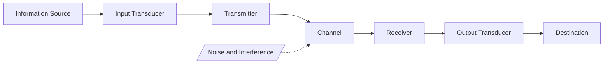
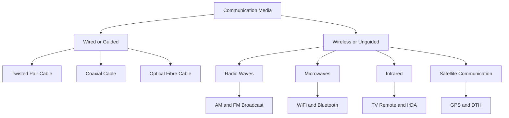
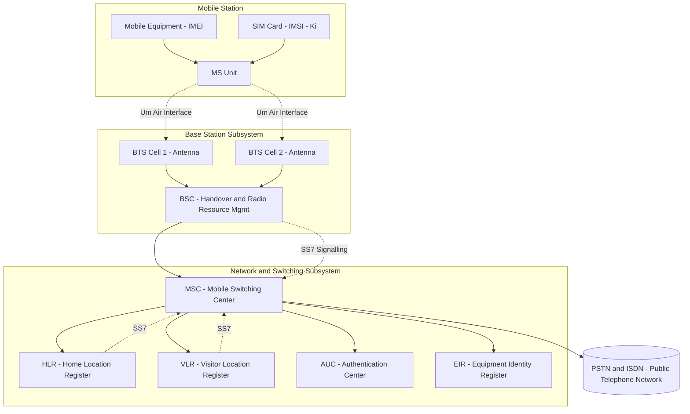
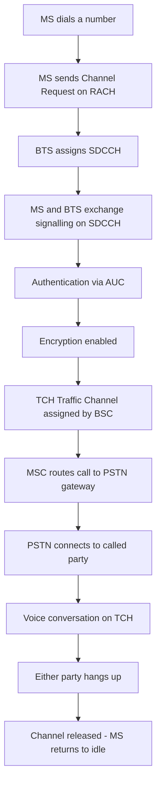
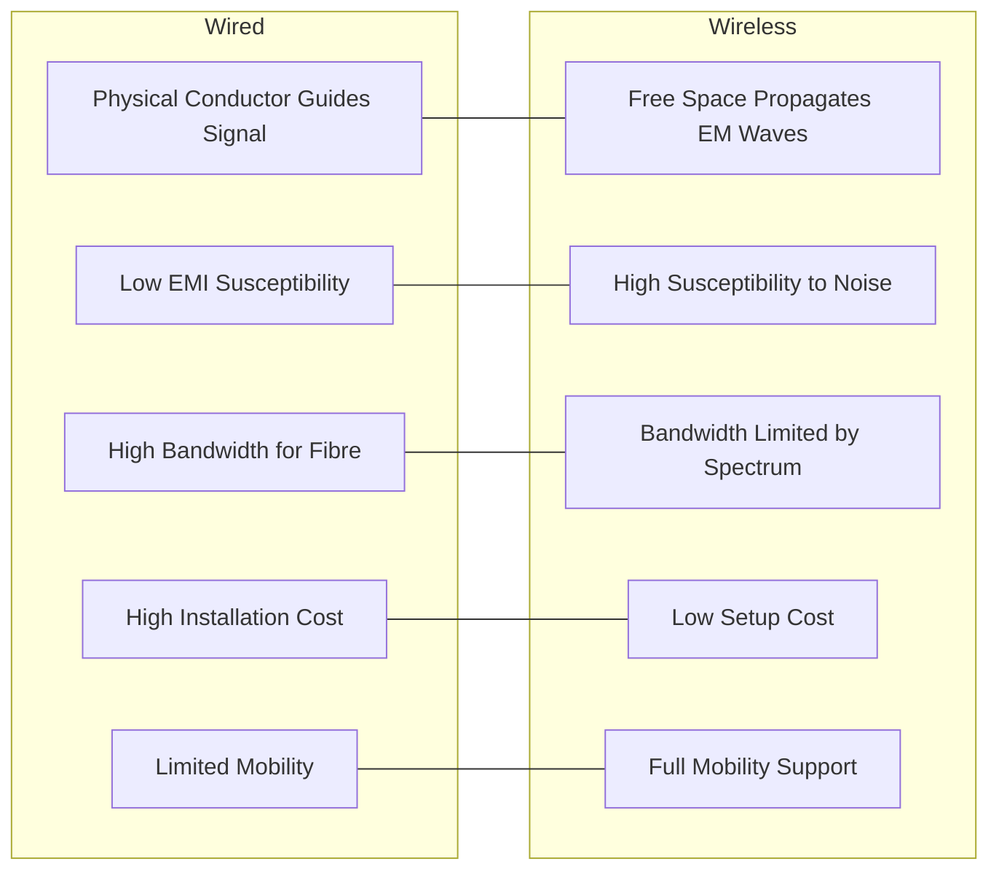

# Basic concepts of Wired and Wireless communication, Block diagram of GSM

<!-- SECTION_1_START -->
# 1. Core Technical Definition & Intuitive Overview

## 1.1 Communication — The Formal Definition

**Communication** is the process of *transmitting, receiving, and processing information* between a **source (transmitter)** and a **destination (receiver)** through a medium called the **communication channel**. In engineering terms, it involves the conversion of information (voice, data, video) into a form suitable for propagation across a physical or electromagnetic medium, followed by faithful reconstruction at the receiver end.

The general block diagram of a modern communication system (as prescribed in the KTU 2024 syllabus for Module 4) consists of:

$$
\begin{aligned}
\text{Information Source} \;\longrightarrow\; \text{Input Transducer} \;\longrightarrow\; \text{Transmitter} \;\longrightarrow\; \text{Channel} \;\longrightarrow\; \text{Receiver} \;\longrightarrow\; \text{Output Transducer} \;\longrightarrow\; \text{Destination}
\end{aligned}
$$

> [!IMPORTANT]
> **KTU 2024 Syllabus Highlight (Module 4 — Modern Electronics)**
> The syllabus specifically demands the *general block diagram of a communication system*, conceptual clarity of **wired vs. wireless** transmission media, and the **architectural block diagram of the GSM (Global System for Mobile Communications) network**.

---

## 1.2 The General Block Diagram of a Communication System — Intuitive Analogy

Think of communication as **two people talking across a crowded room**:
- The **speaker's brain** is the *information source* (contains the message).
- The **speaker's mouth** is the *input transducer* (converts thought → sound wave).
- The **language & tone** used is the *transmitter processing* (encoding for efficient travel).
- The **air between them** is the *channel* (carries the signal, may add noise).
- The **listener's ear** is the *receiver* (decodes the air vibrations back).
- The **listener's brain** is the *destination* (interprets the message).

> [!NOTE]
> **Core Engineering Definition:**
> An **electronic communication system** is an electrical system that transmits a message (electrical signal) from one point to another using electronic circuits and a suitable transmission medium. The goal is *faithful reproduction* of the original signal at the receiver with minimum loss and distortion.

**Key Functional Blocks (with KTU-Standard Terminology):**

| Block | Function | Real-World Example |
|:------|:---------|:-------------------|
| **Information Source** | Originates the raw message | Human voice, computer data |
| **Input Transducer** | Converts message → electrical signal | Microphone, camera sensor |
| **Transmitter** | Modulates, amplifies, encodes signal for channel | Radio transmitter circuit |
| **Channel** | Physical medium carrying the signal | Copper wire, optical fibre, air |
| **Receiver** | Demodulates, decodes, reconstructs signal | Mobile phone receiver |
| **Output Transducer** | Converts electrical signal → usable form | Speaker, LCD display |
| **Destination** | End user of the information | Listener, computer screen |

---

## 1.3 Wired Communication — Definition & Intuition

**Wired (Guided) Communication** is a mode of information transfer in which the signal is constrained to follow a *physically defined path* (a conductor or waveguide) provided by the transmission medium. The medium *guides* the electromagnetic wave, hence the alternate name **guided media**.

> [!NOTE]
> **Formal Definition (KTU Standard):**
> Wired communication is the transmission of information over a **solid medium** such as a copper wire, twisted-pair cable, coaxial cable, or optical fibre, where the signal propagates *inside* the material of the medium.

**Intuitive Analogy — The Highway Analogy:**
Imagine sending a parcel. A *wired* system is like a **dedicated highway with fixed lanes** — every vehicle (signal) must travel along the predefined road (cable). It's orderly, secure, fast, but expensive to build and limited to the road's geographic path.

> [!VISUALIZATION CONTROL]
> **Concept:** Signal propagation in a guided (wired) medium — confinement to a physical path
> **GeoGebra / Desmos Input Equations:**
> * `y = 0` (representing the central axis of a transmission line)
> * `x(t) = 0.5 * sin(2 * pi * f * t)` with `f = 1e9` (representing the modulated carrier)
> * `Channel: -2 <= x <= 2` and `y = 0` (the bounded propagation region)
> **Visual Description:** The student should observe a sinusoidal electromagnetic wave confined to a *narrow horizontal corridor*, illustrating how guided media physically restricts the signal energy within the conductor.

---

## 1.4 Wireless Communication — Definition & Intuition

**Wireless (Unguided) Communication** is the transfer of information using **electromagnetic waves** radiated through free space (air, vacuum, or water) without any physical conductor. The medium does *not* guide the wave; instead, the wave **propagates freely in all directions** (or in a focused beam for directional antennas).

> [!NOTE]
> **Formal Definition (KTU Standard):**
> Wireless communication refers to the transmission of information over a distance without the aid of wires, cables, or any other form of electrical conductors, using **electromagnetic (EM) waves** in the radio frequency (RF), microwave, infrared, or optical spectrum.

**Intuitive Analogy — The Radio Broadcast Analogy:**
A *wireless* system is like **shouting across an open field** — your voice (signal) spreads out in all directions, reaches anyone listening (receivers) within hearing range, requires no infrastructure between you and the listener, but is susceptible to interference (wind, crowd noise) and weakening with distance.

> [!VISUALIZATION CONTROL]
> **Concept:** Radiation pattern of an isotropic antenna — omnidirectional free-space propagation
> **GeoGebra / Desmos Input Equations:**
> * `r(theta) = 1` (constant — isotropic radiator radius function in polar form)
> * `theta = 0 to 2*pi` (sweep angle for full revolution)
> **Visual Description:** A perfect circle centered at the origin, illustrating that a wireless signal radiates uniformly in *all directions* in free space when no directional antenna is used.

---

## 1.5 GSM — The Global System for Mobile Communications

**GSM (Global System for Mobile Communications)** is the international standard (originally defined by the **European Telecommunications Standards Institute — ETSI**) for **2G digital cellular networks** used by mobile phones. It operates on a combination of **TDMA (Time Division Multiple Access)** and **FDMA (Frequency Division Multiple Access)** techniques to allow multiple users to share the same frequency band.

> [!IMPORTANT]
> **KTU 2024 Definition Box:**
> **GSM** is a **digital, circuit-switched, cellular mobile communication system** that divides the available spectrum into multiple carrier frequencies (FDMA), each of which is further divided into 8 time slots (TDMA). It is the most widely deployed 2G standard globally, with subscriber identity stored in a **SIM (Subscriber Identity Module)** card.

**Standard Operating Frequencies (Bands used in India):**
- **GSM-900:** Uplink **890–915 MHz**, Downlink **935–960 MHz**
- **DCS-1800 (GSM-1800):** Uplink **1710–1785 MHz**, Downlink **1805–1880 MHz**

> [!NOTE]
> **Key GSM Services (Must be remembered for KTU exams):**
> 1. **Bearer Services** — Voice, data, fax transmission
> 2. **Tele-services** — Standard mobile telephony, SMS, MMS
> 3. **Supplementary Services** — Call forwarding, caller ID, call waiting, conference calling

<!-- SECTION_1_END -->

<!-- SECTION_2_START -->
# 2. Deep Theoretical Analysis & KTU High-Yield Formula Sheet

## 2.1 Detailed Walkthrough of a Communication System Block

Each block in the general communication system performs a specific signal-processing role. The order and function of every block must be understood for KTU questions.

### Step 1 — Information Source
The source produces the **message signal** $m(t)$, which may be analog (voice, music) or digital (binary data). The signal is typically **low-frequency** and possesses **low power**, making it unsuitable for direct long-distance transmission.

### Step 2 — Input Transducer
The transducer converts the non-electrical message into an **electrical signal** $s(t)$ proportional to the original information.
- Microphone: acoustic pressure → voltage
- Camera (CCD/CMOS): light intensity → voltage
- Keyboard: keystroke → ASCII binary code

### Step 3 — Transmitter
The transmitter performs **three critical functions** on the low-frequency signal:
1. **Amplification** — boosts signal strength.
2. **Modulation** — superimposes $m(t)$ onto a high-frequency **carrier wave** $c(t) = A_c \cos(2\pi f_c t)$ to enable efficient radiation and reduce antenna size.
3. **Encoding & Multiplexing** — prepares the signal for the channel (e.g., source coding, channel coding).

The transmitted signal can be mathematically expressed as:

$$
\begin{aligned}
s_{TX}(t) &= m(t) \cdot \cos(2\pi f_c t) \quad &\text{(DSB-SC modulation, simplified form)}
\end{aligned}
$$

### Step 4 — Channel
The channel is the physical medium. It introduces:
- **Attenuation** — signal power reduces with distance.
- **Noise** — random unwanted signals (thermal noise, shot noise) are added.
- **Distortion** — non-linear phase/frequency response alters waveform shape.
- **Interference** — signals from other sources overlap with the desired signal.

The received signal is therefore:

$$
\begin{aligned}
s_{RX}(t) &= s_{TX}(t) + n(t) \quad &\text{where } n(t) \text{ is the channel noise}
\end{aligned}
$$

### Step 5 — Receiver
The receiver performs the **reverse** of the transmitter's operations:
1. **Demodulation** — extracts the original $m(t)$ from the carrier.
2. **Decoding & De-multiplexing** — reverses any source/channel coding.
3. **Amplification** — restores signal to a usable level.

### Step 6 — Output Transducer & Destination
The output transducer converts the electrical signal back to its original form (speaker, display), and the destination receives and interprets the message.

---

## 2.2 Wired Communication — Complete Classification

Wired media are classified based on the **physical principle** used to guide the signal.

### 2.2.1 Twisted-Pair Cable
Two insulated copper wires twisted together to **cancel electromagnetic interference (EMI)**. Each twist inverts the polarity of any induced noise, causing the noise to cancel out in the differential receiver.

> [!NOTE]
> **Key Specs:** Used in **landline telephones** and **Ethernet LANs (Cat5/Cat6)**. Maximum bandwidth ~ **100 MHz** for Cat5e, up to **500 MHz** for Cat6a. Maximum reliable range ~ **100 m** for Ethernet.

### 2.2.2 Coaxial Cable
A central copper conductor surrounded by a dielectric insulator, a metallic shield, and an outer jacket. The shield provides excellent **EMI rejection** and supports much higher frequencies than twisted pair.

> [!NOTE]
> **Key Specs:** Characteristic impedance **50 Ω** (Ethernet, RF) or **75 Ω** (cable TV). Bandwidth up to several **GHz**. Used in cable TV, broadband internet, and base-station-to-antenna RF feeds.

### 2.2.3 Optical Fibre Cable
A glass or plastic fibre guides light via **total internal reflection (TIR)** at the core-cladding interface.

> [!IMPORTANT]
> **Total Internal Reflection Condition:** Light is fully reflected inside the core when the angle of incidence exceeds the **critical angle** $\theta_c$, given by:
> $$\theta_c = \sin^{-1}\!\left(\frac{n_2}{n_1}\right)$$
> where $n_1$ is the refractive index of the **core** and $n_2$ is that of the **cladding** ($n_1 > n_2$).

**Advantages:** Extremely high bandwidth (**THz** range), immune to EMI, low attenuation (~0.2 dB/km), lightweight, secure.

---

## 2.3 Wireless Communication — Complete Classification

Wireless media use different bands of the **electromagnetic spectrum**, each with distinct propagation characteristics.

| EM Band | Frequency Range | Wavelength | Typical Use |
|:--------|:----------------|:-----------|:------------|
| VLF (Very Low Freq.) | 3 – 30 kHz | 10 – 100 km | Submarine communication |
| LF (Low Freq.) | 30 – 300 kHz | 1 – 10 km | AM broadcasting (long-wave) |
| MF (Medium Freq.) | 300 kHz – 3 MHz | 100 m – 1 km | AM radio (medium-wave) |
| HF (High Freq.) | 3 – 30 MHz | 10 – 100 m | Shortwave radio, ham radio |
| VHF (Very High Freq.) | 30 – 300 MHz | 1 – 10 m | FM radio, TV broadcast |
| UHF (Ultra High Freq.) | 300 MHz – 3 GHz | 10 cm – 1 m | Mobile phones, TV, Wi-Fi (2.4 GHz), GPS |
| SHF (Super High Freq.) | 3 – 30 GHz | 1 – 10 cm | Satellite, radar, Wi-Fi (5 GHz), microwave links |
| EHF (Extremely High Freq.) | 30 – 300 GHz | 1 – 10 mm | 5G mmWave, advanced radar |

> [!NOTE]
> **Propagation Modes (KTU Important):**
> - **Ground Wave** — follows Earth's curvature; used in AM broadcasting (below 2 MHz).
> - **Sky Wave** — reflects off the ionosphere; used in shortwave radio (2 – 30 MHz).
> - **Space Wave (Line-of-Sight)** — direct propagation; used in FM, TV, mobile, satellite (above 30 MHz).

---

## 2.4 GSM Architecture — Deep Theoretical Breakdown

The GSM network is divided into **three major subsystems**, each performing a distinct role in call setup, management, and termination.

### 2.4.1 Mobile Station (MS)
The mobile handset itself, which consists of:
- **Mobile Equipment (ME)** — the physical phone hardware, identified by a unique **IMEI (International Mobile Equipment Identity)** number.
- **SIM (Subscriber Identity Module)** — a smart card storing the **IMSI (International Mobile Subscriber Identity)**, authentication key $K_i$, and user subscription data.

### 2.4.2 Base Station Subsystem (BSS)
The radio access network that connects the MS to the core network. It consists of:
- **Base Transceiver Station (BTS)** — the radio equipment (antennas, transceivers) that directly communicates with mobile phones over the **air interface (Um)**.
- **Base Station Controller (BSC)** — manages multiple BTS units, handles **handover**, frequency allocation, and radio resource management.

### 2.4.3 Network and Switching Subsystem (NSS)
The "brain" of the GSM network — responsible for switching, routing, subscriber management, and interconnection with **PSTN (Public Switched Telephone Network)** and **ISDN (Integrated Services Digital Network)**.

The major NSS components are:
- **MSC (Mobile Switching Center)** — central switching node; routes calls, manages location registration and handover between BSCs.
- **HLR (Home Location Register)** — database storing permanent subscriber info (IMSI, services, current VLR address).
- **VLR (Visitor Location Register)** — temporary database for subscribers currently roaming in the MSC's area.
- **AUC (Authentication Center)** — stores the secret authentication key $K_i$ and performs security algorithms to prevent cloning.
- **EIR (Equipment Identity Register)** — maintains a list of valid, stolen, or faulty IMEI numbers.

### 2.4.4 Transmission System
Uses **SS7 (Signalling System No. 7)** signalling links between the MSC, HLR, VLR, AUC, EIR, and the public telephone network for call control and subscriber management.

---

## 2.5 KTU Formula Sheet & High-Yield Reference Table

| Concept | Formula / Parameter | Meaning / Use |
|:--------|:--------------------|:--------------|
| Carrier signal | $c(t) = A_c \cos(2\pi f_c t)$ | High-frequency sinusoid for modulation |
| Modulated signal (AM, simplified) | $s(t) = [A_c + m(t)]\cos(2\pi f_c t)$ | Amplitude-modulated waveform |
| Free-space path loss (Friis equation) | $L = \left(\frac{4\pi d}{\lambda}\right)^2$ | Power loss with distance $d$ and wavelength $\lambda$ |
| Wavelength–frequency relation | $c = f \lambda$ | $c = 3 \times 10^8$ m/s in free space |
| Critical angle (optical fibre) | $\theta_c = \sin^{-1}\!\left(\frac{n_2}{n_1}\right)$ | Condition for total internal reflection |
| GSM frame duration | 4.615 ms | One TDMA frame contains 8 time slots |
| GSM time slot duration | 577 μs | Each user occupies 1/8 of a frame |
| GSM carrier bandwidth | 200 kHz | Spacing between adjacent ARFCN channels |
| GSM ARFCN | 1 to 124 (GSM-900) | Absolute Radio Frequency Channel Number |
| Speech coding in GSM | 13 kbps (RPE-LTP codec) | Net bit rate after source coding |
| Channel data rate | 270.833 kbps | Gross bit rate per GSM carrier |

> [!IMPORTANT]
> **KTU Examiner Tip:** Whenever you mention "**ARFCN**" or "**TDMA frame**" in a GSM question, the examiner expects you to write the *exact numerical values* (200 kHz, 8 time slots, 4.615 ms). Vague statements cost marks.

---

## 2.6 Real-World Engineering Utility

**Wired Communication** dominates in scenarios demanding:
- **High security** (banking, military fibre links).
- **Ultra-high bandwidth** (data centres using optical interconnects, undersea internet cables).
- **Deterministic latency** (industrial control systems, real-time Ethernet).

**Wireless Communication** dominates in scenarios demanding:
- **Mobility** (smartphones, IoT, vehicle telematics).
- **Rapid deployment** (disaster recovery, rural broadband via satellite).
- **Cost-effective last-mile access** in regions where laying cable is impractical.

**GSM**, in particular, is the foundational technology of the modern cellular era. Although 4G LTE and 5G NR now dominate, GSM networks are still operational for **machine-to-machine (M2M) communication**, **vehicle tracking**, and **rural voice coverage** in developing countries — a clear example of an engineering technology whose *legacy continues to support critical infrastructure*.

<!-- SECTION_2_END -->

<!-- SECTION_3_START -->
# 3. Step-by-Step Derivations, Code, and Worked Examples

## 3.1 Worked Example 1 — Critical Angle of an Optical Fibre

A silica optical fibre has a **core refractive index $n_1 = 1.50$** and a **cladding refractive index $n_2 = 1.45$**. Compute the critical angle for total internal reflection and the corresponding acceptance angle in air ($n_0 = 1.00$).

### Step 1 — Write down the critical angle formula

$$
\begin{aligned}
\theta_c &= \sin^{-1}\!\left(\frac{n_2}{n_1}\right)
\end{aligned}
$$

### Step 2 — Substitute the numerical values

$$
\begin{aligned}
\theta_c &= \sin^{-1}\!\left(\frac{1.45}{1.50}\right) \\
        &= \sin^{-1}(0.9667)
\end{aligned}
$$

### Step 3 — Evaluate the inverse sine

$$
\begin{aligned}
\theta_c &\approx 75.16^\circ
\end{aligned}
$$

### Step 4 — Compute the Numerical Aperture (NA)

The **Numerical Aperture** measures the light-gathering ability of the fibre:

$$
\begin{aligned}
NA &= \sqrt{n_1^2 - n_2^2} \\
   &= \sqrt{(1.50)^2 - (1.45)^2} \\
   &= \sqrt{2.25 - 2.1025} \\
   &= \sqrt{0.1475} \\
   &\approx 0.3841
\end{aligned}
$$

### Step 5 — Compute the acceptance angle $\theta_a$ in air

$$
\begin{aligned}
\theta_a &= \sin^{-1}(NA) \\
         &= \sin^{-1}(0.3841) \\
         &\approx 22.60^\circ
\end{aligned}
$$

**Final Result:** $\theta_c \approx 75.16^\circ$ and $\theta_a \approx 22.60^\circ$. Any light entering the fibre core from air with an incidence angle less than $22.60^\circ$ relative to the fibre axis will be totally internally reflected.

---

## 3.2 Worked Example 2 — Free-Space Path Loss Calculation

A GSM-900 base station transmits at **935 MHz**. The mobile receiver is located **5 km** away. Compute the free-space path loss $L$ in decibels.

### Step 1 — Find the wavelength

$$
\begin{aligned}
\lambda &= \frac{c}{f} = \frac{3 \times 10^8 \text{ m/s}}{935 \times 10^6 \text{ Hz}} \\
         &\approx 0.3209 \text{ m}
\end{aligned}
$$

### Step 2 — Apply the Friis free-space path loss formula

$$
\begin{aligned}
L &= \left(\frac{4\pi d}{\lambda}\right)^2 \\
  &= \left(\frac{4 \pi \times 5000}{0.3209}\right)^2 \\
  &= \left(\frac{62831.85}{0.3209}\right)^2 \\
  &= (195,798)^2
\end{aligned}
$$

### Step 3 — Express in dB using $L_{dB} = 10 \log_{10}(L)$

$$
\begin{aligned}
L_{dB} &= 10 \log_{10}(195{,}798^2) \\
       &= 20 \log_{10}(195{,}798) \\
       &= 20 \times 5.292 \\
       &\approx 105.83 \text{ dB}
\end{aligned}
$$

**Final Result:** The free-space path loss is approximately **105.83 dB** — illustrating why cellular towers must transmit with significant power and use sectorized antennas.

---

## 3.3 Worked Example 3 — GSM ARFCN to Frequency Conversion

A mobile operator uses GSM-900. The network assigns a mobile station to **ARFCN 60**. Compute the corresponding uplink and downlink carrier frequencies.

### Step 1 — Recall the GSM-900 frequency allocation

- Uplink (MS → BTS) base: **890.0 MHz**, channel spacing **200 kHz**
- Downlink (BTS → MS) base: **935.0 MHz**, channel spacing **200 kHz**

### Step 2 — Compute uplink frequency

$$
\begin{aligned}
f_{UL} &= 890.0 \text{ MHz} + 0.2 \text{ MHz} \times (ARFCN) \\
       &= 890.0 + 0.2 \times 60 \\
       &= 890.0 + 12.0 \\
       &= 902.0 \text{ MHz}
\end{aligned}
$$

### Step 3 — Compute downlink frequency (always 45 MHz above uplink in GSM-900)

$$
\begin{aligned}
f_{DL} &= f_{UL} + 45 \text{ MHz} \\
       &= 902.0 + 45.0 \\
       &= 947.0 \text{ MHz}
\end{aligned}
$$

**Final Result:** ARFCN 60 corresponds to **uplink 902.0 MHz** and **downlink 947.0 MHz**.

---

## 3.4 Symbolic / Python Implementation — Simulating a Modulated Signal

The following Python code generates an AM-modulated waveform to visually demonstrate how the message signal is *superimposed* on a high-frequency carrier — a foundational concept in both wired and wireless communication.

```python
import numpy as np
import matplotlib.pyplot as plt
from typing import Tuple

# --- Type-hinted signal generator ---
def generate_am_signal(
    message_freq_hz: float = 100.0,
    carrier_freq_hz: float = 1000.0,
    duration_sec: float = 0.05,
    sampling_rate_hz: float = 50000.0,
    modulation_index: float = 0.6,
) -> Tuple[np.ndarray, np.ndarray, np.ndarray]:
    """
    Generate a simple Amplitude Modulated (AM) signal.

    Parameters
    ----------
    message_freq_hz : float
        Frequency of the baseband message signal (Hz).
    carrier_freq_hz : float
        Frequency of the RF carrier (Hz).
    duration_sec : float
        Total duration of the signal (seconds).
    sampling_rate_hz : float
        Sampling frequency for digital simulation (Hz).
    modulation_index : float
        Modulation depth m (0 < m <= 1) for AM.

    Returns
    -------
    t : np.ndarray
        Time axis (seconds).
    message : np.ndarray
        Baseband message signal m(t).
    modulated : np.ndarray
        AM-modulated waveform s(t) = [1 + m*m(t)] * cos(2*pi*fc*t).
    """
    # --- Absolute boundary checks ---
    if modulation_index <= 0 or modulation_index > 1:
        raise ValueError("modulation_index must be in (0, 1] for standard AM.")
    if sampling_rate_hz < 2 * carrier_freq_hz:
        raise ValueError("Nyquist violated: sampling_rate must be at least 2x carrier.")

    # --- Generate the time axis ---
    t: np.ndarray = np.arange(0, duration_sec, 1 / sampling_rate_hz)

    # --- Generate the baseband (message) signal ---
    message: np.ndarray = np.cos(2 * np.pi * message_freq_hz * t)

    # --- Generate the carrier wave ---
    carrier: np.ndarray = np.cos(2 * np.pi * carrier_freq_hz * t)

    # --- Apply AM modulation (standard form) ---
    modulated: np.ndarray = (1 + modulation_index * message) * carrier

    return t, message, modulated


def plot_am_signal(t: np.ndarray, message: np.ndarray, modulated: np.ndarray) -> None:
    """Plot the message and modulated signals on dual subplots."""
    fig, axes = plt.subplots(2, 1, figsize=(10, 6), sharex=True)

    axes[0].plot(t * 1000, message, color="blue", linewidth=1.2)
    axes[0].set_title("Baseband Message Signal m(t)")
    axes[0].set_ylabel("Amplitude (V)")
    axes[0].grid(True, alpha=0.3)

    axes[1].plot(t * 1000, modulated, color="red", linewidth=0.8)
    axes[1].set_title("AM Modulated Signal s(t) = [1 + m*m(t)] * cos(2*pi*fc*t)")
    axes[1].set_xlabel("Time (ms)")
    axes[1].set_ylabel("Amplitude (V)")
    axes[1].grid(True, alpha=0.3)

    plt.tight_layout()
    plt.show()


# --- Main execution with error logging ---
if __name__ == "__main__":
    try:
        t, msg, mod_sig = generate_am_signal(
            message_freq_hz=200.0,
            carrier_freq_hz=5000.0,
            duration_sec=0.01,
            sampling_rate_hz=200000.0,
            modulation_index=0.5,
        )
        plot_am_signal(t, msg, mod_sig)
    except ValueError as err:
        print(f"[ERROR] Invalid parameter: {err}")
```

> [!NOTE]
> **Engineering Insight:** In the code, the term `(1 + m * m(t))` represents the *envelope* of the AM signal. When $m \cdot m(t) > 1$ (modulation index $>1$), **over-modulation** occurs — the envelope distorts and the original message cannot be recovered by a simple envelope detector. This same principle governs how radio transmitters must operate below 100% modulation to avoid distortion.

---

## 3.5 GSM Subsystem Interaction — Logical Walkthrough

When a mobile user dials a number, the following sequence executes inside the GSM network. Each step must be understood for KTU descriptive questions.

**Step 1 — Power On & Registration:**
The MS powers on, reads the **IMSI** from the SIM, and transmits it to the nearest BTS on the **Random Access Channel (RACH)**.

**Step 2 — Authentication:**
The BTS forwards the IMSI to the **MSC/VLR**, which requests the **AUC** to generate a **SRES (Signed Response)** challenge using the secret key $K_i$. The MS computes the same SRES, returns it, and the AUC verifies the identity.

**Step 3 — Location Update:**
The MSC updates the **HLR** with the current VLR address, so incoming calls can be routed to the correct cell.

**Step 4 — Call Setup:**
The user dials a number. The MS sends a **Channel Request** on RACH, BTS assigns a **Standalone Dedicated Control Channel (SDCCH)**, and the call is established on a **Traffic Channel (TCH)**.

**Step 5 — Handover (if the user moves):**
When the MS moves out of one cell, the **BSC** measures signal strength from neighboring BTS, and when the threshold is crossed, it executes a **handover** to a new BTS, transferring the call seamlessly.

**Step 6 — Call Termination:**
Either party hangs up. The traffic channel is released, and the MS returns to idle mode, periodically listening to the **Paging Channel (PCH)** for incoming calls.

> [!IMPORTANT]
> **KTU Frequently Asked Subsystems:** MSC, HLR, VLR, AUC, EIR, BTS, BSC. If asked to "explain the GSM architecture," you must include a labelled diagram (refer to Section 4) and define at least **3 of these 7 components** with their roles.

<!-- SECTION_3_END -->

<!-- SECTION_4_START -->
# 4. Structural Diagrams & Schematics

## 4.1 General Block Diagram of a Communication System

The following Mermaid flowchart depicts the **general communication system** prescribed by the KTU 2024 Module 4 syllabus. The flow strictly follows the canonical sequence: Source → Transducer → Transmitter → Channel → Receiver → Transducer → Destination, with the **noise** injected at the channel (a common KTU question).



> [!NOTE]
> **Reading the diagram:** The solid arrows show the forward signal path; the dashed arrow represents *external disturbance* injected into the channel — a standard KTU convention for showing noise injection in communication system block diagrams.

---

## 4.2 Classification of Communication Media



> [!NOTE]
> **KTU Tip:** When asked to *list* examples, ensure that you mention **at least two** from each branch (wired and wireless). Examiners often allocate 1 mark for the classification itself and 1 mark for the examples.

---

## 4.3 GSM Network Architecture — Block Diagram

The GSM architecture consists of three major subsystems: **MS (Mobile Station)**, **BSS (Base Station Subsystem)**, and **NSS (Network and Switching Subsystem)**. The **Um interface** is the *air interface* between the MS and BTS; the **A-bis interface** connects BTS to BSC; the **A interface** connects BSC to MSC.



> [!IMPORTANT]
> **KTU Block Diagram Marking Scheme (14-mark question):**
> - Drawing all three subsystems: **4 marks**
> - Correctly labelling at least 4 components: **3 marks**
> - Showing interfaces (Um, A-bis, A, SS7): **3 marks**
> - Brief functional description of MSC and HLR: **4 marks**
> Missing the **air interface label** or drawing only *two* subsystems is the #1 reason students lose 3–4 marks.

---

## 4.4 GSM Call Flow — End-to-End Logical Sequence

This sequence diagram-style flowchart shows what happens when a GSM subscriber makes a voice call to a landline phone connected to the PSTN.



> [!NOTE]
> **Why this matters for KTU:** Descriptive questions like *"Explain the steps involved in making a call in GSM"* require this exact logical flow. The examiner expects the **RACH → SDCCH → TCH** progression and explicit mention of the **AUC authentication step**.

---

## 4.5 Mermaid TD/ LR Topology — Comparison: Wired vs. Wireless



This topology matrix visually summarizes the **engineering trade-off** between wired and wireless media — a frequently asked 5-mark KTU question.

<!-- SECTION_4_END -->

<!-- SECTION_5_START -->
# 5. KTU 2024 Scheme Examination Question Bank & Topic Recap

## 5.1 Part A Questions (3 Marks Each)

### Question 1
**[KTU University Exam — July 2024]**  
Define **communication**. With the help of a neat block diagram, explain the general communication system.

**Model Answer (3 Marks — Board Standard):**

Communication is the process of transmitting, receiving, and processing information between a source and a destination using electronic circuits and a suitable transmission medium.

**[1 Mark — Definition]**

The general block diagram of a communication system consists of the following blocks arranged in sequence:

Information Source → Input Transducer → Transmitter → Channel (with noise) → Receiver → Output Transducer → Destination

**[1 Mark — Diagram]**

**Functions of key blocks:**
- *Input Transducer:* Converts the original message (sound, light, data) into an electrical signal.
- *Transmitter:* Modulates, amplifies, and encodes the signal so that it can travel efficiently through the channel.
- *Channel:* The physical medium (wire or wireless) that carries the signal and may introduce noise and attenuation.
- *Receiver:* Performs demodulation, decoding, and amplification to recover the original message.
- *Output Transducer:* Converts the electrical signal back into a usable form (voice, image, data) for the destination.

**[1 Mark — Block-wise function]**

---

### Question 2
**[KTU University Exam — Dec 2023]**  
Compare **wired** and **wireless** communication systems in terms of medium, bandwidth, security, mobility, and cost.

**Model Answer (3 Marks):**

| Parameter | Wired Communication | Wireless Communication |
|:----------|:--------------------|:-----------------------|
| Medium | Copper, coaxial, or optical fibre | Free space (air/vacuum) |
| Bandwidth | Very high (especially fibre: THz) | Limited (spectrum is shared) |
| Security | High (physically tap-resistant) | Lower (vulnerable to eavesdropping) |
| Mobility | Restricted to cable path | Full mobility supported |
| Installation Cost | High (cabling, trenching) | Low (towers vs. cables) |
| EMI Susceptibility | Low (shielded cables) | High (interference, fading) |

**[2 Marks — Tabular comparison with at least 4 parameters]**  
**[1 Mark — Conclusion stating "wired suits high-bandwidth fixed applications; wireless suits mobile applications"]**

---

## 5.2 Part B Questions (14 Marks Each) — Module Internal Choice

### Question A (14 Marks)

**[KTU University Exam — July 2024, Module 4 — ESE Pattern]**

**(a)** Draw the **general block diagram of a communication system** and explain the function of each block. (7 Marks) [CO1, Understand]

**(b)** With the aid of a **neat block diagram**, describe the **architecture of a GSM network**. Explain the role of **MSC, HLR, VLR, and BTS** in detail. (7 Marks) [CO1, Apply]

---

#### Model Solution for Part (a) — 7 Marks

**Step 1 — Diagram (2 Marks):**  
Draw the seven-block communication system: Information Source → Input Transducer → Transmitter → Channel → Receiver → Output Transducer → Destination. Show noise injection at the channel as a dashed arrow. (Refer to the Mermaid diagram in Section 4.1.)

**Step 2 — Block-by-Block Function (5 Marks — 1 Mark each for 5 key blocks):**

- **Information Source:** Originates the message signal $m(t)$ which may be voice, music, or digital data. It is a low-frequency, low-power signal.
- **Input Transducer:** Converts the non-electrical form of the message into an equivalent electrical signal $s(t)$. Examples: microphone (sound → voltage), camera (light → voltage).
- **Transmitter:** Performs modulation, amplification, and encoding on the signal so that it can be efficiently transmitted over the channel. The carrier signal is $c(t) = A_c \cos(2\pi f_c t)$.
- **Channel:** The physical medium (wire, fibre, free space) connecting transmitter to receiver. Introduces attenuation, noise $n(t)$, and distortion.
- **Receiver:** Performs the inverse operations — demodulation, decoding, and amplification — to extract the original message from the noisy received signal.
- **Output Transducer:** Converts the recovered electrical signal back to its original form (speaker, display, printer).
- **Destination:** The end user who interprets the message.

**Valuation Key Points:**
- [Drawing all 7 blocks with proper arrows: 2 Marks]
- [Correctly identifying noise as an external input to the channel: 1 Mark]
- [Explaining at least 5 blocks in their own words: 4 Marks]

---

#### Model Solution for Part (b) — 7 Marks

**Step 1 — GSM Architecture Diagram (2 Marks):**  
Draw the three-subsystem architecture: **MS (Mobile Station)**, **BSS (Base Station Subsystem)**, and **NSS (Network and Switching Subsystem)**, with the air interface (Um) between MS and BTS, and signalling links (SS7) inside the NSS. (Refer to the Mermaid diagram in Section 4.3.)

**Step 2 — Explanation of Four Components (4 Marks — 1 Mark each):**

- **MSC (Mobile Switching Center):** The central switching node of the GSM network. It handles call setup, routing, billing, and coordinates handovers between BSCs. It also interfaces the GSM network with the public telephone network (PSTN).
- **HLR (Home Location Register):** A permanent database that stores subscriber information including the IMSI, subscribed services, and the current VLR address of the subscriber.
- **VLR (Visitor Location Register):** A temporary database for subscribers currently roaming in the MSC's service area. It stores a copy of the subscriber's data to avoid repeated HLR queries.
- **BTS (Base Transceiver Station):** The radio equipment (antennas + transceivers) that directly communicates with mobile phones over the air interface (Um). It handles the radio link, signal encryption, and frequency hopping.

**Step 3 — Interfaces (1 Mark):**  
Mention the **Um interface** (MS–BTS), **A-bis interface** (BTS–BSC), and **A interface** (BSC–MSC). Note that signalling inside the NSS uses the **SS7 protocol**.

**Valuation Key Points:**
- [Neat block diagram with all three subsystems: 2 Marks]
- [Labelling of MS, BTS, BSC, MSC, HLR, VLR components: 1 Mark]
- [Detailed explanation of MSC and HLR: 2 Marks]
- [Explanation of BTS and VLR: 2 Marks]

---

### Question B (14 Marks) — Alternative Choice

**[KTU University Exam — Dec 2023, Module 4 — ESE Pattern]**

**(a)** Explain the different **types of transmission media** used in communication systems. Compare **twisted pair, coaxial cable, and optical fibre** in terms of bandwidth, attenuation, EMI immunity, and typical applications. (7 Marks) [CO1, Understand]

**(b)** With a **neat block diagram**, explain the **GSM call setup procedure** from power-on to conversation. Also list the different **GSM services**. (7 Marks) [CO1, Apply]

---

#### Model Solution for Part (a) — 7 Marks

**Step 1 — Classification of Media (2 Marks):**  
Communication media are classified into two categories:
- **Guided (Wired) Media:** Twisted pair, coaxial cable, optical fibre.
- **Unguided (Wireless) Media:** Radio waves, microwaves, infrared, satellite.

**Step 2 — Detailed Comparison of Wired Media (4 Marks):**

| Parameter | Twisted Pair | Coaxial Cable | Optical Fibre |
|:----------|:-------------|:--------------|:--------------|
| Bandwidth | Up to ~ 100 MHz (Cat5e) | Up to a few GHz | THz range |
| Attenuation | High (~10 dB/100 m) | Moderate (~5 dB/100 m) | Very low (~0.2 dB/km) |
| EMI Immunity | Low (twisting helps partially) | High (metallic shield) | Immune (no metallic parts) |
| Typical Use | Telephony, Ethernet LAN | Cable TV, broadband | Undersea cables, backbone |

**Step 3 — Optical Fibre Operating Principle (1 Mark):**  
Optical fibre operates on the principle of **total internal reflection**, where the light signal is confined inside the core because $n_1 > n_2$ (core refractive index greater than cladding refractive index).

**Valuation Key Points:**
- [Classification table with at least 3 wired and 2 wireless examples: 2 Marks]
- [Comparison table with at least 4 parameters: 3 Marks]
- [Mentioning total internal reflection for fibre: 1 Mark]
- [Stating typical applications: 1 Mark]

---

#### Model Solution for Part (b) — 7 Marks

**Step 1 — GSM Call Setup Flow Diagram (3 Marks):**  
Draw a sequential diagram (Refer to Section 4.4):
MS Power-On → IMSI transmitted on RACH → BTS receives → AUC Authentication → Encryption → SDCCH assigned → TCH assigned → Conversation → Hang-up → Channel released.

**Step 2 — Step-by-Step Explanation (3 Marks):**

- **Step 1:** MS powers on and transmits its IMSI on the Random Access Channel (RACH).
- **Step 2:** The BTS forwards the IMSI to the MSC/VLR, which queries the AUC for authentication.
- **Step 3:** The AUC generates a random number (RAND), which the MS uses with the secret key $K_i$ to compute a Signed Response (SRES). The AUC verifies the SRES and authenticates the user.
- **Step 4:** After authentication, ciphering is enabled using the A5 algorithm with a session key $K_c$.
- **Step 5:** The BSC assigns a Standalone Dedicated Control Channel (SDCCH) for signalling.
- **Step 6:** Once signalling is complete, the user dials a number, and the BSC assigns a Traffic Channel (TCH) for voice communication.
- **Step 7:** The MSC routes the call to the destination (another MS or PSTN subscriber).
- **Step 8:** When the conversation ends, the TCH is released, and the MS returns to idle mode.

**Step 3 — GSM Services (1 Mark):**

- **Bearer Services:** Data, fax, SMS — focused on transport.
- **Tele-services:** Standard mobile telephony, emergency calls, voicemail.
- **Supplementary Services:** Call forwarding, call waiting, conference calling, caller ID, advice of charge.

**Valuation Key Points:**
- [Drawing the call flow with RACH, SDCCH, TCH labels: 3 Marks]
- [Correctly explaining authentication step with AUC: 2 Marks]
- [Listing all three service categories with examples: 2 Marks]

---

## 5.3 KTU Examiner's Valuation Warning / Pitfall Callout

> [!WARNING]
> **Common Mistakes That Cost Marks in This Module:**
> 1. **Drawing only 2 subsystems in the GSM diagram** — the question explicitly asks for the *complete architecture*. Missing the BSS or NSS costs 2–3 marks.
> 2. **Confusing HLR and VLR** — HLR is *permanent* (home network), VLR is *temporary* (visiting area). Examiners specifically test this distinction.
> 3. **Forgetting the noise injection arrow** in the general communication system block diagram. Always draw a *dashed arrow* labelled "Noise" pointing into the channel.
> 4. **Stating "GSM uses CDMA"** — this is wrong. GSM uses a **combination of FDMA and TDMA**, *not* CDMA. CDMA is used in IS-95 / 3G (UMTS).
> 5. **Forgetting the "A-bis" or "Um" interface labels** — KTU examiners frequently award 1 mark for correctly labelled interfaces in the GSM architecture diagram.
> 6. **Mixing up GSM-900 uplink and downlink bands.** Always remember: **uplink = 890 MHz + 0.2 × ARFCN**, **downlink = uplink + 45 MHz**.

---

## 5.4 Topic Recap & Important Things to Remember

- **Communication system** = Source → Transducer → Transmitter → Channel → Receiver → Transducer → Destination (with Noise injection at the channel).
- **Wired (Guided) media:** Twisted pair, Coaxial cable, Optical fibre — operate by confining the signal inside a physical conductor or waveguide.
- **Wireless (Unguided) media:** Radio waves, Microwaves, Infrared, Satellite — operate by radiating EM energy into free space.
- **Optical fibre principle:** Total internal reflection occurs when light travels from a higher-$n$ to lower-$n$ medium at an angle $\geq \theta_c = \sin^{-1}\!\left(\frac{n_2}{n_1}\right)$.
- **Critical GSM facts to memorize:**
  - Standard = **2G digital cellular**
  - Multiple access = **FDMA + TDMA** (not CDMA)
  - Carrier bandwidth = **200 kHz**
  - Frame duration = **4.615 ms** with **8 time slots**
  - Speech codec bit rate = **13 kbps** (RPE-LTP)
  - Gross channel data rate = **270.833 kbps**
  - GSM-900 bands: UL **890–915 MHz**, DL **935–960 MHz** (45 MHz duplex spacing)
  - GSM-1800 bands: UL **1710–1785 MHz**, DL **1805–1880 MHz** (95 MHz duplex spacing)
- **GSM subsystems:**
  - **MS** = ME (Mobile Equipment, identified by **IMEI**) + SIM (identified by **IMSI**)
  - **BSS** = **BTS** (radio interface) + **BSC** (handover & radio resource management)
  - **NSS** = **MSC, HLR, VLR, AUC, EIR** interconnected by **SS7** signalling
- **HLR is permanent**; **VLR is temporary** for roaming subscribers.
- **AUC** stores the secret authentication key $K_i$ and performs the A3 algorithm.
- **EIR** maintains the list of valid, suspect, and stolen IMEI numbers.
- **Air interface** between MS and BTS is called the **Um interface** — a favourite KTU question.
- **Propagation modes:** Ground wave (below 2 MHz), Sky wave (2–30 MHz), Space wave / LOS (above 30 MHz).
- **Free-space path loss formula** (Friis): $L = \left(\frac{4\pi d}{\lambda}\right)^2$ — important for wireless link budget calculations.
- **GSM services to remember:** Bearer Services, Tele-services, Supplementary Services — with at least one example under each.
- **Wavelength–frequency relationship:** $c = f \lambda$, where $c = 3 \times 10^8$ m/s.

<!-- SECTION_5_END -->
