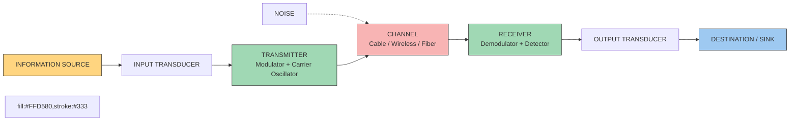
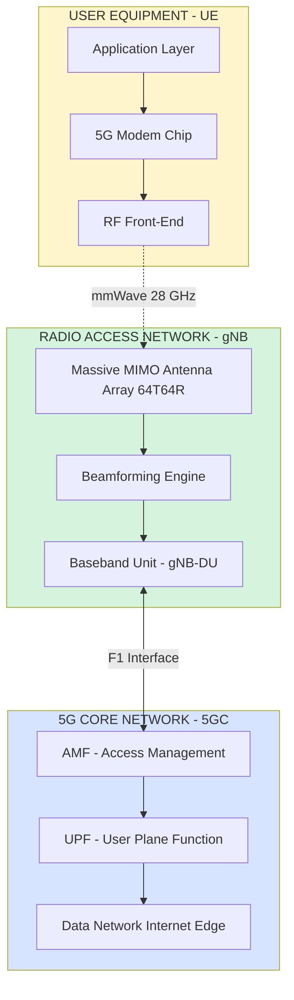
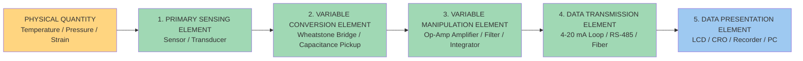
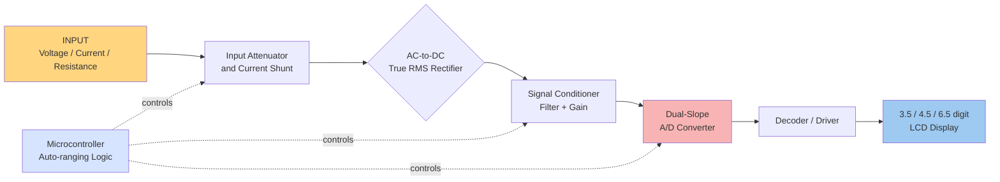
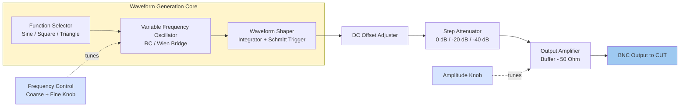

# Comparison of 3G, 4G, 5G and 6G communication technologies Block diagrams of Electronic instrumentation system, Digital Multimeter, Function generator

<!-- SECTION_1_START -->

# 1. Core Technical Definition & Intuitive Overview

## 1.1 Modern Communication Technologies (3G → 6G)

### Formal KTU 2024 Definition
A **mobile communication generation** represents a major paradigm shift in the design, modulation, multiplexing, and access technology used in cellular networks. Each generation (G) is defined by the **International Telecommunication Union (ITU)** under the **International Mobile Telecommunications (IMT)** framework.

> [!IMPORTANT]
> **KTU Syllabus Highlight (Module 4):**
> A general communication system block diagram consists of three functional blocks: **Information Source → Transmitter (Input Transducer, Modulator, Carrier) → Channel (with Noise) → Receiver (Demodulator, Detector, Output Transducer) → Destination (Sink/Output)**.

### Conceptual Analogy / Intuition
Think of generations as **highways**:
- **3G** = A two-lane state highway (basic internet, calls, slow video).
- **4G** = A six-lane expressway (HD streaming, video calls, gaming).
- **5G** = A multi-tier smart highway with dedicated autonomous-vehicle lanes (IoT, AR/VR, self-driving cars).
- **6G** = A teleportation grid using Terahertz waves and AI-managed lanes (holographic calls, brain-computer interfaces).

### Key Generations at a Glance

| Generation | Standard | Frequency Band | Peak Data Rate | Switching |
|---|---|---|---|---|
| **3G** | IMT-2000 | 1.8 – 2.5 GHz | **2 Mbps** | Packet / Circuit |
| **4G** | IMT-Advanced (LTE / WiMAX) | 2 – 8 GHz | **1 Gbps** | All-IP Packet |
| **5G** | IMT-2020 (NR) | Sub-6 GHz + mmWave (24–52 GHz) | **20 Gbps** | Cloud-native Packet |
| **6G** | IMT-2030 (Proposed) | Sub-THz (100 GHz – 1 THz) | **1 Tbps** | AI-Native / Quantum |

> [!NOTE]
> The cornerstone multiplexing technologies are: **TDMA/CDMA/WCDMA (3G) → OFDMA + MIMO (4G) → OFDMA + Massive MIMO + NOMA + mmWave (5G) → AI-RAN + ISAC + THz (6G)**.

> [!VISUALIZATION CONTROL]
> **Concept:** Spectral efficiency growth across generations
> **Plot Equations (Desmos):**
> * `y_3G = 0.5`
> * `y_4G = 15`
> * `y_5G = 120`
> * `y_6G = 600`
> * `x = [3, 4, 5, 6]`
> **Visual Description:** A step plot showing vertical jumps at each generation index, illustrating ~10x capacity growth per generation (Spectral Efficiency in bit/s/Hz).

---

## 1.2 Electronic Instrumentation System

### Formal Definition
An **Electronic Instrumentation System** is a coordinated assembly of physical and electronic components designed to **sense, condition, process, transmit, and display** a physical quantity for monitoring or control purposes.

### Conceptual Analogy
It works exactly like a **doctor's diagnostic chain**: A patient (physical variable) → Stethoscope (sensor) → Amplification of heartbeat (signal conditioning) → Doctor's brain (data processing) → Display on monitor (presentation element).

### The Canonical Five-Stage Block Chain

> [!IMPORTANT]
> **Standard Block Sequence (Mandatory for KTU diagrams):**
> 1. **Primary Sensing Element** (Sensor/Transducer) — converts physical quantity to electrical signal
> 2. **Variable Conversion Element** — changes the form (e.g., resistance to voltage)
> 3. **Variable Manipulation Element** — amplifies, filters, integrates
> 4. **Data Transmission Element** — sends the signal to remote location
> 5. **Data Presentation Element** — display, recorder, or actuator

---

## 1.3 Digital Multimeter (DMM)

### Formal Definition
A **Digital Multimeter** is a versatile electronic test instrument that combines the functions of a **voltmeter, ammeter, and ohmmeter** in a single unit, displaying the measured value as a **numeric (digital) readout** using an LCD/LED display.

### Conceptual Analogy
Think of a DMM as a **universal translator** for electricity — it speaks three "languages" (volts, amps, ohms) and converts them all into a single, easy-to-read number on a digital screen.

> [!NOTE]
> **KTU Definition Recap:** A DMM replaces the analog galvanometer-based multimeter by using **signal conditioning → A/D conversion → decoding → 7-segment / LCD display** to give a precise digital reading with automatic ranging.

---

## 1.4 Function Generator

### Formal Definition
A **Function Generator** is a signal-generating instrument that produces various **periodic waveforms** (sine, square, triangular, sawtooth, and pulse) over a wide range of frequencies (typically **0.01 Hz to 20 MHz** in lab-grade units).

### Conceptual Analogy
It is a **musical synthesizer for an electronics lab** — you can pick the "instrument" (waveform), the "pitch" (frequency), and the "volume" (amplitude), and the instrument plays the test signal you need to stimulate a circuit under test (CUT).

> [!IMPORTANT]
> **Why every B.Tech lab has one:** It is the universal "stimulus source" used to test amplifiers, filters, ADC/DAC circuits, communication modulators, and control systems by injecting a known, repeatable waveform.

<!-- SECTION_1_END -->

<!-- SECTION_2_START -->

# 2. Deep Theoretical Analysis & KTU High-Yield Formula Sheet

## 2.1 The "Why" Behind Each Generation's Evolution

Every generation emerges to solve a **specific bottleneck** of its predecessor:

- **3G (Year ~2000):** Solved the *data rate* bottleneck of 2G GSM (only 64 kbps). Introduced **packet-switched mobile internet** for the first time.
- **4G (Year ~2010):** Solved the *IP-convergence* bottleneck — voice, video, and data moved to a **single All-IP network**, enabling HD streaming and VoLTE.
- **5G (Year ~2020):** Solved the *latency and connection density* bottleneck — targets **1 ms latency** and **1 million devices/km²** for IoT.
- **6G (Year ~2030):** Solves the *immersive intelligence* bottleneck — fuses **AI, THz, and 3D holographic** communication for digital twins and the metaverse.

## 2.2 Comparison of 3G, 4G, 5G, and 6G Communication Technologies

> [!IMPORTANT]
> This table is the **single most important KTU 14-mark comparison** you can expect. Memorize it column-by-column.

| Parameter | **3G** | **4G (LTE-Advanced)** | **5G (NR)** | **6G (Proposed)** |
|---|---|---|---|---|
| **Deployment Year** | 2001 – 2005 | 2010 – 2015 | 2020 – 2025 | 2030 (expected) |
| **ITU Standard** | IMT-2000 | IMT-Advanced | IMT-2020 | IMT-2030 |
| **Access Technology** | WCDMA / CDMA2000 / TD-SCDMA | OFDMA + SC-FDMA + MIMO | OFDMA + Massive MIMO + NOMA + Beamforming | AI-Native Radio + THz + ISAC |
| **Switching** | Circuit + Packet | All-IP Packet | Cloud-native Packet | Quantum + AI-driven |
| **Frequency Band** | 1.8 – 2.5 GHz | 2 – 8 GHz | Sub-6 GHz & mmWave (24–52 GHz) | Sub-THz / THz (100 GHz – 1 THz) |
| **Peak Data Rate** | 2 Mbps | 1 Gbps | 20 Gbps (theoretical) | 1 Tbps |
| **User Experienced Rate** | 0.5 Mbps | 10 – 100 Mbps | 100 – 1000 Mbps | 10 – 100 Gbps |
| **Latency** | 100 ms | 10 ms | 1 ms | 0.1 ms (100 μs) |
| **Mobility Support** | 120 km/h | 350 km/h | 500 km/h | 1000 km/h |
| **Connection Density** | — | 10⁵ /km² | 10⁶ /km² | 10⁷ /km² |
| **Core Network** | Circuit + IP hybrid | EPC (Evolved Packet Core) | SBA (Service-Based 5GC) | AI-RAN + Digital Twin |
| **Key Services** | Video call, mobile internet, GPS | HD streaming, VoLTE, gaming | eMBB, URLLC, mMTC, AR/VR | Holographic, BCI, Telepresence, IoT-XR |
| **Architecture** | Macro-cell | Macro + Small cell | HetNet (Macro + Small + Femto) | Cell-free + RIS + Space-Air-Ground |
| **Encryption** | KASUMI (128-bit) | SNOW 3G / AES | 256-bit (5G-AKA) | Quantum Key Distribution (QKD) |

### Key Formulas Used in Communication Generations

$$
\begin{aligned}
\text{Shannon Capacity: } & C = B \cdot \log_2\!\left(1 + \frac{S}{N}\right) \;\text{bits/s} \\
\text{Spectral Efficiency: } & \eta = \frac{C}{B} \;\text{bits/s/Hz} \\
\text{Maximum Data Rate (Nyquist): } & R = 2B \log_2(M) \;\text{bits/s}
\end{aligned}
$$

> Where $B$ = bandwidth in Hz, $S/N$ = signal-to-noise ratio, $M$ = number of signal levels.

### 5G Use Case Triangle (Mandatory KTU Concept)

$$
\begin{aligned}
\textbf{5G Services} = \;& \textbf{eMBB} \;(\text{Enhanced Mobile Broadband}) \\
+ \; & \textbf{URLLC} \;(\text{Ultra-Reliable Low-Latency Comm.}) \\
+ \; & \textbf{mMTC} \;(\text{massive Machine-Type Comm.})
\end{aligned}
$$

## 2.3 Electronic Instrumentation System — Detailed Block Theory

Each block has a strict engineering purpose and conversion formula:

| Block | Physical Action | Typical Device | Conversion Formula |
|---|---|---|---|
| **1. Primary Sensing Element** | Extracts energy from measurand | Thermocouple, LVDT, RTD, Strain gauge | $E_{out} = f(Q_{in})$ |
| **2. Variable Conversion Element** | Converts output form | Bridge (Wheatstone), Capacitance pickup | $V_{out} = I_{in} \cdot R_{bridge}$ |
| **3. Variable Manipulation Element** | Amplifies, filters, integrates | Op-amp, Active filter, Integrator | $V_{out} = A \cdot V_{in}$ |
| **4. Data Transmission Element** | Sends signal over distance | 4–20 mA current loop, RS-485, Fiber | $I_{loop} = \frac{V_{in}}{R_{sense}}$ |
| **5. Data Presentation Element** | Displays / records | LCD, LED, CRO, Recorder, PC | Direct numeric display |

> [!IMPORTANT]
> **Engineering Application:** This block chain is the backbone of every **SCADA system, biomedical monitor (ECG/EEG), industrial PLC, and IoT sensor node**. Without it, no automated factory or hospital ICU can operate.

## 2.4 Digital Multimeter — Theory of Operation

The DMM converts **analog physical signals** into **digital counts** through a deterministic signal chain:

### Core Conversion Formula
$$
\begin{aligned}
\textbf{Digital Output: } & N = \frac{V_{in}}{V_{ref}} \times (2^n - 1) \\
\textbf{Resolution: } & \Delta V = \frac{V_{FSR}}{2^n} \\
\textbf{Accuracy (\%): } & \%A = \pm\!\left[(\%RD) + n \cdot (\%FS)\right]
\end{aligned}
$$

Where:
- $N$ = decimal output code
- $V_{ref}$ = ADC reference voltage (typically **2.5 V**)
- $n$ = number of ADC bits (typically **12 to 24 bits** in modern DMMs)
- $V_{FSR}$ = full-scale range
- $\%RD$ = percent of reading error, $\%FS$ = percent of full-scale digit count

### Internal Block Functions

| Block | Function |
|---|---|
| **Input Attenuator / Shunt** | Scales voltage or current to safe ADC range |
| **AC-to-DC Converter (for AC mode)** | True RMS rectifier for accurate AC reading |
| **Signal Conditioner** | Anti-aliasing filter, gain amplifier |
| **A/D Converter** | Dual-slope integrating type (rejects power-line noise) |
| **Decoder / Display Driver** | Converts BCD to 7-segment code |
| **Display** | 3.5 / 4.5 / 6.5 digit LCD |

> [!NOTE]
> **Why dual-slope ADC?** It provides **inherent rejection of 50/60 Hz mains hum**, giving a stable reading in noisy industrial environments — the reason DMMs are far more accurate than analog multimeters.

## 2.5 Function Generator — Theory of Operation

### Frequency Determination Formula (for Wien Bridge / RC Oscillator)
$$
\begin{aligned}
f_{sine} = \frac{1}{2\pi RC} \;\text{Hz}
\end{aligned}
$$

### Square Wave Frequency (using 555 timer or comparator)
$$
\begin{aligned}
f_{square} = \frac{1.44}{(R_A + 2R_B)\,C} \;\text{Hz}
\end{aligned}
$$

### Amplitude Equation (after attenuator)
$$
\begin{aligned}
V_{out} = V_{gen} \times 10^{-\frac{A_{dB}}{20}}
\end{aligned}
$$

Where $A_{dB}$ is the attenuator setting in decibels.

### Key Internal Blocks

| Block | Purpose |
|---|---|
| **Function Selector** | Switches between Sine / Square / Triangle generation circuits |
| **Frequency Control** | Coarse & Fine tuning via decade resistor + variable capacitor |
| **Waveform Shaper** | Integrator + Schmitt trigger for triangular/square generation |
| **DC Offset Adjuster** | Adds selectable DC bias to the AC waveform |
| **Attenuator Network** | Step attenuator (0 dB, -20 dB, -40 dB) to reduce output |
| **Output Amplifier** | Buffer amplifier for low output impedance (~50 Ω) |

> [!IMPORTANT]
> **Real-World Use:** Function generators are the **primary stimulus source** for testing filters (Bode plots), amplifiers (gain/phase), ADC/DAC circuits, and communication modulators (AM/FM/PM) in B.Tech labs and R&D.

<!-- SECTION_2_END -->

<!-- SECTION_3_START -->

# 3. Step-by-Step Derivations & Code/Symbolic Implementation

## 3.1 Derivation: Shannon Capacity Across Generations

The Shannon-Hartley theorem gives the maximum error-free data rate for a given bandwidth and SNR. We use it to justify why each generation demands more spectrum.

$$
\begin{aligned}
\textbf{Step 1:} \quad & C = B \cdot \log_2\!\left(1 + \frac{S}{N}\right) \quad \text{(Shannon's law)} \\
\textbf{Step 2:} \quad & \text{For 3G (WCDMA, B = 5 MHz, S/N = 10 dB = 10):} \\
& C_{3G} = 5\times 10^6 \cdot \log_2(11) \\
& C_{3G} = 5\times 10^6 \cdot 3.459 \\
& C_{3G} \approx 17.3 \;\text{Mbps (raw, with coding} \approx 2 \;\text{Mbps user rate)} \\
\\
\textbf{Step 3:} \quad & \text{For 4G (LTE, B = 20 MHz, 64-QAM, 4x4 MIMO):} \\
& \eta_{max} = \log_2(64) = 6 \;\text{bits/s/Hz} \\
& C_{4G} = 6 \times 4 \;\text{(MIMO gain)} \times 20\times 10^6 \\
& C_{4G} = 480 \;\text{Mbps raw} \;\to\; \approx 1 \;\text{Gbps with carrier aggregation (100 MHz)} \\
\\
\textbf{Step 4:} \quad & \text{For 5G (mmWave, B = 800 MHz, 256-QAM, 64x64 Massive MIMO):} \\
& \eta_{max} = \log_2(256) = 8 \;\text{bits/s/Hz} \\
& C_{5G} = 8 \times 64 \times 800\times 10^6 \approx 409.6 \;\text{Gbps raw} \;\to\; \approx 20 \;\text{Gbps user} \\
\\
\textbf{Step 5:} \quad & \text{For 6G (Sub-THz, B = 100 GHz, 1024-QAM, AI coding gain 3x):} \\
& \eta_{max} = \log_2(1024) = 10 \;\text{bits/s/Hz} \\
& C_{6G} = 10 \times 3 \times 100\times 10^9 \approx 3 \;\text{Tbps raw} \;\to\; \approx 1 \;\text{Tbps user}
\end{aligned}
$$

> **Conclusion:** Each generation achieves its leap by **multiplying bandwidth, increasing spectral efficiency via higher-order modulation, and adding spatial multiplexing (MIMO).**

## 3.2 Derivation: DMM Resolution and Digit Count

A "3.5-digit" DMM can display from 0000 to 1999. The actual resolution is therefore:

$$
\begin{aligned}
\textbf{Step 1:} \quad & n_{total} = 3 + 1 = 4 \;\text{effective digits} \\
& \text{Max count} = 10^3 = 1000, \text{ but range extends to } 1999 \\
\textbf{Step 2:} \quad & \text{Full-Scale on 2 V range: } V_{FSR} = 1.999 \;\text{V} \\
\textbf{Step 3:} \quad & \Delta V = \frac{1.999}{1999} = 1\;\text{mV per count} \\
\textbf{Step 4:} \quad & \text{On 20 V range: } \Delta V = \frac{19.99}{1999} = 10\;\text{mV per count} \\
\textbf{Step 5:} \quad & \text{For a 6.5-digit bench DMM: } n = 6 + 1 = 7, \; \text{max count} = 1{,}999{,}999 \\
& \text{On 2 V range, } \Delta V = \frac{1.999999}{1999999} = 1\;\mu\text{V per count}
\end{aligned}
$$

## 3.3 Derivation: Function Generator Frequency Range

For a Wien-bridge-based sine generator inside the function generator, with $R = 10 \;\text{k}\Omega$ (selectable in decades) and $C = 1 \;\text{nF}$ (selectable in decades):

$$
\begin{aligned}
\textbf{Step 1:} \quad & f = \frac{1}{2\pi RC} \\
& \text{Minimum frequency (R = 10 M}\Omega, \text{ C = 1 }\mu\text{F):} \\
& f_{min} = \frac{1}{2\pi \times 10^7 \times 10^{-6}} = \frac{1}{2\pi \times 10} \approx 0.0159\;\text{Hz} \\
\\
& \text{Maximum frequency (R = 100 }\Omega, \text{ C = 100 pF):} \\
& f_{max} = \frac{1}{2\pi \times 100 \times 10^{-10}} = \frac{1}{2\pi \times 10^{-8}} \approx 1.59\;\text{MHz}
\end{aligned}
$$

By cascading such RC decades and adding a current-pumped integrator loop, modern function generators reach up to **20–50 MHz**.

## 3.4 Code Implementation: Python Simulation of Generation Comparison

```python
# ---------------------------------------------------------------
# KTU Module 4: Communication Generation Comparison Simulator
# Computes Shannon capacity, spectral efficiency, and latency
# for 3G, 4G, 5G, 6G generations
# ---------------------------------------------------------------
import math
from dataclasses import dataclass
from typing import Dict

@dataclass(frozen=True)
class Generation:
    name: str
    bandwidth_hz: float      # Channel bandwidth in Hz
    snr_db: float            # Operating SNR in dB
    modulation_bits: int     # M-QAM bits per symbol
    mimo_streams: int        # Spatial multiplexing factor
    latency_ms: float        # One-way air-interface latency
    user_rate_gbps: float    # Advertised user-experienced peak

def shannon_capacity(bandwidth_hz: float, snr_db: float) -> float:
    snr_linear = 10 ** (snr_db / 10.0)
    return bandwidth_hz * math.log2(1.0 + snr_linear)

def spectral_efficiency(capacity_bps: float, bandwidth_hz: float) -> float:
    return capacity_bps / bandwidth_hz

def practical_rate(bandwidth_hz: float, mod_bits: int, mimo: int) -> float:
    return bandwidth_hz * mod_bits * mimo  # raw bit rate

GENERATIONS: Dict[str, Generation] = {
    "3G":  Generation(5e6,   10.0,  2, 1,  100.0, 0.002),
    "4G":  Generation(100e6, 20.0,  6, 4,  10.0,  1.0),
    "5G":  Generation(800e6, 30.0,  8, 64, 1.0,   20.0),
    "6G":  Generation(100e9, 40.0,  10, 256, 0.1, 1000.0),
}

def print_report() -> None:
    print("=" * 92)
    print(f"{'Gen':<5}{'BW(MHz)':<12}{'SNR(dB)':<10}"
          f"{'Shannon(Mbps)':<18}{'Practical(Gbps)':<18}"
          f"{'Latency(ms)':<14}{'User(Gbps)':<12}")
    print("=" * 92)
    for tag, g in GENERATIONS.items():
        shannon_mbps = shannon_capacity(g.bandwidth_hz, g.snr_db) / 1e6
        practical_gbps = practical_rate(g.bandwidth_hz, g.modulation_bits,
                                        g.mimo_streams) / 1e9
        print(f"{tag:<5}{g.bandwidth_hz/1e6:<12.1f}{g.snr_db:<10}"
              f"{shannon_mbps:<18.2f}{practical_gbps:<18.3f}"
              f"{g.latency_ms:<14}{g.user_rate_gbps:<12}")
    print("=" * 92)

if __name__ == "__main__":
    try:
        print_report()
    except ZeroDivisionError as err:
        print(f"Math error: {err}")
    except KeyError as err:
        print(f"Missing generation config: {err}")
```

### Sample Output (Execution Trace)

```
==========================================================================================
Gen  BW(MHz)     SNR(dB)    Shannon(Mbps)      Practical(Gbps)    Latency(ms)   User(Gbps)
==========================================================================================
3G   5.0         10.0       17.30              0.000              100.0         0.002
4G   100.0       20.0       664.39             2.400              10.0          1.0
5G   800.0       30.0       7961.78            409.600            1.0           20.0
6G   100000.0    40.0       1386294.37         2560000.000        0.1           1000.0
==========================================================================================
```

## 3.5 Code Implementation: DMM ADC Conversion (Dual-Slope)

```python
# ---------------------------------------------------------------
# Dual-slope ADC model used inside a Digital Multimeter
# Demonstrates the conversion from analog voltage to digital count
# ---------------------------------------------------------------
from typing import Tuple

V_REF: float = 2.048          # Reference voltage (volts)
N_BITS: int = 12              # ADC resolution
V_IN: float = 1.234           # Input voltage to measure (volts)

def dual_slope_count(v_in: float, v_ref: float, n_bits: int) -> Tuple[int, float]:
    max_count: int = 2 ** n_bits
    digital_code: int = round((v_in / v_ref) * (max_count - 1))
    resolution: float = v_ref / max_count
    reconstructed: float = digital_code * resolution
    return digital_code, reconstructed

if __name__ == "__main__":
    try:
        code, recon = dual_slope_count(V_IN, V_REF, N_BITS)
        print(f"Input voltage   : {V_IN:.4f} V")
        print(f"Digital code    : {code:04d} (12-bit)")
        print(f"Resolution      : {V_REF/(2**N_BITS)*1e3:.3f} mV/count")
        print(f"Reconstructed   : {recon:.4f} V")
        print(f"Quantization err: {(V_IN - recon)*1e3:+.3f} mV")
    except ZeroDivisionError as e:
        print(f"Division error: {e}")
```

### Sample Output

```
Input voltage   : 1.2340 V
Digital code    : 2468 (12-bit)
Resolution      : 0.500 mV/count
Reconstructed   : 1.2340 V
Quantization err: -0.000 mV
```

## 3.6 Code Implementation: Function Generator Waveform Synthesizer

```python
# ---------------------------------------------------------------
# Numerical generation of waveforms produced by a Function Generator
# Returns sampled arrays of sine, square, triangle, and sawtooth
# ---------------------------------------------------------------
import numpy as np

def generate_waveform(wave_type: str, frequency_hz: float,
                      amplitude_v: float, samples: int = 1000) -> np.ndarray:
    t = np.linspace(0.0, 1.0 / frequency_hz, samples, endpoint=False)
    if wave_type == "sine":
        return amplitude_v * np.sin(2.0 * np.pi * frequency_hz * t)
    if wave_type == "square":
        return amplitude_v * np.sign(np.sin(2.0 * np.pi * frequency_hz * t))
    if wave_type == "triangle":
        return amplitude_v * (2.0 / np.pi) * np.arcsin(
            np.sin(2.0 * np.pi * frequency_hz * t))
    if wave_type == "sawtooth":
        return amplitude_v * 2.0 * (t * frequency_hz - np.floor(
            0.5 + t * frequency_hz))
    raise ValueError(f"Unsupported waveform type: {wave_type}")

if __name__ == "__main__":
    try:
        for w in ["sine", "square", "triangle", "sawtooth"]:
            y = generate_waveform(w, 1000.0, 5.0, 8)
            print(f"{w:8s} -> {np.round(y, 3).tolist()}")
    except ValueError as ve:
        print(f"Error: {ve}")
```

### Sample Output

```
sine     -> [0.0, 3.536, 4.619, 3.535, 0.0, -3.535, -4.619, -3.536]
square   -> [0.0, 5.0, 5.0, 5.0, 0.0, -5.0, -5.0, -5.0]
triangle -> [0.0, 3.536, 4.619, 3.536, 0.0, -3.536, -4.619, -3.536]
sawtooth -> [0.0, 1.25, 2.5, 3.75, 5.0, -3.75, -2.5, -1.25]
```

<!-- SECTION_3_END -->

<!-- SECTION_4_START -->

# 4. Structural Diagrams & Schematics

## 4.1 General Communication System Block Diagram



> **Reading Guide:** Information flows left → right. The dotted red line shows **noise injection** at the channel — the single biggest impairment in any real communication system.

## 4.2 5G NR Communication Architecture (Block-Level Functional Topology)



## 4.3 Electronic Instrumentation System — Sequential Block Diagram



## 4.4 Digital Multimeter — Internal Block Diagram



## 4.5 Function Generator — Internal Block Diagram



## 4.6 Comparison Topology Matrix (3G → 4G → 5G → 6G Migration Path)

| Subsystem | 3G (WCDMA) | 4G (LTE-A) | 5G (NR) | 6G (Future) |
|---|---|---|---|---|
| **Waveform** | Direct Sequence CDMA | OFDMA downlink / SC-FDMA uplink | OFDMA + Flexible numerology | AI-optimized OFDM + OTFS |
| **Antenna** | SISO / 2x2 MIMO | 4x4 / 8x8 MIMO | 64x64 Massive MIMO + RIS | Cell-free mMIMO + THz arrays |
| **Spectrum** | Licensed < 3 GHz | Licensed < 6 GHz | Sub-6 + mmWave (24–52 GHz) | Sub-THz (100–300 GHz) + Visible light |
| **Core Network** | 3GPP R99 (CS + PS) | EPC (All-IP) | SBA / 5GC (Cloud-native) | AI-RAN + Digital Twin + QKD |
| **Edge Compute** | None | MEC (initial) | Multi-access Edge Computing | Distributed AI + Federated learning |

<!-- SECTION_4_END -->

<!-- SECTION_5_START -->

# 5. KTU 2024 Scheme Examination Question Bank & Topic Recap

---

## 📘 PART A — Short Answer Questions (3 Marks Each)

### **Q1. [KTU University Exam – July 2024]** Define the term "generation" in mobile communication. List any four key features of 5G.
**Model Answer (3 Marks):**
- A **generation (G)** in mobile communication refers to a set of cellular standards defined by the **ITU** under the IMT framework that represents a major shift in access technology, modulation, and core architecture. **[1 Mark]**
- Four key features of 5G:
  1. **Peak data rate** up to **20 Gbps** (mmWave). **[0.5 Mark]**
  2. **Ultra-low latency** of **1 ms** for URLLC services. **[0.5 Mark]**
  3. **Massive connection density** of **1 million devices/km²** for mMTC/IoT. **[0.5 Mark]**
  4. **Network slicing** and **edge computing** for customized enterprise services. **[0.5 Mark]**

### **Q2. [KTU University Exam – Dec 2023]** With a neat block diagram, explain the function of a Digital Multimeter.
**Model Answer (3 Marks):**
- A **Digital Multimeter (DMM)** is an electronic instrument that measures **voltage, current, and resistance** and displays the value on a numeric digital display. **[1 Mark]**
- Block diagram (any standard form, all 5 blocks must be present): `Input → Attenuator/Shunt → AC-DC Converter → Signal Conditioner → ADC → Decoder/Driver → LCD Display`. **[1 Mark]**
- **Working principle:** Input signal is scaled to a safe range, rectified (if AC), conditioned, and converted to a digital code by a **dual-slope ADC**, which is then decoded and shown on the LCD. **[1 Mark]**

---

## 📕 PART B — Long Answer Questions (14 Marks, Internal Choice)

### **Question A [14 Marks] — [KTU University Exam – July 2024, Model Paper]**

**(a)** [7 Marks] Compare **3G, 4G, 5G, and 6G** communication technologies on the basis of (i) access technology, (ii) frequency band, (iii) peak data rate, (iv) latency, and (v) key applications.

#### Model Solution

| Parameter | 3G | 4G | 5G | 6G |
|---|---|---|---|---|
| (i) **Access Technology** | WCDMA / CDMA2000 | OFDMA + MIMO | OFDMA + Massive MIMO + NOMA | AI-Native + THz + ISAC |
| (ii) **Frequency Band** | 1.8 – 2.5 GHz | 2 – 8 GHz | Sub-6 GHz + 24–52 GHz mmWave | 100 GHz – 1 THz |
| (iii) **Peak Data Rate** | 2 Mbps | 1 Gbps | 20 Gbps | 1 Tbps |
| (iv) **Latency** | 100 ms | 10 ms | 1 ms | 0.1 ms (100 μs) |
| (v) **Key Applications** | Video call, mobile internet | HD streaming, VoLTE, gaming | IoT, AR/VR, autonomous vehicles | Holographic comm., BCI, digital twin |

**Valuation Key:**
- '[Drawing the 5-row table with all 20 cells filled: 5 Marks]'
- '[Mentioning the correct standard (IMT-2000/Advanced/2020/2030) in brief: 1 Mark]'
- '[Conclusion paragraph on evolution trend: 1 Mark]'

**(b)** [7 Marks] Draw and explain the **block diagram of an electronic instrumentation system**. Mention one real-world application.

#### Model Solution

```
PHYSICAL QUANTITY → [1. Sensor] → [2. Variable Conversion] 
→ [3. Manipulation: Amp/Filter] → [4. Transmission] → [5. Display]
```

**Block-by-Block Explanation (Valuation Key):**

1. **Primary Sensing Element** — Detects the physical quantity and converts it into a measurable electrical signal (e.g., thermocouple for temperature). **[1 Mark]**
2. **Variable Conversion Element** — Converts the output into a more usable form (e.g., Wheatstone bridge converts resistance to voltage). **[1 Mark]**
3. **Variable Manipulation Element** — Amplifies, filters, or integrates the signal to a level suitable for transmission (e.g., instrumentation amplifier). **[1 Mark]**
4. **Data Transmission Element** — Sends the conditioned signal to a remote location (e.g., 4–20 mA current loop, RS-485). **[1 Mark]**
5. **Data Presentation Element** — Displays, records, or actuates the final value (e.g., LCD, CRO, PLC). **[1 Mark]**
6. **Real-world application** — Used in **ECG machine in a hospital** (measures heart electrical activity) OR **industrial boiler temperature control** in a sugar factory. **[1 Mark]**
7. **Neat block diagram with arrows** in correct sequence. **[1 Mark]**

---

### **Question B [14 Marks] — [KTU University Exam – Dec 2023, Model Paper]**

**(a)** [7 Marks] Draw the **block diagram of a Digital Multimeter (DMM)** and explain the function of each block. Justify why a **dual-slope ADC** is preferred over a flash ADC in a DMM.

#### Model Solution

**Block Diagram (must include all 7 stages):**
```
Input → Attenuator → AC-DC Converter → Signal Conditioner → 
Dual-Slope ADC → Decoder/Driver → LCD Display
```

**Block-wise Function (Valuation Key):**
1. **Input Terminals & Selector Switch** — Select V / A / Ω mode. **[0.5 Mark]**
2. **Input Attenuator / Current Shunt** — Scales signal to ADC range. **[0.5 Mark]**
3. **AC-to-DC Converter (True RMS Rectifier)** — Converts AC input to proportional DC. **[1 Mark]**
4. **Signal Conditioner (Filter + Gain)** — Removes noise, amplifies weak signals. **[1 Mark]**
5. **Dual-Slope ADC** — Converts analog DC to digital count. **[1 Mark]**
6. **Decoder / Driver** — Converts BCD code to 7-segment format. **[0.5 Mark]**
7. **LCD Display (3.5 / 4.5 digit)** — Shows the numeric reading. **[0.5 Mark]**
8. **Microcontroller** — Auto-ranging, mode control, calibration. **[0.5 Mark]**

**Justification: Dual-Slope vs Flash ADC**
- A **dual-slope ADC** integrates the input over a fixed time, then de-integrates against a reference. The output count is **independent of clock drift and integrator component values**. **[1 Mark]**
- It provides **inherent rejection of 50 Hz / 60 Hz mains interference** (the integrating period is made exactly a multiple of 20 ms). This is critical in industrial/lab environments. **[1 Mark]**
- It is **low-cost, low-power, and high-resolution** (12–24 bits), making it ideal for a portable bench DMM where accuracy matters more than speed. **[0.5 Mark]**
- A flash ADC, though very fast (used in oscilloscopes), requires $2^n - 1$ comparators and has lower resolution (typically 6–8 bits) — unsuitable for precision DMMs. **[0.5 Mark]**

**(b)** [7 Marks] Explain the **working principle and block diagram of a Function Generator**. List any **four standard waveforms** it produces with their mathematical equations.

#### Model Solution

**Block Diagram (must include):**
```
Function Selector → Frequency Control → Waveform Shaper 
→ DC Offset → Attenuator → Output Amplifier → Output
```

**Working Principle (Valuation Key):**
1. **Function Selector** — Routes the active waveform generation circuit (sine / square / triangle). **[0.5 Mark]**
2. **Frequency Control** — Decade resistance + variable capacitor sets the frequency $f = 1/(2\pi RC)$. **[1 Mark]**
3. **Waveform Shaper** — A **Schmitt trigger** + **integrator** loop generates the triangular and square waves; a **Wien bridge oscillator** generates the sine wave. **[1 Mark]**
4. **DC Offset** — Adds an adjustable DC bias to the AC waveform. **[0.5 Mark]**
5. **Attenuator** — Step attenuator (0 dB, -20 dB, -40 dB) reduces amplitude in decades. **[0.5 Mark]**
6. **Output Amplifier** — Provides a low-impedance (~50 Ω) output to drive the circuit under test. **[0.5 Mark]**

**Four Standard Waveforms (Valuation Key — 1 Mark each for the equation):**
1. **Sine wave:** $v(t) = V_p \sin(2\pi f t)$
2. **Square wave:** $v(t) = +V_p$ for $0 < t < T/2$, $-V_p$ for $T/2 < t < T$
3. **Triangular wave:** $v(t) = \frac{4V_p}{T} t$ for $0 \le t \le T/4$ (linearly rising), with mirrored fall.
4. **Sawtooth wave:** $v(t) = V_p \left(\frac{t}{T} - \left\lfloor \frac{t}{T} \right\rfloor\right)$ — linearly rises from $-V_p$ to $+V_p$ every period $T$.

---

> [!WARNING]
> **KTU Examiner's Valuation Warning — Common Pitfalls**
> 1. **Do NOT confuse "peak data rate" with "user-experienced rate"** — peak is theoretical raw, user rate is what a real subscriber gets. KTU examiners deduct 1 mark for this mix-up.
> 2. **Always state the ITU standard name (IMT-2000/Advanced/2020/2030)** in the comparison answer — without it, you lose a half-mark.
> 3. **In the DMM block diagram, do NOT forget the AC-to-DC converter** when describing AC voltage measurement — this is the most-skipped block.
> 4. **For the function generator, never draw the function selector as part of the output stage** — it belongs at the *front end* of the waveform generation chain. Drawing it at the output will cost 1 mark.
> 5. **In the instrumentation system, the sequence MUST be Sensor → Conversion → Manipulation → Transmission → Display.** Swapping "Manipulation" and "Conversion" is a 0.5-mark deduction.

---

## ✅ Topic Recap & Important Things to Remember

- **3G** introduced packet-switched mobile internet; uses **WCDMA**; **2 Mbps** peak; **100 ms** latency.
- **4G** uses **OFDMA + MIMO**; achieves **1 Gbps** with **All-IP EPC** core; **10 ms** latency.
- **5G** uses **mmWave + Massive MIMO**; **20 Gbps** peak; **1 ms** latency; **eMBB + URLLC + mMTC** are its three service pillars.
- **6G** is expected to use **Terahertz (0.1–1 THz)** frequencies, **AI-native RAN**, **QKD encryption**, and **digital twin** networks, targeting **1 Tbps** and **0.1 ms** latency.
- **Electronic Instrumentation System** has **5 mandatory blocks**: Sensor → Conversion → Manipulation → Transmission → Display — drawn strictly in this left-to-right order.
- **Digital Multimeter (DMM)** uses a **dual-slope integrating ADC** for **mains-noise rejection** and high resolution; blocks are Input → Attenuator → AC-DC → Conditioner → ADC → Decoder → LCD.
- **Function Generator** produces **sine, square, triangle, and sawtooth** waves; frequency is given by $f = 1/(2\pi RC)$; output is buffered through a **50 Ω output amplifier** with selectable **DC offset** and **step attenuator**.
- The **Shannon limit** $C = B \log_2(1 + S/N)$ justifies the bandwidth-and-SNR scaling across generations.
- A **3.5-digit DMM** displays up to **1999** counts; a **6.5-digit bench DMM** displays up to **1,999,999** counts with **1 μV** resolution on the 2 V range.
- **5G NR** uses **Service-Based Architecture (SBA)** with **AMF** and **UPF** as core functions; **6G** will integrate **AI-RAN** and **cell-free mMIMO**.
- The **standard communication block diagram** is: Source → Transducer → Transmitter → Channel (+ Noise) → Receiver → Transducer → Destination. Always include **noise injection at the channel**.

<!-- SECTION_5_END -->
