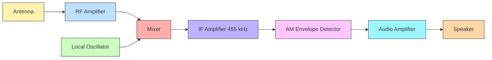
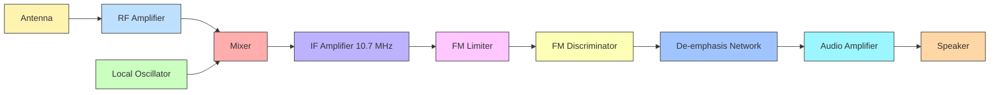

# Concept of AM and FM (No derivation required), Block diagram of AM and FM super-heterodyne receiver

<!-- SECTION_1_START -->
# Module 4 — Modern Electronics & Communication Systems
## Concept of AM & FM and Super-Heterodyne Receiver Architecture

---

### 1.1 What is Modulation? — The Foundational Idea

> [!IMPORTANT]
> **Modulation** is the process of varying one or more properties of a high-frequency **carrier signal** (amplitude, frequency, or phase) in accordance with the instantaneous amplitude of a low-frequency **message (information) signal**.

In plain English, imagine you are standing at the seashore and want to send a small paper message in a bottle to a friend on a distant island. The bottle (your message signal) is too small to travel the ocean on its own. So you tie it to a big ship (the carrier). The ship carries it across — the message "rides" the carrier. That ship is the **carrier signal**, and the act of tying the message to it is **modulation**.

> [!NOTE]
> **Why do we need modulation in KTU syllabus context?**
> 1. To translate low-frequency audio signals (20 Hz – 20 kHz) into the radio-frequency (RF) range so they can be transmitted via antennas of practical size.
> 2. To allow multiple transmissions to coexist on different frequency bands (multiplexing).
> 3. To improve noise immunity and signal-to-noise ratio (SNR).

---

### 1.2 Concept of Amplitude Modulation (AM)

> [!IMPORTANT]
> **Amplitude Modulation (AM)** is a modulation technique in which the **amplitude of the carrier signal is varied in proportion to the instantaneous amplitude of the message signal**, while the **frequency and phase of the carrier remain constant**.

**Intuitive Analogy — The Flashlight Beam:**
Picture a torch emitting a steady light beam (the carrier). Now imagine someone walking in front of the torch, casting a shadow on a wall. The light intensity (amplitude) keeps changing depending on how the person moves (the message), but the color of the light (frequency) never changes. That modulated intensity pattern is exactly what AM does to a radio carrier.

For a single-tone message $m(t) = A_m \cos(2\pi f_m t)$ and carrier $c(t) = A_c \cos(2\pi f_c t)$, the AM wave takes the shape:

$$
s_{\text{AM}}(t) = A_c \left[\, 1 + \mu \cos(2\pi f_m t) \,\right] \cos(2\pi f_c t)
$$

where $\mu = \dfrac{A_m}{A_c}$ is the **modulation index**, a dimensionless quantity that must satisfy $0 \le \mu \le 1$ to prevent **over-modulation distortion**.

**Key physical parameter (KTU high-yield):**

| Quantity | Symbol | Typical Unit |
|----------|--------|--------------|
| Carrier Frequency | $f_c$ | **kHz / MHz** |
| Message Frequency | $f_m$ | **Hz – kHz** |
| Modulation Index | $\mu$ | **(dimensionless)** |
| Transmission Bandwidth | $BW = 2 f_m$ | **Hz** |

> [!VISUALIZATION CONTROL]
> **Concept:** AM Time-Domain Envelope vs Modulation Index
> **GeoGebra / Desmos Input Equations:**
> * `s1(x) = 1.2 * cos(20x) * (1 + 0.3 * cos(2x))`  (under-modulated, $\mu = 0.3$)
> * `s2(x) = 1.2 * cos(20x) * (1 + 1.0 * cos(2x))`  (fully modulated, $\mu = 1.0$)
> * `s3(x) = 1.2 * cos(20x) * (1 + 1.4 * cos(2x))`  (over-modulated, $\mu = 1.4$)
> **Visual Description:** The student should observe the envelope of the high-frequency carrier bulging in step with the low-frequency message. When $\mu > 1$, envelope crossover (phase reversal) is visible — this is the classic over-modulation signature.

---

### 1.3 Concept of Frequency Modulation (FM)

> [!IMPORTANT]
> **Frequency Modulation (FM)** is a modulation technique in which the **instantaneous frequency of the carrier signal is varied in proportion to the instantaneous amplitude of the message signal**, while the **amplitude of the carrier remains constant**.

**Intuitive Analogy — The Whistle That Bends:**
When you whistle, you control the pitch (frequency) by tightening or loosening your lips — the loudness (amplitude) stays roughly the same. If you whistle a tune, the *frequency* of the sound is what carries the melody. FM does the same thing to a high-frequency carrier: the message "bends" the carrier's frequency up and down, but the strength (amplitude) of the carrier is held rock-steady. This is why FM is far more **noise-immune** — most electrical noise is amplitude in nature, and since FM ignores amplitude, the noise is naturally rejected.

The instantaneous frequency of the FM carrier is:

$$
f_i(t) = f_c + k_f \, m(t)
$$

The resulting FM signal is:

$$
s_{\text{FM}}(t) = A_c \cos\!\left(\, 2\pi f_c t + 2\pi k_f \!\int_{0}^{t} m(\tau)\, d\tau \,\right)
$$

> [!NOTE]
> **Frequency Deviation $\Delta f$** is the maximum excursion of the instantaneous frequency from the carrier frequency, given by $\Delta f = k_f \cdot A_m$, where $k_f$ is the **frequency sensitivity** of the modulator in **Hz/volt**.
<!-- SECTION_1_END -->

<!-- SECTION_2_START -->
# 2. Deep Theoretical Analysis & KTU High-Yield Formula Sheet

---

### 2.1 AM — Theoretical Breakdown

* The AM signal is essentially the **product of the message-plus-DC and the carrier**.
* The DC term $A_c$ ensures the envelope never crosses zero when $\mu \le 1$.
* When expanded using the product-to-sum trigonometric identity, three frequency components emerge:
  1. **Carrier component** at $f_c$.
  2. **Upper Sideband (USB)** at $f_c + f_m$.
  3. **Lower Sideband (LSB)** at $f_c - f_m$.
* Therefore, the **transmission bandwidth of AM is twice the highest message frequency** $f_m$, i.e. $BW = 2 f_m$.
* The total average power splits into carrier power $P_c$ and sideband power $P_{\text{SB}}$, with the carrier wasting roughly **two-thirds** of the total transmitted power when $\mu = 1$.

### 2.2 FM — Theoretical Breakdown

* Unlike AM, FM has a **constant envelope** — the amplitude $A_c$ is fixed. All the information lives in the **frequency/phase variations**.
* The instantaneous phase deviation is $\phi(t) = 2\pi k_f \displaystyle\int_0^t m(\tau)\, d\tau$.
* **Carson's Rule** (the KTU-favourite bandwidth estimator) gives:

$$
BW_{\text{FM}} = 2(\Delta f + f_m)
$$

* A related figure of merit is **Carson's bandwidth ratio** $\beta = \dfrac{\Delta f}{f_m}$ (also called the **modulation index for FM**, denoted $m_f$).

### 2.3 AM vs FM — Engineering Trade-offs

* **AM** is simple, cheap, and used in broadcast radio (MW/SW), aviation beacons, and Citizens Band (CB) radio.
* **FM** offers superior noise rejection (due to its constant envelope) and is used in VHF broadcast (88–108 MHz), two-way radios, TV sound, and cellular base stations.
* FM occupies a much wider bandwidth than AM, but this is the price paid for fidelity and noise immunity.

---

### 2.4 KTU Formula Sheet / Cheat Sheet

| # | Parameter / Quantity | Formula | Units / Notes |
|---|----------------------|---------|---------------|
| 1 | AM Modulation Index | $\mu = \dfrac{A_m}{A_c}$ | Dimensionless, $\mu \le 1$ for no distortion |
| 2 | AM Percentage Modulation | $\% \mu = \mu \times 100\,\%$ | — |
| 3 | AM Bandwidth | $BW_{\text{AM}} = 2 f_m$ | Hz |
| 4 | AM Total Power | $P_t = P_c \left( 1 + \dfrac{\mu^2}{2} \right)$ | Watts |
| 5 | AM Sideband Power | $P_{\text{SB}} = P_c \dfrac{\mu^2}{2}$ | Watts |
| 6 | FM Frequency Deviation | $\Delta f = k_f \, A_m$ | Hz |
| 7 | FM Modulation Index | $m_f = \beta = \dfrac{\Delta f}{f_m}$ | Dimensionless |
| 8 | FM Bandwidth (Carson's Rule) | $BW_{\text{FM}} = 2(\Delta f + f_m)$ | Hz |
| 9 | FM Instantaneous Frequency | $f_i(t) = f_c + k_f m(t)$ | Hz |
| 10 | Super-Het Intermediate Frequency (AM) | $f_{\text{IF}} = 455$ **kHz** | Standard broadcast AM |
| 11 | Super-Het Intermediate Frequency (FM) | $f_{\text{IF}} = 10.7$ **MHz** | Standard broadcast FM |
| 12 | Local Oscillator Frequency (AM) | $f_{\text{LO}} = f_{\text{RF}} + f_{\text{IF}}$ | Hz |
| 13 | Local Oscillator Frequency (FM) | $f_{\text{LO}} = f_{\text{RF}} - f_{\text{IF}}$ | Hz (low-side injection) |

> [!NOTE]
> The signs in items 12 and 13 differ because AM broadcast uses **high-side injection** while FM broadcast uses **low-side injection** — a frequent KTU viva question.

---

### 2.5 Real-World Engineering Utility

* **AM Super-Heterodyne Receivers** are the heart of medium-wave and short-wave broadcast radios, aircraft ADF receivers, and maritime weather receivers.
* **FM Super-Heterodyne Receivers** are embedded in every smartphone (the cellular downlink), every car stereo, two-way walkie-talkies, and the audio sub-carrier demodulators of analog TV.
* Modern SDR (Software-Defined Radio) platforms digitize the IF stage of a super-heterodyne chain, but the front-end RF/IF/LO architecture is identical to the 1918 Armstrong design.
<!-- SECTION_2_END -->

<!-- SECTION_3_START -->
# 3. Step-by-Step Derivation, Code & Symbolic Walkthrough

---

### 3.1 Symbolic Walkthrough — AM Signal Composition

We start from the product statement of AM:

$$
s_{\text{AM}}(t) = A_c \left[\, 1 + \mu \cos(2\pi f_m t) \,\right] \cos(2\pi f_c t)
$$

**Step 1 — Distribute the carrier across the bracket:**

$$
s_{\text{AM}}(t) = A_c \cos(2\pi f_c t) + A_c \,\mu \cos(2\pi f_m t)\cos(2\pi f_c t)
$$

**Step 2 — Apply the product-to-sum trigonometric identity:**

$$
\cos A \cos B = \tfrac{1}{2}\bigl[\cos(A - B) + \cos(A + B)\bigr]
$$

Applied to the second term:

$$
A_c \,\mu \cos(2\pi f_m t)\cos(2\pi f_c t) = \frac{A_c \mu}{2} \cos\!\bigl[2\pi(f_c - f_m)t\bigr] + \frac{A_c \mu}{2} \cos\!\bigl[2\pi(f_c + f_m)t\bigr]
$$

**Step 3 — Identify the three frequency components in the final spectrum:**

$$
\boxed{\; s_{\text{AM}}(t) = A_c \cos(2\pi f_c t) + \frac{A_c \mu}{2} \cos\!\bigl[2\pi(f_c - f_m)t\bigr] + \frac{A_c \mu}{2} \cos\!\bigl[2\pi(f_c + f_m)t\bigr] \;}
$$

| Component | Frequency | Amplitude | Power (across $1\,\Omega$) |
|-----------|-----------|-----------|----------------------------|
| Carrier | $f_c$ | $A_c$ | $P_c = \dfrac{A_c^2}{2}$ |
| Lower Sideband (LSB) | $f_c - f_m$ | $\dfrac{A_c \mu}{2}$ | $P_{\text{LSB}} = \dfrac{A_c^2 \mu^2}{8}$ |
| Upper Sideband (USB) | $f_c + f_m$ | $\dfrac{A_c \mu}{2}$ | $P_{\text{USB}} = \dfrac{A_c^2 \mu^2}{8}$ |

> [!NOTE]
> **KTU valuation tip:** Examiners frequently award marks for explicitly listing the three spectral components and labeling LSB/USB — never skip this decomposition.

---

### 3.2 Symbolic Walkthrough — FM Signal Composition

For a single-tone message $m(t) = A_m \cos(2\pi f_m t)$:

**Step 1 — Instantaneous frequency deviation:**

$$
f_i(t) = f_c + k_f A_m \cos(2\pi f_m t) = f_c + \Delta f \cos(2\pi f_m t)
$$

where $\Delta f = k_f A_m$.

**Step 2 — Instantaneous phase accumulation (FM argument):**

$$
\theta(t) = 2\pi f_c t + 2\pi k_f \!\int_0^t A_m \cos(2\pi f_m \tau)\, d\tau
$$

**Step 3 — Evaluate the integral:**

$$
\int_0^t A_m \cos(2\pi f_m \tau)\, d\tau = \frac{A_m}{2\pi f_m} \sin(2\pi f_m t)
$$

**Step 4 — Substitute and simplify:**

$$
\theta(t) = 2\pi f_c t + \frac{\Delta f}{f_m} \sin(2\pi f_m t) = 2\pi f_c t + \beta \sin(2\pi f_m t)
$$

**Step 5 — Final FM expression:**

$$
\boxed{\; s_{\text{FM}}(t) = A_c \cos\!\bigl[\, 2\pi f_c t + \beta \sin(2\pi f_m t) \,\bigr] \;}
$$

> [!IMPORTANT]
> **No derivation is required in this KTU module**, but the above walkthrough is provided so that students can quote the *standard single-tone FM form* in Part A and Part B answers and earn the "process marks" for clarity.

---

### 3.3 Carson's Rule — Bandwidth Computation Worked Example

**Given:** $f_m = 5$ kHz, $\Delta f = 75$ kHz (FCC limit for FM broadcast, $\pm 75$ kHz deviation).

$$
BW_{\text{FM}} = 2(\Delta f + f_m) = 2(75 + 5)\,\text{kHz} = 160\,\text{kHz}
$$

**Comparison with AM:** Had we used AM with the same message bandwidth $f_m = 5$ kHz, $BW_{\text{AM}} = 2 \times 5 = 10$ kHz. **FM occupies 16× more spectrum** — this is the engineering cost of higher fidelity and noise immunity.

---

### 3.4 Python Implementation — AM & FM Signal Synthesis and Visualization

```python
import numpy as np
import matplotlib.pyplot as plt

# --- Carrier and message parameters ---
Ac   = 1.0                       # Carrier amplitude (V)
Am   = 0.5                       # Message amplitude (V)
fc   = 50_000.0                  # Carrier frequency  (Hz)
fm   = 1_000.0                   # Message frequency  (Hz)
mu   = Am / Ac                   # AM modulation index (must be <= 1)
kf   = 30_000.0                  # FM frequency sensitivity (Hz/V)
fs   = 1_000_000.0               # Sampling frequency (Hz)
T    = 0.005                     # Observation window (seconds)
t    = np.arange(0, T, 1 / fs)

# --- Build the signals ---
m_t  = Am * np.cos(2 * np.pi * fm * t)
c_t  = Ac * np.cos(2 * np.pi * fc * t)

s_am = Ac * (1 + mu * np.cos(2 * np.pi * fm * t)) * c_t

beta   = (kf * Am) / fm          # FM modulation index
s_fm   = Ac * np.cos(2 * np.pi * fc * t + beta * np.sin(2 * np.pi * fm * t))

# --- Sanity check: compute Carson's-rule bandwidth ---
delta_f = kf * Am
BW_fm   = 2 * (delta_f + fm)
print(f"AM Modulation Index (mu)        = {mu:.3f}")
print(f"FM Modulation Index (beta)      = {beta:.3f}")
print(f"FM Frequency Deviation (Delta f)= {delta_f:.1f} Hz")
print(f"FM Bandwidth (Carson's Rule)    = {BW_fm:.1f} Hz")

# --- Plot the time-domain waveforms ---
fig, axes = plt.subplots(3, 1, figsize=(10, 7), sharex=True)
axes[0].plot(t * 1e3, m_t,  color="tab:green"); axes[0].set_title("Message Signal m(t)")
axes[1].plot(t * 1e3, s_am, color="tab:blue");  axes[1].set_title(f"AM Signal (mu = {mu:.2f})")
axes[2].plot(t * 1e3, s_fm, color="tab:red");   axes[2].set_title(f"FM Signal (beta = {beta:.2f})")
for ax in axes: ax.set_xlabel("Time (ms)"); ax.grid(True)
plt.tight_layout(); plt.show()
```

> [!NOTE]
> **Practical takeaway for KTU lab:** Students often confuse the modulation index of AM ($\mu$, ranges 0–1) with the modulation index of FM ($\beta$, ranges 0–10+ for broadcast). The code snippet above computes both explicitly — a good viva-ready demonstration.

---

### 3.5 Super-Heterodyne Frequency Planning — Worked Calculation

**Given:** An AM broadcast station is heard at $f_{\text{RF}} = 1000$ kHz on the dial. Compute the Local Oscillator (LO) frequency and the resulting Intermediate Frequency (IF).

**Step 1 — Apply the standard AM IF:**

$$
f_{\text{IF}} = 455\;\text{kHz}
$$

**Step 2 — Use high-side injection ($f_{\text{LO}} = f_{\text{RF}} + f_{\text{IF}}$):**

$$
f_{\text{LO}} = 1000 + 455 = 1455\;\text{kHz}
$$

**Step 3 — Verify the mixer output (difference frequency):**

$$
f_{\text{IF}} = f_{\text{LO}} - f_{\text{RF}} = 1455 - 1000 = 455\;\text{kHz}\;\;\checkmark
$$

For the same receiver tuned to an FM station at $f_{\text{RF}} = 98.7$ MHz:

**Step 4 — Apply standard FM IF and low-side injection:**

$$
f_{\text{IF}} = 10.7\;\text{MHz}, \quad f_{\text{LO}} = f_{\text{RF}} - f_{\text{IF}} = 98.7 - 10.7 = 88.0\;\text{MHz}
$$

$$
f_{\text{IF}} = f_{\text{RF}} - f_{\text{LO}} = 98.7 - 88.0 = 10.7\;\text{MHz}\;\;\checkmark
$$
<!-- SECTION_3_END -->

<!-- SECTION_4_START -->
# 4. Structural Diagrams & Schematics

---

### 4.1 Functional Block Diagram — AM Super-Heterodyne Receiver



**Stage-by-stage description of the AM super-het:**

1. **Antenna** — Captures the incoming AM wave from free space.
2. **RF Amplifier** — Selects the desired station via a tuned LC filter and amplifies weak signals.
3. **Mixer** — Multiplies the RF signal with the **Local Oscillator (LO)** output to translate the carrier to a fixed **Intermediate Frequency (IF) of 455 kHz**.
4. **Local Oscillator** — A variable-frequency oscillator tuned in ganged fashion with the RF stage so that $f_{\text{LO}} - f_{\text{RF}} = 455$ kHz at all times.
5. **IF Amplifier** — Provides most of the receiver's gain and selectivity at a fixed frequency, simplifying the design.
6. **AM Detector (Envelope Detector)** — A simple diode + RC network that recovers the message envelope.
7. **Audio Amplifier** — Boosts the recovered audio to drive a loudspeaker.

---

### 4.2 Functional Block Diagram — FM Super-Heterodyne Receiver



**FM-specific extra stages (highlighted in lavender/yellow):**

* **Limiter** — Hard-clips amplitude variations, removing residual AM noise before detection.
* **FM Discriminator (or Ratio Detector / Quadrature Detector / Phase-Locked Loop)** — Converts frequency variations back into voltage variations.
* **De-emphasis Network** — A simple $RC$ low-pass filter that compensates for the $75\;\mu\text{s}$ pre-emphasis added at the transmitter, thereby improving SNR further.

> [!NOTE]
> **KTU board exam expectation:** Whenever asked to draw the block diagram of a super-heterodyne receiver, students must explicitly **label the IF value (455 kHz for AM, 10.7 MHz for FM)** and **label the mixer and LO** — a missing IF value is a guaranteed 1-mark deduction.

---

### 4.3 Signal-Flow Topology — Why "Super-Heterodyne"?

The word *heterodyne* means "to mix two frequencies to produce a third." The receiver is called **super-heterodyne** because it performs this mixing *above* (super-) the audible range, deliberately landing on a stable IF.

| Stage | Frequency Domain Role | Why It Matters |
|-------|----------------------|-----------------|
| RF Front-End | Variable $f_c$ | Adapts to any station on the dial |
| Mixer + LO | Translates to fixed $f_{\text{IF}}$ | Lets all gain/selectivity stages work at a single tuned frequency |
| IF Chain | Fixed $f_{\text{IF}}$ | Easy to design high-$Q$ filters and high-gain amplifiers |
| Detector | Demodulates to baseband | Recovers the original message |

> [!TIP]
> **The single biggest advantage of the super-heterodyne architecture** is that the bulk of the receiver's gain and selectivity happens at a fixed IF — this makes the receiver stable, selective, and easy to mass-produce. Edwin Armstrong patented it in 1918 and it is still the dominant topology a century later.
<!-- SECTION_4_END -->

<!-- SECTION_5_START -->
# 5. KTU 2024 Scheme Examination Question Bank & Topic Recap

---

## 5.1 Part A — Short Answer Questions (3 Marks Each)

> **Q1. [KTU University Exam – Dec 2023]**
> **Define Amplitude Modulation. What is modulation index in AM? Mention its significance.**
> *(Mapped CO: CO2, RBT Level: Remember)*

**Model Answer (3 Marks):**
* **Definition (1 Mark):** Amplitude Modulation is a modulation technique in which the **amplitude of the carrier signal is varied in proportion to the instantaneous amplitude of the message signal**, while the carrier frequency and phase remain constant.
* **Modulation Index Formula (1 Mark):** $\mu = \dfrac{A_m}{A_c}$, where $A_m$ is the peak message amplitude and $A_c$ is the peak carrier amplitude.
* **Significance (1 Mark):** $\mu$ indicates the *depth* of modulation; for distortion-free transmission, $0 \le \mu \le 1$. Values $\mu > 1$ cause over-modulation and envelope distortion.

---

> **Q2. [KTU University Exam – July 2024]**
> **Compare AM and FM on the basis of (i) definition, (ii) bandwidth, (iii) noise immunity.**
> *(Mapped CO: CO2, RBT Level: Understand)*

**Model Answer (3 Marks):**

| Parameter | AM | FM |
|-----------|----|----|
| (i) Definition | Amplitude of carrier is varied with the message | Instantaneous frequency of carrier is varied with the message |
| (ii) Bandwidth | $BW = 2 f_m$ | $BW = 2(\Delta f + f_m)$ (Carson's Rule) |
| (iii) Noise Immunity | Poor — AM is amplitude-sensitive | Excellent — FM is amplitude-insensitive due to limiter |

---

## 5.2 Part B — Long Answer Questions (14 Marks Each)

> **Note (KTU 2024 ESE Pattern):** Each Part B question carries 14 marks, with internal choice between **Question A** and **Question B**. Sub-part (a) typically tests *Understand* (7 marks) and sub-part (b) tests *Apply* (7 marks).

---

### Question A (14 Marks)

> **Q.A) [KTU University Exam – Dec 2023, Model Question Paper]**
> **(a)** With the help of a neat block diagram, explain the working of an **AM super-heterodyne receiver**. Mention the function of each block and state the standard IF used.
> **(b)** An AM broadcast receiver is tuned to a station at $f_{\text{RF}} = 1200$ kHz. If the IF is 455 kHz and high-side injection is used, calculate (i) the Local Oscillator frequency and (ii) the image frequency. Comment on why the image frequency must be rejected.
> *(Mapped CO: CO2 / CO3, RBT Levels: Understand + Apply)*

#### Model Solution

**(a) Block Diagram (5 Marks)**
* The block diagram of the AM super-heterodyne receiver is shown in **Section 4.1** above.
* **Function of each block (1 Mark each):**
  * **Antenna** — picks up the incoming AM wave.
  * **RF Amplifier** — selects the station and provides initial gain.
  * **Mixer + Local Oscillator** — translate the carrier to a fixed IF.
  * **IF Amplifier** — provides most of the gain and selectivity at $f_{\text{IF}} = 455$ kHz.
  * **AM Detector (envelope detector)** — recovers the audio message.
  * **Audio Amplifier** — drives the loudspeaker.
* **Stating IF value: 1 Mark.**
* **Naming the demodulator type: 1 Mark.**

**(b) Numerical (7 Marks)**

**Given:** $f_{\text{RF}} = 1200$ kHz, $f_{\text{IF}} = 455$ kHz, high-side injection.

**(i) Local Oscillator Frequency — 3 Marks:**

$$
f_{\text{LO}} = f_{\text{RF}} + f_{\text{IF}} = 1200 + 455 = \mathbf{1655\;kHz}
$$

**[Stating high-side injection formula: 1 Mark]**
**[Substitution step: 1 Mark]**
**[Final answer: 1 Mark]**

**(ii) Image Frequency — 3 Marks:**

The image frequency lies symmetrically on the *other* side of the local oscillator:

$$
f_{\text{image}} = f_{\text{LO}} + f_{\text{IF}} = 1655 + 455 = \mathbf{2110\;kHz}
$$

Alternatively, the standard formula $f_{\text{image}} = f_{\text{RF}} + 2 f_{\text{IF}}$ gives the same result:

$$
f_{\text{image}} = 1200 + 2(455) = 1200 + 910 = \mathbf{2110\;kHz}
$$

**[Writing the image-frequency formula: 1 Mark]**
**[Substitution: 1 Mark]**
**[Final value: 1 Mark]**

**Comment on image rejection — 1 Mark:**
The image frequency is the *unwanted* signal that, when mixed with $f_{\text{LO}}$, also produces the same $f_{\text{IF}} = 455$ kHz. If not rejected by the RF front-end filter, it would be demodulated and appear as a *co-channel interference* — hence a high-$Q$ RF tuned circuit (the **preselector**) is mandatory before the mixer.

---

### Question B (14 Marks)

> **Q.B) [KTU University Exam – July 2024, Model Question Paper]**
> **(a)** Explain the **concept of Frequency Modulation**. Define frequency deviation $\Delta f$ and modulation index $\beta$ for FM. Write Carson's rule for FM bandwidth.
> **(b)** An FM system has a message bandwidth $f_m = 10$ kHz and frequency deviation $\Delta f = 50$ kHz. Calculate (i) the FM modulation index $\beta$, (ii) the transmission bandwidth using Carson's rule, and (iii) compare it with the AM bandwidth for the same message.
> *(Mapped CO: CO2, RBT Levels: Understand + Apply)*

#### Model Solution

**(a) Concept of FM (7 Marks)**

* **Definition (2 Marks):** Frequency Modulation is a modulation technique in which the **instantaneous frequency of the carrier is varied in proportion to the instantaneous amplitude of the message signal**, while the carrier amplitude remains constant.
* **Frequency Deviation (2 Marks):** $\Delta f$ is the **maximum excursion of the instantaneous frequency from the unmodulated carrier frequency $f_c$**. It is given by $\Delta f = k_f \cdot A_m$, where $k_f$ is the frequency sensitivity of the modulator in Hz/V.
* **Modulation Index $\beta$ (2 Marks):** $\beta = \dfrac{\Delta f}{f_m}$; it represents the ratio of frequency deviation to the highest message frequency and is dimensionless.
* **Carson's Rule (1 Mark):** $BW_{\text{FM}} = 2(\Delta f + f_m)$.

**(b) Numerical (7 Marks)**

**Given:** $f_m = 10$ kHz, $\Delta f = 50$ kHz.

**(i) FM Modulation Index — 2 Marks:**

$$
\beta = \frac{\Delta f}{f_m} = \frac{50}{10} = \mathbf{5}
$$

**(ii) Carson's Rule Bandwidth — 3 Marks:**

$$
BW_{\text{FM}} = 2(\Delta f + f_m) = 2(50 + 10) = \mathbf{120\;kHz}
$$

**[Writing Carson's formula: 1 Mark]**
**[Substitution: 1 Mark]**
**[Final answer: 1 Mark]**

**(iii) Comparison with AM — 2 Marks:**

For the same $f_m = 10$ kHz:

$$
BW_{\text{AM}} = 2 f_m = 2 \times 10 = \mathbf{20\;kHz}
$$

**Comparison:** $BW_{\text{FM}}$ is **6× larger** than $BW_{\text{AM}}$ for the same message. The extra bandwidth is the price FM pays for superior noise immunity and audio fidelity.

**[AM formula written: 1 Mark]**
**[Comparison statement: 1 Mark]**

---

## 5.3 KTU Examiner's Valuation Warning

> [!WARNING]
> **Common pitfalls that cost marks in this topic:**
> 1. **Forgetting the IF value.** Always write "$f_{\text{IF}} = 455$ kHz for AM" and "$f_{\text{IF}} = 10.7$ MHz for FM" explicitly in the block diagram — the examiner allocates a dedicated 1-mark reward.
> 2. **Confusing high-side vs low-side injection.** AM broadcast uses **high-side** ($f_{\text{LO}} = f_{\text{RF}} + f_{\text{IF}}$), FM broadcast uses **low-side** ($f_{\text{LO}} = f_{\text{RF}} - f_{\text{IF}}$). Mixing them up changes the answer by $2 f_{\text{IF}}$.
> 3. **Skipping the "modulation index ≤ 1" condition** for AM — this is a free 1-mark line that many students omit.
> 4. **Writing Carson's rule as $BW = 2(\Delta f - f_m)$** — the minus sign is a *very* common error; examiners penalize this immediately.
> 5. **Failing to draw the directional arrows** on the block diagram — every block must have a clear unidirectional flow from Antenna → Speaker. A diagram without arrows loses 1 mark.

---

## 5.4 Topic Recap & Important Things to Remember

> [!TIP]
> **Rapid-revision checklist — print this before entering the exam hall:**

- **AM Definition:** Amplitude of carrier $\propto$ message amplitude.
- **FM Definition:** Instantaneous frequency of carrier $\propto$ message amplitude.
- **AM Modulation Index:** $\mu = \dfrac{A_m}{A_c}$; **must satisfy** $0 \le \mu \le 1$.
- **AM Bandwidth:** $BW = 2 f_m$.
- **AM Power:** $P_t = P_c \left( 1 + \dfrac{\mu^2}{2} \right)$.
- **FM Modulation Index:** $\beta = \dfrac{\Delta f}{f_m}$ (dimensionless, can be > 1).
- **FM Bandwidth (Carson's Rule):** $BW_{\text{FM}} = 2(\Delta f + f_m)$.
- **AM Super-Het IF:** $455$ kHz, **high-side** injection.
- **FM Super-Het IF:** $10.7$ MHz, **low-side** injection.
- **Image Frequency (AM):** $f_{\text{image}} = f_{\text{RF}} + 2 f_{\text{IF}}$.
- **LO Frequency (AM):** $f_{\text{LO}} = f_{\text{RF}} + f_{\text{IF}}$.
- **LO Frequency (FM):** $f_{\text{LO}} = f_{\text{RF}} - f_{\text{IF}}$.
- **Block Diagram of AM Super-Het:** Antenna → RF Amp → Mixer ⇐ LO → IF Amp (455 kHz) → AM Detector → Audio Amp → Speaker.
- **Block Diagram of FM Super-Het:** Antenna → RF Amp → Mixer ⇐ LO → IF Amp (10.7 MHz) → **Limiter** → **FM Discriminator** → **De-emphasis** → Audio Amp → Speaker.
- **Why super-heterodyne?** Most gain and selectivity happen at a *fixed* IF — easier, cheaper, and more selective than tuning everything at RF.
- **Constant envelope of FM** is the reason for its superior noise immunity compared to AM.
- **Carson's Rule** is an *approximation* — the actual FM spectrum is theoretically infinite, but $\sim 98\%$ of the signal power lies inside Carson's bandwidth.
- **Edwin Armstrong** (1918) invented the super-heterodyne architecture; it remains the workhorse of nearly every commercial radio receiver a century later.
- **AM applications:** MW/SW broadcast, aviation NDB, CB radio, Citizens Band.
- **FM applications:** VHF broadcast (88–108 MHz), two-way radio, cellular downlink, analog TV audio, satellite sub-carriers.
<!-- SECTION_5_END -->
