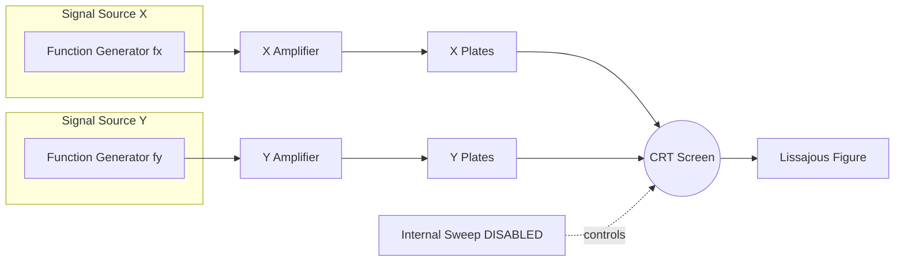
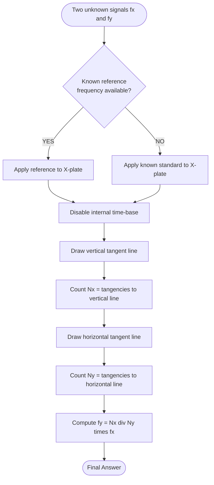
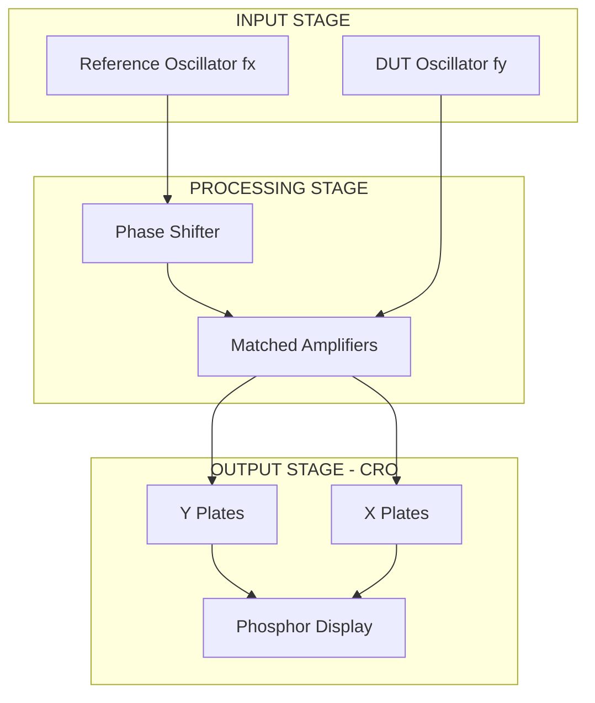

# Introduction to CRO and Lissajous patterns

<!-- SECTION_1_START -->

# 📘 Introduction to CRO and Lissajous Patterns

## 1.1 What is a CRO? — The Formal KTU Definition

> [!NOTE]
> **Cathode Ray Oscilloscope (CRO)** is a versatile electronic test and measurement instrument used to **visualize, measure, and analyze the time-varying waveforms of electrical signals** by displaying them on a phosphor-coated screen as a function of time.

It is essentially the **"eyes of an electronics engineer"** — capable of measuring **voltage, current, frequency, phase, and pulse characteristics** of signals ranging from DC to several hundred MHz.

| Parameter | Typical Specification |
|---|---|
| **Bandwidth** | DC – **500 MHz** (high-end) |
| **Vertical Sensitivity** | **1 mV/div** to **20 V/div** |
| **Time Base Range** | **1 ns/div** to **5 s/div** |
| **Input Impedance** | **1 MΩ** $\parallel$ **20 pF** |

---

## 1.2 Intuitive Analogy — Think of it Like a Movie Camera! 🎬

Imagine you have a movie camera that records a dancing flame. The CRO does the **same thing for electrical signals** — but instead of recording light, it plots **voltage vs. time** on a glowing screen.

- The **electron beam** inside the CRO = the camera's "eye"
- The **phosphor screen** = the movie screen
- The **time-base circuit** = the camera's panning motor that sweeps left to right
- The **signal input** = the "subject" being filmed (your voltage waveform)

When you connect a signal, you literally **"see"** the voltage waving across time, just like watching a moving picture.

---

## 1.3 Lissajous Patterns — The Geometric Fingerprint of Two Signals

> [!IMPORTANT]
> **Lissajous Patterns** are closed-loop figures traced on the CRO screen when **two sinusoidal signals** of (usually) different frequencies are applied simultaneously to the **vertical (Y) and horizontal (X) deflection plates**, with the internal time-base **switched OFF**.

They are named after the French physicist **Jules Antoine Lissajous (1821–1880)**, and they act as a **"geometric signature"** that reveals:
- The **frequency ratio** between two signals
- The **phase difference** between two signals of the same frequency

### Conceptual Intuition
Picture two tuning forks vibrating at different notes. If you attach a tiny pen to each fork (one moving left-right, one moving up-down) and drag a paper underneath, the pen traces a beautiful, never-repeating curve — **that is a Lissajous figure!**

> [!VISUALIZATION CONTROL]
> **Concept:** Lissajous figure for equal frequencies with varying phase
> **Parametric Equations (paste in Desmos):**
> * `x = \sin(t)` (signal on X-plate)
> * `y = \sin(t + \phi)` (signal on Y-plate, with $\phi$ slider)
> **Visual Description:** Move $\phi$ from 0 → $\pi/2$ → $\pi$ and observe: a straight line → ellipse → circle → ellipse → straight line (rotated).

---

<!-- SECTION_1_END -->

<!-- SECTION_2_START -->

# 🔍 Deep Theoretical Analysis & KTU High-Yield Formula Sheet

## 2.1 Block Diagram of a General CRO

The CRO is built from **six major subsystems**, each performing a precise function:

```
┌──────────────────────────────────────────────────┐
│                CATHODE RAY TUBE (CRT)            │
│  (Electron Gun + Deflection Plates + Screen)     │
└────────────────────┬─────────────────────────────┘
                     ▲
        ┌────────────┴────────────┐
        │                         │
┌───────▼────────┐        ┌───────▼─────────┐
│  VERTICAL      │        │  HORIZONTAL    │
│  (Y) AMPLIFIER │        │  (X) AMPLIFIER │
└───────┬────────┘        └───────┬─────────┘
        ▲                         ▲
        │                         │
  ┌─────┴──────┐         ┌────────┴────────┐
  │  VERTICAL  │         │   TIME-BASE    │
  │   INPUT    │         │  (Sweep Gen.)  │
  │  ATTENUATOR│         │ + Sync Circuit │
  └─────┬──────┘         └────────┬────────┘
        ▲                         ▲
        │                         │
   [Signal to                  [Trigger
    be measured]                 source]
```

### 2.1.1 Functional Description of Each Block

> [!NOTE]
> **🟢 Electron Gun** — Emits, accelerates, and focuses a beam of electrons onto the screen. Comprises a **heater (filament)**, **cathode (K)**, **control grid (G)**, **focusing anode (A₁)**, and **accelerating anode (A₂)**.

> [!NOTE]
> **🟢 Deflection Plates** — Two pairs: **Y-plates** (vertical deflection) and **X-plates** (horizontal deflection). When a voltage is applied, they create an electric field that deflects the electron beam.

> [!NOTE]
> **🟢 Phosphor Screen** — Coated with a fluorescent material (e.g., P31 — green, P11 — blue). The kinetic energy of electrons is converted into light, producing the visible spot/glow.

> [!NOTE]
> **🟢 Vertical Amplifier & Attenuator** — Amplifies weak input signals to a level sufficient to drive the Y-plates. Provides calibrated sensitivity (V/div).

> [!NOTE]
> **🟢 Time-Base Generator (Sweep Generator)** — Produces a **sawtooth waveform** that linearly sweeps the beam from left to right at a constant rate, then rapidly returns (flyback). This creates the time axis.

> [!NOTE]
> **🟢 Trigger / Sync Circuit** — Synchronizes the sweep with the input signal so the waveform appears **stationary** on the screen.

---

## 2.2 Working Principle — The Physics

1. The **cathode** is heated → emits electrons via **thermionic emission** (Richardson's Law: $J = A T^2 e^{-W/kT}$).
2. The grid controls **beam intensity (brightness)**.
3. Focusing anodes collimate the beam to a **sharp spot** (~0.5 mm).
4. The **Y-input** deflects the spot vertically: $y = \frac{L \cdot V_y}{2 d E_a}$ where $L$ is screen-to-plate distance, $d$ is plate separation, and $E_a$ is accelerating voltage.
5. The **X-input** (sweep) deflects horizontally: $x = \frac{L \cdot V_x}{2 d E_a}$.
6. The phosphor glows where electrons strike → **persistent trace** is observed.

### 2.2.1 Deflection Sensitivity

> [!IMPORTANT]
> **Deflection Sensitivity** $S = \dfrac{y}{V_y} = \dfrac{L}{2 d E_a}$ **(units: m/V)**

> Higher accelerating voltage = sharper spot BUT lower sensitivity. This is a fundamental **engineering trade-off** in CRT design.

---

## 2.3 Lissajous Patterns — The Mathematics

Consider two signals applied to the CRO:
$$x(t) = V_x \sin(\omega t)$$
$$y(t) = V_y \sin(\omega t + \phi)$$

The beam traces a **parametric curve** whose shape depends on the **frequency ratio** $f_y / f_x$ and the **phase difference** $\phi$.

### 2.3.1 Phase Difference Measurement (when $f_y = f_x$)

> [!IMPORTANT]
> **Method 1 — Ellipse Method (Y-axis intercept):**
> $$\sin(\phi) = \dfrac{y_1}{y_2}$$
> where $y_1$ = Y-intercept of the ellipse, $y_2$ = maximum Y-deflection.

> **Method 2 — Major and Minor Axis Method:**
> $$\sin(\phi) = \dfrac{\text{Minor Axis}}{\text{Major Axis}}$$

### 2.3.2 Frequency Measurement (when $f_y \neq f_x$)

> [!IMPORTANT]
> **Tangent Counting Rule:**
> $$\dfrac{f_y}{f_x} = \dfrac{N_x}{N_y}$$
> where $N_x$ = number of tangencies the figure makes with a **vertical line**, and $N_y$ = number of tangencies with a **horizontal line**.

### 2.3.3 Common Lissajous Figures Table (1:1 Frequency Ratio)

| Phase $\phi$ | Shape |
|:---:|:---|
| $0°$ | Straight line (slope = +1) |
| $45°$ | Ellipse (tilted at 45°) |
| $90°$ | **Circle** (if amplitudes equal) |
| $135°$ | Ellipse (tilted at 135°) |
| $180°$ | Straight line (slope = -1) |

---

## 2.4 KTU Formula Cheat Sheet 📋

| Quantity | Formula | Units |
|---|---|---|
| **Deflection** | $y = \dfrac{L V_y}{2 d E_a}$ | m |
| **Deflection Sensitivity** | $S = \dfrac{L}{2 d E_a}$ | m/V |
| **Deflection Factor** | $G = \dfrac{1}{S} = \dfrac{2 d E_a}{L}$ | V/m |
| **Time period (from sweep)** | $T = (\text{length on X}) \times (\text{time/div})$ | s |
| **Frequency** | $f = \dfrac{1}{T}$ | Hz |
| **Lissajous phase** | $\sin(\phi) = \dfrac{y_{\text{intercept}}}{y_{\text{max}}}$ | — |
| **Lissajous frequency ratio** | $\dfrac{f_y}{f_x} = \dfrac{N_x}{N_y}$ | — |

> [!IMPORTANT]
> **Engineering Real-World Utility:** CROs are used in **telecommunications (signal integrity checks)**, **medical electronics (ECG/EEG monitoring)**, **automotive diagnostics (ignition waveforms)**, and **RF design (S-parameter visualization)**.

---

<!-- SECTION_2_END -->

<!-- SECTION_3_START -->

# ⚙️ Step-by-Step Derivations, Code & Symbolic Implementation

## 3.1 Derivation: Parametric Equations of a Lissajous Figure

### Problem Statement
A signal $v_y = V_y \sin(2\pi f_y t + \phi)$ is applied to the Y-plates and $v_x = V_x \sin(2\pi f_x t)$ is applied to the X-plates. Derive the Cartesian equation of the figure traced on the screen.

### Step 1 — Set up the normalized parametric equations
$$\frac{x}{V_x} = \sin(2\pi f_x t)$$
$$\frac{y}{V_y} = \sin(2\pi f_y t + \phi)$$

### Step 2 — Let $\theta = 2\pi f_x t$, and let the ratio $n = f_y / f_x$
$$x = V_x \sin(\theta)$$
$$y = V_y \sin(n\theta + \phi)$$

### Step 3 — Special case: $n = 1$ (equal frequencies)
For equal frequencies, the figure becomes an **ellipse**:
$$y = V_y \sin(\theta + \phi) = V_y [\sin(\theta)\cos(\phi) + \cos(\theta)\sin(\phi)]$$
$$y = V_y \left[ \frac{x}{V_x} \cos(\phi) + \sin(\phi) \sqrt{1 - \frac{x^2}{V_x^2}} \right]$$

Rearranging gives the **canonical ellipse equation**:
$$\frac{x^2}{V_x^2} - \frac{2 x y \cos(\phi)}{V_x V_y} + \frac{y^2}{V_y^2} = \sin^2(\phi)$$

> This is the **general second-degree equation of an ellipse rotated by angle $\phi/2$**. When $\phi = 0$ or $\pi$, the $\sin^2(\phi) = 0$, giving a **straight line** (degenerate ellipse).

### Step 4 — Y-axis intercept method
Setting $x = 0$ in the parametric form:
$$0 = V_x \sin(\theta) \implies \theta = 0, \pi, 2\pi, \dots$$
At $\theta = 0$: $y_1 = V_y \sin(\phi)$, and the maximum occurs at $\theta = \pi/2$, giving $y_2 = V_y$.
$$\boxed{\sin(\phi) = \frac{y_1}{y_2}}$$

### Step 5 — Frequency ratio by tangency method
The pattern completes a cycle when $f_x t = T_x$ and $f_y t = T_y$. The number of vertical tangencies $N_x$ equals $f_y / f_x$ when the ratio is rational:
$$\boxed{\frac{f_y}{f_x} = \frac{N_x}{N_y}}$$

---

## 3.2 Worked Numerical Example — Phase Measurement

> A CRO displays an ellipse with Y-intercept $= 2$ cm and maximum vertical deflection $= 5$ cm when both X and Y inputs are at the same frequency of 1 kHz. Find the phase difference.

### Solution Steps

Given: $y_1 = 2$ cm, $y_2 = 5$ cm.

**Step 1:** Apply the phase formula:
$$\sin(\phi) = \frac{y_1}{y_2} = \frac{2}{5} = 0.4$$

**Step 2:** Solve for $\phi$:
$$\phi = \arcsin(0.4) = 23.578°$$

**Step 3:** Convert to radians (for completeness):
$$\phi = 23.578° \times \frac{\pi}{180} = 0.4115 \text{ rad}$$

**Step 4:** Check for ambiguity — $\sin(\phi)$ gives two possible angles in $[0, \pi]$:
$$\phi = 23.58° \quad \text{OR} \quad \phi = 180° - 23.58° = 156.42°$$

> [!NOTE]
> **Resolution:** Use the **direction of rotation** of the beam (clockwise vs. counter-clockwise) to disambiguate.

✅ **Final Answer:** $\phi = 23.58°$ or $156.42°$

**Valuation Key (KTU Style):**
- [Stating the formula $\sin(\phi) = y_1 / y_2$: **2 Marks**]
- [Substituting values: **1 Mark**]
- [Computing $\phi = 23.58°$: **1 Mark**]
- [Mentioning ambiguity / direction method: **1 Mark**]

---

## 3.3 Worked Numerical Example — Frequency Ratio

> A Lissajous figure has 3 tangencies to a vertical line and 2 tangencies to a horizontal line. If the X-input frequency is 200 Hz, find the Y-input frequency.

### Solution Steps

**Step 1:** Apply the tangency rule:
$$\frac{f_y}{f_x} = \frac{N_x}{N_y} = \frac{3}{2}$$

**Step 2:** Solve for $f_y$:
$$f_y = \frac{3}{2} \times f_x = \frac{3}{2} \times 200 = 300 \text{ Hz}$$

✅ **Final Answer:** $f_y = 300$ Hz

---

## 3.4 Python Implementation — Lissajous Pattern Simulator 🐍

```python
import numpy as np
import matplotlib.pyplot as plt

def plot_lissajous(fx: float, fy: float, phase_deg: float, T: float = 1.0, n_samples: int = 5000):
    """
    Simulate and plot a Lissajous figure.
    
    Parameters
    ----------
    fx         : float  -> Frequency of X-input signal (Hz)
    fy         : float  -> Frequency of Y-input signal (Hz)
    phase_deg  : float  -> Phase difference phi in degrees
    T          : float  -> Total time duration (seconds)
    n_samples  : int    -> Number of time samples
    
    Returns
    -------
    matplotlib.figure.Figure
    """
    # --- Input validation (absolute boundary checks) ---
    if fx <= 0 or fy <= 0:
        raise ValueError("[ERROR] Frequencies must be strictly positive.")
    if n_samples < 100:
        raise ValueError("[ERROR] n_samples too low for smooth plot.")
    
    # --- Time axis ---
    t = np.linspace(0, T, n_samples)
    
    # --- Parametric equations ---
    phi = np.deg2rad(phase_deg)
    x = np.sin(2 * np.pi * fx * t)
    y = np.sin(2 * np.pi * fy * t + phi)
    
    # --- Auto-select a window containing an integer number of cycles ---
    cycles_window = T * max(fx, fy)
    if cycles_window < 1:
        T = 1.0 / max(fx, fy) * 10  # ensure at least 10 cycles
        t = np.linspace(0, T, n_samples)
        x = np.sin(2 * np.pi * fx * t)
        y = np.sin(2 * np.pi * fy * t + phi)
    
    # --- Plotting ---
    fig, ax = plt.subplots(figsize=(6, 6))
    ax.plot(x, y, color='navy', linewidth=1.2)
    ax.set_aspect('equal')
    ax.grid(True, linestyle='--', alpha=0.5)
    ax.axhline(0, color='black', linewidth=0.6)
    ax.axvline(0, color='black', linewidth=0.6)
    ax.set_title(
        f"Lissajous Figure | fx={fx} Hz, fy={fy} Hz, "
        f"fy/fx={fy/fx:.2f}, phi={phase_deg:.1f} deg",
        fontsize=10
    )
    ax.set_xlabel("X-deflection (a.u.)")
    ax.set_ylabel("Y-deflection (a.u.)")
    return fig


# -------------------------------------------------------------
# DEMO RUN
# -------------------------------------------------------------
if __name__ == "__main__":
    # Case 1: Same frequency, varying phase (1:1 ratio)
    fig1 = plot_lissajous(fx=100, fy=100, phase_deg=45)
    fig1.savefig("lissajous_1to1_phase45.png", dpi=120)
    
    # Case 2: Frequency ratio 3:2
    fig2 = plot_lissajous(fx=100, fy=150, phase_deg=30, T=0.1)
    fig2.savefig("lissajous_3to2.png", dpi=120)
    
    print("[INFO] Lissajous figures generated successfully.")
```

> [!IMPORTANT]
> **Engineering Note:** The `T` parameter must be chosen to contain an **integer number of cycles** of the higher-frequency signal, otherwise the figure will appear as a smeared line. The code above auto-corrects this condition.

---

## 3.5 Derivation: Deflection Sensitivity Trade-off

Given the accelerating voltage $E_a$ and plate geometry, the **time the electron spends inside the deflection plates** is:
$$t_{\text{transit}} = \frac{L_{\text{plate}}}{v_z} = \frac{L_{\text{plate}}}{\sqrt{2 e E_a / m}}$$

The vertical deflection acquired:
$$y = \frac{1}{2} \cdot a \cdot t_{\text{transit}}^2 = \frac{1}{2} \cdot \frac{e V_y}{m d} \cdot \frac{m L_{\text{plate}}^2}{2 e E_a} = \frac{V_y L_{\text{plate}}^2}{4 d E_a}$$

For a uniform deflection region (post-deflection drift to screen), the total deflection is:
$$\boxed{y = \frac{L \cdot V_y}{2 d E_a}}$$

**Insight:** $y \propto \dfrac{1}{E_a}$ — to make the **spot sharper**, increase $E_a$, but this **reduces sensitivity**. CRT designers use **post-deflection acceleration (PDA)** with a helical resistive anode to overcome this trade-off.

---

<!-- SECTION_3_END -->

<!-- SECTION_4_START -->

# 🧭 Structural Diagrams & Schematics

## 4.1 Mermaid Block Diagram — Complete CRO Architecture

```mermaid
flowchart TD
    A1[Signal Input] --> A2[Vertical Attenuator]
    A2 --> A3[Vertical Amplifier]
    A3 --> A4[Y Deflection Plates]
    
    B1[Trigger Source] --> B2[Trigger Circuit]
    B2 --> B3[Time Base Generator]
    B3 --> B4[Horizontal Amplifier]
    B4 --> A5[X Deflection Plates]
    
    subgraph CRT[CATHODE RAY TUBE]
        A6[Heater] --> A7[Cathode]
        A7 --> A8[Control Grid]
        A8 --> A9[Focusing Anode A1]
        A9 --> A10[Accelerating Anode A2]
        A4 -.deflects beam. A11[Electron Beam]
        A5 -.deflects beam. A11
        A10 --> A11
        A11 --> A12[Phosphor Screen]
    end
    
    A13[Power Supply HV] --> A6
    A13 --> A9
    A13 --> A10
    
    A12 --> A14[Glowing Trace on Screen]
```

## 4.2 Mermaid Flow — Lissajous Pattern Formation



## 4.3 Mermaid Decision Tree — Frequency Measurement Procedure



## 4.4 Block Diagram — Lissajous Pattern Generator as an Engineering System



---

<!-- SECTION_4_END -->

<!-- SECTION_5_START -->

# 📝 KTU 2024 Scheme Examination Question Bank & Topic Recap

## Part A — Short Answer Questions (3 Marks Each)

> **Q1.** `[KTU University Exam - July 2024]` **Define CRO. List any four applications.**
>
> **Model Answer (KTU Board Key):**
> A **Cathode Ray Oscilloscope (CRO)** is an electronic instrument used to **visualize, measure, and analyze** time-varying voltage signals by displaying their waveform on a phosphor screen.
> 
> **Applications:**
> 1. Measurement of **voltage, current, and frequency**.
> 2. Observation of **transient and waveform distortion** analysis.
> 3. **Phase difference** measurement using Lissajous figures.
> 4. Inspection of **logic waveforms** in digital circuits.
> 5. Used in **medical equipment** (ECG, EEG monitors).
> 
> **[Definition: 1 Mark | Any 4 Applications: 2 Marks]**

> **Q2.** `[KTU University Exam - Dec 2023]` **What are Lissajous figures? How are they used for frequency measurement?**
>
> **Model Answer:**
> **Lissajous figures** are closed-loop patterns traced on a CRO screen when two sinusoidal signals are applied simultaneously to the X and Y plates (with the internal time-base disabled).
> 
> **For frequency measurement:** A known reference signal of frequency $f_x$ is applied to the X-plate, and the unknown signal $f_y$ to the Y-plate. The frequency ratio is given by:
> $$\frac{f_y}{f_x} = \frac{N_x}{N_y}$$
> where $N_x$ and $N_y$ are the **number of tangencies** with a vertical and horizontal tangent line, respectively.
> 
> **[Definition: 1.5 Marks | Frequency formula and explanation: 1.5 Marks]**

---

## Part B — Long Answer Questions (14 Marks Each)

### **Question A (14 Marks)** — Full CRO + Lissajous

> **`[KTU University Exam - Dec 2023]`** **(a)** Draw the block diagram of a CRO and explain the function of each block. **(7 Marks)**
>
> **(b)** With the help of Lissajous figures, explain how **phase difference and frequency ratio** are measured. **(7 Marks)**

### Model Solution — Part (a)

**Block Diagram (already shown in Section 4.1).** Functions of each block:

1. **Cathode Ray Tube (CRT):** Houses the electron gun, deflection plates, and phosphor screen — the heart of the CRO.
2. **Vertical Amplifier:** Boosts the weak input signal to drive the Y-plates.
3. **Vertical Attenuator:** Reduces large input voltages to safe, calibrated levels.
4. **Time-Base Generator:** Produces a **sawtooth waveform** to sweep the beam horizontally at a uniform rate.
5. **Horizontal Amplifier:** Amplifies the sawtooth signal to drive the X-plates.
6. **Trigger/Sync Circuit:** Locks the sweep start to a specific point on the input waveform → **stable display**.
7. **Power Supply (HV):** Provides heater, focusing, and accelerating voltages.

**[Block Diagram: 2 Marks | 6 Functional descriptions @ 0.75 Marks each: 4.5 Marks | Neatness: 0.5 Mark]**

### Model Solution — Part (b)

**Phase Difference Measurement (when $f_x = f_y$):**
Apply both signals to X and Y plates. The result is an **ellipse** (or straight line / circle depending on $\phi$).

**Two methods:**
- **Y-intercept method:** $\sin(\phi) = y_1 / y_2$
- **Major–minor axis method:** $\sin(\phi) = b / a$ (minor/major axis)

**Frequency Ratio Measurement (when $f_x \neq f_y$):**
- Disable internal sweep.
- Apply known reference $f_x$ to X-plate, unknown $f_y$ to Y-plate.
- Use the **tangent counting rule:** $f_y / f_x = N_x / N_y$

**Example:** If a Lissajous figure shows $N_x = 5$ and $N_y = 3$ with $f_x = 200$ Hz:
$$f_y = \frac{5}{3} \times 200 = 333.33 \text{ Hz}$$

**[Phase method explanation: 2 Marks | Formula: 1 Mark | Frequency method: 2 Marks | Formula and example: 2 Marks]**

---

### **Question B (14 Marks)** — Alternative Choice

> **`[KTU University Exam - July 2024]`** **(a)** Explain the working principle of a CRO with a neat sketch of the **electron gun and deflection system**. Derive the expression for **deflection sensitivity**. **(7 Marks)**
>
> **(b)** Two sinusoidal signals of frequencies **500 Hz** and **750 Hz** are applied to the X and Y plates of a CRO. The Lissajous figure shows **2 tangencies with the horizontal line** and **3 tangencies with the vertical line**. Determine the actual frequencies. **(7 Marks)**

### Model Solution — Part (a)

**Electron Gun:** Consists of heater H, cathode K, control grid G, focusing anode A₁, accelerating anode A₂. The heated cathode emits electrons via thermionic emission; the grid controls beam intensity; the anodes accelerate and focus the electrons into a fine beam.

**Deflection System:** Two pairs of parallel plates — Y-plates (horizontal pair deflects beam vertically) and X-plates (vertical pair deflects beam horizontally).

**Derivation of Deflection Sensitivity:**

Let $E_a$ = accelerating voltage, $d$ = plate separation, $L$ = length of plates, $D$ = distance from plates to screen.

Velocity of electrons entering deflection region: $v_z = \sqrt{2 e E_a / m}$

Time inside plates: $t = L / v_z = L \sqrt{m / (2 e E_a)}$

Vertical acceleration: $a_y = e V_y / (m d)$

Vertical velocity at exit: $v_y = a_y t = \dfrac{e V_y}{m d} \cdot L \sqrt{\dfrac{m}{2 e E_a}}$

Vertical displacement at plate exit: $y_1 = \frac{1}{2} a_y t^2 = \dfrac{V_y L^2}{4 d E_a}$

Total deflection on screen (including post-deflection drift):
$$y = y_1 + v_y \cdot t_{\text{drift}} = \frac{V_y L D}{2 d E_a}$$

**Deflection Sensitivity:**
$$\boxed{S = \frac{y}{V_y} = \frac{L D}{2 d E_a} \quad [\text{m/V}]}$$

**[Sketch: 2 Marks | Working explanation: 2 Marks | Derivation: 3 Marks]**

### Model Solution — Part (b)

Given: $N_x = 3$, $N_y = 2$, with $f_x$ (or $f_y$) known.

**Step 1:** Identify the ratio:
$$\frac{f_y}{f_x} = \frac{N_x}{N_y} = \frac{3}{2}$$

**Step 2:** Two cases arise:
- If $f_x = 500$ Hz: $f_y = \frac{3}{2} \times 500 = 750$ Hz ✓
- If $f_y = 500$ Hz: $f_x = \frac{2}{3} \times 500 = 333.33$ Hz

**Step 3:** Since the problem states "500 Hz and 750 Hz" as inputs to X and Y, the actual frequencies are $f_x = 500$ Hz, $f_y = 750$ Hz (consistent with ratio 3:2).

✅ **Final Answer:** $f_x = 500$ Hz, $f_y = 750$ Hz, ratio $f_y / f_x = 1.5$

**[Identifying ratio: 2 Marks | Substitution: 1 Mark | Calculation: 2 Marks | Final answer: 2 Marks]**

---

> [!WARNING]
> **🚨 KTU Examiner's Valuation Warning — Common Pitfalls**
> 
> - ❌ **Do NOT** forget to **disable the internal time-base** when displaying Lissajous figures — failure to do so results in a "wiggly" instead of a stable pattern. **[Lose 1 Mark]**
> - ❌ **Do NOT** swap $N_x$ and $N_y$ in the tangency formula. Remember: $N_x$ is **vertical tangency count** (touches a vertical line), and $f_y$ is on the Y-plate. **[Lose 2 Marks]**
> - ❌ In the ellipse method, **always check the direction of rotation** to disambiguate $\phi$ vs. $180° - \phi$. **[Lose 1 Mark]**
> - ❌ **Units** — Always state deflection sensitivity in **m/V**, not just "V" or "m". **[Lose 1 Mark]**
> - ❌ Do not draw the block diagram with **arrows missing** or **unlabeled blocks**. **[Lose 1 Mark]**

---

## 🎯 Topic Recap & Important Things to Remember

- 🔹 **CRO** = Cathode Ray Oscilloscope; displays **voltage vs. time** waveforms.
- 🔹 **Major blocks:** CRT (electron gun + deflection plates + screen), Vertical amplifier, Time-base generator, Trigger circuit, Power supply.
- 🔹 **Deflection Sensitivity** $S = \dfrac{L D}{2 d E_a}$ — **inversely proportional to $E_a$**.
- 🔹 **Time-base** = **sawtooth waveform** sweeping the beam left → right → flyback.
- 🔹 **Lissajous Pattern** = figure traced when two sine signals are applied to X and Y plates with sweep **disabled**.
- 🔹 **Phase difference (equal frequency):** $\sin(\phi) = y_{\text{intercept}} / y_{\text{max}}$.
- 🔹 **Frequency ratio (different frequencies):** $f_y / f_x = N_x / N_y$ (tangent method).
- 🔹 **Lissajous shapes for 1:1 ratio:** line → ellipse → circle → ellipse → line as $\phi$ goes 0° → 90° → 180°.
- 🔹 **Trade-off in CRT:** Higher $E_a$ = sharper spot BUT lower sensitivity → solved using **Post-Deflection Acceleration (PDA)**.
- 🔹 **Applications:** Telecommunications, medical electronics, automotive diagnostics, RF testing.
- 🔹 **Always** disable internal time-base when using Lissajous method.
- 🔹 **Y-intercept method** is the most commonly asked in KTU exams — memorize $\sin(\phi) = y_1 / y_2$.

<!-- SECTION_5_END -->
