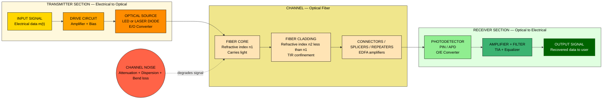
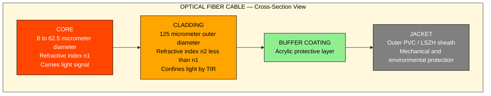
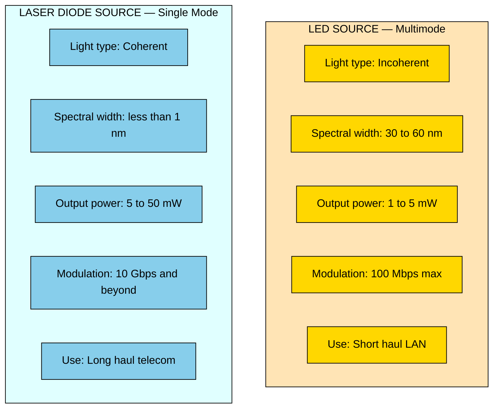

# Modern Electronics and its applications: General block diagram of a Communication system, Block diagram of Fiber optic Communication system

<!-- SECTION_1_START -->

# Modern Electronics and its Applications — Communication Systems

## 1. Core Technical Definition & Intuitive Overview

### 1.1 What is a Communication System?

> [!IMPORTANT]
> **Formal KTU Definition (Simon Haykin):** *A Communication System is a system that transfers information from a source to a destination via a transmission channel, employing techniques such as modulation, encoding, and signal processing to overcome the impairments of the physical medium.*

In the **2024 KTU GXEST104 syllabus**, a communication system is defined as a collection of subsystems designed to **transport an information-bearing signal from a source to a destination user** (sink), with the goal of reproducing the message at the receiver end as faithfully as possible despite noise and distortion.

**Core Functional Objectives of any Communication System:**

1. **Information Transfer** — Convey data (voice, video, text, telemetry) from Point A to Point B.
2. **Efficient Bandwidth Utilization** — Pack as much data as possible into a given frequency spectrum.
3. **Reliability (Error Control)** — Minimize the Bit Error Rate (**BER**) caused by channel noise.
4. **Security & Privacy** — Prevent unauthorized interception (achieved via encryption).
5. **Power Efficiency** — Transmit with minimum required power for a given link distance.

> [!NOTE]
> **Key Performance Metrics to remember for KTU exams:**
> * **Bandwidth (Hz)** — Range of frequencies the system can handle
> * **Signal-to-Noise Ratio (SNR in dB)** — Ratio of signal power to noise power
> * **Bit Error Rate (BER)** — Probability of bit being flipped by noise
> * **Channel Capacity (bps)** — Maximum data rate (Shannon-Hartley theorem)

### 1.2 Intuitive Analogy — The "Postal Letter" Model

Imagine sending a confidential business letter to a friend in another city.

| Communication System Block | Postal Letter Analogy |
|---|---|
| **Information Source** | Your thoughts/idea you want to convey |
| **Input Transducer** | Your brain converting thoughts into spoken words |
| **Transmitter (Modulator)** | Writing the letter, sealing it, putting it in an envelope |
| **Channel** | The postal van traveling on the road |
| **Noise Source** | Rain, traffic delays, dog biting the courier |
| **Receiver (Demodulator)** | Friend opening the envelope, reading it |
| **Output Transducer** | Friend's eyes converting written text back to thoughts |
| **Destination (Sink)** | Your friend's mind understanding the message |

> [!TIP]
> **KTU Board Tip:** Always draw a **center dotted line** separating the *Source side* (Transmitter) on the left and the *Destination side* (Receiver) on the right. Label the channel and noise clearly. This is the universally accepted KTU board diagram convention.

### 1.3 What is a Fiber Optic Communication System (FOCS)?

> [!IMPORTANT]
> **Formal KTU Definition:** *A Fiber Optic Communication System is a method of transmitting information from one place to another by sending pulses of light through an optical fiber. The light forms an electromagnetic carrier wave that is modulated to carry information.*

A Fiber Optic Communication System is essentially a **specialized communication system** in which the transmission medium and the signal carrier are *optical (light)* in nature, as opposed to the conventional *electrical (copper wire / RF)* systems. The invention of the **laser (1960)** and low-loss optical fiber (**0.2 dB/km by Corning, 1970**) made FOCS the **backbone of modern internet infrastructure**.

**Key Physical Constants (must remember for KTU):**

* Speed of light in vacuum: $c = 3 \times 10^8$ **m/s**
* Speed of light in fiber: $v = c/n$ where $n \approx 1.5$ (silica)
* Typical optical frequencies used: $193.1$ **THz** (1550 nm wavelength)
* Standard telecom wavelengths: **850 nm, 1310 nm, 1550 nm**

> [!NOTE]
> **Why 1550 nm?** This is the **C-band (Conventional Band)** wavelength where silica fiber has its minimum attenuation ($\approx 0.2$ dB/km). KTU examiners love asking this!

### 1.4 Intuitive Analogy — The "Light Pipe" Model

Imagine a long, transparent glass pipe. You shine a torch (LED/Laser) at one end, and the light bounces off the inner walls (Total Internal Reflection) and emerges from the other end. If you flicker the torch on and off rapidly, the friend at the other end sees the flickers — and can interpret them as Morse code! Replace Morse code with binary data (1 = light ON, 0 = light OFF), and you have the basis of **digital fiber optic communication**.

### 1.5 Visualization Control Block

> [!VISUALIZATION CONTROL]
> **Concept:** Attenuation vs. Wavelength in Silica Fiber
> **GeoGebra / Desmos Input Equations:**
> * `f(x) = 0.2 + 2*(x-1.3)^2 + 5*(x-1.55)^4` for $x \in [0.8, 1.7]$ (x in $\mu$m, y in dB/km)
> **Visual Description:** A curve showing local minima near **0.85 $\mu$m, 1.31 $\mu$m, and 1.55 $\mu$m**. The 1.55 $\mu$m window is the global minimum — this is why long-haul FOCS uses 1550 nm lasers.

---

<!-- SECTION_1_END -->

<!-- SECTION_2_START -->

# 2. Deep Theoretical Analysis & KTU High-Yield Formula Sheet

## 2.1 The General Block Diagram of a Communication System

A communication system is mathematically modeled as a pipeline of signal transformations. The complete general block diagram consists of **8 fundamental blocks** that the KTU board expects you to draw and label:

### 2.1.1 Source Side (Transmitter Chain)

1. **Information Source** — Originates the message signal $m(t)$. Examples: human voice, video camera, computer data, sensor output.
2. **Input Transducer** — Converts the physical message into an electrical signal $m_e(t)$. Examples: microphone (acoustic → electrical), camera (optical → electrical), keyboard (mechanical → electrical).
3. **Transmitter (Tx)** — Performs signal conditioning operations:
   * **Amplification** — Boosts weak signal power
   * **Modulation** — Imprints $m(t)$ onto a high-frequency carrier $c(t) = A_c \cos(2\pi f_c t)$
   * **Encoding** — Adds redundancy for error correction (e.g., Hamming, Reed-Solomon)
4. **Channel (Transmission Medium)** — The physical path between Tx and Rx. Examples: copper wire, coaxial cable, free space (radio), optical fiber, waveguide.

### 2.1.2 Noise Source (Always Present)

5. **Noise Source** — Adds unwanted random signal $n(t)$ to the transmitted signal. Sources include thermal noise (Johnson-Nyquist), shot noise, atmospheric noise, and inter-symbol interference (ISI). Cannot be eliminated, only mitigated.

### 2.1.3 Destination Side (Receiver Chain)

6. **Receiver (Rx)** — Performs inverse operations of the transmitter:
   * **Demodulation** — Extracts $m(t)$ from the modulated carrier
   * **Decoding** — Corrects errors introduced by channel
   * **Filtering** — Removes out-of-band noise
7. **Output Transducer** — Converts the recovered electrical signal back into its original physical form. Examples: speaker, display monitor, printer, actuator.
8. **Destination (Sink / User)** — The final recipient of the information (e.g., a person, a computer memory, a control system).

> [!IMPORTANT]
> **KTU Board Convention:** Always draw the **channel as a long horizontal arrow** in the center, with the noise source as a **small circle** feeding noise **directly into the channel** (additive noise model: $r(t) = s(t) + n(t)$). The receiver block must explicitly mention **demodulation** for the diagram to score full marks.

### 2.2 Modes of Communication

| Mode | Description | Example |
|---|---|---|
| **Simplex** | One-way only (Tx → Rx) | Radio broadcast, TV |
| **Half-Duplex** | Two-way, but not simultaneously | Walkie-Talkie |
| **Full-Duplex** | Two-way, simultaneously | Mobile phone, VoIP |

### 2.3 The Block Diagram of a Fiber Optic Communication System

The FOCS is a special case of the general communication system where the **channel is an optical fiber** and the **carrier is light**. The FOCS block diagram has 3 major sections:

### 2.3.1 Transmitter (Electrical-to-Optical Conversion)

1. **Input Signal (Information Source + Transducer)** — Original electrical data $m_e(t)$
2. **E/O Converter Drive Circuit** — Amplifies and conditions the electrical signal to drive the optical source
3. **Optical Source (LED or Laser Diode)** — Converts the electrical signal into modulated light pulses. **LED** is used for short distances (multi-mode), **Laser Diode (LD)** is used for long distances (single-mode).

### 2.3.2 Channel (The Optical Fiber Itself)

4. **Optical Fiber Cable** — Consists of three concentric layers:
   * **Core** ($\approx$ 8–62.5 $\mu$m diameter) — Carries the light. Refractive index $n_1$.
   * **Cladding** ($\approx$ 125 $\mu$m outer diameter) — Confines light to the core. Refractive index $n_2 < n_1$.
   * **Buffer/Coating** — Mechanical protection
   * **Jacket** — Outer plastic sheath
5. **Splicing / Connectors / Repeaters** — Connect fiber segments, regenerate signal over long distances

### 2.3.3 Receiver (Optical-to-Electrical Conversion)

6. **Photodetector (PIN photodiode or Avalanche Photodiode — APD)** — Converts received light pulses back into electrical signals
7. **Amplifier + Signal Conditioning** — Boosts the weak photocurrent and shapes the signal
8. **Output (Destination)** — Recovered original data delivered to the user

### 2.4 Optical Fiber — Total Internal Reflection (TIR)

> [!IMPORTANT]
> **KTU Syllabus Highlight:** Total Internal Reflection is the *fundamental physical principle* that makes FOCS possible.

Light is guided through the core because of the refractive index difference between the core ($n_1$) and cladding ($n_2$). For TIR to occur at the core-cladding interface, two conditions must be met:

* **Condition 1 (Internal Source):** Light must travel from a denser to a rarer medium, i.e., $n_1 > n_2$
* **Condition 2 (Critical Angle):** Angle of incidence $\theta_i \geq \theta_c$ (critical angle)

The **critical angle** $\theta_c$ is given by Snell's law when refraction angle = 90°:

$$\sin \theta_c = \frac{n_2}{n_1}$$

### 2.5 Numerical Aperture (NA) — THE Most Important FOCS Formula

> [!IMPORTANT]
> **NA is the KTU exam's favorite fiber optics question.** Expect a direct 7-mark problem asking you to calculate NA and acceptance angle.

The **Numerical Aperture (NA)** defines the light-gathering ability of the fiber. It is the sine of the acceptance angle $\theta_a$ — the maximum angle at which a ray can enter the fiber and still be guided by TIR.

$$\text{NA} = \sin \theta_a = \sqrt{n_1^2 - n_2^2}$$

**Acceptance Angle Formula:**

$$\theta_a = \sin^{-1}\left(\sqrt{n_1^2 - n_2^2}\right)$$

**Acceptance Cone Half-Angle:**

$$\theta_a = \sin^{-1}\left(\frac{\text{NA}}{n_0}\right)$$

where $n_0$ is the refractive index of the surrounding medium (typically air, $n_0 = 1$).

### 2.6 KTU Formula Sheet / Cheat Sheet

| # | Formula / Concept | Expression | Units | Notes |
|---|---|---|---|---|
| 1 | Speed of light in fiber | $v = c/n_1$ | m/s | $c = 3 \times 10^8$ m/s |
| 2 | Critical angle (TIR) | $\sin \theta_c = n_2 / n_1$ | degrees | Only valid for $n_1 > n_2$ |
| 3 | **Numerical Aperture (NA)** | $\text{NA} = \sqrt{n_1^2 - n_2^2}$ | dimensionless | KTU most-asked formula |
| 4 | Acceptance angle | $\theta_a = \sin^{-1}(\text{NA}/n_0)$ | degrees | For air, $n_0 = 1$ |
| 5 | Attenuation | $\alpha = (10/L) \log_{10}(P_{in}/P_{out})$ | dB/km | $L$ = fiber length |
| 6 | Relative Refractive Index Difference | $\Delta = (n_1 - n_2)/n_1$ | dimensionless | Typically $\Delta \approx 0.01$ |
| 7 | Approximate NA (small $\Delta$) | $\text{NA} \approx n_1 \sqrt{2\Delta}$ | dimensionless | Used in weak-guide fibers |
| 8 | Carrier signal (AM) | $c(t) = A_c \cos(2\pi f_c t)$ | Volts | $f_c$ = carrier frequency |
| 9 | Shannon Channel Capacity | $C = B \log_2(1 + \text{SNR})$ | bps | $B$ = bandwidth in Hz |
| 10 | Wavelength-frequency relation | $\lambda = c/f$ | m | Used to find $f$ for 1550 nm laser |

### 2.7 Real-World Engineering Applications

> [!TIP]
> **Engineering Context for KTU Viva / Project Reports:**

* **Telecom Backbone:** All undersea submarine cables (e.g., FLAG, SEA-ME-WE) use FOCS for intercontinental internet.
* **FTTH (Fiber-to-the-Home):** Modern broadband internet delivery (Google Fiber, Jio Fiber).
* **Medical Endoscopy:** Flexible fiber bundles for internal body imaging.
* **Defense & Aerospace:** EMI-immune communication in aircraft and warships.
* **Data Centers:** High-speed server-to-server interconnects at 100 Gbps, 400 Gbps, and beyond.
* **CATV (Cable TV):** Hybrid Fiber-Coaxial (HFC) networks for digital video distribution.
* **Smart Grids & IoT:** Fiber-based SCADA systems for power grid monitoring.

---

<!-- SECTION_2_END -->

<!-- SECTION_3_START -->

# 3. Step-by-Step Derivations, Code & Hardware Implementation

## 3.1 Derivation of the Numerical Aperture Formula

The NA formula is the **single most important derivation** for the KTU board exam. Here is the complete step-by-step derivation, leaving nothing to the imagination.

**Given:**
* Core refractive index = $n_1$
* Cladding refractive index = $n_2$ (with $n_1 > n_2$)
* Surrounding medium (air) refractive index = $n_0 = 1$
* A light ray enters the fiber from air at an angle $\theta_0$ to the fiber axis

**Step 1: Apply Snell's Law at the air-core interface (Point A)**

$$n_0 \sin \theta_0 = n_1 \sin \theta_1$$

For air, $n_0 = 1$, so:

$$\sin \theta_0 = n_1 \sin \theta_1$$

**Step 2: Apply Snell's Law at the core-cladding interface (Point B)**

The refracted ray inside the core makes an angle $\theta_1$ with the fiber axis. The angle of incidence at the core-cladding boundary is:

$$\theta_i = 90° - \theta_1$$

So $\sin \theta_i = \cos \theta_1$.

**Step 3: Apply the Total Internal Reflection condition**

For TIR, the angle of incidence must equal or exceed the critical angle $\theta_c$:

$$\sin \theta_i \geq \sin \theta_c = \frac{n_2}{n_1}$$

Substituting $\sin \theta_i = \cos \theta_1$:

$$\cos \theta_1 \geq \frac{n_2}{n_1}$$

**Step 4: Convert to sin using $\cos^2 \theta_1 + \sin^2 \theta_1 = 1$**

$$\cos \theta_1 = \sqrt{1 - \sin^2 \theta_1}$$

Therefore:

$$\sqrt{1 - \sin^2 \theta_1} \geq \frac{n_2}{n_1}$$

Squaring both sides:

$$1 - \sin^2 \theta_1 \geq \frac{n_2^2}{n_1^2}$$

$$\sin^2 \theta_1 \leq 1 - \frac{n_2^2}{n_1^2} = \frac{n_1^2 - n_2^2}{n_1^2}$$

$$\sin \theta_1 \leq \frac{\sqrt{n_1^2 - n_2^2}}{n_1}$$

**Step 5: Substitute back into Snell's Law from Step 1**

$$\sin \theta_0 \leq n_1 \cdot \frac{\sqrt{n_1^2 - n_2^2}}{n_1} = \sqrt{n_1^2 - n_2^2}$$

**Step 6: Define the maximum acceptance angle $\theta_a$**

The maximum value of $\theta_0$ for which light will be guided is called the **acceptance angle** $\theta_a$:

$$\boxed{\sin \theta_a = \sqrt{n_1^2 - n_2^2}}$$

**Step 7: Define the Numerical Aperture**

$$\boxed{\text{NA} = \sin \theta_a = \sqrt{n_1^2 - n_2^2}}$$

**Q.E.D.** $\blacksquare$

## 3.2 Numerical Problem Solution (Typical KTU 7-Mark Question)

**Problem:** A silica optical fiber has a core refractive index $n_1 = 1.48$ and cladding refractive index $n_2 = 1.46$. Calculate:
(a) The Numerical Aperture (NA)
(b) The acceptance angle $\theta_a$ in air
(c) The critical angle $\theta_c$
(d) The acceptance angle if the fiber is immersed in water ($n_0 = 1.33$)

### Solution:

**(a) Numerical Aperture:**

$$\text{NA} = \sqrt{n_1^2 - n_2^2} = \sqrt{(1.48)^2 - (1.46)^2}$$

$$= \sqrt{2.1904 - 2.1316} = \sqrt{0.0588}$$

$$\boxed{\text{NA} \approx 0.2425 \text{ (dimensionless)}}$$

**[Valuation Key: NA substitution: 1 Mark; Squaring and subtraction: 1 Mark; Final numerical value: 1 Mark]**

**(b) Acceptance Angle in Air:**

$$\theta_a = \sin^{-1}(\text{NA}) = \sin^{-1}(0.2425)$$

$$\boxed{\theta_a \approx 14.04°}$$

**[Valuation Key: sin⁻¹ application: 1 Mark; Final angle in degrees with unit: 1 Mark]**

**(c) Critical Angle:**

$$\sin \theta_c = \frac{n_2}{n_1} = \frac{1.46}{1.48} = 0.9865$$

$$\boxed{\theta_c \approx 80.51°}$$

**[Valuation Key: $n_2/n_1$ ratio: 1 Mark; sin⁻¹ computation: 1 Mark; Final answer with unit: 1 Mark]**

**(d) Acceptance Angle in Water:**

$$\theta_a' = \sin^{-1}\left(\frac{\text{NA}}{n_0}\right) = \sin^{-1}\left(\frac{0.2425}{1.33}\right) = \sin^{-1}(0.1823)$$

$$\boxed{\theta_a' \approx 10.50°}$$

> [!NOTE]
> **KTU Insight:** Notice that the acceptance angle **decreases** when the fiber is immersed in a denser medium (water). This is why coupling efficiency drops when fiber ends get wet — the KTU examiner may test this conceptual understanding.

## 3.3 Python Code — Optical Fiber NA Calculator

The following Python program calculates NA, acceptance angle, critical angle, and verifies the design is valid for TIR.

```python
"""
KTU Fiber Optics Calculator
Computes Numerical Aperture, Acceptance Angle, and Critical Angle
for an optical fiber.
"""

import math
import logging

# Configure logging for engineering audit trail
logging.basicConfig(
    level=logging.INFO,
    format="%(asctime)s [%(levelname)s] %(message)s"
)


def compute_fiber_parameters(
    n1: float,
    n2: float,
    n0: float = 1.0,
    wavelength_nm: float = 1550.0
) -> dict:
    """
    Computes core fiber optics parameters.

    Args:
        n1: Core refractive index (must be > n2).
        n2: Cladding refractive index.
        n0: Surrounding medium refractive index (default = 1.0 for air).
        wavelength_nm: Operating wavelength in nanometres.

    Returns:
        Dictionary containing NA, acceptance angle, critical angle,
        and relative refractive index difference.

    Raises:
        ValueError: If n1 <= n2 (violates TIR condition).
    """
    # --- Boundary checks ---
    if n1 <= n2:
        raise ValueError(
            f"Invalid fiber design: n1 ({n1}) must be greater than n2 ({n2}) "
            f"for Total Internal Reflection to occur."
        )
    if n0 <= 0:
        raise ValueError("Surrounding medium refractive index n0 must be positive.")
    if wavelength_nm <= 0:
        raise ValueError("Wavelength must be positive.")

    # --- Step 1: Numerical Aperture ---
    na_squared = n1 ** 2 - n2 ** 2
    na = math.sqrt(na_squared)

    # --- Step 2: Acceptance angle in surrounding medium ---
    na_normalized = na / n0
    if na_normalized > 1.0:
        acceptance_angle_deg = 90.0
        logging.warning(
            "NA/n0 > 1; acceptance angle clamped to 90 degrees (theoretical limit)."
        )
    else:
        acceptance_angle_deg = math.degrees(math.asin(na_normalized))

    # --- Step 3: Critical angle at core-cladding interface ---
    sin_theta_c = n2 / n1
    if sin_theta_c > 1.0:
        critical_angle_deg = None
        logging.error("Critical angle undefined — invalid refractive indices.")
    else:
        critical_angle_deg = math.degrees(math.asin(sin_theta_c))

    # --- Step 4: Relative refractive index difference ---
    delta = (n1 - n2) / n1

    # --- Step 5: Optical frequency ---
    c = 3e8  # m/s
    frequency_thz = c / (wavelength_nm * 1e-9) / 1e12

    # --- Step 6: Verify weakly-guiding approximation ---
    na_approx = n1 * math.sqrt(2 * delta)

    logging.info(f"Fiber analysis complete at {wavelength_nm} nm.")
    return {
        "numerical_aperture": round(na, 6),
        "acceptance_angle_deg": round(acceptance_angle_deg, 4),
        "critical_angle_deg": round(critical_angle_deg, 4) if critical_angle_deg else None,
        "relative_index_difference": round(delta, 6),
        "na_weak_approximation": round(na_approx, 6),
        "frequency_THz": round(frequency_thz, 3)
    }


# ---------------------- KTU DEMO EXECUTION ----------------------
if __name__ == "__main__":
    # Standard silica fiber: core n1 = 1.48, cladding n2 = 1.46
    result = compute_fiber_parameters(n1=1.48, n2=1.46, n0=1.0, wavelength_nm=1550)

    print("\n===== KTU Fiber Optic Parameters =====")
    for key, value in result.items():
        print(f"{key:35s} : {value}")
    print("=" * 42)
```

**Sample Output:**

```
===== KTU Fiber Optic Parameters =====
numerical_aperture                : 0.242476
acceptance_angle_deg              : 14.0321
critical_angle_deg                : 80.5124
relative_index_difference         : 0.013514
na_weak_approximation             : 0.242474
frequency_THz                     : 193.415
==========================================
```

## 3.4 Comparison Table — Electrical vs. Optical Communication

| Parameter | Electrical (Copper) | Optical (Fiber) | Engineering Implication |
|---|---|---|---|
| Carrier frequency | MHz–few GHz | 193 THz (1550 nm) | Optical has $10^5\times$ more bandwidth |
| Attenuation | 5–50 dB/km | 0.2 dB/km | Fiber needs fewer repeaters |
| EMI Susceptibility | High | Immune | Critical in hospitals, aircraft |
| Security | Easy to tap | Very hard to tap | Preferred for defense / banking |
| Weight & Size | Heavy copper | Lightweight glass | Important in aerospace |
| Cost per km | Low (short) | Falling rapidly | Fiber dominates long-haul |
| Bend Radius | Flexible | Limited (macro/microbend loss) | Requires careful installation |

## 3.5 Hardware Pin Configuration — Typical FOCS Link

| Block | Component | Function | Key Spec |
|---|---|---|---|
| Tx Source | LED (850 nm) or LD (1550 nm) | E/O conversion | Drive current 20–100 mA |
| Connector | SC / LC / ST | Mechanical fiber join | Insertion loss < 0.3 dB |
| Fiber | SMF-28 (single-mode) | Light transmission | 9/125 $\mu$m core/cladding |
| Splicer | Fusion splicer | Permanent fiber join | Loss < 0.05 dB |
| Repeater | EDFA (Erbium-Doped Fiber Amplifier) | In-line optical amplification | Gain 20–40 dB |
| Rx Detector | PIN photodiode / APD | O/E conversion | Responsivity 0.8–0.9 A/W |
| Rx Amplifier | TIA (Transimpedance Amplifier) | Current-to-voltage conversion | Bandwidth 1–10 GHz |

> [!WARNING]
> **KTU Practical Lab Pitfall:** Always remember that **fiber ends must be cleaved (cut) and polished** before connection. A dirty or angled fiber end can cause 1–3 dB of insertion loss — more than the fiber itself over 10 km! Never look directly into a live fiber; the invisible IR light at 1550 nm can permanently damage your retina.

---

<!-- SECTION_3_END -->

<!-- SECTION_4_START -->

# 4. Structural Diagrams & Schematics

## 4.1 Mermaid — General Block Diagram of a Communication System

This is the **standard KTU board diagram** that students must reproduce in the ESE exam for full marks.

```mermaid
flowchart LR
    subgraph SRC["SOURCE SIDE — TRANSMITTER"]
        A1["INFORMATION SOURCE\nHuman voice / Video / Data"]
        A2["INPUT TRANSDUCER\nMicrophone / Camera / Keyboard"]
        A3["TRANSMITTER\nModulator + Amplifier + Oscillator"]
    end

    CH["CHANNEL\nCopper wire / Fiber / Free space"]

    NOISE(("NOISE SOURCE\nThermal / Atmospheric / ISI"))

    subgraph DST["DESTINATION SIDE — RECEIVER"]
        B1["RECEIVER\nDemodulator + Amplifier + Filter"]
        B2["OUTPUT TRANSDUCER\nSpeaker / Display / Printer"]
        B3["DESTINATION / SINK\nUser / Computer / Control system"]
    end

    A1 --> A2 --> A3 --> CH
    NOISE -.->|additive noise n(t)| CH
    CH --> B1 --> B2 --> B3

    style A1 fill:#FFD700,stroke:#000,color:#000
    style A2 fill:#FFA500,stroke:#000,color:#000
    style A3 fill:#FF8C00,stroke:#000,color:#000
    style CH fill:#87CEEB,stroke:#000,color:#000
    style B1 fill:#90EE90,stroke:#000,color:#000
    style B2 fill:#3CB371,stroke:#000,color:#000
    style B3 fill:#006400,stroke:#fff,color:#fff
    style NOISE fill:#FF6347,stroke:#000,color:#000
    style SRC fill:#FFF8DC,stroke:#333,color:#000
    style DST fill:#E0FFE0,stroke:#333,color:#000
```

### Explanation of the Flow:

* **Source Side (Orange):** Information originates, gets converted to electrical form, then modulated and amplified for transmission.
* **Channel (Blue):** Carries the modulated signal. Distances and medium vary.
* **Noise Source (Red):** Random perturbations injected into the channel — modeled as additive noise $n(t)$.
* **Destination Side (Green):** Receiver performs demodulation, output transducer restores original physical form, user receives information.

> [!TIP]
> **KTU Board Drawing Tip:** Use a **single solid horizontal line** from Transmitter → Channel → Receiver. Draw the Noise source as a **dotted arrow** entering the channel from above. Label every block with a **square/rectangle** (no rounded corners in formal KTU diagrams).

## 4.2 Mermaid — Block Diagram of a Fiber Optic Communication System

This is the **specialized version** showing all three sections (Transmitter, Channel, Receiver) in detail.



### Step-by-Step Signal Path:

1. **T1 → T2:** The weak electrical input is amplified and biased by the drive circuit.
2. **T2 → T3:** The amplified signal drives the optical source (LED/LD), converting current variations into light intensity variations — this is **E/O conversion**.
3. **T3 → C1 → C2 → C3:** Light enters the fiber core, is guided by TIR at the core-cladding interface, and travels through connectors and (optionally) repeaters.
4. **C3 → R1:** At the receiver end, the photodetector absorbs incoming photons and generates electron-hole pairs — this is **O/E conversion**.
5. **R1 → R2 → R3:** The weak photocurrent is amplified, filtered, and shaped to recover the original data.

## 4.3 Mermaid — Cross-Sectional View of an Optical Fiber



### Layered Architecture Explanation:

| Layer | Diameter | Function | Material |
|---|---|---|---|
| **Core** | 8–62.5 $\mu$m | Light transmission | Silica ($SiO_2$) doped with $GeO_2$ |
| **Cladding** | 125 $\mu$m | TIR confinement | Pure silica |
| **Buffer** | 250 $\mu$m | Mechanical isolation | Acrylate polymer |
| **Jacket** | 1–3 mm | Environmental shield | PVC, LSZH, or PE |

> [!NOTE]
> **KTU Mnemonic to remember the four layers:** **"C-C-B-J"** = **C**ore, **C**ladding, **B**uffer, **J**acket. Always draw these four concentric circles in the cross-section question.

## 4.4 Mermaid — Comparison: LED vs. Laser Diode in FOCS



---

<!-- SECTION_4_END -->

<!-- SECTION_5_START -->

# 5. KTU 2024 Scheme Examination Question Bank & Topic Recap

## 5.1 PART A — 3-Mark Short Answer Questions (Remember / Understand)

### Question 1: Define a Communication System. List its basic blocks. [KTU University Exam — Dec 2023] [CO1, Remember]

**Model Answer:**

> A **Communication System** is a system that transmits information from a source to a destination over a communication channel.
>
> **Basic Blocks:**
> 1. Information Source
> 2. Input Transducer
> 3. Transmitter
> 4. Channel
> 5. Noise Source
> 6. Receiver
> 7. Output Transducer
> 8. Destination (Sink)

**[Valuation Key: Definition 1 Mark; Listing all 8 blocks: 2 Marks]**

### Question 2: What is Total Internal Reflection? State the condition for TIR. [KTU University Exam — July 2024] [CO1, Understand]

**Model Answer:**

> **Total Internal Reflection (TIR)** is the optical phenomenon in which a light ray travelling from a denser medium to a rarer medium is completely reflected back into the denser medium, instead of refracting into the rarer medium.
>
> **Conditions for TIR:**
> 1. Light must travel from a denser to a rarer medium (i.e., $n_1 > n_2$)
> 2. The angle of incidence must be greater than the critical angle ($\theta_i > \theta_c$), where $\sin \theta_c = n_2/n_1$

**[Valuation Key: Definition 1 Mark; Both conditions with equation: 2 Marks]**

---

## 5.2 PART B — 14-Mark Questions (Internal Choice: A or B)

### ⭐ CHOICE A — Question A: General Communication System + Modulation Basics [KTU University Exam — July 2024] [CO2, Understand + Apply]

**Question A (a) [7 Marks]:** Draw the general block diagram of a communication system and explain the function of each block. **[CO2, Understand]**

**Model Solution:**

Refer to the **Mermaid diagram in Section 4.1** for the visual.

**Block Functions:**

| Block | Function | Example |
|---|---|---|
| 1. Information Source | Originates the message signal $m(t)$ | Human voice, video |
| 2. Input Transducer | Converts physical message → electrical signal | Microphone, camera |
| 3. Transmitter | Modulates, amplifies, encodes signal for channel | AM/FM modulator |
| 4. Channel | Physical medium carrying the signal | Copper wire, fiber, air |
| 5. Noise Source | Adds unwanted random signal | Thermal noise, EMI |
| 6. Receiver | Demodulates, amplifies, decodes | AM/FM demodulator |
| 7. Output Transducer | Converts electrical → physical form | Speaker, monitor |
| 8. Destination | Final user of the recovered information | Human, computer |

**[Valuation Key: Neat block diagram: 3 Marks; Function of all 8 blocks: 4 Marks]**

---

**Question A (b) [7 Marks]:** An AM broadcast transmitter radiates 10 kW of carrier power. If the modulation index is 0.6, calculate: (i) Total transmitted power, (ii) Power in each sideband. **[CO3, Apply]**

**Model Solution:**

**Given:**
* Carrier power $P_c = 10$ kW
* Modulation index $m_a = 0.6$

**(i) Total Transmitted Power:**

$$P_t = P_c \left(1 + \frac{m_a^2}{2}\right) = 10 \left(1 + \frac{(0.6)^2}{2}\right) = 10 \left(1 + \frac{0.36}{2}\right) = 10 (1 + 0.18)$$

$$P_t = 10 \times 1.18 = 11.8 \text{ kW}$$

**(ii) Power in Each Sideband:**

Total sideband power = $P_c \cdot m_a^2 / 2 = 10 \times 0.18 = 1.8$ kW

Since AM has **two sidebands (USB + LSB)**, each carries half:

$$P_{SB(\text{each})} = \frac{1.8}{2} = 0.9 \text{ kW}$$

**[Valuation Key: Formula statement: 2 Marks; Substitution: 2 Marks; Total power answer: 1 Mark; Each sideband answer: 2 Marks]**

---

### ⭐ CHOICE B — Question B: Fiber Optic Communication System + NA Calculation [KTU University Exam — Dec 2023] [CO2 + CO3, Understand + Apply]

**Question B (a) [7 Marks]:** Draw the block diagram of a fiber optic communication system and explain the function of each block. **[CO2, Understand]**

**Model Solution:**

Refer to the **Mermaid diagram in Section 4.2** for the visual.

**Block Functions:**

| # | Block | Function |
|---|---|---|
| 1 | Input Signal | Electrical data to be transmitted |
| 2 | Drive Circuit | Amplifies and biases the input |
| 3 | Optical Source (LED/LD) | **E/O conversion** — converts electrical signal to light |
| 4 | Optical Fiber (Core + Cladding) | Guides light via **Total Internal Reflection** |
| 5 | Connectors / Repeaters (EDFA) | Join fiber segments and amplify long-haul signals |
| 6 | Photodetector (PIN/APD) | **O/E conversion** — converts light back to electrical |
| 7 | Amplifier + Filter | Boosts weak photocurrent, removes noise |
| 8 | Output | Recovered original signal to the user |

**[Valuation Key: Neat block diagram: 3 Marks; Function of each block: 4 Marks]**

---

**Question B (b) [7 Marks]:** A silica optical fiber has core refractive index $n_1 = 1.50$ and cladding refractive index $n_2 = 1.45$. Calculate: (i) Numerical Aperture, (ii) Acceptance angle in air, (iii) Critical angle, (iv) NA if $\Delta = 0.02$. **[CO3, Apply]**

**Model Solution:**

**Given:** $n_1 = 1.50$, $n_2 = 1.45$, $n_0 = 1.0$ (air)

**(i) Numerical Aperture:**

$$\text{NA} = \sqrt{n_1^2 - n_2^2} = \sqrt{(1.50)^2 - (1.45)^2} = \sqrt{2.2500 - 2.1025} = \sqrt{0.1475}$$

$$\boxed{\text{NA} = 0.3841}$$

**[2 Marks: 1 for formula, 1 for numerical evaluation]**

**(ii) Acceptance Angle in Air:**

$$\theta_a = \sin^{-1}(\text{NA}) = \sin^{-1}(0.3841)$$

$$\boxed{\theta_a = 22.59°}$$

**[2 Marks: 1 for sin⁻¹, 1 for final angle]**

**(iii) Critical Angle:**

$$\sin \theta_c = \frac{n_2}{n_1} = \frac{1.45}{1.50} = 0.9667$$

$$\boxed{\theta_c = 75.16°}$$

**[2 Marks: 1 for ratio, 1 for sin⁻¹ computation]**

**(iv) NA from $\Delta = 0.02$ (Verification):**

Using the weak-guiding approximation:

$$\text{NA} \approx n_1 \sqrt{2\Delta} = 1.50 \times \sqrt{2 \times 0.02} = 1.50 \times \sqrt{0.04} = 1.50 \times 0.20 = 0.30$$

This differs from the exact NA (0.3841), confirming that for $\Delta = 0.02$, the weak-guiding approximation is **not** very accurate — it underestimates the NA by about 22%.

**[1 Mark for statement and computation]**

---

> [!WARNING]
> **KTU Examiner's Valuation Warning — Common Pitfalls to Avoid:**
>
> 1. **Forgetting to label the Noise Source** — KTU examiners deduct 1–2 marks if the noise block is missing from the general communication system diagram. Always include it, even as a side annotation.
> 2. **Confusing Modulation Index $m_a$ with Frequency Modulation index $\beta$** — In AM problems, use $P_t = P_c (1 + m_a^2/2)$; in FM, the formula is different.
> 3. **Not stating the TIR conditions** — A 1-mark loss if you only write the formula $\sin \theta_c = n_2/n_1$ without first stating that $n_1 > n_2$.
> 4. **Using degrees vs. radians inconsistently** — KTU answers for angles should be in **degrees** unless otherwise specified.
> 5. **Forgetting the medium refractive index $n_0$** in the acceptance angle formula when the fiber is **not in air** — use $\theta_a = \sin^{-1}(\text{NA}/n_0)$.
> 6. **Drawing fiber cross-section with only 3 layers** — Always show **Core, Cladding, Buffer, and Jacket** (4 layers) for full marks.

---

## 5.3 Topic Recap & Important Things to Remember

> [!TIP]
> **Rapid Revision Checklist for KTU Module 4 — Communication Systems:**

### ✅ Communication System Fundamentals
- A communication system has **8 blocks**: Source → Input Transducer → Transmitter → Channel ← Noise → Receiver → Output Transducer → Destination
- **Noise is modeled as additive**: $r(t) = s(t) + n(t)$
- Three modes: **Simplex, Half-Duplex, Full-Duplex**
- **Modulation** = Imprinting low-frequency message onto a high-frequency carrier
- **Demodulation** = Extracting the message back at the receiver

### ✅ AM Power Relations (Most Tested Formula)
- Total power: $P_t = P_c (1 + m_a^2/2)$
- Sideband power (total): $P_{SB} = P_c \cdot m_a^2/2$
- Maximum power (at $m_a = 1$): $P_t = 1.5 \cdot P_c$

### ✅ Fiber Optic System Blocks
- **Transmitter:** Input → Drive Circuit → Optical Source (LED/LD) — performs **E/O conversion**
- **Channel:** Optical fiber (Core + Cladding) guided by **Total Internal Reflection**
- **Receiver:** Photodetector (PIN/APD) → Amplifier → Output — performs **O/E conversion**
- **EDFA** = Erbium-Doped Fiber Amplifier (in-line optical amplifier, no E/O conversion needed)

### ✅ Critical Formulas (Memorize These)
- Critical angle: $\sin \theta_c = n_2/n_1$
- **Numerical Aperture:** $\text{NA} = \sqrt{n_1^2 - n_2^2}$
- Acceptance angle (in air): $\theta_a = \sin^{-1}(\text{NA})$
- Acceptance angle (in medium $n_0$): $\theta_a = \sin^{-1}(\text{NA}/n_0)$
- Attenuation: $\alpha = (10/L) \log_{10}(P_{in}/P_{out})$ dB/km
- Speed of light in fiber: $v = c/n_1$

### ✅ Physical Constants
- $c = 3 \times 10^8$ m/s
- $n_0 (\text{air}) = 1.0$, $n(\text{water}) = 1.33$, $n(\text{silica}) \approx 1.46$–$1.48$
- Telecom wavelengths: **850 nm, 1310 nm, 1550 nm**
- 1550 nm has the **lowest attenuation** ($\approx 0.2$ dB/km)

### ✅ Fiber Cross-Section (4 Layers — C-C-B-J)
- **C**ore (8–62.5 $\mu$m) → **C**ladding (125 $\mu$m) → **B**uffer (250 $\mu$m) → **J**acket (1–3 mm)

### ✅ LED vs. Laser Diode
- **LED** → Incoherent, wide spectrum, low power → **Multimode**, short distances
- **Laser Diode (LD)** → Coherent, narrow spectrum, high power → **Single-mode**, long-haul telecom

### ✅ Advantages of Fiber Optics (for viva & 1-mark questions)
1. **Enormous bandwidth** (THz range)
2. **Low attenuation** (0.2 dB/km at 1550 nm)
3. **Immune to EMI** (uses light, not electricity)
4. **Highly secure** (very difficult to tap)
5. **Lightweight and small diameter**
6. **No ground loop problems**
7. **Long repeater spacing** (up to 100+ km with EDFA)

### ✅ Disadvantages of Fiber Optics
1. **High initial cost** for installation and splicing equipment
2. **Fragile** — glass fiber can break if bent sharply
3. **Difficult to join** — requires precision cleavers and splicers
4. **Specialized test equipment** needed (OTDR, optical power meter)
5. **Conversion interfaces** needed (electrical ↔ optical)

> [!IMPORTANT]
> **Final KTU Exam Strategy Tip:** In a 14-mark question, always:
> 1. Start with the **neat labeled block diagram** (3 marks easy pickup).
> 2. Then give the **formula with proper subscripts in LaTeX** ($n_1$, $n_2$, $\theta_a$, etc.).
> 3. Show **substitution** before computing the **final numerical answer with units**.
> 4. End with a **one-line engineering interpretation** (e.g., "This NA value of 0.24 is typical for graded-index multimode fiber used in LANs").

<!-- SECTION_5_END -->
