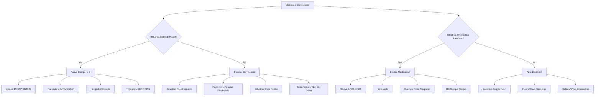
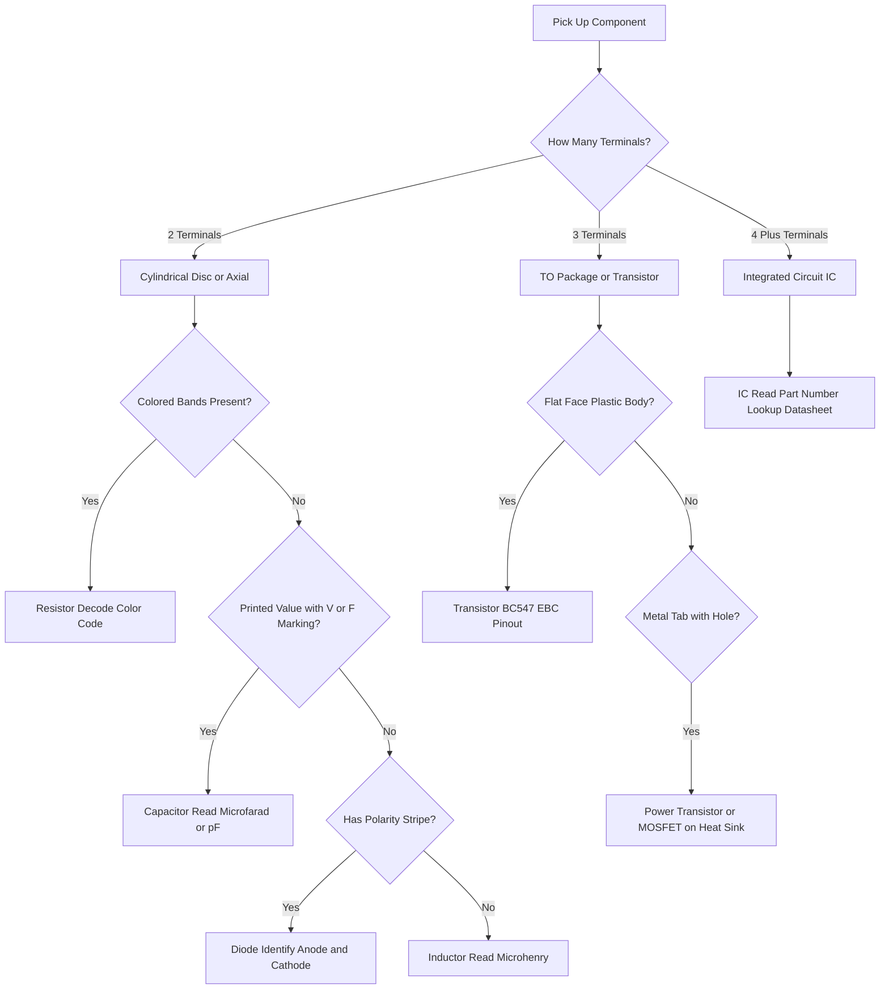
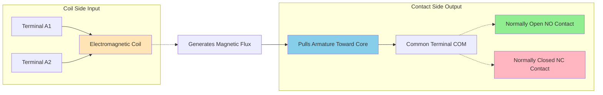
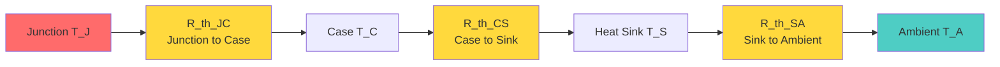
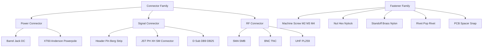

# Familiarization/Identification of electronic components with specification (Active, Passive, Electrical, Electronic, Electro-mechanical, Wires, Cables, Connectors, Fuses, Switches, Relays, Crystals, Displays, Fasteners, Heat sink etc.)

<!-- SECTION_1_START -->
# Basic Electrical and Electronics Engineering Workshop
## Module 1: Component Identification & Specification

> [!IMPORTANT]
> **KTU 2024 Scheme Context:** This module forms the foundational practical bedrock of **GZESL106 – Basic Electrical and Electronics Engineering Workshop**. Students are expected to *physically identify, visually classify, and interpret the datasheet specifications* of every component listed. The End Semester Evaluation (ESE) directly tests recognition skills and the ability to *read and apply* component ratings.

---

### 1.1 Core Technical Definition

**Electronic Component Identification** is the systematic process of recognizing discrete and integrated electronic parts by their physical appearance, terminal markings, package codes, color bands, and printed specifications, followed by the ability to *interpret their electrical ratings* (voltage, current, power, frequency, tolerance) from the manufacturer's data sheet or printed legend.

> [!NOTE]
> **Formal KTU Glossary Mapping:**
> - **Active Component:** A device that *controls electron flow* and requires an external power source to operate (provides gain, switching, or rectification). Example: Transistor, Diode, IC.
> - **Passive Component:** A device that *cannot generate energy*; it either stores or dissipates it. Example: Resistor, Capacitor, Inductor.
> - **Electro-mechanical Component:** A device that bridges *electrical signals and mechanical movement* (or vice-versa). Example: Relay, Solenoid, Buzzer.

---

### 1.2 Intuitive Overview (Real-World Analogy)

Imagine the human body as an electronic circuit:
- **Active components (Transistors, ICs)** = the *brain*, making decisions and amplifying signals.
- **Passive components (Resistors, Capacitors, Inductors)** = the *veins and blood*, controlling the flow and storing energy.
- **Wires and Cables** = the *nervous system*, carrying signals across the body.
- **Switches and Relays** = the *reflexes*, turning things ON or OFF.
- **Heat Sinks** = the *sweat glands*, dissipating unwanted heat.
- **Connectors and Fasteners** = the *joints and bones*, holding the structure together.

> [!TIP]
> **Quick Recognition Heuristic:** If the component has **3 or more legs** and a *plastic/metal body with printing* — it is almost always **active**. If it has **2 terminals** and is *cylindrical or disc-shaped* — it is almost always **passive**.

---

### 1.3 Physical Constants & Standard Metrics to Remember

| Metric | Standard Value | Application |
| :--- | :--- | :--- |
| **Resistor Color Code Multipliers** | Black($\times 10^0$), Brown($\times 10^1$), Red($\times 10^2$) | Decoding resistance values |
| **Standard Logic Voltage (TTL)** | **$V_{CC} = 5\text{ V}$** | Digital IC families (74-series) |
| **Standard Logic Voltage (CMOS)** | **$V_{DD} = 3.3\text{ V}$ / $5\text{ V}$** | Microcontroller I/O logic levels |
| **Standard Mains (India)** | **$230\text{ V AC}$, $50\text{ Hz}$** | Household and lab AC supply |
| **Quartz Crystal Frequency Tolerance** | $\pm 20 \text{ ppm}$ to $\pm 100 \text{ ppm}$ | Clock generator ICs (e.g., 16 MHz for Arduino) |

> [!VISUALIZATION CONTROL]
> **Concept:** Resistor Color Band Decoding
> **Input Mapping (4-band example for 4.7 k$\Omega$):**
> * Band 1 (Yellow) = 4
> * Band 2 (Violet) = 7
> * Multiplier (Red) = $\times 10^2$
> * Tolerance (Gold) = $\pm 5\%$
> **Visual Description:** A cylindrical resistor with four colored stripes is read *left-to-right*; the first two stripes give base digits, the third gives the magnitude multiplier, and the fourth indicates the percentage tolerance band.

<!-- SECTION_1_END -->

<!-- SECTION_2_START -->
# Deep Theoretical Analysis & KTU High-Yield Specification Sheet

## 2.1 Classification of Electronic Components

Electronic components are broadly classified under the following taxonomy, which is the **exact structure** examiners use for short-answer questions.

### A. Active Components
Active devices *control current flow* and require an external bias to perform their function. They can provide **power gain** ($P_{out} > P_{in}$).

| Component | Symbol Identifier | Key Specification Parameter | Typical Application |
| :--- | :--- | :--- | :--- |
| **Diode (1N4007)** | Arrow + Bar | $V_F = 1.0\text{ V}$, $I_F = 1\text{ A}$ | Rectifier, freewheeling |
| **Zener Diode** | Arrow + Bar + Z-ends | $V_Z = 5.1\text{ V}$ (typical) | Voltage regulation |
| **BJT (BC547)** | Circle with 3 leads | $V_{CEO} = 45\text{ V}$, $h_{FE} = 110\text{–}800$ | Amplifier, switch |
| **MOSFET (IRFZ44)** | Circle with 3 leads + G | $V_{DS} = 55\text{ V}$, $R_{DS(on)} = 17.5\text{ m}\Omega$ | High-speed switching |
| **LED** | Diode symbol + 2 arrows | $V_F = 2\text{ V}$ (Red), $3.2\text{ V}$ (Blue) | Indicators, displays |
| **IC (LM7805)** | Rectangular body + pins | $V_{in} = 7\text{–}25\text{ V}$, $V_{out} = 5\text{ V}$ | Voltage regulator |

### B. Passive Components
Passive devices *cannot generate energy*; they either **store**, **dissipate**, or **block** it.

| Component | Visual Cue | Key Specification | Unit |
| :--- | :--- | :--- | :--- |
| **Resistor (Fixed)** | Cylinder, 2 leads, color bands | Resistance value | $\Omega, \text{ k}\Omega, \text{ M}\Omega$ |
| **Capacitor (Ceramic)** | Disc, 2 leads, code printed | Capacitance, Voltage rating | $\mu\text{F, nF, pF}$ |
| **Capacitor (Electrolytic)** | Cylinder with sleeve, polarity mark | $C$, $V_{DC}$ rating | $\mu\text{F}$, $V$ |
| **Inductor** | Coil of wire on ferrite core | Inductance | $\mu\text{H, mH}$ |
| **Transformer** | Laminated core, 4+ terminals | Primary/Secondary voltage ratio | VA rating |

### C. Electro-Mechanical Components
These devices convert **electrical energy ↔ mechanical movement**.

| Component | Operating Principle | Specification |
| :--- | :--- | :--- |
| **Relay (SPDT, DPDT)** | Electromagnetic coil pulls armature | Coil voltage ($5\text{ V}$, $12\text{ V}$), Contact rating ($230\text{ V}/10\text{ A}$) |
| **Solenoid** | Linear push/pull motion via coil | Force, Stroke length |
| **Buzzer** | Piezo or magnetic vibration | SPL (dB), Operating voltage |
| **DC Motor** | Brush-commutated rotation | RPM, Torque, Voltage |

### D. Display Devices

| Display Type | Key Specification | Common Use |
| :--- | :--- | :--- |
| **7-Segment LED** | Common Anode / Common Cathode | Numeric counters, clocks |
| **16x2 LCD (HD44780)** | $V_{CC} = 5\text{ V}$, 4-bit/8-bit mode | Microcontroller HMI |
| **OLED Display** | $I^2C$ or SPI interface, $3.3\text{ V}$ | Smart watch, IoT |

---

## 2.2 Specification Reading — The "Datasheet" Framework

Every electronic component follows a **standard datasheet structure** that engineers use to verify suitability. For the KTU workshop exam, students must know the following five core parameters for *any* given component:

1. **Absolute Maximum Ratings** — *Never exceed these* (e.g., $V_{CEO(max)}$, $I_C(max)$, $P_D(max)$).
2. **Electrical Characteristics** — Typical behavior at given test conditions ($h_{FE}$ at $I_C = 2\text{ mA}$).
3. **Package Type** — Physical form (TO-92, SOT-23, DIP-14).
4. **Pin Configuration** — Functional assignment of each terminal.
5. **Thermal Characteristics** — Junction-to-ambient resistance $R_{\theta JA}$ (units: $^\circ\text{C/W}$).

> [!IMPORTANT]
> **Engineering Real-World Utility:** In production PCB design (e.g., at Bosch, Texas Instruments, or Intel labs), a designer's first step is to filter components by the *Absolute Maximum Rating*, then check the *Electrical Characteristics curve* at the *operating point* of the circuit. Failing to do this is the leading cause of board-level failures and field returns.

---

## 2.3 Component Identification Heuristics (The Examiner's Lens)

| Visual Feature | Component Type |
| :--- | :--- |
| Cylindrical, opaque, two axial leads, color bands | **Carbon Film / Metal Film Resistor** |
| Cylindrical, metal can (T0-18, T0-39 package) | **Transistor (older style)** |
| Black plastic half-cylinder, 3 leads, curved back | **Transistor (TO-92, e.g., BC547)** |
| Black plastic rectangle, 3 flat leads, flat face | **SMD MOSFET / SMD Transistor (SOT-23)** |
| Cylinder with sleeve, single white stripe on negative side | **Electrolytic Capacitor** |
| Disc-shaped, two parallel leads, ceramic body | **Ceramic Capacitor** |
| Glass cylinder, red color, axial leads | **Zener Diode (1N4733 etc.)** |
| Black plastic rectangle, multiple pins (8, 14, 16) | **Integrated Circuit (DIP package)** |
| Coiled copper wire around iron/ferrite core | **Inductor / Transformer** |

<!-- SECTION_2_END -->

<!-- SECTION_3_START -->
# Step-by-Step Identification Procedures & Practical Implementation

## 3.1 Resistor Identification Using Color Code (Worked Specification)

> [!NOTE]
> **Specification:** A resistor shows four color bands: **Yellow – Violet – Red – Gold**.

The color code decoding procedure is a **mandatory practical skill** tested in the KTU viva and ESE.

**Step 1:** Identify the tolerance band (last band). Gold = $\pm 5\%$.

**Step 2:** Map the first three significant bands to their digit values from the standard EIA color table.

| Band Position | Color | Digit Value | Mathematical Meaning |
| :---: | :---: | :---: | :---: |
| Band 1 | Yellow | $4$ | Tens digit |
| Band 2 | Violet | $7$ | Ones digit |
| Band 3 | Red | $2$ | Multiplier exponent |
| Band 4 | Gold | — | $\pm 5\%$ tolerance |

**Step 3:** Apply the standard decoding formula:

$$R = \big( (\text{Band 1} \times 10) + \text{Band 2} \big) \times 10^{\text{Band 3}}$$

**Step 4:** Substitute the values:

$$R = \big( (4 \times 10) + 7 \big) \times 10^{2}$$

$$R = 47 \times 100$$

$$R = 4700 \text{ }\Omega = 4.7 \text{ k}\Omega$$

**Step 5:** State the tolerance range.

$$R_{\text{range}} = 4700 \pm 5\% = [4465 \text{ }\Omega, \text{ } 4935 \text{ }\Omega]$$

**Step 6:** Convert to standard form.

The final specification to be written on the answer sheet is:

$$\boxed{R = 4.7 \text{ k}\Omega, \text{ Tolerance} = \pm 5\%}$$

---

## 3.2 Diode Polarity Identification (Visual + Specification)

A standard **1N4007 rectifier diode** is the most commonly asked component in KTU viva. Identification requires both *visual inspection* and *multimeter continuity testing*.

### Step-by-Step Practical Procedure

| Step | Action | Expected Result |
| :---: | :--- | :--- |
| 1 | Hold the diode with the **silver/white stripe** facing **right** | The stripe marks the **cathode (K)** |
| 2 | Identify the **anode (A)** as the unmarked lead on the left | Anode is the *positive* terminal during forward bias |
| 3 | Set multimeter to **Diode Test mode** | Display shows forward voltage drop |
| 4 | Connect **Red probe (V$\Omega$)** to Anode, **Black probe (COM)** to Cathode | Reading: $\approx 0.6\text{–}0.7\text{ V}$ (Forward bias) |
| 5 | Reverse the probes | Reading: **OL** (open loop) — confirms reverse blocking |
| 6 | Read printed specification on the body | **1N4007**: $V_{RRM} = 1000\text{ V}$, $I_F = 1\text{ A}$ |

### Specifications for Common Diodes

| Diode | Marking | $V_{RRM}$ (Peak Reverse Voltage) | $I_F$ (Forward Current) | Use |
| :--- | :--- | :---: | :---: | :--- |
| 1N4001 | 1N4001 | $50\text{ V}$ | $1\text{ A}$ | Low-voltage rectifier |
| 1N4007 | 1N4007 | $1000\text{ V}$ | $1\text{ A}$ | Mains rectifier bridge |
| 1N5819 | 1N5819 | $40\text{ V}$ (Schottky) | $1\text{ A}$ | High-speed switching |
| 1N4148 | 4148 | $75\text{ V}$ | $200\text{ mA}$ | Signal switching |
| BZX55C5V1 | 5V1 | $V_Z = 5.1\text{ V}$ | $20\text{ mA}$ | Zener regulator |

---

## 3.3 Transistor Identification (TO-92 Package: BC547)

The **BC547** is a ubiquitous NPN bipolar junction transistor in a TO-92 package. The KTU workshop exam routinely asks students to identify the *Flat Face Orientation* and the *Pin Configuration*.

### Visual Identification (Always with the Flat Face toward you)

| Pin Number (Left → Right) | Function | Symbol Reference |
| :---: | :--- | :--- |
| Pin 1 | **Emitter (E)** | Triangle base pointing outward |
| Pin 2 | **Base (B)** | Vertical line (gate) |
| Pin 3 | **Collector (C)** | Triangle base incoming, with arrow |

### Specification Table for BC547 (NPN BJT)

| Parameter | Symbol | Value | Unit |
| :--- | :---: | :---: | :---: |
| Collector-Emitter Voltage | $V_{CEO}$ | $45$ | $\text{V}$ |
| Collector-Base Voltage | $V_{CBO}$ | $50$ | $\text{V}$ |
| Emitter-Base Voltage | $V_{EBO}$ | $6$ | $\text{V}$ |
| Collector Current (Continuous) | $I_C$ | $100$ | $\text{mA}$ |
| Power Dissipation | $P_D$ | $500$ | $\text{mW}$ |
| DC Current Gain | $h_{FE}$ | $110\text{–}800$ | — |
| Transition Frequency | $f_T$ | $300$ | $\text{MHz}$ |
| Operating Junction Temp | $T_J$ | $-55 \text{ to } +150$ | $^\circ\text{C}$ |

> [!TIP]
> **Mnemonic for NPN Pin Order (Flat Face Toward You):** **"EBC"** — *Emitter, Base, Collector*. For PNP counterparts like **BC557**, the pinout is **identical**, but the internal semiconductor doping layers are reversed.

---

## 3.4 Transformer Specification Reading

A typical low-voltage power transformer used in labs is rated as:

$$\text{Primary: } 230\text{ V AC}, 50\text{ Hz} \quad\longleftrightarrow\quad \text{Secondary: } 12\text{ V–0–12\text{ V}}, 500\text{ mA}$$

**Step 1:** Identify the **primary side** by the *higher resistance reading* on a multimeter (e.g., $500\text{ }\Omega$).

**Step 2:** Identify the **secondary side** by the *lower resistance reading* (e.g., $5\text{ }\Omega$).

**Step 3:** Apply the turns ratio formula to predict output voltage:

$$\frac{V_s}{V_p} = \frac{N_s}{N_p}$$

For a $230\text{ V}$ to $12\text{ V}$ transformer:

$$\frac{N_s}{N_p} = \frac{12}{230} \approx 0.052$$

**Step 4:** Calculate the VA rating using the formula:

$$S_{VA} = V_{secondary} \times I_{secondary}$$

$$S_{VA} = 12\text{ V} \times 0.5\text{ A} = 6\text{ VA}$$

**Step 5:** Identify physical form: **E-I Laminated Core** (standard for $50\text{ Hz}$ operation) versus **Toroidal Core** (compact, low hum).

---

## 3.5 Heat Sink Specification and Selection

A heat sink is a passive thermal management device specified by its **thermal resistance** $R_{\theta SA}$ (in $^\circ\text{C/W}$).

### Heat Sink Sizing Formula

The junction temperature of a transistor mounted on a heat sink is governed by:

$$T_J = T_A + P_D \cdot (R_{\theta JC} + R_{\theta CS} + R_{\theta SA})$$

Where:
- $T_J$ = Junction temperature (must be $< T_{J(max)}$)
- $T_A$ = Ambient temperature (typically $25^\circ\text{C}$ or $50^\circ\text{C}$)
- $P_D$ = Power dissipated by the device
- $R_{\theta JC}$ = Junction-to-case thermal resistance (from datasheet)
- $R_{\theta CS}$ = Case-to-sink thermal resistance (mica insulator $\approx 1.0^\circ\text{C/W}$)
- $R_{\theta SA}$ = Sink-to-ambient thermal resistance (heat sink spec)

### Worked Numerical Example

> **Problem:** A 2N3055 power transistor dissipates $P_D = 20\text{ W}$ in a $50^\circ\text{C}$ ambient. Datasheet gives $R_{\theta JC} = 1.5^\circ\text{C/W}$, $T_{J(max)} = 200^\circ\text{C}$, and the mica insulator gives $R_{\theta CS} = 1.0^\circ\text{C/W}$. Find the *minimum allowable heat sink rating*.

**Step 1:** Rearrange the equation to solve for $R_{\theta SA}$:

$$R_{\theta SA} = \frac{T_{J(max)} - T_A}{P_D} - R_{\theta JC} - R_{\theta CS}$$

**Step 2:** Substitute the numerical values:

$$R_{\theta SA} = \frac{200 - 50}{20} - 1.5 - 1.0$$

$$R_{\theta SA} = \frac{150}{20} - 2.5$$

$$R_{\theta SA} = 7.5 - 2.5 = 5.0 \text{ } ^\circ\text{C/W}$$

**Step 3:** Interpret the result.

$$\boxed{R_{\theta SA} \leq 5.0 \text{ } ^\circ\text{C/W}}$$

The heat sink selected must have a thermal resistance *equal to or less than* $5.0^\circ\text{C/W}$. This is typically a medium-sized extruded aluminum finned heat sink with a black anodized finish for improved radiative heat transfer.

> [!WARNING]
> **Common Mistake:** Students often forget the $R_{\theta CS}$ term when using a *mica insulator with thermal grease*. Always include the insulator's thermal resistance; it is often the *largest* contributor in the chain.

---

## 3.6 Cable and Wire Specification Reading

Cables are characterized by **cross-sectional area** (in $\text{mm}^2$), **current rating**, and **insulation grade**. A standard table for lab use:

| Wire Gauge (Cross-Section) | Current Rating (A) | Typical Use |
| :---: | :---: | :--- |
| $0.5\text{ mm}^2$ | $3\text{ A}$ | Signal wires, breadboard jumpers |
| $1.0\text{ mm}^2$ | $6\text{ A}$ | Low-power DC, LED strips |
| $1.5\text{ mm}^2$ | $10\text{ A}$ | Mains extension boards (Indian standard) |
| $2.5\text{ mm}^2$ | $16\text{ A}$ | Home wiring, power sockets |
| $4.0\text{ mm}^2$ | $22\text{ A}$ | AC units, geysers |

**Insulation Color Code (India, IS 694 Standard):**

| Color | Phase / Function |
| :--- | :--- |
| Red | Live (Phase) |
| Black | Neutral |
| Green (or Green/Yellow) | Earth (Ground) |

<!-- SECTION_3_END -->

<!-- SECTION_4_START -->
# Structural Diagrams & Identification Schematics

## 4.1 Master Component Classification Flowchart



## 4.2 Component Identification Decision Tree (Lab Use)



## 4.3 Relay Internal Architecture (Functional Block)



## 4.4 Heat Sink Thermal Resistance Network (Sequential Topology)



## 4.5 Connector and Fastener Identification Matrix



<!-- SECTION_4_END -->

<!-- SECTION_5_START -->
# KTU 2024 Scheme Examination Question Bank

## Part A — 3 Mark Questions (Short Answer)

### Question 1 [KTU University Exam – July 2024]
**"Distinguish between active and passive electronic components. Give two examples of each."** [CO1, Remember]

**Model Answer (3 Marks):**

| Active Component | Passive Component |
| :--- | :--- |
| Can *generate* energy or provide power gain | Cannot generate energy; only stores or dissipates |
| Requires external power source to operate | Does not require external power |
| Controls current flow actively | Passively resists, stores, or blocks current |
| **Example 1:** Diode (1N4007) | **Example 1:** Resistor (1 k$\Omega$) |
| **Example 2:** Transistor (BC547) | **Example 2:** Capacitor (10 $\mu$F) |

> **Valuation Key:** [Definition with 1 example: 2 marks] [Second example: 1 mark]

---

### Question 2 [KTU University Exam – Dec 2023]
**"A resistor has color bands: Brown, Black, Red, Silver. Calculate its resistance value and tolerance."** [CO1, Apply]

**Model Answer (3 Marks):**

Reading the bands left-to-right:
- Band 1 (Brown) = $1$
- Band 2 (Black) = $0$
- Band 3 (Red) = Multiplier $10^2$
- Band 4 (Silver) = $\pm 10\%$ tolerance

Applying the formula:

$$R = (1 \times 10 + 0) \times 10^{2} = 10 \times 100 = 1000 \text{ }\Omega$$

$$\boxed{R = 1 \text{ k}\Omega \pm 10\%}$$

> **Valuation Key:** [Color band identification: 1 mark] [Substitution: 1 mark] [Final value: 1 mark]

---

## Part B — 14 Mark Questions (ESE Module Internal Choice)

### Question A (14 Marks) [KTU University Exam – July 2024]

**a) With a neat diagram, explain the construction and working of a 5V SPDT relay. List its typical specifications.** [7 Marks] [CO1, Understand]

**Model Answer:**

A **Single Pole Double Throw (SPDT) relay** is an electro-mechanical switch that uses an electromagnetic coil to control a single common terminal, which can be connected to either a Normally Open (NO) or Normally Closed (NC) contact.

**Construction:**
- **Coil:** Copper wire wound around a soft iron core, rated typically at $5\text{ V DC}$ or $12\text{ V DC}$.
- **Armature:** A movable ferrous metal strip held in place by a spring.
- **Contacts:** Three terminals — Common (COM), Normally Open (NO), Normally Closed (NC).
- **Yoke:** Soft iron frame that completes the magnetic circuit.

**Working:**
When the coil is energized, it generates a magnetic field that attracts the armature, which *pulls away* from the NC contact and *makes connection* with the NO contact. When the coil is de-energized, the spring pulls the armature back to its resting state against the NC contact.

**Typical Specifications Table:**

| Parameter | Typical Value |
| :--- | :--- |
| Coil Voltage | $5\text{ V DC}$ |
| Coil Resistance | $70\text{ }\Omega$ |
| Coil Current | $\approx 70\text{ mA}$ |
| Contact Rating | $230\text{ V AC}$, $10\text{ A}$ |
| Switching Time | $10\text{ ms}$ (operate), $5\text{ ms}$ (release) |
| Mechanical Life | $10^7$ operations |

> **Valuation Key:** [Construction diagram: 2 marks] [Working explanation: 3 marks] [Specifications: 2 marks]

**b) Describe the construction of a quartz crystal with a diagram. Mention any four specifications.** [7 Marks] [CO2, Understand]

**Model Answer:**

A **quartz crystal** is a piezoelectric device used as a highly stable frequency reference in oscillators.

**Construction:**
- A thin *slice of quartz* (piezoelectric material) is sandwiched between two *metallic electrodes*.
- The assembly is housed in a sealed *metal can* (HC-49 package) or *SMD ceramic package*.
- Leads are brought out for electrical connection to the oscillator circuit.

**Working Principle:** When an alternating voltage is applied across the electrodes, the quartz slice vibrates at its *mechanical resonant frequency*, which depends on the cut, thickness, and dimensions of the crystal. The inverse piezoelectric effect produces a stable oscillating voltage.

**Specifications:**

| Parameter | Typical Value |
| :--- | :--- |
| Nominal Frequency | $16.000\text{ MHz}$ (Arduino), $32.768\text{ kHz}$ (RTC) |
| Frequency Tolerance | $\pm 20\text{ ppm}$ |
| Load Capacitance | $18\text{ pF}$ or $20\text{ pF}$ |
| Equivalent Series Resistance (ESR) | $60\text{ }\Omega$ max |
| Operating Temperature | $-10^\circ\text{C}$ to $+60^\circ\text{C}$ |
| Shunt Capacitance | $5\text{ pF}$ max |

> **Valuation Key:** [Construction: 2 marks] [Working principle: 2 marks] [Specifications: 3 marks]

---

### Question B (14 Marks) [KTU University Exam – Dec 2023]

**a) Identify and explain the working of a 16x2 LCD display module. List its pin configuration.** [7 Marks] [CO1, Understand]

**Model Answer:**

The **16x2 LCD (Liquid Crystal Display)** is a flat-panel alphanumeric display capable of showing 16 characters per line across 2 lines, totaling 32 characters. It uses the **HD44780** controller IC.

**Working Principle:**
Liquid crystal is an organic substance that flows like a liquid but has optical properties of a crystal. When an electric field is applied across the liquid crystal, the molecules re-align, changing the *polarization of light passing through them*. A backlight illuminates the panel, and pixel electrodes control which segments become opaque to form visible characters.

**Pin Configuration Table:**

| Pin | Symbol | Function |
| :---: | :---: | :--- |
| 1 | $V_{SS}$ | Ground (0 V) |
| 2 | $V_{DD}$ | Power supply (+5 V) |
| 3 | $V_0$ | Contrast adjustment (via potentiometer) |
| 4 | RS | Register Select (0 = Command, 1 = Data) |
| 5 | R/W | Read/Write (0 = Write, 1 = Read) |
| 6 | E | Enable (latches data on falling edge) |
| 7–14 | D0–D7 | 8-bit data bus (4-bit mode uses only D4–D7) |
| 15 | A | Anode (Backlight +5 V) |
| 16 | K | Cathode (Backlight Ground) |

> **Valuation Key:** [Identification: 1 mark] [Working: 3 marks] [Pin table: 3 marks]

**b) With a neat diagram, explain the construction of a 7-segment LED display. List the segment naming convention.** [7 Marks] [CO2, Apply]

**Model Answer:**

A **7-segment display** is an electronic display device used for displaying decimal numerals (0–9) and a few alphabets. It consists of seven LED segments arranged in a figure-of-eight pattern, plus an optional **decimal point (DP)**.

**Construction:**
- Seven individual LEDs are arranged in segments labeled **a, b, c, d, e, f, g**.
- All anodes (or cathodes) are tied together internally, making it **Common Anode** or **Common Cathode**.
- The decimal point is an 8th independent LED labeled **DP**.

**Segment Naming Convention:**

```
 _a_
|   |
f   b
|_g_|
|   |
e   c
|_d_|  . dp
```

To display the digit **"5"**, segments **a, f, g, c, d** are lit. The hex encoding is:

$$\text{Display } 5 \rightarrow \text{Segments} = \{a, f, g, c, d\} = 0x6D$$

| Digit | Lit Segments | Hex Code (Common Cathode) |
| :---: | :---: | :---: |
| 0 | a, b, c, d, e, f | 0x3F |
| 1 | b, c | 0x06 |
| 2 | a, b, d, e, g | 0x5B |
| 3 | a, b, c, d, g | 0x4F |
| 4 | b, c, f, g | 0x66 |
| 5 | a, c, d, f, g | 0x6D |
| 6 | a, c, d, e, f, g | 0x7D |
| 7 | a, b, c | 0x07 |
| 8 | a, b, c, d, e, f, g | 0x7F |
| 9 | a, b, c, d, f, g | 0x6F |

> **Valuation Key:** [Diagram: 2 marks] [Construction: 2 marks] [Segment naming: 2 marks] [Encoding example: 1 mark]

---

> [!WARNING]
> **KTU Examiner's Pitfall Callout (Valuation Warning):**
> 1. **Do not omit the package type.** For a BC547, writing "transistor" alone loses 1 mark. Always write *"BC547, NPN BJT, TO-92 package"*.
> 2. **Do not skip tolerance band identification** in color code questions. The fourth band is *not* a digit; it is the *percentage tolerance*.
> 3. **Do not confuse "active" with "powered".** A passive component like a *transformer* can have AC voltage across it, but it is still *passive* because it cannot amplify.
> 4. **Fuse rating must include both voltage and current** (e.g., "$250\text{ V}$, $500\text{ mA}$") — never write only the current value.
> 5. **Relay coil voltage and contact rating are SEPARATE specifications** — examiners often test if the student knows that the coil is $5\text{ V DC}$ but the switched contact can be $230\text{ V AC}$.

---

## 📋 Topic Recap & Important Things to Remember

- **Active vs Passive:** Active components *generate or amplify* (Transistor, IC); passive components *store or dissipate* (R, L, C).
- **Resistor Color Code Formula:** $R = [(\text{B1} \times 10) + \text{B2}] \times 10^{\text{B3}}$ with Band 4 as tolerance.
- **Standard Resistor E-Series:** E12 (10% tolerance) and E24 (5% tolerance) are the most common.
- **Diode Identification:** White/silver stripe = **Cathode (K)**; unmarked lead = **Anode (A)**.
- **BC547 Pinout (Flat Face Toward You):** **E** – **B** – **C** (Emitter, Base, Collector).
- **Transformer Frequency:** Standard Indian mains is **$50\text{ Hz}$**; transformers use laminated E-I cores to reduce eddy current losses.
- **Relay Terminals:** **COM**, **NO**, **NC** form the *contact side*; **A1, A2** form the *coil side*; they are *electrically isolated* (this is the main advantage of a relay).
- **Fuse Color Code (Indian Standard):** Short glass fuses have color bands encoding current rating (e.g., black = $60\text{ mA}$, red = $500\text{ mA}$).
- **Wire Color Code (IS 694):** Red = Live, Black = Neutral, Green = Earth. *Never* swap these.
- **Crystal Frequency Formula:** The fundamental frequency is inversely proportional to crystal thickness: $f_0 = \frac{1}{2t} \sqrt{\frac{E}{\rho}}$ (Mason's equivalent).
- **Heat Sink Sizing Equation:** $R_{\theta SA} = \frac{T_{J(max)} - T_A}{P_D} - R_{\theta JC} - R_{\theta CS}$. Always use a *mica insulator with thermal grease* for TO-220 power transistors.
- **7-Segment Display Hex Codes:** Memorize codes 0–9 for both Common Anode (inverted) and Common Cathode (direct).
- **LCD 16x2 Pin 3 ($V_0$):** This is the *contrast* pin, NOT the brightness pin — it controls the *viewing angle chemistry*.
- **Switches SPST/SPDT/DPST/DPDT:** Pole = number of input circuits, Throw = number of output positions per pole.
- **Connector Standard:** SMA is for *high-frequency RF* ($< 18\text{ GHz}$), BNC is for *lab instrumentation* ($< 4\text{ GHz}$), XLR is for *professional audio*.
- **Fastener Standard:** Metric machine screws use the designation **M**$\times$length (e.g., M3$\times$8 means $3\text{ mm}$ thread, $8\text{ mm}$ long).
- **Display Technology Hierarchy (Power vs Clarity):** LCD $<$ LED $<$ OLED $<$ AMOLED. OLED is the gold standard for IoT and smart watches.
- **Specification Reading Mantra:** Always look for **Maximum Rating → Typical Characteristics → Pinout → Package → Thermal Data** in *that order* on any datasheet.

<!-- SECTION_5_END -->
