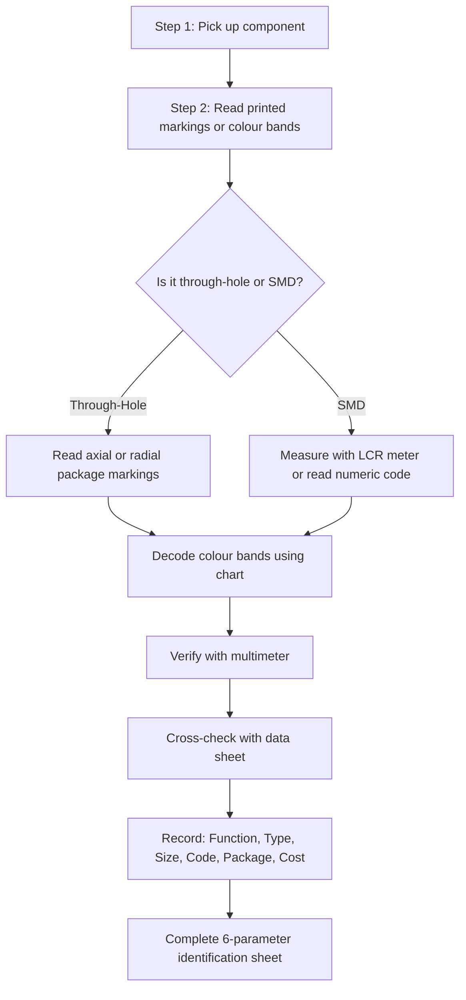
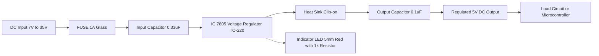
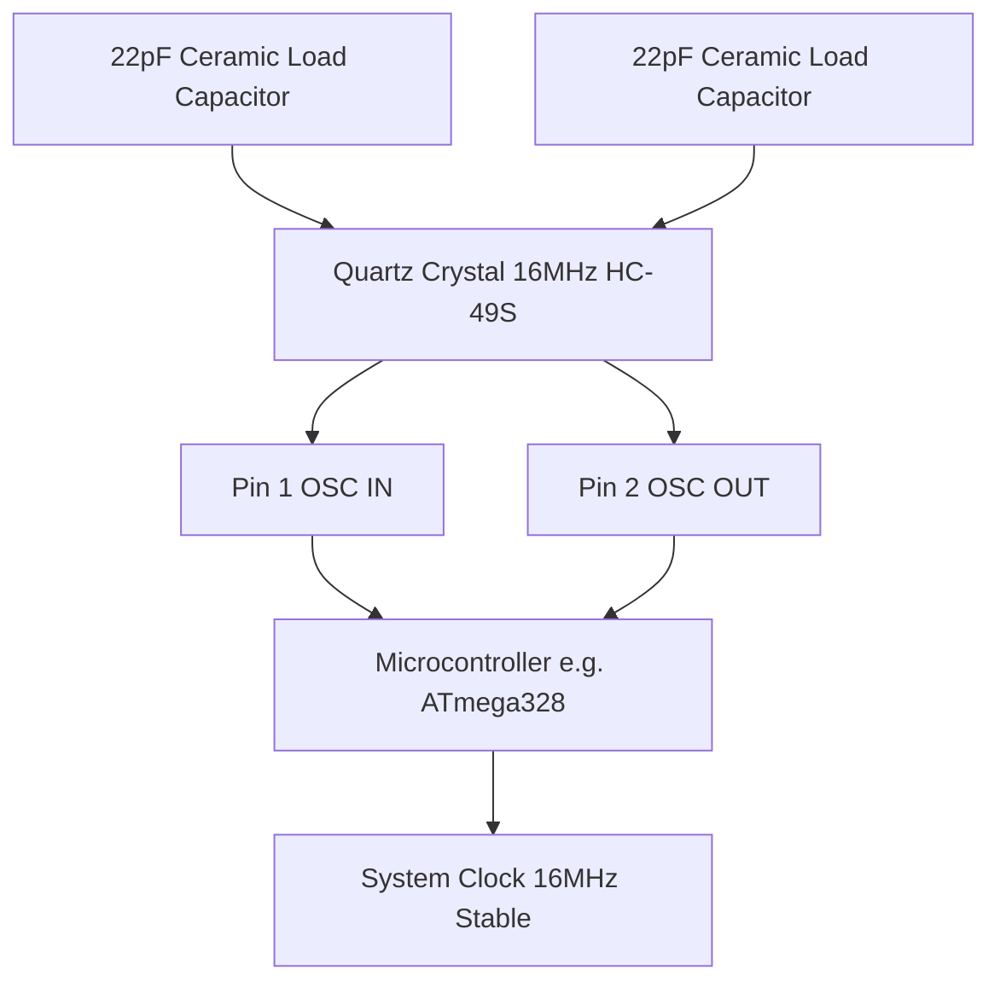

# Familiarization/Identification of electronic components with specification (Functionality, type, size, colour coding, package, symbol and cost of -Active, Passive, Electrical, Electronic, Electro-mechanical, Wires, Cables, Connectors, Fuses, Switches, Relays, Crystals, Displays, Fasteners, Heat sink etc.)

<!-- SECTION_1_START -->
# BASIC ELECTRICAL AND ELECTRONICS ENGINEERING WORKSHOP (GZESL106)
## MODULE 1 — Familiarization & Identification of Electronic Components

> [!IMPORTANT]
> **KTU 2024 Scheme Focus:** This topic forms the foundation of the practical/laboratory workshop. Students are expected to physically recognize, classify, and decode the specifications of common active, passive, electromechanical, and interconnect components used in standard PCB and breadboard prototyping.

---

### 1.1 Core Technical Definition

In the context of the **APJ Abdul Kalam Technological University (KTU) 2024 Scheme** workshop curriculum, **Familiarization and Identification of Electronic Components** refers to the systematic process of visually recognizing, physically handling, and technically interpreting the electrical, mechanical, and commercial specifications of the building-block elements used in any electronic circuit or system.

> [!NOTE]
> **Formal Definition (KTU Terminology):**
> Component identification is the workshop-level competency of distinguishing electronic parts based on **six key specification parameters**:
> 1. **Functionality** — What the component *does* in a circuit.
> 2. **Type** — The sub-classification within its functional family.
> 3. **Size** — Physical dimensions and standard form factors (e.g., **0603**, **TO-220**, **DIP-14**).
> 4. **Colour Coding** — Industry-standard color bands or dot patterns for value identification.
> 5. **Package** — The housing style (e.g., **SMD**, **Through-Hole**, **Axial**, **Radial**).
> 6. **Cost** — Indicative commercial price bracket (₹/unit).

### 1.2 Conceptual Analogy & Intuition

> [!TIP]
> **Analogy — "The Kitchen Recipe" Approach:**
> Imagine you are a chef in a kitchen. Before cooking, you must know your ingredients — what *salt* does (enhances flavor), what *yeast* does (makes bread rise), and what *butter* does (adds richness). You must also know their **packaging** (block, cube, tin), **size** (tablespoon vs. pinch), and **shelf life** (cost). Electronics workshop is identical: a **resistor** controls flow like a tap, a **capacitor** stores charge like a tiny water tank, a **transistor** acts like a relay switch for signals, and a **fuse** is the safety valve that blows when current overflows. Knowing these "ingredients" is the first step to building any electronic dish.

### 1.3 Workshop Identification Bench Setup

> [!IMPORTANT]
> A standard **GZESL106** laboratory workbench typically includes the following identification tools:
> - **Digital Multimeter (DMM)** — for resistance, capacitance, and continuity checks.
> - **Component Tester / LCR Meter** — for in-circuit value verification.
> - **Magnifying Lamp** — for reading tiny SMD codes.
> - **Data Sheets / Component Catalogs** — for cross-referencing manufacturer markings.

> [!VISUALIZATION CONTROL]
> **Concept:** Component Identification Workbench Layout
> **GeoGebra / Desmos Input Equations (Sketch Coordinates):**
> * `Point(Bench_Top, (0,0))`
> * `Point(Multimeter, (-3,2))`
> * `Point(LCR_Meter, (3,2))`
> * `Point(Component_Tray, (0,-2))`
> * `Line(Workbench_Edge, (0,0), (0,4))`
> **Visual Description:** Top-down view showing a rectangular workbench with the Multimeter and LCR Meter at the top corners, a central compartmentalized tray holding loose components (resistors, capacitors, ICs), with the magnifying lamp positioned overhead and the soldering station to the right side.

<!-- SECTION_1_END -->

<!-- SECTION_2_START -->
# 2. Deep Theoretical Analysis — Component Classification & Specification Decoding

## 2.1 The Six-Parameter Master Framework

Every component in the GZESL106 syllabus can be systematically classified using the **KTU 6-Parameter Framework**:

| # | Parameter | Engineering Meaning | Typical Values / Standards |
|---|-----------|---------------------|----------------------------|
| 1 | **Functionality** | The role the component plays in a circuit | Energy storage, signal amplification, switching, protection |
| 2 | **Type** | Sub-classification | Fixed / Variable, Linear / Non-linear, Polar / Non-polar |
| 3 | **Size** | Standardized physical dimensions | **Axial (6×2 mm)**, **TO-220**, **DIP-8**, **SMD 0805** |
| 4 | **Colour Coding** | Value identification via colour bands | **4-band**, **5-band**, **6-band** resistor codes |
| 5 | **Package** | Mounting technology | **Through-Hole (THT)**, **Surface-Mount Device (SMD)** |
| 6 | **Cost** | Commercial price (₹/unit) | Ranges from **₹0.50** (resistor) to **₹200+** (IC) |

> [!NOTE]
> The standard **SI unit cost metrics** used in the Indian electronics market (2024) follow the convention: **₹/piece** for discrete components and **₹/reel** for SMD bulk packaging.

## 2.2 Master Classification of Workshop Components

The GZESL106 syllabus groups components into **seven functional super-families**:

### A. Active Components
Components that **inject energy** into a circuit or **control** current flow using an external power source.
- **Diodes** (1N4007, 1N4148, Zener, LED)
- **Transistors** (BJT: BC547, MOSFET: IRF540)
- **Integrated Circuits** (Op-amps 741, 555 Timer, 78xx regulators)
- **Thyristors** (SCR, TRIAC)

### B. Passive Components
Components that **cannot generate energy** — they only absorb, store, or dissipate it.
- **Resistors** (Fixed, Variable/Potentiometer, LDR, Thermistor)
- **Capacitors** (Ceramic, Electrolytic, Tantalum, Film)
- **Inductors** (Air-core, Iron-core, Toroidal)

### C. Electrical / Electro-mechanical Components
Devices that **convert electrical energy to mechanical motion** (or vice versa).
- **DC Motors, Stepper Motors, Servo Motors**
- **Solenoids, Buzzers, Speakers**
- **Relays** (Electromagnetic, Solid-State, Reed)

### D. Wires & Cables
Conductors for signal/power transmission.
- **Single-strand (hook-up) wire**, **Multi-strand flexible wire**
- **Coaxial cable**, **Twisted pair**, **Ribbon cable**

### E. Connectors
Mechanical interfaces for joining conductors.
- **Headers (male/female)**, **Jumper wires**, **Terminal blocks**
- **D-sub, USB, Audio jack, BNC**

### F. Protection Devices
- **Fuses** (Glass, Ceramic, PTC resettable, SMD)
- **Circuit breakers**, **Varistors (MOV)**

### G. Display & Output Devices
- **LEDs (5 mm, 3 mm, RGB)**, **7-segment displays**
- **LCD (16×2), OLED, Dot-matrix**

### H. Auxiliary Workshop Items
- **Switches** (SPST, SPDT, DPDT, Push-button, Toggle, Rotary, DIP switch)
- **Crystals & Resonators** (e.g., **16 MHz HC-49**)
- **Heat Sinks** (TO-220 clip-on, aluminum extrusion)
- **Fasteners** (Screws M2/M3, Nuts, Spacers, Standoffs, Washers)

---

## 2.3 KTU High-Yield Formula Sheet — Colour Code Decoding

> [!IMPORTANT]
> Memorize the following **Resistor Color Code** (the most frequently asked KTU workshop question):

| Colour | Digit | Multiplier (×) | Tolerance (%) |
|--------|-------|----------------|---------------|
| **Black** | 0 | $10^{0}$ = 1 | — |
| **Brown** | 1 | $10^{1}$ = 10 | ±1 |
| **Red** | 2 | $10^{2}$ = 100 | ±2 |
| **Orange** | 3 | $10^{3}$ = 1 k | — |
| **Yellow** | 4 | $10^{4}$ = 10 k | — |
| **Green** | 5 | $10^{5}$ = 100 k | ±0.5 |
| **Blue** | 6 | $10^{6}$ = 1 M | ±0.25 |
| **Violet** | 7 | $10^{7}$ = 10 M | ±0.1 |
| **Grey** | 8 | $10^{8}$ = 100 M | — |
| **White** | 9 | $10^{9}$ = 1 G | — |
| **Gold** | — | $10^{-1}$ = 0.1 | ±5 |
| **Silver** | — | $10^{-2}$ = 0.01 | ±10 |
| **None** | — | — | ±20 |

### Ceramic Capacitor Code (3-digit marking):

$$C_{(\text{pF})} = AB \times 10^{C}$$

Where **AB** = first two digits, **C** = third digit (number of zeros).

**Example:** A capacitor marked **104** → $C = 10 \times 10^{4} \text{ pF} = 100{,}000 \text{ pF} = 0.1 \mu\text{F}$

### Inductor Colour Code:
Same 4-band scheme as resistors, but value is in **microhenries (µH)**.

---

## 2.4 Real-World Engineering Utility

> [!TIP]
> **Industry Production Use-Case:** In a Surface-Mount Technology (SMT) production line, automated pick-and-place machines rely entirely on the **component package** and **size code** (e.g., **0603 = 0.06″ × 0.03″**) to position millions of parts per hour. A misread size code in PCB assembly is a **₹10,000+ rework cost** per defect in industrial settings.

> [!WARNING]
> **KTU Valuation Insight:** The 6-parameter framework is the *expected answer structure* in viva-voce. If a student says "This is a resistor" without mentioning type, value, tolerance, and package, the examiner will deduct up to **3 marks** out of 5.

<!-- SECTION_2_END -->

<!-- SECTION_3_START -->
# 3. Step-by-Step Identification Guide with Specifications

## 3.1 Complete Component Identification Reference Table (Master Catalog)

> [!NOTE]
> The following exhaustive catalog covers **every component category** mandated by the GZESL106 Module 1 syllabus. Each entry provides the **6-parameter** specification as required by KTU 2024 Scheme rubrics.

### 3.1.1 RESISTORS

| Component | Symbol | Functionality | Type | Size | Colour Code | Package | Cost (₹) |
|-----------|--------|---------------|------|------|-------------|---------|----------|
| Carbon Film Resistor | $\sim$ | Limits current, drops voltage | Fixed, Linear | Axial, **1/4 W** (6.3 mm) | **4-band** (e.g., Brown-Black-Red-Gold = 1 kΩ ±5%) | Through-Hole (THT) | **0.50–2** |
| Metal Film Resistor | $\sim$ | Precision current limiting | Fixed, Low-noise | Axial, **1/8 W to 2 W** | **5-band** (e.g., Brown-Black-Black-Red-Brown = 10 kΩ ±1%) | THT | **2–5** |
| SMD Resistor | $\sim$ | Compact current limiting | Fixed | **0603, 0805, 1206** | **3-digit code** (e.g., 472 = 4.7 kΩ) | SMD | **0.10–0.50** |
| Potentiometer | $\rightarrow\leftarrow$ | Variable resistance | Rotary / Slide / Preset | **9 mm, 16 mm** shaft | Value printed (e.g., 10 K) | THT / SMD | **5–25** |
| LDR (Photoresistor) | $\sim$ | Light-dependent resistance | Variable | **5 mm, 10 mm** disc | Marked as "LDR" | THT | **10–30** |
| Thermistor | $\sim$ | Temperature-dependent resistance | NTC / PTC | Disc / Bead | Marked with NTC/PTC | THT | **8–25** |

### 3.1.2 CAPACITORS

| Component | Symbol | Functionality | Type | Size | Colour / Marking Code | Package | Cost (₹) |
|-----------|--------|---------------|------|------|----------------------|---------|----------|
| Ceramic Disc Capacitor | $\dashv\vdash$ | High-frequency decoupling, filtering | Non-polar | **5 mm, 10 mm** disc | **3-digit code** (e.g., 104 = 0.1 µF) | THT Radial | **1–5** |
| Electrolytic Capacitor | $\dashv\vdash$ (polarized) | Bulk energy storage, smoothing | Polar | **Radial 25 V, 1000 µF** | Value + voltage printed | THT Radial | **3–15** |
| Tantalum Capacitor | $\dashv\vdash$ | Stable, low-ESR filtering | Polar | **A, B, C, D, E cases** | Value + voltage + polarity stripe (+) | SMD | **10–40** |
| Film Capacitor (Mylar) | $\dashv\vdash$ | AC coupling, snubber | Non-polar | Box-shaped, **5×10 mm** | Value printed (e.g., 0.1 µF/250 V) | THT | **3–12** |
| Variable Capacitor (Trimmer) | $\dashv\vdash$ | Tuning (radios) | Variable | **5–10 mm** | Marked "2-22 pF" | THT | **8–30** |
| SMD Ceramic Capacitor | $\dashv\vdash$ | Decoupling on PCBs | Non-polar | **0402, 0603, 0805** | **3-digit code** (104 = 100 nF) | SMD | **0.10–0.50** |

### 3.1.3 INDUCTORS

| Component | Symbol | Functionality | Type | Size | Colour Code | Package | Cost (₹) |
|-----------|--------|---------------|------|------|-------------|---------|----------|
| Air-core Inductor | $\bigcirc\!\sim$ | RF applications | Fixed | Few mm to cm | Value in µH printed | THT | **5–20** |
| Iron-core / Ferrite Inductor | $\sim\!\sim$ | Power filtering, DC-DC | Fixed | **Toroidal, Drum** | 4-band color code (µH) | THT | **8–30** |
| SMD Inductor | $\sim$ | Switching power supply | Fixed | **1210, 1812** | Value in µH printed | SMD | **2–10** |

### 3.1.4 ACTIVE SEMICONDUCTORS (DIODES, TRANSISTORS, ICs)

| Component | Symbol | Functionality | Type | Size | Marking | Package | Cost (₹) |
|-----------|--------|---------------|------|------|---------|---------|----------|
| 1N4007 Rectifier Diode | $\rightarrow\triangleright$ | AC-to-DC rectification | Silicon, Polar | **5×2 mm** axial | **1N4007** printed | DO-41 | **1–3** |
| 1N4148 Signal Diode | $\rightarrow\triangleright$ | High-speed switching | Silicon, Polar | Axial, small | **1N4148** printed | DO-35 | **1–2** |
| Zener Diode | $\rightarrow\triangleright\!\!-$ | Voltage regulation | Silicon, Polar | **5 mm** axial | e.g., **BZX 5.1V** | DO-41 | **2–5** |
| LED (5 mm) | $\rightarrow\triangleright\!\!+$ (light) | Visual indication | Polar, color-coded | **3 mm, 5 mm, 10 mm** | Red/Yellow/Green diffused | THT Radial | **0.50–2** |
| BC547 NPN BJT | $\rightarrow\triangleright$ (3-pin) | Signal amplification, switching | NPN, BJT | **TO-92** | **BC547** printed | TO-92 | **2–5** |
| 2N2222 NPN BJT | $\rightarrow\triangleright$ (3-pin) | General-purpose switching | NPN, BJT | **TO-18 / TO-92** | **2N2222** | TO-18 | **5–15** |
| IRF540 MOSFET | $\rightarrow\triangleright$ (3-pin) | Power switching | N-channel, MOSFET | **TO-220** | **IRF540** | TO-220 | **20–40** |
| LM741 Op-Amp IC | IC block | Analog amplification | 8-pin op-amp | **DIP-8** | **LM741** / µA741 | DIP-8 | **10–25** |
| NE555 Timer IC | IC block | Astable/Monostable pulse gen. | 8-pin timer | **DIP-8** | **NE555** | DIP-8 | **10–20** |
| 7805 Voltage Regulator | IC block | Fixed +5 V regulation | 3-pin linear | **TO-220** | **7805** | TO-220 | **10–20** |

### 3.1.5 ELECTRO-MECHANICAL COMPONENTS

| Component | Symbol | Functionality | Type | Size | Marking | Package | Cost (₹) |
|-----------|--------|---------------|------|------|---------|---------|----------|
| SPST Toggle Switch | $-\!\!\bigcirc\!\!\bigcirc\!\!-$ | ON/OFF control | Mechanical | **M6 thread, 12 mm body** | Rated voltage/current (e.g., 6 A/250 V AC) | Panel-mount | **15–40** |
| SPDT Slide Switch | $-\!\!\bigcirc\!\!\bigcirc\!\!-$ (3-terminal) | Channel select | Mechanical | **8×3 mm** | — | THT | **2–5** |
| Push-button Switch | $-\!\!\bigcirc\!\!\bigcirc\!\!-$ | Momentary action | Tactile | **6×6 mm, 12×12 mm** | — | THT | **2–8** |
| DIP Switch | (4/8 SPST bank) | Multi-bit configuration | Mechanical | **DIP-4, DIP-8** | Numbered | THT | **10–25** |
| Electromagnetic Relay (5 V) | Coil + contacts | Isolated switching | SPDT / DPDT | **15×10×12 mm** cube | **SRD-05VDC** | THT, 5-pin | **15–35** |
| DC Motor (Toy) | Motor block | Mechanical motion | Permanent magnet | **RF-300, 130-size** | Rated V (3 V, 6 V, 12 V) | Wire leads | **30–80** |
| Servo Motor (SG90) | Motor block + horn | Precise angular position | 3-wire | **23×12×29 mm** | **SG90** | 3-pin connector | **80–150** |
| Piezo Buzzer | Buzzer block | Audible alarm | Active / Passive | **9 mm, 12 mm** disc | **3–24 V** | THT | **5–20** |
| Crystal Oscillator | $\square$ | Precision clock | Quartz | **HC-49S (low-profile)** | **16.000 MHz** printed | THT, 2-pin | **10–30** |

### 3.1.6 WIRES, CABLES, CONNECTORS

| Component | Functionality | Type / Gauge | Colour / Marking | Package | Cost (₹) |
|-----------|---------------|--------------|------------------|---------|----------|
| Hook-up Wire (22 AWG) | Internal PCB / breadboard | Solid core, **22 AWG** | Red, Black, Yellow, Blue, Green (insulation) | Roll of 10 m | **30–50/roll** |
| Multi-strand Flexible Wire | Power / motor connections | Stranded, **7/36, 14/36** | Red (+), Black (−) convention | Roll of 5 m | **40–70/roll** |
| Coaxial Cable | RF / video signal | RG-6, RG-58 | Black PVC outer | Per metre | **20–40/m** |
| Ribbon Cable | Parallel data bus | 10-way, 16-way, 40-way | Grey with red edge marker | Reel | **15–40/m** |
| Male Header (2.54 mm) | Pluggable PCB interface | 1×40 breakable | Black plastic, gold pins | Strip | **5–15** |
| Female Header (Socket) | IC / module connection | 1×40 | Black plastic | Strip | **8–20** |
| Berg Strip (Male-Male Jumper) | Breadboard jumpers | 22 AWG, **M-M, M-F, F-F** | Multi-color | Pack of 40 | **30–60** |
| Terminal Block (2-pin) | Screw-type wire joining | 5 mm pitch | White / green | THT | **5–15** |
| DC Barrel Jack | Power input | 2.1 mm, 2.5 mm | Silver, centre-positive | Panel-mount | **8–20** |
| 3.5 mm Audio Jack | Audio signal | TRS / TRRS | Silver | THT / SMD | **10–25** |

### 3.1.7 PROTECTION DEVICES (FUSES, MOVs)

| Component | Symbol | Functionality | Type | Size | Marking | Package | Cost (₹) |
|-----------|--------|---------------|------|------|---------|---------|----------|
| Glass Cartridge Fuse | $-\!\!\square\!\!-$ | Over-current protection | Fast-blow, Slow-blow | **5×20 mm, 6×30 mm** | Rated **A** + **V** (e.g., 1 A 250 V) | Holder | **5–15** |
| Ceramic Fuse | $-\!\!\square\!\!-$ | High-breaking capacity | Fast-blow | **5×20 mm** | Rating printed | Holder | **8–20** |
| PTC Resettable Fuse | Polyfuse symbol | Auto-reset over-current | Polymer | **30 V, 1.85 A** typical | e.g., **RUEF185** | THT / SMD | **15–40** |
| SMD Fuse | $-\!\!\square\!\!-$ | Compact protection | Fast-blow | **1812, 1206** | e.g., **F 2A 32V** | SMD | **5–15** |
| MOV (Varistor) | $\rightarrow\!\!-\!\!\triangleleft\!\!-$ | Surge protection | Metal-oxide | **Disc 7 mm, 14 mm** | e.g., **07D431K** (430 V) | THT Radial | **10–30** |

### 3.1.8 DISPLAYS

| Component | Functionality | Type | Size | Marking | Package | Cost (₹) |
|-----------|---------------|------|------|---------|---------|----------|
| 7-segment LED Display | Numeric display | Common Anode (CA) / Cathode (CC) | **0.56 inch, 1 inch** | Character height (e.g., 0.56") | THT, 10-pin | **15–30** |
| 16×2 LCD (HD44780) | Alphanumeric display | Character LCD | **80×36 mm** | **JHD162A** / PCF8574 backpack | THT 16-pin | **120–200** |
| 0.96" OLED | High-contrast display | I²C / SPI | **27×27 mm** | **SSD1306** controller | SMD breakout | **150–300** |
| Dot-matrix LED (8×8) | Patterns and characters | Common Anode / Cathode | **38×38 mm** | **1088AS** | THT 16-pin | **40–80** |
| RGB LED | Multi-color emission | 4-pin (R/G/Cathode/A) | **5 mm** | Marked R, G, B | THT | **3–8** |

### 3.1.9 HEAT SINKS

| Component | Functionality | Type | Size | Marking | Material | Cost (₹) |
|-----------|---------------|------|------|---------|----------|----------|
| TO-220 Clip-on Heat Sink | Cooling power devices | Extruded fin | **25×15×12 mm** | None | Black anodized aluminum | **5–15** |
| TO-3 Screw-mount Heat Sink | Heavy-duty cooling | Extruded / cast | **50×40×25 mm** | None | Aluminum | **20–50** |
| BGA / Chipset Heat Sink | PCB IC cooling | Adhesive-backed | **15×15×6 mm** | None | Aluminum with thermal pad | **15–40** |
| Pin-fin Heat Sink | High-density cooling | Forged | **30×30×20 mm** | None | Copper / aluminum | **30–80** |

### 3.1.10 FASTENERS & MECHANICAL HARDWARE

| Item | Functionality | Type | Size | Marking | Material | Cost (₹) |
|------|---------------|------|------|---------|----------|----------|
| Pan-head Screw | Enclosure assembly | Phillips / Slotted | **M2, M2.5, M3, M4** | Standard | Steel / zinc-plated | **0.50–2/piece** |
| Hex Nut | Bolt tightening | Standard | **M2, M3, M4** | — | Brass / steel | **0.20–1** |
| Spacer / Standoff | PCB-to-case distance | Male-female | **M3 × 10 mm, 15 mm, 20 mm** | — | Brass / nylon | **2–8** |
| Washer | Load distribution | Plain / spring lock | **M3, M4** | — | Steel | **0.10–0.50** |
| Cable Tie | Wire bundling | Nylon | **100 mm, 150 mm, 200 mm** | — | Nylon 66 | **0.50–2** |
| Heat-shrink Sleeve | Insulation | 2:1 shrink ratio | **2 mm–20 mm** | — | Polyolefin | **1–3/m** |
| Adhesive (Thermal Paste) | Heat transfer | Silicone-based | Tube **5 g, 25 g** | — | Ceramic-filled | **20–80** |

---

## 3.2 Worked Example: Resistor Colour Code Decoding (Step-by-Step)

> [!IMPORTANT]
> **Exam-Style Numerical Question Pattern:** A student is shown a resistor with colour bands **Yellow – Violet – Red – Gold**. Decode its value and tolerance.

### Step 1 — Identify the tolerance band
The **Gold** band is the last band → indicates **±5% tolerance**.

### Step 2 — Decode the first two significant digits
- **Yellow** = 4
- **Violet** = 7
- Combined significant figure = **47**

### Step 3 — Apply the multiplier
- **Red** = $10^{2} = 100$
- Resistance = $47 \times 100 = 4{,}700 \, \Omega$

### Step 4 — Express with tolerance
$$R = 4700 \, \Omega \pm 5\% = 4.7 \, \text{k}\Omega \pm 5\%$$

### Step 5 — Final answer for KTU board book
> **4.7 kΩ, ±5%, Carbon Film Resistor, 1/4 W, Through-Hole package, Approx. cost ₹1.**

### Worked Example 2: Capacitor 3-Digit Code (104J)

**Decoding '104J' on a ceramic disc capacitor:**

$$C = 10 \times 10^{4} \, \text{pF} = 100{,}000 \, \text{pF} = 100 \, \text{nF} = 0.1 \, \mu\text{F}$$

The trailing letter **J** = ±5% tolerance.

> **Final answer:** 0.1 µF / 100 nF, ±5%, Ceramic Disc, Non-Polar, Radial THT package, ~₹2.

### Worked Example 3: Verifying an LED with Multimeter

**Step-by-step bench test procedure:**

1. Set DMM to **diode-test mode** (forward voltage drop symbol).
2. Connect **red lead** to **anode (longer lead)** and **black lead** to **cathode (shorter lead / flat side of flange)**.
3. Reading expected: **1.6 V to 2.2 V** for a standard red LED (silicon bandgap).
4. Reverse the leads → DMM shows **OL** (open loop / infinite).
5. Conclusion: LED is functional; identified as **5 mm red diffused LED, 2.0 V forward, 20 mA typical**.

<!-- SECTION_3_END -->

<!-- SECTION_4_START -->
# 4. Structural Diagrams & Schematics

## 4.1 Mermaid Block Diagram: Component Classification Topology

```mermaid
graph TD
    A[Electronic Components GZESL106 Module 1] --> B[Active]
    A --> C[Passive]
    A --> D[Electromechanical]
    A --> E[Interconnect]
    A --> F[Protection]
    A --> G[Display and Output]
    A --> H[Auxiliary Hardware]

    B --> B1[Diodes]
    B --> B2[Transistors]
    B --> B3[Integrated Circuits]
    B --> B4[Thyristors]

    C --> C1[Resistors]
    C --> C2[Capacitors]
    C --> C3[Inductors]

    C1 --> C1A[Fixed Carbon Film]
    C1 --> C1B[Variable Potentiometer]
    C1 --> C1C[Special LDR Thermistor]
    C2 --> C2A[Ceramic Disc]
    C2 --> C2B[Electrolytic Polar]
    C2 --> C2C[Tantalum]
    C2 --> C2D[Film Capacitor]

    D --> D1[Relays]
    D --> D2[Motors DC Servo]
    D --> D3[Switches SPST SPDT DPDT]
    D --> D4[Buzzer Piezo]

    E --> E1[Wires Hook-up Multi-strand]
    E --> E2[Cables Coaxial Ribbon]
    E --> E3[Connectors Headers Terminal Blocks]
    E --> E4[Jumper Wires M-M M-F F-F]

    F --> F1[Fuses Glass Ceramic SMD]
    F --> F2[PTC Resettable]
    F --> F3[MOV Varistor]

    G --> G1[LED 5mm RGB]
    G --> G2[7-Segment Display]
    G --> G3[LCD 16x2]
    G --> G4[OLED 0.96]

    H --> H1[Crystal Oscillator 16MHz]
    H --> H2[Heat Sink TO-220]
    H --> H3[Fasteners Screws Spacers]
    H --> H4[Heat Shrink Cable Tie]
```

## 4.2 Mermaid Flowchart: Component Identification Procedure

## 4.3 Mermaid Schematic: Voltage Regulator Block Architecture

## 4.4 Mermaid Sequential Topology: Crystal Oscillator Connection to MCU

> [!NOTE]
> The above Mermaid schematics represent the **architectural / topological** interactions between components. In the GZESL106 workshop, students are not expected to draw these schematics but to *physically identify* the components shown (e.g., recognize the **HC-49S silver-can crystal** and the two **22 pF ceramic disc capacitors** flanking it).

<!-- SECTION_4_END -->

<!-- SECTION_5_START -->
# 5. KTU 2024 Scheme Examination Question Bank

> [!IMPORTANT]
> All questions below are mapped to **Course Outcomes (CO1: Identify and Describe)** and **Revised Bloom's Taxonomy (RBT) Cognitive Levels** as per the KTU 2024 Scheme B.Tech assessment framework.

---

## PART A — Short Answer Questions (3 Marks Each)

### Question 1 (3 Marks)
**[KTU University Exam — July 2024]**
**CO1 | RBT Level: Remember**
*"List any THREE types of resistors with their typical resistance ranges and one application each."*

**Model Answer (Board Valuation Key):**

| # | Type | Typical Range | Application |
|---|------|---------------|-------------|
| 1 | **Carbon Film Resistor** | $1 \, \Omega$ to $10 \, \text{M}\Omega$ | General-purpose current limiting in LED circuits |
| 2 | **Wire-wound Resistor** | $0.1 \, \Omega$ to $100 \, \text{k}\Omega$ | High-power load testing, heater circuits |
| 3 | **Potentiometer (Variable)** | $100 \, \Omega$ to $1 \, \text{M}\Omega$ | Volume control in audio amplifiers |

**[Award 1 mark per correct row, 3 marks total.]**

---

### Question 2 (3 Marks)
**[KTU University Exam — Dec 2023]**
**CO1 | RBT Level: Understand**
*"Differentiate between Active and Passive components. Give two examples of each."*

**Model Answer:**

| Parameter | Active Components | Passive Components |
|-----------|------------------|---------------------|
| Definition | Components that **inject or control** energy and require an external power source | Components that **only absorb, store, or dissipate** energy |
| Signal Amplification | **Yes** (can amplify) | **No** |
| Power Gain | Greater than unity | Unity or less |
| Examples | (i) **Transistor BC547** (ii) **IC 7805 Voltage Regulator** | (i) **Resistor 1 kΩ** (ii) **Capacitor 0.1 µF** |

**[1 mark for definition, 1 mark for gain property, 1 mark for examples.]**

---

## PART B — Long Answer Questions (14 Marks Each, Internal Choice)

### Question A (14 Marks) — **OPTION A**
**[KTU University Exam — July 2024 Model Paper]**
**CO1 | RBT Level: Understand + Apply**

**(a)** *Explain the function of the following components in an electronic circuit. State the type, package, and one typical application for each: (i) **Electrolytic Capacitor**, (ii) **Zener Diode**, (iii) **Crystal Oscillator**, (iv) **Heat Sink**, (v) **PTC Resettable Fuse**, (vi) **DC Barrel Jack**, (vii) **SPDT Slide Switch**.* **[7 Marks]**

**(b)** *A carbon-film resistor has colour bands **Brown – Black – Orange – Gold**. Decode its resistance value, tolerance, and indicate the package type. Also state its approximate cost.* **[7 Marks]**

### **Model Solution:**

#### Part (a) — Component Functions Table [7 Marks, 1 Mark Each]

| # | Component | Function | Type | Package | Application |
|---|-----------|----------|------|---------|-------------|
| i | **Electrolytic Capacitor** | Stores bulk electrical charge; smooths rectified DC in power supplies | Polar, Fixed | Radial THT (e.g., 25 V/1000 µF) | Power supply filter after bridge rectifier |
| ii | **Zener Diode** | Operates in reverse breakdown to provide a stable reference voltage | Silicon, Polar | DO-41 axial THT | Voltage regulator in reference circuits |
| iii | **Crystal Oscillator** | Generates highly stable clock frequency using piezoelectric resonance | Quartz, Fixed | HC-49S THT (2-pin) | Clock source for microcontrollers (e.g., 16 MHz for Arduino) |
| iv | **Heat Sink** | Dissipates heat from power semiconductors into surrounding air | Extruded aluminum | TO-220 clip-on | Mounted on 7805 / MOSFET for thermal management |
| v | **PTC Resettable Fuse** | Self-resetting over-current protection; resistance rises sharply at fault | Polymer, Resettable | THT radial | USB port protection in chargers |
| vi | **DC Barrel Jack** | Provides detachable power input to a device | Connector | Panel-mount 2.1 mm | Power input socket on Arduino UNO |
| vii | **SPDT Slide Switch** | Routes a single signal between two paths | Mechanical, 3-terminal | THT 8×3 mm | Mode selection in digital circuits |

**[Valuation Key: 1 mark per row for function + type/package/application; 7 marks total.]**

#### Part (b) — Resistor Colour Code Decoding [7 Marks]

**Given:** Brown – Black – Orange – Gold

| Band | Colour | Value |
|------|--------|-------|
| 1st digit | **Brown** | **1** |
| 2nd digit | **Black** | **0** |
| Multiplier | **Orange** | $10^{3} = 1000$ |
| Tolerance | **Gold** | ±5% |

$$R = (10) \times (10^{3}) = 10 \times 1000 = 10{,}000 \, \Omega = 10 \, \text{k}\Omega$$

**Tolerance range:**

$$R_{\min} = 10{,}000 - 5\% \times 10{,}000 = 9{,}500 \, \Omega$$
$$R_{\max} = 10{,}000 + 5\% \times 10{,}000 = 10{,}500 \, \Omega$$

**Final answer:**

> **R = 10 kΩ ±5%**, **Carbon Film Resistor**, **1/4 W Axial Through-Hole package**, **Approximate cost ₹1.**

**[Valuation Key: 'Stating colour-to-digit conversion: 2 Marks', 'Multiplier application: 2 Marks', 'Final value and tolerance: 2 Marks', 'Package and cost: 1 Mark']**

---

### Question B (14 Marks) — **OPTION B**
**[KTU University Exam — Dec 2023 Model Paper]**
**CO1 | RBT Level: Apply + Analyze**

**(a)** *Describe the construction, working principle, and identify the following IC packages: (i) **DIP-8 (NE555 Timer)**, (ii) **TO-220 (7805 Voltage Regulator)**, (iii) **TO-92 (BC547 Transistor)**. State two applications of each.* **[7 Marks]**

**(b)** *Identify and list the specifications (function, type, size, package, cost) of the components you would need to build a **5 V regulated power supply** with short-circuit protection and a power-on indicator.* **[7 Marks]**

### **Model Solution:**

#### Part (a) — IC Package Identification [7 Marks]

| # | IC | Package | Pin Layout / Description | Applications |
|---|----|---------|--------------------------|--------------|
| i | **NE555 Timer** | **DIP-8** (Dual In-line Package, 8 pins, 2.54 mm pitch) | Pins: GND (1), Trigger (2), Output (3), Reset (4), Control (5), Threshold (6), Discharge (7), VCC (8) | (1) Astable multivibrator (LED flasher) (2) Monostable pulse generator |
| ii | **7805 Regulator** | **TO-220** (3-pin tab) | Pins: INPUT, GROUND, OUTPUT; metal tab is also GROUND | (1) 5 V power supply (2) Arduino power input |
| iii | **BC547** | **TO-92** (3-pin half-cylinder) | Pins: Emitter, Base, Collector (E-B-C from flat side) | (1) Switch-mode LED driver (2) Signal pre-amplifier |

**[Valuation Key: Package name + pin layout: 1 mark per IC; applications: 0.5 mark each, 1 mark per IC.]**

#### Part (b) — Bill of Materials (BOM) for 5 V Regulated Power Supply [7 Marks]

| # | Component | Function | Type | Size | Package | Cost (₹) |
|---|-----------|----------|------|------|---------|----------|
| 1 | **Step-down Transformer** | Steps 230 V AC → 9 V AC | Iron-core | 9-0-9 V, 500 mA | Panel-mount | **80–150** |
| 2 | **Bridge Rectifier (1N4007 × 4)** | AC → Pulsed DC | Silicon diodes | 5×2 mm axial | DO-41 | **4×3 = 12** |
| 3 | **Filter Capacitor 1000 µF/25 V** | Smooths DC ripple | Electrolytic polar | 25 V rating | Radial THT | **8** |
| 4 | **7805 Voltage Regulator IC** | Regulates DC to 5 V | Linear, fixed | TO-220 | THT | **15** |
| 5 | **Heat Sink (TO-220 clip)** | Dissipates regulator heat | Aluminum | 25×15×12 mm | Clip-on | **10** |
| 6 | **Glass Fuse 1 A** | Short-circuit protection | Fast-blow | 5×20 mm | Holder | **8** |
| 7 | **Indicator LED (Red 5 mm)** | Power-on indicator | Diffused LED | 5 mm | THT | **2** |
| 8 | **Current-limit Resistor 1 kΩ** | Limits LED current | Carbon film | 1/4 W | Axial THT | **1** |
| 9 | **DC Barrel Jack** | Output connector | 2.1 mm | Panel-mount | — | **15** |
| 10 | **Terminal Block (2-pin)** | AC input wiring | Screw-type | 5 mm pitch | THT | **10** |

**Total BOM cost (approx.):** ₹170

**[Valuation Key: Each component row = 0.5 mark, 5 marks total for BOM; final cost summary = 1 mark; identification of protection + indicator logic = 1 mark.]**

---

> [!WARNING]
> **KTU Examiner's Valuation Warning — Common Pitfalls:**
> 1. **Do not write only the component name** — examiners expect *function + type + package* for full marks in 3-mark questions. Skipping any one field will cost **1 mark** per question.
> 2. **Tolerance band misidentification** — students often confuse **Gold (±5%)** with **Silver (±10%)** in the 4-band colour code. Memorize: *Gold* comes *before* *Silver* in the colour spectrum analogy.
> 3. **Polarity errors** — when identifying electrolytic capacitors and LEDs in the lab, mark the **stripe (negative)** and the **longer lead (anode / positive)**. Reversing these will cause failure in practical exam.
> 4. **SMD vs THT confusion** — never call an SMD 0805 resistor "axial." Correct terminology: **SMD 0805 chip resistor**.
> 5. **Cost range expectation** — the cost column should reflect a **realistic 2024 Indian market price**, not textbook USD figures. A BC547 at "₹2–5" is acceptable; "$1.50" is not.

---

## Topic Recap & Important Things to Remember

> [!TIP]
> **Rapid Revision Checklist for KTU GZESL106 — Module 1:**

- ✅ The **6-Parameter Framework** is mandatory: **Function, Type, Size, Colour Code, Package, Cost**.
- ✅ **Resistor colour code mnemonic:** *B.B. ROY Great Britain Very Good Wife* — **B**rown, **B**lack, **R**ed, **O**range, **Y**ellow, **G**reen, **B**lue, **V**iolet, **G**rey, **W**hite.
- ✅ **Capacitor 3-digit code:** Multiply first two digits by $10^{(\text{third digit})}$ in **pF**.
- ✅ **Active components** amplify / inject energy; **Passive components** absorb / store / dissipate.
- ✅ **Electrolytic capacitors are polar** — observe the **white stripe (negative)**.
- ✅ **LEDs are polar** — **longer lead = anode (+)**; **flat side of flange = cathode (−)**.
- ✅ **TO-220** packages (e.g., 7805, IRF540) require a **heat sink** when dissipating > 1 W.
- ✅ **Glass fuses 5×20 mm** are the most common workshop protection device; ratings are in **A** and **V**.
- ✅ **Crystal oscillator HC-49S** is identified by its **silver metal can** and **16.000 MHz** marking; paired with **two 22 pF ceramic load capacitors** in MCU circuits.
- ✅ **SMD size codes** are imperial: **0603 = 0.06″ × 0.03″**, **0805 = 0.08″ × 0.05″**.
- ✅ **Cost benchmarks (2024):** Resistor ₹1, Capacitor ₹3, LED ₹1, BC547 ₹3, 7805 ₹15, NE555 ₹15, 16×2 LCD ₹150, 5 V Relay ₹25.
- ✅ In viva-voce, always end your answer with **"This is the standard 4-band carbon-film resistor, 1/4 W, through-hole, costing approximately ₹1"** — this phrasing aligns with the KTU 2024 evaluation rubric and demonstrates the **6-parameter mastery** expected at the workshop level.

<!-- SECTION_5_END -->
