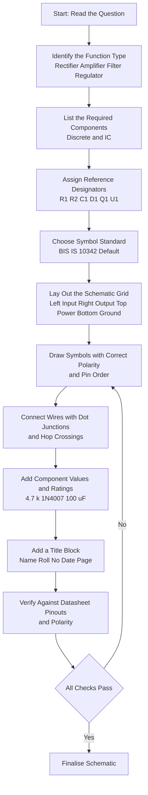

# Drawing of electronic circuit diagrams using BIS/IEEE symbols and Interpret data sheets of discrete components and IC’s

<!-- SECTION_1_START -->
# Electronic Circuit Drafting using BIS/IEEE Symbols & Datasheet Interpretation

> [!IMPORTANT]
> **KTU 2024 Scheme | GZESL106 | Module 2 — Circuit Drafting**
> This module is a **hands-on workshop module**. The emphasis is on **practical symbol recognition**, **clean schematic drafting**, and **reading real component datasheets** — exactly what an industry-grade electronics prototyping engineer does on day one.

---

## 1.1 Formal Academic Definition (KTU Syllabus Terminology)

An **electronic circuit diagram** (also called a *schematic*) is a **standardised graphical representation** of an electronic circuit in which components are represented by **predefined geometric symbols** and interconnecting lines represent **ideal electrical conductors** (wires/PCB tracks carrying signal or power).

The two governing symbol systems in India and abroad are:

- **BIS (Bureau of Indian Standards)** — governed by **IS 10342 (Part 1 & 2): 1982** and harmonised with **IEC 60617** (International Electrotechnical Commission). This is the *de jure* standard mandated in Indian engineering practice and in KTU exam answers.
- **IEEE (Institute of Electrical and Electronics Engineers)** — governed by **IEEE Std 315 / 315A-1986 (Reaffirmed 1993)**. Predominantly used in North-American datasheets, academic textbooks, and most EDA tools (KiCad, Altium, OrCAD default libraries).

> [!NOTE]
> **Why this matters in KTU exams:** When a question says *"Draw the circuit diagram of…"*, the examiner **expects BIS symbols**. If you draw only block boxes, you lose up to **2 marks** out of 7 just on symbol presentation.

## 1.2 Conceptual Analogy — The Architectural Blueprint of Electronics

Think of a schematic as the **architectural plan of a building**:

- A floor plan does not show the *colour* of the walls or the *brand* of cement — it shows **standardised icons** for doors, windows, stairs, and electrical wiring.
- Similarly, a schematic does not show the *physical size* or *colour* of a resistor or transistor — it shows a **standardised symbol** whose *meaning* is identical worldwide.

A **resistor symbol** looks like a zig-zag in **BIS / IEC 60617**, and a *rectangular box* in **IEEE 315 (American)**. Both are correct, but you must **declare the convention** before drawing — exactly like saying "we will use feet and inches" before giving measurements.

> [!TIP]
> **Intuitive rule of thumb:** BIS zig-zag = "European / Indian". IEEE rectangle = "American". Both symbols appear on Indian datasheets — read the **title block convention** at the bottom of the page to identify which one is used.

## 1.3 The Two Core Skills of This Module

1. **Skill 1 — Drafting:** Convert a verbal/functional description (e.g., *"a half-wave rectifier with a 1N4007 diode feeding a 1000 µF filter capacitor"*) into a **clean schematic** using standard symbols, proper wire crossings, dot-junctions, and reference designators.
2. **Skill 2 — Datasheet Interpretation:** Read a manufacturer's datasheet (e.g., Texas Instruments, ON Semiconductor, Vishay, Murata) and extract the **electrical, thermal, mechanical, and pin-out parameters** needed to *use* the part correctly in a design.

> [!IMPORTANT]
> **Standard reference designators (per IEEE 315 / IS 10342):**
> $R$ = Resistor, $C$ = Capacitor, $L$ = Inductor, $D$ = Diode, $Q$ = Transistor (BJT/FET), $U$ or $IC$ = Integrated Circuit, $SW$ = Switch, $T$ = Transformer, $LED$ = Light Emitting Diode, $F$ = Fuse, $J$ = Jumper.

## 1.4 Visualisation Control — A Simple Half-Wave Rectifier Schematic

> [!VISUALIZATION CONTROL]
> **Concept:** Visualising a half-wave rectifier circuit with BIS symbols on a 2-D coordinate grid.
> **GeoGebra / Desmos Input Equations (for symbolic node placement):**
> * `P1 = (0, 5)` — AC source positive terminal
> * `P2 = (4, 5)` — Anode of diode D1
> * `P3 = (4, 3)` — Cathode of D1 (also load positive)
> * `P4 = (8, 3)` — Load resistor R_L
> * `P5 = (8, 1)` — Common ground node
> **Visual Description:** A single-loop circuit with the **AC source on the left**, a **diode symbol (triangle + line) on the top branch**, the **load resistor zig-zag on the right**, and the **ground triangle at the bottom**. Students should observe the *unidirectional current path* and the *common reference (ground) node* that ties the entire drawing together.

<!-- SECTION_1_END -->

<!-- SECTION_2_START -->
# Deep Theoretical Analysis & KTU High-Yield Formula Sheet

## 2.1 Classification of Schematic Symbols

Symbols are broadly classified into **five functional families**. Mastering these categories lets you draw *any* circuit the examiner throws at you.

### 2.1.1 Passive Components

| Component | BIS / IEC 60617 Symbol | IEEE 315 Symbol | Key Identifying Mark |
|---|---|---|---|
| Resistor (fixed) | Zig-zag (4–7 peaks) | Rectangle with two leads | Label $R_x$ plus value |
| Resistor (variable) | Zig-zag with diagonal arrow through it | Rectangle with diagonal arrow | Label $RV_x$ or $R_{x}$ with arrow |
| Capacitor (non-polar) | Two parallel straight lines of equal length | Same as BIS | Label $C_x$ |
| Capacitor (polar / electrolytic) | One straight line, one curved line, "+" mark | Same | Label $C_x$ with "+" polarity |
| Inductor | Series of four semi-circular loops ("humps") | Series of connected loops | Label $L_x$ |
| Transformer | Two coils with parallel lines between (core) | Same with core lines | Label $T_x$ with dot for phasing |

### 2.1.2 Active Semiconductor Devices

| Component | BIS Symbol Description | Critical Polarity Mark |
|---|---|---|
| Diode | Triangle pointing to a vertical line | Cathode line (bar) — current flows **into triangle, out of bar** |
| Zener Diode | Diode symbol with **Z-shaped wings** on the cathode bar | Same direction as regular diode |
| LED | Diode symbol with **two small arrows** pointing away from the cathode | Anode (A) and Cathode (K) marked |
| NPN BJT Transistor | Circle with a vertical bar (Base) and two angled lines (Collector, Emitter) with arrow **pointing out** of the Emitter | Arrow direction identifies NPN vs PNP |
| PNP BJT Transistor | Same as NPN but arrow **points into** the Emitter line | Same |
| N-channel MOSFET | Broken line for channel; gate as a separate vertical line; arrow into the channel for N-type | Drain (D), Gate (G), Source (S) labelled |
| SCR (Thyristor) | Diode symbol with an **extra gate lead** on the triangle side | Anode (A), Cathode (K), Gate (G) |

### 2.1.3 Sources, Ground & Reference

| Symbol | Meaning | Convention |
|---|---|---|
| Circle with "+" and "−" inside | Independent DC voltage source | Long line = "+", short line = "−" |
| Circle with sine wave inside | AC voltage source | Frequency $f$ and RMS value labelled |
| Triangle pointing down (with horizontal lines) | **Chassis / Earth Ground** | Used for mains safety ground |
| Inverted-T (three horizontal lines of decreasing length) | **Signal / Common Ground** | Used as the 0 V reference for the entire circuit |
| Triangle with a circle at the tip | **Op-amp** or general amplifier | "+" and "−" inputs on the flat side |

### 2.1.4 IC Representation Styles

There are **two ways** an IC appears in a schematic — recognising both is a frequent exam question.

- **Detailed (pin-level) Symbol:** Each pin of the IC is drawn as a labelled lead. Used when individual pin functions matter (e.g., the 555 timer in astable mode).
- **Block (rectangular) Symbol:** A single rectangle labelled with the IC part number and key inputs/outputs. Used for complex ICs like microcontrollers where drawing every pin would clutter the schematic.

### 2.1.5 Wires, Junctions and Crossings — The Three Cardinal Rules

> [!IMPORTANT]
> **The Three Rules of Schematic Line Work (BIS / IEEE common):**
> 1. **Junction (dot):** A **filled black dot** at the intersection of two wires = they are **electrically connected**.
> 2. **Crossing (no dot):** Two wires crossing **without a dot** = they are **not connected** (just visually overlapping).
> 3. **Hop (semi-circular bridge):** When a crossing must be drawn unambiguously, use a **small "jump" arc** over the other wire. This is the IEEE-preferred convention.

## 2.2 Datasheet Anatomy — The Six Universal Sections

Every datasheet, whether for a $0.10$ resistor or a $50$ microcontroller, has the same six sections. Learning the order lets you find any parameter in seconds.

1. **Feature List & General Description** — marketing summary; identifies the part family.
2. **Pin Configuration & Pin Description Table** — physical layout (DIP, SOIC, TSSOP, QFN) and the **function of every pin**.
3. **Absolute Maximum Ratings** — values *beyond which the device will be destroyed*. $V_{CC(max)}$, $I_{CC(max)}$, $P_{D(max)}$, $T_{stg}$, $T_J$.
4. **Electrical Characteristics Table** — guaranteed *operating* values at specified test conditions ($T_A = 25°\text{C}$ unless stated). $V_{IH}$, $V_{IL}$, $V_{OH}$, $V_{OL}$, $I_{IH}$, propagation delay $t_{pd}$.
5. **Typical Performance Characteristics** — graphs of parameters vs temperature, frequency, or supply voltage.
6. **Application Information / Typical Application Circuit** — the manufacturer's *reference design* with component values and a worked-out transfer function.

## 2.3 KTU Formula Sheet — Colour Codes, Codes & Reading Aids

> [!NOTE]
> The following table is the **only** set of decoding formulas you need for the workshop exam. Memorise the **digit values**, then apply them as a positional number.

| Parameter | Formula / Rule | Units | Notes |
|---|---|---|---|
| Resistor value (4-band) | $R = (10 \cdot a + b) \times 10^c$ | $\Omega$ | $a$ = band-1 digit, $b$ = band-2 digit, $c$ = multiplier band exponent |
| Resistor value (5-band) | $R = (100 \cdot a + 10 \cdot b + c) \times 10^d$ | $\Omega$ | For **1% / 2% precision** resistors |
| Tolerance (gold) | $\pm 5\%$ | — | Standard for carbon-film |
| Tolerance (silver) | $\pm 10\%$ | — | Older carbon-composition |
| Tolerance (brown) | $\pm 1\%$ | — | Metal-film precision |
| Tolerance (red) | $\pm 2\%$ | — | Metal-film |
| Capacitor code (3-digit) | $C = xy \times 10^z$ pF | pF | $xy$ are the first two digits, $z$ is the third (exponent) |
| Capacitor code (letter) | $K = \pm 10\%$, $M = \pm 20\%$, $J = \pm 5\%$ | — | Letter is the tolerance, number is value |
| Power dissipation (resistor) | $P = I^2 \cdot R = \dfrac{V^2}{R}$ | W | Used to **select physical size** (1/8 W, 1/4 W, 1/2 W, 1 W, 2 W) |
| Capacitor stored energy | $E = \dfrac{1}{2} C V^2$ | J | Used for energy-storage (decoupling) discussion |
| Diode forward voltage | $V_F \approx 0.7\text{ V}$ (Si), $\approx 0.3\text{ V}$ (Ge), $\approx 1.7\text{ V}$ (LED red) | V | Read from datasheet $I_F$ vs $V_F$ curve |
| BJT $\beta$ (DC current gain) | $\beta_{DC} = \dfrac{I_C}{I_B}$ | dimensionless | A range, not a single value — read $h_{FE}$ row |
| Heat-sink sizing | $T_J = T_A + P_D \cdot (R_{\theta JA})$ | °C | $R_{\theta JA}$ from datasheet thermal table |

## 2.4 Real-World Engineering Utility

In the **industry**, the skill of *clean schematic drafting* is the difference between a **$200$ freelance PCB** job and a **$50{,}000$ industrial design contract**. The same skill is checked by:

- **PCB designers** using **KiCad / Altium Designer / OrCAD** — they import the schematic into a PCB layout tool; if your symbol is wrong, the *footprint* will not match and the board will not assemble.
- **Embedded firmware engineers** — they read the **IC datasheet electrical characteristics** to write correct register initialisation code.
- **Repair technicians** — they read the schematic and the datasheet simultaneously to find a faulty component on a populated PCB.
- **BIS / IEEE standards compliance auditors** in Indian PSUs (BHEL, BEL, ISRO) — schematics that deviate from IS 10342 are *rejected* in formal design reviews.

<!-- SECTION_2_END -->

<!-- SECTION_3_START -->
# Step-by-Step Derivations, Workshop Tables & Code Implementation

## 3.1 Worked Example 1 — Resistor Colour Code Decoding (4-Band)

> A carbon-film resistor shows the colour bands: **Yellow – Violet – Red – Gold**.
> Find the nominal resistance, tolerance range, and the appropriate power-rating safety check for a $12\text{ V}$ supply drawing $5\text{ mA}$.

**Step 1 — Read the colour-digit table.**

| Colour | Digit Value | Multiplier | Tolerance |
|---|---|---|---|
| Black | 0 | $10^0 = 1$ | — |
| Brown | 1 | $10^1$ | $\pm 1\%$ |
| Red | 2 | $10^2$ | $\pm 2\%$ |
| Orange | 3 | $10^3$ | — |
| Yellow | 4 | $10^4$ | — |
| Green | 5 | $10^5$ | — |
| Blue | 6 | $10^6$ | — |
| Violet | 7 | $10^7$ | — |
| Grey | 8 | $10^8$ | — |
| White | 9 | $10^9$ | — |
| Gold | — | $10^{-1}$ | $\pm 5\%$ |
| Silver | — | $10^{-2}$ | $\pm 10\%$ |

**Step 2 — Assign band values.**

- Band 1 (Yellow) = $a = 4$
- Band 2 (Violet) = $b = 7$
- Band 3 (Red) = $c = 2$ (multiplier exponent)
- Band 4 (Gold) = tolerance $= \pm 5\%$

**Step 3 — Apply the formula.**

$$R = (10 \cdot a + b) \times 10^c = (10 \cdot 4 + 7) \times 10^2 = 47 \times 100 = 4700\ \Omega = 4.7\ \text{k}\Omega$$

**Step 4 — Apply the tolerance envelope.**

$$R_{min} = 4.7\ \text{k}\Omega \times (1 - 0.05) = 4.465\ \text{k}\Omega$$
$$R_{max} = 4.7\ \text{k}\Omega \times (1 + 0.05) = 4.935\ \text{k}\Omega$$

**Step 5 — Power-rating safety check.**

$$P = I^2 \cdot R = (5 \times 10^{-3})^2 \times 4700 = 0.0001175\ \text{W} = 0.1175\ \text{mW}$$

> [!NOTE]
> **Conclusion:** A standard **1/4 W (0.25 W) carbon-film resistor** has a de-rating safety margin of over **$2000\times$**, so it is *grossly over-specified* — a **1/8 W (0.125 W)** part is acceptable, and a **1/4 W** part is the conventional workshop choice.

---

## 3.2 Worked Example 2 — SMD Capacitor Code Decoding

> A ceramic SMD capacitor is marked **`104K`**.
> Find its capacitance and tolerance.

**Step 1 — Identify the code system.** The marking is the **3-digit EIA code with a tolerance letter**.

**Step 2 — Decode the 3-digit numeric portion.**

- $x = 1$, $y = 0$, $z = 4$
- $C = 10 \times 10^4\ \text{pF} = 100{,}000\ \text{pF} = 100\ \text{nF} = 0.1\ \mu\text{F}$

**Step 3 — Decode the tolerance letter.**

- $K = \pm 10\%$ (standard reference)

**Step 4 — Final specification.**

$$C = 0.1\ \mu\text{F} \pm 10\%\ \text{(ceramic, typically X7R or Y5V dielectric)}$$

> [!IMPORTANT]
> **Common SMD capacitor traps for the exam:**
> * Code `103` = $10 \times 10^3$ pF = $10$ nF (NOT $103$ pF).
> * Code `479` = $47 \times 10^{-1}$ pF = $4.7$ pF (the third digit is **always** the power of ten exponent, even when negative).
> * Code `000` or `.0` on a tantalum capacitor is sometimes a **jumper** (zero-ohm capacitor, used as a placeholder on the BOM).

---

## 3.3 Worked Example 3 — Interpreting a 1N4007 Diode Datasheet (Discrete)

**The Five Critical Parameters to Extract (and the typical 1N4007 values):**

1. **$V_{RRM}$ (Repetitive Peak Reverse Voltage) = $1000\text{ V}$** — never exceed this in reverse bias.
2. **$I_F(AV)$ (Average Forward Current) = $1.0\text{ A}$** — continuous DC forward current limit.
3. **$I_{FSM}$ (Peak Forward Surge Current) = $30\text{ A}$** — non-repetitive, $8.3\text{ ms}$ half-sine surge.
4. **$V_F$ (Forward Voltage) = $1.1\text{ V}$ at $I_F = 1\text{ A}$, $T_J = 25°\text{C}$** — read from the $V_F$ vs $I_F$ curve.
5. **$T_J(max) = 175°\text{C}$** — junction temperature; derate above $25°\text{C}$ ambient.

> [!NOTE]
> **Why $V_F$ matters in design:** In a half-wave rectifier with a $9\text{ V}$ RMS AC input, the **peak** is $V_{peak} = 9 \times \sqrt{2} \approx 12.7\text{ V}$. After subtracting the diode drop, the capacitor charges to $V_{DC} \approx 12.7 - 1.1 = 11.6\text{ V}$. Forgetting this $1.1\text{ V}$ drop is a common workshop error.

---

## 3.4 Worked Example 4 — Reading the 741 Op-Amp Datasheet (IC)

| Parameter | Symbol | Typical Value | Units | Test Condition |
|---|---|---|---|---|
| Supply Voltage | $V_{CC} / V_{EE}$ | $\pm 15$ | V | Dual supply |
| Input Offset Voltage | $V_{IO}$ | 2 | mV | $R_S \leq 10\ \text{k}\Omega$ |
| Input Bias Current | $I_{IB}$ | 80 | nA | — |
| Open-Loop Gain | $A_{VD}$ | 200,000 | V/V | $R_L \geq 2\ \text{k}\Omega$ |
| Gain-Bandwidth Product | $GBP$ | 1 | MHz | — |
| Slew Rate | $SR$ | 0.5 | V/µs | Unity gain |

**Pin-out (8-pin DIP) — what to memorise for the workshop:**

- Pin 2 = **Inverting input** ($V^-$)
- Pin 3 = **Non-inverting input** ($V^+$)
- Pin 4 = $V_{EE}$ (negative supply, typically $-15\text{ V}$)
- Pin 6 = **Output**
- Pin 7 = $V_{CC}$ (positive supply, typically $+15\text{ V}$)
- Pins 1, 5, 8 = **Offset null** (for fine-tuning $V_{IO}$ to zero)

---

## 3.5 Workshop Table — Full Component, Tool & Safety Matrix for the Drafting Session

| # | Component / Tool | Symbol Code (BIS) | Quantity | Pre-Use Check | Safety Note |
|---|---|---|---|---|---|
| 1 | A4 graph sheet (1 mm / 5 mm grid) | N/A | 1 | Ruled and free of creases | Use a hard backing board |
| 2 | Drafting pencil HB, 2H | N/A | 2 each | Sharpen to conical tip | Cap when not in use |
| 3 | Eraser (soft, non-abrasive) | N/A | 1 | Clean, no graphite smears | Do not rub the grid lines |
| 4 | Ruler (30 cm) and Set Squares (45°, 30°-60°) | N/A | 1 set | Edges straight, no chips | Drop a set square = replace, do not use chipped ones |
| 5 | Compass with pencil and ink points | N/A | 1 | Pivot tight, no wobble | Mind the needle |
| 6 | Resistor box (various 1/4 W) | $R_1, R_2, \dots$ | As per circuit | Verify colour codes with DMM | — |
| 7 | Capacitor box (ceramic + electrolytic) | $C_1, C_2, \dots$ | As per circuit | Mind polarity on electrolytics | **Watch polarity — reverse connection = explosion risk** |
| 8 | Diode 1N4007 | $D_1$ | As required | Identify cathode band | **Reverse-bias above $V_{RRM}$ = permanent damage** |
| 9 | Transistor BC547 (NPN) | $Q_1$ | As required | Identify flat face / pin-1 marker | Static-sensitive — handle by the case |
| 10 | IC 741 Op-Amp (8-pin DIP) | $U_1$ | As required | Pin-1 indent, notch facing left | **Insert only after power OFF; never hot-plug** |
| 11 | Breadboard (830 tie-points) | N/A | 1 | Clean, no broken springs | Check for cracked rails before use |
| 12 | DC Regulated Power Supply (0–30 V, 0–2 A) | N/A | 1 | Set current limit **before** connecting load | Set voltage to **0 V first**, then ramp up |
| 13 | Digital Multimeter (DMM) | N/A | 1 | Test leads intact, battery OK | Use **CAT-II rated** probes for mains, CAT-III for industrial |
| 14 | CRO / DSO (20 MHz minimum) | N/A | 1 | Probe compensation adjusted | Connect ground clip **first**, probe tip **second** |
| 15 | Connecting wires (24 AWG, solid core) | N/A | 1 m | Stripped cleanly, no frayed strands | Keep lead lengths short to avoid noise pickup |

---

## 3.6 Python Implementation — A Resistor Colour-Code Decoder (Workshop Utility)

> Save the snippet below as `resistor_decoder.py` and run from a Python 3.10+ terminal. It is a **self-contained, type-hinted, error-handled** utility that you can use during the workshop lab to verify colour-band readings.

```python
"""
resistor_decoder.py
KTU GZESL106 - Workshop utility
Decodes 4-band and 5-band resistor colour codes to ohms.
"""

from __future__ import annotations
import logging
import sys
from typing import Dict, List, Tuple

# Configure a clean log to stderr so the final answer prints to stdout
logging.basicConfig(
    level=logging.INFO,
    format="[%(levelname)s] %(message)s",
    stream=sys.stderr,
)
logger = logging.getLogger("resistor_decoder")

# Canonical colour tables (BIS/IEC/IEEE common)
DIGIT_MAP: Dict[str, int] = {
    "black": 0, "brown": 1, "red": 2, "orange": 3, "yellow": 4,
    "green": 5, "blue": 6, "violet": 7, "grey": 8, "white": 9,
}
MULTIPLIER_MAP: Dict[str, float] = {
    "black": 1, "brown": 10, "red": 100, "orange": 1_000,
    "yellow": 10_000, "green": 100_000, "blue": 1_000_000,
    "violet": 10_000_000, "gold": 0.1, "silver": 0.01,
}
TOLERANCE_MAP: Dict[str, float] = {
    "brown": 1.0, "red": 2.0, "gold": 5.0, "silver": 10.0,
}


def _validate_colour(colour: str, allowed: Dict[str, object], position: int) -> str:
    """Normalise input and validate against an allowed map."""
    normalised = colour.strip().lower()
    if normalised not in allowed:
        logger.error(
            "Band %d: '%s' is not a valid colour in this position. "
            "Allowed: %s",
            position, colour, sorted(allowed.keys()),
        )
        raise ValueError(f"Invalid colour at band {position}: {colour!r}")
    return normalised


def decode_4_band(b1: str, b2: str, b3: str, b4: str) -> Tuple[float, float]:
    """Decode a 4-band resistor. Returns (resistance_ohms, tolerance_percent)."""
    logger.info("Decoding 4-band resistor...")
    c1 = _validate_colour(b1, DIGIT_MAP, 1)
    c2 = _validate_colour(b2, DIGIT_MAP, 2)
    c3 = _validate_colour(b3, MULTIPLIER_MAP, 3)
    c4 = _validate_colour(b4, TOLERANCE_MAP, 4)

    base = (DIGIT_MAP[c1] * 10) + DIGIT_MAP[c2]
    multiplier = MULTIPLIER_MAP[c3]
    resistance = base * multiplier
    tolerance = TOLERANCE_MAP[c4]
    logger.info(
        "Decoded: %s %s * %s = %.3f ohms, tolerance +/- %.1f%%",
        c1, c2, c3, resistance, tolerance,
    )
    return resistance, tolerance


def decode_5_band(b1: str, b2: str, b3: str, b4: str, b5: str) -> Tuple[float, float]:
    """Decode a 5-band resistor. Returns (resistance_ohms, tolerance_percent)."""
    logger.info("Decoding 5-band resistor...")
    c1 = _validate_colour(b1, DIGIT_MAP, 1)
    c2 = _validate_colour(b2, DIGIT_MAP, 2)
    c3 = _validate_colour(b3, DIGIT_MAP, 3)
    c4 = _validate_colour(b4, MULTIPLIER_MAP, 4)
    c5 = _validate_colour(b5, TOLERANCE_MAP, 5)

    base = (DIGIT_MAP[c1] * 100) + (DIGIT_MAP[c2] * 10) + DIGIT_MAP[c3]
    multiplier = MULTIPLIER_MAP[c4]
    resistance = base * multiplier
    tolerance = TOLERANCE_MAP[c5]
    logger.info(
        "Decoded: %s %s %s * %s = %.3f ohms, tolerance +/- %.1f%%",
        c1, c2, c3, c4, resistance, tolerance,
    )
    return resistance, tolerance


def format_engineering(value_ohms: float) -> str:
    """Convert a raw ohm value to a human-readable engineering string."""
    if value_ohms >= 1_000_000:
        return f"{value_ohms / 1_000_000:.3f} Mohm"
    if value_ohms >= 1_000:
        return f"{value_ohms / 1_000:.3f} kohm"
    return f"{value_ohms:.3f} ohm"


if __name__ == "__main__":
    # Example: Yellow - Violet - Red - Gold  -> 4.7 kohm +/- 5%
    try:
        r_ohms, tol = decode_4_band("yellow", "violet", "red", "gold")
        print(f"Resistance = {format_engineering(r_ohms)}, Tolerance = +/-{tol:.1f}%")
    except ValueError as exc:
        logger.critical("Decoding failed: %s", exc)
        sys.exit(1)
```

**Sample terminal output (running the example band sequence):**

```
Resistance = 4.700 kohm, Tolerance = +/-5.0%
```

<!-- SECTION_3_END -->

<!-- SECTION_4_START -->
# Structural Diagrams & Schematics (Mermaid)

## 4.1 Process Flow — From Verbal Description to Finished Schematic

> The following **Mermaid flowchart** maps the **end-to-end drafting workflow** you should follow during the KTU workshop exam. It enforces the **left-to-right, top-to-bottom signal flow convention** prescribed by BIS / IEEE.



**Node-ID Alpha Rule check:** all node identifiers above are purely alphanumeric (`A`–`M`) with no reserved keywords. All labels with text use plain uppercase / title-case (no markdown bold).

## 4.2 Functional Architecture — Datasheet Reading Topology

> This **Mermaid block-diagram** represents the **information flow inside a manufacturer's datasheet**. Use it as a mental model when an exam question asks *"From the datasheet of the 741 op-amp, identify the parameter that limits…"*

```mermaid
flowchart LR
    subgraph DS1[Section 1 Marketing Layer]
        F1[Feature List] --> F2[General Description]
    end

    subgraph DS2[Section 2 Physical Layer]
        P1[Pin Configuration Diagram] --> P2[Pin Description Table]
    end

    subgraph DS3[Section 3 Absolute Limits]
        A1[Absolute Maximum Ratings Table] --> A2[Thermal Derating Curves]
    end

    subgraph DS4[Section 4 Operating Envelope]
        E1[Electrical Characteristics Table] --> E2[Typical Performance Graphs]
    end

    subgraph DS5[Section 5 Application Layer]
        T1[Typical Application Circuit] --> T2[Design Equations]
    end

    F2 --> P1
    P2 --> A1
    A2 --> E1
    E2 --> T1
    T2 --> O1[Final Design Decision<br>Selected for Schematic]
```



## 4.3 BIS vs IEEE — Side-by-Side Symbol Comparison (Tabular Schematic)

| Component Family | BIS / IS 10342 Visual Cue | IEEE 315 Visual Cue | Subgraph in the Mermaid Above |
|---|---|---|---|
| Resistor | Zig-zag line | Plain rectangle | DS4 → E1 |
| Capacitor (polar) | Curved + straight plate | Curved + straight plate (same) | DS4 → E1 |
| Diode | Triangle + bar | Triangle + bar (same) | DS3 → A1 |
| Op-amp | Triangle (pointing right) | Triangle (same) | DS2 → P1 |
| Ground (chassis) | Three decreasing horizontal bars | Three decreasing horizontal bars (same) | DS1 → F1 |

> [!IMPORTANT]
> **Observation:** For **most semiconductor symbols**, BIS and IEEE are *identical*. They diverge **only for resistors, inductors, and a few specialised symbols** (e.g., single-pole switches, fuses). In the KTU exam, default to **BIS** unless the question explicitly states *"using IEEE symbols"*.

<!-- SECTION_4_END -->

<!-- SECTION_5_START -->
# KTU 2024 Scheme Examination Question Bank & Topic Recap

> [!IMPORTANT]
> **Mark Distribution (Workshop Modules 2):**
> * **Part A (3 marks)** — Short conceptual answer, *definition* or *symbol identification* type. ~$40$ to $60$ words.
> * **Part B (14 marks)** — A single design / drawing / interpretation question with internal choice. Sub-parts typically split as **$7 + 7$** marks.
> * **RBT Levels tested in this module:** **Remember (L1)**, **Understand (L2)**, **Apply (L3)**, **Analyse (L4)**.
> * **Most-tested Course Outcomes:** **CO2** (Drafting) and **CO3** (Datasheet interpretation).

---

## Part A — 3-Mark Questions (Short Answer)

### Q1. [KTU University Exam — July 2024] — *CO2, RBT: Remember (L1)*

**Differentiate between the BIS and IEEE symbol conventions for a fixed resistor. State the relevant standard number for each.**

**Model Answer (3 marks — 1.5 + 1 + 0.5):**

- The **BIS / IS 10342** symbol for a fixed resistor is a **zig-zag line** with a minimum of three peaks (typically four to seven peaks for clarity). The **IEEE 315** symbol is a **plain rectangle** with two terminal leads emerging from the short sides. *[$1.5$ marks for stating both visual differences]*
- Both symbols carry the reference designator $R$ followed by a numerical subscript (e.g., $R_1, R_2, \dots$) and the resistance value in ohms, kilohms, or megohms. *[$1$ mark for designator convention]*
- The Indian standard reference is **IS 10342 (Part 1, Section 2): 1982**; the international reference adopted by IEEE is **IEEE Std 315-1975 / 315A-1986 (Reaffirmed 1993)**. *[$0.5$ mark for standard numbers]*

---

### Q2. [KTU University Exam — Dec 2023] — *CO3, RBT: Understand (L2)*

**A carbon-film resistor has the colour bands Brown — Black — Red — Silver. Calculate its resistance value and the tolerance range.**

**Model Answer (3 marks — 1.5 + 1 + 0.5):**

- Reading the colour code: Brown = 1, Black = 0, Red = multiplier $10^2$, Silver = tolerance $\pm 10\%$. *[$1.5$ marks]*
- $R = (10 \times 1 + 0) \times 10^2 = 1{,}000\ \Omega = 1\ \text{k}\Omega$. *[$1$ mark]*
- Tolerance range: $R_{min} = 1{,}000 \times 0.9 = 900\ \Omega$; $R_{max} = 1{,}000 \times 1.1 = 1{,}100\ \Omega$. *[$0.5$ mark]*

---

## Part B — 14-Mark Questions (Internal Choice)

### Question A (14 Marks) — *CO2 + CO3, RBT: Apply (L3)*

**[KTU University Exam — July 2024 (Adapted)]**

**(a)** Draw the **schematic diagram of a half-wave rectifier** using a 1N4007 diode, a 1:1 step-down transformer, and a 1000 µF filter capacitor connected to a 1 k$\Omega$ load resistor. Use **BIS / IS 10342 symbols**. Label all reference designators and component values. *($7$ marks)*

**(b)** From the **1N4007 datasheet**, list the **five most important parameters** a designer must check before using the diode in a $230\text{ V}$ AC, $50\text{ Hz}$ mains-rectifier application. State the typical value of each from the datasheet and explain *why* it matters. *($7$ marks)*

---

#### Model Solution — Part (a) — 7 Marks

**Step 1 — Identify components and assign designators.** *[$1$ mark]*
- $T_1$ = Step-down transformer (230 V primary, 9 V secondary, $50\text{ Hz}$)
- $D_1$ = 1N4007 rectifier diode
- $C_1$ = 1000 µF electrolytic filter capacitor (polar — "+" towards load)
- $R_L$ = 1 k$\Omega$ load resistor
- $AC_{in}$ = Mains input (230 V AC), $V_{out}$ = Rectified DC output
- $GND$ = Signal ground

**Step 2 — Lay out the schematic grid.** *[$0.5$ mark]*
- Place $T_1$ on the left, $D_1$ on the top branch, $C_1$ on the bottom branch (parallel to load), and $R_L$ on the right (output side).

**Step 3 — Draw the symbols with correct polarity and pin conventions.** *[$3$ marks]*
- Transformer: two coils, primary on left, secondary on right, with parallel core lines between them. Dot convention shown on the same-side terminal.
- Diode $D_1$: triangle pointing **towards the cathode bar**, which faces $C_1$ and $R_L$.
- Capacitor $C_1$: curved plate on the **ground** side, straight plate on the **positive** side. Mark "+" near the positive plate.
- Resistor $R_L$: zig-zag (BIS), four peaks, labelled "1 k$\Omega$".
- Ground symbol: three horizontal bars of decreasing width at the bottom rail.

**Step 4 — Connect with proper junctions and crossings.** *[$1$ mark]*
- Use **filled black dots** at every node where three or more wires meet.
- Use **hop arcs** wherever a wire crosses another without electrical connection.
- Connect the secondary of $T_1$ to the anode of $D_1$; the cathode of $D_1$ to the top of $C_1$ and the top of $R_L$; the bottom of $C_1$ and $R_L$ to the common ground.

**Step 5 — Add component values and the title block.** *[$1$ mark]*
- $T_1$: 230 V / 9 V, $50\text{ Hz}$
- $D_1$: 1N4007
- $C_1$: 1000 µF / 25 V (voltage rating $\geq 1.4 \times V_{peak}$)
- $R_L$: 1 k$\Omega$, 1/4 W
- Title block: Name, Roll No., Date, Page No., and the line *"Drawn using BIS / IS 10342 symbols"*.

**Step 6 — Verification.** *[$0.5$ mark]*
- Polarity of $C_1$ is correct (positive at cathode of $D_1$).
- AC source is on the left, DC output on the right — **left-to-right signal flow convention** maintained.
- Ground reference present.

> **Examiner's key:** [$1$ mark] for layout, [$3$ marks] for symbols, [$1$ mark] for wire connections, [$1$ mark] for labels/values, [$1$ mark] for title block.

---

#### Model Solution — Part (b) — 7 Marks

| # | Parameter | Symbol | Typical 1N4007 Value | Why It Matters in This Design |
|---|---|---|---|---|
| 1 | Repetitive Peak Reverse Voltage | $V_{RRM}$ | 1000 V | The peak inverse voltage across $D_1$ in a $9\text{ V}$ secondary is $9 \times \sqrt{2} \approx 12.7\text{ V}$ — well within the 1000 V rating, so the diode is safe. *[$1.4$ marks]* |
| 2 | Average Forward Current | $I_{F(AV)}$ | 1.0 A | Load current $I_{load} = V_{DC} / R_L \approx 12.7\text{ V} / 1\ \text{k}\Omega = 12.7\text{ mA}$ — well within the 1 A limit. *[$1.4$ marks]* |
| 3 | Non-Repetitive Peak Forward Surge Current | $I_{FSM}$ | 30 A (for 8.3 ms) | At power-on, the uncharged capacitor looks like a short circuit, drawing an inrush surge. The 30 A surge rating protects $D_1$ from this transient. *[$1.4$ marks]* |
| 4 | Forward Voltage Drop | $V_F$ | 1.1 V at $I_F = 1\text{ A}$ | The actual DC output is $V_{peak} - V_F = 12.7 - 1.1 = 11.6\text{ V}$, not 12.7 V. Designers use this in voltage regulation design. *[$1.4$ marks]* |
| 5 | Operating and Storage Junction Temperature | $T_J, T_{stg}$ | $-65°\text{C}$ to $+175°\text{C}$ | Indian ambient can reach $45°\text{C}$ in summer; with self-heating, the junction must stay below $175°\text{C}$ — derate if natural convection is poor. *[$1.4$ marks]* |

---

### Question B (14 Marks — Alternative Choice) — *CO2 + CO3, RBT: Apply (L3)*

**[KTU University Exam — Dec 2023 (Adapted)]**

**(a)** Draw the **schematic diagram of an inverting amplifier** using a **741 op-amp IC**, with input resistor $R_1 = 10\ \text{k}\Omega$ and feedback resistor $R_f = 100\ \text{k}\Omega$. Use BIS symbols. Show the dual power supply $\pm 15\text{ V}$ and the ground reference. *($7$ marks)*

**(b)** From the **741 op-amp datasheet**, identify the values of **(i) Input Offset Voltage, (ii) Input Bias Current, (iii) Open-Loop Voltage Gain, (iv) Gain-Bandwidth Product, and (v) Slew Rate**. State one design implication of each parameter. *($7$ marks)*

---

#### Model Solution — Part (a) — 7 Marks

**Step 1 — Identify components and assign designators.** *[$1$ mark]*
- $U_1$ = 741 op-amp
- $R_1$ = 10 k$\Omega$ input resistor (between $V_{in}$ and pin 2)
- $R_f$ = 100 k$\Omega$ feedback resistor (between pin 6 and pin 2)
- $V_{CC} = +15\text{ V}$ (pin 7), $V_{EE} = -15\text{ V}$ (pin 4)
- Pins 1, 5, 8 = offset null (leave open for a basic lab demonstration)
- $V_{in}$ = AC signal source, $V_{out}$ = amplified inverted output (pin 6)
- $GND$ = common ground (0 V reference)

**Step 2 — Schematic layout (left to right, top to bottom).** *[$0.5$ mark]*

**Step 3 — Draw the 741 op-amp symbol and the surrounding components.** *[$3$ marks]*
- Op-amp: large triangle pointing right. Mark "−" on the inverting input (top), "+" on the non-inverting input (bottom), "Output" on the right vertex. Label as "741".
- $R_1$: zig-zag between $V_{in}$ node and the "−" input.
- $R_f$: zig-zag between the "−" input and the output.
- Connect the "+" input to **ground** (this *biases* the input so the output can swing both positive and negative).
- Connect pin 7 to $+15\text{ V}$ rail, pin 4 to $-15\text{ V}$ rail. Add a **0.1 µF decoupling capacitor** from each supply pin to ground (close to the IC).

**Step 4 — Wire connections and junctions.** *[$1$ mark]*
- All power rails must have a **single common ground** — a star-ground or rail-ground.
- Add a **1 µF electrolytic bypass** on each supply rail.

**Step 5 — Values, labels, and title block.** *[$1$ mark]*
- $R_1 = 10\ \text{k}\Omega$, $R_f = 100\ \text{k}\Omega$
- $A_{CL} = -R_f / R_1 = -10$ (write this on the schematic as a note)
- Title block: "Inverting Amplifier using 741 — BIS Symbols".

**Step 6 — Verification.** *[$0.5$ mark]*
- "−" input is the summing junction — both $R_1$ and $R_f$ meet there with a dot.
- "Output" is the right vertex of the triangle.
- Power pins correctly identified (pin 7 = +, pin 4 = −).

---

#### Model Solution — Part (b) — 7 Marks

| # | Parameter | Symbol | Typical Value | Design Implication |
|---|---|---|---|---|
| (i) | Input Offset Voltage | $V_{IO}$ | 2 mV | If $R_1$ and $R_f$ form a high DC gain (e.g., 100), the offset at output is $V_{IO} \times (1 + R_f/R_1) = 2 \text{ mV} \times 101 \approx 202\text{ mV}$. The output sits at ~$0.2\text{ V}$ even with $V_{in} = 0$. *Use offset-null pins 1 and 5 to trim to zero.* *[$1.4$ marks]* |
| (ii) | Input Bias Current | $I_{IB}$ | 80 nA | At $R_f = 100\ \text{k}\Omega$, the bias-current-induced voltage drop is $I_{IB} \times R_f = 80\text{ nA} \times 100\text{ k}\Omega = 8\text{ mV}$ — contributes to output DC error. *Use a bias-cancellation resistor at the "+" input equal to $R_1 \parallel R_f$.* *[$1.4$ marks]* |
| (iii) | Open-Loop Voltage Gain | $A_{VD}$ | 200,000 V/V | At DC, a tiny differential input of $10\ \mu\text{V}$ would ideally produce $10\ \mu\text{V} \times 200{,}000 = 2\text{ V}$ at the output — but the output is clamped to $\pm 13\text{ V}$ by the supply rails. *This is why closed-loop feedback is essential.* *[$1.4$ marks]* |
| (iv) | Gain-Bandwidth Product | $GBP$ | 1 MHz | For the inverting amplifier with closed-loop gain of 10, the usable bandwidth is $f_{3dB} = GBP / A_{CL} = 1\ \text{MHz} / 10 = 100\ \text{kHz}$. *Signals above 100 kHz will be attenuated.* *[$1.4$ marks]* |
| (v) | Slew Rate | $SR$ | 0.5 V/µs | For a sine wave of $V_{peak} = 10\text{ V}$ at frequency $f$, the maximum slew-rate requirement is $2\pi f V_{peak}$. Setting this equal to $SR$ gives $f_{max} = SR / (2\pi V_{peak}) \approx 8\text{ kHz}$. *Above 8 kHz, the output triangle-waveforms (slew-induced distortion).* *[$1.4$ marks]* |

---

> [!WARNING]
> **KTU Examiner's Valuation Warning — Common Pitfalls in This Module:**
> 1. **Drawing the resistor as a *plain straight line*.** This is the schematic of a *fuse*, not a resistor. Examiner deducts **$1$ mark** per occurrence.
> 2. **Missing the dot at the junction.** A "T"-intersection without a dot is treated as a *non-connection* in BIS / IEEE convention. The examiner *will* assume the wire is open-circuit.
> 3. **Reversing the polarity of the electrolytic capacitor.** This is a fatal drawing error — the resulting circuit will *explode* in real life. Examiner deducts **$1.5$ marks** and may give **zero** for the circuit if the polarity is unambiguously wrong.
> 4. **Drawing the IC as a *black box* without a pin number.** For a 741, pin 2 (inverting input) MUST be marked. Box-only representation is acceptable only for highly complex ICs like microcontrollers.
> 5. **Forgetting the title block / convention declaration.** Always write *"Drawn using BIS / IS 10342 symbols"* at the bottom-right of the sheet. This is worth **$0.5$ mark** and is the easiest mark to gain.
> 6. **Wrong units on component values.** A 1000 µF capacitor should be written as **"1000 µF"** or **"1 mF"** — *not* "1000 F" or "1 µF". A 4.7 k$\Omega$ resistor should be written as **"4.7 k$\Omega$"** or **"4K7"** — *not* "4.7 k" (missing omega) or "4.7" (missing magnitude).

---

## Topic Recap & Important Things to Remember

- **BIS / IS 10342** is the **default** symbol standard for Indian engineering exams; **IEEE 315** is the American counterpart. Both are accepted, but you **must declare** which one you are using.
- The **zig-zag = resistor** in BIS; the **rectangle = resistor** in IEEE. *Carbon-film, metal-film, wire-wound* — all share the same symbol, differentiated only by the label and power-rating annotation.
- The **diode symbol** is **identical** in both standards: a triangle pointing to a vertical bar. The bar is the **cathode** — current flows in the direction of the triangle.
- **Transistor pinout ordering** (for a BC547 NPN in TO-92 package, looking at the flat face): **C – B – E** (Collector, Base, Emitter, left to right).
- **Electrolytic capacitors are polarised.** The longer lead is the **positive** terminal; the stripe on the case marks the **negative** terminal. Reversing them can cause them to **explode**.
- **IC pin numbering** always starts from the **notch / dot** and proceeds **counter-clockwise** when viewed from the top.
- **Resistor colour code:** Black=0, Brown=1, Red=2, Orange=3, Yellow=4, Green=5, Blue=6, Violet=7, Grey=8, White=9; Gold = $\times 0.1$ / $\pm 5\%$; Silver = $\times 0.01$ / $\pm 10\%$.
- **SMD capacitor code:** $xyz$ means $xy \times 10^z$ pF (e.g., `104` = $100{,}000$ pF = $100$ nF = $0.1\ \mu\text{F}$). The trailing letter is the tolerance.
- **Datasheet reading order:** *Pinout → Absolute Max → Electrical Characteristics → Typical Application*. This sequence prevents you from over-driving the device before you know its limits.
- **Left-to-right signal flow, top-to-bottom power flow** is the universal schematic convention. Inputs on the left, outputs on the right, positive supply on top, ground on the bottom.
- **Title block** (Name, Roll No., Date, Page, Title, Symbol standard) is **mandatory** for full marks in a KTU workshop drawing.
- **Schematic symbols are not pictograms.** A resistor zig-zag does not represent the *shape* of a resistor; it represents the *function* of resistance. The *physical* component is described separately in the **Bill of Materials (BOM)**.
- **Power-rating selection rule of thumb:** Choose a resistor with a power rating **at least $2\times$ the calculated dissipation** to stay well within the safe operating area.
- **741 op-amp golden numbers to memorise:** $GBP = 1\text{ MHz}$, $SR = 0.5\text{ V/}\mu\text{s}$, $A_{VD} = 200{,}000\text{ V/V}$, $V_{IO} \approx 2\text{ mV}$, dual supply $\pm 15\text{ V}$.
- **1N4007 golden numbers to memorise:** $V_{RRM} = 1000\text{ V}$, $I_{F(AV)} = 1\text{ A}$, $I_{FSM} = 30\text{ A}$, $V_F = 1.1\text{ V}$, $T_J(max) = 175°\text{C}$.
- **Final check before submission:** (i) every symbol has a reference designator, (ii) every component has a value, (iii) every junction has a dot, (iv) every crossing has a hop or is clearly non-connecting, (v) the title block is complete, (vi) the symbol standard is declared.

<!-- SECTION_5_END -->
