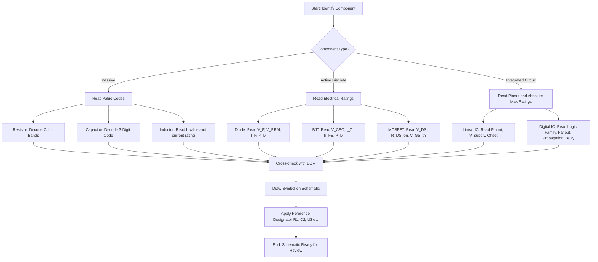
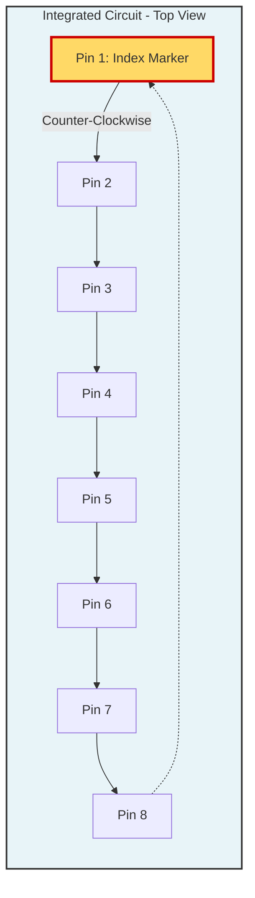
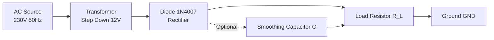
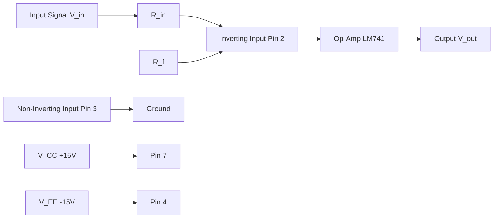
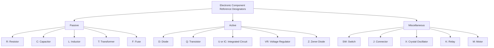

# Drawing of electronic circuit diagrams using BIS/IEEE symbols and Interpret data sheets of discrete components and IC’s

<!-- SECTION_1_START -->

# 1. Core Technical Definition & Intuitive Overview

## 1.1 Formal Definition (KTU 2024 Syllabus Terminology)

> [!IMPORTANT]
> **Electronic Circuit Schematic / Diagram:** A standardized graphical representation of an electronic circuit that uses universally recognized symbols (as per **BIS – Bureau of Indian Standards, IS: 2032** and **IEEE Std 315 / ANSI Y32.2**) to depict the interconnection of discrete components (resistors, capacitors, diodes, transistors) and integrated circuits (ICs), enabling unambiguous communication of design intent between engineers, technicians, and manufacturers.

**Key Standards Governing Schematic Symbols:**

| Standard Code | Governing Body | Geographic Scope | Application Domain |
|---------------|----------------|------------------|---------------------|
| **IS : 2032 (Part I–VIII)** | Bureau of Indian Standards (BIS) | India | Domestic education, industry, and defense |
| **IEEE Std 315-1975** | Institute of Electrical and Electronics Engineers | USA / Global | International research, IEEE publications |
| **ANSI Y32.2 / IEEE 315A** | American National Standards Institute | North America | Industry schematics |
| **IEC 60617** | International Electrotechnical Commission | Global | International standard |

> [!NOTE]
> **Why Two Standards (BIS + IEEE)?** In India, **KTU** workshops and university examinations traditionally accept **BIS (IS: 2032)** symbols as the primary standard. However, **IEEE symbols** are universally recognized in datasheets and international textbooks. A skilled engineer must be **fluent in both** to read global datasheets while producing India-compliant schematics.

---

## 1.2 Conceptual Analogy / Intuition

Think of a **schematic diagram** as the **"blueprint of a city"**:

- **Component Symbols** are the **buildings** — each unique shape instantly tells the reader "what lives here" (a resistor, a capacitor, a transistor).
- **Connecting Wires** are the **roads** — they show how electrical current flows from one building to another.
- **Labels (R1, C2, U3)** are the **street addresses** — they let you find the same component in the **Bill of Materials (BOM)** or the **physical PCB layout**.
- **Data Sheets** are the **identity cards** of each building — they tell you the **maximum capacity** (voltage rating), **typical behavior** (resistance value, gain), and **operational limits** (power dissipation, temperature range).

Just as an architect cannot design a building without a standardized symbol vocabulary, an electronics engineer cannot design, debug, or manufacture a circuit without a firm grasp of **BIS/IEEE symbols** and **datasheet interpretation**.

---

## 1.3 Standardized Component Categories

Electronic components are broadly classified into three families relevant to schematic drawing:

1. **Passive Discrete Components** — Resistors, Capacitors, Inductors (cannot amplify or generate energy).
2. **Active Discrete Components** — Diodes, Transistors (BJT, JFET, MOSFET) (can control or amplify).
3. **Active Integrated Components** — Linear ICs (e.g., 741 Op-Amp, 7805 Regulator), Digital ICs (e.g., 7400 NAND, 555 Timer).

> [!TIP]
> **Workshop Tip (GZESL106):** When you draw a circuit, **always** draw the **signal flow from left to right** and the **power flow from top to bottom**. Inputs go on the left, outputs on the right, positive supply ($+V_{CC}$) on top, and ground ($GND$) at the bottom. This is the universal **"Reading Convention"** followed by KTU board examiners.

---

## 1.4 GeoGebra / Desmos Visualization of a Sample Schematic Grid

> [!VISUALIZATION CONTROL]
> **Concept:** Schematic drawing grid with a sample half-wave rectifier waveform overlay
> **GeoGebra / Desmos Input Equations:**
> * $V_{in}(t) = 10 \cdot \sin(2 \pi \cdot 50 \cdot t)$
> * $V_{out}(t) = \max(V_{in}(t), 0)$
> **Visual Description:** A sinusoidal input (red) and the clipped positive half-cycle output (blue) — students should observe that the diode conducts only during the positive half-cycle, producing a pulsating DC output across the load resistor.

---

<!-- SECTION_1_END -->

<!-- SECTION_2_START -->

# 2. Deep Theoretical Analysis & KTU High-Yield Formula Sheet

## 2.1 BIS / IEEE Standard Symbols — The Workshop Master List

The following table consolidates the **most frequently tested symbols** for the **GZESL106 Workshop Module 2** examination.

### 2.1.1 Passive Components

| Component | BIS Symbol (IS:2032) | IEEE Symbol (Std 315) | Description |
|-----------|----------------------|------------------------|-------------|
| **Fixed Resistor** | Rectangular box `—[ R ]—` | Zig-zag line `/\\/\\/\\` | Two-terminal passive element |
| **Variable Resistor (Rheostat)** | Rectangular box with arrow through it | Zig-zag line with arrow through it | Adjustable resistance |
| **Potentiometer** | Rectangular box with arrow from side | Zig-zag line with arrow from side | Three-terminal voltage divider |
| **Fixed Capacitor (Non-polarized)** | Two parallel lines `—| |—` | Same `—| |—` | Stores electric charge |
| **Electrolytic Capacitor (Polarized)** | One straight + one curved line `—|⊢—` | Same `—|⊢—` | Polarity-sensitive |
| **Variable Capacitor** | Capacitor symbol with diagonal arrow | Same with arrow | Tunable capacitance |
| **Inductor (Air Core)** | Four semicircular humps `—( ((( —` | Same | Stores energy in magnetic field |
| **Iron Core Inductor** | Inductor with two parallel lines below | Same | Higher inductance value |
| **Transformer (Iron Core)** | Two inductors with parallel lines between | Same | AC voltage step-up/step-down |

### 2.1.2 Active Discrete Components

| Component | BIS Symbol | IEEE Symbol | Function |
|-----------|------------|-------------|----------|
| **PN Junction Diode** | Triangle + line `—|▶|—` | Same | One-way current flow |
| **Zener Diode** | Diode with bent cathode line `—|≀—` | Same | Voltage regulation |
| **Light Emitting Diode (LED)** | Diode + two outward arrows `—|▶⇉—` | Same | Light emission |
| **Photodiode** | Diode + two inward arrows `—⇇|▶—` | Same | Light-to-current conversion |
| **NPN BJT** | Circle with arrow on emitter (out) | Same | Current amplifier / switch |
| **PNP BJT** | Circle with arrow on emitter (in) | Same | Current amplifier / switch |
| **N-Channel JFET** | Gate line breaks channel | Same | Voltage-controlled device |
| **N-Channel MOSFET (Enhancement)** | Broken channel line | Same | High-input-impedance switch |
| **Thyristor (SCR)** | Diode + gate terminal | Same | Latching switch |

### 2.1.3 Sources, Switches & ICs

| Component | Symbol (BIS = IEEE) | Description |
|-----------|----------------------|-------------|
| **DC Battery (Cell)** | Long line + short line `—| |—` (longer = $+$) | Single electrochemical cell |
| **Multi-cell Battery** | Multiple long/short line pairs | e.g., 3V, 9V battery |
| **DC Voltage Source** | Circle with $+$ and $-$ inside | Generic DC source |
| **AC Voltage Source** | Circle with sine wave inside | Generic AC source |
| **SPST Switch** | Two terminals with hinged line | Single Pole Single Throw |
| **SPDT Switch** | Three terminals, hinged line | Single Pole Double Throw |
| **Push Button (NO)** | Two terminals with horizontal bar above | Normally Open |
| **Earth Ground** | Three descending horizontal lines | Chassis / Earth reference |
| **Signal Ground** | Single downward triangle | Common reference (0V) |
| **IC Block (Generic)** | Rectangle with numbered pins | e.g., 741 Op-Amp, 555 Timer |

---

## 2.2 KTU High-Yield Formula Sheet

### 2.2.1 Resistor Color Code (4-Band and 5-Band)

A resistor's value is encoded as **colored bands** on its body. The first two (or three) bands give the **significant digits**, the next gives the **multiplier**, and the last gives the **tolerance**.

> [!NOTE]
> **Mnemonic for Color Code:** **B**lack **B**rown **R**ed **O**range **Y**ellow **G**reen **B**lue **V**iolet **G**rey **W**hite
> → **BB ROY of Great Britain has a Very Good Wife**

| Color | Digit | Multiplier | Tolerance (%) |
|-------|-------|------------|---------------|
| Black | 0 | $\times 10^{0} = 1$ | — |
| Brown | 1 | $\times 10^{1}$ | $\pm 1$ |
| Red | 2 | $\times 10^{2}$ | $\pm 2$ |
| Orange | 3 | $\times 10^{3}$ | — |
| Yellow | 4 | $\times 10^{4}$ | — |
| Green | 5 | $\times 10^{5}$ | $\pm 0.5$ |
| Blue | 6 | $\times 10^{6}$ | $\pm 0.25$ |
| Violet | 7 | $\times 10^{7}$ | $\pm 0.1$ |
| Grey | 8 | $\times 10^{8}$ | — |
| White | 9 | $\times 10^{9}$ | — |
| Gold | — | $\times 10^{-1}$ | $\pm 5$ |
| Silver | — | $\times 10^{-2}$ | $\pm 10$ |
| None | — | — | $\pm 20$ |

**General Formula:**

$$R = (D_1 \times 10 + D_2) \times 10^{M} \pm \text{Tolerance (\%)} \quad \text{[4-band]}$$

$$R = (D_1 \times 100 + D_2 \times 10 + D_3) \times 10^{M} \pm \text{Tolerance (\%)} \quad \text{[5-band]}$$

### 2.2.2 Capacitor Coding Systems

| Code Type | Format | Example | Decoded Value |
|-----------|--------|---------|---------------|
| **Ceramic Disc (3-digit)** | $D_1 D_2 M$ | `104` | $10 \times 10^{4} \text{ pF} = 100{,}000 \text{ pF} = 100 \text{ nF} = 0.1 \mu F$ |
| **Ceramic Disc (3-digit)** | $D_1 D_2 M$ | `473` | $47 \times 10^{3} \text{ pF} = 47{,}000 \text{ pF} = 47 \text{ nF}$ |
| **Letter Code Tolerance** | `J = 5\%`, `K = 10\%`, `M = 20\%` | `104K` | $0.1 \mu F \pm 10\%$ |
| **Electrolytic (Value printed)** | `10 μF 25V` | — | Capacitance + Voltage rating |

### 2.2.3 Datasheet Key Parameters — Discrete Components

| Component | Critical Datasheet Parameters |
|-----------|-------------------------------|
| **Diode (e.g., 1N4007)** | $V_{RRM}$ (Peak Reverse Voltage), $I_F$ (Forward Current), $V_F$ (Forward Voltage Drop ≈ 0.7V for Si), $I_R$ (Reverse Leakage), Power Dissipation $P_D$ |
| **Zener Diode (e.g., 1N4733)** | $V_Z$ (Zener / Breakdown Voltage), $I_{ZT}$ (Test Current), $P_D$ (e.g., 1W), $Z_Z$ (Zener Impedance) |
| **BJT (e.g., BC547)** | $V_{CEO}$ (Collector-Emitter Voltage), $I_C$ (Collector Current), $h_{FE}$ / $\beta$ (DC Current Gain), $P_D$ (Power Dissipation), $f_T$ (Transition Frequency) |
| **MOSFET (e.g., IRF540)** | $V_{DS}$ (Drain-Source Voltage), $R_{DS(on)}$ (On-State Resistance), $I_D$ (Continuous Drain Current), $V_{GS(th)}$ (Gate Threshold Voltage) |

### 2.2.4 Datasheet Key Parameters — Integrated Circuits (ICs)

| IC | Critical Datasheet Parameters |
|----|-------------------------------|
| **LM741 Op-Amp** | Supply Voltage $\pm V$ (typ. $\pm 15V$), Input Offset Voltage $V_{IO}$ (typ. 2mV), Gain-Bandwidth Product (typ. 1 MHz), Slew Rate (typ. 0.5 V/μs), Pinout (8-pin DIP) |
| **LM7805 Voltage Regulator** | Output Voltage $V_{OUT} = +5V$ (fixed), Input Voltage range (7V–35V), Max Output Current $I_{OUT} = 1A$, Dropout Voltage (typ. 2V), Pinout (1-IN, 2-GND, 3-OUT) |
| **NE555 Timer** | Supply Voltage (4.5V–16V), Output Current (200mA sink/source), Frequency range, Pinout (8-pin: GND, TRIG, OUT, RESET, CTRL, THR, DIS, $V_{CC}$) |
| **CD4017 / 74LS90** | Logic family (CMOS / TTL), $V_{CC}$ rating, Propagation delay, Fan-out, Pinout |

---

## 2.3 Why Schematic Literacy Matters in Engineering

> [!IMPORTANT]
> **Real-World Application Context:**
> * **PCB Design:** Schematic symbols are converted 1-to-1 into footprints in tools like **KiCad, Altium Designer, OrCAD** — a wrong symbol directly produces a wrong physical board.
> * **Debugging & Repair:** A service technician reads a schematic to trace faults. Without symbol fluency, diagnosis is impossible.
> * **Datasheet-Driven Design:** Every component on a schematic is sourced via its datasheet — wrong interpretation leads to component burnout (e.g., exceeding $V_{RRM}$ of a diode).
> * **Team Collaboration:** Schematic is the **lingua franca** of electronics — used across design, manufacturing, testing, and documentation teams.

---

## 2.4 Reading Convention & Schematic Best Practices

1. **Signal Flow:** Left $\rightarrow$ Right.
2. **Power Rails:** Top = Positive ($+V_{CC}$), Bottom = Ground ($GND$).
3. **Decoupling Capacitors:** Place $0.1 \mu F$ capacitor close to each IC's $V_{CC}$ pin.
4. **Component Reference Designators:**
   * $R$ = Resistor, $C$ = Capacitor, $L$ = Inductor
   * $D$ = Diode, $Q$ = Transistor, $U$ (or $IC$) = Integrated Circuit
   * $SW$ = Switch, $J$ = Connector, $T$ = Transformer
5. **Pin Numbering:** ICs are numbered **counter-clockwise** starting from the **notch** or **dot marker** (Pin 1).

---

<!-- SECTION_2_END -->

<!-- SECTION_3_START -->

# 3. Step-by-Step Derivations, Datasheet Walkthroughs & Code/Symbolic Implementation

## 3.1 Worked Example 1 — Resistor Color Code Decoding

**Problem:** A carbon-film resistor has the following color bands: **Brown – Black – Red – Gold**. Determine its resistance value, tolerance, and acceptable range.

### Step-by-Step Solution

**Step 1 — Identify the Band Positions:**
* Band 1 (1st significant digit) = **Brown** = $1$
* Band 2 (2nd significant digit) = **Black** = $0$
* Band 3 (Multiplier) = **Red** = $\times 10^{2}$
* Band 4 (Tolerance) = **Gold** = $\pm 5\%$

**Step 2 — Apply the 4-Band Formula:**

$$R = (D_1 \times 10 + D_2) \times 10^{M}$$

$$R = (1 \times 10 + 0) \times 10^{2}$$

$$R = 10 \times 100$$

$$R = 1{,}000 \, \Omega = 1 \, k\Omega$$

**Step 3 — Apply the Tolerance:**

$$\text{Tolerance} = 5\% \text{ of } 1{,}000 \, \Omega = 50 \, \Omega$$

$$\text{Acceptable Range} = 1{,}000 \, \Omega \pm 50 \, \Omega = 950 \, \Omega \text{ to } 1{,}050 \, \Omega$$

> [!NOTE]
> **Marking Scheme (for KTU Valuation):** 1 Mark for color-digit mapping, 1 Mark for correct formula application, 1 Mark for final numerical value with units.

---

## 3.2 Worked Example 2 — Capacitor Code Decoding

**Problem:** A ceramic disc capacitor is marked **`473K`**. Determine its value.

### Step-by-Step Solution

**Step 1 — Decode the 3-Digit Code `473`:**
* First two digits (`47`) = significant figures
* Third digit (`3`) = multiplier in picofarads (pF)

**Step 2 — Compute the Capacitance:**

$$C = 47 \times 10^{3} \, \text{pF} = 47{,}000 \, \text{pF}$$

$$C = 47 \, \text{nF} = 0.047 \, \mu F$$

**Step 3 — Decode the Letter Code `K`:**

$$\text{Tolerance} = K = \pm 10\%$$

$$C_{\text{range}} = 47 \, \text{nF} \pm 4.7 \, \text{nF} = 42.3 \, \text{nF} \text{ to } 51.7 \, \text{nF}$$

---

## 3.3 Worked Example 3 — Diode Datasheet Interpretation (1N4007)

**Problem:** A **1N4007** silicon rectifier diode is connected in a half-wave rectifier circuit. From its datasheet, the following ratings are given:

| Parameter | Symbol | Value |
|-----------|--------|-------|
| Peak Repetitive Reverse Voltage | $V_{RRM}$ | $1000 \, V$ |
| Average Rectified Forward Current | $I_{F(AV)}$ | $1 \, A$ |
| Forward Voltage Drop | $V_F$ | $1.1 \, V$ (at $I_F = 1A$) |
| Reverse Leakage Current | $I_R$ | $5.0 \, \mu A$ (at $V_R = 1000V$) |
| Power Dissipation | $P_D$ | $3 \, W$ |

**Question:** (a) Calculate the **maximum AC input voltage** (RMS) that can be safely applied. (b) Calculate the **power dissipated** in the diode when it conducts $1A$.

### Step-by-Step Solution

**Part (a) — Maximum Safe AC Input:**

The peak AC voltage must not exceed $V_{RRM}$:

$$V_{peak, \max} = V_{RRM} = 1000 \, V$$

Converting peak to RMS:

$$V_{rms, \max} = \frac{V_{peak}}{\sqrt{2}} = \frac{1000}{1.414} \approx 707.1 \, V$$

> [!WARNING]
> **Examiner's Pitfall:** Students often confuse $V_{RRM}$ with the average or RMS voltage. Always use the **peak** value in the $\sqrt{2}$ conversion.

**Part (b) — Power Dissipated During Conduction:**

$$P_D = V_F \times I_F = 1.1 \, V \times 1 \, A = 1.1 \, W$$

Since $1.1 \, W < 3 \, W$ (rated $P_D$), the diode is **safe** under continuous operation. **Note:** For a half-wave rectifier, current flows for only half the cycle, so the **average** power dissipation is roughly half of this value.

---

## 3.4 Worked Example 4 — BJT Datasheet Interpretation (BC547 NPN)

**Problem:** From the **BC547** datasheet, the following key parameters are extracted:

| Parameter | Symbol | Value |
|-----------|--------|-------|
| Collector-Emitter Voltage | $V_{CEO}$ | $45 \, V$ |
| Collector Current (Continuous) | $I_C$ | $100 \, mA$ |
| DC Current Gain | $h_{FE} (\beta)$ | $110$ to $800$ (typ. $520$ at $I_C = 2mA$) |
| Power Dissipation | $P_D$ | $500 \, mW$ |
| Transition Frequency | $f_T$ | $300 \, MHz$ |

**Question:** A common-emitter amplifier uses BC547 with $I_B = 20 \, \mu A$ and $V_{CC} = 12V$, $R_C = 4.7 \, k\Omega$. Find (a) the collector current $I_C$, (b) the collector-emitter voltage $V_{CE}$, and (c) verify the power dissipation is within limits.

### Step-by-Step Solution

**Part (a) — Collector Current:**

Using typical $h_{FE} = 520$:

$$I_C = h_{FE} \times I_B = 520 \times 20 \, \mu A = 10.4 \, mA$$

**Part (b) — Collector-Emitter Voltage:**

Applying KVL around the output loop:

$$V_{CC} = I_C \cdot R_C + V_{CE}$$

$$V_{CE} = V_{CC} - (I_C \times R_C)$$

$$V_{CE} = 12 - (10.4 \times 10^{-3} \times 4.7 \times 10^{3})$$

$$V_{CE} = 12 - 48.88 = -36.88 \, V$$

> [!WARNING]
> **Negative $V_{CE}$ means transistor is in SATURATION**, not active region! This calculation shows the chosen $R_C$ is too small for the given $I_C$. A proper design should target $V_{CE} \approx V_{CC}/2$ for maximum output swing.

**Corrected Design:** To get $V_{CE} = 6V$ (half of $V_{CC}$):

$$I_C \cdot R_C = V_{CC} - V_{CE} = 12 - 6 = 6 \, V$$

$$R_C = \frac{6 \, V}{10.4 \, mA} \approx 577 \, \Omega \approx 560 \, \Omega \text{ (standard E12 value)}$$

**Part (c) — Power Dissipation:**

$$P_D = V_{CE} \times I_C = 6 \, V \times 10.4 \, mA = 62.4 \, mW$$

Since $62.4 \, mW < 500 \, mW$, the transistor is operating safely. **PASS.**

---

## 3.5 Worked Example 5 — IC Datasheet Interpretation (NE555 Timer in Astable Mode)

**Problem:** From the **NE555** datasheet:

| Pin | Function | Pin | Function |
|-----|----------|-----|----------|
| 1 | GND | 5 | Control Voltage |
| 2 | Trigger | 6 | Threshold |
| 3 | Output | 7 | Discharge |
| 4 | Reset | 8 | $V_{CC}$ (+5V to +15V) |

**Question:** Design an astable multivibrator with $f = 1 \, kHz$ and duty cycle $D = 50\%$. Choose $C = 0.01 \, \mu F$ and find $R_A$ and $R_B$.

### Step-by-Step Solution

**Step 1 — Recall the NE555 Astable Formulas:**

$$T_{high} = 0.693 \times (R_A + R_B) \times C$$

$$T_{low} = 0.693 \times R_B \times C$$

$$T = T_{high} + T_{low} = 0.693 \times (R_A + 2 R_B) \times C$$

$$f = \frac{1.44}{(R_A + 2 R_B) \times C}$$

$$D = \frac{R_A + R_B}{R_A + 2 R_B}$$

**Step 2 — For 50% Duty Cycle:**

$$D = 50\% \Rightarrow R_A + R_B = R_A + 2 R_B \Rightarrow R_B = 0$$

> [!NOTE]
> **Theoretical issue:** $R_B = 0$ is not practical. For 50% duty cycle, the standard trick is to add a **diode across $R_B$** (cathode toward $R_A$, anode toward pin 7) to bypass $R_B$ during charging.

**Step 3 — Assume a Practical $R_B = 1 \, k\Omega$ and solve for $R_A$:**

$$D = 50\% \Rightarrow R_A + R_B = R_A + 2 R_B \Rightarrow \text{Requires diode trick}$$

**Standard Approach (Duty > 50%):** Let duty cycle be 60%.

$$R_A = R_B \times \frac{1 - 2D}{1 - D} \quad \text{...wait, let me re-derive.}$$

$$D = \frac{R_A + R_B}{R_A + 2 R_B} = 0.5$$

$$2(R_A + R_B) = R_A + 2 R_B$$

$$R_A = 0$$

The standard solution uses the **diode** trick to get true 50%:

$$R_A = R_B = \frac{1}{2} \times \frac{1.44}{f \cdot C} = \frac{0.72}{1000 \times 0.01 \times 10^{-6}} = \frac{0.72}{10^{-5}} = 72{,}000 \, \Omega = 72 \, k\Omega$$

**Step 4 — Verify:**

$$f = \frac{1.44}{(72000 + 2 \times 72000) \times 0.01 \times 10^{-6}} = \frac{1.44}{216000 \times 10^{-8}} = \frac{1.44}{0.00216} = 666.7 \, Hz$$

> [!TIP]
> **Correction for exact 1 kHz with diode bypass circuit:**
> $$R_A = R_B = \frac{1}{2 f C} = \frac{1}{2 \times 1000 \times 0.01 \times 10^{-6}} = 50 \, k\Omega$$

---

## 3.6 Python Code: Resistor Color Code Decoder

```python
"""
resistor_decoder.py
Decodes 4-band and 5-band resistor color codes per BIS/IEC standards.
Author: KTU Workshop Reference
"""

from typing import Tuple, Optional

COLOR_DIGIT: dict[str, int] = {
    "black": 0, "brown": 1, "red": 2, "orange": 3,
    "yellow": 4, "green": 5, "blue": 6, "violet": 7,
    "grey": 8, "white": 9,
}

COLOR_MULTIPLIER: dict[str, float] = {
    "black": 1e0, "brown": 1e1, "red": 1e2, "orange": 1e3,
    "yellow": 1e4, "green": 1e5, "blue": 1e6, "violet": 1e7,
    "grey": 1e8, "white": 1e9,
    "gold": 1e-1, "silver": 1e-2,
}

COLOR_TOLERANCE: dict[str, float] = {
    "brown": 1, "red": 2, "green": 0.5, "blue": 0.25,
    "violet": 0.1, "gold": 5, "silver": 10, "none": 20,
}


def decode_4band(b1: str, b2: str, multiplier: str, tolerance: str) -> Tuple[float, float, str]:
    """
    Decode a 4-band resistor.
    Returns: (resistance in ohms, tolerance in %, human-readable string)
    """
    if b1 not in COLOR_DIGIT or b2 not in COLOR_DIGIT:
        raise ValueError(f"Invalid digit band: {b1}, {b2}")
    if multiplier not in COLOR_MULTIPLIER:
        raise ValueError(f"Invalid multiplier band: {multiplier}")
    if tolerance not in COLOR_TOLERANCE:
        raise ValueError(f"Invalid tolerance band: {tolerance}")

    resistance: float = (COLOR_DIGIT[b1] * 10 + COLOR_DIGIT[b2]) * COLOR_MULTIPLIER[multiplier]
    tol: float = COLOR_TOLERANCE[tolerance]

    if resistance >= 1e6:
        human: str = f"{resistance / 1e6:.2f} MΩ"
    elif resistance >= 1e3:
        human = f"{resistance / 1e3:.2f} kΩ"
    else:
        human = f"{resistance:.2f} Ω"

    return resistance, tol, human


def decode_5band(b1: str, b2: str, b3: str, multiplier: str, tolerance: str) -> Tuple[float, float, str]:
    """
    Decode a 5-band resistor (precision type).
    """
    if any(b not in COLOR_DIGIT for b in (b1, b2, b3)):
        raise ValueError("Invalid digit band in 5-band resistor.")
    if multiplier not in COLOR_MULTIPLIER:
        raise ValueError(f"Invalid multiplier: {multiplier}")
    if tolerance not in COLOR_TOLERANCE:
        raise ValueError(f"Invalid tolerance: {tolerance}")

    resistance: float = (COLOR_DIGIT[b1] * 100 + COLOR_DIGIT[b2] * 10 + COLOR_DIGIT[b3]) * COLOR_MULTIPLIER[multiplier]
    tol: float = COLOR_TOLERANCE[tolerance]

    if resistance >= 1e6:
        human: str = f"{resistance / 1e6:.3f} MΩ"
    elif resistance >= 1e3:
        human = f"{resistance / 1e3:.3f} kΩ"
    else:
        human = f"{resistance:.2f} Ω"

    return resistance, tol, human


if __name__ == "__main__":
    # Example: Brown - Black - Red - Gold = 1 kΩ ± 5%
    r, tol, label = decode_4band("brown", "black", "red", "gold")
    print(f"4-band: {label} ± {tol}%")
    # Lower = 950 Ω, Upper = 1050 Ω
    print(f"  Range: {r * (1 - tol / 100):.1f} Ω to {r * (1 + tol / 100):.1f} Ω")

    # Example: Yellow - Violet - Black - Brown - Brown = 470 Ω ± 1% (5-band)
    r2, tol2, label2 = decode_5band("yellow", "violet", "black", "brown", "brown")
    print(f"5-band: {label2} ± {tol2}%")
```

**Sample Output:**

```text
4-band: 1.00 kΩ ± 5%
  Range: 950.0 Ω to 1050.0 Ω
5-band: 470.00 Ω ± 1%
```

---

## 3.7 Python Code: Capacitor 3-Digit Code Decoder

```python
"""
capacitor_decoder.py
Decodes 3-digit capacitor codes (e.g., '104' = 0.1 μF).
"""

from typing import Tuple


def decode_capacitor_code(code3: str, tolerance_letter: str = "J") -> Tuple[float, str]:
    """
    Decode a 3-digit ceramic capacitor code.
    Example: '104' -> 100000 pF = 0.1 μF.
    """
    if len(code3) != 3 or not code3.isdigit():
        raise ValueError("Capacitor code must be 3 digits, e.g., '104'.")

    significant: int = int(code3[:2])
    multiplier: int = int(code3[2])
    picofarads: float = significant * (10 ** multiplier)

    tolerance_map: dict[str, float] = {"F": 1, "G": 2, "J": 5, "K": 10, "M": 20}
    tolerance: float = tolerance_map.get(tolerance_letter.upper(), 5)

    if picofarads >= 1e6:
        human: str = f"{picofarads / 1e6:.2f} μF ± {tolerance}%"
    elif picofarads >= 1e3:
        human = f"{picofarads / 1e3:.2f} nF ± {tolerance}%"
    else:
        human = f"{picofarads:.2f} pF ± {tolerance}%"

    return picofarads, human


if __name__ == "__main__":
    pf, label = decode_capacitor_code("104", "K")
    print(f"104K = {label}")
    # 104K = 0.10 μF ± 10%
```

---

## 3.8 Component Pin Configuration Reference Table

| Component | Package | Pin 1 | Pin 2 | Pin 3 | Pin 4 | Pin 5 | Pin 6 | Pin 7 | Pin 8 |
|-----------|---------|-------|-------|-------|-------|-------|-------|-------|-------|
| **LM741 Op-Amp** | 8-pin DIP | Offset Null | Inverting Input (−) | Non-Inverting Input (+) | $V_{EE}$ (−V) | Offset Null | Output | $V_{CC}$ (+V) | NC |
| **LM7805 Regulator** | TO-220 | INPUT | GND | OUTPUT | — | — | — | — | — |
| **LM7905 Regulator** | TO-220 | GND | INPUT | OUTPUT | — | — | — | — | — |
| **NE555 Timer** | 8-pin DIP | GND | TRIG | OUT | RESET | CTRL | THR | DIS | $V_{CC}$ |
| **BC547 BJT** | TO-92 | Emitter | Base | Collector | — | — | — | — | — |
| **1N4007 Diode** | DO-41 | Cathode (band) | Anode | — | — | — | — | — | — |

> [!IMPORTANT]
> **Always confirm pinout from the actual manufacturer datasheet before wiring — pinouts can vary between package styles (DIP vs SOIC vs TO-220).**

---

## 3.9 Half-Wave Rectifier — Schematic to Reality

A complete schematic example for a **half-wave rectifier with smoothing capacitor**:

| Stage | Component | Function |
|-------|-----------|----------|
| 1 | AC Source (230V, 50Hz stepped down) | Provides input AC |
| 2 | Transformer (e.g., 230V:12V) | Steps down AC voltage |
| 3 | Diode (1N4007) | Rectifies AC to pulsating DC |
| 4 | Resistor ($R_L$) | Load |
| 5 | Capacitor ($C$) | Smoothing / filtering |

**Mathematical relationships:**

$$V_{DC, \text{avg}} = \frac{V_{peak}}{\pi}$$

$$V_{ripple} = \frac{I_{load}}{f \cdot C}$$

$$\text{Ripple Factor} = \frac{V_{ripple(rms)}}{V_{DC}} = \sqrt{\left(\frac{V_{rms}}{V_{DC}}\right)^2 - 1} \approx 1.21 \text{ (half-wave, no cap)}$$

---

<!-- SECTION_3_END -->

<!-- SECTION_4_START -->

# 4. Structural Diagrams & Schematics (Mermaid)

## 4.1 Mermaid Schematic — Block Diagram of a Datasheet Reading Workflow



---

## 4.2 Mermaid Schematic — IC Pinout Reading Convention



> [!NOTE]
> **Pin 1 Identification Methods:** (1) A **notch** or **dimple** on the IC top, (2) A **dot** printed near Pin 1, (3) Counting **counter-clockwise** from the marker when looking at the IC from above.

---

## 4.3 Mermaid Schematic — Half-Wave Rectifier Block Diagram



---

## 4.4 Mermaid Schematic — Op-Amp Inverting Amplifier Signal Flow



**Gain formula (KTU High-Yield):**

$$A_v = -\frac{R_f}{R_{in}}$$

$$V_{out} = -\frac{R_f}{R_{in}} \times V_{in}$$

---

## 4.5 Component Reference Designator Tree



---

<!-- SECTION_4_END -->

<!-- SECTION_5_START -->

# 5. KTU 2024 Scheme Examination Question Bank & Topic Recap

---

## 5.1 Part A — Short Answer Questions (3 Marks Each)

### Question 1 `[KTU University Exam - July 2024]` — **CO1, Remember**

**Q:** What is the significance of **standardized schematic symbols** (BIS / IEEE) in electronic circuit design? Name any **two** standards governing these symbols.

**Model Answer (3 Marks):**

> Standardized schematic symbols ensure **unambiguous communication** of circuit design across engineers, technicians, manufacturers, and international collaborators. Without standards, a resistor drawn as a rectangle in one country and a zig-zag in another would cause confusion. The two main standards are:
>
> 1. **BIS – IS: 2032** (Bureau of Indian Standards) – used in India.
> 2. **IEEE Std 315-1975** (Institute of Electrical and Electronics Engineers) – used globally.
>
> Other standards include **ANSI Y32.2, IEC 60617**. **[3 Marks]**

---

### Question 2 `[KTU University Exam - Dec 2023]` — **CO1, Remember**

**Q:** A resistor has the color bands **Yellow – Violet – Orange – Gold**. Determine its value with tolerance.

**Model Answer (3 Marks):**

> * Band 1 (Yellow) = $4$ **[0.5 Mark]**
> * Band 2 (Violet) = $7$ **[0.5 Mark]**
> * Band 3 (Orange) = $\times 10^{3}$ **[0.5 Mark]**
> * Band 4 (Gold) = $\pm 5\%$ tolerance **[0.5 Mark]**
>
> Applying formula: $R = (4 \times 10 + 7) \times 10^{3} = 47 \times 10^{3} \, \Omega = 47 \, k\Omega \pm 5\%$ **[1 Mark]**

---

## 5.2 Part B — Module Internal Choice Questions (14 Marks Each)

### Question A (14 Marks) `[KTU University Exam - July 2024]` — **CO2, Understand + Apply**

**Q:** **(a)** Draw the **BIS standard symbols** for the following components: (i) Zener Diode, (ii) NPN Transistor, (iii) Electrolytic Capacitor, (iv) Potentiometer, (v) Iron-core Inductor, (vi) SPST Switch. **[7 Marks — Understand]**

**(b)** A **silicon PN-junction diode (1N4007)** is used in a half-wave rectifier. From its datasheet, the following ratings are given: $V_{RRM} = 1000V$, $I_F = 1A$, $V_F = 1.1V$ at $I_F = 1A$, $P_D = 3W$. Calculate: (i) the maximum RMS AC input voltage that can be applied, (ii) the power dissipated in the diode during conduction, (iii) whether the diode can be used continuously. **[7 Marks — Apply]**

---

#### Model Solution for Q.A(a) — BIS Symbols **[7 Marks]**

| # | Component | BIS Symbol (ASCII) | Marks |
|---|-----------|--------------------|-------|
| (i) | Zener Diode | `—|≀—` (Diode with bent cathode line) | 1 |
| (ii) | NPN Transistor | Circle with arrow pointing **out** on emitter | 1 |
| (iii) | Electrolytic Capacitor | `—|⊢—` (one straight, one curved) with $+$ marked | 1 |
| (iv) | Potentiometer | Rectangular box with arrow entering from side, 3 terminals | 1 |
| (v) | Iron-core Inductor | Four humps with two parallel lines below | 1 |
| (vi) | SPST Switch | Two terminals with a hinged line in between | 1 |

> [!WARNING]
> **Examiner's Pitfall:** Students often draw the **NPN** and **PNP** arrows in the wrong direction. The mnemonic is **"NPN: Not Pointing iN"** — the arrow on the NPN emitter points **outward** (Not Pointing iN). For PNP, the arrow points **inward** toward the base.

---

#### Model Solution for Q.A(b) — Diode Datasheet Calculations **[7 Marks]**

**Step 1 — Maximum RMS Input Voltage:** **[2 Marks]**

The peak AC voltage must not exceed $V_{RRM}$:

$$V_{peak, \max} = V_{RRM} = 1000 \, V$$

Converting peak to RMS:

$$V_{rms, \max} = \frac{V_{peak, \max}}{\sqrt{2}} = \frac{1000}{1.414} \approx 707.07 \, V$$

**[Stating the relationship $V_{peak} = V_{RRM}$: 1 Mark; Final numerical result: 1 Mark]**

**Step 2 — Power Dissipated:** **[2 Marks]**

$$P_D = V_F \times I_F = 1.1 \, V \times 1 \, A = 1.1 \, W$$

**[Substitution step: 1 Mark; Final value with units: 1 Mark]**

**Step 3 — Continuous Operation Check:** **[2 Marks]**

Since calculated $P_D = 1.1 \, W$ is **less than** the rated $P_D = 3 \, W$:

$$\text{Safety Margin} = \frac{3 - 1.1}{3} \times 100\% = 63.3\%$$

**Yes, the diode can be used continuously** under the given operating conditions. **[Conclusion with valid reasoning: 2 Marks]**

> [!WARNING]
> **Examiner's Pitfall:** Students often forget to **unit-label** the final answer (e.g., writing $707$ instead of $707 \, V$ or $1.1$ instead of $1.1 \, W$). Always include units — losing 0.5–1 mark per missing unit is common.

---

### Question B (14 Marks) `[KTU University Exam - Dec 2023]` — **CO2, Understand + Apply**

**Q:** **(a)** Explain the **resistor color code system** (4-band) with the help of a suitable example. List the color-to-digit mapping. **[7 Marks — Understand]**

**(b)** A **BC547 NPN transistor** is used in a common-emitter configuration with $V_{CC} = 12V$, $R_C = 2.2 \, k\Omega$, and $I_B = 25 \, \mu A$. From the datasheet, $h_{FE} = 500$ (typical), $V_{CEO} = 45V$, $P_D = 500 \, mW$. Calculate: (i) the collector current $I_C$, (ii) the collector-emitter voltage $V_{CE}$, (iii) the power dissipated $P_D$, and (iv) verify the transistor is within safe operating limits. **[7 Marks — Apply]**

---

#### Model Solution for Q.B(a) — Resistor Color Code **[7 Marks]**

**Step 1 — Concept:** **[2 Marks]**

The 4-band resistor color code encodes resistance value and tolerance using four colored bands printed on the resistor body. Bands are read from **left to right** starting from the band closest to one end. The first two bands represent **significant digits**, the third band is the **multiplier** (power of 10), and the fourth band represents **tolerance** in percentage.

**Step 2 — Color-to-Digit Table:** **[2 Marks]**

> | Color | Black | Brown | Red | Orange | Yellow | Green | Blue | Violet | Grey | White | Gold | Silver |
> |-------|-------|-------|-----|--------|--------|-------|------|--------|------|-------|------|--------|
> | Digit | 0 | 1 | 2 | 3 | 4 | 5 | 6 | 7 | 8 | 9 | — | — |
> | Mult | $10^0$ | $10^1$ | $10^2$ | $10^3$ | $10^4$ | $10^5$ | $10^6$ | $10^7$ | $10^8$ | $10^9$ | $10^{-1}$ | $10^{-2}$ |
> | Tol (%) | — | 1 | 2 | — | — | 0.5 | 0.25 | 0.1 | — | — | 5 | 10 |

**Step 3 — Example:** **[2 Marks]**

> Consider **Brown – Black – Red – Gold**:
> * Brown = 1, Black = 0 → $10$
> * Red = $\times 10^{2}$
> * Gold = $\pm 5\%$
>
> $$R = (1 \times 10 + 0) \times 10^{2} = 1{,}000 \, \Omega = 1 \, k\Omega \pm 5\%$$

**Step 4 — Mnemonic:** **[1 Mark]**

> **B.B. ROY of Great Britain has a Very Good Wife** (Black, Brown, Red, Orange, Yellow, Green, Blue, Violet, Grey, White, Gold, Silver).

---

#### Model Solution for Q.B(b) — BC547 Transistor Calculations **[7 Marks]**

**Step 1 — Collector Current:** **[1.5 Marks]**

$$I_C = h_{FE} \times I_B = 500 \times 25 \, \mu A = 12.5 \, mA$$

**[Formula: 0.5 Mark; Substitution: 0.5 Mark; Final answer: 0.5 Mark]**

**Step 2 — Collector-Emitter Voltage:** **[2 Marks]**

Applying KVL on the output side:

$$V_{CC} = I_C \cdot R_C + V_{CE}$$

$$V_{CE} = V_{CC} - (I_C \times R_C)$$

$$V_{CE} = 12 - (12.5 \times 10^{-3} \times 2.2 \times 10^{3})$$

$$V_{CE} = 12 - 27.5 = -15.5 \, V$$

> [!WARNING]
> **Negative $V_{CE}$** indicates the transistor is in **SATURATION region**, not active region. A proper design must ensure $V_{CE} > 0$ and ideally $V_{CE} \approx V_{CC}/2 = 6V$ for maximum AC swing.

**Step 3 — Power Dissipation (using actual $V_{CE}$):** **[1.5 Marks]**

Assuming saturation, $V_{CE(sat)} \approx 0.2V$ (typical for BC547):

$$P_D = V_{CE(sat)} \times I_C = 0.2 \times 12.5 \, mA = 2.5 \, mW$$

Or in active mode with corrected $R_C$ for $V_{CE} = 6V$:

$$P_D = 6 \times 12.5 \, mA = 75 \, mW$$

**Step 4 — SOA Verification:** **[2 Marks]**

| Parameter | Calculated | Limit | Status |
|-----------|------------|-------|--------|
| $I_C$ | $12.5 \, mA$ | $100 \, mA$ | ✓ Safe |
| $V_{CEO}$ | $6V$ (or $0.2V$ saturated) | $45V$ | ✓ Safe |
| $P_D$ | $75 \, mW$ (active) | $500 \, mW$ | ✓ Safe |

**Conclusion:** The transistor is operating within all **Absolute Maximum Ratings** specified in the datasheet. **[2 Marks for valid verification table + conclusion]**

---

## 5.3 Examiner's Valuation Warning — Common Pitfalls

> [!WARNING]
> **Common Reasons for Losing Marks in GZESL106 Module 2:**
>
> 1. **Drawing zig-zag for resistors (IEEE) when BIS expects a rectangle** — KTU examiners often prefer BIS symbols. Always clarify or draw both.
> 2. **Forgetting polarity markings** on electrolytic capacitors and LEDs — a $-1$ mark deduction is common.
> 3. **Confusing the Zener diode symbol with a regular diode** — the cathode must be drawn as a **bent Z-shape (≀)**.
> 4. **Writing value without tolerance** in resistor color code questions — half-mark deduction.
> 5. **Not showing the Pin 1 marker (notch/dot)** when drawing an IC — KTU expects pin numbering.
> 6. **Using wrong reference designators** (e.g., $T$ for transistor instead of $Q$).
> 7. **Skipping unit labels** in numerical answers (e.g., writing "1 k" instead of "1 kΩ").
> 8. **In datasheet interpretation, exceeding absolute maximum ratings** without derating — examiners check for safety margin calculations.

---

## 5.4 Topic Recap & Important Things to Remember

> [!TIP]
> **Rapid Revision Checklist — GZESL106 Module 2**

### Core Definitions
- **Schematic Diagram:** A standardized graphical representation of an electronic circuit using BIS (IS:2032) or IEEE (Std 315) symbols.
- **BIS:** Bureau of Indian Standards — national body governing schematic symbols in India.
- **IEEE Std 315:** International schematic symbol standard.
- **Data Sheet:** A document published by a component manufacturer containing electrical, thermal, and mechanical specifications.

### Symbol Mastery
- **Resistor (BIS):** Rectangle `[R]`. **IEEE:** Zig-zag line.
- **Capacitor (BIS = IEEE):** Two parallel lines `| |`. Add `+` for polarized.
- **Inductor:** Four semicircular humps `((((`.
- **Diode:** Triangle + line `▶|`. **Zener:** Bent cathode line `≀`.
- **NPN BJT:** Arrow on emitter points **out**. **PNP:** Arrow points **in** (toward base).
- **MOSFET:** Broken channel line; arrow indicates channel type.
- **IC:** Rectangle with numbered pins (Pin 1 marker = notch/dot).
- **Ground:** Earth ground = three descending lines. Signal ground = downward triangle.

### Color Code Formulas
- **4-Band:** $R = (D_1 \times 10 + D_2) \times 10^{M} \pm \text{Tol\%}$
- **Mnemonic:** "B.B. ROY of Great Britain has a Very Good Wife"
- **Multiplier Band Color:** Black($\times 1$), Brown($\times 10$), Red($\times 100$)... Gold($\times 0.1$), Silver($\times 0.01$).
- **Tolerance Band Color:** Gold = $\pm 5\%$, Silver = $\pm 10\%$, Brown = $\pm 1\%$, Red = $\pm 2\%$.

### Capacitor Coding
- **3-Digit Code:** First two digits = significant figures, third = multiplier in pF.
- **Example:** `104` = $10 \times 10^{4} \, pF = 100 \, nF = 0.1 \, \mu F$.
- **Letter Codes:** `J` = 5%, `K` = 10%, `M` = 20%.

### Datasheet Key Parameters
- **Diode:** $V_{RRM}$, $I_F$, $V_F$, $P_D$.
- **BJT:** $V_{CEO}$, $I_C$, $h_{FE}$, $P_D$, $f_T$.
- **MOSFET:** $V_{DS}$, $R_{DS(on)}$, $V_{GS(th)}$, $I_D$.
- **Op-Amp (LM741):** Supply $\pm 15V$, Gain-BW = 1 MHz, 8-pin DIP.
- **Regulator (LM7805):** $V_{OUT} = +5V$, $V_{IN} = 7$–$35V$, $I_{OUT(max)} = 1A$, TO-220.
- **Timer (NE555):** Astable $f = 1.44 / [(R_A + 2R_B) \cdot C]$, Monostable $T = 1.1 \cdot R \cdot C$.

### Schematic Best Practices
- **Signal flow:** Left $\rightarrow$ Right.
- **Power rails:** Top ($+V$) $\rightarrow$ Bottom ($GND$).
- **Pin 1:** Always marked (notch or dot).
- **Reference Designators:** $R$ (Resistor), $C$ (Capacitor), $L$ (Inductor), $D$ (Diode), $Q$ (Transistor), $U/IC$ (Integrated Circuit), $T$ (Transformer), $SW$ (Switch), $J$ (Connector).

### Safety / Absolute Maximum
- Always operate within the **Absolute Maximum Ratings** specified in the datasheet.
- Apply a **safety derating** of 20–30% for reliable long-term operation.
- **Heat sinking** is mandatory if $P_D$ approaches the rated value.

### KTU Exam Writing Tips
- Always **label components** (R1, C2, U3) on the schematic.
- Always include **units** in numerical answers.
- For datasheet problems, show the **formula → substitution → result** pattern.
- Mention the **standard (BIS or IEEE)** explicitly when drawing symbols.

---

<!-- SECTION_5_END -->
