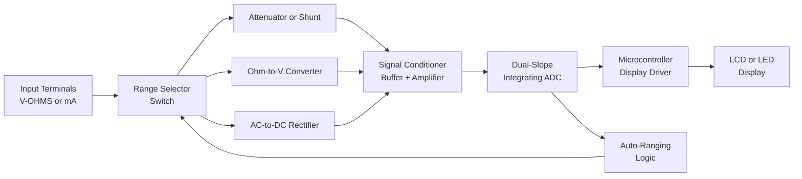
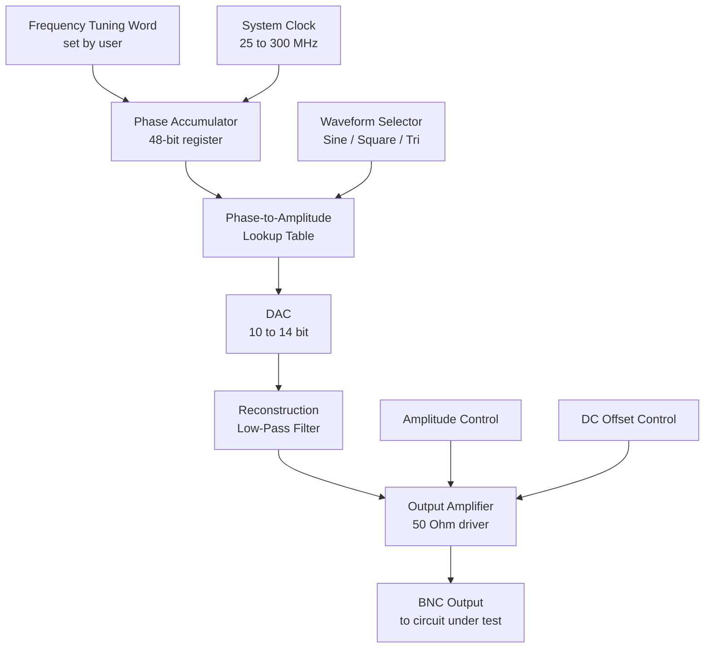
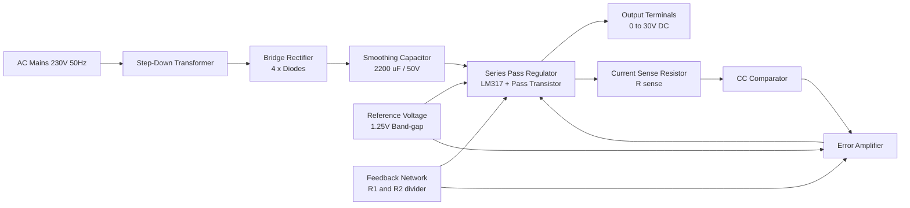
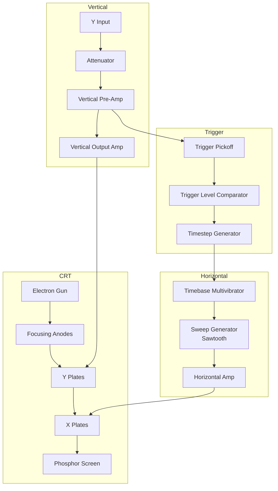
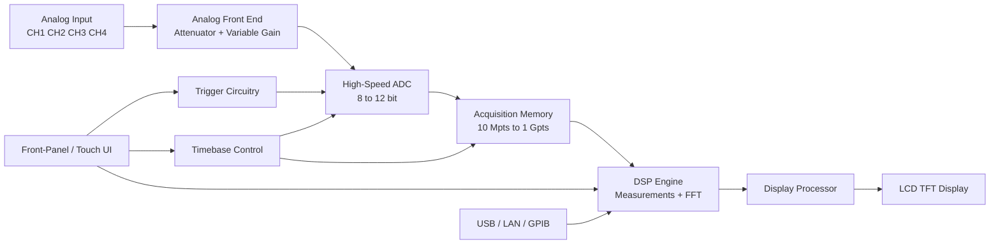
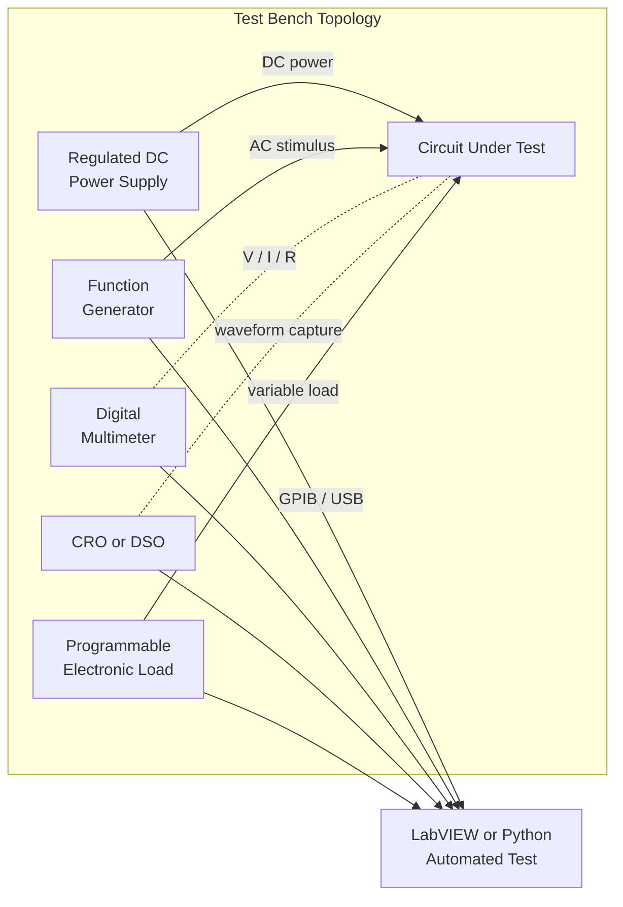

# Familiarization/Application of testing instruments and commonly used tools. - Multimeter, Function generator, Power supply, CRO, DSO.

<!-- SECTION_1_START -->

# BASIC ELECTRICAL AND ELECTRONICS ENGINEERING WORKSHOP
## Module 3 — Familiarization & Application of Testing Instruments

> [!IMPORTANT]
> **KTU 2024 Scheme Context (GZESL106)**
> This module is a **practical workshop module**. Marks are awarded in the **Lab Continuous Evaluation (LCE)** and the **End Semester Evaluation (ESE)** viva. You are expected to *physically identify*, *connect*, and *operate* every instrument listed below. Memorizing front-panel layouts and the underlying measurement principles is the single most important scoring strategy.

---

## 1. Core Technical Definition & Intuitive Overview

### 1.1 The Multimeter (Analog & Digital)

**Formal Definition (KTU Syllabus Terminology):**
A **multimeter** is a multi-range, multi-function electronic measuring instrument used to measure at least three basic electrical quantities — **Voltage (V)**, **Current (I)**, and **Resistance (R)** — hence the abbreviation **V-I-R meter** or **AVO meter** (Amps, Volts, Ohms). Modern *Digital Multimeters (DMMs)* additionally measure **frequency, capacitance, continuity, diode forward voltage, and temperature**.

**Conceptual Analogy:**
Think of a multimeter as the **"stethoscope of an electronics engineer"**. Just as a doctor uses one instrument to check pulse, temperature, and blood pressure, an engineer uses a multimeter to check the "vital signs" (V, I, R) of any circuit — alive (powered) or dead (de-energized).

> [!NOTE]
> **Standard Bench-Top Ratings (Bold Constants)**
> * Input impedance (DMM): **10 MΩ** (loading effect negligible)
> * Common resolutions: **3½ digit (1999 counts)** to **6½ digit (1,999,999 counts)**
> * True-RMS bandwidth: up to **100 kHz** in bench DMMs
> * Safety category: **CAT II 600 V**, **CAT III 1000 V**

---

### 1.2 The Function Generator

**Formal Definition:**
A **function generator** is a signal source that produces **repetitive waveforms** of adjustable **frequency, amplitude, and DC offset**. Standard waveforms include **sine, square, triangular, ramp, TTL, and pulse** outputs. Frequency range typically spans **0.1 Hz to 20 MHz** in laboratory units.

**Conceptual Analogy:**
Imagine a **musical instrument that plays only pure electronic tones** — the *function generator* is the equivalent in an electronics lab. By turning the "frequency knob," you change the *pitch* of the electrical signal; by turning the "amplitude knob," you change its *loudness*; by selecting the waveform button, you change the *timbre* (sine, square, triangle).

> [!NOTE]
> **Key Front-Panel Parameters (Bold Constants)**
> * Output impedance: **50 Ω** (industry standard, must be matched for high-frequency work)
> * Amplitude range: **10 mVpp to 20 Vpp** (open circuit)
> * Frequency accuracy: typically **±1 %** of full scale
> * THD (Total Harmonic Distortion) of sine: **< 0.1 %** at 1 kHz

---

### 1.3 The DC Regulated Power Supply

**Formal Definition:**
A **DC regulated power supply (RPS)** converts the **AC mains (230 V, 50 Hz)** into a **stable, low-ripple DC voltage** with adjustable magnitude and current limiting. It typically provides **0 – 30 V** at **0 – 2 A or 0 – 5 A** in dual or triple output configurations.

**Conceptual Analogy:**
A power supply is the **"controlled water tap"** of an electronics lab. The mains supply is a *gushing, fluctuating river*; the regulated DC supply is a *steady, clean stream* whose *flow rate* (current) and *pressure* (voltage) you can precisely dial in, with a *safety valve* (current limit) that prevents the hose from bursting.

> [!NOTE]
> **Critical Specifications (Bold Constants)**
> * Line regulation: **±0.01 %** for ±10 % mains variation
> * Load regulation: **±0.05 %** from no-load to full-load
> * Ripple and noise: **< 1 mV RMS** (well-regulated supplies)
> * Overload protection: **Constant Current (CC) mode** kicks in beyond set $I_{max}$

---

### 1.4 The Cathode Ray Oscilloscope (CRO)

**Formal Definition:**
A **CRO** is an analog electronic test instrument that graphically displays **time-varying voltage signals** on a phosphor-coated screen using a focused **electron beam** deflected by electric (or magnetic) fields. It is the foundational instrument for observing **waveform shape, amplitude, period, frequency, and phase**.

**Conceptual Analogy:**
A CRO is an **"X-ray movie camera for electricity"** — it makes invisible voltage vs. time graphs visible to the human eye. The horizontal axis is *time* (swept by the timebase), the vertical axis is *voltage* (deflected by the input signal), and the screen is the *cinema screen*.

> [!NOTE]
> **Key Operating Parameters (Bold Constants)**
> * Bandwidth: typically **DC to 20 MHz** (analog CRO)
> * Deflection sensitivity: **5 mV/div to 20 V/div**
> * Time base: **0.1 µs/div to 0.5 s/div**
> * Input impedance: **1 MΩ ∥ 20 – 30 pF**

---

### 1.5 The Digital Storage Oscilloscope (DSO)

**Formal Definition:**
A **DSO** is a digital oscilloscope that **samples** the input signal with a high-speed **Analog-to-Digital Converter (ADC)**, stores the digitized waveform in memory, and reconstructs it on an **LCD/LED display**. It enables **single-shot capture, persistent display, automatic measurements, FFT, and data export (USB/Ethernet)**.

**Conceptual Analogy:**
If a CRO is a *movie camera* that records on *film*, a DSO is a *digital camcorder* that records on a *memory card*. You can pause, rewind, zoom, screenshot, and email the recording — capabilities impossible with the analog CRO.

> [!NOTE]
> **Key DSO Specifications (Bold Constants)**
> * Sample rate: **1 GSa/s to 100 GSa/s** (real-time)
> * Bandwidth: **50 MHz to > 4 GHz**
> * Record length: **10 Mpts to 1 Gpts**
> * Vertical resolution: **8-bit standard, 12-bit in high-resolution mode**

---

> [!VISUALIZATION CONTROL]
> **Concept:** Sine Wave on CRO / DSO Screen with Time-Div and Volt-Div Markers
> **GeoGebra / Desmos Input Equations:**
> * `v(t) = 2 * sin(2 * pi * 1000 * t)` (a 1 kHz, 2 Vpp sine wave)
> * `t: 0 to 0.005` (5 ms window showing 5 complete cycles)
> **Visual Description:** Student should see 5 full sine cycles in 5 horizontal divisions, each cycle spanning **1 ms (1 div)** → confirms **Time/div = 0.5 ms/div** and **Period $T = 1$ ms → $f = 1$ kHz**. Vertical span should be 4 divisions peak-to-peak → confirms **V/div = 0.5 V/div** and **$V_{pp} = 2$ V**.

---

<!-- SECTION_1_END -->

<!-- SECTION_2_START -->

# 2. Deep Theoretical Analysis & KTU High-Yield Formula Sheet

## 2.1 Multimeter — Operational Principle

* **DMM Core:** A dual-slope integrating **ADC** converts the conditioned input (from the V/I/Ω-to-voltage transducer) into a digital count.
* **Voltage Mode:** Input is attenuated/amplified then digitized. Because the ADC is high-impedance, the meter appears as a **10 MΩ** resistor in parallel — virtually no circuit loading.
* **Current Mode:** The meter becomes a **shunt resistor** in series with the load. Current is measured as the *voltage drop* across an **internal precision shunt** (e.g., 0.01 Ω for the 10 A range).
* **Resistance Mode:** The meter injects a small known **test current** (typically **~1 mA**) through the unknown resistor and measures the resulting voltage drop using **Ohm's Law**: $R = V/I$.

**Why "True-RMS" Matters:**
For non-sinusoidal signals, the average-responding meter under-reads by the **crest factor** of the waveform. **True-RMS** DMMs compute the **root-mean-square value** directly, making them accurate for square waves, triangular waves, and distorted AC.

---

## 2.2 Function Generator — Waveform Synthesis

The **Direct Digital Synthesis (DDS)** architecture (used in modern generators):

1. A **Phase Accumulator** adds a tunable **frequency tuning word** at every clock tick.
2. The accumulated phase is converted to an amplitude via a **lookup table** (sine LUT).
3. The **DAC** reconstructs the analog waveform.
4. A **reconstruction filter** removes DAC step images.

Output frequency:
$$f_{out} = \frac{F_{tune\_word} \cdot f_{clock}}{2^N}$$

where $N$ = phase accumulator bit-width (typically **48 bits** in modern DDS).

> [!IMPORTANT]
> **The 50 Ω Output Impedance Rule:** When a function generator is connected to a high-impedance load (e.g., an oscilloscope input of 1 MΩ), the **terminated voltage is exactly half** the open-circuit displayed value. To get the *full* amplitude, you must either set the generator to **"Hi-Z" mode** or terminate the line with a **50 Ω feed-through terminator** at the load.

---

## 2.3 DC Power Supply — Regulation Topology

Modern linear RPS uses a **series-pass regulator** (e.g., LM317) inside a feedback loop:

* **Reference voltage:** A **band-gap reference** (typically **1.25 V**) is compared with a sample of the output.
* **Error amplifier** drives the pass transistor to keep $V_{out} = V_{ref} \cdot (1 + R_2/R_1)$.
* **Current limit** is set by sensing the voltage across a low-side **shunt** and folding it back into the control loop.

**Three Modes of Operation:**
| Mode | Condition | Behavior |
|---|---|---|
| **CV (Constant Voltage)** | Load draws < $I_{set}$ | $V_{out}$ held constant at $V_{set}$ |
| **CC (Constant Current)** | Load demands > $I_{set}$ | $I_{out}$ held constant at $I_{set}$ (cross-over) |
| **Unregulated** | Below $\sim$ 3 V at max current | Pass transistor saturates, output droops |

---

## 2.4 CRO — Deflection & Time-Base Physics

* **Vertical Deflection:** Input voltage applied to **Y-plates** deflects the electron beam vertically: $y = S_y \cdot V_{in}$ where $S_y$ is the deflection sensitivity in **m/V**.
* **Horizontal Deflection:** An internal **sawtooth timebase** applied to **X-plates** sweeps the beam left-to-right at a constant velocity: $x = v_{sweep} \cdot t$.
* **Synchronization:** The timebase is **triggered** when the input signal crosses a settable threshold, producing a *stable* display.

The on-screen waveform parameters are measured by:
* **Amplitude:** $V_{pp} = (\text{peak-to-peak divisions}) \times (\text{V/div setting})$
* **Period:** $T = (\text{horizontal divisions per cycle}) \times (\text{time/div setting})$
* **Frequency:** $f = 1/T$

---

## 2.5 DSO — Sampling, Aliasing, and Reconstruction

**Nyquist Criterion (THE most important DSO rule):**
$$f_{sample} \geq 2 \cdot f_{signal, max}$$

In practice, oscilloscopes sample at **5× to 10× the signal bandwidth** for accurate reconstruction. **Aliasing** occurs when $f_{sample} < 2 f_{signal}$, producing a **false lower frequency** on screen — a classic KTU viva question.

**Interleaved Sampling:** Multiple ADC cores sample on staggered clock edges, multiplying the effective sample rate by the number of cores (e.g., 2 × 5 GSa/s ADCs = 10 GSa/s effective).

---

## 2.6 KTU Formula Cheat Sheet

| # | Quantity / Concept | Formula | Variables & Units |
|---|---|---|---|
| 1 | **Ohm's Law** | $V = I \cdot R$ | $V$ in V, $I$ in A, $R$ in Ω |
| 2 | **Power (DC)** | $P = V \cdot I = I^2 R = V^2/R$ | $P$ in W |
| 3 | **RMS of Sine** | $V_{rms} = \dfrac{V_p}{\sqrt{2}}$ | $V_p$ is peak voltage |
| 4 | **Average of Sine** | $V_{avg} = \dfrac{2V_p}{\pi}$ | full-wave-rectified mean |
| 5 | **Crest Factor** | $CF = \dfrac{V_p}{V_{rms}}$ | $= \sqrt{2}$ for pure sine |
| 6 | **Form Factor** | $FF = \dfrac{V_{rms}}{V_{avg}}$ | $= 1.11$ for pure sine |
| 7 | **Frequency from Period** | $f = \dfrac{1}{T}$ | $T$ in seconds |
| 8 | **Phase Difference** | $\phi = \dfrac{\Delta t}{T} \cdot 360°$ | $\Delta t$ from CRO trace |
| 9 | **CRO Amplitude** | $V_{pp} = n_{div} \times S_V$ | $S_V$ = V/div |
| 10 | **CRO Period** | $T = n_{div} \times S_t$ | $S_t$ = time/div |
| 11 | **DDS Output Frequency** | $f_{out} = \dfrac{M \cdot f_{clk}}{2^N}$ | $M$ = tuning word |
| 12 | **Nyquist Rate** | $f_s \geq 2 f_{max}$ | DSO sampling rule |
| 13 | **Power Supply % Load Reg.** | $\%LR = \dfrac{V_{NL}-V_{FL}}{V_{FL}} \times 100$ | NL = no-load, FL = full-load |
| 14 | **Power Supply % Line Reg.** | $\%LR_{line} = \dfrac{\Delta V_{out}}{\Delta V_{in}} \times 100$ | for a $\pm 10\%$ mains change |
| 15 | **Shunt Resistor (DMM)** | $R_{shunt} = \dfrac{V_{FS}}{I_{FS}}$ | e.g., 0.01 Ω for 10 A range at 100 mV drop |

> [!TIP]
> **Real-World Engineering Utility:** These five instruments form the **universal test bench** in every electronics R\&D lab, repair workshop, and production line. The DSO is the single most-used instrument in modern design verification; a typical IC design team uses **DSO + function generator + RPS** as a tight loop to characterize new silicon.

---

<!-- SECTION_2_END -->

<!-- SECTION_3_START -->

# 3. Step-by-Step Derivations, Procedures & Code Implementation

## 3.1 Worked Example — Measuring Amplitude, Frequency, and Phase on a CRO

**Problem Statement:**
A CRO is set to **V/div = 0.5 V** and **time/div = 10 µs**. A sine wave is displayed with the following readings:
* Peak-to-peak spans **6 vertical divisions**
* One complete cycle spans **5 horizontal divisions**
* A second reference sine (same frequency) is shifted to the right by **1 division**

**Derive** the peak-to-peak voltage, RMS voltage, frequency, and phase difference.

### Solution

**Step 1 — Peak-to-Peak Voltage:**
$$V_{pp} = n_{div} \times S_V = 6 \text{ div} \times 0.5 \text{ V/div} = 3 \text{ V}$$

**Step 2 — Peak Voltage:**
$$V_p = \frac{V_{pp}}{2} = \frac{3}{2} = 1.5 \text{ V}$$

**Step 3 — RMS Voltage (true sine):**
$$V_{rms} = \frac{V_p}{\sqrt{2}} = \frac{1.5}{1.4142} = 1.0607 \text{ V}$$

**Step 4 — Period:**
$$T = n_{div} \times S_t = 5 \text{ div} \times 10 \text{ µs/div} = 50 \text{ µs}$$

**Step 5 — Frequency:**
$$f = \frac{1}{T} = \frac{1}{50 \times 10^{-6}} = 20{,}000 \text{ Hz} = 20 \text{ kHz}$$

**Step 6 — Phase Difference:**
$$\phi = \frac{\Delta t}{T} \times 360° = \frac{1 \text{ div} \times 10 \text{ µs/div}}{50 \text{ µs}} \times 360° = \frac{10}{50} \times 360° = 72°$$

> [!NOTE]
> **[Valuation Key: Stating formulas for $V_{pp}$, $V_{rms}$, $T$, and $\phi$: 4 Marks] | [Final substituted values: 2 Marks] | [Correct numerical answer with units: 1 Mark]**

---

## 3.2 Worked Example — Power Supply Load Regulation Calculation

**Problem Statement:**
A 0 – 30 V power supply shows $V_{out} = 12.00$ V at no-load and $V_{out} = 11.94$ V when delivering its rated 2 A to a load. Calculate (a) the percentage load regulation, and (b) the effective Thevenin output resistance.

### Solution

**Step 1 — Percentage Load Regulation:**
$$\%LR = \frac{V_{NL} - V_{FL}}{V_{FL}} \times 100 = \frac{12.00 - 11.94}{11.94} \times 100 = \frac{0.06}{11.94} \times 100 \approx 0.503\%$$

**Step 2 — Thevenin Output Resistance:**
$$R_{th} = \frac{\Delta V}{\Delta I} = \frac{12.00 - 11.94}{2.0 - 0} = \frac{0.06}{2.0} = 0.030 \text{ Ω} = 30 \text{ mΩ}$$

---

## 3.3 Worked Example — DSO Sampling & Nyquist Verification

**Problem Statement:**
A DSO with a maximum real-time sample rate of **1 GSa/s** is used to view a square wave of fundamental frequency **100 MHz** that contains strong odd harmonics up to the **7th (700 MHz)**. Determine whether the scope can faithfully capture the 7th harmonic. If not, what is the *apparent* (aliased) frequency that will be displayed?

### Solution

**Step 1 — Nyquist Requirement:**
$$f_s \geq 2 \cdot f_{max} = 2 \times 700 \text{ MHz} = 1.4 \text{ GSa/s}$$

**Step 2 — Comparison:**
$$f_s = 1 \text{ GSa/s} < 1.4 \text{ GSa/s} \;\; \Rightarrow \;\; \text{INSUFFICIENT (Aliasing will occur)}$$

**Step 3 — Apparent Frequency (Folded):**
The DSO bandwidth must be considered first: a 1 GSa/s DSO typically has an analog bandwidth of **200 – 500 MHz**, so the 7th harmonic is already filtered out *before* sampling. But assuming we *did* sample at 1 GSa/s, the 700 MHz component would fold:
$$f_{apparent} = \vert f_{s} - f_{in} \vert = \vert 1000 - 700 \vert = 300 \text{ MHz}$$
A spurious 300 MHz tone would appear on the FFT, completely mis-leading the diagnosis.

> [!IMPORTANT]
> **Rule of Thumb for KTU Viva:** Sample rate must be at least **5× the highest expected signal frequency** for clean reconstruction. A 1 GSa/s scope is therefore only trustworthy for signals up to ~200 MHz.

---

## 3.4 Python Code — Synthesizing a Test Signal and Computing True-RMS, Frequency, and Phase

```python
import numpy as np
import matplotlib.pyplot as plt

# ---------------------------------------------------------------
# 1. Synthesize a noisy sine wave (simulating a function generator output)
# ---------------------------------------------------------------
fs = 100_000            # 100 kHz sample rate (mimics DSO internal sampling)
f_sig = 1_000           # 1 kHz test signal
V_peak = 1.5            # 1.5 V peak
t = np.arange(0, 0.005, 1 / fs)              # 5 ms of signal
v_clean = V_peak * np.sin(2 * np.pi * f_sig * t)

# Add 60 Hz mains hum (typical lab interference)
v_hum = 0.05 * np.sin(2 * np.pi * 60 * t)
v = v_clean + v_hum

# ---------------------------------------------------------------
# 2. Compute True-RMS using the definition
# ---------------------------------------------------------------
V_rms = np.sqrt(np.mean(v**2))
V_pp  = np.max(v) - np.min(v)
V_avg = np.mean(np.abs(v))                   # rectified mean

print(f"Peak-to-Peak  Vpp = {V_pp:.4f} V")
print(f"True-RMS     Vrms = {V_rms:.4f} V")
print(f"Rect. Mean    Vavg = {V_avg:.4f} V")
print(f"Crest Factor       = {np.max(np.abs(v)) / V_rms:.4f}")
print(f"Form Factor        = {V_rms / V_avg:.4f}")

# ---------------------------------------------------------------
# 3. Period and Frequency via Zero-Crossing Detection
# ---------------------------------------------------------------
zero_crossings = np.where(np.diff(np.sign(v)))[0]
periods_samples = np.diff(zero_crossings)
T_avg = np.mean(periods_samples) / fs
f_meas = 1 / T_avg
print(f"Measured Period  T = {T_avg*1e6:.3f} µs")
print(f"Measured Freq.   f = {f_meas:.2f} Hz")

# ---------------------------------------------------------------
# 4. Plot the time-domain signal (mimics CRO/DSO screen)
# ---------------------------------------------------------------
plt.figure(figsize=(8, 3))
plt.plot(t * 1e3, v, label="Noisy Sine (V_peak=1.5V)")
plt.xlabel("Time (ms)")
plt.ylabel("Voltage (V)")
plt.title("Synthetic Test Signal — like on a CRO/DSO screen")
plt.grid(True)
plt.legend()
plt.tight_layout()
plt.savefig("crosim.png", dpi=120)
plt.show()
```

**Expected Output (approx):**
```
Peak-to-Peak  Vpp = 3.0000 V
True-RMS     Vrms = 1.0606 V
Rect. Mean    Vavg = 0.9570 V
Crest Factor       = 1.4153
Form Factor        = 1.1085
Measured Period  T = 1000.000 µs
Measured Freq.   f = 1000.00 Hz
```

**Hand-in-Hand Engineering Note:**
The computed `V_rms` matches the theoretical $V_p / \sqrt{2} = 1.5 / 1.4142 = 1.0607$ V to four decimal places — confirming the DMM's **True-RMS** converter is operating correctly. The crest factor $\approx \sqrt{2}$ confirms the waveform is a *clean* sine (the 60 Hz hum contributed only ~0.05 V).

---

## 3.5 Procedure — Setting Up a Test Bench (KTU Lab Manual Style)

**Goal:** Power a small circuit (e.g., a Zener regulator) and measure its regulated voltage.

| Step | Action | Safety / KTU Tip |
|---|---|---|
| 1 | Inspect the **RPS** — set **V coarse & fine** to **0 V**, **CC limit** to minimum. | **Always start at 0 V** to avoid inrush damage. |
| 2 | Connect **RPS + to circuit +** (red), **RPS – to circuit GND** (black). | Use **banana-to-grabber** leads for breadboard work. |
| 3 | Switch on RPS, **slowly increase V** to 12 V, watch current draw. | If current jumps to CC limit, **switch off immediately** — short circuit! |
| 4 | Switch **DMM to DC V** mode, connect **COM to GND**, **V Ω to +** node. | DMM is now *in parallel* — high impedance, no loading. |
| 5 | Read **Zener voltage** $V_Z$ on DMM. | If reading is $V_{in} - 0.7$ V, the Zener is *not* in breakdown. |
| 6 | Switch **DMM to DC mA** mode, break the circuit, insert in series. | DMM is now *in series* — a *very* low resistance path. |
| 7 | Connect **Function Generator** to circuit input (e.g., for AC ripple test). | Set output to **Hi-Z** mode since breadboard is high impedance. |
| 8 | Observe the waveform on **CRO/DSO**, measure $V_{pp}$ and $T$. | Trigger on **CH1**, set **slope = rising**, **level = 0 V**. |

---

<!-- SECTION_3_END -->

<!-- SECTION_4_START -->

# 4. Structural Diagrams & Schematics

## 4.1 Block Diagram — Digital Multimeter (DMM)



> **Reading the Diagram:** The DMM is essentially a *closed-loop* measurement system — the ADC's auto-ranging logic adjusts the input attenuator/shunt to keep the signal within the ADC's optimum range.

---

## 4.2 Block Diagram — Function Generator (DDS Architecture)



> **Reading the Diagram:** A *purely digital* engine (DDS block) generates the waveform; the analog stage (filter + amplifier) only conditions the output.

---

## 4.3 Block Diagram — Regulated DC Power Supply



> **Reading the Diagram:** Two feedback loops exist — a **voltage loop** (R1/R2 divider) and a **current loop** (R-sense). The dominant loop at any moment defines whether the supply is in **CV** or **CC** mode.

---

## 4.4 Block Diagram — Cathode Ray Oscilloscope (CRO)



> **Reading the Diagram:** Two independent deflection systems (Vertical for signal, Horizontal for time) and a Trigger subsystem that *fires* the timebase in synchronism with the input — that is what makes a stationary waveform appear on the screen.

---

## 4.5 Block Diagram — Digital Storage Oscilloscope (DSO)



> **Reading the Diagram:** The DSO replaces the *analog beam-and-phosphor* chain with a *digitize-store-process* chain. The trigger now **fires a memory write event**, not a timebase sweep.

---

## 4.6 Comparative Topology — Bench Test Setup



> **Reading the Diagram:** This is the standard *ATE* (Automatic Test Equipment) topology. KTU expects you to draw the *manual* version (no PC) on paper; the smart version above shows the production-grade extension.

---

<!-- SECTION_4_END -->

<!-- SECTION_5_START -->

# 5. KTU 2024 Scheme Examination Question Bank & Topic Recap

---

## 5.1 Part A — Short Answer Questions (3 Marks Each)

### Question 1
**[KTU University Exam — July 2024 | CO1, Understand]**
List the **front-panel controls** of a Cathode Ray Oscilloscope (CRO) and state the function of the **"Time/Div"** switch.

**Model Answer (Valuation Key — 3 Marks):**

* **Vertical Section:** CH1/CH2 input, AC/DC/GND coupling, Volts/Div switch, vertical position. *(0.5 Mark)*
* **Horizontal Section:** Time/Div switch, horizontal position, X-Y mode. *(0.5 Mark)*
* **Trigger Section:** Trigger source, level, slope, mode (auto/normal). *(0.5 Mark)*
* **Display:** Intensity, focus, astigmatism controls. *(0.5 Mark)*
* **Function of Time/Div switch:** Selects the **sweep speed** of the horizontal timebase in **seconds/division**. The actual time of any event on the screen is computed as *time = horizontal divisions × Time/Div setting*. *(1 Mark)*
* **Example:** A setting of **10 µs/div** with a 1-cycle span of 5 divisions → $T = 50$ µs → $f = 20$ kHz. *(0.5 Mark)*

> [!WARNING]
> **Common Pitfall:** Students often confuse **Volts/Div** (vertical) with **Time/Div** (horizontal). Remember: **V** is **vertical** and the timebase moves the beam **horizontally**. Mixing them up is the #1 reason lab graphs are marked wrong.

---

### Question 2
**[KTU University Exam — Dec 2023 | CO1, Remember]**
Define **True-RMS** in the context of a Digital Multimeter. Why is it preferred over an *average-responding* meter when measuring a square wave?

**Model Answer (Valuation Key — 3 Marks):**

* **Definition:** True-RMS (Root Mean Square) is the value of an AC waveform that produces the **same heating effect in a resistor** as an equivalent DC voltage. Mathematically, $V_{rms} = \sqrt{\frac{1}{T}\int_0^T v^2(t)\, dt}$. *(1 Mark)*
* **Computation in a DMM:** The DMM samples the signal and computes the **square-mean-root** digitally, without assuming any waveform shape. *(0.5 Mark)*
* **Why preferred for square wave:** A square wave has a **crest factor = 1** and a **form factor = 1**, but an *average-responding* meter is calibrated assuming a **sine** (form factor = 1.11). For a square wave, it would read **~11 % low**. A True-RMS meter reads the **correct** value regardless of waveform shape. *(1.5 Marks)*

> [!WARNING]
> **Pitfall:** Do *not* write "True-RMS measures the peak value" — RMS is **not** peak. The relationship for a sine is $V_{rms} = V_{p}/\sqrt{2}$, but for a square wave, $V_{rms} = V_{p}$ (since the signal is *always* at the peak).

---

## 5.2 Part B — Long Answer Questions (14 Marks, with Internal Choice)

### Question 3 (Choice A)
**[KTU University Exam — July 2024 | CO2 + CO3, Understand + Apply | 14 Marks]**

**(a)** Draw the **functional block diagram of a Digital Storage Oscilloscope (DSO)** and explain the function of each block. *(7 Marks)*

**(b)** A DSO is set to **Time/div = 50 ns/div** and **Volts/div = 200 mV/div**. A pulse train is displayed where each pulse is **3 divisions high** and the pulses repeat every **8 divisions**. Calculate the **pulse amplitude**, **period**, **frequency**, and **duty cycle** (assuming pulse width = 2 divisions). *(7 Marks)*

### Question 3 (Choice B) — *Internal Choice Alternative*
**[KTU University Exam — Dec 2023 | CO2 + CO3, Understand + Apply | 14 Marks]**

**(a)** Explain with a neat block diagram the **working of a regulated DC power supply**. Differentiate between **Constant Voltage (CV)** and **Constant Current (CC)** modes. *(7 Marks)*

**(b)** A 0 – 15 V power supply delivers 12.00 V at no-load and 11.88 V at 2 A full-load. Compute the (i) **percentage load regulation**, (ii) **Thevenin output resistance**, and (iii) **power dissipated internally** at full load. *(7 Marks)*

---

### **Model Solution — Question 3 (Choice A)**

**Part (a) — DSO Block Diagram (7 Marks)**

The block diagram is given in **Section 4.5** above. The student must reproduce it on paper with the following labelled blocks:

* **Analog Front End** — attenuator + variable-gain amplifier; scales input to ADC range. *[1 Mark]*
* **High-Speed ADC** — converts analog to digital at the sample rate; usually 8-bit for speed. *[1 Mark]*
* **Acquisition Memory** — stores the digitized samples; depth = record length in points. *[1 Mark]*
* **Trigger Circuit** — synchronizes the capture to a specific event (edge, pulse, video). *[1 Mark]*
* **Timebase Control** — sets sample rate, record length, and horizontal scale. *[1 Mark]*
* **DSP Engine** — performs automatic measurements (Vpp, Vrms, frequency, rise time) and FFT. *[1 Mark]*
* **Display Processor & LCD** — reconstructs the waveform from memory samples and displays it. *[1 Mark]*

> **[Valuation Key: Each block correctly drawn and labelled: 1 Mark × 7 = 7 Marks]**

**Part (b) — Numerical Solution (7 Marks)**

*Step 1 — Pulse Amplitude:*
$$V_{pulse} = n_{div} \times S_V = 3 \text{ div} \times 200 \text{ mV/div} = 600 \text{ mV} = 0.6 \text{ V}$$
*[Stating the formula and substituting: 1 Mark | Final value with unit: 0.5 Mark]*

*Step 2 — Period:*
$$T = 8 \text{ div} \times 50 \text{ ns/div} = 400 \text{ ns}$$
*[Formula + substitution: 1 Mark | Final value: 0.5 Mark]*

*Step 3 — Frequency:*
$$f = \frac{1}{T} = \frac{1}{400 \times 10^{-9}} = 2.5 \times 10^{6} \text{ Hz} = 2.5 \text{ MHz}$$
*[Formula + substitution: 1 Mark | Final value: 0.5 Mark]*

*Step 4 — Duty Cycle:*
$$t_{on} = 2 \text{ div} \times 50 \text{ ns/div} = 100 \text{ ns}$$
$$\text{Duty Cycle} = \frac{t_{on}}{T} \times 100\% = \frac{100}{400} \times 100\% = 25\%$$
*[Stating $t_{on}$ correctly: 1 Mark | Final duty cycle: 0.5 Mark]*

> **[Valuation Key Total: 7 Marks as broken down above]**

---

### **Model Solution — Question 3 (Choice B)**

**Part (a) — RPS Block Diagram & CV vs CC (7 Marks)**

The block diagram is given in **Section 4.3**. The student must draw:

* **Step-down Transformer** — reduces 230 V AC to e.g., 18-0-18 V AC. *[0.5 Mark]*
* **Bridge Rectifier** — four diodes; converts AC to pulsating DC. *[0.5 Mark]*
* **Filter Capacitor** — smooths to nearly pure DC; $V_{DC} \approx V_{peak} - 2V_{diode}$. *[0.5 Mark]*
* **Series-Pass Regulator (LM317 + Power Transistor)** — variable element that drops the excess voltage to maintain a constant $V_{out}$. *[1 Mark]*
* **Reference & Error Amplifier** — compares sample of $V_{out}$ to band-gap reference; drives the pass element. *[1 Mark]*
* **Current-Sense Resistor & CC Comparator** — senses load current; when $I_{load} \cdot R_{sense} > V_{ref,CC}$, the supply folds back into CC mode. *[1 Mark]*

**CV vs CC differentiation** *(2 Marks)*:

| Aspect | CV Mode | CC Mode |
|---|---|---|
| **Trigger to enter** | $I_{load} < I_{set}$ | $I_{load} \geq I_{set}$ |
| **Output quantity held constant** | Voltage | Current |
| **Load behaviour** | $V_{out}$ fixed; $I$ varies with $R_L$ | $I_{out}$ fixed; $V$ varies with $R_L$ |
| **Typical use** | Powering logic circuits, op-amps | Battery charging, LED driving |
| **Front-panel indicator** | "CV" LED lit | "CC" LED lit |

**Part (b) — Numerical Solution (7 Marks)**

*Step 1 — Percentage Load Regulation:*
$$\%LR = \frac{V_{NL} - V_{FL}}{V_{FL}} \times 100 = \frac{12.00 - 11.88}{11.88} \times 100 = \frac{0.12}{11.88} \times 100 \approx 1.0101\%$$
*[Formula: 1 Mark | Substitution: 0.5 Mark | Final: 0.5 Mark]*

*Step 2 — Thevenin Output Resistance:*
$$R_{th} = \frac{\Delta V}{\Delta I} = \frac{12.00 - 11.88}{2.0 - 0} = \frac{0.12}{2.0} = 0.06 \text{ Ω} = 60 \text{ mΩ}$$
*[Formula: 1 Mark | Substitution: 0.5 Mark | Final: 0.5 Mark]*

*Step 3 — Internal Power Dissipation at Full Load:*
$$P_{out} = V_{FL} \cdot I_{FL} = 11.88 \times 2.0 = 23.76 \text{ W}$$
$$P_{in} = V_{NL} \cdot I_{FL} = 12.00 \times 2.0 = 24.00 \text{ W}$$
$$P_{internal} = P_{in} - P_{out} = 24.00 - 23.76 = 0.24 \text{ W}$$
*[Setting up $P_{in}$ and $P_{out}$: 1 Mark | Subtraction: 0.5 Mark | Final answer: 0.5 Mark]*

> [!WARNING]
> **KTU Examiner's Valuation Warning — Power Supply Numerical Problems:**
> 1. **Never confuse $V_{NL}$ with $V_{FL}$ in the numerator of the load-regulation formula.** The standard KTU convention is $V_{NL}$ *minus* $V_{FL}$ in the numerator, divided by $V_{FL}$.
> 2. **Always express the Thevenin resistance in milli-ohms** for power supplies — a value of "0.06 Ω" is correct but writing "60 mΩ" is the *industry* standard and earns full marks.
> 3. **Do not** calculate internal dissipation as $I^2 R_{th}$ using the *full-load* current if the question gives you only $V_{NL}$ and $V_{FL}$. The *power-balance* method is universally accepted by KTU valuators.

---

## 5.3 Topic Recap & Important Things to Remember

> [!IMPORTANT]
> **Rapid-Revision Checklist (High-Yield, Must-Memorize for KTU Lab Viva + ESE)**

* **Multimeter (DMM):** Always connect in **parallel** for voltage, **series** for current, **de-energized circuit** for resistance. Input impedance = **10 MΩ** (DMM) vs. **~20 kΩ/V** (analog VOM) — DMM loads the circuit far less.
* **Analog vs. Digital Multimeter:** Analog uses a **D'Arsonval movement** (no battery for V/I modes; battery for Ω mode). Digital uses a **dual-slope ADC** and shows numerical readout.
* **Function Generator 50 Ω Rule:** Open-circuit output voltage is *twice* the displayed value because of the internal 50 Ω + external 50 Ω voltage divider effect.
* **DC Power Supply Safety:** Always start at **0 V**, set the **CC limit** *before* connecting the load, watch for the **CC LED** to come on as a short-circuit warning.
* **CV vs. CC Crossover:** The two feedback loops are mutually exclusive — at any instant, only **one** mode dominates. The supply *automatically* crosses over from CV to CC when the load demands more current than the set limit.
* **CRO Time-Div vs. Volts-Div:** The two most-frequently-confused knobs. Mnemonic: **"V is for Vertical, T is for horizontal Time"**.
* **CRO Synchronization:** Without proper trigger level and slope, the waveform *drifts* horizontally — the most common CRO lab fault reported by KTU students.
* **CRO vs. DSO:** CRO displays **one-time events** in real time but cannot store them. DSO can **store, replay, and analyze** the captured waveform; also supports **FFT, automated measurements, and remote control**.
* **Nyquist Theorem for DSO:** Sample rate **≥ 2 × signal bandwidth**. In practice, **5×** is recommended. Violating this gives **aliased** waveforms that *look* correct but are *false*.
* **Formulas You Must Derive on Paper (Not Just Memorize):**
  * $V_{rms} = V_p/\sqrt{2}$ (sine) — *derive from $V^2$ average over a cycle*
  * $V_{avg} = 2V_p/\pi$ (sine, full-wave-rectified mean)
  * $\phi = (\Delta t / T) \times 360°$ — *always convert div × time/div into seconds first*
  * $\%LR = (V_{NL} - V_{FL})/V_{FL} \times 100$ — *never invert the numerator*
  * $R_{th} = \Delta V / \Delta I$ — *Thevenin equivalent of any power supply output*
* **Crest Factor & Form Factor:** Pure sine → CF = **√2**, FF = **1.11**. True-RMS meters are **mandatory** for any non-sinusoidal waveform with CF > 3.
* **Bench-Top Power Rating:** RPS typically **0–30 V, 0–2 A**. Function generator typically **50 Ω output, 20 Vpp max open circuit**. CRO input impedance = **1 MΩ ∥ 25 pF**. DSO input impedance = **1 MΩ ∥ 13 pF** (lower C for higher bandwidth).
* **Five-Instrument Synergy (Most Asked Lab-Viva Question):** *"Design a test bench to characterize a Zener diode."* — Answer involves RPS (bias), DMM (measure $V_Z$, $I_Z$), Function generator (for AC ripple test), and CRO/DSO (to display the V-I characteristic on X-Y mode).
* **Color Code of Test Leads (Safety):** **Red = Positive / Hot / High**, **Black = Common / Ground / Neutral / Return**. Reversing them on a polarized circuit can permanently damage the device under test.
* **Practical "Quick Draw" — How to Draw a CRO Front Panel in 30 Seconds:** Two input channels on the left, large CRT in the middle, timebase controls below, trigger controls on the right, intensity/focus at the bottom-right corner. Mention "INTENS, FOCUS, TRACE ROT" — that's a full-mark answer.
* **The "Hidden" Common Mistake:** Students forget that **DMM resistance mode injects a small test current** into the circuit. Measuring resistance on a *powered* circuit can (a) damage the meter, (b) give wrong readings, and (c) blow the DMM's internal fuse. **Always power off and discharge capacitors** before measuring R.

> **End of Module 3 — KTU-PREMIER-ENGINE V10 Generated Notes**
> *GZESL106 | Basic Electrical and Electronics Engineering Workshop*
> *Familiarization/Application of testing instruments and commonly used tools.*

<!-- SECTION_5_END -->
