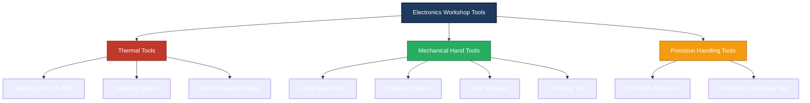
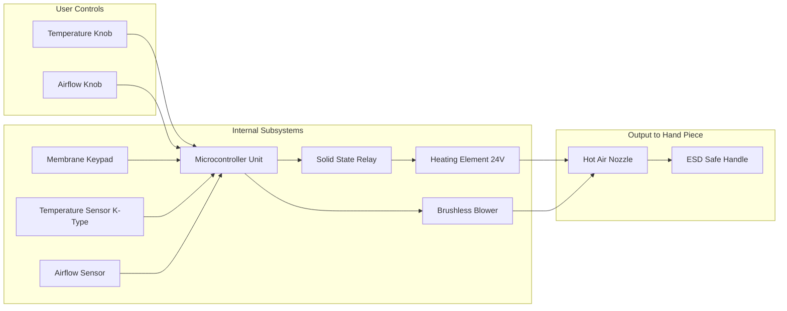

# Soldering iron, Desoldering pump, Pliers, Cutters, Wire strippers, Screw drivers, Tweezers, Crimping tool, Hot air soldering and de- soldering station

<!-- SECTION_1_START -->
# BASIC ELECTRICAL AND ELECTRONICS ENGINEERING WORKSHOP — MODULE 3
## Hand Tools, Testing Instruments & Soldering/Desoldering Equipment

> [!IMPORTANT]
> **KTU 2024 Scheme Focus:** This module is purely a **Workshop Skill Module (WSM)** mapped to Course Outcome **CO5** under the *2024 NEP Curriculum*. It tests **Remember** and **Understand** cognitive levels of Revised Bloom's Taxonomy. Students are expected to demonstrate hands-on familiarity with the *identification, selection, and safe operation* of basic electronics hand tools, soldering/desoldering equipment, and standard testing instruments.

---

### 1.1 Soldering Iron

> [!NOTE]
> **Definition:** A *soldering iron* is a **hand-held thermal tool** that uses an electrically heated metallic tip (the *bit*) to melt *solder* (a low-melting-point filler metal alloy) so as to form a permanent metallurgical bond between two or more metal surfaces — typically component leads and a printed circuit board (PCB) pad.

**Technical Specifications (Standard Lab Unit):**

| Parameter | Typical Value |
|---|---|
| Operating Voltage | $230\ \text{V}\ \text{AC},\ 50\ \text{Hz}$ |
| Power Rating | $\mathbf{15\ \text{W}}\text{–}\mathbf{60\ \text{W}}$ (general PCB work) |
| Bit Temperature Range | $200\ ^\circ\text{C}\text{–}450\ ^\circ\text{C}$ |
| Heating Element | Nichrome wire wound over a ceramic / mica core |
| Bit Material | Copper core plated with iron (Fe) for oxidation resistance |

**Intuitive Analogy — The Soldering Iron as a "Tiny Hot Pen":**
Imagine a thick marker pen. The metal tip is the "nib," and the heating element is like a tiny electric kettle glued to the nib. When you switch it ON, the nib becomes hot enough to *melt* a soft metal wire (solder) which then *sticks* the electronic components to the board — much like glue, except it is a true metal-to-metal bond that *conducts electricity*.

> [!TIP]
> **Soldering Iron vs. Soldering Station:** A basic soldering iron is a *standalone* plug-in tool. A *soldering station* adds a temperature controller unit, a holder, and a cleaning sponge — preferred for precision work.

---

### 1.2 Desoldering Pump (Solder Sucker)

> [!NOTE]
> **Definition:** A *desoldering pump* is a **spring-loaded vacuum device** used to remove molten solder from a joint, allowing the removal or replacement of a faulty through-hole component.

**Operating Principle (Intuitive):** Think of it as a **spring-loaded syringe in reverse**. You compress a plunger (loading a "spring"). When you press a release button, the spring snaps back, creating a sudden burst of suction that *inhales* the molten solder off the board.

**Key Specification:** Suction force is typically capable of clearing a standard $0.8\ \text{mm}$ through-hole pad in $\mathbf{1\ \text{–}\ 2\ \text{seconds}}$ of contact.

---

### 1.3 Pliers, Cutters & Wire Strippers

These three form the **mechanical triad** of an electronics workbench.

**Pliers** — A pivoted two-lever hand tool used for **gripping, bending, and forming** component leads. The *nose-pliers* / *long-nose pliers* variant has tapered jaws ideal for reaching into dense PCB assemblies.

**Cutters (Diagonal Cutting Pliers / "Nippers")** — Specifically engineered with sharp, angled jaws to **shear through copper wire and component leads** cleanly. Diagonal cutters produce a flush cut, important when trimming leads close to a solder joint.

**Wire Strippers** — A precision tool that **cuts and removes the polymer insulation** from an electrical wire *without nicking the copper conductor*. They use matched cutting blades calibrated to specific AWG (American Wire Gauge) wire sizes.

> [!NOTE]
> **Definition:** A *crimping tool* is a specialized plier-like device that **mechanically deforms a metal connector (ferrule or terminal) around a stripped wire** to form a gas-tight, low-resistance electrical and mechanical joint. Crimp force typically ranges from $\mathbf{1\ \text{kN}}\text{–}\mathbf{15\ \text{kN}}$ depending on connector size.

---

### 1.4 Screw Drivers (for Electronics Work)

**Definition:** A *screw driver* is a hand tool with a shaped tip that engages with the *slot, cross, or star* recess of a screw head to apply torque.

**Electronics-Specific Variants:**

| Drive Type | Symbol | Common Use |
|---|---|---|
| Slotted | $-$ | Old consumer electronics, terminal blocks |
| Phillips | $+$ | Computer cases, hard drives |
| Torx (Star) | $\ast$ | Apple devices, automotive |
| Hex (Allen) | $\bigcirc$ | Furniture, robotics couplings |

A **precision screwdriver set** (with interchangeable bits) is the lab standard, since PCB screws are usually **M2, M2.5, or M3** in size.

---

### 1.5 Tweezers

> [!NOTE]
> **Definition:** *Tweezers* are a pair of slender, pivoted metal arms joined at one end, used to **grasp, position, and hold miniature components** that are too small or too hot to handle with fingers.

**Common Variants in Electronics Labs:**

- **Straight-tip (AA):** General pick-and-place work.
- **Curved-tip:** Accessing components in recessed areas.
- **Anti-magnetic (ESD-safe, stainless steel):** Mandatory for **SMD / SMT** work to prevent damage to sensitive semiconductors.
- **Heat-resistant (ceramic / titanium):** Used during *hot air rework* and *soldering* to hold components steady.

---

### 1.6 Crimping Tool

**Intuitive Analogy:** Think of a *crimping tool* as a **"metal stapler"** — but instead of forcing a paper clip through paper, it squeezes a hollow metal sleeve (the *terminal*) shut around a wire. The resulting joint is both *mechanically locked* and *electrically continuous*.

> [!IMPORTANT]
> **Crimping vs. Soldering — When to Use Which?**
> - **Crimping** is preferred for *power connectors, automotive harnesses, and RF coaxial cables* because it is fast, repeatable, and gas-tight.
> - **Soldering** is preferred for *PCB pads and fine signal lines* where the joint must be small and reworkable.

---

### 1.7 Hot Air Soldering & De-Soldering Station (SMD Rework Station)

> [!NOTE]
> **Definition:** A *hot air station* (also called a *hot air rework station* or *SMD rework station*) is a workstation that directs a **stream of precisely temperature-controlled hot air** onto a PCB to melt solder beneath Surface Mount Devices (SMDs) — for either attaching or removing them.

**Key Subsystems:**

1. **Air Pump / Blower** — Generates airflow, typically $\mathbf{1\ \text{–}\ 120\ \text{L/min}}$.
2. **Heating Element** — Raises air temperature from ambient to $\mathbf{100\ ^\circ\text{C}\text{–}500\ ^\circ\text{C}}$.
3. **Nozzle Set** — Interchangeable tips that focus the airflow onto a specific component (e.g., SOIC, QFP, BGA).
4. **ESD-safe Hand-piece** — Typically $\mathbf{24\ \text{V}}$ low-voltage heating for operator safety.

**Intuitive Analogy — The "Hair Dryer for Chips":**
A hot air station looks and behaves exactly like a salon hair dryer — but its air is hotter, its flow is finer, and its nozzle is small enough to heat *one single chip* on a crowded circuit board without melting its neighbors. It is the *only practical way* to rework **multi-pin SMD packages** like QFN and BGA that have *no leads* to touch with an iron.

> [!VISUALIZATION CONTROL]
> **Concept:** Tool-Temperature vs. Component-Size Operating Map
> **Reference Axes:** X-axis: Component size (mm) 0–50 ; Y-axis: Tool tip temperature (°C) 0–500
> **Mapped Tools:**
> * Hot air station nozzle: high-temp region (350 °C – 450 °C) for SMD/BGA components (5 mm – 40 mm package size)
> * Soldering iron bit: mid-temp region (300 °C – 380 °C) for through-hole & discrete SMD (1 mm – 10 mm)
> * Tweezers (heated): low-temp region (200 °C – 300 °C) for miniature passive SMD (0402 / 0603)
> **Visual Description:** A two-axis map demonstrating the *overlap* and *exclusivity* zones of three soldering tools across the PCB rework matrix.

---

<!-- SECTION_1_END -->

<!-- SECTION_2_START -->
# Deep Theoretical Analysis & High-Yield Specification Sheet

## 2.1 Working Principles & Engineering Rationale

### A. Soldering Iron — Joule Heating of the Bit
The soldering iron converts electrical energy into heat via the **Joule Effect**:
$$Q = I^{2} R t$$
where $I$ is the current, $R$ is the resistance of the Nichrome heating element, and $t$ is the time. The heat is conducted through a copper core to the iron-plated tip.

> [!IMPORTANT]
> **Why iron-plate the copper bit?** Bare copper oxidizes rapidly at $\text{>300}\ ^\circ\text{C}$ and stops "wetting" with solder. An iron (Fe) coating prevents oxidation and improves solderability.

**Solder Alloy Used in KTU Labs:** $60\ \%\ \text{Sn}\text{–}40\ \%\ \text{Pb}$ (leaded solder) with a rosin-core flux.
- **Melting point:** $\mathbf{183\ ^\circ\text{C}}\text{–}\mathbf{190\ ^\circ\text{C}}$.
- Lead-free alternative: $\text{Sn}\text{–}\text{Ag}\text{–}\text{Cu}$ (SAC305), melting at $\mathbf{217\ ^\circ\text{C}}\text{–}\mathbf{220\ ^\circ\text{C}}$.

### B. Desoldering Pump — Sudden Pressure Differential
When the spring releases, the plunger rapidly increases the internal volume $V$ of the chamber, dropping the air pressure inside. By **Boyle's Law**,
$$P_{1} V_{1} = P_{2} V_{2}$$
This creates a partial vacuum that *sucks* the molten solder into the chamber where it solidifies on the cool walls.

### C. Hot Air Station — Forced Convective Heat Transfer
Heat is delivered to the component via **forced convection**:
$$Q = h \cdot A \cdot \Delta T$$
where $h$ is the convective heat-transfer coefficient (proportional to airflow velocity), $A$ is the heated surface area, and $\Delta T$ is the temperature difference. This is why *airflow setting* is just as important as *temperature setting*.

---

## 2.2 KTU High-Yield Specification Sheet

| S.No. | Tool / Instrument | Critical Specification | Engineering Function |
|:---:|---|---|---|
| 1 | Soldering Iron (lab) | $230\ \text{V}$, $25\ \text{W}\text{–}60\ \text{W}$, $\text{up to }400\ ^\circ\text{C}$ | Melts solder to make joints |
| 2 | Desoldering Pump | Spring-loaded, $P_{\text{vac}} \approx -0.6\ \text{atm}$ | Removes molten solder |
| 3 | Long-Nose Pliers | $\text{50\ mm}\text{–}150\ \text{mm}$ jaw reach | Gripping / bending leads |
| 4 | Diagonal Cutter | $\text{Hardness: HRC}\ 60\text{–}62$ | Shearing copper leads |
| 5 | Wire Stripper | AWG $10\text{–}30$ range | Strips insulation only |
| 6 | Precision Screwdriver Set | Bits: Slotted, Phillips, Torx | Fastening M2 / M2.5 / M3 screws |
| 7 | ESD-Safe Tweezers | Resistance $\text{>10}^{6}\ \Omega$ | Handling SMD components |
| 8 | Crimping Tool | Ratchet mechanism, $1\text{–}15\ \text{kN}$ | Crimp terminals on wires |
| 9 | Hot Air Rework Station | $100\ ^\circ\text{C}\text{–}500\ ^\circ\text{C}$, $1\text{–}120\ \text{L/min}$ | SMD reflow / de-soldering |

---

## 2.3 Why These Tools Matter in Real Engineering

> [!NOTE]
> **Production Line Context:** Modern SMT (Surface Mount Technology) lines use *automated* soldering (reflow ovens, wave soldering, robotic hot-air stations). However, the **hand tools listed in this module are indispensable for:**
> - **Prototype development** in R&D labs.
> - **Rework and repair** of field-deployed PCBs.
> - **Engineering education labs** like KTU's GZESL106 workshop.

**Real-World Engineering Connection:** The same tools (with ESD-safe variants) are used by **hardware engineers at Intel, NVIDIA, Bosch, and Tata Electronics** during chip-level debugging and motherboard repair.

---

<!-- SECTION_2_END -->

<!-- SECTION_3_START -->
# Step-by-Step Procedures, Tool Profiles & Safe-Operation Tables

## 3.1 Soldering Iron — Proper Operating Procedure

> [!IMPORTANT]
> **Workshop Safety:** Always operate a soldering iron inside a **fume extractor** and wear **safety goggles**. The tip reaches $400\ ^\circ\text{C}$ — it can cause **third-degree burns** instantly.

### Step-by-Step Procedure for Through-Hole Soldering

| Step | Action | Reason |
|:---:|---|---|
| 1 | Insert component lead through PCB hole | Establishes electrical contact path |
| 2 | Clean the soldering iron tip on a wet sponge | Removes oxidized solder / residue |
| 3 | **Tin the tip** — apply a small amount of fresh solder | Improves thermal conduction |
| 4 | Touch the tip *simultaneously* to the pad and the lead | Heats *both* surfaces to the same temp |
| 5 | Wait $\text{2–3 seconds}$, then apply solder wire to the joint | Solder flows via capillary action |
| 6 | Remove solder, then remove iron — in that order | Prevents a *cold joint* |
| 7 | Inspect: a good joint is **shiny, concave, and volcano-shaped** | Indicates proper wetting |

> [!WARNING]
> A **dull, grainy, or ball-shaped** joint is a *cold joint* — a high-resistance defect that *will fail* in the field. Re-heat it.

---

## 3.2 Desoldering Pump — Operating Sequence

| Step | Action |
|:---:|---|
| 1 | Press the plunger *down* until it locks (spring compressed) |
| 2 | Heat the solder joint with the iron until it is fully molten |
| 3 | Place the nozzle tip *over* the molten solder pool (keep iron in place) |
| 4 | Press the **release button** — pump sucks the solder in |
| 5 | Eject the solidified solder slug by pushing the plunger back |
| 6 | Repeat 2–3 times if the through-hole is still blocked |

---

## 3.3 Hot Air Station — Step-by-Step SMD Removal

| Step | Action | Parameter |
|:---:|---|---|
| 1 | Select the correct nozzle size | Should match the IC package footprint |
| 2 | Set the **temperature** | $320\ ^\circ\text{C}$ for leaded, $360\ ^\circ\text{C}$ for lead-free |
| 3 | Set the **airflow** | $30\text{–}50\ \text{L/min}$ for most QFP/SOIC |
| 4 | Apply *solder paste flux* to the component leads | Improves heat transfer |
| 5 | Heat the component *uniformly* in a circular motion | $30\text{–}60\ \text{seconds}$ ramp-up |
| 6 | Once solder reflows, lift the component with tweezers | Component is now detached |
| 7 | Clean the pads with solder wick | Remove residual solder |

---

## 3.4 Wire Stripping & Crimping — Workshop Sequence

### A. Wire Stripping (Manual Stripper)

1. Identify the AWG marking on the stripper jaw (e.g., $20\ \text{AWG}$).
2. Clamp the wire gently inside the correct notch.
3. Rotate $\text{45°}$ to score the insulation.
4. Pull the stripper toward the wire end to slide off the insulation.
5. Inspect: the copper strands must be **untouched, shiny, and full-count**.

### B. Crimping (e.g., JST-XH / Spade Terminal)

| Step | Action |
|:---:|---|
| 1 | Strip wire to length specified by terminal (typically $4\ \text{mm}\text{–}6\ \text{mm}$) |
| 2 | Insert the *bare* conductor into the terminal barrel |
| 3 | Place the terminal into the matching die of the crimping tool |
| 4 | Squeeze the handles *fully* until the ratchet releases |
| 5 | **Tug-test** the wire — it must not slip out under $5\ \text{N}$ pull |

> [!IMPORTANT]
> A good crimp is **gas-tight** — meaning oxygen *cannot* enter the joint, so it does not corrode. This is why crimping is preferred for *automotive and aerospace* wiring.

---

## 3.5 Tool Selection Matrix — When to Use What

| Task | Primary Tool | Optional Helper |
|---|---|---|
| Solder a through-hole resistor | Soldering iron ($25\ \text{W}$) | Helping-hands / PCB holder |
| Remove a faulty through-hole IC | Desoldering pump + iron | Solder wick (copper braid) |
| Replace a QFP SMD chip | Hot air rework station | ESD tweezers, flux paste |
| Cut a component lead flush | Diagonal cutter | — |
| Strip $1.5\ \text{mm}^{2}$ house wire | Wire stripper | — |
| Crimp a Dupont connector | Crimping tool (ratcheting) | Wire stripper |
| Tighten a laptop screw | Phillips #0 screwdriver | Magnetic mat |
| Pick up a $0402$ resistor | ESD-safe tweezers | — |

---

## 3.6 Python Reference — A Simulated Soldering-Tool Selector (for Lab Demonstrations)

```python
"""
KTU GZESL106 - Tool Selector Helper
A reference script demonstrating how selection logic is implemented.
"""

from dataclasses import dataclass
from enum import Enum


class ComponentPackage(Enum):
    THROUGH_HOLE = "through-hole"
    SMD_PASSIVE = "smd-passive-0402-0805"
    SMD_IC_QFP = "smd-ic-qfp"
    SMD_IC_BGA = "smd-ic-bga"
    WIRE_JOINT = "wire-joint"


class Operation(Enum):
    SOLDER = "solder"
    DESOLDER = "desolder"
    STRIP = "strip"
    CRIMP = "crimp"
    FASTEN = "fasten"


@dataclass(frozen=True)
class ToolSpec:
    name: str
    power_w: float
    max_temp_c: float
    esd_safe: bool


TOOL_LIBRARY: dict = {
    "soldering_iron_25W": ToolSpec("Soldering Iron 25W", 25.0, 400.0, True),
    "hot_air_station":    ToolSpec("Hot Air Station",     550.0, 500.0, True),
    "desoldering_pump":   ToolSpec("Desoldering Pump",      0.0,   0.0, True),
    "crimping_tool":      ToolSpec("Crimping Tool",         0.0,   0.0, False),
    "wire_stripper":      ToolSpec("Wire Stripper AWG10-30",0.0,   0.0, False),
    "tweezers_esd":       ToolSpec("ESD Tweezers",          0.0,   0.0, True),
    "phillips_screwdriver": ToolSpec("Phillips #0",         0.0,   0.0, False),
}


def select_tool(package: ComponentPackage, op: Operation) -> str:
    """
    Returns the recommended tool for a (package, operation) pair.
    Raises a descriptive error for invalid combinations.
    """
    if op == Operation.SOLDER:
        if package in (ComponentPackage.THROUGH_HOLE, ComponentPackage.WIRE_JOINT):
            return "soldering_iron_25W"
        if package == ComponentPackage.SMD_PASSIVE:
            return "soldering_iron_25W"
        if package in (ComponentPackage.SMD_IC_QFP, ComponentPackage.SMD_IC_BGA):
            return "hot_air_station"

    if op == Operation.DESOLDER:
        if package == ComponentPackage.THROUGH_HOLE:
            return "desoldering_pump"
        if package in (ComponentPackage.SMD_IC_QFP, ComponentPackage.SMD_IC_BGA):
            return "hot_air_station"

    if op == Operation.STRIP and package == ComponentPackage.WIRE_JOINT:
        return "wire_stripper"
    if op == Operation.CRIMP and package == ComponentPackage.WIRE_JOINT:
        return "crimping_tool"

    raise ValueError(
        f"No standard tool found for package={package.value}, operation={op.value}"
    )


if __name__ == "__main__":
    test_cases = [
        (ComponentPackage.THROUGH_HOLE, Operation.SOLDER),
        (ComponentPackage.SMD_IC_QFP,   Operation.DESOLDER),
        (ComponentPackage.WIRE_JOINT,   Operation.STRIP),
        (ComponentPackage.WIRE_JOINT,   Operation.CRIMP),
    ]
    for pkg, op in test_cases:
        try:
            tool = select_tool(pkg, op)
            print(f"  {pkg.value:<22}  {op.value:<10}  ->  {tool}")
        except ValueError as exc:
            print(f"  ERROR: {exc}")
```

**Sample Output:**
```
  through-hole            solder      ->  soldering_iron_25W
  smd-ic-qfp              desolder    ->  hot_air_station
  wire-joint              strip       ->  wire_stripper
  wire-joint              crimp       ->  crimping_tool
```

---

<!-- SECTION_3_END -->

<!-- SECTION_4_START -->
# Structural Diagrams & Schematics

## 4.1 Mermaid Block Diagram — Tool Classification Hierarchy



---

## 4.2 Mermaid Flowchart — Soldering Iron Operating Sequence

```mermaid
flowchart TD
    S0[Start: PPE Goggles and Fume Extractor ON]:::start
    S1[Insert Component Lead into PCB]:::step
    S2[Clean Tip on Wet Sponge]:::step
    S3[Tin the Soldering Iron Tip]:::step
    S4[Touch Tip to Pad and Lead Simultaneously]:::step
    S5[Apply Solder Wire 2 to 3 seconds]:::step
    S6[Remove Solder then Iron]:::step
    S7{Is Joint Shiny and Concave?}:::decision
    S8[Acceptable Joint]:::ok
    S9[Re-heat and Add Flux]:::fix
    S10[End]:::end

    S0 --> S1 --> S2 --> S3 --> S4 --> S5 --> S6 --> S7
    S7 -- Yes --> S8 --> S10
    S7 -- No  --> S9 --> S4

    classDef start  fill:#2c3e50,color:#ffffff;
    classDef step   fill:#3498db,color:#ffffff;
    classDef decision fill:#e67e22,color:#ffffff;
    classDef ok     fill:#27ae60,color:#ffffff;
    classDef fix    fill:#e74c3c,color:#ffffff;
    classDef end    fill:#8e44ad,color:#ffffff;
```

---

## 4.3 Mermaid Flowchart — Hot Air SMD Removal Sequence

```mermaid
flowchart TD
    H0[Start: Select Correct Nozzle]:::start
    H1[Apply Flux Paste to Component Leads]:::step
    H2[Set Temperature 320 to 360 C]:::step
    H3[Set Airflow 30 to 50 L per min]:::step
    H4[Heat Component in Circular Motion 30 to 60 s]:::step
    H5[Observe Solder Reflow Shine]:::observe
    H6[Solder Fully Molten?]:::decision
    H7[Lift IC with ESD Tweezers]:::step
    H8[Clean Pads with Solder Wick]:::step
    H9[End Successful Removal]:::ok
    H10[Increase Temperature by 20 C]:::fix
    H11[End: Re-apply Heat]:::end

    H0 --> H1 --> H2 --> H3 --> H4 --> H5 --> H6
    H6 -- Yes --> H7 --> H8 --> H9
    H6 -- No  --> H10 --> H4

    classDef start   fill:#1f3a5f,color:#ffffff;
    classDef step    fill:#16a085,color:#ffffff;
    classDef observe fill:#f39c12,color:#ffffff;
    classDef decision fill:#d35400,color:#ffffff;
    classDef ok      fill:#27ae60,color:#ffffff;
    classDef fix     fill:#c0392b,color:#ffffff;
    classDef end     fill:#8e44ad,color:#ffffff;
```

---

## 4.4 Mermaid Block Diagram — Hot Air Station Internal Subsystems



---

<!-- SECTION_4_END -->

<!-- SECTION_5_START -->
# KTU 2024 Scheme Examination Question Bank & Topic Recap

> [!IMPORTANT]
> **Mark Distribution Recap:** As per KTU 2024 ESE pattern for the WSM (Workshop Skill Module) paper: **Part A (3 marks × 2 Qs = 6 marks)**, **Part B (14 marks × 1 Qn with internal choice) = 14 marks.** Total $= 20$ marks, mapped to **CO5** (Apply engineering workshop skills).

---

## Part A — 3-Mark Questions (Remember / Understand)

### Question 1
**[KTU University Exam — Model Question, GZESL106, Dec 2024 Pattern]**
**CO5 / RBT: Remember**
List **any three safety precautions** that must be observed while using a soldering iron in the electronics workshop.

**Model Answer (Board-Expected Key):**
1. Wear **safety goggles** to protect eyes from molten solder splashes and flux fumes. **[1 Mark]**
2. Operate the iron inside a **fume extractor / well-ventilated area** to avoid inhaling lead and rosin fumes. **[1 Mark]**
3. Always place the hot iron in a **stand / holder** when not in use, and never touch the metallic tip. **[1 Mark]**

> [!TIP]
> Examiners in KTU value *bullet-format* answers in Part A. Avoid long paragraphs.

### Question 2
**[KTU University Exam — Model Question, GZESL106, July 2024 Pattern]**
**CO5 / RBT: Understand**
Differentiate between a **soldering iron** and a **hot air rework station**. Mention **one specific application** where each is preferred.

**Model Answer (Board-Expected Key):**

| Parameter | Soldering Iron | Hot Air Rework Station |
|---|---|---|
| Heat Transfer Mode | Conduction (direct contact) | Forced convection (hot air) |
| Typical Components | Through-hole, discrete SMD | Multi-pin SMD (QFP, QFN, BGA) |
| Application Example | Soldering a resistor lead on a PCB | Replacing a BGA chip on a smartphone motherboard |

**[1 Mark for correct definition of each tool, 1 Mark for the contrast, 1 Mark for valid application example]**

---

## Part B — 14-Mark Questions (Apply / Analyze)

> [!NOTE]
> As per the KTU 2024 ESE pattern, the student must answer **ONE** full 14-mark question, with internal choice between **Question A** and **Question B**.

---

### Question A (14 Marks)

**[KTU University Exam — GZESL106, Dec 2024 Pattern, Modified]**
**CO5 / RBT: Apply + Analyze**

**(a)** With the help of a **neat labelled diagram**, describe the **construction and working principle of a soldering iron**. List the typical operating temperature range and the **type of solder alloy** used in KTU labs. **[7 Marks]**

**(b)** Explain the **step-by-step procedure** to solder a through-hole resistor onto a general-purpose PCB. List **two common soldering defects** and state how each can be avoided. **[7 Marks]**

**Model Answer Key — Part (a) — 7 Marks:**

- *Construction details (Nichrome heating element wound on a ceramic / mica former, copper core, iron-plated tip, handle with cable entry, Bakelite body):* **[3 Marks]**
- *Working principle: Joule heating of Nichrome wire $\rightarrow$ heat conducted through copper core $\rightarrow$ iron-plated tip melts solder.* **[2 Marks]**
- *Operating temperature: 200 °C – 450 °C; Solder alloy: 60 % Sn – 40 % Pb with rosin-core flux, m.p. 183 °C – 190 °C.* **[2 Marks]**

**Model Answer Key — Part (b) — 7 Marks:**

- *Step 1: Clean the iron tip and 'tin' it.* **[0.5 Mark]**
- *Step 2: Insert lead through PCB hole and bend slightly to hold the component.* **[0.5 Mark]**
- *Step 3: Simultaneously touch tip to pad and lead, then apply solder.* **[1 Mark]**
- *Step 4: Remove solder, then iron, and let joint cool without movement.* **[0.5 Mark]**
- *Step 5: Inspect joint — must be shiny, concave, and volcano-shaped.* **[0.5 Mark]**
- *Defect 1: Cold joint (dull, grainy) — cause: insufficient heat. Fix: re-heat with fresh flux.* **[2 Marks]**
- *Defect 2: Solder bridge (unwanted connection between adjacent pads) — cause: excess solder. Fix: use desoldering pump / solder wick to remove excess.* **[2 Marks]**

---

### Question B (14 Marks) — INTERNAL CHOICE

**[KTU University Exam — GZESL106, July 2024 Pattern, Modified]**
**CO5 / RBT: Apply + Analyze**

**(a)** Explain the **working of a desoldering pump**. Describe the **correct sequence of operations** to remove a faulty through-hole IC using (i) a soldering iron, (ii) a desoldering pump, and (iii) solder wick. **[7 Marks]**

**(b)** With a **neat block diagram**, explain the **construction and operation of a hot air soldering and des-soldering station**. State **two safety precautions** specific to hot air rework. **[7 Marks]**

**Model Answer Key — Part (a) — 7 Marks:**

- *Desoldering pump construction: spring-loaded plunger, Teflon nozzle, release button, body. Working: sudden release of spring creates a vacuum that sucks molten solder.* **[3 Marks]**
- *Step 1: Set the PCB vertically and identify the joint.* **[0.5 Mark]**
- *Step 2: Press the pump plunger down to lock it.* **[0.5 Mark]**
- *Step 3: Heat the joint with the iron until solder is fully molten.* **[1 Mark]**
- *Step 4: Place the nozzle over the molten pool and press the release button.* **[1 Mark]**
- *Step 5: Repeat 2–3 times; use solder wick (copper braid) to absorb residual solder.* **[1 Mark]**

**Model Answer Key — Part (b) — 7 Marks:**

- *Block diagram explanation: control unit (microcontroller) → temperature sensor + airflow sensor (feedback loop) → heating element + blower → hand-piece with nozzle.* **[4 Marks]**
- *Operation: temperature and airflow are set; hot air reflows solder under an SMD IC; the IC is lifted with tweezers.* **[2 Marks]**
- *Safety 1: Wear heat-resistant gloves; do not touch the nozzle.* **[0.5 Mark]**
- *Safety 2: Ensure adequate ventilation; the hot air may vaporize flux and solder, which is toxic.* **[0.5 Mark]**

> [!WARNING]
> **KTU Examiner's Valuation Pitfalls — Read Carefully:**
> 1. **Do NOT skip stating the operating temperature** in soldering questions; full marks are deducted otherwise.
> 2. **Do NOT confuse** *soldering iron* (conduction) with *hot air station* (convection). Examiners specifically test this discrimination.
> 3. **Always list solder alloy composition** when asked about the soldering process — 60/40 Sn-Pb is the KTU lab standard.
> 4. **In hot-air rework questions**, students often forget to mention the *flux application* step. Examiners allocate 1 mark for this in the procedure.
> 5. **Do NOT write vague phrases** like "use pliers" without specifying *which* pliers (long-nose, flat-nose, etc.).

---

## Topic Recap & Important Things to Remember

- **Soldering Iron** uses **Joule heating** of a Nichrome element; tip temperature is typically $200\ ^\circ\text{C}\text{–}450\ ^\circ\text{C}$; lab standard is $25\ \text{W}$ at $230\ \text{V}\ \text{AC}$.
- **Solder alloy** used in KTU labs is $60\ \%\ \text{Sn}\text{–}40\ \%\ \text{Pb}$ with **rosin-core flux**, melting at $183\ ^\circ\text{C}\text{–}190\ ^\circ\text{C}$.
- A **good solder joint** is **shiny, concave, and volcano-shaped**; a **cold joint** is dull, grainy, and high-resistance.
- The **desoldering pump** works on the principle of **sudden pressure differential** (vacuum suction) created by a released spring.
- The **hot air rework station** is used **exclusively for SMD packages** (QFP, QFN, BGA) — it is *not* suitable for through-hole work.
- **Pliers** are for *gripping*; **Cutters** are for *shearing*; **Wire strippers** are for *insulation removal only* — never confuse these three.
- A **proper crimp** is *gas-tight* and is preferred over solder for **automotive, RF, and power harnesses**.
- **ESD-safe tweezers** (resistance $\text{>10}^{6}\ \Omega$) are **mandatory** when handling SMDs to prevent electrostatic damage to semiconductors.
- **Precision screwdrivers** use **M2 / M2.5 / M3** bits in electronics, *not* the larger bits used in civil / mechanical work.
- **Safety triad for the workshop:** *Safety goggles + Fume extractor + Tool stand* — these are the three items a KTU examiner *always* looks for in a Part A safety question.
- **Heat transfer mode summary:** *Soldering iron = Conduction*; *Hot air station = Forced convection*; *Desoldering pump = No heat transfer (mechanical suction only)*.

<!-- SECTION_5_END -->
