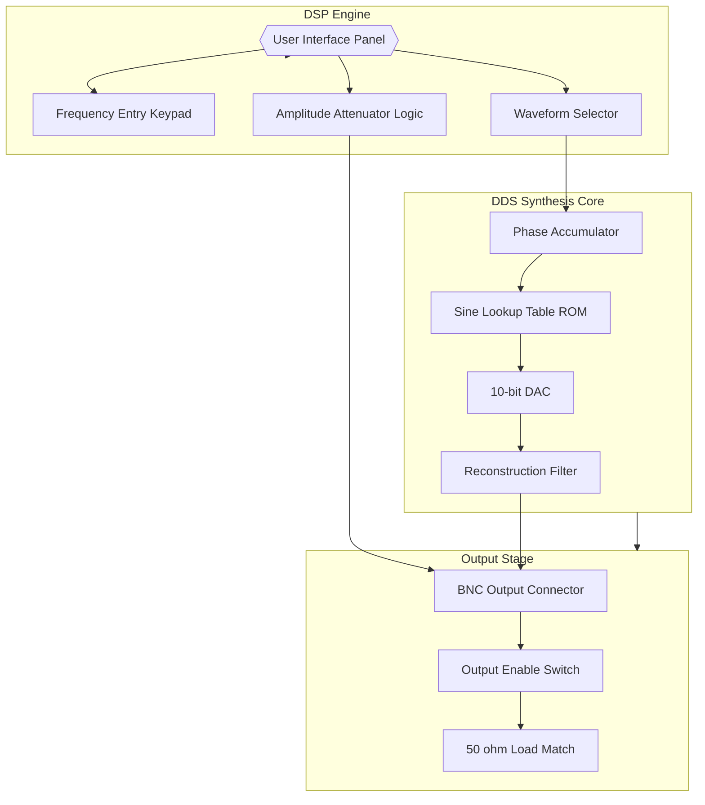
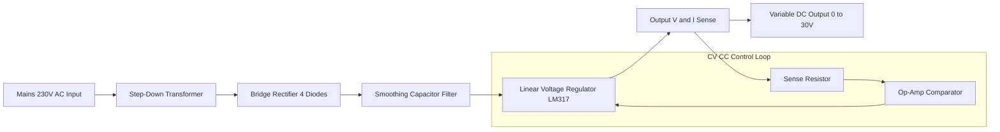
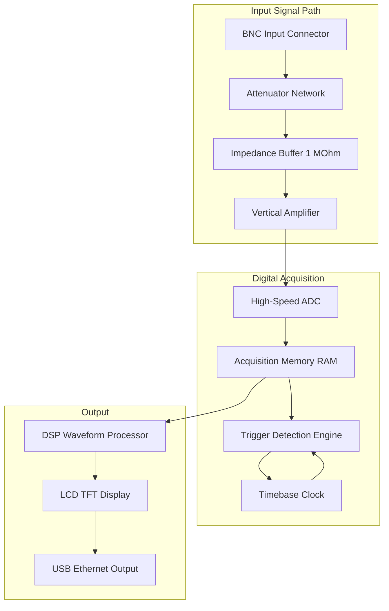
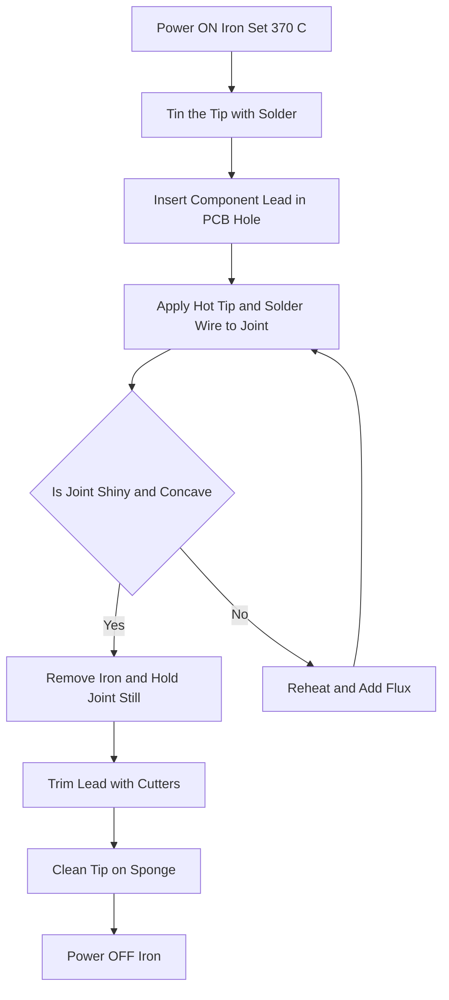
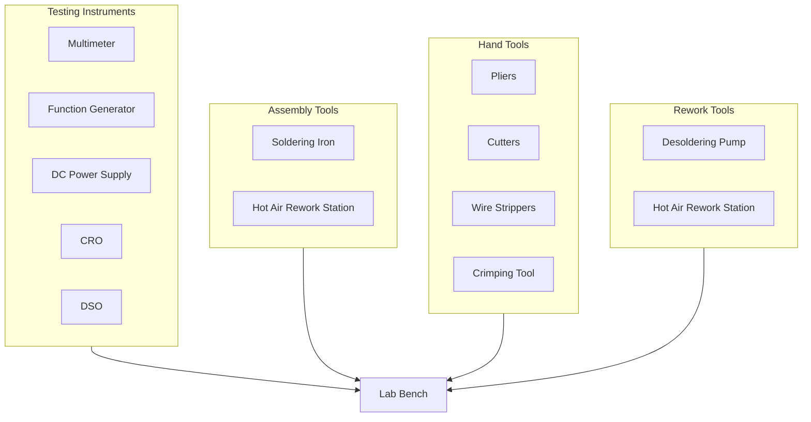
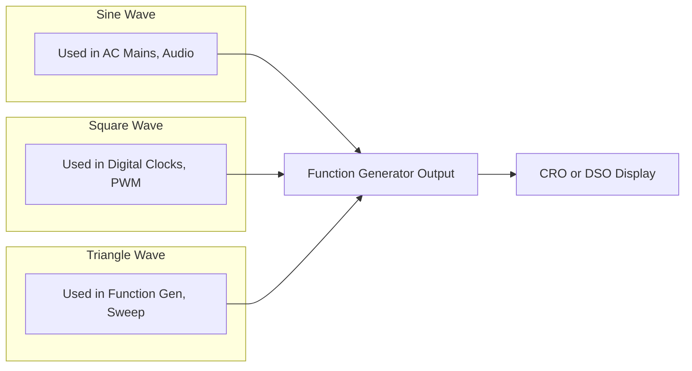

# Familiarization/Application of testing instruments and commonly used tools: Multimeter, Function generator, Power supply, CRO, DSO, Soldering iron, Desoldering pump, Pliers, Cutters, Wire strippers, Crimping tool, Hot air rework station

<!-- SECTION_1_START -->

# KTU-PREMIER WORKSHOP NOTES — GZESL106 (Module 3)

## 1. Core Technical Definition & Intuitive Overview

### 1.1 What is "Testing & Hand Tool Familiarization" in a KTU Workshop?

In the **APJ Abdul Kalam Technological University (KTU) 2024 Scheme** syllabus for the course *Basic Electrical and Electronics Engineering Workshop (GZESL106)*, Module 3 mandates that every first-year B.Tech student must physically identify, handle, and demonstrate the correct operational usage of the **12 core lab instruments and hand tools** listed below. This module bridges the gap between *theoretical circuit drawings* and *real bench-level hardware interaction*.

> [!IMPORTANT]
> **KTU 2024 Syllabus Definition (Verbatim Intent):**
> "Familiarization/Application of testing instruments and commonly used tools — Multimeter, Function generator, Power supply, CRO, DSO, Soldering iron, Desoldering pump, Pliers, Cutters, Wire strippers, Crimping tool, Hot air rework station."

The module is mapped to **Course Outcome CO1** and **CO2** of GZESL106, targeting cognitive levels **Remember (L1)** and **Understand (L2)** primarily, with **Apply (L3)** during hands-on lab sessions.

---

### 1.2 Conceptual Analogy / Intuition

Think of an electronics lab as a **doctor's clinic**:

- The **Multimeter** is the *stethoscope* — checks the "vitals" (Voltage, Current, Resistance) of a circuit.
- The **CRO/DSO** is the *X-ray machine* — visualizes the hidden "heartbeat" (waveform) of an electrical signal.
- The **Function Generator** is the *prescription pill* — feeds controlled "medicine" (test signals) into the circuit.
- The **DC Power Supply** is the *bloodline* — supplies continuous life (regulated DC voltage) to the patient.
- **Soldering Iron, Desoldering Pump, Hot Air Rework Station** are the *surgical tools* — used to attach, detach, or repair components.
- **Pliers, Cutters, Wire Strippers, Crimping Tools** are the *nurse's supporting instruments* — for preparation, cutting, and assembly.

---

### 1.3 Physical Constants and Standard Metrics

> [!NOTE]
> **Standard Lab Bench Values (Bolded for Memory Recall):**
> - **Standard AC mains in India: 230 V, 50 Hz**
> - **Standard logic-level DC: 5 V / 3.3 V**
> - **Soldering iron operating temperature: 350 °C to 400 °C** (lead-free solder)
> - **DSO/CRO input impedance: 1 MΩ || 20 pF** (standard probe)
> - **Multimeter digital accuracy: ±(0.5% + 2 digits)** (typical DMM)

---

### 1.4 The 12 Instruments & Tools — Quick Overview Table

| # | Instrument / Tool | Primary Function | Category |
|---|-------------------|------------------|----------|
| 1 | Multimeter (DMM) | Measure V, I, R, continuity, diode | Testing |
| 2 | Function Generator | Produce sine, square, triangle waves | Testing |
| 3 | DC Power Supply | Provide regulated DC voltage/current | Testing |
| 4 | CRO (Cathode Ray Oscilloscope) | Visualize analog waveforms in real time | Testing |
| 5 | DSO (Digital Storage Oscilloscope) | Capture, store, and analyze waveforms | Testing |
| 6 | Soldering Iron | Join components using molten solder | Assembly |
| 7 | Desoldering Pump (Solder Sucker) | Remove molten solder to detach components | Rework |
| 8 | Pliers (Needle-nose / Combination) | Grip, bend, hold wires/components | Hand Tool |
| 9 | Cutters (Side Cutters / Diagonal Cutters) | Cut wires, leads of components | Hand Tool |
| 10 | Wire Strippers | Remove insulation from wire ends | Hand Tool |
| 11 | Crimping Tool | Crimp connectors onto wires (lugs, ferrules) | Hand Tool |
| 12 | Hot Air Rework Station (SMD) | Heat & remove SMD components using hot air | Rework |

> [!VISUALIZATION CONTROL]
> **Concept:** Instruments mapped to their function category in a 2D cluster map.
> **Input Data (Conceptual Coordinates):**
> - Testing Instruments: (x = 1, y = 2)
> - Assembly Tools: (x = 2, y = 1)
> - Hand Tools: (x = 0.5, y = 1)
> - Rework Tools: (x = 3, y = 1.5)
> **Visual Description:** The student should imagine three functional "zones" on a workbench — the *Measurement Zone* (left), the *Assembly Zone* (center), and the *Rework Zone* (right). This physical segregation is a standard KTU lab protocol.

---

<!-- SECTION_1_END -->

<!-- SECTION_2_START -->

# 2. Deep Theoretical Analysis & KTU High-Yield Formula Sheet

## 2.1 Breakdown of Each Instrument — Logic Steps

### 2.1.1 Digital Multimeter (DMM)

**What it does:** A DMM is a multi-range electronic measuring instrument that combines functions of a **voltmeter, ammeter, and ohmmeter** in a single portable unit.

**Operating Logic:**
- Internal **shunt resistor** ($R_s$) converts current to a measurable voltage.
- Internal **voltage divider network** extends the measurement range.
- Internal **constant-current source** measures resistance via Ohm's law.
- ADC (Analog-to-Digital Converter) digitizes the analog value and displays it on an **LCD**.

**Two Key Modes:**
1. **Autoranging Mode:** DMM auto-selects the proper range.
2. **Manual Range Mode:** User must dial the correct range to avoid overload.

**Why used:** A single device replaces 3 separate meters (V, I, R). Industry standard for fault diagnosis.

---

### 2.1.2 Function Generator

**What it does:** Generates precise **repetitive waveforms** (sine, square, triangle, ramp, TTL) over a wide frequency range — typically **0.1 Hz to 20 MHz** in lab models.

**Operating Logic:**
- Uses a **DDS (Direct Digital Synthesis)** chip to generate waveforms from a lookup table.
- The output frequency is set by clocking a DAC with a programmable frequency.
- An **attenuator network** controls the output amplitude.

**Why used:** Provides a known "test signal" to inject into circuits under test (e.g., to test an amplifier's frequency response).

---

### 2.1.3 DC Regulated Power Supply

**What it does:** Converts **230 V AC mains → regulated low-voltage DC** (typically **0–30 V**, **0–5 A** variable).

**Operating Logic (Linear Supply Block Flow):**
$$V_{AC} \rightarrow \text{Step-down Transformer} \rightarrow \text{Rectifier (Bridge)} \rightarrow V_{DC,\text{ripple}} \rightarrow \text{Filter (Capacitor)} \rightarrow V_{DC,\text{smooth}} \rightarrow \text{Voltage Regulator (78xx/LM317)} \rightarrow V_{DC,\text{regulated}}$$

**Key Specs to remember:**
- **Line Regulation:** Change in output voltage per unit change in input voltage.
- **Load Regulation:** Change in output voltage per unit change in load current.
- **Ripple Voltage:** Residual AC component after rectification (measured in **mV**).

---

### 2.1.4 Cathode Ray Oscilloscope (CRO)

**What it does:** Visualizes voltage waveforms vs. time on a phosphor screen using a **deflected electron beam**.

**Operating Logic:**
- **Electron gun** emits electrons.
- **Vertical deflection plates** → $Y$-axis (signal amplitude).
- **Horizontal deflection plates** → $X$-axis (time, driven by timebase).
- Phosphor-coated screen glows where electrons strike.

**Key CRO Controls (HIGH-YIELD for KTU):**
- **VOLTS/DIV knob** — sets vertical scale.
- **TIME/DIV knob** — sets horizontal scale.
- **TRIGGER LEVEL** — stabilizes the waveform.
- **PROBE ×10 switch** — internal 10× attenuation.

---

### 2.1.5 Digital Storage Oscilloscope (DSO)

**What it does:** Samples the input signal using a high-speed **ADC**, stores it in **digital memory**, and reconstructs it on an **LCD display**.

**Operating Logic:**
- Input → **Attenuator** → **Vertical Amplifier** → **ADC** → **Memory (RAM)** → **Display (LCD)**.
- The bandwidth of the DSO is typically **5× the signal frequency** for accurate capture (Nyquist with safety margin).

**Key Advantage over CRO:**
- Can capture **single-shot, non-repetitive, transient** events.
- Allows **storage, screenshot, USB transfer** of waveforms.
- Supports **auto-measurements** (Vpp, Vrms, frequency, duty cycle).

---

### 2.1.6 Soldering Iron

**What it does:** Heats a metal tip to **350–400 °C** to melt solder (an alloy of tin and lead, or lead-free SAC) for making **permanent electrical joints**.

**Operating Logic:**
- Mains AC → Heating element (nichrome wire) → Heat → Tip → Transfers heat to joint.
- **Temperature-controlled stations** use a **thermocouple sensor** + **PID controller** to maintain tip temperature.

**Critical Safety Points:**
- Always use a **stand** to hold the hot iron.
- Clean tip on a **wet sponge / brass wool**.
- Apply solder to the **joint, not the iron tip** (heat-bridge principle).

---

### 2.1.7 Desoldering Pump (Solder Sucker)

**What it does:** Removes molten solder from a joint to **detach components** without damaging the PCB.

**Operating Logic:**
- **Spring-loaded plunger** is pushed down (cocked).
- Iron melts the solder.
- **Press the release button** → plunger snaps up → vacuum sucks the molten solder into the barrel.

---

### 2.1.8 Hot Air Rework Station (SMD)

**What it does:** Blows **controlled hot air (200–450 °C)** to reflow solder paste and remove/place **SMD (Surface Mount Device)** components.

**Operating Logic:**
- Blower fan + heating element + **PID temperature control**.
- Nozzle size and shape must match component size.
- **Pre-heat the PCB** to avoid thermal shock.

---

### 2.1.9 Hand Tools (Pliers, Cutters, Wire Strippers, Crimping Tool)

| Tool | Function | Key Spec |
|------|----------|----------|
| **Needle-nose Pliers** | Grip small parts, bend leads | Serrated jaws |
| **Combination Pliers** | Grip + mild cutting | Insulated handles (1000 V) |
| **Side Cutters (Diagonal Cutters)** | Cut component leads & wires | Flush-cut type for PCB |
| **Wire Strippers** | Strip insulation without nicking conductor | AWG gauge markings |
| **Crimping Tool** | Mechanically deform a connector onto a wire | Ratchet mechanism, color-coded dies for AWG |

---

## 2.2 KTU High-Yield Formula Sheet

> [!IMPORTANT]
> **Master these formulas — they appear frequently in KTU viva and theory exams.**

| # | Formula / Concept | Symbol | Unit | Application |
|---|-------------------|--------|------|-------------|
| 1 | Ohm's Law | $V = I \cdot R$ | V, A, Ω | Multimeter resistance mode |
| 2 | Power Dissipation | $P = V \cdot I = I^2 R$ | Watts | Power supply rating |
| 3 | Period of a Waveform | $T = \dfrac{1}{f}$ | seconds | CRO/DSO time measurement |
| 4 | RMS Value of Sine Wave | $V_{rms} = \dfrac{V_{peak}}{\sqrt{2}}$ | Volts | DMM AC voltage mode |
| 5 | Peak-to-Peak to RMS | $V_{rms} = \dfrac{V_{pp}}{2\sqrt{2}}$ | Volts | CRO Vpp measurement |
| 6 | Rectifier Ripple Factor | $\gamma = \dfrac{V_{ripple(rms)}}{V_{DC}}$ | unitless | Power supply filter quality |
| 7 | Probe ×10 Attenuation | $V_{actual} = 10 \cdot V_{displayed}$ | Volts | CRO voltage measurement |
| 8 | Soldering Iron Tip Temp | $T_{tip} \approx 350\,°C$ to $400\,°C$ | °C | Lead-free soldering |
| 9 | Nyquist Sampling Rate | $f_s \geq 2 \cdot f_{signal}$ | Hz | DSO bandwidth rule |
| 10 | 10× Probe Input Impedance | $R_{in} = 10\,\text{M}\Omega$ | Ω | DSO/CRO probe spec |
| 11 | Wire Gauge (AWG) ↔ Diameter | $D_{mm} = 0.127 \cdot 92^{\frac{36-\text{AWG}}{19.5}}$ | mm | Wire stripper / crimping |
| 12 | LED Forward Voltage | $V_F \approx 1.8\,\text{V}$ (red) to $3.2\,\text{V}$ (blue) | V | Soldering / DMM diode mode |

> [!NOTE]
> **CRITICAL LaTeX Tip for Notes:** The vertical pipe symbol `|` is dangerous inside markdown tables. For absolute value, use $\vert x \vert$ or $\mid x \mid$ instead. For "such that" use $\mid$, and for conditional "given" use $\vert$ to keep KTU-publication formatting clean.

---

## 2.3 Real-World Engineering Utility

- **Multimeter:** Used in every **PCB test jig**, **field service**, and **automotive diagnostics**.
- **Function Generator:** Used to test **audio amplifiers**, **filters**, **communication circuits**.
- **DC Power Supply:** Every **lab bench**, **embedded system** prototyping station, and **production line test rig**.
- **CRO/DSO:** Used in **RF labs**, **IoT development**, **signal integrity testing**, and **medical electronics debugging**.
- **Soldering Iron / Hot Air Station:** Used in **electronics manufacturing**, **PCB repair shops**, and **prototype labs**.
- **Pliers / Cutters / Strippers / Crimpers:** Used in **panel wiring**, **cable harness assembly**, and **electrical installation**.

---

<!-- SECTION_2_END -->

<!-- SECTION_3_START -->

# 3. Step-by-Step Derivations, Operations & Practical Tables

## 3.1 Multimeter — Step-by-Step Measurement Procedure

### 3.1.1 Measuring a DC Voltage (e.g., across a 9 V battery)

**Step 1:** Insert the **black probe** into the **COM** socket.
**Step 2:** Insert the **red probe** into the **V/Ω** socket.
**Step 3:** Rotate the **rotary dial** to the **V— (DC voltage)** section. Choose a range **higher than the expected voltage** (e.g., 20 V range for 9 V battery).
**Step 4:** Connect probes in **parallel** across the battery terminals (red to +, black to –).
**Step 5:** Read the value on the LCD. Note the **unit (V or mV)** and **polarity** (negative reading means reversed probes).

**Mathematical Validation using Ohm's Law:**
$$V = I \cdot R \implies 9\,\text{V} = I \cdot 0.1\,\text{k}\Omega \implies I = 90\,\text{mA}$$

---

### 3.1.2 Measuring AC Mains Voltage (230 V)

**Step 1:** Switch the dial to **V~ (AC voltage)**, range **750 V AC** (highest range for safety).
**Step 2:** Use **insulated probes** and **one-hand rule** (keep one hand behind your back).
**Step 3:** Insert probes into the **Live** and **Neutral** slots of the socket.
**Step 4:** Read the value. Indian standard = **230 V ± 10%** (i.e., 207 V to 253 V).

> [!WARNING]
> **KTU Examiner's Pitfall:** Students often forget that the DMM measures **RMS**, not peak. For a sine wave, $V_{peak} = V_{rms} \cdot \sqrt{2}$. So 230 V RMS ≈ **325 V peak**. Crossing the probe's CAT rating can be fatal.

---

### 3.1.3 Measuring Resistance (e.g., 1 kΩ resistor)

**Step 1:** Dial to **Ω** section, range **2 kΩ**.
**Step 2:** **Power off the circuit** (resistance must be measured on a *de-energized* component).
**Step 3:** Touch probes to both leads of the resistor.
**Step 4:** Reading should be **close to 1.000 kΩ** (within tolerance band — gold = 5%, silver = 10%).

**Color Code Verification (4-band resistor, 1 kΩ ± 5%):**
- Band 1 (Brown) = **1**
- Band 2 (Black) = **0**
- Multiplier (Red) = **×10²**
- Tolerance (Gold) = **±5%**

$$\text{Resistance} = (10) \cdot 10^2 = 1000\,\Omega = 1\,\text{k}\Omega$$

---

### 3.1.4 Continuity Test

**Step 1:** Dial to **continuity / buzzer** mode.
**Step 2:** Touch the two probe tips together — DMM should **beep** (or show ≈ 0 Ω).
**Step 3:** Use this mode to check **fuses, wires, PCB tracks** for breaks.

---

## 3.2 Function Generator — Operational Walkthrough

### 3.2.1 Generating a 1 kHz, 5 Vpp Sine Wave

**Step 1:** Power ON the function generator. Default output is usually OFF — press **OUTPUT** button to enable.
**Step 2:** Press the **WAVE** button until **SINE** is selected.
**Step 3:** Press the **FREQ** button. Use the numeric keypad or knob to enter **1000** (Hz) or **1.000 kHz**.
**Step 4:** Press the **AMPL** button. Enter **5.00 Vpp** (peak-to-peak).
**Step 5:** Press the **OFFSET** button (if needed) and set to **0 V DC offset**.
**Step 6:** Connect the **BNC-to-banana** cable from **OUTPUT** socket to the circuit under test.

**Mathematical Representation of the Output:**
$$V_{out}(t) = 2.5 \cdot \sin(2 \pi \cdot 1000 \cdot t)\,\text{V}$$

**Reasoning:**
- The peak amplitude $V_{peak} = \dfrac{V_{pp}}{2} = \dfrac{5}{2} = 2.5\,\text{V}$
- The angular frequency $\omega = 2\pi f = 2\pi \cdot 1000 = 6283.19\,\text{rad/s}$

---

## 3.3 DC Power Supply — Setting Up a 5 V, 1 A Output

**Step 1:** Power ON the supply. Default mode: **CV (Constant Voltage)**.
**Step 2:** Turn the **voltage knob** clockwise to set **5.00 V** (read on the V-display).
**Step 3:** Turn the **current limit knob** to **1.00 A** (CC mode is automatically engaged if the load tries to draw more).
**Step 4:** Connect the load: **RED (V+)** to the positive terminal of load, **BLACK (GND)** to the negative.
**Step 5:** The **C.V. LED** is lit → supply is in constant-voltage mode. The **C.C. LED** lights up if the load demands more current than the set limit.

**Ripple Voltage Estimation (after filter capacitor):**
$$V_{ripple(rms)} = \dfrac{I_{load}}{2 \sqrt{3} \cdot f_{ripple} \cdot C}$$
$$V_{ripple(rms)} = \dfrac{1}{2 \sqrt{3} \cdot 100 \cdot 1000 \cdot 10^{-6}} \approx 2.89\,\text{V (unregulated)}$$

With a **LM7805 regulator** added, this drops to **≈ 3 mV** (typical ripple rejection).

---

## 3.4 CRO / DSO — Waveform Measurement Table

| Quantity to Measure | Procedure | Calculation |
|---------------------|-----------|-------------|
| **Amplitude ($V_{pp}$)** | Count vertical divisions × VOLTS/DIV knob | $V_{pp} = N_v \cdot \text{Vertical Sensitivity} \cdot \text{Probe Attenuation}$ |
| **Time Period ($T$)** | Count horizontal divisions × TIME/DIV knob | $T = N_h \cdot \text{Timebase} \cdot \text{Probe Attenuation}$ |
| **Frequency ($f$)** | $f = \dfrac{1}{T}$ | After finding $T$ |
| **Phase Difference** | Compare two waveforms on dual trace | $\phi = \dfrac{\Delta t}{T} \cdot 360°$ |

### 3.4.1 Worked Example: Measuring a 50 Hz Sine Wave on a CRO

- Suppose the waveform occupies **4 vertical divisions** peak-to-peak.
- VOLTS/DIV knob is at **0.5 V/div**, probe is at **×1**.
- Suppose **one full cycle occupies 4 horizontal divisions**, TIME/DIV is **5 ms/div**.

**Calculate $V_{pp}$, $V_{rms}$, $T$, $f$:**

$$V_{pp} = 4 \cdot 0.5 = 2.0\,\text{V}$$

$$V_{rms} = \frac{V_{pp}}{2\sqrt{2}} = \frac{2.0}{2.828} = 0.707\,\text{V}$$

$$T = 4 \cdot 5\,\text{ms} = 20\,\text{ms}$$

$$f = \frac{1}{T} = \frac{1}{0.020} = 50\,\text{Hz}$$

---

## 3.5 Soldering & Rework — Step-by-Step

### 3.5.1 Soldering a Through-Hole Resistor on a PCB

| Step | Action | Safety / Quality Check |
|------|--------|------------------------|
| 1 | Plug in the **soldering iron** (set to 370 °C for lead-free). | Use a **stand** — never lay it on the bench. |
| 2 | **Tin the tip**: melt a small amount of solder on the tip. | This improves heat transfer. |
| 3 | Insert the resistor lead through the **PCB hole**, bend the lead 45°. | Use **needle-nose pliers** to bend. |
| 4 | Touch the **tip + solder** to the **pad + lead** joint (not the tip alone). | Wait **2–3 seconds** for the joint to heat. |
| 5 | Feed solder until it flows into a **shiny concave fillet**. | Dull / blistered joint = **cold joint** (re-solder). |
| 6 | Trim the excess lead with **side cutters** (flush-cut type preferred). | Wear **safety glasses** — leads fly off! |
| 7 | Clean the **tip** on a damp sponge or brass wool after every joint. | Tip oxidation = poor heat transfer. |

### 3.5.2 Desoldering a Component (Using a Solder Sucker)

| Step | Action |
|------|--------|
| 1 | Cock the **desoldering pump** by pushing the plunger down until it clicks. |
| 2 | Heat the joint with the **soldering iron** until solder is fully molten. |
| 3 | Quickly place the pump's **Teflon nozzle** over the molten joint. |
| 4 | Press the **release button** — vacuum pulls the solder into the barrel. |
| 5 | Repeat 2–3 times per pin if needed. |
| 6 | Gently wiggle and remove the component lead using **needle-nose pliers**. |

### 3.5.3 SMD Rework Using a Hot Air Station

| Step | Action | Safety / Tip |
|------|--------|--------------|
| 1 | Select the **appropriate nozzle size** (match the IC package). | Wrong nozzle = blown-away adjacent components. |
| 2 | Set the **temperature** to **300–350 °C** and **airflow** to medium. | Excess airflow pushes small components. |
| 3 | **Pre-heat the PCB** from below for 60 s (use a pre-heater). | Prevents PCB warping. |
| 4 | Hold the nozzle 2–3 cm above the component, move in a **circular motion**. | Don't aim at one spot — even heating. |
| 5 | Wait for the solder paste to melt (≈ 30–60 s). | Use **tweezers** to gently lift the component. |
| 6 | Power OFF the hot air and let the PCB **cool naturally**. | Do not use cold air — thermal shock! |

---

## 3.6 Hand Tool Operations

### 3.6.1 Wire Stripping Procedure

| Step | Action |
|------|--------|
| 1 | Select the correct **AWG slot** on the stripper jaws. |
| 2 | Place the wire in the slot (NOT in the cutting hole). |
| 3 | Gently squeeze the handles and **rotate the stripper** ¼ turn. |
| 4 | Pull the stripper toward the wire end — insulation peels off cleanly. |
| 5 | The exposed copper should be **untouched** — no nicks or cuts. |

### 3.6.2 Crimping Procedure (e.g., RJ45 or Bootlace Ferrule)

| Step | Action |
|------|--------|
| 1 | Strip the wire to the correct length (≈ 5–8 mm for ferrules). |
| 2 | Insert the **bare conductor** into the **ferrule barrel**. |
| 3 | Place the ferrule into the **matching die** of the crimping tool. |
| 4 | Squeeze the handles firmly until the **ratchet releases**. |
| 5 | Tug the wire gently to verify the crimp is **mechanically solid**. |

---

## 3.7 Python Simulation (Demonstrates Concept of DSO Sampling)

```python
import numpy as np
import matplotlib.pyplot as plt

def simulate_dso_capture(f_signal=50, f_sample=2000, duration=0.05, vpp=2.0):
    """
    Simulates a DSO capturing a sine wave.
    Demonstrates Nyquist's theorem and reconstruction.
    """
    t_continuous = np.linspace(0, duration, 1000)
    t_sampled = np.linspace(0, duration, int(f_sample * duration), endpoint=False)

    # Original signal
    v_continuous = (vpp / 2) * np.sin(2 * np.pi * f_signal * t_continuous)

    # DSO samples
    v_sampled = (vpp / 2) * np.sin(2 * np.pi * f_signal * t_sampled)

    # Auto-measurements
    measured_vpp = np.max(v_sampled) - np.min(v_sampled)
    measured_freq = f_sample / np.argmax(v_sampled[1:] < 0)  # rough estimate

    print(f"--- DSO Auto-Measurement Report ---")
    print(f"Sampled Vpp        : {measured_vpp:.3f} V")
    print(f"Expected Vpp       : {vpp:.3f} V")
    print(f"Sampling Frequency : {f_sample} Hz")
    print(f"Signal Frequency   : {f_signal} Hz")
    print(f"Nyquist Satisfied  : {f_sample >= 2 * f_signal}")

    return t_continuous, v_continuous, t_sampled, v_sampled

# Run simulation
t_c, v_c, t_s, v_s = simulate_dso_capture()

plt.figure(figsize=(10, 5))
plt.plot(t_c * 1000, v_c, label="Original Signal (Continuous)", linewidth=2)
plt.stem(t_s * 1000, v_s, linefmt="r-", markerfmt="ro", basefmt=" ", label="DSO Samples")
plt.xlabel("Time (ms)")
plt.ylabel("Voltage (V)")
plt.title("Simulated DSO Sampling of a 50 Hz Sine Wave")
plt.legend()
plt.grid(True)
plt.show()
```

**What the student should observe:** The red stems (sampled points) accurately reconstruct the blue sine curve when the sampling frequency is high enough. If $f_s$ drops below $2 \cdot f_{signal}$, **aliasing** (false lower-frequency waveforms) will appear — this is the *Nyquist* rule in action.

---

<!-- SECTION_3_END -->

<!-- SECTION_4_START -->

# 4. Structural Diagrams & Schematics

## 4.1 Block Diagram — Function Generator Architecture



**Description:** A modern function generator uses **Direct Digital Synthesis**. The user enters a frequency and waveform type, the microcontroller drives a **DDS chip** (like the AD9833 or AD9850), which uses a phase accumulator + sine lookup table + DAC to produce a clean analog waveform. The output stage includes a 50 Ω matching network.

---

## 4.2 Block Diagram — DC Power Supply Signal Path



**Description:** A linear DC power supply converts AC mains → stepped-down AC → full-wave rectified DC → filtered DC → regulated DC. A feedback loop senses output voltage and current to maintain **Constant Voltage (CV)** or **Constant Current (CC)** operation.

---

## 4.3 Block Diagram — DSO Internal Architecture



**Description:** A DSO's signal flow is **Input → Attenuate → Buffer → Amplify → Digitize → Store → Process → Display**. The ADC sampling rate determines the DSO's **bandwidth**. A 100 MHz DSO typically samples at 1–2 GSa/s (Giga-samples per second).

---

## 4.4 Soldering Process — Sequential Flow



**Description:** This is the closed-loop KTU-recommended soldering workflow. A decision branch ensures only **shiny, concave fillets** are accepted. Dull or blistered joints are **cold joints** and must be reworked.

---

## 4.5 Tool Classification — Modular Mapping



**Description:** A logical classification of all 12 instruments into 4 functional categories, all converging on the **lab bench** as the common workspace. This mirrors the KTU syllabus structure for Module 3.

---

## 4.6 Waveform Comparison Table (as a Schematic View)



**Description:** Shows that the function generator can produce all three standard waveforms, and the CRO/DSO can visualize all three for analysis.

---

<!-- SECTION_4_END -->

<!-- SECTION_5_START -->

# 5. KTU 2024 Scheme Examination Question Bank & Topic Recap

> [!IMPORTANT]
> **Mark Distribution Pattern (KTU 2024):**
> - Part A (Short Answer): 2 questions × **3 marks** = 6 marks
> - Part B (Long Answer): 1 question × **14 marks** (with internal choice a OR b)
> - All questions in this module are typically from **CO1** and **CO2**, with cognitive levels **Remember (L1)** and **Understand (L2)**.

---

## 5.1 Part A — Short Answer Questions (3 Marks Each)

### Question 1: List the different types of Multimeters and explain them. `[KTU University Exam - July 2024]`

**Course Outcome:** CO1 | **RBT Level:** Remember (L1)

**Model Answer:**

Multimeters are classified into two main types:

1. **Analog Multimeter (VOM — Volt-Ohm-Milliammeter):**
   - Uses a **D'Arsonval moving-coil movement** to deflect a pointer on a printed scale.
   - No digital display; relies on visual reading against a scale.
   - No battery required for voltage/current measurement (only for resistance).
   - **Drawback:** parallax error, lower accuracy, no auto-ranging.

2. **Digital Multimeter (DMM):**
   - Uses an **internal ADC** to display the measured value on a **7-segment / LCD screen**.
   - Higher accuracy (typically **±0.5% + 2 digits**).
   - Auto-ranging in most modern DMMs.
   - **Features:** continuity buzzer, diode test, capacitance, frequency, temperature (advanced models).
   - **Advantage:** No parallax error, easy reading, true RMS option for AC.

> [Identifying two types: 1 Mark] [Explaining analog type: 1 Mark] [Explaining digital type with advantages: 1 Mark]

---

### Question 2: Differentiate between CRO and DSO. `[KTU University Exam - Dec 2023]`

**Course Outcome:** CO1 | **RBT Level:** Understand (L2)

**Model Answer:**

| Feature | CRO | DSO |
|---------|-----|-----|
| **Display** | Phosphor CRT (analog) | TFT LCD (digital) |
| **Signal Storage** | No (transient only) | Yes (digital memory) |
| **Single-Shot Capture** | Difficult | Easy |
| **Auto-Measurement** | Manual from graticule | On-screen (Vpp, Vrms, f, T) |
| **Connectivity** | None | USB, Ethernet, GPIB |
| **Bandwidth Cost** | Lower | Higher |
| **Weight & Size** | Bulky, heavy | Lightweight, compact |
| **Working Principle** | Electron beam deflection | ADC sampling + DSP |

> [Three correct differences: 3 Marks]

---

## 5.2 Part B — Long Answer Questions (14 Marks Each)

### Question A (14 Marks): Multimeter & Power Supply `[KTU University Exam - Dec 2024]`

**Course Outcome:** CO1, CO2 | **RBT Level:** Understand + Apply (L2 + L3)

#### (a) With the help of a block diagram, explain the working of a Digital Multimeter. List any four applications. (7 Marks)

**Model Answer:**

A **Digital Multimeter (DMM)** is a multi-function instrument that measures voltage, current, and resistance. Its block diagram consists of the following sections:

**Block Diagram Description:**

```
Signal Input → Function Selector Switch → Attenuator/Range Selector
        ↓
Signal Conditioning (Shunt for I, Divider for V, Constant Current for R)
        ↓
Analog-to-Digital Converter (ADC)
        ↓
Digital Display Driver
        ↓
LCD Display
```

**Working:**
- The user selects the function (V, I, R) and range.
- For **voltage measurement**, a precision **voltage divider** scales the input to a measurable value.
- For **current measurement**, a low-value **shunt resistor** ($R_s$) is inserted; the voltage drop across it is measured and Ohm's law is applied.
- For **resistance measurement**, an internal **constant-current source** passes a known current through the unknown resistor; the resulting voltage drop is digitized.
- The **ADC** converts the analog signal to a digital count, which is processed and shown on the **LCD**.

**Four Applications:**
1. Troubleshooting **household electrical wiring** (checking mains voltage, fuse continuity).
2. Testing **electronic circuits on a PCB** during prototyping.
3. Measuring **battery voltage** and checking its health.
4. **Automotive diagnostics** — testing alternator output, battery drain, sensor signals.

> [Block diagram: 3 Marks] [Working explanation: 2 Marks] [Applications: 2 Marks]

---

#### (b) Explain the working of a regulated DC power supply with a neat block diagram. Define the terms: line regulation, load regulation, and ripple voltage. (7 Marks)

**Model Answer:**

A **regulated DC power supply** converts the 230 V, 50 Hz AC mains into a stable, low-ripple DC voltage suitable for powering electronic circuits.

**Block Diagram:**
```
230 V AC → Step-down Transformer → Bridge Rectifier → Filter Capacitor
                                                                    ↓
                                                              Voltage Regulator
                                                                    ↓
                                                           Regulated DC Output
```

**Stage-by-Stage Explanation:**

1. **Step-Down Transformer:** Reduces 230 V AC to a lower AC voltage (e.g., 12 V AC). Provides **galvanic isolation** from mains.

2. **Bridge Rectifier:** Four diodes arranged in a bridge convert the **AC → pulsating DC** (full-wave rectification). The output frequency is doubled to **100 Hz**.

3. **Filter Capacator:** A large electrolytic capacitor (e.g., 1000 µF) smooths the pulsating DC into a near-constant DC. The residual AC component is called **ripple voltage**.

4. **Voltage Regulator (LM78xx or LM317):** Maintains the output voltage at a fixed (78xx) or adjustable (LM317) value, regardless of input voltage variations or load current changes.

**Definitions:**

- **Line Regulation:** The change in output voltage ($V_{out}$) for a corresponding change in input voltage ($V_{in}$), expressed as a ratio or percentage.
  $$\text{Line Regulation} = \frac{\Delta V_{out}}{\Delta V_{in}} \cdot 100\,\%$$

- **Load Regulation:** The change in output voltage when the load current changes from **no-load (NL)** to **full-load (FL)**, at constant input voltage.
  $$\text{Load Regulation} = \frac{V_{NL} - V_{FL}}{V_{FL}} \cdot 100\,\%$$

- **Ripple Voltage:** The unwanted residual AC component superimposed on the DC output, typically measured in **mV rms** or as a **ripple factor** $\gamma = \dfrac{V_{ripple(rms)}}{V_{DC}}$.

> [Block diagram: 2 Marks] [Stage-by-stage explanation: 2 Marks] [Defining three terms: 3 Marks]

---

### Question B (14 Marks): CRO, DSO & Soldering Tools `[KTU University Exam - July 2024]`

**Course Outcome:** CO1, CO2 | **RBT Level:** Understand + Apply (L2 + L3)

#### (a) With a neat block diagram, explain the working of a CRO. How is voltage and frequency measured using a CRO? (7 Marks)

**Model Answer:**

A **Cathode Ray Oscilloscope (CRO)** is an electronic instrument used to visualize time-varying voltage signals on a phosphor screen.

**Block Diagram:**

```
Vertical Input → Vertical Amplifier → Vertical Deflection Plates
                                              ↓
Timebase Generator → Horizontal Deflection Plates
                                              ↓
                                  Electron Beam (from Electron Gun)
                                              ↓
                                  Phosphor Screen
```

**Working:**

- The **electron gun** emits a focused beam of electrons.
- The **vertical deflection plates** deflect the beam up/down according to the input signal voltage.
- The **horizontal deflection plates** sweep the beam left-to-right at a rate set by the **timebase generator** (TIME/DIV knob).
- When the beam strikes the phosphor screen, it glows, tracing the waveform.
- A **trigger circuit** synchronizes the timebase with the input signal for a stable display.

**Measuring Voltage using CRO:**
$$V_{pp} = N_v \times \text{VOLTS/DIV setting} \times \text{Probe attenuation (×1 or ×10)}$$

**Example:** If a waveform occupies 4 vertical divisions and VOLTS/DIV is 0.5 V, then:
$$V_{pp} = 4 \times 0.5 = 2.0\,\text{V (with ×1 probe)}$$

**Measuring Frequency using CRO:**
$$T = N_h \times \text{TIME/DIV setting}$$
$$f = \dfrac{1}{T}$$

**Example:** If one full cycle spans 4 horizontal divisions and TIME/DIV is 5 ms:
$$T = 4 \times 5 = 20\,\text{ms} \implies f = \frac{1}{0.02} = 50\,\text{Hz}$$

> [Block diagram: 2 Marks] [Working explanation: 2 Marks] [Voltage measurement: 1.5 Marks] [Frequency measurement: 1.5 Marks]

---

#### (b) Explain the soldering process with a neat flowchart. List any four soldering defects with causes. (7 Marks)

**Model Answer:**

**Soldering** is the process of joining two metal surfaces using a filler metal (solder) that melts below 450 °C. In electronics, **lead-free solder (Sn-Ag-Cu, SAC)** is used, melting around **217–220 °C**.

**Flowchart of the Soldering Process:**

```
Start
   ↓
Power ON Iron (Set 350–370 °C)
   ↓
Tin the Tip
   ↓
Clean Tip on Sponge
   ↓
Place Component on PCB
   ↓
Apply Hot Tip + Solder to Joint (2–3 s)
   ↓
Wait for Solder to Flow into Fillet
   ↓
Remove Iron, Hold Joint Still (2 s)
   ↓
Inspect Joint (Should be Shiny & Concave)
   ↓
Trim Lead with Cutters
   ↓
End
```

**Four Common Soldering Defects with Causes:**

| # | Defect | Cause |
|---|--------|-------|
| 1 | **Cold Joint** | Insufficient heat; solder appears dull, blistered, and grainy. |
| 2 | **Solder Bridge** | Excess solder causing an unintended short between two adjacent pads/traces. |
| 3 | **Lifted Pad** | Excessive heat or force; the copper pad separates from the PCB substrate. |
| 4 | **Insufficient Wetting** | Oxidized tip or dirty pad; solder does not flow smoothly and forms a ball. |
| 5 | **Dry Joint** | Component moved during cooling; mechanical connection exists but no metallurgical bond. |
| 6 | **Rosin Residue / Spatter** | Excess flux or splashes; can cause long-term corrosion if not cleaned. |

> [Flowchart: 3 Marks] [Four defects: 4 Marks — 1 Mark each for correct identification and cause]

---

## 5.3 KTU Examiner's Valuation Warning / Pitfall Callout

> [!WARNING]
> **Common Mark-Loss Traps in GZESL106 Module 3:**
> 1. **Forgetting the units** in CRO measurements — writing only the divisions × knob value, but skipping "× probe attenuation" (×10 probe is the most common mistake → students get 5× larger readings).
> 2. **Confusing RMS and Peak** — DMMs display RMS, but CROs display peak-to-peak. Always convert explicitly: $V_{rms} = \dfrac{V_{pp}}{2\sqrt{2}}$.
> 3. **Missing the "power off the circuit" instruction** for resistance measurement — examiners specifically check for this in the multimeter question.
> 4. **Soldering safety** — examiners deduct marks for not mentioning **safety glasses**, **wet sponge cleaning**, or **insulated handle pliers** in hand-tool questions.
> 5. **Block diagram** — students often draw a CRO diagram without labeling the **timebase generator** and **trigger circuit**, which is a **mandatory 2-mark component**.
> 6. **Soldering defects** — "Cold joint" and "Dry joint" are NOT the same thing; mixing them up costs 1 mark.
> 7. **Function generator output impedance** — always mention the **50 Ω** match when explaining function generator output. Students often forget this.
> 8. **DSO sampling theorem** — when comparing CRO and DSO, the DSO's **Nyquist sampling criterion** ($f_s \geq 2 f_{max}$) is a frequently missed high-value point.

---

## 5.4 Topic Recap & Important Things to Remember

> [!IMPORTANT]
> **Rapid Revision Checklist — KTU Module 3 (GZESL106):**

### 🔧 Testing Instruments (5 items)

- **Multimeter (DMM):** Two types — Analog (VOM, moving coil) and Digital (LCD + ADC). Functions: V, I, R, continuity, diode. Always **power off the circuit** for resistance measurement.
- **Function Generator:** Produces sine, square, triangle waves from **0.1 Hz to ~20 MHz**. Uses **DDS** (Direct Digital Synthesis) in modern instruments. Output impedance is **50 Ω**.
- **DC Power Supply:** Converts 230 V AC → 0–30 V DC regulated. Modes: **CV (Constant Voltage)** and **CC (Constant Current)**. Key terms — *line regulation, load regulation, ripple voltage*.
- **CRO:** Phosphor CRT display, electron beam, deflection plates. Measures **Vpp, T, f, phase**. No storage. Controls — VOLTS/DIV, TIME/DIV, TRIGGER.
- **DSO:** LCD display, ADC + memory, single-shot capture, auto-measurements. **Nyquist rule:** $f_s \geq 2 \cdot f_{signal}$. Bandwidth 5× rule for accurate capture.

### 🛠 Assembly & Rework Tools (3 items)

- **Soldering Iron:** Temperature 350–400 °C (lead-free). Use **soldering stand + damp sponge**. Apply solder to the **joint, not the tip**.
- **Desoldering Pump:** Spring-loaded, creates vacuum to suck molten solder. Use with the soldering iron heating the joint first.
- **Hot Air Rework Station:** 200–450 °C hot air for **SMD components**. Use **correct nozzle size**, **pre-heat the PCB**, move the nozzle in **circular motion**, and let it **cool naturally**.

### ✋ Hand Tools (4 items)

- **Pliers:** Grip, bend, hold. Two main types — *needle-nose* (precision) and *combination* (general). **1000 V insulated handles** for electrical safety.
- **Cutters (Side/Diagonal):** Cut wires, trim component leads. Use **flush-cut type** for PCB work. **Wear safety glasses** — leads fly off.
- **Wire Strippers:** Remove insulation. Match the **AWG slot** to the wire gauge. Avoid **nicking** the copper conductor.
- **Crimping Tool:** Mechanically deform a **ferrule / lug** onto a wire. Use the **correct die** for the connector size. Ratchet mechanism ensures full crimp.

### 📐 Key Formulas (Must Memorize)

$$V = I \cdot R \quad \text{(Ohm's Law — Multimeter)}$$

$$T = \frac{1}{f} \quad \text{(Period from frequency — CRO/DSO)}$$

$$V_{rms} = \frac{V_{pp}}{2\sqrt{2}} \quad \text{(RMS from peak-to-peak — AC measurement)}$$

$$V_{ripple(rms)} = \frac{I_{load}}{2\sqrt{3} \cdot f_{ripple} \cdot C} \quad \text{(Filter capacitor ripple — Power Supply)}$$

$$V_{pp} = N_v \times \text{VOLTS/DIV} \times \text{Probe Attenuation} \quad \text{(CRO Voltage measurement)}$$

$$f_s \geq 2 f_{max} \quad \text{(Nyquist — DSO sampling)}$$

### 🎯 Viva & Lab Quick Answers

- **Q: What is the standard input impedance of a CRO probe?**
  **A:** **1 MΩ || 20 pF** (×1 probe), **10 MΩ || 13 pF** (×10 probe).
- **Q: Why is a 10× probe preferred over a 1× probe?**
  **A:** Higher impedance → less loading effect on the circuit under test.
- **Q: What is a "cold joint" and how to fix it?**
  **A:** A joint with insufficient heat → dull, blistered solder. **Fix:** Reheat with the iron + add fresh solder and flux.
- **Q: What is the difference between CV and CC modes in a power supply?**
  **A:** **CV (Constant Voltage):** Maintains fixed output voltage; current varies with load. **CC (Constant Current):** Maintains fixed current; voltage varies with load.
- **Q: What is a 50 Ω BNC output impedance standard?**
  **A:** Coaxial cables and test instruments are standardized at **50 Ω** to match transmission line impedances, minimizing reflections and signal loss.

### 🏆 High-Yield Points for KTU ESE

- Always draw a **block diagram** for instrument-based questions — KTU examiners give **2–3 marks** just for a correctly labeled diagram.
- **Differentiate questions** (e.g., CRO vs DSO, CV vs CC, Analog vs Digital Multimeter) are the **most common** 3-mark and 7-mark questions.
- Remember the **4 key measurements on a CRO**: amplitude (Vpp), time period, frequency, and phase difference.
- Mention **safety precautions** explicitly in soldering/cutting questions — it's a **mandatory 1-mark addition** in KTU valuation keys.
- **Soldering defects** — know at least 4 with their causes; questions on this are very common in Part A.

---

<!-- SECTION_5_END -->
