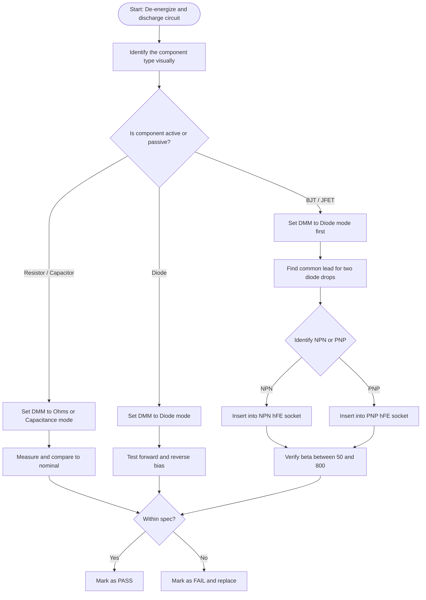
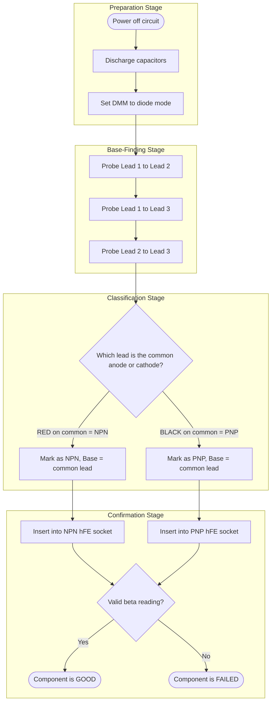
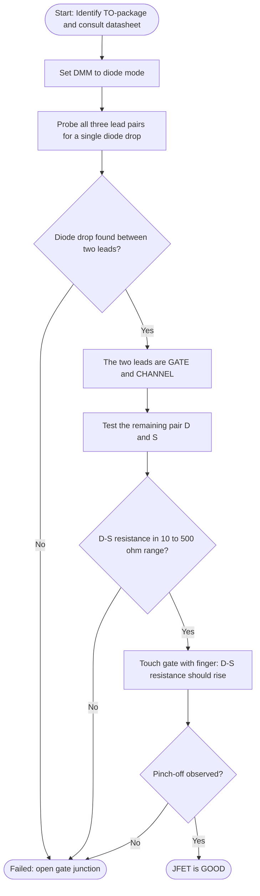
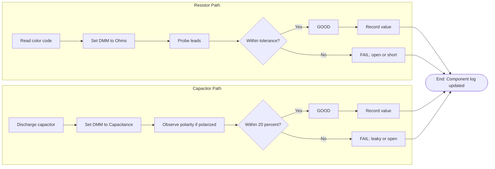

# Testing of electronic components using multimeter - Resistor, Capacitor, Diode, Transistor and JFET

<!-- SECTION_1_START -->
# Testing Electronic Components Using a Multimeter

## 1. Core Technical Definition & Intuitive Overview

### 1.1 Formal Definition (KTU 2024 Syllabus Terminology)

A **multimeter** (Volt-Ohm-Milliammeter, VOM) is a multifunctional bench/handheld instrument used to measure at least three fundamental electrical quantities: **voltage (V)**, **current (A)**, and **resistance ($\Omega$)**. Modern **Digital Multimeters (DMMs)** additionally measure capacitance, frequency, continuity, diode forward voltage ($V_F$), and small-signal transistor current gain ($h_{FE}$ or $\beta$).

In the context of the GZESL106 workshop, *component testing* refers to the systematic application of a multimeter in its **passive mode** (no external source applied) to verify the **functional health, polarity, and approximate value** of discrete electronic components: **Resistors, Capacitors, Diodes, BJTs, and JFETs**.

> [!IMPORTANT]
> **KTU 2024 Highlight — Module 4 (Component Testing)**
> Testing is performed on **de-energized / un-soldered components** wherever practical. The multimeter itself injects a small internal test current (typically $200\mu A$ to $1mA$ in the $\Omega$ range, and $\approx 2.5V$ in diode-test mode) sufficient to bias the junctions of active devices without external power.

### 1.2 Conceptual Analogy — "The Doctor's Stethoscope"

Think of a multimeter as a **stethoscope for electronic components**:
- A **resistor** is like a *narrow water pipe*. The multimeter pushes a tiny current through it and measures the opposition (resistance) — the narrower the pipe, the higher the reading.
- A **capacitor** is a *miniature rechargeable tank*. The multimeter fills it and watches how quickly it fills (capacitance) and how well it holds the charge (leakage).
- A **diode** is a *one-way swinging door*. The multimeter pushes from both sides to see if the door swings open in only one direction.
- A **BJT transistor** is a *valve with two chambers (Base, Emitter)* and a *main pipe (Collector)*. A small current at the base (key) releases a larger current through the main pipe.
- A **JFET** is a *voltage-controlled squeeze valve*. Zero voltage on the gate lets current flow freely; a reverse voltage *squeezes* the channel until the current stops.

> [!NOTE]
> **Standard Metrics Used in This Module**
> - **Silicon diode forward drop**: $V_F \approx 0.6V$ to $0.7V$
> - **Germanium diode forward drop**: $V_F \approx 0.2V$ to $0.3V$
> - **Schottky diode forward drop**: $V_F \approx 0.15V$ to $0.4V$
> - **Typical DMM diode test source current**: $\mathbf{1\,mA}$ to $\mathbf{5\,mA}$
> - **Typical DMM resistance test source**: $\mathbf{200\mu A}$ to $\mathbf{1\,mA}$ (varies by range)

### 1.3 GeoGebra / Desmos Visualization Control

> [!VISUALIZATION CONTROL]
> **Concept:** Diode I-V characteristic curve showing multimeter test points
> **GeoGebra / Desmos Input Equations:**
> - Shockley: $f(x) = I_S \cdot (e^{x/(n \cdot V_T)} - 1)$ with $I_S = 1 \times 10^{-12}$, $n=2$, $V_T = 0.026$
> - Test points: $(0.6, 0.001)$ and $(0.7, 0.01)$
> - Reverse region: $f(x) = -10^{-9}$ for $x < 0$
> **Visual Description:** Observe the exponential forward-bias rise crossing the $0.6V$ to $0.7V$ threshold at typical multimeter test current. The flat line in the negative-x region represents the reverse leakage (ideally zero), confirming a healthy junction.

<!-- SECTION_1_END -->

<!-- SECTION_2_START -->
# 2. Deep Theoretical Analysis & KTU High-Yield Formula Sheet

## 2.1 The Multimeter — Operating Principle

A DMM uses a **dual-slope integrating ADC** to digitize analog inputs. For passive testing:
- **Resistance mode** sources a known reference current $I_{ref}$ through the component and converts the developed voltage $V_x$ into a resistance using Ohm's law:
$$R_x = \dfrac{V_x}{I_{ref}}$$
- **Diode mode** sources $\approx 2.5V$ through an internal resistor, limiting current to a safe value (usually $1mA$ to $5mA$), and reads the junction forward voltage at that current.
- **Capacitance mode** applies a known AC test signal, measures the resulting reactance, and solves for $C$:
$$C = \dfrac{1}{2\pi f_{test} \cdot X_C}$$
- **Continuity mode** beeps when $R < \mathbf{30\Omega}$ to $\mathbf{50\Omega}$ (a short-circuit indicator).

## 2.2 Theoretical Basis for Each Component Test

### 2.2.1 Resistor Testing
- A **healthy resistor** is a pure ohmic device. The measured value must fall within the **tolerance band** of the color-coded nominal value.
- Standard tolerance series: **E12 (10%), E24 (5%), E48 (2%)**.
- A reading of **$0\Omega$** indicates a **short circuit (failed)**, while **$OL$ (overload / open loop)** indicates a **burnt-open (failed)**.
- Wirewound and fusible resistors may show small inductive kick — use **resistance mode, not continuity**, to obtain the DC value.

### 2.2.2 Capacitor Testing
- A healthy capacitor is an **open circuit to DC** in steady state but accepts charge transiently. A DMM in resistance mode will briefly show a low value that climbs to **$OL$** as the capacitor charges.
- The **charge time constant** is $\tau = R_{int} \cdot C$, where $R_{int}$ is the meter's internal source resistance (typically $1M\Omega$).
- **Polarized electrolytic capacitors** must be observed with correct polarity when measuring capacitance. A reversed connection may cause erroneous low readings or, in old units, damage.
- For **in-circuit testing**, parallel circuit paths can mask the result — always **de-solder one leg** for accurate capacitance.

### 2.2.3 Diode Testing
- The multimeter applies a small forward current and reads the **forward voltage drop $V_F$**.
- A good silicon junction shows $V_F \approx \mathbf{0.5V}$ to $\mathbf{0.8V}$.
- Reverse-biased: reads **$OL$** (no conduction).
- A shorted diode reads **$\approx 0V$ in both directions**.
- An open diode reads **$OL$ in both directions**.
- **LEDs** show a higher forward drop ($1.8V$ to $3.5V$) depending on color; DMM diode-test current may be insufficient to light a high-$V_F$ white or blue LED.

### 2.2.4 BJT (NPN / PNP) Testing
- A BJT contains two back-to-back **PN junctions**: **Base-Emitter (B-E)** and **Base-Collector (B-C)**.
- Each junction behaves exactly like a diode when tested independently with the multimeter.
- **NPN**: Both junctions read as diodes with **Anode at Base**.
- **PNP**: Both junctions read as diodes with **Cathode at Base**.
- **Identification procedure**:
  1. Find the lead common to both diode readings — that is the **Base**.
  2. With **RED probe on Base** and the other two leads reading $\approx 0.6V$, the device is **NPN**.
  3. With **BLACK probe on Base** and the other two leads reading $\approx 0.6V$, the device is **PNP**.
- The **$h_{FE}$ socket** of the DMM applies $I_B \approx 10\mu A$ and $V_{CE} \approx 2.5V$, then displays $\beta = I_C / I_B$. A healthy small-signal BJT shows $\beta$ between **$50$ and $800$**.

### 2.2.5 JFET Testing
- A JFET has a single **PN junction** between the **Gate (G)** and the **Channel (D-S)**.
- The channel between **Drain (D)** and **Source (S)** is a **voltage-controlled resistor** controlled by $V_{GS}$.
- **With $V_{GS} = 0$** (gate open or shorted to source), the channel is fully ON — D-S resistance is low ($\mathbf{10\Omega}$ to $\mathbf{500\Omega}$ for small-signal JFETs).
- **With $V_{GS}$ negative** (gate reverse-biased), the channel pinches off.
- A healthy JFET shows:
  - **Gate to Channel** — one diode drop in one direction, **$OL$** in the other (this identifies the **Gate**).
  - **D to S** — low resistance ($\mathbf{10\Omega}$ to $\mathbf{500\Omega}$).
  - Touching the gate with a finger or a charged probe will **slightly modulate** the D-S resistance (the "pinch-off touch test").
- A shorted JFET shows $0\Omega$ between D and S; an open one shows $OL$.

## 2.3 KTU High-Yield Formula Sheet

| Parameter / Quantity | Symbol | Formula or Typical Value | Units | Test Mode on DMM |
|---|---|---|---|---|
| Ohm's law | $V = IR$ | $V_x = I_{ref} \cdot R_x$ | $V, A, \Omega$ | Resistance |
| Diode equation | $I = I_S(e^{V/nV_T}-1)$ | $V_F \approx 0.7V$ for Si | $V$ | Diode |
| Thermal voltage | $V_T$ | $V_T = kT/q \approx 25.85\,mV$ @ $300K$ | $V$ | — |
| Charge time constant | $\tau$ | $\tau = R_{int} \cdot C$ | $s$ | Resistance (charge test) |
| Capacitive reactance | $X_C$ | $X_C = 1/(2\pi f C)$ | $\Omega$ | Capacitance |
| Transistor DC gain | $h_{FE}$ | $h_{FE} = I_C / I_B$ | dimensionless | $h_{FE}$ socket |
| Resistor color code | $R$ | $R = (ab \times 10^c) \pm tol\,\%$ | $\Omega$ | Resistance |
| JFET pinch-off | $V_P$ | $V_P \approx -2V$ to $-8V$ (typical) | $V$ | Resistance + finger test |
| Continuity threshold | $R_{th}$ | $R_{th} < 30\Omega$ to $50\Omega$ | $\Omega$ | Continuity (beep) |

> [!NOTE]
> **Engineering Utility**
> Multimeter-based component testing is the **first-line quality check** in PCB prototyping, repair workshops, and incoming-material inspection. It precedes more expensive tests like curve-tracing ($I$-$V$ plots), LCR-meter measurement, or oscilloscope probing. A skilled technician can identify and reject $>90\%$ of faulty discrete components in under a minute using only a DMM.

<!-- SECTION_2_END -->

<!-- SECTION_3_START -->
# 3. Step-by-Step Testing Procedures (Workshop Execution Matrix)

## 3.1 Pre-Test Safety & Setup (Common to All Components)

> [!WARNING]
> **Workshop Safety Mandate**
> 1. **Ensure the circuit is DE-ENERGIZED** — disconnect power, remove batteries, unplug mains.
> 2. For in-circuit testing, **discharge all capacitors** using a $1k\Omega$ bleed resistor across the terminals. A charged electrolytic can damage the DMM or deliver a shock.
> 3. **Inspect component leads** for corrosion, broken strands, or solder bridges before testing.
> 4. Use **ESD-safe handling** for active devices (BJTs, JFETs, MOSFETs) — wear a grounded wrist strap.

## 3.2 Resistor Testing — Full Procedure

| Step | Action | Expected Healthy Reading | Failed Indication |
|---|---|---|---|
| 1 | Identify nominal value from color code (4-band or 5-band) | e.g., Red-Violet-Orange-Gold $\to 27k\Omega \pm 5\%$ | — |
| 2 | Insert **RED probe** into $V\Omega$ socket, **BLACK probe** into **COM** | — | — |
| 3 | Set DMM dial to $\Omega$ range, starting at **$20k\Omega$** | — | — |
| 4 | Touch probes together to **zero the meter** (for analog) | $0.00\Omega$ (digital auto-zeros) | — |
| 5 | Place probes across the resistor leads (no polarity for non-inductive resistors) | $26.0k\Omega$ to $28.3k\Omega$ | — |
| 6 | Compare measured value to nominal $\pm$ tolerance | Within band | Reading $\approx 0\Omega$ or **$OL$** = failed |
| 7 | For low-ohm resistors ($<10\Omega$), use **4-wire Kelvin sensing** if available | $R \pm 5\%$ | — |

## 3.3 Capacitor Testing — Full Procedure

| Step | Action | Expected Healthy Reading | Failed Indication |
|---|---|---|---|
| 1 | **Discharge** the capacitor with a $1k\Omega$ resistor across the leads for $5$ seconds | $0V$ across leads | Shock hazard if skipped |
| 2 | Set DMM to **Capacitance mode** (denoted $‒\vert‒$ or **$nF/\mu F$**) | — | — |
| 3 | For **non-polarized** (ceramic, film, mica): connect probes either way | Reading within $\pm 20\%$ of marked value | — |
| 4 | For **polarized** (electrolytic, tantalum): **RED = positive**, **BLACK = negative** | $C \pm 20\%$ | Reversed may show error or wrong value |
| 5 | For **in-circuit** capacitors: de-solder at least **one lead** | — | Parallel paths give false readings |
| 6 | **Charge test** (with DMM in $\Omega$ mode): touch probes, observe reading | Briefly low, climbs to **$OL$** | Stays low = **leaky/short**; instantly $OL$ = **open** |

## 3.4 Diode Testing — Full Procedure

| Step | Action | Expected Healthy Reading | Failed Indication |
|---|---|---|---|
| 1 | Set DMM dial to **Diode mode** ($\rightarrow$ symbol) | — | — |
| 2 | Connect **RED probe to Anode**, **BLACK probe to Cathode** (forward bias) | $V_F \approx 0.5V$ to $0.8V$ (Si) | $0V$ = shorted; $OL$ = open |
| 3 | Reverse the probes (reverse bias) | **$OL$** (no conduction) | Reading below $2V$ = leaky |
| 4 | Identify the **cathode band** marking on the body | Matches the **$OL$** direction | — |
| 5 | For **Zener diodes**, $V_F$ test is valid; use a regulated supply to verify $V_Z$ | $V_F$ matches Si, reverse stays $OL$ below $V_Z$ | — |
| 6 | For **LEDs**: $V_F \approx 1.8V$ (red) to $3.5V$ (blue/white); LED may glow faintly at $1mA$ | $V_F$ matches color; faint glow | — |

## 3.5 BJT (Bipolar Junction Transistor) Testing — Full Procedure

| Step | Action | Expected Healthy Reading | Failed Indication |
|---|---|---|---|
| 1 | Identify package type (**TO-92, TO-220, SOT-23**) and obtain pinout datasheet | — | — |
| 2 | Set DMM to **Diode mode** | — | — |
| 3 | **Find the Base**: probe each pair of leads with RED on one, BLACK on the other until two **$0.6V$** diode drops are found | Both B-E and B-C read $0.6V$ to $0.7V$ with **RED on Base** = **NPN**; reversed polarity = **PNP** | No two diode drops = not a BJT or damaged |
| 4 | Verify the **third pair** (C-E): both polarities should read **$OL$** (no junction between C and E) | $OL$ in both directions | Low reading = shorted transistor |
| 5 | Insert the transistor into the DMM's **$h_{FE}$ socket** (matching NPN or PNP slot) | $\beta$ displays in the range **$50$ to $800$** | $\beta = 0$ or $OL$ = failed |
| 6 | For unknown devices, try both **NPN and PNP** slots; only one will yield a valid $\beta$ | — | — |

## 3.6 JFET (Junction Field-Effect Transistor) Testing — Full Procedure

| Step | Action | Expected Healthy Reading | Failed Indication |
|---|---|---|---|
| 1 | Obtain the JFET pinout from the datasheet (e.g., **2N3819**: G-D-S; **BF245**: D-G-S) | — | — |
| 2 | Set DMM to **Diode mode** | — | — |
| 3 | Identify the **Gate** by testing all three lead pairs for a single diode drop | One pair reads $\approx 0.5V$ to $0.8V$ in one direction only — that is the **Gate-Channel** PN junction | $0V$ both ways = shorted gate; $OL$ both ways = open |
| 4 | With **Gate identified**, test the **other two leads (D and S)** in both polarities | Low resistance ($\mathbf{10\Omega}$ to $\mathbf{500\Omega}$), nearly equal in both directions (channel is symmetric) | $OL$ = open channel; $0\Omega$ = shorted |
| 5 | **Pinch-off touch test**: leave probes on D and S, then briefly **touch the Gate lead with a finger** or a charged capacitor | D-S resistance **increases** (channel narrows) — confirms JFET action | No change = faulty gate junction |
| 6 | For an N-channel JFET, a **negative $V_{GS}$** pinches off; for a P-channel, **positive $V_{GS}$** pinches off | — | — |

## 3.7 Worked Example — Identification of an Unknown TO-92 Device

**Problem**: A technician has three loose TO-92 devices labelled A, B, C. Using a DMM in diode mode, the following readings are obtained (RED / BLACK probes $\to$ reading):

| Device | 1-2 | 1-3 | 2-3 |
|---|---|---|---|
| A | 0.65 / $OL$ | $OL$ / 0.65 | $OL$ / $OL$ |
| B | $OL$ / 0.65 | $OL$ / 0.65 | $OL$ / $OL$ |
| C | $OL$ / $OL$ | $OL$ / $OL$ | $OL$ / $OL$ |

**Solution**:

- **Device A**: Two $0.65V$ drops share **Lead 1** as the common (RED) anode. The third pair (2-3) is $OL$. **This is an NPN BJT** with **Base = Lead 1**.
- **Device B**: Two $0.65V$ drops share **Lead 1** as the common (BLACK) cathode. The third pair (2-3) is $OL$. **This is a PNP BJT** with **Base = Lead 1**.
- **Device C**: All pairs read $OL$. **This is NOT a diode or transistor** — most likely a defective component, an open MOSFET, or a non-semiconductor part.

> [!IMPORTANT]
> **Examiner's Tip**: In KTU labs, you will often be given **unmarked TO-92 or TO-220 devices** and asked to identify the type and pinout. Always perform the **base-finding test first**, then confirm with the **$h_{FE}$ socket** measurement. Document the readings in a table exactly as shown above.

<!-- SECTION_3_END -->

<!-- SECTION_4_START -->
# 4. Structural Diagrams & Schematics

## 4.1 Universal Multimeter Testing Workflow

## 4.2 BJT Identification — Sequential Processing Topology

## 4.3 JFET Pinout Verification Flow

## 4.4 Resistor / Capacitor Test Decision Matrix

<!-- SECTION_4_END -->

<!-- SECTION_5_START -->
# 5. KTU 2024 Scheme Examination Question Bank & Topic Recap

## 5.1 Part A — Short Answer Questions (3 Marks Each)

### Question 1
**`[KTU University Exam - Dec 2023, Model Paper]`** **CO1, Remember**

List any **three precautions** you would take before testing an electronic component using a digital multimeter in the workshop.

**Model Answer (Valuation Key):**
1. **Ensure the circuit is completely de-energized** — disconnect from mains, remove batteries, and discharge any capacitors. *[1 Mark]*
2. **Inspect the component leads and DMM probe insulation** for damage to avoid short-circuits and false readings. *[1 Mark]*
3. **Select the correct DMM range and mode** ($\Omega$, diode, or $h_{FE}$) before connecting the probes; start from a higher range and step down if the reading is unstable. *[1 Mark]*

### Question 2
**`[KTU University Exam - July 2024, Model Paper]`** **CO1, Understand**

What is the significance of the **forward voltage drop $V_F$** reading obtained when testing a silicon diode in diode mode, and what range indicates a healthy junction?

**Model Answer (Valuation Key):**
- The forward voltage drop $V_F$ indicates the **junction barrier potential** at the multimeter's test current (typically $1mA$). *[1 Mark]*
- For a **healthy silicon diode**, $V_F$ must lie between **$0.5V$ and $0.8V$** (ideal $\approx 0.7V$). *[1 Mark]*
- Readings outside this range — **$0V$** (shorted) or **$OL$** (open) — indicate a faulty diode. *[1 Mark]*

## 5.2 Part B — Long Answer Questions (14 Marks Each, Internal Choice)

### Question A — Testing of an Unknown Transistor

**`[KTU University Exam - Dec 2023]`** **CO2, Apply / Analyze**

> **a)** Describe, with a neat tabular procedure, the **step-by-step method to identify the type (NPN or PNP) and the base terminal of an unmarked TO-92 transistor** using a digital multimeter in diode mode. *(7 Marks)*

> **b)** Explain how the **$h_{FE}$ socket** of a DMM is used to confirm the identified transistor's health, and state the typical $\beta$ range for a healthy small-signal silicon BJT. *(7 Marks)*

**Model Answer:**

**Part (a) — Identification Procedure** *[7 Marks]*

| Step | Probe Pair (RED / BLACK) | Expected Reading if Common Lead is Base | Inference |
|---|---|---|---|
| 1 | Lead 1 / Lead 2 | $V_F$ drop $\approx 0.65V$ | Possible Base = Lead 1 |
| 2 | Lead 1 / Lead 3 | $V_F$ drop $\approx 0.65V$ | Confirms commonality at Lead 1 |
| 3 | Lead 2 / Lead 3 | **$OL$** in both polarities | No C-E junction; confirms BJT |
| 4 | Reverse probes (BLACK on Lead 1) | Both should be **$OL$** | Confirms NPN with Base = Lead 1 |

- **Marking scheme**: Steps and tabular presentation — $4$ Marks; Conclusion (NPN with Base = Lead 1) — $2$ Marks; Justification of why the third pair shows $OL$ — $1$ Mark.

**Part (b) — $h_{FE}$ Confirmation** *[7 Marks]*

- The $h_{FE}$ socket provides a small base current $I_B \approx 10\mu A$ and a fixed $V_{CE} \approx 2.5V$. The DMM measures the resulting $I_C$ and computes $\beta = I_C / I_B$. *[2 Marks for stating the principle]*
- The transistor is inserted with its identified Base, Collector, and Emitter pins matched to the socket labels (NPN slot or PNP slot). *[1 Mark for insertion procedure]*
- A healthy small-signal silicon BJT displays a $\beta$ value typically in the range **$50$ to $800$**, with most general-purpose devices in the **$100$ to $400$** range. *[2 Marks for the range]*
- A reading of **$0$** or **$OL$** indicates a faulty transistor; a $\beta$ reading requires **rechecking the pin identification** if both slots give nonsensical values. *[2 Marks for failure interpretation]*

### Question B — Capacitor and JFET Testing

**`[KTU University Exam - July 2024]`** **CO2, Apply / Analyze**

> **a)** Outline the **charge-discharge test** for verifying a healthy electrolytic capacitor using a DMM in resistance mode. What indicates leakage versus open-circuit failure? *(7 Marks)*

> **b)** Describe the **multimeter test procedure for a JFET**, including how the Gate is identified and how the pinch-off effect can be demonstrated without an external power supply. *(7 Marks)*

**Model Answer:**

**Part (a) — Charge-Discharge Test for Electrolytic Capacitor** *[7 Marks]*

- The capacitor is first **discharged** using a $1k\Omega$ bleed resistor. *[1 Mark]*
- The DMM is set to a **high resistance range** (e.g., $200k\Omega$ or $2M\Omega$); analog DMMs are preferred for visual needle swing. *[1 Mark]*
- The probes are connected with **RED on the positive** terminal of the (polarized) electrolytic capacitor. *[1 Mark]*
- A healthy capacitor causes the reading to **start low** (high initial current) and **climb steadily** to **$OL$** as the capacitor charges through the DMM's internal source resistance. *[2 Marks for the transient response]*
- **Leaky capacitor**: the reading settles at a **finite low value** (e.g., $50k\Omega$ to $500k\Omega$) and never reaches $OL$. *[1 Mark]*
- **Open capacitor**: the reading jumps to **$OL$** immediately with no transient. *[1 Mark]*

**Part (b) — JFET Multimeter Test Procedure** *[7 Marks]*

- Set the DMM to **diode mode**. *[1 Mark]*
- Probe all three lead pairs to locate the **Gate-Channel PN junction**, which will show a single $V_F$ drop of $\approx 0.5V$ to $0.8V$ in one direction only. The other two leads are **Drain and Source**. *[2 Marks]*
- Test the **D-S pair** in both polarities — expect a low symmetric resistance in the **$10\Omega$ to $500\Omega$** range (the channel is a symmetric resistor when $V_{GS}=0$). *[1 Mark]*
- **Pinch-off demonstration**: while keeping the probes on D and S, briefly **touch the Gate lead with a finger** (or briefly contact a charged capacitor). The body's static charge applies a small $V_{GS}$, causing the D-S resistance to **rise noticeably**. *[2 Marks]*
- A shorted JFET shows $0\Omega$ between D and S; an open JFET shows $OL$ between G and channel in both polarities. *[1 Mark]*

> [!WARNING]
> **KTU Examiner's Valuation Warning — Common Pitfalls**
> 1. **Failing to discharge capacitors** before testing is the #1 cause of multimeter fuse blowouts in KTU labs. Always use a $1k\Omega$ bleed resistor, never a screwdriver (spark hazard).
> 2. **Confusing the C-E reading**: many students panic when the third pair of a BJT reads $OL$ and conclude the device is faulty. **The C-E pair MUST read $OL$ in both directions for a healthy BJT** — this proves there is no internal connection between Collector and Emitter.
> 3. **Reversing polarity for polarized capacitors** during capacitance-mode testing yields incorrect readings and may damage old electrolytics. Observe the **stripe = negative** marking.
> 4. **In-circuit testing** of resistors and capacitors is unreliable due to parallel paths. Always de-solder at least one leg for an accurate measurement if in doubt.
> 5. **JFET gate touch test sensitivity**: if the room has very low humidity or the technician is grounded, the pinch-off may be subtle. Repeat the test with a **charged $100nF$ capacitor** touched to the gate for a stronger demonstration.

## 5.3 Topic Recap & Important Things to Remember

- **Multimeter modes essential for component testing**: $\Omega$ (resistance), $\rightarrow$ (diode), $- \vert -$ (capacitance), $h_{FE}$ (transistor gain), and **continuity** (beep).
- **Resistor**: Compare measured value to color-coded nominal $\pm$ tolerance. Open = $OL$, Short = $0\Omega$.
- **Capacitor (non-polarized)**: Probes either way; expect a value within $\pm 20\%$ of the marked rating. **Charge test**: low $\to$ $OL$ in resistance mode.
- **Capacitor (polarized)**: RED to **+** terminal, BLACK to **−** terminal. Reverse may damage the capacitor.
- **Diode**: Forward-biased $V_F \approx 0.6V$ to $0.7V$ (Si). Reverse-biased = $OL$. Shorted = $0V$. Open = $OL$ in both polarities.
- **LED**: Higher $V_F$ ($1.8V$ to $3.5V$ depending on color). May faintly glow under DMM diode test.
- **BJT (NPN)**: Two diode drops with **RED probe on Base**, third pair (C-E) reads $OL$.
- **BJT (PNP)**: Two diode drops with **BLACK probe on Base**, third pair (C-E) reads $OL$.
- **$h_{FE}$ range for healthy BJT**: $\mathbf{50 \leq \beta \leq 800}$.
- **JFET Gate identification**: Single $V_F$ drop between Gate and Channel in one direction only.
- **JFET D-S resistance** with $V_{GS} = 0$: $\mathbf{10\Omega}$ to $\mathbf{500\Omega}$ (low and symmetric).
- **JFET pinch-off touch test**: Touching the gate increases D-S resistance — confirms voltage-controlled channel.
- **Safety priority order**: **De-energize $\to$ Discharge $\to$ Inspect $\to$ Select Mode $\to$ Probe**.
- **Always de-solder one leg of in-circuit components** to avoid misleading readings from parallel paths.
- **Document all readings in a tabular format** — examiners award marks for systematic presentation, not just final values.

<!-- SECTION_5_END -->
