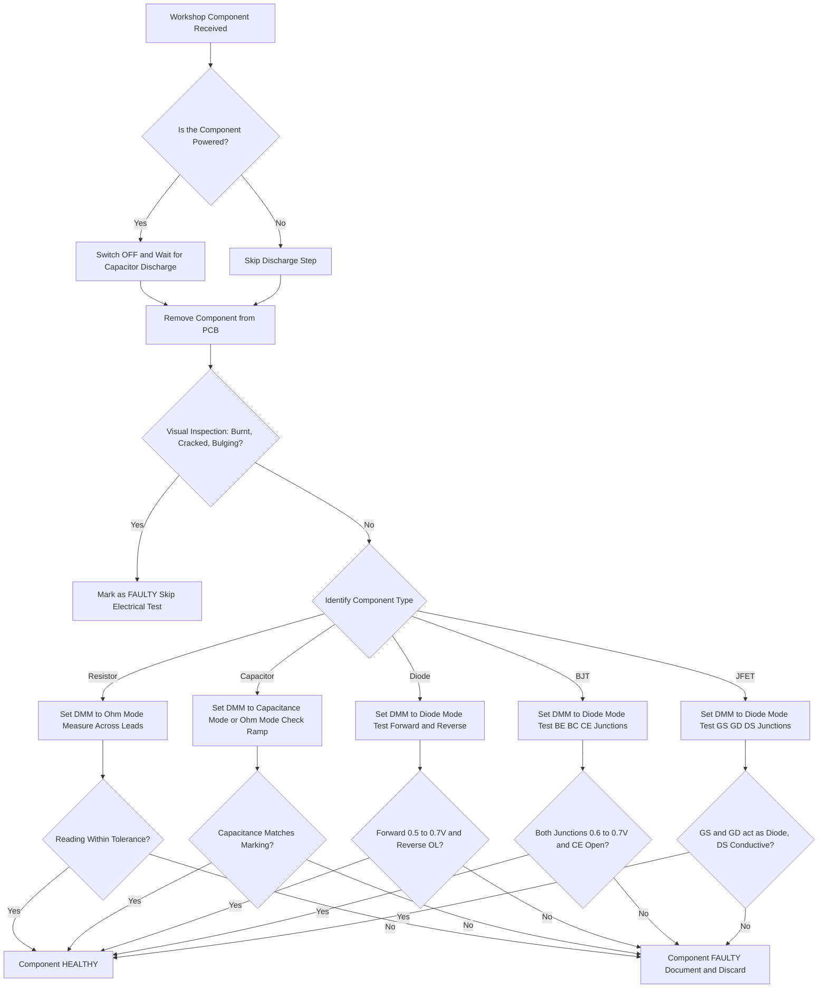
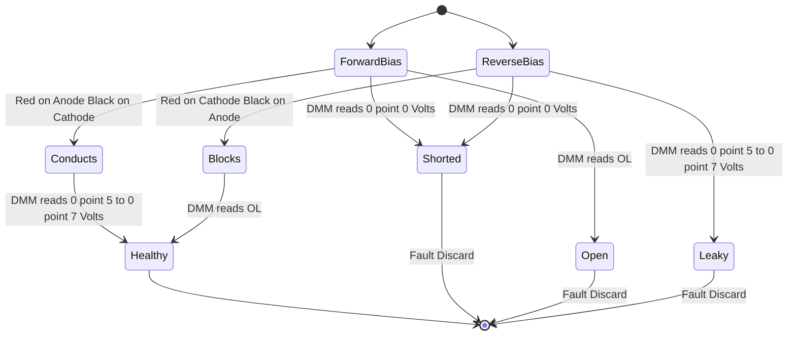
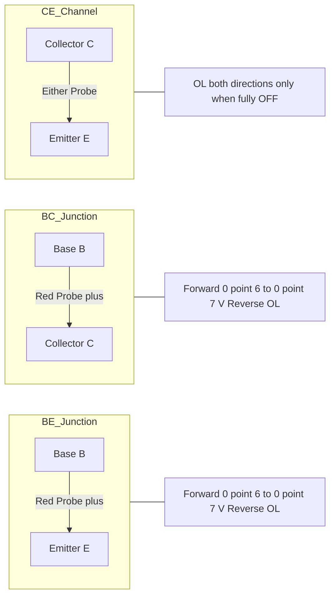
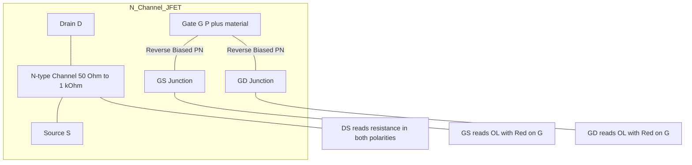
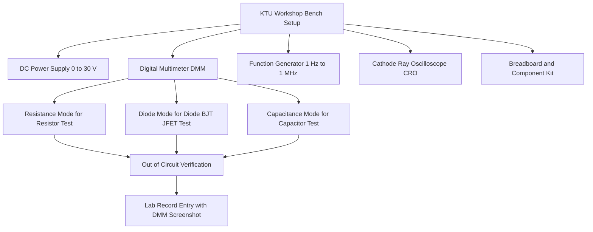

# Testing of electronic components using multimeter - Resistor, Capacitor, Diode, Transistor and JFET.

<!-- SECTION_1_START -->
# Testing of Electronic Components Using Multimeter

## 1.1 Definition and Overview

A **Digital Multimeter (DMM)** is a versatile electronic test instrument used to measure voltage, current, and resistance with high accuracy. For a basic electronics workshop, the DMM serves as the primary diagnostic tool for verifying the health of discrete components: **resistors, capacitors, diodes, BJTs, and JFETs**, before they are soldered into a circuit.

> [!IMPORTANT]
> **KTU 2024 Scheme Definition:** *Testing of electronic components using a multimeter is the process of applying controlled voltage/current stimuli through the meter's probes and interpreting the resulting resistance, voltage drop, or continuity reading to confirm whether the component is healthy (functioning as per datasheet), open-circuited, or short-circuited.*

## 1.2 Conceptual Analogy / Intuition

Think of a multimeter as a **"doctor for electronic components"**:
- **Resistance mode (Ω)** acts like a "stethoscope" checking how easily current flows.
- **Diode mode (▶|)** sends a small current and measures the voltage drop — similar to checking a **one-way valve**: water should flow one way and be blocked the other.
- **Continuity mode (•)))** is the "heartbeat monitor" — it beeps when a complete path exists.

A healthy component behaves like a **properly trained toll gate**: it charges a fixed fee (forward voltage drop) in one direction and refuses entry (open circuit / OL) in the other.

> [!NOTE]
> **Physical Constant Used:** Standard silicon diode forward voltage drop **$V_F \approx 0.6\text{ V to } 0.7\text{ V}$** at room temperature. Germanium diodes show **$V_F \approx 0.2\text{ V to } 0.3\text{ V}$**.

## 1.3 Types of Multimeters Used in KTU Workshops

| Multimeter Type | Symbol | Resolution | Workshop Use |
|:---|:---:|:---:|:---|
| Analog VOM (Volt-Ohm-Milliammeter) | VOM | Low (pointer scale) | Obsolete, only for demonstrations |
| **Digital Multimeter (DMM)** | DMM | **High (3.5 to 4.5 digit)** | **Standard KTU lab equipment** |
| Auto-ranging DMM | DMM | Auto | Premium lab use, fastest testing |

> [!TIP]
> Always set the multimeter to the correct mode **before** touching the probes to the component. Reversing connections in resistance or diode mode is generally safe, but the reading direction matters for polarized components (diodes, transistors, capacitors).

<!-- SECTION_1_END -->

<!-- SECTION_2_START -->
# Deep Theoretical Analysis & KTU High-Yield Formula Sheet

## 2.1 Operating Principle of DMM in Component Testing

A DMM in **Resistance / Diode / Continuity mode** injects a small constant test current $I_{test}$ (typically **$0.5\text{ mA to } 1\text{ mA}$**) through the component under test (CUT) and measures the resulting voltage drop. The internal ADC then converts this into an $\Omega$ or Volt reading.

The fundamental Ohm's law governs the display:

$$V_{measured} = I_{test} \times R_{component}$$

For semiconductor junctions (diode, BJT, JFET), the current-voltage relationship follows the **Shockley diode equation**:

$$I_D = I_S \left( e^{\frac{V_D}{n V_T}} - 1 \right)$$

where:
- $I_S$ = reverse saturation current (typically $\text{nA}$ for Si)
- $n$ = ideality factor (1 to 2)
- $V_T = \frac{kT}{q} \approx 25.85\text{ mV}$ at **$T = 300\text{ K}$**

> [!NOTE]
> At test currents of $1\text{ mA}$, a healthy silicon junction will display a forward voltage of approximately $0.6\text{ V to } 0.7\text{ V}$. This is the "fingerprint" used in workshop testing.

## 2.2 KTU High-Yield Formula & Reading Cheat Sheet

| Component | Probe Connection (Red / Black) | Healthy Reading | Fault Indication |
|:---|:---:|:---:|:---|
| **Resistor** | Across two leads (no polarity) | $\Omega$ value $\pm$ tolerance (e.g., $4.7\text{ k}\Omega \pm 5\%$) | **$0\ \Omega$** = shorted; **$OL$ / $\infty$** = open |
| **Capacitor (non-polar)** | Across two leads | Briefly low $\Omega$, then ramps to **$OL$** | **$0\ \Omega$** = shorted; **$OL$** instantly (no ramp) = open |
| **Capacitor (electrolytic)** | Red to **+**, Black to **$-$** | Charging ramp to **$OL$** | **$0\ \Omega$** = short; leakage $\text{M}\Omega$ range = dried out |
| **Diode (Si)** | Red to **Anode (A)**, Black to **Cathode (K)** | **$0.5\text{ V to } 0.7\text{ V}$** (forward) | Reverse should show **$OL$** |
| **Diode (Ge)** | Red to A, Black to K | **$0.2\text{ V to } 0.3\text{ V}$** (forward) | Reverse should show **$OL$** |
| **BJT (NPN)** B-E | Red to B, Black to E | **$0.6\text{ V to } 0.7\text{ V}$** | Reverse: **$OL$** |
| **BJT (NPN)** B-C | Red to B, Black to C | **$0.6\text{ V to } 0.7\text{ V}$** | Reverse: **$OL$** |
| **BJT (NPN)** C-E | Either polarity | **$OL$** | **$0\ \Omega$** = shorted |
| **JFET** G-S / G-D | Red to G, Black to S or D | **$OL$** (depletion device, gate reverse) | Forward: **$0.5\text{ V}$ to **$0.7\text{ V}$** = damaged |

> [!WARNING]
> **OL** in KTU answer scripts means **"Over Limit"** or **"Open Loop"** — the meter displays this when the resistance exceeds its maximum range (typically $> 10\text{ M}\Omega$). Always write **"OL"** or **"$\infty$"**, never just "no reading".

## 2.3 Engineering Utility in Real-World Systems

In production environments (e.g., smartphone PCB repair at Apple service centers, automotive ECU repair at Bosch labs), this exact DMM-based testing forms the **first 80% of fault diagnosis**, long before an oscilloscope is connected. Field engineers carry only a DMM; therefore, the KTU workshop curriculum deliberately emphasizes these bench-top diagnostics as a transferable industrial skill.

<!-- SECTION_2_END -->

<!-- SECTION_3_START -->
# Step-by-Step Testing Procedures

## 3.1 Pre-Test Safety & Setup Protocol

> [!IMPORTANT]
> **MANDATORY Safety Steps (KTU Workshop Rule):**
> 1. **Always switch OFF** the circuit power and **discharge** any electrolytic capacitor before testing.
> 2. **Remove the component from the PCB** (out-of-circuit testing) for accurate readings. In-circuit testing gives parallel paths and false readings.
> 3. Inspect component visually first — burnt smell, bulging capacitor tops, or cracked bodies indicate fault without test.
> 4. Wear **anti-static wrist strap** when handling MOSFETs and JFETs (they are ESD-sensitive).

## 3.2 Test 1: Resistor Testing

**Required Tools:** DMM set to **$\Omega$ / Resistance mode**, color code chart, datasheet.

| Step | Action | Expected DMM Reading |
|:---:|:---|:---:|
| 1 | Select appropriate $\Omega$ range (e.g., $20\text{ k}\Omega$ for a $4.7\text{ k}\Omega$ resistor) | — |
| 2 | Touch probes together (short leads) to verify zero calibration | $\approx 0\ \Omega$ |
| 3 | Connect Red probe to lead-1, Black probe to lead-2 | $4.7\text{ k}\Omega \pm 5\%$ |
| 4 | Reverse probe polarity and re-measure | Same $4.7\text{ k}\Omega$ (resistors are non-polar) |
| 5 | Compare with color code / SMD marking / datasheet | Within tolerance band |

**Decision Logic:**
- Reading matches color code within tolerance → **HEALTHY**
- Reading shows **$0\ \Omega$** → **SHORT-CIRCUITED (failed)**
- Reading shows **$OL$** → **OPEN-CIRCUITED (burnt out)**
- Reading is erratic when probes are wiggled → **Solder-joint or carbon-track failure**

## 3.3 Test 2: Capacitor Testing (Out-of-Circuit)

**Required Tools:** DMM with **capacitance mode ($-\!\!\!\vert\!\!\!\vert-$)** or analog-style $\Omega$ charging test.

> [!NOTE]
> Modern KTU lab DMMs (e.g., Fluke 87V, Meco 108) include a dedicated capacitance mode. Otherwise, the **$\Omega$ charging test** described below works for electrolytics $> 1\ \mu\text{F}$.

### Procedure A: Using DMM Capacitance Mode (preferred)

| Step | Action | Expected Reading |
|:---:|:---|:---:|
| 1 | Discharge capacitor by shorting leads with an insulated screwdriver | $0\ \text{V}$ across terminals |
| 2 | Rotate DMM dial to **$-\!\!\!\vert\!\!\!\vert-$** (capacitance) symbol | — |
| 3 | Insert capacitor leads into the **$C_x$** jack (or use probes across leads) | Numerical $\mu\text{F}$ or $\text{nF}$ value |
| 4 | Compare with the printed value on the body (e.g., $470\ \mu\text{F}/25\text{V}$) | Within $\pm 20\%$ (typical electrolytic tolerance) |

### Procedure B: $\Omega$ Charging Test (for electrolytic capacitors)

| Step | Action | Expected DMM Reading |
|:---:|:---|:---:|
| 1 | Set DMM to a high $\Omega$ range (e.g., $20\text{ M}\Omega$) | — |
| 2 | Connect **Red probe** to **positive (long lead)**, **Black probe** to **negative (short lead / stripe)** | — |
| 3 | Observe the display the instant probes touch | Reading starts **LOW** ($\sim$ few hundred $\text{k}\Omega$) |
| 4 | Watch the display over $2\text{–}5\text{ seconds}$ | Reading **ramps UP** gradually to **$OL$** |
| 5 | Reverse probes and test again | A healthy polarized capacitor shows the same ramp behavior |

**Fault Indicators:**
- **Instantly $0\ \Omega$** in either direction → **SHORTED** (dielectric breakdown)
- **Instantly $OL$** with no ramp → **OPEN** (dried-out electrolyte)
- **Reading stays at some $\text{k}\Omega$** value and does not ramp → **LEAKY** (equivalent series resistance too high)
- For non-polar ceramic / film capacitors: charging ramp is too fast to see — rely on capacitance mode

## 3.4 Test 3: Diode Testing

**Required Tools:** DMM set to **Diode mode (▶|)**, datasheet.

| Step | Action | Expected DMM Reading |
|:---:|:---|:---:|
| 1 | Rotate DMM dial to **▶|** symbol (diode test mode) | — |
| 2 | Identify the **Cathode (K)** — marked by a **silver band** on the body | — |
| 3 | **Forward Bias Test:** Red probe (anode +) on the **Anode**, Black probe (cathode $-$) on the **Cathode** (banded end) | $0.5\text{ V to } 0.7\text{ V}$ (Si) or $0.2\text{ V to } 0.3\text{ V}$ (Ge) |
| 4 | **Reverse Bias Test:** Reverse the probes (Red on Cathode, Black on Anode) | **$OL$** (open loop) |
| 5 | Compare both readings with the table in Section 2.2 | Match → HEALTHY |

**Fault Indicators:**
- **$0\ \text{V}$ in both directions** → **SHORT-CIRCUITED**
- **$OL$ in both directions** → **OPEN-CIRCUITED**
- **$1.5\text{ V to } 2\ \text{V}$** in forward direction → **Leaky / High forward drop (aged diode)**
- For **Zener diodes**: regular diode mode only checks the forward junction; reverse Zener voltage requires a variable bench power supply.

> [!WARNING]
> Some **LEDs** also read **$1.7\text{ V to } 2.5\text{ V}$** in forward direction (red, green, blue) — this is NORMAL and not a fault. The multimeter's $1\text{ mA}$ test current is too low to light the LED visibly.

## 3.5 Test 4: BJT (Bipolar Junction Transistor) Testing

**Required Tools:** DMM in **Diode mode (▶|)**, datasheet pinout, **BC547 / SL100 / 2N2222** datasheets are common workshop samples.

> [!NOTE]
> A BJT is essentially **two PN junctions** sharing a common terminal. Testing each junction independently is the standard KTU workshop method.

### Pinout Reference (BC547 — TO-92 package, viewed from flat face)

$$\text{Flat face, left to right: } \textbf{Collector (C)} \;\vert\; \textbf{Base (B)} \;\vert\; \textbf{Emitter (E)}$$

### Step-by-Step Test for NPN Transistor

| Step | Red Probe (Anode +) | Black Probe (Cathode $-$) | Expected Reading | Interpretation |
|:---:|:---:|:---:|:---:|:---|
| 1 | Base (B) | Emitter (E) | $0.6\text{ V to } 0.7\text{ V}$ | B-E junction forward biased ✓ |
| 2 | Emitter (E) | Base (B) | $OL$ | B-E junction reverse biased ✓ |
| 3 | Base (B) | Collector (C) | $0.6\text{ V to } 0.7\text{ V}$ | B-C junction forward biased ✓ |
| 4 | Collector (C) | Base (B) | $OL$ | B-C junction reverse biased ✓ |
| 5 | Collector (C) | Emitter (E) | $OL$ | No intrinsic conduction C-E ✓ |
| 6 | Emitter (E) | Collector (C) | $OL$ | No intrinsic conduction E-C ✓ |

> [!TIP]
> **NPN Identification Trick (KTU Exam Favorite):** Whichever terminal reads $0.6\text{ V to } 0.7\text{ V}$ to **BOTH** other terminals in forward bias is the **BASE** of an **NPN** transistor. If the BASE is on the BLACK probe in forward bias for both junctions, it is a **PNP** transistor.

### PNP Transistor Test (e.g., BC557)

For PNP, the directions in steps 1 and 3 above are **reversed**: Red probe on Emitter/Collector, Black probe on Base gives $0.6\text{ V to } 0.7\text{ V}$.

**Fault Indicators for BJT:**
- Any junction reads **$0\ \text{V}$** both ways → **SHORTED junction**
- Any junction reads **$OL$** both ways → **OPEN junction**
- C-E reads a low $\Omega$ value → **Collector-Emitter punch-through / short**

## 3.6 Test 5: JFET (Junction Field Effect Transistor) Testing

**Required Tools:** DMM in **Diode mode (▶|)**, datasheet (e.g., **BFW11 / 2N3819 / MPF102** are common workshop samples).

> [!IMPORTANT]
> **KTU Key Concept:** A JFET is a **voltage-controlled resistor** with a **reverse-biased PN junction** between the **Gate (G)** and the **Channel (D-S)**. Therefore, the Gate-to-Source (G-S) and Gate-to-Drain (G-D) junctions behave like a **diode**, while the Drain-to-Source (D-S) channel behaves like a **resistor**.

### Pinout Reference (2N3819 / MPF102 — TO-92 package)

$$\text{Flat face, left to right: } \textbf{Drain (D)} \;\vert\; \textbf{Source (S)} \;\vert\; \textbf{Gate (G)}$$

> [!CAUTION]
> For some JFETs (e.g., BF245), the pinout differs. Always verify with the datasheet.

### Step-by-Step Test Procedure

| Step | Red Probe (Anode +) | Black Probe (Cathode $-$) | Expected Reading (N-channel JFET) | Interpretation |
|:---:|:---:|:---:|:---:|:---:|
| 1 | Gate (G) | Source (S) | **$OL$** | G-S junction reverse biased ✓ |
| 2 | Source (S) | Gate (G) | $0.5\text{ V to } 0.7\text{ V}$ | G-S junction forward biased ✓ |
| 3 | Gate (G) | Drain (D) | **$OL$** | G-D junction reverse biased ✓ |
| 4 | Drain (D) | Gate (G) | $0.5\text{ V to } 0.7\text{ V}$ | G-D junction forward biased ✓ |
| 5 | Drain (D) | Source (S) | $50\ \Omega$ to $1\text{ k}\Omega$ (channel resistance $R_{DS}$) | Conductive channel ✓ |
| 6 | Source (S) | Drain (D) | Same as Step 5 (channel is symmetric) | Channel is bidirectional ✓ |

> [!NOTE]
> For a **P-channel JFET**, the polarity in Steps 1–4 is reversed: Red on G reads $0.6\text{ V to } 0.7\text{ V}$ to both S and D, while Black on G reads **$OL$**.

**Fault Indicators for JFET:**
- G-S or G-D reads **$OL$ in BOTH polarities** → **Gate open-circuited (failed)**
- G-S or G-D reads **$0\ \text{V}$ in BOTH polarities** → **Gate shorted (failed)**
- D-S reads **$OL$ in both directions** → **Channel open**
- D-S reads **$0\ \Omega$ in both directions** → **Channel shorted (D-S pin short)**
- Reading drifts randomly when fingers touch Gate → **Device is ESD damaged (sensitive!)**

## 3.7 Quick Component Decision Matrix (Out-of-Circuit)

> [!TIP]
> This is the **single most important table** for KTU viva and lab record writing. Memorize it.

| Component | Test Mode | Forward / One Polarity | Reverse / Other Polarity | Result |
|:---|:---:|:---:|:---:|:---:|
| Resistor | $\Omega$ | $R \pm 5\%$ | Same $R$ | Healthy |
| Capacitor ($>1\ \mu\text{F}$) | $\Omega$ | Ramping to $OL$ | Ramping to $OL$ | Healthy |
| Diode | ▶\| | $0.5\text{–}0.7\text{ V}$ (Si) | $OL$ | Healthy |
| LED | ▶\| | $1.7\text{–}3.0\text{ V}$ (color) | $OL$ | Healthy |
| NPN B-E / B-C | ▶\| | $0.6\text{–}0.7\text{ V}$ | $OL$ | Healthy |
| NPN C-E | ▶\| | $OL$ | $OL$ | Healthy |
| N-JFET G-S / G-D | ▶\| | $OL$ | $0.5\text{–}0.7\text{ V}$ | Healthy |
| N-JFET D-S | $\Omega$ | $50\ \Omega \text{ to } 1\text{ k}\Omega$ | Same | Healthy |

<!-- SECTION_3_END -->

<!-- SECTION_4_START -->
# Structural Diagrams & Schematics

## 4.1 Master Testing Workflow

This flowchart captures the **complete KTU workshop decision tree** for testing any discrete component.

## 4.2 Diode Testing State Diagram

The diode has only two valid states from a DMM perspective.

## 4.3 BJT Junction Testing Topology (NPN)

> [!NOTE]
> In an **NPN** BJT, the Base is the **P-type** material; therefore the Red (positive) probe on the Base forward-biases both B-E and B-C junctions. For **PNP**, swap all probe colors.

## 4.4 JFET Channel and Junction Architecture

## 4.5 KTU Workshop Functional Architecture

<!-- SECTION_4_END -->

<!-- SECTION_5_START -->
# KTU 2024 Scheme Examination Question Bank & Topic Recap

## 5.1 Part A Questions (3 Marks Each)

### Question 1
`[KTU University Exam - July 2024]` **CO1, Remember**

**Q: List any three precautions you must observe while testing a JFET with a digital multimeter.**

**Model Answer (3 Marks):**
1. The component must be removed from the circuit before testing to avoid parallel current paths giving false readings. **[1 Mark]**
2. The JFET must be handled with an anti-static wrist strap because the gate-channel PN junction is highly sensitive to Electrostatic Discharge (ESD). **[1 Mark]**
3. The DMM must be set to **Diode mode (▶|)** — not Resistance mode — when testing the G-S and G-D junctions, because the expected reading is either a forward voltage drop or **$OL$**. **[1 Mark]**

### Question 2
`[KTU University Exam - Dec 2023]` **CO1, Remember**

**Q: A healthy silicon diode is tested with a DMM in diode mode. What reading will you observe in (i) forward bias and (ii) reverse bias?**

**Model Answer (3 Marks):**
- **(i) Forward bias:** A forward voltage drop of **$0.5\text{ V to } 0.7\text{ V}$** (typically **$\approx 0.65\text{ V}$** for a healthy silicon diode at the DMM's $1\text{ mA}$ test current). **[1.5 Marks]**
- **(ii) Reverse bias:** The display will show **$OL$** (Open Loop) or **$\infty$**, indicating that the reverse-biased junction blocks current flow. **[1.5 Marks]**

---

## 5.2 Part B Questions (14 Marks Each — Internal Choice Provided)

### Question A (Choice 1)

`[KTU University Exam - July 2024]` **Mapped CO: CO1 | Cognitive Level: Apply**

**Q: With the help of a neat connection diagram, explain the step-by-step procedure to test (a) a resistor and (b) a polarized electrolytic capacitor using a digital multimeter. Mention the expected healthy readings clearly.**

**OR**

### Question B (Choice 2)

`[KTU University Exam - July 2024]` **Mapped CO: CO1 | Cognitive Level: Apply**

**Q: With the help of pinout diagrams, explain the step-by-step procedure to test (a) an NPN BJT (BC547) and (b) an N-channel JFET (BFW11) using a DMM in diode mode. Tabulate the expected readings for all six test points in each case.**

---

### Complete Model Solution for Question A (14 Marks)

#### Part (a) — Resistor Testing (7 Marks)

**Step 1 — Identify the resistor value** **[1 Mark]**
Read the color code bands (for through-hole) or SMD numerical code (for surface-mount). Example: **Brown-Black-Red-Gold** = $1\text{ k}\Omega \pm 5\%$.

**Step 2 — Set the DMM** **[1 Mark]**
Rotate the DMM dial to the **$\Omega$ (Ohms)** position. Select a range slightly higher than the nominal value. For a $1\text{ k}\Omega$ resistor, choose the **$2\text{ k}\Omega$** range.

**Step 3 — Calibrate / Zero the probes** **[1 Mark]**
Touch the Red and Black probe tips together. The display should read **$\approx 0\ \Omega$**. This compensates for probe lead resistance.

**Step 4 — Connect across the resistor leads** **[1 Mark]**
Since resistors are non-polarized, the probe polarity does not matter. Touch the probes firmly to the two leads of the resistor (or place leads into the $\Omega$ jack on the meter).

**Step 5 — Read and interpret** **[1 Mark]**

| Observed Reading | Interpretation |
|:---:|:---|
| $0.98\text{ k}\Omega$ to $1.02\text{ k}\Omega$ | **HEALTHY** (within $\pm 5\%$ gold band) |
| $0\ \Omega$ | **SHORT-CIRCUITED** — replace |
| $OL$ | **OPEN-CIRCUITED** (burnt) — replace |

**Step 6 — Tolerance check** **[1 Mark]**
Confirm that the reading lies between $R_{nom} \times (1 - \text{tol})$ and $R_{nom} \times (1 + \text{tol})$. For the example: $950\ \Omega \leq R \leq 1050\ \Omega$.

**Step 7 — Reverse-probe verification** **[1 Mark]**
Reverse the probes and re-measure. The reading should remain identical because resistors are bidirectional.

#### Part (b) — Electrolytic Capacitor Testing (7 Marks)

**Step 1 — Safety discharge** **[1 Mark]**
Short the capacitor leads with an **insulated screwdriver** (resistor of $1\text{ k}\Omega$ across leads is safer) for $5\text{ seconds}$ to drain any stored charge. This is **mandatory** for capacitors rated $\geq 25\text{ V}$.

**Step 2 — Identify polarity** **[1 Mark]**
The **longer lead** is the **Positive (+)** terminal. The **stripe on the body** marks the **Negative ($-$)** terminal.

**Step 3 — Set the DMM to capacitance mode** **[1 Mark]**
Rotate dial to **$-\!\!\!\vert\!\!\!\vert-$** (capacitance). Insert leads into the **$C_x$** dedicated jack (present in Fluke 87V, Meco 603, etc.) OR use the regular probe sockets on the meter's front.

**Step 4 — Connect with correct polarity** **[1 Mark]**
**Red probe → Positive (long lead)**, **Black probe → Negative (stripe side)**. For SMD electrolytics, the **stripe / "-" symbol** on the body identifies the negative terminal.

**Step 5 — Read the capacitance** **[1 Mark]**
A healthy $470\ \mu\text{F}/25\text{V}$ capacitor should read between **$376\ \mu\text{F}$ and $564\ \mu\text{F}$** ($\pm 20\%$ standard electrolytic tolerance).

**Step 6 — Optional $\Omega$-ramp verification** **[1 Mark]**
Switch DMM to $20\text{ M}\Omega$ range. A healthy electrolytic will show a **ramping resistance** starting low ($\sim 100\text{ k}\Omega$) and rising to **$OL$** over $2\text{–}5\text{ seconds}$ as the meter charges the capacitor internally.

**Step 7 — Fault decision** **[1 Mark]**

| Observed Behavior | Verdict |
|:---|:---|
| Ramping resistance + correct $C_x$ value | **HEALTHY** |
| Instant $0\ \Omega$ (no ramp) | **SHORT-CIRCUITED — REPLACE** |
| Instant $OL$ (no ramp) | **OPEN-CIRCUITED (dried out) — REPLACE** |
| Reading $\ll$ nominal (e.g., $20\ \mu\text{F}$ for a $470\ \mu\text{F}$) | **LOST CAPACITANCE — REPLACE** |

---

### Complete Model Solution for Question B (14 Marks)

#### Part (a) — NPN BJT (BC547) Testing (7 Marks)

**Pinout (TO-92, flat face, left to right):**
$$\text{Collector (C)} \quad \vert \quad \text{Base (B)} \quad \vert \quad \text{Emitter (E)}$$

**Test procedure with DMM in Diode mode (▶|):**

| Test # | Red Probe | Black Probe | Expected Reading | Marks Allocated |
|:---:|:---:|:---:|:---:|:---:|
| 1 | Base | Emitter | $0.6\text{ V to } 0.7\text{ V}$ | **[1 Mark]** |
| 2 | Emitter | Base | $OL$ | **[1 Mark]** |
| 3 | Base | Collector | $0.6\text{ V to } 0.7\text{ V}$ | **[1 Mark]** |
| 4 | Collector | Base | $OL$ | **[1 Mark]** |
| 5 | Collector | Emitter | $OL$ | **[0.5 Mark]** |
| 6 | Emitter | Collector | $OL$ | **[0.5 Mark]** |

**Identification logic (Marks [2 Marks]):** If the **Base** terminal forward-biases **both** the B-E and B-C junctions (i.e., Red on Base reads $0.6\text{ V to } 0.7\text{ V}$ for both), the transistor is **NPN**. The two readings of $0.6\text{ V to } 0.7\text{ V}$ identify the Base; the third terminal is identified as Emitter (lower $V_F$) versus Collector (slightly higher $V_F$) using a datasheet.

#### Part (b) — N-Channel JFET (BFW11) Testing (7 Marks)

**Pinout (TO-5 / TO-92, varies by manufacturer — verify with datasheet):**
$$\text{Drain (D)} \quad \vert \quad \text{Source (S)} \quad \vert \quad \text{Gate (G)}$$

**Test procedure with DMM in Diode mode (▶|):**

| Test # | Red Probe | Black Probe | Expected Reading | Interpretation | Marks |
|:---:|:---:|:---:|:---:|:---:|:---:|
| 1 | Gate | Source | $OL$ | G-S junction reverse biased | **[1 Mark]** |
| 2 | Source | Gate | $0.5\text{ V to } 0.7\text{ V}$ | G-S junction forward biased | **[1 Mark]** |
| 3 | Gate | Drain | $OL$ | G-D junction reverse biased | **[1 Mark]** |
| 4 | Drain | Gate | $0.5\text{ V to } 0.7\text{ V}$ | G-D junction forward biased | **[1 Mark]** |
| 5 | Drain | Source | $50\ \Omega$ to $1\text{ k}\Omega$ | Conductive N-channel | **[1.5 Marks]** |
| 6 | Source | Drain | Same as Test 5 | Symmetric channel | **[1.5 Marks]** |

> [!WARNING]
> **KTU Examiner's Valuation Warning / Pitfall Callout:**
> 1. **Do not test a JFET in resistance mode across G-S or G-D.** The meter's higher test current in $\Omega$ mode can **inject charge into the gate capacitance** and latch the JFET into an undefined state. Always use **Diode mode** for junction checks.
> 2. **Do not assume TO-92 pinout blindly.** BFW11, BF245, 2N3819, MPF102 all use TO-92 but with **different D-S-G pin orders**. Marks are awarded for **explicitly stating the datasheet verification step**.
> 3. **Forgetting to mention the anti-static wrist strap** in the JFET answer costs **1 Mark** under the "Safety" sub-criterion in KTU marking scheme.

---

## 5.3 Topic Recap & Important Things to Remember

- [ ] A **Digital Multimeter (DMM)** is the primary KTU workshop test instrument — always set the correct mode **before** touching probes to the component.
- [ ] **Resistor test mode** is $\Omega$. Healthy = within tolerance band; **$0\ \Omega$** = short; **$OL$** = open.
- [ ] **Capacitor test mode** is $C_x$ (capacitance) for modern DMMs. For older meters, the **$\Omega$ charging ramp** test confirms electrolytics.
- [ ] **Always discharge** electrolytic capacitors **before** testing — residual voltage can damage the meter or give false readings.
- [ ] **Diode test mode (▶|)** uses a constant test current of $\approx 1\text{ mA}$ to forward-bias the junction.
- [ ] A **healthy silicon diode** shows **$0.5\text{ V to } 0.7\text{ V}$** in forward bias and **$OL$** in reverse bias.
- [ ] A **healthy germanium diode** shows **$0.2\text{ V to } 0.3\text{ V}$** in forward bias.
- [ ] **LEDs** display **$1.7\text{ V to } 3.0\text{ V}$** depending on color — this is normal, not a fault.
- [ ] An **NPN BJT** has its **Base as the common P-type** terminal — Red probe on Base forward-biases both B-E and B-C junctions to **$0.6\text{ V to } 0.7\text{ V}$**.
- [ ] A **PNP BJT** has its **Base as the common N-type** terminal — Black probe on Base forward-biases both junctions.
- [ ] **C-E** of any healthy BJT reads **$OL$** in both polarities (no intrinsic channel).
- [ ] An **N-channel JFET** has a **P-type gate** — Red probe on Gate reads **$OL$** to both S and D (reverse-biased).
- [ ] **D-S channel** of a JFET is a **resistive path** ($50\ \Omega$ to $1\text{ k}\Omega$) in both polarities.
- [ ] **JFETs are ESD-sensitive** — always use an **anti-static wrist strap** and avoid touching the gate lead.
- [ ] **Test components out-of-circuit** whenever possible to avoid parallel current paths on the PCB giving false readings.
- [ ] **KTU answer scripts** should always use the abbreviations: **$OL$** (open loop), **$V_F$** (forward voltage), **$R_{DS}$** (drain-source resistance), **B-E, B-C, C-E** (transistor junction names).
- [ ] **Default test current** of a DMM in diode mode is approximately **$1\text{ mA}$**; this is too small to damage the component but also too small to light up most LEDs.
- [ ] The **silicon junction forward voltage** equation at $300\text{ K}$: $V_F = n V_T \ln(I_D / I_S)$. For $I_D = 1\text{ mA}$ and typical $I_S = 1\text{ nA}$, $V_F \approx 0.6\text{ V}$.
- [ ] **Reverse leakage current** $I_S$ is in the **nA range** for silicon, so a healthy reverse-biased junction always reads **$OL$** on a standard workshop DMM.

<!-- SECTION_5_END -->
