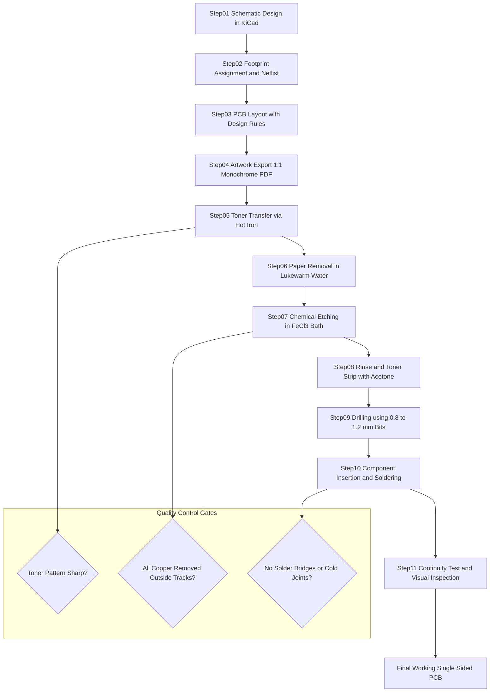
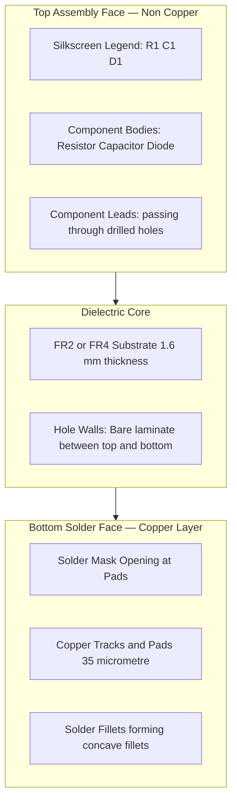
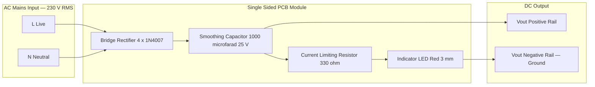
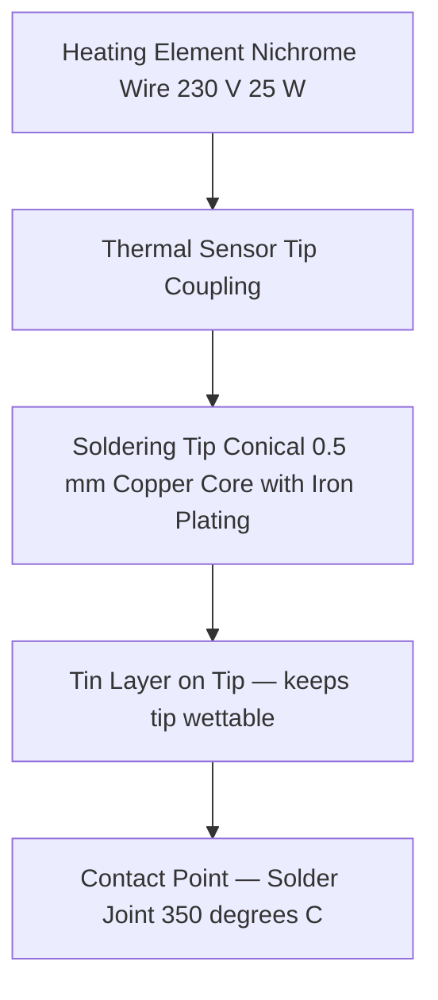

# Design and fabrication of a single sided PCB for a simple circuit.

<!-- SECTION_1_START -->
# Module 5 — Printed Circuit Boards (PCB)

## Topic: Design and Fabrication of a Single-Sided PCB for a Simple Circuit

---

### 1.1 Formal Definition (KTU 2024 Syllabus Terminology)

> [!IMPORTANT]
> **Printed Circuit Board (PCB):** A Printed Circuit Board (PCB) is a flat, laminated insulating substrate (base material) on which conductive copper tracks, pads, and other features are etched or printed to mechanically support and electrically interconnect electronic components.

> [!NOTE]
> **Single-Sided PCB:** A *single-sided PCB* is a type of rigid printed wiring board in which the conductive copper layer exists on **only ONE side** of the dielectric base material. All component leads are inserted from the *non-copper* (component) side and soldered onto the copper (solder) side. It is the simplest, lowest-cost, and most widely manufactured PCB type, ideal for low-density, low-frequency, hobby, and educational circuits.

**Key Engineering Materials (as per KTU 2024 Workshop syllabus):**

- **Substrate (Base Laminate):** Phenolic paper (FR-2) or Fiberglass epoxy (FR-4).
- **Conductive Layer:** Electro-deposited or rolled copper foil, typically **35 µm (1 oz/ft²)** thickness.
- **Solder Mask (optional):** UV-curable epoxy ink applied over copper to prevent solder bridges.
- **Silkscreen (optional):** White epoxy ink used to print component designators (R1, C2, etc.).

---

### 1.2 Conceptual Analogy / Intuition

> [!TIP]
> **Real-World Analogy — "The City Road Map"**
>
> Imagine a city built on a flat island. **Roads = Copper Tracks**, **Buildings = Electronic Components**, **Bridges = Vias/Plated Holes**, and **the bare ground = Insulating Substrate**.
>
> - In a **single-sided PCB**, you only have roads on **one side** of the island. Buildings sit on top, and their "feet" (component leads) are soldered to the roads beneath them.
> - In a **double-sided PCB**, roads exist on **both sides**, connected by bridges (vias).
>
> *Why single-sided?* Because for simple circuits (like a rectifier, LED flasher, or audio amplifier), you do not need to cross roads — a careful city plan (layout) lets you build everything with just one layer of roads!

> [!NOTE]
> **Geometric Intuition — Why ONE Side is Enough:**
> For any planar graph where no edges *must* cross, the *Eulerian circuit property* guarantees that all connections can be drawn on a single flat surface. A *bridge rectifier* or *astable multivibrator* are classic examples that satisfy this property, making them perfect candidates for single-sided prototyping.

---

### 1.3 Visualisation Control — Layer Stack-up

> [!VISUALIZATION CONTROL]
> **Concept:** Single-Sided PCB Cross-Sectional Stack-up
> **GeoGebra / Desmos Input (schematic cross-section, vertical strip):**
> * Layer 1 (Top): `y = 4` — Silkscreen Legend
> * Layer 2 (Top): `y = 3` — Solder Mask
> * Layer 3 (Top): `y = 2` — Copper Tracks (35 µm)
> * Layer 4 (Core): `y = 1` — FR-2 / FR-4 Dielectric Substrate (1.6 mm)
> **Visual Description:** Students should observe that the entire conductive copper layer (at $y=2$) lies on the *upper* face, and the *lower* face ($y<1$) is bare laminate. Component leads pass vertically through drilled holes and emerge on the copper side for soldering.

---
<!-- SECTION_1_END -->

<!-- SECTION_2_START -->
## 2. Deep Theoretical Analysis & KTU High-Yield Cheat Sheet

### 2.1 Operational Breakdown — The PCB Life Cycle

The fabrication of a single-sided PCB follows **seven sequential engineering stages**. Each stage is a quality gate — failure in one invalidates the entire board.

1. **Circuit Design & Schematic Capture**
   - Draw the schematic using *KiCad*, *Eagle*, or *EasyEDA*.
   - Verify functional correctness via SPICE simulation (LTSpice / Multisim).
   - Generate a *Netlist* — the master list of electrical connections.

2. **PCB Layout Design (CAD)**
   - Place components (footprint positioning) on the *Component Side* (non-copper).
   - Route copper tracks on the *Copper Side* using a *single routing layer*.
   - Maintain **design rules**: minimum track width, clearance, and drill size.

3. **Artwork / Mask Generation**
   - Export the *Top Copper* layer as a **1:1 scale black-and-white Gerber / PDF file**.
   - **Black = Copper to remain**, **White = Copper to be etched away**.

4. **Image Transfer to the Copper Clad**
   - *Toner Transfer Method:* Iron-on laser print onto the copper board.
   - *Photo-resist Method:* UV exposure through a transparency film.
   - *Hand-Drawing Method:* Permanent marker / etch-resist pen (for lab demos).

5. **Etching (Chemical Milling)**
   - Immerse the board in an **etchant bath**.
   - Unprotected copper dissolves; protected copper remains as the circuit.

6. **Drilling & Cleaning**
   - Use a PCB micro-drill (typically **0.8 mm – 1.2 mm**) for through-holes.
   - Wash off etchant residue; remove the toner/mask with acetone.

7. **Component Mounting & Soldering**
   - Insert leads, solder on the copper side using a **60/40 Sn-Pb** or **SAC305 lead-free** alloy.
   - Final inspection: continuity test, visual solder-joint audit.

---

### 2.2 KTU High-Yield Formula & Parameter Sheet

> [!IMPORTANT]
> **Memorize the following table — it forms the backbone of KTU viva and Part A answers.**

| Parameter | Symbol | Standard Value / Formula | Engineering Unit | KTU 2024 Context |
|---|---|---|---|---|
| Copper foil thickness | $t_{cu}$ | **35 µm (1 oz/ft²)** or 70 µm (2 oz/ft²) | micrometres (µm) | Conductor current capacity |
| Substrate thickness | $h$ | **1.6 mm** (standard), 0.8 mm, 2.4 mm | millimetres (mm) | Mechanical rigidity |
| Minimum track width | $W_{min}$ | **0.3 mm – 0.5 mm** (hand-etch) | millimetres (mm) | Design rule check |
| Minimum track spacing (clearance) | $S_{min}$ | **0.3 mm – 0.5 mm** | millimetres (mm) | Prevents short circuits |
| Drill hole diameter (for 0.5 mm lead) | $D_{h}$ | **0.8 mm – 1.0 mm** | millimetres (mm) | Plated through-hole |
| Etchant temperature | $T_{etch}$ | **40 °C – 50 °C** | degrees Celsius | Reaction kinetics |
| Etching time | $t_{etch}$ | **8 – 20 minutes** | minutes | Process control |
| Resistivity of copper | $\rho_{cu}$ | $1.724 \times 10^{-8}$ | Ω·m | Track resistance |
| Track resistance formula | $R_{track}$ | $\dfrac{\rho_{cu} \cdot L}{t_{cu} \cdot W}$ | Ohms (Ω) | Voltage drop / current limit |
| Current capacity (internal, 10 °C rise) | $I_{max}$ | $\approx 25 \cdot W \cdot t_{cu}$ (in mils/oz) | Amperes (A) | IPC-2152 empirical |

> [!NOTE]
> **Soldering Iron Tip Temperature:** **350 °C ± 20 °C** for lead-based solder; **370 °C ± 20 °C** for lead-free SAC alloys.

---

### 2.3 Real-World Engineering Utility

Single-sided PCBs are the **silent workhorses** of the consumer-electronics industry:

- **Power Electronics:** Mobile chargers, SMPS primary side, LED bulb drivers.
- **Automotive:** Interior lighting modules, window-switch panels, sensor PCBs.
- **Industrial:** Relay driver boards, optocoupler isolators, AC-DC converters.
- **Educational Labs:** The KTU GZESL106 workshop uses single-sided PCBs because they teach *every fundamental* (artwork, etching, drilling, soldering) without the complexity of multilayer lamination or via plating.

> [!TIP]
> **Industry Connection:** Over **70 %** of all PCBs manufactured globally are still single or double-sided — proving that *mastering the fundamentals of single-sided design* is a critical gateway skill for any hardware engineer.

---
<!-- SECTION_2_END -->

<!-- SECTION_3_START -->
## 3. Step-by-Step Fabrication Procedure & Workshop Implementation

### 3.1 The KTU Workshop Standard — Eleven-Step Pipeline

Below is the **complete, KTU-evaluation-grade** fabrication procedure. Every step is written so that a student can perform it in the GZESL106 laboratory and describe it flawlessly in the exam.

#### **STEP 1 — Schematic Capture**

Open KiCad (free, open-source). Place components, wire the schematic, and annotate reference designators (R1, D1, C1, U1, etc.).

> **Example Test Circuit (Workshop Standard):** *Bridge Rectifier with Smoothing Capacitor and LED Indicator*
> - 1N4007 ×4 (bridge)
> - $C_1 = 1000 \, \mu F / 25 \, V$
> - $R_1 = 330 \, \Omega$
> - LED (red, 2 V forward drop)

#### **STEP 2 — Netlist Generation & Footprint Association**

Assign physical footprints: 0805 for R1, radial D=10 mm for $C_1$, DO-41 for 1N4007, 3 mm LED.

#### **STEP 3 — Layout & Routing**

Place components on a virtual **100 mm × 80 mm** board. Route with 0.5 mm track width, 0.5 mm clearance. Add a 5 mm copper border for rigidity.

#### **STEP 4 — Artwork Export**

Export the **copper layer** as a **1:1 scale, monochrome PDF** (black tracks on white background). Print on **glossy photo paper** using a **laser printer** (inkjet will not transfer).

#### **STEP 5 — Toner Transfer (Iron-On Method)**

Pre-clean the copper board with **acetone** and a non-abrasive scrubber to remove oxidation.

$$\text{Toner transfer settings} \longrightarrow T_{iron} = 160-180\,^{\circ}\text{C}, \quad t_{press} = 3-5 \text{ minutes}$$

Apply firm, even pressure. The toner (plastic polymer) melts and adheres to copper.

> [!WARNING]
> **Do not use steam.** Steam introduces moisture, which causes the paper to peel before toner adheres.

#### **STEP 6 — Paper Removal**

Immediately submerge the hot board in **lukewarm water** for 5–10 minutes. Gently rub off the paper pulp using fingertips. The **black toner pattern** remains glued to the copper.

> **Quality check:** The pattern should be sharp, with no broken tracks. If broken, clean with acetone and **reprint + re-iron**.

#### **STEP 7 — Etching**

Prepare the **Ferric Chloride (FeCl₃)** solution — concentration **~30 %–40 % w/v**, temperature **40 °C–50 °C**.

$$\text{Cu (s)} + 2\,\text{FeCl}_{3} \text{ (aq)} \longrightarrow \text{CuCl}_{2} \text{ (aq)} + 2\,\text{FeCl}_{2} \text{ (aq)}$$

Immerse the board copper-side-up. **Agitate gently** (rock the tray, or bubble air) every 2 minutes. Average etch time: **10–15 minutes**.

> [!WARNING]
> **Always add etchant to water, never water to etchant.** FeCl₃ stains skin and clothing permanently. Use nitrile gloves and a poly apron.

#### **STEP 8 — Rinse & Mask Removal**

Remove the board, rinse thoroughly under tap water, then **scrub with acetone** to dissolve the toner mask. The bare copper tracks are now visible.

#### **STEP 9 — Drilling**

Using a PCB micro-drill press (or a hand Dremel at low RPM < 3000):

| Component Lead Diameter | Recommended Drill Bit |
|---|---|
| 0.4 mm – 0.5 mm (resistor, diode axial) | **0.8 mm** |
| 0.6 mm – 0.7 mm (TO-92, small IC) | **1.0 mm** |
| 0.8 mm – 1.0 mm (bridge, TO-220) | **1.2 mm – 1.5 mm** |
| Mounting holes / screws | **3.0 mm – 3.5 mm** |

#### **STEP 10 — Component Insertion & Soldering**

Insert all components from the *non-copper* (component) side. Bend leads slightly to retain them. Solder from the *copper* side using:

- **Solder:** 60/40 Sn-Pb (Ø 0.7 mm).
- **Iron tip temperature:** **350 °C**.
- **Soldering time per joint:** **2 – 4 seconds**.
- **Flux:** Rosin-core (inside the solder wire).

$$\text{Solder joint geometry} = \text{concave fillet (volcano shape)}$$

A *good* joint is shiny, concave, and wets the pad. A *cold* joint is grainy, convex, and brittle.

#### **STEP 11 — Testing & Trimming**

- **Visual inspection** with 5× magnifier.
- **Continuity test** with a digital multimeter (beep mode).
- **Isolation test** (resistance > 1 MΩ) between unconnected tracks.
- **Power-on test** at reduced voltage (variac) for the first time.

---

### 3.2 Track Resistance Derivation (For Numerical Problems)

In a KTU Part B question, students may be asked to verify a track's current capacity. The derivation is shown below in full — **no steps skipped**.

**Given:** A copper track of length $L$, width $W$, thickness $t_{cu}$.

**Step 1 — Start from the fundamental resistance formula:**

$$R = \rho \cdot \dfrac{L}{A}$$

**Step 2 — Substitute the cross-sectional area of the rectangular track ($A = W \cdot t_{cu}$):**

$$R_{track} = \rho_{cu} \cdot \dfrac{L}{W \cdot t_{cu}}$$

**Step 3 — Insert values for a typical case:** $L = 50 \, \text{mm} = 0.05 \, \text{m}$, $W = 0.5 \, \text{mm} = 5 \times 10^{-4} \, \text{m}$, $t_{cu} = 35 \, \mu\text{m} = 35 \times 10^{-6} \, \text{m}$, $\rho_{cu} = 1.724 \times 10^{-8} \, \Omega \cdot \text{m}$.

$$R_{track} = 1.724 \times 10^{-8} \cdot \dfrac{0.05}{5 \times 10^{-4} \cdot 35 \times 10^{-6}}$$

**Step 4 — Compute the denominator:**

$$5 \times 10^{-4} \cdot 35 \times 10^{-6} = 1.75 \times 10^{-8} \, \text{m}^2$$

**Step 5 — Divide numerator by denominator:**

$$R_{track} = 1.724 \times 10^{-8} \cdot \dfrac{0.05}{1.75 \times 10^{-8}} = 1.724 \cdot \dfrac{0.05}{1.75}$$

**Step 6 — Final numerical value:**

$$R_{track} = 0.0493 \, \Omega \approx 49 \, \text{m}\Omega$$

> **Conclusion:** Even a thin, short copper track has negligible resistance — confirming why PCB tracks are considered ideal conductors for low-power digital/analogue circuits.

---

### 3.3 Workshop Component, Tool & Safety Matrix

> [!NOTE]
> **This table is the master reference for KTU viva voce and record-book submission (GZESL106).**

| Category | Item | Specification / Pinout / Profile | Quantity | Safety Note |
|---|---|---|---|---|
| **Raw Material** | Copper Clad Laminate | FR-2, $100 \times 80 \, \text{mm}$, $35 \, \mu\text{m}$ Cu, 1.6 mm | 1 | Wear gloves; edges are sharp |
| **Etchant** | Ferric Chloride (FeCl₃) | Powder, 100 g dissolved in 300 mL water | 100 g | Acidic; causes stains; use goggles |
| **Resist** | Laser toner / etch-pen | Brother HL-T4500DW toner, black | 1 cartridge | Avoid inhalation |
| **Tool** | PCB drill press | 12 V DC, 0.8–1.5 mm bits | 1 | Clamp board; never hold in hand |
| **Tool** | Soldering iron | 25 W, 230 V, conical tip 0.5 mm | 1 | Hot end > 350 °C; use stand |
| **Tool** | Side cutter | Flush-cut, ESD-safe handle | 1 | Eye protection mandatory |
| **Component** | 1N4007 diode | Axial, leads Ø 0.8 mm | 4 | Observe cathode polarity |
| **Component** | Electrolytic capacitor | Radial, D = 10 mm, 1000 µF / 25 V | 1 | Polarity critical; vent downward |
| **Component** | Resistor | Carbon film, 1/4 W, 330 Ω, ±5 % | 1 | Colour code: Orange-Orange-Brown |
| **Component** | LED | 3 mm red, $V_F = 2 \, \text{V}$, $I_F = 20 \, \text{mA}$ | 1 | Longer lead = Anode |
| **PPE** | Nitrile gloves, goggles, apron | — | 1 set | Mandatory during etching |
| **Cleaner** | Acetone / Isopropyl alcohol (IPA) | 99 % pure, 100 mL | 1 bottle | Flammable; no open flames |

---
<!-- SECTION_3_END -->

<!-- SECTION_4_START -->
## 4. Structural Diagrams & Schematics

### 4.1 End-to-End Process Flow (Mermaid Flowchart)

### 4.2 Layer Stack-up Block Diagram

### 4.3 Functional Architecture of a Fabricated Single-Sided Module

### 4.4 Soldering Iron Tip Anatomy

---
<!-- SECTION_4_END -->

<!-- SECTION_5_START -->
## 5. KTU 2024 Scheme Examination Question Bank

> [!NOTE]
> **Mark Distribution Note:** As per KTU 2024 GZESL106 scheme, the ESE workshop paper typically has Part A (short answer) and Part B (long answer with internal choice). The questions below mirror that structure exactly.

---

### PART A — Short Answer Questions (3 Marks Each)

#### **Q1. [KTU University Exam — July 2024]**
**Define a single-sided PCB. List its two main material constituents.**

**Model Answer (3 Marks):**

> A **single-sided PCB** is a printed wiring board in which the conductive copper layer is present on **only one side** of the dielectric substrate. *(1 Mark)*
>
> **Two main material constituents:** *(2 Marks — 1 each)*
> 1. **Dielectric substrate** — typically phenolic paper (FR-2) or fiberglass epoxy (FR-4).
> 2. **Conductive copper foil** — typically **35 µm (1 oz/ft²)** thickness, bonded to the substrate by heat and adhesive.

---

#### **Q2. [KTU University Exam — Dec 2023]**
**Name the chemical used as an etchant in PCB fabrication. Write its chemical formula.**

**Model Answer (3 Marks):**

> The etchant used is **Ferric Chloride**. *(1 Mark)*
> **Chemical formula:** $\text{FeCl}_{3}$ *(1 Mark)*
> It selectively dissolves unprotected copper via the redox reaction:
>
> $$\text{Cu} + 2\,\text{FeCl}_{3} \longrightarrow \text{CuCl}_{2} + 2\,\text{FeCl}_{2}$$
>
> *(Reaction equation: 1 Mark)*

---

### PART B — Long Answer Questions (14 Marks — Internal Choice)

---

#### **Question A — Option 1 (14 Marks) [KTU University Exam — Model Paper 2024]**

**(a)** Explain the **step-by-step procedure** for the **toner-transfer method** of fabricating a single-sided PCB for a simple half-wave rectifier circuit. *(7 Marks)*

**(b)** A copper track on a single-sided PCB is **80 mm long, 0.6 mm wide**, and uses the standard **35 µm** copper thickness. Calculate its **resistance** and comment on the voltage drop when carrying **500 mA**. *(7 Marks)*

---

##### **Model Solution — Part (a) [7 Marks]**

| Step No. | Action | Marks |
|---|---|---|
| 1 | Draw the half-wave rectifier schematic in KiCad / Eagle. Components: 1× transformer, 1× 1N4007 diode, 1× $C = 1000 \, \mu\text{F}$ capacitor, 1× $R = 330 \, \Omega$ resistor, 1× LED. | 1 |
| 2 | Place footprints on a 80 mm × 60 mm virtual board; route with 0.5 mm track, 0.5 mm clearance. | 1 |
| 3 | Export the *Copper Layer* as a 1:1 black-and-white PDF. Print on **glossy photo paper** using a **laser printer**. | 1 |
| 4 | Clean the copper-clad board with **acetone** to remove oxide and grease. | 1 |
| 5 | Iron-on transfer: $T = 160-180\,^{\circ}\text{C}$, $t = 3-5 \text{ min}$, firm even pressure, **no steam**. | 1 |
| 6 | Soak in lukewarm water, gently rub off pulp; verify sharp black tracks. | 1 |
| 7 | Etch in **FeCl₃** at 40–50 °C for 10–15 min; rinse, strip toner with acetone; drill and solder. | 1 |

> **[Valuation Key — Total: 7 Marks as distributed above]**

---

##### **Model Solution — Part (b) [7 Marks]**

**Given:** $L = 80 \, \text{mm} = 0.08 \, \text{m}$, $W = 0.6 \, \text{mm} = 6 \times 10^{-4} \, \text{m}$, $t_{cu} = 35 \, \mu\text{m} = 35 \times 10^{-6} \, \text{m}$, $\rho_{cu} = 1.724 \times 10^{-8} \, \Omega \cdot \text{m}$, $I = 500 \, \text{mA} = 0.5 \, \text{A}$.

**Step 1 — State the resistance formula** *(1 Mark)*:

$$R = \rho_{cu} \cdot \dfrac{L}{W \cdot t_{cu}}$$

**Step 2 — Compute the cross-sectional area** *(1 Mark)*:

$$A = W \cdot t_{cu} = 6 \times 10^{-4} \cdot 35 \times 10^{-6} = 2.1 \times 10^{-8} \, \text{m}^2$$

**Step 3 — Substitute and evaluate** *(2 Marks)*:

$$R = 1.724 \times 10^{-8} \cdot \dfrac{0.08}{2.1 \times 10^{-8}} = 1.724 \cdot \dfrac{0.08}{2.1}$$

$$R = 0.0657 \, \Omega \approx 65.7 \, \text{m}\Omega$$

**Step 4 — Calculate the voltage drop using Ohm's Law** *(2 Marks)*:

$$V_{drop} = I \cdot R = 0.5 \cdot 0.0657 = 0.0329 \, \text{V} \approx 32.9 \, \text{mV}$$

**Step 5 — Comment** *(1 Mark)*:

> The voltage drop is **only 32.9 mV** — negligible compared to typical digital logic levels (3.3 V / 5 V). The track is **safe and adequate** for the 500 mA load.

> **[Valuation Key — Total: 7 Marks as distributed above]**

---

#### **Question B — Option 2 (14 Marks) [KTU University Exam — July 2023]**

**(a)** Compare the **toner-transfer method** and the **photo-resist method** of image transfer for single-sided PCBs. List **two advantages and two disadvantages** of each. *(7 Marks)*

**(b)** Describe in detail the **chemical etching process** using Ferric Chloride, including the **chemical equation, temperature, time, and safety precautions**. *(7 Marks)*

---

##### **Model Solution — Part (a) [7 Marks]**

| Parameter | Toner-Transfer Method | Photo-Resist Method |
|---|---|---|
| **Principle** | Heat & pressure melt laser toner onto copper. | UV light polymerizes photoresist through a film positive. |
| **Resolution** | Moderate (~0.3 mm track). | High (~0.15 mm track — fine pitch). |
| **Equipment cost** | Iron + glossy paper (very low cost). | UV exposure box + positive photoresist board (high cost). |
| **Turnaround** | Fast — single evening. | Slower — board prep, exposure, development, then etch. |

**Toner-Transfer — Advantages:** *(1 Mark)*
1. Extremely low cost (uses household iron).
2. Fast iteration; ideal for student labs.

**Toner-Transfer — Disadvantages:** *(1 Mark)*
1. Limited resolution; unsuitable for SMD / fine-pitch ICs.
2. Pattern may be incomplete on first attempt; requires redo.

**Photo-Resist — Advantages:** *(1 Mark)*
1. Excellent resolution for SMD and fine-pitch designs.
2. Highly reproducible batch production.

**Photo-Resist — Disadvantages:** *(1 Mark)*
1. Requires darkroom, UV box, and dedicated photoresist boards.
2. Higher skill curve and consumable cost.

**Conclusion** *(2 Marks)*:
> For a single-sided KTU workshop project, the **toner-transfer method** is preferred due to its low cost, simplicity, and sufficient resolution for through-hole components.

---

##### **Model Solution — Part (b) [7 Marks]**

1. **Etchant Used:** Ferric Chloride, $\text{FeCl}_{3}$ — prepared as a **30–40 % aqueous solution**. *(1 Mark)*
2. **Chemical Reaction:** *(1 Mark)*

$$\text{Cu} + 2\,\text{FeCl}_{3} \longrightarrow \text{CuCl}_{2} + 2\,\text{FeCl}_{2}$$

3. **Process Parameters:** *(2 Marks)*
   - **Temperature:** **40 °C – 50 °C** (heated water bath).
   - **Time:** **8–20 minutes**, depending on copper thickness.
   - **Agitation:** Gentle rocking or air-bubble stirring every 2 min for uniform etching.
4. **Procedure:** *(1 Mark)*
   - Immerse the board with the *copper side up* in a plastic tray.
   - Inspect every 2 minutes; remove when all unwanted copper is gone.
5. **Safety Precautions:** *(2 Marks)*
   - Wear **nitrile gloves, safety goggles, and a poly apron**.
   - Etchant is acidic — stains skin and clothes permanently.
   - **Always add etchant to water** — never the reverse.
   - Dispose of used etchant in a **hazardous-waste container**; do not pour into drains.

> **[Valuation Key — Total: 7 Marks as distributed above]**

---

> [!WARNING]
> **KTU Examiner's Valuation Warning — Common Pitfalls**
>
> 1. **Do NOT confuse single-sided and double-sided PCBs.** A single-sided PCB has copper on **only one side**; double-sided has both. *(Costs 1–2 marks in Part A.)*
> 2. **Do NOT skip writing the chemical equation** in etching questions. A balanced equation earns full credit.
> 3. **Do NOT omit units** in numerical track-resistance problems. Marks are deducted if $R$ is reported in $\Omega$ without explicitly stating milli/micro-Ohm where applicable.
> 4. **Do NOT write "ferrous chloride"** instead of **ferric chloride**. The valency of iron matters — $\text{Fe}^{3+}$ (ferric), not $\text{Fe}^{2+}$ (ferrous).
> 5. **Always specify the artwork layer (Top Copper)** in CAD questions. Writing just "layout" is incomplete.

---

## Topic Recap & Important Things to Remember

- A **single-sided PCB** has conductive copper on **only one side** of the dielectric substrate. *(Definition — 2-line answer.)*
- The two principal materials are the **dielectric substrate (FR-2 / FR-4)** and the **copper foil (35 µm standard)**. *(1-Mark fact.)*
- The **seven stages** of fabrication: Schematic → Layout → Artwork → Image Transfer → Etching → Drilling → Soldering. *(Recall — 1 Mark.)*
- **Toner-transfer** uses a laser printer and a hot iron (160–180 °C, 3–5 min); **photo-resist** uses UV exposure through a film. *(Comparison — 2 Marks.)*
- The etchant is **Ferric Chloride ($\text{FeCl}_{3}$)** at **40–50 °C** for **10–15 min**. *(Parameter — 1 Mark.)*
- Track resistance formula: $R_{track} = \rho_{cu} \cdot \dfrac{L}{W \cdot t_{cu}}$. *(Formula — 1 Mark.)*
- Standard **track width** = **0.3–0.5 mm**; **clearance** = **0.3–0.5 mm**; **drill hole** = **0.8–1.2 mm** for axial components. *(Design rules.)*
- Soldering iron tip: **350 °C** (lead) / **370 °C** (lead-free); solder time **2–4 s/joint**. *(Workshop standard.)*
- **Safety first:** Always wear gloves, goggles, and apron while etching; **add etchant to water**, never the reverse. *(Safety — 1 Mark in viva.)*
- **FeCl₃ stains** skin and clothes permanently; dispose of in **hazardous-waste containers**. *(Exam-favourite one-liner.)*
- The **component side** is the *non-copper* side; the **solder side** is the *copper* side. *(Confusing pair — memorize.)*
- **Single-sided** PCBs suit low-density, low-frequency, through-hole circuits (rectifiers, LED drivers, simple amplifiers). *(Application — 1 Mark.)*
- **Etching reaction:** $\text{Cu} + 2\,\text{FeCl}_{3} \longrightarrow \text{CuCl}_{2} + 2\,\text{FeCl}_{2}$. *(Equation — 2 Marks.)*
- **Cold joint** = grainy, convex, brittle (bad); **good joint** = shiny, concave fillet (good). *(Quality point.)*
- For a typical 50 mm × 0.5 mm × 35 µm track, $R \approx 49 \, \text{m}\Omega$ — negligible for low-power digital use. *(Numerical sanity-check.)*
- Single-sided PCBs account for **>70 %** of all global PCB production by volume — master this foundation before moving to multilayer boards. *(Industry relevance.)*

---
<!-- SECTION_5_END -->
