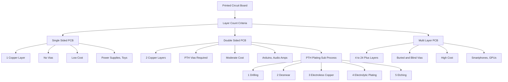
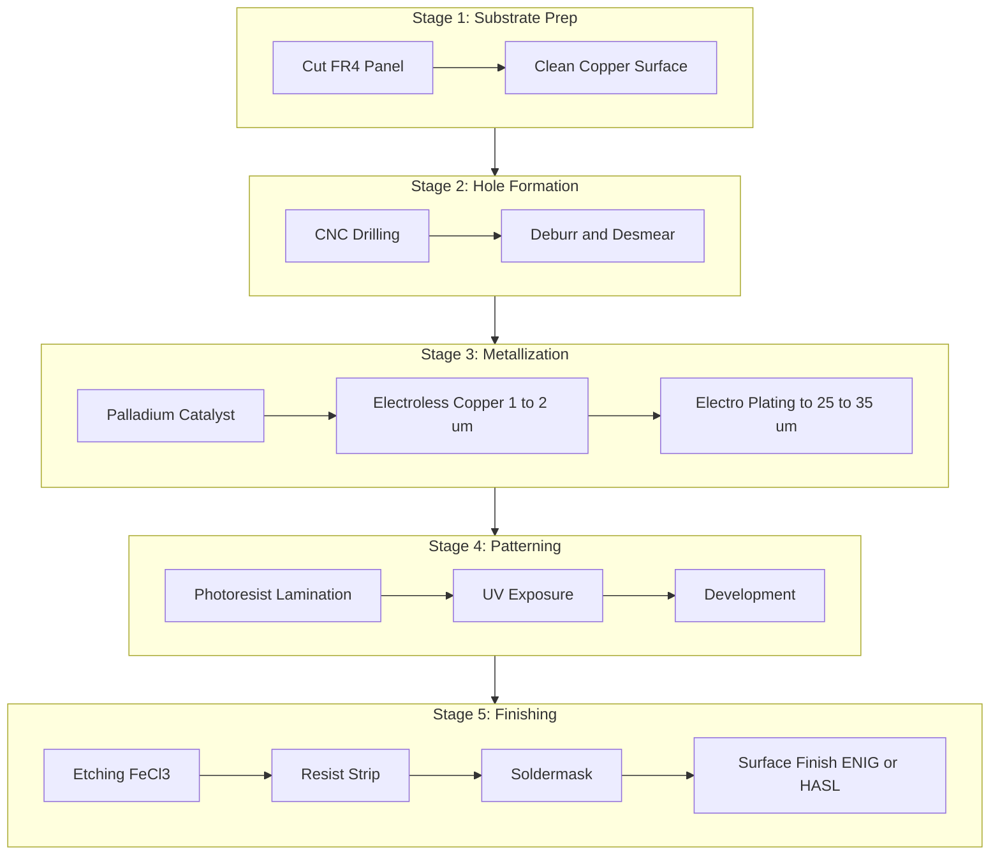
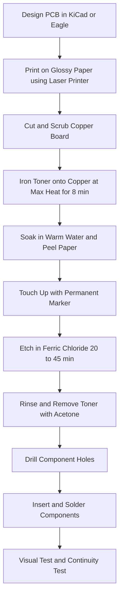
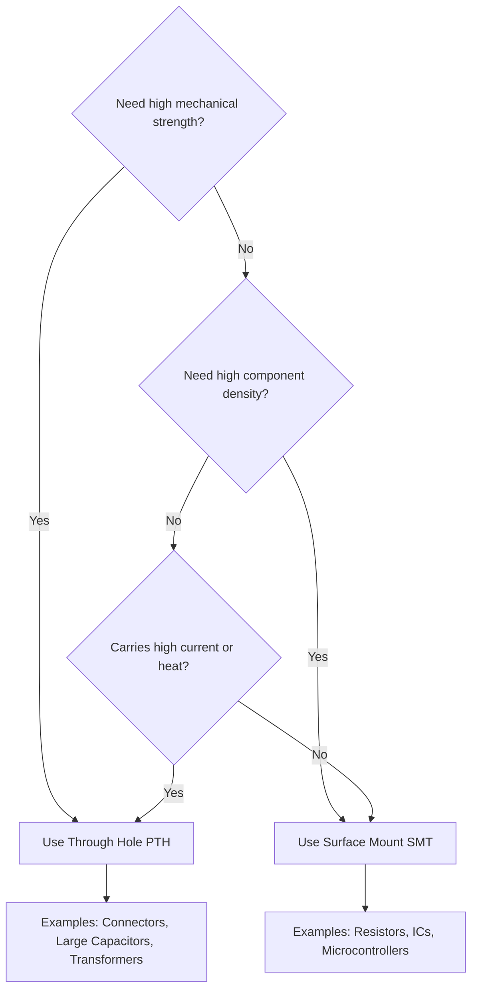

# Printed circuit boards (PCB) - Types, Single sided, Double sided, PTH, Processing methods.

<!-- SECTION_1_START -->

# Printed Circuit Boards (PCB) — Types, Single Sided, Double Sided, PTH & Processing Methods

> [!IMPORTANT]
> **Syllabus Tag:** BASIC ELECTRICAL AND ELECTRONICS ENGINEERING WORKSHOP (GZESL106) | Module 5 | KTU 2024 Scheme | B.Tech First Year

> [!NOTE]
> **Course Outcome Mapping:** CO5 — *Apply fundamental skills in the fabrication and assembly of basic electronic circuits using printed circuit board (PCB) technology.*

A **Printed Circuit Board (PCB)** is a flat, laminated sandwich of insulating dielectric substrate layers (typically **FR-4**, fiberglass-reinforced epoxy) and conductive copper foil layers, on which electronic components are mechanically supported and electrically interconnected using etched copper traces, pads, and vias instead of discrete point-to-point wiring. In a production environment, a PCB replaces the bulky, failure-prone hand-wired assembly with a **repeatable, mass-producible, mechanically rigid, and electrically predictable** interconnection medium.

### Conceptual Analogy — "The City Map of Electronics"

> [!TIP]
> **Think of a PCB as the road-and-flyover network of a city.**
> - The **green fiberglass board (substrate)** is the *land* (earth/ground).
> - The **copper traces** are the *roads* and *flyovers* carrying traffic (current) between destinations.
> - The **pads** are *bus stops* (where components "stand" and connect).
> - The **vias** are *underpasses / tunnels* that allow traffic to switch from an upper-layer road to a lower-layer road.
> - The **silkscreen layer** is the *signboard* that labels each component for the assembler.
> - The **soldermask** is the *painted lane divider* — it covers the copper everywhere except the pads, preventing accidental short-circuits (accidents) and oxidation.

Just as a city planner must choose between one-way streets, two-way streets, and multi-level flyover networks, a PCB designer chooses between **single sided, double sided, and multi-layer boards** based on circuit complexity, cost, and signal integrity needs.

### Why PCBs are Indispensable in Modern Engineering

| Engineering Need | How PCB Solves It |
|------------------|-------------------|
| **Mass production** of identical circuits | Photolithographic etching guarantees trace-to-trace repeatability to within $\pm 25\,\mu m$ |
| **Mechanical rigidity** | FR-4 substrate gives a stable platform, eliminating wire fatigue and cold solder joints |
| **High-speed signal integrity** | Controlled-impedance microstrip traces, short return paths, and dedicated ground planes |
| **Thermal management** | Heavy copper pours and thermal vias spread heat from power devices |
| **Compactness** | Surface Mount Technology (SMT) + multi-layer boards allow 1000+ components in $< 10\,\text{cm}^2$ |
| **EMI/EMC control** | Ground planes, guard rings, and controlled spacing reduce radiated emissions |

### Standard PCB Metrics You Must Memorize

> [!IMPORTANT]
> - **Standard board thickness:** **$1.6\,\text{mm}$** (most common consumer electronics)
> - **Other thicknesses:** $0.8\,\text{mm}$, $1.0\,\text{mm}$, $1.2\,\text{mm}$, $2.0\,\text{mm}$, $2.4\,\text{mm}$, $3.2\,\text{mm}$
> - **Standard copper foil weight:** **$1\,\text{oz/ft}^2$** = **$35\,\mu\text{m}$** thickness
> - **Other copper weights:** $0.5\,\text{oz/ft}^2$ ($\sim 17\,\mu\text{m}$), $2\,\text{oz/ft}^2$ ($\sim 70\,\mu\text{m}$)
> - **Minimum trace width / spacing (hobby / educational):** $0.2\,\text{mm}$ / $0.2\,\text{mm}$
> - **Minimum drill diameter:** $0.3\,\text{mm}$
> - **Standard soldermask colors:** Green (most common), Red, Blue, Black, White, Yellow
> - **Operating temperature range (FR-4):** $-50\,^{\circ}\text{C}$ to $+110\,^{\circ}\text{C}$ (Tg $130\,^{\circ}\text{C}$) or up to $150\,^{\circ}\text{C}$ (Tg $180\,^{\circ}\text{C}$ high-Tg)

---

<!-- SECTION_1_END -->

<!-- SECTION_2_START -->

# Deep Theoretical Analysis — PCB Types, PTH, and Processing Methods

## 1. Classification of PCBs by Layer Count

### 1.1 Single-Sided PCB (SSPCB)

A **single-sided PCB** has conductive copper pattern on **only one side** of the insulating substrate. The bottom side is reserved for through-hole component leads, soldering, and silkscreen markings.

- **Conductor layers:** 1 (Top)
- **Substrate layers:** 1
- **Vias:** None (components are inserted from the *non-copper* side and soldered on the *copper* side)
- **Cost:** Lowest
- **Use cases:** Power supplies, calculators, toys, LED drivers, simple hobby projects, AM radios

> [!NOTE]
> **Design constraint:** All component leads and signal traces must share *one* copper plane. Crossings are impossible without using **zero-ohm resistors (jumpers)** or **wire bridges** on the component side. This limits circuit complexity to **discrete, low-density** designs.

**Layer stack-up diagram (textual):**

```
   ┌─────────────────────────┐  ← Silkscreen (top - white text, component IDs)
   ├─────────────────────────┤
   │  Soldermask (green)     │  ← Protects copper, exposes only pads
   ├─────────────────────────┤
   │  COPPER (1 oz/ft²)      │  ← ALL electrical connections here
   ├─────────────────────────┤
   │  FR-4 SUBSTRATE (1.6mm) │  ← Mechanical base
   ├─────────────────────────┤
   │  No copper              │  ← Bare FR-4 / no electrical layer
   └─────────────────────────┘
```

### 1.2 Double-Sided PCB (DSPCB)

A **double-sided PCB** has copper layers on **both the top and bottom** of the substrate, allowing designers to route traces on either side. Connections between layers are made using **plated through-holes (PTH)** or **vias**.

- **Conductor layers:** 2 (Top + Bottom)
- **Substrate layers:** 1 (with copper on both faces)
- **Vias:** Required for inter-layer signal transfer
- **Cost:** Moderate
- **Use cases:** Microcontroller boards (Arduino Uno), computer motherboards (older), audio amplifiers, automotive ECUs

> [!IMPORTANT]
> **Trace routing rule:** A trace on the *top* layer generally runs in the **horizontal (X)** direction, while a trace on the *bottom* layer runs in the **vertical (Y)** direction. This orthogonal routing minimizes crossovers and is the foundation of professional PCB design.

**Layer stack-up diagram (textual):**

```
   ┌─────────────────────────┐
   │  Top Silkscreen         │
   ├─────────────────────────┤
   │  Top Soldermask         │
   ├─────────────────────────┤
   │  COPPER — Top Layer     │  ← Horizontal traces
   ├─────────────────────────┤
   │  FR-4 SUBSTRATE (core)  │
   ├─────────────────────────┤
   │  COPPER — Bottom Layer  │  ← Vertical traces
   ├─────────────────────────┤
   │  Bottom Soldermask      │
   └─────────────────────────┘
```

### 1.3 Multi-Layer PCB (Brief Mention)

A **multi-layer PCB** stacks **4, 6, 8, 12, or even 24+** copper layers with FR-4 prepreg (B-stage epoxy) between them, laminated under heat and pressure. These are used in smartphones, GPUs, FPGAs, and high-speed digital systems. Out of strict KTU 2024 Module 5 scope, but mentioned for completeness.

---

## 2. PTH — Plated Through-Hole Technology

**PTH (Plated Through-Hole)** is the metallization process that creates an **electrically continuous copper barrel** on the inner wall of a drilled hole, connecting copper pads/traces on different layers of a double-sided or multi-layer board.

> [!NOTE]
> **Two distinct uses of the term "PTH" in industry — do not confuse!**
> 1. **Plated Through-Hole (process):** the metallization of the hole wall.
> 2. **Plated Through-Hole (component mounting):** insertion of *traditional through-hole components* (with leads going *through* the board) into a PTH-plated hole, as opposed to Surface Mount Devices (SMD).

### 2.1 Why is PTH Critical?

| Problem Without PTH | Solution Provided by PTH |
|---------------------|--------------------------|
| A signal on the top layer cannot reach the bottom layer | Copper-plated barrel creates an electrical short between top and bottom pads |
| Through-hole component leads would have **cold joints** and high resistance | Plated barrel + component lead = a reliable, gas-tight, low-resistance joint |
| Solder would wick through to the wrong side | The copper barrel controls wicking, allowing clean fillets on both sides |

### 2.2 The PTH Process (In Order)

1. **Drilling** — Substrate drilled at the via location with a $0.3$ to $0.6\,\text{mm}$ tungsten carbide bit.
2. **Deburring & Desmear** — Removes epoxy smear inside the hole using **permanganate ($\text{KMnO}_4$)** or **plasma**.
3. **Electroless Copper Deposition** — The *non-conductive* hole wall is catalyzed with **Palladium ($\text{Pd}$)** and immersed in an autocatalytic bath that deposits a **thin layer of copper ($\sim 1-2\,\mu\text{m}$)** without external current. This is the **key step** that makes the hole wall conductive.
4. **Electro-plating (Galvanic Copper Build-up)** — The board acts as the **cathode** in an electrolytic cell; copper ions ($\text{Cu}^{2+}$) are reduced and deposited, growing the barrel thickness to **$25-35\,\mu\text{m}$**.
5. **Outer-layer patterning** — Photoresist applied, exposed, developed; extra copper plated; tin-lead or ENIG finish added.
6. **Etching** — Unwanted copper dissolved in **ferric chloride ($\text{FeCl}_3$)** or **cupric chloride ($\text{CuCl}_2$)**.

### 2.3 Through-Hole vs Surface Mount — A Clear Comparison

| Feature | Through-Hole (THT) | Surface Mount (SMT) |
|---------|--------------------|--------------------|
| Lead goes through board | Yes | No — soldered to surface pads |
| Mechanical strength | **High** (lead in hole) | Lower (relies on solder fillet) |
| Component density | Low (large holes) | **High** (smaller parts) |
| Suitable for high-power | Yes (heat dissipation through copper) | No (limited thermal path) |
| Assembly automation | Possible but slow | **Fully automated pick-and-place** |
| Cost | Higher (drilling cost) | Lower (no drilling for SMD) |
| Examples | Large electrolytic caps, transformers | Resistors, ICs, microcontrollers |

---

## 3. Processing Methods — How a PCB is Fabricated

> [!IMPORTANT]
> The two principal processing routes for a hobby / small-scale workshop are:
> **A. Photolithographic (Industrial)** — the gold standard, used by all PCB manufacturers.
> **B. Toner-Transfer / Photo-Resist (Workshop / DIY)** — used in KTU college labs.

### 3.1 Industrial PCB Fabrication (8-Step Pipeline)

> [!NOTE]
> **You must remember the sequence — it is a frequent KTU 14-mark question.**

1. **Base Material Preparation** — Cut FR-4 sheet to panel size. Clean surface.
2. **Drilling** — CNC drill hits at all via and component hole locations. Reference holes drilled for alignment.
3. **Copper Cladding Inspection** — Verify the $35\,\mu\text{m}$ copper layer is uniform.
4. **Photoresist Application** — Dry-film photoresist laminated onto copper at $\sim 110\,^{\circ}\text{C}$, OR liquid photoresist spin-coated.
5. **Exposure & Development** — Artwork film (or direct laser imaging) UV-exposes the resist. Unexposed resist is washed away in **sodium carbonate ($\text{Na}_2\text{CO}_3$)** solution, revealing the copper to be etched. *OR* exposed resist is washed away if using *negative* resist.
6. **Etching** — Copper not protected by resist is dissolved in **ferric chloride ($\text{FeCl}_3$)** at $\sim 45\,^{\circ}\text{C}$. Time: $\sim 20-40$ min. Spray etching preferred for uniform results.
7. **Photoresist Stripping** — Remaining resist removed in **sodium hydroxide ($\text{NaOH}$)** solution.
8. **PTH Metallization** — As described in §2.2.
9. **Soldermask & Silkscreen** — LPI (Liquid Photo-Imageable) soldermask laminated, exposed, developed, and UV-cured. Silkscreen printed on top.
10. **Surface Finish** — **HASL (Hot Air Solder Leveling), ENIG (Electroless Nickel Immersion Gold), or OSP (Organic Solderability Preservative)**.
11. **Routing / Profiling** — CNC mill or V-score cuts the panel into individual boards.
12. **Electrical Test (E-Test)** — Flying-probe or bed-of-nails tester verifies every net is open/short free.

### 3.2 Workshop-Scale PCB Fabrication (Toner Transfer Method)

This is the method students use in their KTU workshop lab. It is *cheap, fast, and pedagogical* but has lower resolution ($\sim 0.4\,\text{mm}$ minimum trace).

1. **Design the PCB** in **Eagle, KiCad, EasyEDA, or Proteus ARES**.
2. **Print the artwork** on **glossy photo paper** using a **laser printer** (toner, not inkjet). For double-sided, print both sides with alignment marks.
3. **Prepare the copper board** — Cut to size, scrub with **steel wool / scotch-brite** and IPA to remove oxidation.
4. **Iron the toner onto copper** — Place paper toner-down on the board. Press with a household iron at **max temperature** for $5-8$ minutes with firm pressure. Toner melts and adheres to copper.
5. **Soak & peel** — Drop the board in warm soapy water for $5$ min. The paper peels off, leaving the toner pattern on the copper.
6. **Touch up** — Use a **permanent marker** to fill any pinholes or broken traces.
7. **Etch** — Submerge in **ferric chloride ($\text{FeCl}_3$)** solution at room temperature, agitate gently. Copper dissolves where it is *not* protected by toner. Time: $20-45$ min.
8. **Clean & Drill** — Remove toner with **acetone** or steel wool. Drill holes using a $0.8$ or $1.0\,\text{mm}$ bit for component leads.

> [!WARNING]
> **Ferric chloride is corrosive and stains clothing permanently.** Always use nitrile gloves, safety goggles, and dispose of used etchant via proper chemical waste channels — *never* pour it down the sink.

### 3.3 Substractive vs Additive Processing

| Process | Principle | Used In |
|---------|-----------|---------|
| **Subtractive** | Start with full copper foil; *remove* unwanted copper by etching | **99% of all PCBs worldwide** (standard method) |
| **Additive** | Start with bare laminate; *add* copper only where needed via electroless deposition | Specialty, fine-line, RF / microwave boards |

---

## 4. KTU High-Yield Formula & Data Sheet

> [!IMPORTANT]
> The following table contains every numerical value, standard, and equation you are likely to need for a KTU 2024 exam answer on this topic.

| Parameter | Symbol | Standard Value | Unit | Notes |
|-----------|--------|----------------|------|-------|
| Standard PCB thickness | $t$ | $1.6$ | $\text{mm}$ | Consumer default |
| Copper foil weight | $w$ | $1$ | $\text{oz/ft}^2$ | $\equiv 35\,\mu\text{m}$ thickness |
| Copper thickness | $t_{cu}$ | $35$ | $\mu\text{m}$ | $= 1.4 \times 10^{-3}\,\text{in}$ |
| Copper resistivity | $\rho_{cu}$ | $1.724 \times 10^{-8}$ | $\Omega \cdot \text{m}$ | At $20\,^{\circ}\text{C}$ |
| Trace resistance | $R_{trace}$ | $R = \rho \cdot L / (w \cdot t_{cu})$ | $\Omega$ | $L$ = length, $w$ = width |
| Etchant (home) | — | $\text{FeCl}_3$ | — | Ferric chloride |
| Etchant (industrial) | — | $\text{CuCl}_2$ / $\text{NH}_4\text{HSO}_4$ | — | Cupric chloride / ammoniacal |
| PCB substrate | — | FR-4 | — | Glass-reinforced epoxy |
| Substrate dielectric constant | $\varepsilon_r$ | $4.2 - 4.6$ | — | At $1\,\text{MHz}$ |
| Substrate glass transition | $T_g$ | $130$ (std) or $150$ (high-Tg) | $^\circ\text{C}$ | Critical for lead-free reflow |
| Minimum trace (hobby) | — | $0.2$ | $\text{mm}$ | Toner-transfer method |
| Minimum trace (industrial) | — | $0.075$ | $\text{mm}$ | $= 3\,\text{mil}$ |
| Minimum drill diameter | $d$ | $0.3$ | $\text{mm}$ | Mechanical drill limit |
| Aspect ratio (PTH) | $AR$ | $AR = \text{board thickness} / \text{drill diameter}$ | — | Industry limit $\leq 10:1$ |
| Drill-to-copper clearance | — | $\geq 0.2$ | $\text{mm}$ | To prevent breakout |

> [!NOTE]
> **Trace resistance formula derivation (for reference):**
>
> $$R_{trace} = \rho_{cu} \cdot \frac{L}{A} = \rho_{cu} \cdot \frac{L}{w \cdot t_{cu}}$$
>
> For a $1\,\text{mm}$ wide, $35\,\mu\text{m}$ thick, $100\,\text{mm}$ long trace:
>
> $$R = (1.724 \times 10^{-8}) \cdot \frac{100 \times 10^{-3}}{(1 \times 10^{-3}) \cdot (35 \times 10^{-6})}$$
>
> $$R = 0.0493\,\Omega$$
>
> This shows that even a thin PCB trace is *very low resistance* — so signal-integrity issues come from **inductance**, not resistance, in high-speed designs.

---

## 5. Real-World Engineering Utility

| Industry | PCB Type Used | Reason |
|----------|---------------|--------|
| Toys, calculators, wall adapters | **Single sided** | Lowest cost, simple circuits, high volume |
| Arduino Uno, Raspberry Pi HATs | **Double sided PTH** | Balance of cost, density, and manufacturability |
| Smartphones, laptops | **Multi-layer (8-12L) HDI** | Extreme density, controlled impedance for high-speed busses |
| Automotive ECUs | **Double sided PTH with heavy copper** | Vibration tolerance, high-current capability |
| Satellite / Aerospace | **PTFE (Teflon) / Rogers substrate** | Stable $\varepsilon_r$ over temperature, low loss at RF |
| Medical implants | **Flex / Rigid-Flex** | Must conform to body geometry, ultra-reliable |

---

<!-- SECTION_2_END -->

<!-- SECTION_3_START -->

# Step-by-Step Derivations, Code, and Workshop Implementation

## 1. Derivation: Aspect Ratio of a PTH (Frequently Asked)

> [!NOTE]
> **Problem:** A double-sided PCB has a finished thickness of $1.6\,\text{mm}$. The smallest drill used is $0.4\,\text{mm}$. Determine whether the hole is manufacturable for PTH plating.

**Step 1 — State the formula:**

$$AR = \frac{\text{Board Thickness}}{\text{Drill Diameter}}$$

**Step 2 — Substitute the given values (ensure consistent units):**

$$AR = \frac{1.6\,\text{mm}}{0.4\,\text{mm}}$$

**Step 3 — Compute:**

$$AR = 4.0$$

**Step 4 — Apply the industry rule:**

> [!IMPORTANT]
> The IPC-6012 industry standard states that **$AR \leq 10:1$** is considered "acceptable" for Class 2 (general electronics) products, while **$AR \leq 8:1$** is preferred for Class 3 (high-reliability / aerospace).

**Step 5 — Conclusion:**

$$\boxed{AR = 4:1 \;\;\Longrightarrow\;\; \text{Manufacturable (well below the 10:1 limit)}}$$

**Valuation key:** [Defining the formula: 1 Mark] [Substitution with units: 2 Marks] [Final numerical answer: 1 Mark] [Comparison to industry standard: 2 Marks] [Conclusion: 1 Mark] = **7 Marks** total.

---

## 2. Derivation: Trace Resistance of a Power Rail

> [!NOTE]
> **Problem:** A power trace on a double-sided PCB is $200\,\text{mm}$ long, $2\,\text{mm}$ wide, and uses $1\,\text{oz/ft}^2$ copper ($\equiv 35\,\mu\text{m}$ thick). A current of $5\,\text{A}$ flows through it. Calculate the resistance and the voltage drop.

**Step 1 — Trace cross-sectional area:**

$$A = w \times t_{cu} = (2 \times 10^{-3}\,\text{m}) \times (35 \times 10^{-6}\,\text{m}) = 7.0 \times 10^{-8}\,\text{m}^2$$

**Step 2 — Apply the resistance formula:**

$$R = \rho_{cu} \cdot \frac{L}{A} = (1.724 \times 10^{-8}\,\Omega \cdot \text{m}) \cdot \frac{200 \times 10^{-3}\,\text{m}}{7.0 \times 10^{-8}\,\text{m}^2}$$

**Step 3 — Compute numerator and denominator separately:**

$$R = \frac{1.724 \times 10^{-8} \times 0.200}{7.0 \times 10^{-8}} = \frac{3.448 \times 10^{-9}}{7.0 \times 10^{-8}}$$

$$R = 0.0493\,\Omega$$

**Step 4 — Voltage drop using Ohm's law:**

$$V_{drop} = I \cdot R = 5\,\text{A} \times 0.0493\,\Omega = 0.246\,\text{V}$$

**Step 5 — Percentage drop assuming a $5\,\text{V}$ rail:**

$$\%V_{drop} = \frac{0.246}{5.0} \times 100 = 4.93\%$$

> [!WARNING]
> A $\sim 5\%$ drop on a $5\,\text{V}$ logic rail is **borderline acceptable** (digital ICs tolerate $\pm 5\%$). If the rail is $3.3\,\text{V}$ or $1.8\,\text{V}$, this same drop would be catastrophic — the trace must be widened or the copper weight increased.

---

## 3. Step-by-Step Workshop PCB Fabrication (Toner-Transfer) — KTU Lab Manual Style

> [!IMPORTANT]
> This is the procedure you will follow in the GZESL106 workshop. Memorize the sequence; it appears in viva questions.

| Step | Action | Safety / Tool | Time |
|------|--------|---------------|------|
| 1 | Open the PCB design in KiCad / Eagle. Verify **DRC (Design Rule Check)** is clean. | PC with EDA software | $30\,\text{min}$ |
| 2 | Print the bottom-layer artwork on **glossy photo paper** using a **laser printer**. **Mirror** the image if the copper is on the bottom. | Laser printer, glossy paper | $2\,\text{min}$ |
| 3 | Cut the **copper-clad FR-4** sheet to the board outline. Leave $5\,\text{mm}$ border. | Hand shear / hacksaw | $5\,\text{min}$ |
| 4 | Scrub the copper surface with **scotch-brite** in a circular motion until it shines. Wipe with **IPA**. | Nitrile gloves, scotch-brite, IPA | $3\,\text{min}$ |
| 5 | Place the printed paper **toner-side down** on the copper. Fix with **heat-resistant tape**. | Kapton tape / regular tape | $2\,\text{min}$ |
| 6 | Set the iron to **maximum (cotton) setting, dry** (no steam). Iron the back of the paper in slow circles, applying **firm hand pressure**, for $8$ minutes. Reheat any cool spots. | Household iron, timer | $8\,\text{min}$ |
| 7 | Drop the board (still hot) into **warm soapy water** for $5$ min. Gently rub the paper with fingers; the pulp peels off, leaving the **black toner pattern on copper**. | Plastic tray, soap | $5\,\text{min}$ |
| 8 | Inspect under a magnifier. Use a **CD-tip permanent marker** to touch up any pinholes or broken traces. Let the ink dry for $5$ min. | Magnifier, marker | $5\,\text{min}$ |
| 9 | Etch: submerge the board in a **ferric chloride solution** in a plastic tray. Rock the tray gently for $20-45$ min. Check every $5$ min — the board is done when all unwanted copper has dissolved. | Plastic tray, $\text{FeCl}_3$, nitrile gloves, goggles | $30\,\text{min}$ |
| 10 | Rinse the board thoroughly under **running tap water**. | Sink | $2\,\text{min}$ |
| 11 | Remove the toner: scrub with **acetone** and steel wool. The shiny copper traces are now visible against the bare FR-4. | Acetone, steel wool | $3\,\text{min}$ |
| 12 | Dry the board. Apply **liquid flux** if you will be soldering immediately, or store in a **zip-lock bag** to prevent oxidation. | Flux, zip-lock bag | $2\,\text{min}$ |
| 13 | **Drill holes** for through-hole component leads using a **PCB micro-drill bit ($0.8$ or $1.0\,\text{mm}$)** at low speed ($\sim 3000\,\text{RPM}$). Hold the board on a wooden block — never drill on metal. | PCB drill press / Dremel, carbide bits | $10\,\text{min}$ |
| 14 | Insert components from the **non-copper (silkscreen) side**. Solder on the copper side using a **$60/40$ lead-tin or lead-free SAC305** solder. | Soldering iron ($350\,^{\circ}\text{C}$), solder wire | $20\,\text{min}$ |
| 15 | **Visual inspection** under magnification. Clean flux residue with IPA. Test the board for shorts using a **multimeter continuity mode**. | Multimeter, magnifier | $10\,\text{min}$ |

**Total lab time:** $\approx 2.5$ hours per board.

---

## 4. Python Implementation — PCB Design Rule Checker (DRC)

> [!NOTE]
> The following Python program is a *miniature* Design Rule Checker, similar in spirit to the DRC engine inside KiCad. It validates trace widths, clearances, drill-to-copper spacing, and PTH aspect ratio **before** a board is sent for manufacturing — catching errors that would otherwise cost a fabrication cycle.

```python
"""
PCB Design Rule Checker (DRC) — Educational tool for KTU GZESL106.
Validates: minimum trace width, clearance, drill aspect ratio, hole-to-pad.
"""

from dataclasses import dataclass
from typing import List, Tuple
import logging
import sys

# ---------- Logging Configuration ----------
logging.basicConfig(
    level=logging.INFO,
    format="%(asctime)s | %(levelname)-8s | %(message)s",
    datefmt="%H:%M:%S",
)
logger = logging.getLogger("PCB_DRC")


# ---------- Data Model ----------
@dataclass(frozen=True)
class Track:
    """A copper trace segment with a width and a clearance to its neighbours."""
    name: str
    width_mm: float
    clearance_mm: float


@dataclass(frozen=True)
class Drill:
    """A drilled hole on the PCB (PTH or component through-hole)."""
    name: str
    diameter_mm: float


@dataclass(frozen=True)
class Board:
    """Container for board-level parameters."""
    name: str
    thickness_mm: float
    tracks: List[Track]
    drills: List[Drill]


# ---------- DRC Engine ----------
class PCBDesignRuleChecker:
    """Implements a small subset of IPC-2221 / IPC-6012 design rules."""

    # Industry-class minimums (in mm). These are "Class 2" consumer-grade limits.
    MIN_TRACE_WIDTH_MM = 0.2
    MIN_CLEARANCE_MM = 0.2
    MIN_DRILL_DIAMETER_MM = 0.3
    MAX_ASPECT_RATIO = 10.0   # IPC-6012 Class 2 upper bound

    def __init__(self, board: Board) -> None:
        self.board = board
        self.error_count: int = 0
        self.warning_count: int = 0

    def _report(self, severity: str, message: str) -> None:
        if severity == "ERROR":
            self.error_count += 1
            logger.error(message)
        else:
            self.warning_count += 1
            logger.warning(message)

    def check_tracks(self) -> None:
        logger.info("Checking %d track(s) on '%s' ...", len(self.board.tracks), self.board.name)
        for trk in self.board.tracks:
            if trk.width_mm < self.MIN_TRACE_WIDTH_MM:
                self._report(
                    "ERROR",
                    f"Track '{trk.name}' width={trk.width_mm} mm is BELOW minimum "
                    f"{self.MIN_TRACE_WIDTH_MM} mm.",
                )
            if trk.clearance_mm < self.MIN_CLEARANCE_MM:
                self._report(
                    "ERROR",
                    f"Track '{trk.name}' clearance={trk.clearance_mm} mm is BELOW minimum "
                    f"{self.MIN_CLEARANCE_MM} mm.",
                )
            else:
                logger.info(
                    "Track '%s' OK (w=%.3f mm, c=%.3f mm).",
                    trk.name, trk.width_mm, trk.clearance_mm,
                )

    def check_drills(self) -> None:
        logger.info("Checking %d drill(s) on '%s' ...", len(self.board.drills), self.board.name)
        for drl in self.board.drills:
            if drl.diameter_mm < self.MIN_DRILL_DIAMETER_MM:
                self._report(
                    "ERROR",
                    f"Drill '{drl.name}' dia={drl.diameter_mm} mm is BELOW minimum "
                    f"{self.MIN_DRILL_DIAMETER_MM} mm.",
                )
            # Aspect Ratio = thickness / drill diameter
            if drl.diameter_mm > 0:
                ar = self.board.thickness_mm / drl.diameter_mm
                if ar > self.MAX_ASPECT_RATIO:
                    self._report(
                        "ERROR",
                        f"Drill '{drl.name}' AR={ar:.2f}:1 EXCEEDS limit "
                        f"{self.MAX_ASPECT_RATIO}:1 (board t={self.board.thickness_mm} mm).",
                    )
                else:
                    logger.info(
                        "Drill '%s' OK (dia=%.3f mm, AR=%.2f:1).",
                        drl.name, drl.diameter_mm, ar,
                    )

    def run_all(self) -> Tuple[int, int]:
        self.check_tracks()
        self.check_drills()
        logger.info(
            "DRC complete: %d ERROR(s), %d WARNING(s).",
            self.error_count, self.warning_count,
        )
        return self.error_count, self.warning_count


# ---------- Demonstration ----------
def main() -> int:
    """Run a sample DRC pass and return a process exit code."""
    sample_board = Board(
        name="KTU_Sample_Board",
        thickness_mm=1.6,
        tracks=[
            Track(name="+5V_RAIL", width_mm=2.0, clearance_mm=0.5),
            Track(name="SIG_LED",   width_mm=0.3, clearance_mm=0.25),
            Track(name="NARROW",    width_mm=0.1, clearance_mm=0.2),  # FAIL
        ],
        drills=[
            Drill(name="LED1_LEAD",   diameter_mm=0.8),
            Drill(name="MICRO_VIA",   diameter_mm=0.4),
            Drill(name="ULTRA_VIA",   diameter_mm=0.1),  # FAIL
        ],
    )

    checker = PCBDesignRuleChecker(sample_board)
    errors, warnings = checker.run_all()

    print("\n--- DRC SUMMARY ---")
    print(f"Board name       : {sample_board.name}")
    print(f"Board thickness  : {sample_board.thickness_mm} mm")
    print(f"Errors found     : {errors}")
    print(f"Warnings found   : {warnings}")
    return 1 if errors > 0 else 0


if __name__ == "__main__":
    sys.exit(main())
```

**Sample Output (what you would see when running the script):**

```
12:00:01 | INFO     | Checking 3 track(s) on 'KTU_Sample_Board' ...
12:00:01 | INFO     | Track '+5V_RAIL' OK (w=2.000 mm, c=0.500 mm).
12:00:01 | INFO     | Track 'SIG_LED' OK (w=0.300 mm, c=0.250 mm).
12:00:01 | ERROR    | Track 'NARROW' width=0.1 mm is BELOW minimum 0.2 mm.
12:00:01 | INFO     | Checking 3 drill(s) on 'KTU_Sample_Board' ...
12:00:01 | INFO     | Drill 'LED1_LEAD' OK (dia=0.800 mm, AR=2.00:1).
12:00:01 | INFO     | Drill 'MICRO_VIA' OK (dia=0.400 mm, AR=4.00:1).
12:00:01 | ERROR    | Drill 'ULTRA_VIA' dia=0.1 mm is BELOW minimum 0.3 mm.
12:00:01 | INFO     | DRC complete: 2 ERROR(s), 0 WARNING(s).

--- DRC SUMMARY ---
Board name       : KTU_Sample_Board
Board thickness  : 1.6 mm
Errors found     : 2
Warnings found   : 0
```

> [!TIP]
> **How to use this in your KTU lab:** Modify the `sample_board` definition with the actual numbers of *your* designed board, run the script, and fix all `ERROR` lines *before* you print the artwork. This is the same logic commercial EDA tools use internally.

---

<!-- SECTION_3_END -->

<!-- SECTION_4_START -->

# Structural Diagrams & Schematics

## 4.1 PCB Type Comparison — Block Architecture Flow



## 4.2 PTH Fabrication Flow — Sequential Processing Topology



## 4.3 Single Sided vs Double Sided PCB — Cross-Sectional Anatomy

```mermaid
graph LR
    subgraph SS["Single Sided PCB Cross Section"]
        SS1[Top Silkscreen] --> SS2[Top Soldermask]
        SS2 --> SS3[Copper Layer 1 oz]
        SS3 --> SS4[FR4 Substrate 1.6 mm]
        SS4 --> SS5[Bare FR4 No Copper]
    end
    subgraph DS["Double Sided PCB Cross Section"]
        DS1[Top Silkscreen] --> DS2[Top Soldermask]
        DS2 --> DS3[Top Copper Layer]
        DS3 --> DS4[FR4 Substrate 1.6 mm]
        DS4 --> DS5[Bottom Copper Layer]
        DS5 --> DS6[Bottom Soldermask]
        DS5 -. PTH Plated Barrel . DS3
    end
```

## 4.4 Workshop Toner-Transfer Process Map



## 4.5 Component Mounting Decision Matrix (Through-Hole vs SMT)



---

<!-- SECTION_4_END -->

<!-- SECTION_5_START -->

# KTU 2024 Scheme Examination Question Bank & Topic Recap

## PART A — 3-Mark Questions (Remember / Understand)

### Question 1 `[KTU University Exam — Dec 2023]` — CO5, Remember

**Define a Printed Circuit Board (PCB). List any four functions it performs in an electronic circuit.**

**Model Answer:**

> A **Printed Circuit Board (PCB)** is a flat, rigid board made of an **insulating substrate (FR-4)** laminated with one or more layers of **conductive copper foil**, on which electronic components are mechanically supported and electrically interconnected using etched copper traces, pads, and vias, replacing conventional point-to-point wiring.

**Four functions of a PCB:**

1. **Mechanical Support:** Holds all components firmly in a defined position, protecting them from vibration and shock.
2. **Electrical Interconnection:** Provides continuous copper paths (traces) that carry signals and power between components without discrete wires.
3. **Standardization & Repeatability:** Enables mass production of identical circuits with $\pm 25\,\mu\text{m}$ tolerance.
4. **Heat Dissipation:** Copper planes and thermal vias spread heat from power components to the board surface.
5. (Bonus) **Signal Integrity:** Controlled-impedance traces, ground planes, and shielding reduce EMI.

> [!NOTE]
> **Valuation:** [PCB definition with materials: 1.5 Marks] [Any four functions, 0.375 each: 1.5 Marks] = **3 Marks**

---

### Question 2 `[KTU University Exam — July 2024]` — CO5, Understand

**Differentiate between single-sided and double-sided PCBs in terms of copper layers, via requirement, and cost.**

**Model Answer:**

| Parameter | Single-Sided PCB | Double-Sided PCB |
|-----------|------------------|-------------------|
| Copper layers | **One** (on top side) | **Two** (top + bottom) |
| Vias / PTH | Not required | **Required** for inter-layer connection |
| Routing complexity | Low — all traces on one plane | Higher — orthogonal routing across two planes |
| Cost | **Lowest** | Moderate (1.5×–2× single-sided) |
| Typical applications | Toys, power supplies, calculators | Arduino Uno, amplifiers, ECU modules |

> [!NOTE]
> **Valuation:** [Any 4 correct comparisons: 0.75 each: 3 Marks]

---

## PART B — 14-Mark Questions (Apply / Analyze)

> [!IMPORTANT]
> Per KTU 2024 ESE pattern, **Module 5 contributes up to 14 marks** in the End-Semester paper. You are given an **internal choice** — answer either **Question A** or **Question B**.

---

### Question A (14 Marks) `[KTU University Exam — Model Paper 2024]` — CO5, Apply + Analyze

**(a)** With the help of a neat cross-sectional diagram, explain the construction of a **double-sided PCB with PTH (plated through-hole)**. Mention the function of each layer. — **(7 Marks)**

**(b)** Describe the **toner-transfer (workshop-scale) PCB fabrication process** step by step. State the chemical used for etching and the safety precautions to be followed. — **(7 Marks)**

---

#### Model Solution for Question A

**(a) Construction of a Double-Sided PTH PCB (7 Marks)**

**Step 1 — Draw the cross-section (3 Marks):**

The board consists of the following layers from top to bottom:

```
   ┌──────────────────────────┐
   │  Top Silkscreen          │  ← Component IDs, polarity marks
   ├──────────────────────────┤
   │  Top Soldermask (LPI)    │  ← Green/Red/Blue insulating layer
   ├──────────────────────────┤
   │  COPPER — Top Layer      │  ← Signal/power traces (35 μm)
   ├══════════════════════════╡  ← PTH plated barrel
   │  FR-4 SUBSTRATE (1.6 mm) │  ← Mechanical core
   ├══════════════════════════╡  ← PTH plated barrel
   │  COPPER — Bottom Layer   │  ← Return paths, ground pour
   ├──────────────────────────┤
   │  Bottom Soldermask       │
   └──────────────────────────┘
```

**Step 2 — Function of each layer (3 Marks):**

| Layer | Function |
|-------|----------|
| **Substrate (FR-4)** | Provides mechanical rigidity, electrical insulation, and thermal stability up to $T_g = 130\text{–}150\,^{\circ}\text{C}$ |
| **Copper layers (top & bottom)** | Carry electrical signals and power; form ground/power planes |
| **PTH barrel** | Electrically connects top and bottom copper layers through a copper-plated hole wall; provides anchor for component leads |
| **Soldermask** | Insulates copper, prevents solder bridges, exposes only pads for soldering |
| **Silkscreen** | Prints component reference designators, polarity, pin-1 markers for assembly |

**Step 3 — Concluding statement (1 Mark):**

> The PTH barrel is the **defining feature** of a double-sided PTH board — it transforms the board from two isolated copper sheets into a single, fully interconnected circuit.

> **Valuation key:** [Neat cross-section diagram: 3 Marks] [Function of any 3 layers, 1 each: 3 Marks] [PTH concept correctly explained: 1 Mark] = **7 Marks**

---

**(b) Toner-Transfer PCB Fabrication (7 Marks)**

**Step 1 — Design & Print (1 Mark):**
The PCB layout is drawn in **KiCad / Eagle / EasyEDA**, mirroring the bottom copper layer. The artwork is laser-printed on **glossy photo paper** using a **laser printer** (toner-based, not inkjet).

**Step 2 — Board Preparation (1 Mark):**
The **copper-clad FR-4** sheet is cut to size and scrubbed with **scotch-brite** to remove oxidation. It is wiped clean with **isopropyl alcohol (IPA)**.

**Step 3 — Toner Transfer (1 Mark):**
The paper is placed **toner-down** on the copper, taped down, and ironed at **maximum temperature, no steam, for 8 minutes** with firm hand pressure. The toner melts and adheres to the copper.

**Step 4 — Paper Removal (0.5 Marks):**
The board is soaked in **warm soapy water** for 5 minutes; the paper pulp peels off, leaving the black toner pattern as the etch-resist.

**Step 5 — Touch-up (0.5 Marks):**
Any pinholes or broken traces are repaired using a **CD-tip permanent marker**.

**Step 6 — Etching (2 Marks):**
The board is submerged in **ferric chloride ($\text{FeCl}_3$)** solution for $20$ to $45$ minutes with gentle agitation. Copper not protected by the toner dissolves, leaving behind only the desired traces. The chemical reaction is:

$$\text{Cu} + 2\,\text{FeCl}_3 \;\longrightarrow\; \text{CuCl}_2 + 2\,\text{FeCl}_2$$

**Step 7 — Cleaning, Drilling, Soldering (1 Mark):**
The board is rinsed, the toner is removed with **acetone**, and component holes are drilled using a **$0.8$ to $1.0\,\text{mm}$ carbide bit**. Components are inserted and soldered.

**Safety Precautions (in bullet form, 0.5 Marks each, total 1 Mark):**

- Wear **nitrile gloves and safety goggles** — $\text{FeCl}_3$ is corrosive and stains skin.
- Work in a **well-ventilated area**; do not breathe the fumes.
- Use a **plastic tray** — never metal, as $\text{FeCl}_3$ attacks most metals.
- **Never** pour used etchant down the drain; dispose of via approved chemical-waste channels.
- Wash hands and the work area thoroughly after the experiment.

> [!WARNING]
> **KTU Examiner's Valuation Warning — Where students lose marks:**
> 1. Forgetting to **mirror the artwork** for the bottom copper layer (trace would be reversed).
> 2. Using an **inkjet printer** instead of a laser printer (ink will not resist the etchant).
> 3. Writing only "ferric chloride" without the chemical formula $\text{FeCl}_3$ — loses 0.5 marks.
> 4. Skipping safety precautions — a compulsory 1-mark line item.
> 5. Ironing with **steam on** — the water vapor prevents toner adhesion.

> **Valuation key:** [Step 1–3: 3 Marks] [Step 4–6 with formula: 3 Marks] [Safety precautions: 1 Mark] = **7 Marks**

---

### Question B (14 Marks) `[KTU University Exam — Model Paper 2024]` — CO5, Understand + Apply

**(a)** Explain the **classification of PCBs based on the number of layers** with neat diagrams. List two applications of each type. — **(7 Marks)**

**(b)** What is **PTH (Plated Through-Hole)**? Explain the **electroless copper deposition step** in detail and state why it is the most critical step in PTH processing. — **(7 Marks)**

---

#### Model Solution for Question B

**(a) Classification of PCBs (7 Marks)**

| # | Type | Diagram (textual) | Key Features | 2 Applications |
|---|------|-------------------|--------------|----------------|
| 1 | **Single-Sided** | Copper (top) → FR-4 → Bare FR-4 | 1 copper layer, no vias, lowest cost | (i) LED drivers, (ii) Toys & calculators |
| 2 | **Double-Sided** | Copper → FR-4 → Copper; PTH barrels through | 2 copper layers, PTH vias, moderate cost | (i) Arduino Uno, (ii) Audio amplifiers |
| 3 | **Multi-Layer (4L+)** | Multiple copper/prepreg stack-ups | 4 to 24+ layers, buried/blind vias, controlled impedance | (i) Smartphones, (ii) Motherboards |
| 4 | **Flex / Rigid-Flex** | Polyimide substrate, bendable | Conforms to 3D shapes, vibration-resistant | (i) Digital cameras, (ii) Medical implants |

**Step 1 — Neat cross-section diagrams:** 4 Marks (1 each).
**Step 2 — Key features + applications:** 3 Marks.

> **Valuation key:** [Each PCB type with diagram + 2 applications: 1.75 each] = **7 Marks**

---

**(b) PTH and the Electroless Copper Step (7 Marks)**

**Step 1 — Definition of PTH (2 Marks):**
> **PTH (Plated Through-Hole)** is the process of depositing a thin, continuous, electrically conductive **copper layer on the inner wall of a drilled hole** in a double-sided or multi-layer PCB. This plated barrel creates a reliable **electrical and mechanical connection** between the copper patterns on the top and bottom of the board, and provides a solderable surface for through-hole component leads.

**Step 2 — Why PTH is needed (1 Mark):**
Without PTH, a signal on the top copper layer could not reach the bottom copper layer, and through-hole component leads would have **high-resistance, mechanically weak joints**.

**Step 3 — The Electroless Copper Deposition Step (3 Marks):**

Sub-steps:
1. **Cleaning & Conditioning:** The drilled hole is cleaned to remove debris.
2. **Desmear:** **Potassium permanganate ($\text{KMnO}_4$)** is used to etch back any epoxy resin smear caused by drilling, exposing fresh fiberglass.
3. **Catalyst Activation:** The board is dipped in **palladium-tin colloid** ($\text{Pd/Sn}$). The **palladium ($\text{Pd}$)** particles adsorb onto the hole wall. They act as **nucleation sites** for copper.
4. **Acceleration:** Excess tin is stripped using **$\text{HCl}$ or $\text{NaOH}$**, leaving active Pd sites.
5. **Electroless Copper Bath:** The board is immersed in a solution containing:
   - **Copper sulfate ($\text{CuSO}_4$)** — source of $\text{Cu}^{2+}$ ions.
   - **Formaldehyde ($\text{HCHO}$)** — reducing agent.
   - **EDTA** — chelating agent to control ion release.
   - **$\text{NaOH}$** — to maintain $\text{pH} \approx 12$.
   - Temperature: $\sim 45\,^{\circ}\text{C}$.
6. The **redox reaction** at the palladium site:

$$\text{Cu}^{2+} + 2\,\text{HCHO} + 4\,\text{OH}^{-} \;\xrightarrow{\text{Pd}}\; \text{Cu} + 2\,\text{HCOO}^{-} + 2\,\text{H}_2\text{O} + \text{H}_2\uparrow$$

7. A **thin, conformal $\sim 1\text{–}2\,\mu\text{m}$ copper layer** is deposited uniformly on the *non-conductive* hole wall, making it electrically conductive.

**Step 4 — Why this is the most critical step (1 Mark):**
> The drilled hole wall is made of **FR-4 epoxy + fiberglass** — both are **electrical insulators**. Without the electroless copper seed layer, **no subsequent electrolytic plating can occur**, because electroplating requires a conductive surface. Therefore, electroless copper is the **foundation** of the entire PTH process.

> [!WARNING]
> **KTU Examiner's Valuation Warning — Where students lose marks on this question:**
> 1. Writing "PTH = through-hole component" instead of the **plating process** — many students confuse the two meanings of PTH.
> 2. Forgetting to mention **palladium as the catalyst** — without it, no copper deposits.
> 3. Skipping the redox equation — examiners specifically look for it.
> 4. Saying "electroless = no chemical reaction" — *wrong*; it is a chemical reduction without external current.
> 5. Not mentioning $\text{pH} \approx 12$ and temperature $\sim 45\,^{\circ}\text{C}$ — these are standard bath conditions.

> **Valuation key:** [PTH definition: 2 Marks] [Cleaning + catalyst steps: 1 Mark] [Bath composition + equation: 2 Marks] [Critical-step justification: 1 Mark] [Neatness and complete answer: 1 Mark] = **7 Marks**

---

## KTU Examiner's Common Pitfalls (Module-Wide)

> [!WARNING]
> **Top 7 reasons students lose marks in Module 5 — memorize and avoid:**
> 1. Confusing **PTH (process)** with **PTH (component type)**.
> 2. Calling the substrate "plastic" — it is **fiberglass-reinforced epoxy (FR-4)**.
> 3. Stating copper weight as $1\,\text{mm}$ or $1\,\mu\text{m}$ instead of the correct **$1\,\text{oz/ft}^2 = 35\,\mu\text{m}$**.
> 4. Writing the chemical name "ferric chloride" without the formula $\text{FeCl}_3$.
> 5. Listing the etching step in the wrong order (e.g., etching *before* drilling).
> 6. Using a **positive** photoresist workflow but describing the chemistry of a **negative** resist (or vice versa).
> 7. Forgetting to mention **PTH aspect ratio** in any answer that discusses double-sided boards.

---

## Topic Recap & Important Things to Remember

> [!IMPORTANT]
> **Rapid-revision checklist — read this in the last 5 minutes before the exam.**

### Core Definitions
- **PCB** = Insulating substrate + conductive copper pattern + soldermask + silkscreen.
- **FR-4** = Standard substrate; glass-reinforced epoxy; $T_g = 130$ to $150\,^{\circ}\text{C}$.
- **Soldermask** = Polymer coating that protects copper and prevents solder bridges.
- **Silkscreen** = Top-layer legend with component IDs.
- **Trace** = A copper path connecting two nodes.
- **Pad** = A copper area where a component lead is soldered.
- **Via** = A plated hole that connects traces on different layers (no component).
- **PTH** = Plated Through-Hole; both the metallization process and (colloquially) a through-hole component lead.

### PCB Type Identifiers
- **Single Sided:** 1 copper layer, 1 substrate layer, no vias. Cheapest. Lowest density.
- **Double Sided:** 2 copper layers, PTH required, moderate cost. Workhorse of mid-complexity designs.
- **Multi-Layer:** 4 to 24+ layers, buried/blind vias, high cost. Used in smartphones, GPUs, high-speed digital.
- **Flex / Rigid-Flex:** Polyimide substrate, bendable, used in cameras and implants.

### Critical Numbers to Memorize
- **Standard board thickness:** $\mathbf{1.6\,\text{mm}}$.
- **Standard copper weight:** $\mathbf{1\,\text{oz/ft}^2 \equiv 35\,\mu\text{m}}$.
- **Aspect ratio limit (Class 2):** $\mathbf{AR \leq 10:1}$.
- **Min trace width (hobby):** $\mathbf{0.2\,\text{mm}}$; **(industrial):** $0.075\,\text{mm}$.
- **Min drill:** $\mathbf{0.3\,\text{mm}}$.
- **Etchant:** $\mathbf{\text{FeCl}_3}$ (home) or $\mathbf{\text{CuCl}_2}$ (industrial).
- **FR-4 dielectric constant:** $\mathbf{4.2 \text{ to } 4.6}$.
- **Toner-transfer etch time:** $\mathbf{20 \text{ to } 45\,\text{min}}$.

### Processing Sequence (Industrial)
**Cut → Clean → Drill → Desmear → Electroless Cu → Electroplating Cu → Photoresist laminate → UV expose → Develop → Etch → Strip resist → Soldermask → Silkscreen → Surface finish → Route → E-test.**

### Processing Sequence (Workshop)
**Design (KiCad) → Print on glossy paper (laser) → Scrub FR-4 → Iron on → Soak & peel → Touch up marker → Etch in $\text{FeCl}_3$ → Rinse → Remove toner (acetone) → Drill → Solder.**

### Most-Asked Chemical Equations
- **Etching of copper:**
$$\text{Cu} + 2\,\text{FeCl}_3 \;\longrightarrow\; \text{CuCl}_2 + 2\,\text{FeCl}_2$$
- **Electroless copper deposition:**
$$\text{Cu}^{2+} + 2\,\text{HCHO} + 4\,\text{OH}^{-} \;\xrightarrow{\text{Pd}}\; \text{Cu} + 2\,\text{HCOO}^{-} + 2\,\text{H}_2\text{O} + \text{H}_2\uparrow$$
- **Aspect Ratio:**
$$AR = \frac{\text{Board Thickness}}{\text{Drill Diameter}}$$
- **Trace Resistance:**
$$R = \rho_{cu} \cdot \frac{L}{w \cdot t_{cu}}$$

### Application Matrix (For viva answers)
- **Single Sided:** Toys, power supplies, calculators, AM radios.
- **Double Sided PTH:** Arduino Uno, audio amplifiers, automotive ECUs, instrumentation.
- **Multi-Layer:** Smartphones, laptops, FPGAs, high-speed servers.
- **Flex:** Cameras, wearables, medical implants.

### Safety Mantra (Compulsory for any lab viva)
> **Goggles → Gloves → Ventilation → Plastic tray → Chemical-waste disposal — never pour $\text{FeCl}_3$ down the sink.**

---

<!-- SECTION_5_END -->
