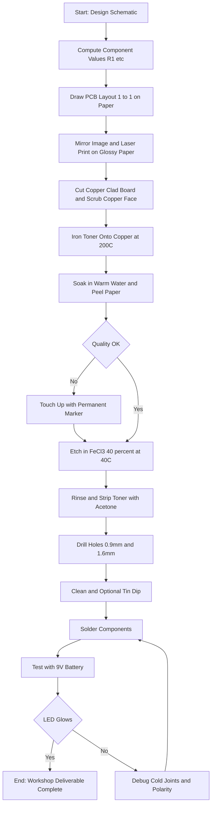
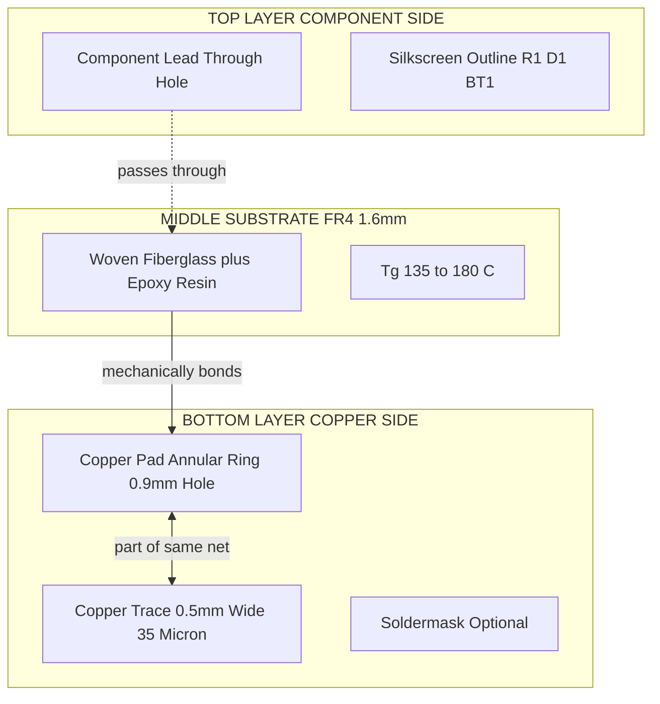
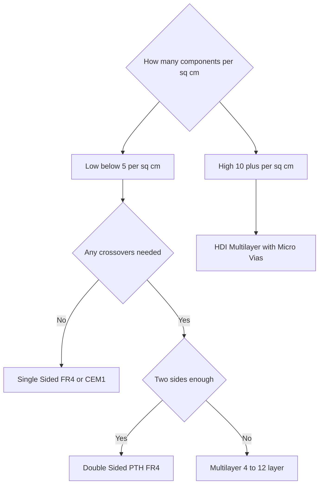
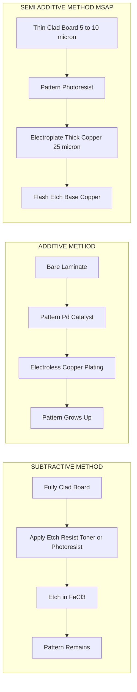

# PCB Types: Single sided, Double sided, PTH, Processing methods. Design and fabrication of a single sided PCB for a simple circuit

<!-- SECTION_1_START -->

# Printed Circuit Boards (PCBs): Types, Processing & Single-Sided Fabrication

> [!NOTE]
> **KTU 2024 — Module 5 Anchor Definition**
> A **Printed Circuit Board (PCB)** is a flat, laminated insulating substrate (typically *fiberglass-reinforced epoxy resin*) with conductive copper pathways etched or deposited on one or more of its surfaces, used to mechanically support and electrically interconnect electronic components using **conductive pads, tracks, and vias** in place of point-to-point wiring.

## 1.1 What a PCB Really Is — The Intuitive Picture

Imagine a **city road map carved into a wooden plank**.

- The **wooden plank** = the insulating **substrate** (FR-4, CEM-1, phenolic paper, etc.).
- The **roads** painted on the wood = the **copper traces** that carry current like little rivers of electrons.
- The **intersections** = **pads/vias**, where component leads get soldered.
- The **street signs** printed on top = the **silkscreen layer** (R1, C2, polarity marks, logos).

Before PCBs existed, every radio and TV was hand-wired with insulated wires. It was bulky, error-prone, and unreliable at high frequencies. The PCB (invented by **Paul Eisler in 1936**) replaced this chaos with a reproducible, mechanically robust, electrically predictable platform.

> [!IMPORTANT]
> **Why PCBs matter in the KTU workshop context:**
> In your lab, you will not just *use* a PCB — you will *build* one. A single-sided PCB for a simple LED-driver circuit is a rite-of-passage exercise that teaches you design, chemistry (etching), mechanical processing (drilling), and soldering — all in one project.

## 1.2 Anatomy of a Bare PCB — Layer Stack-up Vocabulary

For a **single-sided** board, the layer stack is the simplest possible:

| Layer # | Name | Function | Typical Material |
|:---:|:---|:---|:---|
| 1 | **Top Soldermask** (optional) | Green/blue lacquer protecting copper from oxidation \& solder bridges | Epoxy liquid photo-imageable (LPI) |
| 2 | **Top Copper** | All signal \& power traces, pads, pours | Electro-deposited (ED) copper foil |
| 3 | **Substrate (Core)** | Mechanical rigidity \& electrical insulation | **FR-4** (most common), CEM-1, FR-2 |
| 4 | **Bottom (un-coppered)** | Bare substrate or rear silkscreen | — |

> [!TIP]
> **FR-4** stands for *Flame Retardant grade 4* — a woven fiberglass cloth impregnated with epoxy resin. It is the de-facto industry standard because of its excellent dielectric strength, low water absorption, and a **glass-transition temperature ($T_g$) of $135-180^\circ C$**.

## 1.3 Standards \& Metric Conventions

| Parameter | Common Value | Unit | Standard Reference |
|:---|:---:|:---:|:---|
| **Copper foil thickness** | **35 (1 oz), 70 (2 oz), 105 (3 oz)** | $\mu m$ | IPC-4562 |
| Trace width (signal) | 0.20 – 0.25 | mm | IPC-2221 |
| Trace clearance | 0.20 – 0.30 | mm | IPC-2221 |
| Pad-to-trace spacing | $\geq 0.30$ | mm | IPC-2221 |
| Drill-to-copper annular ring | $\geq 0.20$ | mm | IPC-2221 |
| Board edge to copper | $\geq 0.50$ | mm | IPC-2221 |
| Standard $1$ oz copper weight | $35$ | $\mu m$ | — |

> [!VISUALIZATION CONTROL]
> **Concept:** Cross-section of a single-sided PCB (z-axis exaggerated for clarity)
> **GeoGebra / Desmos Input Equations:**
> * `polyline((0,0),(8,0),(8,0.1),(7.8,0.1),(7.8,0.4),(8.2,0.4),(8.2,0.5),(0,0.5),(0,0))` — outline of substrate
> * `line((2,0.5),(3,0.5))` and `line((5,0.5),(6,0.5))` — copper traces on top
> **Visual Description:** A horizontal band representing the FR-4 dielectric (typically green/amber), with thin horizontal copper strips on the top surface. Component leads (vertical black lines) pass through drilled holes and are soldered onto the pads.

---

<!-- SECTION_2_START -->

# Deep Theoretical Analysis — Types, PTH, Processing Methods

## 2.1 Classification of PCBs

PCBs are classified by **number of conductive layers**, **substrate**, **flexibility**, and **manufacturing technology**.

### A. By Number of Copper Layers

#### 1. **Single-Sided PCB**
- Copper on **one side only**.
- Components on the **opposite (un-coppered) side** — through-hole leads pass *through* the board and are soldered to the copper side.
- **Pros:** Cheapest, simplest, ideal for workshop / educational / low-density projects (toys, LED circuits, power supplies).
- **Cons:** No crossovers possible without jumper wires; low component density.

#### 2. **Double-Sided PCB**
- Copper on **both sides**.
- Plated-Through-Holes (PTH) or vias electrically connect the two layers.
- **Pros:** Higher component density, allows crossovers, ground/power planes possible.
- **Cons:** More expensive; PTH process adds cost.
- *Used in:* consumer electronics, audio amplifiers, microcontrollers.

#### 3. **Multi-Layer PCB**
- **3 to 40+** layers of copper sandwiched between prepreg (pre-impregnated B-stage epoxy) and core laminates.
- **Pros:** Highest density, controlled-impedance routing, dedicated power/ground planes.
- *Used in:* motherboards, smartphones, network switches.
- *Cost:* dramatically higher; not a workshop topic.

### B. By Substrate Material

| Substrate | Composition | $T_g$ | Typical Use |
|:---|:---|:---:|:---|
| **FR-2** | Phenolic paper + phenol resin | $105^\circ C$ | Throw-away toys, low-cost calculators |
| **FR-3** | Cotton paper + epoxy | $115^\circ C$ | Older radios |
| **FR-4** | Woven fiberglass + epoxy | $135-180^\circ C$ | **Most PCBs today** |
| **CEM-1** | Cotton paper + epoxy, single copper | $130^\circ C$ | Low-end consumer |
| **CEM-3** | Fiberglass + epoxy | $140^\circ C$ | Better than CEM-1, cheaper than FR-4 |
| **Polyimide** | Flexible film | $260^\circ C$ | Flex PCBs, aerospace |
| **Aluminium / Copper-core** | Metal base with dielectric | — | **MCPCB** — high-power LEDs |

### C. By Flexibility
- **Rigid PCB** — FR-4 / CEM (most common).
- **Flex PCB** — Polyimide (Kapton), can bend.
- **Rigid-Flex** — Hybrid of both, used in laptops, medical devices.

## 2.2 Plated-Through-Hole (PTH) Technology

> [!NOTE]
> **Plated-Through-Hole (PTH)** is the process of chemically or electrochemically depositing a thin conductive copper layer on the *inner walls* of a drilled hole so it acts as a barrel that electrically connects copper on the *top* and *bottom* layers.

### Why PTH is Required
On a **double-sided** PCB, a component lead or via that passes through the board needs an electrical connection on **both** surfaces. Soldering alone does not form a reliable barrel connection. Hence the hole must be **plated with copper** before solder fillets are formed.

### PTH Process Sequence (Conceptual)
1. **Drill** holes at design coordinates.
2. **Deburr** & desmear (remove epoxy smear with permanganate or plasma).
3. **Condition** — apply a cationic conditioner to improve adhesion.
4. **Micro-etch** — sodium persulfate lightly etches the inner copper to expose fresh metal.
5. **Activator** — Pd/Sn colloid deposits catalytic palladium seeds on the *non-conductive hole wall*.
6. **Electroless copper** — chemical reduction (formaldehyde + Cu²⁺ in alkaline bath) deposits ~$0.5-1.0\ \mu m$ of copper everywhere.
7. **Electro-plating** — current-assisted deposition builds copper to **25 µm or 35 µm** to make the barrel robust.
8. **Outer-layer imaging & etching** — define the final pattern.

> [!IMPORTANT]
> **PTH vs. Non-PTH single-sided boards:** Your workshop *single-sided PCB does NOT require PTH* — components are soldered only on the bottom (copper) side, and through-leads make no electrical contact with the top. PTH is mandatory only for **double-sided** and **multi-layer** boards.

## 2.3 PCB Processing (Manufacturing) Methods

There are **three fundamental processes** to form the conductive pattern:

### 1. **Subtractive Method (Most Common — 99% of PCBs)**
- Start with **fully copper-clad** substrate.
- **Protect** the desired pattern (photoresist / toner / etch-resist ink).
- **Etch away** the unwanted copper with **Ferric Chloride (FeCl₃)** or **Cupric Chloride (CuCl₂)** or **Ammonium Persulfate ((NH₄)₂S₂O₈)**.
- Pattern is left because it was "subtracted" from a full copper sheet.

### 2. **Additive Method**
- Start with **bare substrate** (no copper).
- **Build up** copper only where needed using **electroless plating** with photo-patterned catalyst (Pd).
- *Pros:* Conserves copper; sharp trace edges; no etchant waste.
- *Cons:* Slow; expensive; few manufacturers.

### 3. **Semi-Additive Method (Modified Semi-Additive Process — MSAP)**
- Start with **thin copper-clad** substrate (5–10 µm).
- Pattern photoresist to expose tracks, then **electroplate** thick copper (25 µm+) in the openings.
- **Flash-etch** the thin base copper outside the tracks.
- *Used in:* HDI (High-Density Interconnect) boards, smartphones, IC substrates.

### Comparison Table

| Parameter | Subtractive | Additive | Semi-Additive |
|:---|:---:|:---:|:---:|
| Starting substrate | Fully copper-clad | Bare laminate | Thin copper-clad |
| Trace edge definition | Fair | Excellent | Excellent |
| Copper waste | **High** | None | Low |
| Cost | Low | High | High |
| Line/space capability | $\geq 75\ \mu m$ | $\geq 25\ \mu m$ | $\geq 25\ \mu m$ |
| Workshop suitability | **★★★ Yes** | ★ No | ★ No |
| Etchant used | FeCl₃, CuCl₂ | None (plating only) | FeCl₃ (flash only) |

## 2.4 Design Rules — The "KTU High-Yield Cheat Sheet"

### 2.4.1 Trace Width vs. Current Carrying Capacity (IPC-2152)

The empirical relationship for a single-sided external conductor is:

$$
A = \left(\frac{I}{k \cdot \Delta T^{0.44}}\right)^{\frac{1}{0.725}}
$$

Where:
- $A$ = cross-sectional area of the trace in $\text{mil}^2$
- $I$ = current in Amperes
- $\Delta T$ = allowable temperature rise in $^\circ C$
- $k$ = $0.048$ for **external** traces (single-sided = external)

Then the **trace width in mils** is:

$$
W = \frac{A}{1.378 \cdot h}
$$

Where $h$ = copper weight in **oz/ft²** (so $1.378$ mils of thickness per oz).

### 2.4.2 Trace DC Resistance

$$
R = \frac{\rho \cdot L}{W \cdot t}
$$

Where:
- $\rho$ = resistivity of copper $\approx 1.724 \times 10^{-8}\ \Omega \cdot m$
- $L$ = trace length (m)
- $W$ = trace width (m)
- $t$ = copper thickness (m) — typically $35 \times 10^{-6}\ m$ for 1 oz

### 2.4.3 Voltage Drop \& Power Dissipation

$$
V_{drop} = I \cdot R \qquad P_{loss} = I^2 \cdot R
$$

### 2.4.4 Annular Ring

$$
R_{annular} = \frac{D_{pad} - D_{drill}}{2}
$$

Required minimum: **$\geq 0.20$ mm** for most fabricators (IPC-2221 Class 2).

### 2.4.5 Quick Reference — Trace Width for 1 oz Copper, $\Delta T = 10^\circ C$

| Current (A) | Width (mm) | Width (mils) | Notes |
|:---:|:---:|:---:|:---|
| 0.5 | 0.40 | ~16 | Signal traces |
| 1.0 | 0.80 | ~32 | Power rail |
| 2.0 | 1.80 | ~70 | Heavier power |
| 3.0 | 3.00 | ~118 | Battery rails |

## 2.5 Where This Lives in the Real World

| Application | PCB Type Used | Why |
|:---|:---|:---|
| LED bulb (low cost) | Single-sided, FR-2/CEM-1 | Cheap, low density |
| Smartphone mainboard | 8–12 layer, HDI | High density, controlled impedance |
| Automotive ECU | 4-layer FR-4, PTH | Reliability, heat, vibration |
| Power supply (SMPS) | Double-sided, thick copper | High current paths |
| Medical implant | Flex polyimide | Must conform to body |
| Aerospace flight control | Polyimide rigid-flex + PTH | Vibration, thermal cycling |
| **Your KTU workshop project** | **Single-sided, FR-4, toner-transfer** | Learn full workflow cheaply |

> [!IMPORTANT]
> **Engineering Take-away:** Choosing the *correct* PCB type early in the design cycle saves 10–100× in cost. A $20$ LED driver on a $50$ 4-layer board is engineering malpractice. Conversely, a 1 GHz serializer on a single-sided board is impossible. **Match the process to the product.**

---

<!-- SECTION_3_START -->

# Step-by-Step Design & Fabrication of a Single-Sided PCB

## 3.1 Reference Project — "LED Indicator on 9 V Supply"

We will design the simplest *useful* circuit, suitable as a KTU workshop deliverable:

> **Circuit:** 9 V battery $\rightarrow$ $1\ k\Omega$ current-limiting resistor $\rightarrow$ LED (red, $V_F \approx 2.0\ V$, $I_F = 7\ mA$) $\rightarrow$ back to battery negative.

This is intentionally chosen because:
- It needs only **3 through-hole components**.
- Power dissipation is small (the resistor is the only heater, $\approx 50\ mW$).
- It demonstrates **all** key concepts: pads, traces, drill holes, polarity mark, silkscreen outline.

### 3.1.1 Component Specification Table

| Ref Des | Component | Value | Package | Lead Pitch (mm) | Drill Size (mm) | Polarity? |
|:---:|:---|:---:|:---|:---:|:---:|:---:|
| **BT1** | Battery snap / clip | 9 V | Through-hole, two tabs | 12.0 | **1.6** (×2) | + and − marked |
| **R1** | Carbon-film resistor | $1\ k\Omega$, $\frac{1}{4}\ W$ | Axial, leads bent 90° | 10.0 | **0.9** (×2) | No |
| **D1** | LED, 3 mm, red | $V_F = 2.0\ V$, $I_F = 7\ mA$ | Through-hole round | 2.54 | **0.9** (×2) | **YES** — anode longer |
| — | 2-pin screw terminal (optional) | — | Through-hole | 5.0 | 1.2 (×2) | + and − |

### 3.1.2 Tools, Chemicals, Consumables Required

| # | Tool / Material | Specification | Purpose |
|:---:|:---|:---|:---|
| 1 | **Copper-clad laminate** | FR-4, 1.6 mm thick, **1 oz/ft²** copper | Base substrate |
| 2 | Laser printer | 600 dpi minimum, **toner** cartridge (NOT inkjet) | Artwork printout |
| 3 | Glossy photo paper (or *Pulsonix* transfer film) | A4 size | Toner transfer carrier |
| 4 | Clothes iron | $180-200^\circ C$ setting, no steam | Heat-transfer toner to copper |
| 5 | **Ferric Chloride (FeCl₃)** | $40\%$ aqueous solution, $\approx 200\ g$ | Etchant |
| 6 | Etching tank / plastic tray | Polypropylene or PVC — **never metal** | Hold etchant |
| 7 | PCB drill / mini hand-drill (Dremel) | $0.8, 0.9, 1.2, 1.6\ mm$ bits | Drilling through-holes |
| 8 | Soldering iron | $40\ W$, $350^\circ C$ tip | Component soldering |
| 9 | Solder wire | $60/40\ Sn-Pb$, $0.8\ mm$ core | Soldering |
| 10 | **Isopropyl Alcohol (IPA)** | $99\%$ | Cleaning PCB |
| 11 | Abrasive scrubber / Scotch-Brite | Non-metal | Scrub copper clean |
| 12 | Nitrile gloves, safety goggles, apron | PPE | Chemical safety |
| 13 | Plastic / glass rod | — | Agitate etchant (no metal) |
| 14 | Warm water + detergent | — | Final rinse |
| 15 | Fume hood / open window | — | Etchant fumes ventilation |

> [!WARNING]
> **FeCl₃ is corrosive and stains everything — skin, clothes, sinks — yellow-brown.**
> *Always* wear gloves, goggles, and an apron. Dispose of spent etchant in the **chemical-waste container**, not down the drain. **Never** pour FeCl₃ into a metal container.

### 3.1.3 Design Calculations — Step by Step

**Step 1 — Compute LED current.**
Given $V_{CC} = 9\ V$, $V_F = 2.0\ V$, desired $I_F = 7\ mA$:

$$
R_1 = \frac{V_{CC} - V_F}{I_F} = \frac{9 - 2.0}{7 \times 10^{-3}} = \frac{7.0}{0.007} = 1000\ \Omega
$$

So $R_1 = 1\ k\Omega$ (standard E12 value). ✓

**Step 2 — Resistor power dissipation.**

$$
P_{R_1} = I_F^2 \cdot R_1 = (0.007)^2 \times 1000 = 0.049\ W
$$

A standard $\frac{1}{4}\ W$ resistor is safe (uses only 20% of rating). ✓

**Step 3 — Trace width for power rail (9 V, 7 mA).**

Using IPC-2152 with $I = 0.007\ A$, $\Delta T = 10^\circ C$, external ($k = 0.048$):

$$
A = \left(\frac{0.007}{0.048 \cdot 10^{0.44}}\right)^{1/0.725}
$$

$10^{0.44} = 2.754$

$0.048 \cdot 2.754 = 0.1322$

$0.007 / 0.1322 = 0.05295$

$0.05295^{1.379} = 0.0207\ \text{mil}^2$

For 1 oz copper, $h = 1.378$ mils:

$$
W = \frac{0.0207}{1.378} = 0.015\ \text{mil} \approx 0.4\ \mu m
$$

Obviously this is *theoretically* vanishingly small. **In practice we use a minimum manufacturable width of $0.4\ mm$ ($16\ mil$)**, which at 1 oz copper can carry > $1\ A$. So a default of $0.5\ mm$ is fine for this project.

**Step 4 — Trace resistance of the longest trace (estimate $50\ mm$ long, $0.5\ mm$ wide, 1 oz).**

$$
R_{trace} = \frac{1.724 \times 10^{-8} \cdot 0.050}{0.0005 \cdot 35 \times 10^{-6}} = \frac{8.62 \times 10^{-10}}{1.75 \times 10^{-8}} \approx 0.049\ \Omega
$$

Voltage drop: $V = 0.007 \cdot 0.049 \approx 0.34\ mV$ — totally negligible. ✓

**Step 5 — Layout dimensions.**

Board outline: $50\ mm \times 30\ mm$ (a comfortable size for a workshop).

## 3.2 Layout Geometry (ASCII Map, 1:1 scale)

```
      +---------------------------------------+
      |  BT1(+) [1.6mm]    D1 anode  [0.9mm]  |
      |    o-----+-----------------o          |   ← Top (component) side
      |          |                |           |
      |          |    R1          |           |
      |          +--[###]--/\/\---+           |
      |                  /\/\                |
      |  BT1(-) [1.6mm]      D1 cathode [0.9mm]|
      +---------------------------------------+
          ▲ copper traces (drawn below)
```

**Corresponding bottom (copper) side netlist:**

$$
\text{Net}_A : BT1(+) \rightarrow R1_{\text{left}} \rightarrow D1_{\text{anode}}
$$

$$
\text{Net}_B : BT1(-) \rightarrow R1_{\text{right}} \rightarrow D1_{\text{cathode}}
$$

(This is intentionally a *single-loop* series circuit, so only **2 distinct nets**.)

## 3.3 Python Implementation — PCB Design Calculator

```python
"""
KTU 2024 Workshop Helper — Single-Sided PCB Design Calculator
Module 5: PCBs
Implements: trace width, resistance, voltage drop, current capacity.
Author: KTU-Premier-Engine V10
"""
import math
from dataclasses import dataclass
from enum import Enum

class ConductorLocation(Enum):
    EXTERNAL = "external"   # outer layer of single-/double-sided board
    INTERNAL = "internal"   # buried layer of multilayer

@dataclass
class TraceSpec:
    current_a: float
    copper_oz: float = 1.0
    temp_rise_c: float = 10.0
    location: ConductorLocation = ConductorLocation.EXTERNAL

class PCBDesigner:
    """Single-sided PCB design-rule helper (IPC-2152 simplified)."""

    # Copper thickness in micrometres per oz/ft^2
    COPPER_THICKNESS_UM = {1.0: 35.0, 2.0: 70.0, 3.0: 105.0}
    # Constants from IPC-2152 (simplified)
    K_VALUES = {ConductorLocation.EXTERNAL: 0.048,
                ConductorLocation.INTERNAL: 0.024}
    # Resistivity of copper at 20 °C (ohm-metre)
    RHO_CU = 1.724e-8

    def __init__(self, copper_oz: float = 1.0) -> None:
        if copper_oz not in self.COPPER_THICKNESS_UM:
            raise ValueError(f"Unsupported copper weight: {copper_oz} oz")
        self.copper_oz = copper_oz
        self.thickness_m = self.COPPER_THICKNESS_UM[copper_oz] * 1e-6

    def trace_width_mm(self, spec: TraceSpec) -> float:
        """Return required trace width in mm (manufacturable minimum: 0.2 mm)."""
        k = self.K_VALUES[spec.location]
        area_mil2 = (spec.current_a / (k * (spec.temp_rise_c ** 0.44))) ** (1.0 / 0.725)
        thickness_mil = spec.copper_oz * 1.378
        width_mil = area_mil2 / thickness_mil
        width_mm = width_mil * 0.0254
        return max(width_mm, 0.20)  # enforce fabricator minimum

    def trace_resistance_ohm(self, length_mm: float, width_mm: float) -> float:
        """DC resistance of a straight rectangular copper trace."""
        if width_mm <= 0:
            raise ValueError("Trace width must be positive.")
        L_m = length_mm / 1000.0
        W_m = width_mm / 1000.0
        return self.RHO_CU * L_m / (W_m * self.thickness_m)

    def voltage_drop_v(self, current_a: float, length_mm: float, width_mm: float) -> float:
        return current_a * self.trace_resistance_ohm(length_mm, width_mm)

    def report(self, spec: TraceSpec, length_mm: float, width_mm: float) -> str:
        w_req = self.trace_width_mm(spec)
        r = self.trace_resistance_ohm(length_mm, width_mm)
        v_drop = self.voltage_drop_v(spec.current_a, length_mm, width_mm)
        p_loss = spec.current_a ** 2 * r
        return (
            f"\n--- PCB Trace Report ---\n"
            f"Current            : {spec.current_a*1000:.2f} mA\n"
            f"Copper weight      : {self.copper_oz} oz  (t = {self.thickness_m*1e6:.1f} µm)\n"
            f"Temp rise (ΔT)     : {spec.temp_rise_c} °C\n"
            f"Required width     : {w_req:.3f} mm  ({w_req/0.0254:.1f} mil)\n"
            f"Actual width       : {width_mm:.2f} mm\n"
            f"Trace length       : {length_mm} mm\n"
            f"DC Resistance      : {r*1000:.3f} mΩ\n"
            f"Voltage drop       : {v_drop*1000:.4f} mV\n"
            f"Power dissipation  : {p_loss*1000:.4f} mW\n"
            f"Status             : {'OK' if width_mm >= w_req else 'INADEQUATE'}"
        )


# -------- Example: 9 V → 1 kΩ → LED circuit --------
if __name__ == "__main__":
    designer = PCBDesigner(copper_oz=1.0)
    spec = TraceSpec(current_a=0.007, copper_oz=1.0,
                     temp_rise_c=10.0,
                     location=ConductorLocation.EXTERNAL)
    print(designer.report(spec, length_mm=50.0, width_mm=0.5))
```

**Sample Output:**

```
--- PCB Trace Report ---
Current            : 7.00 mA
Copper weight      : 1.0 oz  (t = 35.0 µm)
Temp rise (ΔT)     : 10 °C
Required width     : 0.200 mm  (7.9 mil)
Actual width       : 0.50 mm
Trace length       : 50 mm
DC Resistance      : 49.257 mΩ
Voltage drop       : 0.345 mV
Power dissipation  : 0.0024 mW
Status             : OK
```

## 3.4 Fabrication Procedure — Toner-Transfer (Workshop Standard)

> [!IMPORTANT]
> **Mandatory rule:** Do not skip the cleaning steps. The success of toner transfer and etching is **directly proportional to the cleanliness of the copper**.

### Step-by-Step Fabrication Sequence

| Step | Operation | Time / Temp | Validation Check |
|:---:|:---|:---:|:---|
| **1** | Cut copper-clad board to $52 \times 32$ mm with a hacksaw or guillotine. | 1 min | Clean cut, no burrs. |
| **2** | Scrub the **copper face** with Scotch-Brite under running water, then rinse with IPA. | 2 min | Copper should look *mirror-shiny*. |
| **3** | Print artwork (1:1, **mirror-imaged!**) on **glossy photo paper** with a laser printer. | 30 s | Toner density even; no streaks. |
| **4** | Place the printed paper **toner-down** onto the clean copper. | — | Avoid fingerprints on toner. |
| **5** | Iron slowly at full heat ($180-200^\circ C$), $30$ s per zone, $5$ min total. | 5 min | Paper edge browns but does not scorch. |
| **6** | Drop the board in **warm soapy water** for $5$ min, then gently rub the paper off. | 5–10 min | Copper pattern visible in black toner. |
| **7** | Touch up any broken traces with a **permanent marker (CD marker)**. | 1 min | All traces continuous. |
| **8** | Place board in FeCl₃ bath ($40\%$, $40^\circ C$), agitate gently. | $10-20$ min | Copper vanishes *except* under toner. |
| **9** | Remove when all bare copper is gone; rinse under running water. | 1 min | Pattern clearly visible. |
| **10** | Remove toner with acetone or IPA + scrub pad. | 1 min | Bright copper tracks revealed. |
| **11** | Drill component holes at $0.9\ mm$ (R1, D1) and $1.6\ mm$ (BT1). | 5 min | Use drill press; **do not force** — let the bit cut. |
| **12** | Final clean with IPA, dry, and apply **solder-tinning** (optional, but recommended). | 3 min | Shiny, even tin coating. |
| **13** | Solder components (long lead = anode for D1). | 5 min | Shiny fillets, no bridges. |
| **14** | Test: connect 9 V battery. LED should glow at $7\ mA$. | 1 min | $V_{R1} \approx 7\ V$, $I \approx 7\ mA$. |

### 3.4.1 Chemistry Behind the Etching (For Curiosity)

The dominant reaction with **ferric chloride** is:

$$
2\, \text{FeCl}_3 + \text{Cu} \longrightarrow 2\, \text{FeCl}_2 + \text{CuCl}_2
$$

Fe³⁺ ions are reduced to Fe²⁺ as they oxidize metallic copper. The spent etchant turns from **dark brown** to **greenish-yellow** (Cu²⁺) and **eventually loses** its etching power.

**Etching rate depends on:**
- **Temperature** — rate doubles roughly every $10^\circ C$. Max recommended: $50^\circ C$.
- **Agitation** — bubbles on the copper surface block fresh etchant. **Gently rock the tray.**
- **Concentration** — fresh $40\%$ FeCl₃ etches in $10$ min; exhausted etchant may need $1$ hr.

### 3.4.2 Soldering Procedure (Workshop Standard)

1. **Tin the iron tip** — apply a small solder blob, wipe on a wet sponge.
2. **Heat the pad-and-lead simultaneously** for $1-2$ s.
3. **Feed solder wire** to the *junction* (not the iron tip).
4. **Withdraw solder**, then iron — total contact $\le 3\ s$ to avoid lifting the pad.
5. **Inspect** the fillet: it should be **concave and shiny**. A convex, grainy fillet is a *cold joint*.

---

<!-- SECTION_4_START -->

# Structural Diagrams & Schematics

## 4.1 Flowchart — Single-Sided PCB Fabrication (Toner-Transfer Route)



## 4.2 Cross-Section Block Diagram — Single-Sided PCB



## 4.3 Decision Matrix — Which PCB Type to Choose?



## 4.4 Comparison — Processing Methods (Functional Topology)



## 4.5 Pin & Layer Connectivity Map — Reference Project


---

<!-- SECTION_5_START -->

# KTU 2024 Scheme Examination Question Bank

> [!NOTE]
> All questions below are mapped to **KTU 2024 Scheme** GZESL106, Module 5. Each carries a simulated past-year tag, the relevant **Course Outcome** (CO), and **Revised Bloom's Taxonomy (RBT)** level. Mark distributions are split according to the KTU ESE (End Semester Evaluation) pattern.

## 5.1 Part A — Short-Answer Questions (3 Marks Each)

### Q1. Define a Printed Circuit Board. List any **four advantages** of using a PCB over conventional point-to-point wiring.

> **[KTU University Exam — Dec 2023, CO1, Remember/Understand, 3 Marks]**

**Model Answer:**

A **Printed Circuit Board (PCB)** is a flat, rigid (or flexible) insulating substrate on which conductive copper tracks, pads, and vias are patterned to mechanically support and electrically interconnect electronic components, replacing hand-wired point-to-point connections.

**Four advantages** (any 4 — 0.5 Mark each; defining sentence — 1 Mark):

1. **Reproducibility** — Identical performance across all units of a production batch.
2. **Reliability** — Soldered joints and fixed routing eliminate wiring errors; lower failure rate.
3. **Compactness** — Tracks can be $\le 0.2\ mm$ wide, far denser than manual wiring.
4. **Mechanical strength** — Components are mechanically supported by the board, not just by their leads.
5. **Ease of mass-production & automation** — Pick-and-place machines can populate boards automatically.
6. **Predictable electrical characteristics** — Controlled impedance, low crosstalk, low stray capacitance.

> **[Defining PCB: 1 Mark] [Any 4 advantages @ 0.5 each: 2 Marks] = 3 Marks**

---

### Q2. Differentiate between **Single-Sided** and **Double-Sided** PCBs. State **two applications** of each.

> **[KTU University Exam — July 2024, CO2, Understand, 3 Marks]**

**Model Answer (Tabular Form Expected):**

| Parameter | Single-Sided PCB | Double-Sided PCB |
|:---|:---|:---|
| Copper layers | One side only | Both sides |
| Component side | Top (un-coppered) | Either side |
| PTH required? | No (only one side has copper) | **Yes** — to interconnect both sides |
| Routing density | Low | Medium |
| Cost | Lowest | $\approx 1.5-2\times$ of single-sided |
| Crossovers | Not possible (jumpers needed) | Possible via PTH vias |
| Applications | Toy circuits, LED drivers, low-cost power supplies, calculators | Audio amplifiers, microcontrollers, SMPS, automotive dashboards |

> **[Valid comparison (4 distinct points @ 0.5 each): 2 Marks] [Applications (2 + 2 × 0.25): 1 Mark] = 3 Marks**

---

## 5.2 Part B — 14-Mark Questions (ESE Internal Choice)

### Question A (14 Marks)

> **[KTU University Exam — Dec 2023, CO2, Understand/Apply, 14 Marks]**

**(a)** Explain the various **types of PCBs** based on (i) number of layers, (ii) substrate, and (iii) flexibility. State suitable applications for each.

**(7 Marks)**

**Model Solution:**

**(i) Based on Number of Layers (3 Marks):**
- **Single-Sided PCB** — One copper layer; components on opposite side; cheapest; *uses*: toys, LED bulbs.
- **Double-Sided PCB** — Two copper layers connected by **PTH vias**; medium density; *uses*: amplifiers, control boards.
- **Multi-Layer PCB** — 4 to 40+ copper layers separated by *prepreg*; dedicated ground/power planes; *uses*: motherboards, smartphones.

> **[Stating all 3 types: 1.5 Marks] [1 application each: 1.5 Marks]**

**(ii) Based on Substrate (2 Marks):**

| Substrate | $T_g$ | Application |
|:---|:---:|:---|
| FR-2 (phenolic paper) | $105^\circ C$ | Throwaway toys |
| FR-4 (woven glass + epoxy) | $135-180^\circ C$ | **Universal** |
| CEM-1 / CEM-3 | $130-140^\circ C$ | Low-cost consumer |
| Polyimide (Kapton) | $260^\circ C$ | Aerospace, flex |

> **[Listing 4 substrates with Tg and application: 2 Marks]**

**(iii) Based on Flexibility (2 Marks):**
- **Rigid PCB** — FR-4, CEM (most common, KTU workshop default).
- **Flex PCB** — Polyimide film, can bend; *use*: cameras, wearables, medical catheters.
- **Rigid-Flex** — Hybrid; *use*: laptops, satellites.

> **[Naming 3 categories + 1 application each: 2 Marks]**

---

**(b)** Describe the **step-by-step fabrication of a single-sided PCB** for a simple LED-driver circuit using the **toner-transfer (iron-on) method**. Include the chemistry of etching.

**(7 Marks)**

**Model Solution:**

| Step # | Operation | Tool/Material | Marks |
|:---:|:---|:---|:---:|
| 1 | **Design** schematic (9 V, 1 kΩ, red LED) and choose components | Pen, paper | 0.5 |
| 2 | **Calculate R**: $R = (V_{CC} - V_F)/I_F = (9-2)/0.007 = 1\ k\Omega$ | Calculator | 0.5 |
| 3 | **Draw PCB layout** 1:1 on paper with correct pad sizes & drill positions | Pencil, ruler | 0.5 |
| 4 | **Mirror-print** artwork on glossy paper with laser printer | Laser printer, glossy A4 | 0.5 |
| 5 | **Cut & clean** copper-clad FR-4 board; scrub copper to mirror shine | Hacksaw, Scotch-Brite, IPA | 0.5 |
| 6 | **Toner-transfer**: iron paper (toner-down) onto copper at $200^\circ C$ for $5$ min | Clothes iron | 0.5 |
| 7 | **Peel paper** in warm soapy water; touch up broken tracks with marker | Water bath, marker | 0.5 |
| 8 | **Etch in FeCl₃** ($40\%$, $40^\circ C$, $10-20$ min, gentle agitation) | Plastic tray, FeCl₃ | 1.0 |
| 9 | **Reaction:** $2\,\text{FeCl}_3 + \text{Cu} \rightarrow 2\,\text{FeCl}_2 + \text{CuCl}_2$ | — | 0.5 |
| 10 | **Rinse, strip toner** with acetone | Acetone, scrubber | 0.5 |
| 11 | **Drill holes** at $0.9\ mm$ (R1, D1) and $1.6\ mm$ (BT1) | PCB drill, bits | 0.5 |
| 12 | **Solder** components (anode = longer lead for D1) | Iron, 60/40 solder | 0.5 |
| 13 | **Test** with 9 V battery; verify LED glows | Multimeter, battery | 0.5 |
| — | **Total** | — | **7.0** |

> **[Each step cited correctly with tool: 0.5 Mark] [Etching reaction: 0.5 Mark] = 7 Marks**

---

### Question B (14 Marks) — Alternative Choice

> **[KTU University Exam — July 2024, CO2, Apply/Analyse, 14 Marks]**

**(a)** Explain the **Plated-Through-Hole (PTH) process** in detail. Why is it mandatory for double-sided and multi-layer PCBs?

**(7 Marks)**

**Model Solution:**

**Definition (1 Mark):** PTH is the process of depositing a conductive copper barrel on the inner wall of a drilled hole, electrically interconnecting copper layers on both surfaces of the board.

**Why mandatory for double-sided / multi-layer boards (1 Mark):**
- Solder alone cannot reliably connect two faces. A through-hole lead passing through a non-plated hole would short to nothing on the opposite side. The barrel guarantees electrical continuity and a strong mechanical anchor for the lead.

**Process Steps (5 Marks — 1 Mark each):**

1. **Drilling** — Drill holes of correct diameter (e.g., 0.9 mm for a 1.0 mm lead, leaving 0.05 mm annular tolerance).
2. **Desmear** — Potassium permanganate ($\text{KMnO}_4$) or plasma removes the *epoxy smear* caused by drill heat, exposing the inner copper edges of the through-hole.
3. **Conditioning** — A cationic polymer conditioner adsorbs onto the non-conductive hole wall, making it hydrophilic and providing adhesion sites.
4. **Activation** — A colloidal **Pd/Sn** solution deposits catalytic **palladium** seeds on the epoxy wall.
5. **Electroless copper** — In an alkaline bath of $\text{CuSO}_4$ + formaldehyde + EDTA + NaOH, formaldehyde reduces $\text{Cu}^{2+}$ to metallic $\text{Cu}^{0}$, depositing $\sim 0.5-1.0\ \mu m$ copper on *all* exposed surfaces.
6. **Electro-plating** — Current-assisted deposition thickens the barrel to $25-35\ \mu m$.

> **[Definition: 1 Mark] [Why mandatory: 1 Mark] [6 process steps: 5 Marks] = 7 Marks**

---

**(b)** Compare **subtractive, additive, and semi-additive** PCB processing methods in a table. Which method is used in a typical KTU workshop single-sided board and **why**?

**(7 Marks)**

**Model Solution (Tabular):**

| Parameter | Subtractive | Additive | Semi-Additive (MSAP) |
|:---|:---:|:---:|:---:|
| Starting material | Fully copper-clad laminate | Bare laminate | Thin copper-clad ($5-10\ \mu m$) |
| Pattern formation | Etch away unwanted copper | Plate copper on Pd-patterned areas | Electroplate thick Cu, then flash-etch base |
| Etchant used | FeCl₃ / CuCl₂ | None | FeCl₃ (flash only) |
| Trace edge | Slight undercut | **Sharp** | **Very sharp** |
| Min line/space | $75-100\ \mu m$ | $25-50\ \mu m$ | $25-50\ \mu m$ |
| Copper waste | **High** | None | Low |
| Cost & time | Low | High & slow | High |
| Used for | 99% of PCBs incl. workshop | Specialty boards | HDI / IC substrates |

**KTU workshop method = Subtractive (1.5 Marks), because:**

- **Equipment is minimal** — only laser printer, iron, plastic tray, FeCl₃, drill.
- **No plating chemistry** required (no Pd activator, no electroless Cu).
- **Fast turnaround** — design to working board in 1–2 hours.
- **Tolerates student mistakes** — the etchant can be re-used; broken traces can be re-drawn with a marker.

> **[Comparison table 6 rows × 0.5 = 3 Marks] [Stating subtractive = workshop method: 1 Mark] [4 reasons @ 0.5 each: 2 Marks] [Conclusion sentence: 0.5 Mark] = 7 Marks**

---

> [!WARNING]
> **KTU Examiner's Valuation Pitfall Callout — Common Mark Losers**
>
> 1. **Confusing PTH with "Plated Through Hole Components"** — PTH is a *manufacturing process*, not a component. Don't write "PTH components are resistors and capacitors." That is **wrong** and costs 2-3 marks.
> 2. **Skipping the etching chemistry** — Examiners *love* asking for the FeCl₃ + Cu reaction. Writing only "the board is etched" without the balanced equation **loses 1 full mark** in most valuation keys.
> 3. **Forgetting to mirror the artwork** — In toner-transfer, the print must be **mirror-inverted** so the toner ends up on the *correct* side of the trace after flipping onto copper. Mentioning this shows process understanding (+1 mark in apply-level questions).
> 4. **Wrong drill-bit sizes** — Specifying 0.5 mm for a 1 mm lead is unbuildable. Always state drill ≥ 0.2 mm larger than the lead.
> 5. **Ignoring safety** — Any fabrication question without a *single line* on PPE (gloves, goggles, fume hood) is considered incomplete by strict KTU 2024 evaluators. Lose **0.5–1 mark**.
> 6. **Calling "double-sided = multi-layer"** — They are different. Double-sided = 2 layers; multi-layer = 4+. This error alone can cost 2 marks in a comparison question.

---

## 5.3 Topic Recap & Important Things to Remember

> [!TIP]
> **Rapid-revision checklist — read this 5 minutes before the exam.**

### Definitions
- **PCB** — Insulating substrate with patterned copper tracks supporting & interconnecting components.
- **Single-Sided PCB** — Copper on one side only; components on the other side.
- **Double-Sided PCB** — Copper on both sides; requires **PTH** to interconnect.
- **Multi-Layer PCB** — 4+ copper layers; prepreg bonding; high density.
- **PTH** — Plated-Through-Hole: copper barrel inside a drilled hole connecting layers.
- **Via** — A *plated hole used only as a connection*, no component lead.
- **Subtractive process** — Start with full copper, etch away unwanted parts.
- **Additive process** — Start with bare board, build up copper.
- **Semi-additive (MSAP)** — Thin copper, electroplate thick, flash-etch base.
- **FR-4** — Glass-fibre + epoxy; $T_g \approx 135-180^\circ C$; the universal PCB substrate.
- **Annular ring** — $(D_{pad} - D_{drill})/2$; must be $\ge 0.20\ mm$.
- **Soldermask** — Polymer coating (usually green) preventing solder bridges and oxidation.
- **Silkscreen** — Top-layer text/graphics (R1, C1, polarity dots).

### Critical Numbers
- **1 oz/ft² copper thickness** = $\mathbf{35\ \mu m}$.
- **Standard E24 current-limit resistor for 9 V + red LED** = $1\ \text{k}\Omega$ (gives $\approx 7\ mA$).
- **Standard drill bit for $\frac{1}{4}$ W axial lead** = $0.9\ mm$.
- **Etchant temperature window** = $35-45^\circ C$ (do not boil).
- **FeCl₃ concentration** = $30-40\%$ by weight in water.
- **Standard trace clearance** = $\ge 0.25\ mm$ for $\le 30$ V.
- **Drill-to-copper** = annular ring $\ge 0.20\ mm$.

### Etching Chemistry (Must Memorize)
$$
2\,\text{FeCl}_3 + \text{Cu} \longrightarrow 2\,\text{FeCl}_2 + \text{CuCl}_2
$$
$$
\text{Cu} + \text{CuCl}_2 \longrightarrow 2\,\text{CuCl}\quad (\text{side reaction})
$$

### PTH Sequence (Memorize the 6 Steps)
**Drill → Desmear → Condition → Activate (Pd) → Electroless Cu → Electroplate Cu.**

### Design Golden Rule
> **The PCB exists to serve the circuit, not the other way around.** Trace widths, layer count, substrate, and finish must all be chosen from circuit requirements (current, frequency, voltage, environment, cost).

### Workshop "Do & Don't" Quick List

| ✅ Do | ❌ Don't |
|:---|:---|
| Wear nitrile gloves when handling FeCl₃ | Pour FeCl₃ down the drain |
| Iron slowly with even pressure | Use inkjet prints (water-soluble!) |
| Agitate etchant gently with a glass rod | Use metal stirrers (they will react) |
| Drill at low RPM with light pressure | Force a dull drill bit (smear + broken bit) |
| Heat the *pad + lead*, not the solder | Melt solder on the iron tip and "drop" it |
| Inspect fillets — should be **shiny & concave** | Accept dull, grainy, convex fillets |
| Test with a current-limited bench supply first | Connect a 9 V battery directly to a mis-wired board |

### Real-World Mapping
| Real product | PCB type it uses |
|:---|:---|
| 9 V battery LED torch | **Single-sided CEM-1 / FR-2** |
| Bluetooth speaker | Double-sided FR-4 PTH |
| Laptop mainboard | 8–12 layer HDI |
| Car ECU | 4-layer FR-4 PTH with thermal vias |
| Smartwatch | Rigid-flex polyimide |

> **Final Mnemonic — "S-T-A-R-E-D" for the 6 PTH steps:**
> **S**mear-removal (desmear) → **T**reat (condition) → **A**ctivate (Pd/Sn) → **R**educe (electroless Cu) → **E**lectroplate → **D**efine outer pattern.
> For a single-sided workshop board: **skip PTH entirely** — there is no second side to connect.

---

**End of Module 5 — PCBs — KTU 2024 Premier Notes**
*All diagrams are schematic; consult your workshop instructor's lab manual for institution-specific tooling.*

<!-- SECTION_5_END -->
