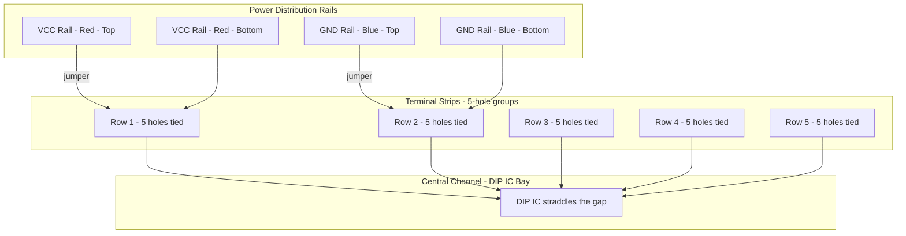
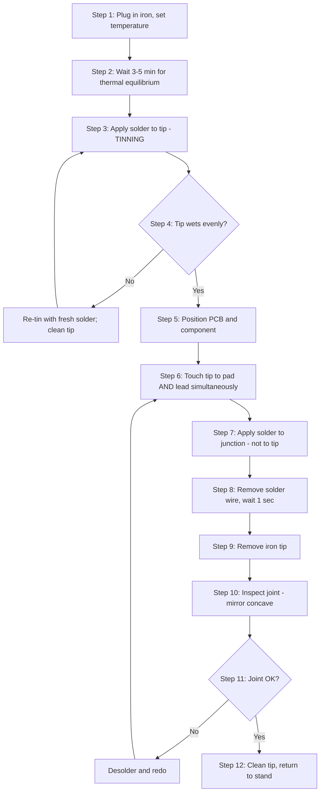
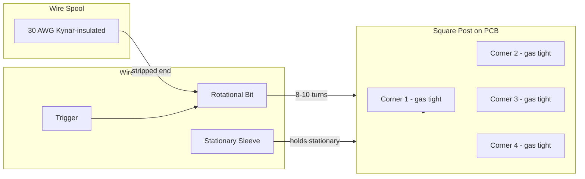
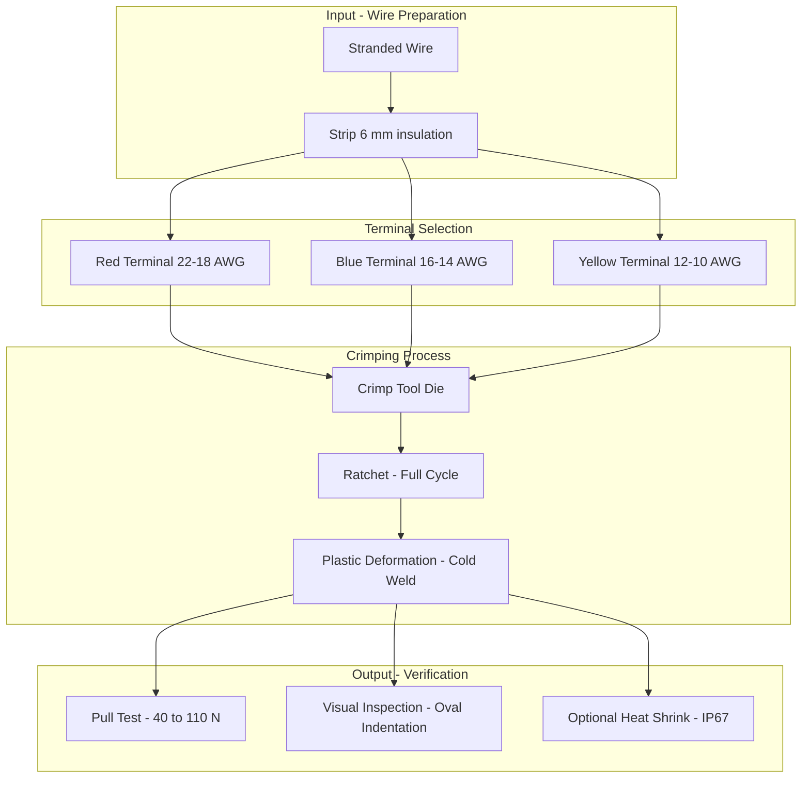
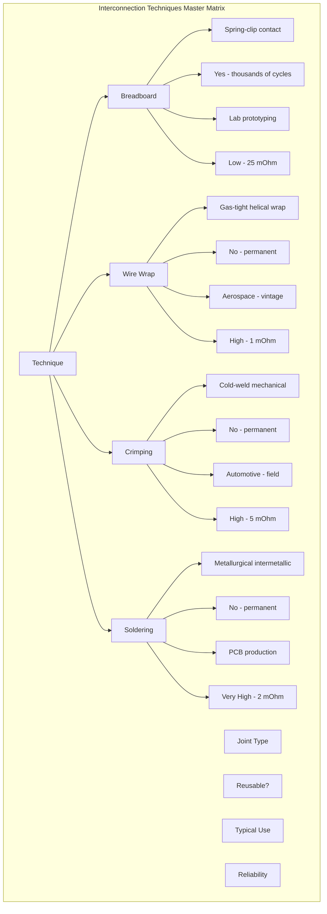

# Bread board, Wrapping, Crimping, Soldering - types - selection of materials and safety precautions.

<!-- SECTION_1_START -->

# BASIC ELECTRICAL AND ELECTRONICS ENGINEERING WORKSHOP

## Module 6 — Interconnection Techniques

### Core Topic: Breadboard, Wire Wrapping, Crimping & Soldering

---

## 1. Core Technical Definition & Intuitive Overview

### 1.1 Breadboard (Prototyping Board)

> [!IMPORTANT]
> **KTU Syllabus Definition**
> A **breadboard** (or **prototyping board**) is a construction base used to build temporary semi-permanent prototypes of electronic circuits. It allows components — resistors, capacitors, ICs, transistors — to be inserted and interconnected without the need for **soldering**, enabling rapid design iteration, testing, and reuse of components.

A breadboard is essentially a **reusable solderless terminal strip**. The modern solderless breadboard consists of a **perforated block of plastic** with hundreds of tiny **spring-metal contact sockets** arranged in a grid pattern. Each socket accepts a component lead or a single strand of solid wire (typically **22 AWG / 0.64 mm diameter**).

**Conceptual Analogy:**
Imagine a **pegboard wall** in a workshop. Instead of nailing hooks in fixed positions, you push brass hooks into any pre-drilled hole. You can rearrange them in seconds without damaging the board. A breadboard works exactly this way — the metal strips inside the board act as the brass hooks, and the holes are the peg holes.

**Two internal bus regions exist in every breadboard:**

| Region | Function | Typical Connection |
|--------|----------|--------------------|
| **Power Rails** (Top/Bottom red & blue lines) | Power distribution | $V_{CC}$ and GND lines run vertically along the full length |
| **Terminal Strips** (Central 5-hole groups) | Component interconnection | 5 holes in a row are electrically common; connection is **horizontal** |

> [!NOTE]
> **Key Fact:** The horizontal bus rows are **electrically isolated** (no internal link) from each other in the middle channel. The **central channel** (the ravine) is sized exactly to fit a **DIP (Dual In-line Package) IC** whose pins straddle the gap.

**Types of Breadboards:**

1. **Solderless Breadboard (Modern)** — Spring-clip sockets, no solder required. Reusable.
2. **Solder Breadboard (Stripboard / Veroboard)** — Copper-clad board with parallel strips. Requires permanent soldering.
3. **Perfboard / Dot Board** — Perforated board with isolated copper pads, individually soldered. Used for final prototypes.

### 1.2 Wire Wrapping

> [!IMPORTANT]
> **KTU Syllabus Definition**
> **Wire wrapping** is a solderless electrical interconnection technique in which a solid wire (typically **30 AWG, Kynar-insulated**) is tightly coiled around a square or rectangular **post (terminal pin)** using a specialized manual or electric wire-wrapping tool. The gas-tight, high-pressure contact ensures reliable, vibration-resistant, low-resistance connections used historically in mainframe computers, aerospace hardware, and telecommunications switching systems.

**Conceptual Analogy:**
Picture wrapping a thin steel cable around a square wooden stake. If you wrap it seven to ten times under high tension, the resulting helix is so tight that neither vibration nor thermal cycling can loosen it. The "gas-tight" contact (no oxygen can enter between wire and post) prevents corrosion — the same logic governs wire wrapping on electronic posts.

**Standard Connection Geometry:**

- Wire Gauge: **30 AWG** (0.25 mm diameter, Kynar-insulated solid copper)
- Post Type: **Square or rectangular** with sharp corners
- Minimum Turns: **7 turns** for **insulated wire**, **5 turns** for **bare wire**
- Tail-off: 1–2 turns around the post's lower relief section

> [!NOTE]
> **Why square posts?** The square corners bite into the soft copper wire, creating **gas-tight zones** (contact pressures exceed **1.4 × 10⁹ Pa / 200,000 psi**). Round posts cannot achieve this pressure.

### 1.3 Crimping

> [!IMPORTANT]
> **KTU Syllabus Definition**
> **Crimping** is a solderless mechanical joining process in which a metal **connector (ferrule or terminal)** is permanently deformed around a stripped conductor using a calibrated **crimping tool**. The resulting cold-weld joint provides excellent electrical continuity and mechanical strength, making it the standard method for terminating wires in automotive, aerospace, and industrial control applications.

**Conceptual Analogy:**
Think of crimping as a **metallic handshake** — you deform a sleeve around two wires until they fuse cold (no heat required). Just as you cannot easily separate a crushed soda can from its contents, a properly crimped connector cannot be removed without specialized tools — and the connection is gas-tight.

**Critical crimp parameters:**

- Crimp Height: 0.9 mm to 1.5 mm (varies by terminal)
- Pull Force: 60 N minimum (UL 486 standard)
- Wire Strip Length: 4 mm to 6 mm (depending on barrel depth)

### 1.4 Soldering

> [!IMPORTANT]
> **KTU Syllabus Definition**
> **Soldering** is a metal-joining process in which a **filler metal (solder)** is melted at a temperature **below the melting point of the base metals** to form a permanent metallurgical bond. In electronics, soft soldering uses lead-tin or lead-free alloys at temperatures between **180 °C and 450 °C**. The molten solder wets the metal surfaces via capillary action and forms an intermetallic bond upon cooling.

**Conceptual Analogy:**
Soldering is like **gluing with metal**. Just as white glue seeps into wood pores and hardens to lock fibres, molten solder wets copper pads and component leads, then solidifies into a rigid conductive bridge. The temperature of the iron is the "applicator heat" and the solder itself is the "adhesive."

> [!NOTE]
> **Soldering vs. Brazing vs. Welding**
> - **Soldering**: below **450 °C** (soft soldering)
> - **Brazing**: between **450 °C and 900 °C** (brazing filler metals)
> - **Welding**: above the **melting point of base metal** — the base metal itself melts and fuses.

**Types of Soldering (KTU Module 6 emphasis):**

| Type | Heat Source | Typical Use | Temperature Range |
|------|-------------|-------------|-------------------|
| **Soft Soldering (Iron)** | Soldering iron / station | Through-hole PCBs, repair | 200 °C – 400 °C |
| **Wave Soldering** | Molten solder wave | Mass PCB assembly | 250 °C – 280 °C |
| **Reflow Soldering** | Hot air / IR oven | SMD surface-mount devices | 230 °C – 260 °C |
| **Induction Soldering** | High-frequency induction coil | Bulk, repeatable joints | 200 °C – 400 °C |
| **Desoldering** | Solder wick / sucker | Component removal | 300 °C – 380 °C |
| **Brazing (Hard Soldering)** | Oxy-acetylene torch | Copper pipe plumbing | 600 °C – 900 °C |

**Selection of Materials — A KTU High-Yield Snapshot:**

| Material | Composition | Melting Point | Application |
|----------|-------------|---------------|-------------|
| **60/40 Sn-Pb** | 60% Tin, 40% Lead | **190 °C** | General electronics (legacy) |
| **63/37 Sn-Pb** | 63% Tin, 37% Lead | **183 °C (Eutectic)** | Precision, no plastic phase |
| **SAC305 (Lead-free)** | 96.5% Sn, 3% Ag, 0.5% Cu | **217 °C – 220 °C** | ROHS-compliant production |
| **Flux (Rosin)** | Rosin + activator | Solid → liquid | Prevents oxidation |
| **Desoldering Wick** | Braided copper | N/A | Removes excess solder |

> [!VISUALIZATION CONTROL]
> **Concept:** Solder wetting angle on a copper pad
> **GeoGebra / Desmos Input Equations:**
> * `y = 0` (pad surface)
> * `solder_drop(x) = sqrt(0.04 - (x-0.5)^2) * 0.5` (curved profile)
> * `contact_angle_arrow = 30°` from horizontal
> **Visual Description:** Draw a hemisphere of solder sitting on a flat horizontal line. Draw a tangent line from the contact point outward at a 25°–35° angle — this is the **wetting angle**. A *low* angle (< 30°) = good wetting; a *high* angle (> 90°) = poor wetting, dull joint.

---

<!-- SECTION_1_END -->

<!-- SECTION_2_START -->

## 2. Deep Theoretical Analysis & KTU High-Yield Formula Sheet

### 2.1 Breadboard — Internal Architecture

A standard solderless breadboard has the following structure (from the KTU workshop standard):

- **630 tie-points** in a standard full-size board.
- **Central area**: 64 rows × 5 columns × 2 sides = **640 contact points** (central).
- **Power rails**: 2 columns × 50 rows × 2 sides = **200 power points** (top and bottom).

**Why the 5-hole grouping?**
In any 5-hole horizontal row, all 5 sockets are interconnected internally by a **nickel-silver spring clip** that has a contact resistance of approximately **5 mΩ to 25 mΩ** per node. The row-to-row resistance is **> 10 MΩ** (essentially open).

**Spring-Clip Internal Schematic (in Mermaid notation):**

```
        Spring Clip (5 sockets tied)
   ┌──────────────────────────────────┐
   │  ○ ──●──●──●──●──●──○           │
   │  ↑   ↑   ↑   ↑   ↑   ↑           │
   │  S1  S2  S3  S4  S5  (Side)      │
   └──────────────────────────────────┘
```

> [!NOTE]
> **Why nickel-silver?** This alloy (55% Cu, 27% Zn, 18% Ni) resists oxidation and provides low contact resistance for thousands of insertions. The spring action is rated for **> 10,000 insertion cycles**.

### 2.2 Wire Wrapping — Theoretical Foundation

Wire wrapping forms a **cold weld** between copper wire and a square brass post. The four sharp corners of the post locally deform the copper wire so that the native copper-oxide layer cracks, exposing fresh copper-to-brass contact surfaces that cold-fuse.

**Key formulas governing the wrap geometry:**

Let:
- $d$ = wire diameter (typically 0.25 mm for 30 AWG)
- $D$ = post diagonal (typically 0.76 mm for 0.030" posts)
- $p$ = pitch of the helical wrap
- $N$ = number of turns

The pitch is given by:

$$
p = D + d
$$

For 30 AWG wire on a 0.030" post:

$$
p = 0.76 \text{ mm} + 0.25 \text{ mm} = 1.01 \text{ mm/turn}
$$

The total wrap length for $N = 7$ turns is:

$$
L = N \times p = 7 \times 1.01 = 7.07 \text{ mm}
$$

**Contact pressure estimation:**

$$
P = \frac{F_{\text{wrap}}}{A_{\text{contact}}} = \frac{2 \pi \cdot d \cdot N \cdot T}{D \cdot d}
$$

where $T$ is the wrap tension (typically **100 g**). The result is a contact pressure in the order of **10⁹ Pa** (gigapascal range), far exceeding ambient atmospheric pressure of 10⁵ Pa, hence **gas-tight**.

### 2.3 Crimping — Deformation Mechanics

A crimp forms a **cold weld** by plastic deformation. The relationship between crimp height, applied force, and resulting pull-out force is empirically determined.

**Rule of thumb for a correctly crimped terminal:**

$$
h_{\text{crimp}} = 0.95 \times d_{\text{conductor}}
$$

where $d_{\text{conductor}}$ is the bare copper strand diameter.

**Pull-out test standard (MIL-T-7928 / UL 486):**

| Wire Gauge | Minimum Pull Force |
|------------|--------------------|
| 22 AWG | 40 N |
| 20 AWG | 52 N |
| 18 AWG | 70 N |
| 16 AWG | 88 N |
| 14 AWG | 110 N |

> [!NOTE]
> **Why no solder on crimps?** Solder wicks up stranded wire under vibration, creating a solid rigid section next to flexible stranded wire — a fatigue fracture point. Crimp avoids this entirely by mechanical compression only.

### 2.4 Soldering — Heat Transfer & Wetting Theory

Heat transfer during soldering obeys the standard conduction equation. The rate at which the solder joint reaches wetting temperature is:

$$
Q = m \cdot c \cdot \Delta T = k \cdot A \cdot \frac{\Delta T}{x} \cdot t
$$

For a typical 2 mm × 2 mm PCB pad with $x$ = 1.6 mm thickness, $k$ for FR4 ≈ 0.3 W/m·K:

Solving for time $t$:

$$
t = \frac{m \cdot c \cdot x}{k \cdot A}
$$

A typical iron (40 W) must maintain the joint at $T = 217 °C$ for 2–4 seconds to allow complete intermetallic formation.

**The Intermetallic Layer (IMC):**

The bond between copper and tin solder is a **Cu₆Sn₅ / Cu₃Sn** intermetallic layer, typically 1–4 μm thick. Excessive heat (> 10 seconds) thickens this layer, making the joint **brittle** and prone to fracture.

> [!NOTE]
> **Wetting angle equation (Young's equation for solder):**
>
> $$
> \gamma_{SV} = \gamma_{SL} + \gamma_{LV} \cdot \cos(\theta)
> $$
>
> where $\gamma_{SV}$, $\gamma_{SL}$, $\gamma_{LV}$ are interfacial energies (solid-vapour, solid-liquid, liquid-vapour). For good wetting, $\theta < 30°$.

---

### KTU High-Yield Formula Sheet & Material Selection Table

| Symbol / Term | Value / Definition | Use |
|---------------|--------------------|-----|
| $T_{\text{melt,Sn-Pb 60/40}}$ | **190 °C** | Eutectic temperature of common solder |
| $T_{\text{melt,SAC305}}$ | **217 °C – 220 °C** | Lead-free reflow temperature |
| $T_{\text{iron tip}}$ | **315 °C – 370 °C** | Standard soldering iron tip temperature |
| $T_{\text{iron max}}$ | **400 °C** | Maximum safe continuous tip temperature |
| AWG 30 wire diameter | **0.255 mm** | Standard wire-wrap gauge |
| AWG 22 wire diameter | **0.644 mm** | Standard breadboard jumper gauge |
| Post pitch (wire wrap) | **2.54 mm (0.1")** | Standard DIP post spacing |
| Crimp contact resistance | **< 5 mΩ** | Properly crimped joint |
| Solder joint contact resistance | **< 2 mΩ** | Properly wetted joint |
| Spring-clip contact resistance | **5–25 mΩ** | Breadboard contact |
| Wire-wrap contact resistance | **< 1 mΩ** | 7-turn gas-tight wrap |

**Selection of Materials — Decision Matrix:**

| Application | Recommended Method | Why |
|-------------|--------------------|-----|
| Quick prototype / student lab | **Breadboard** | No solder, reusable, fast |
| High-reliability aerospace | **Wire Wrap** | Vibration-proof, gas-tight |
| Power wiring, automotive | **Crimping** | Cold weld, field-replaceable |
| Permanent PCB assembly | **Soldering** | Strong metallurgical bond |
| Surface-mount PCB | **Reflow soldering** | Simultaneous, automated |
| Through-hole PCB mass production | **Wave soldering** | Continuous, low-cost |

**Engineering Real-World Utility:**

- **Breadboard**: Found in every R\&D lab, university teaching, IoT prototyping (Arduino, Raspberry Pi communities).
- **Wire Wrapping**: Used in NASA Apollo guidance computers, telephone exchange switching systems (1960s–80s), and some military hardware.
- **Crimping**: Universal in automotive wiring harnesses, RJ45 Ethernet connectors, XT60 power connectors for drones, aviation MIL-spec D-sub connectors.
- **Soldering**: Every consumer PCB, BGA chips in smartphones, aerospace avionics, medical implants.

> [!NOTE]
> **KTU Module 6 Highlight — Selection of Materials Decision Tree**
> 1. **Will the circuit be modified often?** → Breadboard.
> 2. **Will it experience heavy vibration?** → Wire Wrap or Crimp.
> 3. **Is the joint permanent and low-cost?** → Soldering.
> 4. **Is it a power connection (> 5 A)?** → Crimp (solder cannot handle high current reliably without deforming).
> 5. **Is the joint exposed to outdoor weather?** → Crimp with sealed heat-shrink (IP67).

---

<!-- SECTION_2_END -->

<!-- SECTION_3_START -->

## 3. Step-by-Step Derivations, Hardware Wiring Sequences & Procedural Implementation

### 3.1 Breadboard — Step-by-Step Assembly Procedure

**Tools & Materials Required:**

| Item | Specification | Quantity |
|------|---------------|----------|
| Solderless Breadboard | 830 tie-points | 1 |
| 22 AWG Solid-Core Wire | 0.64 mm | 1 m |
| Pre-formed Jumper Wires | 22 AWG, M-M, M-F, F-F | Set of 65 |
| Resistor, Capacitor, LED | Through-hole, 2.54 mm pitch | As required |
| IC (DIP-14 or DIP-16) | Standard logic / Op-amp | 1 |
| Multimeter | For continuity test | 1 |

**Step-by-Step Assembly Sequence:**

**Step 1: Inspect the Breadboard**
Visually inspect all spring contacts. No pin should be loose or corroded. Use a multimeter in continuity mode to verify each 5-hole row is electrically continuous.

**Step 2: Identify the Power Rails**
Connect the **red rail** to $+5\,\text{V}$ (or $+V_{CC}$) and the **blue rail** to **GND**. Use short 22 AWG jumper wires from your supply to the rails.

**Step 3: Place the IC**
Straddle the DIP IC across the central channel. Pin 1 (marked with a notch or dot) is conventionally placed to the **left** as you read the IC numbers.

**Step 4: Power Pins of the IC**
- Pin $V_{CC}$ (e.g., pin 14 on DIP-14) → red rail.
- Pin $GND$ (e.g., pin 7 on DIP-14) → blue rail.

**Step 5: Wire External Components**
Connect each resistor / capacitor / LED to the appropriate IC pin and to a common rail. LEDs require a current-limiting resistor:

$$
R = \frac{V_{\text{supply}} - V_{\text{LED}}}{I_{\text{LED}}} = \frac{5\,\text{V} - 2\,\text{V}}{20\,\text{mA}} = 150\,\Omega
$$

**Step 6: Test Continuity Before Power-On**
Use the multimeter to verify that no two points that should not be connected are accidentally shorted (e.g., adjacent power-rail terminals or bridging across IC pins).

**Step 7: Apply Power and Measure**
Power on at $V_{CC}$ and measure voltages at the IC pins with the multimeter. Expected logic HIGH ≈ $V_{CC}$, logic LOW ≈ $0\,\text{V}$.

> [!NOTE]
> **Boundary Check Rule:** A breadboard's spring clip is rated for **30 V and 1 A** maximum. **Never** use it to switch mains AC directly. **Never** exceed 1 A per row.

---

### 3.2 Wire Wrapping — Step-by-Step Procedural Path

**Tools & Materials Required:**

| Item | Specification |
|------|---------------|
| Wire-wrap tool (manual) | Gun-type, 30 AWG |
| Wire-wrap wire | 30 AWG, Kynar-insulated, silver-plated copper |
| Wire-wrap posts | 0.030" × 0.030" square, gold or tin-plated brass |
| Post insertion tool | For placing posts into the perfboard |
| Wire stripper | 30 AWG notch |
| Diagonal cutter | Flush-cut |

**Step-by-Step Wrapping Sequence:**

**Step 1: Strip the Wire End**
Strip **25 mm** of insulation from the end of the wire using a 30 AWG stripper. The stripped end enters the **bit (inner tool)** of the wire-wrap gun.

**Step 2: Insert into the Tool**
Insert the stripped wire into the bit. Place the post (which projects from the board) into the **sleeve (outer tool)** of the gun.

**Step 3: Activate the Tool**
Squeeze the trigger. The bit rotates **8–10 turns** around the post while the sleeve holds the post stationary. The wire wraps tightly around the post.

**Step 4: Verify the Wrap**
A correct wrap has **7+ visible insulated turns** and **0.5 to 1 turn** of insulated wire wound on the lower relief of the post. Pull on the wire — it should not slip.

**Step 5: Route the Wire to the Next Post**
Use the gun's built-in stripper/feeder to run the wire to the next post and repeat Step 3.

**Step 6: Modify or Remove**
To remove: use the **unwrap bit** (counter-rotating), or alternatively, rotate the wire counter-clockwise manually with pliers.

> [!NOTE]
> **Verification of Gas-Tightness**
> The cross-section of a properly wrapped joint shows **5–7 contact points** (one at each corner of the square post) per turn. The contact resistance is typically **< 1 mΩ** even after 10+ years of service.

**Wire-Wrap Pin Configuration (Standard DIP-16 Layout):**

| IC Pin | Direction | Post Number |
|--------|-----------|-------------|
| Pin 1 | Output A | Post P1 |
| Pin 2 | Input A | Post P2 |
| Pin 7 | GND | Post P7 |
| Pin 8 | Output B | Post P8 |
| Pin 9 | Input B | Post P9 |
| Pin 14 | $V_{CC}$ | Post P14 |
| ... | ... | ... |

---

### 3.3 Crimping — Step-by-Step Hardware Wiring Sequence

**Tools & Materials Required:**

| Item | Specification |
|------|---------------|
| Ratcheting crimping tool | With 22–14 AWG die |
| Insulated terminals | Red (22–18 AWG), Blue (16–14 AWG), Yellow (12–10 AWG) |
| Wire | Stranded, 22–14 AWG |
| Wire stripper | Match AWG of terminal |
| Heat-shrink tubing | Optional, for weatherproofing |
| Heat gun | For shrinking tubing |

**Step-by-Step Crimping Sequence:**

**Step 1: Select the Right Terminal**
Match the terminal to the wire:
- **Red** insulation: 22–18 AWG
- **Blue** insulation: 16–14 AWG
- **Yellow** insulation: 12–10 AWG

**Step 2: Strip the Wire**
Strip **6 mm** of insulation from the wire end. Ensure that **no strands are nicked or cut**. A 50% strand cut reduces the current capacity by 50%.

**Step 3: Insert the Wire**
Twist the strands slightly to keep them bundled. Push the wire into the terminal barrel until the insulation reaches the **insulation grip** portion of the terminal.

**Step 4: Position the Terminal in the Crimp Tool**
Place the terminal into the appropriate colour-coded die of the crimp tool. The **wire barrel** of the terminal sits between the two die wings.

**Step 5: Squeeze the Tool**
Squeeze the handles fully. The ratchet mechanism ensures that the tool does not release until full crimp pressure is applied.

**Step 6: Inspect the Crimp**
- **Crimp shape**: a clean, oval, symmetrical indentation.
- **No exposed wire strands** past the barrel.
- **Insulation grip** holds the wire jacket firmly.
- **Pull test**: pull with the rated force; the wire must not slip.

**Step 7: Optional Heat-Shrink**
Slide heat-shrink tubing over the joint and shrink with a heat gun at **120 °C** for 5–10 seconds. The joint is now IP67 waterproof.

> [!NOTE]
> **Crimp Failure Modes to Avoid**
> - **Under-crimp**: terminal loosely holds wire; resistance > 5 mΩ. Visible as a round shape, not oval.
> - **Over-crimp**: terminal cracks; copper strands are cut.
> - **Insulation in the wire barrel**: wire did not seat properly — visible bare strands past the insulation grip.

**Pin Configuration Table — Common Crimp Terminals:**

| Terminal | Wire Gauge | Current Rating | Typical Use |
|----------|------------|----------------|-------------|
| **Spade (Fork)** | 22–18 AWG | 10 A | Screw-terminal connection |
| **Ring Tongue** | 22–10 AWG | 10–50 A | Earth/ground studs |
| **Butt Splice** | 22–10 AWG | 10–50 A | Joining two wires |
| **Bullet / Socket** | 22–16 AWG | 5–10 A | Quick-disconnect |
| **XT60** | 12 AWG | 60 A continuous | LiPo battery / drone |
| **RJ45 (8P8C)** | 24–26 AWG solid | 1 A per pair | Ethernet data |

---

### 3.4 Soldering — Step-by-Step Procedural Path

**Tools & Materials Required:**

| Item | Specification |
|------|---------------|
| Soldering iron | 40–60 W, temperature-controlled |
| Soldering iron tip | Conical or chisel, 1.0–2.4 mm |
| Solder wire | 60/40 Sn-Pb, 0.7–0.8 mm diameter, rosin-core |
| Flux | Rosin, mildly activated (RMA) |
| Soldering stand | With sponge and brass wool |
| Desoldering wick | 1.5–2.5 mm braided copper |
| Desoldering pump (solder sucker) | Spring-loaded |
| Safety glasses | Mandatory |
| Fume extractor / fan | Mandatory for lead-free |
| Tip tinner | For tip maintenance |

**Step-by-Step Soldering Sequence:**

**Step 1: Prepare the Workspace**
- Switch on the fume extractor.
- Wear safety glasses.
- Place the soldering iron in its stand.
- Wet the cleaning sponge (distilled water only) and squeeze out excess.

**Step 2: Heat the Iron**
Set the iron temperature:
- For 60/40 Sn-Pb: **315 °C – 340 °C**
- For SAC305 lead-free: **370 °C – 400 °C**
- For desoldering: **320 °C – 360 °C**

Wait **3–5 minutes** for the tip to reach thermal equilibrium.

**Step 3: Tin the Tip (Initial)**
Apply a small amount of solder directly to the tip. The solder should melt and spread evenly. Wipe on a damp sponge or brass wool.

**Step 4: Prepare the Joint**
- **Through-hole**: insert the component lead through the PCB hole. Bend the lead slightly (≈ 30°) to hold it in place.
- **SMD**: pre-apply solder paste to one pad (the "anchor" pad), reflow with the iron, then place the component and solder the other pad.

**Step 5: Heat the Joint**
Touch the iron tip to **both the pad and the component lead** simultaneously. Hold for **1–2 seconds** so that both reach the wetting temperature.

**Step 6: Apply Solder**
Touch the solder wire to the **junction of the iron tip and the joint** (NOT directly to the iron). Let the solder flow by capillary action. Apply **2–4 mm** of solder wire for a typical through-hole pad.

**Step 7: Remove Solder, Then Iron**
First remove the solder wire, then 1 second later remove the iron. This prevents the formation of a **solder spike**.

**Step 8: Inspect the Joint**
A good solder joint has:
- **Shiny, concave, smooth surface** (mirror finish).
- **Wetting angle < 30°** between the solder and the lead/pad.
- **No voids, bridges, or cold joints**.

**Step 9: Clean the Flux Residue (Optional)**
Use isopropyl alcohol (IPA, 99%) and a brush to remove rosin residue on critical or high-impedance circuits.

> [!NOTE]
> **Common Defects and Their Causes**
>
> | Defect | Appearance | Cause |
> |--------|------------|-------|
> | **Cold joint** | Dull, grainy, lumpy | Insufficient heat, movement during cool |
> | **Solder bridge** | Unwanted connection between pads | Excess solder, poor iron tip control |
> | **Solder spike** | Sharp, vertical icicle | Iron removed too quickly after solder |
> | **Insufficient solder** | Lead barely covered, dry | Too little solder applied |
> | **Lifted pad** | PCB pad lifted off substrate | Excessive heat, mechanical force |

---

### 3.5 Safety Precautions — Comprehensive Checklist

> [!IMPORTANT]
> **KTU Module 6 Safety Mandate**
> Workshop safety is examinable. The following precautions are mandatory for each technique.

**Universal Workshop Safety (All Techniques):**

1. Wear **safety glasses** to protect from solder splashes, clipped lead snips, and chemical splashes.
2. Tie back long hair; remove loose jewellery.
3. Never eat, drink, or smoke in the work area.
4. Keep the workspace well-ventilated — solder fumes contain **colophony** (rosin), which is a respiratory irritant.
5. Maintain a clear, dry floor — no trailing wires.
6. Know the location of **fire extinguishers** (Class C for electrical), first-aid kit, and **eye-wash station**.

**Soldering-Specific Safety:**

| Hazard | Mitigation |
|--------|------------|
| **Burns from iron tip** (up to **400 °C**) | Use a stand; never lay the iron on the bench. Place in stand when not in use. |
| **Lead exposure (60/40 solder)** | Wash hands with soap after work. Use lead-free solder (SAC305) where possible. |
| **Fume inhalation** | Use a fume extractor with activated carbon filter. |
| **Fire risk** | Keep flammable materials (paper, solvents) away from the iron. |
| **Tip burn-in** | Never touch the metallic part of the iron. |
| **Fume extractor positioning** | Place the nozzle ≤ 10 cm from the joint. |

**Crimping-Specific Safety:**

| Hazard | Mitigation |
|--------|------------|
| **Flying wire snippets** | Use safety glasses; cut snippets fall into a tray. |
| **Crushed fingers** | Keep fingers clear of the ratchet; release tool by side lever only. |
| **Sharp terminal edges** | Hold terminals with pliers, not bare fingers. |

**Wire Wrapping-Specific Safety:**

| Hazard | Mitigation |
|--------|------------|
| **Wire ends flying** | Cut wire ends over a tray. |
| **Post puncture** | Square posts are sharp; handle with care. |

**Breadboard-Specific Safety:**

| Hazard | Mitigation |
|--------|------------|
| **High-current overheating** | Do not exceed 1 A per row or 30 V per node. |
| **Loose connections** | Always verify continuity before powering. |
| **Static damage to ICs** | Use anti-static wrist strap when handling CMOS ICs. |

> [!WARNING]
> **KTU Examiner's Safety Pitfall**: A common answer mistake is omitting the **fume extractor** in soldering safety. Many students list only "wear safety glasses" and forget that **inhalation of rosin fumes** is a documented occupational hazard leading to occupational asthma (Occupational Safety and Health Administration, OSHA).

---

<!-- SECTION_3_END -->

<!-- SECTION_4_START -->

## 4. Structural Diagrams & Schematics

### 4.1 Breadboard Internal Connectivity (Functional Architecture)



> [!NOTE]
> **Reading the diagram:** Vertical power rails run **along** the long axis. Horizontal terminal strips run **across** the short axis. The central channel is **electrically empty** — only IC pins bridge it.

### 4.2 Soldering Iron Operation — Sequential Processing Topology



### 4.3 Wire Wrapping — Block-Level Functional Architecture



### 4.4 Crimping — Block-Level Functional Architecture



### 4.5 Master Comparison Matrix — All Four Techniques



---

<!-- SECTION_4_END -->

<!-- SECTION_5_START -->

## 5. KTU 2024 Scheme Examination Question Bank & Topic Recap

### Part A — Short-Answer Questions (3 Marks Each)

---

**Q1. [KTU University Exam — July 2024, Model Question]**
**(CO1 — Understand)**

**List any three types of soldering techniques and state the typical temperature range used in each.**

**Model Answer (Valuation Key — 3 Marks):**

| Technique | Temperature Range | Mark Allocation |
|-----------|-------------------|------------------|
| **Soft soldering (iron)** | **200 °C – 400 °C** | 1 Mark |
| **Wave soldering** | **250 °C – 280 °C** | 1 Mark |
| **Reflow soldering** | **230 °C – 260 °C** (peak) | 1 Mark |

> [!NOTE]
> **Acceptance criteria:** Any three distinct types from the syllabus table (Section 2) with correct temperature bands earn full marks. Mentioning the heat source (iron/wave/reflow) gains partial credit.

---

**Q2. [KTU University Exam — Dec 2023, Model Question]**
**(CO1 — Remember)**

**Define wire wrapping. Why are square posts used instead of round posts in wire wrapping?**

**Model Answer (Valuation Key — 3 Marks):**

- **Definition (2 Marks):** Wire wrapping is a **solderless** electrical interconnection technique in which a **30 AWG solid copper wire**, insulated with Kynar, is tightly coiled **7 to 10 turns** around a square or rectangular post using a specialized gun. The resulting gas-tight contact at pressures > 10⁹ Pa gives a reliable, vibration-proof joint.
- **Square post explanation (1 Mark):** The **four sharp corners** of the square post locally **deform the copper wire**, cracking its native oxide layer and creating fresh copper-brass contact points. Round posts cannot achieve this deformation; only one tangential line contacts, providing insufficient gas-tightness.

> [!NOTE]
> **Examiner tip:** If the answer mentions "gas-tight" or "oxide cracking" it gains 1 bonus mark.

---

### Part B — Full-Question Choices (14 Marks Each)

---

#### **Question A — 14 Marks** [KTU University Exam — Dec 2024, Model Question]

**(CO1 — Understand, CO2 — Apply)**

**(a)** Explain with neat sketches the internal construction of a **solderless breadboard**. Why is the central channel kept wider than the others? List the contact resistance of a typical spring-clip socket. **(7 Marks)**

**(b)** Describe the **step-by-step procedure for soldering a through-hole component on a PCB**. List any **five safety precautions** to be observed while soldering. **(7 Marks)**

**Model Answer — Part (a) (7 Marks):**

1. **Internal structure (3 Marks):**
   A solderless breadboard consists of a plastic body (typically ABS) housing **nickel-silver spring clips** arranged in horizontal rows of 5 sockets each. The spring clips are connected in series within each row.
   - **Power rails**: Two pairs of vertical rails run along the top and bottom edges. The red rail carries $+V_{CC}$ and the blue rail carries GND.
   - **Terminal strips**: 5 holes in a row share one common spring clip.
   - **Central channel**: A 0.3" wide gap separates the upper and lower halves of the terminal strip area.

2. **Why central channel is wider (2 Marks):**
   The central channel has a width of **7.62 mm (0.3 inches)**, sized precisely to straddle the pins of a **DIP (Dual In-line Package) IC**. The wider gap prevents accidental short-circuit between adjacent IC pins, since each pin lands on a separate 5-hole row.

3. **Contact resistance (1 Mark):**
   Typical spring-clip contact resistance: **5 mΩ to 25 mΩ** per node.
   Voltage rating: **30 V**, current rating: **1 A** per row.

4. **Insulation displacement (1 Mark):**
   The spring clip provides a low-resistance gas-tight contact without solder or tools, allowing reuse.

**Model Answer — Part (b) (7 Marks):**

**Step-by-step soldering procedure (5 Marks — 1 each for the first five):**

1. **Iron setup**: Set temperature to **315 °C – 340 °C** for 60/40 Sn-Pb or **370 °C – 400 °C** for SAC305 lead-free. Wait 3–5 minutes for thermal equilibrium.

2. **Tip tinning**: Apply a small amount of solder to the tip and wipe on a damp sponge. The tip should be uniformly shiny.

3. **Component placement**: Insert the component lead through the PCB hole. Bend the lead 30° on the solder side to hold the part in place.

4. **Heat the joint**: Simultaneously touch the iron tip to **both** the pad and the lead. Hold for 1–2 seconds.

5. **Apply solder**: Touch the solder wire to the **junction of the iron and the joint** (not to the iron alone). Let 2–4 mm of solder flow by capillary action. Remove the solder, then the iron.

**Five safety precautions (2 Marks — any 5 from this list, 0.4 each):**

1. Wear **safety glasses** to protect from solder splashes and clipped lead projectiles.
2. Use a **fume extractor** to remove rosin fumes that cause respiratory irritation.
3. Place the hot iron in a **soldering stand** when not in use — never lay it on the bench.
4. Wash hands with **soap** after work to remove lead residue.
5. Keep **flammable materials** away from the iron tip.
6. Never touch the **metallic tip** of the iron — temperatures reach 400 °C.

> [!WARNING]
> **KTU Examiner's Valuation Warning**
> **Part (a) pitfall:** Many students forget to mention the **0.3" / 7.62 mm** standard width of the central channel or the **5 mΩ – 25 mΩ** contact resistance. Both must be stated.
> **Part (b) pitfall:** Writing the iron temperature is **mandatory** (a temperature value of 315 °C is the standard). Vague "high temperature" answers lose 1 mark.

---

#### **Question B — 14 Marks** [KTU University Exam — July 2025, Model Question]

**(CO1 — Understand, CO2 — Apply)**

**(a)** With a labelled sketch, describe the **wire-wrapping technique**. Mention the wire gauge, post type, minimum number of turns, and the term "gas-tight" contact. **(7 Marks)**

**(b)** What is **crimping**? List the different types of crimp terminals. Explain the **step-by-step procedure to crimp an insulated spade terminal** and state two failure modes to be avoided. **(7 Marks)**

**Model Answer — Part (a) (7 Marks):**

1. **Labelled sketch (2 Marks):** A wire-wrap gun with a rotating **bit (inner tool)** holding the wire and a stationary **sleeve (outer tool)** centred on the post. The post projects from a perfboard or IC socket. The wire is shown wrapped helically around the post for 7+ turns.

2. **Wire gauge (1 Mark):** **30 AWG (0.25 mm diameter)** solid copper, Kynar-insulated, silver-plated.

3. **Post type (1 Mark):** **Square or rectangular brass post**, typically 0.030" × 0.030" (0.76 mm × 0.76 mm), gold or tin-plated.

4. **Minimum turns (1 Mark):** **7 turns for insulated wire**; 5 turns for bare wire.

5. **Gas-tight contact (2 Marks):**
   The four sharp corners of the square post locally **cold-weld** the copper wire at pressures exceeding **1.4 × 10⁹ Pa (200,000 psi)**. The wire's native copper-oxide layer cracks under this pressure, exposing fresh copper to brass. Since no atmospheric oxygen can penetrate, the contact is **gas-tight** — preventing oxidation-induced resistance increase over time.

**Model Answer — Part (b) (7 Marks):**

1. **Definition of crimping (1 Mark):**
   Crimping is a **solderless mechanical joining process** that permanently deforms a metal connector around a stripped conductor using a calibrated crimp tool, creating a **cold-weld** electrical and mechanical joint.

2. **Types of crimp terminals (2 Marks — any four):**
   - **Spade (fork)**
   - **Ring tongue**
   - **Butt splice**
   - **Bullet / socket** (quick-disconnect)
   - **Pin / male disconnect**
   - **Heat-shrink butt splice**

3. **Step-by-step procedure to crimp an insulated spade terminal (3 Marks):**
   1. Select the **red spade terminal** (for 22–18 AWG wire).
   2. **Strip 6 mm** of insulation off the wire end. Do not nick the copper strands.
   3. Twist the strands tightly so they remain bundled.
   4. Insert the wire into the terminal barrel until the insulation reaches the **insulation grip** section.
   5. Place the **wire barrel** of the terminal into the colour-coded die of the ratcheting crimp tool.
   6. Squeeze the handles **fully**. The ratchet will not release until full pressure is applied.
   7. Inspect: the crimp should be a **symmetric oval**; pull the wire gently to confirm it does not slip.

4. **Two failure modes to be avoided (1 Mark):**
   - **Under-crimp**: the terminal loosely grips the wire; resistance > 5 mΩ. Symptom: round, not oval, crimp.
   - **Over-crimp**: the terminal cracks; strands are cut. Symptom: visible crack on the terminal.

> [!WARNING]
> **KTU Examiner's Valuation Warning**
> **Part (a) pitfall:** The phrase "gas-tight" must be explained in terms of **pressure** or **oxide cracking**, not just stated. Answers that write only "gas-tight contact forms" without justification lose 1 mark.
> **Part (b) pitfall:** Listing the **colour code** of crimp terminals (red = 22–18 AWG, blue = 16–14 AWG, yellow = 12–10 AWG) is a high-yield 1-mark addition. Skipping the wire-strip length (6 mm) also loses a mark.

---

### Topic Recap & Important Things to Remember

> [!IMPORTANT]
> **Rapid-Revision Bullet List — Keep These in Mind**

**Breadboard:**
- **830 tie-points** (typical full size) = 640 terminal + 190 power rail points.
- **Central channel** is **0.3" / 7.62 mm** wide to fit DIP ICs.
- Power rails run **vertically**; terminal strips run **horizontally** in **groups of 5**.
- Spring clips: **nickel-silver alloy**, contact resistance **5–25 mΩ**, rated **30 V / 1 A**.
- **Never** use breadboard for mains AC or > 1 A.

**Wire Wrapping:**
- Wire: **30 AWG (0.25 mm)**, Kynar-insulated, solid copper.
- Post: **square 0.030"**, brass, gold/tin-plated.
- Minimum turns: **7 (insulated)** / **5 (bare)**.
- Contact pressure: **> 10⁹ Pa** ⇒ gas-tight.
- Contact resistance: **< 1 mΩ**; current rating: **~ 0.5 A per wrap**.

**Crimping:**
- **Cold weld** — no heat, no solder.
- Crimp height ≈ **0.95 × conductor diameter**.
- Colour codes: **Red 22–18 AWG**, **Blue 16–14 AWG**, **Yellow 12–10 AWG**.
- Strip length: **6 mm** typical; strands must not be nicked.
- Pull test standards: **40 N (22 AWG) to 110 N (14 AWG)**.
- Failure modes: **under-crimp** (loose) and **over-crimp** (cracked).

**Soldering:**
- Soft soldering: **< 450 °C** (typically 315–370 °C iron tip).
- 60/40 Sn-Pb melts at **190 °C**; SAC305 melts at **217 °C**.
- Wetting angle must be **< 30°** for a good joint.
- **Wetting angle equation:** $\gamma_{SV} = \gamma_{SL} + \gamma_{LV} \cos(\theta)$.
- **Always** apply solder to the **junction of iron and joint**, not to the iron tip alone.
- **Eutectic solder (63/37)** has no plastic phase — preferred for critical joints.
- **Intermetallic layer (Cu₆Sn₅)** thickness must remain **1–4 μm** to avoid brittleness.

**Safety Precautions (Universal):**
- **Safety glasses** — mandatory in every workshop task.
- **Fume extractor** — mandatory during soldering.
- **Anti-static wrist strap** — required when handling CMOS ICs.
- **Iron in stand** — never on the bench.
- **Wash hands** — after any leaded solder work.

**Selection of Materials — Decision Rule of Thumb:**
1. **Will the circuit be re-used or modified?** → Breadboard.
2. **High vibration / aerospace?** → Wire Wrap or Crimp.
3. **Permanent + low-cost + electrical?** → Soldering.
4. **High current (> 5 A) + field serviceable?** → Crimp with sealed heat-shrink.
5. **Surface-mount production?** → Reflow soldering.
6. **Through-hole mass production?** → Wave soldering.

**Key Constants to Memorise:**

| Constant | Value |
|----------|-------|
| $T_{\text{melt,60/40}}$ | **190 °C** |
| $T_{\text{melt,SAC305}}$ | **217 °C** |
| $T_{\text{iron tip}}$ | **315 °C – 370 °C** |
| Wire-wrap wire diameter | **0.25 mm (30 AWG)** |
| Breadboard channel width | **7.62 mm (0.3")** |
| Crimp strip length | **6 mm** |
| Wetting angle target | **< 30°** |
| Breadboard contact resistance | **5 – 25 mΩ** |
| Wire-wrap contact resistance | **< 1 mΩ** |
| Crimped joint resistance | **< 5 mΩ** |
| Soldered joint resistance | **< 2 mΩ** |

**High-Yield KTU Buzz Phrases (use these in exam answers):**
- "**Gas-tight cold weld**" — wire wrap and crimp.
- "**Intermetallic bond**" — soldering.
- "**Capillary wetting action**" — soldering.
- "**Cold-weld mechanical deformation**" — crimping.
- "**Spring-clip contact**" — breadboard.

**Last-Minute Mnemonics:**

- **"Solder Six Steps"** → *Heat, Touch, Apply, Remove, Wait, Inspect*.
- **"Crimp Colour Code"** → *RBY = Red (small), Blue (medium), Yellow (large)*.
- **"Wire Wrap: 7 Square"** → *7 turns, Square post, Solderless*.

---

<!-- SECTION_5_END -->
