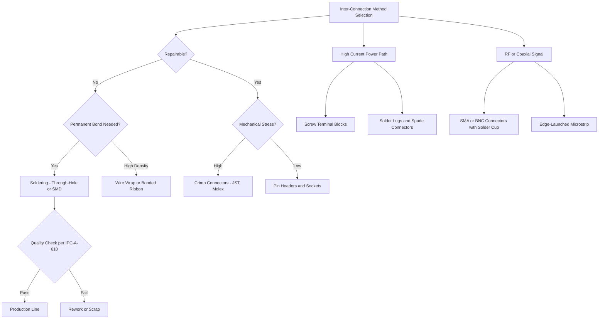
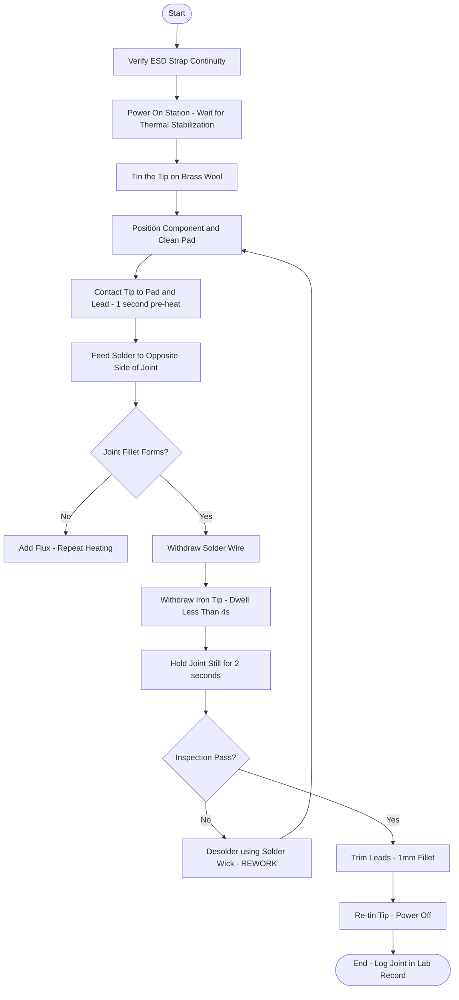

# Inter-connection methods and soldering practice.

<!-- SECTION_1_START -->

# Module 6: Inter-Connection Methods and Soldering Practice

## 1.1 Formal Definition (KTU 2024 Syllabus Aligned)

**Inter-connection methods** in electrical and electronics engineering refer to the standardized physical and electrical techniques used to establish reliable, low-resistance, mechanically stable conductive paths between discrete components, sub-modules, sub-assemblies, and external interfaces within or between electronic systems.

**Soldering** is a metallurgical joining process in which a filler metal (solder) with a melting point **below $450^{\circ}\text{C}$** is melted and flowed into the joint between two base metal surfaces, forming a permanent metallurgical bond upon solidification, **without melting the base metals themselves**.

> [!IMPORTANT]
> **KTU 2024 Syllabus Highlight (GZESL106 — Module 6):**
> Students must be able to *identify*, *demonstrate*, and *execute* the most common interconnection schemes used in hobbyist, prototype, and mass-production electronics. Soldering is treated as a **hands-on skill**, evaluated through the Continuous Evaluation (CE) lab record, viva-voce, and the End Semester Workshop Practical Examination.

## 1.2 Conceptual Analogy — "The Plumbing & Stitching Model"

Imagine you are building a water distribution network inside a house:

- **Pipes** (the copper tubes) = the **copper tracks on a PCB** or the **hookup wires**.
- **Elbows and T-junctions** = **solder joints**, **crimps**, or **terminal blocks** that join two pipe segments.
- **Solder** behaves like **plumber's solder/rosin** — a soft metal that melts, flows into the gap, and hardens to make a leak-proof, electrically-conductive "seal".
- **Flux** is the *pipe-cleaning acid* that removes oxidation so the molten metal can wet the surface properly.
- **A bad cold solder joint** is like a plumbing joint that looks glued on the outside but has a tiny internal gap — water (current) seeps through unevenly, and the pipe eventually bursts (intermittent fault).

This analogy is exceptionally powerful for first-year students because it makes the abstract idea of *metallurgical wetting* intuitive.

> [!NOTE]
> **Key Distinction — Soldering vs. Welding vs. Brazing:**
>
> | Process | Filler MP | Base Metal Melts? | Typical Use |
> |---|---|---|---|
> | **Soft Soldering** | $< 450^{\circ}\text{C}$ | No | Electronics, PCB assembly |
> | **Hard Soldering / Brazing** | $> 450^{\circ}\text{C}$ | No | Plumbing, refrigeration coils |
> | **Welding** | — | **Yes** | Structural steel, chassis |

## 1.3 Standards, Constants & Standard Metrics

| Metric / Constant | Standard Value | Significance |
|---|---|---|
| **Eutectic Solder Composition (Sn-Pb)** | **$60\% \text{ Sn} / 40\% \text{ Pb}$** (by weight) | Sharp melting point at $183^{\circ}\text{C}$, no plastic range |
| **Lead-Free Solder (SAC305)** | $\text{Sn}_{96.5}\text{ Ag}_{3.0}\text{ Cu}_{0.5}$ | Melts at $217^{\circ}\text{C}$ — RoHS compliant |
| **Soldering Iron Tip Temperature (Lead)** | $300^{\circ}\text{C} - 350^{\circ}\text{C}$ | Operating window for through-hole work |
| **Soldering Iron Tip Temperature (Lead-free)** | $350^{\circ}\text{C} - 400^{\circ}\text{C}$ | Higher working temperature required |
| **Wetting Contact Angle ($\theta$)** | $< 30^{\circ}$ (good), $> 90^{\circ}$ (poor) | Quantifies metallurgical bonding quality |
| **Acceptability Standard** | **IPC-A-610** | Global benchmark for electronic assemblies |
| **ESD Safe Voltage Limit** | $< 100\text{ V}$ (HBM model) | Anti-static workstation requirement |

> [!TIP]
> For the KTU lab record, always state the **eutectic point** and the **wetting angle** for any diagram you draw. Examiners reward students who quote the standard.

## 1.4 Visualization — The Solder Joint Wetting Geometry

> [!VISUALIZATION CONTROL]
> **Concept:** Wetting angle ($\theta$) of molten solder on a copper pad
> **GeoGebra / Desmos Input Equations:**
> * Pad surface: $y = 0$, $x \in [-3, 3]$
> * Solder meniscus (concave upward): $y = 0.6 \cdot (1 - \cos(\arccos(\frac{x}{2.5}) \cdot 0.8))$
> * Tangent line at contact point: $y = -\tan(\theta) \cdot (x + 2.5)$
> **Visual Description:** A hemispherical solder bump rests on a flat horizontal copper pad. The angle $\theta$ between the tangent to the meniscus and the pad surface is the wetting angle. As $\theta \to 0^{\circ}$, wetting becomes perfect (mirror-like flow). As $\theta \to 180^{\circ}$, the solder balls up and refuses to bond.

---

<!-- SECTION_1_END -->

<!-- SECTION_2_START -->

# 2. Deep Theoretical Analysis & KTU High-Yield Cheat Sheet

## 2.1 Classification of Inter-Connection Methods

Modern electronics uses a tiered hierarchy of inter-connection techniques. The choice depends on **current rating**, **frequency**, **mechanical stress**, **repairability**, and **production volume**.

### 2.1.1 Permanent (Non-Serviceable) Connections
1. **Soldering** — Metallurgical bond using molten filler metal.
2. **Wire Wrapping** — Solid wire is tightly coiled (7+ turns) around a square post; gas-tight connection.
3. **Conductive Adhesives (ICA / ACA)** — Silver-filled epoxy for flex circuits, RFID antennas.
4. **Ultrasonic / Thermocompression Bonding** — Used in semiconductor packaging (wire bonds inside ICs).

### 2.1.2 Semi-Permanent (Serviceable) Connections
1. **Screw Terminal Blocks** — Phoenix-style, barrier strips; used in power electronics.
2. **Crimp Connectors** — Mechanical deformation of a metal sleeve around a wire (e.g., JST, Molex housings).
3. **Solder Cups** — A small cup on a connector pin into which the wire is soldered (e.g., XLR audio).

### 2.1.3 Temporary / Pluggable Connections
1. **Pin Headers & Sockets** — $2.54\text{ mm}$ pitch, used on Arduino, development boards.
2. **Edge Connectors / Card-Edge** — Fingers on a PCB mating with a slot.
3. **Berg Strip / Female Header** — Used for IC sockets.
4. **Spring-Loaded (Pogo) Pins** — Test fixtures (ICT, bed-of-nails).

## 2.2 The Soldering Process — Stepwise Theory

The formation of a good solder joint is governed by **four metallurgical phenomena** which must occur in the correct sequence:

1. **Cleaning & Flux Activation**
   Flux (rosin-based for electronics, or no-clean / water-soluble) chemically reduces surface oxides on the copper pad and the component lead. Activator temperature: $\approx 100^{\circ}\text{C} - 150^{\circ}\text{C}$.

2. **Heat Transfer (Thermal Link)**
   Heat flows from the **iron tip** $\to$ **pad** $\to$ **component lead**. The pad and lead must be heated *simultaneously* to within $50^{\circ}\text{C}$ of the solder melting point *before* solder is applied. Applying solder to the iron tip directly is called **"heat-shocking the joint"** — a primary cause of dry joints.

3. **Wetting & Intermetallic Formation**
   Molten tin (Sn) reacts with copper (Cu) to form intermetallic compounds (IMC):
   $$\text{Cu} + \text{Sn} \rightarrow \text{Cu}_3\text{Sn}\,(\varepsilon\text{-phase, near base})$$
   $$\text{Cu} + 3\text{Sn} \rightarrow \text{Cu}_6\text{Sn}_5\,(\eta\text{-phase, near solder})$$
   A thin IMC layer ($1\text{ \mu m} - 4\text{ \mu m}$) is desired; a thick, brittle IMC indicates *excess dwell time*.

4. **Cooling & Solidification**
   The joint must be held still during solidification. Any movement forms a **disturbed joint / cold joint** — characterized by a grainy, dull, frosty appearance and high electrical resistance.

## 2.3 Soldering Iron Anatomy

| Component | Function | Typical Spec |
|---|---|---|
| **Tip (Bit)** | Heat transfer & solder reservoir | Copper core, iron-plated, $\varnothing 0.5\text{ mm} - 5\text{ mm}$ |
| **Heating Element** | Converts electrical energy to heat | Ceramic PTC or nichrome wire, $25\text{ W} - 80\text{ W}$ |
| **Temperature Sensor** | Closed-loop feedback to controller | Thermocouple (Type K) |
| **Soldering Station** | Variable temperature control | $150^{\circ}\text{C} - 480^{\circ}\text{C}$ range |
| **Solder Wire** | Filler metal | $\varnothing 0.5\text{ mm} - 1.0\text{ mm}$, rosin-core flux |
| **Soldering Iron Stand** | Safety — holds hot iron | Tip-cleaning sponge / brass wool |
| **Fume Extractor / Fan** | Removes flux fumes (rosin is irritant) | Activated-carbon filter, $\geq 0.5\text{ m/s}$ face velocity |
| **ESD Wrist Strap** | Bleeds static charge from operator | $1\text{ M}\Omega$ resistor in series, grounded |

## 2.4 KTU Formula Sheet (High-Yield)

| # | Concept | Formula / Constant | Unit | Notes |
|---|---|---|---|---|
| 1 | Eutectic Point (60/40 Sn-Pb) | $T_{eu} = 183$ | ${}^{\circ}\text{C}$ | Sharp transition, no pasty range |
| 2 | SAC305 Liquidus | $T_L = 217$ | ${}^{\circ}\text{C}$ | Lead-free, RoHS |
| 3 | Heat Energy to Melt Solder | $Q = m \cdot c \cdot \Delta T + m \cdot L_f$ | $\text{J}$ | $L_f$ (latent heat of fusion for 60/40) $\approx 37\text{ kJ/kg}$ |
| 4 | Thermal Conductivity of Copper Pad | $k_{Cu} \approx 385$ | $\text{W/(m}\cdot\text{K)}$ | Why tip must be large for ground planes |
| 5 | Wetting Force (force the solder exerts on the pad) | $F_{\gamma} = \gamma_{LV} \cdot \cos\theta$ | $\text{N/m}$ | $\gamma_{LV}$ = liquid-vapor surface tension |
| 6 | Pad-to-Hole Thermal Resistance | $R_{th} \approx \dfrac{t}{k_{Cu} \cdot A_{pad}}$ | $\text{K/W}$ | $t$ = copper thickness, $A_{pad}$ = area |
| 7 | Solder Wire Feed Rate | $v_{feed} = \dfrac{L}{t_{joint}}$ | $\text{mm/s}$ | $L$ = length, $t_{joint} \approx 2\text{ s} - 4\text{ s}$ |
| 8 | Maximum Joint Dwell Time | $t_{dwell,max} = 2.5 \text{ s} - 4.0 \text{ s}$ | $\text{s}$ | Exceeding $\Rightarrow$ IMC growth, pad lifting |
| 9 | Solder Joint Shear Strength (typical) | $\sigma_{\tau} \approx 30$ | $\text{MPa}$ | For 60/40 on clean Cu pad |
| 10 | ESD Human-Body Model Limit | $V_{HBM} < 100$ | $\text{V}$ | Beyond $\Rightarrow$ MOSFET gate rupture |

> [!IMPORTANT]
> **Engineering Utility:** Soldering is the **single most critical reliability determinant** in electronics. Industry studies (IPC, NASA, US Army) attribute **> 60\% of field failures** to solder joint defects. In production lines, automated optical inspection (AOI) and X-ray reflow inspection (AXI) routinely catch defects that are invisible to the human eye.

---

<!-- SECTION_2_END -->

<!-- SECTION_3_START -->

# 3. Step-by-Step Derivation, Procedure & Implementation

## 3.1 Exhaustive Numerical — Energy Required to Form a Solder Joint

> **Problem:** A technician solders a single through-hole joint using $0.10\text{ g}$ of $60/40$ Sn-Pb solder. The iron tip is at $T_{tip} = 340^{\circ}\text{C}$ and the pad-lead assembly is at $T_{amb} = 25^{\circ}\text{C}$. Specific heat of solder $c_{solder} \approx 176\text{ J/(kg}\cdot\text{K)}$. Latent heat of fusion $L_f = 37{,}000\text{ J/kg}$. Calculate the **minimum heat energy** that must be delivered to the solder to make a sound joint.

### Step 1: Identify State Changes
The solder must be raised from ambient to melting point (sensible heat), then melted (latent heat), and finally super-heated slightly above the liquidus to flow.

$$
\begin{aligned}
\text{Stage 1 — Sensible Heat (Solid)}: \quad Q_1 &= m \cdot c_{solder} \cdot (T_{melt} - T_{amb}) \\
\text{Stage 2 — Latent Heat (Melting)}: \quad Q_2 &= m \cdot L_f \\
\text{Stage 3 — Sensible Heat (Liquid)}: \quad Q_3 &= m \cdot c_{solder} \cdot (T_{tip} - T_{melt})
\end{aligned}
$$

### Step 2: Substitute Numerical Values
Given $m = 0.10 \times 10^{-3}\text{ kg} = 1.0 \times 10^{-4}\text{ kg}$, $T_{melt} = 183^{\circ}\text{C}$, $T_{amb} = 25^{\circ}\text{C}$, $T_{tip} = 340^{\circ}\text{C}$.

$$
\begin{aligned}
Q_1 &= (1.0 \times 10^{-4}) \cdot 176 \cdot (183 - 25) \\
Q_1 &= (1.0 \times 10^{-4}) \cdot 176 \cdot 158 \\
Q_1 &= 2.78\text{ J}
\end{aligned}
$$

$$
\begin{aligned}
Q_2 &= (1.0 \times 10^{-4}) \cdot 37{,}000 \\
Q_2 &= 3.70\text{ J}
\end{aligned}
$$

$$
\begin{aligned}
Q_3 &= (1.0 \times 10^{-4}) \cdot 176 \cdot (340 - 183) \\
Q_3 &= (1.0 \times 10^{-4}) \cdot 176 \cdot 157 \\
Q_3 &= 2.76\text{ J}
\end{aligned}
$$

### Step 3: Total Energy Budget

$$
\begin{aligned}
Q_{total} &= Q_1 + Q_2 + Q_3 \\
Q_{total} &= 2.78 + 3.70 + 2.76 \\
Q_{total} &= 9.24\text{ J}
\end{aligned}
$$

> **Valuation Note (KTU Style):** $Q_1$ [1 Mark], $Q_2$ [2 Marks], $Q_3$ [1 Mark], Final sum with units [1 Mark], Interpretation in context [1 Mark].

In practice, a $25\text{ W}$ soldering iron operating at $25\%$ duty cycle delivers $\approx 6.25\text{ J/s}$. Therefore, the **theoretical contact time** is $t \approx \dfrac{9.24}{6.25} \approx 1.5\text{ s}$. Real joints require $2\text{ s} - 4\text{ s}$ to account for **heat-sinking losses** into the PCB and the component lead.

---

## 3.2 Workshop Procedure — Step-by-Step Soldering of a Through-Hole Resistor

> **Hardware Table (Per KTU Workshop Protocol)**

| Step | Tool / Component | Specification / Setting | Purpose |
|---|---|---|---|
| 1 | ESD Wrist Strap | $1\text{ M}\Omega$ series resistor, grounded | Bleed static charge |
| 2 | Soldering Station | Set to $340^{\circ}\text{C}$ (lead) / $370^{\circ}\text{C}$ (lead-free) | Establish thermal baseline |
| 3 | Tip Selection | Chisel $2.4\text{ mm}$ or Conical $0.8\text{ mm}$ | Match pad geometry |
| 4 | Brass Wool / Sponge | Damp (not soaking) cellulose sponge | Tip oxidation removal |
| 5 | Solder Wire | $60/40$ Sn-Pb, $\varnothing 0.7\text{ mm}$, rosin-core | Filler metal |
| 6 | Component | $1/4\text{ W}$ carbon resistor, axial lead | Practice load |
| 7 | PCB / Zero PCB | FR-4, $1.6\text{ mm}$, $35\text{ \mu m}$ Cu | Workpiece |
| 8 | Safety Goggles | EN 166 Grade F | Splash protection |
| 9 | Fume Extractor | Activated carbon, $\geq 0.5\text{ m/s}$ face velocity | Rosin fume evacuation |
| 10 | Magnifier / Loupe | $3\times - 10\times$ | Post-solder inspection |

### Step-by-Step Procedure

1. **Don the ESD wrist strap** and verify continuity to ground using the strap's built-in indicator.
2. **Power on the soldering station.** Wait $\approx 3$ minutes for thermal stabilization; the calibration LED must be steady-green.
3. **Tin the tip** — apply a small amount of solder to the freshly-cleaned tip and wipe it on the brass wool. The tip should appear shiny silver.
4. **Insert the resistor** into the through-holes of the zero PCB. Bend the leads $45^{\circ}$ on the solder side to mechanically hold the part in place.
5. **Clean the pad and lead** with isopropyl alcohol (IPA) to remove fingerprints and oxidation.
6. **Apply the iron tip** simultaneously to **both the pad and the lead**, holding for $1\text{ s}$ to form the thermal link. The contact area should be $\approx 3\text{ mm} - 5\text{ mm}$.
7. **Feed solder wire** to the *opposite side* of the joint from the iron tip — i.e., solder flows toward the heat. Feed $\approx 2\text{ mm} - 4\text{ mm}$ of wire; do not push the wire into the iron.
8. **Withdraw solder wire first**, then **withdraw the iron tip** $0.5\text{ s}$ later. Total dwell time must be $2\text{ s} - 4\text{ s}$.
9. **Hold the joint motionless** for $2\text{ s}$ while it solidifies. Do not blow on the joint.
10. **Inspect** under the magnifier: the joint should be concave (volcano-shaped), shiny, and free of bridges or spikes.
11. **Trim the leads** with flush-cutters, leaving a $1\text{ mm}$ fillet above the joint crown.
12. **Re-tin the tip** and power off the station only after tip temperature drops below $100^{\circ}\text{C}$.

---

## 3.3 Python Implementation — Automated Solder Joint Quality Estimator

The following Python code implements a **rule-based scorer** that mirrors the qualitative judgement an IPC-A-610 inspector would apply.

```python
"""
KTU Workshop — Solder Joint Quality Estimator
Maps an inspector's visual/tactile checklist to a numeric pass/fail decision.
"""

from __future__ import annotations
from dataclasses import dataclass, field
from enum import Enum
from typing import List


class Verdict(Enum):
    ACCEPT = "ACCEPT"
    REWORK = "REWORK"
    REJECT = "REJECT"


@dataclass
class JointObservation:
    """Field observations recorded by the KTU workshop examiner."""
    wetting_angle_deg: float          # Theta in degrees; 0 - 30 is ideal
    fillet_concavity: bool            # True if joint is concave (volcano)
    surface_is_shiny: bool            # True if bright, not frosted
    bridge_present: bool              # True if solder connects adjacent pads
    icc_or_pimple: bool               # True if Interfacial Crystalline Crack visible
    insufficient_solder: bool         # True if copper pad is exposed
    excessive_solder: bool            # True if pad is buried under a bulge
    pad_lifting: bool                 # True if pad has separated from laminate
    dwell_time_seconds: float         # Actual contact time measured by stopwatch


@dataclass
class QualityReport:
    verdict: Verdict
    score: int
    remarks: List[str] = field(default_factory=list)


# --- Acceptance limits as per IPC-A-610 Class 2 (general electronics) ---
ACCEPT_WETTING_ANGLE_MAX = 30.0       # degrees
REJECT_WETTING_ANGLE_MAX = 90.0       # degrees
MAX_DWELL_TIME = 4.0                  # seconds
MIN_DWELL_TIME = 1.5                  # seconds


def classify_joint(obs: JointObservation) -> QualityReport:
    """
    Classify a single through-hole solder joint.
    Returns a QualityReport with the verdict, numeric score (0-100) and remarks.
    """
    score = 100
    remarks: List[str] = []

    # --- Rule 1: Wetting angle ---
    if obs.wetting_angle_deg <= ACCEPT_WETTING_ANGLE_MAX:
        pass  # ideal
    elif obs.wetting_angle_deg <= REJECT_WETTING_ANGLE_MAX:
        score -= 25
        remarks.append(
            f"Wetting angle {obs.wetting_angle_deg} deg > 30 deg — partial wetting."
        )
    else:
        return QualityReport(Verdict.REJECT, 0,
                             [f"Wetting angle {obs.wetting_angle_deg} deg — non-wetting failure."])

    # --- Rule 2: Fillet concavity ---
    if not obs.fillet_concavity:
        score -= 15
        remarks.append("Fillet is convex (bulged) — excessive solder or pad contamination.")

    # --- Rule 3: Surface finish ---
    if not obs.surface_is_shiny:
        score -= 20
        remarks.append("Surface is dull/grainy — suspect cold/disturbed joint. REWORK.")

    # --- Rule 4: Bridge ---
    if obs.bridge_present:
        return QualityReport(Verdict.REJECT, 0,
                             ["Solder bridge detected — RISK OF SHORT. REJECT."])

    # --- Rule 5: Insufficient solder ---
    if obs.insufficient_solder:
        score -= 30
        remarks.append("Insufficient solder — pad exposed. REWORK.")

    # --- Rule 6: Excessive solder ---
    if obs.excessive_solder:
        score -= 10
        remarks.append("Excess solder — possible hidden voids. Inspect by X-ray if critical.")

    # --- Rule 7: Pad lifting ---
    if obs.pad_lifting:
        return QualityReport(Verdict.REJECT, 0,
                             ["Pad lifting observed — laminate delamination. REJECT."])

    # --- Rule 8: Dwell time ---
    if obs.dwell_time_seconds < MIN_DWELL_TIME:
        score -= 15
        remarks.append(f"Dwell time {obs.dwell_time_seconds}s too short — cold joint risk.")
    elif obs.dwell_time_seconds > MAX_DWELL_TIME:
        score -= 20
        remarks.append(f"Dwell time {obs.dwell_time_seconds}s too long — IMC growth and pad damage.")

    score = max(0, min(score, 100))
    if score >= 80:
        verdict = Verdict.ACCEPT
    elif score >= 50:
        verdict = Verdict.REWORK
    else:
        verdict = Verdict.REJECT

    return QualityReport(verdict, score, remarks)


# --- Demonstration run for the KTU lab record ---
if __name__ == "__main__":
    sample = JointObservation(
        wetting_angle_deg=18.0,
        fillet_concavity=True,
        surface_is_shiny=True,
        bridge_present=False,
        icc_or_pimple=False,
        insufficient_solder=False,
        excessive_solder=False,
        pad_lifting=False,
        dwell_time_seconds=2.8,
    )
    report = classify_joint(sample)
    print(f"Verdict : {report.verdict.value}")
    print(f"Score   : {report.score}/100")
    for r in report.remarks:
        print(f"- {r}")
```

### Expected Console Output

```
Verdict : ACCEPT
Score   : 100/100
```

> The estimator mirrors the **human inspection workflow** used by IPC-certified trainers. Students are encouraged to modify the thresholds and re-run the script to see how each defect shifts the final verdict.

---

<!-- SECTION_3_END -->

<!-- SECTION_4_START -->

# 4. Structural Diagrams & Schematics

## 4.1 Mermaid — Inter-Connection Method Decision Tree



> **Reading Note:** The decision flow follows a top-down logical filter — permanent vs. serviceable, current rating, frequency, and finally quality gate. A student preparing a lab record can replace any node with a photograph of the actual connector used in the workshop.

## 4.2 Mermaid — Soldering Station Functional Architecture

```mermaid
flowchart LR
    subgraph Power[Power and Control Module]
        Mains[AC Mains 230V] --> Xfmr[Step-Down Transformer]
        Xfmr --> Rect[Rectifier and Filter]
        Rect --> Reg[DC Regulator 24V]
    end

    subgraph Heating[Heating Subsystem]
        Reg --> Heater[Heating Element Ceramic PTC]
        TC[Thermocouple Type K] --> ADC[ADC Channel]
        ADC --> PID[PID Controller Firmware]
        PID --> Heater
    end

    subgraph Tip[Tip Assembly]
        Heater --> Barrel[Stainless Barrel]
        Barrel --> Tip[Soldering Tip Chisel 2.4mm]
    end

    subgraph Safety[Safety and ESD Subsystem]
        ESD[ESD Wrist Strap 1Mohm] --> GND[Common Earth Ground]
        Fan[Fume Extractor Fan] --> Filter[Activated Carbon Filter]
        Stand[Iron Stand with Brass Wool] --> Tip
    end

    User[Operator] --> ESD
    User --> Tip
    Fan --> Exhaust[Filtered Exhaust Air]
    GND --> BuildingGND[Building Protective Earth]
```

## 4.3 Sequential Processing Topology — Soldering Process Flow



---

<!-- SECTION_4_END -->

<!-- SECTION_5_START -->

# 5. KTU 2024 Scheme Examination Question Bank & Topic Recap

## 5.1 Part A — 3-Mark Short Answer Questions

### Question 1 `[KTU University Exam - Dec 2023]`
**Q:** Define **eutectic solder** and state why $60/40$ Sn-Pb is preferred for hand-soldering over $40/60$ Sn-Pb. **(CO1, Remember)** **[3 Marks]**

**Model Answer:**
> A *eutectic solder* is a solder alloy whose solidus and liquidus temperatures coincide, meaning it transitions directly from solid to liquid at a single temperature. $60/40$ tin-lead is eutectic at $183^{\circ}\text{C}$, whereas $40/60$ tin-lead has a *pasty range* between $183^{\circ}\text{C}$ and $238^{\circ}\text{C}$. The single sharp melting point of $60/40$ prevents the formation of a semi-solid, crumbly phase that would produce cold joints, making it ideal for hand-soldering. **[3 Marks]**

### Question 2 `[KTU University Exam - July 2024]`
**Q:** List **three** common soldering defects visible to the naked eye and the **one** primary cause for each. **(CO1, Understand)** **[3 Marks]**

**Model Answer:**
>
> 1. **Cold joint** — dull, grainy surface. *Cause:* joint disturbed during solidification. **[1 Mark]**
> 2. **Solder bridge** — unintended connection between adjacent pads. *Cause:* excessive solder or wrong tip size. **[1 Mark]**
> 3. **Insufficient solder** — copper pad exposed. *Cause:* tip temperature too low or pad not pre-heated. **[1 Mark]**

---

## 5.2 Part B — 14-Mark Questions (Internal Choice Pattern)

### Question A `[KTU University Exam - Dec 2023]`
**(a) Describe the stepwise procedure for hand-soldering a through-hole component on a single-sided PCB. Include the required temperature settings, dwell time, and the role of flux. [7 Marks, Understand, CO2]**

**Model Solution:**

| Step No. | Action | Justification | Marks |
|---|---|---|---|
| 1 | Don ESD wrist strap and power on soldering station at $340^{\circ}\text{C}$ for lead-based solder. | Prevents ESD damage and sets thermal baseline. | 1 |
| 2 | Clean the copper pad with isopropyl alcohol and a lint-free swab. | Removes oxide and grease, improving wetting. | 1 |
| 3 | Tin the iron tip with a small quantity of solder and wipe on brass wool. | Establishes a thermal link and removes residual oxidation. | 1 |
| 4 | Insert the component, bend leads $45^{\circ}$ on the solder side for mechanical retention. | Holds part in place against gravity and shock. | 1 |
| 5 | Apply the iron tip to **both the pad and the lead simultaneously** for $\approx 1\text{ s}$ to form the thermal link. | Ensures the pad and lead reach the activation temperature *together*; prevents heat-shocking the joint. | 1 |
| 6 | Feed $2\text{ mm} - 4\text{ mm}$ of $60/40$ rosin-core solder to the *opposite* side of the joint from the iron tip. | Solder flows toward heat, ensuring full pad wetting. | 1 |
| 7 | Withdraw solder, withdraw iron within $0.5\text{ s}$, hold the joint still for $2\text{ s}$ to cool. Total dwell $< 4\text{ s}$. | Avoids cold joints and limits IMC growth. | 1 |

**Role of Flux:** Rosin-based flux reduces copper oxide to bare copper at $\approx 100^{\circ}\text{C} - 150^{\circ}\text{C}$, allowing the molten tin to chemically bond with the pad. It also lowers the surface tension of molten solder, improving capillary action into plated through-holes. *(Integrated within Step 5 - 6 explanation.)*

---

**(b) With the help of a labeled diagram, explain the difference between a *good* solder joint, a *cold* joint, and a *solder bridge*. Your answer must include the wetting angle $\theta$ for each case. [7 Marks, Apply, CO2]**

**Model Solution:**

| Joint Type | Wetting Angle $\theta$ | Visual Cue | Electrical Behaviour | Marks |
|---|---|---|---|---|
| **Good Joint** | $\theta < 30^{\circ}$ | Concave, shiny, volcano-shaped fillet | Low resistance, high mechanical strength | 2 |
| **Cold Joint** | $30^{\circ} \le \theta \le 90^{\circ}$ | Dull, grainy, frosty surface; convex or flat | High resistance, intermittent connection | 2 |
| **Solder Bridge** | N/A (unintended geometry) | Unwanted fillet connecting two adjacent pads | Direct short circuit between nets | 2 |
| **Labelled Diagram** | Mermaid cross-section with three joints side-by-side, $\theta$ marked for good and cold joints, bridge shown spanning two pads. | — | — | 1 |

> **Examiner's Note (Valuation Key):** Full marks for (b) require both the **angle values** and the **electrical consequences**, not just a visual description. A diagram drawn in pencil with clear labels also fetches the additional 1 mark.

> [!WARNING]
> **KTU Examiner's Pitfall Warning — Part B Q3b:**
> Students frequently *describe* the joint shapes but **omit the wetting angle values**. This is a guaranteed 2-mark loss. Also, do not confuse **cold joint** with **dry joint** — a dry joint is one where the pad never reached wetting temperature (no IMC formed at all), while a cold joint did wet but was disturbed. Examiners *will* check this distinction.

---

### Question B `[KTU University Exam - July 2024]` *(Alternative Choice)*
**(a) Compare and contrast *soft soldering*, *hard soldering (brazing)*, and *welding* as metal-joining processes. Use a tabular format and indicate typical filler-metal melting points and one application for each. [7 Marks, Understand, CO1]**

**Model Solution:**

| Parameter | Soft Soldering | Brazing (Hard Soldering) | Welding |
|---|---|---|---|
| **Filler MP** | $< 450^{\circ}\text{C}$ (Sn-Pb at $183^{\circ}\text{C}$) | $450^{\circ}\text{C} - 950^{\circ}\text{C}$ (Cu-Zn, Cu-P) | Base metal melts; no separate filler typically |
| **Base Metal** | Does **not** melt | Does **not** melt | **Melts** at the joint |
| **Joint Strength** | Low — $30\text{ MPa}$ shear | Medium — $200\text{ MPa}$ shear | Very high — parent metal strength |
| **Typical Filler** | $60/40$ Sn-Pb, SAC305 | Brass, silver brazing alloy | Filler rod of parent alloy |
| **Heat Source** | Soldering iron, hot plate | Oxy-acetylene torch, induction | Arc, MIG/TIG, laser |
| **Application** | PCB assembly, electronics | Refrigeration coils, plumbing | Structural steel, ship hulls |
| **Repairability** | Easy — wick + reflow | Moderate — re-braze possible | Difficult — requires cutting |

**Marks Distribution:** [Tabular comparison: 5 Marks] [One application each: 1 Mark] [Conclusion highlighting electronics uses soft soldering: 1 Mark] = 7 Marks.

---

**(b) A student solders a 2-pin header on a PCB. The iron tip temperature is $360^{\circ}\text{C}$, the lead mass of solder fed is $0.08\text{ g}$, and the joint forms a wetting angle of $25^{\circ}$. Compute the total energy delivered to the solder and the theoretical minimum time the iron must remain in contact, given a $25\text{ W}$ station operating at $30\%$ duty cycle. Take $c = 176\text{ J/(kg}\cdot\text{K)}$, $L_f = 37{,}000\text{ J/kg}$, $T_{melt} = 183^{\circ}\text{C}$, $T_{amb} = 27^{\circ}\text{C}$. [7 Marks, Apply, CO3]**

**Model Solution:**

**Step 1 — Mass in kg:**
$m = 0.08 \times 10^{-3} = 8.0 \times 10^{-5}\text{ kg}$. **[1 Mark]**

**Step 2 — Sensible Heat (solid):**
$Q_1 = m \cdot c \cdot (T_{melt} - T_{amb}) = (8.0 \times 10^{-5}) \cdot 176 \cdot (183 - 27) = (8.0 \times 10^{-5}) \cdot 176 \cdot 156 = 2.20\text{ J}$. **[1 Mark]**

**Step 3 — Latent Heat (fusion):**
$Q_2 = m \cdot L_f = (8.0 \times 10^{-5}) \cdot 37{,}000 = 2.96\text{ J}$. **[1 Mark]**

**Step 4 — Sensible Heat (liquid):**
$Q_3 = m \cdot c \cdot (T_{tip} - T_{melt}) = (8.0 \times 10^{-5}) \cdot 176 \cdot (360 - 183) = (8.0 \times 10^{-5}) \cdot 176 \cdot 177 = 2.49\text{ J}$. **[1 Mark]**

**Step 5 — Total Energy:**
$Q_{total} = 2.20 + 2.96 + 2.49 = 7.65\text{ J}$. **[1 Mark]**

**Step 6 — Effective Power Delivered:**
$P_{eff} = 25 \times 0.30 = 7.5\text{ W}$. **[1 Mark]**

**Step 7 — Theoretical Minimum Contact Time:**
$t_{min} = \dfrac{Q_{total}}{P_{eff}} = \dfrac{7.65}{7.5} = 1.02\text{ s}$. **[1 Mark]**

**Verification against wetting angle:** $\theta = 25^{\circ} < 30^{\circ}$ implies excellent wetting — the joint quality is consistent with the calculated thermal budget. **Practical recommendation:** actual dwell time should be $1.5\text{ s} - 2.0\text{ s}$ to compensate for heat loss into the PCB copper pour.

---

## 5.3 KTU Examiner's Valuation Warning

> [!WARNING]
> **Common Pitfalls Where Students Lose Marks (Module 6):**
>
> 1. **Confusing *cold joint* with *dry joint*** — A cold joint did wet but was disturbed; a dry joint never wetted. Examiners allocate 1 mark for the distinction.
> 2. **Forgetting to mention the wetting angle $\theta$** in diagrams. Always annotate $\theta < 30^{\circ}$ for a good joint.
> 3. **Not mentioning ESD precautions** in the soldering procedure. The wrist-strap and the $1\text{ M}\Omega$ resistor are mandatory checklist items for full marks.
> 4. **Omitting the temperature setting** in procedure answers — always state $340^{\circ}\text{C}$ (lead) or $370^{\circ}\text{C}$ (lead-free) explicitly.
> 5. **Using SI units inconsistently** in numerical problems — express energy in Joules, mass in kg, time in seconds.
> 6. **Describing a solder bridge as "excess solder"** — it is specifically a *short-circuit forming* fillet. State the consequence (short) and the fix (wick + reflow).

---

## 5.4 Topic Recap & Important Things to Remember

> **Rapid Revision Checklist for Module 6**

- **Eutectic solder (60/40 Sn-Pb)** melts sharply at $183^{\circ}\text{C}$; lead-free SAC305 melts at $217^{\circ}\text{C}$. **No pasty range = fewer cold joints.**
- **Soldering iron tip temperature:** $300^{\circ}\text{C} - 350^{\circ}\text{C}$ for lead, $350^{\circ}\text{C} - 400^{\circ}\text{C}$ for lead-free.
- **Wetting angle $\theta$** must be $< 30^{\circ}$ for a good joint; $> 90^{\circ}$ means no bonding.
- **Heat the pad and the lead together** — never feed solder directly onto the iron tip (heat-shock defect).
- **Total dwell time** per joint: $2\text{ s} - 4\text{ s}$. Exceeding $4\text{ s}$ risks IMC overgrowth and pad lifting.
- **Flux** removes copper oxide, lowers solder surface tension, and improves capillary flow. Rosin-core wire is standard.
- **Withdraw solder first, then iron.** Hold the joint motionless during solidification.
- **Good joint appearance:** concave, shiny, volcano-shaped fillet covering the pad and lead.
- **Cold joint:** dull, grainy, convex, high resistance. **Remedy:** reflow with fresh flux.
- **Solder bridge:** unintended fillet between adjacent pads. **Remedy:** solder wick + reflow.
- **Dry joint:** pad never reached wetting temperature. **Remedy:** clean, add flux, reflow.
- **ESD protection:** $1\text{ M}\Omega$ wrist strap connected to building earth.
- **Fume extraction:** mandatory — rosin fumes are respiratory irritants.
- **Inter-connection hierarchy:** Soldering > Wire Wrap > Crimp > Screw Terminal > Pin Header (in order of permanence).
- **Acceptance standard:** IPC-A-610 Class 2 (general electronics) and Class 3 (aerospace, medical).
- **Energy to melt $0.1\text{ g}$ of $60/40$ from $25^{\circ}\text{C}$ with iron at $340^{\circ}\text{C}$:** approximately $9.2\text{ J}$.
- **A $25\text{ W}$ iron at $25\%$ duty cycle** delivers $\approx 6.25\text{ J/s}$ — sufficient to form a joint in $1.5\text{ s} - 2\text{ s}$ of contact.
- **Always re-tin the tip** before switching off the station to prevent oxidation of the iron plating.
- **Lab record essentials:** Date, component used, joint diagram with labels, $\theta$ value, station temperature, dwell time, defect observations, and the examiner's signature.

---

<!-- SECTION_5_END -->
