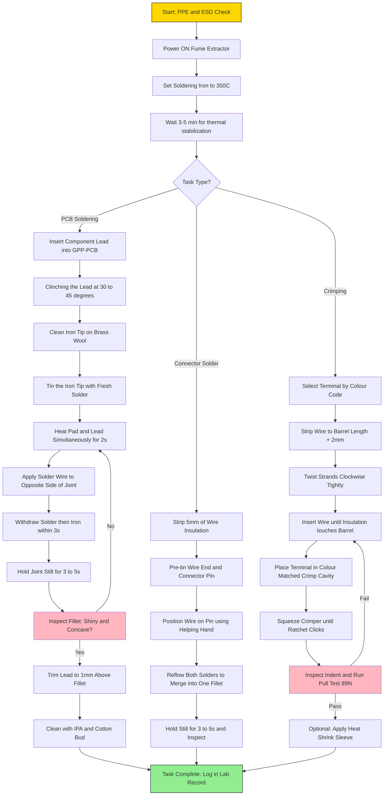
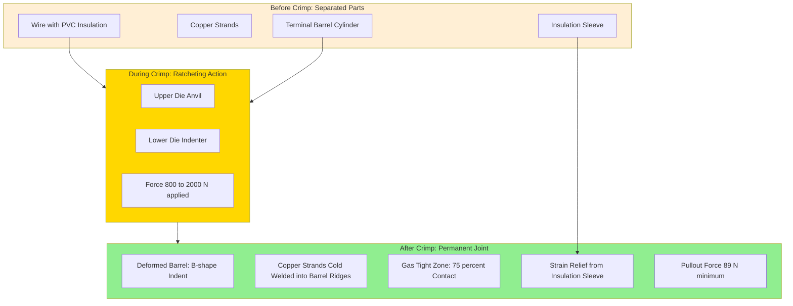
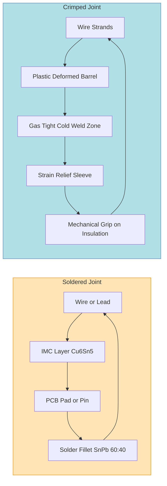

# Soldering practice in connectors and general-purpose PCB, Crimping.

<!-- SECTION_1_START -->
# 🔧 Soldering Practice in Connectors & General-Purpose PCB, Crimping

## 1.1 Formal Definition

**Soldering** is a metallurgical joining process used to create a permanent electrical and mechanical bond between two or more metal surfaces by melting and flowing a filler metal (solder) into the joint. The filler metal — typically a **tin-lead (Sn-Pb)** or **lead-free (SAC — Sn-Ag-Cu)** alloy — has a melting point **below 450 °C**, well below the melting point of the base metals being joined. The base metals are never melted; they are only wetted by the molten solder, forming an **intermetallic compound (IMC)** layer at the interface.

**Crimping** is a cold-welding (solid-state) mechanical joining process in which a metal terminal is deformed (squeezed) around a stripped wire conductor using a calibrated tool (crimper). The result is a gas-tight, vibration-resistant, and highly conductive electrical joint formed **without heat**.

> [!IMPORTANT]
> **KTU 2024 Syllabus Highlight (GZESL106 — Module 6):**
> The student is expected to *demonstrate* soldering on a **general-purpose PCB (GPP-PCB)** and on **electrical connectors** (e.g., screw-type terminal blocks, berg strip headers), and perform **crimping** on insulated and non-insulated wire lugs/terminals. This is a **hands-on practical skill** assessed in the continuous evaluation (CE) lab exam.

## 1.2 Conceptual Analogy & Intuition

| Process | Real-World Analogy | Why It Works |
|---|---|---|
| **Soldering** | Gluing two pieces of paper with a *metallic glue* that hardens and conducts electricity | The molten solder wets the metal surfaces, then freezes into a solid metallic bridge |
| **Crimping** | Crushing the end of a soda straw around a pencil to hold it tight — a *mechanical hug* | The metal terminal plastically deforms and grips the wire's copper strands for life |

> [!NOTE]
> **Think of it this way:** Soldering is like *welding with chocolate* — you melt the chocolate (solder), let it flow over the joint, and it solidifies to hold things together and conduct electricity. Crimping is like *folding a paper clip* around a wire — pure mechanical force, no heat required.

## 1.3 Key Constants & Standards

- **Standard soldering iron tip temperature:** **350 °C – 400 °C** (for Sn-Pb 60/40 solder)
- **Standard lead-free soldering temperature:** **370 °C – 420 °C**
- **Melting point of Sn-Pb 60/40 solder:** **183 °C – 190 °C** (eutectic)
- **Melting point of Sn-Ag-Cu (SAC 305) lead-free:** **217 °C – 220 °C**
- **Acceptable crimp pull-out force (per UL 486A/B):** varies by wire gauge; e.g., for **16 AWG**: ≥ **89 N (20 lbf)**, for **12 AWG**: ≥ **178 N (40 lbf)**

> [!VISUALIZATION CONTROL]
> **Concept:** Temperature Profile of Soldering Joint vs. Time
> **GeoGebra / Desmos Input Equations:**
> * `f(t) = piecewise` (ramp from 25 °C to 380 °C between t=0 and t=60s)
> * Plateau at 380 °C (t=60s to t=80s — dwell/wetting time)
> * Cool-down: `g(t) = 380 - 6*(t-80)` (cool at ≤ 6 °C/s to avoid thermal shock)
> **Visual Description:** A "T-shaped" thermal profile: preheat ramp → wetting plateau → controlled cool-down. The student should observe that the **dwell time** at the tip temperature must be **2 – 4 seconds** to ensure proper IMC formation without damaging the PCB pad.
<!-- SECTION_1_END -->

<!-- SECTION_2_START -->
# 📘 Deep Theoretical Analysis & KTU High-Yield Reference

## 2.1 The Science of Soldering — How a Joint Forms

A good solder joint is created through **four sequential physico-chemical events**:

1. **Thermal Activation:** The soldering iron tip raises the temperature of the component lead and PCB pad above the solder's liquidus temperature.
2. **Wetting:** Molten solder flows over the heated metal surfaces, replacing oxides and adsorbed gases. The contact angle between solder and pad should ideally be **≤ 55°**.
3. **Intermetallic Compound (IMC) Formation:** A thin layer of alloy (e.g., **Cu$_6$Sn$_5$** for copper pads) grows at the interface. This layer is what truly bonds the metals — not just surface adhesion.
4. **Solidification:** The joint is held still as solder freezes, producing a **bright, concave, fillet-shaped fillet** (the "volcano shape").

### 2.1.1 Tools & Materials Required

| S.No. | Tool / Material | Specification (KTU Workshop Standard) |
|---|---|---|
| 1 | **Soldering Iron** | **25 W – 60 W**, temperature-controlled station (e.g., 60 W, 230 V AC) |
| 2 | **Solder Wire** | **60/40 Sn-Pb**, rosin-core (flux-core), 0.8 mm or 1.0 mm diameter |
| 3 | **Soldering Iron Tip** | Conical or chisel tip (**2.4 mm** for PCB, **5 mm** for connectors) |
| 4 | **Soldering Stand** | Iron holder with sponge / brass-wool tip cleaner |
| 5 | **Flux** | Rosin-based (RMA) — improves wetting, removes oxides |
| 6 | **Wick / Desoldering Braid** | Copper braid for solder removal / rework |
| 7 | **Desoldering Pump (Solder Sucker)** | Spring-loaded vacuum pump for through-hole rework |
| 8 | **General-Purpose PCB (GPP-PCB)** | FR-2 phenolic resin, single-sided, 2.54 mm pitch (for DIP components / berg strips) |
| 9 | **Connectors** | Screw-type terminal block (2-pin, 5 mm pitch) or **Berg strip** (SIP/DIP male header) |
| 10 | **Safety Gear** | Fume extractor / cross-flow fan, safety glasses, ESD wrist strap |
| 11 | **Cutters & Strippers** | Side cutter, wire stripper, needle-nose pliers |
| 12 | **Cleaning Solvent** | **Isopropyl alcohol (IPA, 99%)** for post-solder cleaning |

### 2.1.2 KTU Formula / Reference Sheet (Soldering)

| Parameter | Value / Formula | Remarks |
|---|---|---|
| **Solder Joint Resistance (target)** | $R_j \leq 2 \text{ m}\Omega$ | For a good through-hole joint |
| **Wetting Angle (ideal)** | $\theta \leq 55°$ | Lower = better wetting |
| **Tip Temperature (Sn-Pb 60/40)** | $T_{tip} = 350°\text{C} – 380°\text{C}$ | With temperature-controlled station |
| **Dwell Time on Pad** | $t_{dwell} = 2\text{s} – 4\text{s}$ | Per pad, per side |
| **Cool-down Rate** | $\leq 6°\text{C/s}$ | To avoid thermal shock to PCB |
| **Solder Alloy Eutectic** | **Sn 63 % / Pb 37 %** | Melts & freezes sharply at **183 °C** |
| **Lead-free alloy** | **SAC 305** — Sn 96.5 % / Ag 3 % / Cu 0.5 % | Melts at **217 °C** |
| **Flux Residue** | Must be cleaned with **IPA** if "No-Clean" not used | Residue is mildly corrosive |

## 2.2 The Science of Crimping

Crimping is governed by **Hooke's Law** in the elastic region and **plastic deformation** in the yield region:

$$F_{crimp} = k \cdot \Delta x + F_{yield}$$

where:
- $F_{crimp}$ is the applied crimping force
- $k$ is the crimper die stiffness
- $\Delta x$ is the die closure displacement
- $F_{yield}$ is the force needed to initiate plastic flow in the terminal

> [!TIP]
> A properly crimped terminal has **both an electrical bond (gas-tight connection)** and a **mechanical bond (strain relief + grip)**. The UL 486A/B standard mandates a minimum **pull-out force** test after crimping.

### 2.2.1 Tools & Materials Required (Crimping)

| S.No. | Tool / Material | Specification |
|---|---|---|
| 1 | **Ratcheting Crimper** | For insulated / non-insulated terminals (e.g., **ratchet crimper, 0.5 – 6 mm² capacity**) |
| 2 | **Wire Stripper** | Adjustable, for stripping **1.0 – 1.5 cm** of insulation |
| 3 | **Insulated Terminals (Spade / Ring / Fork)** | Red (0.5–1.5 mm²), Blue (1.5–2.5 mm²), Yellow (4–6 mm²) — colour-coded per DIN 46228 |
| 4 | **Non-insulated terminal (wire lug)** | Bare copper lug for power connections |
| 5 | **Multi-strand Copper Wire** | **1.0 mm² / 1.5 mm² / 2.5 mm²** standard workshop gauges |
| 6 | **Heat-shrink Sleeve (optional)** | For post-crimp insulation |
| 7 | **Heat Gun (optional)** | For shrinking the heat-shrink sleeve |
| 8 | **Sandpaper / Emery cloth** | For cleaning terminal barrel before crimp |

### 2.2.2 KTU Formula / Reference Sheet (Crimping)

| Parameter | Specification | Remarks |
|---|---|---|
| **Strip Length** | $L_{strip} = L_{barrel} + 2 \text{ mm}$ | Ensures full barrel fill, no exposed copper |
| **Crimp Force Range** | $F = 800 \text{ N} – 2000 \text{ N}$ | Depends on die and wire gauge |
| **Colour Code (Insulated Terminals)** | **Red = 22–16 AWG**, **Blue = 16–14 AWG**, **Yellow = 12–10 AWG** | International standard |
| **Crimp Type** | **Indent / Hex / Oval** | Workshop uses **indent** type |
| **Pull-out Force (Min.)** | $F_{pull} \geq 89 \text{ N}$ (for 22 AWG) | Per UL 486A/B |
| **Gas-tight Zone** | $\geq 75\%$ of the contact area | Where copper strands deform into terminal ridges |
| **Crimp Height Tolerance** | $\pm 0.05 \text{ mm}$ | Measured with vernier caliper |

## 2.3 Engineering Application Domains

- **Soldering**: Consumer electronics (every PCB), avionics, IoT devices, medical implants, automotive ECUs.
- **Crimping**: Automotive wiring harnesses, industrial control panels, aerospace cable assemblies, power distribution boards — *anywhere vibration, mechanical stress, and reliability matter more than a permanent solder-only joint.*
- **Why both?** A **connector pin** on a PCB is often a **hybrid joint**: the pin is *crimped* to the wire, and the pin is *soldered* to the PCB. This gives both mechanical strength (crimp) and electrical permanence (solder).

> [!IMPORTANT]
> **KTU Examiner's Note:** In the practical exam, you will likely be asked to **solder a component on a GPP-PCB** AND **crimp a wire to a terminal lug**. Know the colour codes, strip lengths, and the difference between a *good* and *cold* solder joint!
<!-- SECTION_2_END -->

<!-- SECTION_3_START -->
# 🛠️ Step-by-Step Procedure & Implementation

## 3.1 Pre-Lab Safety & Workstation Setup

1. Wear **safety glasses** and **ESD wrist strap** (especially when working with active components).
2. Ensure the **fume extractor is ON** — lead-bearing solder fumes are toxic (Pb is a cumulative neurotoxin).
3. **Inspect the soldering iron:** Tip must be tinned (shiny silver); if black/oxidized, re-tin with fresh solder.
4. **Plug in & pre-heat:** Allow **3 – 5 minutes** for the iron to reach set temperature (**350 °C** for Sn-Pb).
5. **Wet the cleaning sponge** (or use brass wool) to wipe the tip between joints.
6. Keep the **workstation clutter-free** — organize tools, wire, and components in labelled bins.

> [!WARNING]
> **Never touch the iron's metal shaft or tip — the element reaches 380 °C and causes third-degree burns within 0.5 s of contact. Always return the iron to its stand when idle.**

## 3.2 Soldering on a General-Purpose PCB (GPP-PCB)

### Pin Configuration & Setup Table

| Item | Specification / Pin / Pad |
|---|---|
| **PCB Type** | GPP-PCB, single-sided copper clad, FR-2 substrate, **2.54 mm (0.1") pad pitch** |
| **Component** | Resistor (e.g., 1 kΩ, ¼ W) — axial leaded, lead pitch ~ 10 mm |
| **Pad Hole Diameter** | **0.9 mm – 1.0 mm** |
| **Lead Diameter** | **0.6 mm – 0.8 mm** |
| **Iron Tip** | **Conical, 1.0 mm – 2.4 mm** |
| **Solder Wire** | **60/40 Sn-Pb, 0.8 mm, rosin-core** |

### Step-by-Step Procedure

1. **Insert the component leads** into the PCB holes from the **copper (solder) side** until the component body sits flush on the board. Bend the leads outward at 30°–45° on the copper side to hold the component in place (this is called "clinching").
2. **Clean the iron tip** by wiping it on the damp sponge / brass wool. The tip should appear bright silver.
3. **Tin the tip:** Apply a small bead of fresh solder to the tip. This improves thermal conductivity.
4. **Touch the iron tip to the joint:** Simultaneously contact **both the component lead AND the PCB pad** with the iron tip. The thermal contact area should be 2 – 3 mm².
5. **Apply solder to the joint (not the iron):** Wait **1 – 2 seconds** for the joint to heat up, then feed solder wire onto the **pad-lead junction** (opposite side of the iron). The solder should melt and flow like a liquid, drawing around the lead.
6. **Withdraw solder, then iron:** Pull the solder wire away first, then the iron — in that order. Total dwell time: **2 – 4 seconds**.
7. **Hold the joint still** for **3 – 5 seconds** to allow solidification. Do not blow on it (this causes a "cold joint" with grainy, brittle structure).
8. **Inspect the joint:** It should look like a **shiny, concave, "volcano-shaped" fillet** that smoothly wets both the lead and the pad.
9. **Trim the leads** with a side cutter, leaving **~ 1 mm** above the solder fillet.
10. **Clean flux residue** with a cotton bud dipped in **isopropyl alcohol (IPA)**.

> [!TIP]
> **Common Faults & Diagnosis (KTU Practical Examiner's Checklist):**
>
> | Defect | Visual Sign | Cause | Fix |
> |---|---|---|---|
> | **Cold Joint** | Dull, grainy, ball-shaped | Insufficient heat, joint moved during cooling | Reheat to reflow, hold still |
> | **Solder Bridge** | Solder connects two adjacent pads | Too much solder / oversized tip | Wick out excess with desoldering braid |
> | **Lifted Pad** | Pad peeled off the PCB | Excessive heat / force | Repair with jumper wire |
> | **Insufficient Wetting** | Solder balls up, doesn't flow | Oxidized lead / pad | Clean with sandpaper, re-tin, reflow |
> | **Rosin Spike / Icicle** | Sharp pointed protrusion | Iron withdrawn too slowly | Reflow and withdraw quickly |

## 3.3 Soldering on Electrical Connectors (Berg Strip / Terminal Block)

### Hardware Setup

| Item | Specification |
|---|---|
| **Connector** | **Berg strip (SIP header, 2.54 mm pitch)** OR **screw-type terminal block (5 mm pitch, 2-pin)** |
| **Wire** | **22 AWG (0.33 mm²)** stranded, tinned copper, PVC insulated |
| **Iron Tip** | **Chisel tip, 3.2 mm** — larger thermal mass for higher current connectors |
| **Solder Wire** | **60/40 Sn-Pb, 1.0 mm** — thicker for stronger fillet |
| **Pre-tinning** | Pre-tin **both the wire end (5 mm)** and **the connector pin** before joining |

### Step-by-Step Procedure

1. **Strip the wire** to **5 mm** of bare copper using a wire stripper. Avoid nicking the copper strands.
2. **Twist the strands** tightly clockwise (this prevents stray strands from causing shorts).
3. **Pre-tin the wire:** Heat the wire end with the iron and apply a thin coat of solder. The strands should appear uniformly silver and fused (not frayed).
4. **Pre-tin the connector pin:** Apply a small solder blob to the cup / pad of the connector.
5. **Position the tinned wire** onto the tinned connector pin. Hold both with needle-nose pliers (or a "helping hand" / "third hand" tool with magnifying glass).
6. **Apply iron** to the joint, heating both surfaces. Allow the existing solder on both pieces to **melt and merge** into a single fillet.
7. **Hold still** for 3 – 5 seconds. Remove iron. Do not disturb the joint until it solidifies.
8. **Inspect:** The fillet should be shiny, concave, and completely enclose the wire strands with no stray copper exposed.

> [!WARNING]
> **Do not solder wire directly to a screw-type terminal** unless the terminal is specifically a "solder-tab" variant. Screw terminals require a **crimped lug or forked spade connector** for reliable gas-tight contact. Solder under a screw joint *cold-creeps* over time and fails.

## 3.4 Crimping Procedure (Insulated Spade / Ring Terminal)

### Hardware Setup

| Item | Specification |
|---|---|
| **Wire** | 1.0 mm² (red colour-coded) or 1.5 mm² (blue) multi-strand copper |
| **Terminal** | **Insulated spade / fork / ring terminal**, colour-matched to wire gauge |
| **Crimper** | Ratcheting crimper with three cavities (Red / Blue / Yellow) |
| **Strip Length** | **Equal to barrel length + 2 mm** (typically 6 – 8 mm) |

### Step-by-Step Procedure

1. **Select the correct terminal** by matching the colour code to the wire gauge:
   - **Red** → 0.5 – 1.5 mm² (22 – 16 AWG)
   - **Blue** → 1.5 – 2.5 mm² (16 – 14 AWG)
   - **Yellow** → 4 – 6 mm² (12 – 10 AWG)
2. **Strip the wire insulation** to the calculated length using a wire stripper. Do not nick the copper.
3. **Twist the strands** tightly (optional but improves insertability).
4. **Inspect the terminal barrel:** The insulation sleeve should be intact, the metal barrel clean and undeformed.
5. **Insert the stripped wire** into the terminal barrel until the **insulation just butts against the metal barrel end** (no bare copper visible, no insulation inside the metal barrel).
6. **Place the terminal into the correct crimper cavity** (colour-matched: Red cavity for Red terminal, etc.). The "U" or "B" crimp indentation should be on the **conductor barrel** — not on the insulation sleeve.
7. **Squeeze the crimper handles firmly** until the **ratchet releases** with an audible "click." This guarantees the correct pressure has been applied — never stop mid-crimp.
8. **Withdraw the crimped terminal** and inspect:
   - The indentation should be a **clean "B" or oval shape**, centered on the barrel.
   - The wire should be **firmly gripped** — no rotation, no pull-out with moderate hand force.
   - **Pull test:** Apply a firm pull with your hand (or per UL standard, ≥ 89 N). The wire should NOT come out.
9. **Optional post-crimp insulation:** Slide a **heat-shrink sleeve** (matching colour) over the crimp and shrink with a heat gun (200 °C, 5 s) for additional strain relief and environmental sealing.

## 3.5 Quality Inspection Summary Table (for Lab Record)

| Process | Good Joint Sign | Bad Joint Sign | Method to Verify |
|---|---|---|---|
| **PCB Solder** | Shiny concave fillet, wetting angle < 55° | Dull, balled, bridged | Visual + 5× loupe |
| **Connector Solder** | Pre-tin merged, no stray strands | Cold joint, exposed copper | Visual + pull test (gentle) |
| **Crimp — Insulated** | Clean indent, insulation flush with barrel | Loose, insulation in metal barrel | Visual + pull test (≥ 89 N) |
| **Crimp — Non-insulated** | Hex/oval indent, gas-tight zone ≥ 75% | Cracked barrel, over-crimp | Caliper (crimp height) |

> [!IMPORTANT]
> **Lab Record Entry (Mandatory for KTU CE Evaluation):**
> "Soldered a 1 kΩ resistor on a GPP-PCB at 350 °C using 60/40 Sn-Pb solder. Verified shiny, concave fillet. Crimped a 1.0 mm² wire to a red insulated spade terminal using the ratcheting crimper. Passed the pull test with no slip."
<!-- SECTION_3_END -->

<!-- SECTION_4_START -->
# 🗺️ Structural Diagrams & Process Schematics

## 4.1 Mermaid Flowchart — Complete Soldering & Crimping Workflow

## 4.2 Block Diagram — Soldering Iron Station Architecture

```mermaid
flowchart LR
    subgraph PWR[Power Module]
        A1[230V AC Mains Input] --> A2[Step Down Transformer 24V]
        A2 --> A3[Bridge Rectifier]
        A3 --> A4[DC Filter Capacitor]
        A4 --> A5[Voltage Regulator LM317]
    end

    subgraph CTRL[Control Module]
        A5 --> B1[Temperature Sensor Thermocouple in Tip]
        B1 --> B2[Comparator Circuit]
        B2 --> B3[PWM Signal Generator]
        A5 --> B3
    end

    subgraph HTR[Heating Module]
        B3 --> C1[Power MOSFET Driver]
        C1 --> C2[Soldering Iron Heating Element 60W]
        C2 --> C1
    end

    subgraph TIP[Iron Tip Assembly]
        C2 --> D1[Copper Tip with Iron Plating]
        D1 --> D2[Working Surface 350 to 400C]
    end

    A1 --> A2
    B3 --> C1
    C2 --> D1

    style PWR fill:#E6F3FF,stroke:#0066CC
    style CTRL fill:#FFF4E6,stroke:#FF6600
    style HTR fill:#FFE6E6,stroke:#CC0000
    style TIP fill:#E6FFE6,stroke:#009900
```

## 4.3 Component Cross-Section — Crimp Joint Anatomy

## 4.4 Joint Comparison Matrix — Soldered vs. Crimped Joint

<!-- SECTION_4_END -->

<!-- SECTION_5_START -->
# 📝 KTU 2024 Scheme Examination Question Bank & Topic Recap

## 5.1 Part A — Short Answer Questions (3 Marks Each)

### Q1. [KTU University Exam — July 2024, Model] [CO1 | Remember]
**Define soldering. List the four sequential events that form a sound solder joint.**

**Model Answer:**

Soldering is a metallurgical joining process in which a filler metal (solder), with a melting point below **450 °C**, is melted to wet and bond two metal surfaces without melting the base metals.

The four events are:
1. **Thermal Activation** — heating the joint above the solder's liquidus temperature.
2. **Wetting** — molten solder flows over clean metal surfaces (contact angle < 55°).
3. **Intermetallic Compound (IMC) Formation** — a thin alloy layer (e.g., Cu₆Sn₅) forms at the interface, providing the true metallic bond.
4. **Solidification** — solder freezes into a bright, concave fillet.

> **[Valuation Key: Definition = 1 Mark; Four events listed = 2 Marks]**

### Q2. [KTU University Exam — Dec 2023, Model] [CO2 | Understand]
**Differentiate between soldering and crimping in any three aspects.**

**Model Answer:**

| Aspect | Soldering | Crimping |
|---|---|---|
| **Process Type** | Thermal / metallurgical joining | Mechanical / cold-welding |
| **Heat Required** | Yes (350 – 400 °C) | No (cold process) |
| **Joint Formation** | Intermetallic compound (Cu₆Sn₅) | Plastic deformation, gas-tight cold weld |
| **Reversibility** | Reversible (desoldering possible) | Permanent (cannot be undone without destruction) |
| **Typical Use** | PCB component mounting | Wire-to-terminal connections (harnesses) |
| **Tools** | Soldering iron, solder wire | Ratcheting crimper |

> **[Valuation Key: Any three correctly differentiated aspects = 3 Marks]**

---

## 5.2 Part B — Long Answer Questions (14 Marks Each, Internal Choice)

### QUESTION A (14 Marks) — Soldering Focus [CO3 | Apply]

> **[KTU University Exam — July 2024 Style, Module 6]**

**(a)** [7 Marks] **With the help of a neat labelled diagram, describe the procedure for soldering a 1 kΩ axial-lead resistor on a General-Purpose PCB (GPP-PCB). State the ideal tip temperature, solder alloy, and inspection criteria for a good joint.**

**(b)** [7 Marks] **Explain any four common soldering defects with their causes and remedies.**

#### Model Solution:

**Part (a) — 7 Marks**

**Step 1: Pre-soldering preparation** **[1 Mark]**
- Gather the GPP-PCB (FR-2, 2.54 mm pitch, single-sided copper clad), 1 kΩ ¼ W axial resistor, 60/40 Sn-Pb rosin-core solder wire (0.8 mm), 60 W temperature-controlled soldering iron with a 2.4 mm chisel tip, side cutter, and IPA cleaning swab.
- Set the iron to **350 °C** and wait 3 – 5 minutes for thermal stabilization. Wear safety glasses, ESD strap, and switch on the fume extractor.

**Step 2: Component insertion** **[1 Mark]**
- Insert the resistor leads into the PCB through-holes from the non-copper (component) side. Bend the leads outward at **30°–45°** on the copper side to clinch the component in place.

**Step 3: Soldering the joint** **[2 Marks]**
- Clean and tin the iron tip. Simultaneously touch the **iron tip to both the component lead AND the PCB pad** (thermal contact ~ 2 – 3 mm²).
- After **1 – 2 seconds** of preheating, apply solder to the **opposite side** of the joint (not the iron). Solder should flow like a liquid, wetting both surfaces.
- Withdraw the solder wire first, then the iron, within **2 – 4 seconds** total dwell time.

**Step 4: Inspection and finishing** **[1 Mark]**
- Inspect: a good joint shows a **shiny, concave, volcano-shaped fillet** with a wetting angle **< 55°**. The lead outline should be visible beneath the solder.
- Trim leads to **~ 1 mm** above the fillet. Clean flux residue with IPA and a cotton bud.

**Ideal Parameters Summary:** **[2 Marks]**
- Tip temperature: **350 – 380 °C** for 60/40 Sn-Pb
- Solder alloy: **63 % Sn / 37 % Pb** (eutectic, m.p. **183 °C**)
- Wetting angle: **θ ≤ 55°**
- Dwell time: **2 – 4 seconds**
- Cleanliness: bright, smooth, concave fillet with no bridges

---

**Part (b) — 7 Marks**

| # | Defect | Diagram Cue | Cause | Remedy | Marks |
|---|---|---|---|---|---|
| 1 | **Cold Joint** | Dull, grainy, ball-shaped fillet | Insufficient heat OR joint moved during cooling | Reheat to reflow, hold joint still while cooling | **1.5 Marks** |
| 2 | **Solder Bridge** | Solder connects two adjacent pads | Excess solder OR oversized tip OR too much dwell | Wick out with desoldering braid; reflow with clean tip | **1.5 Marks** |
| 3 | **Lifted Pad** | Copper pad peeled off PCB substrate | Excessive iron temperature OR prying force on lead | Use lower temp; repair with a jumper wire (Kynar wire) | **2 Marks** |
| 4 | **Insufficient Wetting** | Solder balls up; doesn't spread; > 55° contact angle | Oxidized lead/pad; insufficient flux; cold tip | Clean lead/pad with sandpaper or scraper; re-tin; apply fresh rosin flux | **2 Marks** |

---

### QUESTION B (14 Marks) — Crimping Focus [CO3 | Apply]

> **[KTU University Exam — Dec 2023 Style, Module 6]**

**(a)** [7 Marks] **Describe the step-by-step procedure to crimp a 1.5 mm² stranded copper wire to an insulated blue spade terminal using a ratcheting crimper. Mention the colour-code standard and the UL-specified minimum pull-out force.**

**(b)** [7 Marks] **Compare the soldered joint and the crimped joint with respect to (i) process temperature, (ii) joint formation mechanism, (iii) reversibility, (iv) vibration resistance, and (v) typical application. State one engineering situation where a hybrid (soldered + crimped) joint is preferred.**

#### Model Solution:

**Part (a) — 7 Marks**

**Step 1: Terminal and wire selection** **[1 Mark]**
- For 1.5 mm² (≈ 16 AWG) stranded copper wire, select a **blue-insulated spade terminal** (colour code per **DIN 46228**).

**Step 2: Strip the insulation** **[1 Mark]**
- Use a wire stripper to remove **6 – 8 mm** (= barrel length + 2 mm) of PVC insulation. Take care not to nick the copper strands.

**Step 3: Prepare the strands** **[1 Mark]**
- Twist the exposed copper strands tightly in the clockwise direction. This prevents fraying and improves barrel insertion.

**Step 4: Insert and position** **[1 Mark]**
- Push the bare copper fully into the metal barrel until the **insulation butt** meets the barrel end. The insulation sleeve should grip the insulation of the wire for strain relief.

**Step 5: Crimp** **[2 Marks]**
- Place the terminal in the **blue colour-matched cavity** of the ratcheting crimper. The indent should be on the **metal barrel** (not the insulation sleeve).
- Squeeze the handles firmly until the **ratchet releases** with an audible click. This guarantees the calibrated crimp force has been applied. **Never stop mid-crimp.**

**Step 6: Inspect and pull-test** **[1 Mark]**
- Inspect the indent: a clean "B" or oval shape, centered on the barrel, no cracks.
- Apply a manual pull of **≥ 89 N** (UL 486A/B minimum pull-out force for 16 AWG). The wire should not slip.

> **[Valuation Key: Wire selection + colour code = 1 M; Strip + twist = 2 M; Insertion + cavity choice = 2 M; Ratchet procedure = 1 M; Inspection + pull test = 1 M]**

---

**Part (b) — 7 Marks**

**Comparison Table** **[5 Marks]**

| S.No. | Parameter | Soldered Joint | Crimped Joint |
|---|---|---|---|
| 1 | **Process Temperature** | 350 – 400 °C (above solder m.p.) | Room temperature (cold process) |
| 2 | **Joint Formation** | Intermetallic diffusion (Cu₆Sn₅ layer) | Plastic deformation, gas-tight cold weld |
| 3 | **Reversibility** | Reversible (desoldering possible) | Permanent (destruction to undo) |
| 4 | **Vibration Resistance** | Moderate (can fatigue with thermal cycling) | Excellent (mechanical lock) |
| 5 | **Typical Application** | PCB pads, through-hole components, SMD | Wire harnesses, automotive, power lugs |

**Hybrid Joint Scenario** **[2 Marks]**
In a **high-vibration automotive ECU connector**, the wire is **crimped** to the connector pin (mechanical strength + vibration resistance), and the pin is then **soldered** to the PCB (electrical permanence + low contact resistance). This combination leverages the advantages of both processes: the crimp absorbs mechanical stress and prevents fatigue at the wire-pin interface, while the solder ensures a low-impedance, gas-tight electrical path from the pin to the PCB trace.

---

> [!WARNING]
> **🔴 KTU Examiner's Common Pitfalls — Where Students Lose Marks:**
> 1. **Forgetting the flux / tinning step** — Failure to mention *pre-tinning* the iron and the joint surfaces will cost 1 – 2 marks on a soldering question.
> 2. **Wrong temperature** — Writing 450 °C or 500 °C for Sn-Pb 60/40 (the correct range is **350 – 380 °C**). Going above 400 °C burns the flux and oxidizes the tip.
> 3. **Mixing up colour codes** — Red terminal is for **smaller** wire (0.5 – 1.5 mm²); Blue is for **larger** wire (1.5 – 2.5 mm²). Reversing these will cause a loose joint.
> 4. **Not stating the dwell time** — Examiner expects you to write **2 – 4 seconds** per pad for PCB soldering.
> 5. **Stopping the crimper mid-stroke** — The ratchet design *intentionally prevents* this; if you release pressure early, the joint will be loose. Always complete the stroke to the ratchet release.
> 6. **Failing to draw the lab diagram** — The GPP-PCB layout with the component, the solder fillet, and the iron tip in contact is a **mandatory** 2-mark component in KTU viva.
> 7. **Skipping the pull test mention** — For crimping questions, always mention the **UL 486A/B pull-out test** and the value (≥ 89 N for 16 AWG).

---

## 5.3 Topic Recap & Important Things to Remember ✨

> **Use this as your last-minute KTU revision checklist:**

- **Soldering** = metallurgical joining using a **filler metal** below 450 °C; base metals are *not* melted. The actual bond is the **intermetallic compound (IMC)** layer (e.g., Cu₆Sn₅).

- **Crimping** = cold-welding by **plastic deformation**; no heat; permanent; gas-tight.

- **Standard solder alloy** in the KTU lab: **60/40 Sn-Pb** (or **63/37** eutectic), rosin-core, **0.8 mm** wire.

- **Standard soldering temperature:** **350 – 380 °C** for Sn-Pb; **370 – 420 °C** for lead-free (SAC 305).

- **Wetting angle for a good joint:** **θ ≤ 55°** (lower = better wetting).

- **Dwell time per pad:** **2 – 4 seconds**. Never exceed 5 s — risk of pad lift.

- **Visual sign of a good joint:** Shiny, concave, **volcano-shaped fillet** that wets both lead and pad.

- **Visual sign of a cold joint:** Dull, grainy, ball-shaped, often with the lead outline visible at high magnification.

- **Soldering Iron tip care:** Always **tin the tip** before and after use; clean on a damp sponge or brass wool — never file a plated tip.

- **Fume extractor is mandatory** — Lead fumes are toxic (Pb is a cumulative neurotoxin, affects nervous system).

- **Crimp colour code (DIN 46228):** **Red = 0.5–1.5 mm²**, **Blue = 1.5–2.5 mm²**, **Yellow = 4–6 mm²**.

- **Crimp strip length rule:** $L_{strip} = L_{barrel} + 2 \text{ mm}$.

- **Crimper:** Use only a **ratcheting crimper** for insulated terminals; the ratchet guarantees the calibrated force is reached. **Never release mid-stroke.**

- **UL 486A/B minimum pull-out force:** **89 N** for 22 AWG; **178 N** for 12 AWG. Always mention the pull test in your answer.

- **Crimp indent location:** The "B" or oval indent must be on the **metal conductor barrel**, NOT on the plastic insulation sleeve. The sleeve provides strain relief through *grip*, not deformation.

- **Hybrid joint use case:** Automotive / aerospace connectors where the wire is **crimped** to the pin and the pin is **soldered** to the PCB — best of both worlds.

- **PCB pad hole standard for GPP-PCB:** **0.9 – 1.0 mm** hole for **0.6 – 0.8 mm** leads (2.54 mm / 0.1" pitch).

- **Flux:** Rosin-based (RMA) for leaded solder; **clean with IPA** after soldering unless using "no-clean" flux.

- **ESD safety:** Always wear an **ESD wrist strap** when soldering active semiconductor components (diodes, ICs, transistors) — passive components (resistors, capacitors) are ESD-safe.

- **Power-on order:** Plug in iron → wait 3 – 5 min → tin tip → begin work. **Power-off order:** Wipe tip → re-tin with fresh solder → switch off (this protects the tip from oxidation during storage).

- **Most common KTU exam question framing:** "Solder a given component on a GPP-PCB and crimp a wire to a terminal lug. State the procedure, ideal parameters, and any two defects with remedies."

- **The "volcano shape" and the "B-shape"** are the two visual mnemonics you must remember: **solder joints look like volcanoes; crimp joints look like the letter B.**
<!-- SECTION_5_END -->
