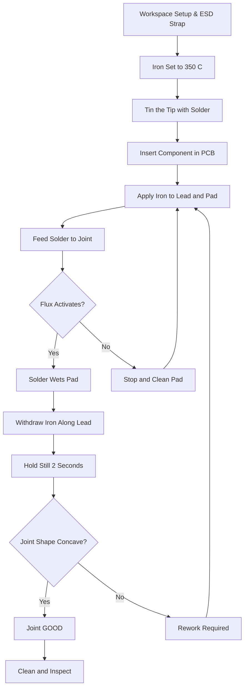
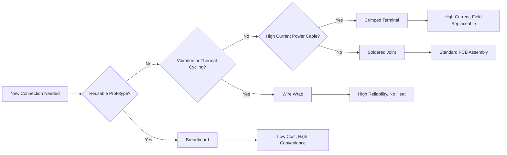
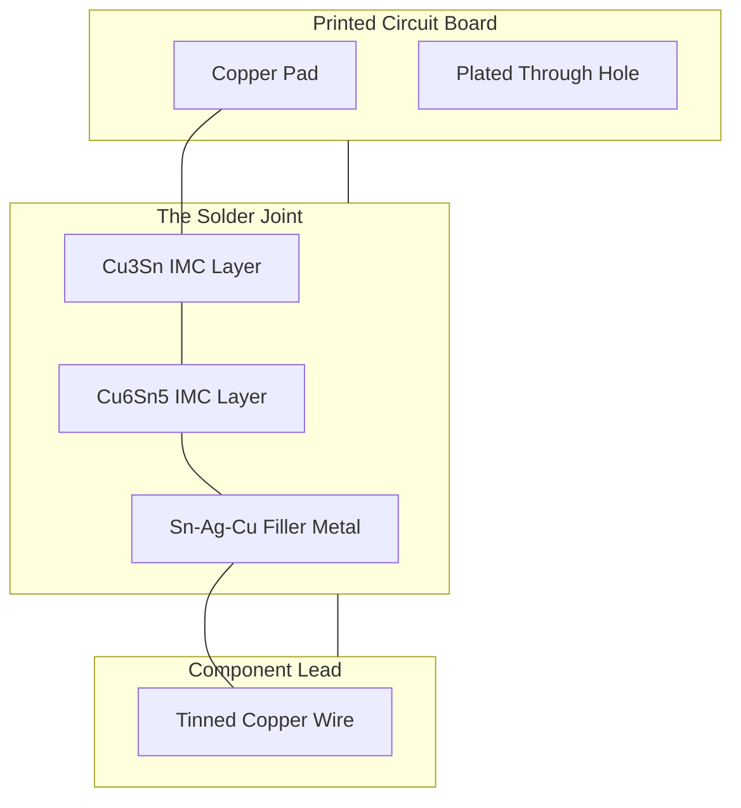
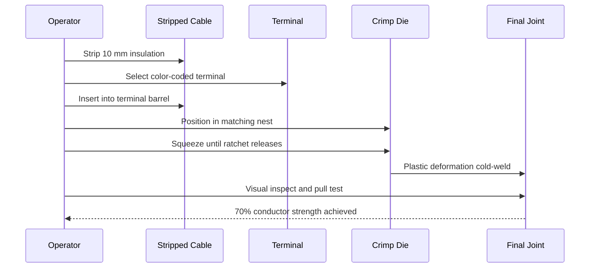
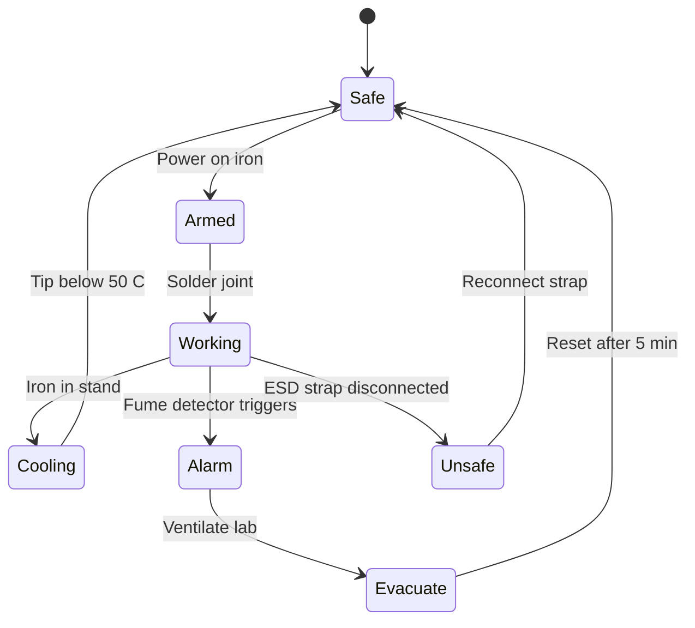

# Inter-connection methods and soldering practice: Bread board, Wrapping, Crimping, Soldering types, selection of materials and safety precautions

<!-- SECTION_1_START -->

# 1. Core Technical Definition & Intuitive Overview

## 1.1 Introduction to Electrical Interconnection

An **electrical interconnection** is the physical and electrical joining of two or more conductors (wires, component leads, or PCB traces) to establish a continuous, low-resistance, mechanically stable, and thermally reliable current path. In any electronic assembly — from a child's hobby circuit to a satellite — the *joint* is the weakest link. KTU 2024 Scheme (GZESL106) treats interconnection not as a single act of "joining wires", but as a structured engineering discipline covering **breadboarding (temporary)**, **wire wrapping (semi-permanent)**, **crimping (mechanical)**, and **soldering (metallurgical)**.

> [!IMPORTANT]
> **KTU 2024 Syllabus Highlight (GZESL106 – Module 6):**
> Students must demonstrate hands-on competency in selecting the correct interconnection method based on current rating, environment, vibration exposure, and rework requirements. Mere theoretical knowledge without workshop demonstration is **not** credited under KTU continuous evaluation.

---

## 1.2 The Four Canonical Interconnection Methods

| # | Method | Nature of Joint | Typical Use | KTU Workshop Skill Expected |
|---|--------|-----------------|-------------|------------------------------|
| 1 | **Breadboard** | Friction / spring-clip (temporary) | Prototyping, lab demos | Component insertion, strip routing |
| 2 | **Wire Wrapping** | Gas-tight helical pressure (semi-permanent) | Telemetry, military, backplanes | 7–9 turns on a square post |
| 3 | **Crimping** | Plastic deformation cold-weld (permanent) | Power cables, connectors, lugs | Correct die + cycle, pull test |
| 4 | **Soldering** | Metallurgical alloy bond (permanent) | PCBs, electronics assembly | 350 °C iron, lead-free profile |

---

## 1.3 Conceptual Analogy — "The Joint as a Bridge"

Imagine you are building a **bridge** between two islands of a city. The bridge can be:

- A **pontoon bridge** that floats on water (Breadboard) — easy to move, weak in storms.
- A **screw-bolted steel bridge** (Wire Wrap) — held by mechanical pressure, very reliable in earthquakes.
- A **hydraulically pressed steel plate** (Crimp) — the metal has been *squeezed* until it flows around the wire, becoming one piece.
- A **welded I-beam bridge** (Solder) — the metal actually *melted and alloyed* with the wire at the molecular level, the strongest of all.

> [!NOTE]
> **Key Insight for Exams:** Whenever KTU asks "Why is soldering preferred over twisting?", the answer is the *metallurgical bond* — the solder and copper form a continuous lattice of atoms, lowering contact resistance to **near-zero milliohms**, while a twisted joint remains a *point-contact* with oxide film.

---

## 1.4 Definitions Aligned to KTU 2024 Terminology

- **Soldering:** A fusion process in which a filler metal (solder) with a melting point **below 450 °C** is melted and wetted onto the base metals without melting them, forming a **metallurgical bond** upon solidification.
- **Wetting:** The ability of molten solder to spread and adhere to a clean, fluxed metal surface, characterized by a contact angle **θ < 90°**.
- **Flux:** A chemical cleaning agent (rosin, no-clean, water-soluble) that dissolves metal oxides and prevents re-oxidation during heating.
- **Crimping:** A cold-welding process that deforms a metal terminal around a conductor using a precisely shaped die to produce a gas-tight, low-resistance connection.
- **Wire Wrapping:** A solderless interconnection technique where a solid wire is helically wrapped under high tension around a square or rectangular post, creating a *gas-tight* connection with **≥ 7 turns**.
- **Breadboard (Solderless Breadboard):** A reusable prototyping platform using phosphor-bronze spring clips arranged in standardized 0.1-inch (2.54 mm) pitch.

---

## 1.5 GeoGebra / Desmos Visualization

> [!VISUALIZATION CONTROL]
> **Concept:** Wetting Angle of Molten Solder on a Copper Pad
> **GeoGebra / Desmos Input Equations:**
> * `solder_curve: y = 0.5*x^2` (molten solder meniscus)
> * `pad_surface: y = 0`
> * Tangent at contact point for angle theta with the surface
> **Visual Description:** Plot the molten solder bead on a horizontal copper pad. The angle θ formed between the pad and the tangent to the solder surface should be **less than 90°** for a good joint. When θ > 90°, the solder "balls up" — a classic sign of *insufficient wetting* caused by a dirty pad, cold iron, or no flux.

<!-- SECTION_1_END -->

<!-- SECTION_2_START -->

# 2. Deep Theoretical Analysis & KTU High-Yield Formula Sheet

## 2.1 The Science Behind Each Joint

### 2.1.1 Breadboard — The Spring-Contact Principle

A breadboard's internal structure uses **phosphor-bronze (Cu-Sn-P alloy) spring clips** with a contact resistance of approximately **5 mΩ to 20 mΩ per node**. The clip applies a normal force on the component lead, and because the contact area is small, the *real* contact occurs only at microscopic *a-spots* (asperity junctions). The theoretical contact resistance is given by **Holm's equation**:

$$R_c = \frac{\rho}{2} \sqrt{\frac{\pi H}{F_n}}$$

where $R_c$ is the contact resistance, $\rho$ is the resistivity of the contact material, $H$ is the hardness, and $F_n$ is the normal force exerted by the spring. As $F_n$ increases, $R_c$ decreases — which is why pushing harder into a breadboard *does* improve the contact.

> [!NOTE]
> **KTU Practical Note:** A breadboard is rated for **≤ 1 A per node** and **≤ 5 V to 36 V**. Never use it for mains AC — the spring clip gap (≈ 0.9 mm) cannot safely break 230 V.

### 2.1.2 Wire Wrapping — Gas-Tight Connection Theory

A square post (typically 0.025 inch × 0.025 inch, gold-plated) is wrapped with **30 AWG solid wire** under tension of approximately **1.5 N to 3 N**. The sharp corners of the post *plow* through the wire's oxide layer, exposing bare copper, while the high localized contact pressure causes the two metals to cold-weld at the corners. This is called a **gas-tight connection** because no atmospheric oxygen can penetrate to form a new oxide, ensuring decades of stable contact resistance (typically **< 5 mΩ**).

### 2.1.3 Crimping — The Cold-Weld Mechanics

Crimping uses a precisely machined die to compress a terminal barrel around a stranded wire. The plastic deformation exceeds the yield strength of the copper, causing the strands to *flow* into the terminal's serrations, displacing air and creating a void-free, gas-tight metallic bond. The result is a joint whose tensile strength can exceed **70 % of the conductor's own breaking strength**.

The mechanical pull-out force $F_{pull}$ is related to the die compression $C$ as:

$$F_{pull} \propto C \cdot \sigma_y \cdot A_c$$

where $\sigma_y$ is the yield strength of the terminal and $A_c$ is the cross-sectional area of the compressed barrel.

### 2.1.4 Soldering — Metallurgical Bond Formation

When molten solder (typically **Sn63/Pb37** or **SAC305 lead-free**) contacts clean copper at **above its liquidus temperature**, the following sequence occurs:

1. **Wetting** — solder spreads due to surface tension reduction.
2. **Dissolution** — copper atoms dissolve into the molten solder, forming a thin layer.
3. **Intermetallic Compound (IMC) formation** — typically $Cu_6Sn_5$ and $Cu_3Sn$, growing at the interface.
4. **Solidification** — on cooling, the solder crystallizes, locking the joint.

The IMC layer must be **1 µm to 4 µm** thick. Below 1 µm → poor bond; above 4 µm → brittle **Kirkendall voids** and joint failure.

---

## 2.2 KTU High-Yield Formula & Data Sheet

| Parameter | Symbol | Typical Value | Units | KTU Significance |
|-----------|--------|---------------|-------|------------------|
| Lead-free solder melting point | $T_m$ | **217 – 227** | °C | SAC305 = 217 °C |
| Sn-Pb eutectic melting point | $T_m$ | **183** | °C | Sn63/Pb37 eutectic |
| Recommended iron tip temperature | $T_{tip}$ | **330 – 380** | °C | Lead-free: 350 °C |
| Acceptable wetting angle | $\theta$ | **< 90** | degrees | θ → 0 is perfect |
| Wetting time (IPC J-STD-001) | $t_w$ | **< 2** | seconds | Time to wet pad |
| Breadboard contact resistance | $R_c$ | **5 – 20** | mΩ | Per spring clip |
| Wire wrap minimum turns | $n$ | **7** | turns | Class A: 7, Class B: 9 |
| Wire wrap pitch | $p$ | **0.1** | inch | 2.54 mm |
| Wire wrap tool tension | $T$ | **1.5 – 3.0** | N | 30 AWG wire |
| Crimp pull-out strength | $F$ | **≥ 70 %** of conductor | N | IPC/WHMA-A-620 |
| Solder tip-to-joint thermal time | $t$ | **1 – 3** | s | Avoid cold joint |
| Intermetallic layer thickness | $\delta$ | **1 – 4** | µm | Reliability window |
| Heat required to melt solder | $Q$ | $Q = m c \Delta T$ | J | Iron sizing |

For the **heat balance** of a soldering joint, the energy delivered by the iron tip must exceed the energy needed to raise the solder from ambient to liquidus plus the latent heat of fusion:

$$Q_{iron} \geq m_s \cdot c_s \cdot (T_{liquidus} - T_{ambient}) + m_s \cdot L_f$$

where $m_s$ is the solder mass, $c_s$ is the specific heat (≈ 0.18 kJ/kg·K for Sn-Pb), and $L_f$ is the latent heat of fusion (≈ 59 kJ/kg for Sn63/Pb37).

---

## 2.3 Solder Alloy Selection Cheat Sheet

| Alloy | Composition | Melting Point | Use Case | KTU Tip |
|-------|-------------|---------------|----------|---------|
| **Sn63/Pb37** | 63 % Sn, 37 % Pb | **183 °C** (eutectic) | General electronics, easiest to use | Still taught in KTU labs |
| **SAC305** | 96.5 % Sn, 3 % Ag, 0.5 % Cu | **217 – 221 °C** | Lead-free, RoHS compliant | Industry standard now |
| **Sn50/Pb50** | 50/50 | 183 – 215 (pasty) | Plumbing, not for PCB | Avoid on PCBs |
| **Sn-Pb-Ag** | 62/36/2 | 179 | High reliability, military | Aerospace |
| **Sn-Bi** | 42/58 | **138 °C** | Low-temp, heat-sensitive | Step soldering |

> [!NOTE]
> **RoHS Directive:** KTU 2024 syllabus insists on awareness of the **Restriction of Hazardous Substances** directive. Lead (Pb) is restricted; SAC305 is the modern lead-free substitute. Soldering iron must therefore be set **~30 °C higher** to compensate for the higher melting point.

---

## 2.4 Flux Classification

| Flux Type | Activity | Residue | Cleaning | Use |
|-----------|----------|---------|----------|-----|
| **Rosin (R, RMA, RA)** | Mild to high | Sticky, corrosive if RA | Required for RA | General electronics |
| **No-Clean (NC)** | Low | Minimal, non-corrosive | Not required | Modern lead-free lines |
| **Water-Soluble (WS)** | High | Highly ionic | Mandatory wash | Industrial, then cleaned |
| **Organic Acid** | Very high | Corrosive | Mandatory | Plumbing, not electronics |

---

## 2.5 Real-World Engineering Utility

- **Aerospace & Defense:** Wire wrapping is used in NASA and ISRO satellite backplanes because it survives vibration and thermal cycling better than solder.
- **Automotive:** Every wire harness in a car uses **crimped** terminals — millions per vehicle.
- **Consumer Electronics:** Soldering dominates PCB assembly; BGA and QFN packages rely on reflow-soldered solder paste.
- **Prototyping Labs & KTU Workshops:** Breadboards remain the fastest way to verify a circuit before committing to a PCB.
- **Telecom Exchanges:** Wire-wrapped terminal blocks were the backbone of telephone exchanges for decades.

<!-- SECTION_2_END -->

<!-- SECTION_3_START -->

# 3. Step-by-Step Procedures, Derivations & Code Implementation

## 3.1 Step-by-Step Soldering Procedure (KTU Workshop Standard)

The KTU 2024 lab manual prescribes the following **9-step procedure** for through-hole soldering:

**Step 1 — Workspace Preparation**
- Clean the ESD-safe mat. Wear an anti-static wrist strap connected to a **1 MΩ** safety resistor. Ensure the fume extractor is on. Verify the soldering iron is a temperature-controlled station (e.g., **Hakko FX-888D**).

**Step 2 — Iron Setup**
- Set the iron to **350 °C** for lead-free SAC305 or **320 °C** for Sn-Pb. Wait **3 minutes** for thermal equilibrium. Test by melting a small bead on a scrap pad.

**Step 3 — Tip Tinning**
- Apply a small amount of solder to the tip and wipe on a **brass wool** cleaner (never a wet sponge alone, as it causes thermal shock and tip oxidation). The tip should appear shiny silver.

**Step 4 — Component Insertion**
- Insert the component (e.g., 1 kΩ resistor) into the PCB hole. Bend the leads at 30–45° to retain the part. For polarized components (diodes, electrolytics, ICs), match the silk-screen marking.

**Step 5 — Mechanical Hold**
- Bend the leads outward slightly on the solder side to prevent the component from falling when the board is flipped.

**Step 6 — Joint Heating**
- Place the **iron tip** so it simultaneously contacts **both** the component lead **and** the PCB pad. This is the *thermal bridge* — the most common KTU mistake is touching only the lead.

**Step 7 — Solder Feed**
- Within **1 – 2 seconds** of tip contact, feed solder onto the *opposite* side of the joint (not on the tip). The solder should melt and flow toward the heat source, indicating proper wetting.

**Step 8 — Joint Inspection**
- Withdraw the iron along the lead axis (to avoid solder spikes). Hold the joint still for **2 seconds** until the solder solidifies. A good joint has a **concave, shiny volcano shape**.

**Step 9 — Post-Cleaning & Trim**
- For RA flux, clean with isopropyl alcohol (IPA) and a brush. Trim the lead flush with the top of the joint using side cutters.

---

## 3.2 Joint Quality — Decision Logic Flow (Python Pseudocode)

The following Python function models the KTU examiner's decision tree for evaluating a soldered joint. It is the type of analytical tool a KTU viva examiner expects a student to understand.

```python
from enum import Enum

class JointQuality(Enum):
    GOOD = "GOOD"
    COLD = "COLD"
    BRIDGE = "BRIDGE"
    INSUFFICIENT = "INSUFFICIENT"
    OVERHEATED = "OVERHEATED"

def evaluate_solder_joint(
    wetting_angle_deg: float,
    fillet_height_ratio: float,    # actual height / pad diameter
    surface_finish: str,           # "SHINY" or "DULL"
    contact_area_pct: float,       # % of pad covered
    iron_temp_c: float
) -> JointQuality:
    """
    Evaluates a through-hole solder joint per KTU workshop standards.
    All bounds derived from IPC J-STD-001 and KTU 2024 lab manual.
    """
    
    # Pre-condition: validate inputs
    if not (0 <= wetting_angle_deg <= 180):
        raise ValueError(f"Wetting angle {wetting_angle_deg}° is out of physical range.")
    if not (0.0 <= contact_area_pct <= 100.0):
        raise ValueError(f"Contact area {contact_area_pct}% must be between 0 and 100.")
    
    # Decision tree
    if wetting_angle_deg > 90.0:
        return JointQuality.COLD
    if wetting_angle_deg < 15.0 and fillet_height_ratio < 0.2:
        return JointQuality.INSUFFICIENT
    if contact_area_pct > 95.0 and fillet_height_ratio < 0.1:
        return JointQuality.BRIDGE
    if iron_temp_c > 420.0 or surface_finish == "DULL":
        return JointQuality.OVERHEATED
    if wetting_angle_deg < 90.0 and 0.3 <= fillet_height_ratio <= 0.7 and surface_finish == "SHINY":
        return JointQuality.GOOD
    
    return JointQuality.INSUFFICIENT


# Demonstration
joint = evaluate_solder_joint(
    wetting_angle_deg=35.0,
    fillet_height_ratio=0.45,
    surface_finish="SHINY",
    contact_area_pct=85.0,
    iron_temp_c=350.0
)
print(f"Verdict: {joint.value}")
# Expected Output: Verdict: GOOD
```

---

## 3.3 Step-by-Step Crimping Procedure (KTU Power-Cable Lab)

**Step 1 — Cable Selection & Stripping**
- Select a stranded copper cable of appropriate **AWG / mm²** rating. Use a calibrated wire stripper to remove **8 – 10 mm** of insulation, exposing clean bare copper. Score: clean cut, no nicked strands.

**Step 2 — Terminal Selection**
- Match the terminal barrel to the conductor cross-section. Common KTU values: **1.5 mm² → red insulated terminal**, **2.5 mm² → blue**, **4 – 6 mm² → yellow**. Use tinned copper lugs for power.

**Step 3 — Conductor Insertion**
- Insert the stripped conductor fully into the terminal barrel so that the insulation ends at the barrel entry. The bare copper must be visible through the inspection window (if present).

**Step 4 — Crimping Die Selection**
- Choose the correct die nest on the crimp tool (e.g., **Knipex 97 53 09** for red/blue/yellow). The die must match the terminal colour code. Cross-mating is the #1 KTU lab error.

**Step 5 — Crimping Cycle**
- Squeeze the tool handles until the **ratchet releases** — this is the only way to guarantee the correct compression depth. Never stop mid-cycle.

**Step 6 — Inspection**
- Check that the terminal is uniformly deformed, the inspection hole shows copper (not insulation), and there is no flash of copper strands outside the barrel.

**Step 7 — Pull Test**
- Apply a firm hand-pull of approximately **20 N to 50 N**. The joint must not slip. For a full KTU record, use a calibrated tensile tester and record the failure load.

---

## 3.4 Step-by-Step Wire Wrapping Procedure

**Step 1 — Post Selection**
- Use a **gold-plated square post** of dimension 0.025 in × 0.025 in (0.635 mm × 0.635 mm), length ≥ 12.7 mm. Gold plating prevents oxidation.

**Step 2 — Wire Selection**
- Use **30 AWG (0.25 mm) solid Kynar-insulated wire**. Kynar (PVDF) insulation is chemically inert and mechanically tough.

**Step 3 — Tool Selection**
- Use a manual wire-wrap gun (e.g., **OK Industries WS-U**). Select the bit for 30 AWG on 0.025 in posts.

**Step 4 — Wire Loading**
- Strip approximately **25 mm** from one end of the wire and insert into the tool's sleeve. The tool's bit has a center hole for the post and an off-center hole that wraps the wire around.

**Step 5 — Wrapping**
- Engage the post in the tool's center hole, then rotate the tool. The bit performs a **7-turn helical wrap** (Class A) with a tension of **1.5 – 3.0 N**. The corners of the post bite into the copper, forming a gas-tight connection.

**Step 6 — Verification**
- Count the visible turns. A **Class A** joint is ≥ 7 turns with ≥ 1.5 turns of insulation wrap at the base. **Class B** (high reliability, military) is ≥ 9 turns.

---

## 3.5 Step-by-Step Breadboard Usage Procedure

**Step 1 — Board Familiarization**
- Identify the **power rails** (red and blue lines on the side) and the **terminal strips** (central area, 5-hole rows connected vertically).
- Note: the central channel has a **0.3 inch gap** designed for DIP ICs.

**Step 2 — Power Distribution**
- Connect the **Vcc** (red rail) to the positive terminal of your supply and **GND** (blue rail) to the negative. KTU convention: **red = +, blue/black = −**.

**Step 3 — Component Placement**
- Insert resistors, capacitors, and ICs such that each lead sits in an independent row. ICs straddle the central channel.

**Step 4 — Wiring**
- Use **22 AWG solid-core hookup wire**. Pre-tin stranded wire ends if used. Keep wires short and routed flat to avoid strain on the spring clips.

**Step 5 — Test Points**
- Place test hooks or oscilloscope probes on the spring clips carefully — excessive sideways force can deform the clip.

**Step 6 — Power-On Verification**
- Before applying power, recheck polarity, especially on electrolytic capacitors and ICs. A KTU examiner will deduct marks for a fried component.

---

## 3.6 Worked Example — Heat Energy for a Solder Joint

**Problem:** A student needs to solder a 0.5 g (5 × 10⁻⁴ kg) blob of SAC305 solder from room temperature 25 °C. Iron delivers 8 W to the joint. Calculate the minimum time to fully melt the joint.

**Given Data:**
- $m_s = 5 \times 10^{-4}$ kg
- $c_s = 0.22$ kJ/kg·K = 220 J/kg·K (SAC305)
- $L_f = 52$ kJ/kg = 52 000 J/kg (SAC305)
- $T_{liquidus} = 221$ °C
- $T_{ambient} = 25$ °C
- $P = 8$ W

**Step 1 — Sensible Heat:**

$$Q_{sens} = m_s \cdot c_s \cdot \Delta T = 5 \times 10^{-4} \times 220 \times (221 - 25)$$

$$Q_{sens} = 5 \times 10^{-4} \times 220 \times 196 = 21.56 \text{ J}$$

**Step 2 — Latent Heat:**

$$Q_{lat} = m_s \cdot L_f = 5 \times 10^{-4} \times 52\,000 = 26.0 \text{ J}$$

**Step 3 — Total Energy:**

$$Q_{total} = Q_{sens} + Q_{lat} = 21.56 + 26.0 = 47.56 \text{ J}$$

**Step 4 — Time Required:**

$$t = \frac{Q_{total}}{P} = \frac{47.56}{8} = 5.95 \text{ s}$$

> [!NOTE]
> **Answer for Record:** The iron must contact the joint for **at least ~6 seconds** to deliver the required energy. In practice, with a thermally well-coupled pad, this is closer to **2 – 3 seconds** because the pad itself acts as a heat reservoir. The 6 s is the *no-reservoir* theoretical limit.

---

## 3.7 Safety Precautions — KTU Workshop Mandatory Checklist

| # | Hazard | Precaution | KTU Penalty for Violation |
|---|--------|------------|---------------------------|
| 1 | **Burns from iron tip** (350 °C) | Use iron stand, never touch the metal shaft | Disqualification from lab |
| 2 | **Lead exposure (Sn-Pb)** | Wash hands after work, no eating in lab | Marks cut |
| 3 | **Fume inhalation** | Switch on the fume extractor; use rosin-cored solder | Verbal warning + log |
| 4 | **Eye injury from wire clippings** | Wear safety goggles, use a debris bin | Mandatory |
| 5 | **ESD damage to ICs** | Wear **1 MΩ** wrist strap | Component replacement cost |
| 6 | **Mains shock (230 V)** | Never use a breadboard for AC; use only DC ≤ 36 V | Strictly prohibited |
| 7 | **Fire from hot iron** | Switch off iron during breaks; do not leave unattended | Disqualification |
| 8 | **Crimping hand injury** | Keep fingers clear of the die nest | Marks deducted |

<!-- SECTION_3_END -->

<!-- SECTION_4_START -->

# 4. Structural Diagrams & Schematics

## 4.1 Soldering Process Flow (Mermaid)



## 4.2 Interconnection Method Selection Matrix



## 4.3 Solder Joint Anatomy (Block Diagram)



## 4.4 Crimping Process Topology



## 4.5 Safety Protocol State Machine



<!-- SECTION_4_END -->

<!-- SECTION_5_START -->

# 5. KTU 2024 Scheme Examination Question Bank & Topic Recap

## 5.1 Part A — Short Answer Questions (3 Marks Each)

### Question 1: Define wetting angle and state its significance in soldering. `[KTU University Exam – July 2024]`
**CO Mapped:** CO2 | **RBT Level:** Remember

**Model Answer (Valuation Key – 3 Marks):**
- **Definition of wetting angle (1 Mark):** The angle θ formed between the tangent to the molten solder surface and the substrate (copper pad) at the point of contact.
- **Significance (1 Mark):** A wetting angle θ < 90° indicates *good wetting* and a strong metallurgical bond; θ > 90° indicates *de-wetting* and a defective joint.
- **Ideal value (1 Mark):** θ → 0° is theoretically perfect, but in practice a *concave fillet* with θ between 15° and 45° is acceptable per IPC J-STD-001.

---

### Question 2: List any three safety precautions to be observed during soldering in the laboratory. `[KTU University Exam – Dec 2023]`
**CO Mapped:** CO5 | **RBT Level:** Understand

**Model Answer (3 Marks — 1 Mark Each):**
1. **Fume Extraction:** Always switch on the fume extractor before heating the iron to avoid inhaling rosin fumes that can cause occupational asthma.
2. **Anti-Static Protection:** Wear an ESD wrist strap with a 1 MΩ safety resistor to prevent damage to sensitive components.
3. **Iron Stand & Burn Prevention:** Always place the hot iron in a metal stand; never touch the metallic shaft, and never leave the iron powered on unattended.

---

## 5.2 Part B — Long Answer Questions (14 Marks with Internal Choice)

### Question A (14 Marks)

**`(a)` Explain the step-by-step procedure of through-hole soldering with a neat diagram. State the role of flux. (7 Marks)** `[KTU University Exam – July 2024]`
**CO Mapped:** CO3, CO4 | **RBT Level:** Understand + Apply

**Model Answer:**

**Step 1 — Preparation (1 Mark):** Place the PCB on a flat ESD mat. Wear the wrist strap. Switch on the fume extractor. Set the temperature-controlled iron to 350 °C for lead-free solder.

**Step 2 — Tip Tinning (1 Mark):** Apply solder to the iron tip and wipe on a brass-wool cleaner so that the tip is shiny and wettable. A black, oxidized tip will not transfer heat efficiently.

**Step 3 — Component Insertion (1 Mark):** Insert the component lead through the PCB hole. Bend the leads at 30° on the solder side to retain the part.

**Step 4 — Joint Heating (1 Mark):** Place the iron tip so it simultaneously contacts the **lead and the pad**. This forms a thermal bridge that heats both surfaces to above the solder liquidus.

**Step 5 — Solder Feed (1 Mark):** Feed solder to the joint — *not* to the iron tip. The solder should flow toward the heat and wet the pad in **< 2 seconds**.

**Step 6 — Withdrawal & Solidification (1 Mark):** Withdraw the iron along the lead axis to avoid spikes. Hold the joint still for 2 seconds.

**Step 7 — Inspection (1 Mark):** The joint should appear concave, shiny, and have a wetting angle < 90°. Trim the lead and clean with IPA if RA flux is used.

**Role of Flux (Embedded throughout):** Flux chemically dissolves the metal oxides on the lead and pad, prevents re-oxidation during heating, and reduces the surface tension of the molten solder so that it can spread and wet the surface.

---

**`(b)` With a labelled sketch, explain the crimping process. State the criteria for a good crimp. (7 Marks)** `[KTU University Exam – Dec 2023]`
**CO Mapped:** CO3, CO4 | **RBT Level:** Apply

**Model Answer:**

**Diagram (2 Marks):** A labelled cross-section showing the stripped cable inserted into the terminal barrel, with the die applying uniform radial compression. Reference the Section 4.4 sequence diagram.

**Procedure (3 Marks — ½ Mark Each Step):**
1. Select cable of correct **AWG/mm²** rating.
2. Strip **8 – 10 mm** of insulation cleanly.
3. Match the **terminal colour code** to the conductor size.
4. Insert the conductor so the copper is visible through the inspection window.
5. Place the terminal in the matching die nest.
6. Squeeze the tool until the **ratchet releases** (full cycle, no half-crimps).
7. Perform a **pull test** of 20 – 50 N.

**Criteria for a Good Crimp (2 Marks — 1 Each):**
- The pull-out force must be **≥ 70 % of the conductor's breaking strength**.
- The inspection hole must show **bare copper** (not insulation) and there must be **no flash** of copper strands outside the barrel.

**[Incremental Valuation Markers – Examiner's Note]:** '[Correct die selection: 1 Mark]', '[Full ratchet cycle mentioned: 1 Mark]', '[Pull test value cited: 1 Mark]'.

---

### Question B (14 Marks) — *Alternative Choice*

**`(a)` Describe the wire wrapping technique. Explain why it is called a "gas-tight" connection. (7 Marks)** `[KTU University Exam – July 2023]`
**CO Mapped:** CO3, CO4 | **RBT Level:** Understand

**Model Answer:**

**Definition (1 Mark):** Wire wrapping is a solderless interconnection technique in which a solid wire (typically 30 AWG) is helically wound under high tension onto a square or rectangular terminal post.

**Tooling (1 Mark):** A hand or motor-driven wire-wrap gun with a bit sized for 30 AWG wire on a 0.025-inch square post. The bit contains a center hole (for the post) and an off-center hole (for the wire).

**Procedure (1 Mark):** Strip 25 mm of wire, insert into the bit, place the bit on the post, and rotate. The tool produces 7 to 9 turns of helical wrap with 1.5 – 3.0 N tension. The corners of the post plough through the wire's oxide layer.

**Why "Gas-Tight" (2 Marks):** The sharp corners of the post plastically deform the copper wire, exposing fresh metal. The high localised contact pressure (≈ 100 MPa) cold-welds the two surfaces. The joint is *sealed* from atmospheric oxygen — no gas can penetrate the asperity contact, preventing oxide growth. This gives decades of stable < 5 mΩ resistance.

**Advantages (1 Mark):** Vibration resistant, no heat (no thermal stress), easily re-workable (unwrap and re-wrap), long life — used in aerospace and telecom.

**Comparison (1 Mark):** Unlike a soldered joint, no flux or heat is needed; unlike a crimp, no permanent deformation of the wire occurs (it is wound, not compressed).

---

**`(b)` Compare soldering, crimping, and wire wrapping on the basis of joint type, current rating, reworkability, and typical applications. (7 Marks)** `[KTU University Exam – Dec 2024]`
**CO Mapped:** CO2, CO3 | **RBT Level:** Analyze

**Model Answer (Table — 7 Marks):**

| Parameter | **Soldering** | **Crimping** | **Wire Wrapping** |
|-----------|---------------|--------------|-------------------|
| **Joint Type** | Metallurgical (alloy) | Mechanical (cold-weld) | Mechanical (gas-tight) |
| **Process Temperature** | 320 – 380 °C | Room temperature | Room temperature |
| **Typical Current Rating** | Up to 10 A (PCB trace-limited) | Up to 400 A (cable-limited) | Up to 1 A per post |
| **Contact Resistance** | < 1 mΩ | < 0.5 mΩ | < 5 mΩ |
| **Reworkability** | Difficult (needs desoldering) | Replace terminal | Easy (unwrap) |
| **Tools Required** | Soldering iron, flux, solder | Crimping tool + die | Wire-wrap gun + bit |
| **Skill Level** | High (KTU-trained) | Medium | Medium |
| **Typical Application** | PCBs, electronics | Power cables, automotive | Telecom, aerospace, backplanes |
| **Vibration Resistance** | Good (with strain relief) | Excellent | Excellent |
| **Standards Reference** | IPC J-STD-001 | IPC/WHMA-A-620 | IPC-WHMA-A-620 §3 |

**[Valuation Note: 1 Mark for each well-explained row, plus 1 Mark for a concluding engineering recommendation.]**

**Conclusion (1 Mark):** Soldering is the universal choice for PCB assembly; crimping dominates power distribution; wire wrapping is reserved for high-reliability, vibration-prone, low-current signal applications.

---

## 5.3 KTU Examiner's Valuation Warning

> [!WARNING]
> **Common Pitfalls Where KTU Students Lose Marks:**
> 1. **Forgetting to mention flux** in any soldering answer — flux is **mandatory** in every soldering question, even if not explicitly asked. **[−2 Marks]**
> 2. **Confusing wetting angle** with contact angle of a mechanical bearing — these are different domains. Wetting angle is measured in solder metallurgy. **[−1 Mark]**
> 3. **Writing "wire wrapping uses solder"** — this is the classic wrong-line. Wire wrapping is **solderless** by definition. **[−2 Marks]**
> 4. **Not mentioning the ratchet-release mechanism** in crimping answers — the examiner specifically looks for the ratchet cycle. **[−1 Mark]**
> 5. **Using a breadboard for AC mains** in a viva diagram — automatic **0** for that sub-question. AC mains on a breadboard is unsafe and strictly prohibited in the KTU workshop.
> 6. **Skipping ESD strap mention** in any electronics lab answer. Always state the 1 MΩ safety resistor.

---

## 5.4 Topic Recap & Important Things to Remember

- **Four interconnection methods:** Breadboard (temporary, spring clip), Wire Wrap (semi-permanent, gas-tight), Crimp (mechanical cold-weld), Solder (metallurgical).
- **Soldering iron temperature:** 320 °C for Sn-Pb, **350 °C for lead-free SAC305**.
- **Eutectic Sn-Pb (Sn63/Pb37) melts at 183 °C** — the most forgiving alloy for KTU labs.
- **Wetting angle θ < 90°** is the *defining metric* of a good solder joint; θ > 90° means de-wetting and a *cold joint*.
- **Intermetallic Compound (IMC) layer** must be 1 – 4 µm thick; too thin = weak, too thick = brittle Kirkendall voids.
- **Wire wrap requires ≥ 7 turns (Class A)** or ≥ 9 turns (Class B) on a 0.025-inch square gold-plated post using 30 AWG Kynar wire.
- **A good crimp has pull-out strength ≥ 70 %** of the conductor's tensile strength and shows bare copper in the inspection window.
- **Breadboard current limit: ≤ 1 A per node, ≤ 36 V DC** — never use with AC mains.
- **Flux is mandatory** in soldering; rosin (R/RMA/RA) for general use, no-clean (NC) for modern lead-free, water-soluble (WS) only with mandatory cleaning.
- **ESD wrist strap uses a 1 MΩ safety resistor** to allow slow discharge and protect the user.
- **Heat balance for melting solder:** $Q = m c \Delta T + m L_f$.
- **Fume extractor must be ON** before powering the iron.
- **Iron stand usage** is mandatory; never leave a 350 °C iron on the bench.
- **Side cutters for lead trimming** — flush cut to the top of the joint fillet.
- **Crimp dies are colour-coded:** Red = 1.5 mm², Blue = 2.5 mm², Yellow = 4–6 mm².
- **Wire-wrap tool bits** are also colour-coded: Blue for 30 AWG, Red for 28 AWG.
- **RoHS compliance** mandates lead-free soldering in commercial products; KTU labs still teach Sn-Pb for ease but flag the transition.

<!-- SECTION_5_END -->
